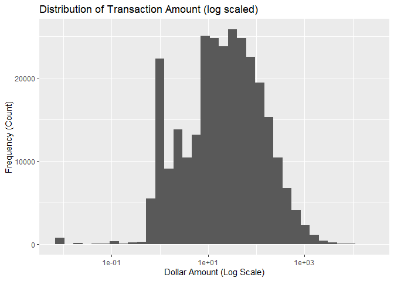
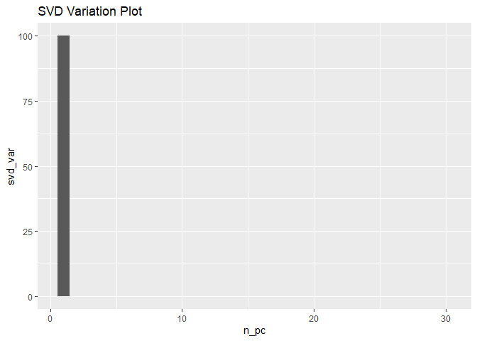

Fraud Detection
================
Akoua Orsot
August 20, 2022

# **Fraud Detection**

This notebook will attempt to build a predictive algorithm to detect a
fraudulent transaction using a training dataset. We will explain the
thinking process at every step using LIME (Local Interpretable
Model-agnostic Explanations) principles making it accessible and
user-friendly.

## Table of Contents

1.  Environment set-up

    -   Importing Libraries

    -   Loading the data

2.  Initial Diagnostics

    -   Glimpse

    -   Descriptive Statistics

    -   Target Variable Analysis

    -   Predictors Analysis

3.  Data Cleaning

    -   Missing Values

    -   Outliers

    -   Duplicate Observations

4.  Correlation Analysis

    -   Correlation Matrix

    -   Strongest relationship

5.  Inquiry Exploration

    -   How does Amount’s distribution behaves across classes?

    -   Are there any noteworthy point in time where fraud occurred?

6.  Class Imbalance

    -   SMOTE - Synthetic Minority Oversampling Technique

    -   Near-Miss Algorithm

    -   Combined Random Sampler

7.  Machine Learning set-up

    -   Train-test split

    -   Cross-validation

8.  Dimensionality Reduction

    -   PCA - Principal Component Analysis

    -   SVD - Singular Value Decomposition

    -   LDA - Linear Discriminant Analysis

9.  Machine Learning - Simple Models

    -   Logistic Regression

    -   k-Nearest Neighbors

    -   Decision Tree

    -   Stochastic Gradient Descent

10. Machine Learning - Ensemble Methods

    -   Random Forest

    -   Stochastic Gradient Boosting

    -   StackingClassifier

11. Hyperparameter Tuning

    -   Random Search

    -   Grid Search

12. Model Performance Evaluation

    -   Final Model

## 1. Environment Set-up

``` r
## Importing libraries
set.seed(1)
library(dplyr)
```

    ## 
    ## Attaching package: 'dplyr'

    ## The following objects are masked from 'package:stats':
    ## 
    ##     filter, lag

    ## The following objects are masked from 'package:base':
    ## 
    ##     intersect, setdiff, setequal, union

``` r
library(tidyverse)
```

    ## ── Attaching packages
    ## ───────────────────────────────────────
    ## tidyverse 1.3.2 ──

    ## ✔ ggplot2 3.3.6     ✔ purrr   0.3.4
    ## ✔ tibble  3.1.8     ✔ stringr 1.4.0
    ## ✔ tidyr   1.2.0     ✔ forcats 0.5.2
    ## ✔ readr   2.1.2     
    ## ── Conflicts ────────────────────────────────────────── tidyverse_conflicts() ──
    ## ✖ dplyr::filter() masks stats::filter()
    ## ✖ dplyr::lag()    masks stats::lag()

``` r
library(ggplot2)

library(ROSE)
```

    ## Loaded ROSE 0.0-4

``` r
library(corrplot)
```

    ## corrplot 0.92 loaded

``` r
library(e1071)
library(caret)
```

    ## Loading required package: lattice
    ## 
    ## Attaching package: 'caret'
    ## 
    ## The following object is masked from 'package:purrr':
    ## 
    ##     lift

``` r
library(rpart)

library(gmodels)
library(glmnet)
```

    ## Loading required package: Matrix
    ## 
    ## Attaching package: 'Matrix'
    ## 
    ## The following objects are masked from 'package:tidyr':
    ## 
    ##     expand, pack, unpack
    ## 
    ## Loaded glmnet 4.1-4

``` r
library(MLmetrics)
```

    ## 
    ## Attaching package: 'MLmetrics'
    ## 
    ## The following objects are masked from 'package:caret':
    ## 
    ##     MAE, RMSE
    ## 
    ## The following object is masked from 'package:base':
    ## 
    ##     Recall

``` r
require(MASS)
```

    ## Loading required package: MASS
    ## 
    ## Attaching package: 'MASS'
    ## 
    ## The following object is masked from 'package:dplyr':
    ## 
    ##     select

``` r
library(PRROC)
```

    ## 
    ## Attaching package: 'PRROC'
    ## 
    ## The following object is masked from 'package:ROSE':
    ## 
    ##     roc.curve

``` r
## Loading dataset
df <- read_csv(file = 'C:/Users/Graduate/Desktop/ds_proj_data/creditcard.csv')
```

    ## Rows: 284807 Columns: 31
    ## ── Column specification ────────────────────────────────────────────────────────
    ## Delimiter: ","
    ## dbl (31): Time, V1, V2, V3, V4, V5, V6, V7, V8, V9, V10, V11, V12, V13, V14,...
    ## 
    ## ℹ Use `spec()` to retrieve the full column specification for this data.
    ## ℹ Specify the column types or set `show_col_types = FALSE` to quiet this message.

## 2. Initial Diagnostics

``` r
## Glimpse of the data
df %>% head()
```

    ## # A tibble: 6 × 31
    ##    Time     V1      V2    V3     V4      V5      V6      V7      V8     V9
    ##   <dbl>  <dbl>   <dbl> <dbl>  <dbl>   <dbl>   <dbl>   <dbl>   <dbl>  <dbl>
    ## 1     0 -1.36  -0.0728 2.54   1.38  -0.338   0.462   0.240   0.0987  0.364
    ## 2     0  1.19   0.266  0.166  0.448  0.0600 -0.0824 -0.0788  0.0851 -0.255
    ## 3     1 -1.36  -1.34   1.77   0.380 -0.503   1.80    0.791   0.248  -1.51 
    ## 4     1 -0.966 -0.185  1.79  -0.863 -0.0103  1.25    0.238   0.377  -1.39 
    ## 5     2 -1.16   0.878  1.55   0.403 -0.407   0.0959  0.593  -0.271   0.818
    ## 6     2 -0.426  0.961  1.14  -0.168  0.421  -0.0297  0.476   0.260  -0.569
    ## # … with 21 more variables: V10 <dbl>, V11 <dbl>, V12 <dbl>, V13 <dbl>,
    ## #   V14 <dbl>, V15 <dbl>, V16 <dbl>, V17 <dbl>, V18 <dbl>, V19 <dbl>,
    ## #   V20 <dbl>, V21 <dbl>, V22 <dbl>, V23 <dbl>, V24 <dbl>, V25 <dbl>,
    ## #   V26 <dbl>, V27 <dbl>, V28 <dbl>, Amount <dbl>, Class <dbl>

``` r
## Descriptive Statistics
df %>% summary()
```

    ##       Time              V1                  V2                  V3          
    ##  Min.   :     0   Min.   :-56.40751   Min.   :-72.71573   Min.   :-48.3256  
    ##  1st Qu.: 54202   1st Qu.: -0.92037   1st Qu.: -0.59855   1st Qu.: -0.8904  
    ##  Median : 84692   Median :  0.01811   Median :  0.06549   Median :  0.1799  
    ##  Mean   : 94814   Mean   :  0.00000   Mean   :  0.00000   Mean   :  0.0000  
    ##  3rd Qu.:139321   3rd Qu.:  1.31564   3rd Qu.:  0.80372   3rd Qu.:  1.0272  
    ##  Max.   :172792   Max.   :  2.45493   Max.   : 22.05773   Max.   :  9.3826  
    ##        V4                 V5                   V6                 V7          
    ##  Min.   :-5.68317   Min.   :-113.74331   Min.   :-26.1605   Min.   :-43.5572  
    ##  1st Qu.:-0.84864   1st Qu.:  -0.69160   1st Qu.: -0.7683   1st Qu.: -0.5541  
    ##  Median :-0.01985   Median :  -0.05434   Median : -0.2742   Median :  0.0401  
    ##  Mean   : 0.00000   Mean   :   0.00000   Mean   :  0.0000   Mean   :  0.0000  
    ##  3rd Qu.: 0.74334   3rd Qu.:   0.61193   3rd Qu.:  0.3986   3rd Qu.:  0.5704  
    ##  Max.   :16.87534   Max.   :  34.80167   Max.   : 73.3016   Max.   :120.5895  
    ##        V8                  V9                 V10                 V11          
    ##  Min.   :-73.21672   Min.   :-13.43407   Min.   :-24.58826   Min.   :-4.79747  
    ##  1st Qu.: -0.20863   1st Qu.: -0.64310   1st Qu.: -0.53543   1st Qu.:-0.76249  
    ##  Median :  0.02236   Median : -0.05143   Median : -0.09292   Median :-0.03276  
    ##  Mean   :  0.00000   Mean   :  0.00000   Mean   :  0.00000   Mean   : 0.00000  
    ##  3rd Qu.:  0.32735   3rd Qu.:  0.59714   3rd Qu.:  0.45392   3rd Qu.: 0.73959  
    ##  Max.   : 20.00721   Max.   : 15.59500   Max.   : 23.74514   Max.   :12.01891  
    ##       V12                V13                V14                V15          
    ##  Min.   :-18.6837   Min.   :-5.79188   Min.   :-19.2143   Min.   :-4.49894  
    ##  1st Qu.: -0.4056   1st Qu.:-0.64854   1st Qu.: -0.4256   1st Qu.:-0.58288  
    ##  Median :  0.1400   Median :-0.01357   Median :  0.0506   Median : 0.04807  
    ##  Mean   :  0.0000   Mean   : 0.00000   Mean   :  0.0000   Mean   : 0.00000  
    ##  3rd Qu.:  0.6182   3rd Qu.: 0.66251   3rd Qu.:  0.4931   3rd Qu.: 0.64882  
    ##  Max.   :  7.8484   Max.   : 7.12688   Max.   : 10.5268   Max.   : 8.87774  
    ##       V16                 V17                 V18           
    ##  Min.   :-14.12985   Min.   :-25.16280   Min.   :-9.498746  
    ##  1st Qu.: -0.46804   1st Qu.: -0.48375   1st Qu.:-0.498850  
    ##  Median :  0.06641   Median : -0.06568   Median :-0.003636  
    ##  Mean   :  0.00000   Mean   :  0.00000   Mean   : 0.000000  
    ##  3rd Qu.:  0.52330   3rd Qu.:  0.39968   3rd Qu.: 0.500807  
    ##  Max.   : 17.31511   Max.   :  9.25353   Max.   : 5.041069  
    ##       V19                 V20                 V21           
    ##  Min.   :-7.213527   Min.   :-54.49772   Min.   :-34.83038  
    ##  1st Qu.:-0.456299   1st Qu.: -0.21172   1st Qu.: -0.22839  
    ##  Median : 0.003735   Median : -0.06248   Median : -0.02945  
    ##  Mean   : 0.000000   Mean   :  0.00000   Mean   :  0.00000  
    ##  3rd Qu.: 0.458949   3rd Qu.:  0.13304   3rd Qu.:  0.18638  
    ##  Max.   : 5.591971   Max.   : 39.42090   Max.   : 27.20284  
    ##       V22                  V23                 V24          
    ##  Min.   :-10.933144   Min.   :-44.80774   Min.   :-2.83663  
    ##  1st Qu.: -0.542350   1st Qu.: -0.16185   1st Qu.:-0.35459  
    ##  Median :  0.006782   Median : -0.01119   Median : 0.04098  
    ##  Mean   :  0.000000   Mean   :  0.00000   Mean   : 0.00000  
    ##  3rd Qu.:  0.528554   3rd Qu.:  0.14764   3rd Qu.: 0.43953  
    ##  Max.   : 10.503090   Max.   : 22.52841   Max.   : 4.58455  
    ##       V25                 V26                V27            
    ##  Min.   :-10.29540   Min.   :-2.60455   Min.   :-22.565679  
    ##  1st Qu.: -0.31715   1st Qu.:-0.32698   1st Qu.: -0.070840  
    ##  Median :  0.01659   Median :-0.05214   Median :  0.001342  
    ##  Mean   :  0.00000   Mean   : 0.00000   Mean   :  0.000000  
    ##  3rd Qu.:  0.35072   3rd Qu.: 0.24095   3rd Qu.:  0.091045  
    ##  Max.   :  7.51959   Max.   : 3.51735   Max.   : 31.612198  
    ##       V28                Amount             Class         
    ##  Min.   :-15.43008   Min.   :    0.00   Min.   :0.000000  
    ##  1st Qu.: -0.05296   1st Qu.:    5.60   1st Qu.:0.000000  
    ##  Median :  0.01124   Median :   22.00   Median :0.000000  
    ##  Mean   :  0.00000   Mean   :   88.35   Mean   :0.001728  
    ##  3rd Qu.:  0.07828   3rd Qu.:   77.17   3rd Qu.:0.000000  
    ##  Max.   : 33.84781   Max.   :25691.16   Max.   :1.000000

**Takeaway:** The following percentage breakdown confirms the note in
the project description; indeed, we have a considerable class imbalance
with the target variable. It stays consistent that most fraudulent
activities are much less frequent than non-fraudulent. Before
proceeding, we shall note it to avoid any overfitting issues when
fitting the machine learning models.

``` r
## Target Variable Analysis
df %>% group_by(Class) %>%
  summarise(cnt = n()) %>%
  mutate(freq = round(cnt / sum(cnt), 5)) %>% 
  arrange(desc(freq))
```

    ## # A tibble: 2 × 3
    ##   Class    cnt    freq
    ##   <dbl>  <int>   <dbl>
    ## 1     0 284315 0.998  
    ## 2     1    492 0.00173

**Note:** We did not have any information on the numerical predictors
for privacy, given their transformation and standardization, excluding
Amount & Time. In that regard, Amount presented itself as potentially
most informative for the feature variable analysis. To better understand
the variable’s distribution, we had to transform it using a log scale.

``` r
## Target Variable Analysis
df$Amount %>% summary()
```

    ##     Min.  1st Qu.   Median     Mean  3rd Qu.     Max. 
    ##     0.00     5.60    22.00    88.35    77.17 25691.16

``` r
df %>% ggplot(aes(Amount)) +
  geom_histogram(bins=35) +
  scale_x_log10() +
  labs(
  x = "Dollar Amount (Log Scale)",
  y = "Frequency (Count)",
  title= "Distribution of Transaction Amount (log scaled)"
 )
```

    ## Warning: Transformation introduced infinite values in continuous x-axis

    ## Warning: Removed 1825 rows containing non-finite values (stat_bin).

<!-- -->

## 3. Data Cleaning

``` r
## Missing Values
df %>% is.na() %>% sum()
```

    ## [1] 0

**Takeaway:** As the count shows, we have no missing values given the
pre-processing done prior.

**Note:** With most predictors transformed, there will be little chance
for any outliers in the data points for V1, V2, …, V28. So, we will only
examine Amount as the only meaningful numeric feature.

``` r
df %>% ggplot(aes(x=Amount)) +
  geom_boxplot() +
  labs(
  x = "Amount ($)",
  title= "Distribution of Transaction Amount"
 )
```

<!-- -->

**Takeaway:** From the boxplot below, we can observe a non-negligible
number of outliers on the upper end of the distribution. It would denote
transactions with high amounts in the order of thousands of dollars. We
would assess the effect of this skewed distribution when building the
predictive models in terms of feature transformation or selecting models
robust to such feature types.

``` r
df %>% duplicated() %>% sum()
```

    ## [1] 1081

**Takeaway:** A quick check reveals 1081 duplicate rows, so we proceed
in removing them from the dataset.

``` r
df <- df[!duplicated(df), ]
```

**Definition:** Feature Engineering

``` r
df$Amount <- scale(df$Amount)
```

## 4. Correlation Analysis

``` r
df_cor <- cor(df)
corrplot(df_cor, method = 'color')
```

<!-- -->

**Takeaway:** From the correlation matrix plotted, we can observe very
few correlated variables as we would expect after the feature
transformation. The two meaningful features, are Time and Amount, have
some relative correlation with some variables with coefficients
approximating 0.4. With such low values, it would be pretty challenging
to imply a correlation between any of them with any certainty. It also
indicates that there would be a very low incidence of any colinearity
within our data

**Note:** The code below filters those pairs with correlation
coefficients above 0.5 as a threshold. As noted above, those values give
very little to no confidence in any solid correlated relationship
between variables as few crossing the 0.5 mark.

``` r
df_cor <- as.data.frame(df_cor)
df_cor[(abs(df_cor) >= 0.5) & (abs(df_cor) !=1)]
```

    ## [1] -0.533428 -0.533428

## 5. Inquiry Exploration

**Note:** In an attempt to answer the first question, we first split our
dataset by class types; in other words, fraudulent and non-fraudulent
transactions. We then plot the histogram side by side to observe any
unusual behavior. In doing so, the non-fraud transactions were heavily
right-skewed, making it quite challenging to compare the plots. To solve
this issue, we used a logarithmic transformation, making it easier to
see and thus, evaluate any similarities and differences.

``` r
# How does Amount's distribution behaves across classes?

# Splitting data by fraud class
df_no_fraud <- df %>% filter(Class == 0)
df_fraud <- df %>% filter(Class == 1)

# Histogram for Amount Distribution per class
df_no_fraud %>% ggplot(aes(x=Amount)) +
  geom_histogram(color="black", fill="white", bins=100) +
  labs(
  x = "Scaled Amount",
  title= "Distribution of Non-Fraud Transactions"
 )
```

<!-- -->

``` r
df_fraud %>% ggplot(aes(x=Amount)) +
  geom_histogram(color="black", fill="white", bins=50) +
  labs(
  x = "Scaled Amount",
  title= "Distribution of Fraud Transactions"
 )
```

<!-- -->

**Takeaway:** Before making a note on the plots, we will first explain
how to interpret logarithmic scales. In short, log scales show relative
values rather than absolute ones. Indeed, 2 minus 1 would be displayed
similarly to 9999 minus 9998, given that we are dealing with percentages
here. In context, the histograms below would depict the order of growth
of transaction value. Both distributions represent a similar trajectory,
with most transactions on the lower end of the graph. It stays
consistent with the mean value found at USD88, even with max values
averaging USD20,000.

**Note:** For the second question, we will check the timing of
transactions to detect anything unusual. We will use only the fraud
dataset and plot a scatterplot accordingly.

``` r
## Are there any noteworthy point in time where fraud occured?
# Scatterplot
df_fraud %>% ggplot(aes(x=Time, y=Amount)) +
  geom_point() +
  labs(
  y = "Amount ($)", 
  x = "Time (s)",
  title= "Fraudulent Transactions Across Time"
 )
```

<!-- -->

**Takeaway:** The graph above does not appear that there is a clustering
pattern on a time interval. So, we would assume that fraud occurred
across time quite randomly.

## 6. Class Imbalance

**Note:** Our diagnostics observed a stark imbalance between classes of
transactions, with fraud only making up 0.2% of all transaction
statuses. Given the limited pool of examples to train, it poses an issue
in terms of building an effective machine model to predict if there is a
fraud. With the minority class being so small, we would expect poor
performance on the critical task of detecting fraud transactions. In
that vein, we will use different sampling methods (Undersampling &
Oversampling) to tackle this problem.

**Definition:** SMOTE (Synthetic Minority Oversampling Technique) is an
oversampling approach to the minority class. In context, it would mean
to randomly increase fraud examples by “artificially” replicating to
have a more balanced class distribution. Further information
[here](https://rikunert.com/smote_explained).

``` r
## now using ROSE for oversampling
ROSE_over <- ovun.sample(Class ~., data=df,
                                  p=0.5, seed=1,
                                  method="over")
```

``` r
data_balanced_over <- ROSE_over$data

## Check class distribution after using SMOTE
data_balanced_over %>% group_by(Class) %>%
  summarise(cnt = n()) %>%
  mutate(freq = round(cnt / sum(cnt), 5)) %>% 
  arrange(desc(freq))
```

    ## # A tibble: 2 × 3
    ##   Class    cnt  freq
    ##   <dbl>  <int> <dbl>
    ## 1     1 283545 0.500
    ## 2     0 283253 0.500

**Definition:** We proceed to an undersampling approach on the majority
class. In context, we select examples to keep out of the training set
based on the distance of majority class examples to minority class
examples.

``` r
## now using ROSE for oversampling
ROSE_under <- ovun.sample(Class ~., data=df,
                                  p=0.5, seed=1,
                                  method="under")

data_balanced_under <- ROSE_under$data
```

``` r
## Check class distribution after using SMOTE
data_balanced_under %>% group_by(Class) %>%
  summarise(cnt = n()) %>%
  mutate(freq = round(cnt / sum(cnt), 5)) %>% 
  arrange(desc(freq))
```

    ## # A tibble: 2 × 3
    ##   Class   cnt  freq
    ##   <dbl> <int> <dbl>
    ## 1     1   473 0.510
    ## 2     0   455 0.490

**Note:** With the risk of overfitting with oversampling and the
possibility of losing valuable information from undersampling, we
understand that we cannot have a perfect solution to this class
imbalance problem. In that vein, we shall proceed with the oversampling
approach by building robust models to avoid overfitting.

``` r
df <- data_balanced_over
```

## 7. Machine Learning set-up

Under this section, we will explain the procedure of two main splitting
approach to estimate our models’ performance.

**Definition**: Often denoted as the most popular by its simplicity, the
train-test split is a sampling technique dividing the dataset between
training and testing sets. In doing so, the goal would be to have enough
(but not too much) in our training set used for the machine learning
model to predict the observations in the testing set as accurately as
possible. Most would opt for a 70/30 training-testing split,
respectively, others 80/20, 60/40, or whichever else works best for the
case scenario. Further information \[here\]

``` r
# Setting Target Variable to categorical
df$Class <- as.factor(df$Class)
```

``` r
## Training Testing Split
N <- nrow(df)
trainingSize  <- round(N*0.7)
trainingCases <- sample(N, trainingSize)
train <- df[trainingCases,]
test <- df[-trainingCases,]
```

``` r
# Building tree model
tree <- rpart(Class ~ ., data = train, method = "class")

# Making predictions
pred <- predict(tree, train, type="class")
obs <- train$Class
acc <- 1-sum(pred != obs)/nrow(train)
acc
```

    ## [1] 0.9346606

**Definition:** As the name would suggest, we will engage here in the
process of validation to ensure reliability on our model.
Cross-Validation is a statistical method applied in various ways to
estimate the model’s performance. Some examples are Holdout Method,
K-Fold, Stratified K-Fold, Leave-P-Out. Further information \[here\] and
\[here\]

**Note:** As we already tackled the issue of class imbalance with a
combination of under- and over-sampling, we will use the K-Fold
cross-validation

``` r
# K-fold cross-validation 
# Building tree model
tree_cv <- rpart(Class ~ ., data = train,
              method = "class", control = rpart.control(xval=5))
plotcp(tree_cv)
```

<!-- -->

## 8. Dimensionality Reduction

This section will use dimensionality reduction to trim down the number
of features we have. Dimensionality reduction encapsulates the
techniques reducing the input variables in our training data. In doing
so, we hope to have a more straightforward but effective machine
learning model structure and avoid any potential case of overfitting. We
will be testing three different methods from Linear Algebra: PCA, SVD,
and LDA and pick the one capturing the most variability in the datasets
after reducing it to principal components. We performed the evaluation
and comparison process using the following \[code\] from Janpu Hou on
their RPubs blogs.

``` r
# Separating features from target variable
X <- subset(df, select = -c(Class))
```

``` r
# Function to check Variance explained
pcaCharts <- function(x) {
    x.var <- x$sdev ^ 2
    x.pvar <- x.var/sum(x.var)
    print("proportions of variance:")
    print(x.pvar)
    
    par(mfrow=c(2,2))
    plot(x.pvar,
         xlab="Principal component", 
         ylab="Proportion of variance explained", 
         ylim=c(0,1), type='b')
    plot(cumsum(x.pvar),
         xlab="Principal component", 
         ylab="Cumulative Proportion of variance explained", 
         ylim=c(0,1), type='b')
    screeplot(x)
    screeplot(x,type="l")
    par(mfrow=c(1,1))
}
```

**Definition:** PCA (Principal Component Analysis) takes data with
m-columns projected to a subspace with n-features (n m) while preserving
the crucial information from the original data; in other words, PCA
attempts to find the principal components (or features) as its names
denote. Further information \[here\]

``` r
pca <- prcomp(X, scale. = TRUE)
# pcaCharts(pca)

# Calculate Explained Variance
pca_var <- round((pca$sdev^2)/sum(pca$sdev^2) * 100, 1) 
n_pc <- seq(1, length(pca_var))
pca_df <- as.data.frame(pca_var, n_pc)
```

    ## Warning in as.data.frame.numeric(pca_var, n_pc): 'row.names' is not a character
    ## vector of length 30 -- omitting it. Will be an error!

``` r
# Graph of explained variance
pca_df %>% 
  ggplot(aes(x = n_pc, y = pca_var)) +
    geom_bar(stat = 'identity') +
    labs(title = "PCA Variation Plot",
         xlab = "PCs",
         ylab = "Prop. of variance explained",
         ylim = c(0, 100))
```

<!-- -->

**Takeaway:** Beyond 5, there is very little improvement in the
explained variance for the PCA.

**Definition:** SVD (Singular Value Decomposition) is a process breaking
down a matrix into its constituents elements by factorizing it into
three separate matrices: M=UΣVᵗ.

M: original matrix

U: left singular matrix (columns are left singular vectors) containing
eigenvectors of matrix MMᵗ

Σ: a diagonal matrix containing singular (eigen)values

V: right singular matrix (columns are right singular vectors) containing
eigenvectors of matrix MᵗM.

Further information \[here\]

``` r
svd <- svd(X)

# Calculate Explained Variance
svd_var <- round(svd$d^2/sum(svd$d^2) * 100, 4) 
n_pc <- seq(1, length(svd_var))
svd_df <- as.data.frame(svd_var, n_pc)
```

    ## Warning in as.data.frame.numeric(svd_var, n_pc): 'row.names' is not a character
    ## vector of length 30 -- omitting it. Will be an error!

``` r
# Graph of explained variance
svd_df %>% 
  ggplot(aes(x = n_pc, y = svd_var)) +
    geom_bar(stat = 'identity') +
    labs(title = "SVD Variation Plot",
         xlab = "PCs",
         ylab = "Prop. of variance explained",
         ylim = c(0, 100))
```

<!-- -->

**Takeaway:** Beyond 5 principal components, there is very little
improvement in the explained variance for PCA while the first column
explained the majority of the variance using SVD. We will move forward
with the reduced dataframe from PCA proving more stable.

``` r
# Consolodiating PCA transformed dataframe
X_pca <- as.data.frame(pca$x[, 1:5])
y <- subset(df, select = c(Class))
df_pca <- cbind(X_pca, y)
```

``` r
# Partitioning train-test split
index <- createDataPartition(y = df_pca$Class, p = .7, 
                             times = 1, list = FALSE)
train <- df_pca[index,]
test  <- df_pca[-index,]
```

``` r
# K-fold cross validation
kfold_cv <- trainControl(method = "cv",  number = 3, 
                        savePredictions = T)
```

## 9. Machine Learning - Simple Models

This section will leverage the powerful sci-kit-learn package to build
multiple models with little to no parameter tuning for comparison. We
will only use the cross-validation error on our training dataset to
avoid any data leakage.

**Definition:** Logistic Regression is a predictive classifier that
models an S-shaped curve (Sigmoid function) on the data to label the
examples. Further information \[here\]

``` r
logreg_model <- train(form=Class~., data = train,
               method="glm", family="binomial",
               trControl=kfold_cv, tuneLength=3)
```

    ## Warning: glm.fit: fitted probabilities numerically 0 or 1 occurred

``` r
preds <- predict(logreg_model, train, type="prob")[,2] #prob of positive class
preds_pos <- preds[train[,6]==1] #preds for true positive class
preds_neg <- preds[train[,6]==0] #preds for true negative class

PRC <- pr.curve(preds_pos, preds_neg, curve=TRUE)
plot(PRC)
```

<!-- -->

**Definition:** A Decision Tree is a supervised machine learning
algorithm building an actual tree based on splits within the data
\[here\]

``` r
tree_model <- train(form=Class~., data = train,
               method="rpart", 
               trControl=kfold_cv, tuneLength=3)
preds <- predict(tree_model, train, type="prob")[,2] #prob of positive class
preds_pos <- preds[train[,6]==1] #preds for true positive class
preds_neg <- preds[train[,6]==0] #preds for true negative class

PRC <- pr.curve(preds_pos, preds_neg, curve=TRUE)
plot(PRC)
```

<!-- -->

**Takeaway:** Our best model is the Logistic regression at 96.3% AUPRC.

## 10. Model Performance Evaluation

This section will build on everything we’ve done throughout this
notebook and evaluate the best model using AUPRC.

**Definition:** AUPRC (Area Under the Precision-Recall Curve) focuses on
finding the positive examples; in other words, the fraudulent
transactions in our case. Further information
[here](https://glassboxmedicine.com/2019/03/02/measuring-performance-auprc/).

``` r
logreg_model <- train(form=Class~., data = train,
               method="glm", family="binomial",
               trControl=kfold_cv, tuneLength=3)
```

    ## Warning: glm.fit: fitted probabilities numerically 0 or 1 occurred

``` r
preds <- predict(logreg_model, test, type="prob")[,2] #prob of positive class
preds_pos <- preds[test[,6]==1] #preds for true positive class
preds_neg <- preds[test[,6]==0] #preds for true negative class

PRC <- pr.curve(preds_pos, preds_neg, curve=TRUE)
plot(PRC)
```

<!-- -->

**Conclusion:** Given its simple implementation and recurrent high
performance, we will present the Logistic Regression as our final model.
