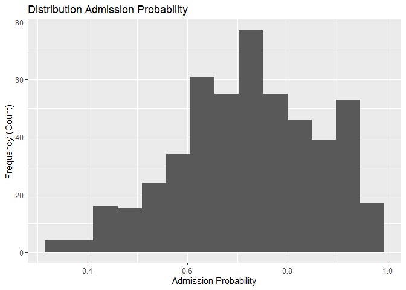
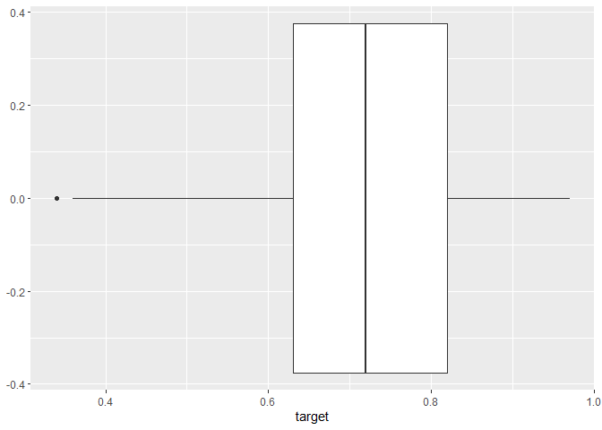

Graduate Admission
================
Akoua Orsot
September 2nd, 2022

# Graduate Admission

In the course of a career, there arise multiple learning and
professional opportunities like a Master’s degree which often present
itself as a fairly competitive race to the best universities and
colleges around the world. Still, there are certain traits
distinguishing applicants in the eye of admission offices. So, this
notebook will attempt to build a predictive algorithm to determine
chances of admissions (scale 0 to 1) given a set of variables. In doing
so, we will follow LIME (Local Interpretable Model-agnostic
Explanations) principles making it accessible and user-friendly to most
readers.

## Table of Contents

1.  Environment set-up

    -   Importing Libraries

    -   Loading the data

2.  Initial Diagnostics

    -   Glimpse

    -   Descriptive Statistics

    -   Target Variable Analysis

    -   Predictors Analysis

3.  Data Processing

    -   Drop & Rename

    -   Missing Values

    -   Outliers

    -   Duplicate Observations

    -   Correlation Matrix

4.  Exploratory Data Analysis (EDA)

    -   What is the distribution of our continuous predictors?

    -   Is there a cluster of admitted (prob \>= 0.75) and non-admitted
        by GRE & TOEFL Scores?

    -   How does the Undergrad GPA affect Masters Program Admissions
        given research experience?

    -   Would the undergraduate’s college/university strengthen
        application statements and recommendations?

5.  Feature Engineering

    -   Categorical Encoding

    -   Variable Standardization

6.  Machine Learning set-up

    -   Train-test split

    -   Cross-validation

7.  Machine Learning - Simple Models

    -   Logistic Regression

    -   k-Nearest Neighbors

    -   Decision Tree

    -   Stochastic Gradient Descent

8.  Machine Learning - Ensemble Methods

    -   Random Forest

    -   Stochastic Gradient Boosting

    -   StackingRegressor

9.  Trained Model Performance Evaluation

10. Hyperparameter Tuning

11. Final Model - Test Data Performance

## 1. Environment Set-up

``` r
## Importing libraries
set.seed(1)
library(dplyr)
```

    ## 
    ## Attaching package: 'dplyr'

    ## The following objects are masked from 'package:stats':
    ## 
    ##     filter, lag

    ## The following objects are masked from 'package:base':
    ## 
    ##     intersect, setdiff, setequal, union

``` r
library(tidyverse)
```

    ## ── Attaching packages
    ## ───────────────────────────────────────
    ## tidyverse 1.3.2 ──

    ## ✔ ggplot2 3.3.6     ✔ purrr   0.3.4
    ## ✔ tibble  3.1.8     ✔ stringr 1.4.0
    ## ✔ tidyr   1.2.0     ✔ forcats 0.5.2
    ## ✔ readr   2.1.2     
    ## ── Conflicts ────────────────────────────────────────── tidyverse_conflicts() ──
    ## ✖ dplyr::filter() masks stats::filter()
    ## ✖ dplyr::lag()    masks stats::lag()

``` r
library(ggplot2)

library(ROSE)
```

    ## Loaded ROSE 0.0-4

``` r
library(corrplot)
```

    ## corrplot 0.92 loaded

``` r
library(e1071)
library(caret)
```

    ## Loading required package: lattice
    ## 
    ## Attaching package: 'caret'
    ## 
    ## The following object is masked from 'package:purrr':
    ## 
    ##     lift

``` r
library(rpart)

library(gmodels)
library(glmnet)
```

    ## Loading required package: Matrix
    ## 
    ## Attaching package: 'Matrix'
    ## 
    ## The following objects are masked from 'package:tidyr':
    ## 
    ##     expand, pack, unpack
    ## 
    ## Loaded glmnet 4.1-4

``` r
library(MLmetrics)
```

    ## 
    ## Attaching package: 'MLmetrics'
    ## 
    ## The following objects are masked from 'package:caret':
    ## 
    ##     MAE, RMSE
    ## 
    ## The following object is masked from 'package:base':
    ## 
    ##     Recall

``` r
require(MASS)
```

    ## Loading required package: MASS
    ## 
    ## Attaching package: 'MASS'
    ## 
    ## The following object is masked from 'package:dplyr':
    ## 
    ##     select

``` r
library(PRROC)
```

    ## 
    ## Attaching package: 'PRROC'
    ## 
    ## The following object is masked from 'package:ROSE':
    ## 
    ##     roc.curve

``` r
## Loading dataset
df <- read.csv(file = 'C:/Users/Graduate/Desktop/ds_proj_data/Admission_Predict_Ver1.1.csv')
```

## 2. Initial Diagnostics

``` r
## Glimpse of the data
df %>% head()
```

    ##   Serial.No. GRE.Score TOEFL.Score University.Rating SOP LOR CGPA Research
    ## 1          1       337         118                 4 4.5 4.5 9.65        1
    ## 2          2       324         107                 4 4.0 4.5 8.87        1
    ## 3          3       316         104                 3 3.0 3.5 8.00        1
    ## 4          4       322         110                 3 3.5 2.5 8.67        1
    ## 5          5       314         103                 2 2.0 3.0 8.21        0
    ## 6          6       330         115                 5 4.5 3.0 9.34        1
    ##   Chance.of.Admit
    ## 1            0.92
    ## 2            0.76
    ## 3            0.72
    ## 4            0.80
    ## 5            0.65
    ## 6            0.90

**Note:** The dataset contains several parameters which are considered
important during the application for Masters Programs. The parameters
included are :

-   GRE Scores ( out of 340 )

-   TOEFL Scores ( out of 120 )

-   University Rating ( out of 5 )

-   Statement of Purpose and Letter of Recommendation Strength ( out of
    5 )

-   Undergraduate GPA ( out of 10 )

-   Research Experience ( either 0 or 1 )

-   Chance of Admit ( ranging from 0 to 1 )

``` r
## Descriptive Statistics
df %>% summary()
```

    ##    Serial.No.      GRE.Score      TOEFL.Score    University.Rating
    ##  Min.   :  1.0   Min.   :290.0   Min.   : 92.0   Min.   :1.000    
    ##  1st Qu.:125.8   1st Qu.:308.0   1st Qu.:103.0   1st Qu.:2.000    
    ##  Median :250.5   Median :317.0   Median :107.0   Median :3.000    
    ##  Mean   :250.5   Mean   :316.5   Mean   :107.2   Mean   :3.114    
    ##  3rd Qu.:375.2   3rd Qu.:325.0   3rd Qu.:112.0   3rd Qu.:4.000    
    ##  Max.   :500.0   Max.   :340.0   Max.   :120.0   Max.   :5.000    
    ##       SOP             LOR             CGPA          Research   
    ##  Min.   :1.000   Min.   :1.000   Min.   :6.800   Min.   :0.00  
    ##  1st Qu.:2.500   1st Qu.:3.000   1st Qu.:8.127   1st Qu.:0.00  
    ##  Median :3.500   Median :3.500   Median :8.560   Median :1.00  
    ##  Mean   :3.374   Mean   :3.484   Mean   :8.576   Mean   :0.56  
    ##  3rd Qu.:4.000   3rd Qu.:4.000   3rd Qu.:9.040   3rd Qu.:1.00  
    ##  Max.   :5.000   Max.   :5.000   Max.   :9.920   Max.   :1.00  
    ##  Chance.of.Admit 
    ##  Min.   :0.3400  
    ##  1st Qu.:0.6300  
    ##  Median :0.7200  
    ##  Mean   :0.7217  
    ##  3rd Qu.:0.8200  
    ##  Max.   :0.9700

``` r
# Target Variable Analysis
df %>% ggplot(aes(Chance.of.Admit)) +
  geom_histogram(bins=14) +
  labs(
  x = "Admission Probability",
  y = "Frequency (Count)",
  title= "Distribution Admission Probability"
 )
```

<!-- -->

**Takeaway:** We have here a left-skewed distribution of admission
chances among the pool of candidates. With most people sitting in the
range of 0.6 to 0.8, we can assume that those students demonstrated
comopentency in the various test scores and undergraduate studies.

## 3. Data Cleaning

**Note:** Before anything, we will proceed in dropping the Serial
No. column and renaming some columns to retain ease of data
manipulation.

``` r
df <- df %>% 
        dplyr::select(-c(Serial.No.)) %>% 
        rename("target"="Chance.of.Admit") 
```

``` r
## Missing Values
df %>% is.na() %>% sum()
```

    ## [1] 0

``` r
df %>% ggplot(aes(x=target)) +
  geom_boxplot()
```

<!-- -->

``` r
# Z score to identify outliers  
target <- df$target
z_scores_target <- abs((target-mean(target))/sd(target))

#display z-scores 
z_scores_target[z_scores_target >= 2.5]
```

    ## [1] 2.562980 2.704683 2.562980 2.704683

**Takeaway:** From a visual standpoint, the boxplot only shows one clear
outlier on the lower end of the distribution. However, when conducting
the z-score calculation at ±2.5 away from the σ, we detected 4 outliers.

**Note:** Now, we will proceed in doing the same thing with each
continuous independent variable

``` r
#find z-scores of each column
all_zscores <- sapply(df, function(df) abs((df-mean(df))/sd(df)))

all_zscores[all_zscores >= 2.5]
```

    ## [1] 2.684101 2.937173 2.562980 2.704683 2.562980 2.704683

**Takeaway:** As we thought about handling those outliers, we decided to
keep them all since ggood data science practices advocates to conserve
as many data points as possible. Thus, allowing us to limit the biases
simply to produce a better fitting model or statistically significant
results.

# 4. Exploratory Data Analysis

### What is the distribution of our target variable?

**Takeaway:** We have here a left-skewed distribution of admission
chances among the pool of candidates. With most people sitting in the
range of 0.6 to 0.8, we can assume that those students demonstrated
comopentency in the various test scores and undergraduate studies.

### What is the distribution of our continuous predictors?

**Takeaway:** In the chart above, we can observe a fairly normal
distrbution across all three variables thus, reassuring us of the
normality withing our data.

### Is there a cluster of admitted (prob \>= 0.75) and non-admitted by GRE & TOEFL Scores?

### How does the Undergrad GPA affect Masters Program Admissions given research experience?

**Takeaway:** With the multiplot shown of admissiong probability with
respect to College GPA, there appreaws to be a strong correlated
relationship. Though they are not as clearly seperated, the clusters of
those with higher results and research experience stands a better chance
of admission compared to their counterparts with no research experince
and average to low GPA.

### Would the undergrad’s college/university strenghten application statements and recommendations?

**Takeaway:** In contrast to the clear seperation above, the university
rating does not have a drastic effect on those predictors. It would
indicates how much weight this variable has in the final decision
process.
