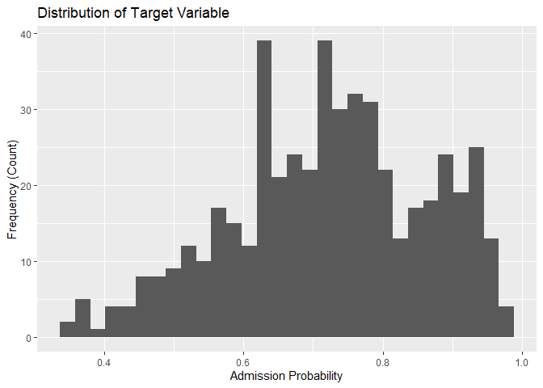
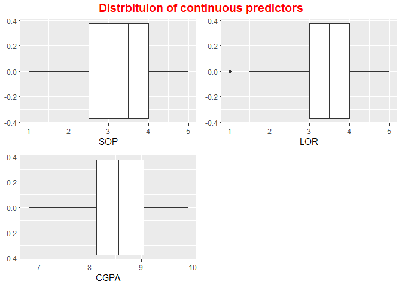
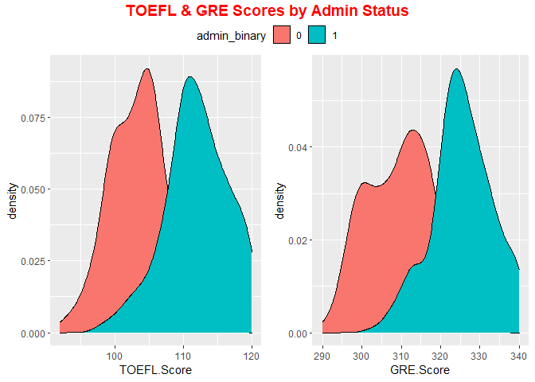
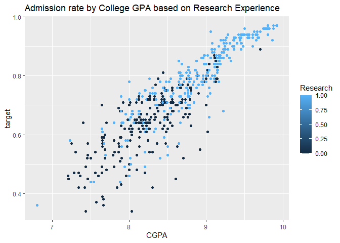
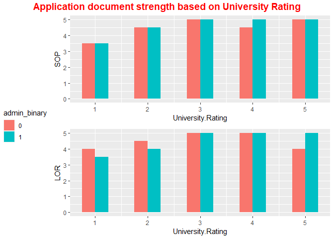

Graduate Admission
================
Akoua Orsot
September 2nd, 2022

# Graduate Admission

In the course of a career, there arise multiple learning and
professional opportunities like a Master’s degree which often present
itself as a fairly competitive race to the best universities and
colleges around the world. Still, there are certain traits
distinguishing applicants in the eye of admission offices. So, this
notebook will attempt to build a predictive algorithm to determine
chances of admissions (scale 0 to 1) given a set of variables. In doing
so, we will follow LIME (Local Interpretable Model-agnostic
Explanations) principles making it accessible and user-friendly to most
readers.

## Table of Contents

1.  Environment set-up

    -   Importing Libraries

    -   Loading the data

2.  Initial Diagnostics

    -   Glimpse

    -   Descriptive Statistics

    -   Target Variable Analysis

    -   Predictors Analysis

3.  Data Processing

    -   Drop & Rename

    -   Missing Values

    -   Outliers

    -   Duplicate Observations

    -   Correlation Matrix

4.  Exploratory Data Analysis (EDA)

    -   What is the distribution of our continuous predictors?

    -   Is there a cluster of admitted (prob \>= 0.75) and non-admitted
        by GRE & TOEFL Scores?

    -   How does the Undergrad GPA affect Masters Program Admissions
        given research experience?

    -   Would the undergraduate’s college/university strengthen
        application statements and recommendations?

5.  Feature Engineering

    -   Categorical Encoding

    -   Variable Standardization

6.  Machine Learning set-up

    -   Train-test split

    -   Cross-validation

7.  Machine Learning - Simple Models

    -   Logistic Regression

    -   k-Nearest Neighbors

    -   Decision Tree

    -   Stochastic Gradient Descent

8.  Machine Learning - Ensemble Methods

    -   Random Forest

    -   Stochastic Gradient Boosting

    -   StackingRegressor

9.  Trained Model Performance Evaluation

10. Hyperparameter Tuning

11. Final Model - Test Data Performance

## 1. Environment Set-up

``` r
## Importing libraries
set.seed(1)
library(dplyr)
```

    ## 
    ## Attaching package: 'dplyr'

    ## The following objects are masked from 'package:stats':
    ## 
    ##     filter, lag

    ## The following objects are masked from 'package:base':
    ## 
    ##     intersect, setdiff, setequal, union

``` r
library(tidyverse)
```

    ## ── Attaching packages
    ## ───────────────────────────────────────
    ## tidyverse 1.3.2 ──

    ## ✔ ggplot2 3.3.6     ✔ purrr   0.3.4
    ## ✔ tibble  3.1.8     ✔ stringr 1.4.0
    ## ✔ tidyr   1.2.0     ✔ forcats 0.5.2
    ## ✔ readr   2.1.2     
    ## ── Conflicts ────────────────────────────────────────── tidyverse_conflicts() ──
    ## ✖ dplyr::filter() masks stats::filter()
    ## ✖ dplyr::lag()    masks stats::lag()

``` r
library(ggplot2)
library(ggpubr)

library(ROSE)
```

    ## Loaded ROSE 0.0-4

``` r
library(corrplot)
```

    ## corrplot 0.92 loaded

``` r
library(e1071)
library(caret)
```

    ## Loading required package: lattice
    ## 
    ## Attaching package: 'caret'
    ## 
    ## The following object is masked from 'package:purrr':
    ## 
    ##     lift

``` r
library(tibble)
```

``` r
## Loading dataset
df <- read.csv(file = 'C:/Users/Graduate/Desktop/ds_proj_data/Admission_Predict_Ver1.1.csv')
```

## 2. Initial Diagnostics

``` r
## Glimpse of the data
df %>% head()
```

    ##   Serial.No. GRE.Score TOEFL.Score University.Rating SOP LOR CGPA Research
    ## 1          1       337         118                 4 4.5 4.5 9.65        1
    ## 2          2       324         107                 4 4.0 4.5 8.87        1
    ## 3          3       316         104                 3 3.0 3.5 8.00        1
    ## 4          4       322         110                 3 3.5 2.5 8.67        1
    ## 5          5       314         103                 2 2.0 3.0 8.21        0
    ## 6          6       330         115                 5 4.5 3.0 9.34        1
    ##   Chance.of.Admit
    ## 1            0.92
    ## 2            0.76
    ## 3            0.72
    ## 4            0.80
    ## 5            0.65
    ## 6            0.90

**Note:** The dataset contains several parameters which are considered
important during the application for Masters Programs. The parameters
included are :

-   GRE Scores ( out of 340 )

-   TOEFL Scores ( out of 120 )

-   University Rating ( out of 5 )

-   Statement of Purpose and Letter of Recommendation Strength ( out of
    5 )

-   Undergraduate GPA ( out of 10 )

-   Research Experience ( either 0 or 1 )

-   Chance of Admit ( ranging from 0 to 1 )

``` r
## Descriptive Statistics
df %>% summary()
```

    ##    Serial.No.      GRE.Score      TOEFL.Score    University.Rating
    ##  Min.   :  1.0   Min.   :290.0   Min.   : 92.0   Min.   :1.000    
    ##  1st Qu.:125.8   1st Qu.:308.0   1st Qu.:103.0   1st Qu.:2.000    
    ##  Median :250.5   Median :317.0   Median :107.0   Median :3.000    
    ##  Mean   :250.5   Mean   :316.5   Mean   :107.2   Mean   :3.114    
    ##  3rd Qu.:375.2   3rd Qu.:325.0   3rd Qu.:112.0   3rd Qu.:4.000    
    ##  Max.   :500.0   Max.   :340.0   Max.   :120.0   Max.   :5.000    
    ##       SOP             LOR             CGPA          Research   
    ##  Min.   :1.000   Min.   :1.000   Min.   :6.800   Min.   :0.00  
    ##  1st Qu.:2.500   1st Qu.:3.000   1st Qu.:8.127   1st Qu.:0.00  
    ##  Median :3.500   Median :3.500   Median :8.560   Median :1.00  
    ##  Mean   :3.374   Mean   :3.484   Mean   :8.576   Mean   :0.56  
    ##  3rd Qu.:4.000   3rd Qu.:4.000   3rd Qu.:9.040   3rd Qu.:1.00  
    ##  Max.   :5.000   Max.   :5.000   Max.   :9.920   Max.   :1.00  
    ##  Chance.of.Admit 
    ##  Min.   :0.3400  
    ##  1st Qu.:0.6300  
    ##  Median :0.7200  
    ##  Mean   :0.7217  
    ##  3rd Qu.:0.8200  
    ##  Max.   :0.9700

``` r
# Target Variable Analysis
df %>% ggplot(aes(Chance.of.Admit)) +
  geom_histogram(bins=14) +
  labs(
  x = "Admission Probability",
  y = "Frequency (Count)",
  title= "Distribution Admission Probability"
 )
```

<!-- -->

**Takeaway:** We have here a left-skewed distribution of admission
chances among the pool of candidates. With most people sitting in the
range of 0.6 to 0.8, we can assume that those students demonstrated
comopentency in the various test scores and undergraduate studies.

## 3. Data Cleaning

**Note:** Before anything, we will proceed in dropping the Serial
No. column and renaming some columns to retain ease of data
manipulation.

``` r
df <- df %>% 
        dplyr::select(-c(Serial.No.)) %>% 
        rename("target"="Chance.of.Admit") 
```

``` r
## Missing Values
df %>% is.na() %>% sum()
```

    ## [1] 0

``` r
df %>% ggplot(aes(x=target)) +
  geom_boxplot()
```

<!-- -->

``` r
# Z score to identify outliers  
target <- df$target
z_scores_target <- abs((target-mean(target))/sd(target))

#display z-scores 
z_scores_target[z_scores_target >= 2.5]
```

    ## [1] 2.562980 2.704683 2.562980 2.704683

**Takeaway:** From a visual standpoint, the boxplot only shows one clear
outlier on the lower end of the distribution. However, when conducting
the z-score calculation at ±2.5 away from the σ, we detected 4 outliers.

**Note:** Now, we will proceed in doing the same thing with each
continuous independent variable

``` r
#find z-scores of each column
all_zscores <- sapply(df, function(df) abs((df-mean(df))/sd(df)))

all_zscores[all_zscores >= 2.5]
```

    ## [1] 2.684101 2.937173 2.562980 2.704683 2.562980 2.704683

**Takeaway:** As we thought about handling those outliers, we decided to
keep them all since good data science practices advocates to conserve as
many data points as possible. Thus, allowing us to limit the biases
simply to produce a better fitting model or statistically significant
results.

## 4. Exploratory Data Analysis

### a) What is the distribution of our target variable?

``` r
df %>% ggplot(aes(x=target)) +
  geom_histogram() +
  xlab("Admission Probability") +
  ylab("Frequency (Count)") +
  labs(title="Distribution of Target Variable")
```

    ## `stat_bin()` using `bins = 30`. Pick better value with `binwidth`.

<!-- -->

**Takeaway:** We have here a left-skewed distribution of admission
chances among the pool of candidates. With most people sitting in the
range of 0.6 to 0.8, we can assume that those students demonstrated
competency in the various test scores and undergraduate studies.

### b) What is the distribution of our continuous predictors?

``` r
sop_plot <- df %>% ggplot(aes(SOP)) +
                   geom_boxplot()

lor_plot <- df %>% ggplot(aes(LOR)) +
                   geom_boxplot()

cgpa_plot <- df %>% ggplot(aes(CGPA)) +
                   geom_boxplot()

comb_plot <- ggarrange(sop_plot, lor_plot, cgpa_plot, 
                       ncol = 2, nrow = 2)

annotate_figure(comb_plot, 
                top = text_grob("Distrbituion of continuous predictors", 
               color = "red", face = "bold", size = 14))
```

<!-- -->

**Takeaway:** In the chart above, we can observe a fairly normal
distribution across all three variables thus, reassuring us of the
normality withing our data.

### c) Is there a cluster of admitted (prob \>= 0.75) and non-admitted by GRE & TOEFL Scores?

``` r
# Making a categorical target varibale using a threshold
df['admin_binary'] <- as.factor(ifelse(target >= 0.75, 1, 0))

# Ploting the TOEFL & GRE Scores accordingly
toefl_hist <- df %>% ggplot(aes(x=TOEFL.Score, fill=admin_binary)) +
                     geom_density()

gre_hist <- df %>% ggplot(aes(x=GRE.Score, fill=admin_binary)) +
                     geom_density()

comb_plot <- ggarrange(toefl_hist, gre_hist, common.legend = TRUE,
                       ncol = 2, nrow = 1)

annotate_figure(comb_plot, 
                top = text_grob("TOEFL & GRE Scores by Admin Status", 
               color = "red", face = "bold", size = 14))
```

<!-- -->

### d) How does the Undergrad GPA affect Masters Program Admissions given research experience?

``` r
df %>% ggplot(aes(x=CGPA, y=target, color=Research)) +
  geom_point() +
  labs(title="Admission rate by College GPA based on Research Experience")
```

<!-- -->

**Takeaway:** With the multi-plot shown of admission probability with
respect to College GPA, there appearss to be a strong correlated
relationship. Though they are not as clearly separated, the clusters of
those with higher results and research experience stands a better chance
of admission compared to their counterparts with no research experience
and average to low GPA.

### e) Would the undergraduate’s college/university strengthen application statements and recommendations?

``` r
sop_bar <- df %>% ggplot(aes(x=University.Rating, y=SOP, fill=admin_binary)) +
                  geom_bar(stat="identity", width=.5, position = "dodge")  

lor_bar <- df %>% ggplot(aes(x=University.Rating, y=LOR, fill=admin_binary)) +
                   geom_bar(stat="identity", width=.5, position = "dodge")

comb_plot <- ggarrange(sop_bar, lor_bar, common.legend = TRUE, 
                       legend = "left", ncol = 1, nrow = 2)

annotate_figure(comb_plot,
                top = text_grob("Application document strength based on University Rating",
               color = "red", face = "bold", size = 14))
```

<!-- -->

**Takeaway:** In contrast to the clear separation above, the university
rating does not have a drastic effect on those predictors. It would
indicates how much weight this variable has in the final decision
process.

``` r
df$admin_binary <- NULL
```

## 5. Feature Engineering

**Note:** Based on the glimpse into the dataset, it appears that we have
two categorical variables that are University Rating and Research being
of type ordinal and binary respectively. We will proceed in encoding
them accordingly.

``` r
# Binary variables
df$Research <- as.logical(df$Research)
```

``` r
# Ordinal variables
df$University.Rating <- factor(df$University.Rating,
                                  levels = sort(unique(df$University.Rating)),
                                  labels = sort(unique(df$University.Rating)))

df$SOP <- factor(df$SOP, levels = sort(unique(df$SOP)),
                  labels = sort(unique(df$SOP)))

df$LOR <- factor(df$LOR, levels = sort(unique(df$LOR)),
                  labels = sort(unique(df$LOR)))
```

**Note:** Given the differences in scales across the independent
variables, we will proceed in standardizing them all with a
preprocessing step using scale on the numeric variables.

``` r
df <- df %>% 
        mutate_at(c("GRE.Score", "TOEFL.Score", "CGPA"), ~(scale(.) 
                                                           %>% as.vector))
```

## 6. Machine Learning set-up

Under this section, we will explain the procedure of two main splitting
approach to estimate our models’ performance.

**Definition:** Often denoted as the most popular by its simplicity, the
train-test split is a sampling technique dividing the dataset between
training and testing sets. In doing so, the goal would be to have enough
(but not too much) in our training set used for the machine learning
model to predict the observations in the testing set as accurately as
possible. Most would opt for a 70/30 training-testing split,
respectively, others 80/20, 60/40, or whichever else works best for the
case scenario. Further information
[here](https://machinelearningmastery.com/train-test-split-for-evaluating-machine-learning-algorithms/).

``` r
# Partitioning train-test split
index <- createDataPartition(y = df$target, p = .7, 
                             times = 1, list = FALSE)
train <- df[index,]
test  <- df[-index,]
```

**Definition:** As the name would suggest, we will engage here in the
process of validation to ensure reliability on our model.
Cross-Validation is a statistical method applied in various ways to
estimate the model’s performance. Some examples are **Holdout Method,
K-Fold, Stratified K-Fold, Leave-P-Out.** Further information
[here](https://machinelearningmastery.com/k-fold-cross-validation/) and
[here](https://towardsdatascience.com/cross-validation-in-machine-learning-72924a69872f).

``` r
fitControl <- trainControl(## 10-fold CV
                           method = "repeatedcv",
                           number = 5)
```

## 7. Simple Machine Learning Models - CV

This section will leverage the powerful sci-kit-learn package to build
multiple models with little to no parameter tuning for comparison. We
will only use the cross-validation error on our training dataset to
avoid any data leakage.

``` r
model_comparison <- function(models, train_data, control) {
  for (m in models) {
    model <- train(target ~ ., data = train_data,
                   method = m, trControl = control,
                   metric = "RMSE")
    res <- model$results %>% add_column(model = m, .before = 1)
    print(res)
  }
}
```

``` r
lin_models <- c('lm', 'knn', 'rpart2', 'svmLinear')
model_comparison(lin_models, train, fitControl)
```

    ## Warning in predict.lm(modelFit, newdata): prediction from a rank-deficient fit
    ## may be misleading

    ##   model intercept       RMSE  Rsquared        MAE     RMSESD RsquaredSD
    ## 1    lm      TRUE 0.06138524 0.8106745 0.04431924 0.00629469 0.04434186
    ##         MAESD
    ## 1 0.004163515
    ##   model k       RMSE  Rsquared        MAE      RMSESD RsquaredSD       MAESD
    ## 1   knn 5 0.07073069 0.7513740 0.05192348 0.003540891 0.02180304 0.003134776
    ## 2   knn 7 0.07005945 0.7554005 0.05172072 0.002745027 0.01543700 0.003322137
    ## 3   knn 9 0.06788888 0.7714313 0.05077904 0.004074831 0.02047766 0.004487585
    ##    model maxdepth       RMSE  Rsquared        MAE      RMSESD RsquaredSD
    ## 1 rpart2        1 0.09948416 0.5083558 0.08065894 0.005149977 0.03224063
    ## 2 rpart2        2 0.08812653 0.6170818 0.06983604 0.004459793 0.03179965
    ## 3 rpart2        3 0.07527132 0.7218251 0.05584944 0.008245012 0.05605300
    ##         MAESD
    ## 1 0.003058149
    ## 2 0.002176405
    ## 3 0.007129911
    ##       model C      RMSE Rsquared        MAE      RMSESD RsquaredSD       MAESD
    ## 1 svmLinear 1 0.0629387  0.80874 0.04442098 0.005727009 0.02048148 0.005002368

**Takeaway:** Our best model is the Multiple linear regression with the
lowest Cross-validated RMSE at \~0.06. The second best would be SVR
instead of kNN because the lower standard deviation would indicate
better reliability when thinking about scaling.

## 8. Ensemble Methods - CV

This section will extend our work in machine learning to incorporate
ensemble methods. We generated simple models and compared the scores,
which appear satisfactory, with the lowest cross validated RMSE at 0.06.
In ourdesire greater performance and stability in our predictive
algorithm, ensemble methods would prove more effective. Most often, they
act as a ‘superposer’ of multiple models throughout various ways and
thus, bolster their predictive power. Further Information
[here](https://machinelearningmastery.com/tour-of-ensemble-learning-algorithms/).

``` r
models_ensemble <- c('rf', 'gbm')
model_comparison(models_ensemble, train, fitControl)
```

    ##   model mtry       RMSE  Rsquared        MAE      RMSESD RsquaredSD       MAESD
    ## 1    rf    2 0.06772963 0.7871247 0.05044340 0.008700943 0.05852980 0.005720792
    ## 2    rf   13 0.06321400 0.7991413 0.04481385 0.007430374 0.05398125 0.005718878
    ## 3    rf   24 0.06523646 0.7865561 0.04645281 0.007471336 0.05394808 0.006040694
    ## Iter   TrainDeviance   ValidDeviance   StepSize   Improve
    ##      1        0.0183             nan     0.1000    0.0020
    ##      2        0.0165             nan     0.1000    0.0016
    ##      3        0.0148             nan     0.1000    0.0013
    ##      4        0.0136             nan     0.1000    0.0011
    ##      5        0.0125             nan     0.1000    0.0011
    ##      6        0.0116             nan     0.1000    0.0010
    ##      7        0.0109             nan     0.1000    0.0006
    ##      8        0.0101             nan     0.1000    0.0007
    ##      9        0.0096             nan     0.1000    0.0006
    ##     10        0.0088             nan     0.1000    0.0006
    ##     20        0.0055             nan     0.1000    0.0002
    ##     40        0.0038             nan     0.1000   -0.0000
    ##     60        0.0034             nan     0.1000   -0.0000
    ##     80        0.0033             nan     0.1000   -0.0000
    ##    100        0.0032             nan     0.1000   -0.0000
    ##    120        0.0031             nan     0.1000   -0.0000
    ##    140        0.0031             nan     0.1000   -0.0000
    ##    150        0.0030             nan     0.1000   -0.0000
    ## 
    ## Iter   TrainDeviance   ValidDeviance   StepSize   Improve
    ##      1        0.0177             nan     0.1000    0.0024
    ##      2        0.0155             nan     0.1000    0.0021
    ##      3        0.0136             nan     0.1000    0.0018
    ##      4        0.0121             nan     0.1000    0.0015
    ##      5        0.0109             nan     0.1000    0.0011
    ##      6        0.0099             nan     0.1000    0.0009
    ##      7        0.0091             nan     0.1000    0.0007
    ##      8        0.0083             nan     0.1000    0.0008
    ##      9        0.0075             nan     0.1000    0.0007
    ##     10        0.0070             nan     0.1000    0.0006
    ##     20        0.0042             nan     0.1000    0.0001
    ##     40        0.0032             nan     0.1000   -0.0000
    ##     60        0.0030             nan     0.1000   -0.0000
    ##     80        0.0029             nan     0.1000   -0.0000
    ##    100        0.0028             nan     0.1000   -0.0000
    ##    120        0.0027             nan     0.1000   -0.0000
    ##    140        0.0026             nan     0.1000   -0.0000
    ##    150        0.0026             nan     0.1000   -0.0001
    ## 
    ## Iter   TrainDeviance   ValidDeviance   StepSize   Improve
    ##      1        0.0175             nan     0.1000    0.0026
    ##      2        0.0151             nan     0.1000    0.0023
    ##      3        0.0132             nan     0.1000    0.0020
    ##      4        0.0117             nan     0.1000    0.0016
    ##      5        0.0103             nan     0.1000    0.0013
    ##      6        0.0091             nan     0.1000    0.0010
    ##      7        0.0082             nan     0.1000    0.0009
    ##      8        0.0075             nan     0.1000    0.0008
    ##      9        0.0068             nan     0.1000    0.0005
    ##     10        0.0062             nan     0.1000    0.0005
    ##     20        0.0038             nan     0.1000    0.0001
    ##     40        0.0030             nan     0.1000   -0.0000
    ##     60        0.0028             nan     0.1000   -0.0000
    ##     80        0.0026             nan     0.1000   -0.0000
    ##    100        0.0025             nan     0.1000   -0.0000
    ##    120        0.0023             nan     0.1000   -0.0000
    ##    140        0.0022             nan     0.1000   -0.0000
    ##    150        0.0022             nan     0.1000   -0.0000
    ## 
    ## Iter   TrainDeviance   ValidDeviance   StepSize   Improve
    ##      1        0.0183             nan     0.1000    0.0020
    ##      2        0.0164             nan     0.1000    0.0016
    ##      3        0.0149             nan     0.1000    0.0013
    ##      4        0.0137             nan     0.1000    0.0012
    ##      5        0.0126             nan     0.1000    0.0010
    ##      6        0.0117             nan     0.1000    0.0009
    ##      7        0.0109             nan     0.1000    0.0007
    ##      8        0.0100             nan     0.1000    0.0007
    ##      9        0.0094             nan     0.1000    0.0006
    ##     10        0.0089             nan     0.1000    0.0004
    ##     20        0.0055             nan     0.1000    0.0002
    ##     40        0.0038             nan     0.1000    0.0000
    ##     60        0.0034             nan     0.1000   -0.0000
    ##     80        0.0033             nan     0.1000   -0.0000
    ##    100        0.0032             nan     0.1000   -0.0000
    ##    120        0.0031             nan     0.1000   -0.0000
    ##    140        0.0030             nan     0.1000   -0.0000
    ##    150        0.0030             nan     0.1000   -0.0000
    ## 
    ## Iter   TrainDeviance   ValidDeviance   StepSize   Improve
    ##      1        0.0176             nan     0.1000    0.0026
    ##      2        0.0154             nan     0.1000    0.0020
    ##      3        0.0136             nan     0.1000    0.0015
    ##      4        0.0122             nan     0.1000    0.0013
    ##      5        0.0111             nan     0.1000    0.0013
    ##      6        0.0098             nan     0.1000    0.0009
    ##      7        0.0089             nan     0.1000    0.0008
    ##      8        0.0082             nan     0.1000    0.0007
    ##      9        0.0074             nan     0.1000    0.0008
    ##     10        0.0069             nan     0.1000    0.0005
    ##     20        0.0042             nan     0.1000    0.0001
    ##     40        0.0033             nan     0.1000    0.0000
    ##     60        0.0030             nan     0.1000   -0.0000
    ##     80        0.0029             nan     0.1000   -0.0000
    ##    100        0.0028             nan     0.1000   -0.0000
    ##    120        0.0027             nan     0.1000   -0.0000
    ##    140        0.0026             nan     0.1000   -0.0000
    ##    150        0.0026             nan     0.1000   -0.0000
    ## 
    ## Iter   TrainDeviance   ValidDeviance   StepSize   Improve
    ##      1        0.0175             nan     0.1000    0.0027
    ##      2        0.0151             nan     0.1000    0.0024
    ##      3        0.0132             nan     0.1000    0.0017
    ##      4        0.0115             nan     0.1000    0.0016
    ##      5        0.0101             nan     0.1000    0.0013
    ##      6        0.0089             nan     0.1000    0.0009
    ##      7        0.0080             nan     0.1000    0.0009
    ##      8        0.0073             nan     0.1000    0.0006
    ##      9        0.0067             nan     0.1000    0.0005
    ##     10        0.0061             nan     0.1000    0.0005
    ##     20        0.0038             nan     0.1000    0.0001
    ##     40        0.0030             nan     0.1000   -0.0000
    ##     60        0.0028             nan     0.1000   -0.0000
    ##     80        0.0026             nan     0.1000   -0.0000
    ##    100        0.0025             nan     0.1000   -0.0000
    ##    120        0.0024             nan     0.1000   -0.0000
    ##    140        0.0023             nan     0.1000   -0.0000
    ##    150        0.0022             nan     0.1000   -0.0000
    ## 
    ## Iter   TrainDeviance   ValidDeviance   StepSize   Improve
    ##      1        0.0180             nan     0.1000    0.0021
    ##      2        0.0161             nan     0.1000    0.0016
    ##      3        0.0147             nan     0.1000    0.0014
    ##      4        0.0134             nan     0.1000    0.0011
    ##      5        0.0122             nan     0.1000    0.0009
    ##      6        0.0113             nan     0.1000    0.0009
    ##      7        0.0105             nan     0.1000    0.0007
    ##      8        0.0097             nan     0.1000    0.0007
    ##      9        0.0090             nan     0.1000    0.0007
    ##     10        0.0085             nan     0.1000    0.0005
    ##     20        0.0053             nan     0.1000    0.0001
    ##     40        0.0035             nan     0.1000    0.0000
    ##     60        0.0032             nan     0.1000   -0.0000
    ##     80        0.0031             nan     0.1000   -0.0000
    ##    100        0.0029             nan     0.1000   -0.0000
    ##    120        0.0029             nan     0.1000   -0.0000
    ##    140        0.0029             nan     0.1000   -0.0000
    ##    150        0.0028             nan     0.1000   -0.0000
    ## 
    ## Iter   TrainDeviance   ValidDeviance   StepSize   Improve
    ##      1        0.0175             nan     0.1000    0.0024
    ##      2        0.0154             nan     0.1000    0.0018
    ##      3        0.0136             nan     0.1000    0.0018
    ##      4        0.0120             nan     0.1000    0.0014
    ##      5        0.0106             nan     0.1000    0.0011
    ##      6        0.0094             nan     0.1000    0.0011
    ##      7        0.0086             nan     0.1000    0.0007
    ##      8        0.0078             nan     0.1000    0.0007
    ##      9        0.0072             nan     0.1000    0.0006
    ##     10        0.0066             nan     0.1000    0.0005
    ##     20        0.0040             nan     0.1000    0.0000
    ##     40        0.0031             nan     0.1000   -0.0000
    ##     60        0.0029             nan     0.1000    0.0000
    ##     80        0.0027             nan     0.1000   -0.0000
    ##    100        0.0026             nan     0.1000   -0.0000
    ##    120        0.0025             nan     0.1000   -0.0000
    ##    140        0.0024             nan     0.1000   -0.0000
    ##    150        0.0024             nan     0.1000   -0.0000
    ## 
    ## Iter   TrainDeviance   ValidDeviance   StepSize   Improve
    ##      1        0.0173             nan     0.1000    0.0027
    ##      2        0.0152             nan     0.1000    0.0022
    ##      3        0.0132             nan     0.1000    0.0018
    ##      4        0.0115             nan     0.1000    0.0017
    ##      5        0.0101             nan     0.1000    0.0013
    ##      6        0.0090             nan     0.1000    0.0011
    ##      7        0.0081             nan     0.1000    0.0008
    ##      8        0.0073             nan     0.1000    0.0007
    ##      9        0.0067             nan     0.1000    0.0005
    ##     10        0.0061             nan     0.1000    0.0005
    ##     20        0.0036             nan     0.1000    0.0001
    ##     40        0.0028             nan     0.1000   -0.0000
    ##     60        0.0026             nan     0.1000   -0.0000
    ##     80        0.0025             nan     0.1000   -0.0000
    ##    100        0.0023             nan     0.1000   -0.0000
    ##    120        0.0022             nan     0.1000   -0.0000
    ##    140        0.0021             nan     0.1000   -0.0000
    ##    150        0.0020             nan     0.1000   -0.0000
    ## 
    ## Iter   TrainDeviance   ValidDeviance   StepSize   Improve
    ##      1        0.0176             nan     0.1000    0.0020
    ##      2        0.0160             nan     0.1000    0.0015
    ##      3        0.0146             nan     0.1000    0.0010
    ##      4        0.0133             nan     0.1000    0.0012
    ##      5        0.0121             nan     0.1000    0.0010
    ##      6        0.0112             nan     0.1000    0.0009
    ##      7        0.0102             nan     0.1000    0.0008
    ##      8        0.0096             nan     0.1000    0.0006
    ##      9        0.0090             nan     0.1000    0.0005
    ##     10        0.0084             nan     0.1000    0.0004
    ##     20        0.0052             nan     0.1000    0.0001
    ##     40        0.0036             nan     0.1000   -0.0000
    ##     60        0.0033             nan     0.1000   -0.0000
    ##     80        0.0032             nan     0.1000   -0.0000
    ##    100        0.0031             nan     0.1000   -0.0000
    ##    120        0.0030             nan     0.1000    0.0000
    ##    140        0.0030             nan     0.1000   -0.0000
    ##    150        0.0030             nan     0.1000   -0.0000
    ## 
    ## Iter   TrainDeviance   ValidDeviance   StepSize   Improve
    ##      1        0.0171             nan     0.1000    0.0023
    ##      2        0.0150             nan     0.1000    0.0020
    ##      3        0.0131             nan     0.1000    0.0017
    ##      4        0.0117             nan     0.1000    0.0012
    ##      5        0.0104             nan     0.1000    0.0012
    ##      6        0.0095             nan     0.1000    0.0010
    ##      7        0.0086             nan     0.1000    0.0009
    ##      8        0.0079             nan     0.1000    0.0007
    ##      9        0.0073             nan     0.1000    0.0006
    ##     10        0.0067             nan     0.1000    0.0005
    ##     20        0.0041             nan     0.1000    0.0001
    ##     40        0.0033             nan     0.1000   -0.0000
    ##     60        0.0031             nan     0.1000   -0.0000
    ##     80        0.0029             nan     0.1000   -0.0000
    ##    100        0.0028             nan     0.1000   -0.0000
    ##    120        0.0027             nan     0.1000   -0.0000
    ##    140        0.0026             nan     0.1000   -0.0000
    ##    150        0.0026             nan     0.1000   -0.0000
    ## 
    ## Iter   TrainDeviance   ValidDeviance   StepSize   Improve
    ##      1        0.0167             nan     0.1000    0.0025
    ##      2        0.0146             nan     0.1000    0.0023
    ##      3        0.0127             nan     0.1000    0.0018
    ##      4        0.0112             nan     0.1000    0.0013
    ##      5        0.0099             nan     0.1000    0.0013
    ##      6        0.0089             nan     0.1000    0.0011
    ##      7        0.0080             nan     0.1000    0.0008
    ##      8        0.0072             nan     0.1000    0.0007
    ##      9        0.0066             nan     0.1000    0.0005
    ##     10        0.0060             nan     0.1000    0.0005
    ##     20        0.0037             nan     0.1000    0.0001
    ##     40        0.0030             nan     0.1000   -0.0000
    ##     60        0.0028             nan     0.1000   -0.0000
    ##     80        0.0026             nan     0.1000   -0.0000
    ##    100        0.0025             nan     0.1000   -0.0000
    ##    120        0.0024             nan     0.1000   -0.0000
    ##    140        0.0023             nan     0.1000   -0.0000
    ##    150        0.0022             nan     0.1000   -0.0000
    ## 
    ## Iter   TrainDeviance   ValidDeviance   StepSize   Improve
    ##      1        0.0169             nan     0.1000    0.0019
    ##      2        0.0151             nan     0.1000    0.0017
    ##      3        0.0137             nan     0.1000    0.0013
    ##      4        0.0124             nan     0.1000    0.0011
    ##      5        0.0114             nan     0.1000    0.0010
    ##      6        0.0106             nan     0.1000    0.0009
    ##      7        0.0098             nan     0.1000    0.0007
    ##      8        0.0092             nan     0.1000    0.0006
    ##      9        0.0087             nan     0.1000    0.0005
    ##     10        0.0082             nan     0.1000    0.0004
    ##     20        0.0051             nan     0.1000    0.0002
    ##     40        0.0036             nan     0.1000    0.0000
    ##     60        0.0033             nan     0.1000   -0.0000
    ##     80        0.0031             nan     0.1000   -0.0000
    ##    100        0.0031             nan     0.1000   -0.0000
    ##    120        0.0030             nan     0.1000   -0.0000
    ##    140        0.0030             nan     0.1000   -0.0000
    ##    150        0.0029             nan     0.1000   -0.0000
    ## 
    ## Iter   TrainDeviance   ValidDeviance   StepSize   Improve
    ##      1        0.0164             nan     0.1000    0.0024
    ##      2        0.0145             nan     0.1000    0.0019
    ##      3        0.0128             nan     0.1000    0.0016
    ##      4        0.0114             nan     0.1000    0.0015
    ##      5        0.0101             nan     0.1000    0.0010
    ##      6        0.0091             nan     0.1000    0.0009
    ##      7        0.0083             nan     0.1000    0.0008
    ##      8        0.0075             nan     0.1000    0.0007
    ##      9        0.0070             nan     0.1000    0.0005
    ##     10        0.0065             nan     0.1000    0.0004
    ##     20        0.0039             nan     0.1000    0.0001
    ##     40        0.0031             nan     0.1000   -0.0000
    ##     60        0.0029             nan     0.1000   -0.0000
    ##     80        0.0028             nan     0.1000   -0.0000
    ##    100        0.0027             nan     0.1000   -0.0000
    ##    120        0.0026             nan     0.1000   -0.0000
    ##    140        0.0025             nan     0.1000   -0.0000
    ##    150        0.0025             nan     0.1000   -0.0000
    ## 
    ## Iter   TrainDeviance   ValidDeviance   StepSize   Improve
    ##      1        0.0163             nan     0.1000    0.0025
    ##      2        0.0142             nan     0.1000    0.0019
    ##      3        0.0124             nan     0.1000    0.0015
    ##      4        0.0109             nan     0.1000    0.0015
    ##      5        0.0096             nan     0.1000    0.0012
    ##      6        0.0086             nan     0.1000    0.0010
    ##      7        0.0077             nan     0.1000    0.0008
    ##      8        0.0070             nan     0.1000    0.0007
    ##      9        0.0064             nan     0.1000    0.0005
    ##     10        0.0059             nan     0.1000    0.0005
    ##     20        0.0036             nan     0.1000    0.0001
    ##     40        0.0029             nan     0.1000   -0.0000
    ##     60        0.0027             nan     0.1000   -0.0000
    ##     80        0.0025             nan     0.1000   -0.0000
    ##    100        0.0023             nan     0.1000   -0.0000
    ##    120        0.0022             nan     0.1000   -0.0000
    ##    140        0.0021             nan     0.1000   -0.0000
    ##    150        0.0021             nan     0.1000   -0.0000
    ## 
    ## Iter   TrainDeviance   ValidDeviance   StepSize   Improve
    ##      1        0.0172             nan     0.1000    0.0025
    ##      2        0.0153             nan     0.1000    0.0021
    ##      3        0.0136             nan     0.1000    0.0018
    ##      4        0.0120             nan     0.1000    0.0013
    ##      5        0.0107             nan     0.1000    0.0010
    ##      6        0.0097             nan     0.1000    0.0010
    ##      7        0.0088             nan     0.1000    0.0007
    ##      8        0.0081             nan     0.1000    0.0007
    ##      9        0.0074             nan     0.1000    0.0007
    ##     10        0.0069             nan     0.1000    0.0005
    ##     20        0.0042             nan     0.1000    0.0001
    ##     40        0.0033             nan     0.1000    0.0000
    ##     50        0.0032             nan     0.1000   -0.0000
    ## 
    ##   model shrinkage interaction.depth n.minobsinnode n.trees       RMSE  Rsquared
    ## 1   gbm       0.1                 1             10      50 0.06665385 0.7829859
    ## 4   gbm       0.1                 2             10      50 0.06482556 0.7955925
    ## 7   gbm       0.1                 3             10      50 0.06517752 0.7928972
    ## 2   gbm       0.1                 1             10     100 0.06518671 0.7940185
    ## 5   gbm       0.1                 2             10     100 0.06524274 0.7939312
    ## 8   gbm       0.1                 3             10     100 0.06653831 0.7848649
    ## 3   gbm       0.1                 1             10     150 0.06516155 0.7944080
    ## 6   gbm       0.1                 2             10     150 0.06582132 0.7899245
    ## 9   gbm       0.1                 3             10     150 0.06795537 0.7751322
    ##          MAE      RMSESD RsquaredSD       MAESD
    ## 1 0.04794439 0.003603589 0.01602887 0.004424951
    ## 4 0.04603946 0.001978341 0.01656146 0.002526510
    ## 7 0.04636901 0.003158840 0.01470531 0.003434924
    ## 2 0.04603151 0.002826234 0.01246125 0.003510261
    ## 5 0.04656702 0.002038843 0.01719555 0.002715064
    ## 8 0.04791021 0.002498076 0.01223897 0.002974066
    ## 3 0.04618750 0.002639853 0.01083720 0.003469394
    ## 6 0.04714432 0.002886160 0.01605412 0.003150072
    ## 9 0.04924773 0.003116576 0.01577626 0.003667420

**Takeaway:** Based on the results, Stochastic Gradient Descent performs
better than the other two ensemble methods while offering worse results
than the Multiple Linear Regression. We would consider preferably the
simple model that is the Multiple Linear Regression based on Occam’s
razor principles regarding complexity (Further information
[here](https://math.ucr.edu/home/baez/physics/General/occam.html)). The
Multiple Linear Regression proves to be more effective across multiple
than the Stochastic Gradient Descent. However, we should remain
cognizant that our training set is fairly small and the hyper-parameter
are all set to default settings. Before giving the final recommendation,
we will conduct hyper parameter tuning on our best model so far through
Grid search to find the best parameters.

## 9. Test Data - Model Performance

``` r
model <- train(target ~ ., data = test,
               method = 'lm', trControl = fitControl,
               metric = "RMSE")
```

    ## Warning in predict.lm(modelFit, newdata): prediction from a rank-deficient fit
    ## may be misleading

    ## Warning in predict.lm(modelFit, newdata): prediction from a rank-deficient fit
    ## may be misleading

    ## Warning in predict.lm(modelFit, newdata): prediction from a rank-deficient fit
    ## may be misleading

    ## Warning in predict.lm(modelFit, newdata): prediction from a rank-deficient fit
    ## may be misleading

    ## Warning in predict.lm(modelFit, newdata): prediction from a rank-deficient fit
    ## may be misleading

``` r
res <- model$results %>% add_column(model = 'MLR', .before = 1)
res
```

    ##   model intercept       RMSE  Rsquared        MAE     RMSESD RsquaredSD
    ## 1   MLR      TRUE 0.06753676 0.7823306 0.04935842 0.01078635 0.05832936
    ##         MAESD
    ## 1 0.006382295

**Takeaway:** Though the results are slighter than the training results,
the performance is still satisfactory remainig close to 0 as we would
desire.
