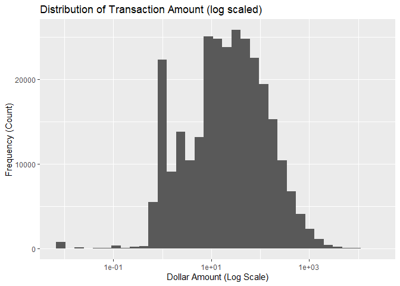
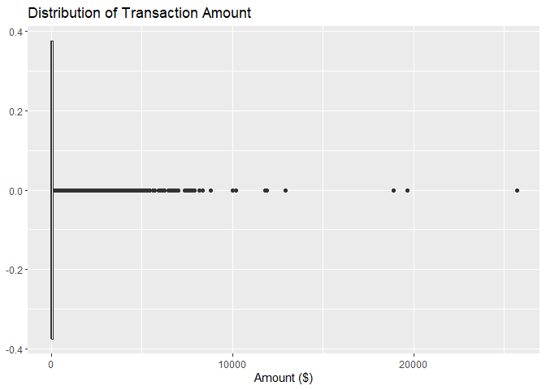
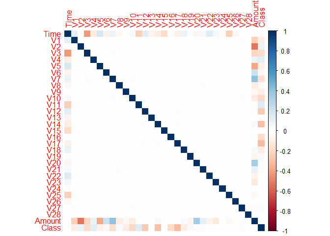
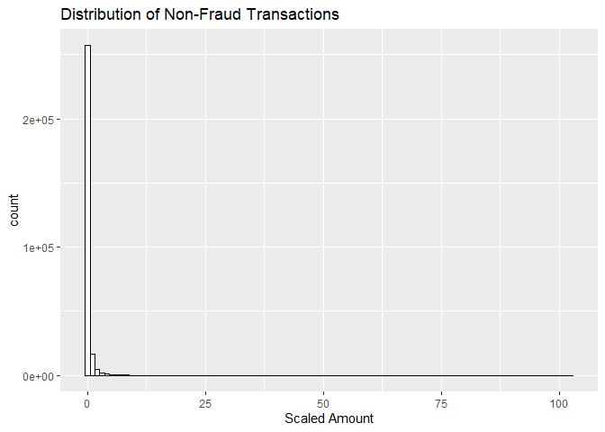
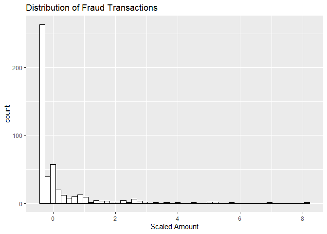
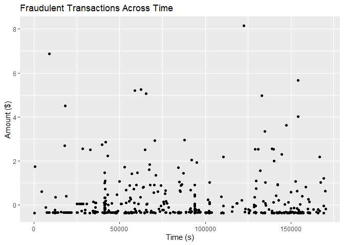
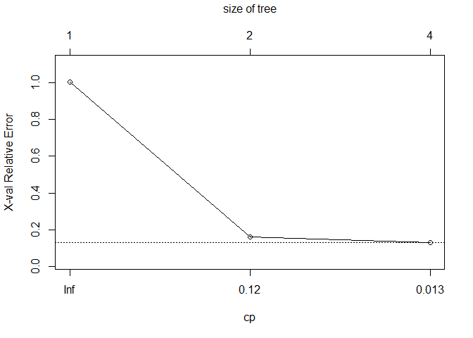
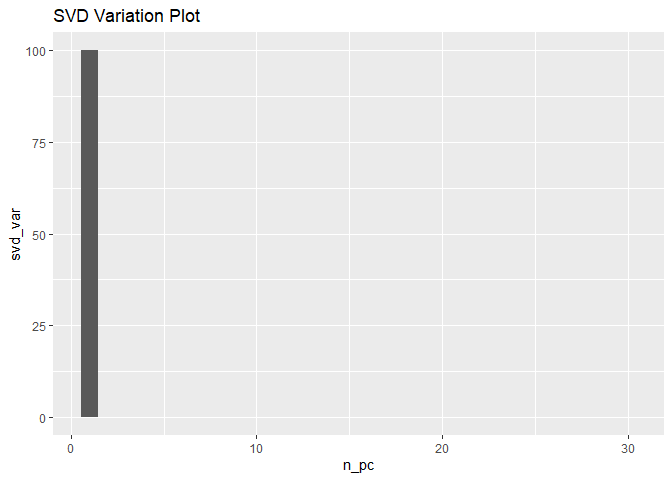

fraud_detection
================
Akoua Orsot
2/16/2022

-   [Fraud Detection](#fraud-detection)
    -   [1. Environment Set-up](#1-environment-set-up)
    -   [2. Initial Diagnostics](#2-initial-diagnostics)
    -   [3. Data Cleaning](#3-data-cleaning)
    -   [4. Correlation Analysis](#4-correlation-analysis)
    -   [5. Inquiry Exploration](#5-inquiry-exploration)
    -   [6. Class Imbalance](#6-class-imbalance)
    -   [7. Machine Learning set-up](#7-machine-learning-set-up)
    -   [8. Dimensionality Reduction](#8-dimensionality-reduction)
    -   [9. Machine Learning - Simple
        Models](#9-machine-learning---simple-models)

# Fraud Detection

This notebook will attempt to build a predictive algorithm to detect a
fraudulent transaction using a training dataset. We will explain the
thinking process at every step using LIME (Local Interpretable
Model-agnostic Explanations) principles making it accessible and
user-friendly.

## 1. Environment Set-up

``` r
## Importing libraries
# set.seed(1)
library(dplyr)
```

    ## 
    ## Attaching package: 'dplyr'

    ## The following objects are masked from 'package:stats':
    ## 
    ##     filter, lag

    ## The following objects are masked from 'package:base':
    ## 
    ##     intersect, setdiff, setequal, union

``` r
library(tidyverse)
```

    ## -- Attaching packages --------------------------------------- tidyverse 1.3.1 --

    ## v ggplot2 3.3.5     v purrr   0.3.4
    ## v tibble  3.1.5     v stringr 1.4.0
    ## v tidyr   1.2.0     v forcats 0.5.1
    ## v readr   2.1.2

    ## -- Conflicts ------------------------------------------ tidyverse_conflicts() --
    ## x dplyr::filter() masks stats::filter()
    ## x dplyr::lag()    masks stats::lag()

``` r
library(ggplot2)
library(e1071)
library(caret)
```

    ## Loading required package: lattice

    ## 
    ## Attaching package: 'caret'

    ## The following object is masked from 'package:purrr':
    ## 
    ##     lift

``` r
library(corrplot)
```

    ## corrplot 0.92 loaded

``` r
library(ROSE)
```

    ## Loaded ROSE 0.0-4

``` r
library(rpart)
library(gmodels)
library(glmnet)
```

    ## Loading required package: Matrix

    ## 
    ## Attaching package: 'Matrix'

    ## The following objects are masked from 'package:tidyr':
    ## 
    ##     expand, pack, unpack

    ## Loaded glmnet 4.1-3

``` r
library(boot)
```

    ## 
    ## Attaching package: 'boot'

    ## The following object is masked from 'package:lattice':
    ## 
    ##     melanoma

``` r
library(modEvA)
require(MASS)
```

    ## Loading required package: MASS

    ## 
    ## Attaching package: 'MASS'

    ## The following object is masked from 'package:dplyr':
    ## 
    ##     select

``` r
library(Dict)
```

``` r
## Loading dataset
df <- read_csv(file = 'C:/Users/Akoua Orsot/Desktop/ds_projects_data/creditcard.csv')
```

    ## Rows: 284807 Columns: 31

    ## -- Column specification --------------------------------------------------------
    ## Delimiter: ","
    ## dbl (31): Time, V1, V2, V3, V4, V5, V6, V7, V8, V9, V10, V11, V12, V13, V14,...

    ## 
    ## i Use `spec()` to retrieve the full column specification for this data.
    ## i Specify the column types or set `show_col_types = FALSE` to quiet this message.

``` r
head(df)
```

    ## # A tibble: 6 x 31
    ##    Time     V1      V2    V3     V4      V5      V6      V7      V8     V9
    ##   <dbl>  <dbl>   <dbl> <dbl>  <dbl>   <dbl>   <dbl>   <dbl>   <dbl>  <dbl>
    ## 1     0 -1.36  -0.0728 2.54   1.38  -0.338   0.462   0.240   0.0987  0.364
    ## 2     0  1.19   0.266  0.166  0.448  0.0600 -0.0824 -0.0788  0.0851 -0.255
    ## 3     1 -1.36  -1.34   1.77   0.380 -0.503   1.80    0.791   0.248  -1.51 
    ## 4     1 -0.966 -0.185  1.79  -0.863 -0.0103  1.25    0.238   0.377  -1.39 
    ## 5     2 -1.16   0.878  1.55   0.403 -0.407   0.0959  0.593  -0.271   0.818
    ## 6     2 -0.426  0.961  1.14  -0.168  0.421  -0.0297  0.476   0.260  -0.569
    ## # ... with 21 more variables: V10 <dbl>, V11 <dbl>, V12 <dbl>, V13 <dbl>,
    ## #   V14 <dbl>, V15 <dbl>, V16 <dbl>, V17 <dbl>, V18 <dbl>, V19 <dbl>,
    ## #   V20 <dbl>, V21 <dbl>, V22 <dbl>, V23 <dbl>, V24 <dbl>, V25 <dbl>,
    ## #   V26 <dbl>, V27 <dbl>, V28 <dbl>, Amount <dbl>, Class <dbl>

## 2. Initial Diagnostics

``` r
## Glimpse of the data
str(df)
```

    ## spec_tbl_df [284,807 x 31] (S3: spec_tbl_df/tbl_df/tbl/data.frame)
    ##  $ Time  : num [1:284807] 0 0 1 1 2 2 4 7 7 9 ...
    ##  $ V1    : num [1:284807] -1.36 1.192 -1.358 -0.966 -1.158 ...
    ##  $ V2    : num [1:284807] -0.0728 0.2662 -1.3402 -0.1852 0.8777 ...
    ##  $ V3    : num [1:284807] 2.536 0.166 1.773 1.793 1.549 ...
    ##  $ V4    : num [1:284807] 1.378 0.448 0.38 -0.863 0.403 ...
    ##  $ V5    : num [1:284807] -0.3383 0.06 -0.5032 -0.0103 -0.4072 ...
    ##  $ V6    : num [1:284807] 0.4624 -0.0824 1.8005 1.2472 0.0959 ...
    ##  $ V7    : num [1:284807] 0.2396 -0.0788 0.7915 0.2376 0.5929 ...
    ##  $ V8    : num [1:284807] 0.0987 0.0851 0.2477 0.3774 -0.2705 ...
    ##  $ V9    : num [1:284807] 0.364 -0.255 -1.515 -1.387 0.818 ...
    ##  $ V10   : num [1:284807] 0.0908 -0.167 0.2076 -0.055 0.7531 ...
    ##  $ V11   : num [1:284807] -0.552 1.613 0.625 -0.226 -0.823 ...
    ##  $ V12   : num [1:284807] -0.6178 1.0652 0.0661 0.1782 0.5382 ...
    ##  $ V13   : num [1:284807] -0.991 0.489 0.717 0.508 1.346 ...
    ##  $ V14   : num [1:284807] -0.311 -0.144 -0.166 -0.288 -1.12 ...
    ##  $ V15   : num [1:284807] 1.468 0.636 2.346 -0.631 0.175 ...
    ##  $ V16   : num [1:284807] -0.47 0.464 -2.89 -1.06 -0.451 ...
    ##  $ V17   : num [1:284807] 0.208 -0.115 1.11 -0.684 -0.237 ...
    ##  $ V18   : num [1:284807] 0.0258 -0.1834 -0.1214 1.9658 -0.0382 ...
    ##  $ V19   : num [1:284807] 0.404 -0.146 -2.262 -1.233 0.803 ...
    ##  $ V20   : num [1:284807] 0.2514 -0.0691 0.525 -0.208 0.4085 ...
    ##  $ V21   : num [1:284807] -0.01831 -0.22578 0.248 -0.1083 -0.00943 ...
    ##  $ V22   : num [1:284807] 0.27784 -0.63867 0.77168 0.00527 0.79828 ...
    ##  $ V23   : num [1:284807] -0.11 0.101 0.909 -0.19 -0.137 ...
    ##  $ V24   : num [1:284807] 0.0669 -0.3398 -0.6893 -1.1756 0.1413 ...
    ##  $ V25   : num [1:284807] 0.129 0.167 -0.328 0.647 -0.206 ...
    ##  $ V26   : num [1:284807] -0.189 0.126 -0.139 -0.222 0.502 ...
    ##  $ V27   : num [1:284807] 0.13356 -0.00898 -0.05535 0.06272 0.21942 ...
    ##  $ V28   : num [1:284807] -0.0211 0.0147 -0.0598 0.0615 0.2152 ...
    ##  $ Amount: num [1:284807] 149.62 2.69 378.66 123.5 69.99 ...
    ##  $ Class : num [1:284807] 0 0 0 0 0 0 0 0 0 0 ...
    ##  - attr(*, "spec")=
    ##   .. cols(
    ##   ..   Time = col_double(),
    ##   ..   V1 = col_double(),
    ##   ..   V2 = col_double(),
    ##   ..   V3 = col_double(),
    ##   ..   V4 = col_double(),
    ##   ..   V5 = col_double(),
    ##   ..   V6 = col_double(),
    ##   ..   V7 = col_double(),
    ##   ..   V8 = col_double(),
    ##   ..   V9 = col_double(),
    ##   ..   V10 = col_double(),
    ##   ..   V11 = col_double(),
    ##   ..   V12 = col_double(),
    ##   ..   V13 = col_double(),
    ##   ..   V14 = col_double(),
    ##   ..   V15 = col_double(),
    ##   ..   V16 = col_double(),
    ##   ..   V17 = col_double(),
    ##   ..   V18 = col_double(),
    ##   ..   V19 = col_double(),
    ##   ..   V20 = col_double(),
    ##   ..   V21 = col_double(),
    ##   ..   V22 = col_double(),
    ##   ..   V23 = col_double(),
    ##   ..   V24 = col_double(),
    ##   ..   V25 = col_double(),
    ##   ..   V26 = col_double(),
    ##   ..   V27 = col_double(),
    ##   ..   V28 = col_double(),
    ##   ..   Amount = col_double(),
    ##   ..   Class = col_double()
    ##   .. )
    ##  - attr(*, "problems")=<externalptr>

``` r
## Descriptive Statistics
summary(df)
```

    ##       Time              V1                  V2                  V3          
    ##  Min.   :     0   Min.   :-56.40751   Min.   :-72.71573   Min.   :-48.3256  
    ##  1st Qu.: 54202   1st Qu.: -0.92037   1st Qu.: -0.59855   1st Qu.: -0.8904  
    ##  Median : 84692   Median :  0.01811   Median :  0.06549   Median :  0.1799  
    ##  Mean   : 94814   Mean   :  0.00000   Mean   :  0.00000   Mean   :  0.0000  
    ##  3rd Qu.:139321   3rd Qu.:  1.31564   3rd Qu.:  0.80372   3rd Qu.:  1.0272  
    ##  Max.   :172792   Max.   :  2.45493   Max.   : 22.05773   Max.   :  9.3826  
    ##        V4                 V5                   V6                 V7          
    ##  Min.   :-5.68317   Min.   :-113.74331   Min.   :-26.1605   Min.   :-43.5572  
    ##  1st Qu.:-0.84864   1st Qu.:  -0.69160   1st Qu.: -0.7683   1st Qu.: -0.5541  
    ##  Median :-0.01985   Median :  -0.05434   Median : -0.2742   Median :  0.0401  
    ##  Mean   : 0.00000   Mean   :   0.00000   Mean   :  0.0000   Mean   :  0.0000  
    ##  3rd Qu.: 0.74334   3rd Qu.:   0.61193   3rd Qu.:  0.3986   3rd Qu.:  0.5704  
    ##  Max.   :16.87534   Max.   :  34.80167   Max.   : 73.3016   Max.   :120.5895  
    ##        V8                  V9                 V10                 V11          
    ##  Min.   :-73.21672   Min.   :-13.43407   Min.   :-24.58826   Min.   :-4.79747  
    ##  1st Qu.: -0.20863   1st Qu.: -0.64310   1st Qu.: -0.53543   1st Qu.:-0.76249  
    ##  Median :  0.02236   Median : -0.05143   Median : -0.09292   Median :-0.03276  
    ##  Mean   :  0.00000   Mean   :  0.00000   Mean   :  0.00000   Mean   : 0.00000  
    ##  3rd Qu.:  0.32735   3rd Qu.:  0.59714   3rd Qu.:  0.45392   3rd Qu.: 0.73959  
    ##  Max.   : 20.00721   Max.   : 15.59500   Max.   : 23.74514   Max.   :12.01891  
    ##       V12                V13                V14                V15          
    ##  Min.   :-18.6837   Min.   :-5.79188   Min.   :-19.2143   Min.   :-4.49894  
    ##  1st Qu.: -0.4056   1st Qu.:-0.64854   1st Qu.: -0.4256   1st Qu.:-0.58288  
    ##  Median :  0.1400   Median :-0.01357   Median :  0.0506   Median : 0.04807  
    ##  Mean   :  0.0000   Mean   : 0.00000   Mean   :  0.0000   Mean   : 0.00000  
    ##  3rd Qu.:  0.6182   3rd Qu.: 0.66251   3rd Qu.:  0.4931   3rd Qu.: 0.64882  
    ##  Max.   :  7.8484   Max.   : 7.12688   Max.   : 10.5268   Max.   : 8.87774  
    ##       V16                 V17                 V18           
    ##  Min.   :-14.12985   Min.   :-25.16280   Min.   :-9.498746  
    ##  1st Qu.: -0.46804   1st Qu.: -0.48375   1st Qu.:-0.498850  
    ##  Median :  0.06641   Median : -0.06568   Median :-0.003636  
    ##  Mean   :  0.00000   Mean   :  0.00000   Mean   : 0.000000  
    ##  3rd Qu.:  0.52330   3rd Qu.:  0.39968   3rd Qu.: 0.500807  
    ##  Max.   : 17.31511   Max.   :  9.25353   Max.   : 5.041069  
    ##       V19                 V20                 V21           
    ##  Min.   :-7.213527   Min.   :-54.49772   Min.   :-34.83038  
    ##  1st Qu.:-0.456299   1st Qu.: -0.21172   1st Qu.: -0.22839  
    ##  Median : 0.003735   Median : -0.06248   Median : -0.02945  
    ##  Mean   : 0.000000   Mean   :  0.00000   Mean   :  0.00000  
    ##  3rd Qu.: 0.458949   3rd Qu.:  0.13304   3rd Qu.:  0.18638  
    ##  Max.   : 5.591971   Max.   : 39.42090   Max.   : 27.20284  
    ##       V22                  V23                 V24          
    ##  Min.   :-10.933144   Min.   :-44.80774   Min.   :-2.83663  
    ##  1st Qu.: -0.542350   1st Qu.: -0.16185   1st Qu.:-0.35459  
    ##  Median :  0.006782   Median : -0.01119   Median : 0.04098  
    ##  Mean   :  0.000000   Mean   :  0.00000   Mean   : 0.00000  
    ##  3rd Qu.:  0.528554   3rd Qu.:  0.14764   3rd Qu.: 0.43953  
    ##  Max.   : 10.503090   Max.   : 22.52841   Max.   : 4.58455  
    ##       V25                 V26                V27            
    ##  Min.   :-10.29540   Min.   :-2.60455   Min.   :-22.565679  
    ##  1st Qu.: -0.31715   1st Qu.:-0.32698   1st Qu.: -0.070840  
    ##  Median :  0.01659   Median :-0.05214   Median :  0.001342  
    ##  Mean   :  0.00000   Mean   : 0.00000   Mean   :  0.000000  
    ##  3rd Qu.:  0.35072   3rd Qu.: 0.24095   3rd Qu.:  0.091045  
    ##  Max.   :  7.51959   Max.   : 3.51735   Max.   : 31.612198  
    ##       V28                Amount             Class         
    ##  Min.   :-15.43008   Min.   :    0.00   Min.   :0.000000  
    ##  1st Qu.: -0.05296   1st Qu.:    5.60   1st Qu.:0.000000  
    ##  Median :  0.01124   Median :   22.00   Median :0.000000  
    ##  Mean   :  0.00000   Mean   :   88.35   Mean   :0.001728  
    ##  3rd Qu.:  0.07828   3rd Qu.:   77.17   3rd Qu.:0.000000  
    ##  Max.   : 33.84781   Max.   :25691.16   Max.   :1.000000

**Takeaway:** The following percentage breakdown confirms the note in
the project description; indeed, we have a considerable class imbalance
with the target variable. It stays consistent that most fraudulent
activities are much less frequent than non-fraudulent. Before
proceeding, we shall note it to avoid any overfitting issues when
fitting the machine learning models.

``` r
## Target Variable Analysis
df %>% group_by(Class) %>%
  summarise(cnt = n()) %>%
  mutate(freq = round(cnt / sum(cnt), 5)) %>% 
  arrange(desc(freq))
```

    ## # A tibble: 2 x 3
    ##   Class    cnt    freq
    ##   <dbl>  <int>   <dbl>
    ## 1     0 284315 0.998  
    ## 2     1    492 0.00173

**Note:** We did not have any information on the numerical predictors
for privacy, given their transformation and standardization, excluding
Amount & Time. In that regard, Amount presented itself as potentially
most informative for the feature variable analysis. To better understand
the variable’s distribution, we had to transform it using a log scale.

``` r
## Target Variable Analysis
df$Amount %>% summary()
```

    ##     Min.  1st Qu.   Median     Mean  3rd Qu.     Max. 
    ##     0.00     5.60    22.00    88.35    77.17 25691.16

``` r
df %>% ggplot(aes(Amount)) +
  geom_histogram(bins=35) +
  scale_x_log10() +
  labs(
  x = "Dollar Amount (Log Scale)",
  y = "Frequency (Count)",
  title= "Distribution of Transaction Amount (log scaled)"
 )
```

    ## Warning: Transformation introduced infinite values in continuous x-axis

    ## Warning: Removed 1825 rows containing non-finite values (stat_bin).

<!-- -->

## 3. Data Cleaning

``` r
## Missing Values
df %>% is.na() %>% sum()
```

    ## [1] 0

**Takeaway:** As the count shows, we have no missing values given the
pre-processing done prior.

**Note**: With most predictors transformed, there will be little chance
for any outliers in the data points for V1, V2, …, V28. So, we will only
examine Amount as the only meaningful numeric feature.

``` r
df %>% ggplot(aes(x=Amount)) +
  geom_boxplot() +
  labs(
  x = "Amount ($)",
  title= "Distribution of Transaction Amount"
 )
```

<!-- -->

**Takeaway:** From the boxplot below, we can observe a non-negligible
number of outliers on the upper end of the distribution. It would denote
transactions with high amounts in the order of thousands of dollars. We
would assess the effect of this skewed distribution when building the
predictive models in terms of feature transformation or selecting models
robust to such feature types.

``` r
df %>% duplicated() %>% sum()
```

    ## [1] 1081

**Takeaway:** A quick check reveals 1081 duplicate rows, so we proceed
in removing them from the dataset.

``` r
df <- df[!duplicated(df), ]
```

**Definition:** Feature Engineering

``` r
df$Amount <- scale(df$Amount)
```

## 4. Correlation Analysis

``` r
df_cor <- cor(df)
corrplot(df_cor, method = 'color')
```

<!-- -->

**Takeaway:** From the correlation matrix plotted, we can observe very
few correlated variables as we would expect after the feature
transformation. The two meaningful features, are Time and Amount, have
some relative correlation with some variables with coefficients
approximating 0.4. With such low values, it would be pretty challenging
to imply a correlation between any of them with any certainty. It also
indicates that there would be a very low incidence of any colinearity
within our data

**Note:** The code below filters those pairs with correlation
coefficients above 0.5 as a threshold. As noted above, those values give
very little to no confidence in any solid correlated relationship
between variables as few crossing the 0.5 mark.

``` r
df_cor <- as.data.frame(df_cor)
df_cor[(abs(df_cor) >= 0.5) & (abs(df_cor) !=1)]
```

    ## [1] -0.533428 -0.533428

## 5. Inquiry Exploration

**Note:** In an attempt to answer the first question, we first split our
dataset by class types; in other words, fraudulent and non-fraudulent
transactions. We then plot the histogram side by side to observe any
unusual behavior. In doing so, the non-fraud transactions were heavily
right-skewed, making it quite challenging to compare the plots. To solve
this issue, we used a logarithmic transformation, making it easier to
see and thus, evaluate any similarities and differences.

``` r
# How does Amount's distribution behaves across classes?

# Splitting data by fraud class
df_no_fraud <- df %>% filter(Class == 0)
df_fraud <- df %>% filter(Class == 1)

# Histogram for Amount Distribution per class
df_no_fraud %>% ggplot(aes(x=Amount)) +
  geom_histogram(color="black", fill="white", bins=100) +
  labs(
  x = "Scaled Amount",
  title= "Distribution of Non-Fraud Transactions"
 )
```

<!-- -->

``` r
df_fraud %>% ggplot(aes(x=Amount)) +
  geom_histogram(color="black", fill="white", bins=50) +
  labs(
  x = "Scaled Amount",
  title= "Distribution of Fraud Transactions"
 )
```

<!-- -->

**Takeaway:** Before making a note on the plots, we will first explain
how to interpret logarithmic scales. In short, log scales show relative
values rather than absolute ones. Indeed, 2 minus 1 would be displayed
similarly to 9999 minus 9998, given that we are dealing with percentages
here. In context, the histograms below would depict the order of growth
of transaction value. Both distributions represent a similar trajectory,
with most transactions on the lower end of the graph. It stays
consistent with the mean value found at USD88, even with max values
averaging USD20,000.

**Note:** For the second question, we will check the timing of
transactions to detect anything unusual. We will use only the fraud
dataset and plot a scatterplot accordingly.

``` r
## Are there any noteworthy point in time where fraud occured?
# Scatterplot
df_fraud %>% ggplot(aes(x=Time, y=Amount)) +
  geom_point() +
  labs(
  y = "Amount ($)", 
  x = "Time (s)",
  title= "Fraudulent Transactions Across Time"
 )
```

<!-- -->

**Takeaway:** The graph above does not appear that there is a clustering
pattern on a time interval. So, we would assume that fraud occurred
across time quite randomly.

## 6. Class Imbalance

**Note:** Our diagnostics observed a stark imbalance between classes of
transactions, with fraud only making up 0.2% of all transaction
statuses. Given the limited pool of examples to train, it poses an issue
in terms of building an effective machine model to predict if there is a
fraud. With the minority class being so small, we would expect poor
performance on the critical task of detecting fraud transactions. In
that vein, we will use different sampling methods (Undersampling &
Oversampling) to tackle this problem.

**Definition:** SMOTE (Synthetic Minority Oversampling Technique) is an
oversampling approach to the minority class. In context, it would mean
to randomly increase fraud examples by “artificially” replicating to
have a more balanced class distribution. Further information
[here](https://rikunert.com/smote_explained).

``` r
## now using ROSE for oversampling
ROSE_over <- ovun.sample(Class ~., data=df,
                                  p=0.5, seed=1,
                                  method="over")

data_balanced_over <- ROSE_over$data
```

``` r
## Check class distribution after using SMOTE
data_balanced_over %>% group_by(Class) %>%
  summarise(cnt = n()) %>%
  mutate(freq = round(cnt / sum(cnt), 5)) %>% 
  arrange(desc(freq))
```

    ## # A tibble: 2 x 3
    ##   Class    cnt  freq
    ##   <dbl>  <int> <dbl>
    ## 1     1 283545 0.500
    ## 2     0 283253 0.500

**Definition:** We proceed to an undersampling approach on the majority
class. In context, we select examples to keep out of the training set
based on the distance of majority class examples to minority class
examples. Further information
[here](https://machinelearningmastery.com/undersampling-algorithms-for-imbalanced-classification/).

``` r
## now using ROSE for oversampling
ROSE_under <- ovun.sample(Class ~., data=df,
                                  p=0.5, seed=1,
                                  method="under")

data_balanced_under <- ROSE_under$data
```

``` r
## Check class distribution after using SMOTE
data_balanced_over %>% group_by(Class) %>%
  summarise(cnt = n()) %>%
  mutate(freq = round(cnt / sum(cnt), 5)) %>% 
  arrange(desc(freq))
```

    ## # A tibble: 2 x 3
    ##   Class    cnt  freq
    ##   <dbl>  <int> <dbl>
    ## 1     1 283545 0.500
    ## 2     0 283253 0.500

**Note:** With the risk of overfitting with oversampling and the
possibility of losing valuable information from undersampling, we
understand that we cannot have a perfect solution to this class
imbalance problem. In that vein, we shall proceed with the oversampling
approach by building robust models to avoid overfitting.

``` r
df <- data_balanced_over
df
```

    ##      Time            V1            V2            V3            V4            V5
    ## 1       0  -1.359807134 -7.278117e-02   2.536346738  1.3781552243 -3.383208e-01
    ## 2       0   1.191857111  2.661507e-01   0.166480113  0.4481540785  6.001765e-02
    ## 3       1  -1.358354062 -1.340163e+00   1.773209343  0.3797795930 -5.031981e-01
    ## 4       1  -0.966271712 -1.852260e-01   1.792993340 -0.8632912750 -1.030888e-02
    ## 5       2  -1.158233093  8.777368e-01   1.548717847  0.4030339340 -4.071934e-01
    ## 6       2  -0.425965884  9.605230e-01   1.141109342 -0.1682520798  4.209869e-01
    ## 7       4   1.229657635  1.410035e-01   0.045370774  1.2026127367  1.918810e-01
    ## 8       7  -0.644269442  1.417964e+00   1.074380376 -0.4921990185  9.489341e-01
    ## 9       7  -0.894286082  2.861572e-01  -0.113192213 -0.2715261301  2.669599e+00
    ## 10      9  -0.338261752  1.119593e+00   1.044366552 -0.2221872767  4.993608e-01
    ## 11     10   1.449043781 -1.176339e+00   0.913859833 -1.3756666550 -1.971383e+00
    ## 12     10   0.384978215  6.161095e-01  -0.874299703 -0.0940186260  2.924584e+00
    ## 13     10   1.249998742 -1.221637e+00   0.383930151 -1.2348986877 -1.485419e+00
    ## 14     11   1.069373588  2.877221e-01   0.828612727  2.7125204296 -1.783980e-01
    ## 15     12  -2.791854766 -3.277708e-01   1.641750161  1.7674727439 -1.365884e-01
    ## 16     12  -0.752417043  3.454854e-01   2.057322913 -1.4686432984 -1.158394e+00
    ## 17     12   1.103215435 -4.029621e-02   1.267332089  1.2890914696 -7.359972e-01
    ## 18     13  -0.436905071  9.189662e-01   0.924590774 -0.7272190536  9.156787e-01
    ## 19     14  -5.401257663 -5.450148e+00   1.186304631  1.7362388001  3.049106e+00
    ## 20     15   1.492935977 -1.029346e+00   0.454794734 -1.4380258799 -1.555434e+00
    ## 21     16   0.694884776 -1.361819e+00   1.029221040  0.8341592992 -1.191209e+00
    ## 22     17   0.962496070  3.284610e-01  -0.171479054  2.1092040677  1.129566e+00
    ## 23     18   1.166616382  5.021201e-01  -0.067300314  2.2615692395  4.288042e-01
    ## 24     18   0.247491128  2.776656e-01   1.185470842 -0.0926025499 -1.314394e+00
    ## 25     22  -1.946525131 -4.490051e-02  -0.405570068 -1.0130573370  2.941968e+00
    ## 26     22  -2.074294672 -1.214818e-01   1.322020630  0.4100075142  2.951975e-01
    ## 27     23   1.173284610  3.534979e-01   0.283905065  1.1335633179 -1.725772e-01
    ## 28     23   1.322707269 -1.740408e-01   0.434555031  0.5760376524 -8.367580e-01
    ## 29     23  -0.414288810  9.054373e-01   1.727452944  1.4734712666  7.442741e-03
    ## 30     23   1.059387115 -1.753192e-01   1.266129643  1.1861099547 -7.860018e-01
    ## 31     24   1.237429030  6.104258e-02   0.380525880  0.7615641114 -3.597707e-01
    ## 32     25   1.114008595  8.554609e-02   0.493702487  1.3357599851 -3.001886e-01
    ## 33     26  -0.529912284  8.738916e-01   1.347247329  0.1454566766  4.142089e-01
    ## 34     26  -0.535387763  8.652678e-01   1.351076288  0.1475754745  4.336802e-01
    ## 35     27  -0.246045949  4.732669e-01   1.695737554  0.2624114880 -1.086641e-02
    ## 36     27  -1.452187279  1.765124e+00   0.611668541  1.1768249842 -4.459799e-01
    ## 37     29   0.996369532 -1.225888e-01   0.546819473  0.7065795411  1.345596e-01
    ## 38     29   1.110880342  1.687168e-01   0.517143960  1.3254069200 -1.915734e-01
    ## 39     32   1.249054720 -6.247271e-01  -0.710588904 -0.9916003609  1.429973e+00
    ## 40     32  -2.008871795  2.198527e+00   0.144241740  1.1594322621 -8.151743e-01
    ## 41     33  -0.607877143  1.031345e+00   1.740449737  1.2321055504  4.185923e-01
    ## 42     33  -0.935731509  1.704158e-01   2.746261269 -1.0779649123 -3.055940e-01
    ## 43     34  -0.762255666  1.277678e-01   2.650056386 -1.8756627712 -8.933564e-01
    ## 44     34   1.138315566  5.695597e-02   0.649418965  0.8730620409 -4.684663e-01
    ## 45     34  -0.291540245  4.455753e-01   1.249752116 -1.7357358899  8.575556e-02
    ## 46     34   0.201685891  4.974832e-01   1.373912574  0.5714053176 -6.306578e-01
    ## 47     35   1.386396974 -7.942095e-01   0.778224191 -0.8647084339 -1.064132e+00
    ## 48     35  -1.063235679  1.418191e+00   1.086672863  1.2414396003  2.306126e-03
    ## 49     35   1.199355934  1.299532e-01   0.863584971  1.0026347687 -7.837610e-01
    ## 50     36  -1.004929339 -9.859777e-01  -0.038038829  3.7100613592 -6.631951e+00
    ## 51     36  -1.169422458  1.158314e+00   1.406799536  0.8601888973 -1.038099e-01
    ## 52     36   1.095524606 -1.160853e-01   1.397911915  1.4975469002 -1.049124e+00
    ## 53     37   1.295667621  3.414835e-01   0.081505199  0.5667460697 -1.104588e-01
    ## 54     38   0.158331782  8.726874e-01   0.965524582  1.8021271613  1.390220e-01
    ## 55     39  -0.554064565  2.157283e-01   0.844264629 -0.7530673163  3.484847e-02
    ## 56     39  -1.330881575  2.675402e-01  -0.168469574 -0.7012321480  3.281972e+00
    ## 57     40   1.110692004  8.194190e-02   0.406063037  1.2907403831 -1.698131e-01
    ## 58     41   1.154312117  2.654623e-01   0.384870524  0.5750070402 -2.174755e-01
    ## 59     41   0.986063326 -2.029646e-01  -0.492768147  0.4076912747  3.056603e-01
    ## 60     41   1.138759336 -1.192953e+00   1.407130836 -0.3300701034 -2.069503e+00
    ## 61     41   1.145524387  5.750680e-01   0.194008460  2.5981917450 -9.221002e-02
    ## 62     42  -0.249361328  3.992274e-01   0.068009334 -1.0606188263  2.410399e+00
    ## 63     42  -0.522666281  1.009923e+00   0.276469595  1.4752894586 -7.070126e-01
    ## 64     44  -0.899992449  1.362548e-01   1.883664710 -0.2089960956  1.051441e+00
    ## 65     44  -0.714764019  5.149686e-01   1.821675627  0.6164336331  8.487756e-01
    ## 66     44  -0.948896383  2.484136e-01   2.956914245  2.8137499906  1.455388e-01
    ## 67     44   0.927060249 -3.236840e-01   0.387584831  0.5444739886  2.467874e-01
    ## 68     46  -1.923213204 -8.704823e-01   2.320169629  1.9887758015  4.170908e-01
    ## 69     46   1.006588583 -7.110536e-02   0.347613710  1.3296840463 -1.932395e-01
    ## 70     46  -0.378244635  7.329255e-01  -0.120154211  0.1857550721  2.594269e+00
    ## 71     47   1.197838599  2.368276e-01   0.509605002  0.6576586599 -3.654878e-01
    ## 72     48  -0.580628965  4.826839e-01   1.333123080 -0.2530800227 -2.846894e-02
    ## 73     48  -1.793406244  1.854604e+00   0.979513977  1.1122615265 -2.064030e-01
    ## 74     49   1.098608346  2.024236e-01   0.525455972  1.3234362720 -1.304864e-01
    ## 75     49  -0.549626145  4.189492e-01   1.729833252  0.2030653738 -1.870124e-01
    ## 76     49   0.921543680 -6.708375e-02   0.077461028  0.9536382170  6.741246e-02
    ## 77     50  -0.571520750  1.071600e+00   1.280110250  0.5427800031  5.744390e-01
    ## 78     50  -0.671708548  5.945026e-01   0.216415944 -0.8673106389  2.966908e+00
    ## 79     51   1.259873136  2.542396e-01   0.514788628  0.6209242974 -4.759301e-01
    ## 80     52   1.147368927  5.903464e-02   0.263632341  1.2110234582 -4.409558e-02
    ## 81     52  -3.005236722  2.600138e+00   1.483690737 -2.4184729551  3.063264e-01
    ## 82     53  -1.198967674 -1.474100e+00   1.840325987 -4.5158243549  3.275674e-01
    ## 83     54   1.202398328  3.217114e-01   0.281210894  0.6436885825 -1.486686e-01
    ## 84     55  -4.575092608 -4.429184e+00   3.402585004  0.9039146799  3.002224e+00
    ## 85     55  -0.773450000  8.531125e-01   0.818253542 -0.2360701612  8.034625e-01
    ## 86     56  -0.847998366  1.043459e+00   1.267368892  1.1355294901  2.136210e-02
    ## 87     56   0.086996191 -5.198874e-02  -0.497882442 -3.1519078565  2.558400e+00
    ## 88     59  -0.773292609 -4.146007e+00  -0.932037567  0.0270936839 -1.698307e+00
    ## 89     59   0.921024019 -1.624469e-01  -0.094331367  0.4740839263 -2.148596e-02
    ## 90     60   1.069141385  4.378593e-02   0.309867291  1.3166939930 -4.623936e-01
    ## 91     60   1.107029377  2.164410e-01   0.538378150  1.4763979927 -2.519419e-01
    ## 92     62  -1.035105818  9.960131e-01   2.192470136 -0.1704453028 -3.023197e-01
    ## 93     64   1.212510891 -9.905430e-02  -1.192094095  0.2863235615  2.160516e+00
    ## 94     64  -0.658304934  4.067906e-01   2.037460639 -0.2912979744  1.479098e-01
    ## 95     64   0.959601659  3.707113e-01   0.888613370  2.3432441030  3.524908e-01
    ## 96     67  -0.653444627  1.602251e-01   1.592255555  1.2968322836  9.971749e-01
    ## 97     67  -1.494667841  8.372414e-01   2.628210618  3.1454143789 -6.090984e-01
    ## 98     68   1.232996465  1.894537e-01   0.491040321  0.6336726614 -5.115744e-01
    ## 99     68   1.156939065  3.721512e-02   0.556799036  0.5195065436 -4.797539e-01
    ## 100    68  -0.770196383  4.835724e-01   1.901071779 -0.0018762501  2.424479e-02
    ## 101    69   0.298503170  2.142722e+00  -1.542142972  1.5613319062  9.381080e-01
    ## 102    69  -0.608026930  3.066936e-01   1.473004150  1.1911272471  2.126467e-02
    ## 103    69  -1.766644699  2.352984e+00  -0.009955160 -0.3637357158  1.460953e+00
    ## 104    69  -2.220641827  1.029181e+00  -0.697723602 -1.2682264664  2.802221e+00
    ## 105    70  -0.426071694 -6.030377e-02   2.220828203  0.0247417821 -5.849640e-01
    ## 106    71   1.331897157 -5.799618e-01   0.422605532 -0.8977515262 -7.462542e-01
    ## 107    73   1.162280884  1.248178e+00  -1.581317148  1.4750241936  1.138357e+00
    ## 108    73   1.239048053  2.932844e-01   0.086471960  1.1782773642  3.733439e-01
    ## 109    73   0.925996613 -3.580989e-01   1.376721528  1.9007688135 -1.057690e+00
    ## 110    73   1.148186926  8.583707e-02   0.120702062  1.1266645537  2.147106e-01
    ## 111    74   1.038370334  1.274861e-01   0.184455888  1.1099497909  4.416989e-01
    ## 112    75  -1.439068817  2.676314e-01   3.562770340  3.4814858339 -1.160101e+00
    ## 113    76  -1.024576049  5.222891e-01   1.787699074  0.2026721071 -1.140803e+00
    ## 114    76  -0.997175759  2.283653e-01   1.715339938 -0.4200667666  5.608378e-01
    ## 115    77  -1.165721747  1.485337e+00   0.156418075  0.9243783296  1.317456e-01
    ## 116    77  -1.185954030 -2.188084e-01   1.101004831 -1.4069971283  1.261783e+00
    ## 117    77  -0.427190854  7.457084e-01   1.761811025 -0.1651304787  5.829769e-02
    ## 118    78  -0.622478372  1.488140e-02   1.052488736 -1.6445738275 -5.382653e-01
    ## 119    78  -0.291241163  1.515688e+00   1.514354894  2.5183646148  5.836477e-01
    ## 120    78  -1.760402481  2.219242e-01   0.579949898 -1.4131940917  8.048762e-01
    ## 121    78  -0.590589254  2.352483e-01   2.354921509 -2.2199360173 -2.468207e-01
    ## 122    79  -2.374380306  5.971453e-01   0.036656100 -1.4069890942  2.996920e-01
    ## 123    80  -0.655264276  4.098985e-01   1.289156438 -0.3250432592  5.456695e-01
    ## 124    80  -3.007739051  9.295145e-01  -0.423720855 -1.3929516202  8.224678e-02
    ## 125    81   1.111047970  2.153518e-01   0.374072564  1.1500006535 -3.297676e-01
    ## 126    82  -3.591826161  1.348370e+00  -0.998492354 -1.4023617542 -5.967115e-01
    ## 127    82  -0.888004366  9.136699e-01   1.146088038  0.6562904989  6.772723e-01
    ## 128    83  -1.864989682  9.108738e-01   1.724862787 -1.7483711489  5.789426e-01
    ## 129    83  -0.833200336  7.787871e-01   2.619236664  2.6128641288 -5.169376e-01
    ## 130    83  -1.897330739  9.556261e-01   0.052542631  1.2766555896 -3.323084e+00
    ## 131    84   1.119272304 -6.696390e-01   0.803807372 -0.6516931230 -1.395666e+00
    ## 132    84  -0.792329167 -8.406637e-01   2.610464590 -2.1963384163 -3.969621e-01
    ## 133    84  -0.481375994  1.003407e+00   0.906183669 -0.4238639282  7.606706e-01
    ## 134    85   1.327883886 -7.350119e-01   1.502449134 -0.5441046799 -1.909350e+00
    ## 135    85  -4.257597440  1.649489e+00  -1.591241672 -1.3743167710 -1.180136e+00
    ## 136    87  -5.101877144  1.897022e+00  -3.458033555 -1.2775427661 -5.517758e+00
    ## 137    88   1.287226467 -8.246831e-01   1.346422851 -0.5256279956 -1.833007e+00
    ## 138    89   0.270724788 -1.615317e+00   1.054982089  1.6615099268 -1.737687e+00
    ## 139    89  -0.589855944  9.330699e-01  -0.268072621  0.1252446272  2.396992e+00
    ## 140    91   1.276133783  2.114696e-01   0.143000512  0.3700501086  1.547478e-01
    ## 141    91  -1.822272728  1.235336e+00  -0.307804337 -1.8218238060  2.762482e+00
    ## 142    92  -5.285970513  4.847323e+00  -1.290368385 -1.4278423529 -6.215333e-01
    ## 143    92   0.607153014 -9.574135e-01   0.761504743  1.5900504487 -1.177298e+00
    ## 144    92  -0.238410956  5.092628e-01   1.952000704  0.7790659478 -3.789401e-01
    ## 145    93  -0.853806864  1.273918e-01   1.267277185  0.6785840651 -1.029851e+00
    ## 146    93  -1.640014273 -4.798313e-01   1.613630324  2.9979790017 -3.803788e+00
    ## 147    95   1.057021329 -6.469560e-01   0.729166619 -0.5692623620 -1.174307e+00
    ## 148    95  -0.343711498  1.118615e+00   1.293385823  0.0647623027  2.348069e-02
    ## 149    95   1.316177650 -1.055940e-01  -0.246480374 -1.1857146755 -1.195664e-01
    ## 150    95   1.195571618  2.588578e-01   0.635796446  0.6412573601 -3.950811e-01
    ## 151    97   1.273817893  5.800905e-02  -1.312427634 -0.0489688220  2.244373e+00
    ## 152    98  -0.646513324  1.004199e+00   1.616223950 -0.0996280015 -1.224769e-01
    ## 153    98   1.027114369 -1.272543e+00   0.673656443 -0.7474358008 -1.299107e+00
    ## 154    99  -0.883995650 -1.507648e-01   2.291790721 -0.2634522683 -8.145353e-01
    ## 155    99   1.081033083 -2.565434e-01   0.426971283  0.9181132218 -7.460889e-01
    ## 156   100  -0.378601661  2.745790e-01  -0.129487732 -2.6827989880 -7.313746e-01
    ## 157   103  -1.409009452  5.634925e-01   3.350717448 -0.4368930362 -1.123467e+00
    ## 158   103  -0.940892840  1.074155e+00   1.759398089 -0.6014456068  1.016935e-01
    ## 159   103   1.245743808  4.388778e-01   0.316139712  1.1076338616 -1.784464e-01
    ## 160   103  -6.093247805 -1.211421e+01  -5.694973183  3.2943894563 -1.413792e+00
    ## 161   105   1.000233990 -2.952273e-01   1.308259453  1.2577533122 -9.675324e-01
    ## 162   105   1.175094093  4.082632e-01   0.552145163  1.2550677435 -1.966618e-01
    ## 163   106  -0.306311186  9.912719e-01   1.414491330  0.8552436444  3.342837e-01
    ## 164   107   1.175124777  6.613412e-01  -0.477476460  1.1025415593  5.433281e-01
    ## 165   108  -0.817164490  5.480079e-01   1.987429001  2.3476202744  3.688774e-02
    ## 166   108   1.206065239 -1.248847e-01   0.118939145  0.0237349897 -5.490869e-01
    ## 167   110  -1.276830337 -9.035567e-01   1.477104935 -2.5826263514  6.359813e-01
    ## 168   110  -0.591932651  1.112728e-01   0.699125647 -1.5360740334  1.193208e+00
    ## 169   111  -0.820860222  1.022567e+00   1.996560362  1.1801407930  2.324639e-01
    ## 170   112  -4.816021799 -3.345061e+00   0.566005642  3.9605677959 -2.495400e+00
    ## 171   112   1.102697857  1.039651e-01   0.934478734  1.1527035153 -6.935972e-01
    ## 172   113   1.147553856  5.434911e-01   0.504579173  2.5179299142 -1.235548e-01
    ## 173   114   1.194066271 -7.258223e-02   0.635285626  0.7686162056 -7.355843e-01
    ## 174   114  -0.284446202  1.069099e+00   0.930510616 -0.1290102875  3.878191e-01
    ## 175   115  -0.182928163 -9.206834e-01   1.818758315 -2.4509361595 -1.247560e+00
    ## 176   117   0.805681804 -2.204514e-01   2.371309722  4.0758173032 -8.440733e-01
    ## 177   117  -1.010266597 -5.400140e-01   2.518624344 -2.2701488513 -1.573624e-01
    ## 178   118   1.254913507  3.502873e-01   0.302487785  0.6931144540 -3.714699e-01
    ## 179   118   1.431053409 -6.481011e-01  -0.331663901 -1.2073826025 -1.278594e-02
    ## 180   121  -0.868565326  6.849781e-01   2.013745177  0.1263902694 -4.931580e-01
    ## 181   123  -0.505728362  6.663004e-01   1.080993020 -0.4476303494  1.039490e+00
    ## 182   123   0.968783929 -5.017981e-01  -1.333558486  0.3888042896  2.036091e+00
    ## 183   124  -0.614586106  9.753965e-01   1.689026908 -0.1704834219 -1.520196e-01
    ## 184   124   1.105253453  5.418420e-01   0.839421415  2.5709327064 -2.795174e-01
    ## 185   124  -1.710934768 -1.366799e+00   2.217310673  0.4047144514 -1.143752e-01
    ## 186   125  -2.807064506  1.183098e+00   2.974779375  2.8014770727 -4.751102e-01
    ## 187   125   0.853907974 -5.271639e-01   0.823846175  1.2352237295 -6.423700e-01
    ## 188   125  -0.724910392  7.347502e-02   1.739546615  0.7585880633  2.295426e-01
    ## 189   127   1.356489323 -2.213555e-01  -1.236995618 -1.2468351175  1.907809e+00
    ## 190   128  -0.549716076  9.076652e-01   1.597948930  1.2989778006  5.879934e-01
    ## 191   128   1.239494808 -1.826092e-01   0.155058296 -0.9288921436 -7.462266e-01
    ## 192   130  -0.485237731  6.584966e-01   1.949966622  1.2496947481  4.264103e-01
    ## 193   130   1.353283086 -6.949000e-01   0.970826107 -0.4265594869 -1.417263e+00
    ## 194   131  -1.007390583  1.261943e+00   1.207202744  1.3075749267  1.532114e-01
    ## 195   132  -0.394815704  1.054418e+00   1.206361271 -0.2892323899  6.102839e-01
    ## 196   132  -1.571359311  1.687508e+00   0.734670438  1.2933495971 -2.175317e-01
    ## 197   133   0.709335678 -1.167916e-02  -0.530212955  0.2363306322  1.611750e+00
    ## 198   135   1.101762442 -1.190185e-01   1.139150275  1.8449612117 -8.179092e-01
    ## 199   135   1.207207324  2.413180e-01   0.258744961  0.6533349400 -2.564258e-01
    ## 200   135  -0.541889410  9.077448e-01   0.941841931  0.9937478882  8.447239e-01
    ## 201   136  -0.568284748  1.195095e+00   0.694741497 -0.6260951263  1.171084e+00
    ## 202   137   0.753307852 -1.131593e+00   0.878730366  0.2978707957 -1.327250e+00
    ## 203   138  -0.986639536  5.461977e-02   0.892189390  1.2385463011  1.153949e+00
    ## 204   139   0.951278276 -6.577296e-01   1.701883533  1.8096672833 -1.360162e+00
    ## 205   140   1.175477978  1.678813e-01   0.509908525  0.4523323778 -2.157630e-01
    ## 206   140  -4.636533664 -5.931717e+00  -0.227301246 -2.7372713462  7.672544e+00
    ## 207   140  -3.222745011 -1.932776e+00   2.923241828  0.1435735309  9.481168e-01
    ## 208   140   0.693502989 -1.134232e+00   0.782844002 -0.5929963949 -1.421803e+00
    ## 209   140   1.007947057 -1.289492e+00   0.666740851 -0.7413211894 -1.290523e+00
    ## 210   141   1.180458002  3.342670e-01   0.395177877  1.1907531968 -9.215763e-02
    ## 211   142   1.211406024  7.849756e-03   0.950798395  1.1376464780 -4.951893e-01
    ## 212   142   1.288255622  8.582758e-02  -1.179482142  0.0643570502  2.195225e+00
    ## 213   143  -2.143457532  2.107826e+00   0.213151876  1.2822165681 -7.325584e-01
    ## 214   144  -1.032939915  6.806081e-01   1.402550125 -0.5299280178  8.695781e-01
    ## 215   145   1.122578642  2.225731e-01   0.481927939  1.1313753753 -2.149472e-01
    ## 216   145  -2.420412824  1.947885e+00   0.553646043  0.9830688857 -2.815181e-01
    ## 217   145  -2.419485626  1.949346e+00   0.552997661  0.9827100962 -2.848153e-01
    ## 218   147   0.912979151 -6.529996e-01   0.298165153  0.2095461642 -1.972305e-01
    ## 219   147  -2.687977969  4.390230e+00  -2.360483061  0.3608291619  1.310192e+00
    ## 220   150  -0.399879707  1.051966e+00   1.390802023  0.0931318649 -7.699357e-03
    ## 221   152   0.095490023 -2.557694e+00  -1.134054856 -0.4357704699  7.284934e-01
    ## 222   153  -0.648576026  7.405646e-01   1.800381500  0.1408256836  5.064644e-02
    ## 223   153  -0.903628224 -2.333626e-01   2.580863531 -0.9905723266 -3.979203e-01
    ## 224   154   1.190844167 -6.084269e-01   0.069096521 -0.4935092046 -9.447747e-01
    ## 225   154   1.315601305  4.131483e-01  -0.018953104  0.4878343837  1.323307e-01
    ## 226   155  -0.546215295  8.780839e-01   1.523176388 -0.2428534370  3.239312e-01
    ## 227   155   1.171953522  3.112133e-01   0.313605078  0.5192304205 -5.803211e-02
    ## 228   156   0.714401042 -4.939052e-01   1.269484559  3.0114941063 -8.012159e-01
    ## 229   156  -3.494860856 -2.894450e+00   1.637988839 -0.2749755754 -3.892029e-01
    ## 230   156   1.325295228 -1.138678e+00   1.276265636 -0.2079202377 -1.642088e+00
    ## 231   158  -0.600816388  9.224545e-01  -0.135951820 -1.2599148391  2.439824e+00
    ## 232   158  -0.159985037 -6.116329e-01   2.081419302 -1.0481284533 -1.083456e+00
    ## 233   160   1.171438903  4.749740e-01   0.011760718  1.2643025050  1.162341e-01
    ## 234   160  -1.551481611 -1.053346e+00   0.762805729  1.3351290614 -2.585523e+00
    ## 235   162   1.039964313 -5.343553e-01   1.865190286  1.1451218048 -1.488133e+00
    ## 236   164   1.212056805  2.464054e-01   0.309165988  0.5847443873 -3.815813e-01
    ## 237   164  -0.433211486  1.020835e+00   2.019730198  3.0032606804  3.130766e-02
    ## 238   164   0.073496706  5.510330e-01   0.451890424  0.1149638444  8.229465e-01
    ## 239   167   1.321778325  6.580483e-01  -0.793312359  0.4296474544  4.179661e-01
    ## 240   167  -0.827464823  1.248570e+00   1.023826113  0.6180811054  1.910937e-01
    ## 241   167  -1.329062370  1.955890e+00   1.118275164  2.3184319017  1.582537e+00
    ## 242   168   1.274967090 -7.787834e-01   1.162452685 -0.1804246140 -1.532631e+00
    ## 243   169  -4.066862271 -5.081215e+00  -0.116907810 -1.3128292727  2.688762e+00
    ## 244   171  -0.365531734  1.006932e+00   1.108303668 -0.4286936951  5.905128e-01
    ## 245   171  -0.957819798  2.479795e-01   3.772856852  3.3113850465 -1.305427e+00
    ## 246   172  -1.428534961  1.793578e+00   0.545758239 -0.3993090068  6.735769e-01
    ## 247   172   1.264698666  1.682855e-01  -0.275340024  0.2206313006  4.592153e-01
    ## 248   179  -0.431091692  8.907518e-01   1.720542847 -0.2382464552  2.732629e-01
    ## 249   180  -0.782666195  1.017987e+00   1.505851330  0.9209046174  7.587651e-01
    ## 250   180   1.294032785 -7.628085e-01   0.111245009 -0.5354210726 -1.134396e+00
    ## 251   181  -0.723637212  1.544957e-01   1.263163339  0.9649784907 -2.716965e-02
    ## 252   181   1.136752053 -1.037696e-01   0.904686444  0.4882107552 -6.785235e-01
    ## 253   183   0.726749304 -5.280424e-01   0.050365515  1.3736214685 -1.241220e-01
    ## 254   183  -0.598071289  1.264137e+00   1.410326046  1.6951749810  3.917277e-01
    ## 255   184   1.199277668  3.657378e-01   0.428155251  0.6177327070 -3.426097e-01
    ## 256   184  -0.143256003  7.436485e-01   1.534072207  1.0621700944  2.081868e-01
    ## 257   185  -0.241301703  1.089311e+00   0.703988825 -0.2659870436  6.928978e-01
    ## 258   187   0.066060772  8.762634e-01   1.093992968  1.5561505160 -7.231813e-02
    ## 259   188   1.168433389  3.199776e-01   0.589693418  1.0447739823 -3.769418e-01
    ## 260   190  -1.505779164 -2.153251e-01   1.991294276 -1.6314933845 -6.359651e-01
    ## 261   190  -0.913599729  1.622621e-01   0.541428519 -1.9317987255  2.354017e-01
    ## 262   190   0.075749698  1.026986e+00   0.834890510  1.2089125370  1.075540e-01
    ## 263   190   0.803845921 -5.717181e-01   1.048092695  1.1676766743 -7.022919e-01
    ## 264   190  -0.549414252  6.768607e-01   2.151949976  1.0145229920 -6.200118e-01
    ## 265   192  -0.351286911  1.183754e+00   0.530794296  0.5438913995  7.984415e-01
    ## 266   193  -0.922515164  8.415768e-01   2.078000014  1.3730713445  6.665261e-01
    ## 267   194  -1.131517179  1.016399e+00   0.735810425  1.1666137728  7.902364e-01
    ## 268   194  -0.773295862 -1.906614e-01   2.404946261 -1.7998807541 -3.965165e-01
    ## 269   194  -0.931154307  8.258891e-01   0.168007968 -0.0772116894  2.966452e+00
    ## 270   196  -0.278287825  8.662137e-01  -0.300620201 -1.1173454785  2.542242e+00
    ## 271   196   1.198658495 -4.203338e-01   0.014599158 -0.2707928682 -4.710740e-01
    ## 272   199  -0.923891761  5.688524e-01   1.244235999 -0.5974725143  1.084897e+00
    ## 273   199   1.029268620 -5.162923e-01   1.291785339  0.3646763642 -1.278463e+00
    ## 274   199   1.187706334 -1.410194e-01   0.563458522  0.7663825848  1.510710e-01
    ## 275   200  -0.304922925 -5.213877e-01   1.341180514 -0.2557972831 -1.120916e+00
    ## 276   200  -1.269461299 -1.027153e+00   2.261372999 -0.5043560135  6.934214e-01
    ## 277   204   0.860652097 -2.473752e-01   0.754082235  1.1854917072 -4.861743e-01
    ## 278   204  -0.938225555  1.047173e-01   1.309641702 -0.8675365325  4.506853e-01
    ## 279   204  -0.188423950  8.776018e-01  -0.734685910 -0.9134036999  1.941770e+00
    ## 280   205   1.182398882  5.948869e-02   0.310672612  0.8288173350  3.412091e-01
    ## 281   206  -1.499761074  1.059588e+00   0.496912353  1.0060692371 -6.729492e-01
    ## 282   206  -1.427151559 -5.277664e-01   2.460153272 -2.8074818909 -4.571113e-01
    ## 283   206  -0.370562536  5.998100e-01   0.216683002 -0.5130926925  2.697143e+00
    ## 284   209  -5.852465108  5.267376e+00  -1.761894935 -1.4412500633 -9.885290e-01
    ## 285   209  -0.742877146  5.632517e-01   1.207243263  0.9123880038  1.053791e+00
    ## 286   209   1.228501161  9.187047e-02  -0.268384945  0.7489050310  4.490267e-01
    ## 287   209  -0.572010633  3.749809e-01   0.923823033 -0.9540058723  7.536354e-01
    ## 288   209  -0.429224487  6.988494e-01   1.588982428  1.2971565937  1.193307e-01
    ## 289   210   1.293927047  3.380707e-01  -0.042758725  0.5021337963  7.228258e-02
    ## 290   211   0.263523486 -1.812897e+00  -0.311086762  0.4129295939 -7.946054e-01
    ## 291   211  -0.247826973 -2.826821e-01   1.653354215 -1.0148646352 -6.804333e-01
    ## 292   213  -0.263380494  9.591027e-01   0.285739874  0.6040675107  3.228820e+00
    ## 293   215   1.087791655 -1.435482e-01   1.374291017  1.2873991901 -1.100642e+00
    ## 294   217  -2.421229941 -1.369602e+00   2.261281491  2.0110338300  1.878525e+00
    ## 295   218  -0.391724600  1.106355e+00   0.787765451  0.5105254879  8.329683e-01
    ## 296   218  -1.045668501  4.855097e-01   1.569232319  0.1609293854  8.624618e-01
    ## 297   218   1.201989343 -3.445179e-02   0.696627869  0.9567456436 -5.826667e-03
    ## 298   220  -0.592060070  7.859039e-01   2.806517307  2.9354659039 -3.566822e-01
    ## 299   220   1.219112097  5.369413e-02  -0.180320730  0.6809409217  5.215840e-01
    ## 300   221  -0.342871277 -1.995458e-01   1.976352578 -0.0034949338 -1.170366e+00
    ## 301   221  -1.177731398  3.185006e-01   1.727122639 -0.5495784837  7.372920e-01
    ## 302   222  -0.352704348  9.755175e-01   1.603364515 -0.2824749190  4.805614e-01
    ## 303   222   1.086971163  4.512232e-02   0.475774395  1.3442441779 -3.026407e-01
    ## 304   222  -0.443640310  9.811928e-01   1.234397173  0.0994971665 -5.126979e-02
    ## 305   222   1.081026808 -1.394545e-01   0.483881152  0.6420567480 -1.868455e-01
    ## 306   225   1.478772853 -5.510885e-01  -0.523151640 -0.8311534556 -1.954128e-01
    ## 307   225  -0.608830735  8.768370e-01   2.495715337  3.1386742854  1.612643e-01
    ## 308   227  -1.465380992  1.382172e+00   1.019789918  0.2503671211  1.011414e+00
    ## 309   227   1.120599263 -3.133079e-01   0.395308800  0.5967557198 -4.204116e-01
    ## 310   228   1.105767571  3.330120e-01   0.184148099  1.2769482380 -7.811843e-02
    ## 311   230  -0.420269748  8.147604e-01   1.513242393  1.2927820973  1.380530e-01
    ## 312   231  -0.961507377  7.433514e-01   1.173581813 -0.2225934486  7.405281e-01
    ## 313   231   0.283099850  8.192840e-01   1.054308830  0.3484882888 -1.568168e-01
    ## 314   234  -0.602482641  4.790886e-01   0.549750379 -1.0698142943 -5.016865e-01
    ## 315   235  -0.663511067 -4.444323e-02   1.029253315 -2.4980723100 -1.350085e+00
    ## 316   236  -1.169086543  1.096292e+00   0.669688007  1.0525344354  4.224652e-01
    ## 317   236  -0.438337379  1.028364e+00   1.455501718 -0.2302747020  1.988994e-01
    ## 318   237   1.260247838 -2.017192e-02  -1.164386540  0.2662514405  2.184886e+00
    ## 319   237  -0.473290464  4.796273e-01   1.528537859 -0.0981850593 -5.520022e-03
    ## 320   238  -0.992403869  1.626591e+00   0.960247699  0.0919986776 -2.379629e-01
    ## 321   239   1.167526651 -3.182884e-01   0.502463956  0.0339040539 -5.842848e-01
    ## 322   241  -1.142320931  6.264049e-01   2.526916953  2.8279727063  6.192631e-01
    ## 323   241  -2.398445870  2.022961e+00   1.628461705 -0.5404769964 -5.125959e-01
    ## 324   241  -0.849347742  1.019508e+00   1.517236217  0.5794675990  5.391865e-01
    ## 325   241   1.181571969  2.414079e-01   0.024536924  0.8858320282 -1.214714e-01
    ## 326   242  -0.398935075  9.419533e-01   1.359288453  0.0134901030 -1.919400e-01
    ## 327   244  -1.118945511 -7.136622e-02   2.807768980  1.0256754002 -1.007481e-01
    ## 328   246  -1.077045918  2.140916e+00   1.152883756  2.4588338998  5.765724e-01
    ## 329   246   1.311258486  7.502777e-02  -1.292832404 -0.4831543333  2.139257e+00
    ## 330   246  -1.069199853  1.239963e+00   0.545157122  1.0053539816 -2.569558e-02
    ## 331   247  -0.685769792  5.540192e-01   2.014829479 -0.5610327579  6.833471e-01
    ## 332   248  -0.216866831  9.008962e-01   1.502850277  0.8124924505  1.939525e-01
    ## 333   249  -0.788406123  1.125172e+00   0.934213100  1.1558153246 -2.851772e-02
    ## 334   250  -1.337374908  1.109391e+00   1.396222520  0.0387177339  5.202674e-01
    ## 335   251   1.206637834  1.433448e-01  -0.131755553  0.9024861887  2.195472e-01
    ## 336   251   1.071812684 -2.499272e-01   0.189825005  0.1911089196 -6.157789e-01
    ## 337   251  -0.238642949 -1.466913e-01   0.829323343 -1.7767394378 -8.004834e-02
    ## 338   252  -2.395433913 -1.545369e+00   1.919391200  1.0625135679 -6.278062e-01
    ## 339   256  -1.377245329  7.148225e-01   2.507512766  0.8650824338 -2.904892e-01
    ## 340   256  -0.471795901  5.231687e-01   1.948966931  0.9955032059  3.790688e-01
    ## 341   257  -0.599318041  8.875248e-01   1.579214020 -0.1137278956  3.049912e-01
    ## 342   258   1.130932761  1.780693e-01   0.533439524  1.4789552617 -3.429332e-01
    ## 343   259  -0.942940341  2.060741e-01   1.625992033  1.1083915716  8.758379e-01
    ## 344   259   1.095067418 -1.439271e-02   1.408552105  1.2665459550 -9.447505e-01
    ## 345   259  -1.569485289 -1.932133e+00   1.249202816 -4.4342112797  1.244282e+00
    ## 346   259  -0.363607748  1.104008e+00   1.300678453  0.0703142964  7.517966e-02
    ## 347   260   1.455905770 -9.283780e-01   0.353459043 -1.3778665505 -1.233133e+00
    ## 348   260   1.026701748 -6.616647e-01   0.897600900  0.1444028015 -1.105205e+00
    ## 349   260   1.075229011 -3.353395e-01   1.680467942  1.1920983875 -1.270531e+00
    ## 350   261   1.260327831  2.991609e-01   0.527681133  0.6148989034 -4.205919e-01
    ## 351   263   1.143648911  1.282102e-01   0.407255475  1.1609500923 -5.045315e-01
    ## 352   265  -0.293838836 -4.436892e-02   1.093145532 -1.5764731209 -1.074918e-01
    ## 353   265  -0.561092494  5.086977e-01   1.428463595  1.2616402501  6.170832e-01
    ## 354   265  -0.491003017  9.069526e-01   1.645422820 -0.0835311022 -1.955601e-01
    ## 355   265   0.073631482  1.051207e+00  -0.281222562  0.8537488076  1.065966e+00
    ## 356   266  -2.564961050  2.470985e+00   2.649416970 -1.5642557086  1.794297e+00
    ## 357   266   1.289672517 -6.943994e-01   0.986683480 -0.6269970621 -1.561741e+00
    ## 358   266   0.982539104 -2.290852e-01   0.003050570  1.4440088301  2.006449e-01
    ## 359   267   0.992495952 -6.580031e-01   1.028642552  0.3331570756 -1.234310e+00
    ## 360   267  -0.071003726  2.114931e+00  -3.597858245  0.1593300368  3.543995e+00
    ## 361   268   1.146065394  2.858534e-01   0.562438674  1.4593361369 -2.258908e-01
    ## 362   269   1.320626030 -1.174338e+00   0.713431142 -2.1779407791 -1.511234e+00
    ## 363   269  -0.334463053  8.267893e-01   2.207683000  0.4705664963 -5.340824e-01
    ## 364   270  -1.356935490  3.372381e-02   1.874195372 -1.4691016277 -3.125909e+00
    ## 365   271   1.196192808  2.451610e-01   0.631947468  0.6429409017 -4.131327e-01
    ## 366   271  -0.689738300  1.086091e+00   1.260978185 -0.3866749259  2.389934e-02
    ## 367   272   0.867478767 -1.102252e+00   0.608958681  0.8266745072 -1.246214e+00
    ## 368   273   1.124354943 -1.329535e-01   0.588467030  0.8048714515 -7.262659e-01
    ## 369   273  -0.792970440  2.736880e-01   2.612040285  1.2134950511 -2.250148e-01
    ## 370   273   0.216726738  7.106265e-01   1.224875937  1.1394053372 -3.763506e-01
    ## 371   274  -0.586189994  4.900330e-01   0.564065152 -1.2283638456  2.860178e+00
    ## 372   275  -0.363518694  5.546441e-02   1.857571240 -1.0854209712 -9.819183e-01
    ## 373   278  -1.092301406  4.307505e-01   1.249784913  0.4297565341  1.272076e+00
    ## 374   279  -0.857062520  2.046270e-01   2.186984767 -0.0455893798  4.726893e-01
    ## 375   279  -0.365229402  1.104352e+00   1.290216783  0.0703205963  4.343203e-02
    ## 376   280   0.878794493 -2.669092e-01   0.409706011  1.5098080743 -4.877980e-01
    ## 377   282  -0.356466190  7.254175e-01   1.971748889  0.8313427151  3.696814e-01
    ## 378   282   0.057779947  1.550356e+00  -1.950407891  2.0414728468  2.258426e+00
    ## 379   282  -0.426029991  1.041184e+00   1.063793175 -0.4079205754  7.761513e-02
    ## 380   282  -0.669415282 -1.690436e-01   1.301836628  0.3705246371  9.509113e-01
    ## 381   283   0.948031797  3.187248e-01   0.730590898  2.5839751686 -2.064648e-01
    ## 382   283  -0.529995755  7.665536e-01   1.759393427 -1.1600739145 -5.010397e-01
    ## 383   284   1.141436475  8.189344e-02   0.503624885  1.4872122812 -4.731699e-01
    ## 384   284  -0.942623063  6.573180e-01   1.191544384  1.3264970954  9.767450e-01
    ## 385   284  -0.764965866  1.339506e+00   1.209389008  0.0059393765 -3.318077e-01
    ## 386   284  -1.167211884  1.263648e+00  -0.109848779 -0.7836193108 -1.472694e+00
    ## 387   284  -0.810756466  6.544994e-01   2.217257326  0.1043413514 -2.868008e-01
    ## 388   285  -0.931805001  1.527737e+00   0.818889181  0.0569902150 -3.199296e-01
    ## 389   287   1.030071604 -2.950885e-01  -0.109923644  0.0715396510 -3.182533e-01
    ## 390   288  -0.598819546  7.325354e-02  -0.113786119 -2.3151889652  1.644382e+00
    ## 391   288   1.098584489 -1.222491e+00  -0.319124614 -1.7233845857 -4.161678e-01
    ## 392   288   1.268068763  2.858317e-01  -0.147276025  1.0477417257  6.721154e-01
    ## 393   289  -1.782116492 -3.260792e-01   2.282092285 -0.3818142676  1.061290e+00
    ## 394   290  -0.695817815  5.817725e-01   2.378179546  0.0633959563  3.291187e-01
    ## 395   290  -5.166298933 -5.449369e+00   2.988497619  2.6589907902  1.948152e+00
    ## 396   290  -0.487233806  5.058253e-01   0.880669884  0.9729863944  8.233666e-01
    ## 397   290   1.355157174 -1.318940e+00   0.166357131 -1.5748223497 -1.279267e+00
    ## 398   292  -0.401848585  1.015111e+00   1.302009963 -0.0422080298  5.580574e-02
    ## 399   292   1.252189247 -1.267791e-01   0.280285135  0.5794155301 -3.741245e-01
    ## 400   293   1.123311065 -1.701421e-01   0.898773080  1.5724454882 -7.274207e-01
    ## 401   294  -1.097476964  1.246236e+00   0.464854601 -0.1781960249  2.494988e-01
    ## 402   294  -0.745115694  4.464397e-01   1.714153951 -0.1466260106 -2.442873e-01
    ## 403   297   1.168459597  2.841686e-01   0.427984728  1.3820265968 -5.758633e-02
    ## 404   297   1.171487938  1.113665e-01   0.358993728  0.2108436129 -5.608161e-01
    ## 405   297  -1.148037547  3.676262e-01   2.769716764 -0.3565615378 -2.684560e-01
    ## 406   297   1.145613763  4.148378e-03   0.772421614  0.9165432936 -5.686993e-01
    ## 407   298   1.218417038  7.779231e-02   0.533943622  0.8438494302 -5.360216e-01
    ## 408   298   1.331411728 -7.158709e-01  -0.005992864 -0.5284076132 -8.801055e-01
    ## 409   300   0.007042537  1.239504e+00   0.417049708  0.5300035027  9.423242e-01
    ## 410   302   1.073785316 -1.700373e-01   0.790655939  1.1286045151 -5.859600e-01
    ## 411   302  -0.986171236  1.732934e+00   0.857586934  0.1789497272 -7.942232e-01
    ## 412   303   1.254258121  1.218376e+00  -2.148614709  1.1559574756  1.813892e+00
    ## 413   303   1.031132022 -1.682773e-01   0.776978967  1.0720330186 -3.373921e-01
    ## 414   304   1.049639387  6.643706e-02   0.059212580  0.2854693386  6.357535e-01
    ## 415   305   0.439949564 -9.498425e-01  -0.112591828  2.5725359673  1.498290e-01
    ## 416   307  -2.658288445 -3.014776e+00   2.271635938 -1.2182037457  1.546541e+00
    ## 417   307   1.169208825 -3.225382e-02   1.011697001  1.3536413231 -8.760619e-01
    ## 418   308   1.103870214 -3.793650e-01   0.699437059  0.1743333130 -9.180209e-01
    ## 419   309   1.239526145  6.028922e-01  -0.257987469  1.3195805032 -5.080460e-02
    ## 420   309   1.031380762 -8.944407e-02   0.421362451  0.6208745953  3.302419e-01
    ## 421   310  -1.236350718 -6.870293e-01   2.093407210  0.6012170720  7.823029e-01
    ## 422   310  -1.013286997  5.123801e-01   0.837259150  0.4084682700  2.078535e+00
    ## 423   310  -0.728857140 -2.054210e-02   1.415026053  1.2339021980 -2.400772e-01
    ## 424   311   1.090348628 -2.701456e-01   1.235910645  0.7020707661 -8.562292e-01
    ## 425   311   1.182238087 -1.475185e-01   1.248518326  0.8620342193 -1.076728e+00
    ## 426   312  -0.719402299 -1.241838e-01   1.979308881  0.5034153401 -7.323241e-01
    ## 427   312   0.230981062 -2.000483e+00   0.555154798  0.6006459018 -1.551024e+00
    ## 428   312  -0.987858067  4.757713e-01   1.672621633  1.1780444074  7.302818e-01
    ## 429   313  -0.907420424  1.103912e+00   1.288489227  1.2436118483 -6.803160e-02
    ## 430   313  -1.038356228  7.561218e-01   0.719941776  0.9884018073 -2.372897e-01
    ## 431   315  -0.404141786  5.027436e-01   1.057148290  0.7416303506  5.376238e-01
    ## 432   315  -1.014692833  4.449177e-01   2.259005360  0.3369459115 -4.923259e-01
    ## 433   317   1.384146014 -7.294773e-01   0.562339130 -0.9015062422 -8.319613e-01
    ## 434   317  -0.378489430  5.320426e-01   1.498352119 -1.4511590645  2.454053e-01
    ## 435   318   1.491205021 -2.462916e-01  -0.386057979 -0.7806378507 -3.404156e-01
    ## 436   322   1.202007182  1.082135e-01   0.591724235  0.5660785551 -6.415731e-01
    ## 437   322   1.187090011  8.979796e-03   1.094491312  1.2210342396 -6.765043e-01
    ## 438   322   1.066134342  3.769897e-02   0.169035054  0.9914322841 -3.544369e-01
    ## 439   323  -0.704133362  3.413971e-01   1.740026865 -1.6615949626  8.723131e-01
    ## 440   323  -0.850730609  6.957028e-01   2.071837569  0.9282010037 -3.210793e-02
    ## 441   324  -0.622317102  6.568257e-01   1.094224632  0.0546647824  7.464047e-01
    ## 442   325   1.409185924 -3.836859e-01   0.256251855 -0.7031502051 -7.635735e-01
    ## 443   327   1.162686622  2.691394e-01   0.163258074  0.9430877002 -3.225383e-03
    ## 444   328  -4.236419437 -4.459784e+00   1.381813308  1.1170799839  6.044486e+00
    ## 445   330  -0.386633363  9.533788e-01   1.851726441  1.6231081125 -6.031514e-01
    ## 446   330   1.207787860 -6.914877e-03   0.361346959  0.7788565041 -4.046222e-01
    ## 447   331   1.220163500  3.304213e-01   0.518020385  0.8231789678 -6.807187e-01
    ## 448   332   1.084303013  1.276781e-01   1.389852714  2.5325587126 -6.368714e-01
    ## 449   333  -2.977213708  7.817477e-01   2.881723998 -1.6277981680 -1.368067e+00
    ## 450   333  -1.685986766 -1.509042e+00   1.257991649 -0.1147331802  7.494042e-01
    ## 451   335  -0.779988245  1.395775e+00   1.780828430 -0.1873246639  9.538502e-01
    ## 452   335   1.295946298  1.011835e+00  -3.191859754  0.4714781453  3.350241e+00
    ## 453   336  -0.895224142  5.621061e-01   2.817524081 -0.7187335435  2.232222e-01
    ## 454   339   0.503301988  9.300651e-01  -0.857525172  2.0429401156 -1.505946e+00
    ## 455   339   1.202782760 -1.464842e+00   0.703284108 -1.4625202402 -1.462982e+00
    ## 456   340   1.270136090 -6.081390e-01   0.373101019  0.2337515997 -7.212468e-01
    ## 457   340   1.195494402  1.949292e-01   0.617510331  0.6497170148 -4.747182e-01
    ## 458   341  -0.268621026 -2.333739e-01   1.025262884 -2.1293250187  1.566375e+00
    ## 459   341   1.021665092  1.105752e-01   0.449479939  1.0414240358 -2.139186e-01
    ## 460   342   0.779819724 -4.158079e-01   0.088184616  1.3480655374 -6.641455e-02
    ## 461   343   1.004760475  4.239919e-01   0.579929072  2.4767535685 -1.243755e-01
    ## 462   344  -3.495983747 -4.088420e+00   2.024844612 -0.7403627381  1.128135e+00
    ## 463   346   1.507577981 -1.092820e+00   0.360102102 -1.7709399229 -9.138486e-01
    ## 464   346  -0.928193196  6.717580e-01   1.924615958  0.2737546627  1.041108e+00
    ## 465   346   1.077078564  2.849802e-01   0.007731383  1.6570730005  5.202024e-02
    ## 466   347  -1.531271118  1.399621e+00  -0.587061395  2.1750016649 -2.137637e+00
    ## 467   348  -0.343986366  5.397886e-01   1.024661510 -0.3718988230  1.037336e+00
    ## 468   351   1.205443827  8.466986e-03   0.953782320  1.1410930192 -4.912150e-01
    ## 469   352  -0.703183201  1.210704e+00   0.713730882  1.1463807866  1.967901e-01
    ## 470   352  -1.046361915  7.203862e-01   1.603412590  0.6083711080  4.609406e-01
    ## 471   353   1.135845919  8.416355e-02   0.269572728  1.2100343714  5.127919e-03
    ## 472   353   0.150998914 -3.002120e+00   0.824301406  0.2317210860 -2.621415e+00
    ## 473   354  -1.088458254  1.197103e+00   1.293719051 -1.1764534930 -8.599546e-01
    ## 474   354  -0.687099303  7.904363e-01   2.242424323  2.4064616302  3.597118e-01
    ## 475   354   1.135629213 -1.739855e-01   0.730692302  0.7115580210 -8.542086e-01
    ## 476   355   0.019255812  4.716981e-01   0.868060279 -1.2391241634  5.478979e-01
    ## 477   355   1.085840189  1.266856e-01   0.498971955  1.3336995548 -1.991288e-01
    ## 478   356  -1.244126298  1.105871e+00   2.870894277  3.0150971594 -8.137137e-01
    ## 479   356   1.021392475  1.554510e-01  -0.312290951  0.9614073356  5.486113e-01
    ## 480   356   1.586092522 -1.169091e+00  -1.350476708 -2.5045799465  1.106389e+00
    ## 481   357  -0.711928464  1.547423e+00   1.799759488  2.4890596523  4.504970e-01
    ## 482   358   1.106250813  3.986252e-01   0.860420675  2.3888621035 -3.658430e-01
    ## 483   358  -0.424665607  5.542934e-01   1.374234118 -0.4474512264  2.882476e-01
    ## 484   359   1.261597302  2.563460e-01   0.513253571  0.6190537867 -4.724818e-01
    ## 485   360   1.295406114  2.968814e-01   0.068724825  0.5726902330 -1.656984e-01
    ## 486   362  -0.692698818  2.915484e-01   1.575227626 -1.2194004122 -3.022575e-01
    ## 487   363  -1.028698963  9.105146e-01   1.915180045  2.4693835987 -8.375082e-03
    ## 488   365  -0.456585659  5.417076e-01   1.331297243  0.5594472572  1.840448e-01
    ## 489   365  -1.209437160  9.494462e-01  -0.429811066 -2.6400935209  2.601387e+00
    ## 490   366  -1.185697846 -3.865100e-01   1.623072133  1.6364056101  1.102506e+00
    ## 491   366   1.020398964 -6.394788e-01   0.941567786  0.1213068461 -9.963198e-01
    ## 492   367   1.256216551  2.550278e-01   0.277716369  0.7066770064 -4.958307e-01
    ## 493   368   1.239173234  1.033679e-01   0.371710701  0.4400331739 -3.703964e-01
    ## 494   368  -0.409899593  1.183088e+00   1.598967048  0.3530883542  3.097100e-01
    ## 495   369   1.240600112  7.477350e-01  -0.214136192  1.3014753632  1.247397e-01
    ## 496   369   0.953918203 -7.605955e-01   1.091610595  0.1471148569 -7.297957e-01
    ## 497   369   1.255729408  2.976501e-01   0.287526409  0.6999020861 -4.384053e-01
    ## 498   370   1.354445057 -8.152967e-01   0.836498305 -0.6171402475 -1.304124e+00
    ## 499   373   1.149246403  1.835829e-02   0.430439507  0.5375026285 -4.307535e-01
    ## 500   373  -1.254475779  3.222502e-01   1.784507273 -0.3073962145  1.009086e+00
    ## 501   375  -0.837689399  7.776975e-01   1.841251908  3.0568916840  3.036273e-01
    ## 502   376   1.220895767  1.162427e-01   0.545204566  0.8382694743 -4.918958e-01
    ## 503   376  -0.439946497  9.947951e-01   1.357057613 -0.0502881900  1.080300e-01
    ## 504   376   0.894056208 -3.100119e-02   1.514664684  2.5872761882 -2.226926e-01
    ## 505   377   1.166918823  2.704909e-02   0.513875182  0.8609653489 -5.194516e-01
    ## 506   378  -0.460445587  7.205606e-01   0.247835760 -0.6875210242 -6.276711e-01
    ## 507   379  -1.896099252 -1.829046e+00   1.181222142  3.8978457962 -1.686469e+00
    ## 508   380  -1.299836790  8.818175e-01   1.452841879 -1.2936983319 -2.510498e-02
    ## 509   380   1.158923163  1.650643e-01   0.507315636  0.4560520129 -1.935999e-01
    ## 510   382  -0.804275457  3.795233e-01   1.892524674  0.3158855351 -1.947830e-01
    ## 511   383  -0.907908975  1.622223e+00   0.036381362  0.5262535817  3.435599e-01
    ## 512   383  -0.671983368  1.286814e+00   1.575213799 -0.2899934288  6.019594e-01
    ## 513   384   0.450789665 -2.168533e+00  -0.824039454 -0.3510205930 -9.840331e-01
    ## 514   386   1.213135839  4.621425e-01   0.664599346  1.3011353043 -4.074156e-01
    ## 515   386   0.071936372 -1.601999e+00  -0.606192805  1.5916233901 -3.642900e-01
    ## 516   387   1.248022146  3.678206e-01   0.058191844  0.9332953352  4.439289e-01
    ## 517   388  -0.517234029  5.992408e-01   2.913950395  0.3749935477 -4.533711e-01
    ## 518   388   0.199489410  7.056358e-01   1.398114850  1.2196471903  1.491961e-01
    ## 519   389  -1.581926725  1.754753e+00   0.796003311 -0.5580838864  3.029751e-01
    ## 520   389   1.228477568 -1.097948e+00   1.629012623 -0.0055502942 -1.969868e+00
    ## 521   391  -0.829932199  4.302504e-01   1.303707673  1.0405593712  8.222098e-01
    ## 522   392  -2.153490865  1.040209e-01   1.459531502 -1.6132838656 -1.071361e+00
    ## 523   393  -2.595499719  1.311592e+00   1.323081307 -1.1278489024  3.074674e-01
    ## 524   394   1.293053468  4.579692e-01  -1.940450108  0.1731488624  2.609570e+00
    ## 525   394  -0.553092103  1.667591e+00  -0.047357427  0.5142488935  5.893885e-01
    ## 526   399   1.091665919  6.868211e-02   1.230333669  2.5544738635 -4.541687e-01
    ## 527   402  -0.160626024 -6.445927e-02   2.531072429 -1.3282678967 -9.704300e-01
    ## 528   403   1.237412804  5.123648e-01   0.687745560  1.6938723941 -2.363226e-01
    ## 529   403   0.699598576 -2.631727e+00   0.661576193 -0.7072536703 -2.261000e+00
    ## 530   403   1.131541305 -1.743613e-01   0.992621500  0.6000320053 -1.021934e+00
    ## 531   403   1.085214070 -2.284636e-01   0.774502959  1.3792816218 -4.699000e-01
    ## 532   404   0.638806340  1.772451e+00  -1.748258000  1.2976997285  1.785872e+00
    ## 533   405  -0.844953413  1.396044e+00   1.325803627  0.5030920926  5.609212e-03
    ## 534   406  -0.814053959  1.538222e+00   1.115689964 -0.0516668054  9.233416e-02
    ## 535   406  -1.645008604 -2.090799e+00   1.592566836 -1.3888525904  1.732899e+00
    ## 536   407  -0.918109392  7.985422e-01   1.753494095 -0.5769853974 -5.547799e-01
    ## 537   408  -2.990791549  1.932985e+00   0.423524284 -2.0199245572 -1.086413e-01
    ## 538   409  -0.544922216  5.954074e-01   1.813260912 -1.3446697410  1.686425e-02
    ## 539   409   1.243757504 -7.777645e-01   1.016830028 -0.2505459056 -1.268555e+00
    ## 540   410  -0.960818700  7.101302e-02   2.602819337 -0.9986930610 -3.838800e-01
    ## 541   410  -1.086133382 -7.045477e-01   2.329021447 -0.8857150032  6.176765e-01
    ## 542   410  -0.355220827  1.155882e+00   1.311865013  0.0619445075  1.142067e-01
    ## 543   411  -0.566531106 -5.772816e-02  -0.825120879 -1.0402219089  1.059728e+00
    ## 544   411   0.238849265  2.417019e-01   0.369160517 -2.1240412274 -1.725076e-01
    ## 545   413  -1.075652175  1.101233e+00   0.579164114 -0.4593662840  6.000107e-01
    ## 546   413   1.146593557 -3.532083e-01   0.834120226  0.7081391033 -7.490140e-01
    ## 547   413  -1.581221828  3.915121e-01   1.916332865 -0.0878400736 -4.214097e-01
    ## 548   414  -0.376162266  4.605650e-01   1.686272992  1.3003789304  1.923925e-01
    ## 549   414  -1.043067726  1.044582e+00   0.292185903 -2.3785356810 -1.897933e-01
    ## 550   415  -0.687157827  8.862712e-01   1.805077014  1.3377415202  1.027126e+00
    ## 551   417  -0.473730525  6.973402e-01   2.279599507  1.3598750859  3.424292e-01
    ## 552   417  -2.680347808  1.872052e+00   1.144711752 -0.6936636021  1.551717e-01
    ## 553   417  -0.791993075  1.054007e+00  -0.110012028 -1.2341857803  2.751355e+00
    ## 554   421   1.166912908 -2.336685e-02   0.624394005  0.7817909936 -6.555565e-01
    ## 555   421  -1.397775624  4.572569e-03   2.528964281  0.6482789114 -1.966251e-01
    ## 556   421   1.121785087  2.063673e-01   0.529086016  1.3182287829 -1.615148e-01
    ## 557   422  -0.792748252 -5.543850e-01   1.698544392 -3.7740391059  5.128985e-03
    ## 558   423   1.174845814 -9.710484e-02  -0.361082798  0.9144903463  5.945710e-01
    ## 559   423   1.161123361  6.540498e-01   0.211965676  2.5218644640  1.565816e-01
    ## 560   425  -0.367058186  1.035851e+00   1.108064492 -0.0654585030  3.663059e-01
    ## 561   426  -1.932055404  1.724618e+00   1.288228811 -0.3969979952 -1.402024e-01
    ## 562   426  -0.424126020  9.432620e-01   1.133353827 -0.1663377901  3.872434e-01
    ## 563   427  -0.847311956  8.542615e-01   0.338816153  0.8901366740  8.047515e-01
    ## 564   427  -0.856567135  8.421559e-01   1.716676851 -0.0161776139  1.054486e+00
    ## 565   427   0.173200432 -1.823346e+00   0.307208485  1.3426906672 -1.358111e+00
    ## 566   427   0.823787878 -9.029379e-01   0.107280278  0.3844507687 -7.900048e-01
    ## 567   427   1.031076262 -4.552330e-01   1.561884491  1.5624785347 -9.301270e-01
    ## 568   430  -1.860257692 -6.298589e-01   0.966570448  0.8446320763  7.599827e-01
    ## 569   430  -1.647247746  1.627046e+00   0.828098227 -1.1927084998 -1.218394e+00
    ## 570   430   1.331282331 -4.607750e-01   0.201621104 -0.5828475326 -8.153577e-01
    ## 571   432  -2.149164312  1.280618e-01  -0.155948824 -0.0509802919 -6.462306e-01
    ## 572   432  -0.751709953  1.198410e+00   1.287421436 -0.3847630661  9.042616e-02
    ## 573   433  -0.579830914  8.855703e-01   0.730110833  0.7566467875  6.364275e-01
    ## 574   433  -0.599758604  1.383107e+00   2.381260976  2.6861834672  3.170469e-01
    ## 575   434  -0.679292516  1.120837e+00   1.319394198  1.2498267156  1.147786e+00
    ## 576   436  -0.850529095  9.633764e-01   1.654452912 -0.5920412672  5.341752e-01
    ## 577   438   1.491574445 -1.088278e+00   0.552852186 -1.2898758140 -1.391175e+00
    ## 578   438   1.287086796 -3.923641e-01   0.513359804 -1.2373219153 -4.025557e-01
    ## 579   439  -0.142561597  9.959080e-01   1.348948763  0.6519215010  4.022901e-01
    ## 580   439   1.258777739 -5.931276e-02   0.314051845 -0.1110667330 -5.030061e-01
    ## 581   441  -0.421335650  8.453734e-01  -0.180052640 -1.1940771835  2.737800e+00
    ## 582   441  -0.565328982 -6.142041e-02   2.197933824 -1.9587951074 -4.852920e-02
    ## 583   442  -0.627616604  8.419738e-01   0.840727941 -1.3510592913  1.826502e-01
    ## 584   442  -0.753360379  5.473575e-01   0.632549899 -1.7282795053  9.370921e-01
    ## 585   443  -0.644711517  6.627112e-01   1.488930928  1.2993528235  9.151904e-02
    ## 586   444   0.548588125 -1.106394e+00  -0.650881100  0.5727992885 -1.480041e-01
    ## 587   446  -1.146102836  1.350274e+00   0.907209139 -0.0406815698 -2.429201e-01
    ## 588   446   1.063317136 -7.959506e-01   1.268758719  0.6469695129 -1.420886e+00
    ## 589   448  -0.242497088  8.911700e-01   1.164786546  1.0253918454  7.291227e-01
    ## 590   449  -0.856525101  5.832901e-01   1.389013774 -0.3446990521  2.675943e-01
    ## 591   450   1.216890712 -7.356710e-01   0.236358303 -0.5798144252 -1.178604e+00
    ## 592   452  -0.693682517 -1.662717e-01   2.036280787 -2.2277083155 -1.860899e-01
    ## 593   453   1.072205481 -2.534778e-01   0.802396579  0.3795962054 -9.363429e-01
    ## 594   454  -3.133891294  2.887394e+00   2.178689733 -1.5765346572  1.434510e+00
    ## 595   455   1.179162173  2.053271e-01   0.704970594  0.6978124640 -5.661413e-01
    ## 596   457  -0.469790196 -9.723488e-03   1.759078994 -0.0865062158 -5.089397e-01
    ## 597   457  -0.942972866  1.812575e+00   2.112754065  2.2117905545 -6.756493e-02
    ## 598   458   1.217092392 -1.853473e-01  -0.343000890  0.0873593068  1.584356e+00
    ## 599   459   1.294157337  1.132084e+00  -2.148605138  1.2300310719  1.447894e+00
    ## 600   459  -0.528217505  9.812318e-01   1.652988054 -0.1507150869  1.370480e-01
    ## 601   460  -2.264656301 -7.071916e-01   1.080243049 -4.6575450337 -1.571833e-01
    ## 602   460  -0.735722770  1.280291e+00   1.113868261  1.0907738796  5.658248e-01
    ## 603   460  -2.400260700 -1.383754e+00   1.610150570 -2.4526487726 -5.923917e-01
    ## 604   460   1.314054294  4.331713e-01  -0.577559440  0.7158829300  6.835829e-01
    ## 605   462  -1.113781289  1.173781e-01   2.090359902  0.4733397986  4.893793e-01
    ## 606   463  -0.386725975  1.725650e-01   0.732582645 -1.4346622110  3.306529e-02
    ## 607   463   1.298897892 -1.050674e+00  -0.301586977 -2.6981397795 -1.081625e+00
    ## 608   463  -0.634596978  8.663544e-01   1.123836027 -0.3040411379  1.173910e+00
    ## 609   464   1.157235446  1.380193e-01   0.384987397  1.4036004288 -2.225118e-01
    ## 610   464  -0.839472782  1.349968e+00   0.478163335  0.5076291551  5.395512e-01
    ## 611   465   1.263769328 -1.977548e-01   0.326901206  0.2741038673 -4.764621e-01
    ## 612   466  -1.064558612  4.324515e-01   0.128326561 -2.0197411429  1.443357e-02
    ## 613   471   1.377497103 -6.625646e-01  -0.130149040 -0.5626801685 -8.328952e-01
    ## 614   472  -1.100919654  1.029588e+00   1.348333019 -1.3620823521 -3.434650e-01
    ## 615   472   1.017054969 -1.850488e-01   1.181666067  1.0734902043 -5.505864e-01
    ## 616   472   1.040781236  1.095692e-01   0.357987396  1.1189979811 -1.053731e-01
    ## 617   476  -0.867554211 -4.186333e-01   2.294926687  0.2198696613 -8.582032e-02
    ## 618   477  -0.347239992  1.140218e+00   1.289066470  0.0610696576  3.251417e-02
    ## 619   478  -0.394363940  9.624889e-01   1.164111305 -0.1100284090  2.212155e-01
    ## 620   478  -0.597235764  8.971136e-01   0.765018456 -1.0089340852  4.916385e-01
    ## 621   478  -0.987476764  1.118177e+00   0.666257804 -0.5838831732 -6.496283e-01
    ## 622   479  -2.441347925  1.688816e+00   0.639921516 -0.7767352246 -3.058755e-01
    ## 623   480   1.039079055  1.158034e+00  -1.555173800  1.5002701632  1.556148e+00
    ## 624   480  -1.448818005 -1.272090e+00   0.080646990 -0.1220342237 -1.711966e+00
    ## 625   481  -2.752124108 -3.232168e+00   0.873035708  0.1082165647 -2.451279e+00
    ## 626   481   1.215468478 -7.134207e-02   1.048696539  0.7247189131 -6.945318e-01
    ## 627   483   1.039673932 -3.292956e-01   1.073431252  1.5474802769 -5.955099e-01
    ## 628   483  -0.792724453  9.466882e-01   2.245148851  1.1673976346 -6.254050e-01
    ## 629   484  -1.123242587 -6.017325e-01   1.866231576  0.3735441720 -1.651493e-01
    ## 630   484   1.093370387  1.089948e-01   0.100226978  0.9131938315  8.498597e-02
    ## 631   484  -0.928087753  3.981941e-01   1.741131250  0.1826727441  9.663869e-01
    ## 632   484   1.060623411  7.750026e-02  -0.049338106  0.5461630261  4.830980e-03
    ## 633   487  -0.517981178  7.230716e-01   1.401195581  0.7723126024  6.716513e-01
    ## 634   487   1.164358681 -2.834743e-01  -0.247022339  0.1920638349 -3.275224e-01
    ## 635   487   0.174857320  2.035550e+00  -1.866660694  1.4208526921  8.296442e-01
    ## 636   488   0.986168050 -5.509225e-01   1.140933942  0.7579012463 -1.038890e+00
    ## 637   489  -0.932348621  7.891227e-01   0.534111141  1.1407236386 -4.489675e-01
    ## 638   490  -0.215043036  6.521902e-01   1.107882384  1.2659351830  2.366300e+00
    ## 639   490   0.716661837 -1.097812e+00   0.629443205  1.9395103961 -4.947395e-01
    ## 640   491  -0.946412464  6.094998e-01   1.201709877  0.1130736013 -2.101319e-01
    ## 641   491   1.196287563  2.170988e-01   0.402595913  0.9216641074 -2.520454e-01
    ## 642   491   1.130024118 -6.094360e-02   0.662073541  1.0339895730 -4.415596e-01
    ## 643   492  -0.789890213 -1.379371e+00   0.171334351 -1.6367557530 -2.807266e+00
    ## 644   493   1.219725093 -4.811489e-01  -0.324350971 -1.5525624575 -2.583566e-01
    ## 645   494   0.058500976  1.058661e+00   1.076857208  1.5890434572 -4.000767e-01
    ## 646   495  -0.239505139 -3.940241e+00  -0.147575852 -0.6713466512 -2.239256e+00
    ## 647   496  -0.606284096 -9.011180e-02   2.012027495  0.3527281295 -2.101535e-01
    ## 648   496  -2.009892751  5.226933e-01   2.043509809  0.2235213743 -5.978593e-01
    ## 649   496  -0.652954960  4.932163e-01   1.246769884 -0.7075694358  1.657639e-01
    ## 650   497  -0.417836252  9.811029e-01   1.135819759 -0.1725929355  3.966749e-01
    ## 651   498  -0.753769334  1.098287e+00   1.835452883  0.6145713937 -3.178589e-01
    ## 652   499   1.255439288  3.077289e-01   0.292700171  0.6998731281 -4.288756e-01
    ## 653   499   1.355790191 -1.122921e+00   1.191186519 -0.5765482343 -1.708750e+00
    ## 654   499  -0.860625554 -1.091370e-01   2.112474001 -1.4005672142  1.802694e-01
    ## 655   501  -1.377718271  1.354530e+00   0.543183298 -1.4271708593 -1.243894e-01
    ## 656   502  -2.696640725 -1.371300e+00   2.858193820  3.4218635808  1.904083e+00
    ## 657   503   0.860544593 -7.478044e-01  -0.955150631 -1.1240555384  1.865363e-01
    ## 658   503   0.074737595 -3.032009e+00  -0.429919190 -0.4427211554 -1.784710e+00
    ## 659   504  -1.031079262  6.265467e-01   2.622436217  1.4113121611 -2.965526e-01
    ## 660   508   1.335369473  5.359819e-01  -0.448156158  0.9029977974  5.171343e-01
    ## 661   509  -0.280814640  9.346051e-01   1.261452017  1.2089122976  5.404200e-01
    ## 662   509  -0.152397474 -7.481145e-01   1.659570609 -2.1606014358 -1.448594e+00
    ## 663   509   1.166591755  1.240334e-01   0.381998940  1.4035558201 -2.544727e-01
    ## 664   509  -0.404840789  1.005372e+00   1.372756249  0.0059942794 -1.188487e-01
    ## 665   510  -2.149517040  2.351164e+00   0.992990515  0.6926432647  2.316417e-01
    ## 666   510   1.163271093  1.417604e-01   0.124578920  0.9585507757 -1.595543e-01
    ## 667   511  -0.259960890  9.986458e-01   1.437974634  0.0380313527  1.254053e-01
    ## 668   511  -0.556245111  6.575744e-01   2.706193067  2.7926555194  2.084958e-01
    ## 669   512  -0.656147260  5.018811e-01   1.532600849 -1.3198858052 -1.861895e-01
    ## 670   513   1.295948766  1.360538e-01   0.383682348 -0.0793250692 -4.974157e-01
    ## 671   513   1.255258037  7.519022e-02   0.225733321  0.8817662822  1.545081e-01
    ## 672   513   0.166862234  1.667709e+00  -2.095558662  1.8352060425  8.765447e-01
    ## 673   513  -0.632437925 -3.639843e-01   2.354708784  0.3019927673 -2.120878e-01
    ## 674   514  -0.878340126  4.890306e-01   2.914340850  0.0781537497 -4.237318e-01
    ## 675   514  -1.045042067  9.574205e-01   1.388022940  0.1953891529 -3.273846e-01
    ## 676   517   1.314712669 -3.286884e-01   0.002644953 -0.8050438255 -4.672599e-01
    ## 677   517  -0.639473906 -4.835497e-02   2.452755224  0.3108043637 -4.309632e-01
    ## 678   518  -0.743470571  9.436043e-01   1.486463579 -0.1795745163 -1.909661e-01
    ## 679   518  -0.641320431  7.380979e-01   1.916436411 -0.1620402938  3.717402e-01
    ## 680   519   0.764614145  1.706191e+00  -1.755823269  1.5573860593  1.101083e+00
    ## 681   521   1.132711698 -9.315591e-01   0.913449576 -0.8043517601 -1.066478e+00
    ## 682   522  -0.608941396  9.612710e-01   0.978329579 -0.3754197123  9.552696e-01
    ## 683   523   1.119588866  1.131586e+00  -1.533010678  1.5452234032  9.293877e-01
    ## 684   523  -0.421664541  3.483531e-01   1.750222901  0.5465119018  4.613045e-01
    ## 685   524  -0.795322273  8.123763e-02   2.210568147  0.2681453409 -5.068745e-01
    ## 686   524  -0.292211392  8.386047e-01   1.360846901 -0.0013458325  3.508356e-01
    ## 687   525   1.089846258 -6.027796e-01   0.924389347 -0.0770385002 -1.275907e+00
    ## 688   525  -0.755011344 -5.177610e-01   1.760091301 -0.6542059100 -3.914300e-02
    ## 689   528   1.358535449 -4.430570e-01   0.700476395 -0.7346656056 -1.138176e+00
    ## 690   528  -0.378416765  7.515151e-01   1.772256448  0.3110202742 -3.291300e-01
    ## 691   529  -2.000567426 -2.495484e+00   2.467148881  1.1400532158  2.462010e+00
    ## 692   530   1.255931495  3.176151e-01   0.293256411  0.6972241332 -4.138105e-01
    ## 693   530  -0.690417296  1.322681e+00   0.910911327  0.1128485561 -3.562806e-01
    ## 694   530   1.217261105 -8.064633e-02  -0.059293199 -0.8688623311 -2.366280e-01
    ## 695   530   1.445728887 -9.926529e-01   0.702959271 -1.3113153878 -1.613625e+00
    ## 696   532  -0.681072116  9.268308e-01   1.871161421  0.9233967239 -4.382146e-01
    ## 697   532  -2.081263855  1.682558e+00   0.651263800 -0.5335486582  4.405292e-01
    ## 698   533  -1.233534503  1.453203e-01  -0.067227300 -1.7505772384 -8.010687e-01
    ## 699   534  -1.393265185 -1.095569e+00   2.607794517 -2.5290604891 -1.352653e-01
    ## 700   535  -0.866655167  1.029621e+00  -0.410809874  0.1599460801  2.372236e+00
    ## 701   535   1.089912952 -2.215474e-01   0.994240310  0.9560106383 -8.122872e-01
    ## 702   536  -0.736061881  1.048636e-01   2.356355044 -1.7969157843 -7.278089e-01
    ## 703   536  -0.696401907  1.186597e+00   0.761499236  0.7839750836  8.255194e-01
    ## 704   536   1.114270088 -1.084926e+00   0.873098705 -0.7168373443 -1.405362e+00
    ## 705   537  -1.097277982  1.094348e+00   2.074334491 -0.0857760526 -2.006355e-01
    ## 706   538  -0.636010760 -3.038375e-01   1.215342656  0.3089241784  5.613766e-01
    ## 707   539  -1.054584351  6.715132e-01   2.106718280 -0.5917006198  2.283684e-01
    ## 708   539  -0.420049803  1.034648e+00   1.565849791 -0.0296434689 -5.433583e-02
    ## 709   539  -1.738582309  5.273952e-02   1.187056991 -0.6566524815  9.206232e-01
    ## 710   541  -0.623524828  1.769547e-01   2.565715189  1.5442799710  1.096864e-01
    ## 711   543  -0.403086552  1.078432e+00   1.165327886 -0.1879495050  4.995587e-01
    ## 712   544   1.183728293  1.434468e-01   0.238718057  1.3168731184 -3.019607e-02
    ## 713   545  -1.030746504  8.947470e-01   2.375619842  0.2183718123 -8.621264e-01
    ## 714   547   1.192703611  4.125590e-01   0.746328270  1.2935525631 -5.131084e-01
    ## 715   547   1.066851412 -4.646792e-01   1.984352689  1.5218342639 -1.287325e+00
    ## 716   548  -1.233426042 -2.124405e-01   1.839631559 -1.8029856669 -4.931951e-01
    ## 717   548  -2.565417473  1.285936e+00   1.446036468  0.6854304931  4.967970e-01
    ## 718   549   1.422461023 -5.474219e-01  -0.147437554 -0.6159791018 -6.770183e-01
    ## 719   549   0.033854225 -1.818313e+00   1.077334392  3.3505372055 -1.292195e+00
    ## 720   550   1.101844340 -1.744729e-01   0.446908391  0.8994985578 -6.664397e-01
    ## 721   550  -1.274192759  1.722263e+00   0.429337380  0.1059315591 -7.320060e-01
    ## 722   550  -0.371258066  2.148826e+00  -2.564546004  1.8071362077  4.754599e-01
    ## 723   550  -1.203351213  1.774641e+00   0.299299910 -0.4182647536  4.846170e-01
    ## 724   550   0.601635839 -1.634335e+00   1.042737854  1.0637678238 -1.872933e+00
    ## 725   551  -0.474660996  3.160965e-01   2.446239577  0.9610065586  3.116518e-01
    ## 726   551  -0.444316306  8.746480e-01   2.397414431  0.8348919862  3.969980e-01
    ## 727   552   1.238532828 -1.107504e-02   0.332072693  0.0860291282 -4.490323e-01
    ## 728   553  -2.618386141 -2.302449e+00  -0.386399715  0.8546284890 -8.612093e-01
    ## 729   553   1.189482407  2.372472e-01   0.244980428  1.0818235128 -1.657362e-01
    ## 730   554   0.270554106  5.213804e-01   0.572349435  1.1917040501  4.482934e-01
    ## 731   555  -0.953029555  1.274549e+00   1.835506055  0.8337337135  1.939303e-02
    ## 732   556  -0.848086552 -5.734405e-01   1.491398602 -1.7399966264  4.115722e-01
    ## 733   557   1.173584576  2.506501e-01   0.839630919  1.0663087094 -3.650904e-01
    ## 734   557   1.135720955  1.853277e-01   0.532580535  1.4747058671 -3.352610e-01
    ## 735   557  -0.332048621  3.195108e-01   1.234834034 -1.8430521995 -3.490181e-01
    ## 736   558  -0.439880215  6.304505e-01   1.942590731 -0.7987466278  2.613245e-01
    ## 737   559   1.169777631  3.512271e-01  -0.257896565  1.0029750545  4.312196e-01
    ## 738   559  -0.988419770  1.044010e+00   1.410774101  0.1428189511 -4.776720e-01
    ## 739   559   0.940965065 -1.868811e+00   0.426719309 -1.7171172772 -1.861869e+00
    ## 740   559  -0.689943486  1.153957e-01   0.619567779 -2.2567886259  9.857930e-01
    ## 741   559  -1.859011468  2.119134e+00  -0.034072645  0.0994857322 -1.046837e+00
    ## 742   560  -0.604302881  9.192975e-01   1.750526000  0.4363484066  4.082532e-01
    ## 743   561  -0.711796999 -9.834160e-01   2.042489956 -2.3485053928 -1.670333e+00
    ## 744   561   1.214872411  3.079696e-01   0.278628885  0.6429812775 -1.851608e-01
    ## 745   562  -0.312911121  8.151360e-01   1.405269595  0.0705268769  5.855846e-02
    ## 746   564   0.186117641 -1.593579e-01  -1.389222458 -2.4339964674  1.753378e+00
    ## 747   564  -2.422708227  2.544338e+00  -0.509210483  0.0845495361 -1.431677e+00
    ## 748   564  -0.203836964  5.327466e-01  -0.339856733 -0.7309342609  2.728163e+00
    ## 749   566   1.166359937  5.060629e-03   0.497768219  0.7989196112 -3.655245e-01
    ## 750   569  -0.461787766  4.432051e-01   1.805630196 -1.1540899880  1.599505e-01
    ## 751   571  -2.990622355  2.962638e+00  -0.980844198  0.0719036722 -1.795238e+00
    ## 752   571  -2.355336240  2.316182e+00   0.701735382  0.1745009159  6.773463e-01
    ## 753   572  -0.772941380  8.154037e-01   1.365536399 -0.5192979317  1.034867e+00
    ## 754   572   1.063195416 -1.156247e+00  -0.814093598 -0.4621316220  1.137835e+00
    ## 755   574  -0.402057030  5.842999e-01   2.474226946  0.9296840629  1.431371e-02
    ## 756   574  -1.062129079 -6.185735e-01   0.615387802 -3.3358336109  7.466491e-01
    ## 757   574   1.178363862  4.444528e-01  -0.398723301  0.7244859324  1.234385e-01
    ## 758   574   1.257719194  3.647391e-01   0.306922620  0.6906382469 -3.577918e-01
    ## 759   575  -0.572263019  7.317482e-01   1.541254212  0.1505060942  1.108974e+00
    ## 760   579  -1.296844504 -5.116049e-01   2.404725619 -0.3107617011 -3.195515e-01
    ## 761   579   1.214170394  2.104811e-01   0.484651270  0.4797677823 -2.619550e-01
    ## 762   580   1.267030288 -7.111354e-02   0.037680489  0.5126832265  2.423916e-01
    ## 763   581   1.153758048  1.322731e-01   0.382969040  1.4050625825 -2.242870e-01
    ## 764   581   1.153454533 -4.146094e-01  -0.356475585  0.3301253852 -2.211100e-01
    ## 765   582  -0.185773992  6.849348e-02   0.985169028 -1.6088909400 -1.822421e-01
    ## 766   583  -1.718536856  4.481603e-01   0.951223159 -0.3246609373  1.017456e+00
    ## 767   586  -0.572162906  1.083266e+00   1.659222388  0.0357030008 -2.455931e-01
    ## 768   586   1.222874156 -7.029859e-02  -1.488571922 -0.0798984918  2.111507e+00
    ## 769   588   1.685313815 -7.824342e-01  -0.742996681 -1.6738207391 -4.401204e-01
    ## 770   588   0.485684922 -1.367458e+00   0.867545893  0.3219542064 -7.606545e-01
    ## 771   589   1.245658365  4.654199e-01   0.219100261  1.3512765076 -4.765354e-02
    ## 772   589  -0.123154739  3.177036e-01   2.747798269  1.6202011830 -9.876451e-01
    ## 773   590   1.386392223 -6.383274e-01  -0.143733889 -1.0381274202 -3.828442e-01
    ## 774   592  -0.937904056  1.153927e-01  -0.314863596  1.7080927314 -1.439127e+00
    ## 775   593   1.285784085 -2.048002e-01  -0.912386535 -0.3425842135  1.881547e+00
    ## 776   597  -0.579711960  8.639790e-01   1.548567889  1.0941164466  3.831499e-01
    ## 777   598  -0.795188116 -1.108267e+00   0.590149256 -1.8699862678 -3.425351e+00
    ## 778   599   1.336956484  2.904318e-01  -0.387642218  0.1667461935  5.668867e-01
    ## 779   599   0.142623031  6.151646e-01   1.421546993  1.2912173581 -6.179972e-01
    ## 780   600  -0.861028332  2.020186e+00  -1.254485436  0.1579252826  2.432959e+00
    ## 781   600  -3.558908988  3.380836e+00  -1.456002576  0.0593229159 -2.170044e+00
    ## 782   600  -1.582492077  1.338848e+00   1.908265433  0.1988952812 -1.235347e+00
    ## 783   602  -1.108292349 -7.701618e-01   2.759309173  0.0898095160 -1.718795e-01
    ## 784   604  -0.931571905  6.148141e-01   1.874486936  0.5364649953  8.327477e-01
    ## 785   604   1.052778167 -1.285035e-01   0.545900391  0.5338154497 -7.126140e-01
    ## 786   604  -1.402690179  1.735441e+00   1.271097854 -0.1985675844 -2.142555e-01
    ## 787   604  -0.197642794  6.211205e-01   2.241086439  3.2430273413 -8.664538e-02
    ## 788   605  -1.807793533  1.209868e+00   0.397865186 -2.6335494453  6.206540e-01
    ## 789   605   0.888447713 -6.298681e-01   1.344220457  0.7157948666 -1.449115e+00
    ## 790   605  -1.406837853  9.963841e-01   1.886243648 -0.1267915908 -4.919671e-02
    ## 791   607   1.038261154 -3.014149e-01   0.910166866  0.8638719125 -7.417021e-01
    ## 792   608  -0.290389367 -3.157499e-01   1.365425396 -1.0083110006 -5.812625e-01
    ## 793   608  -4.130218880  3.794249e+00  -1.928831463  0.0480610785 -2.532346e+00
    ## 794   609  -1.508712809  7.313052e-01   2.113717361  0.0670233817 -4.137131e-01
    ## 795   610   1.162240848 -2.943481e-01   0.568069672 -0.0439519968 -7.423522e-01
    ## 796   610   1.125910451 -2.873978e-01   0.779265403  0.8263842231 -8.079769e-01
    ## 797   610   0.965433630 -5.599995e-01  -0.024012144  0.7932993156 -4.163323e-01
    ## 798   611  -0.968413695  2.106904e-01   2.687165500  1.1986541087 -1.054657e-01
    ## 799   611   0.953324387 -1.529003e+00   1.035392847 -0.9720541282 -1.940163e+00
    ## 800   611   1.176115487  7.032808e-01   0.087818541  2.4370040280  4.059326e-01
    ## 801   614   1.217742391  1.560050e-01   0.406422799  1.4540527449 -4.744157e-01
    ## 802   614   1.395419750 -2.691394e-01  -0.071822008 -0.2473540724 -5.547838e-01
    ## 803   617  -4.701074317  4.208707e+00  -2.403939860  0.0364728978 -2.903481e+00
    ## 804   619   1.121028173 -6.263105e-01   0.105123342  0.6344774096  1.219799e+00
    ## 805   619  -1.109297181  1.323547e+00   1.017411276 -1.2020507562  4.055164e-01
    ## 806   623  -1.453823763  2.200724e-01   2.077258756 -1.1486899157 -5.933533e-01
    ## 807   623   1.326131939  2.602983e-01  -0.134932293  0.4661232104  3.657689e-02
    ## 808   623  -1.084753672  4.955419e-01   1.170667716  0.5374790549  1.366479e+00
    ## 809   624   1.256519960  3.382186e-01   0.299210675  0.6943837187 -3.890185e-01
    ## 810   624   1.221942047  2.842361e-01   0.655659573  0.6976359894 -5.848144e-01
    ## 811   626  -1.389097853  1.108987e+00   1.137944561  0.0648405343 -3.823228e-01
    ## 812   626   1.162650295 -5.910115e-02   0.625173422  0.9462114072 -8.254523e-01
    ## 813   628   1.140247205  2.003530e-02  -0.271886656  0.7271936566  4.303363e-01
    ## 814   629  -0.667663852  1.343777e+00   1.313459516  0.5204816920 -2.251322e-01
    ## 815   630  -1.157123228 -5.636885e-01   1.055271476 -1.8621160903 -2.847285e-01
    ## 816   630   1.315818361  4.079453e-01  -0.023868457  0.4861552771  1.315464e-01
    ## 817   630  -0.986718938  1.193046e+00   0.687745312 -0.5939254966 -5.573979e-01
    ## 818   631  -1.058930942  1.140783e-01   1.485336984  0.5347040459  7.542746e-01
    ## 819   631  -5.273952233  4.621149e+00  -2.884486409  0.0257410244 -3.288328e+00
    ## 820   631  -2.440590098  1.763685e+00   0.661409024 -0.7867775480 -2.136451e-01
    ## 821   633  -0.282988727  7.380371e-01   1.297735829 -0.0616513753  3.773622e-01
    ## 822   633  -0.741691344  3.105443e-01   1.957791926 -1.8119590747 -6.570357e-01
    ## 823   634   1.092046099 -2.575986e-01   0.327827949  0.7097772088 -4.993394e-01
    ## 824   634   1.141855800  3.005797e-01   0.384829545  1.2053310145 -8.035478e-02
    ## 825   636  -1.538275027  6.514054e-01   1.262789112 -0.0903701940  1.036411e+00
    ## 826   636   0.958429756 -2.970405e-01   0.395138327  0.5322890824  2.374151e-01
    ## 827   636   0.962157484  6.600787e-01  -0.179635439  0.7335115061  6.308488e-01
    ## 828   636  -0.220314141  1.371503e+00   0.039842844  0.6072524787  5.243693e-01
    ## 829   637  -3.088510518 -3.182374e+00   1.411864873  1.9277272114  2.843954e+00
    ## 830   638  -0.931199754  1.227638e+00   2.084122675  1.3796365840  1.888027e-01
    ## 831   638   1.161980510 -6.774544e-01   1.240939294  1.0532632649 -1.184494e+00
    ## 832   639   1.134880325 -2.142410e-01   0.528744320  1.3288366510 -4.264706e-01
    ## 833   640  -2.226521138  1.361693e+00   2.025260418  0.8232382971  2.444593e-01
    ## 834   642  -3.055529004 -5.573398e-01   2.144688937  3.2896556964  2.734545e-01
    ## 835   643  -2.829522481 -3.027379e+00   1.260681260 -0.4670579023  1.929181e-01
    ## 836   643  -1.740942574  3.280328e-01   1.351311420 -1.8439908672 -9.938559e-01
    ## 837   646  -0.916847929  1.471812e+00   0.742994996 -0.1310843649  5.185660e-01
    ## 838   646   1.042004432 -9.055636e-01   0.271573189 -0.2269023870 -2.991768e-01
    ## 839   646  -0.748599131 -2.427633e-01   2.445130020  0.7303482907 -1.735235e+00
    ## 840   646  -0.691375310  3.488385e-01   1.792882696 -0.1781024369  1.057957e+00
    ## 841   647   1.204091168  2.129238e-01   0.081716428  0.5364087255 -1.694598e-01
    ## 842   647   1.189562721  2.299752e-01   0.625193323  0.5525120113 -4.703620e-01
    ## 843   647  -0.246746121  5.789513e-01   1.700043993  0.0400574467  3.071636e-01
    ## 844   648  -0.869610993  3.377342e-01   2.047889105  1.1203346683  9.318042e-01
    ## 845   648   1.258777739 -5.931276e-02   0.314051845 -0.1110667330 -5.030061e-01
    ## 846   649   1.295841291 -1.655258e-01  -0.867118203 -0.5248666753  1.815713e+00
    ## 847   649   1.209147434 -1.820761e-01   0.314686491  1.2404191376  1.272351e-02
    ## 848   650  -0.440731935  1.032815e+00   1.367831762 -0.0551922552  1.563006e-01
    ## 849   651  -1.770831290  3.443774e-02   2.298968683  1.3463697767 -1.481145e-01
    ## 850   651  -0.618515263  7.133326e-01   2.162785603  4.8611292832  8.026966e-01
    ## 851   651  -1.019263990  1.099495e+00   1.444093367 -0.6315216938  1.328754e-01
    ## 852   654  -0.833568321  6.061742e-01  -0.051329100 -2.0914468910  9.687643e-01
    ## 853   654  -0.878153024 -2.251247e-01   1.928062448 -2.6216711615  5.186628e-02
    ## 854   654  -1.503011170 -1.386189e+00   2.339168267  1.7149790554  1.666073e+00
    ## 855   654   1.239993851  6.878399e-01  -0.231326199  1.3095092219  5.095541e-02
    ## 856   655  -1.494110043  3.923100e-01   1.661337902 -2.4575063197 -6.712774e-01
    ## 857   656  -1.789834723 -5.835768e+00  -1.472790988 -0.8511595818 -2.433875e+00
    ## 858   656   1.184320525  2.036044e-01   0.380184858  0.6421726536 -5.216866e-01
    ## 859   656  -0.338896420  8.175475e-01   1.921941904  1.0855734352 -5.812043e-02
    ## 860   656  -2.259414248  5.936848e-01   0.414722894 -0.6994109993 -5.301850e-01
    ## 861   657  -3.015857647  7.213158e-01   0.126189889 -0.6271882387  3.782065e-02
    ## 862   658  -0.173458638  9.169567e-01   0.843566608  0.0808536154  6.583351e-01
    ## 863   659  -0.907287252  1.385634e+00   0.398076643 -0.6996054253  1.115697e+00
    ## 864   659   0.935576953 -7.091518e-01   1.136826671  0.3606069616 -1.237981e+00
    ## 865   660   1.296354015 -2.837657e-01  -0.321344252 -1.8250169049  7.159388e-02
    ## 866   661   0.944905088 -2.796922e-01   0.685834275  1.6041645178 -7.208796e-01
    ## 867   663  -0.115946208  7.570442e-01   1.733745830  0.2700593910 -5.173689e-01
    ## 868   664  -2.801434682 -1.915279e-01   2.406736216  1.2219942498  6.150153e-01
    ## 869   665   1.270834675 -8.394929e-01   0.407856972 -0.3882785835 -1.279813e+00
    ## 870   666   1.394701623 -4.125552e-01   0.154000599 -1.7327584631 -5.394207e-01
    ## 871   666   1.154417659  2.616190e-01   0.423472644  1.3901669449 -6.998264e-02
    ## 872   666  -0.794271369  9.713049e-01   0.943319311 -0.0437219997 -2.587375e-01
    ## 873   666  -0.402285992  5.172403e-01  -0.161761777 -0.9619857831  2.292411e+00
    ## 874   666   0.216343575  6.631824e-01   1.303520493  0.1692189681 -4.042661e-01
    ## 875   667  -0.995087877  7.004936e-01   1.181876647 -2.6130206971 -4.123353e-01
    ## 876   668  -1.874142363  2.308861e+00   0.135440175  0.4566058782  1.631871e-01
    ## 877   668  -0.274618752  7.053976e-01   1.875760702  0.3019794647  4.283359e-02
    ## 878   670  -1.160186751  7.593874e-01   1.431249526 -0.3118910613  8.776786e-01
    ## 879   670  -0.998793423  6.375662e-01   1.681310840 -1.3206766108 -3.576128e-01
    ## 880   671  -0.257283499  5.679757e-01   1.887108757 -0.2566535245  6.269542e-02
    ## 881   672  -1.613770173  1.022517e+00   2.168593176  1.4050199894 -5.774082e-01
    ## 882   672   1.238044656  2.401007e-01   0.171455719  0.5060747592 -2.211201e-01
    ## 883   672  -0.347674406  5.325923e-01  -0.081980384  0.1769246775  2.407053e+00
    ## 884   672   1.232691775 -5.323684e-01   0.581276234 -1.6403175069 -8.775924e-01
    ## 885   674  -0.719064774  6.389537e-01   0.686334859 -0.0232395893  2.317890e+00
    ## 886   674   1.317180533 -4.119153e-02   0.031846030 -0.3748630115 -1.812202e-01
    ## 887   674  -1.157097724  5.806803e-01   1.609152282 -2.5205797409 -7.505070e-01
    ## 888   676  -0.883675575  1.108105e+00   0.616161204 -0.0426575321 -1.136089e-02
    ## 889   677  -0.371028153  1.631476e-01   2.731392357  0.7312165269 -3.213036e-01
    ## 890   677   1.428332363 -5.708019e-01   0.317914889 -0.7689277186 -9.878477e-01
    ## 891   677  -0.548000857  1.474560e-01   1.556055492  0.3235530721  1.012778e+00
    ## 892   678  -0.443820818  7.078167e-02   2.038545720 -1.5154173464 -1.331007e-01
    ## 893   679  -0.722725685 -1.510585e-01   1.923479055 -1.3216972982 -4.090267e-01
    ## 894   679   1.194812375 -8.816122e-02   0.487398534  0.8728650257 -7.124951e-01
    ## 895   680  -1.665520532  4.583856e-01   1.753273789 -2.2004384469 -1.001096e+00
    ## 896   680  -0.668257138  1.139969e+00   0.835532995  0.9693170317 -3.975935e-01
    ## 897   681   1.120871851  1.424252e-01   0.782353645  1.5174953624 -4.516646e-01
    ## 898   683   0.658816031 -1.255823e+00   0.746189541  0.1945241198 -1.257065e+00
    ## 899   684   1.143697139  9.662900e-02   0.631883160  1.4436026832 -3.330184e-01
    ## 900   685   1.110097601  4.793202e-02   1.096085967  1.6193167190 -6.399994e-01
    ## 901   685   0.874197580 -1.153053e+00   0.591410048  0.5718921054 -1.244914e+00
    ## 902   685  -1.169830311  1.567495e+00   0.629341771 -0.4184309585  5.312477e-01
    ## 903   687   1.124336990 -5.481149e-01   1.074296052  0.2919828069 -1.301708e+00
    ## 904   688   1.111373975 -3.169684e-01   0.967230192  0.7782115706 -8.395165e-01
    ## 905   691   1.350058639 -6.104532e-01   0.082839564 -1.7626548576 -5.365798e-01
    ## 906   692   1.149024820 -5.861158e-01   0.937066234  0.5603525242 -1.363511e+00
    ## 907   692  -0.766197356  1.195363e+00   1.056042256  1.3471925883 -2.307894e-01
    ## 908   692   1.236646203  3.064987e-01   0.190288499  0.4975873393 -1.361134e-01
    ## 909   693  -1.039730861  5.025956e-01   1.110715613 -2.6429170916 -4.094944e-01
    ## 910   693   1.258623188 -5.956815e-02   0.313962140 -0.1110017484 -5.030850e-01
    ## 911   694   1.097262945 -1.405691e-01   0.743263963  0.0606784439 -7.874095e-01
    ## 912   694   1.330875731 -2.414497e-01  -0.139077972 -0.5623089185  8.855843e-03
    ## 913   694  -1.103477150  8.846621e-01   1.263715126  0.0138296480  2.255715e-03
    ## 914   696   1.147380175 -3.822575e-01   1.135521984  0.1192089248 -1.003615e+00
    ## 915   696   1.209032572  8.299543e-03   0.513061732  0.8549260465 -6.081643e-01
    ## 916   699  -1.478210102  1.509004e+00   0.144307096 -0.0454946812 -3.260438e-01
    ## 917   699  -0.312138149  5.051508e-01   1.142141840 -1.0445665621 -6.148367e-01
    ## 918   701  -1.134786222  2.120138e-01   0.145122439 -1.9459230878  1.340026e+00
    ## 919   702  -0.648437676  6.874880e-01   0.816516719 -0.0756621822  3.186510e-01
    ## 920   704  -0.180274986  3.460609e-01   1.080076822  0.3140341609  6.996002e-01
    ## 921   704  -1.246852772  5.777017e-01   1.790394057  0.6215278585  8.471385e-01
    ## 922   705  -0.590525679  7.560297e-01   1.620537388 -0.1096448844  6.248114e-02
    ## 923   705   1.205845553  1.727198e-01  -0.643274256  1.5147117595  2.162044e+00
    ## 924   705   1.229675926 -1.916701e-01   0.317611242  1.2398577427 -3.713037e-02
    ## 925   707   0.105486746  9.582583e-01   0.326455563  0.8534053330  1.149561e+00
    ## 926   708  -0.560555868  9.715538e-01   1.777748288 -0.3172956911  4.862422e-01
    ## 927   710   1.408027341 -3.318668e-01  -0.313791074 -0.8491122829 -3.616210e-01
    ## 928   711  -0.431349344  1.027694e+00   2.670816226  2.0847870386 -2.745673e-01
    ## 929   711   1.277184649 -2.089300e-01  -1.066715751 -0.3326388185  1.960141e+00
    ## 930   711   1.341533719 -6.679901e-02  -0.118841193 -0.4550251781 -3.050071e-02
    ## 931   713  -0.359578573  1.027876e+00   1.258044853  0.0792724204 -9.482326e-02
    ## 932   713  -0.586124743  5.752294e-01   2.243510858  0.3837332136 -5.404521e-01
    ## 933   714   1.174748143  2.140656e-01   0.349599464  0.9213422204 -1.605099e-01
    ## 934   714   1.176705429  2.140795e-01   0.523249553  0.4459820608 -1.600303e-01
    ## 935   715   1.090820093 -1.670307e-01   0.350138544  0.6957399683 -3.784024e-01
    ## 936   716  -1.288534627  3.409846e-01  -0.077359270  0.1318382179  1.883661e+00
    ## 937   717  -2.321741108  1.980138e+00   1.511568974  0.7269992896  2.220846e-01
    ## 938   718  -0.417880768  7.137467e-01   1.119375076 -0.1638169508  3.842310e-01
    ## 939   718   1.279895832  1.517466e-01   0.278450224  0.5184394964 -3.202085e-01
    ## 940   718   0.325401010 -2.509865e+00   0.614650994 -0.1746447074 -1.747268e+00
    ## 941   719  -1.313464309  1.462090e+00  -0.152403339 -1.6014237683  2.990005e+00
    ## 942   719  -0.511084431  2.729859e-01   1.513886719 -0.4213908264 -2.044901e-01
    ## 943   720   1.130921939  2.467428e-01   0.554944742  0.9969693281 -2.296335e-01
    ## 944   721  -3.563311184  3.030830e+00   1.018810515 -2.4350066159 -5.096015e-02
    ## 945   721  -0.995277474  1.376187e+00   2.492659671  2.8396740480 -4.858699e-01
    ## 946   722  -1.133413310 -1.886094e-02   1.343241451  2.0170422937 -3.020240e+00
    ## 947   722   1.189777189 -9.227774e-01   0.309246148 -0.8237324527 -9.535116e-01
    ## 948   723   1.169117457 -2.019646e+00   1.502811416 -0.6648421495 -2.641522e+00
    ## 949   723  -2.240565722  4.660230e-01   1.566136137  1.1584896678 -1.620135e+00
    ## 950   725  -0.534912931  5.506836e-01   4.017561418  3.2549037552 -9.195587e-01
    ## 951   726  -0.393673331  1.030889e+00   1.295537418 -0.0459166368  2.606938e-02
    ## 952   726  -0.484765916  8.710493e-01   0.012454832 -1.3013655315  2.523228e+00
    ## 953   728  -0.945643151  8.091798e-01   1.820576201 -0.4944315335  4.934233e-01
    ## 954   729  -0.837126354  8.267589e-01   2.510235674  1.4450929132 -3.377312e-01
    ## 955   729   1.290906149  1.392860e-01  -0.445588343  0.1309591013  6.302381e-01
    ## 956   730  -3.457666430 -2.958796e+00   1.397515495 -0.3954900312 -1.862587e-01
    ## 957   730   1.126915511  8.355753e-02   0.404825468  1.2849239685 -1.869176e-01
    ## 958   731   1.225520640  2.054586e-01   0.456403965  1.3572114289 -1.659479e-01
    ## 959   734   1.215175541  3.379172e-01   0.287223888  0.6389643482 -1.482686e-01
    ## 960   734  -0.733903779  7.678405e-01   1.854428138 -0.5776182371  3.242987e-01
    ## 961   734  -2.271439391  8.257184e-01   1.384313150 -0.1181072535 -1.070908e+00
    ## 962   735  -2.647397176  2.245069e+00   2.369672664  2.2934482036 -8.440898e-01
    ## 963   735  -1.247322959  6.720315e-01   3.536527320  3.2935087557 -7.969190e-01
    ## 964   736   1.444836833 -1.245312e+00   0.776082264 -1.4917268713 -1.765425e+00
    ## 965   737  -2.145530837  5.834457e-01   1.239022611  0.3222040929  6.744110e-01
    ## 966   737  -0.308846893  1.053840e-01   1.101975399 -1.8974475449 -2.012322e-01
    ## 967   738   0.828410346 -1.015539e+00   0.494972877  0.1322715647 -6.377680e-01
    ## 968   739   1.182742290  2.353509e-01   0.389091052  0.6382985437 -4.796320e-01
    ## 969   741   0.944362376 -1.731832e+00  -0.130577622 -1.1722754545 -1.541402e+00
    ## 970   741  -1.460494220  1.072256e+00   1.525620772  0.1229638045 -8.747898e-01
    ## 971   741  -1.644978980  1.185169e+00   0.846529622 -1.1743746250  1.845442e+00
    ## 972   742   1.304437152 -7.098508e-01  -0.112404520 -2.2079116499 -3.553039e-01
    ## 973   742  -1.638211907  3.950443e-01   1.487210088 -0.5366824020  1.691993e+00
    ## 974   742   1.003735897 -1.244858e-01   0.550523700  0.7076630009  1.147237e-01
    ## 975   742  -0.992814104  5.369059e-01   2.956972572 -0.6073056627 -9.323348e-02
    ## 976   743  -0.936393716  1.389196e-01   1.303000814  1.1539079980  6.345005e-01
    ## 977   744   0.846466272 -6.481648e-01   0.909723125  1.2789209960 -8.480552e-01
    ## 978   744  -3.590023527 -2.612347e+00   2.322920048 -1.8396666403  2.876835e+00
    ## 979   745   1.199499192  2.581329e-01   0.397413943  0.6319009557 -4.772004e-01
    ## 980   746   1.288448586 -6.133532e-01   0.347904425 -0.7537043545 -9.582653e-01
    ## 981   747   1.149140837  1.246434e-01   0.380289110  1.4070039976 -2.266441e-01
    ## 982   748   1.094986781 -1.629719e-01   0.497778954  0.7112337107 -7.912068e-01
    ## 983   749   0.658270772 -9.927853e-01  -0.352719370  0.0834428933 -5.851628e-01
    ## 984   750  -1.615438721  4.034279e-01   1.988101292 -3.4211948588  2.135963e-01
    ## 985   750   1.178610060  2.031774e-01   0.584158771  0.7121578918 -5.073727e-01
    ## 986   751   1.284611912  3.030727e-01  -0.067908788  0.9306843995  1.173871e-01
    ## 987   751  -0.654892251  6.083192e-01   1.585101740 -3.0094292409  3.759271e-02
    ## 988   752  -2.101171491 -2.273654e-01   1.624668104 -0.2911225711  1.902446e+00
    ## 989   753  -1.248163210  3.152463e-01   3.708934653  0.6872798710 -8.730708e-01
    ## 990   755   1.374134063 -1.767210e+00  -0.433352162 -2.2295524119  3.311350e-01
    ## 991   755  -2.497436432  1.402769e+00   0.184840039 -2.5041165696 -1.118034e-01
    ## 992   756  -1.372406471  9.201221e-01  -0.776930381  0.9005294643  7.434747e-01
    ## 993   756   1.183743387  1.155711e-01   0.846517075  0.9285338350 -5.396764e-01
    ## 994   756   1.225901980  2.396668e-01   0.170020554  0.5085874519 -2.028274e-01
    ## 995   758   1.195191271  1.649816e-01   0.608915328  0.6537339441 -5.116103e-01
    ## 996   758   1.152070756  1.190970e-01   0.515409957  1.4801478672 -4.432494e-01
    ## 997   758  -3.059532981  1.828599e+00  -0.272523861 -2.5185333217 -4.337183e-01
    ## 998   758   0.530477898 -1.587017e+00   1.148280252  0.7095244009 -1.621195e+00
    ## 999   759   1.130109234 -2.044184e-01   0.868317203  1.5317546572 -3.186370e-01
    ## 1000  760   1.047174114  2.877376e-01   0.364303178  2.2335274924  1.575874e-01
    ## 1001  761  -0.541113027 -2.205570e+00  -0.007071865  2.9106509448 -3.807100e-01
    ## 1002  762  -0.253288561  5.851772e-01   0.829882175 -0.8396177427 -7.672242e-02
    ## 1003  763   1.481495061 -2.672445e-01  -0.393097027 -0.7759068244 -3.514956e-01
    ## 1004  763   1.072071606 -2.074223e-01   1.081834915  1.3141520210 -1.026689e+00
    ## 1005  764   1.274948133  1.495989e-01   0.179594631  0.3147188601 -5.356063e-02
    ## 1006  765   1.132221847  2.489521e-01   0.882651951  1.0455148045 -5.560931e-01
    ## 1007  766   1.131764201 -1.133503e-01   1.162708202  1.1541050879 -7.928082e-01
    ## 1008  766   1.267318922 -3.595987e-01  -0.089576336 -0.3018832233 -4.736549e-01
    ## 1009  769  -0.318298520  1.425594e+00   0.220693787  0.3440212210  1.161898e+00
    ## 1010  769  -0.821223926  2.043408e+00  -0.081063710  0.6132762952  3.508279e-01
    ## 1011  769   1.293730489  6.492187e-01  -0.928314285  0.6182564084  7.846139e-01
    ## 1012  770   0.171677902  4.744949e-01   0.991316527  1.0374359415 -2.729772e-01
    ## 1013  770   1.021012186  8.418862e-03  -0.093347937  0.7496824409 -1.363268e-01
    ## 1014  770  -3.840584337 -3.599270e+00   1.794380070  0.4722987788  4.615393e+00
    ## 1015  772  -0.353542514  1.140729e+00   1.194118284 -0.1422101072  3.192110e-01
    ## 1016  773   1.097632608  9.692935e-02   0.156604526  1.0179308992 -2.040785e-02
    ## 1017  774  -0.668959166  1.247359e+00   0.871029506 -0.3925392657  4.215373e-01
    ## 1018  774  -0.048072226 -2.031898e-01  -0.795323782 -1.9629936171  1.875274e+00
    ## 1019  775  -3.900810299 -3.098370e+00  -0.213428364 -2.6784338995 -2.927576e+00
    ## 1020  776   1.266134251 -2.271901e-01  -1.073129640 -0.3279924190  1.954500e+00
    ## 1021  776   1.139557494  1.599355e-01   0.049788867  0.5423502829 -2.471151e-02
    ## 1022  776  -1.943395143 -6.355740e-01   2.100718262 -2.5517371339 -6.465423e-01
    ## 1023  777   0.656136712 -5.830323e-01  -0.120881212  1.3483771882 -2.815626e-02
    ## 1024  778  -3.507059450  1.935798e+00   0.860618336  0.8786415789 -9.314899e-02
    ## 1025  780  -2.374995399  1.442894e+00  -0.003300352 -2.3980930742 -4.272883e-01
    ## 1026  783  -2.933478035  1.874979e+00  -0.462952614 -2.4144220099 -7.643672e-01
    ## 1027  784   1.553492342 -1.124607e+00   0.463438789 -1.5059578184 -1.466868e+00
    ## 1028  784   1.269172051  4.448917e-01   0.172030588  1.0226924353  1.585963e-02
    ## 1029  784   1.017365177 -6.011227e-01   1.735854724  1.0883020689 -1.464582e+00
    ## 1030  784  -2.256834363  7.660194e-01   1.472034770 -1.2339685469 -5.684518e-01
    ## 1031  788  -1.684144187  4.219621e-01   2.601415271 -0.4120673528  2.950149e-01
    ## 1032  788  -1.369179222  5.940897e-01   1.873668743  0.2557982452  2.552895e-01
    ## 1033  789  -1.268897526  1.041928e+00  -0.001632133 -2.7340107129  2.421765e+00
    ## 1034  789  -0.621997559  7.085657e-01   1.164297839 -0.5191936397  1.301104e+00
    ## 1035  790   1.238395819  2.770705e-01   0.655387461  0.6952553307 -6.192749e-01
    ## 1036  790  -1.144134276  1.184349e+00   2.183530210  2.4177318107 -1.352731e+00
    ## 1037  791   1.059212321  3.114784e-02   0.246140582  1.2325330908  5.784926e-02
    ## 1038  791   1.078353956  4.838471e-01   0.493122970  2.4723914656  9.642608e-02
    ## 1039  792  -2.496329064  1.157444e+00   3.770236236 -0.2302458026  7.065276e-03
    ## 1040  792  -0.735385907  6.470259e-01   1.730371160  0.5369972869  2.568155e-01
    ## 1041  793  -0.733490237  1.448949e+00   1.987794829  2.5549502781  1.710712e-01
    ## 1042  793  -1.018706635  1.386746e+00  -0.126078588 -1.6770354972  3.273957e+00
    ## 1043  795  -0.144482429  8.637569e-01   0.515587843  1.0484398441  6.288509e-01
    ## 1044  798  -0.843410271  5.348114e-01   0.636440832 -1.8499907321  7.812861e-01
    ## 1045  798  -0.806503216  1.357510e+00   0.995848578 -0.0913267926  7.939115e-02
    ## 1046  800   1.256651810  4.275191e-01   0.327080184  0.6838054107 -2.813070e-01
    ## 1047  802   1.082090600  1.869227e-02   0.731333460  1.3828421659 -4.139553e-01
    ## 1048  803   1.152021069 -4.045157e-01   0.864618213 -0.0267209285 -8.805545e-01
    ## 1049  804  -0.702307642  5.089436e-01   2.248616793  0.4818908072 -2.366826e-01
    ## 1050  804  -1.242089176  2.003838e+00  -0.128162934  0.9571277074  8.492608e-01
    ## 1051  804   1.181696742 -7.908383e-03  -0.066845387  1.5322230182  1.728832e+00
    ## 1052  805   1.077883254  7.736156e-02   0.794272190  1.3735973174 -3.557973e-01
    ## 1053  805  -0.348789854  9.426482e-01   0.772145446 -0.1028381236  4.192802e-02
    ## 1054  805   1.121092751  1.113217e-01   0.498385654  1.3286004644 -2.729756e-01
    ## 1055  807   1.077715452 -1.399036e-01   0.596351685  0.9763814012 -8.005653e-01
    ## 1056  808  -3.904874654 -4.708377e+00   1.511044346 -1.0837414564  2.427315e+00
    ## 1057  809  -0.555383832  6.212421e-01   1.473277845 -0.0478417162  5.868347e-01
    ## 1058  810  -0.301263887 -1.725227e-01   1.950701079 -1.6032935433 -9.788472e-01
    ## 1059  811  -0.469972795  9.786624e-01   1.661301370 -0.0966934304 -1.554650e-01
    ## 1060  813  -4.066951838 -4.016669e+00   3.028877125  1.3116336166  3.966972e+00
    ## 1061  815  -0.883595177  4.145904e-01   1.690132424  0.1919857702 -1.795117e-01
    ## 1062  816  -0.306218628  1.227645e+00   1.656886487  2.3104565310  4.630417e-01
    ## 1063  817   1.138436236 -3.636576e-01   1.172232796  0.8343771316 -1.097949e+00
    ## 1064  820  -0.937481309  4.016488e-01   1.882688694 -0.3620009064  7.510884e-01
    ## 1065  821   0.630627861 -1.343565e+00   0.795885120  0.4981269746 -1.531827e+00
    ## 1066  821  -1.026205985 -4.547734e-01   2.745088781 -1.5330861241 -1.091166e+00
    ## 1067  822   0.860732536 -8.027271e-01   1.105442575  0.3904236700 -1.244680e+00
    ## 1068  823  -1.060118941  6.970248e-01   0.523657475 -0.2706065663 -3.677033e-01
    ## 1069  823  -2.220123967  2.522457e+00  -0.219904855  0.5166650512 -2.025465e-01
    ## 1070  823  -0.431731166 -4.102147e-01   1.507452663 -2.9125318424 -2.540463e-01
    ## 1071  824  -0.969100945 -7.710562e-02   2.301857446  0.5511165079 -1.085304e+00
    ## 1072  828   1.114171341 -2.561431e-01   1.100321406  0.6188342096 -6.610309e-01
    ## 1073  830   0.838870622 -3.381562e-01   0.166043300  1.3486430310 -4.012449e-01
    ## 1074  832   1.158061610  1.449461e-01   0.390508257  1.4048408893 -2.211949e-01
    ## 1075  833  -1.187165574  9.090083e-01   1.536579461 -1.4731948999 -2.590562e-01
    ## 1076  833  -1.105909634  4.958133e-01   2.264846330 -0.1187981686 -1.532243e-01
    ## 1077  834   0.956247977 -6.399571e-01   1.479889008  0.9602735091 -1.187182e+00
    ## 1078  835  -3.245398904  4.821746e+00  -2.824895145  0.3440423381  9.534253e-01
    ## 1079  836   1.043142934 -1.015728e+00   1.905425594  1.1932269810 -1.863736e+00
    ## 1080  836   0.056140915  2.398491e-01   1.954963976  0.4478866258 -1.668848e+00
    ## 1081  839   0.486337541 -1.063650e+00   1.950001865  3.2998570812 -1.617433e+00
    ## 1082  840  -1.089780574  1.367350e+00   1.413675065  0.1902879634  4.817874e-02
    ## 1083  841   1.164944845  5.923336e-01   0.193036554  2.4354681517  2.509011e-02
    ## 1084  841   0.182438328  5.830271e-01   1.178570970  0.0750897760 -1.517063e-01
    ## 1085  843  -0.712855324  1.283771e+00   2.706447224  2.6657613326  1.652241e-01
    ## 1086  843   1.228742187 -1.319462e-01   0.690334857 -0.1230270239 -9.131088e-01
    ## 1087  844   1.274559354  4.875228e-02   0.676176890  1.0564482268 -2.026043e-01
    ## 1088  845   0.975982600 -9.237026e-01  -0.018380292  0.2941270419 -7.041402e-01
    ## 1089  846   1.240869473  2.925563e-01   0.550695655  1.1839333809 -1.608134e-01
    ## 1090  850   1.257139577  2.656424e-01   0.245952981  0.6674798316  2.560814e-01
    ## 1091  852   1.115420240  2.090199e-01   1.341395974  2.4542629107 -5.718664e-01
    ## 1092  854  -0.702358228  5.477890e-01   1.959635921  1.0066269092  7.105891e-01
    ## 1093  854   1.111711920  2.153788e-01   0.355264665  1.0146032540 -1.456079e-01
    ## 1094  855   0.694632258 -1.068930e+00   1.944016156  1.9307460241 -1.933856e+00
    ## 1095  856  -0.916705679  7.498622e-01   2.067661644  0.0950770992 -2.378428e-01
    ## 1096  857  -1.172443776  1.224846e+00   2.192367855 -1.1636920419  2.937427e-01
    ## 1097  858  -0.811596418  7.242281e-01   1.510651179 -0.5088408837  4.717847e-01
    ## 1098  860  -0.978917794  2.975142e-01   2.276401274  1.2826977178  1.019822e+00
    ## 1099  861  -0.945987402  1.232753e+00   0.820312644  0.3110635700  9.817363e-01
    ## 1100  861   0.649766424 -1.847057e+00  -0.323644959 -0.2318072041 -1.183975e+00
    ## 1101  861  -0.443985979  4.668260e-01   1.187062061 -0.9730534720  2.905579e-02
    ## 1102  862   1.208498423  5.705670e-01   0.043093100  1.2441822428  1.780137e-01
    ## 1103  862   1.174296541  1.806524e-01   0.513432323  0.4508844054 -1.979975e-01
    ## 1104  863  -0.534962595  5.757263e-01   1.401005400  1.3429672576 -1.190700e-01
    ## 1105  863  -2.814257160 -2.340998e+00   1.484822431  0.5021966427  2.572200e+00
    ## 1106  864  -0.822082926 -3.028355e-02   2.677914686  0.1290538695 -1.122754e+00
    ## 1107  866   0.893572743 -3.158978e-01   0.263384464  1.3236651612 -1.532404e-01
    ## 1108  868  -0.595648268  5.366101e-01   1.695592360 -0.0216095464  2.652516e-01
    ## 1109  868  -0.964216533  7.944542e-01   2.112968435 -0.3821954446  6.521213e-01
    ## 1110  869  -0.603568897  9.298012e-01   0.981950317  1.0436357268  1.014268e+00
    ## 1111  871  -0.789217142  1.046892e-01   1.013178590 -1.7434144885  6.273810e-01
    ## 1112  871  -1.366797429 -3.818164e-01   2.909364049  0.4528239928  6.461246e-01
    ## 1113  871  -0.634173590  1.258206e+00   1.287277387 -0.3060470287  4.675352e-01
    ## 1114  871   0.977232208 -4.728117e-03   2.019597542  3.0491730257 -1.073095e+00
    ## 1115  871   1.184127236  6.267782e-01   0.714076882  2.4852817582 -1.576463e-01
    ## 1116  872   1.001393299 -5.219380e-01  -0.163231088  0.1714740434 -1.310662e-01
    ## 1117  873   1.237925776  3.450529e-01   0.336512196  1.4012119491  1.244018e-01
    ## 1118  873  -1.535998100  5.341142e-02   0.657063771 -0.6997355031  9.129052e-01
    ## 1119  874  -0.445099149  7.541451e-01   1.361998969 -1.1842383164 -3.677258e-02
    ## 1120  875  -2.376829073  2.250476e+00   0.513722019  1.1049087096 -5.343588e-01
    ## 1121  875   1.240936161  6.841833e-02   0.327949537  0.7308826206 -2.740411e-01
    ## 1122  875  -0.801063230  1.224553e+00   1.213950497 -0.2352855584  2.627379e-01
    ## 1123  878  -2.512192407  3.178382e-01   1.270332802  1.2142579502  1.179903e+00
    ## 1124  878  -1.173804202  2.810037e-01   2.101092645 -0.7248863150  2.448223e-02
    ## 1125  879  -1.138392473  1.458272e+00   1.328123404  0.0321939637 -9.203753e-02
    ## 1126  881  -1.722530059  1.460833e-01   1.545473429 -0.9585823439 -3.986981e-01
    ## 1127  881  -0.660287399  7.369786e-01   0.861224640  0.9343750790 -4.318837e-01
    ## 1128  881  -1.658088574  1.329371e+00   0.798456479 -0.0039056821 -3.507957e-01
    ## 1129  881   0.967994059 -1.637986e-01   0.006364528  0.5759940479 -4.062463e-01
    ## 1130  884  -0.386253571  1.011132e+00   1.284207587  0.0866693173  2.933316e-02
    ## 1131  887   0.932936238 -4.132618e-01   0.478969142  0.7032589106 -8.511987e-01
    ## 1132  890   1.271186894  6.884805e-02   0.051522223  0.1010443912 -4.611105e-01
    ## 1133  890   1.263633217  4.166553e-01   0.293483072  0.9866148063 -1.612521e-02
    ## 1134  890  -0.491109213 -7.388562e-01   0.517531297 -0.8924577239  3.875527e-01
    ## 1135  891  -0.563566359  7.275363e-01   2.559771825  1.7597648327 -4.450255e-01
    ## 1136  892  -0.654401121  1.157197e+00   0.978790320  0.8042800272  1.181281e+00
    ## 1137  892  -0.267135059  1.023874e+00   1.244016586  0.8602659148  4.360538e-01
    ## 1138  893   1.041081114 -5.418645e-01  -0.402844875  0.0381065553  1.416414e-01
    ## 1139  894  -1.496310285  3.348490e-02   0.417449983 -0.8331029912  1.185613e+00
    ## 1140  896  -0.985444539  1.151018e+00   1.449753039  1.0365224277  3.054731e-01
    ## 1141  896  -2.211260596  1.772510e+00   0.332700713 -0.0234084218 -7.196468e-01
    ## 1142  897  -1.796970633  3.491143e-01  -0.197983409 -0.7351512199 -2.525813e-01
    ## 1143  897  -0.395115450  6.071965e-01   1.416012767 -0.2396310014 -2.063784e-01
    ## 1144  898   1.235327002  4.914847e-01  -0.129699475  1.0523132119  2.682403e-01
    ## 1145  899   1.326666288 -1.285524e+00   0.769967193 -1.4500507624 -1.601523e+00
    ## 1146  899  -1.267493892  7.150540e-03   1.359347664 -0.0790400287  4.321301e-01
    ## 1147  900  -1.037083629  6.285943e-01   0.800018737 -1.2846235365  3.853459e-01
    ## 1148  900  -1.239275873  9.419571e-01   1.008600025 -0.6249725822 -1.501397e-01
    ## 1149  904   1.177106851 -8.771966e-01   0.334956739 -0.5054693826 -9.992916e-01
    ## 1150  905  -6.169664484  6.118940e+00  -1.667774818 -1.2069910456 -2.137261e-02
    ## 1151  907  -0.545169976  1.068911e+00   1.283387946  1.1910621507 -8.206990e-02
    ## 1152  907   1.255482257  4.452176e-01   0.332014057  0.6817041962 -2.574125e-01
    ## 1153  908  -0.944194470  9.379822e-01   1.378248125 -0.1507301572 -5.478272e-03
    ## 1154  908   1.161789297 -3.178833e-01   0.742029929  0.4327541264 -2.926882e-01
    ## 1155  908   1.101280563  1.615907e-02   1.421409215  1.2635765972 -9.223148e-01
    ## 1156  909   1.187159411 -9.347213e-01  -1.379230598 -2.2724085157  1.501795e+00
    ## 1157  909  -1.883260824  4.919804e-01   2.749589534 -0.0931858163  8.724117e-01
    ## 1158  909   1.178042160  1.360309e-01   0.117099241  0.8925012336 -1.261500e-02
    ## 1159  911  -0.685017521  9.191928e-01   1.992044560 -0.5147534266 -6.760185e-02
    ## 1160  911  -0.231447067  8.586792e-01   0.939423723  0.5918350299  8.140789e-01
    ## 1161  912  -1.394618700  5.542240e-01  -0.617805476 -0.3137059245  2.157413e+00
    ## 1162  912   1.083002822  2.015888e-01   1.497663673  2.6619219972 -6.212558e-01
    ## 1163  912  -0.416621395  1.019731e+00   1.337170195 -0.2039379920  3.898459e-01
    ## 1164  914  -0.820178042  1.225605e+00   1.517290167 -0.0074919073  3.101228e-01
    ## 1165  915  -0.846061804  1.229172e+00   1.199372095 -0.1599548338 -1.007576e-01
    ## 1166  916  -1.436084903  1.974649e+00   0.427859588 -0.4055539847  2.873286e-01
    ## 1167  917   1.200427750 -4.892359e-01  -0.736383869 -0.6906615582 -1.357109e-01
    ## 1168  917   0.993541455 -6.440539e-01  -0.162859707  0.2575306286 -2.433402e-01
    ## 1169  919   0.904289464 -5.380553e-01   0.396058034  0.5006798025 -8.644732e-01
    ## 1170  919   1.207595845 -3.686010e-02   0.572103607  0.3731475077 -7.096325e-01
    ## 1171  919  -0.222350360  1.256333e+00   0.972660652  2.3129946903  7.563714e-01
    ## 1172  921  -2.253938780 -2.759873e+00   0.781548477  1.0126327076  2.787428e+00
    ## 1173  921  -1.131707652  1.379724e+00   1.434545099 -0.3388828978 -3.013558e-02
    ## 1174  922   0.414488637 -1.256475e+00  -2.220117360  0.4333252043  2.105886e+00
    ## 1175  922  -2.842931911 -1.138905e+00   0.802236148 -0.0928410318  1.595405e+00
    ## 1176  923  -1.758108272  1.619417e+00   0.718862220 -1.7778765650 -1.958660e-01
    ## 1177  923  -0.609562527  5.112899e-01   1.162806810 -0.4343579910  6.130380e-01
    ## 1178  924  -0.658874011  9.946557e-01   1.621279511  3.3717770749  1.512026e-01
    ## 1179  924  -1.836658448  3.690408e-01   0.041630378 -0.6017837318 -5.252889e-01
    ## 1180  924  -0.396843802  1.078319e+00   1.243878877 -0.2281309332  5.201004e-01
    ## 1181  925   1.000433386 -6.167719e-01  -0.190448598  0.1841943197 -2.478913e-01
    ## 1182  925  -0.839014457  9.329086e-01  -0.189815285 -0.8581522914  2.980446e+00
    ## 1183  926   0.829997880 -6.114109e-01   1.035351327  1.6155688174 -2.830936e-01
    ## 1184  926  -1.536958013 -4.142248e-02   0.629846261 -0.6870152268  7.960801e-01
    ## 1185  927   1.040093683 -1.719288e+00   1.556729971 -0.0808158521 -2.156667e+00
    ## 1186  928   1.040171723 -6.317071e-01  -0.428629885  0.0501573434  3.096499e-02
    ## 1187  929   1.062910543  2.189785e-02   0.621200760  1.3042065638 -3.416589e-01
    ## 1188  929  -1.497219676 -5.635774e-02   0.391664974 -0.8210522032  1.074936e+00
    ## 1189  929  -0.412244924  6.429512e-01   1.772455847  0.0827297119 -3.319731e-02
    ## 1190  930  -1.109673436  6.383617e-01   2.054105114 -0.7815969388 -6.031915e-01
    ## 1191  931  -0.516713815  3.716762e-01   2.397803041  0.1930852700  3.748912e-02
    ## 1192  932   1.213702932 -9.627969e-01   1.203214802 -0.4314057649 -1.677112e+00
    ## 1193  933  -0.462484992  1.125256e+00   2.146301609  1.7655010465  1.227898e-01
    ## 1194  933  -3.644621615 -1.656172e+00   0.969005506  0.5753676799 -2.079269e+00
    ## 1195  935  -1.432887206  1.264280e-01   1.546191790  0.2970977238  1.511631e+00
    ## 1196  936   0.912120324 -5.489480e-01   0.343671569  0.5227079172 -7.325833e-01
    ## 1197  936  -1.331878827  1.621242e+00   0.590869911  1.3335068352 -5.742225e-01
    ## 1198  936   0.987373327 -1.023031e+00   0.295023731  0.3472265404 -7.390137e-01
    ## 1199  937  -1.828963162 -4.350957e-01   1.080583865 -0.3021598859 -7.330681e-02
    ## 1200  938  -1.774068772  1.643783e+00   1.174499556  1.1215335456  6.666779e-03
    ## 1201  938  -2.252996442  1.646109e-01   0.618369351 -0.3326075354 -1.222336e-01
    ## 1202  938  -0.262406842  5.056163e-01   1.712750342 -0.2306477814  6.275302e-02
    ## 1203  939  -1.740924203 -1.384682e+00   1.652538500  1.0081755913  2.456001e+00
    ## 1204  939  -0.334478696  2.263897e-01   1.970052303  1.8132348697 -3.080074e-01
    ## 1205  939  -0.564660470  9.259732e-01   1.589566081 -0.6156770716  5.243669e-01
    ## 1206  940  -0.256698469  7.193925e-01   1.339096507 -0.8919778404  2.226904e-01
    ## 1207  940   1.260365343  2.641258e-01   0.515344868  0.6182753025 -4.608650e-01
    ## 1208  940   1.121826349 -1.853758e+00   1.411207714 -0.7590181221 -2.345192e+00
    ## 1209  942  -3.496521182  3.088777e+00   0.119890696  1.4311482905 -6.690228e-01
    ## 1210  942  -1.859215163  1.460883e+00   1.497699820  0.0298522574 -3.984137e-01
    ## 1211  943  -0.902734105  9.705449e-01   1.220513472  0.8470623210 -6.798183e-01
    ## 1212  943  -0.646868918  4.502100e-01   2.313940562  1.7375265869 -3.907910e-01
    ## 1213  943  -1.212502040 -5.885091e-02   1.823434553 -0.8911638041 -4.559717e-01
    ## 1214  945  -0.213632772 -2.301162e-01   1.060157710 -1.3226297253  7.537790e-02
    ## 1215  945   0.904759128 -5.183019e-01   0.398305184  0.4956532547 -8.345141e-01
    ## 1216  946   0.873710600 -5.507960e-01   0.318132802  0.9976588352 -7.881319e-01
    ## 1217  946  -1.632632271  5.704747e-02   1.218600043 -0.3755562918  2.094573e-01
    ## 1218  947   1.130881657 -3.069482e-01   0.998749461  0.2259147639 -5.449784e-01
    ## 1219  947  -0.869816608  9.280159e-01   0.854923724  1.2166155744  1.264805e-01
    ## 1220  947  -0.743158578  1.159485e+00   1.813688904 -0.4644989427  3.042965e-01
    ## 1221  949   1.019119656 -6.372439e-02   0.166260831  1.0709415474 -7.678981e-02
    ## 1222  950  -0.194291365  1.418104e+00  -0.121402682  0.9236425816  2.818039e-01
    ## 1223  951  -1.283598933  1.921028e-01   2.184848085  0.1646004752  1.318913e+00
    ## 1224  952  -0.367513905  7.574397e-01   1.187205423  1.0695176243  6.788253e-01
    ## 1225  952  -1.463627699  1.427939e+00  -1.054366079  0.1575123274  1.496310e+00
    ## 1226  954  -0.651671479  8.161159e-01   1.524816791 -0.0838018176  7.346790e-01
    ## 1227  955  -0.420789654  4.113738e-01   1.055014199  0.0989067249  9.205154e-02
    ## 1228  955   1.120739860  4.066093e-01   0.148298861  2.2782873731  2.786570e-01
    ## 1229  956   1.155551234 -1.101268e+00  -0.305631341 -0.7788564640 -3.817721e-01
    ## 1230  956   0.441686313 -1.210291e+00  -0.304713539  0.1988638924 -6.825228e-02
    ## 1231  957  -0.922508987  4.803990e-01   2.091885901  1.6463766911 -5.123844e-01
    ## 1232  957  -0.348130853  9.044064e-01   0.554157713  1.3719985317 -9.451251e-02
    ## 1233  957   0.082303731  4.791293e-01   0.951227134  0.7074331434 -2.274975e-01
    ## 1234  958  -0.719718431  5.542670e-01   1.360340209  1.2542717473  5.637599e-01
    ## 1235  961   0.632065562 -1.301733e+00   0.955139832  0.3264110014 -1.611213e+00
    ## 1236  963  -0.648844216  1.172894e+00   0.940057939 -0.4871772462  7.266666e-01
    ## 1237  963   1.241053888  3.133415e-01   0.279741342  1.1251637328 -3.277902e-01
    ## 1238  963   0.710754265 -5.240683e-01   0.289114815  1.7748187059 -7.849922e-01
    ## 1239  965  -0.345716652  9.396034e-01   1.631607302  1.1362598303  3.696775e-01
    ## 1240  966   1.176360675  1.987865e-01   0.518839921  0.4480717562 -1.785750e-01
    ## 1241  966   1.189400594  2.702144e-01   0.401474281  0.7261225889 -3.978967e-01
    ## 1242  966   0.955364926 -4.836873e-01   0.325993099  0.6361008436 -7.712570e-01
    ## 1243  967   1.033532227  4.637009e-01  -0.030886570  2.2796589478  9.324987e-01
    ## 1244  971   1.009575551  7.290629e-02   1.714824794  2.4220862047 -8.881634e-01
    ## 1245  971  -1.391268864  8.898848e-01   1.990270126  1.2180706150  1.017606e+00
    ## 1246  972   1.001559833 -5.321322e-01  -0.169578941  0.1704644250 -1.379992e-01
    ## 1247  972   1.142909876  1.907707e-01   1.285609697  2.5957661958 -5.694632e-01
    ## 1248  973  -2.234925746 -1.592995e+00   2.986587281  0.1345865454  9.313709e-02
    ## 1249  973   1.049389359 -1.610762e-01   0.876694661  1.4623098658 -5.760924e-01
    ## 1250  973  -1.535831566  4.321721e-02   0.650715917 -0.7007451215  9.059722e-01
    ## 1251  973  -0.770967640 -7.087923e-02   0.998146286 -1.7922163324  4.076539e-02
    ## 1252  973  -0.869183437  1.256710e+00   0.926018054  0.0527780556 -3.437447e-01
    ## 1253  974   1.153341927  4.880316e-01   1.080262571  2.5070389323 -4.365910e-01
    ## 1254  974  -0.173054821 -7.429180e-02   1.222017354 -2.2984538137 -7.244099e-03
    ## 1255  974  -1.239072547  1.067509e+00   0.994389468  1.2966310800 -2.918724e-01
    ## 1256  977  -1.350269317  1.167618e-01   1.834137353 -1.0338725595  9.078402e-01
    ## 1257  977   1.323485078 -6.895868e-01  -0.251550026 -1.0508863180 -1.787747e-01
    ## 1258  978  -0.983809893  4.797222e-01   2.320848757  1.0647108213 -1.361902e+00
    ## 1259  978   1.317470316 -4.071268e-02   0.032014227 -0.3749848577 -1.810723e-01
    ## 1260  978  -0.423328753  5.475296e-01   1.249963638 -1.2884363995 -1.594313e-01
    ## 1261  978   1.295252228  2.327559e-01  -0.173884625  0.3084491332  2.065339e-01
    ## 1262  979  -0.595254276  9.931095e-01   1.788432619  2.0660576353  6.895407e-01
    ## 1263  980  -0.370800964  9.915912e-01   1.156487638 -0.1194250400  1.779330e-01
    ## 1264  982  -3.555683357  2.365464e+00  -0.097574360 -2.0335468936 -6.282830e-01
    ## 1265  983  -1.295063260 -9.611230e-01   0.455509978 -2.6551133052  4.725591e-01
    ## 1266  984  -0.453605682  8.670014e-01   1.330356911 -0.0308383772  3.416400e-03
    ## 1267  986  -0.947975370  6.452931e-01   2.121021393  0.2137876474 -8.815930e-01
    ## 1268  986  -0.412999087  9.866968e-01   1.620103555  1.2155016979  3.192110e-01
    ## 1269  986  -0.541972464  1.079382e+00   1.520277160 -0.0443093329 -9.785012e-02
    ## 1270  989   1.164830776  2.620460e-01   0.633388739  0.6470523729 -3.434227e-01
    ## 1271  990  -2.960339175 -4.268302e+00  -0.959247384  0.3429606795 -5.319277e+00
    ## 1272  990   1.111383050  2.774454e-01   0.077903531  0.9060231686  3.214181e-01
    ## 1273  991  -1.400032247  1.538507e+00   0.725851687  1.0022792396  6.011994e-02
    ## 1274  993  -0.466889397  7.193518e-01   1.092649912 -0.8848265549  7.082793e-01
    ## 1275  994  -0.998150528  1.837818e-01   2.121871219 -0.3500771922 -5.715822e-02
    ## 1276  994  -0.851008154  1.312993e+00   1.626573067 -0.1514891174  5.418013e-02
    ## 1277  997  -0.585359897  3.964615e-01   2.684420839  1.4188444290 -2.460607e-01
    ## 1278  999   1.237435729  1.637311e-01   0.052893840  1.1981370800  2.078929e-01
    ## 1279  999   1.275618322  1.801530e-01   0.188402683  0.3105475923 -1.648109e-02
    ## 1280 1000   1.083404606  3.432103e-02   0.472301111  1.3463920659 -3.105844e-01
    ## 1281 1000   1.164624104  2.687721e-01   0.483710689  1.2669192815 -6.032109e-01
    ## 1282 1001  -0.676990896  1.201683e+00   1.594476794 -0.0034371342 -2.691850e-01
    ## 1283 1001   1.217617848  3.281415e-01   0.134010979  0.5591084264  6.238356e-02
    ## 1284 1004  -0.556703611  2.399675e-01   0.754324745 -1.0243419847  6.178494e-01
    ## 1285 1005   1.092196805 -2.505367e-01   0.771269454  1.3820288275 -5.117636e-01
    ## 1286 1009  -0.409175943  1.091564e+00   1.497338119 -0.0485083813  2.834940e-01
    ## 1287 1015   0.036677680  2.254266e+00  -2.376883735  0.8631174129  1.910094e+00
    ## 1288 1016   0.721948181 -1.194065e+00   0.576754752  0.9332926217 -1.315526e+00
    ## 1289 1018   1.293271297 -6.866578e-01   0.763193089 -0.7502398132 -1.216752e+00
    ## 1290 1020   0.414441403 -9.571928e-01  -0.277387778  1.7072636623 -5.332265e-01
    ## 1291 1021   0.928194269 -1.109748e+00   0.063416836 -0.9326658613 -5.892435e-01
    ## 1292 1022   0.863703241 -6.429341e-01   1.919298960  1.9445916475 -1.540738e+00
    ## 1293 1022  -1.837618361  2.742069e-01   0.014412868 -0.5890634555 -6.421140e-01
    ## 1294 1022  -0.415496390  8.959278e-01   1.108843940 -0.1617648863  2.782467e-01
    ## 1295 1023   1.202953689  2.373796e-01   0.628756200  0.5488261997 -4.818945e-01
    ## 1296 1025  -2.313162691  1.306724e+00  -0.621394544 -2.8588902273  3.027597e-01
    ## 1297 1026  -1.172086825  4.197793e-01   1.406758059 -0.3627215430  1.132983e+00
    ## 1298 1026   0.904658085 -5.282844e-01   0.395440183  0.4969922312 -8.468115e-01
    ## 1299 1027  -1.632733314  4.706496e-02   1.215735042 -0.3742173154  1.971599e-01
    ## 1300 1028  -2.871645327  1.738809e+00  -1.081046805 -2.8752191631 -3.431915e-02
    ## 1301 1029  -0.480417181  1.004821e+00   1.559860610  1.0264007647 -2.634627e-01
    ## 1302 1029   1.309487004  1.934084e-01  -0.330400712  0.3250578857  4.072874e-01
    ## 1303 1029  -2.582175488  2.213807e+00   1.749029969 -2.3892002149  7.135658e-01
    ## 1304 1030  -1.731101379  8.565742e-01   0.918700526 -0.3796752090  7.024978e-01
    ## 1305 1030  -0.565614574  9.830781e-01   1.333589315  0.0070143557 -1.028883e-01
    ## 1306 1030   1.192688095 -6.778798e-01   1.002361675 -1.3476938562 -1.571109e+00
    ## 1307 1034  -0.714061823  8.393685e-01   0.355188865 -1.3706624281  2.772481e+00
    ## 1308 1034   1.484289848 -1.561777e-01  -0.851332023 -0.7079346652 -7.962257e-02
    ## 1309 1034  -0.984282277  6.420051e-02  -0.483344006 -0.8663104725  2.407293e+00
    ## 1310 1035  -1.292166393  6.943879e-01   1.164106491  1.3053168298 -3.024294e-01
    ## 1311 1036  -0.837895011  9.547223e-01   1.027143434  0.6770325849  2.859344e-01
    ## 1312 1036  -0.648569080  1.035978e+00   2.528572370  0.2201368420  1.042556e+00
    ## 1313 1036   1.128552721  1.346976e-02   0.744616943  1.4391999584 -6.730293e-01
    ## 1314 1038   0.961867651 -5.215033e-01   0.276298849  0.5691192869 -8.503767e-01
    ## 1315 1038  -0.651888278 -2.458150e-01   1.351809489 -2.4270666420 -5.493844e-01
    ## 1316 1039  -1.575523748  5.384605e-02   1.096593708 -0.3020902596  1.935947e-01
    ## 1317 1040  -1.278295861 -1.464823e-01   0.801662071 -1.4755302801  2.202701e-01
    ## 1318 1040  -0.926909694 -1.504516e-01   0.442718983 -2.7231549872  5.174503e-01
    ## 1319 1040   0.141318847  3.526124e-01   1.050522405  0.5490273973 -2.079147e-01
    ## 1320 1041   0.892379086 -3.459908e-01   0.051279664  0.7410721065 -4.526164e-01
    ## 1321 1041   1.256812842  6.498915e-01  -0.310299712  0.9053888796 -5.435537e-02
    ## 1322 1041  -0.828801052  1.304554e+00   2.227595837  1.3796172647  5.110571e-01
    ## 1323 1041   0.811001537 -8.575597e-01  -0.449312102  0.3393446588 -4.956687e-01
    ## 1324 1042  -1.434116076  5.286940e-02  -0.159703247 -2.3852464644  8.373350e-01
    ## 1325 1043   0.896740750 -6.302236e-01   0.405024418  0.5827194582 -9.398552e-01
    ## 1326 1045  -1.119841505 -3.217712e-01   1.051558759 -0.6193037175  7.194169e-01
    ## 1327 1045  -1.909156887 -6.895862e-01   1.742658544 -1.1882079111  9.813185e-01
    ## 1328 1045   1.187860228  6.427623e-01   0.719049944  2.4824156435 -1.434948e-01
    ## 1329 1046  -1.792544805  6.844115e-02   0.802952858 -0.5419770535  8.223201e-01
    ## 1330 1046  -1.376631571  1.803000e-01   1.553672595 -0.0295898487  1.102147e+00
    ## 1331 1046  -0.470203923  9.200426e-01   1.648075765 -0.0888159981 -2.164072e-01
    ## 1332 1046   1.212170659  1.808698e-01   0.527343851  0.5082602446 -4.369641e-01
    ## 1333 1047  -0.373105279  1.073327e+00   1.288597022  0.0747106005  5.244409e-02
    ## 1334 1048   1.336653634 -6.086225e-01   0.608228955 -0.5166735900 -1.170580e+00
    ## 1335 1049   1.080314464  5.128050e-01   0.850856987  2.3608563532 -7.600273e-02
    ## 1336 1050  -0.202716846 -4.097108e-01   1.008928504  0.1309431754 -1.499126e+00
    ## 1337 1051   1.163870618  3.110653e-01   0.903827934  1.0309108448 -5.276903e-01
    ## 1338 1051   1.252092075 -2.337607e-02  -0.421296672 -0.1904760173  8.889480e-02
    ## 1339 1051  -0.838376303  1.327227e+00   1.037818002 -0.0562493904 -8.720175e-02
    ## 1340 1051   1.205507962  3.604175e-01  -0.683728666  0.7631353833  1.037503e+00
    ## 1341 1052   1.262264469  2.120720e-01   0.196086761  0.3090318366  4.405354e-02
    ## 1342 1052  -0.354831243  6.788505e-01   1.928599441  0.2685957711  2.145984e-01
    ## 1343 1053   1.237465429 -4.882205e-01   1.332896055  0.7872586796 -1.406130e+00
    ## 1344 1053  -0.468556706  1.856877e+00  -0.111178324  0.8781063775  1.579320e+00
    ## 1345 1054   1.164216120  2.560083e-01   1.085754685  2.3124211077 -7.516801e-02
    ## 1346 1054  -0.819409906  5.992138e-01   2.171505226  2.2259255432  8.718837e-01
    ## 1347 1055  -0.637175742  1.448759e+00   2.526165243  2.6700643460 -9.109586e-02
    ## 1348 1055  -0.130059435  9.020671e-01   1.027701744  0.3198545143  3.547156e-01
    ## 1349 1055  -1.047260097 -4.140998e-01   3.614408580  3.5511373193 -1.227880e+00
    ## 1350 1056  -0.409935136  1.085135e+00   1.280776119  0.0169954792  3.037986e-01
    ## 1351 1057  -1.441258231  6.748718e-01   2.685482689  0.2438257327 -5.587260e-01
    ## 1352 1057  -0.744589483  1.012387e+00   1.312602724 -0.7330832660  1.092197e+00
    ## 1353 1058  -0.629947105  1.241011e+00   1.290352735  0.1112346104 -4.418521e-01
    ## 1354 1059  -0.624419585  4.665945e-01   2.714423631  1.4657941561 -4.828218e-01
    ## 1355 1059   1.276077031 -4.803252e-01   0.646087276 -0.4323256913 -1.327196e+00
    ## 1356 1060  -1.933292619  3.726769e-01   0.603166650 -0.2776045205 -1.228737e+00
    ## 1357 1061  -0.640140415  1.047624e+00   0.744211318  0.7100215680  4.429597e-02
    ## 1358 1062  -0.709055702  1.138219e+00   1.550884648 -0.0534191217 -1.542210e-01
    ## 1359 1064  -0.457110800  5.800619e-01   2.167523945 -0.6856303273 -1.149030e+00
    ## 1360 1065   1.313171055  7.818817e-02  -1.291722308 -0.4839585179  2.140233e+00
    ## 1361 1065  -2.310903996 -7.825951e-01   1.213857113 -0.9363808590 -2.030780e+00
    ## 1362 1066  -1.826790936 -1.146078e-01   2.707147539 -0.3851463046  4.685726e-01
    ## 1363 1066  -0.119289779 -7.267298e-02   0.954165596 -1.7487434705 -6.293366e-01
    ## 1364 1069   0.770361370 -8.784714e-01   1.144303735  0.3821116559 -1.577723e+00
    ## 1365 1069  -0.621297520 -5.656562e-01   2.290762745 -1.5790112563 -4.948384e-01
    ## 1366 1071   1.238209231  2.951008e-01   0.189521986  0.5000204072 -1.562522e-01
    ## 1367 1072  -0.614237570  8.447638e-01   1.437050941 -0.2474438795  7.518024e-01
    ## 1368 1072  -0.501897735  2.004354e-01   1.217419148 -0.1819810455 -4.201865e-01
    ## 1369 1072  -0.362937189  2.807411e-01   1.951772178  1.2833494984  1.197818e-01
    ## 1370 1073  -1.133951714 -2.986633e-01   1.174210932 -2.5902262475 -7.572164e-02
    ## 1371 1074  -2.248487589 -1.956698e-01   0.026949017 -0.5257795383 -2.387590e-01
    ## 1372 1074  -2.445203879 -5.054941e-01   0.164511139 -0.4496579656  4.607839e-01
    ## 1373 1074  -0.295594055  1.022747e+00   1.534593343 -0.1895362884  4.177591e-01
    ## 1374 1075  -1.005381482  3.461844e-02   0.595854401  1.3323238313 -3.214338e-01
    ## 1375 1077  -2.095310056  3.724026e-01   0.186650991 -0.4408857176 -6.094950e-01
    ## 1376 1077  -3.936794069 -3.670519e+00  -1.453820500  2.2997499941 -9.749440e+00
    ## 1377 1077   1.052026710 -6.099572e-01  -0.441251654 -1.2839726978 -6.861896e-01
    ## 1378 1078  -0.340741876  1.146253e+00   1.294251791  0.0592412573  4.094282e-02
    ## 1379 1078  -1.149423120 -1.716102e-02   2.044912908 -1.7277361707 -7.292867e-01
    ## 1380 1079   1.317470316 -4.071268e-02   0.032014227 -0.3749848577 -1.810723e-01
    ## 1381 1079  -1.690793721 -5.736174e-01   1.536470933 -0.3326944050  1.105896e+00
    ## 1382 1079  -1.114720838  1.076515e+00  -0.695010284 -2.5703892272  2.311144e+00
    ## 1383 1080  -1.360856590 -6.463065e-02   0.249688289 -1.9725539925  3.302316e-01
    ## 1384 1081   1.405691455 -1.717453e+00  -0.766012122 -2.0961249722  5.713662e-01
    ## 1385 1082  -1.582446751 -3.459349e-03   0.647638645  0.3480559913  5.886888e-01
    ## 1386 1082  -0.661220773  3.384859e-01   2.178422022  0.2233788020 -4.430821e-01
    ## 1387 1082  -0.469547140  9.849289e-01   1.666698272 -0.0975193451 -1.364742e-01
    ## 1388 1083  -0.262598221  1.169500e-01   0.110179661 -1.7030118420 -8.770874e-01
    ## 1389 1083  -3.021118299 -5.959665e-01   0.166745111 -0.0415472945 -2.100840e-02
    ## 1390 1083   1.205099961  5.657702e-02   0.639438755  1.6969105734 -4.102277e-01
    ## 1391 1084  -0.531207897  9.261770e-01   1.222837116  0.4057132244  3.667926e-01
    ## 1392 1084  -0.327425986  3.773459e-01   1.044563662 -0.8216485275 -9.380438e-01
    ## 1393 1085   0.985940259 -2.946847e-01   1.133313139  1.4740962346 -1.065535e+00
    ## 1394 1089  -0.445401275  3.630095e-01   2.125818079  0.9487964921 -1.856903e-01
    ## 1395 1090  -0.547201818  6.413399e-01   1.904556427  1.4190424077  1.919771e-01
    ## 1396 1091   0.954809187 -5.385911e-01   0.310235593  0.6434652141 -8.388926e-01
    ## 1397 1092  -0.627985095  1.008926e+00   0.344096918 -0.2948134694  2.265222e+00
    ## 1398 1093   0.934036220 -6.845869e-01   0.167416075  0.4608660260 -7.246136e-01
    ## 1399 1093  -0.490166190  3.854086e-01   1.145306636 -1.9419240039 -1.892899e-01
    ## 1400 1094  -0.523312686  7.813194e-01   1.847510595  1.2741039187 -4.578496e-01
    ## 1401 1094  -0.812682335  1.176176e+00   1.022127603  0.0931925989 -1.531665e-01
    ## 1402 1095   1.441504995 -1.098691e+00   0.452027325 -1.5068125070 -1.447185e+00
    ## 1403 1095   1.448953904 -1.107734e+00  -0.504074083 -1.7895604363 -4.390350e-01
    ## 1404 1095   1.317316741 -3.041668e-02  -1.088874210 -0.5578915729  2.030908e+00
    ## 1405 1096   0.978872043 -5.762182e-02   0.274981426  1.2476868019  4.143691e-01
    ## 1406 1096  -1.253948010  2.084968e-01   0.361462329 -2.3452089466  6.011126e-01
    ## 1407 1097   0.713219470 -4.410500e-01   0.021067662  1.4300972543 -2.514797e-01
    ## 1408 1097  -1.453940104 -6.543106e-01   2.621221537  0.6831389425  1.035517e+00
    ## 1409 1097   0.483432451 -1.533762e+00   0.618800886 -0.4912502962 -1.570267e+00
    ## 1410 1098  -0.620729755  1.112949e+00  -0.662729618 -1.0754608971  2.235612e+00
    ## 1411 1099   0.966854289 -6.436144e-01  -0.431147955 -1.4593684956 -3.590674e-01
    ## 1412 1102  -1.446029011 -9.828781e-02   0.259791988 -2.1479497903  6.573537e-01
    ## 1413 1103  -1.307721376 -5.137874e+00  -0.769016964 -0.9107377014 -2.808552e+00
    ## 1414 1103  -0.846193833  6.757951e-01   2.869332192  1.0536034523 -1.280466e+00
    ## 1415 1104  -0.423703850  7.815113e-01   0.777092318  0.6801191686  7.766538e-01
    ## 1416 1105   1.386349654 -1.404310e+00   1.331375230 -1.2645692667 -2.323632e+00
    ## 1417 1105   1.181358601  1.611963e-01   0.475706181  0.7419533956 -5.857359e-01
    ## 1418 1106  -0.268257931  8.472749e-02  -0.128593988 -1.8795219610 -3.991913e-01
    ## 1419 1108  -0.419220981  4.774630e-01   0.504234165 -2.0378505248 -4.462514e-01
    ## 1420 1109  -1.788493932  6.342100e-01  -0.117675296 -2.0516295322  1.712235e-01
    ## 1421 1111  -1.459221208  4.411024e-01   0.143234083 -2.1448508982  3.325741e-01
    ## 1422 1111   1.132690983 -9.953609e-02   1.006702380  0.5260967483 -7.533678e-01
    ## 1423 1112   1.311074015 -1.571195e+00   1.586257529 -1.1938264517 -2.495703e+00
    ## 1424 1113  -0.686024674  9.809724e-01   1.607069336 -0.1536405944  1.281091e-01
    ## 1425 1114  -1.896609091 -8.749323e-01   2.171707079 -0.2955499425  1.120407e+00
    ## 1426 1114   1.032844419 -6.762855e-01  -0.565768685 -1.4799037345 -4.679960e-01
    ## 1427 1114  -1.132962217  2.047045e-01   1.588580776  0.0796639470  3.887850e-01
    ## 1428 1117   0.956173274 -4.038272e-01   0.348913107  0.6253890320 -6.728779e-01
    ## 1429 1117   1.240984759  9.654581e-02   0.369955796  0.4405679658 -3.817174e-01
    ## 1430 1117  -1.380038881 -1.309589e-01   0.125171257 -2.1684850292  5.484252e-01
    ## 1431 1120   1.380183387 -1.162585e+00   0.549074278 -1.5592857222 -1.303020e+00
    ## 1432 1121   1.410011690 -1.354061e+00   1.053231476 -1.2346179530 -1.746970e+00
    ## 1433 1121   1.274570653  1.686062e-01   0.184988240  0.3122845995 -2.926174e-02
    ## 1434 1121  -1.100986416 -9.562449e-01   1.097330870 -0.2547937779  1.138445e+00
    ## 1435 1122  -0.385697529  9.737967e-01   0.121608321  0.4106225480  1.142756e+00
    ## 1436 1124   1.032034113 -6.909512e-01  -0.564274574 -1.4742366565 -4.945742e-01
    ## 1437 1124   0.825068558 -1.286603e+00   0.600839024 -1.3423712659 -1.192274e+00
    ## 1438 1124  -1.102490884  1.355435e+00   2.118981119  0.2426535925  6.857211e-01
    ## 1439 1125   1.139306895  5.194811e-01   0.580852933  2.3035124722  3.966303e-02
    ## 1440 1127  -1.380849187 -1.456247e-01   0.126665369 -2.1628179512  5.218470e-01
    ## 1441 1128  -0.620216468 -1.590544e+00   0.966804140 -1.6163880641 -4.943876e-01
    ## 1442 1128  -0.964001427 -3.328831e-01   1.486164603 -1.8103142313 -5.037529e-02
    ## 1443 1129   1.378097736 -7.006259e-01  -0.087991904 -0.6821257932 -8.462950e-01
    ## 1444 1129  -0.403357667  3.074393e-01   1.886846809  0.9012399819 -3.323658e-01
    ## 1445 1131  -1.891755085  4.370731e-01  -0.647574880 -2.2163791055 -9.664026e-01
    ## 1446 1131  -0.441959383  1.080868e+00   1.410924849  0.0966930466  1.352206e-01
    ## 1447 1132  -1.230973266  1.090950e+00  -0.893140966 -2.4412531563  2.057941e+00
    ## 1448 1133  -2.603424037  6.486379e-01  -0.941613926 -2.1610457405 -4.554559e-01
    ## 1449 1135  -3.304594800 -1.488905e+00   3.096578259  1.4072714408 -3.640316e-01
    ## 1450 1136   1.212270863 -1.224500e-01   0.539167470  0.2937545616 -4.929605e-01
    ## 1451 1138  -0.884586940  1.336728e+00   1.474769300  1.1157287061 -1.214896e-01
    ## 1452 1138  -0.102219547  1.450380e+00  -0.443113255  0.7772920700  5.289073e-01
    ## 1453 1139   0.911963305 -6.010177e-01   1.208046327  1.7306877123 -1.077334e+00
    ## 1454 1140   1.220411660 -1.298931e-01   0.721400559  0.1288115984 -8.925537e-01
    ## 1455 1140  -0.461720391  1.103487e+00   1.659896496  0.8045195673  1.836408e-01
    ## 1456 1144   1.323726724 -3.133239e-01  -1.001228862 -1.2349184430  1.731522e+00
    ## 1457 1146   1.168567259 -9.366054e-01   1.256708132  0.7568959497 -1.104698e+00
    ## 1458 1148   0.954824155 -5.637591e-01   0.299590238  0.6444640604 -8.642717e-01
    ## 1459 1150  -0.278272337  6.729770e-01   1.643679680  1.5045087798 -1.331928e-01
    ## 1460 1151   1.450341705 -1.091553e+00   0.417343472 -1.4783942130 -1.241929e+00
    ## 1461 1152   1.243210320  4.151234e-01   0.322084806  0.6881607106 -2.759232e-01
    ## 1462 1152   1.223920149 -8.687361e-01   1.323232248 -0.5094277757 -1.789695e+00
    ## 1463 1153   0.944336381 -2.981562e-01   1.170936061  1.5592289801 -7.805014e-01
    ## 1464 1153  -1.933393663  3.626944e-01   0.600301649 -0.2762655440 -1.241034e+00
    ## 1465 1153   1.128963253  1.507424e-01   0.424255318  1.2756357601 -1.062745e-01
    ## 1466 1154   1.247541338  1.251792e+00  -1.602324611  1.6531269023  7.771105e-01
    ## 1467 1155   1.317315765 -4.096807e-02   0.031924522 -0.3749198731 -1.811512e-01
    ## 1468 1156  -1.176271092  9.170784e-02   1.551962284  1.6283642186  4.078785e-01
    ## 1469 1158   0.895907445 -5.527012e-01   0.867156381  0.8801426760 -7.925923e-01
    ## 1470 1158   1.150559401  2.170280e-01   0.503592961  1.0663625037 -4.615247e-01
    ## 1471 1158  -0.364468499  4.769619e-01   1.506962136 -0.7469189645  1.750223e-02
    ## 1472 1158   1.024159213 -6.595989e-01   1.162313633  0.2446965464 -1.368166e+00
    ## 1473 1159   0.676930246 -4.595339e-01   0.312400209  2.8587805831 -4.220984e-01
    ## 1474 1159  -0.817851858  6.858846e-01   1.813932209  1.1736857141  3.921154e-02
    ## 1475 1161   1.273461226 -5.057610e-01  -0.245633681 -0.7874260014 -4.040363e-01
    ## 1476 1161   0.735661958 -2.178314e+00   0.297671135 -1.0236469710 -2.015240e+00
    ## 1477 1161  -1.001323678  1.268172e+00   1.952838444  0.7974685313 -5.745264e-01
    ## 1478 1161  -0.861087395  2.239055e-01   1.897732619 -0.9195572997 -9.716085e-03
    ## 1479 1161  -0.469449303  9.620493e-01   1.629202636  0.6564611457  4.729902e-01
    ## 1480 1162  -0.285024068  1.353921e+00   1.588261790  2.1291758937  5.745654e-01
    ## 1481 1162  -0.744503252  9.867998e-01   2.281370719  2.6097685965  9.140105e-02
    ## 1482 1163  -2.262318952 -5.366906e-01   0.970064724  1.9194521953  2.017193e-01
    ## 1483 1164   1.292744617  2.384979e-01   0.051745092  0.5809400188 -2.344090e-01
    ## 1484 1164   0.935046656 -5.847617e-01   0.196066086  0.4474762615 -6.016397e-01
    ## 1485 1165  -1.978912708  1.606385e+00  -1.189811373 -2.5182021232  1.750547e+00
    ## 1486 1165   1.092298786 -3.638967e-03   0.337474520  1.4354422898 -2.985228e-01
    ## 1487 1166  -1.362666777  1.034377e+00   0.962541370 -1.6877913283  3.052538e-01
    ## 1488 1166  -0.928565629  7.846340e-01   2.861976367  2.9681432578 -3.461127e-03
    ## 1489 1167  -1.876184096  3.694755e-01   0.481160315 -0.2041384883 -1.244599e+00
    ## 1490 1169  -0.554046896  3.367862e-01   1.945604803  0.5699035154 -2.818158e-01
    ## 1491 1170  -0.940773905 -4.461711e-01   2.167679162 -1.7681494941  2.975364e-01
    ## 1492 1171  -1.333900405  7.182254e-01   1.210547213  0.0684539604 -2.442136e-01
    ## 1493 1171   0.886678076 -1.389703e-01  -0.008022078  1.3808901157 -2.220741e-01
    ## 1494 1173   1.077354681 -1.994465e-01   0.983049869  0.6166249432 -9.752270e-01
    ## 1495 1173  -0.870238488  7.557295e-01   1.867890413  0.7378435708  1.000901e+00
    ## 1496 1174  -0.062959003  8.818656e-01   0.987739113  0.1041366973  3.094649e-01
    ## 1497 1175  -0.740756263  3.752072e-01   0.836767194 -0.3152157372  8.957500e-01
    ## 1498 1176  -1.363107620  6.089288e-01   1.625597674  1.6133743911 -1.988163e-01
    ## 1499 1177  -1.319123780  7.101468e-01  -1.063388296 -1.4528453320  2.741258e+00
    ## 1500 1177   1.231961477 -4.344625e-01  -0.353180978 -0.3125959099  1.433186e+00
    ## 1501 1178  -1.978785162  2.795065e-01   0.646343200 -0.2434172908 -9.710229e-01
    ## 1502 1179   0.657389339 -6.437894e-01   0.947302045  1.2570649099 -1.068192e+00
    ## 1503 1180  -1.504151187  1.323300e+00   0.497857735 -2.4867984480 -6.001839e-01
    ## 1504 1186   0.419031365 -1.809845e+00   0.291620059  0.4166529284 -1.262633e+00
    ## 1505 1187   1.173890732  4.505920e-02   0.101328151  0.4809900263 -1.879475e-01
    ## 1506 1188  -0.919452822  5.828927e-01   2.567500708  0.0809591182 -7.361303e-01
    ## 1507 1188   0.974692439 -6.184541e-01   1.189186831  0.2606525076 -1.241627e+00
    ## 1508 1189  -1.595727233  1.258083e+00   0.482376554 -2.6298032522  3.513137e-01
    ## 1509 1190   1.242031727 -1.095340e-01   0.506126229  0.4540723639 -2.589389e-01
    ## 1510 1190   1.311510530  3.882967e-01  -0.084504000  0.4604219905  1.957660e-01
    ## 1511 1191   0.970661414 -3.168527e-01   1.167244507  1.7647966048 -7.345969e-01
    ## 1512 1191  -1.478847926  2.650762e+00  -1.128494405  0.1438858623  7.871869e-01
    ## 1513 1191  -2.154692372  1.688058e+00   0.020846419 -2.6457489710  8.652382e-03
    ## 1514 1193   1.130645714  6.253908e-01   0.837987135  2.5065426112 -1.071158e-01
    ## 1515 1194  -0.874622102  4.340736e-01   2.509191240 -1.0112245035 -7.100183e-01
    ## 1516 1196   1.363375263 -6.148523e-01   0.425788793 -0.8344451077 -1.019101e+00
    ## 1517 1200  -0.428686727  1.039802e+00   1.283837094 -0.1048291575  2.718707e-01
    ## 1518 1200   0.978982613 -7.331983e-01   0.907977157  0.1408170054 -1.045510e+00
    ## 1519 1201   0.168215670  5.299884e-01   1.809228239  1.0966678465 -4.737087e-01
    ## 1520 1201  -1.889418507 -6.255788e-01   0.722304294 -0.7072307845  3.317132e+00
    ## 1521 1201   1.170206721  4.166027e-01  -0.061115605  1.0425376005  2.364730e-01
    ## 1522 1204   1.364562555 -1.178268e+00   0.650370849 -1.2839875839 -1.740504e+00
    ## 1523 1204   1.274772987 -4.726151e-01  -0.856226901 -2.2891937024  5.761913e-02
    ## 1524 1205  -0.321860476 -2.846401e-01   0.507416124 -2.6988841011  1.647445e+00
    ## 1525 1206  -0.270669606  2.781117e-01   1.685887453 -1.7974996601 -8.299289e-02
    ## 1526 1207  -0.539814591  9.521260e-01   1.700453159  0.6924043365 -1.212857e-01
    ## 1527 1208   0.952131498 -6.600036e-01  -0.351172599 -1.4080603015 -4.864063e-01
    ## 1528 1210   1.311674652 -5.028966e-02   0.028650298 -0.3725479348 -1.840310e-01
    ## 1529 1211  -1.722325540 -5.479046e-01   0.115476807 -1.9970168418  8.186399e-02
    ## 1530 1211  -1.123311464  1.080004e+00   1.862540627 -0.1102918479  2.565688e-01
    ## 1531 1212   0.985048740 -5.474601e-02   1.254229575  2.5167086675 -7.022193e-01
    ## 1532 1213   1.143275528  9.392302e-02   0.948867673  1.8091390172 -5.259112e-01
    ## 1533 1213  -0.416579415  1.868816e-01   0.846413637  0.5158796455  2.112431e+00
    ## 1534 1214   1.317656541  4.116367e-01  -0.019163377  0.4876184566  1.272570e-01
    ## 1535 1215  -0.580728041 -4.393098e-01   2.005897780 -0.5406175450 -8.702104e-01
    ## 1536 1216   1.231344633 -2.337511e-02  -0.333902369  0.8933270708  5.989226e-01
    ## 1537 1216  -1.436103311  1.677976e+00   0.456476843  0.0398524530 -6.994404e-01
    ## 1538 1217   0.881727497 -5.181821e-01   2.288489618  3.2231828961 -1.761370e+00
    ## 1539 1217   0.878212554  1.584198e-01   0.861989854  2.5917976066 -4.106865e-01
    ## 1540 1218  -1.912896297 -1.409519e+00   2.182004231  0.4686843632  1.369553e-01
    ## 1541 1218  -1.799804575  7.035249e-01  -0.410618294 -2.3785873031 -8.265358e-01
    ## 1542 1220   1.191380885  2.764718e-01   0.640379937  0.6397782265 -3.666060e-01
    ## 1543 1220  -1.784910211 -2.899749e-01   1.085825403 -0.1994787711 -1.360145e-02
    ## 1544 1221  -0.510937247 -8.480156e-01   0.744594796 -1.6534092089 -6.018278e-02
    ## 1545 1221  -2.208943492  3.097318e-01   0.623610889 -0.2299264207 -6.252827e-02
    ## 1546 1221  -2.574077046  7.988989e-01  -0.694404718 -2.2994043201 -2.244912e-01
    ## 1547 1223   1.188149786 -1.393095e-01  -1.206233806  0.2965667605  2.148080e+00
    ## 1548 1223  -2.849698934  2.212707e+00   0.300319064 -2.8018387487  6.665306e-04
    ## 1549 1223   1.250893380  3.296637e-01   0.298480688  0.6978950909 -3.944590e-01
    ## 1550 1224  -1.956934909  4.844100e-01  -0.514448261 -2.2015109446 -8.308958e-01
    ## 1551 1225  -3.410188887  2.639853e+00  -0.160961351 -2.8172035697 -3.397760e-01
    ## 1552 1225  -0.487113723  1.079935e+00   1.562535083  2.2176672667 -7.247709e-01
    ## 1553 1227  -1.113705935 -2.909501e-01   1.117998414 -0.1591995945  1.427171e+00
    ## 1554 1227  -2.749525255 -3.300879e+00   1.933081622  0.3123969039  1.442330e+00
    ## 1555 1227  -2.668603860  6.959748e-01  -0.808487307 -2.1461775796 -3.199492e-01
    ## 1556 1227  -2.767882410  2.210157e+00  -0.150179239 -0.0410777005 -1.137374e+00
    ## 1557 1228  -0.693097492  7.208975e-01   0.487925606  1.5452827250 -1.233429e-01
    ## 1558 1228  -0.198218730  4.690600e-01   0.084931748 -0.9809480709  2.476429e+00
    ## 1559 1229  -1.161664546 -3.435360e-01   0.707184200  0.3917837623  2.159449e+00
    ## 1560 1229  -2.005690770  9.350344e-01  -0.628739648 -2.1780082517 -1.094200e+00
    ## 1561 1230   1.334329258  4.073147e-01  -0.481604353  0.9225256400  3.521801e-01
    ## 1562 1230  -0.714882484  1.104335e+00   1.316765245 -0.3259508811  3.097475e-01
    ## 1563 1231   1.343997019  3.015825e-01  -0.446536918  0.1920033344  5.795267e-01
    ## 1564 1231  -0.551875622  1.261348e+00   1.922560260  2.6223232215  5.962271e-01
    ## 1565 1231   1.291487126 -5.584090e-01  -0.069431265 -0.5529869032 -8.740392e-01
    ## 1566 1232  -2.780320657  1.029745e+00  -0.912467538 -2.0986891065 -4.916353e-01
    ## 1567 1232   0.738396334 -1.002065e+00   1.241919515  1.7773100025 -1.117051e+00
    ## 1568 1233  -0.413134560  1.012406e+00   1.429991638  1.2946355683  1.151240e-01
    ## 1569 1233   0.107146815  1.119436e+00   0.241690984  0.8959828980  6.424690e-01
    ## 1570 1233  -0.956864964  1.483801e+00   1.601872911  0.8841150390 -9.489713e-02
    ## 1571 1234  -3.344278955  2.619240e+00  -0.644419313 -0.0498554545 -1.556576e+00
    ## 1572 1235  -1.658302472 -1.168012e-01   1.351528236 -0.9310918880 -8.415941e-02
    ## 1573 1236  -0.932784477  1.144672e+00   1.576128554  1.4154985356 -7.599973e-01
    ## 1574 1236   0.989275403 -7.293407e-01  -0.593078443 -1.5279052691 -2.896108e-01
    ## 1575 1237  -0.234715504  1.162132e-01   1.628242736 -0.4638167609 -1.134419e+00
    ## 1576 1238   1.107705423  4.397293e-02   0.142642713  1.4312496265 -1.629593e-01
    ## 1577 1238  -2.011492065 -1.501168e+00   2.395629214 -0.2369537855  6.896544e-01
    ## 1578 1238   0.971669399 -6.239309e-01  -0.241042184 -1.2117709488 -7.333600e-01
    ## 1579 1239  -1.423607897 -1.840141e-01   0.097861500 -2.2164865637  7.268104e-01
    ## 1580 1240  -1.369264088 -4.122412e-01   1.630454960  1.5190271001 -7.805089e-01
    ## 1581 1240  -1.441213901 -7.860432e-02   0.449897759 -1.9003522435  2.830612e-01
    ## 1582 1241  -0.154248458 -1.558275e-01   0.306664725 -2.3682292778 -4.695843e-01
    ## 1583 1242  -1.934513795  3.986837e-01  -0.676378750 -2.2700477180 -7.614392e-01
    ## 1584 1244   0.985548289 -7.175610e-01  -0.356015404 -1.2506989967 -7.359280e-01
    ## 1585 1245  -2.646182747  6.102485e-01  -0.970417796 -2.2147143531 -2.504925e-01
    ## 1586 1246  -0.484811160  1.012835e+00   1.233358141  1.0530845631  5.037887e-01
    ## 1587 1246  -0.808671019  1.218362e+00   0.870744180  1.1059641952  6.119010e-01
    ## 1588 1247  -1.427335011 -1.722344e-01   0.334924539 -1.9392802914  2.804932e-01
    ## 1589 1247  -0.987471711  1.412062e+00   1.446275615  3.0396673947  1.048306e-01
    ## 1590 1247   1.055549542 -2.821193e-01  -0.074788948  0.2517268432  8.335340e-01
    ## 1591 1248  -0.584759818  1.195511e+00   1.854415973  1.6185473210  3.726566e-01
    ## 1592 1248  -0.666313542  7.370267e-01   2.592203025  0.7030880835 -3.351510e-01
    ## 1593 1249   1.171860840 -4.838215e-01   1.667112083  0.5489636300 -1.587026e+00
    ## 1594 1250   1.114943122  2.178300e-01   0.238816993  1.1632803289 -2.513443e-01
    ## 1595 1251   1.291013509 -4.299540e-01   0.166680803 -0.5229474422 -8.471997e-01
    ## 1596 1251  -4.479013743 -2.884368e+00   0.633374720  0.2246520774 -1.047208e+00
    ## 1597 1252   0.995157785 -6.218259e-01  -0.325851582 -1.3567402838 -6.860053e-01
    ## 1598 1252  -0.484737073  1.591112e+00   0.520804150  0.6326842377  8.452140e-01
    ## 1599 1252  -0.719833381  9.202748e-01   1.320202462  0.7135640572 -4.520784e-01
    ## 1600 1252   1.296172689  2.228131e-01   0.300526253  0.5057613030 -2.567929e-01
    ## 1601 1252  -1.495767942  1.855776e-01   1.593030428 -0.4815352047  1.207025e+00
    ## 1602 1253  -1.679299253 -5.097269e-01   0.140797824 -1.9456968241 -1.177350e-01
    ## 1603 1253  -0.973975274  8.095907e-01   1.535863099 -0.6680101974  3.882313e-01
    ## 1604 1254  -2.163962582  1.128816e-01  -0.228953077 -1.9890057899 -1.621052e-01
    ## 1605 1256  -2.594703945  7.921155e-01  -0.749193279 -2.0730815234 -9.382247e-01
    ## 1606 1256  -1.183198154  7.992191e-01   1.805861082 -0.2397950280 -6.996902e-02
    ## 1607 1256   1.350757325 -3.328665e-01   0.001453030 -0.5947628254 -6.845858e-01
    ## 1608 1257  -0.675005051  9.477497e-01   2.949020119  2.7463922366 -4.365282e-01
    ## 1609 1257   1.291488583  2.531273e-01  -0.412977224  0.1158045644  7.713621e-01
    ## 1610 1259   1.258757568  4.309987e-01   0.328302411  0.6829199954 -2.802320e-01
    ## 1611 1259  -1.113775743  1.025264e+00   1.231964220 -0.0404248899  1.178803e-01
    ## 1612 1260  -2.901809768  2.243040e+00   1.240416601 -0.4937569292 -4.166909e-01
    ## 1613 1260   1.239558884 -2.946742e-02   0.046351852  0.3954024208  2.685602e-01
    ## 1614 1260   1.259418440  2.093183e-01   0.501896123  0.6269496915 -5.312683e-01
    ## 1615 1261  -0.883528584  1.173974e+00   0.967297815  1.1259542215 -5.188992e-01
    ## 1616 1261   1.008863826 -6.882767e-01  -0.481515528 -1.3322854045 -5.304158e-01
    ## 1617 1261  -0.225790625 -8.594524e-01   1.330212545 -2.3731854441 -1.055168e+00
    ## 1618 1262  -0.775745965  1.233315e+00   1.175140205  0.0217495893 -4.593955e-01
    ## 1619 1263  -0.385518223  7.967482e-01   0.810255734 -0.5879379136  9.172153e-01
    ## 1620 1264 -11.140706358 -9.612726e+00 -12.389545230  6.0133462944 -3.209213e+01
    ## 1621 1264  -0.442792307  6.262596e-01   2.053301513  1.1814785892 -5.568783e-01
    ## 1622 1265   1.082193272  1.458520e-01   0.507509249  1.3342278468 -1.756039e-01
    ## 1623 1265  -0.268611583  4.978868e-02  -0.138621492 -1.8748355434 -4.422321e-01
    ## 1624 1266  -0.834421054  1.594103e+00   1.093686730  1.4303394966 -4.104511e-01
    ## 1625 1266  -3.559236296 -3.827886e+00   0.760014274 -0.0887718347  5.369382e+00
    ## 1626 1266  -1.869280587  4.569724e-01  -0.433718321 -2.0261828397 -8.463460e-01
    ## 1627 1266  -2.148128157  1.039827e+00  -1.002418844 -0.9295062235  1.789280e+00
    ## 1628 1266   0.987118002 -1.069523e+00   0.627484790  0.5380252091 -1.315848e+00
    ## 1629 1267  -0.750102896 -4.967487e+00  -0.032746499 -0.2244365116 -3.205115e+00
    ## 1630 1268  -2.581233878  6.680094e-01  -0.727710800 -1.9707411516 -3.349856e-01
    ## 1631 1268  -1.788847584  5.992712e-01  -0.127702800 -2.0469431146  1.281827e-01
    ## 1632 1269  -1.325781350 -9.451735e-01   2.318450269  0.0851780230  9.695684e-02
    ## 1633 1271  -3.438616809 -2.357982e+00   0.307654510  1.0076223990  1.742124e+00
    ## 1634 1271  -0.657616088  1.035372e+00   2.299141921  2.9216695618 -9.474520e-02
    ## 1635 1271   1.063320981  1.999823e-01   1.357276423  2.6604796459 -7.171812e-01
    ## 1636 1271   1.354834425  3.483004e-01  -0.271459397  0.3604922897  3.497001e-01
    ## 1637 1272   1.316137313 -4.291539e-02   0.031240523 -0.3744243654 -1.817528e-01
    ## 1638 1274  -0.616094866  1.510751e+00   0.444664386  0.8550427306 -1.032473e-01
    ## 1639 1280  -0.325583352  4.005582e-01   1.562222632 -0.3263074231  5.367250e-02
    ## 1640 1280   1.317316741 -3.041668e-02  -1.088874210 -0.5578915729  2.030908e+00
    ## 1641 1280  -0.992592049  1.304997e+00   0.639358055 -0.1712206149 -6.653773e-02
    ## 1642 1280  -1.376444637  1.614006e+00   0.699272626  0.0210915332 -7.920639e-01
    ## 1643 1282   0.396568571 -1.977127e+00   0.405386800  0.9846490146 -1.799886e+00
    ## 1644 1283  -1.018953566  1.517558e-01   1.737272522 -0.3730360192  8.029964e-01
    ## 1645 1283   1.207098758 -3.001115e-01  -0.311003050  0.1649894265  1.543265e+00
    ## 1646 1285  -3.835659378 -1.955510e+00  -0.404066878  0.4388731682  1.787822e+00
    ## 1647 1286  -1.953689394  2.020370e+00   0.220852137  0.0119826656 -1.164103e+00
    ## 1648 1287   1.048429102  2.525689e-01  -0.743648850  1.3374046711  3.007966e-01
    ## 1649 1287  -1.072869275  8.912897e-01   1.374741498 -0.7836045966  8.291034e-02
    ## 1650 1288   1.052661439 -4.684867e-01   1.045052337  0.7256263916 -1.014531e+00
    ## 1651 1290  -1.268469414  9.782755e-01   0.155716086 -1.8948917095  2.538569e+00
    ## 1652 1291  -1.120905029 -4.836995e-01   2.574720242  0.2318559944  5.732742e-01
    ## 1653 1292   1.024538210 -4.096676e-01  -1.301197497  0.3653610920  2.064554e+00
    ## 1654 1293  -1.434347608  1.246998e-02   3.327386232 -0.7382251625 -6.305245e-01
    ## 1655 1294  -0.581680534  5.778490e-01   0.059042166 -1.7251079346  2.458923e+00
    ## 1656 1295   1.316366133 -5.297362e-01   0.106098070 -0.6155622843 -9.988123e-01
    ## 1657 1295  -1.360315231  2.223393e-01   1.943441446 -0.3848577135  1.000150e+00
    ## 1658 1296  -2.358461030  1.638705e+00   1.205694086 -1.0998980239 -8.122540e-01
    ## 1659 1297   1.187241129 -1.961401e-01   0.116508043 -0.0466636708 -4.600143e-01
    ## 1660 1297  -2.577786397 -8.714372e-01  -0.648350447 -0.1971750485  4.151736e+00
    ## 1661 1297  -2.650762996 -5.028784e-01   0.044517261  0.6324815507 -2.510895e+00
    ## 1662 1298  -4.220880123 -5.414581e+00   2.598472531 -0.5170587913  3.675051e+00
    ## 1663 1298  -1.119214534  1.082170e+00   1.311460431 -0.8132516316 -7.459947e-02
    ## 1664 1300   1.218908439  2.459891e-01   0.546689546  0.4982964898 -3.661725e-01
    ## 1665 1301  -0.816883617  9.846188e-01   1.316098652 -0.7268930358  1.052751e-01
    ## 1666 1302   1.004844460  8.936217e-02  -0.204424507  1.2089816392 -2.529378e-02
    ## 1667 1302  -0.705690186  3.926449e-01   1.200493214 -1.0935906949  5.230047e-01
    ## 1668 1303   1.191657917  2.886678e-01   0.406994010  0.7232287089 -3.783756e-01
    ## 1669 1303  -0.821782901  1.442694e+00   0.866764671  0.8982473719 -1.397863e-01
    ## 1670 1307  -0.313210036  8.860132e-01   1.450438095  0.7734968311  3.107042e-02
    ## 1671 1308  -1.322312876  8.635910e-01   1.844233957  1.0893753813  7.710050e-01
    ## 1672 1308  -1.379848352  5.367197e-01   2.647870139  1.4081112454  1.264422e-01
    ## 1673 1309  -0.471180576  1.031299e+00   1.679189455 -0.1033996853 -7.865141e-02
    ## 1674 1309   1.350184195 -7.838713e-01  -1.430495136 -2.9891396063  1.527236e+00
    ## 1675 1309  -0.853633206  1.108754e+00   1.572811237 -0.6153242970 -2.155594e-02
    ## 1676 1309   1.042371181 -6.646289e-01   1.494073253  1.1357032867 -1.266531e+00
    ## 1677 1310  -0.765142214  1.284653e+00   1.012748272  0.1404329825 -3.347136e-01
    ## 1678 1310   0.943692379 -4.890195e-01   1.115108504  1.7929907438 -9.075602e-01
    ## 1679 1310  -0.383702276  1.010729e+00   1.715144130  1.2161771197  1.642260e-01
    ## 1680 1312   0.862723083 -5.830223e-01   1.544753609  1.3231819727 -1.450783e+00
    ## 1681 1313  -0.602956303  1.134156e+00   2.513820955  3.1061854270 -3.587718e-01
    ## 1682 1313  -0.766162383  8.708782e-01   1.892274255  1.3424413765  5.335057e-01
    ## 1683 1313  -1.360261926  1.542735e+00   1.656781122  0.9668885179 -5.127825e-01
    ## 1684 1314  -0.967444816  7.747138e-01   1.334204437 -1.0894851475  4.129036e-01
    ## 1685 1315  -1.404419194  1.192014e+00   0.728766589 -1.0082246017  4.474117e-04
    ## 1686 1316   0.993389523 -7.965199e-01  -0.375989100 -1.3333081959 -9.012096e-01
    ## 1687 1316  -0.614421351  7.083487e-01   1.399750696  0.9171662744  4.993149e-01
    ## 1688 1316  -0.838594506  1.016918e+00   1.545097975 -0.7359032221 -1.575218e-01
    ## 1689 1316  -0.803339973  8.611371e-01   2.190424100  0.1086991226  7.267209e-02
    ## 1690 1317  -0.391756938  5.910943e-01   2.752836098  0.7263594102  3.590306e-01
    ## 1691 1317  -1.401282160  1.441452e+00   1.084768012 -0.7504535321 -4.918065e-01
    ## 1692 1319  -1.419493776 -2.511934e-01   0.314950843 -2.0218894906  1.152116e-01
    ## 1693 1320  -0.641354608  8.039645e-01   1.620764839 -0.2725343775 -2.558399e-01
    ## 1694 1322  -1.930399675  3.315045e-01  -0.459289407 -2.0754506448 -1.373038e+00
    ## 1695 1322   0.901868650 -1.913098e+00   0.097668068 -0.9576164004 -1.737506e+00
    ## 1696 1323  -0.492489572  1.237463e+00   1.881120175  2.0407161219  5.013448e-01
    ## 1697 1323  -0.873815317  8.980185e-01   1.451867005 -0.7757836745  5.742797e-02
    ## 1698 1323   1.082260597 -5.730657e-02   1.023975545  1.7556173363 -6.931618e-01
    ## 1699 1323   1.232713075 -3.612251e-01  -0.148648247 -1.3421762716 -6.840115e-01
    ## 1700 1324   1.066219508 -9.752740e-01   0.558696142 -0.2759404082 -1.283669e+00
    ## 1701 1326  -1.115019598  9.776768e-01   1.673289747  0.5155793194 -3.575464e-01
    ## 1702 1328   0.988553130 -7.740503e-01  -0.602488096 -1.5195312802 -3.503134e-01
    ## 1703 1328  -0.874030415  8.380271e-01   1.432368238 -0.7690598343 -1.358857e-02
    ## 1704 1328   1.218418150  1.224845e-01   0.511325557  0.5147087724 -5.194953e-01
    ## 1705 1332  -0.695350166 -9.738529e-01   2.452479393 -0.6763757620 -1.266564e-01
    ## 1706 1332   0.908747998 -2.906162e-01   1.155064578  1.2921037652 -7.037242e-01
    ## 1707 1333   1.145627727  1.189337e+00  -1.513687631  1.5323300166  9.610495e-01
    ## 1708 1335  -2.290847968 -7.248450e-01   3.090715021 -0.7467793260  2.169533e+00
    ## 1709 1335  -2.979906078  2.357282e+00  -0.605154041 -3.1109431388  8.741908e-01
    ## 1710 1339  -1.062349754  1.113974e+00   1.586966272  0.5723597056 -2.180469e-01
    ## 1711 1339  -0.339441292  9.233612e-01   0.774501410 -0.3683421896  7.319169e-01
    ## 1712 1340  -0.278463932  1.310743e+00   0.477432357  0.1023640921  8.785379e-01
    ## 1713 1340  -0.839705985  9.071103e-01   1.513582964 -0.7211744811 -2.927930e-01
    ## 1714 1341  -0.366392219  9.206349e-01   2.232389282  3.1942449270  3.755175e-01
    ## 1715 1341  -0.992611519  9.010720e-01   0.888141526  0.9663777233 -6.112818e-02
    ## 1716 1341  -1.402393639  1.331644e+00   1.053253001 -0.7357247911 -6.270777e-01
    ## 1717 1343   1.309731470  2.611233e-01  -0.063052205  0.5091016036 -4.823001e-02
    ## 1718 1344   1.203054733  2.473622e-01   0.631621201  0.5474872232 -4.695971e-01
    ## 1719 1345  -0.316250359  9.245684e-01   2.498962376  0.5861951258 -2.901099e-01
    ## 1720 1345  -0.804224925  1.317543e+00   1.328775500 -0.0683332537 -3.499498e-01
    ## 1721 1346  -0.471002923  1.065758e+00   0.949690415  0.7628683341  9.484862e-01
    ## 1722 1346   1.075480096 -7.747280e-01   0.206367699 -1.3267514787 -6.632940e-01
    ## 1723 1347  -1.162167088  1.330636e+00   0.857535366 -0.9721834003  1.195926e-01
    ## 1724 1347  -0.891261169  1.078232e+00   1.475847873 -0.2019362015 -5.619318e-02
    ## 1725 1349   1.014138829 -3.479023e-01   1.429476753  0.4993770372 -1.094691e+00
    ## 1726 1349  -1.726191142  1.752690e+00   0.397424266 -0.9862245915 -2.127475e-01
    ## 1727 1350  -1.219969551  1.484974e+00   1.247161522 -0.7926094489 -1.272462e-01
    ## 1728 1351  -3.562725840  3.441959e+00  -0.289943849 -0.8601151251 -4.137677e-01
    ## 1729 1351   1.004255008 -1.238840e-03   0.332105469  1.4552510955 -1.650108e-01
    ## 1730 1351  -1.783993605  1.907027e+00   0.787050422 -0.8066506401 -4.595862e-01
    ## 1731 1351   1.076106146 -9.863715e-01   0.268873133 -0.0328707366 -1.061800e+00
    ## 1732 1352   1.299268380  3.536240e-01  -0.152562664  0.7797535934  4.329253e-01
    ## 1733 1352  -1.039590304  2.456593e-01   1.232305797  0.3711325732 -2.495356e+00
    ## 1734 1353  -0.476553772  8.840070e-01   1.427112300  1.3231138108  1.690738e-01
    ## 1735 1353  -1.481759863  1.566518e+00  -0.507326380 -0.0108145542  2.367178e+00
    ## 1736 1354  -1.189293124 -7.476370e-01   1.064711728  0.8623082724  1.605919e+00
    ## 1737 1354  -1.160904044  1.455418e+00   0.893347880 -0.9889206060  2.733099e-01
    ## 1738 1355  -1.724928098  1.877471e+00   0.433236780 -1.0029617972 -5.903018e-02
    ## 1739 1355  -4.554544963  1.419867e+00   0.212261697 -2.3415531873 -2.623821e+00
    ## 1740 1356  -0.708659051  1.360573e+00   0.704554096 -0.1033188809  6.984743e-02
    ## 1741 1356   1.057469677  3.262977e-03   0.339138410  1.4438959054 -2.419335e-01
    ## 1742 1356  -0.703267986  8.683622e-01   0.704652550 -1.1790613106  6.702808e-01
    ## 1743 1356   0.817889546 -1.103149e+00   0.777374488  0.1584373485 -1.080194e+00
    ## 1744 1357   1.091424773 -3.527743e-01  -0.062079210  0.4680608108  9.497000e-02
    ## 1745 1358  -2.029822408  1.866869e+00   0.604924259 -1.3107954403  5.717742e-01
    ## 1746 1358  -1.265955641  1.292896e+00   0.244322587 -1.1936116207  3.359961e-01
    ## 1747 1358  -0.368093133  1.932608e-01   2.094643808 -0.3980796919 -7.466662e-01
    ## 1748 1358  -0.589153288  7.565743e-01   1.348560290 -1.4896701790  4.629545e-02
    ## 1749 1359  -2.590641446  2.293561e+00   0.143641655 -1.3262568410  2.301979e-01
    ## 1750 1359  -0.653732100  7.281812e-01   0.601161795 -1.6254249640 -4.631950e-01
    ## 1751 1362  -1.230366077 -1.611127e-01  -0.047379191 -2.1540592065  2.965511e+00
    ## 1752 1363  -0.367520708  1.142802e+00   1.435448017  0.1393776862 -1.104858e-01
    ## 1753 1364  -1.196018679  6.485293e-01   1.061886053 -0.7458395123  4.463765e-01
    ## 1754 1364  -0.769546835  8.824823e-01   1.984985790  0.9871566793 -2.609675e-01
    ## 1755 1366  -0.722356943  1.029178e+00   1.084479264 -0.8634637225  2.797421e-01
    ## 1756 1367  -1.285044597  1.453712e+00   0.624149301 -0.8780140326 -5.454262e-02
    ## 1757 1367  -0.183549054  8.463393e-01   0.770861337 -0.0787663234  6.182726e-01
    ## 1758 1368   1.368669493 -8.167156e-01   0.272572280 -0.7344663480 -9.007454e-01
    ## 1759 1372  -0.961747085  1.074033e+00   1.465952823  1.1148259859 -1.262308e-03
    ## 1760 1373  -1.867565717 -1.516825e+00   1.832457306 -1.2568138913 -6.603341e-01
    ## 1761 1377   1.315383877 -4.416039e-02   0.030803212 -0.3741075654 -1.821374e-01
    ## 1762 1377   0.920251553 -1.194826e+00  -0.655345455 -0.7825608348  1.149542e+00
    ## 1763 1378   1.209727587  5.793228e-01   0.069218223  2.5139659024  1.261283e-02
    ## 1764 1379  -1.311837987  3.255743e-01   1.610455156  1.6036151555  5.155826e-01
    ## 1765 1379  -0.715606083  5.136892e-01   0.961014765 -1.1983941715  5.835206e-01
    ## 1766 1380  -1.501787640  1.162644e+00   1.145453803 -1.5343635598 -7.158082e-01
    ## 1767 1382   0.956071232 -4.084148e-01   1.233961827  1.5681618887 -1.366236e+00
    ## 1768 1382   1.232520300 -5.765526e-01   0.650583108 -1.7589860283 -1.345216e+00
    ## 1769 1382  -2.006053609  1.065094e+00   2.462155583  1.4024948224 -7.230366e-01
    ## 1770 1386  -2.561964303 -4.649307e-01   1.433751174 -1.2192004173  5.864268e-01
    ## 1771 1387  -0.247634870  3.679299e-01   0.853268676 -0.7270007269 -1.079087e-01
    ## 1772 1387  -0.779631566  9.620968e-01   0.939397419 -0.2562403995  9.962371e-01
    ## 1773 1387  -0.265718644  9.709809e-01   1.328938223 -0.1175936717  3.983899e-01
    ## 1774 1389   1.447742990 -1.790195e-01  -0.168095056 -0.6723273061 -4.941845e-01
    ## 1775 1390   1.105140185 -3.019519e-01   0.410208534  0.8257990306 -8.169011e-01
    ## 1776 1392  -0.969932072  8.082033e-01   1.668042251  1.1167974677  5.280437e-01
    ## 1777 1395   1.228506633 -7.044640e-02   0.198873302  0.4627745751 -2.236651e-02
    ## 1778 1395  -0.792839369  1.098424e+00   0.617479133  0.7076701690  9.402188e-01
    ## 1779 1396   1.172452821 -7.268104e-01   0.525916724 -0.5906624514 -4.139632e-01
    ## 1780 1396   1.008719491 -3.690103e-01   0.963840688  1.3986540784 -9.669584e-01
    ## 1781 1396  -0.435134883  1.052365e+00   1.701150832  0.0454533489 -2.376429e-01
    ## 1782 1396  -1.032816421  6.416703e-01   1.421099927 -0.7142438658  7.713471e-02
    ## 1783 1398  -0.627588668  1.348170e+00   2.329348062  2.1554046585  1.806817e-01
    ## 1784 1398  -1.379888964  1.409684e+00   0.848373425 -0.7415524132 -2.536422e-01
    ## 1785 1399  -0.179570207  8.599036e-01   1.002972659  1.2713692278  2.637584e-01
    ## 1786 1401  -0.042701589 -3.939630e-01  -0.374632731 -1.6411231078 -2.216455e+00
    ## 1787 1402   1.167490866 -1.453754e-02   0.791352754  0.3936389751 -4.001968e-01
    ## 1788 1402  -0.018066250  6.404090e-01   1.097033135  0.2350969836  3.477527e-01
    ## 1789 1402   1.133546998 -7.600849e-01   0.728058500 -1.4090988449 -9.927511e-01
    ## 1790 1403  -0.657065612  7.596190e-01   1.531320916 -0.7353227849  1.167016e-01
    ## 1791 1403  -4.169878543 -3.103285e+00   1.895546407  0.4604069083  4.754204e+00
    ## 1792 1404   1.162200435 -7.930725e-01   0.707449064 -0.6593044453 -1.316011e+00
    ## 1793 1404   1.531631610 -1.065402e+00   0.106528290 -1.6237431190 -1.146692e+00
    ## 1794 1405  -0.740248500  9.697815e-01   1.455729821  1.0298966043  1.655672e-01
    ## 1795 1406  -0.897764657  9.437831e-01   1.563013788 -0.7142888825 -1.084527e-01
    ## 1796 1406  -3.965622713  3.075924e+00  -0.631577101 -2.8349765379 -7.196007e-01
    ## 1797 1407   1.133620303  5.548060e-02   0.362290228  1.4216002628 -2.949014e-01
    ## 1798 1409   1.138784522 -9.939933e-02   0.464924734  0.8182932841 -4.530768e-01
    ## 1799 1409  -4.526521366  3.502310e+00  -1.092790583 -2.8501856592 -1.059448e+00
    ## 1800 1409   1.154166672  1.820261e-01   0.397237980  1.3984083156 -1.628494e-01
    ## 1801 1409  -2.586168914 -1.073040e+00   2.392479564 -3.2804365966 -1.857664e-01
    ## 1802 1410  -0.392638512  1.095748e+00   1.272992218  0.0124271322  2.534656e-01
    ## 1803 1410   1.300333245 -1.461780e+00   0.071310350 -1.4184846057 -1.413651e+00
    ## 1804 1410  -1.279126923  1.273667e+00   1.308744426 -0.8362489110 -3.783739e-01
    ## 1805 1411  -1.843150978  1.695720e+00   0.848633326 -0.8502901022 -7.107140e-01
    ## 1806 1412   1.158698506  2.029650e-01   0.895204138  2.5406850982 -2.651798e-01
    ## 1807 1414   1.199415854 -1.267224e-01   0.547421184  0.5811731504 -7.094102e-01
    ## 1808 1416  -0.604138181  8.594589e-01   1.600674052  1.1607958910  5.354701e-01
    ## 1809 1416  -0.979179383  8.609580e-01   1.212527970 -0.3954950017 -3.374290e-01
    ## 1810 1418   1.337507089 -3.341853e-01   0.543762269 -0.0069900621 -9.451997e-01
    ## 1811 1418  -0.814336431  1.139683e+00   1.067270277  1.2318698660 -1.921215e-01
    ## 1812 1419  -1.304438945  9.146051e-01   1.713515262 -0.0381532575 -1.873926e-01
    ## 1813 1420   1.174544372 -6.090087e-01   0.592897790 -0.2476567731 -7.428891e-01
    ## 1814 1421   1.212129307  1.120336e-01   0.222312841  0.6694162414 -4.253542e-01
    ## 1815 1421  -1.241528323  1.249251e+00   1.079731086 -0.9621192726 -1.262402e-01
    ## 1816 1421  -3.802820098  5.253262e+00  -3.289307188  0.3272556128  5.966588e-01
    ## 1817 1422  -1.805552377  1.671304e+00   0.619619986 -0.9761604637 -4.585802e-01
    ## 1818 1422  -0.487424400  8.491590e-01   1.458538017  1.1024934304  3.926151e-01
    ## 1819 1422   1.237127315  3.571141e-01   0.207135314  0.4920481371 -7.720683e-02
    ## 1820 1425   1.259574427  3.436981e-01  -0.068756950  0.8653181156  3.873986e-01
    ## 1821 1427   1.173745801  1.280715e-01   0.135536985  1.1159177240  2.277586e-01
    ## 1822 1427  -1.334911010  2.159675e-01   1.929531290 -1.3234597073 -3.654805e-01
    ## 1823 1427  -1.278571184  1.328570e+00   1.324501932 -0.8436132815 -3.107383e-01
    ## 1824 1427  -1.427965694  3.512420e-01   1.637386204 -1.0269827241 -6.581570e-03
    ## 1825 1428   1.143138693  6.118015e-01   0.640872963  2.4348612479  8.387005e-02
    ## 1826 1428  -1.842595238  1.750624e+00   0.864390832 -0.8576544727 -6.430783e-01
    ## 1827 1429  -2.282867079  2.186719e+00  -0.074910475 -1.0036010072 -5.973922e-01
    ## 1828 1430   1.480045985 -1.226467e+00   0.677910631 -1.4957281297 -1.743645e+00
    ## 1829 1430  -2.845971642  2.609429e+00  -0.534849343 -1.0178857553 -9.299826e-01
    ## 1830 1430  -0.212561200 -4.274710e-02   2.122310316  0.0271275925 -7.201819e-01
    ## 1831 1431  -0.160686733 -2.017768e-01   1.620484728 -0.8485653944 -1.267687e+00
    ## 1832 1431  -0.709932732  1.079938e+00   1.293926068 -0.3248590734  2.313601e-01
    ## 1833 1431   1.192419833  7.696986e-02   0.583452723  0.6659194285 -6.171145e-01
    ## 1834 1432  -1.203060993  1.294819e+00   0.871723519 -1.0964506111  2.096464e-01
    ## 1835 1432  -0.572141422  5.273460e-01   2.855286877  1.8268791155 -3.124574e-01
    ## 1836 1433  -1.767085048  1.716872e+00   0.411612419 -1.1104918023 -1.226937e-01
    ## 1837 1433   0.931754747 -2.150610e-01   0.517964140  1.2789493955 -6.600103e-01
    ## 1838 1433  -0.782672019  8.971964e-01   1.670517852 -1.5833255058  1.524772e-02
    ## 1839 1433   1.362088292 -1.207628e+00   0.891732321 -1.3237029819 -1.650829e+00
    ## 1840 1434   1.383249771 -3.982698e-01   0.087333231 -0.5793144939 -9.235141e-01
    ## 1841 1434   1.252520287 -3.294123e-02  -1.168871777  0.2695006709  2.180941e+00
    ## 1842 1435  -3.701578476  3.306234e+00   1.704597845 -1.5893997319  1.061793e+00
    ## 1843 1436  -0.950548128  6.729394e-01   1.487101717 -0.1540864050  1.425974e-01
    ## 1844 1437   0.914503379 -4.087124e-01   1.100105638  1.5704637632 -1.577870e-01
    ## 1845 1438   1.203359987  5.911572e-01   0.061021299  2.0962423231  6.346877e-01
    ## 1846 1438  -1.768928685  1.208230e+00   1.832725830 -0.9224552240  2.130621e-01
    ## 1847 1439  -2.045702034  1.606125e+00   0.984764997 -0.8627532213 -3.137546e-01
    ## 1848 1440  -1.220437257  1.400026e+00   1.220500252 -0.7825381675 -2.290062e-01
    ## 1849 1440  -0.857440534  9.560929e-01   1.524679927  0.0465104451  2.958174e-01
    ## 1850 1440   1.173898948  3.998468e-02   0.110368696  1.1275217429  1.176246e-01
    ## 1851 1441  -0.568089231  2.236336e-01   2.784808525  1.3985539642 -9.764174e-01
    ## 1852 1442  -1.784461311  1.822080e+00   0.760389152 -0.7965793587 -5.613462e-01
    ## 1853 1442  -2.267997025  9.007068e-01   0.478959693 -0.3442713942  6.354107e-01
    ## 1854 1442  -0.844297126  7.103964e-01   1.253695827 -0.6299100299  1.050264e+00
    ## 1855 1443  -1.203654170  5.904214e-01   1.919739062  1.5182471174 -1.199373e-01
    ## 1856 1443  -0.572972950  1.053405e+00   1.485057906 -0.7564605456  4.592268e-01
    ## 1857 1443   1.233221718 -6.603006e-01  -0.248274737 -2.1528257549 -6.033820e-01
    ## 1858 1443  -0.762816874  7.979582e-01   1.320418150 -1.6257441996  2.756076e-01
    ## 1859 1443   1.076699649  1.363187e-01   1.459567588  2.7542052999 -6.428235e-01
    ## 1860 1444  -0.839634135  9.244645e-01   1.218180084 -0.9084693278  2.970701e-01
    ## 1861 1444   1.040957732  2.160919e-01   1.535953391  2.5365072407 -4.814353e-01
    ## 1862 1444  -0.960402766  1.355316e+00   2.501171336  3.0364884555 -7.128195e-01
    ## 1863 1446  -1.188394786  1.352572e+00   1.895473210  0.8932222382 -6.050388e-01
    ## 1864 1447  -1.402639482  1.349529e+00   0.750454857 -0.9231287052 -6.184724e-02
    ## 1865 1447  -0.236628117  3.785071e-01   2.239237365  0.6121074587 -2.500603e-01
    ## 1866 1447  -1.923681447  1.201772e+00   1.241047379  3.1742306189 -3.154451e+00
    ## 1867 1448   1.099511183 -7.141021e-01   0.303978650 -0.1773170020 -4.014309e-01
    ## 1868 1450  -0.669050730  1.137969e+00   1.169320453 -0.1471238039  1.965410e-01
    ## 1869 1453   1.211188968  1.305271e-02   0.955713748  1.1393255846 -4.944050e-01
    ## 1870 1453   1.260769517  3.040558e-01   0.526804873  0.6129193967 -4.116754e-01
    ## 1871 1455   1.190836860  3.799654e-01   0.648783258  1.2393786784 -5.763278e-01
    ## 1872 1458   0.876279536 -1.694404e+00   0.477552380 -0.3506277985 -1.386409e+00
    ## 1873 1459   1.055427920 -2.705595e-01   1.357886478  1.2180389246 -1.282969e+00
    ## 1874 1459  -0.997814018  1.485879e+00   1.287476661  1.0921395270  1.843542e-01
    ## 1875 1459  -0.589969284  1.364996e+00   0.347654564 -0.2269332877  4.240990e-01
    ## 1876 1460  -0.959399376  5.423868e-01   1.794986546 -0.4524592017 -7.008004e-02
    ## 1877 1461  -0.655627132  8.770277e-01   1.317235257  0.0348236813 -6.833476e-02
    ## 1878 1462   1.294445549  4.996662e-01  -0.792481341  0.5276393579  4.812959e-01
    ## 1879 1464   1.314894001  3.432707e-01  -0.039008112  0.4972072189  4.624901e-02
    ## 1880 1465  -0.869764062  1.172497e+00   0.786109815  0.7821344324  3.623077e-01
    ## 1881 1465  -0.135109298  9.465776e-01   1.419614424  0.3043972545  2.525020e-01
    ## 1882 1467  -1.275759019 -3.280718e-01   1.321453628  0.7993661152 -1.015547e+00
    ## 1883 1467  -0.377371621  9.288687e-01   1.703075863  1.1872185222  2.606698e-01
    ## 1884 1467  -1.673025464  1.006263e+00   0.726009450  1.6437722910 -7.626503e-01
    ## 1885 1467  -1.588725038  1.098938e+00   1.112200996 -0.7658794721 -5.501909e-01
    ## 1886 1467  -1.629826442  1.326529e+00   0.906348574 -0.8004613711 -2.837204e-01
    ## 1887 1468  -2.445055312 -3.368753e+00   1.568047663 -0.5517497507  2.646792e+00
    ## 1888 1469  -1.010283154  1.066261e+00   0.684816813 -0.5672014991 -5.233217e-01
    ## 1889 1470  -2.441499490  1.673842e+00   0.635624014 -0.7747267599 -3.243216e-01
    ## 1890 1470   1.353741502 -6.179750e-01   0.578664061 -0.3248144116 -1.214362e+00
    ## 1891 1470   0.507348240 -6.872846e-01   1.296209290  3.1906986819 -1.272689e+00
    ## 1892 1470   1.117715508  4.926118e-01   0.614938198  2.5218872023 -2.084389e-01
    ## 1893 1470   1.077176331  2.880884e-01   1.398870413  2.8072013633 -7.667203e-01
    ## 1894 1471  -0.663184572  1.137268e+00   1.021846897 -0.1933785063  2.640324e-01
    ## 1895 1471   1.257378552  3.698267e-01   0.310663881  0.6912787772 -3.544108e-01
    ## 1896 1472   1.046020610 -1.027147e+00   0.245128661 -2.0011803134 -1.037907e+00
    ## 1897 1472  -4.422952234 -4.841034e+00   2.071463805  1.6815895063  5.036754e+00
    ## 1898 1472  -0.845734271  8.173151e-01   1.209916743 -0.8917325427  2.576613e-01
    ## 1899 1472  -0.814122868  7.274763e-01   1.621366253  0.7274746040  5.638799e-01
    ## 1900 1473  -0.526513583  3.338633e-01   0.238466566 -1.4980735832 -4.088539e-01
    ## 1901 1474  -0.769094826  1.009213e+00   0.816200554  1.3030888124  8.137897e-01
    ## 1902 1474  -1.192261375  9.299276e-01   1.435789818 -0.5908545293 -2.200209e-01
    ## 1903 1474   1.089344934 -8.274496e-01   0.868256161 -1.2636442952 -1.523895e+00
    ## 1904 1475  -1.749326591  1.364966e+00   0.967414589 -0.6076701411 -5.864944e-01
    ## 1905 1475  -0.585889701  8.920939e-01   1.691240640  1.3288378292 -1.242153e-01
    ## 1906 1475   1.184913596  7.641544e-02   0.529932444  0.8508060429 -4.857735e-01
    ## 1907 1477  -0.638308080  7.306900e-01   1.621654733 -0.5313686615 -2.075885e-01
    ## 1908 1477  -4.481162518  2.353595e+00   2.340310650 -0.9214342719  1.248719e-01
    ## 1909 1480  -1.683357243  1.505123e+00   0.843921470 -0.8274777164 -4.318618e-01
    ## 1910 1482  -2.464155563  1.829405e+00   1.005533846  0.0334234754 -7.613304e-01
    ## 1911 1485   1.238181292  3.286664e-01   0.196792205  0.4943488941 -1.108381e-01
    ## 1912 1487   0.453116267 -1.098692e+00   0.822911273  1.5014099290 -1.042356e+00
    ## 1913 1487   1.237890601  2.271580e-01   0.641062455  0.7019502130 -6.807618e-01
    ## 1914 1488   1.095605233  4.802689e-01   0.695004686  2.3277918500  2.783430e-02
    ## 1915 1489  -0.695075962  7.288039e-01   1.739919806 -0.6054752240 -1.951068e-01
    ## 1916 1490  -0.798976008  7.612536e-01  -0.045668851 -1.7829535292  2.405157e+00
    ## 1917 1491  -0.655918937  6.844700e-01   2.109721622 -0.0113680912  6.870185e-01
    ## 1918 1492  -0.695949800  6.691205e-01   1.726212652 -0.5950927704 -2.742555e-01
    ## 1919 1492  -0.828372006  5.315732e-01   1.375161060  0.4573219943  5.369395e-01
    ## 1920 1494  -1.460770004  1.368848e+00   1.095288561 -0.7289482599 -4.673700e-01
    ## 1921 1494   0.913351361  1.628196e-01   0.778282388  2.7228101319 -6.574001e-01
    ## 1922 1494   0.988099241 -2.666309e-01   0.838620984  0.5374590696 -6.450951e-01
    ## 1923 1495   1.199523019  2.041867e-01   0.381992830  0.6390216339 -5.445401e-01
    ## 1924 1496   1.405878556 -4.805401e-01  -0.398655541 -1.0373465997 -1.821167e-01
    ## 1925 1497  -0.782064265  9.686798e-01   1.409025044 -0.6574503722 -2.261260e-01
    ## 1926 1498  -0.918129337  1.198056e+00   1.204272778 -0.2885973784 -4.222294e-01
    ## 1927 1498   1.334434916 -1.320772e+00   0.476921887 -1.0613792122 -1.700335e+00
    ## 1928 1499  -1.704682311  1.670442e+00   0.819690838 -0.7188609052 -6.207540e-01
    ## 1929 1499  -1.344751919  1.393214e+00   0.948695081 -0.6720006822 -5.604107e-01
    ## 1930 1500  -1.485505823  1.345714e+00   1.301287424 -0.7906527421 -4.402941e-01
    ## 1931 1500  -1.430671317  1.373474e+00   0.963878374 -0.8667476708 -2.738488e-01
    ## 1932 1501  -1.985638466  1.750314e+00   0.748873964 -0.7932592611 -7.812442e-01
    ## 1933 1501  -1.930422374  1.778782e+00   0.411402421 -0.8694995595 -6.153542e-01
    ## 1934 1502  -0.846437827  5.099476e-01   1.004371780 -0.5062323476  7.026305e-01
    ## 1935 1502  -1.033987020  1.041940e+00   1.060897844 -0.4975690250  6.748841e-03
    ## 1936 1503  -1.767859866  1.502971e+00   0.724310663 -0.9055590836 -3.131465e-01
    ## 1937 1504  -1.026082412  1.344535e+00   1.364817360 -0.7077483029 -6.438177e-02
    ## 1938 1504  -1.147502926  1.187955e+00   0.879960213 -1.5062756777 -3.230169e-01
    ## 1939 1505  -1.589189288  1.768097e+00   0.903828978 -0.7223683692 -4.023015e-01
    ## 1940 1506  -1.586551118 -1.607116e-01   1.016474371  0.8080931894  9.595205e-01
    ## 1941 1506   1.238569129  2.074202e-01  -0.022440048  1.0521955016  3.418015e-01
    ## 1942 1506  -2.003237533  1.568115e+00   0.473886906 -0.7352656940 -6.331089e-01
    ## 1943 1507   1.245031593 -4.196778e-03   0.288186563  0.7287632630 -3.408898e-01
    ## 1944 1507   1.315231537  2.204802e-01  -0.077529774  0.5110353375 -1.014234e-01
    ## 1945 1508  -0.798155087  7.313376e-01  -0.014940152 -1.7665387126  2.415499e+00
    ## 1946 1508   1.270394611  1.920136e-01  -0.041651181  0.1255472700  5.225019e-01
    ## 1947 1508   1.073699411 -1.212906e-01   1.372427917  1.6996811391 -9.101852e-01
    ## 1948 1509  -0.275482986  9.970975e-01   1.332366637 -0.1648328448  4.022644e-01
    ## 1949 1509  -2.323760985  2.150902e+00  -0.060722323 -1.1278682180 -5.073384e-01
    ## 1950 1510  -2.886865548  2.573611e+00  -0.520661191 -1.1421529661 -8.399288e-01
    ## 1951 1510  -0.372594048  2.916974e-01   1.437615469 -1.4420139642  2.803326e-02
    ## 1952 1511  -0.839604941  9.170928e-01   1.516447965 -0.7225134575 -2.804956e-01
    ## 1953 1511  -2.340669543  2.341057e+00   0.314715680 -0.8240270558 -8.442309e-01
    ## 1954 1511   1.174868874  2.522182e-01   0.717913614  0.6924869856 -5.009812e-01
    ## 1955 1512  -1.402292595  1.341627e+00   1.056118002 -0.7370637676 -6.147803e-01
    ## 1956 1512  -0.928265076  4.274664e-01   1.934174013 -0.6451798930  4.290834e-01
    ## 1957 1512  -2.903774105  2.763766e+00  -0.145223188 -0.8383118038 -1.176821e+00
    ## 1958 1515  -0.736523120  1.262794e+00   0.655813457 -0.4904110525  6.427694e-01
    ## 1959 1516  -0.839994147  8.519947e-01   1.494342605 -0.7161587054 -3.550643e-01
    ## 1960 1517  -1.402681801  1.276529e+00   1.034012642 -0.7307090154 -6.893490e-01
    ## 1961 1518  -2.598539376  2.047279e+00   0.511801606 -0.8815919997 -7.039851e-01
    ## 1962 1519  -3.158905130  2.475072e+00   0.051414201 -0.8969201319 -1.040561e+00
    ## 1963 1519  -0.715154065 -4.930695e+00  -0.063445450 -0.1671027827 -3.095484e+00
    ## 1964 1521  -1.406141785  1.793103e+00   0.985109294  0.3242523098  4.998747e-02
    ## 1965 1522  -0.892709304  1.348099e-01   0.952378082 -2.1118910967  3.723980e-01
    ## 1966 1524  -1.278672228  1.318588e+00   1.321636930 -0.8422743050 -3.230357e-01
    ## 1967 1524  -0.340622499  1.132232e+00   1.291493999  0.0623125394  1.638650e-02
    ## 1968 1525  -1.842696282  1.740641e+00   0.861525830 -0.8563154962 -6.553757e-01
    ## 1969 1525  -0.480693260  6.460913e-01   1.577263909 -0.0844106534 -3.059578e-01
    ## 1970 1525  -0.342132147  1.091125e+00   1.282728826  0.0680759324 -2.249759e-02
    ## 1971 1526  -0.854342747  1.382948e+00   1.278664686  2.9147270810 -1.831395e-01
    ## 1972 1526   1.216618832  6.580224e-01   0.086688562  2.4986112541  1.096473e-01
    ## 1973 1527  -0.508662205  9.776530e-01   1.651041920 -0.1535778863  9.801002e-02
    ## 1974 1527   1.360019896 -1.221073e+00  -0.529159546 -1.6881852854 -6.329058e-01
    ## 1975 1528   0.845885265  2.355688e-01   0.118419949  2.5422286429  2.112901e-01
    ## 1976 1528  -1.558067788  7.214051e-01   1.364943128 -2.2662009407 -7.394139e-02
    ## 1977 1529  -0.937273728  6.411676e-01   2.777052155 -0.1540057989 -8.161962e-03
    ## 1978 1530  -2.281604035  2.311501e+00  -0.039097962 -1.0203382129 -4.436749e-01
    ## 1979 1531  -2.844708598  2.734210e+00  -0.499036830 -1.0346229609 -7.762653e-01
    ## 1980 1534  -2.341137249  2.256109e+00   0.288054410 -0.8139557744 -9.459909e-01
    ## 1981 1534   1.087083894  1.225176e-01  -1.379112587  0.5126368048  6.262960e-01
    ## 1982 1535  -2.904241811  2.678819e+00  -0.171884458 -0.8282405225 -1.278581e+00
    ## 1983 1540  -0.795990615  1.027158e+00   0.724285551 -0.0973858705 -7.252185e-02
    ## 1984 1542   1.194909904  9.386695e-02  -0.073016385  1.0085378930  4.546664e-01
    ## 1985 1542  -0.090760205  4.301906e-01   0.587888540 -1.4689041234  3.157140e-01
    ## 1986 1544  -0.781938362  1.594474e+00   2.067659518  1.8232488817  2.606230e-01
    ## 1987 1545  -0.693979451  8.637795e-01   1.782080173 -0.6212028113 -3.445650e-02
    ## 1988 1545  -1.739978643  1.107891e+00   0.591364569 -0.7676477385  6.083274e-02
    ## 1989 1548  -1.559445787  1.425546e+00   0.812588531 -1.1293810175  5.075280e-01
    ## 1990 1548  -1.293036391  3.518710e-01   2.067888983  1.1102183455  2.287304e-01
    ## 1991 1549   1.114877594 -6.667269e-01   0.201707323  0.6403606460  1.139395e+00
    ## 1992 1549  -0.975437084  7.000533e-01   2.180777138 -0.2761328654  5.222328e-01
    ## 1993 1551  -0.702308073  9.631961e-01   0.731870060 -1.1917815869  7.871060e-01
    ## 1994 1551  -1.818156242 -7.372212e-01   0.148602367 -0.4315248151  1.155689e+00
    ## 1995 1551  -0.520843645  2.686141e+00  -2.843997930  0.8461968815  1.543821e+00
    ## 1996 1552  -1.264995727  1.387730e+00   0.271540097 -1.2063318970  4.528213e-01
    ## 1997 1555  -1.411553395  8.487339e-01   0.961790109  0.9302052803  2.517022e-01
    ## 1998 1557   0.903757247 -5.694385e-01   0.294077907  0.9828681491 -2.254294e-01
    ## 1999 1557  -1.967159079  2.764458e+00   1.083125275 -0.9048545990  2.767055e+00
    ## 2000 1558  -0.749394662  1.227551e+00   1.190676289  1.0193979705  3.087338e-01
    ## 2001 1559  -1.708542228 -4.228224e-01   1.427452618  3.0686652712  2.093445e+00
    ## 2002 1559   1.181015321  1.838504e-01   0.699030319  0.7002744899 -5.958098e-01
    ## 2003 1562  -0.615353982  1.060231e+00   1.634771382 -0.1120585475 -8.885395e-02
    ## 2004 1562  -0.755693675  8.900586e-01   2.297005752  0.6690065079 -5.784961e-01
    ## 2005 1568  -0.734520298  1.273856e+00   2.318582850  2.7883455631  2.803400e-01
    ## 2006 1568  -2.142517105  1.557979e+00   0.699663094 -0.6331695640 -9.763752e-01
    ## 2007 1571  -0.907342428  7.444625e-01   2.301931850  1.5175831504 -7.261882e-01
    ## 2008 1571   0.995016551  9.233413e-02   0.315056107  0.9979326099  3.478008e-01
    ## 2009 1572  -1.684181298  8.923079e-01   1.874178107  1.5832939136 -6.667649e-01
    ## 2010 1573  -2.258101553  1.306719e+00   1.390339051  1.5687761368 -1.087489e+00
    ## 2011 1573   1.249396996 -3.268588e-02   0.596010629 -0.0544797171 -7.480937e-01
    ## 2012 1573  -1.607191795  1.388355e+00  -0.608560682 -1.8249276367  1.987696e+00
    ## 2013 1573   1.085366867  1.739391e-01   1.227277014  2.7452964160 -7.106514e-01
    ## 2014 1574  -0.415239109  2.108767e-01   1.445379361 -1.7316121880 -5.228547e-01
    ## 2015 1574  -0.615776449  6.543556e-01   2.618793422  0.8574335610 -4.873397e-01
    ## 2016 1576  -1.949461907  2.380554e-01   0.432910811 -0.8370215553 -4.357802e-01
    ## 2017 1577   1.173105379 -6.099260e-01   1.317152320  0.3039343422 -1.324211e+00
    ## 2018 1577  -0.516114291  9.505819e-01   1.640451053 -0.1487887714  6.694414e-02
    ## 2019 1578   1.317470316 -4.071268e-02   0.032014227 -0.3749848577 -1.810723e-01
    ## 2020 1579   1.253015053 -8.938809e-02   0.482482313 -0.2527265947 -5.627935e-01
    ## 2021 1579  -0.651215401  7.327825e-01   1.601902978 -1.4224052130  2.056902e-01
    ## 2022 1579  -0.039222753  1.169977e+00   2.242884617  4.0456025469  3.640604e-01
    ## 2023 1579  -0.984261533  4.648042e-01   2.692443648  0.0363052012 -7.573950e-01
    ## 2024 1580  -2.838274661  1.721593e+00   0.835022370  1.5597101902 -1.704184e+00
    ## 2025 1580   0.264001113  1.303470e+00  -0.142060420  1.3573281899  1.347379e-01
    ## 2026 1580   0.223213879  1.604913e+00   1.265638290  4.4956038491 -2.094196e-02
    ## 2027 1581  -1.416638553  1.533818e+00   1.105086010 -0.6299836744 -3.804733e-01
    ## 2028 1582  -0.838013906  1.331535e+00   0.799969921 -0.6399508041  8.112314e-01
    ## 2029 1582  -1.086644429  1.394591e+00   1.542410035 -1.0067396745 -1.102768e-01
    ## 2030 1582  -0.323126268  3.773745e-01   1.716269682  0.9049319905 -2.668272e-01
    ## 2031 1583  -1.361981356  1.186318e+00  -0.513394078 -1.7976129066  2.046239e+00
    ## 2032 1585   1.009575551  7.290629e-02   1.714824794  2.4220862047 -8.881634e-01
    ## 2033 1586  -0.889626708  8.144372e-01   0.058485375 -2.5992791662  2.371954e+00
    ## 2034 1586  -1.063267403  8.913618e-01   2.340024430 -0.4586600969 -9.288305e-01
    ## 2035 1587   1.153677252  2.164332e-01   0.553172625  1.5320294354 -5.047982e-01
    ## 2036 1588  -0.416340971  6.993885e-01   1.289600364  0.9716336712  2.997274e-01
    ## 2037 1588   0.999722976 -3.958719e-01   1.003933438  0.7983063720 -8.729866e-01
    ## 2038 1590  -0.703217465  8.733535e-01   0.706085051 -1.1797307989  6.764295e-01
    ## 2039 1591  -1.155912763  1.805360e-01   2.441582784  1.8328780517  4.420807e-01
    ## 2040 1592  -1.265905119  1.297887e+00   0.245755088 -1.1942811089  3.421448e-01
    ## 2041 1592   1.155660993  1.881302e-01   0.890634747  2.5432587823 -2.789763e-01
    ## 2042 1593  -4.285376014 -2.890813e+00   0.435886926  0.2818258360  5.188961e+00
    ## 2043 1593  -1.355011087  1.206794e+00  -0.502928784 -1.8575027089  2.084222e+00
    ## 2044 1594  -2.027576933  1.869594e+00  -0.591977145 -2.3207765188 -9.084981e-01
    ## 2045 1594   1.257719194  3.647391e-01   0.306922620  0.6906382469 -3.577918e-01
    ## 2046 1596   1.182914195  6.659458e-02  -0.219152402  1.0939188876  5.306768e-01
    ## 2047 1596   1.154444848 -3.031259e-02   0.758374718  0.8232115108 -6.679139e-01
    ## 2048 1596  -1.854762144  1.612101e+00  -1.055404737 -1.8602545975  1.742717e+00
    ## 2049 1596   1.230335566  1.214154e-01   0.384505366  0.5343275393 -3.316942e-01
    ## 2050 1597  -0.447015639  8.653050e-01   1.317655749 -0.0319898806 -4.957263e-02
    ## 2051 1599  -0.338733934  1.877178e+00  -1.970088437  1.7374484012  7.830023e-01
    ## 2052 1599  -1.430886414  1.313483e+00   0.944379606 -0.8600238306 -3.448654e-01
    ## 2053 1599   1.072117250  1.977824e-01   0.025130210  1.1838338156 -1.267252e-01
    ## 2054 1599   1.046449954 -1.962991e-01   0.164496014  0.5099336772  5.164000e-01
    ## 2055 1600  -0.443641942 -7.126096e-01   2.068780421 -2.6363275017 -8.337192e-01
    ## 2056 1600  -1.586832248  4.783466e-01   2.040071443 -1.0047913674 -7.681361e-01
    ## 2057 1600   0.996022990 -6.699430e-01   0.930225797  0.1302598071 -9.965182e-01
    ## 2058 1601  -1.930637472  1.718791e+00   0.391903653 -0.8627757193 -6.863707e-01
    ## 2059 1601  -1.094710085 -2.758226e-01   0.527943887 -1.1480254108  1.425589e+00
    ## 2060 1601  -2.399826915  2.129750e+00   0.376298584 -0.8676665179 -1.095359e+00
    ## 2061 1602  -2.962931478  2.552459e+00  -0.083640284 -0.8819512659 -1.427949e+00
    ## 2062 1605   0.067364148 -3.426611e+00  -0.755057671 -0.5724909051 -2.179105e+00
    ## 2063 1606   1.239455801  2.257865e-01   0.404418324  0.4225626881 -2.146115e-01
    ## 2064 1607  -0.355813435  1.037123e+00   1.142808713 -0.1396675116  2.238971e-01
    ## 2065 1607  -0.759709285  1.838466e+00  -0.603569396  0.9098746444 -1.226960e-01
    ## 2066 1607   1.573517868 -1.238549e+00  -0.920906779 -2.5116479855  8.395583e-01
    ## 2067 1607   1.322145591 -1.362007e+00   0.035149806 -1.1944116110  5.064789e-01
    ## 2068 1608  -2.362228314  2.105334e+00   0.147285244 -0.9935368795 -8.432250e-01
    ## 2069 1609   1.189403505  6.885303e-01  -0.002911370  2.2963236771  4.480799e-01
    ## 2070 1609   1.543634421 -1.188639e+00   0.586426015 -1.4193082900 -1.745581e+00
    ## 2071 1609  -3.098866153  2.657326e+00   0.723330157  2.6625247485 -3.473131e-02
    ## 2072 1610  -0.020118290  7.889244e-02   2.170486650  0.8687722275 -1.227776e+00
    ## 2073 1610  -2.925332877  2.528043e+00  -0.312653624 -1.0078216275 -1.175815e+00
    ## 2074 1611   1.123673989  2.003476e-01   0.399183841  1.4021542483 -9.269560e-02
    ## 2075 1612   1.108869469 -1.342424e+00   0.651729627 -0.4775931922 -1.215923e+00
    ## 2076 1613  -2.399271176  2.184654e+00   0.392056090 -0.8750308884 -1.027723e+00
    ## 2077 1614   1.132519645 -5.432888e-02   1.277371815  1.3511612694 -9.819985e-01
    ## 2078 1614  -2.962375738  2.607363e+00  -0.067882778 -0.8893156364 -1.360313e+00
    ## 2079 1614   1.209574996  3.851300e-01  -0.162887790  1.0715684347  1.754960e-01
    ## 2080 1614  -0.287428007  4.960138e-01   1.183550112 -1.3431348767  9.358149e-02
    ## 2081 1615  -0.390372008  6.125670e-03   1.258417956 -0.1691298217 -5.273729e-01
    ## 2082 1616  -2.399372219  2.174671e+00   0.389191089 -0.8736919119 -1.040020e+00
    ## 2083 1616  -2.029383036 -4.847465e-01   0.610536464 -0.4670255863 -1.210295e+00
    ## 2084 1616   1.316848233  3.802005e-01  -0.031689757  0.4896117142  9.533473e-02
    ## 2085 1617  -2.962476782  2.597380e+00  -0.070747779 -0.8879766600 -1.372611e+00
    ## 2086 1617  -1.166421983  1.134706e+00   1.280840050  1.0324156488  1.635701e-01
    ## 2087 1617  -0.637114347  1.086995e+00   1.116120474 -0.0150993874  1.398767e-02
    ## 2088 1617  -0.542890774  8.514410e-01   1.569884641  0.7804997976  5.331280e-01
    ## 2089 1618   1.003177429 -2.411146e-01   1.189173441  1.3315338009 -9.689249e-01
    ## 2090 1618  -1.567669101  8.979989e-01   1.729048728 -1.2032220544  8.790265e-01
    ## 2091 1619  -1.859115278  1.255317e+00   0.902887843 -1.0883287597  4.872565e-01
    ## 2092 1623  -0.470162909  9.105065e-01   1.549642117  1.0165683361  6.795174e-02
    ## 2093 1624   1.034240958 -1.648547e-01   0.563307459  0.7645664806 -4.518441e-01
    ## 2094 1625  -0.702207029  9.731786e-01   0.734735061 -1.1931205634  7.994034e-01
    ## 2095 1626  -1.264894684  1.397712e+00   0.274405098 -1.2076708734  4.651186e-01
    ## 2096 1627  -0.953610564  1.447281e+00   0.540884105  0.4848293993  1.086185e+00
    ## 2097 1628  -2.296229214  2.193061e+00   0.327359570 -0.7292865414 -6.995949e-01
    ## 2098 1629  -3.669047441  2.774302e+00   0.187410668 -0.9230851686 -4.966388e-01
    ## 2099 1630  -0.894250109  5.992288e-01   1.229747505  0.0623001466  2.948460e-01
    ## 2100 1631  -4.003512272  2.995007e+00  -0.272386855 -0.8027877454 -1.357230e+00
    ## 2101 1631   1.448273894 -1.064732e+00   0.945686036 -1.3902525766 -1.830950e+00
    ## 2102 1632   1.299391629  1.284574e+00  -2.115054733  1.2031502369  1.645984e+00
    ## 2103 1632   0.618767176 -1.552041e+00   1.068116194  1.0494338540 -1.796835e+00
    ## 2104 1632   1.318297942 -4.394771e-02  -0.026869293 -0.3134032842 -4.711188e-02
    ## 2105 1633  -0.564867530  7.476096e-01   1.529088123  1.3187284239 -6.007169e-02
    ## 2106 1634  -0.717012062  1.315005e+00   0.900441033  0.3567764101  4.703695e-01
    ## 2107 1634   1.075019124 -2.572868e-01   1.195542913  1.7358265924 -8.221480e-01
    ## 2108 1635  -0.617073324 -2.488277e-01   2.131064375 -2.6862194647 -1.037866e+00
    ## 2109 1636   0.882581450 -5.880243e-01   0.014983604  1.1622523294 -4.270046e-02
    ## 2110 1637   0.975477627 -2.752143e-01   1.308054358  1.6748105909 -7.693785e-01
    ## 2111 1639  -0.795855697  2.397380e-01   2.291142308 -0.1926490254  3.989171e-01
    ## 2112 1639   1.215606081  3.358343e-01   0.285747983  1.1285822186 -2.637519e-01
    ## 2113 1639   0.711007518 -1.115349e+00   0.984986896  0.3008315468 -1.264504e+00
    ## 2114 1640   1.136519137 -8.147591e-01   0.991030097  0.2901573146 -1.075406e+00
    ## 2115 1641   1.170991415  2.548593e-01   0.566028493  1.5234527981 -4.837133e-01
    ## 2116 1641  -3.095404126 -3.373379e+00   0.439750961 -0.8059800923  5.545321e+00
    ## 2117 1642  -0.667997763 -1.276316e-01   2.898645061 -0.8535504301 -1.195650e+00
    ## 2118 1643   1.246585054 -1.498752e+00   1.269832689 -1.1876413203 -1.973852e+00
    ## 2119 1643  -3.033819330  4.914105e-01  -0.426063803 -0.6857252882 -2.982059e-01
    ## 2120 1644  -0.797433842  1.454338e+00   1.345800217  0.9970935693 -4.994472e-01
    ## 2121 1644  -0.684648768  7.309931e-01   1.122171326 -1.4662200812  2.714705e-01
    ## 2122 1646  -0.637080260  8.646987e-01   1.236203550 -1.3309496289 -2.691363e-01
    ## 2123 1646   1.286121645 -1.702238e-02   0.184088351 -0.2589911669 -3.918694e-01
    ## 2124 1647  -0.632274167  2.831542e-01   1.582164439 -0.5748335503  9.662069e-01
    ## 2125 1647   1.455580838 -1.136196e+00   0.791349252 -1.3615192064 -1.677732e+00
    ## 2126 1651   1.329657758 -9.320728e-01   0.597921426 -0.9632357539 -1.034998e+00
    ## 2127 1652   1.343297183 -5.476313e-01   0.389060866 -0.7097368878 -8.420192e-01
    ## 2128 1655   1.159944949 -9.247073e-02   0.126677978  0.0311020416 -4.431557e-01
    ## 2129 1655  -0.968430653  9.919322e-01   2.214030480  1.6193634213 -8.853039e-01
    ## 2130 1656   0.063091043 -2.655947e+00  -0.004590752 -1.3938567373 -2.046519e+00
    ## 2131 1657   1.241252690 -1.077975e-01   0.432991111 -0.1218905124 -7.900214e-01
    ## 2132 1657  -0.552107321  1.934616e+00  -0.502906507  0.8945080098  1.338119e+00
    ## 2133 1658  -0.395424283 -1.849893e-01   0.493222258 -2.6080787524 -9.323842e-01
    ## 2134 1660   1.248704526 -8.781599e-01   0.796419870 -0.7919477562 -1.295654e+00
    ## 2135 1662  -0.522586956  8.635919e-01   1.186426581  1.0871043760  8.899054e-01
    ## 2136 1664   1.183107260  2.160665e-01   0.368687449  1.0783571815 -2.534559e-01
    ## 2137 1665  -2.323486365  2.018356e+00   0.127580570 -2.2892771620  4.163016e-01
    ## 2138 1666   0.170307788  1.932058e+00  -2.239845115  1.5864398551  5.888184e-01
    ## 2139 1668  -1.320564931 -7.977602e-01   1.538479579 -2.0631034349 -4.672781e-01
    ## 2140 1670  -0.451057640  9.390378e-01   1.807976939  0.7994159659  3.504671e-01
    ## 2141 1673   0.681879668 -1.623024e+00  -0.399872535 -1.2510388983 -1.267520e+00
    ## 2142 1673  -0.840507698 -1.279795e-01  -0.432871262  0.0382653361  1.433469e+00
    ## 2143 1673   0.994575343 -6.361994e-01   1.164054727  0.3390409283 -1.238476e+00
    ## 2144 1673   1.445750344 -4.165482e-01  -0.126948799 -0.6488575621 -5.197668e-01
    ## 2145 1674   0.248077055 -3.034369e+00  -0.723430461 -0.8670908633 -1.704896e+00
    ## 2146 1674  -0.867202700  9.218001e-01   1.700339745 -0.5550333923  6.625271e-01
    ## 2147 1675  -3.901384184  3.650022e+00   0.323884319 -0.9587316147 -4.230099e-01
    ## 2148 1675  -0.509162357  8.928558e-01   1.623989235 -0.1423220216 -1.597608e-02
    ## 2149 1676   0.476871213 -1.593078e+00  -0.045391274  0.0573841124 -1.077340e+00
    ## 2150 1677  -0.763099328 -2.744975e+00   0.344059938  3.5051983225 -1.579511e+00
    ## 2151 1678  -1.502921572  1.892977e+00   0.070692631  0.4636536692  6.927084e-01
    ## 2152 1680   0.989081162 -7.433139e-01  -0.083868989 -0.8749708325 -5.649129e-01
    ## 2153 1681   0.155577267  1.350382e+00   1.971288766  4.1433504627  6.122681e-02
    ## 2154 1682  -2.140097034  1.797293e+00   1.706171529 -0.4518860959 -2.239555e-01
    ## 2155 1684   1.218844277  1.831574e-01   0.968740937  1.0394866992 -6.074982e-01
    ## 2156 1689  -0.487030837  3.427749e-01   1.824766638  1.2692981941  6.913347e-01
    ## 2157 1690   1.145461020  5.684921e-02   1.036931655  1.3479178159 -7.315580e-01
    ## 2158 1691   1.167127492 -7.868791e-01  -0.512053329 -0.8863656243  1.275574e+00
    ## 2159 1692  -0.813308364  9.768886e-01   2.629443346  2.7565481875  2.780347e-01
    ## 2160 1696  -2.788078330 -4.523002e-01   1.696584617  0.9043298602  5.591254e-01
    ## 2161 1698  -5.849225644 -1.175497e+01  -3.333303453  3.6732461659 -4.459583e+00
    ## 2162 1699  -0.715133803  3.970640e-01   1.872976020 -1.1329123693 -2.300765e-01
    ## 2163 1700   1.132907549 -5.438151e-01   0.238491973  0.4591361734 -4.869739e-01
    ## 2164 1701  -0.823841619  1.121375e+00   1.201511324 -0.3174093302  2.918083e-01
    ## 2165 1701  -3.969038181  2.973685e+00  -1.123069228 -2.5104815791 -1.446001e+00
    ## 2166 1701  -1.009222197  1.171078e+00   0.714899324 -0.5812607519 -3.941991e-01
    ## 2167 1702  -2.440438533  1.778659e+00   0.665706525 -0.7887860127 -1.951990e-01
    ## 2168 1703  -0.672104868  3.323840e-01   1.231621286  0.4880332860 -1.885843e-01
    ## 2169 1704  -4.646613986  3.215190e+00  -1.495759773 -2.4748567441 -1.308460e+00
    ## 2170 1704  -1.340721344  1.327736e+00   1.206846431 -1.5998680321 -3.382682e-01
    ## 2171 1705   1.125210481 -4.192718e-01   0.602481330  0.2206906867 -8.614814e-01
    ## 2172 1708  -2.057760375  2.329513e+00  -0.394494546  0.4458848107  3.312664e-01
    ## 2173 1708   1.238306163  2.847028e-01   0.184236093  0.5001305959 -1.658804e-01
    ## 2174 1711   1.279716243 -6.137478e-01   0.300223278 -0.6543542567 -8.448283e-01
    ## 2175 1713   1.225644361 -1.255432e-02   0.597782920  0.8046136041 -6.467765e-01
    ## 2176 1716  -0.446501008  6.682561e-01   1.461577208  1.3164278830 -3.419343e-02
    ## 2177 1716  -0.643892481  8.469860e-01   1.099224215 -0.0836153068  2.396673e-01
    ## 2178 1717  -0.169096846  5.910627e-01   1.434194456  1.6897953888  4.957248e-02
    ## 2179 1718   1.460497897 -6.159614e-01   0.429149131 -0.9656506105 -7.121844e-01
    ## 2180 1718  -1.518955731  1.095081e+00   0.612097085 -0.0414253632  7.611126e-01
    ## 2181 1719   1.169806064  1.882381e-01   0.400702714  1.3944253461 -1.793569e-01
    ## 2182 1719  -1.960523806  1.438062e+00  -0.067456638 -0.3829959507  3.699825e-01
    ## 2183 1720   1.328181248  5.283097e-03  -0.091711519  0.1497946414 -3.033370e-01
    ## 2184 1720  -0.627009120  7.497644e-01   1.074649272 -0.0722561345  5.248250e-01
    ## 2185 1721  -1.212980749  1.700406e-01   1.818880521  2.3888243389 -5.096927e-02
    ## 2186 1722   1.605329486 -9.384768e-01  -0.178056792 -1.6466416422 -7.566355e-01
    ## 2187 1722  -1.059495339  5.592999e-01   1.977662735  0.0161011447 -1.031500e+00
    ## 2188 1724  -0.462266273  6.431883e-01  -0.033203228 -1.6812226330  3.092927e+00
    ## 2189 1727   0.957900140 -6.088536e-01   1.841506441  1.7160377094 -1.382671e+00
    ## 2190 1728   1.018059322 -1.570902e-01   0.410519295  1.3848881938 -4.480331e-01
    ## 2191 1732  -1.281371434  3.643190e-01   1.215914703  0.7566827868  9.642254e-01
    ## 2192 1736  -2.931275589  3.005010e+00  -0.763410840  0.4794269188 -5.672642e-01
    ## 2193 1736  -0.938852133 -1.837977e-01   1.436682831 -0.8692149179 -4.619654e-01
    ## 2194 1738   0.697853079 -1.107859e+00  -0.435355985  0.3177037274  1.158797e+00
    ## 2195 1738  -1.496296913 -4.083368e-01  -0.430191980 -0.5314685090 -1.534592e+00
    ## 2196 1738  -2.031058738 -1.186782e+00   3.116768070  1.0762481013 -3.361109e-01
    ## 2197 1743  -3.139569411  2.645394e+00   1.284583189 -2.4059971086  3.566822e-01
    ## 2198 1744  -1.010866140  8.284039e-02   0.940092675 -0.5717810807  4.137926e-01
    ## 2199 1744  -0.487555322 -3.813310e+00   0.157657159  0.1642320086 -2.118535e+00
    ## 2200 1746   1.278367248  2.635871e-01  -0.152523976  1.0485974474  6.283897e-01
    ## 2201 1746   0.661389532 -1.158775e+00   0.851925782  0.0561785608 -5.172219e-01
    ## 2202 1749  -1.048249363  1.712967e+00   2.020627150  2.6452292789 -4.469331e-01
    ## 2203 1749   0.892181731 -8.204926e-01  -0.493787692  0.2974036900  1.382497e+00
    ## 2204 1749   1.206960305  1.092762e-01   0.184531204  0.0251794066 -3.903124e-01
    ## 2205 1749  -0.216516423  1.022520e+00   0.998768809 -0.3648463319  8.578539e-01
    ## 2206 1750   1.063293161 -5.199964e-01   0.082331327 -1.0273852209  2.258338e-01
    ## 2207 1751  -0.490136952  5.741857e-01   0.511256672 -0.6265303717  2.178198e+00
    ## 2208 1752  -0.290571305  9.926004e-01   1.035808232  0.3773534540  1.076412e+00
    ## 2209 1753  -1.046417058  1.050136e+00   1.316083869  0.0118334348  1.437685e-01
    ## 2210 1754  -0.515930491  9.855737e-01   1.771355115  1.2634887262  2.295558e-01
    ## 2211 1756   1.311625545  7.563431e-02  -1.292619356 -0.4833086718  2.139444e+00
    ## 2212 1756  -0.639197365  4.571767e-01   2.459379331  0.2922834612 -1.020542e+00
    ## 2213 1757  -0.969732563  8.659924e-01  -0.349486339  2.9442400512  3.872803e-01
    ## 2214 1757  -0.640105644 -1.412483e-02   1.009866917 -1.8662197404  4.519242e-04
    ## 2215 1758  -0.236380754  2.941136e-01   1.951592771 -0.2163083854 -1.321519e-01
    ## 2216 1758   1.118281594 -3.762106e-01   1.068760295  0.6351058761 -8.206961e-01
    ## 2217 1760  -5.149638022  4.261740e+00  -1.043112260 -2.8725860281 -9.705619e-01
    ## 2218 1763  -0.894406072  1.041908e+00   1.099869724  1.1874775610  1.052109e-01
    ## 2219 1763  -2.292628506 -1.621352e+00   1.190878773 -3.6311603734 -1.397940e-03
    ## 2220 1766  -0.126081921  1.217806e+00   0.372435196  0.4313226974 -1.790658e-01
    ## 2221 1769   1.241907835  2.052995e-01   0.398825654  0.4247728986 -2.439743e-01
    ## 2222 1769   1.161284231  1.474585e-01   0.588787773  0.5040663679 -3.489547e-01
    ## 2223 1773   1.163333128  1.793253e-01   0.243719850  0.7342145569 -4.427141e-01
    ## 2224 1774   1.204170317 -5.571636e-01  -0.119496396 -0.5161008621 -7.762480e-01
    ## 2225 1777  -0.566072265  8.101972e-01   1.401817757  1.3479858889  2.077936e-01
    ## 2226 1780  -2.074089646 -6.729135e-01   3.055295042  1.8375203190 -1.024636e+00
    ## 2227 1782  -2.613108381  2.765089e+00  -0.859485970  0.4283115538 -2.906731e-02
    ## 2228 1782  -0.069471274 -2.949789e+00  -0.165970869 -0.0384631705 -2.025650e+00
    ## 2229 1782  -1.137693710  8.238062e-01   1.411694998 -0.1622417196  3.326989e-01
    ## 2230 1784  -1.261857738  1.729235e+00   0.850744047 -0.1433148489 -2.187595e-01
    ## 2231 1785   1.244712105 -6.586753e-01  -0.467021545 -0.9189878980  1.315182e+00
    ## 2232 1786  -2.278998364 -1.569923e+00   1.079195295 -0.4978408306  2.857887e-01
    ## 2233 1787  -1.039293235  1.683712e+00   1.813332260  2.3076483259  1.047076e+00
    ## 2234 1787  -0.356599075  8.522126e-01   1.599081768  1.1472614710  2.709570e-01
    ## 2235 1791   1.332849312  3.891982e-01  -2.165596605 -0.3068726238  2.641351e+00
    ## 2236 1792   1.130618648  2.097589e-01   0.465967822  2.5041102019  8.139117e-03
    ## 2237 1793  -1.146017184  8.702001e-01   1.072723443  0.9731742150  1.375316e+00
    ## 2238 1793  -2.944998537 -1.673357e+00  -0.662442063 -0.4906961786  3.690553e+00
    ## 2239 1796   1.153819223 -8.404176e-01   1.868455046  1.2134531300 -1.957659e+00
    ## 2240 1797   1.383598680 -1.142917e+00   0.778204156 -1.3483983412 -1.568425e+00
    ## 2241 1798  -1.436551127  1.504300e+00   0.623630103  1.1648811223 -3.019202e-01
    ## 2242 1799   1.176367890 -5.818070e-01   1.494073327  1.0067795503 -1.341062e+00
    ## 2243 1800  -0.864792765  8.861706e-01   1.569222547  1.1882120463  2.695610e-01
    ## 2244 1801  -0.339205946  7.210717e-01  -0.609897516 -1.0374933969  1.978722e+00
    ## 2245 1801   1.449019195 -1.376795e+00  -1.294210673 -2.4569806281  9.886844e-01
    ## 2246 1803  -0.976212159  7.493010e-01   0.896239301  0.3456503744  1.987479e+00
    ## 2247 1804  -0.448309649  1.316424e-01   1.056121728 -1.8766779881 -1.386550e-01
    ## 2248 1805  -1.992552253  1.941389e+00   0.161796835  1.1479572105 -6.455523e-01
    ## 2249 1810  -1.437818449  1.596102e+00   0.933307262 -0.0733437529 -1.773881e-01
    ## 2250 1812  -1.243353739 -1.085595e+00   1.049266278 -0.8388129370 -6.048410e+00
    ## 2251 1815   0.851407838 -1.754955e-01   0.215403969  1.1188682602 -2.295123e-01
    ## 2252 1815   1.012526278 -3.438104e-01   0.530700888  0.7773313195 -6.153888e-01
    ## 2253 1815  -0.573199460  5.908159e-01   1.454593189  3.0008862974  7.428907e-01
    ## 2254 1816  -0.716464933  1.452204e+00   1.771555024  2.5024821589  3.362777e-01
    ## 2255 1817  -1.193807719  1.156662e+00  -0.220593658 -1.1863415066  2.320852e+00
    ## 2256 1818   1.288679506  4.222908e-01  -1.048107167  0.3545354852  9.097898e-01
    ## 2257 1818  -1.375674722  1.606235e+00   0.539007587  0.0791715057 -5.528872e-01
    ## 2258 1819  -1.535386867  1.719144e+00   1.145179902 -0.9862246376 -4.358683e-01
    ## 2259 1820  -1.425790377  4.492609e-01   1.130225621 -0.9603243149 -2.891554e-01
    ## 2260 1823  -3.073061304  1.554733e+00   0.728721422 -0.9374436141  9.286043e-01
    ## 2261 1824  -4.468050667  4.070091e+00  -0.148906430 -0.9720096238 -7.932191e-01
    ## 2262 1825   0.873473717 -9.852904e-01   0.576435862  0.2158482858 -9.387928e-01
    ## 2263 1826  -0.936068188  1.589987e+00   0.382821986  0.9201215818 -5.155505e-01
    ## 2264 1826  -0.480696356  6.648913e-01   1.448344901  0.1254052569  3.171302e-01
    ## 2265 1827   1.157171858  1.714246e-03   0.586513235  0.8415477222 -3.569156e-01
    ## 2266 1827  -0.920907995  1.266966e+00   1.212196645  0.6787513283  2.032831e-01
    ## 2267 1828   1.086320116 -5.080746e-01   0.572892640  0.2402842801 -9.119498e-01
    ## 2268 1828   1.080781949 -1.772290e-01   0.204810565  1.3692890978 -2.285448e-01
    ## 2269 1828   1.277152932 -1.297327e+00   0.312629176 -1.6406372193 -7.737661e-01
    ## 2270 1831  -0.683026987  1.417294e+00   0.208186836  0.7990632276 -8.855852e-01
    ## 2271 1831   1.171520229 -1.437090e+00   1.086588088 -0.1368457414 -1.743995e+00
    ## 2272 1832  -0.729442873  1.120010e+00   1.407891436  0.1280857125 -2.131933e-02
    ## 2273 1834  -0.680321737  3.927819e-01   1.482051697  0.1157222703  2.348377e-01
    ## 2274 1835  -4.174416069  2.748653e+00  -0.776032492 -2.0243363155 -1.549750e+00
    ## 2275 1836  -0.628619540 -9.886852e-02   2.445954800 -1.8455874657 -9.779202e-01
    ## 2276 1837  -1.987647087  2.042425e+00   0.721645008 -0.9643719854 -8.397403e-01
    ## 2277 1838  -1.547269264  1.733218e+00   0.568045944 -0.1184093443 -2.026772e-01
    ## 2278 1839  -3.766354957  1.152410e-03   1.291388560  3.6353931065 -1.181666e-01
    ## 2279 1840  -0.521016822  1.083738e+00   1.671193612  2.9954546952  8.134380e-02
    ## 2280 1840   1.038611103 -5.599411e-01   1.651324475  1.6391495428 -1.292460e+00
    ## 2281 1840  -4.102362681  8.098072e-01   0.667109180  3.4949560368 -1.521751e+00
    ## 2282 1841   1.161132445 -8.979119e-02   0.695472403  0.8320617246 -7.309287e-01
    ## 2283 1842  -1.310746876 -2.732543e-01   1.690998136  0.1751835163  1.164425e+00
    ## 2284 1843  -4.709945533  1.259043e+00  -0.357879430  3.4972188925 -3.570723e+00
    ## 2285 1844   1.115348189 -5.627881e-01   0.092870382  0.3719228292  1.184283e+00
    ## 2286 1845  -0.649454185  1.011320e+00   0.313217930 -0.4348591260  5.917274e-01
    ## 2287 1847   1.238351343  6.274205e-01   0.209002643  2.5008341227  2.753285e-01
    ## 2288 1848   1.123802705 -5.173049e-01   0.351659654  0.1147540486 -6.467344e-01
    ## 2289 1850  -1.852173785 -3.169719e+00  -0.150823411 -1.2771747435 -3.684588e+00
    ## 2290 1851   1.204461219 -8.445323e-02   0.479035846  0.7034250821 -4.566058e-01
    ## 2291 1851  -0.680341446  6.297460e-01   1.449280922  3.2244642447 -1.124223e+00
    ## 2292 1851  -2.477332322  1.995579e+00  -0.679297659 -2.9798525728  2.052280e+00
    ## 2293 1853  -1.479314996  1.623674e+00   0.991525141  0.7692017962 -2.136896e-01
    ## 2294 1853  -0.604764803  1.118178e+00   1.186787796 -0.0492293822  3.078154e-01
    ## 2295 1855   1.355188077  3.832392e-01  -0.261431893  0.3558058721  3.927409e-01
    ## 2296 1856  -0.606376394  4.096407e-01   2.205775583 -0.0553085423  2.421063e-01
    ## 2297 1857   1.121314157  1.313187e-01   0.504126869  1.3259143884 -2.483709e-01
    ## 2298 1858  -0.948693129  5.451387e-01   2.122884736 -0.1172449958  4.756891e-01
    ## 2299 1860  -1.478330862 -7.054384e-01   1.316703845 -1.3940091512 -4.337799e-01
    ## 2300 1860  -0.455257512  9.475108e-01   0.874482200  0.7257652856  5.949761e-01
    ## 2301 1861   1.138270960 -1.369415e-01   0.583512454  0.7316830076 -4.440729e-01
    ## 2302 1861  -1.896138350  1.614564e+00   1.313011978  0.5691151332  2.976095e-01
    ## 2303 1862   1.196153787  1.936651e-01   0.529272725  0.5098089535 -3.961577e-01
    ## 2304 1863  -0.853368235  1.186571e+00   1.214143660 -0.2906868611  4.418574e-01
    ## 2305 1864   0.928879652  3.080967e-02   0.310378411  2.5059628615 -1.966637e-01
    ## 2306 1864   1.186815726  2.823252e-01   0.508169407  1.0549056490 -2.371383e-01
    ## 2307 1866  -1.766120445 -5.017452e-01   2.579863365 -2.3869803406 -4.839333e-01
    ## 2308 1867   1.163942083 -4.093132e-01  -0.353589775  0.6005123664  1.614795e+00
    ## 2309 1868   0.166565157 -2.057654e+00   0.678993008  0.4553231340 -1.651782e+00
    ## 2310 1869  -0.361624875  1.472617e+00   0.169054530  0.1292829261 -3.429317e-02
    ## 2311 1869  -1.288350487  6.663717e-01   2.315325917 -1.4885832974  4.808353e-01
    ## 2312 1870  -2.722751965  1.584045e+00   2.282246122  2.3185000119 -1.980833e-01
    ## 2313 1872  -1.271667700  1.889047e+00   1.304463238  2.4843798478 -3.339433e-02
    ## 2314 1872   1.225527474  1.620266e-01   0.429648430  0.4987514177 -2.943454e-01
    ## 2315 1872  -0.552170637  3.482887e-01   0.474513534 -1.1321356868  2.393444e+00
    ## 2316 1873   1.217877892  4.205801e-02  -0.320099737  0.8850849796  7.074877e-01
    ## 2317 1873  -1.890852492  2.053332e+00   0.119536497  1.3169233540 -9.516308e-01
    ## 2318 1874  -2.482454028  2.308903e+00   0.321263562 -0.9266736830 -1.113441e+00
    ## 2319 1877   1.239160192 -1.178707e-01   0.267482619  0.5911711748 -2.435135e-01
    ## 2320 1878   0.708841845 -1.285446e+00   0.615201653  0.3649831777 -1.272028e+00
    ## 2321 1880  -0.088083849  8.669421e-01   1.237766859  1.3110979855  1.435550e-01
    ## 2322 1881   1.227842070 -6.091375e-02   0.842038202  0.8907307590 -2.452956e-01
    ## 2323 1881   1.131979299 -5.335884e-02   1.182206969  1.1473812477 -7.217916e-01
    ## 2324 1882   1.317470316 -4.071268e-02   0.032014227 -0.3749848577 -1.810723e-01
    ## 2325 1883  -1.647586518  5.635939e-01   0.937256828 -1.2468236336  8.481963e-02
    ## 2326 1883  -0.491600632  8.029851e-01   1.661392639  1.2097492780  1.596512e-01
    ## 2327 1888  -1.927141397  1.368220e+00   3.493593004  2.6232110723 -1.625672e-01
    ## 2328 1889  -1.823813146  1.512515e+00   2.374475287  3.0069431098 -1.237844e+00
    ## 2329 1890   1.126089828  8.066738e-02   0.559684615  1.0130975774 -2.201023e-01
    ## 2330 1891  -0.369784782  1.043502e+00   1.274806137  0.0791942494 -1.840899e-02
    ## 2331 1892  -2.183003787 -4.010995e-01   0.864276856  1.2568494616  7.971378e-01
    ## 2332 1895  -0.769443083  1.336254e+00   1.204294957  0.0058333164 -3.313188e-01
    ## 2333 1895  -4.121388523  3.461516e+00   0.553930765 -2.4515391801 -4.082425e-01
    ## 2334 1896  -0.920750408 -1.266507e-01   1.869146578 -0.8575537466  2.065383e-01
    ## 2335 1897   1.115256657 -1.779067e+00   0.692282785 -1.2959453647 -2.019082e+00
    ## 2336 1899  -0.994431442  7.195327e-01   1.662605710  1.0673485426 -3.601774e-01
    ## 2337 1899  -0.829502059  9.401819e-01   2.336840708 -0.0476416030 -1.553089e-01
    ## 2338 1900   0.333629396 -1.016088e+00  -0.090070813  1.7854908053 -6.357351e-01
    ## 2339 1902  -1.512870146  1.311098e+00   0.231925203  1.7044430090  1.889118e+00
    ## 2340 1902  -0.381035221  1.172651e+00   1.292894460  0.0002298581  3.235947e-01
    ## 2341 1903  -0.828850661  1.044993e+00   0.918148145  0.2846917571  8.755240e-01
    ## 2342 1904   1.203270438  2.076543e-03  -0.235400730  1.0983245300  4.186109e-01
    ## 2343 1906   1.162119414 -2.425900e-01   0.889958862  0.4903805517 -3.893292e-01
    ## 2344 1906  -1.393970179 -2.686401e-01   2.866505846 -1.1877822984  7.929835e-02
    ## 2345 1906  -1.826661774  1.424514e+00   1.634253521  0.0434404356 -1.033821e+00
    ## 2346 1907  -1.370659407 -7.791799e-01   1.950070902  1.2538865111  6.986699e-01
    ## 2347 1908  -0.753475752 -1.509699e+00   1.231217122 -3.6148328073 -3.642479e-02
    ## 2348 1910  -1.129495551  1.219960e+00   0.309778775  0.1605738502 -4.520484e-01
    ## 2349 1911   1.550736493 -1.044668e+00   0.388104079 -1.7210633087 -1.100930e+00
    ## 2350 1912   1.347954548 -2.532940e-01  -1.552415914 -1.1046374170  2.088875e+00
    ## 2351 1914   1.075766135  2.982465e-01   0.996198867  2.6427041040 -4.828767e-01
    ## 2352 1914   0.748191434 -1.041900e+00   1.031218054  0.5075125469 -1.542961e+00
    ## 2353 1921   1.055821940 -6.929503e-01   0.987856347  0.7355745515 -1.439437e+00
    ## 2354 1921  -0.899026795 -2.160906e-01   1.707740186  0.0698036188 -2.140060e+00
    ## 2355 1923  -1.647270208  8.686782e-01   1.092521511  1.1557420092 -1.586092e-01
    ## 2356 1923   1.152943301 -1.758980e+00   0.580612475 -1.2180620135 -1.985303e+00
    ## 2357 1925  -0.473114915  9.962749e-01   2.493954472  3.1157499595 -4.802675e-01
    ## 2358 1926  -2.615674431 -1.870129e-01  -0.098972801 -0.3220449599 -3.511468e+00
    ## 2359 1929   1.107855383  6.283333e-01  -0.363276084  1.1299798885  5.774950e-01
    ## 2360 1930  -1.014700543  2.061606e-01   0.453249489 -0.7393368211  2.997408e-01
    ## 2361 1930  -1.876774846  1.502617e+00  -0.180193830  0.9773540023 -6.156728e-02
    ## 2362 1931  -1.161085739 -7.934704e-02   1.010443047  0.2436375273  8.480642e-01
    ## 2363 1932   1.316581647 -4.218115e-02   0.031498424 -0.3746111962 -1.815260e-01
    ## 2364 1933  -2.208831334  1.684486e+00  -0.778648649  1.2286486416 -4.010294e-01
    ## 2365 1934  -0.221075942  6.228144e-01   2.008655624  0.6957148882 -2.693489e-01
    ## 2366 1935   1.153467587  4.624014e-01   1.203474202  2.4945423043 -5.400507e-01
    ## 2367 1935   1.164102566  5.677293e-02   0.365951025  1.4152657310 -3.405689e-01
    ## 2368 1937   1.065941684 -2.719016e-01   1.112619673  1.2437789428 -7.247964e-01
    ## 2369 1937  -5.104692198 -5.838155e+00  -0.952477228  4.4490049917 -3.045279e-01
    ## 2370 1940   0.114974204  4.209453e-01   1.762543169  1.0567737373 -3.466765e-01
    ## 2371 1947   1.274570774 -3.576993e-01   0.890994501  0.5906300911 -1.200054e+00
    ## 2372 1947   0.553442410 -1.790845e+00   0.406563757 -0.9445163560 -1.815344e+00
    ## 2373 1948   1.273373505  1.669593e-01   0.194318484  0.4253253290 -1.993665e-01
    ## 2374 1951   1.082245463  1.599087e-01   0.157586720  1.3175360651 -2.371457e-01
    ## 2375 1955  -0.545169330  9.814382e-01   1.886241066 -0.1160646707 -2.107967e-01
    ## 2376 1955  -0.370695288  8.174127e-01   1.500371315  0.3123426884  3.862598e-01
    ## 2377 1956   1.248336011  5.053072e-03  -1.145132215 -0.0487505836  2.130514e+00
    ## 2378 1957  -1.364899500  1.537031e+00   0.460226415  1.1461856512 -3.862915e-01
    ## 2379 1958  -0.955428083 -9.162516e-01   1.081931515 -3.0434430679  1.176495e+00
    ## 2380 1958  -0.492385087  8.693562e-01   1.407889368  0.8091878032 -3.600897e-01
    ## 2381 1958   0.179139801  1.200975e+00   0.266150275  0.9363660631  4.064306e-01
    ## 2382 1959   0.794548381 -1.389397e+00   0.271308763 -0.0247536733 -7.668360e-01
    ## 2383 1959  -0.425961976  1.078070e+00   1.998883030  2.5425558771  4.328524e-01
    ## 2384 1959  -1.411783564 -6.447328e-01   2.029215018 -0.3619676003 -6.981923e-01
    ## 2385 1960   1.235951908  2.766474e-01   0.184002257  0.5029142872 -1.757733e-01
    ## 2386 1961   1.119600008 -1.737901e-02   0.733075627  1.5365378985 -6.430189e-01
    ## 2387 1964  -1.618062454 -2.839358e-01   2.441065326  0.3297870359  2.210546e-01
    ## 2388 1965  -0.719145568  7.838127e-01   1.775892656  0.0790510827  3.432026e-01
    ## 2389 1967  -1.176535706  1.020592e+00   1.609821379  1.0240280519 -1.133335e+00
    ## 2390 1968   1.316871431 -4.170230e-02   0.031666621 -0.3747330423 -1.813780e-01
    ## 2391 1969  -0.693947033  1.318029e+00   0.815896546 -0.0901880215 -7.583823e-02
    ## 2392 1971  -1.651829564  2.438518e-01   1.974268389  0.6310497757  3.123496e-01
    ## 2393 1973  -0.618886283  9.206400e-01   1.601404124 -0.1815573388  6.649798e-01
    ## 2394 1975  -1.155638415  1.228235e+00   0.941153268 -0.3881372511  7.921316e-01
    ## 2395 1975  -0.785753297  1.446734e+00   1.795589599  1.8610099524  1.681911e-01
    ## 2396 1975  -0.589985400  8.581838e-01   1.640147552 -0.1234685323  1.571352e-01
    ## 2397 1977  -2.174975048  2.608241e+00   0.337985496 -0.3750877210  1.176651e-01
    ## 2398 1980  -1.245221183  1.306586e+00   1.187690693 -0.3919815054  1.306149e-01
    ## 2399 1982   1.038989475  4.509220e-01   0.506745376  2.5309855189 -1.255281e-01
    ## 2400 1982  -0.463526789  8.670086e-01   1.539270601  0.0015931868 -1.335463e-01
    ## 2401 1985  -1.087323244  4.134750e-01   2.388311338  0.7998515077  2.725013e-01
    ## 2402 1987   1.152110451  2.582590e-03   1.295758625  1.3396826291 -9.413827e-01
    ## 2403 1992  -0.388865542  1.646142e-01   2.525644719  1.2765297483 -2.025046e-01
    ## 2404 1993   1.009575551  7.290629e-02   1.714824794  2.4220862047 -8.881634e-01
    ## 2405 1994  -2.624649026 -1.920821e+00   3.419228416  1.2164089268 -2.134106e-01
    ## 2406 1995  -0.215867239  9.416084e-01   1.310846538 -0.0189614384  6.951314e-01
    ## 2407 1995  -0.354959269  7.813108e-01  -0.032150158 -1.2127001937  2.457821e+00
    ## 2408 1998   1.110603814 -6.205770e-01   1.044659188  0.2405115242 -1.193812e+00
    ## 2409 1998  -1.493109397  1.504546e+00   1.218875279  0.7412694581  5.903538e-01
    ## 2410 1999   1.202792749 -5.314427e-01   0.469643604  0.1296988303 -9.699461e-01
    ## 2411 1999  -0.404201073  9.191028e-01   1.353914041  0.0174341780 -2.080683e-01
    ## 2412 1999  -0.699426965  1.303728e-01   1.436372694 -1.0676299370 -9.799256e-02
    ## 2413 2000   0.119316623  1.870609e-01   1.909043729  1.5014724417 -8.274516e-01
    ## 2414 2000  -1.136970509  1.426146e+00   0.491086519  1.0014483597 -5.295176e-01
    ## 2415 2000   1.338562901  5.909904e-01  -0.428632697  0.8974086793  5.747658e-01
    ## 2416 2002   1.535319751 -9.837420e-01   0.437177875 -1.3182963873 -1.626835e+00
    ## 2417 2002  -1.586378206  1.574495e+00   0.857851037 -0.5840663956 -1.504122e-02
    ## 2418 2003   0.773701776 -1.968890e+00  -0.249521115 -1.9295306245 -1.213012e+00
    ## 2419 2006  -1.376470234  3.898207e-01   0.010755349 -1.2201758461  1.835575e+00
    ## 2420 2006  -1.329666159 -4.208877e-02   2.181604676 -0.3385515293  1.374634e+00
    ## 2421 2006  -0.488941448  7.482003e-02   1.654761180  0.0152316003 -6.964715e-01
    ## 2422 2006  -0.670536128  3.093061e-01   2.224977295  0.0584381153 -7.166937e-01
    ## 2423 2007  -1.416096731 -4.399451e-01   2.951172034 -1.0433066075  3.180203e-01
    ## 2424 2009  -0.499822793  9.190566e-01   1.552437198  1.2647497532  3.217547e-01
    ## 2425 2009   1.213372914  3.643851e-01   0.294596664  0.6358328341 -1.124515e-01
    ## 2426 2011   0.739307070 -8.539213e-01  -1.751050133  0.3038916495  2.056073e+00
    ## 2427 2012  -1.781251238 -1.450514e+00   1.804706135  1.3719672218 -2.538247e-01
    ## 2428 2012  -0.410279680  1.037655e+00   1.316502487 -0.0435932593  1.239756e-01
    ## 2429 2013  -1.137545221  1.565642e+00   1.286361402 -0.0716016486 -6.411950e-02
    ## 2430 2013  -1.513161514  1.409711e+00   1.745922228  0.5964098170  8.221072e-02
    ## 2431 2015  -0.654830903  8.444050e-01   0.671601358  0.1877302923 -4.605935e-01
    ## 2432 2016   1.036070761  1.058043e-02   1.316595118  1.3085858964 -8.558177e-01
    ## 2433 2018   0.857172863 -9.075352e-01   0.810127270  0.2122380299 -1.151551e+00
    ## 2434 2018   1.316137313 -4.291539e-02   0.031240523 -0.3744243654 -1.817528e-01
    ## 2435 2019  -0.474918132  6.838191e-01   1.573334276  0.4129362754  3.738100e-01
    ## 2436 2019  -3.687481236 -8.746635e+00  -2.057885131  1.8589358812 -3.353004e+00
    ## 2437 2021  -0.423612963  9.330651e-01   1.565861042  0.7454751947  4.932566e-01
    ## 2438 2021  -1.847815853 -1.023305e+00  -1.114507525  0.7933899275  3.205499e+00
    ## 2439 2022  -0.823062877  3.405292e-01   1.718409681 -0.4776589706  4.012385e-01
    ## 2440 2022  -4.214582346  2.395879e+00  -0.600196033 -2.4250472634  1.993984e+00
    ## 2441 2023   0.650006851 -7.516272e-01   0.402705626  1.2662849292 -7.095219e-01
    ## 2442 2024  -1.376757091  2.742102e-01   1.710653519  1.4239132442  1.609029e-01
    ## 2443 2025  -1.125441206  8.614568e-01   1.398866853 -0.1824540272  3.523765e-01
    ## 2444 2028  -0.836395011  1.222372e+00   1.589788146  0.0053218569 -1.987039e-01
    ## 2445 2029   1.073759107  1.824069e-01   0.322718456  1.3582841536 -2.752143e-01
    ## 2446 2029  -0.667367320 -4.790067e-01   2.026512306  2.2401207321 -1.785324e+00
    ## 2447 2029 -12.168192374 -1.573297e+01  -0.376474406  3.7926134104  1.065865e+01
    ## 2448 2030   1.030636152 -3.839730e-01   1.314097090  0.5120201236 -1.243026e+00
    ## 2449 2031  -0.847058312  5.357343e-01   1.792502266  0.9599202631  4.259530e-01
    ## 2450 2031   0.987272326 -2.968110e-01   0.174594195  0.0663860125 -3.972183e-01
    ## 2451 2032  -0.366224592  9.886178e-01   1.152022888 -0.1186757918  1.439072e-01
    ## 2452 2033   1.294582837  2.906132e-01   0.066843801  0.5736846443 -1.722416e-01
    ## 2453 2035   0.022386814  1.139966e+00  -0.090081846 -0.7066798240  9.833314e-01
    ## 2454 2035   1.317180533 -4.119153e-02   0.031846030 -0.3748630115 -1.812202e-01
    ## 2455 2037  -1.491350567  1.101244e+00   1.648855032  1.4497401809 -9.362268e-01
    ## 2456 2038  -1.678104672  7.382298e-01   1.979937910 -1.0806923178 -8.309543e-01
    ## 2457 2039  -0.716537787  1.303612e+00   0.407027556  0.4931513200 -7.083511e-01
    ## 2458 2039  -4.454186141 -3.581156e+00  -0.522735360  2.2168845785  6.077260e+00
    ## 2459 2039  -0.642455555  3.605733e-01   1.191212286  0.3643451585  9.465239e-01
    ## 2460 2040   1.325150874 -1.756944e-01  -0.336557232 -1.2671754674 -4.567376e-02
    ## 2461 2043  -0.785677780 -2.696959e-01   2.190654917 -1.8414823342 -2.494897e+00
    ## 2462 2045  -2.251741023  1.152658e+00   1.498898254 -1.0911610656 -1.213430e+00
    ## 2463 2047   1.009859003 -4.729252e-02   0.444477228  1.3743661672 -3.043747e-01
    ## 2464 2050  -0.701114331  3.188341e-01   1.717268806  0.4314667489  4.303815e-01
    ## 2465 2051  -0.469041923  1.034842e+00   1.681023277 -0.1042142273 -7.498728e-02
    ## 2466 2053  -0.744899239  5.180155e-01   1.045836132 -2.1577847887 -5.109489e-01
    ## 2467 2053   1.246825707  6.251957e-01  -0.664933706  1.0890645952  5.872873e-01
    ## 2468 2054   1.132792073  5.457838e-02   0.260784327  1.2145596586 -2.704560e-02
    ## 2469 2054  -0.630925576  8.612001e-02   1.959042453 -0.5098444556 -1.489365e+00
    ## 2470 2055   1.279491141  7.141621e-04  -0.249537024  0.0664532363  5.016178e-01
    ## 2471 2056  -0.916532526 -4.792487e-02   2.894302601  0.5214259447 -8.897585e-01
    ## 2472 2057  -1.142697468  9.526900e-01   0.701685662 -0.0618252454  2.225953e-01
    ## 2473 2061  -1.958955351 -2.722373e+00   0.065636440 -2.0515877143  4.359470e-01
    ## 2474 2061   0.328575257 -1.470151e+00   0.745394730  1.4459791096 -1.262146e+00
    ## 2475 2062   0.961958465 -8.110620e-01   0.626043514  0.1098796080 -6.781791e-01
    ## 2476 2064  -0.335384744  9.215879e-01   0.669736825 -0.2908950102  9.062206e-01
    ## 2477 2064   1.314804311 -4.511809e-02   0.030466820 -0.3738638732 -1.824333e-01
    ## 2478 2066  -0.814646662  1.110905e+00   0.861886340 -0.4350796129  1.801537e-01
    ## 2479 2066  -0.767490148  1.821108e-01   1.736864566  0.2514234354 -1.046391e+00
    ## 2480 2071  -0.766724597  4.925015e-01   2.330144318  1.2690015465 -7.324189e-01
    ## 2481 2071   1.158078496 -2.026379e-01   0.456259785  0.4439697734 -5.260357e-01
    ## 2482 2072  -2.680091836 -2.029269e+00   1.032642797  1.0969679233  3.844721e+00
    ## 2483 2073  -2.129053222 -8.949595e-01   2.287414222 -0.5800838407  7.139070e-01
    ## 2484 2073   1.315677937  4.604633e-01  -0.345322324  0.9846919972  2.631178e-01
    ## 2485 2073   0.522994541 -1.009796e+00   1.050362812  1.6549135841 -1.094070e+00
    ## 2486 2075  -0.547699031  1.572257e+00   1.374013701  2.9642694670 -3.892020e-01
    ## 2487 2079  -1.104298521  1.345855e+00   1.208586298  1.6501823012  7.087190e-01
    ## 2488 2081  -0.978697838  1.879399e+00  -0.759960859  0.2787110499  9.443914e-01
    ## 2489 2083  -1.565691433  2.029197e+00   2.411117030  2.4103217796 -3.867996e-01
    ## 2490 2083  -1.707022873 -6.066268e-01   2.649367185 -0.6023980935  1.111182e-01
    ## 2491 2084  -0.676979715  1.118341e+00   2.924144709  2.7903360235 -2.788349e-01
    ## 2492 2085  -1.864408344 -5.821566e-01   0.641907003 -1.5826855045 -5.769134e-01
    ## 2493 2086  -0.897681619  6.864966e-01   1.610765935  0.0765630937  1.622202e-01
    ## 2494 2086  -0.455733741  9.114755e-01   1.560937906 -0.1367767511 -1.198118e-01
    ## 2495 2087  -2.235046005 -2.127191e+00   0.840044090 -0.2455392527 -5.664021e-01
    ## 2496 2088  -0.692958943  1.201501e-01   2.179134181 -1.4965062046 -1.042268e+00
    ## 2497 2089   1.103217333 -3.144818e-01   1.847336473  2.2038759389 -1.395614e+00
    ## 2498 2090  -0.644240745  7.866435e-01   1.088523074 -2.0555145991  7.102596e-02
    ## 2499 2090  -1.207000796  5.816393e-01   0.378821130 -0.4838760378 -1.982794e+00
    ## 2500 2090  -0.380761002  7.659010e-01   1.251705576 -1.9632350468  6.745186e-02
    ## 2501 2091  -0.382024046  6.411196e-01   1.215893063 -1.9464978411 -8.626543e-02
    ## 2502 2091  -0.424494594  6.578457e-01   1.206329552 -2.0051822294  1.809692e-01
    ## 2503 2091  -3.678220573  2.755359e+00   0.300919169 -2.3649227051 -1.463979e-01
    ## 2504 2092  -0.443729365  6.517205e-01   1.104794140 -2.2054885115  4.648150e-01
    ## 2505 2092  -0.278958764  6.466427e-01   1.220159704 -0.8920889156  1.921409e-02
    ## 2506 2093  -0.891579188  8.559571e-01   1.345705147 -2.0701721385  1.862189e-01
    ## 2507 2093  -0.445346061  4.920003e-01   1.058954123 -2.1840648882  2.680569e-01
    ## 2508 2094  -1.392596493  1.218223e+00   0.743585809 -2.3771238231  3.396025e-01
    ## 2509 2095   1.228745812 -6.646887e-01   0.449716840 -1.4180900804 -9.287517e-01
    ## 2510 2095  -0.380558915  7.858661e-01   1.257435578 -1.9659129997  9.204663e-02
    ## 2511 2095  -2.826449433  1.563454e+00   1.026434443 -1.1012206083 -1.568283e+00
    ## 2512 2095  -0.444487191  5.768517e-01   1.083306632 -2.1954461881  3.725846e-01
    ## 2513 2095  -0.424292507  6.778107e-01   1.212059554 -2.0078601823  2.055640e-01
    ## 2514 2096  -0.663576559  7.705358e-01   0.984122661 -2.2544819048  3.425744e-01
    ## 2515 2096  -0.423888333  7.177408e-01   1.223519558 -2.0132160881  2.547535e-01
    ## 2516 2097  -0.612087887  5.683903e-01   1.207450043 -2.1264467835  3.786981e-01
    ## 2517 2097  -0.642927179  9.164162e-01   1.125768088 -2.0729212930  2.308919e-01
    ## 2518 2098  -0.445649191  4.620527e-01   1.050359120 -2.1800479589  2.311647e-01
    ## 2519 2098  -0.424090420  6.977758e-01   1.217789556 -2.0105381352  2.301587e-01
    ## 2520 2098  -0.363890379  1.025187e+00   1.099996156 -0.0646896616  3.313864e-01
    ## 2521 2099  -0.643533440  8.565211e-01   1.108578081 -2.0648874343  1.571076e-01
    ## 2522 2099  -3.336340641 -3.198254e+00   3.107583459  3.6860532863  3.148263e+00
    ## 2523 2099  -0.443628321  6.617030e-01   1.107659141 -2.2068274879  4.771124e-01
    ## 2524 2099  -1.560814465  1.109475e+00   1.283455565 -1.6177928459  5.006387e-01
    ## 2525 2100  -0.424696681  6.378807e-01   1.200599549 -2.0025042765  1.563744e-01
    ## 2526 2100  -0.401107251  6.499682e-01   1.118655153 -2.1488125879  2.160265e-01
    ## 2527 2101  -0.424646159  6.428719e-01   1.202032050 -2.0031737647  1.625231e-01
    ## 2528 2101  -1.636712691 -3.624221e-01   1.046993834 -1.7331423438  8.530607e-01
    ## 2529 2101  -0.423989376  7.077583e-01   1.220654557 -2.0118771116  2.424561e-01
    ## 2530 2102  -0.381114654  7.309622e-01   1.241678073 -1.9585486292  2.441102e-02
    ## 2531 2102  -0.670002315  9.132031e-01   1.127060153 -2.0395363605  1.913029e-01
    ## 2532 2103  -0.423938855  7.127495e-01   1.222087057 -2.0125465999  2.486048e-01
    ## 2533 2103  -0.236303425  9.095023e-01   0.868572206 -0.5242926063  4.797997e-01
    ## 2534 2103  -1.378701868  5.162082e-02   1.548072098 -1.4908569977  1.173956e+00
    ## 2535 2104  -0.692884528  1.078655e+00   1.002769803 -1.9939496589 -6.679071e-02
    ## 2536 2104   1.113513070  4.354082e-01   0.492830061  2.5367430988 -1.990327e-01
    ## 2537 2104  -3.396030257  1.983326e+00   0.540163858 -1.1136543804 -1.976897e+00
    ## 2538 2104   1.295527957 -3.266616e-02   0.107723002 -0.7891262383 -7.369854e-01
    ## 2539 2105  -0.643331353  8.764862e-01   1.114308083 -2.0675653872  1.817024e-01
    ## 2540 2105  -2.289565397 -4.802598e-01   0.818685114 -1.7064231259  8.221022e-01
    ## 2541 2105   1.231448115 -2.566543e-01  -0.070703446 -1.0166509620 -4.748935e-01
    ## 2542 2106  -1.319168697 -5.685612e-01   2.223357990 -2.3011319925  6.931049e-02
    ## 2543 2106  -0.642977701  9.114250e-01   1.124335587 -2.0722518048  2.247433e-01
    ## 2544 2106   1.126278086 -1.237001e+00   1.708838719 -0.1235977702 -2.097571e+00
    ## 2545 2106  -0.381266220  7.159885e-01   1.237380571 -1.9565401645  5.964947e-03
    ## 2546 2107  -0.643078744  9.014425e-01   1.121470586 -2.0709128283  2.124459e-01
    ## 2547 2107  -0.806799261  6.435208e-01   0.899855267 -2.4253222111  1.007073e+00
    ## 2548 2107   1.280462395  4.998157e-01  -1.925086879  0.3345372042  2.603275e+00
    ## 2549 2108  -0.380710480  7.708923e-01   1.253138077 -1.9639045350  7.360056e-02
    ## 2550 2108  -0.620853402  7.787660e-01   1.000848675 -2.1991449577  1.060832e-01
    ## 2551 2108  -0.386097415  1.115191e+00   1.274662003  0.0086603414  2.543004e-01
    ## 2552 2109  -0.642573527  9.513550e-01   1.135795591 -2.0776077106  2.739328e-01
    ## 2553 2109  -0.425151377  5.929594e-01   1.187707045 -1.9964788824  1.010362e-01
    ## 2554 2109   1.306452521 -4.617436e-01   0.687755374 -0.6302127211 -1.026094e+00
    ## 2555 2110  -0.670406489  8.732731e-01   1.115600149 -2.0341804547  1.421134e-01
    ## 2556 2110  -0.643583962  8.515299e-01   1.107145581 -2.0642179461  1.509589e-01
    ## 2557 2110  -1.307130652  3.501161e-01   1.847674691  0.5144789598 -4.934739e-01
    ## 2558 2110  -0.380761002  7.659010e-01   1.251705576 -1.9632350468  6.745186e-02
    ## 2559 2111  -2.519263303  2.743810e+00  -0.386795780 -0.0781282969 -3.646042e-01
    ## 2560 2111  -0.424595637  6.478632e-01   1.203464550 -2.0038432529  1.686718e-01
    ## 2561 2111  -0.423736767  7.327146e-01   1.227817060 -2.0152245528  2.731996e-01
    ## 2562 2112  -0.444032495  6.217730e-01   1.096199137 -2.2014715821  4.279229e-01
    ## 2563 2112  -0.423787289  7.277233e-01   1.226384559 -2.0145550645  2.670509e-01
    ## 2564 2112   1.255085636  2.727901e-01   0.282672668  0.7045595457 -4.719165e-01
    ## 2565 2113   1.232812203 -1.218904e-01  -0.032025931 -1.0347271441 -3.088788e-01
    ## 2566 2113  -0.737957796  8.752084e-01   1.430472426 -2.0049138426  1.074023e-01
    ## 2567 2113  -2.746065151  3.022169e+00  -0.134017404 -0.3866621598 -2.442420e-01
    ## 2568 2113   1.099993008  7.399655e-02   0.262794691  1.2186271183  4.805368e-02
    ## 2569 2114  -0.380761002  7.659010e-01   1.251705576 -1.9632350468  6.745186e-02
    ## 2570 2115  -0.742185923  2.431424e-01   2.037306348 -0.0236154419 -8.452253e-01
    ## 2571 2117  -0.276666670  4.067420e-01   1.864545909  0.8632596214 -8.519108e-01
    ## 2572 2119  -4.385853894 -3.249085e+00   2.664214820  2.1336547300  7.016825e-01
    ## 2573 2119   1.266565510 -4.011122e-01   0.298575470 -0.0384225463 -2.277039e-01
    ## 2574 2121  -0.275456091  1.016434e+00   0.945444020 -0.4032988001  3.691621e-01
    ## 2575 2122  -0.414457268  5.815076e-01   1.707796224 -0.3237097682  2.020388e-01
    ## 2576 2123   1.085062987  1.316375e-01   0.375370005  1.4190373964 -1.185298e-01
    ## 2577 2123   1.283066655  3.556951e-01   0.073521072  0.9917836663 -4.907576e-03
    ## 2578 2125  -0.655331145  2.002325e-01   1.244718738  0.2777829892 -1.752410e+00
    ## 2579 2125   1.236932381 -7.174640e-01   1.029814907 -0.4546615958 -1.549122e+00
    ## 2580 2125   1.321547695 -5.801613e-01  -0.235184582 -0.8995173498 -4.780091e-01
    ## 2581 2125  -0.941469204  3.890098e-01   1.807806887  0.6774264881 -5.740607e-02
    ## 2582 2127  -0.656716120  1.067455e+00   1.931015399 -0.3022246330  2.219674e-01
    ## 2583 2127   1.025087226 -8.833664e-01   0.436549397  0.5260583742 -8.846401e-01
    ## 2584 2129   1.268825649 -7.507980e-02   0.080660282 -0.0750441692 -3.998468e-01
    ## 2585 2130   1.077692432 -4.245831e-01   1.236983490  0.2966048033 -1.109428e+00
    ## 2586 2131  -0.192515321  9.796705e-01   0.945672465  0.7069340842  5.435306e-01
    ## 2587 2131   0.981404040 -1.977181e+00   0.032293583 -1.2869332131 -1.619918e+00
    ## 2588 2132   0.886309521 -8.603995e-01   0.867377538  0.1799239891 -1.070001e+00
    ## 2589 2132  -1.348875948 -1.047139e-01   0.896351865  0.0866785367 -4.559480e-01
    ## 2590 2134  -0.667351415 -1.677876e-01   1.241276553 -1.5245546582 -1.048869e+00
    ## 2591 2136  -0.461064975  1.005086e+00   1.283568281 -0.0945348711  3.127050e-01
    ## 2592 2139  -3.975474690  2.387299e+00   0.061287189 -1.1215280238 -2.343846e+00
    ## 2593 2140  -1.078721828  9.489671e-01   1.529385322 -0.3214358219  6.769845e-01
    ## 2594 2142  -4.553972646  2.792704e+00  -0.418956278 -1.1301446802 -2.719248e+00
    ## 2595 2142  -0.924396020  4.045589e-01   1.808584765  0.1911528994  1.031627e+00
    ## 2596 2143   1.054632445 -8.542037e-02   1.378870073  1.7902516866 -7.812490e-01
    ## 2597 2143   1.146081738  1.468762e-01   0.586979801  0.5072173876 -3.261012e-01
    ## 2598 2146  -0.886168894  1.150841e+00   1.137938489  0.7821537643  2.479285e-01
    ## 2599 2148   1.260105264 -1.999271e-01   0.044620431 -0.9187091678 -7.587905e-01
    ## 2600 2148  -0.678754046  7.092253e-01   1.051205512 -2.1971483166  1.598973e-01
    ## 2601 2149   1.260913612 -1.200669e-01   0.067540440 -0.9294209794 -6.604115e-01
    ## 2602 2149   1.030228375 -6.554631e-02   0.394997965  0.2959574781  3.191196e-01
    ## 2603 2149  -0.458704764  6.103750e-01   1.177606993 -2.1508328763  3.067327e-01
    ## 2604 2150  -0.662095590  8.140675e-01   1.097873602 -2.1218162016  6.790933e-03
    ## 2605 2151  -2.574940128 -2.669331e+00  -3.080133296  2.0435511397 -1.141688e+01
    ## 2606 2152  -0.468324665 -2.655217e-01   2.114673409 -1.2735688572 -5.855417e-01
    ## 2607 2152  -1.291176746  9.467687e-01   2.334657342  1.2567283848 -7.294520e-01
    ## 2608 2153  -2.057805418  1.934610e+00   0.707218148  0.7273633233  9.736094e-02
    ## 2609 2154   1.297449733 -1.049545e-03  -0.003406408  0.2538687673 -6.229135e-02
    ## 2610 2155  -0.389219181  1.133964e+00   1.275622553  0.0066103952  2.681824e-01
    ## 2611 2156  -2.223331898  4.036281e-01  -0.447347669 -1.1114408169  1.996484e+00
    ## 2612 2156  -3.653077589  1.957321e+00   0.248726613 -0.9454818437  5.554125e-01
    ## 2613 2157   1.114943028 -4.245366e-01   0.030882595 -0.0813281375 -7.528263e-01
    ## 2614 2159  -0.426658795  7.417853e-01   1.637755752 -0.0459607654 -1.538221e-01
    ## 2615 2162   0.328760636 -5.725504e-01   0.048127321  2.6117428773  3.578044e-01
    ## 2616 2162  -1.762791947  1.387938e+00  -0.896281577 -2.6589372930  2.229877e+00
    ## 2617 2163  -0.507276206 -1.019876e+00   2.097133793 -2.3354895497 -1.416748e+00
    ## 2618 2165  -0.237375585 -5.919921e-01  -0.090564260 -3.1506596196  1.197272e+00
    ## 2619 2165   0.938190064 -1.272237e-01   1.775713945  2.6268155761 -8.799683e-01
    ## 2620 2168   1.341819575 -5.711081e-01   0.097017795 -0.6152446141 -1.089907e+00
    ## 2621 2168   1.256261042  3.532568e-01   0.305805725  0.6936933956 -3.733500e-01
    ## 2622 2172  -0.799465455  8.054627e-01   1.274321283  0.1264257064 -1.314979e+00
    ## 2623 2173  -0.627477518  1.258686e+00   1.300360668  0.9072124897 -1.511064e-02
    ## 2624 2174  -0.792222322  6.785658e-01  -0.012001688 -2.4985776763  2.260868e+00
    ## 2625 2174   0.836455739 -3.860023e-01   1.221145652  1.5266483714 -9.782941e-01
    ## 2626 2176   1.128729179 -6.149650e-01   1.012609514  0.7309241606 -1.444725e+00
    ## 2627 2179  -1.582130926  1.931361e+00   1.893895530  2.7829946083 -5.762866e-01
    ## 2628 2179  -0.226957957  5.494703e-01   1.934146092  1.3622300547 -2.300597e-01
    ## 2629 2179  -0.760809494  1.179025e+00   0.772668598 -1.1613638068  2.203026e-01
    ## 2630 2182  -1.051339397  3.060120e-01   1.579370103  0.2307325008 -3.175186e+00
    ## 2631 2184  -0.617114612  1.065079e+00   1.608329766  0.3277689646  3.312141e-01
    ## 2632 2184   1.033711972  2.997147e-01   0.865882163  2.5943070510 -1.859144e-01
    ## 2633 2185  -0.553648610  7.003797e-01   1.134316358 -0.0704425161  3.778678e-01
    ## 2634 2185  -0.464575505  4.960092e-01   1.289439901 -2.1927101142  3.576600e-01
    ## 2635 2187  -0.879468131  1.010551e+00   1.392044712 -1.2855505375 -3.509803e-01
    ## 2636 2187  -2.874130036 -3.484579e+00   2.422363024  1.0043305337  2.302265e+00
    ## 2637 2187  -1.543739881  2.303811e+00  -1.242663999  0.2648753811  5.417602e-01
    ## 2638 2189   0.076641016  8.407751e-01   0.630554434  0.4337884821  1.514546e-02
    ## 2639 2191   1.213495712 -6.882405e-02   0.711883536 -0.0321837010 -7.681861e-01
    ## 2640 2195  -1.782420495  1.010526e+00   1.460629855  1.5094823257 -4.153802e-01
    ## 2641 2195  -1.453186737 -1.179875e+00  -0.336759011 -2.4826004299 -1.475185e+00
    ## 2642 2197  -2.335963371  1.457168e+00   0.978213245  1.4892692449 -8.407168e-01
    ## 2643 2197   1.318089810  4.588178e-01  -0.944151410  0.4519560969  6.080570e-01
    ## 2644 2198   1.377728695 -5.846925e-01   0.096662624 -0.6636493252 -9.290774e-01
    ## 2645 2200  -1.622260634 -5.764360e-01   1.119794439  0.5409774186  1.437111e+00
    ## 2646 2204   1.515960761 -1.773323e-01  -0.506213036 -0.8710498526 -7.838328e-02
    ## 2647 2204  -0.528280235  1.297138e+00   1.497917980  1.1280731661  1.015072e+00
    ## 2648 2205  -0.618274042  1.034279e+00   1.392299195  0.8883752632  1.525514e-01
    ## 2649 2205  -1.708042002  1.615036e+00   0.417316987 -1.5217355103 -6.687039e-01
    ## 2650 2208   1.261686870  2.710070e-01   0.034486671  0.4178021379  3.909706e-03
    ## 2651 2209   1.438626556 -1.218745e+00   0.897159407 -1.3702813476 -2.002088e+00
    ## 2652 2211   1.141732064  9.061086e-02   0.570423390  0.5155287620 -3.895508e-01
    ## 2653 2212   1.177600807  3.568107e-01   0.511209744  0.7632368339 -4.012853e-01
    ## 2654 2213  -1.971560984 -8.938309e-01   0.248829463 -1.7628715680  2.169500e+00
    ## 2655 2213   1.199270410  1.792304e-01   0.374830327  0.6423690750 -5.752836e-01
    ## 2656 2213  -0.242858043  6.686933e-01   1.679167386  1.0983825916  4.702912e-01
    ## 2657 2215  -1.171531414 -3.889014e-01   2.192069382 -0.8153734851 -6.052645e-01
    ## 2658 2215  -0.353842833  4.034367e-01   1.577452639  0.7166911958 -4.870735e-02
    ## 2659 2216  -0.533132403  5.358421e-01   1.297676141  0.2112942543  4.346101e-01
    ## 2660 2216  -2.291989496 -6.548928e+00  -2.255432985  0.9980717803 -2.486515e+00
    ## 2661 2217  -3.030229323  2.216741e+00   0.635954279 -2.4758693303 -6.460074e-01
    ## 2662 2218  -0.280115625  8.748682e-01   0.832591018  0.1594209032  6.943965e-01
    ## 2663 2218  -1.284933702  9.228335e-01   1.473402395 -1.5908531109 -2.894002e-01
    ## 2664 2223  -1.014509674  1.003668e+00   1.447820114 -1.2004228039 -4.906985e-01
    ## 2665 2223  -7.546255638  3.051033e+00  -0.524684003  1.0052278574  4.048637e-02
    ## 2666 2224  -0.372972998  4.251783e-01   0.898545602 -1.5461465819 -7.967886e-02
    ## 2667 2225  -0.935094511  8.580523e-01   0.644581266 -1.3095729333  2.123865e+00
    ## 2668 2226   1.033562872  1.040948e+00  -1.589245397  1.5168509655  1.418628e+00
    ## 2669 2226  -0.473551697  6.300820e-01   1.457909255 -0.1802203407  4.356374e-01
    ## 2670 2226  -0.902658887  9.629866e-01   2.378449883  1.4486054739  8.762761e-01
    ## 2671 2226  -1.093462097 -2.203148e-02   1.698053554 -2.0155539065  1.329095e+00
    ## 2672 2227   1.376846542 -7.008755e-01   0.969338455 -0.4317786334 -1.457772e+00
    ## 2673 2228   1.199301114 -6.217394e-01   0.599923253 -1.2205264055 -1.054535e+00
    ## 2674 2229  -0.398550342  2.445267e+00  -2.323381653  1.4100809821  5.189364e-01
    ## 2675 2231   1.259822614  2.492483e-01   0.513356128  0.6215937857 -4.820788e-01
    ## 2676 2234  -0.354885523  9.600898e-01   0.995578726 -0.1983102522  3.171629e-01
    ## 2677 2235  -1.787204196  1.361184e-02   2.249977489  2.7632425946  7.460025e-01
    ## 2678 2237  -0.760535730  1.297768e+00   1.199295900  0.0107545465 -3.848390e-01
    ## 2679 2239  -1.695428048  2.962061e+00  -0.571190045  1.4389793765  1.244142e+00
    ## 2680 2240  -0.484656600  8.599683e-01   1.222425594 -0.1336101375  3.125317e-01
    ## 2681 2240  -0.236168470  9.970533e-01   1.868605336  0.7568679920  1.950688e-01
    ## 2682 2240  -2.461666423 -3.843858e+00   1.209684149 -2.1640580960  1.847756e+00
    ## 2683 2241  -0.474569408  4.395257e-01   1.245703909 -0.6536994476  7.625693e-01
    ## 2684 2241   1.331889372 -8.845196e-01   0.470797392 -1.8797420672 -1.378242e+00
    ## 2685 2242  -2.229756896  1.083764e+00   1.676401093 -2.6764769416 -4.393973e-01
    ## 2686 2242  -0.865218610  5.595326e-01   1.827937241  1.9165302862 -1.340151e+00
    ## 2687 2243   1.226045127 -2.248154e-02   0.506098068  0.8555516598 -6.729541e-01
    ## 2688 2246  -0.102731330  6.274290e-01   0.947061078 -0.8642771839  2.771210e-01
    ## 2689 2247  -1.363918940  2.476805e-01   0.909594610  1.1275032966  1.555518e+00
    ## 2690 2248   1.198317754  2.709039e-01   0.400937741  0.6304529833 -4.594348e-01
    ## 2691 2248   1.201855617  9.323970e-02   0.587426733  0.5680870198 -6.600192e-01
    ## 2692 2248   0.788193009 -6.389516e-01  -2.003211274  0.2761924202  2.296666e+00
    ## 2693 2249   1.236304297 -9.634199e-02   0.920698322  0.6583928071 -5.737398e-01
    ## 2694 2251   1.409459339 -1.238930e+00   0.878479317 -1.4267804919 -1.801537e+00
    ## 2695 2252  -1.583549909  5.457351e-01   0.869471586  1.3055657874  1.877753e+00
    ## 2696 2252  -0.608293142  5.347034e-01   2.437975733  0.0121046047 -3.053142e-01
    ## 2697 2252   1.261926072  3.302956e-01   0.051463629  0.4099226176  7.750662e-02
    ## 2698 2256  -0.377965189  1.634021e+00  -0.199789787  0.9194616185  4.531959e-02
    ## 2699 2257   1.238350723 -3.060133e-01   0.057463118 -0.4744828371 -1.007709e-01
    ## 2700 2258  -1.030450621 -3.910771e-01   2.224408336 -2.4340899179  1.789807e-01
    ## 2701 2259   1.295055180  2.062432e-01   0.295668097  0.5081759215 -2.757321e-01
    ## 2702 2259   1.066154570  5.593242e-01   0.844665025  2.3672575519  2.206946e-02
    ## 2703 2261   1.237257645  1.083255e-01   0.607018835  0.7177742382 -8.280345e-01
    ## 2704 2265  -1.062820143  1.267781e+00   0.751607732 -0.1426610495 -3.500571e-02
    ## 2705 2265  -1.266171183 -3.214593e-01   1.784605321 -2.4048789452 -1.251838e+00
    ## 2706 2265   1.200350261  1.392935e-01   0.140887467  0.5282557588 -2.919147e-01
    ## 2707 2269  -1.109727387  2.818857e-01   2.352981862  0.2755821403  2.611403e-01
    ## 2708 2269  -0.724537277  1.044772e+00   0.681136838 -0.3563501669  3.215810e-02
    ## 2709 2269   1.102464001 -3.089345e-01   0.835635333  1.5512490034 -4.064297e-01
    ## 2710 2270  -2.171193060  1.521296e+00   0.698043219  1.4809601065 -1.096511e+00
    ## 2711 2270  -2.181204291  1.505528e+00   0.705043992  1.4848340643 -1.060910e+00
    ## 2712 2270  -2.187707205  1.495286e+00   0.709591428  1.4873504398 -1.037785e+00
    ## 2713 2270  -1.096302211  4.281246e-01   2.669445022  0.9453384183  3.037093e-02
    ## 2714 2271  -1.087875361 -2.868569e-01   1.630871344  1.6254942194  1.037576e+00
    ## 2715 2271  -2.688341177  2.019022e+00   0.247049785  1.4473194033 -1.464845e+00
    ## 2716 2272  -0.633632522 -1.070743e-02   1.293130753  0.2855438982  1.594151e+00
    ## 2717 2274  -0.357832283  9.509963e-01   1.269766487 -0.4015621719  2.990943e-01
    ## 2718 2278  -1.015041679  5.918719e-01   1.776386029  0.6827876857  5.271250e-01
    ## 2719 2279  -1.055961989  8.438396e-01   1.568174185 -0.0111935839  4.224366e-01
    ## 2720 2280   1.065919965  1.406707e-02   1.504940431  1.4109449018 -9.512388e-01
    ## 2721 2280  -1.207451844  7.127861e-01   1.438082790 -0.5806276937  9.494387e-01
    ## 2722 2280   1.132715282  1.514867e-01   0.386190307  1.4067798111 -1.676776e-01
    ## 2723 2283   1.367876896 -7.375283e-01   0.755377426 -0.7916557404 -1.113220e+00
    ## 2724 2284   1.074593278 -3.108741e-01   0.471918530 -1.0023340818 -1.657627e-01
    ## 2725 2284  -0.674245044  1.437900e+00   2.620774236  2.7737193275 -4.356849e-01
    ## 2726 2287   1.121936652  2.213411e-01   0.533383518  1.3162203182 -1.430687e-01
    ## 2727 2288  -1.293533784 -1.883193e+00  -0.107063534 -1.3371322545  3.225398e-01
    ## 2728 2291  -0.778501902  1.001714e+00   0.937981554  0.2200720531  7.909821e-01
    ## 2729 2291   1.225549405  2.291872e-01   0.450741773  1.2230269166  3.689104e-01
    ## 2730 2292  -1.874271458  2.144985e+00   0.427838496 -0.7119544265  6.088838e-01
    ## 2731 2292  -1.216094779  1.097362e+00   1.151124960  0.0044406813  4.043921e-01
    ## 2732 2292  -0.867176443  7.091506e-01   2.538595448  0.0475447731 -2.930255e-01
    ## 2733 2294   1.079531277 -7.935137e-02   1.393450064  1.3743654487 -9.591711e-01
    ## 2734 2295   1.010717661 -1.946250e+00   0.636647431 -1.2504016471 -2.071555e+00
    ## 2735 2295  -1.297282804  9.446113e-01   3.727984394  3.4760811795 -1.422837e+00
    ## 2736 2299  -0.805550338  3.649818e-01   2.884245610  1.2511780029 -3.420612e-01
    ## 2737 2299  -0.449090911  1.011487e+00   1.756903111 -0.1487780264  9.459811e-02
    ## 2738 2300  -0.354728319  9.669042e-01   1.759724992 -0.1895784181  1.859286e-01
    ## 2739 2301  -0.255349284 -5.003022e-01   1.504622691 -1.1973855837 -1.856455e+00
    ## 2740 2302   1.057595635 -6.572807e-01   0.938170910  0.1148930101 -1.072729e+00
    ## 2741 2302   1.294778893  4.038159e-01   0.099230658  0.5586925689 -3.131478e-02
    ## 2742 2307  -0.368342092 -1.682344e-01   1.925998858 -0.9556486932 -6.768188e-01
    ## 2743 2307   1.157792449  2.485393e-01   0.715017971  0.6964259438 -4.790843e-01
    ## 2744 2308   1.099125961 -1.384308e-01   0.598547851  1.3516623379 -5.006324e-01
    ## 2745 2309   1.122758233 -6.373842e-02   0.925683930  1.5561804600 -5.877713e-01
    ## 2746 2309   0.798955316 -5.754837e-01   2.026748252  2.9682368369 -1.234185e+00
    ## 2747 2310  -0.968808514  1.137849e+00   0.878852359 -0.6186526649  9.379988e-02
    ## 2748 2311  -0.431751082  9.020563e-01   2.525952450  2.6104459489 -2.579329e-03
    ## 2749 2311   1.166870860  6.095857e-01   0.194725824  2.4304774923  4.966983e-02
    ## 2750 2312  -1.135043871  1.719971e+00   0.855956583  0.1206684832  3.872197e-01
    ## 2751 2313   0.994081811 -7.211514e-01   0.623037479  0.1755895826 -8.614340e-01
    ## 2752 2316   1.176138296 -1.838128e-02   1.281256898  1.0724347277 -9.227394e-01
    ## 2753 2316  -0.721031023  1.254617e+00   1.591558151 -0.0386246525 -5.273666e-02
    ## 2754 2317  -0.555675783  7.879318e-01   1.028709447 -0.3368760634  9.682430e-01
    ## 2755 2319   0.154567531  9.413672e-01   1.417822532  1.0534501946  3.927815e-02
    ## 2756 2321   1.123532447  2.849227e-02   1.435343236  1.4139640365 -1.067324e+00
    ## 2757 2321   1.303044756 -1.011244e+00   1.052925759 -0.5280857342 -1.675479e+00
    ## 2758 2321   1.263084526 -9.645713e-01  -0.967923894 -1.2536834395  1.209474e+00
    ## 2759 2322  -0.353416694 -3.421649e+00  -0.253020414 -1.0524062242 -2.055726e+00
    ## 2760 2323  -2.106210828  5.770569e-01   1.717693680  1.4444577230 -2.912895e-01
    ## 2761 2323  -2.126258348  5.454825e-01   1.731712749  1.4522153355 -2.199986e-01
    ## 2762 2324  -2.726335870  1.257057e+00   1.374862716  1.4675910075 -8.343780e-01
    ## 2763 2326   1.314649760 -4.537348e-02   0.030377115 -0.3737988886 -1.825122e-01
    ## 2764 2330  -0.816614762  1.004932e+00   2.248863688  2.0697844902 -2.550078e-01
    ## 2765 2336  -0.809725134 -3.719084e-01   2.067257145 -2.9919878534 -9.178159e-01
    ## 2766 2339  -4.679468330  3.892197e+00   0.089051418 -2.4680708045 -7.655213e-01
    ## 2767 2341 -10.780564857 -9.940571e+00   1.703408598  3.0949575063  7.929119e+00
    ## 2768 2344  -0.587833142 -1.075248e-01   2.683157502  0.7628031923 -9.491236e-01
    ## 2769 2345   1.173928192  2.820612e-02   0.756851872  0.6764118228 -6.403611e-01
    ## 2770 2347  -1.045947029  3.723030e-02   2.505659522  0.2010518176  2.693749e-01
    ## 2771 2348   1.484592072 -9.061822e-01   0.590265875 -1.2452795003 -1.656531e+00
    ## 2772 2348   1.271319390  3.575185e-01  -0.052850605  0.4367509742  3.181478e-01
    ## 2773 2353   0.729251752  1.647706e+00  -1.604106164  1.7584419855  8.666380e-01
    ## 2774 2357   1.273222840  1.123935e-01   0.168770998  0.3199820161 -9.730171e-02
    ## 2775 2359  -1.348902967  1.350569e+00   1.559705997 -0.4410448323 -3.123067e-01
    ## 2776 2359  -2.579948196  3.614603e-02   0.362476657  1.2494847383  3.745236e-02
    ## 2777 2362  -0.733359727  8.286078e-02   2.184977535 -0.1464670734  7.552738e-01
    ## 2778 2362   1.235079135  1.695654e-01   0.386743887  0.4297948708 -2.754152e-01
    ## 2779 2362  -0.903876398  1.104256e+00   1.260086901 -0.0861956631 -2.514863e-01
    ## 2780 2364  -1.017514490 -2.662876e-01   2.261210264  1.7154939724  8.383452e-01
    ## 2781 2364  -1.303390039  1.451622e+00   0.210418608 -0.3651473575 -3.142557e-01
    ## 2782 2364   1.571566609 -8.526961e-01  -0.411169547 -1.7355331143 -5.742467e-01
    ## 2783 2365   0.916679979 -4.803449e-01   1.243057049  1.7137948371 -9.340991e-01
    ## 2784 2368   1.177119933  5.970210e-01  -0.479339619  0.7510683876  2.983811e-01
    ## 2785 2371  -0.878833411  1.336570e-01   2.534046802  2.6098106862  1.510839e+00
    ## 2786 2372  -1.780919847  4.089235e-01   1.530474574 -0.3114828170 -1.043961e+00
    ## 2787 2373   1.233610149  3.304878e-01   0.283839895  1.1244041569 -2.948529e-01
    ## 2788 2376  -1.472773038  3.379596e-01   1.291730618  2.6717454474 -1.419442e+00
    ## 2789 2381  -0.884960057  1.293952e+00   1.327228577 -0.2278099981  4.827169e-01
    ## 2790 2382  -0.343748800  9.554656e-01   1.264360313  0.5531195902  1.527676e-01
    ## 2791 2388   1.260470265 -1.654448e+00   0.520950620 -1.4609394282 -1.753975e+00
    ## 2792 2395   0.788909948 -1.528754e+00  -0.381746810 -0.3846070962 -1.045502e+00
    ## 2793 2396  -0.728711309  9.432218e-01   2.087446537 -0.5809830271 -1.117884e-02
    ## 2794 2397   1.144198106  4.940768e-01   0.775909279  2.3693089232 -2.492204e-01
    ## 2795 2397   1.309358421  1.944586e-01   0.105991758  0.3543077839 -3.535880e-02
    ## 2796 2397  -0.921428515  3.306828e-01   1.432529677  0.4356801810 -6.160968e-01
    ## 2797 2398  -0.586451767  2.613610e-01   1.249943705 -0.5529667224 -1.342496e+00
    ## 2798 2398   1.213222225 -9.878383e-02   0.722226231  0.0520090608 -6.877499e-01
    ## 2799 2399  -0.569365224  1.240862e+00   1.170853541  0.0162186088 -9.622168e-02
    ## 2800 2400   0.184066935  8.001183e-01   1.099342121  1.4659981884  1.169177e-02
    ## 2801 2402   1.299863930  6.451411e-02   0.036668067  0.0336583951  1.376409e-01
    ## 2802 2403  -0.475139541  1.003875e+00   1.670944677 -0.0050544609 -6.213360e-02
    ## 2803 2404  -0.861488000  1.143829e+00   0.745212015 -0.9721803165  3.870826e-01
    ## 2804 2404  -0.152037687  1.045937e+00   0.784792372  0.6819407894 -2.120081e-03
    ## 2805 2406   1.160425361  6.260710e-02   0.564435264  0.5154476677 -4.534825e-01
    ## 2806 2406  -0.518393743  1.108301e+00   1.163560410 -0.1484879527  4.909388e-01
    ## 2807 2407   1.009575551  7.290629e-02   1.714824794  2.4220862047 -8.881634e-01
    ## 2808 2410  -0.686299203  1.304595e+00   0.577023519 -0.0724147676  1.888569e-01
    ## 2809 2410  -1.734055499 -8.418750e-02   2.985236886  3.4326253828 -1.020158e+00
    ## 2810 2412  -0.558176699  4.755077e-01   2.479363315  1.0132963832 -3.041179e-01
    ## 2811 2413  -1.371542662  5.369741e-01   1.417225215  2.7424826081 -2.157495e+00
    ## 2812 2416  -1.492966042  3.060598e-01   2.664240357  1.6901528609 -1.390166e+00
    ## 2813 2417   1.326258942 -6.667701e-01  -0.169475109 -0.9100907706 -5.354063e-01
    ## 2814 2417  -0.339403329  1.159029e+00   1.300822079  0.0585919943  5.326282e-02
    ## 2815 2418   1.238395642  2.585650e-01   0.080111350  1.1854168037  3.247180e-01
    ## 2816 2419  -2.617954374 -3.376931e-01   2.390398666 -2.2940548078 -2.041378e+00
    ## 2817 2420  -0.366161985  6.584921e-01   0.867225850 -2.2020406276  6.110867e-01
    ## 2818 2420  -0.348041849  8.468198e-01   1.719419705  0.8129639236  1.813097e-01
    ## 2819 2420  -0.324550307  5.569146e-01   0.852436852 -2.1319749395  2.393243e-01
    ## 2820 2421  -1.067842843  1.161526e+00   0.594775768 -2.3205202846  4.812173e-01
    ## 2821 2421  -0.562571315  7.744212e-01   0.660312473 -2.3953338677  5.300521e-01
    ## 2822 2422   1.257005462  4.624579e-01   0.337107688  0.6791189931 -2.382662e-01
    ## 2823 2422   1.192472874  1.074059e-01   0.410462827  0.5126500009 -3.112200e-01
    ## 2824 2422   1.332857534 -2.128390e-01  -0.383053630 -1.1628588307 -2.382263e-01
    ## 2825 2422  -0.323438828  6.667223e-01   0.883951864 -2.1467036805  3.745956e-01
    ## 2826 2422  -0.322630480  7.465824e-01   0.906871872 -2.1574154921  4.729746e-01
    ## 2827 2423   1.333728212  2.324260e-01  -1.708410196 -0.0707802387  2.556949e+00
    ## 2828 2423  -0.167315392 -2.495579e+00   0.474498644  0.6030059840 -1.155246e+00
    ## 2829 2423  -0.323034654  7.066523e-01   0.895411868 -2.1520595863  4.237851e-01
    ## 2830 2423  -0.322782045  7.316086e-01   0.902574371 -2.1554070274  4.545286e-01
    ## 2831 2424  -0.342875686  6.406321e-01   0.776686450 -2.3443320097  6.338466e-01
    ## 2832 2424  -0.323691437  6.417660e-01   0.876789361 -2.1433562394  3.438521e-01
    ## 2833 2425  -0.323085175  7.016611e-01   0.893979368 -2.1513900981  4.176364e-01
    ## 2834 2425  -0.669202609  9.289741e-01   0.833996357 -2.2922100839  4.134862e-01
    ## 2835 2426   1.354517349  3.286659e-02  -0.212758193 -0.9946879835 -2.269349e-01
    ## 2836 2426  -0.343785077  5.507894e-01   0.750901440 -2.3322812216  5.231702e-01
    ## 2837 2427  -0.387063973  4.876554e-01   0.718417920 -2.3802537982  6.920257e-01
    ## 2838 2427  -0.343077773  6.206670e-01   0.770956448 -2.3416540568  6.092518e-01
    ## 2839 2427  -2.437602993 -1.953067e+00   1.330644119  2.2798749728  2.721545e+00
    ## 2840 2428  -0.322984132  7.116436e-01   0.896844369 -2.1527290745  4.299338e-01
    ## 2841 2428  -0.562116619  8.193425e-01   0.673204977 -2.4013592617  5.853903e-01
    ## 2842 2429  -0.436030121  1.635475e+00   1.647854891  2.4686244877  6.258935e-01
    ## 2843 2429  -0.416422464  7.907834e-01   0.735632562 -2.1190520641  2.765119e-01
    ## 2844 2429  -0.589242277  8.111381e-01   0.673064542 -2.3673048410  5.396526e-01
    ## 2845 2430  -0.323590393  6.517485e-01   0.879654362 -2.1446952158  3.561495e-01
    ## 2846 2430  -0.555349170  1.128839e+00   0.456780608 -0.5560729866  1.096594e+00
    ## 2847 2430  -0.542225065  8.903540e-01   0.793362896 -2.2097563265  3.814775e-01
    ## 2848 2431  -0.324095611  6.018359e-01   0.865329357 -2.1380003335  2.946626e-01
    ## 2849 2431  -0.561358793  8.942113e-01   0.694692485 -2.4114015851  6.776207e-01
    ## 2850 2431  -0.343128294  6.156758e-01   0.769523947 -2.3409845686  6.031031e-01
    ## 2851 2432  -1.102165988 -6.494749e-02   0.789279260 -2.0187599923  1.072774e+00
    ## 2852 2432  -0.653548103  9.018205e-01   0.740045509 -2.2213917913  2.910048e-01
    ## 2853 2433  -0.323135697  6.966698e-01   0.892546867 -2.1507206099  4.114877e-01
    ## 2854 2433  -0.366212506  6.535009e-01   0.865793349 -2.2013711394  6.049380e-01
    ## 2855 2434  -0.589090712  8.261119e-01   0.677362044 -2.3693133057  5.580987e-01
    ## 2856 2434   1.354416306  2.288408e-02  -0.215623194 -0.9933490070 -2.392322e-01
    ## 2857 2435  -0.322731523  7.365999e-01   0.904006871 -2.1560765157  4.606773e-01
    ## 2858 2435   1.353961610 -2.203725e-02  -0.228515698 -0.9873236130 -2.945705e-01
    ## 2859 2435  -0.655050011  1.022805e+00   1.513646344  1.1278342818  3.897458e-01
    ## 2860 2436  -0.324297698  5.818709e-01   0.859599355 -2.1353223806  2.700678e-01
    ## 2861 2436  -0.322782045  7.316086e-01   0.902574371 -2.1554070274  4.545286e-01
    ## 2862 2437  -0.344138730  5.158506e-01   0.740873937 -2.3275948040  4.801293e-01
    ## 2863 2437  -0.416624551  7.708184e-01   0.729902560 -2.1163741112  2.519172e-01
    ## 2864 2437  -0.366717724  6.035883e-01   0.851468344 -2.1946762571  5.434511e-01
    ## 2865 2438  -0.449544560  7.363453e-01   0.933087195 -2.2333910135  4.426690e-01
    ## 2866 2438   1.354214219  2.919044e-03  -0.221353196 -0.9906710541 -2.638270e-01
    ## 2867 2439  -0.322782045  7.316086e-01   0.902574371 -2.1554070274  4.545286e-01
    ## 2868 2439  -3.938301284 -4.371854e+00   1.823761103 -0.4230426682  1.464054e+00
    ## 2869 2439  -0.569350723  8.821496e-01   0.793222461 -2.1757019058  3.357398e-01
    ## 2870 2440  -1.312803988  1.669903e+00   0.912968897  0.8894389970 -2.867371e-01
    ## 2871 2440  -0.427966822  7.848525e-02   1.651985894 -2.2869861656  6.276052e-02
    ## 2872 2440  -4.508547201  5.050932e+00  -2.114599223  0.2657707024  1.263230e+00
    ## 2873 2440  -0.613235880  7.591205e-01   0.743548935 -2.2156406237  4.308110e-01
    ## 2874 2440   1.353860566 -3.201976e-02  -0.231380699 -0.9859846365 -3.068679e-01
    ## 2875 2441  -0.542174544  8.953453e-01   0.794795397 -2.2104258148  3.876262e-01
    ## 2876 2441  -0.323590393  6.517485e-01   0.879654362 -2.1446952158  3.561495e-01
    ## 2877 2441  -1.286739663  1.207801e+00   1.295945770  0.0654228639 -4.903377e-02
    ## 2878 2441  -0.585099787  8.671501e-01   0.772339380 -2.2630848089  5.995226e-01
    ## 2879 2443   1.150093033 -6.234799e-01  -0.152443892 -0.4597974002 -7.856257e-01
    ## 2880 2443   1.120022720  1.215735e+00  -1.508904857  1.5340208110  1.033699e+00
    ## 2881 2445   1.047783470 -3.895117e-01   1.057090554  1.5537941084 -6.832134e-01
    ## 2882 2448   1.220337595 -1.936818e-02   0.889428227  1.1102358445 -4.609483e-01
    ## 2883 2449   1.315650669  7.004504e-01  -0.635078409  0.7018355991  4.372491e-01
    ## 2884 2457   1.162665585  1.285588e-01   0.356390450  0.6564639432 -5.817249e-01
    ## 2885 2459  -2.896653697  1.509858e+00   1.591396237 -0.4455919992 -6.171136e-01
    ## 2886 2459  -0.697313963  1.067351e+00   0.597801125 -0.0214137300 -7.372519e-02
    ## 2887 2462   0.754834990 -1.147186e+00   1.024038683  0.4400107886 -1.740749e+00
    ## 2888 2462   1.020229164 -3.092362e-01   1.303159231  1.6702551492 -8.812362e-01
    ## 2889 2463   1.185078352  2.784733e-01   0.401672366  0.6321303302 -4.294563e-01
    ## 2890 2463  -0.982235645  6.828201e-01   1.966888227  0.2179106241 -3.806996e-01
    ## 2891 2463   0.950060944  3.606732e-01   0.678009152  2.1468672457  6.607282e-01
    ## 2892 2465   0.928248537 -8.293492e-01   0.840155713  0.1875385541 -1.164249e+00
    ## 2893 2466   1.116144493  5.138747e-01   0.866487980  2.5123083440 -2.621683e-01
    ## 2894 2466   0.845195475 -8.703677e-01   0.282337871 -0.6260817663 -8.781185e-01
    ## 2895 2468   1.168079988  2.300756e-01   0.387696164  0.7357355839 -4.149039e-01
    ## 2896 2469   1.217259369  1.908299e-01   0.244988078  0.7005695550 -2.442680e-01
    ## 2897 2471   0.980826962 -5.481000e-01  -0.376505108  0.0904818797 -3.158119e-01
    ## 2898 2471  -0.915801364  9.293339e-01   0.498875730 -0.2670222244 -2.953451e-01
    ## 2899 2471  -1.073229562  1.169408e+00   0.574633730  2.2193772182 -7.021120e-02
    ## 2900 2473  -0.287085009  6.185001e-02   1.389692886 -0.8446051119 -7.562358e-01
    ## 2901 2473  -0.878758406  8.281927e-01   1.901641507 -0.6593471062  4.113776e-01
    ## 2902 2474  -1.047201430  1.800582e-01   1.611886488  0.2469794259  1.040970e+00
    ## 2903 2476   1.308439921 -8.508347e-01   1.338168586 -0.0383291504 -1.461223e+00
    ## 2904 2477   1.146925421 -1.716790e-01  -0.089463505 -0.8402931804 -2.471483e-01
    ## 2905 2477  -0.948254025  6.706963e-01   1.587276818 -0.3703670841  1.014559e+00
    ## 2906 2479  -0.343690496  1.122153e+00   1.288472684  0.0629566954  1.936503e-02
    ## 2907 2480  -0.637216307  8.188980e-01   2.476857988  1.6257575585 -5.354490e-01
    ## 2908 2480  -2.752032739 -1.093900e+00   2.152554357 -0.8087327062 -1.195619e-01
    ## 2909 2480  -0.442688807  7.737114e-01   2.084901408  1.3254473754  3.754804e-01
    ## 2910 2480   0.135127808 -2.313397e+00   0.788457007  1.1827317139 -1.816050e+00
    ## 2911 2481  -1.030658409 -9.661399e-01   1.153453345  0.4069105019 -1.446913e+00
    ## 2912 2483   1.046820131 -2.438816e-01   0.994365056  1.5118179077 -7.739910e-01
    ## 2913 2483   0.232155708 -1.991260e+00   0.152821015  0.8386846818 -1.355761e+00
    ## 2914 2484   0.941207631 -1.557343e-01   0.017868766  1.0439926880 -1.897673e-01
    ## 2915 2484  -1.917643644  2.038800e+00   0.418684585  0.8909913856 -6.707380e-01
    ## 2916 2487   0.981212506 -1.088286e+00   1.324921161 -0.4241975690 -1.152957e+00
    ## 2917 2487   1.371927079 -5.987385e-01   0.486478476 -0.4415994789 -1.133701e+00
    ## 2918 2490  -3.461034007 -3.011263e+00   2.365881965  0.2806126382  3.720816e+00
    ## 2919 2493   0.558720239 -1.359603e+00   0.824983710  0.4192808909 -1.060281e+00
    ## 2920 2493  -0.997149462  8.156922e-01   1.870218297 -0.0201241157  6.044531e-01
    ## 2921 2494  -1.002092513 -5.679881e-01   2.776544925 -1.2472390286 -9.904098e-01
    ## 2922 2494   1.112343200 -9.025124e-01   0.430922092  0.4459792413 -8.636515e-01
    ## 2923 2496  -0.413335319  9.265480e-01   1.069372800 -0.4735499242  7.393248e-01
    ## 2924 2497   1.206029125  1.412210e-01   0.042881689  1.2073619376  2.288016e-01
    ## 2925 2497   0.881512379 -1.521639e+00   0.999563450 -0.4469344921 -1.733189e+00
    ## 2926 2497  -4.344234188  4.268511e+00  -1.580163370  0.2725358735 -1.419244e+00
    ## 2927 2497  -0.726308430  7.247674e-01   1.624145087  0.1504198067  7.402657e-01
    ## 2928 2498   1.226296953  4.995074e-02  -0.099218862  0.2447460540  2.022719e-01
    ## 2929 2499  -5.390190434  5.141127e+00  -2.456760229 -1.4338511902 -2.132299e+00
    ## 2930 2500  -0.545069868  9.008234e-01   1.174433334 -0.1489571230  8.762138e-01
    ## 2931 2501  -4.269629612 -2.697010e+00  -0.435055172 -1.8429574354  1.790404e+00
    ## 2932 2501  -5.948481518  5.573239e+00  -2.932061159 -1.4503067376 -2.521964e+00
    ## 2933 2501   1.059009049 -1.906439e-01   1.746553168  1.6426545578 -1.152786e+00
    ## 2934 2501  -0.927717579  1.249246e+00   0.934616206  1.1326960892  1.169938e-01
    ## 2935 2502  -2.211187169  6.780253e-01   1.564969424 -3.4999360425 -1.483841e+00
    ## 2936 2502  -1.109661684  2.058675e+00  -0.127775640  1.2272132664  1.813786e+00
    ## 2937 2503   1.196100317 -5.194319e-02   0.650112591  0.8601597132 -7.397155e-01
    ## 2938 2507  -6.200113651  5.025406e+00  -2.742492040 -0.9409027094 -6.656259e+00
    ## 2939 2507  -2.184271968  9.782125e-01   3.232464911  3.5601284247 -1.586095e+00
    ## 2940 2508  -0.952935315  2.881894e+00  -2.790254042  1.3915180156  1.462900e-01
    ## 2941 2509   1.335053154  3.314640e-01  -2.057762777 -0.3461753553  2.583234e+00
    ## 2942 2509  -0.321757454  1.014712e+00   1.501281720  1.2084949066  2.022399e-01
    ## 2943 2509  -0.974202893 -5.328883e-01   0.893560591  0.1736593484 -7.134349e-01
    ## 2944 2512  -0.674480744  3.634151e-01   1.389611004 -0.8161666691 -3.781735e-02
    ## 2945 2513   1.175629543  1.828551e-01   0.514206027  0.4503239132 -1.973170e-01
    ## 2946 2514  -2.170630686 -1.899998e+00   1.644083548  1.8096941962  3.291204e+00
    ## 2947 2515  -1.343840989  1.114818e+00   1.409464981  1.5164426908 -7.904043e-01
    ## 2948 2517   0.994914880 -3.507501e-01   0.481429037  0.7370104611 -1.478365e-01
    ## 2949 2518  -0.742733147  1.147000e+00   1.462628686 -0.2530613810  2.006394e-01
    ## 2950 2518  -1.622714656 -1.507849e+00   2.417120918 -1.5933726468 -7.366194e-02
    ## 2951 2519  -0.707495367  1.634484e+00   1.909610464  2.5838095021  6.064774e-01
    ## 2952 2523   1.237582324  1.923306e-02   0.341656697 -0.0533360911 -5.491358e-01
    ## 2953 2524   1.274139517  3.994727e-02  -0.853533093  0.0561301602  2.002343e+00
    ## 2954 2526  -0.722622656  3.777875e-01   2.582961329 -1.2124284006 -4.923042e-01
    ## 2955 2526   1.096963354  1.990515e-01   0.520863023  1.3218918617 -1.260984e-01
    ## 2956 2529  -2.517157554  2.409525e+00  -0.035276994  0.8905187391 -9.346791e-01
    ## 2957 2532  -1.096967362  6.622350e-01   2.193666447 -0.0076890883 -6.108147e-01
    ## 2958 2532   1.191046531  1.291277e-01   0.314928233  0.9462398043 -3.152502e-01
    ## 2959 2535  -0.493221682  3.573112e-01  -1.384771709 -2.2414219873  1.886006e+00
    ## 2960 2536   1.296669158  4.216628e-01   0.104537338  0.5559530273 -1.198108e-02
    ## 2961 2537  -1.179114911 -3.040317e-02   2.271345471  0.7125423688 -9.666289e-01
    ## 2962 2537  -0.390542851  1.197327e-01   1.830918176 -2.2222160624 -1.890255e-02
    ## 2963 2539  -2.372661356  1.805916e+00   0.886980466 -0.8356831002  9.117489e-02
    ## 2964 2542  -0.579799086  5.292677e-01   1.365558582  0.9642304576  4.385071e-01
    ## 2965 2542  -0.570757836  1.017213e+00   1.080374246 -0.5364588666  8.974053e-01
    ## 2966 2542   1.203855823  1.407149e-01   0.601216286  0.5614117796 -6.038920e-01
    ## 2967 2543   1.230490485  3.591779e-01   0.441106315  0.7711261129 -5.311323e-01
    ## 2968 2545  -0.756466137  9.405570e-01   2.161139746  0.2198266536  6.196595e-01
    ## 2969 2549   1.216708632  4.051130e-01   0.452751502  0.7678455848 -4.524475e-01
    ## 2970 2549   1.215314227  5.237916e-01  -0.144503589  1.4091718118 -3.205715e-01
    ## 2971 2549  -0.971649646  1.011602e+00   1.911303135 -0.2728673215  8.152244e-02
    ## 2972 2550  -1.055610047  1.296198e-02   2.178269886  1.3516607564  1.462775e+00
    ## 2973 2550  -1.051813548  1.894139e-02   2.175615025  1.3501916585  1.449274e+00
    ## 2974 2550   1.456129663 -1.258498e+00   0.459296995 -1.5973913035 -1.435359e+00
    ## 2975 2552   0.527644579 -1.867609e+00  -0.406807697 -0.0807702789 -1.328165e+00
    ## 2976 2553   1.026734195 -4.260976e-01   1.156206431  1.4193349684 -1.275691e+00
    ## 2977 2554  -1.040687096  1.476344e+00   1.518361206  1.9239251710 -2.880856e-01
    ## 2978 2554   1.001041729 -9.650405e-01  -0.341704777 -0.3308340086 -7.963799e-01
    ## 2979 2555  -0.788138486  6.191802e-01   1.568468694 -0.9136969253  3.780570e-01
    ## 2980 2555   1.082545955 -4.667312e-02   1.066062630  1.6373839078 -7.152937e-01
    ## 2981 2556  -1.287500854  1.423576e+00   1.176523003 -0.0584750272 -3.961633e-01
    ## 2982 2557  -0.628457579  6.953139e-01   2.580943168  0.8193751460 -1.740913e-01
    ## 2983 2558  -0.481728872  9.700185e-01   1.266039598 -0.1484247633  4.848085e-01
    ## 2984 2561   1.355335516 -7.311592e-01   0.667896871 -0.9299027009 -1.004661e+00
    ## 2985 2561  -0.908998621  6.613762e-01   1.158660749 -0.4545857021  5.436730e-01
    ## 2986 2564  -1.535374969  7.078720e-01   1.400057351  0.0262823868 -3.894698e-01
    ## 2987 2565  -0.564366541  8.640357e-01   1.639991913 -0.1286280596  1.170698e-01
    ## 2988 2566  -0.860105686  4.725365e-01   1.618857029  0.6236486270 -8.092803e-01
    ## 2989 2568   1.181615270  3.572088e-03   0.176144292  0.5736727016 -2.906778e-01
    ## 2990 2569  -0.542548935  1.043891e+00   2.380125066 -0.0211774521  1.621723e-01
    ## 2991 2571  -0.789427568  1.312217e+00   0.953432357  0.0407329509  2.400640e-01
    ## 2992 2571   0.947918806 -1.607478e+00   0.216267284 -2.6316401990 -1.075606e+00
    ## 2993 2571  -0.616636197  1.102292e+00   0.987780731  1.0399192688 -6.383956e-01
    ## 2994 2572  -1.015226694  1.290261e+00   1.354583568  1.1173879365  6.152875e-01
    ## 2995 2573  -1.524550151 -7.155841e-02   0.788594793  1.1404296590  2.779562e-01
    ## 2996 2575  -0.921747924  7.596817e-01   1.680499401  0.6630801748  5.781975e-01
    ## 2997 2576  -0.489318574  9.488047e-01   1.438957230 -0.2109587287  2.025461e-01
    ## 2998 2577  -0.788117282  5.309165e-01   1.154817610 -1.2228920255  2.252224e+00
    ## 2999 2577  -1.335640273  9.375839e-02   1.716347420  0.3213099615  5.973357e-01
    ## 3000 2579   1.075183766 -5.481713e-01   0.400196752  0.2224581155 -8.259927e-01
    ## 3001 2585  -0.196883048  2.240075e-02   1.785176295 -1.4413344346 -7.577132e-01
    ## 3002 2585  -3.107204744 -2.502244e+00   2.943756704  3.2934623425  3.104032e+00
    ## 3003 2589  -0.558925334  7.613572e-01   0.954284562  0.4006604117  7.548648e-01
    ## 3004 2589  -0.287712727  6.529209e-01   0.671355478 -2.2658510960  6.215914e-01
    ## 3005 2590   0.261124603 -2.848824e+00  -0.249700531 -0.5165364651 -1.384169e+00
    ## 3006 2591   1.103967025  5.537657e-01   0.778871016  2.3044969369  6.814067e-02
    ## 3007 2594   1.227451935  2.663262e-01   0.264830592  1.1341242195 -3.653487e-01
    ## 3008 2596   1.498253968 -2.873828e-01  -0.710711676 -1.0977091169  1.847105e-01
    ## 3009 2597   1.239774835  3.382426e-01   0.673025991  0.6868965490 -5.450961e-01
    ## 3010 2598   1.120489088 -1.012264e+00   1.327592719  0.9816160688 -1.386171e+00
    ## 3011 2600   1.248194037  2.647921e-01   0.028448427  0.5449927632 -2.233932e-01
    ## 3012 2601  -0.729573992  1.340527e+00   1.494857843  2.1684032488  1.537897e+00
    ## 3013 2602   1.315932811  3.835956e-01  -0.030817911  0.4893483798  1.009903e-01
    ## 3014 2602  -0.673076970  1.369897e+00   1.003870734  1.2845709556 -2.674277e-01
    ## 3015 2603   1.130177251 -3.920260e-02   0.331396468  1.4324803021 -4.016435e-01
    ## 3016 2604  -0.937350820  8.230904e-01   0.941501262  1.4264136960 -4.378332e-01
    ## 3017 2606  -0.991927922 -8.243658e-01   1.667116476 -1.9030946555 -4.251022e-01
    ## 3018 2608  -1.375452892 -7.847081e-01   1.414099803 -1.0006655202 -2.909962e-01
    ## 3019 2609  -1.185891497  6.502765e-01   0.864312966  0.8388625960  1.962509e+00
    ## 3020 2609  -0.468587227  1.079763e+00   1.693915782 -0.1102396214 -1.964906e-02
    ## 3021 2609   0.563294124  1.764816e+00  -1.288413006  1.4412550066  1.479290e+00
    ## 3022 2610  -0.601133800  4.376437e-01   1.606185123 -0.2711764513  5.191692e-02
    ## 3023 2613  -1.074084473  1.394174e+00   1.094180943  1.1340593789 -5.433240e-02
    ## 3024 2613  -1.463177562  1.538825e+00   0.787464558 -0.1021917942 -6.263896e-01
    ## 3025 2614  -0.872949746  1.171044e+00   0.822182555  0.8366666631 -2.568415e-02
    ## 3026 2616  -1.100953053  6.766530e-01   2.717105215 -0.6491478083 -3.919193e-01
    ## 3027 2616  -1.553363495 -1.134156e+00   2.056970434  1.9772416730  1.493830e+00
    ## 3028 2616   0.345574361 -1.675346e+00   0.771784709  0.6963573635 -1.786234e+00
    ## 3029 2617   1.308718864 -5.517392e-02   0.026934695 -0.3713051042 -1.855400e-01
    ## 3030 2617  -1.002185231  1.725798e+00   2.045624949  2.5560484705 -1.906359e-01
    ## 3031 2618  -1.906671791 -1.437287e+00   1.871960098 -2.2771460507  2.248785e-01
    ## 3032 2619   1.195015879  2.039540e-01   0.620038940  0.6486217306 -4.627167e-01
    ## 3033 2620  -0.563776891  6.827991e-01   1.936802021  0.2197895025 -8.043131e-02
    ## 3034 2620   0.963303235  2.815844e-01   0.069207265  2.4499020781  1.366965e-01
    ## 3035 2621  -0.329524689 -4.170362e-01   1.777992170 -2.0647945603 -1.439400e+00
    ## 3036 2622   1.180998605  1.176681e-01   0.592158993  0.5690778986 -5.971921e-01
    ## 3037 2623   0.931798351 -7.119615e-01   1.064822836  0.1666038936 -7.062416e-01
    ## 3038 2624  -2.896356884  8.001210e-01  -1.367130932 -1.0994433405  1.722259e+00
    ## 3039 2625   1.345716578 -1.328331e+00   0.624538776 -1.3714512440 -1.671559e+00
    ## 3040 2626   0.983559976 -1.354496e-01   0.494679268  0.6726827651 -3.820237e-01
    ## 3041 2627   1.154685206  1.728311e-01   0.358426717  0.5871668242 -3.336201e-01
    ## 3042 2629  -0.608787406  8.162712e-01   2.790643383  0.3828627854 -5.380953e-01
    ## 3043 2631  -0.709056362  1.154804e+00   0.721024773  1.6291091186  1.868776e+00
    ## 3044 2633   1.234281806  3.713005e-01   0.208560625  0.4895060732 -5.159982e-02
    ## 3045 2633   1.140212719  1.454441e-01   0.349803496  1.1769159340 -4.089898e-01
    ## 3046 2635   1.095079368 -6.168851e-02  -0.026926513  1.2566976668  1.474644e-01
    ## 3047 2635   1.241071161 -2.335442e-01   0.774738389  0.0801678275 -7.879984e-01
    ## 3048 2635   1.091544421 -6.433608e-01   1.496855003  0.6808128429 -1.449154e+00
    ## 3049 2638   1.019287266 -6.672885e-01   0.923736782  0.0601417966 -8.487978e-01
    ## 3050 2638   1.131952122  1.501417e-01   0.494647668  0.3999490716  5.765870e-03
    ## 3051 2640  -0.118877162  1.262485e+00   0.147224913  0.7138818809  5.653117e-01
    ## 3052 2640  -0.692581835  1.902466e+00  -0.215572376  0.4932846105  1.472882e+00
    ## 3053 2641   1.082301242  2.818062e-02   0.450965652  0.4237758266 -6.333680e-02
    ## 3054 2642  -0.600781611  1.320097e+00   1.190900053  0.0105549844  5.794571e-02
    ## 3055 2642   1.195393358  1.849467e-01   0.614645330  0.6510559912 -4.870156e-01
    ## 3056 2643   0.752440326 -1.389073e+00   0.282891767 -0.0968835447 -1.211465e+00
    ## 3057 2643   1.234931171 -1.581701e-01   0.006479711 -0.3579440787 -2.007638e-01
    ## 3058 2643   1.235151858  1.078714e-01  -0.068842989  0.8732238383  3.086868e-01
    ## 3059 2644   1.239660490  3.229642e-01   0.806135546  0.9864302817 -3.242091e-01
    ## 3060 2645   1.084193535 -2.181966e-01   1.009381040  1.0073817280 -7.269276e-01
    ## 3061 2645   1.049837552 -6.145921e-01   0.971743698  0.0307581786 -1.063567e+00
    ## 3062 2649  -0.750692710  5.767119e-01   2.105046513  1.3071090679  5.168617e-01
    ## 3063 2650  -0.944099367  8.036738e-01   1.128185187  0.1490617012 -4.745606e-01
    ## 3064 2652  -0.799248904  8.991400e-01   2.479201965  3.2295737725 -4.938782e-01
    ## 3065 2652  -0.982450961  1.086655e+00   2.488750905  3.0336963022 -8.955291e-01
    ## 3066 2652   1.034530609 -5.700489e-01   0.664283079  0.8002960542 -8.748721e-01
    ## 3067 2653  -1.068575518  3.106054e-01   1.386972024  0.1861488020 -5.958366e-01
    ## 3068 2653   0.472840884 -1.234008e+00  -0.259108839  0.0023892941 -4.717254e-01
    ## 3069 2653  -1.045188692 -1.067651e+00   1.508025080  0.5918953718 -1.958905e+00
    ## 3070 2654  -0.315187671  4.072840e-01   0.152156495  1.6392572401  2.858397e+00
    ## 3071 2656   0.691098685  3.867146e-01  -0.336726555  0.1444102648  3.343635e-02
    ## 3072 2656  -1.850895086 -2.196790e+00   1.921611661 -1.7581816772  4.117302e+00
    ## 3073 2658   1.100940885 -3.512557e-01   0.400128773  0.8359610249 -7.328575e-01
    ## 3074 2662   0.026270158  1.356428e+00  -0.190907419  0.6809157335  7.494220e-01
    ## 3075 2663  -3.302742214  1.813264e+00   2.440078724  3.5813776506 -2.116599e+00
    ## 3076 2663   0.131111724 -2.091614e+00   0.652668446  0.6446759742 -1.544850e+00
    ## 3077 2663   0.224408964 -1.976120e+00   0.580165091  0.5163692900 -1.560521e+00
    ## 3078 2666  -0.695859324  1.465802e+00   0.949309550  0.0947636126 -1.776782e-01
    ## 3079 2666  -1.467643034  3.494228e+00  -3.314918898  0.5870256780  1.334240e+00
    ## 3080 2669   1.293716337  9.089001e-02  -1.300878148 -0.0573355904  2.254531e+00
    ## 3081 2674  -0.534871503  8.305586e-01   1.469956024  0.3042641281  2.212272e-01
    ## 3082 2674   1.063055199  1.457561e-02   1.002352893  2.3624441858 -2.134273e-01
    ## 3083 2678  -0.904565607  5.114663e-01   2.094902907  0.2545346408 -4.216695e-01
    ## 3084 2679  -1.759985099  7.466431e-01   1.224322495  0.1662521123 -1.510350e-01
    ## 3085 2679   1.146469024 -6.620393e-01  -0.053147956 -1.5026139183  8.772094e-02
    ## 3086 2681  -0.894198290  1.393265e+00   0.948165846 -0.2306115248  2.683505e-01
    ## 3087 2682  -0.924328883  1.247434e+00   1.355227917  0.6506251610  2.218778e-01
    ## 3088 2683  -0.489161757  1.083702e+00   1.135821536  1.7727840009  1.106298e+00
    ## 3089 2683  -0.531357538  1.787856e+00  -0.656797691  0.6642075357  3.882647e-01
    ## 3090 2684  -0.239997906  8.415448e-01   1.608281446  1.5310745156  8.315503e-02
    ## 3091 2687  -0.409345440  8.689901e-01   1.352015474  0.9030355773  4.014767e-01
    ## 3092 2689  -0.857262823  7.115495e-01   2.417646170  0.4190359496 -1.853315e-02
    ## 3093 2690   1.212205340 -1.004149e-01   1.059475886  0.7401014621 -7.558392e-01
    ## 3094 2698  -0.669716372  1.800709e+00   1.060000417  2.8342020503 -3.855110e-01
    ## 3095 2698  -2.666990760  1.706734e+00   0.893817380 -0.2614507477 -4.326450e-01
    ## 3096 2699  -2.270916188 -7.429751e-01   0.514416895  2.1140607498  2.075482e+00
    ## 3097 2701   1.138860602 -8.564920e-01  -0.149431737 -0.5429231853 -7.530824e-01
    ## 3098 2703  -0.914400840  6.891747e-01   2.229537607 -0.0394538637 -1.397790e-01
    ## 3099 2704   1.234520680 -3.688258e-01   0.064901599 -1.3207212028 -8.408925e-01
    ## 3100 2705  -0.500574376  6.386095e-01   2.142908781  1.1364877862  4.770656e-01
    ## 3101 2708  -3.800085767 -2.537745e+00   0.658889144  0.8158213934  1.946052e+00
    ## 3102 2708   0.397357279  8.919020e-01   0.776835444  1.2496319155  5.764414e-01
    ## 3103 2708   1.076447530  6.346141e-01   0.579327405  2.9237792610 -3.606852e-02
    ## 3104 2708  -2.907817290 -6.557806e-01   1.131445199 -1.2710893732 -5.579176e-01
    ## 3105 2708  -0.059049141  7.921074e-01   1.163018408  1.6801384412  2.458859e-01
    ## 3106 2709  -1.091365289  2.216188e+00  -1.121766701  0.6483855918  3.323464e-02
    ## 3107 2709  -0.304518191  5.561092e-01   2.209699578  0.9080605764 -4.307170e-02
    ## 3108 2710  -0.733263772  2.207399e-01   2.154380042  0.0430686105 -1.042791e+00
    ## 3109 2711   1.096929672  9.242735e-02   1.057187499  1.1633345020 -7.236931e-01
    ## 3110 2713  -1.324641393 -5.346184e-01   1.109265685  0.6651762064  8.838045e-02
    ## 3111 2714  -1.118062436  7.349162e-01   0.727496372 -1.3523625990 -4.757465e-01
    ## 3112 2715  -0.463920168  1.035215e+00   1.592180388 -0.1518633432  3.377575e-02
    ## 3113 2716  -2.573284849 -4.069295e-01  -0.190687142  1.2947699500 -7.369691e-01
    ## 3114 2716   1.270308094 -5.633128e-01   0.036531202 -0.4682862419 -6.723576e-01
    ## 3115 2718  -1.141827351  1.568280e-01   1.824017188 -1.2941943363  8.035790e-01
    ## 3116 2718   1.161260991  2.827428e-01   0.430251015  1.3859930149 -5.424325e-02
    ## 3117 2718  -2.264801540  2.047931e+00  -0.047105827 -1.5389785798 -1.027398e+00
    ## 3118 2720  -1.304076826 -4.952189e+00  -1.584203490  0.4920462003 -2.073699e+00
    ## 3119 2721   1.256601288  4.225278e-01   0.325647684  0.6844748989 -2.874557e-01
    ## 3120 2722  -1.346588050  7.380496e-01   0.996290494  0.5822676123 -4.843506e-01
    ## 3121 2724  -3.118769919  5.473686e-01  -1.674378618 -0.8889317655  1.307933e+00
    ## 3122 2726  -1.222025793  1.423597e-01   2.834213395  0.0988612311  4.065206e-01
    ## 3123 2727  -1.549825471  8.476002e-01   2.528544473 -0.1366121960  4.108003e-01
    ## 3124 2728   1.161435797  1.624323e-01   0.593085275  0.5020579032 -3.305086e-01
    ## 3125 2728   0.957784128 -5.936681e-01   1.849286795  1.7163778396 -1.369590e+00
    ## 3126 2729  -1.753325132  1.206679e+00   2.113332264  0.8004206274 -1.293494e-01
    ## 3127 2729   1.202511834  5.076141e-01  -0.505728185  1.2188518442  2.129624e-01
    ## 3128 2730  -0.319074486  4.716712e-01   1.841620490 -0.6608185529 -3.484193e-01
    ## 3129 2731   1.276550830  3.295252e-01   0.076022107  0.5721911929 -9.572647e-02
    ## 3130 2734  -0.600375901  1.240956e+00   1.197036764 -0.0296275805  1.861119e-01
    ## 3131 2735   1.103615539 -1.154717e-01   0.685370981  0.8494067126 -6.797987e-01
    ## 3132 2736  -0.408618023  9.374054e-01   1.916570269  0.0107148301  7.036509e-03
    ## 3133 2739  -0.440211230  7.266192e-01   1.753477734 -0.8964270635 -4.021021e-01
    ## 3134 2740  -0.730468214  6.638139e-01   1.935977983 -0.2758503534  1.393139e-01
    ## 3135 2740  -1.578947408  1.415750e+00   1.297029028 -0.1952153325  2.232044e-01
    ## 3136 2741   1.332141511 -4.398457e-01  -1.213063282 -1.7975139940  1.748755e+00
    ## 3137 2742  -1.476980090  7.456371e-01   1.327878970 -1.6111667859  1.184872e-01
    ## 3138 2742   1.190744695  3.221910e-01   0.414783470  0.6252100667 -3.837032e-01
    ## 3139 2742   1.161665293  6.240156e-01   0.710861722  2.4901886935 -1.262530e-01
    ## 3140 2742  -1.032672001  2.883807e-01   2.063875803  0.3535792183 -2.989212e-01
    ## 3141 2743  -1.118672648 -7.273771e-01   1.550012892 -1.6490351438  6.564798e-02
    ## 3142 2744  -1.372274766  6.814650e-02  -0.753773197 -3.3772373345  1.545895e+00
    ## 3143 2745   1.110540964  2.124281e-01   0.537609997  1.4762179539 -2.623950e-01
    ## 3144 2745   0.197298550 -2.774905e+00   0.884503323  0.1272840008 -2.229265e+00
    ## 3145 2746  -2.524746396 -1.939601e+00   2.477994970 -0.9085462384  8.225568e-01
    ## 3146 2748  -1.555091153  4.088051e-01   2.819518785  0.7588592385  8.995806e-01
    ## 3147 2749  -0.654613187  9.693605e-01   1.689934312  1.0550186439 -4.917932e-01
    ## 3148 2749  -0.624779972  1.016347e+00   1.669072184  1.0434743467 -5.978831e-01
    ## 3149 2750   0.737162674  1.514764e+00  -3.338347384  0.4124530929  3.583442e+00
    ## 3150 2754   0.248099437 -1.954050e+00   0.501085695  0.3687220021 -1.488571e+00
    ## 3151 2754  -0.814806100  7.883417e-01  -0.053484728 -1.2024100116  2.019716e+00
    ## 3152 2755   1.232552877 -3.333287e-01   1.168467571  0.1605864339 -1.255172e+00
    ## 3153 2756  -1.202497667 -6.332231e-01   0.870420057  0.0941518513  2.428689e+00
    ## 3154 2757  -0.911121866  3.417247e-01   1.379702640 -0.0615539431  1.055528e+00
    ## 3155 2758  -0.572619543  1.150926e+00   1.254391618 -0.1012667063  5.896445e-01
    ## 3156 2758  -2.158933521 -9.136239e-01   2.186751805  2.7436198395  1.727034e+00
    ## 3157 2760  -1.209541429  1.390762e+00   0.186791972 -0.8118543243  2.261370e+00
    ## 3158 2762  -1.371077855  1.563181e+00   0.210835912 -1.6860381663 -3.019086e-02
    ## 3159 2762  -0.864948840 -7.699201e-01   0.829224678 -1.7351651664 -1.175958e+00
    ## 3160 2763   0.993410130  3.758690e-02   0.128384612  1.0468440501  6.721231e-02
    ## 3161 2768   1.146083965 -3.012513e-01   1.198337536  0.8884071832 -1.208952e+00
    ## 3162 2770   1.226680703  6.361296e-01   0.083839077  2.5007120097  6.323272e-02
    ## 3163 2772   1.208788935 -1.233893e-01   0.324264516 -0.0460667286 -4.466715e-01
    ## 3164 2777   1.218985482 -1.075426e+00  -1.154929122 -2.9658356967  1.203556e+00
    ## 3165 2778  -0.758008288  1.194036e+00   1.468458551 -0.2283201801  1.736247e-01
    ## 3166 2782  -1.397002298  6.637490e-01   1.477965683  1.2105611051 -9.155328e-01
    ## 3167 2783  -0.359516857  5.905438e-01   1.067472931 -2.0173724374  2.086769e-02
    ## 3168 2784  -0.402391579  5.673398e-01   1.046449415 -2.0707009198  2.389128e-01
    ## 3169 2784  -0.360426249  5.007011e-01   1.041687921 -2.0053216493 -8.980876e-02
    ## 3170 2785  -0.605750294  3.297039e-01   1.443149421  2.4291124844 -6.092421e-01
    ## 3171 2785  -0.378751628  5.844186e-01   0.965937519 -2.2176787195  3.047135e-01
    ## 3172 2785  -0.402189492  5.873049e-01   1.052179417 -2.0733788727  2.635076e-01
    ## 3173 2786  -0.378094845  6.493050e-01   0.984560026 -2.2263820664  3.846465e-01
    ## 3174 2786  -0.378296932  6.293399e-01   0.978830024 -2.2237041135  3.600517e-01
    ## 3175 2786  -0.584851955  6.196648e-01   0.947930867 -2.2176605167  4.672500e-01
    ## 3176 2787  -0.402593666  5.473748e-01   1.040719413 -2.0680229669  2.143180e-01
    ## 3177 2787  -0.578050486  8.391318e-01   0.984046466 -2.0837725245  5.849305e-02
    ## 3178 2788  -0.620571555  8.508667e-01   0.973050454 -2.1417874245  3.195790e-01
    ## 3179 2788  -0.416284738  5.886576e-01   1.185738004 -2.0914789998  3.334935e-02
    ## 3180 2789  -0.415425868  6.735090e-01   1.210090513 -2.1028602997  1.378771e-01
    ## 3181 2789   1.261721960 -4.020680e-02   0.090460448 -0.9401327910 -5.620324e-01
    ## 3182 2790  -0.458553199  6.253488e-01   1.181904495 -2.1528413409  3.251787e-01
    ## 3183 2790  -0.797953948  9.149247e-01   0.928530785 -2.1474930676  1.267524e-01
    ## 3184 2790  -0.678097263  7.741116e-01   1.069828019 -2.2058516636  2.398303e-01
    ## 3185 2791  -0.519427053  3.753827e-01   1.236918869 -1.8595126279  5.351967e-01
    ## 3186 2791  -0.457997460  6.802526e-01   1.197662001 -2.1602057114  3.928144e-01
    ## 3187 2792  -0.416183695  5.986401e-01   1.188603005 -2.0928179763  4.564673e-02
    ## 3188 2792  -1.888378208 -5.201398e-01   2.531382103 -0.4937784014 -1.521610e-01
    ## 3189 2793  -3.168767747  3.200173e+00  -1.325054846  0.4108510544 -3.909771e-01
    ## 3190 2793  -0.459311026  5.504799e-01   1.160416987 -2.1427990175  2.329484e-01
    ## 3191 2793  -0.415072216  7.084478e-01   1.220118017 -2.1075467172  1.809180e-01
    ## 3192 2793  -1.048560128  3.410168e-01   1.879294165 -1.9536158475  5.265665e-01
    ## 3193 2794  -0.459108939  5.704449e-01   1.166146989 -2.1454769704  2.575431e-01
    ## 3194 2794  -0.275175705  4.749348e-01   1.963104287  1.2962678003 -7.451620e-02
    ## 3195 2794  -0.668830645  8.282002e-01   1.228682602 -1.9977328571  9.294257e-02
    ## 3196 2795  -0.395786924  7.195643e-01   1.323085929 -1.9079099234 -9.677916e-02
    ## 3197 2795  -0.414870129  7.284128e-01   1.225848019 -2.1102246702  2.055127e-01
    ## 3198 2796   0.978932998 -2.288057e-01   0.416861088  0.5191302965  2.907425e-01
    ## 3199 2796  -0.925670528  9.080957e-01   0.956318308 -2.2238131078  1.038367e-01
    ## 3200 2796  -0.458805808  6.003925e-01   1.174741992 -2.1494938998  2.944353e-01
    ## 3201 2797  -0.458856330  5.954012e-01   1.173309492 -2.1488244116  2.882866e-01
    ## 3202 2797  -0.458755286  6.053837e-01   1.176174493 -2.1501633880  3.005840e-01
    ## 3203 2797  -0.394827010  8.143982e-01   1.350303439 -1.9206301997  2.004598e-02
    ## 3204 2798  -0.416183695  5.986401e-01   1.188603005 -2.0928179763  4.564673e-02
    ## 3205 2798  -0.458654243  6.153663e-01   1.179039494 -2.1515023645  3.128814e-01
    ## 3206 2799  -0.438409037  7.213166e-01   1.309224916 -1.9645858469  1.520094e-01
    ## 3207 2800  -1.201230371 -7.431438e-01   0.413174898 -2.3941787664 -1.566337e+00
    ## 3208 2800  -0.416537347  5.637013e-01   1.178575502 -2.0881315587  2.605891e-03
    ## 3209 2800  -0.635222541  7.973156e-01   1.090851535 -2.1525231812  2.178518e-02
    ## 3210 2800  -0.677844654  7.990679e-01   1.076990522 -2.2091991047  2.705737e-01
    ## 3211 2800   1.220317575 -4.280408e-02   0.714911740 -0.1330978463 -7.888287e-01
    ## 3212 2801  -0.414920651  7.234216e-01   1.224415519 -2.1095551819  1.993640e-01
    ## 3213 2801  -0.634161584  9.021320e-01   1.120934046 -2.1665824339  1.509077e-01
    ## 3214 2802  -0.438004863  7.612467e-01   1.320684920 -1.9699417527  2.011989e-01
    ## 3215 2802  -0.677440480  8.389980e-01   1.088450526 -2.2145550105  3.197633e-01
    ## 3216 2803  -0.458502677  6.303400e-01   1.183336995 -2.1535108292  3.313274e-01
    ## 3217 2803  -0.432178605  9.256897e-01   1.428831520 -0.2176647128  7.002209e-02
    ## 3218 2803  -0.458300590  6.503051e-01   1.189066998 -2.1561887821  3.559222e-01
    ## 3219 2803  -0.438307993  7.312991e-01   1.312089917 -1.9659248234  1.643068e-01
    ## 3220 2804  -0.678602481  7.241991e-01   1.055503014 -2.1991567813  1.783434e-01
    ## 3221 2804  -0.458300590  6.503051e-01   1.189066998 -2.1561887821  3.559222e-01
    ## 3222 2805  -0.551688401  7.344361e-01   1.029287692 -2.1231812599  2.086490e-01
    ## 3223 2806  -0.678299350  7.541466e-01   1.064098017 -2.2031737107  2.152355e-01
    ## 3224 2806  -0.416941521  5.237713e-01   1.167115497 -2.0827756529 -4.658364e-02
    ## 3225 2806  -0.814601293  8.527855e-01   1.042328873 -2.2223952126  2.887123e-01
    ##                 V6            V7            V8            V9           V10
    ## 1     4.623878e-01  2.395986e-01  9.869790e-02  3.637870e-01  9.079417e-02
    ## 2    -8.236081e-02 -7.880298e-02  8.510165e-02 -2.554251e-01 -1.669744e-01
    ## 3     1.800499e+00  7.914610e-01  2.476758e-01 -1.514654e+00  2.076429e-01
    ## 4     1.247203e+00  2.376089e-01  3.774359e-01 -1.387024e+00 -5.495192e-02
    ## 5     9.592146e-02  5.929407e-01 -2.705327e-01  8.177393e-01  7.530744e-01
    ## 6    -2.972755e-02  4.762009e-01  2.603143e-01 -5.686714e-01 -3.714072e-01
    ## 7     2.727081e-01 -5.159003e-03  8.121294e-02  4.649600e-01 -9.925432e-02
    ## 8     4.281185e-01  1.120631e+00 -3.807864e+00  6.153747e-01  1.249376e+00
    ## 9     3.721818e+00  3.701451e-01  8.510844e-01 -3.920476e-01 -4.104304e-01
    ## 10   -2.467611e-01  6.515832e-01  6.953859e-02 -7.367273e-01 -3.668456e-01
    ## 11   -6.291521e-01 -1.423236e+00  4.845589e-02 -1.720408e+00  1.626659e+00
    ## 12    3.317027e+00  4.704547e-01  5.382472e-01 -5.588946e-01  3.097554e-01
    ## 13   -7.532302e-01 -6.894050e-01 -2.274872e-01 -2.094011e+00  1.323729e+00
    ## 14    3.375437e-01 -9.671686e-02  1.159817e-01 -2.210826e-01  4.602304e-01
    ## 15    8.075965e-01 -4.229114e-01 -1.907107e+00  7.557129e-01  1.151087e+00
    ## 16   -7.784983e-02 -6.085814e-01  3.603484e-03 -4.361670e-01  7.477308e-01
    ## 17    2.880692e-01 -5.860568e-01  1.893797e-01  7.823329e-01 -2.679751e-01
    ## 18   -1.278674e-01  7.076416e-01  8.796236e-02 -6.652714e-01 -7.379798e-01
    ## 19   -1.763406e+00 -1.559738e+00  1.608417e-01  1.233090e+00  3.451728e-01
    ## 20   -7.209611e-01 -1.080664e+00 -5.312712e-02 -1.978682e+00  1.638076e+00
    ## 21    1.309109e+00 -8.785859e-01  4.452901e-01 -4.461958e-01  5.685207e-01
    ## 22    1.696038e+00  1.077116e-01  5.215022e-01 -1.191311e+00  7.243963e-01
    ## 23    8.947352e-02  2.411466e-01  1.380817e-01 -9.891624e-01  9.221750e-01
    ## 24   -1.501160e-01 -9.463650e-01 -1.617935e+00  1.544071e+00 -8.298806e-01
    ## 25    2.955053e+00 -6.306315e-02  8.555463e-01  4.996690e-02  5.737425e-01
    ## 26   -9.595372e-01  5.439855e-01 -1.046267e-01  4.756640e-01  1.494506e-01
    ## 27   -9.160537e-01  3.690248e-01 -3.272602e-01 -2.466510e-01 -4.613930e-02
    ## 28   -8.310834e-01 -2.649050e-01 -2.209819e-01 -1.071425e+00  8.685585e-01
    ## 29   -2.003307e-01  7.402283e-01 -2.924740e-02 -5.933920e-01 -3.461882e-01
    ## 30    5.784353e-01 -7.670843e-01  4.010461e-01  6.994997e-01 -6.473756e-02
    ## 31   -4.940841e-01  6.494218e-03 -1.338624e-01  4.388097e-01 -2.073580e-01
    ## 32   -1.075378e-02 -1.187600e-01  1.886167e-01  2.056868e-01  8.226226e-02
    ## 33    1.002231e-01  7.112061e-01  1.760660e-01 -2.867169e-01 -4.846877e-01
    ## 34    8.698294e-02  6.930393e-01  1.797423e-01 -2.856419e-01 -4.824745e-01
    ## 35   -6.108359e-01  7.939365e-01 -2.472528e-01  1.388791e-01 -4.010071e-01
    ## 36    2.468265e-01 -2.575662e-01  1.092472e+00 -6.075245e-01  4.715555e-02
    ## 37    1.156995e+00 -2.945613e-01  4.074291e-01  3.378627e-01 -4.081505e-01
    ## 38    1.950372e-02 -3.184911e-02  1.176199e-01  1.766472e-02  4.486479e-02
    ## 39    3.692977e+00 -1.090209e+00  9.672908e-01  8.501485e-01 -3.070811e-01
    ## 40    1.822883e-01 -6.171083e-01  1.530817e+00 -5.868323e-01  1.298758e-01
    ## 41    1.191681e-01  8.508927e-01 -1.762674e-01 -2.435013e-01  1.484555e-01
    ## 42    1.157704e-02 -2.961785e-01  4.027756e-01 -4.047175e-02 -8.520460e-01
    ## 43   -2.687149e-01 -4.198636e-01  1.462334e-01 -8.696353e-01 -3.865167e-02
    ## 44   -4.101946e-01 -1.389755e-02 -7.243961e-02  3.067879e-01 -2.699526e-01
    ## 45   -1.219243e-01  4.077159e-01  9.530938e-02  8.159023e-01 -1.491188e+00
    ## 46   -5.396591e-01 -7.627029e-02 -9.171058e-01  2.700084e-01 -4.802807e-01
    ## 47    3.512962e-01 -1.191455e+00  5.268563e-02 -3.044040e-01  5.765168e-01
    ## 48    4.590158e-02  5.141209e-01  2.412524e-01 -1.545000e-01  2.806726e-01
    ## 49   -8.846790e-01 -4.074328e-02 -2.080685e-01  3.924779e-01 -2.481779e-01
    ## 50    5.122103e+00  4.371691e+00 -2.006868e+00 -2.787365e-01 -2.308729e-01
    ## 51    1.220348e-01  2.644514e-01 -1.087666e-01 -1.819766e-01  6.595926e-01
    ## 52    7.283853e-02 -7.238021e-01  2.875325e-01  9.963268e-01 -1.491447e-01
    ## 53   -7.663248e-01  7.315490e-02 -1.683041e-01  7.183711e-02 -2.810440e-01
    ## 54    1.108631e-01  5.590792e-01 -2.907093e-02 -3.949123e-01  3.267448e-02
    ## 55   -5.585972e-01  1.090401e+00 -2.038732e-01  2.623936e-01 -1.354710e+00
    ## 56    3.216390e+00 -5.939435e-02  8.954304e-01 -1.777882e-02 -1.657532e-01
    ## 57    1.209554e-01 -8.084520e-02  1.743731e-01  1.520707e-01  6.526672e-02
    ## 58   -3.915196e-01 -8.148896e-02  6.278949e-02 -2.605833e-01 -1.616772e-01
    ## 59   -2.305292e-01  5.850281e-01 -2.082246e-01 -2.475034e-01 -1.922531e-01
    ## 60   -2.421754e-01 -1.306635e+00  1.045104e-01  1.346282e-01  4.939313e-01
    ## 61   -1.044430e+00  5.315876e-01 -2.418881e-01 -8.962872e-01  7.579523e-01
    ## 62    3.736574e+00  3.164461e-01  6.722963e-01  1.514017e-02 -2.695016e-01
    ## 63    3.552426e-01  1.559849e+00 -3.995786e-01 -4.798130e-01  5.163523e-01
    ## 64    1.905241e+00  2.414233e-01  6.476307e-01 -5.346625e-02 -5.041706e-01
    ## 65   -1.119381e-01  1.505617e+00 -7.981673e-01  2.447566e-01  2.645542e-01
    ## 66   -2.735297e-02  1.337016e-01 -3.075350e-01 -1.252438e-01  1.034940e+00
    ## 67    1.650358e+00 -4.275760e-01  6.153707e-01  2.262783e-01 -2.254952e-01
    ## 68   -3.800137e-01  4.721393e-01 -5.573332e-01 -6.490791e-01  1.410889e+00
    ## 69    1.554182e-01  8.573550e-03  1.465377e-01  1.038443e-01  3.183002e-02
    ## 70    3.797183e+00  5.908796e-02  9.767683e-01 -4.126609e-01  6.753688e-03
    ## 71   -7.451011e-01  7.949745e-02 -1.305355e-01 -5.226312e-02 -1.100579e-01
    ## 72   -5.191657e-01  5.032495e-01  1.177735e-01  1.171122e-01 -4.204875e-01
    ## 73   -1.995457e-01  6.166424e-01  6.418035e-02  6.902715e-01  1.551724e+00
    ## 74    3.992431e-02  2.837942e-02  7.284107e-02 -9.786935e-02  1.951300e-02
    ## 75    2.538776e-01  5.008938e-01  2.512558e-01 -2.279849e-01 -5.761694e-01
    ## 76    1.615246e-02  3.204516e-01  3.853403e-02 -3.915127e-01  3.156025e-02
    ## 77   -2.593593e-01  1.061148e+00 -4.109720e-01 -1.791302e-01  1.003501e+00
    ## 78    3.632495e+00  5.632951e-01  6.730256e-01 -1.887661e-01 -4.043783e-01
    ## 79   -9.922858e-01  6.641651e-02 -2.092751e-01  3.557157e-02 -6.761582e-02
    ## 80    3.010665e-01 -1.329599e-01  2.278851e-01  2.521912e-01  8.390394e-02
    ## 81   -8.245745e-01  2.065426e+00 -1.829347e+00  4.009259e+00  6.051521e+00
    ## 82   -1.744693e-01  9.597257e-01 -1.026456e+00  1.700435e+00 -7.894176e-02
    ## 83   -5.897387e-01  4.841255e-02 -9.336125e-02 -4.293404e-02 -3.432457e-01
    ## 84   -4.910777e-01 -2.705393e+00  6.664513e-01  1.922216e+00 -6.143120e-01
    ## 85   -1.438728e+00  7.994794e-01 -7.989000e-03 -7.610896e-01 -1.044464e+00
    ## 86    3.369141e-01  3.984797e-01  3.173992e-01 -2.865795e-02  5.340332e-01
    ## 87    2.796671e+00  4.702833e-01  2.653328e-01  9.195135e-01 -7.355857e-01
    ## 88    4.601878e-01  7.373445e-01 -3.142156e-01 -8.426725e-01  1.727579e-02
    ## 89   -3.975063e-01  4.826430e-01 -1.174960e-01 -5.778360e-01 -1.860714e-02
    ## 90   -8.578876e-01  2.079037e-01 -1.912699e-01  5.639790e-02  4.156746e-02
    ## 91   -3.406797e-01  1.540917e-01 -8.650255e-02  1.444202e-01 -1.573746e-01
    ## 92   -1.422558e-01  2.234318e-01  2.890434e-01  9.414089e-02 -1.578587e-01
    ## 93    3.616314e+00 -4.042069e-01  8.423310e-01  1.693604e-01 -3.052218e-02
    ## 94   -3.508573e-01  9.453732e-01 -1.725600e-01  2.513340e-02 -7.781347e-01
    ## 95    1.365515e+00 -2.777707e-01  5.160532e-01 -7.009290e-01  4.682162e-01
    ## 96   -3.430003e-01  4.699369e-01 -1.324701e-01 -1.977941e-01 -1.050055e-01
    ## 97    2.584950e-01 -1.218861e-02  1.021360e-01 -2.861636e-01  1.198556e+00
    ## 98   -9.906088e-01  6.624048e-02 -1.969403e-01  7.592096e-02 -6.605990e-02
    ## 99   -3.527138e-01 -2.224865e-01  1.582424e-01  1.125172e-02  1.055838e-01
    ## 100  -1.171903e+00  6.664834e-01 -9.460290e-02 -1.366656e-01 -8.425075e-01
    ## 101  -2.145673e+00  1.405569e+00 -7.784587e-01  3.286364e-01  1.274971e-01
    ## 102   8.884425e-01  1.190491e+00  4.214674e-02 -4.464256e-01 -8.038612e-02
    ## 103  -2.048329e-01  9.058187e-01 -3.384123e+00  3.885464e-01  7.910695e-01
    ## 104   3.322901e+00  1.970360e-01 -5.212970e-01  8.595964e-01  1.593949e+00
    ## 105   4.606230e-01 -3.225261e-01  4.347764e-01  1.252404e+00 -1.012094e+00
    ## 106  -5.627323e-02 -7.503170e-01  1.284839e-01 -9.646818e-01  7.363914e-01
    ## 107  -1.020373e+00  6.383873e-01 -1.367622e-01 -8.055049e-01 -1.444036e+00
    ## 108   3.255960e-01  1.193190e-01 -2.547625e-02  1.732114e-01 -1.541862e-01
    ## 109   3.018852e-01 -4.622662e-01  2.504244e-01  1.253958e+00 -4.363714e-01
    ## 110   5.373810e-01 -4.998899e-02  1.861754e-01  1.117815e-01  4.660934e-02
    ## 111   9.452825e-01 -3.671460e-02  3.509950e-01  1.189495e-01 -2.432892e-01
    ## 112   1.764781e+00 -5.588173e-01  4.420186e-01  3.484307e-01  3.932531e-01
    ## 113  -1.378308e-01 -3.365555e-01  6.707044e-01  7.167026e-02 -5.189782e-01
    ## 114   5.647250e-01  8.460466e-01  1.974908e-01 -9.720188e-02 -4.393468e-01
    ## 115   9.969653e-01 -1.671171e-01  1.262617e+00 -5.848442e-01 -5.533657e-01
    ## 116  -3.377091e-01  1.191747e+00 -4.273831e-01  2.766789e-01 -2.153992e-01
    ## 117  -2.134134e-01  6.473232e-01  7.346418e-02 -2.918640e-01  6.479953e-02
    ## 118  -8.355282e-01  5.172335e-01 -1.105962e+00 -1.311741e+00  5.774684e-01
    ## 119   4.255606e-01  5.986902e-01  5.675359e-02 -1.475621e+00  8.292342e-01
    ## 120  -3.533243e-01  8.696556e-01 -3.147711e-02  3.177390e-01 -1.182950e-01
    ## 121  -8.333371e-01  9.344310e-01 -6.701557e-01  1.093187e+00 -5.336679e-01
    ## 122  -3.411027e-01  6.245725e-01  3.698319e-01  3.444581e-01 -4.598918e-02
    ## 123  -3.498107e-01  6.482405e-01  3.606288e-02  7.870142e-02 -8.291673e-01
    ## 124  -5.157817e-01  1.047138e-01  8.253106e-01  3.854531e-01  6.400022e-02
    ## 125  -8.986878e-01  3.099066e-01 -2.552773e-01 -1.106551e-01 -5.757883e-02
    ## 126  -3.853024e-01  5.062096e-02  1.210888e+00  3.902599e-01  1.007846e-01
    ## 127  -3.262106e-01  8.888114e-01 -3.418477e-01 -5.238495e-01  6.904403e-01
    ## 128  -8.325312e-01  1.901440e+00 -1.913986e+00  2.112375e+00  3.014355e+00
    ## 129   5.583460e-01  3.168714e-01  2.066471e-01 -7.385992e-01  2.143404e-01
    ## 130   3.229911e+00  1.029631e+00  1.515607e+00 -5.962660e-02 -1.461403e+00
    ## 131  -8.006981e-01 -6.016049e-01  1.439036e-02  2.019905e+00 -1.067542e+00
    ## 132  -7.073632e-01 -5.793370e-02 -5.486756e-01 -1.870127e+00  1.030916e+00
    ## 133   3.776274e-01  5.873732e-01  1.338845e-01 -2.078708e-01 -2.404053e-01
    ## 134  -7.124977e-01 -1.292820e+00 -2.714636e-03 -2.460275e-01  5.725231e-01
    ## 135  -3.310395e-01 -1.179916e-01  1.592032e+00  4.159957e-01  1.591633e-01
    ## 136   2.098366e+00  3.329603e+00  1.250966e+00  2.715005e-01 -3.054827e-01
    ## 137  -4.777147e-01 -1.224213e+00  1.477391e-02 -2.578129e-01  6.021621e-01
    ## 138   6.589426e-02 -3.139770e-01  8.908106e-02  1.069842e+00 -3.486382e-01
    ## 139   3.877945e+00  1.899854e-01  9.603886e-01 -2.300001e-01  2.951102e-01
    ## 140  -3.225481e-02 -3.029636e-03 -3.888690e-02  3.071451e-02 -1.218913e-01
    ## 141   3.641499e+00 -3.446143e-01 -1.547541e+00 -1.382394e-01 -4.671745e-01
    ## 142  -6.046905e-01  4.378659e-01  3.363837e-01  3.558373e+00  6.427802e+00
    ## 143   1.123191e-02 -1.669913e-01  1.527202e-01  7.428605e-01 -1.510183e-01
    ## 144   2.511366e-01 -7.241206e-02  2.287549e-01  2.108996e-01 -3.738141e-01
    ## 145  -4.876138e-01  1.836071e+00 -2.985663e-01 -9.221273e-01 -6.456556e-01
    ## 146   5.051812e+00  3.315254e+00 -3.037851e-01  6.713951e-01  7.441037e-01
    ## 147  -5.276248e-01 -4.716767e-01  5.174363e-02  1.904018e+00 -1.176609e+00
    ## 148  -9.927408e-01  6.958142e-01 -6.480862e-02 -3.736400e-01 -5.062044e-01
    ## 149  -6.133990e-01  7.358513e-03 -1.367942e-01  8.478267e-01 -7.847146e-01
    ## 150  -6.946667e-01  3.408645e-02 -1.243463e-01 -7.840025e-02 -1.289684e-01
    ## 151   3.296211e+00 -3.426246e-01  7.608698e-01 -1.549153e-01  6.838495e-02
    ## 152  -6.713267e-01  6.561831e-01  9.755091e-03 -6.359633e-01 -4.736409e-02
    ## 153   2.936562e-01 -1.054200e+00  2.349000e-01 -5.749908e-01  6.807256e-01
    ## 154   9.558406e-01  9.763067e-02  4.740470e-01  1.395123e-01 -7.298612e-01
    ## 155  -7.214346e-01 -1.651712e-03 -8.744330e-02  6.429185e-01 -1.931268e-01
    ## 156  -2.263542e-01 -6.949342e-03 -2.778983e+00 -2.332319e-01 -5.887141e-01
    ## 157   2.563451e-01 -2.533899e-01 -7.958142e-01  1.421954e+00 -6.815900e-01
    ## 158  -1.885196e-01  4.557556e-01 -3.460682e+00  4.415248e-01  9.178180e-01
    ## 159  -9.410914e-01  2.862908e-01 -2.900788e-01 -1.691877e-01 -1.441976e-02
    ## 160   4.776000e+00  4.808426e+00 -2.281970e-01 -5.258959e-01 -1.724899e+00
    ## 161   4.602447e-01 -7.818499e-01  4.244153e-01  7.909084e-01 -5.485524e-02
    ## 162  -5.656053e-01  1.339730e-01 -1.462018e-01 -2.141549e-01 -1.130992e-02
    ## 163  -7.282603e-01  1.058823e+00 -4.698401e-01 -5.347184e-01  8.345146e-02
    ## 164  -2.467848e-01  1.652338e-01  2.701787e-02 -4.231438e-01 -5.740651e-01
    ## 165   1.509523e+00  6.929613e-01  5.089620e-01 -1.254297e+00  1.744452e-01
    ## 166  -9.499203e-01  7.085045e-02 -1.258811e-01  1.367914e-01 -7.130905e-02
    ## 167  -8.665371e-01  1.138067e+00 -9.246051e-01 -2.215037e-01  9.664926e-02
    ## 168   6.488956e-01  7.967057e-01  1.690373e-02  7.896639e-01 -1.246228e+00
    ## 169  -1.239525e-01  6.843709e-01 -8.256437e-03 -5.724103e-01 -4.048672e-01
    ## 170   3.691365e+00  1.603360e+00 -7.180122e-02  1.092418e+00  1.145819e+00
    ## 171  -5.845803e-01 -1.484392e-01 -1.120309e-01  1.967498e-01 -9.471490e-02
    ## 172  -6.111199e-01  2.730759e-01 -1.732710e-01 -8.095494e-01  6.923693e-01
    ## 173  -6.734657e-01 -1.462992e-01 -6.565261e-02  6.460477e-01 -2.115742e-01
    ## 174  -5.136748e-01  6.641764e-01  8.998720e-03 -2.608475e-01 -4.964996e-01
    ## 175   1.474360e-01  2.186286e-01 -4.072896e-01 -2.023879e+00  1.410940e+00
    ## 176   2.546394e+00 -1.435114e+00  9.420478e-01  3.304678e-01  8.318805e-01
    ## 177   1.687003e-01  5.382391e-01 -3.793191e-01 -1.663607e-01 -2.262652e-01
    ## 178  -1.070256e+00  8.678101e-02 -2.028356e-01  3.515406e-02 -2.826173e-01
    ## 179   7.044400e-01 -7.321256e-01  1.831389e-01 -8.783344e-01  7.679064e-01
    ## 180  -3.204780e-01  3.735771e-01 -8.050067e-02  9.002311e-01  1.943381e-01
    ## 181   1.840167e-01  8.827970e-01 -1.423399e-01 -6.086610e-01  3.817013e-02
    ## 182   3.661714e+00 -2.367950e-01  8.095856e-01  1.545005e-01 -8.928295e-02
    ## 183  -6.984875e-01  7.265573e-01 -6.758823e-02 -1.267446e-01  4.128868e-01
    ## 184  -4.230621e-01  8.801919e-02  1.162179e-02 -7.157564e-01  6.513786e-01
    ## 185  -7.594227e-02 -2.599427e-01  3.208973e-01 -1.753550e-01 -4.787141e-01
    ## 186   3.217829e+00 -4.016081e-01  3.843948e-01  2.408675e+00  3.351079e+00
    ## 187   5.285982e-01 -3.978230e-01  1.567637e-01  7.057930e-01 -2.703814e-01
    ## 188   2.422069e+00  1.966879e-01  8.610762e-01  9.910154e-02 -7.304049e-01
    ## 189   3.103911e+00 -6.033838e-01  7.628407e-01  1.183387e-01 -1.297941e-01
    ## 190   3.237592e-02  7.542524e-01 -3.066137e-01 -2.692968e-01  1.385610e-01
    ## 191  -1.235608e+00 -6.169468e-02 -1.252235e-01  9.849378e-01 -7.466245e-01
    ## 192   2.315127e-01  5.851154e-01  2.916299e-02 -5.202974e-01  5.591147e-02
    ## 193  -5.057104e-01 -9.320689e-01 -8.395678e-02 -2.242079e-01  4.467481e-01
    ## 194   6.229110e-02  5.086472e-01  7.944685e-02 -3.952109e-01 -6.152177e-03
    ## 195   8.152934e-02  6.877210e-01  6.534072e-02 -5.016232e-01 -3.871047e-01
    ## 196  -2.677468e-03  1.473642e-01  5.153620e-01 -3.724416e-01  7.802068e-02
    ## 197   4.091915e+00 -8.621382e-01  1.083973e+00  7.867957e-01  1.128875e-01
    ## 198   2.477701e-01 -6.841810e-01  2.830958e-01  2.867626e-01  4.409462e-01
    ## 199  -6.203093e-01 -3.965283e-02 -2.213866e-02  1.451906e-01 -3.054430e-01
    ## 200   3.602800e-01  7.617368e-01 -2.224771e-01  1.797477e-01  4.080082e-01
    ## 201   3.737511e-01  1.013095e+00 -2.723884e-01  5.586974e-02  6.820436e-01
    ## 202   6.659564e-02 -5.352760e-01  1.711326e-01  1.184602e+00 -5.104529e-01
    ## 203  -4.431569e-01  1.158793e+00 -2.349329e-01 -7.482843e-01  1.999976e-01
    ## 204   9.538576e-01 -1.134803e+00  5.285697e-01  1.914404e+00 -4.134258e-01
    ## 205  -1.921038e-01 -1.054037e-01  6.851685e-02 -2.497334e-01  5.314273e-02
    ## 206  -9.963545e-01 -3.391184e+00  1.236267e+00  1.129462e+00 -1.461861e+00
    ## 207  -1.076456e+00  8.112263e-01 -1.170683e+00  1.363753e+00  6.757241e-01
    ## 208  -4.875307e-01 -2.723206e-01 -2.910422e-02  1.353066e+00 -1.067066e+00
    ## 209   3.021724e-01 -1.026907e+00  2.205620e-01 -6.074647e-01  6.699973e-01
    ## 210  -3.881376e-01  1.042909e-01 -9.873155e-02 -1.158045e-01 -2.686382e-05
    ## 211   3.013711e-01 -5.183504e-01  9.542592e-02  8.175917e-01 -2.263395e-01
    ## 212   3.383363e+00 -4.484369e-01  7.993472e-01 -1.470061e-01  1.255371e-01
    ## 213   2.358915e-02 -7.325581e-02  9.241427e-01 -3.569875e-01  1.410183e-01
    ## 214   1.903301e+00  3.324032e-02 -2.378153e-01  8.445817e-01 -9.890046e-01
    ## 215  -2.012832e-01 -5.655591e-02  8.747078e-02 -2.505702e-01  1.954664e-01
    ## 216   2.408958e+00 -1.401613e+00 -1.882991e-01  6.758775e-01  1.584975e-01
    ## 217   2.411200e+00 -1.398537e+00 -1.889216e-01  6.756955e-01  1.581227e-01
    ## 218   9.710999e-01 -4.494608e-01  2.818965e-01  2.624926e-01 -6.059498e-02
    ## 219  -1.645253e+00  2.327776e+00 -1.727825e+00  4.324752e+00  6.286487e+00
    ## 220  -7.175590e-01  5.880948e-01  8.593210e-02 -3.107218e-01 -5.332847e-01
    ## 221   4.090476e+00 -4.293288e-01  8.968790e-01  1.004244e+00 -6.736196e-01
    ## 222  -2.574153e-01  9.204697e-01 -4.220280e-01  5.905224e-01  3.007596e-01
    ## 223   2.817550e-01  2.386189e-01  2.491016e-01  6.513304e-01 -8.817749e-01
    ## 224  -1.390857e+00  4.765887e-02 -4.678839e-01 -1.248877e+00  5.708775e-01
    ## 225  -5.743065e-01  1.465633e-01 -2.159229e-01 -8.027617e-02 -3.144566e-01
    ## 226   3.718520e-01  4.465954e-01  3.700770e-01 -6.313590e-01 -2.290695e-01
    ## 227  -2.587687e-01 -4.384281e-02  3.959889e-02 -3.442269e-01 -1.797271e-01
    ## 228   9.294038e-01 -4.288792e-01  2.845653e-01  4.065555e-01  2.489536e-01
    ## 229  -7.032745e-01  4.441942e-01  1.542664e-01  6.958176e-01 -5.684922e-01
    ## 230   6.965728e-01 -1.502955e+00  2.977396e-01  8.723810e-01  2.519265e-01
    ## 231   3.330205e+00  8.710709e-02  9.496592e-01 -3.279319e-01  6.170852e-02
    ## 232   2.543569e-01 -7.829366e-01  2.640019e-01  4.045092e-01 -2.323035e-01
    ## 233  -8.659860e-01  5.543928e-01 -2.763750e-01 -4.713016e-01  2.910382e-02
    ## 234   1.942252e+00  1.646687e+00  6.412655e-01 -6.498621e-01 -8.944336e-01
    ## 235   5.896410e-01 -1.119900e+00  3.827811e-01  1.419160e+00 -3.431188e-01
    ## 236  -7.649677e-01 -6.778284e-02 -1.299128e-02 -1.106171e-01 -9.144792e-02
    ## 237   1.870630e-01  8.508565e-01 -1.439324e-01 -9.180430e-01  8.863231e-01
    ## 238   2.514803e-01  2.963185e-01  1.394969e-01 -1.230502e-01 -1.426169e-01
    ## 239  -9.276795e-01  1.809234e-01 -2.367634e-01  2.014297e-02 -1.121743e+00
    ## 240  -2.087331e-01  9.647154e-01 -1.391658e-01 -6.258482e-01  4.273224e-01
    ## 241   3.899366e-01 -1.287306e+00 -1.323919e+00 -1.050321e+00  2.032812e+00
    ## 242  -1.018083e-01 -1.185738e+00  7.652152e-02 -2.650803e-01  6.794477e-01
    ## 243   2.755895e+00 -1.999095e+00  1.726413e+00 -4.135942e-01 -7.693430e-01
    ## 244   1.054738e-01  6.029262e-01  1.323096e-01 -6.363977e-01 -1.522322e-01
    ## 245   1.668379e+00 -6.719312e-01  4.539873e-01  5.551071e-01  7.850590e-01
    ## 246   7.459189e-01 -3.584746e-01 -4.044724e+00  2.323618e-01 -8.131986e-02
    ## 247   4.686238e-01 -1.727939e-01  2.091040e-01 -2.862317e-02 -1.342720e-01
    ## 248  -9.701906e-01  1.249910e+00 -4.836761e-01 -8.711565e-01 -3.456891e-01
    ## 249   3.924748e-01  1.357625e+00 -6.664530e-01  1.071130e+00  1.702692e+00
    ## 250  -9.376992e-01 -4.775806e-01 -4.169360e-02 -6.857411e-01  8.013508e-01
    ## 251   2.285202e+00  1.891703e+00 -1.414776e-01 -1.106548e-01 -1.475866e-01
    ## 252   3.986073e-02 -5.812939e-01  2.709962e-01  2.565396e-01  6.809169e-02
    ## 253   4.156876e-01  2.595548e-01  8.511370e-02 -3.025425e-03 -6.229058e-02
    ## 254   1.925757e-01  1.118221e+00 -5.061350e-02 -1.716967e+00  4.573534e-01
    ## 255  -8.458693e-01  4.191949e-02 -1.146167e-01 -3.605996e-01 -1.373693e-01
    ## 256  -8.386229e-01  5.241512e-01 -2.946606e-01 -4.788558e-01 -6.096561e-03
    ## 257  -1.793523e-01  6.846508e-01  2.070988e-02 -2.860502e-01 -5.085422e-01
    ## 258  -6.719023e-01  5.697072e-01 -1.437912e-01 -6.094695e-01  1.223885e-01
    ## 259  -6.773345e-01  5.447215e-02 -8.767019e-02 -3.041099e-01  1.472345e-01
    ## 260   2.284139e-01 -3.426570e-02  4.269583e-02 -2.354399e-01  1.647403e-01
    ## 261  -2.092629e-01  7.705234e-01 -4.071949e-01 -1.374754e+00  3.111876e-01
    ## 262   4.659772e-01 -3.309593e-01 -1.619873e+00 -4.366039e-01  6.071502e-02
    ## 263   1.000003e+00 -6.929653e-01  4.835935e-01  5.773144e-01 -9.727693e-02
    ## 264   7.615449e-02  4.157842e-02  3.426717e-01  1.247228e-01 -4.809169e-02
    ## 265  -8.044722e-01  1.563170e+00 -9.357936e-01  6.336342e-01  2.303627e+00
    ## 266   7.790119e-01  6.094576e-01  4.023688e-01 -1.088371e+00 -9.663214e-02
    ## 267  -1.187196e+00  7.364690e-01 -3.279919e-01 -5.555492e-01 -4.545328e-01
    ## 268   1.992177e-01  2.578056e-01 -3.419617e-01 -6.972773e-02  1.181367e+00
    ## 269   4.099506e+00 -1.469009e-01 -1.111251e+00 -2.318336e-02  3.953867e-01
    ## 270   3.270646e+00  1.170034e-01  9.346858e-01 -5.038713e-01 -4.451622e-01
    ## 271  -3.846105e-01 -8.389043e-02 -7.756998e-02 -1.537508e+00  8.463681e-01
    ## 272  -3.769758e-01  5.682148e-01 -9.271501e-03 -2.465384e-01 -2.007702e-01
    ## 273  -1.963783e-01 -6.101748e-01  1.117940e-01  1.075350e+00 -5.375944e-01
    ## 274   1.596937e+00 -7.424745e-01  4.585184e-01  6.694761e-01 -8.975864e-02
    ## 275   9.182603e-01  1.743481e-01  3.589361e-01  1.208380e+00 -1.115110e+00
    ## 276   1.237761e+00  5.606534e-02  9.191899e-02 -6.766801e-01  3.299996e-01
    ## 277   2.410129e-01 -1.977755e-01  1.360151e-01 -1.389201e-01  6.981615e-02
    ## 278  -1.437502e+00  6.506036e-01  2.835991e-02 -5.886785e-01 -5.563941e-01
    ## 279   4.037423e+00 -1.707118e+00 -2.537641e+00 -5.903376e-01 -7.630386e-01
    ## 280   1.112593e+00 -2.927780e-01  2.873941e-01  2.683071e-01 -8.757543e-02
    ## 281  -4.902993e-01  1.102433e+00 -8.485385e-02 -5.992326e-01 -7.266436e-02
    ## 282  -1.365709e+00  5.160315e-01 -1.326006e-01  1.654159e+00 -1.861969e+00
    ## 283   3.882795e+00  2.955447e-01  8.500591e-01 -2.971892e-01  1.919899e-01
    ## 284  -6.721867e-01  7.575967e-02  7.741982e-01  3.580112e+00  6.510779e+00
    ## 285   5.747226e-01  2.156329e-01  2.536632e-01 -4.347224e-01 -4.801052e-02
    ## 286   4.536036e-01 -1.305955e-02  9.852564e-02 -6.892642e-02  2.220776e-01
    ## 287   1.394948e-01  1.450748e+00 -5.517156e-01 -1.261585e-01  6.844488e-02
    ## 288   2.141328e-01  3.874614e-01  2.765239e-01 -4.831475e-01 -9.135156e-02
    ## 289  -5.834579e-01  1.237789e-01 -1.874675e-01  1.882980e-03 -3.033962e-01
    ## 290   1.963648e-01  4.166259e-01 -6.299118e-02  3.453922e-01 -3.636397e-01
    ## 291   8.863639e-01 -5.382005e-01  3.779697e-01 -1.230879e+00  5.225079e-01
    ## 292   3.799503e+00  7.152855e-01  4.291483e-01 -1.155492e+00  8.732306e-01
    ## 293  -1.710955e-02 -7.056091e-01  2.665803e-01  7.353682e-01 -1.194057e-02
    ## 294  -1.275607e+00 -1.251029e+00  2.126192e-01  1.426083e-01  9.816292e-04
    ## 295   1.516593e-01  5.881550e-01  3.129144e-01 -7.728287e-01 -8.688312e-01
    ## 296   5.230431e-01  7.659969e-01  9.299832e-02 -3.704546e-02 -1.846629e-01
    ## 297   1.095223e+00 -5.745239e-01  2.434351e-01  7.884186e-01 -2.832542e-01
    ## 298   1.127563e+00 -2.251297e-01  5.148609e-01 -7.575406e-01  5.232156e-01
    ## 299   8.932325e-01 -2.013934e-01  3.330335e-01  1.003121e-01  1.940164e-01
    ## 300   8.835009e-01 -1.518793e-01  1.601057e-01  1.379734e-01 -6.012166e-02
    ## 301  -5.096324e-02  5.554819e-01 -4.175601e-02  2.195202e-01 -2.623893e-01
    ## 302  -2.226468e-01  8.501940e-01 -2.650181e-01 -2.834602e-01 -1.603465e-01
    ## 303   4.407610e-03 -9.640361e-02  1.828981e-01  1.934643e-01  7.351281e-02
    ## 304  -9.274412e-01  8.627861e-01 -9.712828e-02 -4.423182e-01 -5.560977e-01
    ## 305   5.382833e-01 -3.027495e-01  3.159205e-01  2.773276e-01 -1.023290e-01
    ## 306  -2.891929e-01 -2.792515e-01 -2.056065e-01 -6.478060e-01  5.766021e-01
    ## 307  -1.070986e-01  5.158538e-01 -1.382257e-01 -1.035070e+00  8.519094e-01
    ## 308  -1.281807e+00  1.186866e+00 -3.126081e-01 -7.015030e-01 -1.067341e+00
    ## 309   3.258619e-01 -4.041048e-01  2.830707e-01  6.300349e-01 -6.635348e-02
    ## 310  -8.109486e-01  4.593298e-01 -1.705525e-01 -2.905568e-01 -2.054648e-04
    ## 311   2.233422e-01  1.088084e+00 -1.502824e-01 -2.163858e-01  3.619739e-02
    ## 312   1.739959e+00  3.130128e-01  6.994188e-01  3.547156e-01 -3.332615e-01
    ## 313  -5.091689e-01  5.038212e-02 -9.081791e-01 -4.069026e-01 -6.108982e-01
    ## 314   2.147784e-01 -1.396826e-01  5.584402e-01 -1.914257e+00  3.957640e-01
    ## 315  -7.987743e-01 -5.810713e-01  4.809974e-01 -2.517037e+00  9.618023e-01
    ## 316   7.034504e-01  3.927346e-02  6.720683e-01 -4.573988e-01  9.554305e-02
    ## 317  -3.583251e-01  6.591328e-01  5.998762e-02 -7.418633e-01 -1.674857e-01
    ## 318   3.607421e+00 -4.369966e-01  8.487445e-01  1.722709e-01 -1.901315e-02
    ## 319  -7.732560e-01  6.679999e-01 -3.004596e-02  5.841956e-02 -8.067454e-01
    ## 320  -5.507965e-01  1.086485e-01 -3.784897e-01 -6.944803e-01 -7.454661e-01
    ## 321   2.459169e-02 -4.137376e-01  1.864120e-01  6.059448e-01 -2.213098e-01
    ## 322   8.974730e-01  5.362776e-01 -6.016316e-02 -8.137486e-01  1.426859e+00
    ## 323   2.384075e-01  1.719438e-01  1.795828e-01  2.125255e+00  2.084365e+00
    ## 324  -2.116649e-01  1.346509e+00 -9.896936e-01  9.041587e-01  1.629665e+00
    ## 325  -2.755518e-01 -1.424143e-01  3.128255e-02  2.533284e-01 -6.245883e-01
    ## 326  -8.244409e-01  4.749483e-01  1.755570e-01 -3.629867e-01 -2.832738e-01
    ## 327   5.086802e-01  6.203133e-01 -2.131373e-01  3.330394e-01 -7.489914e-02
    ## 328   8.459609e-01  1.598689e-02 -2.764262e+00 -1.114618e+00  1.438370e+00
    ## 329   3.181564e+00 -5.050451e-01  8.048603e-01 -7.407083e-02 -2.174256e-01
    ## 330  -9.106728e-01  4.224418e-01  4.928342e-02 -5.646008e-01  1.439017e-01
    ## 331   2.232257e-03  8.043937e-01 -1.545629e-01  3.398999e-01 -9.640563e-01
    ## 332  -3.148831e-02  4.907952e-01  1.209906e-01 -9.073358e-01 -1.062692e-01
    ## 333   4.894760e-01  6.737711e-02  7.753570e-01 -5.079765e-01 -1.240466e-01
    ## 334  -2.591572e-01  8.063288e-01 -1.619235e-02  4.253139e-01  6.075216e-01
    ## 335  -2.815526e-02  9.929472e-02  2.019829e-03  1.667092e-01 -1.476573e-02
    ## 336  -1.074104e+00  2.136331e-01 -3.225135e-01  4.608401e-02 -1.923523e-01
    ## 337  -7.475087e-01  4.044315e-01 -1.038086e-01 -7.531387e-01  6.631428e-01
    ## 338   1.154561e+00 -8.615007e-01  1.089486e+00 -1.341268e+00  2.006256e-01
    ## 339   1.077328e+00  3.250708e-02  5.109456e-01  7.177883e-01 -2.564178e-01
    ## 340  -5.774662e-01  5.214130e-01 -1.289401e-01 -7.049620e-01  1.865586e-01
    ## 341  -1.828289e-01  5.037220e-01  2.413754e-01 -7.225959e-01 -6.273638e-01
    ## 342  -3.799863e-01  6.325292e-02 -2.239124e-02  3.129778e-01 -1.188447e-01
    ## 343  -1.215716e+00  2.711726e-01 -8.923837e-02 -7.555392e-01 -2.617291e-01
    ## 344   2.957786e-02 -5.985147e-01  1.752906e-01  4.852310e-01 -5.923931e-02
    ## 345   4.026880e-01 -6.495544e-01  5.347559e-01  8.861832e-01 -1.275649e+00
    ## 346  -1.010396e+00  6.833962e-01 -7.337791e-02 -4.018658e-01 -5.082328e-01
    ## 347  -6.002922e-01 -8.176255e-01 -1.855070e-01 -2.053665e+00  1.362870e+00
    ## 348   2.024508e-02 -7.072668e-01  1.959183e-01  7.433714e-01 -1.189387e-01
    ## 349   3.134983e-01 -8.710249e-01  2.354017e-01  1.315261e+00 -4.782070e-01
    ## 350  -9.775331e-01  1.084853e-01 -2.445022e-01 -5.831641e-02 -8.582783e-02
    ## 351  -9.048430e-01  1.119931e-01 -1.516675e-01  1.804085e-01  1.026601e-03
    ## 352  -7.912174e-01  2.914655e-01 -9.316391e-02 -1.406366e+00  6.102457e-02
    ## 353  -2.267548e-01  4.075806e-01  7.841078e-02 -3.318488e-01 -3.284136e-01
    ## 354  -7.101650e-01  5.591185e-01  1.163403e-01 -5.381902e-01 -1.220233e-01
    ## 355   1.219197e+00 -1.225597e+00 -2.262214e+00 -5.844410e-01 -1.418769e+00
    ## 356  -6.147417e-01  4.185906e+00 -3.855359e+00  5.436633e+00  8.737458e+00
    ## 357  -6.128237e-01 -9.490373e-01  6.887164e-02 -7.440158e-01  8.255682e-01
    ## 358   6.367563e-01  1.216646e-02  1.285191e-01 -3.619855e-01  4.457103e-01
    ## 359  -3.224455e-01 -4.452531e-01 -2.194090e-02  1.067244e+00 -5.293229e-01
    ## 360   2.366976e+00  7.273979e-01  3.358144e-01  7.729502e-01  8.348592e-01
    ## 361  -3.463026e-01  1.319876e-01 -8.517888e-02  1.363651e-01 -1.499991e-01
    ## 362   5.931428e-02 -1.308064e+00  2.987957e-01  7.888140e-01 -2.000987e-01
    ## 363  -7.027390e-01  2.868912e-01 -3.951801e-02 -3.983036e-01 -3.661673e-01
    ## 364   1.677056e+00 -4.925568e+00 -7.494658e+00 -1.278470e+00 -1.118778e+00
    ## 365  -6.997282e-01  1.953274e-02 -1.125001e-01 -4.705714e-02 -1.227115e-01
    ## 366  -1.138914e+00  7.521379e-01 -2.737358e-02 -3.290151e-02 -5.598399e-01
    ## 367   7.249160e-02 -5.091528e-01  8.733004e-02 -4.649537e-01  6.438262e-01
    ## 368  -5.218749e-01 -1.670100e-01  5.929768e-02  3.680929e-01 -1.930149e-03
    ## 369  -5.945754e-01 -2.507440e-01  1.626281e-01  3.863259e-02 -4.016497e-01
    ## 370  -2.539855e-01 -3.455703e-02 -8.125483e-01 -2.602611e-01 -1.284676e-01
    ## 371   3.363731e+00  2.636694e-01  7.032493e-01 -6.485178e-01 -3.382812e-01
    ## 372  -4.730253e-01  2.105648e-01  2.267038e-02 -1.641689e+00  2.869941e-01
    ## 373   5.482028e-01 -1.205916e-01  4.525710e-01 -4.140055e-01 -3.101356e-01
    ## 374  -1.874501e-01  4.358924e-01  1.047513e-02 -1.820905e-01 -3.695328e-01
    ## 375  -9.852041e-01  7.271438e-01 -8.130981e-02 -4.168114e-01 -5.188979e-01
    ## 376   3.768295e-01 -3.892883e-01  3.313611e-01  7.027276e-01 -5.741064e-01
    ## 377  -1.077763e-01  7.516099e-01 -1.201663e-01 -4.206750e-01 -5.994322e-02
    ## 378   4.692012e+00 -2.303907e+00 -4.492133e+00 -2.013113e+00  1.085439e-01
    ## 379  -8.108622e-01  6.207341e-01 -1.048589e+00 -4.167124e-01 -5.752461e-01
    ## 380  -4.139110e-01 -1.490377e-01  1.270215e-01  4.631156e-01 -5.956580e-01
    ## 381  -2.131797e-01  2.203285e-01 -6.207030e-02 -8.680181e-01  5.811736e-01
    ## 382  -1.404513e+00  6.792790e-01 -2.425937e-01  5.208678e-01 -1.172799e-01
    ## 383  -4.113843e-01 -5.319326e-02  7.103586e-02  5.534860e-01 -6.968558e-02
    ## 384  -8.329700e-01  2.389329e-01  1.634015e-01 -5.849807e-01 -7.896393e-01
    ## 385  -9.192427e-01  4.343799e-01  3.088398e-01 -6.985583e-01 -5.681864e-01
    ## 386  -2.127993e-01  1.732683e+00 -8.829454e-01 -3.319123e-01 -8.329084e-01
    ## 387   1.178325e-01  2.875519e-01 -7.364613e-01  6.990922e-01 -6.255726e-01
    ## 388  -1.054736e+00  3.587897e-01  3.540727e-01 -3.925896e-01 -4.326771e-01
    ## 389  -9.129759e-01  4.319301e-01 -3.028905e-01 -4.443322e-02 -2.297451e-01
    ## 390   4.389522e+00  3.174203e+00 -1.032390e+00  6.730334e-01  8.925479e-01
    ## 391   6.350647e-01 -4.178523e-01  6.045304e-02  8.364553e-02 -2.494954e-01
    ## 392   6.566563e-01  1.383147e-01 -1.078545e-02  1.582709e-01 -1.661690e-01
    ## 393   2.666355e+00  3.114261e-01  3.641252e-01  1.080382e+00  6.524941e-01
    ## 394  -4.498645e-01  1.269104e+00 -7.583627e-01  3.817125e-01  1.170143e-01
    ## 395  -8.544702e-01 -3.263941e-01 -1.017364e+00  1.983901e+00  1.055235e+00
    ## 396   2.877376e-01  7.250388e-01  2.104047e-02 -2.681381e-01 -3.670365e-01
    ## 397  -1.827945e-01 -9.855991e-01 -1.285495e-02 -1.980932e+00  1.558276e+00
    ## 398  -6.830927e-01  5.611442e-01  1.064077e-01 -5.708799e-01 -3.257870e-01
    ## 399  -2.152166e-01 -1.930782e-01  1.107567e-02  7.704481e-01 -1.972013e-01
    ## 400   2.266412e-01 -5.226514e-01  2.854068e-01  1.173965e+00 -1.949149e-01
    ## 401  -7.250576e-01  1.197760e+00 -3.585846e-01 -1.531120e-01  3.838068e-01
    ## 402  -9.630585e-01  5.665365e-01 -4.499785e-02  2.744751e-01 -6.865361e-01
    ## 403  -1.571699e-01  1.329887e-01 -7.070882e-02  1.418381e-01 -1.529318e-01
    ## 404  -1.408542e+00  3.545845e-01 -3.533113e-01 -1.182701e-01 -2.265672e-01
    ## 405   3.234227e-01 -1.087178e-01  4.527553e-01  1.669902e-01 -7.520533e-01
    ## 406  -2.816031e-01 -1.617525e-01 -2.548035e-02  4.793074e-01 -2.909472e-01
    ## 407  -7.022806e-01  6.655632e-03 -1.534107e-01  4.215841e-01 -2.049859e-01
    ## 408  -6.764099e-01 -4.616560e-01 -4.328184e-02 -4.390324e-01  5.894837e-01
    ## 409  -5.599678e-01  1.502981e+00 -7.515626e-01  1.271270e-02  1.619208e+00
    ## 410   7.080749e-02 -4.149375e-01  5.794856e-02  5.033241e-01 -3.691709e-02
    ## 411  -8.846934e-02 -1.266790e+00 -4.922224e+00  1.030862e-02 -3.059464e-03
    ## 412  -2.383580e-01  6.238883e-01 -6.026532e-02 -7.392582e-01 -1.448114e+00
    ## 413   5.574381e-01 -4.457699e-01  1.572262e-01  3.947601e-01 -1.013737e-01
    ## 414   1.473074e+00 -3.769931e-01  5.790447e-01 -1.822399e-01 -2.970069e-01
    ## 415   1.544542e+00  2.137185e-01  2.784611e-01 -3.741667e-01  4.780056e-01
    ## 416  -1.682064e+00 -1.524913e+00  8.842522e-02 -7.612659e-01  6.212529e-01
    ## 417  -3.205669e-01 -4.433637e-01  5.314306e-02  8.682602e-01 -1.546775e-01
    ## 418  -4.184446e-01 -3.941059e-01  6.158648e-02  4.364874e-01 -8.443947e-02
    ## 419  -1.216528e+00  2.354339e-01 -1.925771e-01  5.612732e-02 -5.391137e-01
    ## 420   1.351988e+00 -2.879007e-01  4.120936e-01  3.130474e-01 -4.142558e-01
    ## 421  -1.167113e+00 -6.753955e-01  2.325628e-01  5.005311e-01 -5.653742e-01
    ## 422   4.692662e+00 -2.940884e-01  8.980442e-01  9.193466e-01  3.218214e-01
    ## 423   4.822405e-01  1.315730e+00 -1.090296e-02 -3.609872e-01 -1.314913e-01
    ## 424   4.851686e-01 -8.041337e-01  3.591299e-01  6.738936e-01 -1.152282e-01
    ## 425  -2.996902e-01 -6.148403e-01  6.457513e-02  9.073412e-01 -2.445538e-01
    ## 426   3.948826e-01  2.802960e-01  1.184781e-01 -1.445666e+00  2.673922e-01
    ## 427   2.423329e-01 -1.331830e-01  1.059841e-01  1.248546e+00 -7.018494e-01
    ## 428  -4.033914e-01  3.080138e-01  2.546823e-01 -1.045606e+00  1.554007e-01
    ## 429   2.140401e-01  3.240001e-01  4.360372e-01 -4.374089e-01  1.793180e-01
    ## 430  -3.788620e-01  4.136680e-01  4.367867e-01 -4.481785e-01 -3.465816e-01
    ## 431  -3.376522e-03  4.580335e-01  2.196207e-01  1.717140e-01 -4.209353e-01
    ## 432  -6.499774e-01  5.424601e-01 -2.017981e-01  4.919874e-01  1.323909e-02
    ## 433   2.990199e-01 -1.086901e+00  1.116881e-01 -3.918298e-01  5.511089e-01
    ## 434  -6.489255e-01  8.493748e-01 -1.598589e-01 -1.944418e-01 -4.841027e-01
    ## 435  -1.110701e+00 -4.047789e-03 -4.109255e-01 -1.203189e+00  6.724777e-01
    ## 436  -8.169741e-01 -1.274026e-01  4.375489e-03 -2.614782e-02  1.421309e-01
    ## 437   9.547264e-02 -5.176340e-01  7.816879e-02  8.114844e-01 -2.233909e-01
    ## 438  -1.439783e-01 -2.931806e-01  2.208999e-01  4.502820e-01 -6.310729e-01
    ## 439  -7.310804e-03  9.230833e-01 -5.759385e-01  4.476968e-01  2.644648e-01
    ## 440   6.489323e-01  1.509091e-01  4.404860e-01 -5.644885e-01  5.770157e-02
    ## 441  -9.738482e-01  3.867100e-01 -9.875730e-03 -3.517135e-01 -4.727238e-01
    ## 442  -7.322566e-01 -3.506583e-01 -2.857377e-01 -1.032103e+00  6.294314e-01
    ## 443  -4.218218e-01  2.133954e-01 -1.255415e-01 -3.967829e-01  1.424399e-01
    ## 444  -3.498447e+00 -2.740892e+00  3.721550e-01 -2.143382e-01 -2.422998e-01
    ## 445   2.049163e-01  4.388940e-01 -3.133166e-01  3.594608e-01  5.850545e-01
    ## 446  -5.036334e-01  8.942349e-03 -1.239959e-01  4.788818e-01 -2.061662e-01
    ## 447  -1.391443e+00  5.843129e-02 -2.054297e-01  8.209392e-02 -2.663603e-01
    ## 448   6.511090e-01 -6.852890e-01  3.569244e-01 -5.252015e-02  6.723855e-01
    ## 449   1.656876e+00 -1.185053e+00 -5.393736e+00  1.719407e+00  2.372955e+00
    ## 450  -8.199174e-01  1.198972e-01  2.156084e-01  1.585402e-02 -6.513737e-01
    ## 451  -5.113952e-01  1.419480e+00 -9.426517e-01  4.122829e-01  2.214570e-01
    ## 452   2.432783e+00  1.895526e-01  6.217344e-01 -5.567018e-01 -1.487361e+00
    ## 453   7.961563e-01  4.648868e-01 -2.081123e-03  3.875371e-01 -1.950405e-01
    ## 454  -1.000185e+00 -1.991363e+00  4.605767e-01 -1.124101e+00 -1.974617e+00
    ## 455   4.954188e-01 -1.368709e+00  2.365189e-01 -1.938471e+00  1.454746e+00
    ## 456   3.962647e-01 -8.415410e-01  2.163199e-01 -7.341764e-01  1.037111e+00
    ## 457  -7.160841e-01 -2.707763e-02 -7.338479e-02  5.725105e-02 -1.025225e-01
    ## 458   3.863064e+00 -7.322647e-01  8.077165e-01 -1.230053e+00  4.841288e-01
    ## 459  -2.306785e-01  1.027058e-01  3.849731e-02 -3.191660e-01  7.600292e-02
    ## 460   4.140448e-01  2.466467e-01  7.263926e-02 -5.196514e-02 -5.967437e-02
    ## 461  -3.639357e-01  2.976983e-01 -1.043418e-01 -1.231239e+00  8.124256e-01
    ## 462  -1.231702e+00 -8.655356e-02  1.578074e-01  1.677621e+00 -1.946860e+00
    ## 463   6.787233e-01 -1.380228e+00  1.476895e-01 -1.970261e+00  1.519369e+00
    ## 464   1.369301e-01  3.614832e-01  1.433370e-01 -6.821343e-01 -6.508204e-01
    ## 465   4.463887e-01 -4.070362e-01  3.557039e-01  6.260392e-01 -9.290871e-01
    ## 466  -5.015762e-01 -1.215215e+00  9.568616e-01 -1.866561e+00 -2.311024e+00
    ## 467   1.261849e+00  4.734089e-01  2.271693e-01  2.482792e-01 -8.623606e-02
    ## 468   2.973026e-01 -5.039129e-01  8.494822e-02  7.964970e-01 -2.316532e-01
    ## 469   4.680598e-01  2.049774e-01  6.273888e-01 -2.962613e-01 -3.090009e-01
    ## 470  -1.423406e+00  2.660787e-01 -1.410478e-01 -5.167928e-01 -2.013465e-01
    ## 471   3.180504e-01 -8.266382e-02  1.910487e-01  1.575730e-01  6.280419e-02
    ## 472   1.288431e-01 -7.552333e-01  9.595558e-02  6.382187e-01  9.646230e-02
    ## 473  -1.476075e+00  3.082543e-01  1.964542e-01  5.429248e-01 -3.240620e-02
    ## 474   2.794103e-01  1.036772e-01  3.990712e-01 -1.518733e+00  6.012683e-01
    ## 475  -4.949514e-01 -2.966196e-01  1.105361e-01  4.902691e-01 -1.998441e-02
    ## 476  -5.026611e-01  8.085163e-01 -2.476671e-01  1.307411e-01 -4.849939e-01
    ## 477   3.264447e-02 -1.557360e-02  1.160905e-01  1.599905e-02  3.863261e-02
    ## 478   9.924623e-01 -3.374654e-01  4.549828e-01 -2.055216e-01  1.216255e+00
    ## 479   1.218163e-01  5.253180e-01 -5.389126e-02 -6.868673e-01  1.130585e-01
    ## 480   3.135282e+00 -1.351529e+00  6.909321e-01 -2.090697e+00  1.523080e+00
    ## 481   1.073762e+00  3.093742e-01  4.508539e-01 -1.560107e+00  1.231356e+00
    ## 482  -1.925684e-01 -1.217693e-01  1.508755e-01 -7.332709e-01  8.608998e-01
    ## 483  -1.082536e+00  9.690347e-01 -3.474459e-01 -1.096777e-01 -2.585868e-01
    ## 484  -9.893421e-01  6.543109e-02 -2.087814e-01  3.592443e-02 -6.730739e-02
    ## 485  -7.811135e-01  3.095345e-02 -1.330510e-01  1.657369e-01 -2.627854e-01
    ## 486   6.707902e-01  3.330594e-01  1.538747e-01  1.198541e+00 -1.473882e+00
    ## 487   5.975841e-01  2.515312e-01 -3.317303e-01 -9.563933e-02  1.348750e+00
    ## 488   6.127925e-01  6.327586e-01  1.522530e-01 -2.021963e-01 -5.106985e-01
    ## 489   3.056966e+00  4.734948e-01  2.807292e-01  8.530434e-01  1.023893e+00
    ## 490  -6.833167e-01 -3.033370e-01  2.856525e-01 -5.608461e-02 -1.739211e-01
    ## 491   1.778034e-01 -5.896562e-01  1.535832e-01  8.359786e-01 -3.477472e-01
    ## 492  -1.106735e+00 -8.493086e-03 -1.245042e-01  2.436873e-01 -2.414812e-01
    ## 493  -5.093932e-01 -1.291653e-01  3.055766e-02 -1.057765e-02  1.387780e-01
    ## 494  -3.124000e-01  7.071974e-01 -4.320649e-02 -8.928690e-01 -6.848002e-01
    ## 495  -1.172183e+00  3.710586e-01 -3.064014e-01 -2.466722e-01 -5.977839e-01
    ## 496   1.430148e+00 -1.070470e+00  7.279650e-01  1.432734e+00 -6.026460e-01
    ## 497  -1.088542e+00  3.442148e-02 -1.595959e-01  1.499897e-01 -2.600275e-01
    ## 498  -2.527381e-02 -1.147177e+00  1.629961e-01 -2.583414e-01  6.603412e-01
    ## 499  -3.946985e-01 -1.513984e-01  1.350315e-01 -4.958690e-03  1.139502e-01
    ## 500  -9.984910e-01  3.284817e-01  1.312843e-01 -4.852553e-01 -1.028343e+00
    ## 501   6.153345e-01  5.315036e-01 -8.195523e-02 -5.225267e-01  1.149725e+00
    ## 502  -6.912021e-01  3.791610e-02 -1.805241e-01  3.486896e-01 -2.186385e-01
    ## 503  -3.146208e-01  5.009101e-01  2.346514e-01 -5.770120e-01 -3.700602e-01
    ## 504   1.987772e+00 -9.221063e-01  7.829396e-01  1.815098e-01  3.183447e-01
    ## 505  -6.811474e-01  7.499194e-02 -1.877761e-01  3.453987e-01 -2.316519e-01
    ## 506  -1.129710e+00  4.265605e-01  5.519497e-02 -2.063462e+00 -2.787322e-01
    ## 507   1.976371e+00 -5.641072e-01 -2.400465e+00 -9.792018e-01 -2.847235e-01
    ## 508  -1.170103e+00  8.616102e-01 -1.939335e-01  5.920009e-01  2.419789e-01
    ## 509  -1.807770e-01 -7.048745e-02  4.668809e-02 -3.029182e-01  3.897280e-02
    ## 510  -2.489838e-01  4.225652e-01 -2.832113e-02 -2.476605e-01 -4.887354e-01
    ## 511  -8.141257e-01  1.286353e+00 -5.132840e-01  6.500912e-01  2.374533e+00
    ## 512  -3.999228e-01  1.466422e+00 -7.920993e-01  7.472734e-01  1.206007e+00
    ## 513  -7.902446e-02  2.744087e-01 -1.831592e-01 -9.496512e-01  5.801427e-01
    ## 514  -9.941247e-01  1.806256e-01 -2.790350e-01 -2.164893e-01  1.601158e-02
    ## 515   3.199680e-01  8.566759e-01 -5.263416e-02 -1.884265e-01 -1.328159e-01
    ## 516   2.264033e-01  1.156544e-01 -5.957998e-02 -1.555278e-01 -3.350590e-02
    ## 517  -4.078929e-01  6.533257e-01 -3.377564e-01  7.132521e-01 -2.925092e-01
    ## 518  -6.989323e-01 -5.510057e-01 -8.720243e-01 -3.703237e-01 -3.217564e-02
    ## 519  -6.870143e-02  7.762110e-01 -5.716522e-02  1.036104e+00  1.931162e+00
    ## 520   2.502764e-01 -1.381782e+00  1.745066e-01  6.411618e-01  2.081697e-01
    ## 521   8.448301e-01  5.898653e-01  4.579074e-02 -1.486446e-01  3.105229e-01
    ## 522   1.921610e-01 -3.327478e-01  4.627175e-01 -2.095695e-01  2.379959e-01
    ## 523  -5.182018e-01 -2.098817e+00 -4.382469e+00  1.724535e+00  1.986799e-01
    ## 524   3.014117e+00 -2.694148e-01  7.544204e-01 -2.210091e-01 -6.207999e-01
    ## 525  -6.354105e-01  1.126611e+00 -3.118823e-01  3.524713e-02  1.704936e+00
    ## 526   9.157811e-01 -7.010163e-01  3.968663e-01  3.075707e-01  4.752350e-01
    ## 527   1.850305e-01 -3.801843e-01  7.811906e-02  1.775956e+00 -1.242315e+00
    ## 528  -6.502317e-01  1.180662e-01 -2.305453e-01 -8.085225e-01  5.112838e-01
    ## 529   3.609695e-01 -1.069656e+00 -5.354410e-02 -8.336470e-01  9.153547e-01
    ## 530  -6.447790e-01 -4.286194e-01 -3.207061e-02  5.163178e-01 -1.189852e-01
    ## 531   7.657307e-01 -5.892835e-01  4.269761e-01  8.659873e-01 -4.391118e-02
    ## 532  -1.050197e+00  1.485730e+00 -7.806310e-01  4.169914e-01  2.689973e-03
    ## 533  -7.278161e-01  6.927319e-01  2.519717e-01 -1.442764e+00 -4.473687e-01
    ## 534  -1.013398e+00  7.488509e-01 -1.248139e-01 -2.074070e-01  7.284173e-02
    ## 535  -1.631059e+00 -9.228594e-01  1.381445e-02  1.760777e+00 -1.270164e+00
    ## 536   1.195419e-01  1.096153e+00 -1.145907e-01 -2.132913e-01 -7.426070e-01
    ## 537  -2.957100e-01  6.297046e-01 -4.499100e-02  2.424756e+00  3.334443e+00
    ## 538  -6.013975e-01  6.608759e-01 -5.897794e-02  3.170332e-01 -5.231901e-01
    ## 539   1.372804e-01 -1.057919e+00  9.986412e-03 -4.604859e-01  6.246285e-01
    ## 540  -2.082861e-01  3.689382e-01  5.951364e-02  5.048363e-01 -6.780213e-01
    ## 541   4.788942e-01 -2.674142e-01  3.540419e-01  5.589994e-01 -7.880776e-01
    ## 542  -9.902198e-01  7.281947e-01 -1.056303e-01 -4.861833e-01 -5.253512e-01
    ## 543   3.811274e+00  6.604827e-02  1.280204e+00 -5.044351e-01 -6.736898e-01
    ## 544  -8.383449e-01  1.831335e-01 -9.214492e-01  5.179455e-01 -1.215038e+00
    ## 545   1.609265e-01  5.734879e-01  2.747730e-01 -5.813681e-01  1.217106e-01
    ## 546   1.896757e-01 -5.932125e-01  1.269024e-01  1.015718e+00 -2.551343e-01
    ## 547   2.704469e-01 -1.359657e-01  2.318283e-01  3.772006e-01  3.818198e-01
    ## 548   2.059845e-01  5.543668e-01  9.597699e-02 -2.107610e-01  1.435181e-01
    ## 549  -9.205255e-01  1.787217e-01 -3.840946e-01  2.372344e-01 -1.336920e+00
    ## 550  -5.174700e-01  1.091071e+00 -1.545264e-01 -1.510994e+00  4.156418e-01
    ## 551   1.392886e+00  2.899712e-01  1.706770e-01  5.789656e-01 -2.768929e-01
    ## 552   6.013246e-01  9.042009e-01 -5.200789e-01  3.013065e+00  3.555695e+00
    ## 553   3.443064e+00  5.531340e-02 -1.056604e-01 -3.060744e-01 -9.423047e-02
    ## 554  -5.166137e-01 -1.585702e-01  3.364812e-02  2.872070e-01 -7.955633e-03
    ## 555   1.631901e-01 -2.782965e-01  3.660453e-01  4.354931e-01 -3.080596e-01
    ## 556   2.406681e-02 -2.050336e-02  1.034013e-01 -2.341073e-02  3.935090e-02
    ## 557  -3.531663e-01  3.620889e-01  4.496096e-02  1.968388e+00 -2.245798e+00
    ## 558   1.106664e+00 -1.148354e-01  3.076499e-01  3.478457e-01  6.975723e-02
    ## 559  -5.834605e-01  4.428467e-01 -1.209144e-01 -9.594006e-01  7.158695e-01
    ## 560  -3.226585e-01  5.963402e-01  1.096716e-01 -3.186711e-01 -5.439207e-01
    ## 561   2.470521e+00 -1.865298e+00 -5.186855e+00  7.947635e-01  1.553794e-01
    ## 562  -3.038162e-02  4.660448e-01  2.750410e-01 -5.279318e-01 -3.649967e-01
    ## 563   1.165501e+00 -8.140801e-02  8.790140e-01 -3.947371e-01 -1.111141e-01
    ## 564  -4.403376e-01  1.463574e+00 -3.787568e-01 -7.285440e-01  4.213155e-02
    ## 565  -1.369437e-01  3.556628e-01 -1.593109e-01  8.549191e-01 -5.818985e-01
    ## 566  -4.315486e-01  1.144468e-01 -1.244673e-01  7.061855e-01 -3.849836e-01
    ## 567   1.407878e+00 -1.148563e+00  6.267023e-01  1.465480e+00 -2.459980e-01
    ## 568  -1.481173e+00 -5.096815e-01  5.407221e-01 -7.336234e-01 -3.716215e-01
    ## 569  -1.547978e+00 -6.306461e-02  6.356406e-01  5.649450e-01  5.242321e-02
    ## 570  -8.638565e-01 -2.724253e-01 -2.288139e-01 -1.194789e+00  7.105803e-01
    ## 571  -1.027986e+00  4.990623e-01  7.690783e-01 -4.796444e-01 -7.119146e-01
    ## 572  -4.068650e-01  5.567395e-01 -1.979592e+00 -5.175120e-01 -1.872729e-01
    ## 573  -4.557967e-01  8.253714e-01 -1.886780e-01 -8.734791e-01  2.304345e-01
    ## 574   8.014532e-01  5.916301e-01  2.853566e-04 -1.259088e+00  1.079903e+00
    ## 575  -8.653416e-02  1.001436e+00 -3.975202e-02 -1.374497e+00  1.287403e-02
    ## 576  -1.389498e-01  9.390269e-01 -9.640528e-02 -2.469996e-01 -9.439102e-01
    ## 577  -1.017680e-01 -1.156643e+00 -2.306356e-02 -1.706012e+00  1.419577e+00
    ## 578   4.749080e-01 -7.930820e-01  1.465903e-01  1.676342e+00 -1.089981e+00
    ## 579  -1.414520e-01  7.353659e-01 -1.822810e-01 -5.521718e-01  3.773738e-01
    ## 580  -7.040886e-01 -1.564731e-01 -5.154372e-02  3.692919e-01 -2.101759e-01
    ## 581   3.293114e+00  3.752988e-01  6.609235e-01 -3.195881e-01 -1.287094e-01
    ## 582   7.488077e-01  2.965880e-01 -1.499432e-01  1.209929e+00 -9.111078e-01
    ## 583  -4.845411e-01  4.651099e-01  1.817879e-01 -7.401623e-02 -7.747669e-01
    ## 584  -1.065111e+00  1.511596e+00 -2.790743e-01 -5.917270e-01 -1.132870e+00
    ## 585   1.953771e-01  4.698051e-01  2.984356e-01 -4.193279e-01  7.456165e-02
    ## 586   5.598072e-02  5.515530e-01 -1.339699e-01 -2.049574e-01 -3.685273e-02
    ## 587  -1.099859e+00  5.790421e-01  4.561899e-02  4.607842e-01  4.704248e-01
    ## 588   4.384762e-01 -1.104653e+00  3.708167e-01 -4.924324e-01  8.480722e-01
    ## 589   6.635010e-01  7.605598e-01 -4.531493e-03  3.737025e-02  1.286244e-01
    ## 590  -9.513754e-01  5.231169e-01 -4.922933e-02 -7.694402e-02 -4.057576e-01
    ## 591  -9.305140e-01 -3.860180e-01 -1.209168e-01 -1.081759e+00  8.618839e-01
    ## 592   8.855656e-01 -1.138357e-01  1.658823e-01 -8.893723e-01  2.787420e-01
    ## 593  -7.603660e-01 -2.146566e-01 -1.320011e-01  3.904598e-01 -2.288906e-01
    ## 594  -6.873127e-01  3.816056e+00 -3.416915e+00  5.459274e+00  8.821756e+00
    ## 595  -8.309443e-01 -1.382392e-02 -9.314838e-02  2.618858e-02 -1.065500e-01
    ## 596   7.576072e-01  2.567443e-01  2.084220e-01  4.142082e-01 -8.511589e-01
    ## 597  -6.144755e-01  7.755334e-01 -7.829895e-02 -1.276690e+00  9.394658e-01
    ## 598   3.849897e+00 -1.112154e+00  1.037268e+00  3.565918e-01  5.666141e-02
    ## 599  -7.676755e-01  5.756349e-01 -9.447528e-02 -4.546171e-01 -1.349215e+00
    ## 600  -2.039804e-01  5.833697e-01  1.652464e-01 -7.816962e-01 -2.111474e-01
    ## 601  -3.454057e-01  5.950420e-01 -3.867040e-01  2.211141e+00  7.889460e-01
    ## 602   6.153394e-01  5.727130e-01  2.032750e-01 -6.138541e-01 -3.037581e-01
    ## 603  -4.159349e-02 -5.542465e-01  9.047913e-02 -1.852860e+00  1.689143e+00
    ## 604  -1.947200e-01  4.422100e-01 -1.477786e-01 -4.950274e-01  2.084178e-01
    ## 605  -9.937928e-01  3.814021e-02  1.454534e-01 -8.512877e-01 -1.927647e-01
    ## 606  -1.043657e+00  7.207151e-01 -1.507631e-01  4.229418e-01 -1.225085e+00
    ## 607  -9.833074e-01 -3.659309e-01 -9.913188e-02  6.183353e-01 -6.053252e-01
    ## 608   2.571175e-01  7.543248e-01  1.717352e-01 -8.259810e-01 -5.310575e-01
    ## 609  -1.979427e-01  1.826416e-02  2.972700e-02  4.124658e-01 -1.027087e-01
    ## 610   4.304606e-01  2.378636e-01  5.898829e-01 -8.965145e-01 -1.214266e-02
    ## 611  -1.172413e-01 -3.347710e-01  4.087947e-03 -1.414382e+00  9.316047e-01
    ## 612  -4.875519e-01  2.939559e-01  8.770199e-02 -4.735733e-01  1.350467e+00
    ## 613  -9.107539e-01 -3.270432e-01 -2.017087e-01 -5.230529e-01  6.069106e-01
    ## 614  -6.716590e-01  2.912217e-01  3.799944e-01  3.388393e-01 -4.384206e-01
    ## 615   9.718268e-01 -8.064519e-01  4.847922e-01  5.172681e-01 -6.012396e-02
    ## 616  -5.683675e-02  5.502623e-02  4.516458e-02 -3.505726e-01  1.516020e-01
    ## 617  -8.392044e-01 -7.249475e-01  2.218120e-01  4.237381e-01 -4.318757e-01
    ## 618  -9.609332e-01  7.564148e-01 -9.127283e-02 -4.397270e-01 -5.258150e-01
    ## 619  -5.263244e-01  5.050399e-01  1.477429e-01 -4.994571e-01 -3.114987e-01
    ## 620  -5.913641e-02  5.957021e-01  1.104167e-01 -6.827437e-02 -9.711365e-02
    ## 621   8.157111e-01 -1.045734e+00 -3.792776e+00  3.364382e-01 -2.729034e-01
    ## 622   4.919539e-01 -1.354830e+00 -3.210164e+00  8.698556e-02 -3.475278e-01
    ## 623   3.602843e-02  4.990647e-01  1.482272e-01 -6.030402e-01 -1.764476e+00
    ## 624   6.118577e-01  3.310782e+00 -3.724383e-01 -7.162144e-01 -1.402869e+00
    ## 625   4.861590e-01  3.152907e+00 -1.013087e+00  1.128326e+00 -9.397785e-01
    ## 626   4.187929e-02 -5.289195e-01  1.993943e-02  7.351117e-01 -2.856164e-01
    ## 627   1.090970e+00 -7.037626e-01  5.117301e-01  1.176992e+00 -2.202674e-01
    ## 628  -4.499792e-01  1.576251e-01  1.537880e-02  2.697808e-01 -2.130396e-02
    ## 629   1.602099e+00 -2.209080e-01  6.183529e-01 -1.172353e+00  3.156637e-01
    ## 630   3.046941e-02  8.787696e-02  6.427680e-02 -2.565109e-01  1.204042e-01
    ## 631  -9.010038e-01  8.790161e-01 -1.565899e-01 -1.421175e-01 -5.747753e-01
    ## 632  -7.323233e-01  5.470120e-01 -2.750001e-01 -3.742389e-01 -1.761667e-01
    ## 633   8.477796e-01  3.522942e-01  2.240706e-01 -2.314242e+00  9.416689e-01
    ## 634  -8.225808e-01  2.413894e-01 -2.284673e-01  3.953827e-01 -2.015420e-01
    ## 635  -1.683505e+00  1.014476e+00 -3.038870e-01  1.966199e-01  1.292354e-01
    ## 636   4.767822e-01 -8.370962e-01  4.332280e-01  8.969745e-01 -9.575431e-02
    ## 637  -2.885264e-01  1.072543e+00  1.185148e-01 -1.528828e-01 -3.348156e-02
    ## 638   4.393732e+00 -4.124688e-01  9.606441e-01 -9.140031e-01  7.459789e-01
    ## 639   1.819965e+00 -6.248403e-01  4.826574e-01  7.836122e-01  2.071055e-01
    ## 640  -9.540085e-01  1.303247e-01  2.932705e-01 -5.790757e-01 -7.561683e-01
    ## 641  -3.922402e-01 -4.717746e-02  4.133937e-02 -6.931824e-02  1.699128e-01
    ## 642   3.101866e-01 -5.599483e-01  3.491359e-01  3.329221e-01  2.208856e-01
    ## 643   7.262356e-01  2.737602e+00 -9.339985e-01 -2.413730e+00  7.966250e-01
    ## 644  -5.193416e-01 -3.545777e-02 -1.178244e-01  1.267125e+00 -1.068542e+00
    ## 645  -6.774608e-01  7.784661e-01 -3.035566e-01 -6.308444e-01  2.307373e-01
    ## 646   9.081781e-01 -3.773984e-01  1.579430e-01 -1.595928e+00  9.878810e-01
    ## 647   5.137187e-01 -4.964023e-01  3.796871e-01 -1.663990e+00  7.672778e-01
    ## 648   7.816287e-02 -4.503474e-01  7.724709e-01  5.323849e-01 -4.084899e-01
    ## 649  -1.146224e+00  9.320487e-01 -9.496219e-02 -8.612581e-01 -5.035486e-01
    ## 650  -2.841580e-03  5.197796e-01  2.487627e-01 -5.934966e-01 -3.822154e-01
    ## 651  -1.010548e-01  3.945419e-02 -6.568242e-01 -4.876081e-02 -2.161908e-01
    ## 652  -1.088456e+00  4.383990e-02 -1.677387e-01  1.288541e-01 -2.640617e-01
    ## 653   2.747213e-01 -1.640785e+00  2.958385e-01  6.186489e-01  4.759434e-01
    ## 654   1.329656e+00  4.310009e-01  3.177608e-01  5.937619e-01 -9.873044e-01
    ## 655  -5.243094e-01  1.791237e-01  6.165116e-01 -1.510230e-01 -7.484878e-01
    ## 656   6.837306e-01 -1.407506e+00  4.442870e-01 -3.091618e-01  1.338470e+00
    ## 657  -3.859422e-01  7.034430e-01 -2.826895e-01  4.826000e-01 -9.354863e-01
    ## 658  -6.666829e-02  9.873557e-02 -2.225250e-01 -2.418575e-01  1.586639e-01
    ## 659   1.122952e+00  2.860995e-01  8.880150e-02  1.103565e+00  7.020304e-01
    ## 660  -6.942132e-01  5.902791e-01 -3.483194e-01 -3.444899e-01  2.252967e-02
    ## 661   4.183182e-01  7.030401e-01  3.586227e-02 -5.169200e-01 -3.306980e-01
    ## 662   5.588540e-01 -2.743524e-01  1.015895e-02 -1.964295e+00  1.413108e+00
    ## 663  -2.095771e-01 -1.641658e-02  5.450954e-02  4.756467e-01 -8.823850e-02
    ## 664  -7.884733e-01  5.669181e-01  1.147206e-01 -5.219871e-01 -3.189490e-01
    ## 665  -2.050652e-02  1.086606e+00 -4.458252e-01  1.880110e+00  3.317525e+00
    ## 666  -4.615293e-01  9.075856e-02 -2.325713e-02 -1.251875e-01  1.954028e-01
    ## 667  -9.577754e-01  8.997578e-01 -2.701587e-01 -1.868342e-01 -2.915030e-01
    ## 668   9.086632e-01  7.421035e-02  6.552993e-02 -7.572811e-01  6.510181e-01
    ## 669  -8.977310e-01  1.191646e+00 -1.919435e-01 -2.117560e-01 -3.711207e-01
    ## 670  -1.120717e+00  7.588746e-02 -3.162573e-01  3.922868e-02 -2.325334e-01
    ## 671   6.319598e-01 -3.859683e-01  1.894928e-01  4.479797e-01  1.262058e-02
    ## 672  -1.481721e+00 -3.235753e-01 -2.866382e+00 -5.733385e-01 -1.838310e+00
    ## 673   9.826421e-01 -3.714418e-01  2.228236e-01 -1.105983e+00  8.133688e-01
    ## 674   9.002111e-02  2.899628e-01  8.545135e-02  4.090214e-02 -2.711071e-01
    ## 675  -6.437097e-01  5.212621e-01  1.742384e-01  6.305754e-02 -3.739877e-01
    ## 676  -5.227468e-01 -1.808505e-01 -9.347170e-02  1.795353e+00 -1.103562e+00
    ## 677  -2.900323e-01  1.668891e-01  6.195711e-03  6.516745e-01 -4.666090e-01
    ## 678  -2.955586e-01  3.524380e-01  3.549579e-01 -1.101084e-01  1.929075e-01
    ## 679  -2.037105e-01  7.345521e-01 -1.063781e-01 -6.503799e-01 -9.171508e-02
    ## 680  -1.529455e+00  9.177018e-01 -1.901323e-01 -7.489354e-01 -1.047993e+00
    ## 681   5.773690e-01 -1.153211e+00  3.008880e-01 -7.937474e-01  6.377453e-01
    ## 682  -1.113863e-01  1.145462e+00 -7.002290e-02 -5.237897e-01 -7.753785e-01
    ## 683  -1.158350e+00  5.896939e-01 -9.341176e-02 -6.607782e-01 -1.419812e+00
    ## 684   1.439793e+00  4.526134e-01  3.192157e-01 -4.613733e-02 -3.765729e-01
    ## 685  -3.038397e-01 -1.808290e-01  8.553973e-02  2.483460e-01 -4.702480e-01
    ## 686  -8.946451e-01  1.382872e+00 -4.316554e-01 -4.007186e-01 -4.781083e-01
    ## 687  -4.205671e-01 -6.348441e-01  1.186745e-01  8.384815e-01 -2.307085e-01
    ## 688  -4.928466e-01 -4.734467e-02  1.189360e-01  7.344443e-01 -1.053517e+00
    ## 689  -8.301892e-01 -6.371617e-01 -7.440825e-02 -1.078981e+00  7.687892e-01
    ## 690  -7.462060e-01  7.190340e-01 -8.180486e-02 -1.524173e-01 -6.611767e-01
    ## 691   5.942621e-01 -2.110183e+00  7.883470e-01  9.588094e-01 -3.286310e-01
    ## 692  -1.081986e+00  5.311871e-02 -1.752524e-01  1.082617e-01 -2.681217e-01
    ## 693  -1.044902e+00  3.304437e-01  3.876234e-01 -4.715985e-01 -7.215753e-01
    ## 694  -7.001585e-01  1.437472e-01 -1.113744e-01  7.908087e-01 -8.954557e-01
    ## 695  -7.265910e-01 -1.045431e+00 -7.922389e-02 -1.812438e+00  1.381393e+00
    ## 696   1.101626e-01  9.182586e-01 -2.228994e-01 -4.036010e-02  2.395032e-01
    ## 697  -1.137324e-01  8.751139e-01 -1.498522e-01  1.077603e+00  2.230301e+00
    ## 698  -3.816522e-01  1.561095e+00  3.201724e-01  2.313789e-01 -1.751104e+00
    ## 699  -3.732386e-01  2.214457e-01 -9.628473e-01 -1.304498e+00  2.139301e+00
    ## 700   3.801113e+00 -8.880059e-02  1.103079e+00 -2.937032e-01  2.177344e-01
    ## 701  -3.878452e-02 -3.731300e-01  7.518927e-02  8.530736e-01 -3.963620e-01
    ## 702  -1.775610e-01 -2.643459e-01  1.791518e-01 -6.721600e-01 -9.659162e-02
    ## 703   1.125638e+00  4.229313e-01  3.368919e-01 -1.420154e-01  5.020311e-01
    ## 704   8.576542e-02 -1.125740e+00  2.312273e-01 -5.842197e-01  7.080342e-01
    ## 705  -4.241420e-01  5.753083e-01  1.069454e-01 -2.781045e-01 -1.889799e-01
    ## 706   2.965601e-01  8.624852e-01 -4.064010e-01 -8.426296e-02  3.187343e-01
    ## 707  -5.374766e-02  9.416061e-01 -1.910622e-01  2.675654e-01 -7.124229e-01
    ## 708  -9.079826e-01  6.884364e-01 -6.312768e-02 -3.896354e-01 -3.085944e-01
    ## 709  -2.917880e-01  2.690831e-01  1.406314e-01  2.346396e-02 -6.640732e-02
    ## 710   5.521807e-02  2.598015e-01 -1.925657e-01 -3.201057e-01  8.697858e-01
    ## 711   1.632282e-02  5.739797e-01  1.914017e-01 -7.481481e-01 -4.079143e-01
    ## 712   1.215743e-02  2.238229e-02  4.243861e-02  4.092774e-01 -1.073487e-01
    ## 713  -1.804832e-01 -2.602994e-01  5.923805e-01 -1.776504e-02 -1.034505e+00
    ## 714  -1.024284e+00  1.462957e-01 -1.997939e-01 -9.899583e-02  1.069208e-02
    ## 715   1.113014e+00 -1.314876e+00  5.289534e-01  2.490777e-01  5.309338e-01
    ## 716   3.504239e-01 -9.053164e-01  8.448631e-01 -1.523517e+00 -2.703899e-01
    ## 717   9.706692e-01 -1.994767e+00 -5.916808e+00  8.932867e-01  9.113752e-01
    ## 718  -8.255974e-01 -2.954873e-01 -2.379541e-01 -6.391542e-01  5.908163e-01
    ## 719   1.546080e+00 -2.825203e-01  4.020550e-01  9.282633e-01 -1.170617e-02
    ## 720  -6.970840e-01  3.041820e-02 -1.217595e-01  5.399454e-01 -2.087692e-01
    ## 721  -1.107861e+00 -2.127858e-02  8.187959e-01 -4.476688e-01 -6.386416e-01
    ## 722  -1.521838e+00 -6.610108e-01 -2.438627e+00 -5.513950e-01 -1.752931e+00
    ## 723   7.152262e-02  4.689921e-02 -1.492543e+00  3.088645e-01  2.712946e-01
    ## 724   2.477809e-01 -6.999089e-01  2.116131e-01 -2.488327e-01  6.585801e-01
    ## 725   1.857654e+00 -6.726926e-02  4.824070e-01  2.746703e-01 -4.307795e-01
    ## 726  -2.313818e-02  1.196551e+00 -6.726902e-01 -1.332174e-01  5.259035e-01
    ## 727  -6.539827e-01 -1.142298e-01 -5.652219e-02  3.046787e-01 -1.876237e-01
    ## 728   2.036707e+00  3.885511e+00 -1.654215e-02 -1.569959e+00 -9.660250e-01
    ## 729  -5.159287e-01  9.038924e-02 -4.779663e-02  1.072885e-01 -6.736220e-03
    ## 730   1.226615e+00 -1.588290e-01 -5.552506e-01 -2.609972e-01  3.871233e-02
    ## 731  -1.033870e-01  8.334514e-01 -2.427947e-01 -7.590472e-02  6.362122e-01
    ## 732   1.453712e+00  8.156127e-01 -1.755458e-01  5.732431e-01 -5.221656e-01
    ## 733  -1.618870e-01 -2.303102e-01 -1.230221e-02  1.233020e-01 -1.001704e-01
    ## 734  -3.724019e-01  5.903984e-02 -1.991311e-02  3.131308e-01 -1.178855e-01
    ## 735  -9.471576e-01  2.387288e-01 -6.845189e-02 -1.051424e+00  2.173325e-01
    ## 736  -6.179386e-01  1.224288e+00 -8.446407e-01  2.112593e-01  2.633969e-01
    ## 737  -1.817954e-01  3.950801e-01 -4.996945e-02 -5.852279e-01  2.175058e-01
    ## 738  -4.778629e-01  1.688530e-01  5.904407e-01 -4.052384e-01 -5.142889e-01
    ## 739  -3.576765e-01 -7.677275e-01 -3.981561e-02  1.200838e+00 -5.854870e-01
    ## 740  -6.679855e-01  1.631148e+00 -9.391841e-01  1.896690e+00  2.375356e-01
    ## 741  -1.210226e+00 -4.336302e-01  1.261116e+00 -4.198334e-01 -5.462927e-01
    ## 742  -3.589387e-01  6.829866e-01  4.429271e-02 -6.310687e-01 -5.495956e-01
    ## 743  -4.076972e-01 -2.432846e-01  9.895225e-02 -2.324725e+00  7.877285e-01
    ## 744  -6.036025e-01  6.881251e-03 -6.423891e-02  3.087205e-02 -3.259881e-01
    ## 745  -1.030855e+00  7.601910e-01 -1.822376e-01  3.732476e-02 -2.444868e-01
    ## 746   3.593082e+00 -1.582165e+00 -1.903514e+00 -1.314805e+00 -3.275511e-01
    ## 747  -1.265684e+00 -7.769534e-01  1.697062e+00 -3.998768e-01 -4.664128e-01
    ## 748   3.535882e+00  2.636802e-01  9.191691e-01 -1.945013e-01 -5.850543e-01
    ## 749  -2.334212e-01 -7.420968e-02 -8.324615e-03  4.376873e-01 -2.472895e-01
    ## 750  -4.720739e-01  6.494248e-01 -1.008234e-01 -2.205881e-01 -4.139281e-01
    ## 751  -1.335733e+00 -1.143681e+00  2.134599e+00 -3.772396e-01 -3.823081e-01
    ## 752   1.029705e+00  7.928677e-01 -6.058065e-02  1.296525e+00  2.803642e+00
    ## 753   1.658806e+00  4.364147e-01  5.058236e-01 -2.694798e-01  1.934513e-01
    ## 754   3.909057e+00 -1.116745e+00  9.205137e-01 -6.001505e-01  6.861004e-01
    ## 755   2.974902e-01  7.151946e-01 -2.571529e-01  5.938683e-01 -1.793216e-01
    ## 756  -5.405306e-01  7.059319e-01  3.252527e-02  1.334181e+00 -2.326389e+00
    ## 757  -7.538834e-01  1.614122e-01  4.017369e-03 -3.060107e-01 -4.473254e-01
    ## 758  -1.067481e+00  9.427185e-02 -2.103004e-01  1.445496e-02 -2.860124e-01
    ## 759   3.721516e-01  1.084879e+00 -1.463290e-01 -2.744466e-01 -6.636701e-01
    ## 760  -5.428423e-01 -1.733103e-01  2.604233e-01 -1.202688e+00  5.058366e-02
    ## 761  -5.270391e-01  2.178235e-02 -1.068878e-01 -3.763068e-02 -1.440728e-01
    ## 762   7.052125e-01 -2.265816e-01  1.094828e-01  6.575645e-01 -2.769178e-01
    ## 763  -1.972949e-01  2.065273e-02  2.925981e-02  4.122538e-01 -1.035470e-01
    ## 764  -5.453665e-01  2.961835e-01 -3.394123e-01 -1.355716e+00  7.231054e-01
    ## 765  -1.220069e+00  6.161422e-01 -3.577347e-01 -7.380384e-01  4.532827e-01
    ## 766  -9.466849e-02  8.405083e-01 -3.150528e-01  8.478825e-01  1.205397e+00
    ## 767  -1.091523e+00  6.918248e-01 -1.166137e-01 -3.279577e-01 -1.979426e-01
    ## 768   3.465646e+00 -6.374659e-01  8.981222e-01  4.592466e-01 -7.216737e-01
    ## 769  -5.586658e-01 -4.997503e-01 -3.239860e-01 -2.085984e+00  1.508042e+00
    ## 770   1.573421e+00 -5.887418e-01  5.317455e-01  1.049393e+00 -7.847486e-01
    ## 771  -8.286258e-01  4.004339e-01 -3.092402e-01 -1.434307e-01 -4.165041e-02
    ## 772   1.353462e+00 -1.072298e+00 -2.883717e-01  3.561361e-01 -2.731414e-01
    ## 773   1.357150e-02 -5.625781e-01 -2.663187e-02 -1.003029e+00  7.789243e-01
    ## 774   1.114597e-02  2.052752e+00  7.105160e-02 -8.158082e-01 -4.757014e-01
    ## 775   3.608815e+00 -7.041289e-01  9.080090e-01  4.095358e-01 -1.449193e-01
    ## 776  -5.884102e-03  8.020972e-01 -1.256219e-01  2.974651e-02  1.514214e-01
    ## 777   1.164821e+00  2.035889e+00 -2.838249e-01 -2.659615e+00  8.178359e-01
    ## 778   2.506404e-01 -2.577310e-02  3.042394e-02 -1.720154e-01 -1.232055e-01
    ## 779  -4.289877e-01  6.785480e-01 -3.676644e-01  1.626066e-01  2.709242e-01
    ## 780  -6.724320e-01  1.434826e+00 -3.140302e-01 -1.972359e-01 -1.236258e+00
    ## 781  -1.398586e+00 -1.499036e+00  2.570320e+00 -3.553828e-01 -3.000537e-01
    ## 782  -2.418740e-01 -6.192844e-01  1.028865e+00  4.076720e-03 -9.500578e-01
    ## 783   9.336552e-02  5.696117e-01 -7.568614e-01  1.559096e+00  4.795178e-01
    ## 784   4.117024e-01  7.186500e-01  4.347282e-02 -3.629464e-01 -1.610273e-01
    ## 785  -7.898483e-01 -9.828846e-03 -3.281600e-02 -7.968676e-02  6.814935e-02
    ## 786  -5.024234e-01  3.423621e-01 -7.094847e-01  1.853254e-01  6.322505e-01
    ## 787   1.379656e+00 -2.199070e-01  3.348670e-01 -8.841032e-02  3.038727e-01
    ## 788  -4.548150e-01  2.570633e-01 -5.658629e+00  1.826113e+00  1.858341e-01
    ## 789  -1.882177e-01 -7.667705e-01  2.063718e-01  5.404835e-01  2.652999e-02
    ## 790   5.679487e-02  6.290372e-01 -5.245781e-01  1.199053e+00  9.029698e-01
    ## 791   9.012508e-02 -4.097535e-01  7.672252e-02  6.849899e-01 -3.062255e-01
    ## 792  -2.973511e-01 -2.937305e-01  1.244095e-02 -2.980624e+00  1.347653e+00
    ## 793  -1.469961e+00 -1.866922e+00  3.007835e+00 -3.324707e-01 -2.159290e-01
    ## 794  -4.753890e-01  9.222417e-01 -5.735829e-01  1.547234e+00  1.411960e+00
    ## 795  -3.603764e-01 -4.319158e-01  5.550111e-02  2.558267e-01  1.359509e-02
    ## 796  -1.882305e-01 -4.072885e-01  1.014000e-02  8.330753e-01 -2.339916e-01
    ## 797  -2.056347e-01  1.078589e-01 -6.330462e-02  6.733751e-01 -2.372340e-01
    ## 798  -4.796475e-01 -3.340489e-01  2.088526e-01 -1.838113e-01 -2.988638e-01
    ## 799   1.264119e+00 -1.500636e+00  3.857783e-01 -4.425399e-01  1.085679e+00
    ## 800  -3.630408e-01  5.092252e-01 -1.565759e-01 -1.090174e+00  6.844924e-01
    ## 801  -6.914565e-01  2.739929e-02 -5.933105e-02  5.429688e-01 -2.986763e-02
    ## 802  -9.020456e-01 -7.114913e-02 -2.571633e-01 -1.082810e+00  7.560107e-01
    ## 803  -1.535532e+00 -2.225579e+00  3.444228e+00 -3.103556e-01 -1.333653e-01
    ## 804   4.700368e+00 -1.488651e+00  1.287611e+00  1.498948e+00 -3.320495e-01
    ## 805  -1.940423e-01  1.311308e-01 -2.953922e+00 -9.999049e-01 -8.426750e-01
    ## 806   1.085371e+00  2.284939e-01  3.578866e-01  7.354401e-01 -7.084734e-01
    ## 807  -5.189366e-01  3.124087e-03 -8.715513e-02  2.407392e-01 -2.542705e-01
    ## 808   4.885996e+00 -1.366098e+00  1.875254e+00  6.009884e-01 -6.369780e-01
    ## 809  -1.075501e+00  7.155054e-02 -1.908570e-01  6.655724e-02 -2.761228e-01
    ## 810  -1.160390e+00  1.278865e-01 -2.689626e-01 -8.563455e-02 -9.082206e-02
    ## 811  -7.379583e-01  1.926872e-01  4.031091e-01 -2.399269e-01 -2.140027e-01
    ## 812  -9.132229e-01 -5.147563e-02 -1.057089e-01  5.914727e-01 -1.754916e-01
    ## 813   4.978691e-01  3.398624e-02  1.533746e-01 -1.013624e-01  1.378619e-01
    ## 814  -8.160664e-01  4.332791e-01  3.180953e-01 -7.611238e-01 -7.022846e-01
    ## 815   6.089723e-01  1.067631e+00 -1.135026e-01 -9.352890e-01  2.799514e-01
    ## 816  -5.675192e-01  1.407810e-01 -2.101379e-01 -6.996685e-02 -3.125637e-01
    ## 817   8.402989e-01 -9.756199e-01 -3.851488e+00  1.799582e-01 -3.032568e-01
    ## 818  -4.964124e-01  5.809117e-01  1.437107e-01 -7.936150e-02 -7.413735e-01
    ## 819  -1.592675e+00 -2.571363e+00  3.877662e+00 -2.886036e-01 -5.258019e-02
    ## 820   5.165418e-01 -1.284716e+00 -3.268876e+00 -6.949441e-02 -3.778811e-01
    ## 821   1.613830e-01  6.812028e-01 -5.791737e-02 -1.381961e-01 -7.409620e-01
    ## 822  -9.869917e-01  2.952384e-01 -2.608265e-03 -1.192430e+00  2.626056e-02
    ## 823  -2.082125e-01 -1.246376e-01  7.849385e-02  3.902490e-01 -1.990919e-02
    ## 824  -3.795317e-01  1.599843e-01 -1.292782e-01 -1.806295e-01 -2.135281e-02
    ## 825  -9.608357e-01 -9.442109e-01 -2.704302e+00  6.425872e-01  3.596466e-02
    ## 826   1.644748e+00 -4.735924e-01  6.410247e-01  2.802273e-01 -2.079488e-01
    ## 827   2.235388e-01  2.773391e-01  8.184530e-03 -3.817720e-01  2.822648e-01
    ## 828  -5.208148e-01  1.274831e+00 -3.551954e-01 -3.211778e-01  1.163330e+00
    ## 829  -1.533373e+00 -2.541102e-01 -2.304783e-01  2.550486e-01  6.568859e-01
    ## 830  -8.570768e-01  1.253347e+00 -1.086969e+00 -5.216169e-02  1.362395e+00
    ## 831   6.617726e-01 -9.057894e-01  2.471296e-01  1.485248e-01  3.757129e-01
    ## 832   2.697603e-01 -2.948958e-01  9.527068e-02  1.057808e+00 -2.746766e-01
    ## 833   5.995057e-01  2.650073e+00 -2.446798e+00  2.269755e+00  3.621816e+00
    ## 834   1.473169e+00 -4.230353e-01  7.650135e-01 -4.213197e-01  1.196380e+00
    ## 835  -1.291539e+00  1.646201e+00 -4.750906e-01 -1.909817e+00 -2.180017e-01
    ## 836   3.775888e-01 -1.153172e+00  1.259231e+00 -1.504410e+00 -1.925349e-01
    ## 837   7.725818e-01 -3.422577e-01 -2.248702e+00 -5.746256e-01  7.870348e-02
    ## 838   1.414216e+00 -7.933525e-01  4.766551e-01  1.190420e+00 -3.464356e-01
    ## 839   4.371592e-01  2.435115e-01  1.463896e-01 -1.117183e+00  2.841898e-01
    ## 840   1.780065e+00  5.208913e-01  2.080058e-01  1.111599e-01  3.181666e-03
    ## 841  -8.398269e-01  2.663653e-01 -1.861648e-01 -4.149958e-01  1.322724e-01
    ## 842  -7.668466e-01  1.770656e-02 -1.110030e-01 -3.295238e-01  8.009421e-02
    ## 843  -2.478117e-01  9.962839e-01 -4.566996e-01  4.056087e-01 -8.677744e-02
    ## 844   2.654768e-01  8.328194e-01 -5.653531e-01 -7.670589e-02  9.073660e-01
    ## 845  -7.040886e-01 -1.564731e-01 -5.154372e-02  3.692919e-01 -2.101759e-01
    ## 846   3.450555e+00 -7.945979e-01  8.800872e-01  1.693863e-01 -5.355789e-03
    ## 847   1.054806e+00 -4.993713e-01  3.374727e-01  1.168549e+00 -2.157393e-01
    ## 848  -3.010379e-01  5.396710e-01  2.032221e-01 -6.606250e-01 -3.866473e-01
    ## 849   7.005888e-02 -6.468188e-01  5.154775e-01  2.525578e-01 -1.868074e-01
    ## 850   1.610664e-01 -1.201705e-01  1.144152e-01 -1.746005e+00  1.296162e+00
    ## 851  -3.954451e-01  5.883472e-01  1.961300e-01 -2.507923e-01  7.019839e-02
    ## 852  -3.022032e-02  8.872883e-01  9.900902e-02  8.346221e-01 -1.031219e+00
    ## 853  -1.272121e-01 -2.786763e-01  4.647854e-01  9.565881e-01 -1.629770e+00
    ## 854   2.411508e-01 -1.017505e+00  4.392137e-01  6.356396e-01 -1.203918e-01
    ## 855  -1.191854e+00  3.149669e-01 -2.594319e-01 -1.214882e-01 -5.735012e-01
    ## 856   1.350350e-01 -3.741284e-01  8.770506e-01  8.001700e-01 -1.557254e+00
    ## 857   4.014151e-01  1.354543e+00 -2.882829e-01  2.426889e+00 -2.395301e+00
    ## 858  -8.892439e-01 -7.965895e-02 -6.840618e-03 -6.932934e-02 -8.397474e-02
    ## 859   2.469964e-02  3.836354e-01  3.727757e-02  7.801244e-03  2.743530e-01
    ## 860   3.468365e-01  9.995879e-01  4.133642e-01 -3.318783e-02 -1.548465e-01
    ## 861  -3.543541e-01 -3.222156e-01  9.769490e-01  7.627871e-02  8.252806e-02
    ## 862   7.630225e-02  4.783982e-01  1.147378e-01 -7.087400e-01 -3.248155e-01
    ## 863   7.799350e-01  6.711918e-01  1.351220e-01  1.872910e-01  7.530760e-01
    ## 864  -5.254679e-02 -5.487791e-01  1.186105e-01  1.099565e+00 -5.602880e-01
    ## 865  -6.554991e-02 -1.256351e-01 -1.647184e-02  8.749493e-01 -9.466793e-01
    ## 866  -1.614740e-01 -1.318905e-01  1.040261e-01  7.024214e-01 -1.714547e-01
    ## 867  -6.058330e-01  3.514804e-01 -1.354164e-01 -5.133066e-01 -2.449288e-01
    ## 868   6.055868e-01  2.179092e-01 -2.551862e+00  1.624516e+00  1.438098e+00
    ## 869  -8.298685e-01 -5.496699e-01 -1.165250e-01 -2.648240e-01  4.977612e-01
    ## 870  -3.549631e-01 -5.540950e-01 -3.617711e-02  1.706191e+00 -1.072380e+00
    ## 871  -1.630305e-01  1.435580e-01 -7.443022e-02  1.411210e-01 -1.561220e-01
    ## 872  -3.330427e-01  5.648734e-01  5.438744e-01 -9.802429e-01 -6.055487e-01
    ## 873   3.732919e+00  2.281973e-01  8.653250e-01 -1.551895e-01 -4.588517e-01
    ## 874  -5.172880e-01 -3.693809e-02 -8.382209e-01 -5.286746e-01 -1.747775e-01
    ## 875  -2.494706e-01 -4.064026e-02  5.264860e-01  9.291578e-01 -1.786472e+00
    ## 876   9.229565e-01 -8.961947e-01 -3.614152e+00  2.806513e-02  4.152085e-01
    ## 877  -6.205038e-01  6.321797e-01 -1.613938e-01 -6.215763e-01  8.647431e-02
    ## 878  -2.599539e-01  1.900304e+00 -1.356093e+00  8.682562e-01  1.763919e+00
    ## 879  -9.358139e-01  3.696914e-01  9.011131e-02  1.065814e-01 -2.807766e-01
    ## 880  -3.881482e-01  1.145517e+00 -6.365282e-01 -1.677701e+00  7.467230e-01
    ## 881   9.973310e-01 -1.641815e-01  5.388506e-01  1.133250e+00  7.993106e-01
    ## 882  -5.765367e-01 -7.846926e-02  1.006546e-02 -8.380713e-02 -8.954999e-02
    ## 883   4.030194e+00  6.196242e-01  7.218519e-01 -3.065870e-01  1.353130e-01
    ## 884  -1.892916e-01 -7.582195e-01  2.196333e-01  1.472512e+00 -9.291991e-01
    ## 885   3.871978e+00 -3.127970e-01  1.089780e+00 -5.969251e-01 -6.141872e-03
    ## 886  -3.700400e-01 -1.579202e-01 -2.550685e-02  8.069120e-02 -1.327747e-02
    ## 887  -8.379913e-02 -2.447648e-01  7.822964e-01  6.954792e-01 -1.643291e+00
    ## 888  -8.448641e-01  6.146148e-01  3.542513e-01 -1.022662e+00 -3.193902e-01
    ## 889   8.401238e-01  2.758875e-01 -3.922868e-01  1.670333e+00  3.157473e-01
    ## 890  -7.569980e-01 -6.450922e-01 -8.278267e-02 -5.230834e-01  6.429368e-01
    ## 891  -2.064459e-01  5.124932e-01 -3.286078e-01 -3.251144e-01  5.408435e-01
    ## 892  -3.307197e-01  4.827873e-01 -9.041483e-01 -5.580804e-01  1.220544e+00
    ## 893  -9.491673e-01 -4.771087e-01  7.831341e-02  1.099615e+00 -1.091278e+00
    ## 894  -7.492235e-01 -9.864081e-02 -5.647311e-02  6.915959e-01 -1.575525e-01
    ## 895  -8.674482e-01 -1.727928e-01  4.961695e-01  1.072056e+00 -1.568039e+00
    ## 896  -6.771865e-01  7.639376e-01  2.140226e-01 -9.057131e-01 -5.251021e-01
    ## 897  -1.791627e-01 -9.955278e-02  1.157171e-02  4.220849e-01 -1.775434e-01
    ## 898   1.532640e-01 -4.070286e-01  1.180081e-01  7.707058e-01 -3.591882e-01
    ## 899   3.528678e-03 -1.421530e-01  6.322276e-02  5.213609e-01 -1.622457e-01
    ## 900   1.033909e-01 -3.368892e-01  1.114126e-01  7.412140e-01 -2.732340e-01
    ## 901   1.824157e-01 -5.823850e-01  8.663750e-02 -6.795565e-01  7.738469e-01
    ## 902  -8.967634e-02  7.430593e-01 -2.577440e-02  6.700168e-01  9.104341e-01
    ## 903  -3.832736e-01 -6.394107e-01  8.203242e-02  1.304854e+00 -4.527507e-01
    ## 904   3.654075e-02 -5.280538e-01  6.476782e-02  8.852913e-01 -2.801767e-01
    ## 905   6.635444e-02 -7.719052e-01  2.196908e-01  2.014928e+00 -1.055896e+00
    ## 906  -3.663714e-01 -7.707522e-01  1.057572e-01 -8.864042e-01  1.017937e+00
    ## 907  -2.597429e-02  1.745971e-01  6.029258e-01 -2.834614e-01 -2.939228e-01
    ## 908  -5.531958e-01 -1.158256e-02 -4.501525e-02 -2.299835e-01 -1.183875e-01
    ## 909   1.718469e-01 -2.584505e-01  7.823539e-01  1.237895e+00 -1.769987e+00
    ## 910  -7.040598e-01 -1.563670e-01 -5.156448e-02  3.692825e-01 -2.102132e-01
    ## 911  -7.317995e-01 -1.454983e-01 -9.371266e-02 -1.325050e-01 -5.370795e-02
    ## 912   2.723386e-01 -3.927013e-01  1.432399e-01  3.987634e-01 -2.027577e-02
    ## 913   5.673971e-01  2.376644e-02  8.742766e-01 -4.153067e-01 -6.112843e-01
    ## 914   2.616088e-02 -7.117774e-01  1.456589e-01  9.999269e-01 -4.561597e-01
    ## 915  -7.186671e-01 -3.869744e-02 -1.115415e-01  5.357977e-01 -1.848554e-01
    ## 916  -9.482891e-01  1.896163e-01  7.861551e-01 -9.849621e-01 -2.161860e-01
    ## 917   9.976648e-02 -1.145453e+00 -2.421417e+00 -2.915270e-01 -1.167562e+00
    ## 918   4.555722e+00 -1.286571e+00 -1.549856e+00  3.357432e-01 -1.637551e+00
    ## 919   7.313188e-01  1.210840e+00  9.591677e-02 -6.352347e-01 -4.132577e-01
    ## 920   1.941001e-01  5.828377e-01 -1.202097e-01  2.588278e-01 -1.742921e-01
    ## 921  -6.309229e-01  2.719907e-01 -2.786189e-01 -3.050827e-01  5.306859e-02
    ## 922  -3.108309e-01  3.865678e-01  2.795589e-01 -4.918294e-01 -1.463512e-01
    ## 923   4.067599e+00 -6.206430e-01  9.970234e-01 -4.108122e-01  5.832081e-01
    ## 924   1.027669e+00 -5.549289e-01  3.736842e-01  1.263856e+00 -1.922732e-01
    ## 925   4.228572e-01  7.998935e-01 -2.223272e-02 -7.608458e-01 -4.919071e-02
    ## 926  -4.257925e-02  9.704125e-01 -2.532157e-01 -2.835279e-01  5.229723e-01
    ## 927  -8.637716e-01 -7.645700e-02 -2.833227e-01 -1.494481e+00  8.304126e-01
    ## 928   2.868560e-01  1.521097e-01  2.008717e-01 -5.965053e-01  2.222414e-02
    ## 929   3.547407e+00 -6.007627e-01  8.666353e-01  3.440598e-01 -1.332101e-01
    ## 930  -1.723915e-01 -1.822072e-01  1.135985e-02  1.389762e-01 -6.038440e-03
    ## 931  -9.913996e-01  6.795394e-01 -1.821443e-02 -2.431536e-01 -4.908723e-01
    ## 932   9.995264e-02  1.874256e-01  2.540160e-01  5.383520e-01 -7.136222e-01
    ## 933  -3.191852e-01  1.218345e-02 -1.938242e-02 -1.877945e-01  1.478849e-01
    ## 934  -1.774950e-01 -6.386575e-02  3.339352e-02 -3.435743e-01  3.511703e-02
    ## 935  -1.681844e-01 -3.524843e-02  5.666559e-03  1.917688e-01 -5.907896e-02
    ## 936  -1.457450e+00  5.418164e-01 -3.557395e-01 -4.745596e-02  2.908387e-01
    ## 937   9.853926e-01 -6.859404e-01 -5.499019e+00  5.996756e-01  1.382782e+00
    ## 938   4.761582e-01  4.154522e-01  2.626472e-01  5.094551e-02 -2.661972e-01
    ## 939  -7.251327e-01  4.643330e-03 -1.280987e-01  2.051892e-01 -4.394510e-02
    ## 940   1.067329e+00 -8.573228e-01  4.323951e-01  1.009440e-02  2.866159e-01
    ## 941   3.359167e+00  1.064518e+00 -2.227791e-01  1.392679e+00  2.486162e+00
    ## 942   1.250779e-01  5.388326e-01  1.390029e-01 -1.568157e+00  1.664896e-01
    ## 943  -2.194277e-01 -5.992936e-02  7.897476e-02 -2.349444e-01  1.186165e-01
    ## 944  -8.970958e-01  1.693126e+00 -1.389859e+00  4.031212e+00  6.136443e+00
    ## 945   9.547225e-01 -2.212816e-01  4.822626e-01 -1.777036e-01  1.231993e+00
    ## 946   2.609574e+00  3.440475e+00 -4.053125e-01 -8.277080e-01  2.581990e-02
    ## 947  -6.606868e-02 -7.562954e-01  1.956499e-01 -7.437750e-01  7.469136e-01
    ## 948   2.703600e-01 -1.828666e+00  2.300675e-01 -1.311225e-01  9.787598e-01
    ## 949   7.439983e-01  2.256361e-01  7.201402e-01  1.015411e-01 -5.736873e-01
    ## 950   1.644716e+00 -6.382872e-01  4.323956e-01  1.581962e-04  5.011948e-01
    ## 951  -6.582904e-01  5.992783e-01  9.884808e-02 -5.851843e-01 -3.343960e-01
    ## 952   3.401660e+00  3.413559e-01  7.238346e-01 -1.862825e-01  2.643606e-01
    ## 953  -8.393034e-01  6.506016e-01  7.663255e-02 -8.410341e-01 -8.707129e-01
    ## 954   1.481387e+00 -2.460137e-01 -1.510873e+00  8.710629e-01  2.666945e-01
    ## 955   6.887061e-01 -1.955265e-01  2.468936e-01  3.228550e-02 -1.274175e-01
    ## 956  -4.070058e-01  3.849797e-01  2.293382e-01  8.364714e-01 -5.476046e-01
    ## 957   1.181666e-01 -1.164581e-01  1.979922e-01  2.050963e-01  7.916160e-02
    ## 958  -1.346562e-01 -5.950503e-03 -9.951805e-02  4.058624e-01 -1.475897e-01
    ## 959  -5.937674e-01  3.492709e-02 -8.772368e-02 -3.171994e-02 -3.381294e-01
    ## 960  -3.687966e-01  6.068365e-01  1.814252e-01 -7.396924e-01 -6.288807e-01
    ## 961   4.081820e-01 -1.549764e-01  5.967478e-01  3.472144e-01  4.037285e-01
    ## 962   2.915243e-01  8.384753e-03 -2.066411e-04  1.321319e+00  3.982227e+00
    ## 963   1.831510e+00 -9.130562e-01  4.975909e-01  4.405429e-01  5.461398e-01
    ## 964  -2.709338e-01 -1.443537e+00  1.088608e-01 -1.657989e+00  1.593055e+00
    ## 965  -7.148216e-01  1.891035e-01 -3.749502e-02 -2.016836e-01  6.048334e-01
    ## 966  -7.011659e-01  3.173075e-01 -1.901340e-02 -1.516906e+00  2.005906e-01
    ## 967   7.448328e-01 -3.863360e-01  1.301287e-01  1.056980e+00 -6.294981e-01
    ## 968  -8.774097e-01 -4.561183e-02 -3.449907e-02 -1.424711e-01 -9.860540e-02
    ## 969  -9.097713e-01 -2.894404e-01 -3.397340e-01 -2.482141e+00  1.488605e+00
    ## 970  -3.825032e-01  2.533837e-02  3.530554e-01  9.233181e-01  2.748418e-01
    ## 971   4.786769e+00 -1.388912e+00 -2.132958e+00  5.870863e-01 -4.787283e-02
    ## 972   1.706357e-01 -5.185246e-01  5.005480e-02  2.470382e+00 -1.728971e+00
    ## 973  -6.105088e-01  4.799278e-01 -2.094531e-01 -1.615252e-01 -3.585404e-01
    ## 974   1.142201e+00 -3.128240e-01  4.183467e-01  3.697560e-01 -4.000721e-01
    ## 975   4.391616e-01  3.307758e-01  1.382376e-01  1.119270e-01 -6.768426e-01
    ## 976   2.475869e-01  1.882409e+00 -1.230718e+00  6.519398e-01  1.898852e+00
    ## 977   7.234889e-01 -7.065298e-01  4.538130e-01  7.625232e-01  4.250665e-02
    ## 978  -2.929059e+00 -1.622049e+00 -7.388494e-01  3.212280e+00 -1.052347e-02
    ## 979  -8.821797e-01 -6.183087e-02 -2.832682e-02 -1.310144e-01 -9.252969e-02
    ## 980  -5.290954e-01 -4.954795e-01 -5.033182e-02 -1.089956e+00  8.065185e-01
    ## 981  -1.964348e-01  2.382421e-02  2.863947e-02  4.119723e-01 -1.046602e-01
    ## 982  -9.467699e-01 -2.604613e-02 -9.211453e-02  3.731533e-01 -6.800405e-02
    ## 983  -8.791170e-01  6.428505e-01 -3.292460e-01  9.539849e-02 -3.750166e-01
    ## 984  -7.161596e-02  5.439983e-01  4.861790e-03  1.150273e+00 -1.174175e+00
    ## 985  -8.726106e-01  5.706850e-02 -1.193209e-01 -2.156015e-05 -9.849783e-02
    ## 986  -4.870050e-01  2.047392e-01 -1.748725e-01  5.827033e-02  1.546454e-02
    ## 987  -1.954023e+00  1.335977e+00 -6.128584e-01  6.902542e-01 -1.681537e+00
    ## 988  -1.483921e+00 -2.751170e-01  8.596414e-02 -5.630977e-01 -3.760240e-01
    ## 989   1.091287e+00  2.977071e-01 -6.331353e-01  1.102317e+00  2.536557e+00
    ## 990   3.924775e+00 -2.049947e+00  1.001403e+00 -1.183310e+00  1.278360e+00
    ## 991  -9.029089e-01  1.101826e-01 -3.655788e+00  2.231761e+00  6.741650e-01
    ## 992  -9.587461e-01  5.250960e-01  5.940186e-02 -1.691248e-01  6.884103e-01
    ## 993  -1.190242e-01 -4.184183e-01  1.456545e-01  1.674868e-01  1.381375e-01
    ## 994  -5.676804e-01 -5.129263e-02 -7.249598e-03 -1.262878e-01 -1.006205e-01
    ## 995  -7.259192e-01 -5.512347e-02 -4.990002e-02  1.198430e-01 -9.038114e-02
    ## 996  -4.067709e-01 -4.166173e-02  5.678093e-02  5.123941e-01 -7.526468e-02
    ## 997  -9.991470e-01 -3.009527e-01 -3.212499e+00  2.258083e+00  7.665338e-01
    ## 998   7.627131e-01 -7.931539e-01  4.176718e-01  1.430482e+00 -4.708398e-01
    ## 999   1.070985e+00 -5.533035e-01  3.426269e-01  1.327647e+00 -4.136760e-01
    ## 1000  2.840118e-01  1.057074e-01  8.105891e-02 -9.406731e-01  8.058027e-01
    ## 1001  1.909774e+00  6.218352e-01  3.791128e-01 -6.544153e-01  1.055552e-01
    ## 1002 -1.030359e+00  5.885502e-01 -2.386236e-01 -2.274743e+00  1.221529e-01
    ## 1003 -1.110541e+00 -2.087191e-03 -4.083091e-01 -1.193346e+00  6.721724e-01
    ## 1004 -1.381408e-01 -5.765197e-01  2.319741e-01  7.309922e-01  3.165342e-02
    ## 1005 -2.039594e-01 -8.403321e-02  1.582748e-02 -1.008766e-01  1.153531e-01
    ## 1006 -5.360016e-01 -1.143095e-01 -1.657561e-02 -1.918505e-01  1.057147e-01
    ## 1007  3.007113e-01 -6.883032e-01  2.743344e-01  6.994257e-01 -2.393833e-02
    ## 1008 -6.599935e-01  2.152554e-03 -2.087020e-01 -1.548243e+00  8.842356e-01
    ## 1009 -1.296026e-01  8.359353e-01 -4.123757e-03 -8.219701e-01 -8.411823e-01
    ## 1010 -1.167808e+00  1.226168e+00 -4.835238e-01  4.257655e-01  1.927915e+00
    ## 1011 -4.873831e-01  3.743605e-01 -1.755277e-01 -2.458194e-01 -7.812074e-01
    ## 1012  2.011183e-01  2.437222e-01  9.251291e-02 -1.677482e-01  1.078800e-01
    ## 1013 -9.169199e-01  5.612182e-01 -3.148268e-01 -3.469204e-01 -1.179524e-01
    ## 1014 -2.866563e+00 -2.353691e+00  6.429732e-01 -3.608663e-01 -5.119124e-01
    ## 1015 -4.475824e-01  6.559785e-01  4.924937e-02 -7.540690e-01 -3.651788e-01
    ## 1016 -3.977457e-02  4.838521e-02  1.942788e-01 -1.101698e-01  1.963503e-01
    ## 1017 -1.732995e-01  7.191782e-01 -5.268422e-03  1.104269e-01  5.167789e-01
    ## 1018  3.235355e+00 -1.818330e-01  7.306250e-01  7.853436e-01 -8.480664e-01
    ## 1019  7.356878e-01  1.591471e+00 -3.465433e+00  1.812757e+00 -3.563578e+00
    ## 1020  3.549465e+00 -5.931724e-01  8.651507e-01  3.433861e-01 -1.358743e-01
    ## 1021 -7.888852e-01  4.809072e-01 -3.323931e-01 -3.145600e-01 -1.469529e-01
    ## 1022 -3.452276e-01  1.693365e-03 -5.450782e-01 -1.291895e+00  2.202714e+00
    ## 1023  4.766101e-01  3.206129e-01  1.678364e-01 -1.379960e-01 -1.358667e-02
    ## 1024  2.743110e-01  3.840368e-01 -6.726499e-01  1.517851e+00  2.981522e+00
    ## 1025 -1.757021e+00  3.658878e-01 -1.825307e+00  1.870972e+00  4.369448e-01
    ## 1026 -1.842787e+00 -2.886687e-02 -1.383148e+00  1.895508e+00  5.265406e-01
    ## 1027 -3.389183e-01 -1.287830e+00 -7.223632e-02 -1.493143e+00  1.436343e+00
    ## 1028 -7.320367e-01  2.970241e-01 -2.819618e-01 -1.832457e-01 -2.172710e-02
    ## 1029  5.012307e-01 -1.071971e+00  3.703024e-01  1.635486e+00 -4.928570e-01
    ## 1030  1.182652e+00 -1.027465e+00 -5.951814e+00 -1.107869e-01 -8.519386e-01
    ## 1031 -2.376490e-01  3.547508e-01 -3.374237e-01  1.081757e+00  3.092500e-01
    ## 1032 -2.456049e-01  6.642358e-01 -4.000434e-01  3.330385e-01  4.175391e-02
    ## 1033  3.192670e+00  4.163464e-01  5.544323e-01  9.132665e-01  9.872618e-01
    ## 1034  1.187017e+00  8.089978e-01 -4.000293e-02  2.957404e-01  3.939911e-01
    ## 1035 -1.174995e+00  8.362161e-02 -2.393056e-01 -1.158583e-02 -7.260502e-02
    ## 1036  1.698888e+00  3.407306e-01  4.903115e-01 -4.566154e-01  1.429677e+00
    ## 1037  3.570545e-01  4.060964e-02  1.219391e-01 -3.625490e-03  1.379234e-02
    ## 1038 -7.587055e-02  2.177951e-01 -7.520830e-02 -9.016160e-01  6.248167e-01
    ## 1039  5.063411e-01  1.629152e+00 -2.267294e+00  4.304904e+00  4.079995e+00
    ## 1040 -2.318251e-01  5.402714e-01  1.137283e-02 -4.339692e-01 -4.269556e-01
    ## 1041  5.049559e-01  5.158026e-01  1.146937e-01 -1.151132e+00  1.634413e+00
    ## 1042  3.255871e+00  1.497594e+00 -3.154578e-01  8.230875e-01  2.267716e+00
    ## 1043 -1.404999e+00  1.202639e+00 -5.988584e-01 -4.679571e-01  5.143401e-01
    ## 1044  6.481437e-01  4.674792e-01  1.939668e-01  6.527051e-01  3.232946e-01
    ## 1045 -1.056313e+00  8.746654e-01 -2.992038e-01  3.575981e-01  5.089613e-01
    ## 1046 -1.049116e+00  1.560233e-01 -2.616778e-01 -1.215139e-01 -3.126270e-01
    ## 1047  1.957899e-01 -2.618434e-01  2.157222e-01  3.030262e-01  1.625831e-02
    ## 1048 -1.123513e-01 -5.459925e-01  4.607796e-02  8.232524e-01 -4.290789e-01
    ## 1049 -7.120337e-02  2.773156e-01  2.058256e-01 -1.361852e-01 -5.803820e-01
    ## 1050  1.453559e+00 -9.197345e-01 -1.776864e+00 -1.270135e+00 -1.836189e+00
    ## 1051  4.409885e+00 -1.138816e+00  1.164645e+00 -2.057845e-02  5.542159e-01
    ## 1052  2.389513e-01 -2.228753e-01  1.725814e-01  1.765707e-01 -1.747738e-02
    ## 1053  1.629302e-01 -1.553956e-02  5.149738e-01 -3.728507e-01 -6.927705e-01
    ## 1054  1.348730e-03 -1.104231e-01  1.796406e-01  1.746746e-01  7.766780e-02
    ## 1055 -8.860946e-01  6.429693e-02 -1.660059e-01  4.612123e-01 -2.202024e-01
    ## 1056 -2.808081e+00 -5.597637e-01 -3.911508e-02 -1.236483e+00 -2.355060e-02
    ## 1057 -3.064837e-01  1.082757e+00 -1.060761e-01 -5.872352e-01 -2.896126e-01
    ## 1058 -7.965558e-01 -3.134624e-01 -1.771718e-01 -2.759665e+00  1.051018e+00
    ## 1059 -6.895364e-01  5.982231e-01  8.440742e-02 -6.218592e-01 -1.368254e-01
    ## 1060 -2.344457e+00 -2.987983e+00  8.382606e-01  2.626564e-01 -4.424894e-01
    ## 1061 -4.446188e-01  6.103455e-01  1.664530e-01 -2.267462e-01 -3.264449e-01
    ## 1062 -2.294393e-02  5.851609e-01  3.203807e-02 -1.360797e+00  5.093471e-01
    ## 1063  1.148763e-01 -8.520643e-01  3.362397e-01  1.257870e+00 -2.197234e-01
    ## 1064 -8.992623e-01  8.805574e-01 -1.816503e-01 -2.116571e-01 -6.666989e-01
    ## 1065 -2.879774e-01 -2.816531e-01 -2.443248e-04  1.232764e+00 -5.798161e-01
    ## 1066 -8.562830e-02  6.235101e-02 -6.581991e-02 -8.863311e-01  2.317718e-01
    ## 1067 -3.718971e-02 -4.681915e-01  8.319461e-02  1.032531e+00 -5.903517e-01
    ## 1068 -6.279891e-01  1.188260e+00  9.329161e-02  2.759938e-02 -4.775856e-01
    ## 1069  9.407428e-01 -1.193313e+00 -3.283544e+00 -1.986461e-01  9.370321e-02
    ## 1070  8.812823e-01 -4.587578e-01  4.865212e-01 -1.281494e-01 -8.690560e-01
    ## 1071  1.614631e-01  2.793602e-01 -4.309803e-02 -1.056217e+00  1.006145e+00
    ## 1072  6.907222e-01 -7.907121e-01  3.641260e-01  6.482572e-01 -1.242261e-01
    ## 1073 -3.607768e-01  2.353233e-01 -5.836451e-02  9.294082e-02 -3.759485e-02
    ## 1074 -2.049243e-01  2.332984e-02  2.408225e-02  4.022201e-01 -1.043500e-01
    ## 1075 -4.740616e-01  3.269413e-01  3.205486e-01  3.049728e-01  5.557956e-02
    ## 1076  2.220676e+00 -1.883646e-01  7.632444e-01  2.638995e-01 -4.353344e-01
    ## 1077  8.089723e-01 -9.679212e-01  4.263193e-01  1.194297e+00 -3.271220e-01
    ## 1078 -1.718008e+00  1.954975e+00 -1.288209e+00  4.346680e+00  6.371494e+00
    ## 1079  8.471536e-01 -1.428163e+00  3.950949e-01  5.847832e-01  3.462688e-01
    ## 1080  6.400062e-01 -2.158143e+00 -2.414163e+00 -1.408986e+00  2.645212e-01
    ## 1081  1.093129e+00 -8.115817e-01  3.404503e-01  1.022500e+00  8.510637e-02
    ## 1082 -1.795945e-01  4.854590e-01  1.534459e-01 -4.903470e-01  2.547256e-01
    ## 1083 -6.739576e-01  3.726244e-01 -6.704119e-02 -1.105574e+00  9.476595e-01
    ## 1084  7.290788e-02 -1.201880e-01 -6.736608e-01 -4.829492e-01 -2.151957e-01
    ## 1085  6.374457e-01  3.585762e-01 -3.691529e-03 -1.171860e+00  9.998142e-01
    ## 1086 -8.390354e-01 -3.729692e-01  2.257939e-02  2.645218e-01 -1.569124e-02
    ## 1087  5.544129e-01 -5.533211e-01  1.239659e-01  7.202427e-01 -9.352441e-02
    ## 1088  1.659725e-02 -2.453692e-01  2.481696e-03 -1.081399e+00  9.036540e-01
    ## 1089 -2.341982e-01  3.198507e-02 -1.286014e-01  3.082714e-01 -2.096480e-01
    ## 1090  3.676719e-01 -1.252161e-01  5.839077e-02 -1.561392e-01  9.745436e-02
    ## 1091  5.755795e-01 -6.717566e-01  3.106930e-01 -2.180270e-01  7.305682e-01
    ## 1092 -5.015373e-02  5.778779e-01 -3.578285e-02 -4.916896e-01 -2.861672e-02
    ## 1093 -2.841540e-01  6.093051e-02  3.771038e-02 -2.895670e-01  1.330680e-01
    ## 1094  4.963874e-01 -1.007379e+00  3.229001e-01  1.926236e+00 -5.356096e-01
    ## 1095 -3.429936e-01  4.546528e-01  1.205555e-02  4.328452e-01 -6.919664e-01
    ## 1096 -1.244119e+00  1.306629e+00 -4.283453e-01 -2.716403e-01 -5.374157e-01
    ## 1097 -8.433218e-01  6.305958e-01 -6.322388e-02 -2.664673e-01 -5.870108e-01
    ## 1098  8.356026e-02  5.846732e-01 -2.602184e-01 -4.657019e-01  3.484274e-01
    ## 1099  9.351878e-01  5.669256e-01 -8.603552e-03 -6.219117e-01  3.809491e-01
    ## 1100 -4.689114e-01  7.379524e-02 -2.802327e-01 -5.094823e-01  3.232873e-01
    ## 1101 -1.114720e+00  8.354634e-01 -6.795953e-01 -1.749750e+00  7.763036e-01
    ## 1102 -8.613491e-01  5.619003e-01 -2.988424e-01 -5.420876e-01  2.378844e-02
    ## 1103 -1.869379e-01 -9.046518e-02  5.659537e-02 -2.811107e-01  4.675068e-02
    ## 1104  3.191904e-01  1.281539e+00 -1.336112e-01 -1.397355e-01 -5.548117e-03
    ## 1105 -1.914513e+00 -6.112543e-01 -3.067175e-01 -1.520365e-02 -4.763679e-02
    ## 1106 -1.193127e-01  8.054803e-01 -2.358393e-01 -2.659851e-02 -6.205966e-01
    ## 1107  6.020348e-01 -1.019111e-01  3.417758e-01  2.725386e-01  5.365077e-03
    ## 1108 -1.539996e-01  6.352285e-01  1.583968e-02  3.555270e-02 -5.824540e-02
    ## 1109  4.405615e-01  8.006880e-01 -8.697068e-02 -2.499712e-01  3.307975e-01
    ## 1110 -1.090712e+00  8.114085e-01 -4.090260e-01 -3.245432e-01  7.885435e-02
    ## 1111 -1.331799e+00  4.168527e-01 -1.647116e-01 -1.642340e+00 -5.168949e-01
    ## 1112  7.450405e-02 -4.370106e-02 -3.232177e-01  6.984672e-01  7.231708e-01
    ## 1113 -4.330520e-01  1.012277e+00 -3.442092e-01 -3.958970e-03  6.886938e-01
    ## 1114  7.762078e-01 -8.306170e-01  3.747244e-01  5.792238e-01  2.445732e-01
    ## 1115 -5.244323e-01  1.619862e-01 -1.456088e-01 -8.063216e-01  6.715349e-01
    ## 1116  1.450234e-01  4.736811e-02  1.698527e-02  2.491307e-01 -1.303801e-01
    ## 1117  1.191421e-01 -5.912903e-02  2.213328e-02 -8.622389e-01  7.072230e-01
    ## 1118 -4.546122e-01 -2.139325e-01  6.630583e-01 -2.673385e-01 -6.731109e-01
    ## 1119 -9.414206e-01  6.986255e-01 -2.647990e-02 -1.349558e-01 -6.968735e-01
    ## 1120 -2.942757e-01  2.198315e-01  5.106458e-01  7.138971e-01  1.638303e+00
    ## 1121 -4.143940e-01  2.885401e-02 -1.443103e-01  4.036614e-01 -2.171614e-01
    ## 1122 -1.993234e-01  6.869999e-01  4.598562e-02 -3.714733e-02  4.571257e-01
    ## 1123 -4.122333e-01  1.002716e+00 -7.746802e-01  1.656602e+00  2.779074e+00
    ## 1124  3.005282e-01  2.886602e-01  2.339672e-01  2.582396e-01  4.147336e-02
    ## 1125 -8.565424e-01  7.488414e-01  3.010614e-01 -1.117874e+00 -7.029863e-01
    ## 1126  3.175615e-01 -9.164669e-02  6.388000e-01  5.538222e-01 -1.227833e+00
    ## 1127 -4.097511e-01  9.832060e-01 -1.555601e-01 -4.023762e-01  4.213339e-01
    ## 1128  4.918441e-01 -3.626434e-01  1.310871e+00 -3.881827e-01 -5.193749e-01
    ## 1129 -1.017941e+00  4.701487e-01 -1.984956e-01 -4.051795e-01  6.513044e-02
    ## 1130 -1.049492e+00  6.069845e-01 -2.382757e-02 -2.743174e-01 -4.814091e-01
    ## 1131 -9.017521e-01  2.138738e-01 -2.553639e-01  4.039970e-01 -3.771009e-01
    ## 1132 -1.342223e+00  2.538389e-01 -2.503471e-01  1.176350e-01 -1.063045e-01
    ## 1133 -5.804749e-01  1.981724e-01 -2.374231e-01 -1.238929e-01 -4.484658e-02
    ## 1134  1.077367e+00 -2.138873e-03  2.889258e-01 -1.271496e+00  4.115013e-01
    ## 1135  5.545447e-01  6.887270e-02  2.130125e-01  3.715875e-01 -5.154046e-01
    ## 1136  8.768320e-01  1.019566e+00 -2.800480e-01  3.476915e-01  9.192735e-01
    ## 1137 -1.612612e-01  7.097357e-01 -3.767733e-02 -1.080828e+00 -1.294280e-02
    ## 1138  4.726814e-01  2.985855e-02  5.846956e-02  2.973121e-01 -1.277719e-01
    ## 1139 -1.269543e-01 -2.314420e-01  7.045426e-01 -2.191571e-01 -6.705027e-01
    ## 1140 -3.905068e-02  9.736513e-01 -4.028904e-01 -3.459955e-01  6.446947e-01
    ## 1141  4.277343e-01 -7.242357e-01  1.749298e+00 -3.667397e-01 -4.350144e-01
    ## 1142  6.788332e-01  4.948577e-01  8.996166e-01 -3.784692e-01 -1.202843e+00
    ## 1143  6.177549e-02  5.353861e-01  5.879982e-02 -4.840810e-02 -4.865047e-01
    ## 1144 -7.123302e-01  5.075579e-01 -2.454291e-01 -3.583818e-01 -1.307000e-02
    ## 1145  1.875163e-02 -1.345742e+00  1.093965e-01 -1.929107e+00  1.518439e+00
    ## 1146 -2.589353e-01  2.022450e+00 -6.891446e-01 -8.217851e-01 -8.338439e-03
    ## 1147 -8.228860e-01  1.358449e+00 -1.726553e-01 -7.255262e-01 -4.375590e-01
    ## 1148 -2.966310e-01  6.353727e-02  5.072598e-01  3.838595e-02 -5.353475e-01
    ## 1149 -2.143308e-01 -5.905947e-01  8.563564e-02 -6.846416e-01  6.255266e-01
    ## 1150 -1.208458e+00  2.184989e+00 -1.512188e+00  6.450992e+00  1.190687e+01
    ## 1151 -2.841167e-01  7.047172e-01 -3.908128e-01 -5.877709e-03  7.090661e-01
    ## 1152 -1.042303e+00  1.756626e-01 -2.775186e-01 -1.633255e-01 -3.210520e-01
    ## 1153  2.397926e-01  1.355797e+00  2.281754e-02 -7.071917e-01 -5.126436e-01
    ## 1154  1.154225e+00 -8.208574e-01  4.316011e-01  7.511470e-01 -1.164574e-01
    ## 1155  2.653855e-02 -5.830222e-01  1.586069e-01  4.440085e-01 -6.568913e-02
    ## 1156  3.182007e+00 -6.697569e-01  7.862234e-01  1.622727e+00 -1.180771e+00
    ## 1157  8.778914e-01  2.605581e-01 -1.236701e+00  5.498840e-01  1.740799e+00
    ## 1158 -2.322081e-02 -7.858984e-02  1.658337e-01 -1.134175e-02  1.876399e-01
    ## 1159 -5.367681e-01  6.624264e-01 -1.659521e+00  5.149892e-01  6.644730e-01
    ## 1160  3.389920e-01  6.930395e-01  8.717219e-02 -1.830327e-01 -4.900727e-01
    ## 1161  3.537534e+00 -5.673051e-01  1.380888e+00 -1.122907e-01  1.072691e-01
    ## 1162  6.185537e-01 -6.441402e-01  3.109189e-01  1.259640e-01  4.532399e-01
    ## 1163 -1.313728e-01  6.444270e-01  8.180721e-02 -4.237418e-01 -3.666795e-01
    ## 1164 -9.364898e-01  1.026234e+00 -1.630584e-01 -5.009969e-01 -4.243671e-01
    ## 1165 -1.334986e-01  2.250477e-01  6.109085e-01 -9.201567e-01 -4.329290e-01
    ## 1166 -5.877610e-01  6.778725e-01 -5.180806e-03  5.199079e-01  1.015292e+00
    ## 1167 -4.818535e-01 -7.458280e-02 -1.377851e-01 -1.448472e+00  3.670589e-01
    ## 1168  2.236576e-01 -5.135751e-02  9.566058e-02  5.402121e-01 -1.490141e-01
    ## 1169 -6.571989e-01  2.723078e-02 -2.947302e-02  2.654472e-01 -1.109907e-01
    ## 1170 -7.136980e-01 -1.811052e-01  1.127694e-02  2.839396e-01 -3.786574e-02
    ## 1171 -7.826638e-01  1.015879e+00 -2.088447e-01 -1.602785e+00  5.742760e-01
    ## 1172 -2.161630e+00 -9.091779e-01 -4.955283e-02 -2.502111e-01 -2.600064e-01
    ## 1173 -1.304144e-01  8.921267e-01 -4.642296e-02 -3.500642e-02  9.120805e-01
    ## 1174  3.263432e+00  5.969778e-01  5.305817e-01 -5.199525e-01 -5.623635e-02
    ## 1175 -1.580699e+00 -1.612161e-01  2.631784e-01 -3.402134e-01 -7.450632e-01
    ## 1176 -2.260924e-01  2.425658e-01  3.629828e-01  1.089136e+00  1.328449e+00
    ## 1177  2.815748e-01  9.091775e-01  5.958674e-02 -1.340157e-01 -9.578395e-01
    ## 1178 -1.849322e-01  6.552778e-01 -2.910563e-01 -6.851123e-01  5.274516e-01
    ## 1179  3.511753e-01  5.123673e-01  8.581323e-01 -4.266505e-01 -1.205451e+00
    ## 1180 -4.039921e-01  7.818252e-01 -1.046768e-01 -5.882819e-01 -3.594313e-01
    ## 1181  1.138789e-01 -4.144371e-02  9.135371e-02  4.473387e-01 -9.193256e-02
    ## 1182  3.536827e+00 -2.468860e-01  1.903914e-01 -1.006209e-01 -3.325476e-01
    ## 1183  2.146994e+00 -8.307776e-01  8.243106e-01  1.478535e+00 -5.411975e-01
    ## 1184 -4.857568e-01 -3.027443e-01  7.374267e-01 -6.913053e-02 -6.346633e-01
    ## 1185  7.548535e-01 -1.708567e+00  3.601449e-01  1.174452e+00  1.447323e-01
    ## 1186  4.431760e-01 -5.427897e-02  1.289239e-01  4.850881e-01 -9.134793e-02
    ## 1187 -6.901637e-02 -1.611342e-02  1.448430e-02  4.058173e-01 -2.452922e-01
    ## 1188 -1.564596e-01 -3.155796e-01  7.749969e-01 -3.138117e-02 -6.340787e-01
    ## 1189 -1.878187e-01  6.088288e-01 -2.173927e-02  1.442893e-01 -4.659054e-02
    ## 1190 -7.875959e-01  4.070497e-01 -9.479829e-02  1.105955e+00  1.046516e-01
    ## 1191 -2.785502e-01  6.371851e-01 -4.726130e-01  4.236902e-01 -1.466425e-01
    ## 1192 -2.123804e-01 -1.203273e+00  1.454604e-01 -4.761239e-02  4.601153e-01
    ## 1193 -2.577524e-03  4.239881e-01  2.252780e-01 -1.363662e+00  3.934801e-01
    ## 1194  8.695525e-01  2.051273e+00 -1.010923e+00  1.846311e+00  1.300889e+00
    ## 1195 -1.684564e-01  2.185823e-01  1.948561e-01 -4.528905e-01 -4.576702e-01
    ## 1196 -4.223685e-01  3.342283e-02 -2.914430e-02  3.266745e-01 -1.766471e-01
    ## 1197 -1.080925e-01 -2.147661e-01  1.040828e+00 -2.570839e-01 -2.034157e-01
    ## 1198  6.617331e-01 -5.775077e-01  9.626485e-02 -7.500660e-01  7.628135e-01
    ## 1199 -8.267252e-01  3.633047e-01  5.009612e-01 -5.581107e-01 -1.041123e+00
    ## 1200 -1.986865e-01  7.609954e-01 -2.287754e-01  8.253989e-01  1.695758e+00
    ## 1201 -1.115583e+00 -4.314239e-01  9.525712e-01 -4.295226e-01 -8.100539e-01
    ## 1202 -6.060171e-01  8.601315e-01 -2.625272e-01  3.112204e-01 -6.635310e-01
    ## 1203 -1.413311e+00 -8.864626e-01  1.292845e-01 -6.159289e-01  8.062347e-02
    ## 1204 -4.625327e-02  1.267022e-01 -2.039889e-01  3.167268e-01  2.426082e-01
    ## 1205 -1.103512e+00  1.354538e+00 -3.381439e-01 -1.730865e-01 -7.169126e-01
    ## 1206 -4.291001e-01  5.441648e-01 -1.124546e-01 -3.125422e-01 -6.802648e-01
    ## 1207 -9.858154e-01  7.569532e-02 -2.167887e-01  1.497916e-02 -7.167588e-02
    ## 1208  3.577509e-01 -1.575437e+00  1.951804e-01 -8.424020e-01  1.104340e+00
    ## 1209  2.216094e+00 -4.417815e+00 -1.225816e+01 -8.570938e-01 -1.436477e+00
    ## 1210 -6.187517e-01  9.561815e-01 -6.844236e-01  8.450690e-01  9.419252e-01
    ## 1211  4.292239e-01  1.542075e+00 -1.592226e-01 -8.875454e-01 -1.289382e-02
    ## 1212  6.055226e-01 -3.941633e-01  4.935957e-01 -5.345223e-01  5.825162e-01
    ## 1213  1.330098e+00 -6.317598e-01  1.245756e+00  7.742781e-01 -1.547851e+00
    ## 1214  4.393865e-01  6.395432e-01 -1.982555e-01 -9.926808e-01  1.362536e-01
    ## 1215 -6.422157e-01  4.482006e-02 -4.325875e-02  2.235965e-01 -1.192156e-01
    ## 1216 -6.630642e-01  1.880435e-01 -1.542447e-01  5.261751e-01 -2.635754e-01
    ## 1217 -1.241851e+00 -2.164805e-01  6.028143e-01 -2.928727e-01 -6.619464e-01
    ## 1218  8.726639e-01 -9.389499e-01  3.723662e-01  4.594145e-01 -1.557746e-02
    ## 1219  6.310396e-01  4.975616e-01  5.321979e-01 -6.181542e-01 -6.455551e-01
    ## 1220 -1.012417e+00  9.533074e-01 -1.319182e-01 -7.090564e-01 -1.087426e+00
    ## 1221  1.160069e-01 -8.815798e-03  1.339688e-01 -1.392231e-01  1.785673e-01
    ## 1222 -7.144288e-01  6.065005e-01  2.679741e-01 -7.785694e-01 -7.479311e-02
    ## 1223 -1.341122e+00  6.216446e-01 -3.000085e-01 -5.842117e-01 -5.309942e-01
    ## 1224  2.691277e-01  6.255545e-01  6.236838e-02 -3.903858e-01 -3.714833e-01
    ## 1225  4.055651e+00  4.895200e-02  1.447001e+00 -2.994583e-01  2.239930e-01
    ## 1226  8.697168e-01  3.803088e-01  5.037336e-01 -5.267788e-01 -9.278440e-01
    ## 1227 -7.232711e-02  8.405575e-01  2.661196e-03  5.371444e-02 -6.490150e-01
    ## 1228  2.294293e-01  1.050528e-01  1.893158e-01 -8.888187e-01  8.844050e-01
    ## 1229  5.948974e-01 -5.313491e-01  1.514191e-01 -6.142967e-01  5.958594e-01
    ## 1230  8.326580e-01  3.380459e-01  1.720375e-01  1.616763e-01 -6.126376e-01
    ## 1231  2.296823e-01  6.304772e-01 -5.910260e-01  7.053613e-01  8.198221e-01
    ## 1232  2.144555e-01 -8.494450e-02  6.709776e-01 -8.056177e-01  6.632008e-02
    ## 1233 -9.677415e-02  1.224130e-01  1.290383e-01  5.459911e-01 -1.347944e-01
    ## 1234 -1.693054e-01  5.037422e-01  2.073961e-04 -3.097048e-01 -2.297784e-01
    ## 1235 -1.826023e-01 -4.785452e-01  1.478560e-01  9.016140e-01 -3.247167e-01
    ## 1236  3.568740e-01  3.296555e-01 -6.701783e-01 -6.353060e-01 -9.104068e-02
    ## 1237 -9.797842e-01  1.764960e-01 -1.966069e-01  8.096824e-02  3.330722e-02
    ## 1238 -3.516006e-01  2.656060e-02 -3.915982e-02  8.161156e-01 -7.862613e-01
    ## 1239  4.193011e-01  7.201832e-01  3.366658e-02 -4.063082e-01  2.770296e-01
    ## 1240 -1.823766e-01 -7.775597e-02  4.510995e-02 -3.122901e-01  4.114112e-02
    ## 1241 -8.037021e-01 -2.496899e-02 -5.167604e-02  9.825697e-02 -3.095472e-01
    ## 1242 -7.409176e-01  1.500482e-01 -1.875691e-01  5.559499e-01 -3.514371e-01
    ## 1243  1.179273e+00  1.736140e-01  3.686854e-01 -9.335303e-01  5.706577e-01
    ## 1244  6.941567e-01 -9.577763e-01  4.919986e-01 -2.067270e-01  7.813278e-01
    ## 1245  2.833140e-02  5.306799e-01  1.923612e-01 -1.422533e+00  3.066988e-01
    ## 1246  1.501715e-01  3.691155e-02  2.668431e-02  2.698721e-01 -1.264637e-01
    ## 1247  4.564252e-01 -5.729369e-01  2.118892e-01  1.865257e-01  4.972195e-01
    ## 1248 -1.131065e+00 -2.529561e-01 -1.377187e-01 -7.753703e-01  3.289045e-01
    ## 1249  2.736618e-01 -3.169771e-01  1.413023e-01  8.882776e-01 -3.373041e-01
    ## 1250 -4.494641e-01 -2.243890e-01  6.727573e-01 -2.465972e-01 -6.691945e-01
    ## 1251 -8.503221e-01  4.894399e-01  8.682898e-02 -1.643236e+00  3.237332e-01
    ## 1252 -1.074462e+00  4.274217e-01  2.478700e-01  5.904147e-02 -1.629869e-01
    ## 1253 -2.860738e-01 -1.645634e-01 -5.575088e-02 -5.758379e-01  6.466798e-01
    ## 1254  3.651094e-01 -3.566247e-01  3.942838e-01  1.441211e+00 -1.349737e+00
    ## 1255  1.349520e-01  1.083160e-01  7.188117e-01 -3.848756e-01  1.684227e-01
    ## 1256  8.326656e-01  7.354615e-01 -2.600882e-04  2.170066e-01  1.726938e-01
    ## 1257  8.087739e-01 -9.903742e-01  2.960780e-01 -6.745332e-01  3.286235e-01
    ## 1258  4.788106e-01  9.234655e-01 -1.725873e-02 -1.814191e-02 -5.658481e-01
    ## 1259 -3.700940e-01 -1.581193e-01 -2.546792e-02  8.070887e-02 -1.320761e-02
    ## 1260 -4.258070e-01  2.947042e-01  2.176349e-01  7.304665e-01 -1.855914e+00
    ## 1261 -9.289455e-02 -7.843776e-02  4.931732e-02 -6.393252e-02 -9.595892e-02
    ## 1262  2.173362e+00 -5.577641e-02  6.266942e-01 -1.758986e-01 -4.633131e-01
    ## 1263 -4.977589e-01  5.323274e-01  1.481504e-01 -4.924721e-01 -3.144758e-01
    ## 1264 -2.657727e-01  4.095178e-01  3.612323e-01  2.441428e+00  3.399285e+00
    ## 1265 -5.525091e-02 -6.462620e-01  5.403928e-01 -3.110515e+00  6.026005e-01
    ## 1266 -3.709684e-01  3.715339e-01  3.237849e-01 -3.444318e-01 -3.208385e-01
    ## 1267  1.929821e-01 -5.242443e-01  8.521446e-01  4.082704e-01 -9.484158e-01
    ## 1268 -1.453754e-01  8.814946e-01 -5.650230e-01 -6.607206e-02  7.605829e-01
    ## 1269 -8.998341e-01  6.827889e-01 -9.012947e-02 -2.917360e-01 -1.951748e-01
    ## 1270 -6.708057e-01  1.070009e-01 -1.716065e-01 -1.950604e-01 -1.587729e-01
    ## 1271  1.914090e+00  6.359749e+00 -7.580959e-01 -2.357851e+00 -1.247087e+00
    ## 1272  2.061875e-01  1.522596e-01  1.195256e-01 -4.490123e-01  8.965774e-02
    ## 1273  3.340151e-01  6.844130e-01  1.648461e-01  5.977093e-01  1.135525e+00
    ## 1274  4.626822e-02  5.958636e-01  2.085020e-01 -3.825777e-01 -5.151738e-01
    ## 1275 -9.414312e-01 -9.714356e-03  7.070093e-02 -9.150387e-02 -5.047688e-01
    ## 1276 -5.743277e-01  9.174317e-01 -2.059922e-01 -3.074541e-02  4.391613e-01
    ## 1277  1.210571e+00  1.524641e-01  2.246787e-01  1.067010e+00  3.273085e-01
    ## 1278  2.742962e-01 -1.099479e-03  7.439523e-02  4.445443e-01 -1.014420e-01
    ## 1279 -1.941927e-01 -5.623950e-02 -7.607972e-03 -1.634462e-01  1.033002e-01
    ## 1280  3.423380e-03 -9.866281e-02  1.863398e-01  2.036820e-01  7.468868e-02
    ## 1281 -1.278370e+00  2.191565e-01 -2.400890e-01  3.145121e-02  2.119389e-02
    ## 1282 -1.113540e+00  6.880849e-01 -7.409756e-02 -2.146807e-01 -1.551134e-04
    ## 1283 -3.709442e-01  7.911017e-02 -9.784791e-02 -8.855005e-02 -3.587465e-01
    ## 1284  5.609018e-01  1.617154e-01  1.112420e-01 -1.790760e+00  4.925477e-01
    ## 1285  7.496249e-01 -6.272418e-01  4.550986e-01  9.392109e-01 -2.787027e-02
    ## 1286 -9.442286e-01  1.103589e+00 -5.023879e-01  9.282319e-02  2.207740e-01
    ## 1287 -7.592000e-01  1.390563e+00 -6.660987e-01  8.346939e-01  1.148105e+00
    ## 1288 -3.051579e-01 -1.371705e-01 -2.136927e-01 -8.374614e-01  5.713135e-01
    ## 1289 -2.674334e-01 -8.627413e-01  3.748597e-02 -8.767223e-01  7.854270e-01
    ## 1290 -6.902749e-01  9.242926e-01 -3.817071e-01 -8.975873e-02 -2.216933e-01
    ## 1291  5.314169e-01 -4.898871e-01  1.674727e-01  1.985469e+00 -1.190686e+00
    ## 1292  6.869903e-01 -1.008944e+00  4.211176e-01  1.697494e+00 -4.609052e-01
    ## 1293  3.200307e-01  4.235555e-01  9.325007e-01 -2.284426e-01 -1.167004e+00
    ## 1294 -2.721100e-02  4.423251e-01  3.184540e-01 -4.064953e-01 -3.469680e-01
    ## 1295 -7.742868e-01 -5.618498e-03 -9.744116e-02 -2.974021e-01  8.942989e-02
    ## 1296 -5.920403e-01  1.883603e-01 -1.546780e+00  1.808857e+00  6.264534e-01
    ## 1297  8.481131e-01  9.334218e-01 -4.541084e-01  7.552535e-01  9.056933e-01
    ## 1298 -6.454940e-01  3.547144e-02 -3.543050e-02  2.444605e-01 -1.151685e-01
    ## 1299 -1.245130e+00 -2.258291e-01  6.106425e-01 -2.720087e-01 -6.578992e-01
    ## 1300 -6.778066e-01 -2.063943e-01 -1.104621e+00  1.833393e+00  7.160493e-01
    ## 1301 -9.920214e-01  8.796593e-01 -2.352233e-01 -6.022358e-01 -1.544897e-01
    ## 1302  1.748849e-01 -8.796030e-02  8.127358e-02  2.765720e-01 -2.956433e-01
    ## 1303 -2.146269e-01  1.962399e+00 -1.415934e+00  3.074449e+00  4.764653e+00
    ## 1304  8.224197e-01  6.318627e-01 -2.705195e-02  7.738332e-01  9.809165e-01
    ## 1305 -8.363894e-01  4.836338e-01  1.060210e-01 -3.840154e-01 -1.867844e-01
    ## 1306 -9.427422e-01 -8.158572e-01 -1.606192e-02  1.916998e+00 -1.090472e+00
    ## 1307  3.457830e+00  5.355030e-01  3.932678e-01 -1.121864e-01  4.477721e-01
    ## 1308 -1.030003e+00 -3.454296e-02 -3.545627e-01 -1.096599e+00  2.907518e-01
    ## 1309  3.686012e+00  1.268349e+00  7.746594e-01 -6.742896e-01 -9.033766e-01
    ## 1310  5.530952e-01  1.146597e+00  8.387243e-03 -3.635273e-01  3.958116e-01
    ## 1311  2.929948e-01  1.044993e+00 -1.343132e-01 -1.238796e-01 -2.557605e-01
    ## 1312  4.989716e-01  1.470369e+00 -1.061957e+00  1.433460e-01  1.422508e+00
    ## 1313 -2.951077e-01 -2.430612e-01  1.247772e-01  4.326729e-01  8.571323e-02
    ## 1314 -8.635794e-01  9.808803e-02 -1.391215e-01  5.985698e-01 -2.681800e-01
    ## 1315 -2.436470e-01  6.983836e-01 -7.650506e-02  1.212576e+00 -1.968952e+00
    ## 1316 -1.463215e+00 -1.632126e-01  5.069515e-01  8.210055e-02 -8.109108e-01
    ## 1317 -2.343039e-01  8.501417e-01 -4.940065e-02  2.788160e-01 -1.011311e+00
    ## 1318 -3.159199e-01  1.285165e+00 -2.230685e-02  1.857098e-01 -1.706944e+00
    ## 1319 -3.227085e-02  1.067850e-01  7.821435e-02 -2.067782e-01  5.442915e-02
    ## 1320 -7.244374e-01  4.159321e-01 -2.158417e-01 -2.352920e-01 -4.581623e-02
    ## 1321 -1.585496e+00  4.413323e-01 -3.704093e-01 -2.664211e-01 -6.140250e-01
    ## 1322  1.293159e-02  8.360346e-01  1.682821e-01 -1.345196e+00 -1.030079e-01
    ## 1323 -7.534612e-01  4.935224e-01 -2.837836e-01  3.529686e-01 -2.908053e-01
    ## 1324 -8.641489e-01  5.873893e-02  4.436366e-01  3.822637e-01 -1.246395e+00
    ## 1325 -5.687296e-01 -4.344901e-02  2.571751e-02  4.939365e-01 -1.417660e-01
    ## 1326 -5.282900e-01  1.079071e+00 -3.980371e-01  1.940181e-01 -5.736004e-01
    ## 1327 -1.900542e-01  7.805302e-01 -2.110302e-02  1.971600e-01 -8.532334e-01
    ## 1328 -5.218304e-01  1.688401e-01 -1.529491e-01 -8.269641e-01  6.683634e-01
    ## 1329 -8.739657e-01  2.035517e-01  1.266432e-01  2.029984e-01 -3.964819e-01
    ## 1330 -1.654684e-01  7.646567e-01  1.791899e-01 -9.677165e-01 -6.663223e-01
    ## 1331 -7.172052e-01  5.289602e-01  1.327353e-01 -4.951536e-01 -1.096458e-01
    ## 1332 -6.696413e-01 -4.694791e-02 -5.118712e-02 -1.937279e-01  1.059922e-01
    ## 1333 -1.008571e+00  6.800166e-01 -6.222352e-02 -3.715288e-01 -5.053355e-01
    ## 1334 -6.231603e-01 -6.638297e-01 -2.375119e-02 -6.844778e-01  6.661839e-01
    ## 1335  1.452529e-01 -5.272986e-02  1.750395e-01 -1.007300e+00  7.956360e-01
    ## 1336  1.021929e+00 -1.522395e+00 -2.443950e+00  1.196464e+00 -1.557942e+00
    ## 1337 -5.385998e-01 -1.266305e-01 -2.016535e-02 -2.107910e-01  1.092735e-01
    ## 1338 -5.945630e-01  2.745274e-01 -1.159583e-01 -2.061155e-01  5.695338e-02
    ## 1339 -1.126234e+00  1.131148e+00 -5.284316e-01 -4.961862e-01  3.876600e-02
    ## 1340  4.487167e-01  4.923039e-01 -6.698817e-02 -7.247847e-01  1.695202e-01
    ## 1341 -1.735705e-01  4.732133e-03 -5.253217e-02 -2.790462e-01  7.768760e-02
    ## 1342 -1.356507e-01  5.825769e-01 -1.302825e-02 -6.855097e-01 -8.243790e-03
    ## 1343 -1.004433e-01 -9.087267e-01  3.921867e-02 -3.311453e-01  6.373577e-01
    ## 1344 -1.469832e+00  1.680831e+00 -6.832867e-01 -8.806707e-01 -1.179361e+00
    ## 1345  1.163494e+00 -6.066734e-01  3.208085e-01 -2.399628e-01  6.307360e-01
    ## 1346  1.581465e+00 -7.261278e-02  6.240374e-01 -1.251713e+00  2.132712e-01
    ## 1347  2.302516e-01  3.750364e-01  1.972660e-01 -1.808595e+00  8.881090e-01
    ## 1348 -4.163941e-01  5.369395e-01 -3.038452e-02 -4.615012e-01 -5.201213e-01
    ## 1349  1.496923e+00 -2.102012e-01  3.524446e-01  4.504343e-01  2.339570e-01
    ## 1350 -5.276657e-01  6.415805e-01  3.742753e-02 -4.794614e-01 -5.675851e-01
    ## 1351  7.642010e-01  1.436557e-01  5.498495e-02  1.554454e+00  6.336048e-02
    ## 1352  2.525059e-01  1.332915e+00 -6.699832e-01  6.483438e-01  1.644251e+00
    ## 1353 -1.128839e+00  4.295578e-01  2.422196e-01 -7.602412e-01 -7.127787e-01
    ## 1354  1.278681e+00  5.158201e-01  8.902804e-02  8.172412e-01  2.369629e-01
    ## 1355 -1.319226e+00 -3.103183e-01 -3.405617e-01 -1.054958e+00  6.233815e-01
    ## 1356 -4.360638e-01  5.098193e-01  7.978882e-01 -4.521848e-01 -1.194287e+00
    ## 1357  1.359106e-01  1.948311e-01  6.551567e-01 -8.231016e-01 -2.808914e-01
    ## 1358 -6.298937e-01  6.143908e-01  8.466933e-02 -1.601470e-01 -3.847012e-02
    ## 1359  6.150014e-02 -1.481212e+00 -2.563183e+00 -3.281003e-02 -1.375278e+00
    ## 1360  3.181208e+00 -5.063588e-01  8.051172e-01 -7.395422e-02 -2.169644e-01
    ## 1361  1.151145e+00  2.363380e+00 -5.925904e-01  8.277745e-01 -3.194670e-01
    ## 1362  1.909438e-01  7.963989e-02  4.403110e-01  1.735608e-01 -1.006950e+00
    ## 1363 -2.624104e-01 -1.078868e-01 -1.046362e+00 -2.774309e+00  1.689599e+00
    ## 1364 -7.653264e-01 -2.889774e-01 -1.419190e-01  7.164061e-01 -4.730058e-01
    ## 1365  8.982286e-02 -1.869453e-01  1.037655e-01 -7.442030e-01  1.270004e-01
    ## 1366 -5.616977e-01 -2.698208e-02 -3.330454e-02 -1.988307e-01 -1.117962e-01
    ## 1367  1.167460e+00  4.329946e-01  5.051122e-01 -4.831873e-01 -5.248906e-01
    ## 1368  8.372769e-02  9.907550e-01  6.317566e-02 -2.544663e-01 -6.712679e-01
    ## 1369  1.432110e+00 -2.322133e-01  5.866174e-01  4.969203e-01 -4.519067e-01
    ## 1370  1.131896e-01  1.253951e+00 -2.400966e-05  9.950038e-01 -2.309275e+00
    ## 1371 -3.335877e-02  1.621958e-01  9.285198e-01 -4.242150e-01 -1.133001e+00
    ## 1372 -5.090349e-01 -4.904777e-01  1.060597e+00 -3.855911e-01 -1.053488e+00
    ## 1373 -5.451090e-01  9.989675e-01 -3.277143e-01 -4.093075e-01 -1.413261e-01
    ## 1374  1.133849e+00  1.938024e+00 -2.149763e-02 -5.536687e-01 -4.664653e-01
    ## 1375 -7.379179e-02  9.232253e-01  3.235431e-01  4.448923e-02 -9.285679e-01
    ## 1376  6.456410e+00  1.078409e+01 -2.160016e+00 -2.381160e-01 -1.004398e+00
    ## 1377 -1.655514e+00  4.771580e-01 -4.422573e-01  1.028991e+00 -1.070207e+00
    ## 1378 -9.711093e-01  7.345572e-01 -8.571650e-02 -4.273144e-01 -5.194955e-01
    ## 1379  1.909002e-01 -7.394738e-02 -7.679714e-03 -2.913184e-01  8.651029e-01
    ## 1380 -3.700940e-01 -1.581193e-01 -2.546792e-02  8.070887e-02 -1.320761e-02
    ## 1381 -6.397274e-01  6.770116e-01  2.605859e-02 -1.728826e-01 -1.117883e+00
    ## 1382  2.962518e+00  8.217685e-02  8.814087e-01  4.721816e-01  4.643604e-01
    ## 1383 -2.247085e+00  1.495649e-01  1.967549e-01  5.365949e-01 -1.491305e+00
    ## 1384  3.904354e+00 -1.811261e+00  9.412712e-01 -1.134770e+00  1.217402e+00
    ## 1385 -6.532306e-01 -1.263937e-01  4.340742e-01 -4.567828e-03 -4.992109e-01
    ## 1386 -8.112210e-02  2.678180e-01  1.617691e-01 -1.884082e-01 -5.518141e-01
    ## 1387 -6.958958e-01  5.897262e-01  8.185168e-02 -6.307695e-01 -1.359520e-01
    ## 1388 -1.427434e+00 -3.259782e-01 -3.065024e+00  4.375571e-01 -1.967704e+00
    ## 1389 -6.474885e-01  6.752837e-01  4.063395e-01 -4.857600e-01 -1.260824e+00
    ## 1390  1.241694e-01 -3.276559e-01  7.335860e-02 -2.186782e+00  1.626977e+00
    ## 1391 -2.245161e-01  1.228319e+00  1.882863e-02 -1.167142e+00 -3.958552e-01
    ## 1392 -4.161479e-01  2.082513e+00 -9.581906e-01 -1.466671e+00  7.925646e-01
    ## 1393 -2.340966e-01 -4.570734e-01  6.217408e-02  7.548966e-01 -1.136417e-01
    ## 1394  1.235787e+00 -1.215637e-02  5.801435e-01  5.863781e-01 -6.638833e-01
    ## 1395  3.381062e-03  1.048651e+00 -2.249745e-01 -4.952553e-01 -2.180955e-01
    ## 1396 -7.589487e-01  9.863079e-02 -1.445137e-01  6.707019e-01 -3.291780e-01
    ## 1397  4.254429e-01  9.797259e-01 -1.777927e-02 -7.720644e-01 -1.041404e+00
    ## 1398 -2.691825e-01 -9.331489e-02  9.296106e-02  6.137264e-01 -1.249254e-01
    ## 1399 -4.489383e-01  1.858962e+00 -7.435940e-01  2.299783e-01 -8.078571e-01
    ## 1400 -6.092843e-01  5.414885e-01 -6.797445e-02  4.049406e-02 -3.021472e-01
    ## 1401 -1.051325e+00  4.986571e-01  1.315542e-01 -2.465412e-01 -3.922438e-01
    ## 1402 -4.698249e-01 -1.055635e+00 -3.160532e-02 -2.016347e+00  1.578590e+00
    ## 1403  3.202006e-01 -7.182897e-01  2.920531e-02 -2.255593e+00  1.553991e+00
    ## 1404  3.267773e+00 -5.363075e-01  8.085071e-01 -5.260743e-02  1.609861e-03
    ## 1405  1.385657e+00 -1.938810e-01  4.678419e-01  3.477912e-01 -2.679202e-01
    ## 1406 -1.463321e+00  6.208674e-01 -2.446384e-01  6.757050e-01 -6.704977e-01
    ## 1407 -1.109286e-01  4.263106e-01 -1.694626e-02 -2.355385e-01  2.005099e-02
    ## 1408  9.359503e-01 -1.314818e-01  4.741401e-01  5.498937e-01 -7.600000e-01
    ## 1409 -4.503314e-01 -1.716658e-01 -3.991215e-02  1.421955e+00 -1.094554e+00
    ## 1410  3.211486e+00 -2.476140e-01  1.362951e+00 -6.711629e-01 -6.674115e-01
    ## 1411 -8.370529e-01  3.576708e-01 -2.076999e-01  6.288531e-01 -9.720290e-01
    ## 1412 -1.428623e+00  3.007768e-02  4.313123e-01  1.364566e-01 -1.393127e+00
    ## 1413 -3.901851e-01  1.045240e+00 -4.968712e-01  1.907148e-02 -9.476085e-01
    ## 1414  3.226602e-01  1.436992e+00 -6.303696e-01  9.963804e-02 -5.490047e-02
    ## 1415  1.650005e+00  1.198646e+00 -5.044333e-02  2.364511e-01  7.650754e-01
    ## 1416 -4.655037e-01 -1.701645e+00  2.733072e-02 -1.193836e+00  1.380291e+00
    ## 1417 -1.174620e+00  1.659336e-01 -2.970758e-01 -5.099811e-02 -6.649913e-02
    ## 1418 -6.512979e-01 -3.857689e-01 -2.917876e+00  4.073219e-01 -2.023154e+00
    ## 1419 -7.040832e-01  1.539166e+00 -3.856993e-01  3.450856e-01 -1.510779e+00
    ## 1420 -1.117675e+00 -9.306217e-01 -2.339567e+00  2.097929e-01 -2.023961e+00
    ## 1421 -1.541766e+00  3.005694e-01  1.275909e-01  5.151136e-01 -1.328563e+00
    ## 1422 -1.693125e-01 -4.897223e-01  7.285095e-02  4.101964e-01 -1.727825e-01
    ## 1423 -2.982515e-02 -1.943732e+00  2.440230e-01 -1.130431e+00  1.456538e+00
    ## 1424 -2.184272e-01  5.583626e-01  1.386869e-01 -6.788835e-01 -9.255001e-02
    ## 1425  9.957294e-01  7.352305e-02 -1.393831e+00  1.672161e+00  7.191390e-01
    ## 1426 -1.133137e+00  3.598616e-01 -2.667794e-01  8.056471e-01 -8.983573e-01
    ## 1427  1.181622e-01  1.378554e+00 -3.880890e-01 -1.961646e-01 -5.455048e-01
    ## 1428 -7.146906e-01  2.248371e-01 -2.501952e-01  3.890379e-01 -3.838140e-01
    ## 1429 -5.130279e-01 -1.398277e-01  3.864287e-02  1.040295e-02  1.432863e-01
    ## 1430 -1.724708e+00  3.226853e-02  3.722328e-01  3.132506e-01 -1.319455e+00
    ## 1431  8.894847e-02 -1.196364e+00  9.955447e-02 -2.046936e+00  1.512822e+00
    ## 1432  3.300063e-01 -1.606554e+00  1.592256e-01 -1.075106e+00  1.190658e+00
    ## 1433 -1.972947e-01 -6.493789e-02  9.310267e-05 -1.426399e-01  1.071191e-01
    ## 1434  5.214001e+00  3.907284e-01  1.085603e+00  1.071151e+00 -1.045490e+00
    ## 1435  9.155483e-01  3.375939e-01  3.527208e-01 -7.532884e-01  6.933838e-02
    ## 1436 -1.149673e+00  3.470165e-01 -2.572224e-01  8.367942e-01 -8.921430e-01
    ## 1437  3.709528e-01 -7.960283e-01  3.975451e-01  1.863500e+00 -1.127880e+00
    ## 1438  4.682321e-01  1.130935e+00 -6.759451e-01  4.133778e-02  1.304817e+00
    ## 1439 -9.020394e-03  6.302539e-02  2.432774e-02 -1.031338e+00  8.375060e-01
    ## 1440 -1.741244e+00  1.942336e-02  3.817899e-01  3.443977e-01 -1.313241e+00
    ## 1441  6.580224e-01 -6.196648e-01  1.687564e-01 -2.497685e+00  1.313628e+00
    ## 1442 -7.196182e-01  3.322562e-01  2.833892e-02 -1.697726e+00  3.578002e-02
    ## 1443 -6.336754e-01 -5.218996e-01  4.662136e-04 -6.465804e-01  8.131812e-01
    ## 1444 -2.618432e-01  7.061819e-01 -1.038851e-01  7.052791e-02 -2.068298e-01
    ## 1445 -1.073659e+00  7.863951e-01  6.456447e-01  2.847541e-01 -1.404193e+00
    ## 1446 -7.065474e-01  6.661140e-01  1.360645e-02 -5.076505e-01 -5.730538e-01
    ## 1447  2.995876e+00 -2.540166e-01  1.130173e+00 -6.369939e-05 -2.479532e-01
    ## 1448 -1.733636e+00 -5.049318e-01  1.190757e+00  4.006529e-01 -1.158473e+00
    ## 1449  4.531665e-01 -1.412347e-01  6.108000e-02  1.480277e+00  4.103394e-01
    ## 1450 -2.312929e-01 -2.157769e-01 -3.014740e-02  5.877238e-01 -3.661146e-01
    ## 1451 -2.092243e-01  7.272493e-01 -8.561300e-02  1.724881e-01  1.073222e+00
    ## 1452 -6.959053e-01  6.939145e-01  1.649315e-01 -7.652750e-01 -4.095818e-02
    ## 1453  7.489154e-01 -7.613164e-01  5.734920e-01  1.427352e+00 -1.856198e-01
    ## 1454 -8.699999e-01 -3.093611e-01 -1.403502e-01  4.083636e-01 -1.633002e-01
    ## 1455 -6.122985e-01  9.642048e-01 -4.487329e-01 -4.264037e-01  1.449642e-01
    ## 1456  3.237725e+00 -7.764071e-01  8.299872e-01  2.578321e-01 -1.568458e-01
    ## 1457  1.509542e+00 -1.343113e+00  4.258549e-01  2.340220e-01  5.441311e-01
    ## 1458 -7.587182e-01  7.415131e-02 -1.230723e-01  7.227392e-01 -3.191909e-01
    ## 1459 -4.680366e-01  9.723076e-01 -3.079965e-01 -5.810869e-01  1.433077e-01
    ## 1460 -1.476277e-01 -1.083722e+00 -6.139337e-02 -1.802212e+00  1.351027e+00
    ## 1461 -1.043315e+00  1.746740e-01 -2.713255e-01 -1.432035e-01 -3.199392e-01
    ## 1462 -4.508673e-01 -1.121253e+00 -4.234450e-02 -3.933342e-01  5.643718e-01
    ## 1463  4.191395e-01 -4.528714e-01  1.953624e-01  8.468603e-01 -3.064113e-01
    ## 1464 -4.393422e-01  5.004706e-01  8.057165e-01 -4.313208e-01 -1.190239e+00
    ## 1465  1.392170e-01 -5.664749e-02  1.472954e-01  6.956511e-02  5.319071e-02
    ## 1466 -1.845478e+00  7.297589e-01 -3.475203e-01 -3.425031e-01 -1.530086e+00
    ## 1467 -3.700652e-01 -1.580131e-01 -2.548868e-02  8.069944e-02 -1.324487e-02
    ## 1468  1.468424e+00  3.566692e-01  3.998582e-01 -1.545261e+00  5.688167e-01
    ## 1469  3.815688e-01 -3.817097e-01  2.192758e-01  6.202002e-01 -2.603411e-01
    ## 1470 -7.451744e-01  4.132181e-02 -2.176815e-02 -1.323181e-01  1.755103e-01
    ## 1471  2.922681e-02  3.193993e-01  2.529587e-01 -1.002815e-01 -5.525250e-01
    ## 1472 -1.772008e-01 -7.045520e-01  2.055622e-01  1.021309e+00 -2.956532e-01
    ## 1473  1.721312e-01  2.295460e-01  1.220433e-01 -1.042882e-01  4.707460e-01
    ## 1474  1.838770e+00 -1.490055e-01  7.155922e-01  8.119847e-01  6.107849e-02
    ## 1475 -5.862368e-01 -1.210153e-01 -1.589591e-01 -1.477190e+00  7.788868e-01
    ## 1476 -7.525368e-01 -4.779062e-01 -3.401752e-01 -1.945450e+00  1.198282e+00
    ## 1477 -2.134328e-01  3.241758e-01  4.881139e-01 -1.229142e+00 -5.420462e-01
    ## 1478 -1.954712e-01  7.420752e-01 -3.343183e-01  1.033088e+00 -2.686858e-02
    ## 1479  7.240897e-03  1.115001e+00 -4.009791e-01  2.965381e-01  2.872985e-01
    ## 1480 -4.304822e-02  7.725087e-01 -8.225138e-02 -1.533811e+00  4.047499e-01
    ## 1481  7.109176e-01  1.417538e-02  1.822834e-01 -6.810310e-01  5.215274e-01
    ## 1482 -5.783385e-01 -3.002941e-01  4.992889e-01  2.764202e-01  6.130990e-02
    ## 1483 -7.987523e-01 -1.901752e-02 -9.027853e-02  2.803605e-01 -2.410340e-01
    ## 1484 -2.363987e-01  1.712406e-04  1.467849e-02  4.050864e-01 -1.653965e-01
    ## 1485  2.956658e+00 -5.397152e-01  1.564907e+00 -7.722888e-02 -2.216468e-01
    ## 1486 -1.973866e-01  2.990499e-02  4.844902e-02  4.815522e-01 -1.041143e-01
    ## 1487 -4.524951e-01  8.403000e-01 -2.996209e-01  4.478431e-01  5.712581e-01
    ## 1488  2.625642e+00 -1.497037e-01  7.669300e-01 -7.261751e-01  1.985168e-01
    ## 1489 -6.574276e-01  5.630872e-01  7.020255e-01 -7.721150e-02 -1.343251e+00
    ## 1490  2.779205e-01 -5.738741e-02  4.438859e-02 -1.299484e+00  4.547772e-01
    ## 1491 -5.002577e-01  4.219208e-01 -4.026478e-01  1.559420e+00 -1.234612e+00
    ## 1492 -9.436019e-01  8.750809e-02  5.073960e-01 -6.157355e-01 -2.145016e-01
    ## 1493 -7.815261e-01  6.664719e-01 -3.795092e-01 -1.434944e-01 -1.936409e-01
    ## 1494 -6.217298e-01 -3.292583e-01 -9.215746e-02  3.774970e-01 -1.583186e-01
    ## 1495  6.086260e-01  5.382452e-01  2.116622e-01 -4.794879e-01 -4.775704e-01
    ## 1496 -5.892987e-01  5.843933e-01 -1.873566e-02 -4.142438e-01 -6.402585e-01
    ## 1497  1.666168e+00  1.040892e+00  5.165256e-01 -1.043534e+00 -6.370744e-01
    ## 1498 -3.616982e-01  2.374817e-01  5.075112e-01 -7.236207e-01 -6.684543e-01
    ## 1499  2.958387e+00  4.029774e-01  1.102230e+00 -6.588778e-01 -7.801241e-01
    ## 1500  3.956628e+00 -1.201919e+00  1.071643e+00  7.979603e-01 -1.810657e-01
    ## 1501 -6.484261e-01  1.572552e-01  8.217497e-01 -3.662399e-01 -1.118990e+00
    ## 1502 -2.346028e-01 -1.345544e-01  2.497869e-02  4.541187e-02 -1.337422e-02
    ## 1503  6.498791e-01 -1.705408e+00 -5.556682e+00  2.058496e+00 -1.513043e+00
    ## 1504  2.353194e-01 -1.100045e-01  1.306211e-02  1.267922e+00 -6.448280e-01
    ## 1505 -1.433094e-01 -2.501135e-01  2.356036e-01  1.504475e-01 -9.191223e-02
    ## 1506  1.633689e-01  1.665801e-02 -9.001887e-01  3.225788e-01 -3.254959e-01
    ## 1507 -1.401547e-01 -5.992023e-01  1.013199e-01  9.645594e-01 -4.933380e-01
    ## 1508 -2.499075e-01  1.292052e-01 -3.596941e+00  1.098038e+00 -1.630391e-01
    ## 1509  3.725213e-01 -4.761446e-01  1.298884e-01  6.689116e-01 -2.151592e-01
    ## 1510 -4.884107e-01  1.531184e-01 -2.084851e-01 -7.484785e-02 -3.181563e-01
    ## 1511  6.280857e-01 -4.371408e-01  2.520025e-01  1.196801e+00 -4.523617e-01
    ## 1512 -4.343068e-01  9.984784e-01 -1.665961e-01  8.735903e-01  2.625841e+00
    ## 1513 -3.321475e-01 -2.594912e-01 -3.155991e+00  1.121912e+00 -7.481475e-02
    ## 1514 -2.455479e-01  9.960314e-02 -4.145659e-02 -8.673193e-01  6.231648e-01
    ## 1515 -6.871763e-02  2.613349e-01  1.565547e-01  4.771033e-01 -1.123635e+00
    ## 1516 -5.460282e-01 -7.259514e-01  3.944670e-02 -8.255136e-01  8.042695e-01
    ## 1517 -1.743432e-01  5.577646e-01  2.025233e-01 -6.826069e-01 -3.948717e-01
    ## 1518  1.805402e-01 -5.845541e-01  1.678854e-01  8.858766e-01 -3.476609e-01
    ## 1519  6.823178e-01 -6.022048e-01 -6.379641e-01  4.333492e-01 -3.609298e-01
    ## 1520  3.246344e+00 -1.278823e+00  1.020398e+00  6.603692e-01 -2.700881e-01
    ## 1521 -5.833991e-01  5.079889e-01 -1.872882e-01 -6.713976e-01  1.937882e-01
    ## 1522 -8.776641e-01 -9.486825e-01 -2.227408e-01 -1.824012e+00  1.366103e+00
    ## 1523 -6.624949e-01  2.864380e-01 -2.707172e-01  1.426729e+00 -1.446658e+00
    ## 1524  3.735537e+00 -7.676201e-01  1.039697e+00 -7.601946e-01 -1.357617e-01
    ## 1525 -5.504310e-01  7.783033e-01 -3.431566e-01  7.027415e-01 -6.315287e-01
    ## 1526 -4.415392e-01  5.284214e-01 -5.078873e-02  1.191097e-01 -3.653295e-01
    ## 1527 -9.621045e-01  3.415649e-01 -2.037218e-01  6.604993e-01 -9.634541e-01
    ## 1528 -3.690144e-01 -1.541384e-01 -2.624658e-02  8.035551e-02 -1.460490e-02
    ## 1529 -1.296563e+00  5.642037e-01  3.838173e-01  1.047188e-01 -1.526534e+00
    ## 1530  6.651140e-01 -2.552371e-01 -1.434038e+00  3.406019e-01 -7.994243e-01
    ## 1531  5.801138e-01 -6.294956e-01  3.321244e-01 -1.218726e-01  7.196012e-01
    ## 1532  1.117797e-01 -4.053984e-01  1.637246e-01 -3.860945e-02  4.254711e-01
    ## 1533  4.683822e+00 -2.610752e-01  9.565037e-01  6.473111e-01 -1.709325e-01
    ## 1534 -5.763380e-01  1.404426e-01 -2.117258e-01 -6.971579e-02 -3.119254e-01
    ## 1535 -3.901667e-01 -2.605204e-01 -2.468004e-01 -3.762203e-01  7.573554e-01
    ## 1536  1.089545e+00 -1.724795e-01  3.309243e-01  3.930307e-01  9.152162e-02
    ## 1537 -1.149613e+00  5.062387e-02  6.858588e-01  8.326398e-02 -7.625330e-02
    ## 1538  7.682387e-01 -1.239898e+00  4.979032e-01  1.355691e+00  2.500310e-01
    ## 1539 -3.131088e-01  2.257480e-01 -1.496966e-01 -8.146088e-01  5.445271e-01
    ## 1540  6.996469e-02  6.501293e-01  1.310055e-01  1.026123e-01 -6.161278e-01
    ## 1541 -8.421572e-01  1.342488e+00  3.677417e-02  6.151869e-01 -7.645969e-01
    ## 1542 -6.856430e-01  6.051004e-02 -1.445139e-01 -1.308311e-01 -1.401575e-01
    ## 1543 -1.119047e+00  5.547190e-01  2.799104e-01 -4.957472e-01 -1.248290e+00
    ## 1544 -2.063038e-02 -2.434005e-01  1.998971e-01 -5.257950e-01  2.602669e-01
    ## 1545 -1.407905e+00 -2.400096e-01  7.315203e-01 -3.671591e-01 -1.017221e+00
    ## 1546 -1.567267e+00 -5.168119e-03  6.084218e-01  7.240494e-01 -5.273517e-01
    ## 1547  3.620851e+00 -3.874737e-01  8.390580e-01  1.678751e-01 -3.639546e-02
    ## 1548 -1.689520e-01 -5.261681e-01 -7.268341e+00  2.107604e+00  1.222174e+00
    ## 1549 -1.077718e+00  7.521646e-02 -1.918750e-01  6.596645e-02 -2.773721e-01
    ## 1550 -7.610384e-01  7.970494e-01  6.951672e-01  7.681299e-02 -1.484079e+00
    ## 1551 -2.527785e-01 -9.162366e-01 -6.826744e+00  2.131306e+00  1.310192e+00
    ## 1552  1.698036e-01 -1.259615e-01  4.336946e-01 -2.884886e+00  1.199074e+00
    ## 1553 -8.568618e-01  1.994756e-01 -3.401338e-01  5.335938e-01 -1.733398e-01
    ## 1554 -1.421397e+00 -5.352660e-01  9.742559e-02 -1.087503e+00  3.207651e-01
    ## 1555 -1.421015e+00 -4.942775e-01  1.240279e+00  1.927118e-01 -1.238359e+00
    ## 1556  3.943062e-01 -1.037836e+00  2.178109e+00 -3.480031e-01 -3.583822e-01
    ## 1557  1.519057e-01  1.821822e+00 -1.765920e-01 -1.514396e+00 -5.812113e-01
    ## 1558  3.722736e+00  2.578723e-01  6.863874e-01  1.281575e-02 -2.368778e-01
    ## 1559 -2.187319e+00  6.075618e-01 -6.808280e-01  1.596198e-01  5.363810e-01
    ## 1560 -9.212214e-01  1.021664e+00  4.092582e-01  4.545210e-01 -1.422748e+00
    ## 1561 -7.453594e-01  4.694836e-01 -2.483502e-01 -7.310229e-02  7.540322e-02
    ## 1562  6.522731e-02  5.138765e-01  2.399533e-01 -4.687726e-01  1.178173e-01
    ## 1563 -5.355078e-02  2.566170e-01 -1.345958e-01 -4.293076e-01  1.234641e-01
    ## 1564  1.669259e+00  1.854520e-01  6.595064e-01 -1.347178e+00  6.836644e-01
    ## 1565 -8.591032e-01 -5.644191e-01 -1.276719e-01 -5.950779e-01  1.599563e-01
    ## 1566 -1.646703e+00 -3.263139e-01  9.810573e-01  5.633434e-01 -1.185552e+00
    ## 1567  1.064653e+00 -7.137812e-01  2.798586e-01  1.638044e+00 -5.060039e-01
    ## 1568  6.481865e-02  6.068223e-01  1.333102e-01 -2.228377e-01 -9.526844e-02
    ## 1569 -6.818257e-01  9.526963e-01 -1.643910e-01 -6.289160e-01  1.458833e-01
    ## 1570 -1.514351e-02  3.054961e-01  4.436804e-01 -5.672525e-01 -6.183916e-01
    ## 1571  3.583101e-01 -1.353135e+00  2.602801e+00 -3.264932e-01 -2.812056e-01
    ## 1572 -7.301401e-02  8.703678e-02  6.591358e-01 -3.409462e-01 -1.140572e+00
    ## 1573  2.278390e-01  1.739959e+00 -8.498964e-01 -1.796108e-01  9.029341e-01
    ## 1574 -6.674750e-01  2.776761e-01 -1.247359e-01  8.115851e-01 -9.405429e-01
    ## 1575 -9.623139e-01  4.547574e-01 -2.852689e-01 -1.772633e+00  4.087714e-01
    ## 1576  7.696574e-02 -1.924461e-01  3.423671e-02  8.256467e-01 -7.169750e-01
    ## 1577  4.969436e-01 -2.480203e-01  3.071113e-01  5.677679e-01 -5.045006e-01
    ## 1578 -1.482698e+00  4.296377e-01 -3.535296e-01  9.465844e-01 -1.123306e+00
    ## 1579 -1.259046e+00 -4.991697e-02  5.142764e-01  3.191886e-01 -1.361641e+00
    ## 1580  7.771308e-01 -3.547498e-01  9.472337e-01  2.056817e-02 -6.348417e-01
    ## 1581 -2.074269e+00  1.020446e-01  2.854827e-01  4.541879e-01 -1.544404e+00
    ## 1582 -1.546518e+00  2.861073e-01 -3.991323e-01 -2.348430e+00  1.316525e+00
    ## 1583 -5.914605e-01  7.170548e-01  7.781313e-01  2.595450e-01 -1.452593e+00
    ## 1584 -1.385282e+00  3.418009e-01 -2.695261e-01  1.144320e+00 -1.087493e+00
    ## 1585 -1.251437e+00 -5.742721e-01  1.323243e+00  3.754438e-01 -1.206873e+00
    ## 1586 -1.407947e+00  1.100313e+00 -3.661274e-01 -1.156819e+00 -2.418191e-01
    ## 1587  4.887306e-01  4.507886e-01  2.661680e-01 -3.703559e-01 -3.147255e-02
    ## 1588 -1.976853e+00  1.420779e-02  3.694862e-01  6.519231e-01 -1.508591e+00
    ## 1589  2.374669e+00 -7.191220e-01  1.084153e+00 -3.692388e-01  4.331087e-02
    ## 1590  2.307399e+00 -4.881786e-01  6.994483e-01  3.174647e-01 -2.109433e-01
    ## 1591  7.868615e-01  5.562456e-01  2.652687e-01 -1.405815e+00  4.177426e-01
    ## 1592  3.746667e-01 -4.235055e-02 -7.397068e-01  4.294822e-01 -4.178240e-01
    ## 1593 -7.768327e-02 -1.114372e+00  1.066797e-01 -5.774808e-01  6.610538e-01
    ## 1594 -9.183748e-01  3.714265e-01 -3.037312e-01 -1.667275e-01 -4.391911e-02
    ## 1595 -6.773299e-01 -6.515323e-01 -3.845803e-02 -7.024861e-01  1.193887e-01
    ## 1596  1.392407e+00  2.620458e+00 -1.099184e+00  1.710955e+00  1.522273e+00
    ## 1597 -1.435876e+00  4.097973e-01 -3.343376e-01  6.855857e-01 -9.151849e-01
    ## 1598 -9.064957e-01  9.932079e-01 -2.997649e-01 -7.157116e-01 -9.286161e-01
    ## 1599  2.431320e-01  1.461686e-01  6.084982e-01 -7.490632e-01 -5.110532e-01
    ## 1600 -7.133273e-01  3.584412e-02 -1.612001e-01  1.122658e-01 -5.834250e-02
    ## 1601 -4.974313e-01  2.168852e-01  2.599763e-01 -6.008831e-01 -7.273332e-01
    ## 1602 -1.770334e+00  6.324361e-01  2.532015e-01  1.298053e-01 -1.478265e+00
    ## 1603 -6.303460e-01  5.523607e-01  1.170804e-01 -3.969801e-01 -2.388288e-01
    ## 1604 -2.041678e+00 -1.564199e-01  7.112157e-01  2.214376e-01 -1.275914e+00
    ## 1605 -1.819945e+00 -1.029090e-01  1.103437e+00  2.047884e-01 -1.249441e+00
    ## 1606  1.223909e+00 -5.013163e-01  1.011687e+00 -4.783916e-02 -7.036208e-01
    ## 1607 -8.272803e-01 -4.826965e-01 -2.216526e-01 -8.627763e-01  1.213167e-01
    ## 1608  8.494426e-01 -3.696231e-01  2.260237e-01 -3.286996e-01  1.219606e+00
    ## 1609  7.265154e-01 -8.761938e-02  1.567908e-01 -2.076858e-01 -1.740991e-01
    ## 1610 -1.049508e+00  1.545768e-01 -2.613949e-01 -1.213855e-01 -3.121194e-01
    ## 1611 -1.153782e+00  5.467973e-01  3.317957e-01 -6.498081e-01 -1.009939e+00
    ## 1612  2.466447e+00 -2.139862e+00 -4.738845e+00  6.161799e-01  1.012193e-01
    ## 1613  7.509755e-01 -2.335467e-01  2.249797e-01  2.782415e-01 -6.503037e-02
    ## 1614 -1.007039e+00  2.434775e-02 -1.740479e-01  1.294595e-01 -4.940381e-02
    ## 1615 -1.139359e+00  4.132617e-01  1.362503e-01 -6.661780e-01 -2.070992e-01
    ## 1616 -1.186430e+00  3.704233e-01 -2.784578e-01  1.087238e+00 -1.102418e+00
    ## 1617 -8.762049e-01  3.304095e-01 -6.005936e-01 -1.495631e+00  1.620542e+00
    ## 1618 -9.390457e-01  3.710058e-01  3.773517e-01 -5.131742e-01 -5.371202e-01
    ## 1619  8.422485e-01  3.823338e-01  4.061260e-01 -3.402699e-01 -1.432965e-01
    ## 1620  2.139307e+01  3.430318e+01 -7.520784e+00 -1.925732e+00 -2.636622e+00
    ## 1621 -2.368271e-01  4.895512e-01  9.594393e-02 -7.712890e-01  4.759126e-02
    ## 1622  3.309047e-02  1.140060e-02  9.416116e-02 -3.625970e-02  2.776986e-02
    ## 1623 -6.627722e-01 -4.184890e-01 -2.890477e+00  4.803459e-01 -2.008989e+00
    ## 1624 -4.703976e-01  8.614983e-01  1.078809e-01 -1.311986e+00 -2.749369e-01
    ## 1625 -3.016469e+00 -1.978058e+00 -3.464194e-01  5.854986e-01  7.969402e-01
    ## 1626 -5.340806e-01  1.434182e-02 -2.402065e+00  2.629225e-01 -2.187310e+00
    ## 1627  3.431726e+00 -6.315358e-01  1.813608e+00 -4.011648e-02 -1.360258e-01
    ## 1628  1.267606e-01 -7.588373e-01  1.841479e-01 -4.535352e-01  8.438216e-01
    ## 1629  4.273071e-01 -1.972425e-01 -6.780641e-02 -1.205791e+00  8.587919e-01
    ## 1630 -1.194353e+00 -1.277241e+00 -1.856832e+00  3.787894e-01 -1.941628e+00
    ## 1631 -1.129149e+00 -9.633418e-01 -2.312168e+00  2.828169e-01 -2.009796e+00
    ## 1632 -6.753674e-01  1.874897e-01 -1.347777e-02  6.586639e-01 -7.081328e-01
    ## 1633 -1.981829e-01  5.279779e-01 -3.163934e-02  6.322347e-01 -5.461608e-01
    ## 1634  8.950204e-01  2.671255e-01  1.021186e-01 -4.036545e-01  1.179587e+00
    ## 1635  2.481429e-01 -5.021300e-01  2.392606e-01 -2.378691e-01  6.943645e-01
    ## 1636 -2.614013e-01  8.698494e-02 -1.392114e-01  6.179316e-02 -2.936364e-01
    ## 1637 -3.698457e-01 -1.572037e-01 -2.564701e-02  8.062759e-02 -1.352898e-02
    ## 1638 -5.272510e-01  5.417765e-01  6.252973e-02 -7.101449e-01 -9.632711e-02
    ## 1639 -1.275265e+00  9.080671e-01 -3.568553e-01 -9.194735e-02 -4.245639e-01
    ## 1640  3.267773e+00 -5.363075e-01  8.085071e-01 -5.260743e-02  1.609861e-03
    ## 1641 -1.092045e-01  5.831380e-02  7.549816e-01 -3.803377e-01 -2.581320e-01
    ## 1642 -1.030669e+00 -2.297388e-02  8.105845e-01 -4.829011e-01 -4.450293e-01
    ## 1643 -2.672324e-01 -1.895646e-01 -1.004334e-01 -3.401637e-01  5.106126e-01
    ## 1644 -7.430394e-01  1.919049e-01  2.315069e-01 -6.178419e-01 -5.117266e-01
    ## 1645  4.058650e+00 -1.140805e+00  1.090853e+00  7.613277e-01 -1.413191e-01
    ## 1646 -1.066112e+00 -2.755142e-01  2.210386e-01  8.386861e-02  6.938059e-01
    ## 1647 -1.096646e+00 -3.809329e-01  1.246447e+00 -4.602410e-01 -3.626073e-01
    ## 1648 -6.969756e-01  4.511647e-01 -1.809879e-01 -4.127807e-02 -5.714080e-01
    ## 1649 -3.166021e-01  5.674050e-01  1.495442e-01  2.309432e-01 -1.294940e-01
    ## 1650  2.067809e-01 -7.262186e-01  2.819382e-01  8.336837e-01 -6.848077e-02
    ## 1651  3.553600e+00 -2.733174e-01  2.307853e-01  1.709697e-01 -3.788979e-01
    ## 1652  1.416503e+00 -2.763403e-01  5.595850e-01  4.520863e-01 -6.915460e-01
    ## 1653  3.651329e+00 -2.750917e-01  8.170764e-01  1.578998e-01 -7.584101e-02
    ## 1654  1.669713e+00 -6.853914e-01  6.747182e-01  1.695032e+00 -4.133934e-01
    ## 1655  3.481251e+00  1.609588e-01  9.793945e-01 -1.501944e-02 -6.791683e-01
    ## 1656 -1.058750e+00 -2.842620e-01 -1.632517e-01 -1.190051e+00  8.909114e-01
    ## 1657 -1.359580e+00  5.293243e-01  2.234539e-02 -1.048490e+00 -6.274959e-01
    ## 1658 -5.900065e-01  4.131212e-01  6.979081e-02  1.694119e+00  1.379541e+00
    ## 1659 -6.146874e-01 -9.521321e-02 -4.687307e-02  4.983579e-02  5.480889e-02
    ## 1660  2.516792e+00 -1.766533e+00 -8.327051e-01 -9.919902e-02  2.847495e-01
    ## 1661  1.704930e+00  4.806347e+00 -9.164652e-01 -7.080875e-01 -1.054032e+00
    ## 1662 -2.113170e+00 -3.999805e+00  9.781988e-01  2.227741e-01  3.393333e-01
    ## 1663 -1.420968e-01  2.694096e-01 -5.535398e-01  3.265666e-01 -1.548343e-01
    ## 1664 -6.527618e-01  2.231192e-04 -9.341196e-02 -3.081030e-01  8.522348e-02
    ## 1665 -4.907517e-01  6.979171e-01  4.667635e-02  4.044742e-01 -4.190838e-01
    ## 1666 -8.084844e-01  5.944819e-01 -2.239074e-01 -5.873634e-01  2.219336e-01
    ## 1667 -5.068541e-01  7.717754e-01 -1.070852e-01 -3.523482e-01 -8.576221e-01
    ## 1668 -7.991768e-01 -1.239248e-02 -6.313552e-02  6.708936e-02 -3.151102e-01
    ## 1669 -8.047842e-01  4.831860e-01  1.439566e-01 -7.836657e-01 -2.396608e-01
    ## 1670 -5.688704e-01  8.579682e-01 -1.250094e-01 -4.387304e-01  3.903352e-01
    ## 1671  1.521907e-01  1.491514e+00 -9.173075e-01  7.655383e-01  1.645725e+00
    ## 1672  9.865248e-01  9.602510e-01 -6.297174e-01  1.729173e+00  1.346832e+00
    ## 1673 -6.774017e-01  6.409680e-01  4.228955e-02 -7.356077e-01 -1.573485e-01
    ## 1674  2.971130e+00 -7.407087e-01  7.684871e-01  2.164742e+00 -1.610228e+00
    ## 1675 -7.624244e-01  8.121919e-01 -7.383924e-02  1.382158e-01 -4.643706e-01
    ## 1676  6.790569e-01 -9.830974e-01  2.793750e-01  1.750245e+00 -5.270355e-01
    ## 1677 -7.384902e-01  3.075941e-01  4.888576e-01 -5.371600e-01 -7.807627e-01
    ## 1678  5.902458e-01 -5.410505e-01  3.503229e-01  1.466469e+00 -4.059346e-01
    ## 1679 -3.283183e-01  6.565976e-01 -5.181016e-02 -9.110274e-01 -2.056004e-01
    ## 1680  1.430304e-01 -8.545623e-01  3.056064e-01  8.284992e-01 -2.466210e-02
    ## 1681  5.824604e-01  1.794096e-02  1.385104e-01 -8.331457e-01  6.850546e-01
    ## 1682  3.285102e-01  8.616911e-02  1.094596e-01 -3.040584e-01  1.914317e-01
    ## 1683 -3.219641e-01  1.748176e-01  4.018536e-01 -1.370975e-01 -2.386911e-01
    ## 1684 -1.783978e-01  6.684833e-01  2.465663e-02  4.893930e-01  1.278871e-01
    ## 1685 -2.337542e-01  2.991325e-01  4.548316e-01  5.463863e-01  2.897238e-01
    ## 1686 -1.493248e+00  2.461966e-01 -1.973431e-01  1.050706e+00 -8.443604e-01
    ## 1687  4.899401e-01  6.397522e-01  9.510483e-02 -5.834119e-02  3.463783e-01
    ## 1688 -7.058997e-01  6.639987e-01  9.522358e-02 -6.289825e-02 -1.847755e-01
    ## 1689 -4.067740e-01  4.026264e-01  6.030269e-02 -2.532309e-01 -6.280312e-01
    ## 1690  7.810807e-01  9.949601e-01 -8.629347e-01  7.658925e-01  5.907546e-01
    ## 1691 -7.938167e-01  2.679913e-01  5.372770e-01 -3.841615e-02 -9.557678e-02
    ## 1692 -2.084818e+00 -8.139651e-02  4.416692e-01  5.583091e-01 -1.265458e+00
    ## 1693 -4.587788e-01  5.946263e-01 -1.560250e-01  3.676810e-01  2.283053e-01
    ## 1694 -1.417233e+00  6.855752e-01  7.055241e-01  4.986655e-01 -1.356410e+00
    ## 1695 -7.648568e-01 -3.836170e-01 -3.749866e-01 -1.883014e+00  1.174143e+00
    ## 1696  1.906031e-01  6.172618e-01  1.328244e-01 -1.750666e+00  5.286561e-01
    ## 1697 -2.561611e-01  5.886902e-01  1.048836e-01  9.860603e-02 -3.349978e-01
    ## 1698  2.876781e-01 -5.970545e-01  3.769521e-01 -1.005208e-01  6.344586e-01
    ## 1699 -1.316641e+00  1.121689e-01 -2.065111e-01  1.093759e+00 -9.239699e-01
    ## 1700 -6.006686e-01 -4.329095e-01 -1.095744e-01 -5.325899e-01  3.800090e-01
    ## 1701  1.184579e-01 -1.546033e-01  9.239822e-01 -6.115107e-01 -1.075128e-01
    ## 1702 -6.906542e-01  2.367153e-01 -9.137949e-02  9.055957e-01 -9.222002e-01
    ## 1703 -2.726393e-01  5.325287e-01  1.521677e-01  2.240616e-01 -3.107281e-01
    ## 1704 -6.938855e-01 -1.171653e-01  4.545072e-03 -4.725593e-02  1.359987e-01
    ## 1705 -2.408144e-01 -8.785161e-01 -1.051184e-01 -7.442812e-01  1.235108e+00
    ## 1706  5.911213e-01 -5.584970e-01  2.781991e-01  3.030695e-01 -2.371834e-02
    ## 1707 -1.158254e+00  5.859353e-01 -1.016761e-01 -6.904959e-01 -1.419641e+00
    ## 1708  1.975177e+00  2.225272e+00 -3.043153e+00  3.497999e+00  4.068885e+00
    ## 1709  1.263829e+00 -1.415621e+00 -7.511630e+00  1.616921e+00  4.312438e-01
    ## 1710 -4.081521e-02  6.829702e-02  7.075068e-01 -5.531340e-01 -3.239347e-01
    ## 1711  4.518850e-01  4.230014e-01  3.563174e-01 -3.940777e-01 -3.486168e-01
    ## 1712 -1.014989e+00  1.068201e+00 -2.501507e-01 -8.449044e-01 -1.066759e+00
    ## 1713 -7.419619e-01  5.611639e-01  1.813344e-01  1.666057e-01 -1.402573e-01
    ## 1714  3.438650e-02  4.797982e-01 -1.242989e-01 -1.852222e+00  1.213375e+00
    ## 1715 -9.406195e-01  5.162070e-01  9.418041e-02 -3.011169e-01  1.121916e-01
    ## 1716 -8.298788e-01  1.651565e-01  6.233878e-01  1.910878e-01 -5.105853e-02
    ## 1717 -6.210225e-01  1.403390e-02 -1.030049e-01  2.219832e-01 -2.568354e-01
    ## 1718 -7.710084e-01  3.730115e-03 -1.052694e-01 -3.182661e-01  8.538277e-02
    ## 1719 -7.291952e-01  7.318706e-01 -3.073607e-01 -3.657078e-01 -3.347434e-01
    ## 1720 -7.304247e-01  2.917314e-01  4.516174e-01 -9.541429e-01 -3.871978e-01
    ## 1721  1.184518e+00  6.790793e-01  1.415413e-01 -8.733863e-02  5.925836e-01
    ## 1722  1.406613e-01 -4.768606e-01  2.860676e-01  1.665496e+00 -1.109165e+00
    ## 1723 -4.765373e-01  6.654803e-01  8.997884e-02  7.843651e-01  2.890940e-01
    ## 1724 -2.626512e-01  4.506751e-01  2.305222e-01 -2.694816e-01  2.592446e-01
    ## 1725  2.646680e-01 -8.897185e-01  2.980600e-01  3.902560e-01 -2.882804e-02
    ## 1726 -5.658447e-01  2.682704e-01  5.325987e-01  8.086970e-01  3.781118e-01
    ## 1727 -9.138756e-01  8.069288e-01 -6.724246e-02  4.511542e-01  2.343947e-01
    ## 1728 -5.516902e-01  1.709063e-01 -5.321377e-01  1.962757e+00  3.748680e+00
    ## 1729 -1.400044e-01  2.325752e-01 -8.284219e-02  1.632709e-01 -1.862179e-01
    ## 1730 -1.003183e+00  4.097190e-01  3.753774e-01  4.754861e-01  3.234125e-01
    ## 1731 -1.507916e-01 -4.465135e-01  2.983737e-02 -6.829582e-01  7.317173e-01
    ## 1732 -1.046651e-01  2.449490e-01 -1.756069e-01 -6.794965e-02 -4.538107e-02
    ## 1733  8.410938e-01  2.248311e+00 -5.027839e-01 -1.522714e+00  2.298567e-01
    ## 1734 -1.290271e-02  4.986542e-01  1.698891e-01 -1.410487e-01 -7.006883e-02
    ## 1735  4.045252e+00 -2.438566e-01 -1.076690e-01  1.952330e-01  9.586336e-01
    ## 1736 -1.746426e+00 -2.052039e-01  4.675864e-02  1.995406e-01 -3.915520e-01
    ## 1737 -4.355576e-01  7.823380e-01 -7.874362e-03  5.235652e-01  2.385051e-01
    ## 1738 -5.248650e-01  3.851281e-01  4.347455e-01  5.478971e-01  3.275229e-01
    ## 1739  2.566345e+00 -4.533102e+00 -1.128510e+01  7.437210e-01  4.140189e-01
    ## 1740 -7.281334e-01  7.239740e-01  1.717456e-01 -8.452464e-01 -6.329807e-01
    ## 1741 -1.779433e-01  1.159698e-01 -9.037099e-03  3.439117e-01 -1.387807e-01
    ## 1742  3.764441e-01  5.310716e-01  2.966759e-01  2.714946e-01 -1.428736e-01
    ## 1743  6.268793e-01 -7.037396e-01  3.921623e-01  1.145526e+00 -3.672873e-01
    ## 1744  7.521920e-01 -2.071400e-01  2.678121e-01  4.361711e-01 -6.817262e-02
    ## 1745  3.863851e-01  3.316704e-01 -1.694331e+00  7.525947e-01  1.175716e+00
    ## 1746  2.885272e-01  1.350642e-01  7.387292e-01  2.959767e-01 -5.367490e-02
    ## 1747 -8.817040e-02  3.521712e-02  2.017673e-01  3.267414e-01 -6.924180e-01
    ## 1748 -8.046920e-01  7.802047e-01 -3.304651e-01  1.068251e+00  4.316710e-01
    ## 1749  3.033665e-01 -5.609716e-02 -1.252113e+00  7.757074e-01  1.262967e+00
    ## 1750 -1.417209e+00  4.469667e-01  2.764174e-01 -9.535578e-02 -1.299191e+00
    ## 1751  2.743305e+00 -2.035734e-01  9.030278e-01 -2.067104e-01 -4.800330e-01
    ## 1752 -1.176101e+00  7.150233e-01 -9.853784e-02 -4.308955e-01 -5.128480e-01
    ## 1753 -3.743088e-01  6.034395e-01  4.537916e-02  5.869710e-01 -2.743622e-01
    ## 1754  3.294739e-01  4.578347e-02  2.226290e-01  3.914353e-01 -5.066471e-02
    ## 1755 -4.373849e-01  7.348144e-01  2.318714e-02  2.903265e-01 -3.478286e-01
    ## 1756 -5.253018e-01  3.388070e-01  4.652405e-01  3.148086e-01 -2.586298e-01
    ## 1757 -6.138997e-01  8.188326e-01 -3.369765e-02 -5.733689e-01 -3.002544e-01
    ## 1758  2.786132e-03 -8.546243e-01  1.596528e-01 -3.315224e-01  6.870078e-01
    ## 1759  3.757699e-01  3.827762e-01  3.148968e-01 -7.767439e-04  5.048378e-01
    ## 1760  3.890458e-01 -1.237955e+00  1.026461e+00 -3.720895e-01 -5.402293e-01
    ## 1761 -3.697054e-01 -1.566862e-01 -2.574824e-02  8.058166e-02 -1.371063e-02
    ## 1762  3.936842e+00 -9.958434e-01  1.007688e+00  1.054530e+00 -4.747757e-01
    ## 1763 -8.929931e-01  4.435779e-01 -1.726639e-01 -7.524701e-01  7.917592e-01
    ## 1764 -7.408603e-01  1.944837e-02  6.741803e-02  4.621027e-02  2.549199e-01
    ## 1765 -8.295202e-01  1.320615e+00 -4.393693e-01  4.765474e-02  4.081845e-01
    ## 1766 -9.875401e-01  4.377733e-01  8.603438e-02  1.394394e+00  1.344989e+00
    ## 1767 -4.564575e-01 -5.518294e-01  1.290390e-01  9.681045e-01 -6.976061e-02
    ## 1768 -1.279384e+00 -3.814157e-01 -2.206614e-01  2.296596e+00 -1.697437e+00
    ## 1769  1.517766e-01  4.473975e-01 -6.952319e-01  1.871729e+00  1.235780e+00
    ## 1770  8.922218e-01  3.220539e-01 -1.010168e+00  1.904582e+00  3.605420e-01
    ## 1771 -2.203771e-01  1.064465e+00 -6.308418e-04 -7.514453e-01 -5.520503e-01
    ## 1772  1.235733e+00  3.140544e-01  4.955370e-01 -2.003774e-01 -4.689419e-01
    ## 1773 -6.251767e-01  7.712057e-01 -1.680623e-01 -6.401160e-01 -5.019976e-01
    ## 1774 -1.360098e+00  7.780920e-02 -4.970751e-01 -1.384562e+00  6.408178e-01
    ## 1775 -7.544984e-01 -7.742796e-02 -4.358303e-02  7.736930e-01 -1.804450e-01
    ## 1776  5.424573e-01  3.584969e-01  2.286944e-01 -5.335096e-01  1.700186e-02
    ## 1777  3.484050e-01 -2.058679e-01  1.097981e-01  3.233811e-01 -5.152929e-02
    ## 1778 -4.397799e-01  1.735843e+00 -7.283969e-01 -1.356138e-01  9.273116e-01
    ## 1779  1.039375e+00 -8.324314e-01  3.744074e-01 -5.708250e-01  2.797326e-01
    ## 1780 -4.803369e-02 -5.210395e-01  1.332005e-01  9.080079e-01 -8.864093e-02
    ## 1781 -1.086520e+00  7.079278e-01 -8.367661e-02 -4.076265e-01 -3.104497e-01
    ## 1782 -3.494140e-01  5.029997e-01  1.443579e-01  2.406601e-01 -2.977454e-01
    ## 1783 -1.003318e-01  7.735647e-01 -2.769516e-01 -1.104242e+00  7.626441e-01
    ## 1784 -5.628080e-01  3.270139e-01  4.849523e-01  4.271264e-01 -3.340072e-01
    ## 1785  3.874797e-01  6.139689e-01  4.240524e-02 -1.765483e-01 -1.291930e-01
    ## 1786 -4.481877e-02 -3.210435e-01 -2.736959e+00  3.759852e-01 -1.265355e-01
    ## 1787  2.655579e-01 -5.114057e-01  2.259496e-01  9.566882e-02  3.429659e-02
    ## 1788 -4.116855e-01  5.526352e-01 -2.401307e-01  4.681945e-02  1.490824e-01
    ## 1789  1.634848e-01 -8.157539e-01  2.717762e-01  1.813448e+00 -1.112371e+00
    ## 1790 -2.783269e-01  6.087862e-01  1.667895e-01 -6.648944e-02 -5.597640e-01
    ## 1791 -3.435023e+00 -1.019558e+00 -1.725098e+00  1.321341e+00  1.605393e+00
    ## 1792 -7.134379e-01 -6.165437e-01 -7.242398e-02 -1.032867e+00  7.203849e-01
    ## 1793 -2.477295e-01 -1.067321e+00 -1.862922e-02 -1.960205e+00  1.627576e+00
    ## 1794  8.288614e-01  9.844983e-01 -3.259287e-02 -2.439610e-01  4.119219e-01
    ## 1795 -4.818935e-01  6.031186e-01  1.613120e-01  1.179746e-01 -2.489918e-01
    ## 1796 -3.104270e-01 -1.266590e+00 -6.390940e+00  2.151896e+00  1.392059e+00
    ## 1797 -2.168574e-01 -6.971929e-03  6.000766e-02  5.050807e-01 -8.988528e-02
    ## 1798 -2.480677e-01 -1.117767e-01  3.502155e-02  5.612270e-01 -2.295088e-01
    ## 1799 -3.946788e-01 -1.657027e+00 -5.949170e+00  2.175552e+00  1.480021e+00
    ## 1800 -1.808850e-01  6.746214e-02 -9.894453e-03  3.079279e-01 -1.238059e-01
    ## 1801  2.251754e+00 -2.178799e+00 -1.620027e+00  2.757823e+00 -3.327206e+00
    ## 1802 -5.110948e-01  6.535599e-01  4.609809e-02 -4.511830e-01 -5.656829e-01
    ## 1803 -4.840543e-01 -8.445896e-01 -1.469005e-01 -1.663450e+00  1.377792e+00
    ## 1804 -7.682314e-01  5.537038e-01  1.953717e-01  5.251510e-01  4.704897e-01
    ## 1805 -8.575387e-01  1.564939e-01  6.379915e-01  5.494829e-01  5.595076e-01
    ## 1806  5.203102e-01 -3.925168e-01  1.429822e-01  6.204736e-02  5.162987e-01
    ## 1807 -6.740442e-01 -1.166521e-01 -1.331436e-01  6.914590e-01 -3.171313e-01
    ## 1808  3.555908e-01  6.900644e-01 -3.405094e-02 -4.176512e-01  3.820487e-01
    ## 1809 -8.380725e-01  1.835550e-01  4.262196e-01  1.404567e-01 -9.298105e-01
    ## 1810 -7.512579e-01 -3.239745e-01 -2.439576e-01 -8.868801e-01  6.110517e-01
    ## 1811  3.190954e-01  1.069983e-01  7.430258e-01 -5.576801e-01 -1.342227e-01
    ## 1812 -2.063431e-01  1.187419e+00 -5.193057e-01  4.729828e-01  8.539704e-01
    ## 1813  4.125700e-01 -8.214201e-01  2.981956e-01  9.661071e-01 -1.499757e-01
    ## 1814 -6.673869e-01 -1.748859e-01  8.830827e-02  4.376728e-01 -2.472557e-01
    ## 1815 -4.588492e-01  5.318838e-01  2.391304e-01  5.823489e-01  4.751890e-01
    ## 1816 -1.790763e+00  1.582173e+00 -8.485934e-01  4.368608e+00  6.456500e+00
    ## 1817 -5.481565e-01  1.346739e-01  6.817503e-01  6.066808e-01  5.642068e-01
    ## 1818 -5.745018e-02  7.090049e-01 -1.068869e-01  1.268106e-01  2.040846e-01
    ## 1819 -5.400644e-01  3.497819e-02 -8.442181e-02 -3.345527e-01 -1.385216e-01
    ## 1820 -9.836675e-05  1.712407e-01 -8.104908e-02 -7.007011e-02 -4.882507e-02
    ## 1821  5.326200e-01 -6.754495e-02  1.896093e-01  1.133398e-01  5.277140e-02
    ## 1822  2.907345e-01 -6.366244e-01  8.779616e-01  1.637577e-02 -1.032207e+00
    ## 1823 -7.502003e-01  6.051212e-01  1.523162e-01  4.103991e-01  4.482306e-01
    ## 1824 -1.071719e+00 -3.199000e-02  4.616553e-01 -4.490025e-01 -1.241617e+00
    ## 1825 -9.088626e-02  1.563976e-01 -2.091315e-02 -8.566686e-01  6.176631e-01
    ## 1826 -8.395077e-01  2.079113e-01  5.949361e-01  4.347310e-01  5.372484e-01
    ## 1827 -6.204980e-01 -7.638468e-02  9.679659e-01  8.286207e-01  4.586745e-01
    ## 1828 -3.286984e-01 -1.453529e+00  1.015184e-01 -1.631921e+00  1.635963e+00
    ## 1829 -7.097298e-01 -4.737110e-01  1.410924e+00  8.527289e-01  5.474806e-01
    ## 1830  4.368764e-01  2.918090e-01  8.015560e-03  6.874221e-01 -5.779042e-01
    ## 1831 -6.606932e-01  1.118339e-01 -1.149978e-01 -8.721273e-01  1.332645e-01
    ## 1832  8.670879e-02  5.282111e-01  2.584110e-01 -4.101123e-01  1.218495e-01
    ## 1833 -7.534291e-01 -1.332730e-01  1.638320e-02  2.970704e-01 -5.644178e-02
    ## 1834 -1.314441e-01  5.765354e-01  2.265657e-01  4.939194e-01  4.516749e-01
    ## 1835  1.447192e+00 -3.185996e-01  5.682572e-01 -2.626539e-01 -6.077845e-02
    ## 1836 -2.207514e-01  1.793255e-01  6.691855e-01  5.182512e-01  5.406927e-01
    ## 1837 -4.907409e-01  6.727339e-02  1.361598e-02  1.341631e-01  3.466961e-02
    ## 1838 -7.445384e-01  9.426166e-01 -4.759903e-01  9.714630e-01  1.092151e+00
    ## 1839 -5.450786e-02 -1.386058e+00  1.133311e-01 -1.622994e+00  1.332663e+00
    ## 1840 -1.290740e+00 -1.357019e-01 -2.870456e-01 -9.872619e-01  6.925712e-01
    ## 1841  3.608861e+00 -4.316887e-01  8.477063e-01  1.717998e-01 -2.087621e-02
    ## 1842 -7.513795e-01  3.458989e+00 -2.980564e+00  5.481047e+00  8.904159e+00
    ## 1843 -3.033636e-01  6.153630e-01 -6.448443e-02 -7.532172e-03  4.588024e-01
    ## 1844  2.155949e+00 -8.274070e-01  7.849543e-01  1.348279e+00 -5.473957e-01
    ## 1845  3.799206e-01  2.482503e-01 -7.821032e-03 -1.184756e+00  8.295441e-01
    ## 1846 -8.037225e-01  7.074159e-01 -1.552289e-01  3.586572e-01  6.563033e-01
    ## 1847 -8.350542e-01  4.623146e-01  2.551759e-01  4.973618e-01  8.452150e-01
    ## 1848 -9.385498e-01  7.273958e-01 -3.876812e-04  6.287697e-01  2.687822e-01
    ## 1849 -1.112334e-01  4.363419e-01 -7.634982e-01 -2.198204e+00  5.974923e-01
    ## 1850  5.029167e-01 -1.524123e-01  2.602063e-01  3.011805e-01  8.945159e-02
    ## 1851  1.181462e+00 -3.502132e-01  5.449867e-01  1.848401e-01 -2.989104e-01
    ## 1852 -1.027857e+00  3.301859e-01  4.422321e-01  6.531016e-01  3.578000e-01
    ## 1853 -1.509400e-01  4.816183e-01  1.158805e-01  8.733535e-01  1.293561e+00
    ## 1854 -3.072191e-01  6.666214e-01 -4.140684e-02 -3.402626e-01 -2.284063e-01
    ## 1855  2.361364e+00 -6.030679e-01  1.346746e+00  5.179777e-01 -8.179907e-01
    ## 1856 -7.092617e-01  1.082532e+00 -3.122594e-01 -9.303742e-02 -2.473250e-01
    ## 1857 -6.152404e-01 -2.564664e-01  1.018387e-01  2.017233e+00 -1.408530e+00
    ## 1858 -6.600584e-01  1.038498e+00 -6.215536e-01  9.280598e-01  9.747903e-01
    ## 1859  6.816815e-01 -6.435852e-01  3.543086e-01  3.257200e-01  4.066102e-01
    ## 1860 -8.751517e-03  5.880612e-01  2.120186e-01  1.688023e-01 -2.488942e-01
    ## 1861  9.665219e-01 -6.860465e-01  4.070323e-01 -2.699518e-01  5.956400e-01
    ## 1862  1.057343e+00 -5.189108e-01  9.272354e-01 -6.566388e-01  2.770722e-01
    ## 1863 -1.581808e-01 -1.227016e-01  5.216711e-01 -4.401750e-01 -2.384946e-01
    ## 1864 -8.080784e-02  2.171580e-01  6.502945e-01  1.914545e-01 -1.638176e-01
    ## 1865  8.032205e-01  1.634367e-01  8.053278e-02  3.687387e-01 -2.809791e-01
    ## 1866  2.270901e+00  1.279605e+00  1.014983e+00 -7.902826e-01 -3.720000e-02
    ## 1867  8.357662e-01 -6.929506e-01  2.600829e-01  7.790404e-01 -1.345656e-01
    ## 1868 -2.342145e-01  4.619275e-01  2.582230e-01 -3.723437e-01 -5.710206e-02
    ## 1869  2.945838e-01 -5.125681e-01  8.964101e-02  8.072824e-01 -2.282324e-01
    ## 1870 -9.727019e-01  1.130898e-01 -2.481017e-01 -6.847682e-02 -8.786434e-02
    ## 1871 -1.229832e+00  2.036960e-01 -2.414521e-01 -4.337390e-02 -1.821576e-02
    ## 1872  3.270262e-01 -7.538539e-01  2.731626e-02  1.291056e-01  2.467662e-01
    ## 1873 -3.183012e-01 -7.447049e-01  1.444492e-01  8.854319e-01 -5.992795e-02
    ## 1874  5.051094e-02  7.994166e-01 -8.948438e-02  4.189226e-01  1.033082e+00
    ## 1875 -2.188819e-01  3.713739e-01  4.163579e-01 -5.384043e-01 -7.505786e-01
    ## 1876 -3.918000e-01  6.225545e-01  1.991707e-01  3.578395e-01 -7.605682e-01
    ## 1877 -8.490756e-01  5.117310e-01  9.317417e-02 -4.011524e-01 -1.932525e-01
    ## 1878 -6.229046e-01  2.493904e-01 -9.552646e-02 -3.034706e-01 -4.156277e-01
    ## 1879 -5.972552e-01  8.112298e-02 -1.611251e-01  6.577179e-02 -2.861268e-01
    ## 1880 -8.959104e-01  9.156833e-01 -1.730668e-01 -7.068740e-01  5.537976e-01
    ## 1881 -4.979899e-01  5.996506e-01 -1.414841e-01 -7.143355e-01 -3.439924e-01
    ## 1882 -3.888495e-01  1.266556e+00 -4.110095e-01 -1.781884e+00  4.212457e-01
    ## 1883  3.314043e-01  7.726139e-01  8.662402e-03 -4.520623e-01  2.617810e-01
    ## 1884 -3.845752e-01 -7.271297e-03  8.766796e-01 -5.474540e-01 -4.740505e-01
    ## 1885 -7.723226e-01  1.583812e-01  5.569693e-01  3.105035e-01 -2.651869e-01
    ## 1886 -3.832469e-01  2.010000e-01  5.859844e-01  2.539481e-01 -4.393492e-02
    ## 1887 -1.016805e+00 -1.751238e+00  3.336551e-01 -2.794173e-01  3.969319e-01
    ## 1888  7.114754e-01 -1.228312e+00 -3.775964e+00  3.899217e-01 -2.330834e-01
    ## 1889  4.870364e-01 -1.368853e+00 -3.198421e+00  1.182815e-01 -3.414571e-01
    ## 1890 -6.606715e-01 -5.712351e-01 -1.624303e-01 -3.993880e-01  4.959807e-01
    ## 1891  6.204502e-01 -7.168891e-01  4.185368e-01  6.022442e-01 -1.439232e-01
    ## 1892 -5.719560e-01  2.303887e-01 -1.270098e-01 -7.414531e-01  6.678392e-01
    ## 1893 -1.289943e-01 -3.170850e-01  2.600557e-02 -1.306263e-01  4.927128e-01
    ## 1894  1.516337e-01  2.098865e-01 -4.983124e-01 -4.204716e-01 -2.908186e-01
    ## 1895 -1.069034e+00  9.901596e-02 -2.145292e-01  3.751378e-03 -2.880230e-01
    ## 1896 -5.560447e-01 -3.530426e-01 -1.434301e-01  2.321419e+00 -1.739610e+00
    ## 1897 -3.047061e+00 -2.226676e+00  4.472327e-01 -8.076018e-01  4.709838e-01
    ## 1898  2.974185e-02  5.240415e-01  1.820157e-01  2.510894e-01 -3.112211e-01
    ## 1899 -2.787344e-01  7.096419e-01  2.079774e-02 -1.142877e+00 -2.229229e-01
    ## 1900 -3.279466e-01  2.523246e-01  3.408557e-01 -1.925880e+00  1.418423e-01
    ## 1901  1.831449e-01  1.802478e+00 -7.669516e-02 -1.600849e+00 -1.129389e-01
    ## 1902 -8.563017e-01  6.190040e-01 -1.330753e-02  6.608539e-01 -1.630746e-01
    ## 1903 -7.150111e-01 -7.311253e-01  1.012215e-01  1.778007e+00 -9.973190e-01
    ## 1904 -9.230589e-01  2.525018e-01  4.231784e-01  6.838466e-01 -7.753021e-02
    ## 1905  3.072161e-01  1.027089e+00 -1.233921e+00  1.099431e-01  2.773401e-01
    ## 1906 -6.779051e-01  8.146768e-02 -2.010421e-01  3.047555e-01 -2.354565e-01
    ## 1907 -8.149959e-01  6.350549e-01  6.942157e-02  3.548174e-01 -6.934275e-01
    ## 1908  5.071639e-01  1.733120e+00 -2.881356e+00  4.535725e+00  5.784123e+00
    ## 1909 -2.153364e-01 -1.025170e-01 -1.147817e-01  3.490910e-01 -6.991176e-02
    ## 1910 -6.957490e-01  5.809583e-01 -2.547641e-01  8.741366e-01  1.029007e+00
    ## 1911 -5.468874e-01  6.199049e-03 -6.049267e-02 -2.716302e-01 -1.261603e-01
    ## 1912  3.260127e-01 -1.178113e-01  6.155312e-02  6.067369e-01 -3.677263e-01
    ## 1913 -1.191387e+00  3.687855e-02 -2.001643e-01  9.273415e-02 -5.236945e-02
    ## 1914  2.499076e-01 -5.787435e-02  1.729239e-01 -9.769533e-01  8.138868e-01
    ## 1915 -5.920792e-01  5.770428e-01  1.695131e-01 -9.452263e-03 -5.424525e-01
    ## 1916  3.469894e+00  1.557978e-01  9.887847e-01  1.752269e-01 -3.711927e-01
    ## 1917 -2.160813e-01  1.131904e+00 -5.621903e-01 -9.056845e-02 -2.568047e-01
    ## 1918 -6.201760e-01  5.220591e-01  2.146118e-01  1.158544e-01 -5.180391e-01
    ## 1919 -5.978812e-01  5.752337e-02  8.373981e-02 -5.664012e-01  3.378555e-01
    ## 1920 -5.539498e-01  2.322153e-01  5.995879e-01  1.406268e-01 -1.639152e-01
    ## 1921 -8.249994e-01  2.450825e-01 -1.383562e-01 -6.585995e-01  6.533688e-01
    ## 1922  1.040539e-01 -4.000578e-01  1.862036e-01  6.994098e-02 -2.550118e-03
    ## 1923 -9.003187e-01 -1.136463e-01  1.480645e-02 -1.622706e-02 -7.013084e-02
    ## 1924 -3.017162e-01 -2.332478e-01 -1.131796e-01 -1.247156e+00  7.908627e-01
    ## 1925 -9.367817e-01  6.741598e-01  3.614413e-02  4.055687e-01 -3.156456e-01
    ## 1926 -6.786621e-01  2.315615e-01 -7.783581e-01  5.115003e-01  6.282957e-02
    ## 1927 -7.173150e-01 -8.709201e-01 -1.996475e-01 -1.500428e+00  1.252221e+00
    ## 1928 -8.535476e-01  7.194959e-03 -3.469195e-01  5.434719e-01 -5.094579e-02
    ## 1929 -1.024699e+00  2.781524e-01  4.781975e-01  4.300508e-01 -2.264469e-01
    ## 1930 -7.074412e-01  4.264724e-01  2.540749e-01  2.168982e-01  1.300091e-01
    ## 1931 -4.308357e-01  2.501768e-01  5.197039e-01 -2.388705e-02 -2.030922e-01
    ## 1932 -8.113673e-01  2.682345e-02  6.904858e-01  2.777467e-01  2.473390e-01
    ## 1933 -5.343648e-01 -1.491288e-01  9.559530e-01  3.700432e-02 -8.571069e-02
    ## 1934 -9.319038e-01  1.093708e+00  4.441018e-02 -1.693111e-01 -8.935758e-01
    ## 1935 -3.956045e-01  3.872524e-01  5.177312e-02  2.946140e-01  4.070717e-01
    ## 1936 -5.045528e-01  1.819201e-01  4.993683e-01  3.227603e-01  2.620564e-01
    ## 1937 -7.204071e-01  5.581806e-01 -8.824556e-01  1.087835e-01 -3.145385e-01
    ## 1938 -8.694814e-01  4.198436e-01  1.070343e-01  1.089485e+00  5.148063e-01
    ## 1939 -8.058837e-01  1.674227e-01 -4.400524e-01  1.322793e-01 -2.267946e-01
    ## 1940  8.574685e-02  1.226304e+00 -3.954568e-01 -1.510972e-01  9.605542e-01
    ## 1941  3.516604e-01  6.975951e-02  2.784911e-02  1.522137e-02  6.871783e-02
    ## 1942 -3.871887e-01 -1.842674e-01  8.156833e-01  1.192916e-01 -2.991007e-01
    ## 1943 -4.089367e-01 -4.414947e-02 -8.130782e-02  5.620035e-01 -1.865714e-01
    ## 1944 -6.300567e-01 -3.775825e-02 -6.122198e-02  3.265303e-01 -2.353472e-01
    ## 1945  3.503100e+00  1.559238e-01  9.041900e-01  1.191743e-01 -4.603551e-01
    ## 1946  6.058500e-01 -7.483168e-02  1.061995e-01 -2.876584e-01  2.941641e-02
    ## 1947  3.354608e-01 -5.391734e-01  2.627794e-01  9.379221e-01 -2.105174e-01
    ## 1948 -4.177593e-01  8.483504e-01 -1.444938e-01 -5.362463e-01 -1.454121e-01
    ## 1949 -2.754047e-01 -1.653296e-01  1.104553e+00  5.381750e-01  6.212554e-01
    ## 1950 -3.646365e-01 -5.626559e-01  1.547511e+00  5.622831e-01  7.100615e-01
    ## 1951 -1.178525e-01  4.346287e-01  1.737170e-01  3.629294e-01 -2.667641e-01
    ## 1952 -7.386835e-01  5.705126e-01  1.735061e-01  1.457417e-01 -1.443044e-01
    ## 1953 -1.057836e+00  6.506384e-02  8.107446e-01  4.954098e-01  4.039752e-01
    ## 1954 -8.120100e-01  4.092417e-02 -1.368553e-01 -8.885904e-02 -1.299782e-01
    ## 1955 -8.266004e-01  1.745052e-01  6.155595e-01  1.702238e-01 -5.510565e-02
    ## 1956  3.220606e-02  6.828724e-01  9.591737e-02  1.196236e-01 -3.897532e-01
    ## 1957 -1.147068e+00 -3.322625e-01  1.253702e+00  5.195180e-01  4.927813e-01
    ## 1958  6.460780e-01  2.124083e-01  6.631576e-01 -9.234474e-01 -4.429677e-01
    ## 1959 -7.515665e-01  5.086386e-01  2.262606e-01  2.812350e-01 -1.181288e-01
    ## 1960 -8.394834e-01  1.126312e-01  6.683140e-01  3.057171e-01 -2.893008e-02
    ## 1961 -8.857138e-01  1.211133e-01  6.889161e-01  5.177170e-01  9.262974e-01
    ## 1962 -9.720962e-01 -2.737487e-01  1.130713e+00  5.421330e-01  1.015474e+00
    ## 1963  5.478327e-01 -2.190701e-01 -5.383704e-02 -8.952428e-01  6.647658e-01
    ## 1964 -5.098912e-01  6.058420e-01 -1.039678e+00  1.752610e-01  1.477246e+00
    ## 1965 -8.319935e-01  1.184740e+00 -2.372137e-01  4.286972e-01 -1.812609e+00
    ## 1966 -7.534787e-01  5.957726e-01  1.601445e-01  4.312631e-01  4.522777e-01
    ## 1967 -9.770698e-01  7.237552e-01 -7.462982e-02 -3.966546e-01 -5.140409e-01
    ## 1968 -8.427860e-01  1.985627e-01  6.027643e-01  4.555950e-01  5.412955e-01
    ## 1969 -5.347387e-01  8.603459e-01 -2.856925e-02 -8.007052e-01 -4.205923e-01
    ## 1970 -9.967265e-01  6.763041e-01 -4.224976e-02 -3.120357e-01 -4.957592e-01
    ## 1971 -3.493293e-01  2.745655e-01  4.352773e-01 -1.576521e+00  6.454626e-01
    ## 1972 -8.594551e-01  5.040452e-01 -2.245339e-01 -8.980323e-01  7.646179e-01
    ## 1973 -2.161945e-01  5.393277e-01  1.933929e-01 -7.073788e-01 -1.928226e-01
    ## 1974 -1.139951e-01 -5.000314e-01 -1.694737e-01 -2.375479e+00  1.544276e+00
    ## 1975  5.643935e-01 -5.208424e-02  3.623334e-01 -8.088290e-01  2.863657e-01
    ## 1976  9.676237e-01 -2.218776e-01 -2.369751e+00  1.554586e+00 -1.172825e+00
    ## 1977  3.856997e-01  4.092614e-01 -8.718500e-02  4.281087e-01  2.747778e-01
    ## 1978 -5.795183e-01  4.047298e-02  8.701126e-01  5.678208e-01  4.080856e-01
    ## 1979 -6.687501e-01 -3.568534e-01  1.313071e+00  5.919290e-01  4.968917e-01
    ## 1980 -1.082510e+00 -1.446918e-02  8.775993e-01  6.730253e-01  4.383627e-01
    ## 1981 -1.197576e+00  1.188196e+00 -3.982937e-01 -9.672125e-01  2.116256e-01
    ## 1982 -1.171742e+00 -4.117955e-01  1.320557e+00  6.971335e-01  5.271688e-01
    ## 1983 -1.287224e-01  1.560002e-03  7.962628e-01 -4.463839e-01 -5.443326e-01
    ## 1984  8.095574e-01 -6.958155e-02  2.190493e-01  1.465033e-01  5.062836e-02
    ## 1985 -7.651416e-01  7.377650e-01 -3.482674e-01 -1.877661e+00  1.901874e-01
    ## 1986 -5.025561e-01  1.090112e+00 -4.905761e-01 -1.142105e+00  8.271874e-01
    ## 1987 -5.562477e-01  7.043570e-01  6.196083e-02 -2.909935e-01 -5.969578e-01
    ## 1988 -4.274313e-01  2.487292e-01  4.763102e-01  6.114367e-01 -1.870437e-01
    ## 1989  1.835066e-01  6.543043e-01  8.805864e-02  4.800176e-01  5.472165e-01
    ## 1990 -1.077180e+00  4.463395e-01 -3.706900e-01 -3.840071e-01  5.428164e-01
    ## 1991  4.764422e+00 -1.584590e+00  1.316518e+00  1.573552e+00 -3.354806e-01
    ## 1992 -5.210609e-01  1.135711e+00 -7.086185e-02  7.941256e-02 -9.426901e-01
    ## 1993  4.075886e-01  6.198834e-01  2.223074e-01  7.328667e-02 -1.813212e-01
    ## 1994 -1.832953e+00 -3.003551e-01  4.152406e-01  2.478105e-02 -6.735011e-01
    ## 1995 -8.257942e-01  1.027749e+00 -2.276764e-01  8.557847e-01  1.231393e+00
    ## 1996  3.196717e-01  2.238760e-01  6.643608e-01  9.776877e-02 -9.212248e-02
    ## 1997 -9.558299e-01  6.702586e-01 -3.196515e-01 -4.373034e-02  6.058437e-01
    ## 1998  9.706146e-01 -4.127789e-01  3.543193e-01  5.588309e-01 -2.021683e-02
    ## 1999 -3.662709e-01  4.648472e+00 -4.208846e+00  5.647693e+00  9.759894e+00
    ## 2000  5.445709e-01  4.324140e-01  2.815972e-01 -1.941763e-01  5.037153e-01
    ## 2001 -8.334508e-01  7.365735e-02  8.376069e-02 -2.183455e+00  8.718545e-01
    ## 2002 -8.395325e-01 -3.864187e-02 -7.329482e-02  7.847695e-02 -9.592456e-02
    ## 2003 -6.749490e-01  6.423639e-01  3.182258e-03 -6.667882e-01 -4.855550e-02
    ## 2004 -4.766976e-02  1.116124e-01  4.800005e-02  4.816425e-01 -3.276597e-01
    ## 2005  2.347915e-01  7.041492e-01 -2.168707e-01 -1.390058e+00  9.762103e-01
    ## 2006 -7.668457e-01 -2.133068e-01  9.974790e-01  2.743380e-01 -1.297776e-01
    ## 2007  1.089493e+00  4.960785e-01  1.654466e-01  1.140552e+00  1.555580e-01
    ## 2008  9.239078e-01 -1.174520e-01  3.335353e-01 -5.952162e-02 -1.861688e-01
    ## 2009  7.319217e-01 -2.617100e-01  6.346478e-01  1.213785e+00  3.104215e-01
    ## 2010  6.998061e-01 -5.533146e-01  1.076076e+00  1.224964e+00  3.768542e-01
    ## 2011 -1.002470e+00 -1.394633e-01 -2.078333e-01  2.926672e-01 -2.405165e-01
    ## 2012  3.560317e+00 -4.885403e-01  6.453834e-01  2.653393e-01 -2.155046e-01
    ## 2013  4.158583e-02 -3.920140e-01  1.109787e-01  6.167311e-02  5.228038e-01
    ## 2014  6.063905e-02  5.105476e-01 -2.795446e-01  1.611793e+00 -1.093014e+00
    ## 2015  5.939573e-01 -9.519142e-02  4.267856e-01  1.160724e-02 -3.844131e-01
    ## 2016 -2.465486e-01 -4.185204e-01  1.042413e+00 -1.137048e-01 -8.544027e-01
    ## 2017  2.880200e-01 -1.119637e+00  1.655114e-01 -7.744951e-01  8.614824e-01
    ## 2018 -2.138661e-01  5.407753e-01  2.036868e-01 -6.778650e-01 -1.907394e-01
    ## 2019 -3.700940e-01 -1.581193e-01 -2.546792e-02  8.070887e-02 -1.320761e-02
    ## 2020 -5.059724e-01 -2.999497e-01 -7.863500e-03  1.332147e-01 -5.065283e-02
    ## 2021 -7.241518e-01  8.982363e-01 -3.213135e-01  1.316482e-01 -4.348145e-01
    ## 2022  2.440905e-01  7.390691e-01 -4.121370e-01 -1.495388e+00  1.814505e+00
    ## 2023 -2.396756e-02  1.415684e-01  3.518905e-01 -6.393360e-02 -4.853247e-01
    ## 2024  7.904774e-01 -6.708997e-01  1.468945e+00  1.233735e+00  4.231581e-01
    ## 2025  9.576188e-02 -8.952425e-01 -2.590624e+00 -9.976682e-01 -1.116336e+00
    ## 2026  1.356303e+00 -1.191071e+00 -2.555296e+00 -2.141757e+00  9.705063e-01
    ## 2027 -8.344808e-01  4.412887e-01  3.644367e-01  1.608680e-01 -3.792941e-01
    ## 2028  6.622669e-01  5.268981e-01  2.846882e-01 -3.040342e-01  4.076422e-01
    ## 2029 -7.692055e-01  2.296917e-01 -2.795715e+00 -1.657959e-01 -3.766932e-01
    ## 2030 -2.283914e-01  1.137571e-01  7.683090e-02 -3.705076e-01 -1.082420e-01
    ## 2031  3.397838e+00 -2.151054e-01  1.427061e+00  1.978791e-01 -2.861162e-01
    ## 2032  6.941567e-01 -9.577763e-01  4.919986e-01 -2.067270e-01  7.813278e-01
    ## 2033  3.195149e+00  2.256674e-01  7.555824e-01  3.826193e-01  1.591335e-01
    ## 2034 -9.275558e-01  2.380781e-01 -1.245324e-01 -3.468720e-02 -8.273914e-02
    ## 2035 -8.299633e-01  1.774554e-01 -1.813435e-01  2.636431e-01 -8.991065e-02
    ## 2036 -9.581673e-01  5.896929e-01 -1.015815e-01 -5.178327e-01 -1.772437e-01
    ## 2037  2.684309e-01 -5.980125e-01  2.772861e-01  5.827086e-01 -9.996202e-02
    ## 2038  3.780833e-01  5.357459e-01  2.927618e-01  2.610626e-01 -1.448972e-01
    ## 2039  2.590979e+00 -1.826843e-01  8.893305e-01  3.695425e-01 -4.474025e-01
    ## 2040  2.901663e-01  1.397385e-01  7.348151e-01  2.855447e-01 -5.569846e-02
    ## 2041  5.175788e-01 -3.998484e-01  1.504159e-01  8.273232e-02  5.196379e-01
    ## 2042  2.307280e+00 -4.431563e+00 -2.548052e+00 -6.181663e-01  1.928280e+00
    ## 2043  3.328426e+00 -1.825896e-01  1.319010e+00 -3.318780e-03 -3.284495e-01
    ## 2044  6.147147e-01 -2.373287e+00 -7.921857e+00  1.390464e+00 -5.179088e-01
    ## 2045 -1.067481e+00  9.427185e-02 -2.103004e-01  1.445496e-02 -2.860124e-01
    ## 2046  6.461410e-01  1.214618e-01  4.050848e-02  3.200403e-01 -1.541273e-01
    ## 2047 -3.579626e-01 -2.175039e-01  1.521708e-02  2.915601e-01 -6.628753e-02
    ## 2048  3.224896e+00 -5.818952e-01  1.755259e+00  5.757259e-02 -2.110680e-01
    ## 2049 -6.351554e-01  2.132552e-02 -1.522805e-01  1.323991e-01 -9.795854e-02
    ## 2050 -3.482046e-01  4.010464e-01  3.274380e-01 -3.280632e-01 -3.246738e-01
    ## 2051 -2.385923e+00  8.015487e-01 -3.491974e-01  2.927501e-01 -1.096551e-01
    ## 2052 -4.473139e-01  1.940153e-01  5.669880e-01  1.015685e-01 -1.788225e-01
    ## 2053 -1.008329e+00  5.794207e-01 -3.711917e-01 -3.047046e-01 -5.346602e-02
    ## 2054  1.649703e+00 -3.352488e-01  4.868768e-01  4.634916e-01 -3.967161e-01
    ## 2055 -5.175508e-02 -3.313576e-01 -1.422918e-01 -1.667902e+00  1.674127e+00
    ## 2056 -5.226456e-01  8.802474e-02  2.241678e-01  1.430678e+00 -2.319693e-01
    ## 2057  1.856413e-01 -5.634947e-01  1.424664e-01  8.136223e-01 -3.576955e-01
    ## 2058 -5.508430e-01 -2.052903e-01  1.003237e+00  1.624599e-01 -6.144095e-02
    ## 2059 -6.946475e-01  1.118348e+00 -1.825402e-01 -4.796984e-01 -1.980077e-01
    ## 2060 -9.121921e-01 -1.881612e-01  1.073359e+00  5.694067e-01  6.400703e-01
    ## 2061 -1.001424e+00 -5.854875e-01  1.516317e+00  5.935148e-01  7.288764e-01
    ## 2062 -7.992268e-01  2.509865e-01 -4.488249e-01 -1.741549e+00  1.067737e+00
    ## 2063 -4.649660e-01 -1.143533e-02 -6.716524e-02 -2.711896e-01  8.784548e-02
    ## 2064 -4.473633e-01  5.723022e-01  1.260154e-01 -5.540285e-01 -3.285251e-01
    ## 2065 -7.575691e-01  2.829514e-01  6.994396e-01 -7.600595e-01  1.402537e-03
    ## 2066  3.338818e+00 -1.656426e+00  8.091511e-01 -1.875791e+00  1.485689e+00
    ## 2067  4.490399e+00 -2.047060e+00  1.228523e+00  6.386720e-01  3.024147e-01
    ## 2068 -6.028099e-01 -2.099812e-01  1.117117e+00  6.266045e-01  6.447695e-01
    ## 2069 -3.143184e-01  4.963912e-01 -1.387544e-01 -1.351795e+00  8.901545e-01
    ## 2070 -5.684482e-01 -1.382715e+00 -1.511876e-02 -1.310657e+00  1.479217e+00
    ## 2071  2.374840e+00 -2.393088e+00 -9.040937e+00 -1.270722e-01  1.386065e+00
    ## 2072 -1.415837e-01 -4.482885e-01  1.028008e-01 -8.128256e-01  6.059482e-01
    ## 2073 -6.920417e-01 -6.073076e-01  1.560075e+00  6.507127e-01  7.335756e-01
    ## 2074 -1.521246e-01  1.543332e-01 -6.888404e-02  1.599777e-01 -1.596578e-01
    ## 2075  6.360364e-01 -1.095217e+00  2.536091e-01  2.925222e-01  3.022756e-01
    ## 2076 -8.941610e-01 -1.367438e-01  1.030303e+00  4.546547e-01  6.178112e-01
    ## 2077 -1.982493e-01 -5.355300e-01  7.887305e-02  8.695799e-01 -2.107118e-01
    ## 2078 -9.833928e-01 -5.340702e-01  1.473261e+00  4.787628e-01  7.066172e-01
    ## 2079 -7.289649e-01  4.640294e-01 -1.979170e-01 -2.242958e-01  7.185967e-03
    ## 2080 -7.463315e-01  5.017019e-01  7.182708e-02 -2.320471e-01 -6.288289e-01
    ## 2081 -3.248046e-01  4.959146e-01 -1.630927e-02 -1.717445e+00  4.655829e-01
    ## 2082 -8.974394e-01 -1.460924e-01  1.038132e+00  4.755187e-01  6.218583e-01
    ## 2083 -2.725146e-01 -2.467131e-01  9.080805e-01  6.709108e-01 -1.424639e+00
    ## 2084 -5.776027e-01  1.118196e-01 -1.864741e-01 -7.293588e-03 -3.001010e-01
    ## 2085 -9.866712e-01 -5.434188e-01  1.481089e+00  4.996268e-01  7.106643e-01
    ## 2086  6.314512e-01  3.746151e-01  1.194394e-01 -1.286115e-02  5.334310e-01
    ## 2087 -5.783039e-01  5.068828e-01  1.754250e-01  6.356626e-02 -1.961044e-01
    ## 2088 -1.571810e-01  6.857390e-01  4.180027e-02 -3.866039e-01 -5.764221e-01
    ## 2089  8.304553e-02 -5.962077e-01  2.133032e-01  4.878161e-01  6.747984e-02
    ## 2090  1.511849e+00  4.834578e-01  4.394831e-01  2.521509e-01  3.552109e-02
    ## 2091  1.392006e+00  6.310387e-02  8.562882e-01  4.045186e-01  2.753840e-01
    ## 2092 -1.073639e+00  5.956265e-01 -9.365531e-02 -5.474892e-01 -5.004835e-02
    ## 2093 -1.978210e-02 -1.219213e-01  1.150967e-01  1.628782e-01 -9.596420e-02
    ## 2094  4.108670e-01  6.292320e-01  2.144792e-01  5.242267e-02 -1.853683e-01
    ## 2095  3.229501e-01  2.332246e-01  6.565326e-01  7.690477e-02 -9.616959e-02
    ## 2096 -1.112102e+00  2.087793e+00 -1.653976e+00  1.565212e+00  3.386730e+00
    ## 2097  1.575747e+00 -2.494944e+00 -7.752840e+00  4.912601e-01  5.142557e-02
    ## 2098  1.328020e+00 -2.649426e+00 -7.180135e+00  2.570985e-01 -2.717932e-02
    ## 2099 -8.365502e-01  4.902362e-01  6.238553e-02 -4.949161e-01 -2.025349e-01
    ## 2100  1.754928e+00 -2.498945e+00 -6.893240e+00  1.371235e-01 -4.735408e-01
    ## 2101 -5.910909e-01 -1.314400e+00 -4.182862e-02 -1.960462e+00  1.579651e+00
    ## 2102 -7.042791e-01  7.142183e-01 -2.102026e-01 -7.662187e-01 -1.409515e+00
    ## 2103  2.627243e-01 -6.598770e-01  1.707846e-01 -3.625741e-01  6.403173e-01
    ## 2104 -2.110179e-01 -1.389952e-01 -2.740278e-02  3.478149e-01 -2.242775e-01
    ## 2105 -1.044947e+00  3.879704e-01  2.022272e-02 -3.302699e-01  1.654962e-01
    ## 2106 -2.898087e-01  8.194326e-01 -9.832696e-02 -2.380082e-01  2.300025e-01
    ## 2107  5.707284e-01 -6.171296e-01  3.562042e-01  1.443170e+00 -3.803799e-01
    ## 2108 -2.517276e-01 -5.320831e-01  1.790203e-01 -2.372829e+00  1.013143e+00
    ## 2109  8.244911e-01 -1.320910e-01  1.860814e-01  6.584427e-01 -1.615552e-01
    ## 2110  8.112710e-01 -5.930379e-01  4.055841e-01  9.616458e-01 -2.619152e-01
    ## 2111  2.368581e+00 -4.134202e-01  9.688899e-01  1.001899e-01 -7.525005e-01
    ## 2112 -9.568769e-01  2.549939e-01 -2.512598e-01 -5.648705e-02  8.146166e-04
    ## 2113  3.652569e-01 -5.599100e-01  2.781953e-01  9.170039e-01 -4.214572e-01
    ## 2114  7.145632e-01 -1.126635e+00  2.391014e-01 -3.307190e-01  6.624752e-01
    ## 2115 -8.298913e-01  1.749807e-01 -1.868591e-01  2.438286e-01 -8.980781e-02
    ## 2116  1.257542e+00 -2.377252e+00  1.179645e+00 -1.601603e+00  4.487391e-01
    ## 2117  7.509035e-01 -6.390821e-01  2.416994e-01 -8.730455e-02 -2.578358e-01
    ## 2118  3.561073e-01 -1.618329e+00  2.397559e-01 -1.430640e+00  1.328981e+00
    ## 2119 -1.344606e+00 -2.284123e-01  1.132344e+00 -2.528033e-01 -9.804097e-01
    ## 2120 -1.098072e+00  4.305079e-01  3.090119e-01 -7.739098e-01 -3.130350e-01
    ## 2121 -5.667234e-01  8.158776e-01 -3.098577e-01  4.466421e-01 -5.781493e-02
    ## 2122 -1.061145e+00  5.664926e-01  7.446626e-02  3.702097e-03 -1.348565e-01
    ## 2123 -6.896197e-01 -1.005924e-01 -4.952839e-02  5.208589e-02 -1.343344e-02
    ## 2124  1.653090e+00  5.450385e-01  4.927613e-01 -5.126239e-02 -6.339969e-01
    ## 2125 -3.472804e-01 -1.343745e+00  7.435720e-03 -1.569496e+00  1.389035e+00
    ## 2126  4.914628e-01 -1.332653e+00  3.718034e-01 -3.358338e-01  7.828838e-01
    ## 2127 -3.245126e-01 -5.790199e-01 -2.712491e-02 -7.666093e-01  6.011172e-01
    ## 2128 -9.135363e-01  2.070520e-01 -2.201725e-01 -9.545325e-02 -1.270193e-01
    ## 2129  5.558096e-01 -3.290200e-01  8.224373e-01  1.099418e-01 -4.707672e-01
    ## 2130 -8.870521e-01  1.873662e-01 -2.464884e-01  2.441607e+00 -1.910843e+00
    ## 2131 -9.806164e-01 -2.189982e-01 -1.984165e-02  1.968392e-01  2.072797e-02
    ## 2132 -1.441561e+00  1.256099e+00 -1.489181e-01 -1.094375e+00 -1.684141e+00
    ## 2133 -4.108957e-01 -7.446008e-01  5.291084e-01 -2.368069e+00  1.038692e+00
    ## 2134 -1.570219e-01 -1.040667e+00  7.605253e-02 -6.825836e-01  7.424518e-01
    ## 2135 -6.282759e-01  7.594618e-01 -1.023640e-01 -1.063753e+00 -2.140402e-01
    ## 2136 -4.876976e-01  2.196867e-02  9.196697e-03  1.974377e-01 -2.143078e-02
    ## 2137  5.647537e-01  2.690579e-01  4.916621e-01  1.498929e+00  1.884091e+00
    ## 2138 -1.608661e+00  4.442900e-01  2.611392e-01 -5.102854e-01 -1.001735e+00
    ## 2139 -7.413976e-01  1.490550e+00 -3.243933e-01 -1.524785e+00 -2.542685e-01
    ## 2140 -2.145895e-01  9.526432e-01 -2.451650e-01 -1.956053e-01 -2.660310e-01
    ## 2141 -1.166694e+00  3.255057e-01 -3.253629e-01 -1.752330e-01 -3.004525e-01
    ## 2142  4.204191e+00  1.191560e+00  8.838402e-01 -7.306604e-01 -2.812702e-01
    ## 2143 -7.177984e-02 -6.128491e-01  1.461416e-01  1.155338e+00 -5.358853e-01
    ## 2144 -7.660145e-01 -2.168595e-01 -3.096050e-01 -8.448696e-01  5.547830e-01
    ## 2145 -2.796982e-01  1.197439e-01 -3.502692e-01 -2.223878e+00  1.235047e+00
    ## 2146 -5.924499e-01  7.133369e-01  5.193541e-02 -9.402159e-01 -8.755229e-01
    ## 2147 -7.779283e-01  9.894481e-01 -2.854025e-01  2.755777e+00  4.963307e+00
    ## 2148 -2.381135e-01  4.693336e-01  2.589430e-01 -5.311293e-01 -1.604512e-01
    ## 2149 -2.787053e-01  2.431072e-01 -1.221192e-01 -1.503207e+00  6.553579e-01
    ## 2150  1.144439e+00  2.816516e-01  1.815067e-01  1.626841e-02 -3.050571e-01
    ## 2151 -1.159589e+00  1.754812e+00 -1.217053e+00  1.582784e+00  3.464911e+00
    ## 2152 -2.363255e-01 -1.241652e-01  1.410008e-01  1.373852e+00 -9.204811e-01
    ## 2153  8.916214e-02  8.122130e-01 -2.913206e-01 -1.856983e+00  1.511332e+00
    ## 2154 -1.649366e-02  3.398594e-01  1.729551e-01  2.372014e-01  1.232479e+00
    ## 2155 -3.266044e-01 -3.726336e-01 -2.168014e-02  3.730380e-01 -6.591458e-02
    ## 2156  1.832218e+00 -2.113981e-01  5.523356e-01  2.321314e-01 -4.312509e-01
    ## 2157 -2.765445e-01 -3.048163e-01 -5.225337e-02  5.952526e-01 -2.132248e-01
    ## 2158  3.890854e+00 -1.165418e+00  1.040856e+00  1.069581e+00 -4.152557e-01
    ## 2159  1.103406e+00 -1.278747e-01 -8.230192e-01 -8.740423e-01  7.096476e-01
    ## 2160 -7.713181e-01 -2.309612e-02 -1.434137e+00  1.107264e+00  1.225769e+00
    ## 2161  6.590977e-01  4.527224e+00 -9.855119e-01  2.377936e-01 -1.854230e+00
    ## 2162 -5.903463e-01  5.690600e-01  8.764923e-02 -4.212735e-01 -7.521939e-01
    ## 2163  1.688994e-01 -2.492901e-01 -5.165316e-02 -8.643483e-01  5.908953e-01
    ## 2164 -1.131637e+00  7.872110e-01 -2.652475e-01 -2.774044e-01 -5.279237e-01
    ## 2165  1.244445e+00 -3.128402e+00 -1.001112e+01  8.244146e-01 -1.204705e+00
    ## 2166  7.458984e-01 -1.130151e+00 -3.858160e+00  1.708498e-01 -2.755781e-01
    ## 2167  5.214593e-01 -1.270693e+00 -3.280618e+00 -1.007904e-01 -3.839518e-01
    ## 2168  3.165524e-01  1.230760e+00 -7.965796e-02 -3.746133e-01 -6.943618e-01
    ## 2169  8.347405e-01 -3.996627e+00 -9.500679e+00  8.881512e-01 -1.045738e+00
    ## 2170 -8.194683e-01  5.666877e-01 -3.578401e-02  9.935977e-01  1.177592e+00
    ## 2171 -1.728025e-01 -5.030712e-01  3.012294e-01  7.572589e-01 -9.038946e-02
    ## 2172 -1.229085e+00  1.385033e+00 -7.787755e-01  1.605054e+00  3.550258e+00
    ## 2173 -5.617480e-01 -3.626780e-02 -2.518765e-02 -1.777069e-01 -1.078086e-01
    ## 2174 -5.664117e-01 -4.711419e-01 -1.607900e-01 -9.009271e-01  5.587016e-01
    ## 2175 -6.203967e-01 -1.260919e-01 -1.168527e-01  6.101218e-01 -2.329453e-01
    ## 2176  2.136603e-01  1.042870e+00 -7.303874e-02 -3.413061e-03  6.502964e-02
    ## 2177 -5.550049e-01  5.047807e-01  1.128261e-01 -4.036495e-01 -1.979992e-01
    ## 2178  2.825443e-01  3.916664e-01  4.928837e-02 -8.724127e-02  5.387802e-01
    ## 2179  1.071088e-01 -9.517151e-01 -5.502720e-02 -5.125981e-01  5.663274e-01
    ## 2180  5.568466e-02  4.863618e-01  7.948478e-02 -1.431973e-01  6.605049e-01
    ## 2181 -1.903927e-01  3.788367e-02  7.890402e-03  3.506218e-01 -1.118924e-01
    ## 2182 -1.139589e-01  1.812123e-01  5.043649e-01  6.294098e-02  6.242552e-01
    ## 2183 -9.268462e-01  1.229297e-01 -2.112219e-01  3.989927e-01 -1.595396e-01
    ## 2184 -5.578008e-01  7.103663e-01  9.477706e-02 -7.875991e-01 -9.368661e-02
    ## 2185 -2.292823e-01  1.319461e+00 -9.229769e-02 -1.226850e+00 -1.236357e-01
    ## 2186 -1.878192e-01 -8.510847e-01 -2.453178e-01 -1.929063e+00  1.415726e+00
    ## 2187  3.480709e-01 -4.973248e-01  7.694991e-01 -1.944258e-01 -5.288450e-01
    ## 2188  3.080855e+00  7.997047e-01  5.710364e-01 -7.194284e-01 -4.864270e-01
    ## 2189  1.146832e+00 -1.288156e+00  6.803079e-01  1.668785e+00 -2.247749e-01
    ## 2190 -1.243046e-02 -1.338314e-01  2.442161e-01  3.770942e-01  9.354195e-02
    ## 2191 -8.886412e-01 -4.814696e-03 -3.364839e-02 -3.782987e-01  3.696220e-02
    ## 2192  8.264666e-01 -1.587815e+00 -2.801409e+00 -4.694948e-02  3.821174e-01
    ## 2193  1.247204e-02  1.037869e+00  5.044367e-02 -2.803449e-01 -9.207566e-01
    ## 2194  4.083317e+00 -9.638962e-01  1.030751e+00  4.894972e-01 -7.631789e-02
    ## 2195 -2.192185e-01  2.332650e+00  1.452549e-01 -2.629804e-01 -1.198364e+00
    ## 2196  1.288795e+00  2.812639e-01  7.626719e-03  1.292959e+00 -6.359504e-02
    ## 2197 -2.873054e-01  1.589679e+00 -9.763514e-01  3.096385e+00  4.849663e+00
    ## 2198 -3.818541e-01  1.435417e+00  1.166453e-02 -1.000981e+00 -7.711678e-01
    ## 2199  1.223477e+00 -2.603207e-01  2.899703e-01 -1.228127e-01  7.452740e-02
    ## 2200  6.415491e-01  9.356875e-02  2.196551e-02  2.423794e-01 -1.474002e-01
    ## 2201  2.022792e+00 -8.853433e-01  7.686845e-01  9.423122e-01 -5.450581e-01
    ## 2202  2.755803e-01 -8.842703e-02  6.770048e-01 -1.689309e+00  8.188803e-01
    ## 2203  4.117312e+00 -9.244938e-01  1.048544e+00  7.421274e-01 -2.172433e-01
    ## 2204 -1.108258e+00  2.536733e-01 -1.962226e-01 -3.617363e-01  2.067432e-02
    ## 2205  6.976712e-02  8.808900e-01 -1.308371e-01 -5.792603e-01 -1.644033e-01
    ## 2206  1.542486e+00 -5.622966e-01  5.889474e-01  1.402844e+00 -1.131216e+00
    ## 2207  3.773035e+00 -2.973858e-02  9.513337e-01 -7.778593e-01 -3.312861e-01
    ## 2208  8.965608e-01  5.570992e-01  1.884527e-01 -9.797943e-01 -1.735788e-01
    ## 2209 -2.304764e-01  9.110317e-01 -1.710009e-01  3.135768e-02 -1.119382e-01
    ## 2210 -8.396700e-02  1.010152e+00 -3.326827e-01  2.228626e-01  6.372513e-01
    ## 2211  3.181496e+00 -5.052972e-01  8.049096e-01 -7.404845e-02 -2.173371e-01
    ## 2212 -1.560672e-01  5.269798e-01 -1.998633e-01  6.530472e-01 -2.946581e-01
    ## 2213  1.620820e-01  7.714532e-01  2.749221e-01 -1.523198e+00  9.101025e-01
    ## 2214 -7.466365e-01  4.340674e-01 -6.381291e-02 -1.653938e+00  3.292081e-01
    ## 2215 -8.183261e-03  3.505295e-01 -2.088948e-01  2.987752e-01 -4.569355e-01
    ## 2216  6.438281e-01 -9.161684e-01  4.663600e-01  9.195721e-01 -7.019874e-02
    ## 2217  2.037714e+00 -4.472909e+00 -1.489266e+01  1.713550e+00  9.061151e-02
    ## 2218 -1.089278e-02  3.099539e-01  3.509121e-01 -3.656835e-01  2.424631e-01
    ## 2219 -5.228580e-01 -5.090290e-01  3.656786e-01  5.367881e-01 -1.174829e+00
    ## 2220  2.133199e-01 -3.460108e-01 -2.532725e+00 -2.011130e-01 -2.671043e-01
    ## 2221 -4.736657e-01 -3.666463e-02 -4.723122e-02 -2.188647e-01  9.861533e-02
    ## 2222 -3.189026e-01 -1.265820e-01  7.648699e-02 -2.076200e-01  6.388092e-02
    ## 2223 -1.059791e+00  1.308500e-01 -1.994559e-01  7.131076e-02 -2.965537e-01
    ## 2224 -1.267646e+00  1.988512e-01 -4.487135e-01 -1.330016e+00  6.091401e-01
    ## 2225  3.167439e-02  6.450629e-01  1.086265e-01 -2.963852e-01 -1.237021e-01
    ## 2226  1.363172e-01 -1.386339e+00  1.000234e+00  1.117142e+00 -8.610079e-01
    ## 2227 -1.299348e+00  1.014431e+00 -3.402193e-01  1.627290e+00  3.635592e+00
    ## 2228 -7.114504e-01  2.993447e-01 -3.236678e-01 -6.841555e-01  2.710789e-01
    ## 2229 -1.658179e-01  5.273528e-01  5.572564e-02 -5.263450e-01  1.433047e-01
    ## 2230 -1.075079e+00  6.150588e-01  1.501976e-02  4.947800e-01  7.466005e-01
    ## 2231  3.876402e+00 -1.218710e+00  1.051280e+00  1.074312e+00 -3.965506e-01
    ## 2232 -1.393190e+00 -5.479858e-01 -1.901103e-01  1.024078e-01  8.257795e-01
    ## 2233  1.906774e+00  6.719607e-01  1.780375e-01 -7.033376e-01  1.983301e+00
    ## 2234  4.151136e-01  6.757152e-01  8.826843e-02 -2.629265e-01  2.995357e-01
    ## 2235  2.808084e+00 -1.716266e-01  6.833517e-01 -2.979620e-01 -6.520966e-01
    ## 2236  3.754055e-01 -4.966125e-02  9.106802e-02 -1.013566e-01  5.248358e-01
    ## 2237 -3.062225e-02 -1.940587e+00 -2.364537e+00 -8.805266e-01 -2.631486e-01
    ## 2238  2.636986e+00  1.796959e-01  3.520623e-01  1.996197e-01  4.182616e-01
    ## 2239  2.962244e-01 -1.310944e+00  2.477561e-01  5.494501e-01  4.148319e-01
    ## 2240 -2.874776e-01 -1.186919e+00 -9.058150e-02 -1.814030e+00  1.324663e+00
    ## 2241 -4.985263e-02 -2.320827e-02  7.782437e-01 -3.427877e-01  3.264089e-01
    ## 2242  5.752541e-01 -1.162228e+00  3.775127e-01  1.999247e+00 -4.605697e-01
    ## 2243  2.358372e-01  6.038801e-01 -4.839576e-02 -7.795240e-02  6.475979e-01
    ## 2244  3.373121e+00 -2.957589e-01  1.326620e+00 -5.907401e-01 -5.954575e-01
    ## 2245  3.197750e+00 -1.301921e+00  7.068403e-01 -2.071127e+00  1.464661e+00
    ## 2246  5.137143e+00 -4.930970e-01 -7.887879e-01  9.792928e-01  3.174576e-01
    ## 2247 -7.730200e-01  4.480986e-01 -4.013222e-03 -1.613489e+00  3.362341e-01
    ## 2248 -1.313724e-01 -4.149178e-01  1.217410e+00 -3.171732e-01  4.169609e-01
    ## 2249 -8.671384e-01  5.015801e-01  4.223808e-01 -4.189394e-01  1.468586e-02
    ## 2250  2.697311e+00  3.366720e+00 -5.938686e-01  5.595130e-01 -7.005178e-01
    ## 2251 -2.224765e-01  2.774010e-01 -2.862944e-02 -3.889182e-01  5.402474e-02
    ## 2252 -1.788057e-01 -1.242967e-01  5.001238e-02  6.227035e-01 -2.910950e-01
    ## 2253 -1.739949e-01 -1.140773e-01  1.153727e-01 -1.109340e+00  9.768253e-01
    ## 2254  1.046207e+00  2.298958e-01  5.205144e-01 -1.372524e+00  1.266857e+00
    ## 2255  3.589198e+00  4.697104e-02  1.027793e+00  3.941801e-01  5.150743e-01
    ## 2256  1.475643e-01  1.464085e-01  8.878467e-02 -2.398844e-01 -4.529991e-01
    ## 2257 -1.098080e+00  1.605480e-01  5.592066e-01 -2.229762e-01 -3.094714e-01
    ## 2258 -8.191406e-01 -1.397037e-01 -2.403481e+00 -2.667474e-01 -4.900467e-01
    ## 2259 -9.319559e-01  7.205977e-01  3.834519e-01 -7.470372e-01 -1.146119e+00
    ## 2260  4.974130e+00 -7.861619e-01  8.663370e-01  2.455404e+00  4.730622e+00
    ## 2261 -8.434367e-01  6.300326e-01  1.515281e-01  2.777562e+00  5.046047e+00
    ## 2262  1.753961e-01 -3.515181e-01  1.530382e-02  1.139103e+00 -5.658013e-01
    ## 2263  5.084557e-01 -6.675215e-01 -2.139634e+00 -1.359053e+00 -8.004404e-01
    ## 2264 -3.392144e-01  7.266528e-01 -8.430713e-02 -2.576878e-01 -6.834268e-01
    ## 2265 -9.632697e-02 -1.102574e-01 -3.471135e-02  4.327834e-01 -2.985738e-01
    ## 2266 -9.777110e-02  6.856738e-01  3.684981e-02  1.674630e-01  1.731179e-01
    ## 2267 -1.738011e-01 -4.999031e-01  3.156090e-01  8.070631e-01 -8.958695e-02
    ## 2268  3.551497e-02  5.411030e-03 -2.235218e-02  6.296681e-01 -1.455765e-01
    ## 2269  1.317263e+00 -1.407473e+00  5.513830e-01 -1.974433e+00  1.444376e+00
    ## 2270 -7.829843e-01  9.684471e-02 -6.676499e-01  1.283041e+00  1.429898e+00
    ## 2271  6.513995e-01 -1.382469e+00  3.079914e-01  9.486223e-01  2.449241e-01
    ## 2272 -8.523462e-01  5.918196e-01 -3.327357e-02 -2.712502e-01 -3.249288e-01
    ## 2273 -2.320618e-01  1.499397e-01  2.720189e-01  1.111262e-01 -2.144322e-01
    ## 2274  1.185837e-02  5.646810e-01  6.806092e-01  2.448067e+00  3.413426e+00
    ## 2275  1.310402e-01 -3.240241e-01  1.943970e-01 -8.030109e-01 -1.770666e-01
    ## 2276 -8.194772e-01 -4.332111e-01 -2.026092e+00 -3.715141e-01 -6.146009e-01
    ## 2277 -7.214388e-01  5.855753e-01  5.261769e-01 -1.221825e+00 -8.951860e-01
    ## 2278 -6.716265e-02 -2.286447e+00  1.755973e+00 -3.853742e-01  6.332551e-01
    ## 2279 -5.678087e-01  3.590040e-01 -4.553787e-02 -1.245149e+00  1.085895e+00
    ## 2280  9.854900e-01 -1.207915e+00  5.641812e-01  1.678168e+00 -1.858406e-01
    ## 2281  5.815885e-01 -1.498209e+00  2.131847e+00 -4.995530e-01  5.088218e-01
    ## 2282 -4.032346e-01 -2.628847e-01  6.261203e-02  4.286019e-01 -2.991813e-02
    ## 2283  7.502605e-01 -3.212623e-01  6.637455e-01  5.283785e-01 -5.696841e-01
    ## 2284  1.583932e+00 -2.424608e-01  2.247131e+00 -5.558933e-01  3.597493e-01
    ## 2285  4.417143e+00 -1.508972e+00  1.222818e+00  1.075605e+00 -1.411595e-01
    ## 2286  5.211802e-01  4.880826e-01  6.306197e-01 -9.254976e-01 -5.871187e-01
    ## 2287 -2.463364e-01  3.480327e-01 -1.669051e-01 -7.028172e-01  6.180572e-01
    ## 2288  1.320722e-01 -5.065923e-01  3.457546e-01  8.330877e-01 -9.082772e-02
    ## 2289  1.433149e+00  3.414757e+00 -2.944044e-01 -3.092050e+00  1.322915e-01
    ## 2290 -9.680176e-02 -2.688805e-01  8.962217e-02  4.445478e-01 -3.178517e-02
    ## 2291  1.108137e+00  2.818046e-01  5.919688e-01 -7.260648e-01  1.201681e-01
    ## 2292  3.074340e+00  1.601248e-01  8.299749e-01  1.717430e+00  2.316107e+00
    ## 2293  1.176221e-01 -3.017527e-01 -3.239274e+00  1.749752e-01 -9.016765e-02
    ## 2294 -2.104500e-02  6.341261e-01 -9.886514e-03  1.748836e-01 -1.814011e-01
    ## 2295 -2.499270e-01  1.197051e-01 -1.666103e-01 -1.123082e-02 -3.078013e-01
    ## 2296  7.876042e-01  2.113591e-01  4.583798e-02  4.566648e-01 -4.590635e-01
    ## 2297  7.901883e-03 -9.173917e-02  1.639866e-01  1.329477e-01  6.957824e-02
    ## 2298  5.816361e-01  7.052281e-01 -1.925080e-01  2.854094e-01  1.369280e-01
    ## 2299  2.478570e+00  6.070817e-01  5.483098e-01  1.309859e+00 -1.590657e+00
    ## 2300 -2.477559e-01  9.833730e-01 -2.488317e-01 -7.170501e-01 -1.627464e-01
    ## 2301  1.830347e-01 -3.517123e-01  2.174272e-01  4.452467e-01 -7.120004e-02
    ## 2302 -2.135903e-01  1.686297e+00 -1.077294e+00  1.362634e+00  3.613718e+00
    ## 2303 -6.534690e-01  1.725876e-03 -8.470635e-02 -2.781851e-01  8.584471e-02
    ## 2304 -4.320705e-01  1.031389e+00 -3.844788e-01  1.037974e-01  8.055519e-01
    ## 2305 -2.276677e-01  2.525435e-01 -7.188313e-02 -5.698674e-01  6.453211e-01
    ## 2306 -4.268361e-01  5.416305e-03 -1.125771e-02  9.861937e-02 -5.315085e-02
    ## 2307  4.137861e-01 -8.636390e-02 -1.001173e+00 -2.391346e-01  4.111510e-01
    ## 2308  4.388608e+00 -1.034458e+00  1.149803e+00  1.139506e+00 -3.122956e-01
    ## 2309  3.632722e-01 -2.754233e-01  2.373950e-01  8.925098e-01 -4.666983e-01
    ## 2310  3.390192e-01 -1.362315e+00 -4.327297e+00 -4.786275e-01 -9.765501e-01
    ## 2311 -7.028070e-01  1.446613e+00 -5.359909e-01  3.009743e-01  2.687397e-01
    ## 2312  1.783514e+00  4.999451e-01 -5.117128e-02  9.335236e-01  3.768076e+00
    ## 2313  9.821983e-01 -1.301412e-01  9.583828e-01 -1.351482e+00  1.350196e+00
    ## 2314 -5.096163e-01 -3.883847e-02 -8.704882e-02  6.744743e-02 -1.183759e-01
    ## 2315  3.536148e+00 -2.841041e-01  9.998680e-01 -4.232857e-01 -4.844404e-01
    ## 2316  1.130205e+00 -7.939141e-02  2.603733e-01  2.042393e-01  5.143644e-02
    ## 2317 -1.677683e-01 -5.672823e-01  1.477235e+00 -2.361389e-01 -1.212651e-01
    ## 2318 -9.062899e-01 -8.481980e-01 -1.634175e+00 -4.637738e-01 -7.185738e-01
    ## 2319  1.739786e-01 -2.974293e-01  1.356473e-01  5.212835e-01 -2.270256e-02
    ## 2320 -1.870849e-02 -3.212556e-01  3.594346e-02  1.270413e+00 -5.683853e-01
    ## 2321  3.765216e-02  6.681554e-01 -1.040875e-02 -4.829433e-01 -1.968021e-01
    ## 2322  9.696200e-01 -8.597743e-01  3.367524e-01  7.592735e-01 -3.869917e-02
    ## 2323  3.171895e-01 -6.321417e-01  2.270502e-01  5.739702e-01 -4.820807e-02
    ## 2324 -3.700940e-01 -1.581193e-01 -2.546792e-02  8.070887e-02 -1.320761e-02
    ## 2325 -5.979218e-01  5.315609e-01  4.587260e-01 -7.917546e-01 -8.091880e-01
    ## 2326  4.339561e-01  5.004749e-01  2.750961e-01 -5.927015e-01 -1.686859e-01
    ## 2327  2.242269e+00 -2.323997e-01 -2.199345e+00  2.524051e+00  3.431282e+00
    ## 2328  9.593609e-01 -6.462611e-01  8.804353e-01 -1.846977e-01  1.292060e+00
    ## 2329  2.337665e-01 -3.097745e-01  2.461705e-01  3.349769e-02  1.775905e-01
    ## 2330 -1.007214e+00  6.713034e-01 -3.770975e-02 -3.015454e-01 -4.960177e-01
    ## 2331 -1.377806e+00  3.722900e-01 -2.868589e-01  9.581754e-02  6.197128e-01
    ## 2332 -9.095764e-01  4.493315e-01  3.042723e-01 -7.099106e-01 -5.728929e-01
    ## 2333 -9.696200e-01  1.320823e+00 -9.503701e-01  4.053165e+00  6.221364e+00
    ## 2334 -1.126191e+00  7.966853e-01 -2.934859e-01 -9.078891e-02 -6.714961e-01
    ## 2335 -1.207683e-01 -1.372727e+00  2.084976e-01 -1.585965e+00  1.542702e+00
    ## 2336  1.549183e+00 -9.032433e-02  8.291479e-01 -1.186477e-01 -7.922221e-01
    ## 2337 -3.793892e-01  5.050393e-01  1.641692e-01 -5.680542e-01 -4.531851e-01
    ## 2338 -5.322117e-01  8.347036e-01 -2.577522e-01 -7.827773e-02 -2.565804e-01
    ## 2339  4.682058e+00 -4.582561e-01  1.010493e+00 -5.427095e-02  1.961070e+00
    ## 2340 -4.881643e-01  7.093517e-01 -1.076217e-03 -5.763406e-01 -5.889629e-01
    ## 2341 -1.513953e+00  8.484734e-01 -1.480357e-01 -7.838489e-01 -1.227807e+00
    ## 2342  6.093771e-01  1.329922e-02  1.216617e-01  5.299830e-01 -1.085049e-01
    ## 2343  9.881341e-01 -7.989374e-01  3.899473e-01  6.646477e-01 -1.247947e-01
    ## 2344  1.695859e-03  2.698755e-01 -9.569861e-02  6.174015e-01 -3.203757e-01
    ## 2345 -3.051930e-01 -2.975684e-01  8.546560e-01 -5.776331e-01 -8.377818e-01
    ## 2346  4.115383e-01 -3.896794e-01  4.093656e-01  1.269899e-01 -4.263801e-01
    ## 2347  2.659089e-01 -2.249751e-01  2.744849e-01  1.059695e+00 -1.330270e+00
    ## 2348 -3.386287e-02 -4.471074e-02  1.006086e+00 -9.650421e-01 -5.041527e-01
    ## 2349  2.084846e-01 -1.302652e+00  9.270560e-03 -1.966017e+00  1.563590e+00
    ## 2350  3.109859e+00 -3.883506e-01  7.074331e-01  1.851369e-01 -1.909765e-01
    ## 2351 -1.600765e-02 -1.723977e-01  1.763577e-01 -4.200586e-01  7.188291e-01
    ## 2352 -4.801006e-01 -3.128627e-01 -5.080353e-02  1.089734e+00 -5.716409e-01
    ## 2353 -4.053867e-01 -6.926840e-01  6.752227e-02 -6.503871e-01  7.891315e-01
    ## 2354  5.107159e-01  1.227899e+00 -1.261514e-01  4.766359e-01 -7.851471e-01
    ## 2355  1.064502e+00 -1.034995e+00  1.283496e+00  6.065221e-02 -5.281086e-01
    ## 2356 -3.321208e-01 -1.253594e+00  6.479852e-02 -1.327070e+00  1.366964e+00
    ## 2357  5.074901e-01 -9.555609e-02  3.605777e-01 -6.103642e-01  7.063868e-01
    ## 2358  1.005401e+00  1.568857e+00 -5.606108e-01  4.606449e-01 -1.533503e+00
    ## 2359  3.945433e-02  1.001994e-01  1.403573e-01 -4.646085e-01 -6.220791e-01
    ## 2360  2.430275e-01  2.181478e+00 -1.652022e-01 -1.205455e+00 -8.663766e-01
    ## 2361  4.948012e-01 -4.519725e-01  1.305936e+00 -1.032154e+00 -6.727088e-01
    ## 2362  5.248670e-01  1.104558e+00  1.863422e-01 -5.739935e-01 -7.527863e-01
    ## 2363 -3.699285e-01 -1.575089e-01 -2.558731e-02  8.065468e-02 -1.342186e-02
    ## 2364  6.229063e-01 -8.434370e-01  1.729273e+00 -7.206931e-01 -8.542998e-01
    ## 2365 -5.763618e-01  6.167673e-01 -2.397357e-01  1.450532e-01 -2.457666e-01
    ## 2366 -2.640532e-01 -2.550803e-01  1.930701e-02 -4.550436e-01  6.435061e-01
    ## 2367 -2.390216e-01 -7.499977e-02  1.033122e-01  6.112899e-01 -6.217886e-02
    ## 2368  7.756524e-01 -8.507331e-01  5.002587e-01  8.492539e-01  2.622325e-02
    ## 2369  1.374297e+00  3.267331e+00 -1.119640e+00 -7.833203e-01  1.412059e+00
    ## 2370  1.139858e+00 -7.152197e-01 -4.655907e-01  5.224258e-01 -3.892687e-01
    ## 2371 -5.641820e-01 -6.516754e-01 -7.527485e-02 -7.579479e-01  8.367216e-01
    ## 2372 -8.141045e-01 -2.528151e-01 -8.842468e-02  2.074697e+00 -1.297485e+00
    ## 2373 -6.857805e-01  8.959676e-02 -2.162399e-01  4.282763e-02 -8.210750e-02
    ## 2374 -7.641542e-01  3.069813e-01 -1.130711e-01 -6.029879e-02  4.185531e-02
    ## 2375 -5.563359e-01  4.756696e-01  1.014037e-01 -5.844560e-01 -1.663970e-01
    ## 2376  4.268734e-02  6.535673e-01  5.787567e-03 -2.126449e-01 -9.058125e-01
    ## 2377  3.374442e+00 -4.431286e-01  8.058063e-01 -8.228643e-02  4.703481e-02
    ## 2378  4.155534e-01 -3.060540e-01  1.209263e+00 -4.817730e-01 -3.611330e-02
    ## 2379  3.774850e+00 -8.282945e-01  1.103081e+00 -1.006860e+00 -2.321381e-01
    ## 2380  8.678138e-01 -3.408954e-01  8.493393e-01 -6.515337e-01 -3.944792e-01
    ## 2381 -1.130241e+00  1.047352e+00 -2.983693e-01 -6.069044e-01  1.908745e-01
    ## 2382  1.185889e+00 -7.599183e-01  5.267677e-01  1.429074e+00 -3.455594e-01
    ## 2383  1.080055e+00  3.866790e-01  3.505033e-01 -1.261214e+00  1.194895e+00
    ## 2384  6.424390e-01  7.546003e-01  2.423174e-01 -1.675757e+00 -1.256121e-01
    ## 2385 -5.662230e-01 -3.955859e-02 -2.184507e-02 -1.676631e-01 -1.062332e-01
    ## 2386 -2.232046e-01 -2.502916e-01  1.387050e-01  7.557908e-01 -1.129016e-01
    ## 2387 -1.262277e+00 -8.171750e-02  1.369576e-02 -2.191772e-01 -4.624424e-01
    ## 2388 -1.149072e-01  8.226256e-01 -1.710013e-01  5.466241e-02 -2.146003e-01
    ## 2389  9.647514e-02 -1.682231e-01  7.459722e-01  1.420676e-01  1.106444e-02
    ## 2390 -3.699824e-01 -1.577079e-01 -2.554838e-02  8.067235e-02 -1.335199e-02
    ## 2391 -5.383541e-01  2.134776e-01  5.366572e-01 -7.642489e-01 -5.550850e-01
    ## 2392 -3.733135e-01  6.862072e-01 -1.432707e+00  3.360634e-01  3.219182e-01
    ## 2393  9.733449e-01  4.382198e-01  4.583946e-01 -5.786725e-01 -5.308421e-01
    ## 2394  1.320305e+00  1.966306e-01  6.810650e-01 -1.659180e-01  2.075334e-01
    ## 2395  1.021267e+00 -1.930664e-01 -1.426226e+00 -5.850686e-01  1.885251e-01
    ## 2396 -2.548967e-01  5.199025e-01  1.937242e-01 -7.149654e-01 -1.965412e-01
    ## 2397  8.139667e-01 -1.286542e+00 -6.497016e+00  3.442583e-01  2.641087e-01
    ## 2398  2.939815e-01  3.600310e-01  4.426296e-01  5.888272e-02  7.206491e-01
    ## 2399 -6.320743e-01  4.426354e-01 -1.727338e-01 -8.988450e-01  6.266179e-01
    ## 2400 -9.822677e-01  5.522002e-01  2.361316e-02 -1.663959e-01 -2.613721e-01
    ## 2401 -1.960096e-01  5.925044e-01 -5.944810e-02 -1.860050e-01 -1.667745e-01
    ## 2402 -1.936556e-01 -5.254415e-01  6.190054e-02  8.185989e-01 -2.161673e-01
    ## 2403  1.560264e+00  1.889153e-01 -7.022544e-03  1.039315e+00  2.738448e-02
    ## 2404  6.941567e-01 -9.577763e-01  4.919986e-01 -2.067270e-01  7.813278e-01
    ## 2405  6.055205e-01 -2.037885e-01  2.790957e-01  1.481899e+00 -9.148619e-01
    ## 2406 -9.088989e-01  1.308837e+00 -7.462310e-01 -3.944883e-02  1.172882e-01
    ## 2407  3.366375e+00  1.180024e-01  9.369506e-01 -5.213486e-01 -2.497357e-01
    ## 2408  5.375016e-02 -8.080160e-01  2.829773e-01  1.458702e+00 -4.592428e-01
    ## 2409  5.420551e-01  1.002090e+00 -3.415924e-01  1.036933e+00  2.385072e+00
    ## 2410 -4.911612e-01 -3.177486e-01 -1.153100e-01 -1.051572e+00  7.572757e-01
    ## 2411 -8.312611e-01  4.604378e-01  1.874596e-01 -3.316306e-01 -2.775331e-01
    ## 2412 -1.313017e+00  3.130762e-01  3.776461e-02  2.787074e-01 -6.253336e-01
    ## 2413  9.901162e-01 -9.542976e-01 -3.101918e-01  3.789879e-01  1.389055e-02
    ## 2414 -9.092343e-01  6.986112e-02  6.686711e-01 -8.528159e-01 -5.497023e-01
    ## 2415 -6.867984e-01  6.360999e-01 -3.889344e-01 -4.485070e-01  3.137387e-03
    ## 2416 -1.057686e+00 -9.815583e-01 -1.980808e-01 -1.707827e+00  1.471524e+00
    ## 2417 -3.331213e-01  3.972369e-01 -2.556866e+00 -2.184169e-01 -3.359401e-01
    ## 2418 -2.382417e-02 -3.322914e-01 -1.249997e-01  5.270444e-01 -5.497181e-01
    ## 2419  4.158177e+00  7.989828e-01 -4.271135e-01  2.710146e-01  5.348063e-01
    ## 2420 -1.008525e+00  4.230999e-01 -1.399103e-01 -4.990597e-01 -6.070680e-01
    ## 2421  4.492171e-01  5.526238e-01  1.154808e-01  2.516595e-01 -7.648588e-01
    ## 2422 -2.319457e-01  5.117339e-02 -1.423544e-01  8.214687e-01  8.186482e-02
    ## 2423 -7.126663e-01  6.860862e-01 -6.652932e-01  8.861902e-01 -2.490143e-01
    ## 2424  6.166750e-02  7.693600e-01 -1.296257e-01 -1.865148e-02  2.329143e-01
    ## 2425 -5.835400e-01  6.441934e-02 -1.114914e-01 -9.444031e-02 -3.507785e-01
    ## 2426  3.473621e+00  1.156856e-01  6.831561e-01 -4.600314e-02 -1.348131e-01
    ## 2427  1.293307e+00  1.131494e+00  6.787268e-02 -3.616303e-01 -3.411584e-01
    ## 2428 -6.881128e-01  5.715622e-01  8.151098e-02 -6.413203e-01 -3.358498e-01
    ## 2429 -8.303986e-01  8.176462e-01 -1.933865e-01  3.628105e-01  6.912349e-01
    ## 2430  9.811429e-02  5.083204e-01 -6.731815e-02 -5.283509e-01  5.218644e-01
    ## 2431 -1.032790e+00  4.037239e-01  2.529707e-01 -3.674053e-01 -4.961682e-01
    ## 2432 -1.241978e-01 -4.768009e-01  9.109590e-02  3.117284e-01 -8.376571e-02
    ## 2433  5.815325e-02 -5.567342e-01  1.441225e-01  6.603765e-01 -1.739731e-01
    ## 2434 -3.698457e-01 -1.572037e-01 -2.564701e-02  8.062759e-02 -1.352898e-02
    ## 2435  2.688441e-01  4.357734e-01  1.424040e-01 -2.208851e-01 -5.497367e-01
    ## 2436  1.580542e+00  2.399114e+00 -3.186298e-01 -1.045750e+00 -4.581578e-01
    ## 2437  4.868307e-01  5.521982e-01  1.145028e-01 -6.523667e-01 -3.540291e-01
    ## 2438  2.884988e+00 -1.041159e+00  1.501118e+00 -4.054725e-01 -1.027728e+00
    ## 2439 -7.950396e-01  1.090103e+00 -4.289699e-01  2.138430e-01  1.635095e-02
    ## 2440  5.698067e+00 -4.135542e+00 -1.039856e+01  1.730811e+00  6.745974e-01
    ## 2441 -1.827755e-01  1.468014e-01 -1.599984e-01  2.365749e-01 -2.020110e-01
    ## 2442 -1.175534e+00  5.795315e-01 -3.702164e-01 -6.926034e-01  2.732548e-02
    ## 2443 -2.321155e-01  4.641029e-01  1.589936e-01 -4.392215e-01  2.433662e-01
    ## 2444 -1.074656e+00  7.166198e-01 -2.350591e-01 -2.906040e-01  6.738165e-03
    ## 2445 -7.065384e-01  3.323798e-01 -1.706872e-01  1.986712e-02 -1.371739e-01
    ## 2446  1.371491e+00 -1.663363e+00 -2.306503e+00  9.385755e-01 -1.106359e+00
    ## 2447 -7.465603e+00 -6.907038e+00  1.573722e+00  5.816374e-02 -4.218806e-01
    ## 2448 -3.078218e-01 -6.138740e-01  1.031768e-01  8.159981e-01 -3.649736e-01
    ## 2449 -7.161237e-01  6.521242e-02 -6.162908e-02 -6.088723e-01  4.657145e-02
    ## 2450 -4.635170e-01  1.156737e-01 -7.288803e-02 -2.877135e-01 -5.791129e-02
    ## 2451 -4.919219e-01  5.404450e-01  1.537506e-01 -4.738937e-01 -3.137676e-01
    ## 2452 -7.826087e-01  2.680993e-02 -1.292407e-01  1.761217e-01 -2.609482e-01
    ## 2453 -1.264092e+00  6.357227e-01 -1.131892e+00 -3.921335e-01 -1.482784e+00
    ## 2454 -3.700400e-01 -1.579202e-01 -2.550685e-02  8.069120e-02 -1.327747e-02
    ## 2455  1.053889e+00 -6.030995e-01  1.044347e+00  1.057519e+00  3.528885e-01
    ## 2456 -5.457325e-01 -1.479637e-02  3.018372e-01  9.617128e-01 -4.246400e-01
    ## 2457  2.340017e-02  8.753336e-01 -6.243678e-01 -7.008659e-01 -6.783028e-01
    ## 2458 -5.500163e+00 -1.928049e+00 -2.071215e-01 -3.942369e-01 -1.370938e+00
    ## 2459 -2.666704e-01  7.206778e-02  2.314820e-01 -7.640549e-01 -3.295834e-01
    ## 2460 -4.111532e-01 -6.186457e-02 -5.610752e-02  9.820575e-01 -7.786186e-01
    ## 2461  1.022645e+00  4.959750e-01 -1.401400e-02  2.802963e+00 -2.267277e+00
    ## 2462 -6.047346e-01 -3.656674e-01  7.347414e-01  9.851265e-01 -3.417179e-01
    ## 2463  2.183572e-02 -9.549358e-03  1.432566e-01  1.158563e-01  4.086666e-02
    ## 2464  8.502212e-02  9.800736e-01 -2.424379e-01 -2.568868e-01 -4.396750e-01
    ## 2465 -6.795039e-01  6.364693e-01  4.271040e-02 -7.350895e-01 -1.561876e-01
    ## 2466 -9.305079e-01  1.396282e+00 -2.555628e-01  3.328785e-01 -1.499333e+00
    ## 2467 -7.365587e-01  5.559890e-01 -3.238754e-01 -3.213651e-01 -4.835190e-01
    ## 2468  3.103762e-01 -1.041112e-01  2.102430e-01  2.095622e-01  7.224662e-02
    ## 2469  8.184847e-01  5.586327e-01  2.471510e-01  3.222199e-01 -7.223627e-01
    ## 2470  7.680455e-01 -2.185717e-01  2.502789e-01  6.325763e-02  8.963614e-02
    ## 2471  1.105568e+00 -8.789892e-01  6.216026e-01  1.507517e+00 -6.656213e-01
    ## 2472 -1.503881e-01  1.298611e-01  6.309550e-01 -6.843225e-01 -4.883257e-01
    ## 2473  4.509367e+00  7.813142e-01  9.938806e-01 -8.004224e-01 -7.638607e-01
    ## 2474  5.967931e-01 -3.422878e-01  3.447148e-01  7.381193e-01 -1.411976e-01
    ## 2475  6.230215e-01 -5.147922e-01  1.675093e-01  1.132470e+00 -5.803285e-01
    ## 2476  2.210303e-01  5.008371e-01  2.021209e-01 -1.889328e-01 -5.249009e-01
    ## 2477 -3.695974e-01 -1.562881e-01 -2.582610e-02  8.054632e-02 -1.385036e-02
    ## 2478  8.000223e-01 -7.353669e-01 -2.305795e+00 -2.635585e-02 -1.555486e-01
    ## 2479 -2.172584e-01 -5.285232e-01  6.252580e-01  3.930294e-01 -9.123249e-01
    ## 2480  1.991305e+00  1.298284e+00 -1.967161e-01  1.158194e+00  6.634012e-01
    ## 2481 -2.253232e-01 -1.516474e-01 -1.796539e-02 -1.628438e+00  9.176489e-01
    ## 2482 -3.304339e+00 -1.015586e+00 -4.710797e-01  4.357229e-01 -2.634333e-01
    ## 2483 -1.245356e+00 -1.276594e+00 -5.137671e-01  1.145393e+00 -6.798559e-01
    ## 2484 -8.964015e-01  5.129196e-01 -2.985821e-01 -1.817878e-01  5.823157e-02
    ## 2485  6.652225e-01 -3.631379e-01  3.308979e-01  6.900734e-01 -1.983510e-01
    ## 2486 -1.609177e-01  9.215796e-02  5.658390e-01 -1.463506e+00  6.886300e-01
    ## 2487 -7.866373e-02  6.885756e-01 -1.730822e-02 -7.917641e-01  9.903045e-01
    ## 2488 -1.157544e-01  9.147267e-01 -1.386471e-01  5.032800e-02  1.803167e+00
    ## 2489  3.503796e-01  3.399486e-01  5.448052e-02 -6.119909e-01  2.448951e+00
    ## 2490 -5.603223e-01 -4.481343e-01  2.691766e-01  7.793763e-01 -1.044368e+00
    ## 2491  1.382024e+00 -2.310565e-01  5.796798e-01 -1.011823e+00  7.007809e-01
    ## 2492 -5.286721e-01  4.997628e-01  3.019956e-01  6.551405e-01 -1.737504e+00
    ## 2493 -7.417999e-01  5.706390e-01  4.538226e-03 -3.619157e-01 -2.382405e-01
    ## 2494 -6.003495e-01  5.216946e-01  1.483278e-01 -4.746397e-01 -1.081029e-01
    ## 2495 -1.185107e+00 -8.403010e-02 -2.204520e-01 -3.553949e-01  1.179377e+00
    ## 2496 -3.447333e-01 -1.950547e-01  1.345540e-01 -5.041551e-01  5.381798e-02
    ## 2497  4.906832e-01 -1.090760e+00  3.658323e-01  1.081186e+00  2.073760e-01
    ## 2498 -1.257812e+00  1.033349e+00 -2.633473e-01  1.132693e+00 -8.607843e-01
    ## 2499  1.546298e+00  2.204927e+00 -1.960442e+00 -1.618302e+00 -2.137913e-01
    ## 2500 -1.677158e+00  1.222726e+00 -4.991120e-01  7.179125e-01 -1.168303e+00
    ## 2501 -1.718138e+00  1.105869e+00 -4.012588e-01  9.787125e-01 -1.117714e+00
    ## 2502 -1.226335e+00  1.089054e+00 -3.136984e-01  8.388741e-01 -1.188243e+00
    ## 2503 -6.997117e-01  1.288480e+00 -6.732603e-01  3.747908e+00  4.794614e+00
    ## 2504 -6.959063e-01  1.029027e+00 -1.873754e-01  4.901969e-01 -1.040532e+00
    ## 2505 -9.856248e-01  6.293027e-01 -1.789049e-01  1.995942e-01 -1.156015e+00
    ## 2506 -1.167466e+00  1.001313e+00 -2.625293e-01  4.228080e-01 -1.536311e+00
    ## 2507 -7.483604e-01  8.794488e-01 -6.212334e-02  8.240208e-01 -9.757780e-01
    ## 2508 -7.164646e-01  9.868587e-01 -3.184055e-01  1.134018e+00  1.428474e-02
    ## 2509 -4.044169e-01 -5.688371e-01 -5.604916e-02  1.892498e+00 -1.201805e+00
    ## 2510 -1.670602e+00  1.241423e+00 -5.147685e-01  6.761845e-01 -1.176397e+00
    ## 2511 -6.814954e-01 -7.422072e-01  1.173205e+00  1.009488e+00 -2.555895e-01
    ## 2512 -7.204942e-01  9.589120e-01 -1.286635e-01  6.466769e-01 -1.010179e+00
    ## 2513 -1.219779e+00  1.107751e+00 -3.293550e-01  7.971461e-01 -1.196337e+00
    ## 2514 -7.306613e-01  9.639735e-01 -1.291961e-01  8.048795e-01 -7.090265e-01
    ## 2515 -1.206665e+00  1.145145e+00 -3.606680e-01  7.136901e-01 -1.212525e+00
    ## 2516 -7.120412e-01  7.765331e-01  2.735922e-02  2.021201e-01 -1.493106e+00
    ## 2517 -1.215193e+00  1.154881e+00 -3.651147e-01  8.614607e-01 -9.133968e-01
    ## 2518 -7.581955e-01  8.514029e-01 -3.863857e-02  8.866128e-01 -9.636367e-01
    ## 2519 -1.213222e+00  1.126448e+00 -3.450115e-01  7.554181e-01 -1.204431e+00
    ## 2520 -3.169791e-01  5.978270e-01  1.197337e-01 -2.891697e-01 -5.409406e-01
    ## 2521 -1.234863e+00  1.098789e+00 -3.181451e-01  9.866447e-01 -8.891141e-01
    ## 2522 -1.489632e+00 -2.936623e+00  7.561234e-01 -9.673250e-01  1.014410e+00
    ## 2523 -6.926280e-01  1.038375e+00 -1.952037e-01  4.693329e-01 -1.044579e+00
    ## 2524 -6.938377e-01  1.381370e+00 -1.050940e+00  1.556905e+00  1.772933e+00
    ## 2525 -1.232892e+00  1.070356e+00 -2.980419e-01  8.806021e-01 -1.180148e+00
    ## 2526 -1.182791e+00  1.059865e+00 -2.866782e-01  5.987393e-01 -9.760742e-01
    ## 2527 -1.231253e+00  1.075031e+00 -3.019561e-01  8.701701e-01 -1.182172e+00
    ## 2528 -1.596914e+00  9.503933e-01 -4.759786e-01  9.310772e-01 -9.183111e-01
    ## 2529 -1.209944e+00  1.135797e+00 -3.528397e-01  7.345541e-01 -1.208478e+00
    ## 2530 -1.688633e+00  1.190006e+00 -4.717131e-01  7.909365e-01 -1.154138e+00
    ## 2531 -1.046713e+00  8.662685e-01 -1.138070e+00  7.914864e-01 -1.140006e+00
    ## 2532 -1.208304e+00  1.140471e+00 -3.567539e-01  7.241221e-01 -1.210502e+00
    ## 2533 -8.189975e-01  8.603900e-01 -2.466922e-01 -3.356087e-01 -4.758415e-01
    ## 2534 -1.525095e+00  8.107969e-01 -8.623649e-01  1.295004e+00  5.265182e-02
    ## 2535 -1.705229e+00  1.062372e+00 -3.083767e-01  6.551889e-01 -1.094058e+00
    ## 2536 -5.729056e-01  2.207962e-01 -1.480673e-01 -7.204831e-01  7.017253e-01
    ## 2537 -7.228530e-01 -1.064902e+00  1.603126e+00  1.029858e+00 -1.778289e-01
    ## 2538 -1.680702e+00  1.546103e-01 -3.327646e-01  1.085558e+00 -9.103146e-01
    ## 2539 -1.228307e+00  1.117487e+00 -3.338016e-01  9.449167e-01 -8.972084e-01
    ## 2540 -1.660326e+00  9.440466e-01 -5.417648e-01  1.323156e+00 -4.344256e-01
    ## 2541 -7.355125e-01 -1.419240e-01  6.508276e-02  1.087346e+00 -7.380250e-01
    ## 2542 -1.606455e+00 -2.112568e-01  6.198083e-02  1.061877e+00 -1.790758e+00
    ## 2543 -1.216832e+00  1.150207e+00 -3.612005e-01  8.718927e-01 -9.113733e-01
    ## 2544  3.841369e-01 -1.503561e+00  3.172067e-01  3.328349e-01  4.340955e-01
    ## 2545 -1.693550e+00  1.175983e+00 -4.599707e-01  8.222325e-01 -1.148068e+00
    ## 2546 -1.220111e+00  1.140858e+00 -3.533723e-01  8.927567e-01 -9.073262e-01
    ## 2547  8.464244e-01  7.369099e-01  3.055362e-01  7.212295e-01 -8.697301e-01
    ## 2548  3.061905e+00 -3.428846e-01  7.878264e-01 -2.254709e-01 -6.807679e-01
    ## 2549 -1.675519e+00  1.227401e+00 -5.030261e-01  7.074805e-01 -1.170327e+00
    ## 2550 -1.214268e+00  1.004160e+00 -2.363271e-01  8.925579e-01 -6.486160e-01
    ## 2551 -5.000770e-01  6.721945e-01  3.716833e-02 -4.731248e-01 -5.712008e-01
    ## 2552 -1.203719e+00  1.187601e+00 -3.925136e-01  7.884367e-01 -9.275617e-01
    ## 2553 -1.247645e+00  1.028288e+00 -2.628148e-01  9.744900e-01 -1.161936e+00
    ## 2554 -7.222258e-01 -5.347135e-01 -1.329307e-01 -9.358887e-01  5.251685e-01
    ## 2555 -1.059827e+00  8.288740e-01 -1.106756e+00  8.749424e-01 -1.123817e+00
    ## 2556 -1.236503e+00  1.094115e+00 -3.142310e-01  9.970767e-01 -8.870906e-01
    ## 2557  1.012746e+00  1.634107e+00 -4.474305e-01  2.996929e-01  2.316054e-01
    ## 2558 -1.677158e+00  1.222726e+00 -4.991120e-01  7.179125e-01 -1.168303e+00
    ## 2559  9.013355e-01 -2.818384e+00 -7.135379e+00 -8.455994e-01 -1.504561e+00
    ## 2560 -1.229614e+00  1.079705e+00 -3.058702e-01  8.597381e-01 -1.184195e+00
    ## 2561 -1.201748e+00  1.159168e+00 -3.724104e-01  6.823941e-01 -1.218596e+00
    ## 2562 -7.057415e-01  1.000981e+00 -1.638907e-01  5.527889e-01 -1.028391e+00
    ## 2563 -1.203387e+00  1.154494e+00 -3.684962e-01  6.928261e-01 -1.216572e+00
    ## 2564 -1.099930e+00  1.111976e-02 -1.403398e-01  2.018781e-01 -2.498968e-01
    ## 2565 -6.912544e-01 -1.571777e-02 -4.059870e-02  8.056824e-01 -7.926610e-01
    ## 2566 -1.650284e+00  1.095982e+00 -4.000932e-01  2.586931e-01 -1.616444e+00
    ## 2567  7.428469e-01 -1.653331e+00 -6.059684e+00  3.669907e-01  3.481240e-01
    ## 2568  3.412149e-01 -1.094697e-02  1.470227e-01  5.103627e-02  3.380295e-02
    ## 2569 -1.677158e+00  1.222726e+00 -4.991120e-01  7.179125e-01 -1.168303e+00
    ## 2570  2.988561e-01  1.490471e-01  4.535643e-01  6.350779e-02 -2.365453e-01
    ## 2571  3.658050e-01 -1.150183e-01  5.608239e-02 -1.533142e+00  8.894726e-01
    ## 2572  9.321775e-01 -1.708019e+00  1.010567e+00  1.494539e+00 -1.215264e-01
    ## 2573  7.307803e-01 -6.556034e-01  2.313508e-01  1.069413e+00 -3.287405e-01
    ## 2574 -1.184331e+00  1.045688e+00 -4.045129e-01  1.343720e-02 -2.588090e-01
    ## 2575 -7.517948e-01  9.790777e-01 -2.733240e-01  1.830309e-01 -6.470481e-01
    ## 2576 -1.465808e-01  1.761454e-01 -7.015061e-02  1.680587e-01 -1.669309e-01
    ## 2577 -6.596016e-01  2.090954e-01 -2.011155e-01  1.337725e-02  1.482664e-02
    ## 2578  8.996333e-01  1.645991e+00 -1.259935e-01 -1.216115e-03 -6.759245e-01
    ## 2579 -5.991251e-01 -8.777138e-01 -1.804916e-02 -5.859109e-01  5.932003e-01
    ## 2580 -5.767787e-01 -2.160771e-01 -1.275808e-01 -1.221561e+00  7.899911e-01
    ## 2581  8.395032e-02  2.030469e-01 -2.401307e-01  6.494384e-01  3.790076e-01
    ## 2582 -6.314763e-01  1.192656e+00 -5.693614e-01  1.633540e-01  1.110496e+00
    ## 2583  1.627426e-01 -4.312687e-01 -1.098938e-01 -6.193791e-01  5.767990e-01
    ## 2584 -6.699318e-01 -1.214999e-01 -4.625576e-02  5.438047e-02  9.190093e-02
    ## 2585 -7.101002e-02 -5.983815e-01  9.666004e-02  1.004018e+00 -5.461872e-01
    ## 2586 -3.077314e-01  8.018280e-01 -1.166332e-01 -6.012419e-01 -2.233292e-01
    ## 2587 -3.386350e-01 -7.062651e-01 -1.932540e-01 -1.694943e+00  1.280078e+00
    ## 2588  1.943049e-01 -4.966283e-01  1.337331e-01  8.279422e-01 -3.798800e-01
    ## 2589  1.232446e+00 -4.781159e-01  7.477917e-01 -1.327312e+00  5.717573e-01
    ## 2590  9.957345e-01  2.746618e-01  1.596421e-01 -1.092677e+00  4.697585e-01
    ## 2591 -1.863095e-01  5.609249e-01  1.926056e-01 -7.126235e-01 -4.013528e-01
    ## 2592 -7.926921e-01 -1.430377e+00  2.038205e+00  1.054185e+00 -9.336289e-02
    ## 2593 -1.247195e+00  6.840258e-01 -2.703542e-01 -5.589805e-01 -7.241204e-01
    ## 2594 -8.567523e-01 -1.785623e+00  2.473170e+00  1.077052e+00 -1.109889e-02
    ## 2595 -6.353605e-01  8.200509e-01 -1.752611e-01 -4.553336e-01 -4.568104e-01
    ## 2596  4.372741e-01 -4.594033e-01  2.086928e-01  1.083027e+00 -4.461782e-01
    ## 2597 -3.078277e-01 -9.259459e-02  5.483992e-02 -2.607223e-01  5.003702e-02
    ## 2598 -8.624281e-01  9.713307e-01 -3.415508e-01  3.563815e-03  8.184548e-01
    ## 2599 -1.322861e+00 -5.707736e-02 -8.895377e-02  1.071055e+00 -6.953458e-01
    ## 2600 -8.704657e-01  9.057989e-01 -8.999078e-02  9.304136e-01 -6.822396e-01
    ## 2601 -1.296634e+00  1.771154e-02 -1.515798e-01  9.041430e-01 -7.277227e-01
    ## 2602  1.350739e+00 -4.299643e-01  5.853160e-01 -1.143703e-01 -6.529904e-02
    ## 2603 -8.291539e-01  9.895492e-01 -1.638267e-01  5.740030e-01 -1.021839e+00
    ## 2604 -1.152809e+00  7.508590e-01 -1.048359e+00  7.394778e-01 -8.889090e-01
    ## 2605  7.885721e+00  1.221925e+01 -1.828209e+00 -1.475925e+00 -1.965803e+00
    ## 2606  4.855001e-01 -5.351096e-01  2.911419e-01 -9.586223e-01  1.571564e-01
    ## 2607  6.325931e-02 -2.898290e-01  6.772500e-01 -5.945517e-01 -4.140818e-01
    ## 2608  5.552001e-01  7.586491e-01  7.096952e-02  1.053698e+00  2.452218e+00
    ## 2609 -5.591752e-02 -2.238652e-01  1.486126e-01  2.182917e-01  1.732429e-01
    ## 2610 -4.816344e-01  7.139102e-01  1.576695e-02 -5.274020e-01 -5.855964e-01
    ## 2611  3.704150e+00 -1.233303e-01  5.471890e-02  3.631802e-01  7.081718e-01
    ## 2612  4.908490e+00 -1.142774e+00  1.301945e+00  2.478100e+00  4.812681e+00
    ## 2613 -9.993896e-01  3.343341e-02 -8.036467e-02  2.916184e-01 -4.955644e-02
    ## 2614 -7.150912e-01  5.868287e-01  7.076653e-02 -6.150187e-01 -2.999700e-01
    ## 2615  1.228082e+00  5.672334e-01  2.966966e-01 -1.029238e+00  3.348989e-01
    ## 2616  2.994452e+00  1.163671e-01  7.191506e-01  8.733197e-01  1.106363e+00
    ## 2617  1.035497e+00 -6.801955e-01  4.908079e-01 -1.800009e+00  6.123797e-01
    ## 2618  3.623067e+00 -2.502602e-01  4.633138e-01 -2.310694e+00  1.422174e+00
    ## 2619  1.038173e+00 -8.943786e-01  3.745970e-01  5.005960e-02  5.492289e-01
    ## 2620 -1.091517e+00 -3.817987e-01 -9.317639e-02 -1.011102e+00  9.316556e-01
    ## 2621 -1.073772e+00  8.565653e-02 -2.029165e-01  3.498848e-02 -2.821852e-01
    ## 2622  5.161787e-01  1.502877e+00 -1.164083e+00  4.554711e-02 -1.012718e-01
    ## 2623 -1.001729e+00  7.728590e-01 -2.307762e-01 -4.397607e-01  2.050466e-01
    ## 2624  3.186467e+00  5.740166e-02  9.585547e-01  4.516680e-02 -3.650604e-01
    ## 2625  8.575132e-02 -3.875874e-01  9.853519e-02  5.419545e-01 -2.136577e-01
    ## 2626 -5.622687e-01 -6.007483e-01 -1.039702e-01 -5.398864e-01  6.487482e-01
    ## 2627  5.845928e-01 -4.209289e-02  3.606730e-01  2.199801e-01  2.221649e+00
    ## 2628 -4.693136e-02  4.080606e-01  4.278002e-02  5.824757e-02  1.723105e-01
    ## 2629 -1.522828e-01  3.804743e-01  2.032172e-02  4.527205e-01  2.749778e-01
    ## 2630  1.684385e+00  2.157827e+00 -3.044031e-01  4.789445e-01 -7.555781e-01
    ## 2631 -5.244895e-01  1.207501e+00 -6.340058e-01 -3.217256e-01  6.051059e-01
    ## 2632  4.093725e-01 -1.353615e-01  2.500682e-01 -5.587125e-01  6.696299e-01
    ## 2633  1.762290e+00 -9.432643e-02 -2.324837e-01 -7.663232e-01 -1.476123e-01
    ## 2634 -8.310636e-01  1.387280e+00 -8.875591e-01  1.491001e+00 -5.511163e-01
    ## 2635 -8.460603e-01  4.362846e-01  1.011827e-01  4.751711e-01 -8.572147e-02
    ## 2636 -1.598005e+00 -2.554565e+00  7.432667e-01  5.992692e-01 -2.241132e-01
    ## 2637 -1.603681e-01  5.854944e-01  2.916741e-01  7.092169e-02  1.882066e+00
    ## 2638  3.489427e-01 -5.874641e-01 -1.402942e+00 -3.311006e-01 -1.029413e-01
    ## 2639 -7.482920e-01 -2.751390e-01 -5.034729e-02  3.683973e-01 -2.581835e-01
    ## 2640  2.247137e+00 -1.048411e+00  1.784744e+00  5.551364e-01 -7.121279e-01
    ## 2641 -4.001984e-02  3.194102e+00 -4.653212e-01  5.199835e-01 -2.146544e+00
    ## 2642  2.219489e+00 -1.352552e+00  2.215092e+00  5.725273e-01 -6.368894e-01
    ## 2643 -4.385461e-01  2.123875e-01 -4.882709e-02 -2.137847e-01 -4.022572e-01
    ## 2644 -8.421514e-01 -4.016600e-01 -1.705478e-01 -7.129470e-01  6.909870e-01
    ## 2645  1.175524e+00  1.677801e+00 -2.420193e-01 -5.256364e-01 -2.276209e-01
    ## 2646 -8.902804e-01  6.178412e-02 -4.503370e-01 -1.343007e+00  6.413300e-01
    ## 2647  1.826826e-01  1.317492e+00 -3.316703e-01 -1.169024e+00  2.954427e-01
    ## 2648 -7.020248e-01  7.544746e-01 -2.672698e-01 -5.815760e-01 -3.650053e-02
    ## 2649 -9.498759e-01  3.564081e-02  5.481354e-01  1.112544e+00  6.016623e-01
    ## 2650 -3.592789e-01 -4.433790e-02 -1.393458e-03 -1.500275e-01 -1.069844e-01
    ## 2651 -6.269783e-01 -1.440549e+00  6.849572e-02 -1.669007e+00  1.634131e+00
    ## 2652 -3.235034e-01 -1.366970e-01  9.346469e-02 -1.566367e-01  6.934572e-02
    ## 2653 -8.963263e-01  5.109758e-02 -1.257235e-01 -7.862026e-02 -3.409824e-01
    ## 2654  3.352322e+00 -1.061266e+00  1.658964e+00  4.811763e-01 -1.197099e+00
    ## 2655 -9.085147e-01 -1.370179e-01  3.437710e-02  3.593293e-02 -6.001306e-02
    ## 2656  1.611970e-03  8.899396e-01 -3.327538e-01  2.497891e-01  2.333858e-01
    ## 2657  1.984598e-01  5.307629e-01  2.369946e-01  5.505917e-01 -1.386928e+00
    ## 2658 -6.943150e-01  2.583817e-01  2.942490e-02  1.465898e-02 -3.838172e-01
    ## 2659  1.274418e+00  6.416866e-01  3.078012e-01 -6.521537e-01 -4.142256e-01
    ## 2660 -6.820116e-02  2.395987e+00 -8.214362e-01 -1.136167e+00 -3.037866e-01
    ## 2661 -1.061531e-01 -1.439178e-01 -1.726237e+00  1.288838e+00  3.821095e+00
    ## 2662  2.270758e-01  9.369832e-01  1.814643e-02 -8.624527e-01 -3.041426e-01
    ## 2663 -2.310780e-01  5.955147e-01  7.047666e-02  7.320127e-01  4.907264e-01
    ## 2664 -8.478629e-01  1.917091e-01  4.986594e-01 -2.025172e-01 -9.961338e-01
    ## 2665  2.751676e+00 -6.267406e+00 -1.917666e+01  1.049976e+00  5.219250e-01
    ## 2666 -8.196751e-02  4.878380e-01 -7.486619e-02 -1.819294e+00  5.106808e-01
    ## 2667  3.678254e+00 -1.978464e-01  1.085421e+00 -1.986696e-01 -8.626217e-02
    ## 2668  7.867940e-04  3.992555e-01  2.337462e-01 -3.738049e-01 -1.721019e+00
    ## 2669  2.884487e-01  3.753252e-01  3.404647e-01 -6.401726e-01 -3.651767e-01
    ## 2670  1.737580e+00  3.911954e-01  6.572957e-01 -9.271916e-01 -4.083285e-01
    ## 2671 -6.770830e-01  5.407514e-01 -1.366815e-01  1.511997e-01 -1.016668e+00
    ## 2672 -5.216722e-01 -9.904364e-01 -4.524069e-02 -1.286078e-01  4.706435e-01
    ## 2673 -4.682460e-01 -5.799174e-01  4.471167e-02  1.963277e+00 -1.240161e+00
    ## 2674 -1.787224e+00  5.985565e-01  1.414840e-01  2.227654e-01  2.211640e-01
    ## 2675 -9.939250e-01  6.174220e-02 -2.053609e-01  4.600356e-02 -6.559226e-02
    ## 2676 -2.822496e-01  5.473662e-01  1.732661e-01 -4.575929e-01 -3.182935e-01
    ## 2677  3.336379e+00 -9.154832e-01 -1.154089e+00  6.127047e-01  1.158881e+00
    ## 2678 -9.404857e-01  3.772551e-01  3.489522e-01 -5.930424e-01 -5.452719e-01
    ## 2679 -7.691856e-01  1.341731e+00 -4.747410e-01 -3.359958e-02  1.010932e+00
    ## 2680  2.587867e-01  3.778602e-01  4.317749e-01 -4.480245e-01 -3.952671e-01
    ## 2681 -4.365296e-01  8.386553e-01 -2.359389e-01 -8.432986e-01  9.851203e-02
    ## 2682 -5.429965e-01 -2.066198e+00  5.864992e-01 -1.991832e+00  9.859040e-01
    ## 2683 -5.681324e-01  1.008283e+00 -3.224903e-01 -2.171364e-01 -5.046809e-01
    ## 2684 -8.416239e-01 -6.260032e-01 -1.031404e-01  5.733757e-01 -4.450960e-01
    ## 2685 -4.269026e-01  4.193128e-01 -6.107288e-02  2.232082e+00 -8.390520e-01
    ## 2686  4.227849e-01  3.688700e-01  4.927063e-01  1.386021e-01 -9.144576e-01
    ## 2687 -7.416193e-01 -1.068912e-01 -6.220483e-02  6.620559e-01 -1.563249e-01
    ## 2688 -1.554804e+00  1.442490e+00 -5.918056e-01 -4.155844e-01 -4.719577e-01
    ## 2689 -8.071576e-01  1.390296e+00 -1.017523e+00  5.561337e-01  6.610830e-01
    ## 2690 -8.770138e-01 -4.689233e-02 -4.024830e-02 -1.623916e-01 -9.892174e-02
    ## 2691 -8.218916e-01 -1.414255e-01  1.611787e-02  5.148172e-03  1.482015e-01
    ## 2692  3.193820e+00  3.402866e-01  5.807898e-01 -4.971679e-01  3.386103e-02
    ## 2693  2.007575e-01 -5.503109e-01  5.086023e-02  7.917550e-01 -2.780967e-01
    ## 2694 -1.574370e-01 -1.523010e+00  2.048944e-01 -1.682813e+00  1.591239e+00
    ## 2695 -7.216478e-01  9.559166e-01 -1.932025e-01 -1.269137e+00  3.075033e-01
    ## 2696  3.603430e-01  3.407787e-03  3.017745e-01 -6.230568e-02 -5.961402e-01
    ## 2697 -3.395403e-01  1.200591e-02 -4.841231e-02 -2.752339e-01 -1.313556e-01
    ## 2698 -1.200243e+00  6.778290e-01  1.400941e-01 -5.847397e-01  2.758628e-01
    ## 2699  4.188645e-01 -4.658634e-01  2.564136e-01  3.873689e-01 -6.149925e-02
    ## 2700  9.308398e-01 -2.638668e-01  6.593138e-01  1.542698e+00 -2.296282e+00
    ## 2701 -7.180650e-01  2.248469e-02 -1.495875e-01  1.435029e-01 -5.250472e-02
    ## 2702  1.870221e-01  2.569865e-02  8.852229e-02 -1.188313e+00  7.640348e-01
    ## 2703 -1.230835e+00 -7.570290e-02 -1.061474e-01  3.431374e-01 -3.664361e-03
    ## 2704  1.784346e-01 -3.397869e-03  8.676600e-01 -4.219167e-01 -3.068305e-01
    ## 2705 -3.481211e-01 -6.755383e-01  4.890339e-01 -2.540517e+00  4.876013e-01
    ## 2706 -5.859688e-01 -9.044857e-02  3.610642e-02 -2.872450e-03 -8.224468e-02
    ## 2707  1.746924e-01  8.246670e-01 -3.785558e-01 -4.756763e-01  3.183949e-01
    ## 2708 -8.773469e-04  9.507362e-02  7.026053e-01 -4.211489e-01 -3.073209e-01
    ## 2709  1.056092e+00 -5.908384e-01  3.859428e-01  1.451162e+00 -3.959036e-01
    ## 2710  1.118980e+00 -1.113668e+00  1.813105e+00  6.775976e-01 -4.866194e-01
    ## 2711  1.094772e+00 -1.146884e+00  1.819827e+00  6.795633e-01 -4.825728e-01
    ## 2712  1.079047e+00 -1.168459e+00  1.824193e+00  6.808401e-01 -4.799443e-01
    ## 2713  1.964822e+00 -1.708831e-01  7.022157e-01  9.359677e-02 -6.822307e-01
    ## 2714 -1.111793e+00  9.056017e-02 -9.140176e-02  1.208384e-01  2.752475e-01
    ## 2715  1.059599e+00 -1.482937e+00  2.250003e+00  6.999208e-01 -3.969093e-01
    ## 2716  2.645931e-01  8.221285e-02  5.774230e-02 -6.730335e-01  1.677306e-01
    ## 2717 -1.139566e+00  8.628204e-01 -1.682245e-01 -4.881036e-01 -9.470954e-01
    ## 2718 -7.548569e-01  2.024974e-01 -1.393806e-01 -6.860970e-01 -3.828803e-02
    ## 2719  1.382765e+00  5.665266e-01  4.221574e-01 -6.821965e-02 -4.951190e-01
    ## 2720 -1.147790e-02 -5.361909e-01  1.221362e-01  6.625430e-01 -2.848156e-01
    ## 2721 -6.225645e-02  3.245659e-01  3.475801e-01 -5.138665e-01 -5.342857e-01
    ## 2722 -1.752405e-01  8.690574e-02 -1.669742e-02  2.961850e-01 -1.310134e-01
    ## 2723  1.025256e-02 -1.134977e+00  1.225617e-01 -3.199216e-01  5.746065e-01
    ## 2724  6.508207e-01 -4.823399e-01  3.450417e-01  1.199800e+00 -1.173369e+00
    ## 2725  5.603586e-01  1.044742e+00 -2.510761e-01 -1.448284e+00  8.364398e-01
    ## 2726  2.898438e-02 -6.480437e-03  9.165895e-02 -5.470673e-02  3.328023e-02
    ## 2727 -4.974922e-01  8.685650e-01 -1.106050e-01 -9.902621e-01 -1.091273e-01
    ## 2728 -4.601025e-01  8.730604e-01 -4.574485e-01 -2.424033e-01  2.139608e-01
    ## 2729  1.120638e+00 -4.338964e-01  2.529776e-01 -7.037034e-01  6.357550e-01
    ## 2730  1.488877e+00 -8.084517e-01 -3.655048e+00 -2.065890e-01  4.431790e-01
    ## 2731  1.169428e+00  3.810501e-01  7.773485e-01 -1.330501e+00 -2.527717e-01
    ## 2732  3.455756e-01  2.223471e-01  3.115422e-02  6.062842e-01 -1.718040e-01
    ## 2733  7.751160e-02 -6.229198e-01  2.042688e-01  8.604009e-01 -2.488723e-01
    ## 2734 -1.081228e-01 -1.295287e+00  1.886968e-01 -1.602635e+00  1.515658e+00
    ## 2735  1.775135e+00 -1.408601e+00 -2.725913e+00  3.136597e-01  2.869015e-01
    ## 2736 -4.240049e-01  1.099947e-01 -1.412969e-01  2.673042e-01 -1.737171e-01
    ## 2737 -8.467531e-01  1.084048e+00 -4.651122e-01  1.755630e-01  4.326593e-01
    ## 2738 -5.269192e-01  8.404839e-01 -1.721503e-01 -5.978726e-01  5.275479e-02
    ## 2739 -5.540330e-01  3.595508e-01 -1.590181e-02  2.069281e+00 -1.791208e+00
    ## 2740  1.477618e-01 -6.903512e-01  2.215774e-01  1.005455e+00 -3.063148e-01
    ## 2741 -7.447275e-01  1.349825e-01 -2.193954e-01 -6.387309e-02 -3.077228e-01
    ## 2742 -1.930894e-01 -4.611570e-01  1.787686e-01 -1.443043e+00  5.511781e-01
    ## 2743 -8.005860e-01  7.619872e-02 -1.587541e-01 -1.420756e-01 -1.442739e-01
    ## 2744  2.695375e-01 -4.177745e-01  3.550425e-01  6.470449e-01  8.133231e-02
    ## 2745  2.714897e-01 -4.195976e-01  2.009072e-01  9.442210e-01 -2.400295e-01
    ## 2746  1.538396e+00 -1.150229e+00  5.529158e-01  8.092288e-01  3.353053e-01
    ## 2747 -7.981552e-01  5.127698e-01  3.353039e-01 -5.284181e-01 -7.651569e-01
    ## 2748  6.186901e-01  2.090187e-01  1.553501e-01 -1.181180e+00  1.002458e+00
    ## 2749 -6.608942e-01  3.845043e-01 -7.671034e-02 -1.136901e+00  9.418215e-01
    ## 2750  2.591482e-01 -2.997574e-01 -3.404025e+00 -1.191959e-01 -3.440783e-02
    ## 2751  3.825390e-02 -4.543712e-01 -3.566457e-03  8.446445e-01 -3.503531e-01
    ## 2752 -9.719592e-02 -7.154434e-01  9.790757e-02  6.869472e-01 -7.483309e-02
    ## 2753 -4.390920e-01  3.972605e-01 -7.622542e-01 -4.379016e-01 -3.015274e-01
    ## 2754  1.555526e+00  2.239545e-01  7.422506e-01 -5.205638e-01 -5.123979e-01
    ## 2755 -7.175229e-01  6.399082e-01 -3.502542e-01 -5.302979e-01 -1.184271e-03
    ## 2756 -3.648848e-01 -4.903551e-01  2.072605e-02  7.393167e-01 -2.290636e-01
    ## 2757  8.659634e-02 -1.364129e+00  3.333959e-01  7.649361e-02  7.193664e-01
    ## 2758  3.508479e+00 -1.146879e+00  8.334980e-01 -8.554766e-01  7.664839e-01
    ## 2759 -2.055357e-01  4.464097e-01 -2.604556e-01  2.740303e+00 -2.230990e+00
    ## 2760  1.200384e+00  3.825071e-01 -2.713198e-01  1.875879e+00  1.899204e+00
    ## 2761  1.151908e+00  3.159926e-01 -2.578597e-01  1.879816e+00  1.907307e+00
    ## 2762  1.008754e+00 -5.993834e-01  1.020686e+00  9.710690e-01  7.731435e-01
    ## 2763 -3.695686e-01 -1.561819e-01 -2.584687e-02  8.053690e-02 -1.388762e-02
    ## 2764  1.149675e-01  2.844045e-01  1.937281e-01 -3.328878e-01  3.872642e-01
    ## 2765  3.251381e-02  1.463806e-01  2.813328e-02 -9.336139e-02 -1.195093e+00
    ## 2766 -1.042147e+00  9.485183e-01 -5.108802e-01  4.075118e+00  6.306284e+00
    ## 2767 -4.032777e+00 -8.945496e+00 -5.099389e+00  2.297646e+00 -2.342432e-01
    ## 2768  1.007304e+00 -3.540574e-01  5.040918e-01  1.513890e+00 -1.037743e+00
    ## 2769 -4.608323e-01 -1.712971e-01 -8.119195e-04  1.864866e-01 -6.501912e-02
    ## 2770  1.077350e-02 -2.547843e-01  4.097122e-01  1.332632e-01 -7.201353e-01
    ## 2771 -1.200325e+00 -8.453724e-01 -3.143804e-01 -1.975904e+00  1.416732e+00
    ## 2772 -9.677056e-02  6.414217e-02 -7.187820e-02 -7.427291e-02 -3.571165e-01
    ## 2773 -1.713029e+00  8.826423e-01 -1.705296e-01 -3.627834e-01 -1.229758e+00
    ## 2774 -2.151782e-01 -1.158112e-01  4.304210e-02 -2.793625e-02  1.291873e-01
    ## 2775 -1.938372e-01  6.179699e-01 -1.560062e+00 -3.901325e-01 -9.996558e-01
    ## 2776 -1.139713e+00  4.364973e-01  4.521233e-02 -3.595810e-02  4.433644e-01
    ## 2777  1.241930e+00 -4.777100e-02  4.264417e-01  4.661461e-01 -5.303268e-01
    ## 2778 -4.754253e-01 -5.664219e-02 -2.697130e-02 -1.674924e-01  1.070597e-01
    ## 2779 -2.978854e-01  1.463682e-01  6.528450e-01 -7.923479e-01 -4.058857e-01
    ## 2780  6.806647e-01 -3.167639e-01  1.069661e-01  7.933546e-01 -1.742893e-01
    ## 2781 -8.198510e-02 -2.870939e-01  1.138562e+00 -3.949348e-01 -2.187450e-01
    ## 2782 -2.984256e-01 -6.062007e-01 -1.650905e-01 -2.384797e+00  1.610368e+00
    ## 2783  7.859545e-01 -6.562490e-01  4.839447e-01  1.187633e+00 -2.313046e-01
    ## 2784 -7.687570e-01  2.661448e-01 -7.215311e-02 -5.155665e-01 -6.019669e-01
    ## 2785  2.075778e+00 -3.847286e-01  2.303001e-01 -3.679565e-01  1.097388e+00
    ## 2786  4.514797e-01  2.871077e-01  4.800556e-02  8.120185e-01  6.078234e-01
    ## 2787 -9.685060e-01  2.098630e-01 -2.211325e-01  1.790393e-02  1.929817e-02
    ## 2788  3.683059e+00  1.881456e+00  1.930811e-01 -6.470277e-01  5.506456e-01
    ## 2789 -2.556967e-01  9.377716e-01 -8.233770e-01 -9.586480e-01 -5.195308e-01
    ## 2790 -5.825381e-01  7.100175e-01 -8.208756e-02 -3.867684e-01 -2.671636e-01
    ## 2791  1.501998e-01 -1.495795e+00  2.884054e-01 -1.459456e+00  1.585756e+00
    ## 2792 -4.518826e-01  3.250144e-02 -1.707089e-01 -9.736696e-01  6.678775e-01
    ## 2793 -8.968817e-01  7.968321e-01 -5.225295e-02 -4.834206e-01 -8.557511e-01
    ## 2794 -2.326360e-01 -5.265851e-02  1.079253e-01 -8.360890e-01  8.714168e-01
    ## 2795 -4.835337e-01  6.914522e-02 -2.038800e-01  4.904567e-02 -9.279196e-02
    ## 2796 -1.074927e+00 -2.697141e-01  2.931086e-01 -1.901365e+00  2.995757e-01
    ## 2797  2.191381e-01  1.032742e+00 -5.631290e-01 -8.746156e-01  8.281886e-01
    ## 2798 -4.568245e-01 -3.728610e-01  2.920193e-02  4.161174e-01 -2.055315e-01
    ## 2799 -1.017994e+00  6.522848e-01 -1.692772e-02 -7.999259e-02 -1.802422e-01
    ## 2800 -4.537584e-01  9.397539e-01 -2.913691e-01 -8.353793e-01  4.971640e-01
    ## 2801  1.207485e-01 -6.817512e-02 -1.741187e-02  6.906186e-02 -9.710007e-02
    ## 2802 -6.138557e-01  6.302436e-01  5.813926e-02 -4.019475e-01 -3.533720e-01
    ## 2803  5.222840e-02  3.435773e-01  5.309329e-01 -5.180429e-01 -7.463528e-01
    ## 2804 -8.993825e-01  7.529164e-01 -1.364474e+00 -9.602484e-02  2.698909e-01
    ## 2805 -3.467688e-01 -2.060452e-01  1.430272e-01 -3.027603e-02  9.828138e-02
    ## 2806 -3.141712e-01  7.921249e-01 -1.067976e-01  4.914660e-04 -2.622350e-02
    ## 2807  6.941567e-01 -9.577763e-01  4.919986e-01 -2.067270e-01  7.813278e-01
    ## 2808 -5.705173e-01  3.780094e-01  3.734085e-01 -5.953335e-01 -7.573573e-01
    ## 2809  1.691794e+00 -1.135961e+00  1.163563e+00 -1.658458e-01  1.813453e-01
    ## 2810  6.118044e-01 -2.021705e-01  4.344276e-01 -8.404703e-02 -3.385555e-01
    ## 2811  1.969386e+00  2.772567e+00 -5.244774e-01 -1.303492e+00  9.585770e-01
    ## 2812  1.232924e+00 -9.282903e-01  9.353679e-01  1.147115e+00 -6.287048e-01
    ## 2813 -3.636190e-01 -4.079376e-01 -1.043083e-01 -1.102720e+00  8.004093e-01
    ## 2814 -9.726239e-01  7.405497e-01 -9.353886e-02 -4.480553e-01 -5.226457e-01
    ## 2815  3.054407e-01  8.771234e-02  2.678850e-05  2.463364e-01 -1.398896e-01
    ## 2816  3.540934e-01  7.349883e-01 -1.619160e-01  4.015300e+00 -2.336627e-01
    ## 2817 -7.466367e-01  1.092693e+00 -2.786483e-01  8.479738e-01 -1.196239e+00
    ## 2818  4.853193e-01  2.816790e-01  2.876684e-01 -7.277492e-01 -8.857140e-02
    ## 2819 -1.266306e+00  1.030045e+00 -2.996685e-01  1.165156e+00 -1.091310e+00
    ## 2820 -5.916187e-01  7.947211e-01 -1.121165e+00  1.239519e+00 -5.997013e-01
    ## 2821 -7.362085e-01  1.003126e+00 -1.973629e-01  9.120896e-01 -6.545890e-01
    ## 2822 -1.037641e+00  1.887434e-01 -2.890767e-01 -1.945378e-01 -3.267919e-01
    ## 2823 -5.034590e-01 -1.613383e-02 -9.148978e-02  6.543211e-02 -1.263452e-01
    ## 2824 -7.279462e-01 -6.537748e-02 -3.439705e-02  1.111101e+00 -6.997760e-01
    ## 2825 -1.230243e+00  1.132880e+00 -3.857794e-01  9.356522e-01 -1.135829e+00
    ## 2826 -1.204016e+00  1.207669e+00 -4.484054e-01  7.687402e-01 -1.168206e+00
    ## 2827  3.062569e+00 -3.400671e-02  6.474663e-01 -4.005913e-01  1.081928e-01
    ## 2828  1.678575e+00 -1.872971e-01  4.832225e-01  1.113931e+00 -9.218248e-01
    ## 2829 -1.217130e+00  1.170274e+00 -4.170924e-01  8.521962e-01 -1.152017e+00
    ## 2830 -1.208934e+00  1.193646e+00 -4.366630e-01  8.000362e-01 -1.162135e+00
    ## 2831 -7.063711e-01  1.054156e+00 -2.437998e-01  6.287030e-01 -9.800237e-01
    ## 2832 -1.238439e+00  1.109508e+00 -3.662087e-01  9.878122e-01 -1.125711e+00
    ## 2833 -1.218769e+00  1.165600e+00 -4.131783e-01  8.626282e-01 -1.149994e+00
    ## 2834 -1.234905e+00  1.303233e+00 -5.739571e-01  1.483352e+00 -3.046716e-01
    ## 2835 -1.179694e+00  2.190162e-01 -3.485982e-01  9.590418e-01 -9.446174e-01
    ## 2836 -7.358765e-01  9.700183e-01 -1.733455e-01  8.164790e-01 -9.435997e-01
    ## 2837 -2.703008e-01  8.784143e-01 -2.315912e-02  8.435525e-01 -9.817511e-01
    ## 2838 -7.129278e-01  1.035459e+00 -2.281433e-01  6.704310e-01 -9.719295e-01
    ## 2839 -1.426016e+00 -1.148802e+00  3.025956e-01 -3.657342e-01  6.653939e-01
    ## 2840 -1.215491e+00  1.174949e+00 -4.210065e-01  8.417642e-01 -1.154041e+00
    ## 2841 -7.214558e-01  1.045194e+00 -2.325900e-01  8.182016e-01 -6.728010e-01
    ## 2842  3.479324e-01  8.250099e-01 -1.884911e-01 -1.207540e+00  1.338080e+00
    ## 2843 -1.246508e+00  9.721382e-01 -1.984256e-01  7.042940e-01 -1.364759e+00
    ## 2844 -5.546149e-01  7.519075e-01 -1.001631e+00  7.586593e-01 -8.973863e-01
    ## 2845 -1.235161e+00  1.118857e+00 -3.740370e-01  9.669482e-01 -1.129758e+00
    ## 2846  7.720946e-01  4.803589e-01  3.285151e-01 -3.614646e-01 -7.732018e-02
    ## 2847 -1.230575e+00  1.165987e+00 -4.097967e-01  1.031263e+00 -8.468180e-01
    ## 2848 -1.251553e+00  1.072114e+00 -3.348957e-01  1.071268e+00 -1.109522e+00
    ## 2849 -6.968680e-01  1.115309e+00 -2.913019e-01  6.617217e-01 -7.031544e-01
    ## 2850 -7.145670e-01  1.030784e+00 -2.242292e-01  6.808630e-01 -9.699059e-01
    ## 2851 -1.031684e+00  9.405267e-01 -3.251378e-01  9.137474e-01 -1.061507e+00
    ## 2852 -1.242903e+00  1.103925e+00 -3.988204e-01  1.223008e+00 -7.137132e-01
    ## 2853 -1.220408e+00  1.160926e+00 -4.092641e-01  8.730602e-01 -1.147970e+00
    ## 2854 -7.482759e-01  1.088019e+00 -2.747342e-01  8.584058e-01 -1.194216e+00
    ## 2855 -5.496974e-01  7.659304e-01 -1.013373e+00  7.273633e-01 -9.034570e-01
    ## 2856 -1.182973e+00  2.096676e-01 -3.407699e-01  9.799058e-01 -9.405703e-01
    ## 2857 -1.207295e+00  1.198320e+00 -4.405772e-01  7.896042e-01 -1.164158e+00
    ## 2858 -1.197725e+00  1.675988e-01 -3.055428e-01  1.073794e+00 -9.223583e-01
    ## 2859 -2.364484e-01  4.427551e-01 -6.109533e-02 -6.186655e-01  7.457694e-02
    ## 2860 -1.258110e+00  1.053417e+00 -3.192392e-01  1.112996e+00 -1.101428e+00
    ## 2861 -1.208934e+00  1.193646e+00 -4.366630e-01  8.000362e-01 -1.162135e+00
    ## 2862 -7.473508e-01  9.372981e-01 -1.459466e-01  8.895030e-01 -9.294348e-01
    ## 2863 -1.253065e+00  9.534410e-01 -1.827691e-01  7.460220e-01 -1.356664e+00
    ## 2864 -7.646678e-01  1.041276e+00 -2.355929e-01  9.627257e-01 -1.173980e+00
    ## 2865 -1.224146e+00  1.298683e+00 -5.736656e-01  1.325213e+00 -6.057466e-01
    ## 2866 -1.189529e+00  1.909704e-01 -3.251134e-01  1.021634e+00 -9.324761e-01
    ## 2867 -1.208934e+00  1.193646e+00 -4.366630e-01  8.000362e-01 -1.162135e+00
    ## 2868 -3.350321e-02 -2.568626e+00  1.388399e+00 -2.103645e-01 -8.075955e-01
    ## 2869 -1.063735e+00  8.727004e-01 -1.178837e+00  9.717205e-01 -1.071403e+00
    ## 2870 -7.632046e-01  5.314214e-01 -9.302548e-01 -4.810626e-01  3.261022e-01
    ## 2871 -6.044658e-01  8.206888e-01 -6.775886e-01  1.791960e+00 -3.972426e-01
    ## 2872  4.746696e-01 -3.704011e+00 -1.266859e+01  3.440090e-01 -6.742700e-01
    ## 2873 -6.178292e-01  7.250048e-01 -9.816814e-01  1.123978e+00 -1.085272e+00
    ## 2874 -1.201004e+00  1.582502e-01 -2.977145e-01  1.094658e+00 -9.183112e-01
    ## 2875 -1.228936e+00  1.170662e+00 -4.137108e-01  1.020831e+00 -8.488415e-01
    ## 2876 -1.235161e+00  1.118857e+00 -3.740370e-01  9.669482e-01 -1.129758e+00
    ## 2877 -1.663860e-01  4.840932e-01  2.629016e-01  7.585926e-02 -1.341653e-01
    ## 2878 -7.518863e-01  1.111778e+00 -2.909233e-01  9.748804e-01 -9.011579e-01
    ## 2879 -1.254366e+00  2.476953e-01 -4.550563e-01 -1.295443e+00  5.655189e-01
    ## 2880 -1.130404e+00  6.694491e-01 -1.600090e-01 -8.381481e-01 -1.454314e+00
    ## 2881  1.064730e+00 -7.799681e-01  5.716334e-01  1.334012e+00 -1.877762e-01
    ## 2882  3.681218e-01 -5.433609e-01  1.223830e-01  8.761284e-01 -2.165257e-01
    ## 2883 -1.089405e+00  4.917153e-01 -3.745005e-01 -3.616414e-01 -6.422572e-01
    ## 2884 -8.983988e-01 -1.024566e-01  2.161732e-02  1.283099e-02 -7.290969e-02
    ## 2885  5.574783e-02  2.234535e-01 -3.060429e-01  2.298777e+00  2.810141e+00
    ## 2886 -5.724034e-01  8.889232e-01  1.479038e-01 -9.536208e-01 -7.830487e-01
    ## 2887 -6.094692e-01 -4.775428e-01  4.124974e-02  1.255365e+00 -4.534832e-01
    ## 2888  7.666657e-01 -7.273752e-01  4.978567e-01  1.193946e+00 -2.063397e-01
    ## 2889 -8.646560e-01 -9.544357e-03 -6.555254e-02 -2.258093e-01 -1.143281e-01
    ## 2890 -2.708663e-01  3.641888e-01 -9.208939e-02  3.164628e-01 -2.760808e-01
    ## 2891  1.826052e+00 -2.992310e-01  6.350905e-01 -1.039083e+00  6.424158e-01
    ## 2892  3.172467e-02 -6.432270e-01  1.850390e-01  7.481906e-01 -1.405513e-01
    ## 2893 -2.687164e-01 -1.428262e-03  6.459452e-02 -6.379791e-01  6.499805e-01
    ## 2894 -4.750658e-01 -3.081652e-02 -1.000408e-01  1.453727e+00 -1.206792e+00
    ## 2895 -8.013792e-01 -1.503324e-02 -5.061960e-02  1.073921e-01 -3.126517e-01
    ## 2896 -7.267267e-01  1.953727e-01 -1.724950e-01  7.715230e-02 -1.696632e-01
    ## 2897 -7.659516e-01  4.501501e-01 -3.286448e-01  2.678715e-01 -3.474908e-01
    ## 2898 -6.980084e-01  9.633977e-01  3.188632e-01 -4.141998e-01 -8.442249e-01
    ## 2899  2.064521e-01  1.077122e+00  2.872174e-01 -1.980525e+00  4.177874e-01
    ## 2900 -7.025124e-01  2.564202e-01 -5.605882e-02 -1.814368e+00  5.813639e-01
    ## 2901 -3.688647e-01  7.663357e-01 -1.723829e-02 -3.537740e-01 -9.316870e-02
    ## 2902 -1.443779e+00  3.765750e-01 -6.766505e-02 -4.626958e-01 -5.991604e-01
    ## 2903  5.497359e-01 -1.398821e+00  1.847450e-01  1.860936e-01  4.809862e-01
    ## 2904 -6.872899e-01  2.165288e-01 -1.422635e-01  7.344839e-01 -9.223966e-01
    ## 2905  2.139724e+00  7.832172e-01  1.743441e-01  1.823746e-01  2.328096e-01
    ## 2906 -9.797963e-01  7.137993e-01 -6.978729e-02 -3.853462e-01 -5.111872e-01
    ## 2907  8.936028e-01  4.765182e-01 -8.453762e-02  7.067175e-01 -1.131887e-01
    ## 2908 -7.116744e-01  1.606336e-01  3.761876e-02  1.233435e+00  2.677808e-01
    ## 2909 -4.015844e-02  1.000120e+00 -4.189523e-01 -1.178755e-01  1.872635e-01
    ## 2910  8.202207e-01 -4.207508e-01  2.382821e-01 -4.249595e-01  4.837837e-01
    ## 2911  1.999517e+00  1.372156e+00  1.910458e-01  1.061359e-01 -9.196076e-01
    ## 2912  4.400430e-01 -6.047881e-01  4.142158e-01  8.919739e-01 -3.240901e-02
    ## 2913  4.289917e-02  1.255259e-01 -1.877537e-01 -1.008117e+00  4.701348e-01
    ## 2914 -4.003485e-01  3.090174e-01 -1.082468e-01 -2.850654e-01  1.134718e-01
    ## 2915 -8.255220e-01  1.872366e-01 -4.970555e-01 -4.580073e-01  4.049058e-01
    ## 2916  1.435015e+00 -1.450781e+00  5.817010e-01 -3.237396e-01  3.843799e-01
    ## 2917 -8.187593e-01 -5.495965e-01 -1.601839e-01 -4.155733e-01  4.915099e-01
    ## 2918 -2.418969e+00 -1.281954e+00 -1.116552e-01 -5.159889e-02  2.633651e-01
    ## 2919  9.950573e-01 -5.864359e-01  4.472571e-01  9.182059e-01 -4.176051e-01
    ## 2920 -5.664103e-02  8.193950e-01  1.731487e-01 -9.869153e-01 -6.222359e-01
    ## 2921  9.613623e-01 -7.615203e-01  5.748252e-01  3.127476e-01 -3.685510e-01
    ## 2922  5.460413e-01 -7.773660e-01  1.950415e-01 -2.191389e-01  6.413779e-01
    ## 2923  5.718342e-01  5.112190e-01  2.894348e-01 -5.895461e-01 -1.887197e-01
    ## 2924  2.902984e-01  4.874309e-02  4.667106e-02  3.800388e-01 -1.212369e-01
    ## 2925  2.252374e-01 -1.116012e+00  2.691466e-01 -2.887718e-01  5.630160e-01
    ## 2926  2.603639e+00 -1.116479e+01 -2.363250e+01 -1.849347e+00 -5.217814e+00
    ## 2927  2.771907e-01  6.059045e-01  2.782609e-01 -4.802210e-01 -6.604305e-01
    ## 2928 -1.441975e-01  1.820809e-01 -1.864738e-01 -1.113051e-02 -1.531975e-01
    ## 2929  2.693505e+00 -9.704282e+00 -2.317964e+01 -1.747019e+00 -6.042641e+00
    ## 2930  1.035892e+00  3.548428e-01  5.264865e-01 -4.174725e-01 -7.005248e-01
    ## 2931  3.681381e+00 -2.569179e+00 -2.325830e+00 -1.913854e+00  1.842893e+00
    ## 2932  2.641657e+00 -1.004554e+01 -2.274637e+01 -1.726559e+00 -5.962109e+00
    ## 2933  4.732018e-01 -8.988667e-01  3.152757e-01  1.196096e+00 -3.132947e-01
    ## 2934  4.852246e-01  9.109922e-02  6.794701e-01 -5.991570e-01 -3.353677e-02
    ## 2935 -2.959394e-01 -3.649801e-01  9.056200e-04  2.056198e+00  2.443260e+00
    ## 2936 -1.616901e+00  1.825284e+00 -1.104589e+00 -2.588857e-01 -2.750322e-01
    ## 2937 -6.716166e-01 -1.546038e-01 -5.136997e-02  6.627104e-01 -1.893460e-01
    ## 2938  5.432294e+00 -9.198175e+00 -2.258855e+01 -3.244295e+00 -5.453339e+00
    ## 2939  1.569542e+00 -1.824849e+00 -2.259677e+00  3.457856e-01  3.690529e-01
    ## 2940 -1.849054e+00  2.436790e-01  5.802778e-01  2.424989e-01  3.028066e-01
    ## 2941  2.854102e+00 -1.875473e-01  6.851538e-01 -2.866141e-01 -5.359027e-01
    ## 2942 -6.266741e-01  7.580276e-01 -2.004200e-01 -9.153486e-01 -1.492259e-01
    ## 2943 -7.115268e-01  1.443956e+00 -2.158557e-01 -5.192977e-01 -6.063518e-01
    ## 2944 -3.019570e-01  9.752026e-01 -6.877786e-02 -2.130971e+00  1.445804e-01
    ## 2945 -1.871862e-01 -9.138080e-02  5.677446e-02 -2.810294e-01  4.707206e-02
    ## 2946 -1.146324e+00 -9.655167e-01  8.381449e-02 -2.016829e-01  7.058775e-02
    ## 2947  1.269387e+00 -8.370354e-01  1.316892e+00  1.438826e-01 -6.398485e-01
    ## 2948  1.081431e+00 -5.101766e-01  5.875958e-01  8.177876e-01 -3.148573e-01
    ## 2949 -1.065716e-01  5.637206e-01  1.855699e-01 -5.786186e-01  9.958938e-02
    ## 2950  1.943428e+00 -4.303647e-01  8.064839e-01 -3.372526e-01 -7.315965e-02
    ## 2951  4.112045e-01  9.056535e-01 -6.300490e-01 -1.006667e+00  1.710696e+00
    ## 2952 -1.113174e+00  9.734122e-02 -3.081533e-01  7.765816e-02 -2.385695e-01
    ## 2953  3.526975e+00 -6.568055e-01  8.874389e-01 -2.537973e-03  9.129575e-02
    ## 2954 -1.001474e-01  2.918930e-01  1.035031e-01  5.269624e-01 -5.786843e-01
    ## 2955  4.870707e-02  2.858518e-02  7.445489e-02 -9.810863e-02  1.892122e-02
    ## 2956 -9.639170e-01 -2.733053e-01 -4.107755e-02 -4.291126e-01  5.008654e-01
    ## 2957  7.657873e-01 -5.560087e-01  9.936195e-01 -6.177338e-03 -8.615610e-01
    ## 2958 -4.214466e-01 -9.269175e-02  6.594698e-02  5.493051e-02  2.075524e-01
    ## 2959  2.996301e+00 -1.317639e-01  1.115554e+00 -1.946693e+00 -3.641408e-01
    ## 2960 -7.401338e-01  1.478111e-01 -2.309042e-01 -9.506307e-02 -3.133743e-01
    ## 2961  1.687841e+00 -1.160691e+00  1.013563e+00 -6.719580e-01  2.128087e-01
    ## 2962 -1.022050e+00  9.186534e-01 -6.345296e-01 -1.011986e+00  2.178868e-01
    ## 2963 -1.007771e+00  1.064308e+00 -7.244469e-01  9.059518e-01  1.620864e+00
    ## 2964 -9.029539e-01  8.820848e-01 -4.001795e-01 -3.436072e-01  1.327490e-01
    ## 2965  2.085298e-01  8.142587e-01 -1.071626e-01 -3.850989e-01  3.513940e-01
    ## 2966 -8.074268e-01 -1.004183e-01 -1.890164e-02 -8.864558e-02  1.303621e-01
    ## 2967 -1.258978e+00  9.639257e-02 -2.256821e-01  8.439484e-03 -2.841380e-01
    ## 2968  6.679581e-01  4.393875e-01  1.609370e-01 -7.228002e-01 -4.599236e-01
    ## 2969 -1.233331e+00  1.717852e-01 -2.824265e-01 -1.384919e-01 -3.159610e-01
    ## 2970 -1.434964e+00  1.601383e-01 -1.448188e-01  2.172570e-01 -5.039402e-01
    ## 2971 -9.222283e-01  7.158142e-01 -1.355218e-01 -4.231639e-01 -4.789686e-01
    ## 2972 -1.678623e-01  1.044716e+00 -9.699075e-01  2.881005e-01  9.142133e-01
    ## 2973 -1.586820e-01  1.057312e+00 -9.724565e-01  2.873551e-01  9.126787e-01
    ## 2974 -8.815977e-03 -1.348759e+00  6.282284e-02 -1.767847e+00  1.590111e+00
    ## 2975 -8.937594e-01  3.980165e-01 -4.290818e-01 -8.927840e-01  4.037898e-01
    ## 2976 -2.360115e-01 -6.521522e-01  2.233320e-01  1.280394e+00 -1.549816e-01
    ## 2977  4.609705e-01  2.013877e-01 -2.652814e-01 -2.166475e+00  2.393819e+00
    ## 2978 -7.114853e-01 -1.347628e-01 -2.615800e-01 -7.158915e-01  3.977070e-03
    ## 2979  1.576124e-01  3.915959e-01  1.331208e-01 -4.575574e-01 -4.631810e-01
    ## 2980  9.203716e-02 -3.650546e-01  1.469201e-01  8.438850e-01 -2.595191e-01
    ## 2981 -9.466722e-01  3.350486e-01  2.792532e-01 -3.404549e-01 -2.235988e-01
    ## 2982  2.171218e-01  1.571143e-01  6.431692e-02  3.634320e-01 -8.148106e-02
    ## 2983  2.663854e-01  4.315398e-01  3.541528e-01 -6.619580e-01 -4.279274e-01
    ## 2984  8.521825e-02 -1.068852e+00  8.594111e-02 -7.187731e-01  7.475767e-01
    ## 2985 -9.551124e-01  1.096846e+00 -4.411367e-01 -7.347992e-01  3.130773e-01
    ## 2986 -5.413013e-02  9.674014e-02  1.357356e-01  6.507817e-01 -4.573407e-02
    ## 2987 -2.659311e-01  4.746924e-01  2.218618e-01 -6.405176e-01 -1.774454e-01
    ## 2988  4.510678e-01 -2.647379e-01  7.611228e-01 -2.679373e-01 -5.887973e-01
    ## 2989 -3.754389e-01 -3.499891e-02  8.696980e-02  1.043760e-01  5.339511e-02
    ## 2990 -1.020927e+00  1.305541e+00 -7.142439e-01 -5.490124e-01 -1.057617e-01
    ## 2991 -5.639678e-01  6.001331e-01  3.721829e-01 -7.468149e-01 -8.883796e-01
    ## 2992  6.029694e-01 -8.487885e-01  3.165040e-01  1.099302e+00 -1.049582e+00
    ## 2993 -9.952964e-01  4.486074e-01  3.436504e-01 -5.484789e-01 -4.141251e-01
    ## 2994  1.631724e+00  3.669689e-01  2.806563e-01 -5.055356e-01  3.929745e-01
    ## 2995 -3.954115e-01  2.932378e-01  5.187676e-01 -1.177746e+00 -4.136707e-01
    ## 2996  2.245857e-01  5.461856e-01 -1.097454e+00 -2.585273e-01  6.175428e-01
    ## 2997 -3.651221e-01  6.740199e-01  5.953663e-02 -7.435455e-01 -1.750700e-01
    ## 2998  4.140995e+00  8.589441e-02  5.672721e-01  1.062958e+00  7.635883e-01
    ## 2999 -1.024550e+00  3.408606e-01 -2.804049e-01  4.617784e-01  1.003571e-01
    ## 3000 -4.493823e-01 -2.574552e-01 -4.396189e-02  7.877860e-01 -2.657638e-01
    ## 3001 -2.229804e-01 -2.978395e-01  1.530804e-01 -1.289519e+00  3.480601e-01
    ## 3002 -1.056865e+00 -2.163218e+00  7.135754e-01 -6.506972e-01  3.310290e-01
    ## 3003  1.003202e+00  7.308373e-01  2.428081e-01 -3.639478e-01 -3.110886e-01
    ## 3004 -9.399307e-01  1.121821e+00 -3.530917e-01  9.709243e-01 -1.134989e+00
    ## 3005  1.017217e+00 -5.331758e-01  1.503311e-01 -1.971279e-01  4.178661e-01
    ## 3006  2.719383e-01 -3.333970e-02  1.644193e-01 -1.059271e+00  7.851425e-01
    ## 3007 -9.854934e-01  1.622939e-01 -1.788298e-01  1.323143e-01  4.020658e-02
    ## 3008 -2.813726e-01 -7.428114e-02 -2.474277e-01 -1.506874e+00  8.205918e-01
    ## 3009 -1.155469e+00  1.391825e-01 -2.861713e-01 -1.367227e-01 -9.670139e-02
    ## 3010  1.001544e+00 -1.208596e+00  2.669628e-01  5.159846e-01  3.679773e-01
    ## 3011 -1.250954e+00  4.304719e-01 -3.135226e-01 -1.523995e-01 -5.670805e-02
    ## 3012  1.496983e+00  8.242156e-01  3.709883e-01 -2.061830e+00  2.295200e-01
    ## 3013 -5.757836e-01  1.171574e-01 -1.905180e-01 -1.778448e-02 -3.023574e-01
    ## 3014 -7.497040e-02  5.225881e-02  4.946870e-01 -9.632857e-01  2.503697e-01
    ## 3015 -2.374145e-01 -9.029327e-02  1.319564e-01  6.925632e-01 -5.426729e-02
    ## 3016 -2.840700e-02  2.101728e-01  6.742648e-01 -7.997281e-02 -2.961746e-01
    ## 3017 -9.362846e-01 -6.131577e-02  2.166709e-01 -6.446407e-01 -1.966855e-01
    ## 3018 -8.742645e-01  1.799992e+00 -5.484660e-01 -1.958032e+00 -8.918841e-02
    ## 3019  4.665067e-01  9.094072e-01 -2.234485e-01  2.054685e-01  6.897766e-01
    ## 3020 -6.647512e-01  6.785381e-01  7.483243e-03 -8.289775e-01 -1.743996e-01
    ## 3021 -1.483193e+00  1.691049e+00 -1.076925e+00  6.113142e-01  3.284259e-01
    ## 3022  4.579734e-01  5.888405e-01  1.435069e-01 -2.941403e-01 -7.066287e-01
    ## 3023 -2.054266e-01  2.020557e-01  3.223154e-01 -7.322591e-01 -5.957056e-02
    ## 3024 -3.597228e-01 -2.137336e-01  1.087096e+00 -7.686728e-01 -3.204117e-01
    ## 3025 -7.320679e-01  7.093494e-01  1.319104e-01 -7.961454e-01  2.646990e-01
    ## 3026  2.995197e-01  1.395012e-01  3.161785e-01  5.229648e-01 -8.560648e-02
    ## 3027  3.415540e-01 -1.042295e+00  7.779758e-01 -2.664200e-01  2.226847e-01
    ## 3028 -5.485310e-01 -8.745199e-02 -1.162145e-01  8.366777e-01 -4.676893e-01
    ## 3029 -3.684638e-01 -1.521081e-01 -2.664370e-02  8.017529e-02 -1.531752e-02
    ## 3030  5.036974e-01  2.075452e-02 -5.611237e-01 -9.071811e-01  1.143868e+00
    ## 3031 -1.374382e-01 -4.361800e-01  4.473500e-01  1.398436e+00 -1.651849e+00
    ## 3032 -7.126977e-01 -1.733092e-02 -8.129092e-02  3.635172e-02 -1.067093e-01
    ## 3033 -1.756198e-01  4.643169e-01  2.414328e-01 -5.195406e-02 -5.984584e-01
    ## 3034 -1.654605e-01  4.030000e-01  5.194089e-02 -1.119600e+00  8.650256e-01
    ## 3035  3.136482e-02 -3.664596e-01  1.246182e-01 -2.475148e+00  1.167649e+00
    ## 3036 -7.982232e-01 -7.059108e-02 -3.373531e-02 -1.213444e-01  1.187442e-01
    ## 3037  1.317450e+00 -1.055541e+00  6.723795e-01  1.087952e+00 -4.295476e-01
    ## 3038  3.517372e+00  5.689035e-02  3.681563e-01  1.139003e-01  7.613091e-01
    ## 3039 -4.553653e-01 -1.114487e+00 -1.499101e-01 -1.668635e+00  1.344000e+00
    ## 3040 -2.161873e-01  4.803211e-03  4.766357e-02  5.281412e-02 -1.856029e-01
    ## 3041 -4.229125e-01 -1.712164e-01  1.373370e-01 -6.229410e-02 -1.229083e-01
    ## 3042  5.070104e-02  5.673544e-02  1.696429e-01 -4.169071e-01 -5.578753e-01
    ## 3043  4.482273e+00 -8.307909e-01  1.399621e+00 -1.005970e+00  9.881939e-01
    ## 3044 -5.296750e-01  5.596763e-02 -1.002257e-01 -3.762187e-01 -1.474578e-01
    ## 3045 -7.165412e-01  6.075832e-02 -2.666831e-02  2.045277e-01  1.007437e-02
    ## 3046  3.041111e-01  1.061007e-01  4.742747e-02  4.149948e-01 -1.398346e-01
    ## 3047 -3.313522e-01 -4.388493e-01 -8.383107e-02  8.007444e-01 -4.020693e-01
    ## 3048  1.576029e-01 -8.894633e-01  1.802238e-01  1.673881e+00 -5.972737e-01
    ## 3049  6.239840e-01 -7.431871e-01  3.368813e-01  9.386686e-01 -3.614823e-01
    ## 3050  2.879625e-01 -1.562368e-01  1.847449e-01 -3.169481e-01 -3.585826e-03
    ## 3051 -3.555136e-01  8.304387e-01  2.161361e-02 -6.194185e-01  6.352302e-01
    ## 3052 -1.661993e+00  1.432075e+00 -1.598740e-01 -1.279896e+00 -2.079531e+00
    ## 3053  2.924989e-01 -1.607287e-01  2.112764e-01 -2.366337e-01  5.344279e-04
    ## 3054 -9.747543e-01  7.792085e-01 -1.200886e-01 -3.383582e-01 -2.321307e-01
    ## 3055 -7.193624e-01 -3.642624e-02 -6.555654e-02  7.811505e-02 -9.847537e-02
    ## 3056 -1.268907e-01 -2.928950e-01 -1.261934e-01 -1.173878e+00  7.340406e-01
    ## 3057 -4.276981e-01 -3.484179e-02 -1.290671e-01  1.814608e-01 -2.414262e-01
    ## 3058  3.900096e-01 -8.829692e-02  1.649860e-01  3.338696e-01  2.294708e-02
    ## 3059 -3.048232e-01 -1.671780e-01 -1.189220e-01  1.023241e-01 -9.558480e-02
    ## 3060  2.026772e-01 -6.179841e-01  9.490546e-02  6.650336e-01 -1.104876e-01
    ## 3061  7.877698e-02 -6.803237e-01  1.744637e-01  8.049812e-01 -2.628800e-01
    ## 3062 -1.371530e-01  1.080176e+00 -5.880680e-01  3.688345e-01  7.523001e-01
    ## 3063 -7.212016e-01  3.329193e-01  5.590033e-01 -4.734724e-01 -6.337350e-01
    ## 3064  1.034255e-01  1.817271e-01 -3.663677e-02 -8.441952e-01  7.216945e-01
    ## 3065  1.152168e+00 -2.271071e-01  8.093885e-01 -1.012538e+00  5.083731e-02
    ## 3066  1.550358e-01 -4.966454e-01  2.403200e-01  9.774716e-01 -1.402654e-01
    ## 3067  5.832925e-01 -6.494678e-01  8.024483e-01 -1.641134e+00  7.046063e-01
    ## 3068 -4.430868e-02  4.495222e-01 -9.715764e-02 -2.184768e-01 -2.859771e-01
    ## 3069  1.971449e+00  1.190273e+00  3.979641e-01 -1.006671e-01 -7.175332e-01
    ## 3070  4.089245e+00 -4.167481e-01  1.088769e+00 -8.617939e-01  5.310838e-01
    ## 3071 -1.328900e+00  1.011376e+00 -7.075227e-01  1.965861e-02  4.749828e-01
    ## 3072 -3.795135e+00 -5.882516e+00 -7.539913e-01 -1.560882e+00  1.926463e+00
    ## 3073 -4.649997e-01 -1.667381e-01  2.917141e-02  8.711026e-01 -1.807602e-01
    ## 3074 -6.661517e-01  1.009473e+00 -2.240300e-01 -3.346452e-01  5.047386e-01
    ## 3075  1.982720e+00 -3.356776e+00 -4.383284e+00  1.057234e-01 -4.660328e-02
    ## 3076  5.245198e-01 -1.796099e-01  2.170298e-01  1.215667e+00 -7.554921e-01
    ## 3077  1.750091e-01 -1.437303e-01  7.654826e-02  1.089745e+00 -6.501809e-01
    ## 3078 -9.871983e-01  4.900892e-01  2.649063e-01 -7.966887e-01 -7.881096e-01
    ## 3079 -9.092110e-01  9.447446e-01 -1.629516e-01  1.664064e+00  2.562309e+00
    ## 3080  3.292505e+00 -3.562926e-01  7.635432e-01 -1.537021e-01  7.318232e-02
    ## 3081 -3.334378e-01  7.097665e-01  1.335245e-01 -6.449561e-01 -2.873001e-01
    ## 3082  1.166085e+00 -6.087469e-01  3.678658e-01 -8.974329e-02  6.366877e-01
    ## 3083 -3.356409e-01  4.566884e-02  9.362972e-02  8.172099e-01 -4.731009e-01
    ## 3084 -1.338843e+00  4.467884e-01  2.856219e-02 -3.215237e-02  2.568551e-01
    ## 3085  1.230768e+00 -5.865803e-01  4.751279e-01  1.868532e+00 -1.376066e+00
    ## 3086  3.139995e-01 -5.386658e-02 -1.302204e+00 -4.255555e-01 -2.306398e-01
    ## 3087  1.283056e-01  1.076492e+00 -4.414722e-01  1.857334e-01  2.761201e-01
    ## 3088  1.115118e+00  8.212087e-01  4.591926e-01 -1.425524e+00  1.480380e-01
    ## 3089 -7.361257e-01  6.409321e-01  2.147545e-01 -3.129326e-01  5.891138e-01
    ## 3090 -2.871330e-01  5.737728e-01 -2.933156e-02 -5.301522e-01 -2.786787e-01
    ## 3091  5.294180e-01  1.026707e+00 -7.035749e-02 -8.537655e-01  3.356616e-01
    ## 3092  3.324063e-01  4.210514e-01  3.105910e-01  3.084776e-01 -1.019179e+00
    ## 3093  1.646335e-03 -5.553768e-01  3.938802e-02  7.959570e-01 -2.732552e-01
    ## 3094  1.290577e+00 -1.381070e+00 -3.728159e+00 -1.183137e+00  1.291238e+00
    ## 3095 -1.481718e-01  3.152999e-01  1.144715e-01  1.749960e+00  1.997847e+00
    ## 3096 -8.218175e-02 -1.006941e+00  9.870984e-01 -9.811804e-01 -9.249512e-01
    ## 3097 -4.890121e-01 -1.186014e-01 -1.984516e-01 -1.150847e+00  7.136762e-01
    ## 3098  2.804697e-01  1.267039e-01  2.539056e-01  2.836183e-01 -5.112237e-01
    ## 3099 -1.466822e+00  3.076714e-02 -2.976269e-01  1.232244e+00 -1.015225e+00
    ## 3100  4.021027e-01  1.073177e+00 -4.686650e-01  7.784177e-03  7.047891e-01
    ## 3101 -1.613457e+00  1.212329e-01 -1.777099e-01 -5.577941e-02  2.686047e-01
    ## 3102 -1.282067e-02  7.256868e-01 -3.422316e-01 -3.889520e-01  3.815290e-01
    ## 3103 -3.038891e-02 -8.460363e-03  5.457118e-02 -3.835968e-01 -7.739307e-03
    ## 3104  6.072279e-01 -3.546654e-02  8.813020e-01  6.629972e-01 -1.210023e+00
    ## 3105  2.738857e-01  4.881321e-01 -1.312477e-01 -2.420058e-01  6.828669e-01
    ## 3106 -8.101995e-01  2.666846e-01  6.541204e-01 -2.905632e-01  6.744973e-01
    ## 3107  7.870181e-01  5.644284e-02  1.809812e-01  5.519032e-01 -9.049122e-02
    ## 3108  8.423495e-01  9.607669e-01 -5.960876e-02  2.495144e-01 -3.695032e-01
    ## 3109 -3.357823e-01 -3.292820e-01  7.094300e-02  3.263535e-01 -9.513361e-02
    ## 3110 -1.110081e-01  4.908266e-01 -6.269494e-01 -1.964881e-01  1.825606e+00
    ## 3111 -5.841922e-01  7.996076e-01  4.565264e-01 -5.609032e-01 -8.557348e-01
    ## 3112 -5.436850e-01  6.749297e-01  3.661902e-02 -7.693115e-01 -1.704434e-01
    ## 3113  1.420454e+00  1.005098e+00  1.011959e+00 -9.882965e-01 -1.015015e+00
    ## 3114 -5.515067e-01 -1.675118e-01 -2.281949e-01 -9.638830e-01  5.266230e-01
    ## 3115 -1.289724e-01  2.140349e-01  3.553880e-01 -5.769748e-01 -8.394635e-01
    ## 3116 -1.610081e-01  1.482755e-01 -8.135263e-02  1.206680e-01 -1.585436e-01
    ## 3117 -1.021210e+00 -3.347464e-01  9.879137e-01  1.134089e+00  6.861987e-01
    ## 3118 -5.373137e-02  1.502903e+00 -4.796152e-01 -1.174571e+00  1.491308e-01
    ## 3119 -1.050755e+00  1.513490e-01 -2.577637e-01 -1.110819e-01 -3.106035e-01
    ## 3120  9.954563e-01  4.873349e-01  4.543876e-01 -5.539773e-02  1.980057e-01
    ## 3121  3.627708e+00 -2.984580e-01  6.107139e-01 -2.417143e-01  6.126110e-02
    ## 3122  7.116111e-02  1.328060e-01 -7.332246e-02  5.580699e-01  7.180667e-02
    ## 3123 -1.576582e-01  1.347699e+00 -1.417521e+00  1.786107e+00  1.418101e+00
    ## 3124 -3.139850e-01 -1.125590e-01  6.474460e-02 -2.389160e-01  5.781025e-02
    ## 3125  1.143323e+00 -1.273025e+00  6.666947e-01  1.637611e+00 -2.307149e-01
    ## 3126  3.854138e-02  7.475219e-01 -1.025204e+00  1.517721e+00  1.742656e+00
    ## 3127 -1.038625e+00  4.646954e-01 -2.644098e-01 -1.160722e-01 -4.403304e-01
    ## 3128 -5.917769e-01  5.194412e-01 -1.645274e-01  2.050934e-01 -3.384101e-01
    ## 3129 -7.561694e-01  1.051219e-01 -1.865562e-01  2.893126e-02 -2.937959e-01
    ## 3130 -4.956425e-01  6.272769e-01 -1.159847e-02 -2.763459e-01 -3.390663e-01
    ## 3131 -3.779165e-01 -1.565270e-01 -1.843167e-03  2.791430e-01 -7.209018e-02
    ## 3132 -6.811155e-01  8.869968e-01 -2.017502e-01 -3.398346e-01 -1.604665e-01
    ## 3133 -9.886330e-01 -5.088130e-01 -1.780197e+00 -6.278027e-02 -7.261616e-01
    ## 3134 -6.631911e-01  6.391554e-01 -2.223335e-02 -2.063625e-03 -9.694997e-01
    ## 3135 -6.333305e-01  1.232681e+00 -7.793068e-01  1.026562e+00  1.579446e+00
    ## 3136  3.205213e+00 -6.660611e-01  8.212407e-01  1.380472e+00 -1.004274e+00
    ## 3137 -8.285628e-02  6.474464e-01 -1.667098e-03  5.682935e-01  4.727154e-01
    ## 3138 -8.541714e-01  1.952659e-02 -9.223767e-02 -2.985094e-01 -1.272121e-01
    ## 3139 -5.087079e-01  2.103780e-01 -1.760730e-01 -8.807366e-01  6.518693e-01
    ## 3140 -3.652028e-01  4.007506e-01  9.512765e-02  4.707346e-01 -7.307951e-01
    ## 3141 -8.020607e-01  1.804064e-01  4.660210e-02 -1.705374e+00  7.450677e-02
    ## 3142  3.313358e+00  6.706991e-01  1.300434e+00  8.203631e-01 -2.187561e+00
    ## 3143 -3.446310e-01  1.422617e-01 -7.818892e-02  1.655045e-01 -1.524565e-01
    ## 3144  6.255416e-01 -7.718059e-01  1.444705e-01  3.681366e-01  2.087123e-02
    ## 3145 -1.350240e+00 -2.080706e-01  1.931332e-01  5.687201e-01 -1.557043e+00
    ## 3146  1.538786e-01  1.413606e-01  4.547187e-01 -1.218959e+00 -2.907484e-01
    ## 3147 -6.998646e-03  4.862238e-01 -7.506853e-02 -4.702206e-01  2.565134e-01
    ## 3148  6.514051e-02  5.852056e-01 -9.509892e-02 -4.760782e-01  2.444547e-01
    ## 3149  2.402899e+00  5.620054e-01  5.118154e-01 -1.351713e-01 -6.076706e-01
    ## 3150  2.283882e-01 -1.448735e-01  8.008373e-02  7.870182e-01 -4.501539e-01
    ## 3151 -3.255883e-01  8.686648e-01  1.860352e-01 -6.014301e-01 -1.471645e+00
    ## 3152 -4.752448e-01 -7.290028e-01  6.775657e-02  1.152804e+00 -3.733005e-01
    ## 3153  4.370552e-01  2.210376e-01  2.062816e-01 -3.184076e-02 -2.871985e-01
    ## 3154 -8.613603e-01  4.800245e-01 -2.832902e-01  3.565882e-02  5.053317e-01
    ## 3155  2.379426e-01  5.626484e-01  7.678783e-02 -7.924420e-01  7.343722e-02
    ## 3156 -1.367677e+00  2.749745e-01 -8.302920e-01 -2.535760e-01  1.805624e+00
    ## 3157  9.158887e-02  1.067887e+00  3.532680e-01 -8.817465e-01 -2.676330e+00
    ## 3158 -3.842187e-01  1.225374e-01  4.542210e-01  6.203585e-01  1.428189e-01
    ## 3159  2.534545e-01  1.315697e+00  1.186201e-01  9.811202e-01 -1.738615e+00
    ## 3160  1.755749e-02  2.282811e-01  9.009519e-02 -3.565309e-01  1.244011e-01
    ## 3161 -3.210140e-01 -6.792790e-01  1.344772e-01  1.103651e+00 -2.146985e-01
    ## 3162 -8.777831e-01  4.592630e-01 -1.920768e-01 -8.141860e-01  7.834369e-01
    ## 3163 -3.141777e-01 -2.937251e-01  1.089176e-01  1.064621e-01  3.322178e-02
    ## 3164  3.158942e+00 -9.745865e-01  8.442621e-01  2.333557e+00 -1.629031e+00
    ## 3165  9.327386e-02  3.342168e-01 -6.179119e-01 -7.245879e-01 -1.460269e-01
    ## 3166 -1.941833e-01 -1.393215e-01  5.115362e-01  3.672304e-01 -2.315945e-01
    ## 3167 -1.545512e+00  1.059702e+00 -3.475644e-01  1.088543e+00 -1.100262e+00
    ## 3168 -1.066823e+00  1.005493e+00 -2.286910e-01  1.032161e+00 -1.154602e+00
    ## 3169 -1.575018e+00  9.755645e-01 -2.771101e-01  1.276319e+00 -1.063838e+00
    ## 3170  2.831899e+00 -5.766587e-01  1.237226e+00  2.602329e-01 -2.875607e-01
    ## 3171 -1.015083e+00  9.996750e-01 -2.212414e-01  7.398660e-01 -9.525516e-01
    ## 3172 -1.060266e+00  1.024190e+00 -2.443475e-01  9.904327e-01 -1.162696e+00
    ## 3173 -9.937738e-01  1.060441e+00 -2.721251e-01  6.042500e-01 -9.788579e-01
    ## 3174 -1.000331e+00  1.041744e+00 -2.564686e-01  6.459780e-01 -9.707636e-01
    ## 3175 -1.024242e+00  1.052039e+00 -3.264802e-01  6.266527e-01 -8.745166e-01
    ## 3176 -1.073380e+00  9.867953e-01 -2.130345e-01  1.073889e+00 -1.146508e+00
    ## 3177 -1.537648e+00  1.116181e+00 -3.911524e-01  1.131994e+00 -8.213695e-01
    ## 3178 -1.047485e+00  1.094692e+00 -2.996779e-01  1.002587e+00 -8.898742e-01
    ## 3179 -1.322596e+00  1.001690e+00 -2.474729e-01  7.242734e-01 -9.492873e-01
    ## 3180 -1.294730e+00  1.081153e+00 -3.140131e-01  5.469295e-01 -9.836878e-01
    ## 3181 -1.270407e+00  9.250045e-02 -2.142059e-01  7.372310e-01 -7.600996e-01
    ## 3182 -8.242364e-01  1.003572e+00 -1.755690e-01  5.427070e-01 -1.027910e+00
    ## 3183 -6.903840e-01  5.359078e-01 -7.421321e-01  4.517371e-01 -1.172179e+00
    ## 3184 -8.491562e-01  9.665649e-01 -1.408745e-01  7.947976e-01 -7.085458e-01
    ## 3185 -1.504670e+00  1.087872e+00 -6.291342e-01  1.038260e+00 -7.544070e-01
    ## 3186 -8.062053e-01  1.054989e+00 -2.186245e-01  4.279551e-01 -1.050169e+00
    ## 3187 -1.319317e+00  1.011039e+00 -2.553012e-01  7.034094e-01 -9.533344e-01
    ## 3188 -1.113189e+00 -2.378342e-01  7.923579e-02  5.134922e-01 -6.341024e-01
    ## 3189 -1.368632e+00  6.455424e-01  9.810710e-02  1.649373e+00  3.720582e+00
    ## 3190 -8.488242e-01  9.334575e-01 -1.168571e-01  6.991870e-01 -9.975565e-01
    ## 3191 -1.283255e+00  1.113873e+00 -3.414120e-01  4.739055e-01 -9.978527e-01
    ## 3192 -1.458813e+00  1.026850e+00 -5.113254e-01  9.693643e-01 -9.432465e-01
    ## 3193 -8.422674e-01  9.521548e-01 -1.325136e-01  6.574590e-01 -1.005651e+00
    ## 3194  1.087250e+00  1.148300e-01  2.546012e-01  4.223965e-01  1.158709e-01
    ## 3195 -1.322035e+00  1.111044e+00 -4.251514e-01  8.898811e-01 -9.835242e-01
    ## 3196 -1.812045e+00  1.178575e+00 -4.716491e-01  8.121506e-01 -1.147587e+00
    ## 3197 -1.276698e+00  1.132570e+00 -3.570685e-01  4.321775e-01 -1.005947e+00
    ## 3198  1.652469e+00 -4.547127e-01  6.163329e-01  2.084318e-01 -2.172558e-01
    ## 3199 -7.097619e-01  6.308289e-01 -8.709449e-01  9.976820e-01 -6.118590e-01
    ## 3200 -8.324323e-01  9.802006e-01 -1.559984e-01  5.948670e-01 -1.017792e+00
    ## 3201 -8.340715e-01  9.755263e-01 -1.520843e-01  6.052990e-01 -1.015769e+00
    ## 3202 -8.307931e-01  9.848749e-01 -1.599125e-01  5.844350e-01 -1.019816e+00
    ## 3203 -1.780901e+00  1.267386e+00 -5.460175e-01  6.139427e-01 -1.186035e+00
    ## 3204 -1.319317e+00  1.011039e+00 -2.553012e-01  7.034094e-01 -9.533344e-01
    ## 3205 -8.275147e-01  9.942235e-01 -1.677408e-01  5.635710e-01 -1.023863e+00
    ## 3206 -1.325160e+00  1.147737e+00 -3.723463e-01  7.036082e-01 -1.212045e+00
    ## 3207  6.809256e-01  1.941759e+00 -2.289156e-01 -1.176559e+00 -6.762206e-01
    ## 3208 -1.330792e+00  9.783184e-01 -2.279023e-01  7.764334e-01 -9.391695e-01
    ## 3209 -1.327845e+00  1.020774e+00 -2.597478e-01  8.511800e-01 -6.542060e-01
    ## 3210 -8.409603e-01  9.899364e-01 -1.604451e-01  7.426376e-01 -7.186636e-01
    ## 3211 -8.028455e-01 -2.682933e-01 -6.089172e-02  4.487148e-02 -6.047283e-02
    ## 3212 -1.278338e+00  1.127896e+00 -3.531544e-01  4.426095e-01 -1.003923e+00
    ## 3213 -1.293422e+00  1.118935e+00 -3.419445e-01  6.321081e-01 -6.967007e-01
    ## 3214 -1.312047e+00  1.185131e+00 -4.036594e-01  6.201522e-01 -1.228233e+00
    ## 3215 -8.278468e-01  1.027331e+00 -1.917581e-01  6.591816e-01 -7.348521e-01
    ## 3216 -8.225972e-01  1.008246e+00 -1.794832e-01  5.322750e-01 -1.029933e+00
    ## 3217 -4.032223e-01  5.362242e-01  1.514532e-01 -5.001534e-01 -1.169702e-01
    ## 3218 -8.160404e-01  1.026944e+00 -1.951397e-01  4.905470e-01 -1.038028e+00
    ## 3219 -1.321882e+00  1.157085e+00 -3.801746e-01  6.827442e-01 -1.216092e+00
    ## 3220 -8.655481e-01  9.198218e-01 -1.017332e-01  8.991176e-01 -6.883103e-01
    ## 3221 -8.160404e-01  1.026944e+00 -1.951397e-01  4.905470e-01 -1.038028e+00
    ## 3222 -8.454185e-01  8.288075e-01  2.352705e-02  3.426448e-01 -1.250769e+00
    ## 3223 -8.557130e-01  9.478676e-01 -1.252179e-01  8.365256e-01 -7.004516e-01
    ## 3224 -1.343905e+00  9.409239e-01 -1.965892e-01  8.598894e-01 -9.229811e-01
    ## 3225 -8.395059e-01  9.928911e-01 -2.090965e-01  7.806741e-01 -6.137904e-01
    ##                V11           V12           V13           V14          V15
    ## 1    -5.515995e-01 -0.6178008558 -9.913898e-01 -0.3111693537  1.468176972
    ## 2     1.612727e+00  1.0652353114  4.890950e-01 -0.1437722964  0.635558093
    ## 3     6.245015e-01  0.0660836853  7.172927e-01 -0.1659459228  2.345864949
    ## 4    -2.264873e-01  0.1782282259  5.077569e-01 -0.2879237455 -0.631418118
    ## 5    -8.228429e-01  0.5381955501  1.345852e+00 -1.1196698347  0.175121130
    ## 6     1.341262e+00  0.3598938370 -3.580907e-01 -0.1371337002  0.517616807
    ## 7    -1.416907e+00 -0.1538258263 -7.510627e-01  0.1673719625  0.050143594
    ## 8    -6.194678e-01  0.2914743531  1.757964e+00 -1.3238652197  0.686132504
    ## 9    -7.051166e-01 -0.1104522617 -2.862536e-01  0.0743553603 -0.328783050
    ## 10    1.017614e+00  0.8363895703  1.006844e+00 -0.4435228169  0.150219101
    ## 11    1.199644e+00 -0.6714397785 -5.139472e-01 -0.0950450454  0.230930409
    ## 12   -2.591156e-01 -0.3261432340 -9.004672e-02  0.3628323686  0.928903661
    ## 13    2.276662e-01 -0.2426819989  1.205417e+00 -0.3176305270  0.725674990
    ## 14   -7.736569e-01  0.3233872455 -1.107589e-02 -0.1784851752 -0.655564278
    ## 15    8.445555e-01  0.7929439518  3.704481e-01 -0.7349751058  0.406795710
    ## 16   -7.939806e-01 -0.7704067288  1.047627e+00 -1.0666036815  1.106953457
    ## 17   -4.503113e-01  0.9367077150  7.083804e-01 -0.4686472877  0.354574063
    ## 18    3.240978e-01  0.2771921072  2.526243e-01 -0.2918964604 -0.184520169
    ## 19    9.172299e-01  0.9701167161 -2.665678e-01 -0.4791299293 -0.526608503
    ## 20    1.077542e+00 -0.6320465146 -4.169572e-01  0.0520105154 -0.042978923
    ## 21    1.019151e+00  1.2983287006  4.204803e-01 -0.3726509972 -0.807979513
    ## 22    1.690330e+00  0.4067735756 -9.364213e-01  0.9837394191  0.710910766
    ## 23    7.447858e-01 -0.5313772501 -2.105346e+00  1.1268701049  0.003075323
    ## 24   -5.831995e-01  0.5249332322 -4.533753e-01  0.0813930876  1.555204196
    ## 25   -8.125651e-02 -0.2157450033  4.416063e-02  0.0338977567  1.190717675
    ## 26   -8.565664e-01 -0.1805231560 -6.552329e-01 -0.2797968556 -0.211667955
    ## 27   -1.434185e-01  0.9793503757  1.492285e+00  0.1014175259  0.761477545
    ## 28   -6.415063e-01 -0.1113157750  3.614854e-01  0.1719451219  0.782166532
    ## 29   -1.214219e-02  0.7867963161  6.359539e-01 -0.0863244720  0.076803687
    ## 30    1.048292e+00  1.0056183649 -5.420016e-01 -0.0399145025 -0.218683248
    ## 31   -9.291821e-01  0.5271060606  3.486759e-01 -0.1525351386 -0.218385630
    ## 32    1.133556e+00  0.6266990025 -1.492780e+00  0.5207878939 -0.674592597
    ## 33    8.724896e-01  0.8516358599 -5.717453e-01  0.1009742730 -1.519771833
    ## 34    8.717996e-01  0.8534474350 -5.718219e-01  0.1022521030 -1.519991203
    ## 35   -8.120504e-01 -0.1835244624 -6.301129e-01 -0.2862174511 -0.337046324
    ## 36    7.837269e-01  1.0963856736 -2.680942e-01  0.7686480401 -0.524367354
    ## 37    6.826461e-01  1.2537196848  3.919170e-01 -0.0375108584  0.795301519
    ## 38    1.345075e+00  1.2863396206 -2.522671e-01  0.2744576823 -0.810394372
    ## 39   -4.562453e-01  0.2299813498 -1.691310e-02 -0.2208460861  0.362417699
    ## 40    6.584794e-01  1.2650492185 -2.065182e-01  1.0136032116 -0.549413510
    ## 41   -3.870031e-01  0.3982992766  4.819167e-01 -0.3654390926  0.235544572
    ## 42    1.552109e+00  0.9535610305  4.154299e-01 -0.2338999248  0.452335832
    ## 43   -6.861244e-01 -0.5029108786  1.380826e+00 -1.0391246063  0.652842089
    ## 44   -2.601848e-03  1.1243042159  7.442067e-01 -0.1883534214 -0.075661963
    ## 45   -8.461914e-01  0.0565325501 -5.895353e-02  0.1519226018  1.982594882
    ## 46   -5.125327e-01  0.6809062587  8.992304e-02 -0.1574050569 -0.588819332
    ## 47   -1.631112e+00  0.0425595121  2.047898e+00 -0.7393384286  1.456222044
    ## 48   -5.319480e-01  0.5898575290  5.550870e-01 -0.1163573289  0.165886171
    ## 49   -9.536275e-02  1.3141310481  1.091681e+00 -0.4093463523 -0.577994105
    ## 50    1.451553e-01 -0.0631560505 -7.995851e-01 -0.3419563680 -0.930529782
    ## 51    4.563169e-01 -0.0977627102 -3.461587e-01  0.2101823914  2.345229333
    ## 52   -5.082917e-01 -0.0278409030 -1.321560e+00 -0.0624044667  0.505750536
    ## 53   -5.495339e-01  0.0490931625  3.039500e-01 -0.3167501925  1.134897205
    ## 54   -5.009189e-01  0.6319160377  7.546936e-01 -0.0476554687  0.348217617
    ## 55   -9.487988e-02  0.9537459917  8.369640e-01  0.1447522003  1.156609532
    ## 56   -7.650473e-01 -0.0156362827 -3.566260e-01 -0.0412000006 -0.735103100
    ## 57    1.024550e+00  0.7931371796 -1.015040e+00  0.4229954516 -0.706629551
    ## 58    2.052928e+00  1.1308259339  1.894845e-01 -0.0707926117  0.619345198
    ## 59   -6.283175e-01  0.4303079327  8.112480e-01  0.3715663590  1.026078849
    ## 60   -8.951876e-01 -0.1826954525  1.460808e-01 -0.5866108387  0.797189022
    ## 61   -4.489371e-01 -0.6608633248 -1.308522e+00  0.7888637941  0.320294451
    ## 62   -4.951204e-01 -0.1615058300 -2.742144e-01 -0.2761907676 -0.172408740
    ## 63    3.433046e-02  0.5892255121  1.426910e+00  0.0205102491  1.651336367
    ## 64    1.254599e+00 -0.2366291895 -2.517587e+00  0.3845735071  0.343832097
    ## 65   -1.108114e+00 -0.3598602246 -1.634714e-01 -0.7839968553 -0.367152827
    ## 66   -5.326478e-01 -0.1898779662  8.122219e-02 -0.9390532676  0.081187230
    ## 67    1.944545e+00  1.3851599537 -4.792617e-01  0.3141662759  0.214167231
    ## 68   -5.177370e-01 -0.9852017728 -4.005947e-01 -0.8306646359  0.338009486
    ## 69    1.070981e+00  0.9406648262 -7.294738e-01  0.3801147846 -0.729126305
    ## 70   -6.246662e-01 -0.1158519578 -2.150373e-01  0.1404494034  0.160265566
    ## 71    3.071315e-01  0.6706644292  4.379736e-01  0.2690262352  1.127419442
    ## 72    4.497189e-01 -0.0178648303 -1.983823e+00  0.3216634892 -1.425301880
    ## 73   -1.619648e-01  0.4242130610  1.594440e-02 -0.4058328183  0.271930433
    ## 74    1.474413e+00  1.6896742176  5.067805e-01  0.1251366645 -0.892709712
    ## 75    1.102032e+00  0.8237078075 -5.695099e-01  0.0087100735 -1.041413810
    ## 76    1.391691e+00  1.0793632200  1.062677e-01  0.6659852513  0.442253558
    ## 77    1.062382e+00  0.1594223881 -2.898603e-01  0.0058047464  0.460440953
    ## 78   -6.997106e-01 -0.1841426087 -4.268130e-01 -0.1830011082 -0.747731683
    ## 79   -2.041073e-01  0.4025966907  3.766477e-01  0.2271350133  1.024996121
    ## 80    6.450465e-01  0.4133617480 -1.468036e+00  0.5028611879 -0.626936023
    ## 81    2.572500e+00  0.0668507400 -3.535743e-01 -2.8371359983  0.292226880
    ## 82    1.662667e+00  0.4856192997 -9.330250e-01 -1.1187865649  0.141253041
    ## 83    2.351061e-01  0.5698819155  6.763304e-01 -0.3512497460  1.295130059
    ## 84    3.849266e-01  1.1944034523 -1.020718e+00 -1.2468294057 -2.348673437
    ## 85    1.504135e+00 -0.2916341679 -1.615433e+00 -0.6652868356 -0.292983046
    ## 86    8.112801e-01 -0.0710028676 -1.969052e+00  0.4500064432 -0.263173073
    ## 87    2.087249e-01  0.0171306492 -1.108670e-01 -0.0426768695  1.654140364
    ## 88   -6.175603e-01 -0.1975035355  1.594958e+00 -0.2598787971  1.221025466
    ## 89    1.837579e+00  1.4506710644  6.797440e-01  0.5937184499  0.249734698
    ## 90   -5.073581e-01 -0.1086662201 -4.732573e-01  0.4520458900  1.005674810
    ## 91   -1.075603e-01  1.0663256574  6.207884e-01 -0.0708893377 -0.203857983
    ## 92   -3.863735e-01 -0.6286336622 -1.023958e+00  0.0984338747  1.562288762
    ## 93   -5.419573e-01  0.2372120149 -2.181296e-01  0.1974365210 -0.147850246
    ## 94   -1.962898e-01  0.6329552618  3.740252e-01 -0.5315972074 -0.615062565
    ## 95    7.456115e-01  0.3735310030 -2.239183e-01  0.4174381421  1.678400143
    ## 96   -5.436622e-01  0.3022330226  1.412111e-01 -0.2078804436  0.024108400
    ## 97   -5.502957e-01 -0.1068459885  2.080143e-01 -0.6805104028  0.507763583
    ## 98   -2.557433e-01  0.2551567846  1.052473e-01  0.2846765413  1.057322113
    ## 99    1.612099e+00  0.3544929498 -1.434536e+00  0.7969949755  0.745106380
    ## 100  -4.082351e-01  0.5030466450 -1.058860e-02 -0.2000127649 -0.908689459
    ## 101   1.612799e+00 -0.0963770304  6.547903e-01 -4.3183778590  1.038603486
    ## 102   6.603956e-01 -0.1116133461 -1.468983e+00  0.2853708678 -0.237172914
    ## 103  -2.702595e-01  0.0473992419  1.642767e+00 -2.6780807247  0.728038853
    ## 104   3.112028e-01 -0.4337134741 -8.731533e-02 -1.1081636442  1.308668950
    ## 105  -1.379032e+00  0.2033175045 -8.555992e-01 -0.9261682442 -1.573685405
    ## 106   1.390982e+00 -0.0080488723 -1.294218e-01  0.0942771510  0.388819180
    ## 107   2.846914e+00  0.6275490004  3.877781e-01 -3.2790543008  0.553435024
    ## 108  -1.089323e+00  0.8707139769  1.177662e+00 -0.2177380132 -0.161084219
    ## 109  -6.812897e-01  0.9999800283 -6.532464e-01 -0.6363893715 -1.702666617
    ## 110   5.076467e-01  0.8695404679 -3.227358e-01  0.2693217730 -0.717472309
    ## 111   5.780626e-01  0.6747298198 -5.342306e-01  0.4466013785  1.122884672
    ## 112  -9.721581e-01  0.5158859760  4.971866e-01 -1.4838898182 -0.867129647
    ## 113   6.870664e-01  0.2490202665 -1.248620e+00  0.3434929620 -0.236299743
    ## 114   1.309071e+00  0.8597031362 -4.763903e-01 -0.1423524937 -0.974915531
    ## 115   1.380423e-01  0.6907985481 -4.205257e-01  0.9787697264  1.097810371
    ## 116  -9.429653e-01 -0.4737096240  6.162349e-02 -0.4100614868  0.754377242
    ## 117   1.527192e+00 -0.1315057451 -1.696914e+00  0.4821211897  0.586417588
    ## 118   8.946831e-01 -0.6856029692 -1.860226e+00  0.5107014546 -0.452340475
    ## 119  -1.268613e+00 -0.4275881052  9.463846e-01  0.0793195208  1.287545322
    ## 120  -1.053730e+00 -0.2968437624  1.313641e-01 -0.1700665687  0.748794675
    ## 121   1.720075e+00  0.1165099508 -1.289269e+00 -0.1887692258  1.192679842
    ## 122  -1.167890e+00 -0.1288543023  2.049867e-01  0.0718521595  0.740982548
    ## 123  -1.781659e+00 -0.4128067825 -6.262203e-01 -0.1133610549 -0.714754633
    ## 124  -1.293107e+00  0.0621999429  2.711070e-01  0.3280588005  0.724097629
    ## 125  -2.179615e-01  0.6005912094  6.863796e-01  0.2621612863  0.922676979
    ## 126  -1.406615e+00  0.2067605688  3.461238e-01  0.5595019320  0.712692556
    ## 127   1.160793e+00  0.8315692606  8.650756e-01 -0.0180981433  0.328620056
    ## 128   2.023988e+00 -0.4815740546 -1.390897e+00 -1.5997493546  0.159606592
    ## 129  -2.951989e-01  0.1007705879  9.068263e-02 -0.4303020356  0.027497622
    ## 130  -2.466841e-01  0.9215608354 -1.965347e-01  0.5059606352  0.705137678
    ## 131  -6.727398e-01  0.1160077693 -1.125380e+00  0.0556881939  1.414561469
    ## 132  -5.605203e-01 -0.2794328917  1.708514e+00 -1.6064064678 -1.105114392
    ## 133  -1.453261e+00 -0.5265958593  7.384457e-02  0.0873495585  1.230576263
    ## 134   8.546854e-03 -0.3365861421  6.758255e-01 -0.6718758078  1.253877090
    ## 135  -1.516288e+00  0.3740645700  4.271744e-01  0.8038744670  0.713170739
    ## 136  -1.473383e+00  0.2729132381  6.494189e-01  0.8998107261  0.874542743
    ## 137  -5.423519e-01  0.0051503346  8.651381e-01 -0.4686788337  1.456241871
    ## 138  -8.538957e-01 -0.0182432526 -4.783444e-01 -0.1899572682  0.961578820
    ## 139  -5.965724e-01 -0.1181807980 -2.116139e-01  0.0633812688  0.179691247
    ## 140  -6.677595e-01  0.4167962902  8.914482e-01  0.1279740778  1.295798814
    ## 141  -4.655569e-01  0.0186616391 -3.112328e-01  0.2793164666 -0.047146876
    ## 142   1.401383e+00  0.6671673769  3.146815e-01 -1.8606530940  0.558541544
    ## 143   7.214592e-01  0.7100857536 -1.329435e+00  0.1308042758 -1.122382290
    ## 144  -7.158608e-01 -0.0469219011 -3.340182e-01 -0.2459753946  0.628314056
    ## 145  -2.626066e-02  0.0290315268  4.074799e-01  0.2303618561  1.127553329
    ## 146  -1.222969e+00 -0.6465568533 -3.741871e-01 -1.7237365559 -1.324742643
    ## 147  -1.643327e-01  0.7609788284 -6.089533e-01 -0.0521298972  1.005991573
    ## 148  -2.342541e-01 -0.1509239551 -1.883980e-02 -0.4019257502  0.908911728
    ## 149   8.755260e-01  1.2802563302  5.685542e-01  0.4431989957  0.941475179
    ## 150   4.072345e-01  0.9043399962  8.811741e-01  0.1591153416  1.189255550
    ## 151  -1.618238e-01  0.0292246193 -2.063169e-02  0.5281892259  1.105976986
    ## 152   1.530938e+00  0.8240841100  1.480164e-01  0.2669594555  0.120395389
    ## 153   1.218348e+00 -0.2478817822 -2.429202e-01 -0.1036667769  0.767171902
    ## 154   7.110626e-01  0.0950064347 -1.097505e+00 -0.0597015196  0.234557225
    ## 155  -8.715370e-01 -0.1809927688 -1.264929e+00  0.1954328805 -0.065775242
    ## 156  -1.307682e+00  0.0645983138  8.319079e-02  0.4646920161  0.847697870
    ## 157  -6.807957e-01  1.3984631617  1.114929e+00 -1.8945945574 -2.189146682
    ## 158   8.772854e-01  0.3382687883  6.462500e-01 -0.8286622363  1.464951783
    ## 159  -2.262043e-01  0.7213045431  1.003289e+00  0.1888637521  0.809650212
    ## 160  -3.628180e-01  0.2861553005  4.878358e-01  1.2599571206  0.660404704
    ## 161   1.109423e+00  0.6926762196 -1.289230e+00  0.1197612863 -0.151407245
    ## 162   2.907174e-01  0.9757351194  1.117979e+00  0.1447882422  1.037953972
    ## 163  -3.259025e-01  0.1047661984  6.173346e-01 -0.0207609419  0.989615078
    ## 164   1.853388e+00  0.8705311053  4.965664e-01 -1.2510165285  0.598736836
    ## 165   1.104038e+00  0.3097378120 -8.379516e-01  0.2141793284 -0.527740107
    ## 166   1.290672e+00  0.7321466918 -8.413186e-01  0.5026703090 -0.496897322
    ## 167   9.825978e-01  0.7372707982  5.214647e-01 -0.6259232339 -0.564183199
    ## 168   5.553499e-01  1.0890238085  3.617657e-01 -0.0215200835  1.433861200
    ## 169  -2.121802e-01  0.5517372629  3.728329e-01 -0.1195477335  0.060785635
    ## 170  -1.229687e+00 -0.1867779655 -6.386457e-02 -1.4189628413 -1.006374821
    ## 171  -2.169307e-01  0.7522294197  1.087760e+00 -0.0679456836  1.195543967
    ## 172  -5.476584e-01 -0.1002813106  5.465531e-02  0.3336571627  0.436718096
    ## 173  -7.577568e-01  0.1318215188 -6.916984e-01  0.0140783267 -0.053359478
    ## 174  -1.049031e+00 -0.6278432213 -2.452632e-01 -0.3779599828  1.011251752
    ## 175   1.672419e+00 -0.1033212336  1.082281e+00 -1.0440987099 -0.319321725
    ## 176   3.129926e-01  1.0179323316 -4.396180e-01 -1.0007772259 -2.431499257
    ## 177  -1.508662e+00 -0.4710806658  9.394531e-01 -1.8420806732 -1.799797423
    ## 178  -7.359189e-02  0.2248205747  2.111729e-01 -0.2844690103  1.096191611
    ## 179   5.741927e-02 -0.5914592590  4.513538e-03  0.0480512782  0.442391701
    ## 180  -9.963436e-01 -0.5661349135 -1.135357e+00 -0.5539992012  0.016221897
    ## 181   3.071215e-01  0.7199509423  1.422913e+00 -0.1757666597  0.093792259
    ## 182  -5.401497e-01  0.2424083838 -1.956370e-01  0.2259986422 -0.131979387
    ## 183   1.364283e+00 -0.0990803735 -1.473430e+00  0.3417854848  0.328454297
    ## 184   7.378702e-02 -0.1420238389 -7.394575e-01  0.5026389486  0.736688426
    ## 185   7.596422e-01  0.4750613255  1.226464e-01 -0.1195378513  0.489590181
    ## 186   1.069563e-01  0.3670990452 -1.502626e-01 -2.4496711803  0.182057040
    ## 187  -8.229198e-01  0.5859108837  7.580727e-01 -0.3368163684  0.866424327
    ## 188   1.327101e+00  1.0054631644 -9.878896e-01 -0.0907162500 -0.711232836
    ## 189   9.451766e-03  0.0406643498  6.302038e-02  0.3750773545  1.322871713
    ## 190  -3.325797e-01  0.6868742499  9.826921e-01 -0.4574627315  0.134497105
    ## 191   1.563459e+00  0.8901317089 -9.851588e-01  0.7787342837  1.016974358
    ## 192   1.265311e+00  0.5212765646 -8.304394e-01  0.1574548342 -0.365074566
    ## 193  -5.404118e-01  0.0723378428  1.006647e+00 -0.9053572385 -0.304202302
    ## 194  -4.682879e-01  0.8278193555  1.046676e+00 -0.1852125864  0.109266578
    ## 195  -7.486563e-01  0.3172620720  1.209455e+00 -0.0891142351  1.045811125
    ## 196  -5.924949e-01  0.9979410096  1.109328e+00  0.0600476234  0.086140796
    ## 197  -6.532321e-01  0.1732668639  3.786680e-02 -0.3878127896  0.374892960
    ## 198  -8.262937e-01 -0.7693777825 -1.541033e+00  0.0479042225  0.567886086
    ## 199   2.357446e-02 -0.0897945368 -5.643380e-01 -0.1051164989  1.430822389
    ## 200  -2.061908e+00 -0.7199040298 -3.670073e-01 -0.2865068095  0.180705099
    ## 201   2.673721e-01  0.1781727975  8.543164e-01 -1.0092053966  0.353392252
    ## 202  -5.590821e-01  0.1218126390 -7.185953e-01 -0.2112323519  0.663762572
    ## 203  -3.770703e-01 -0.0865458979  2.171672e-01  0.3142898337  1.295545516
    ## 204  -1.488816e+00  0.1059803344 -1.650179e+00 -0.7656108122 -1.182670988
    ## 205   1.737927e+00  1.2533250714  4.192148e-01  0.4225337433  0.560529053
    ## 206  -3.264307e-01  0.5971895525 -2.746766e-02  0.5065053481  0.819288065
    ## 207  -3.394734e-02 -0.3084362033 -3.534893e-02 -1.6550098281  0.505014048
    ## 208   1.649119e+00  2.1520551159  1.104958e+00 -0.1383757192  0.470191723
    ## 209   1.253740e+00 -0.1375441394 -3.444726e-02 -0.1425367133  0.745752448
    ## 210  -8.721366e-02  0.5978911635  6.675191e-01  0.2285824503  1.118738777
    ## 211  -1.392728e+00  0.6669039206  1.048678e+00 -0.5826456649  0.144561730
    ## 212  -1.907356e-01 -0.0001142473  2.746593e-03  0.4670356005  1.123685046
    ## 213  -7.111775e-01  1.1574426499  1.177380e+00  0.2999135264  0.068809167
    ## 214  -1.306165e+00  1.0476536743 -7.545367e-02 -0.8995006114 -3.618059825
    ## 215   1.636683e+00  0.8659000108 -3.696339e-01  0.6198302601  0.504038500
    ## 216  -1.224951e+00  1.3147050778  3.044119e-01 -0.2902175993 -2.014547840
    ## 217  -1.224834e+00  1.3143983122  3.044249e-01 -0.2904339824 -2.014510693
    ## 218   4.229225e-01  0.6934033245  6.647497e-01  0.0936292270  1.039034011
    ## 219   2.466395e+00 -0.7273909544  2.618962e-02 -6.5767885534  1.766033522
    ## 220   1.774634e-01 -0.2726616295 -6.861543e-01 -0.2373257130  1.201248848
    ## 221  -5.610463e-01  0.4196293693  2.197186e-02 -0.2742552444 -0.037429945
    ## 222  -1.729478e-01 -0.1034244210 -7.741361e-01 -0.5899828577 -0.035946772
    ## 223   9.399718e-01  0.3977787464 -1.494563e+00 -0.4284343884 -1.307942351
    ## 224   2.765160e-01  0.2064834558  1.408240e+00 -0.2006835889  0.359211438
    ## 225  -6.237592e-01  0.5577360926  1.498122e+00 -0.5615142370  1.030952567
    ## 226   1.714120e+00  0.6938390996 -3.161525e-01  0.4405670259  0.678386647
    ## 227   1.979016e+00  1.4067462641  8.719952e-01 -0.2121572356  0.563275934
    ## 228  -1.103563e+00  0.5170184468  7.035652e-02 -0.6901339444 -1.231518094
    ## 229   1.041956e+00  0.8414095334 -2.393474e-01 -0.4156957854 -0.861171394
    ## 230  -2.332011e+00  0.0475168888 -3.391435e-02 -1.2663171561 -1.605192131
    ## 231  -1.573871e-01 -0.2332203367 -5.333245e-02  0.2211388162  1.057070872
    ## 232  -2.093168e+00  0.4651042326  6.504955e-01 -1.5144922235 -2.534978226
    ## 233   2.520132e-01  0.7406756649  5.888835e-01  0.4802973385  0.799411783
    ## 234   9.882914e-01  0.8824229204  1.057865e+00  0.2118198443  1.151374994
    ## 235   6.174884e-01  1.9268401978  4.483190e-01 -1.0737708375 -2.335674118
    ## 236   1.498999e+00  0.5137455614 -6.272621e-01  0.0620883471  0.478131202
    ## 237  -8.118583e-01 -0.3384534391 -6.450428e-02 -0.2751893373  0.055224685
    ## 238  -1.652948e+00 -0.9083713072 -6.534787e-01  0.4093098897  1.490617839
    ## 239  -1.492942e-01  0.0825837520  1.193951e+00 -2.3808195017  1.241257627
    ## 240   1.028720e+00  0.4237477195 -2.423147e-01  0.4245076366  0.368675207
    ## 241   3.704257e-01  0.7334299312  1.208301e+00  0.1847264328  0.550391787
    ## 242  -1.082667e+00 -0.3027659349  6.559880e-01 -0.3989512004  1.495578213
    ## 243  -1.265963e+00 -0.3069763733  9.613624e-02 -0.5812993321 -1.597357603
    ## 244   3.248821e-01  0.4698555222  5.565654e-01  0.1873927844  0.187945749
    ## 245   1.882178e-02 -0.3836844306 -2.207123e+00 -0.9499109086 -1.530399654
    ## 246  -1.281166e+00 -0.4872017846 -1.010696e+00  0.2972347443  0.515040615
    ## 247   5.346721e-01  0.1792213183 -3.759075e-01  0.0027045617  0.823227180
    ## 248  -9.360377e-03  0.1682705197  7.151691e-01  0.0178959375  1.031673950
    ## 249  -8.124930e-01 -0.9141549102 -1.234178e+00 -0.8567856607  0.551040622
    ## 250   9.961339e-01 -0.9608613455 -2.420595e+00  0.4774742586 -0.690166384
    ## 251   4.115605e-01  0.0599497336 -3.024433e-01 -0.2431163793  1.510086067
    ## 252   1.445184e+00  0.5062681519 -8.502145e-01  0.4642229599  0.963247298
    ## 253   9.066608e-01  1.2284754535  8.661147e-02  0.2506348633 -0.765775297
    ## 254   8.557875e-01  0.5940383982  8.217232e-01  0.1894838094 -0.530637233
    ## 255   1.948868e+00  1.4102974273  8.946223e-01 -0.2356889374  0.292096329
    ## 256  -1.213097e-01 -0.5642966790 -3.526302e-01 -0.3365101431  1.880062100
    ## 257  -1.479158e+00 -0.5915282214  2.696648e-01 -0.4947635985  1.006307430
    ## 258  -4.775484e-01 -0.3485444554 -2.759115e-01  0.4698090944  1.619878123
    ## 259   1.611020e+00  1.2783451347  4.828795e-01  0.4288246074  0.244127603
    ## 260  -1.518288e+00 -0.3174224195  1.120535e+00 -1.5247848737 -1.218546357
    ## 261  -1.715581e+00 -0.1539180758  1.922851e+00 -0.4843449453  0.194711382
    ## 262  -4.312127e-01  0.5370364161  9.425123e-01  0.3189698003  1.596569045
    ## 263   1.366323e+00  0.9460582033 -5.335241e-01  0.1275007706  0.498989903
    ## 264   7.379801e-01  0.1973001568 -1.350329e+00  0.0964656529 -0.391871595
    ## 265   1.398891e+00 -0.3186569011 -1.410645e+00 -0.1552245713  0.277950266
    ## 266   4.495665e-01  0.3973281032 -5.416164e-01  0.0153211530 -1.672261774
    ## 267   2.327693e-02 -0.1863129766  3.950962e-01 -1.3089008235  1.220467459
    ## 268   1.465251e+00 -0.1051164811 -2.325358e-01 -1.3971189787 -1.217181880
    ## 269  -4.747067e-01 -0.1810663028 -3.469844e-01 -0.2525459381  0.066340089
    ## 270  -1.031525e-02 -0.3325806344 -7.964388e-02 -0.2587212480  1.097529919
    ## 271   1.512576e+00  0.8586926891  4.105499e-01  0.5295652978  0.147448385
    ## 272   1.325403e+00  0.3581803546 -3.791461e-01 -0.4016957999  0.074929066
    ## 273  -4.865228e-04  1.1347679102  4.249955e-01 -0.5933416814 -0.144918112
    ## 274  -3.294128e-01  0.9563795032  7.410396e-01 -0.3396398682 -0.199561539
    ## 275   7.925225e-01  0.9472502960 -6.375217e-01 -0.0507956204  0.548192833
    ## 276   4.264914e-01  0.4853602298  7.958823e-01 -0.9108673531  0.715258881
    ## 277   1.630628e+00  1.4225990560  9.290529e-01  0.1904896612  0.688744903
    ## 278   1.156113e+00 -0.2184373771 -2.049263e+00  0.8969118128 -0.276749044
    ## 279  -1.540332e-01  0.2525201890 -2.799305e-01  0.8835688573  1.083943287
    ## 280   1.512769e-01  1.3158826832  9.304519e-01 -0.1381735447 -0.521815312
    ## 281  -5.277344e-01  0.1933560271  5.716944e-01  0.3692480431  1.037853706
    ## 282  -3.750469e-01  0.3478611606 -4.762592e-01 -0.5914273775  0.226692072
    ## 283  -9.254711e-01 -0.3694251975 -3.777936e-01 -0.4938141176 -1.481335790
    ## 284   1.276496e+00  0.8370574291  3.772572e-01 -1.6148092228  0.534728164
    ## 285   2.528371e-01  0.4324289299 -4.296936e-01  0.2104748090 -0.529153893
    ## 286  -3.242281e-01  0.0165798420 -2.995089e-01  0.5421272379  0.475754103
    ## 287   3.511813e-01  0.2249436151  4.482343e-01 -0.3623910773 -0.297472256
    ## 288   1.011432e+00  0.1894885975 -1.619347e+00  0.5329846847 -0.354372269
    ## 289  -7.175967e-01  0.2650542321  9.489111e-01 -0.4493312261  1.092810817
    ## 290   3.796912e-01  0.9110965135  1.332185e-01  0.1189267279 -0.674517208
    ## 291   6.052124e-01 -0.9242013012 -3.631622e-01 -0.1420239895  1.120026952
    ## 292  -3.411173e-01 -0.7932053630 -1.599747e-01 -0.0569676196  0.429550164
    ## 293   9.593880e-01  0.8259315152 -8.639810e-01  0.0049540767 -0.452153906
    ## 294  -5.045861e-01 -0.0324015856 -9.773092e-01  0.0283456030  0.462211286
    ## 295   1.881226e+00  0.0626186661 -1.070830e+00 -0.7017647876  0.742399218
    ## 296   1.062636e+00  0.3764072818 -1.423234e+00  0.0751056262 -1.040320461
    ## 297  -1.599973e+00  0.7919971598  1.547689e+00 -0.6706452882  0.390816286
    ## 298   1.041045e-01 -0.2531544381 -1.288390e+00 -0.0763371423 -0.644122612
    ## 299  -2.335733e-01 -0.4422218381 -1.488922e+00  0.8034785507  0.866548282
    ## 300  -2.201009e+00  0.8520351060  1.478893e+00 -1.6537270648 -2.750145065
    ## 301  -1.439897e-01 -0.5763672178 -2.128980e+00  0.0450785549 -1.132141519
    ## 302  -8.998624e-01  0.2854759224  1.584515e+00 -0.4909295654  0.856471588
    ## 303   1.144166e+00  0.6626545804 -1.421031e+00  0.5099920747 -0.679440105
    ## 304  -1.758630e-01  0.0229644120  3.362498e-01 -0.4645056424  0.875372202
    ## 305   1.396865e+00  1.0504237580 -7.035927e-01  0.2951396251 -0.344873194
    ## 306  -1.762815e+00 -1.0102773506  1.429948e-01 -0.2566346601 -0.114715933
    ## 307  -2.509927e-01  0.4202392443  1.034333e+00 -0.5551491717  0.067540534
    ## 308   2.057732e-01  0.3150383240  1.297579e+00 -1.9517824196  0.410606163
    ## 309   5.816891e-01  0.2919181250 -1.696042e+00  0.3293149048 -0.639279548
    ## 310   1.718268e-01  0.3368563568 -3.530346e-01  0.6481641480  0.957317219
    ## 311  -4.891273e-01  0.1813065175  8.352178e-02 -0.2363083900  0.223610259
    ## 312  -5.660754e-01 -0.4086234993 -1.512210e+00  0.1063086760  0.878588667
    ## 313   6.102295e-01  0.9667757678  1.167915e+00 -0.4196930567  1.123807698
    ## 314   1.501179e+00 -0.3469724718 -7.166921e-01  0.6615876809  0.471344867
    ## 315   6.561590e-01 -0.7598583849 -5.226043e-01  0.2132542418 -0.782823826
    ## 316   1.570947e-01  0.5651520766 -3.327477e-01  0.4569054263 -0.392642541
    ## 317   1.123057e+00  0.9065754425  7.174460e-01  0.1774843394  0.094041711
    ## 318  -5.423113e-01  0.2361942416 -2.225351e-01  0.1918422754 -0.150958750
    ## 319  -9.487565e-01  0.0115212452 -5.310357e-01 -0.1496836476 -0.772735053
    ## 320   3.393334e-01  0.9374149953  1.214787e+00 -0.2650598297  0.942094621
    ## 321   1.115793e+00  0.9416807136 -7.443373e-01  0.1115808994 -0.686027923
    ## 322   1.200260e+00  0.0942292908 -6.339677e-01 -0.3214296870 -0.117594042
    ## 323  -1.465850e+00 -0.6106878129 -6.611362e-01 -1.2163728917  0.350778116
    ## 324  -2.949804e-01 -1.7322654151 -2.583336e+00 -0.2557230936  1.724557231
    ## 325   1.131632e+00  1.1261516806  4.521705e-01 -1.5174658230 -0.982811160
    ## 326   1.325202e+00 -0.3964773036 -2.020690e+00  0.1810724189  0.399853329
    ## 327  -3.459269e-01 -0.2324756665 -1.621693e-01 -0.6984559337  1.245755459
    ## 328  -1.015372e+00  0.0747815472  1.623447e+00 -0.2706807272  1.074918999
    ## 329   1.315762e-01 -0.0281461491  1.145979e-02 -0.1129211136  1.300007138
    ## 330  -3.236329e-01  0.8623550520  1.646159e+00  0.1032363465  0.885609360
    ## 331  -1.604018e+00  0.6173829341  1.383538e+00 -1.0275995563 -1.285563771
    ## 332   1.750772e+00  1.1195438599  5.920761e-01  0.3647043771  0.611496991
    ## 333   4.158512e-01  0.2161043398 -1.399989e+00  0.7654814530 -0.356870972
    ## 334   3.204208e-01 -0.0928131821 -1.714827e+00 -0.0598307140 -1.383867122
    ## 335  -1.072738e+00 -0.4712081914 -7.521335e-01  0.5488640459  1.333077291
    ## 336  -1.455251e-01  0.5716610205  8.916243e-01  0.1089585611  0.977413551
    ## 337   2.833256e-01 -1.5543436699 -2.656601e+00  0.1117145844 -1.366231938
    ## 338   8.241996e-01  1.0883484013  5.396083e-01 -0.0710282664 -0.385580937
    ## 339   3.164237e-01  0.7595205081 -1.439421e+00 -0.5927727969 -2.397140825
    ## 340   1.501566e+00  0.6648455381 -1.876292e-02  0.2505532733  0.421563857
    ## 341   1.465897e+00 -0.0147629016 -1.229368e+00  0.1025043086  0.589320458
    ## 342  -2.943939e-01  0.4807919636 -4.841926e-01  0.1458544313 -0.085468494
    ## 343  -3.788123e-01  0.1194469548  4.533327e-01  0.2587503992  1.138746762
    ## 344   1.239989e+00  1.7039444210  7.893335e-01 -0.3250865716 -0.633020578
    ## 345   1.525304e+00  1.2869954899 -3.037883e-01 -0.1492553723  0.514473637
    ## 346  -1.992887e-01 -0.0380781299  1.888262e-01 -0.4418249020  0.887319497
    ## 347  -7.399671e-02 -0.3242521917  1.277705e+00 -0.3780849715  0.678450057
    ## 348   7.412945e-01  0.6032573014 -4.216470e-01 -0.0428924260  0.090411422
    ## 349  -3.706127e-01  1.5067488607  8.485065e-01 -1.0677793632 -1.105966076
    ## 350  -9.836267e-02  0.7323739575  9.967180e-01  0.1037333237  0.956963773
    ## 351  -5.117553e-01 -0.2337631355 -8.149852e-01  0.5132469515  1.121109970
    ## 352  -4.640459e-01 -0.1110472829  5.663929e-01 -0.0450355427  0.383371561
    ## 353  -6.666421e-01  0.2653674141 -4.645171e-02  0.0296300971  0.006496164
    ## 354   1.332971e+00  0.2415471854 -9.608247e-01  0.5260026789  0.229368243
    ## 355   9.585290e-01  0.8901471804  2.759720e-01 -0.6138319594  1.837590912
    ## 356   1.682963e+00 -1.3095356871 -5.248130e-02 -4.8907163872  1.608140720
    ## 357   1.277463e+00  0.2813436806 -3.681537e-01  0.2185348810  0.578279944
    ## 358  -1.539867e+00 -0.8382604215 -4.553577e-01  0.3285957367  1.148733261
    ## 359  -6.557868e-01  1.0187001778  8.227175e-01 -0.6945791722 -0.378883778
    ## 360   1.229429e+00 -0.9863044855 -3.446049e-01 -4.1431540947  1.412313360
    ## 361  -9.610002e-02  1.1021363875  6.860872e-01 -0.0891693081 -0.213955766
    ## 362   8.352509e-01  0.5062679089 -8.923077e-01  0.0839509157  0.871964931
    ## 363  -6.939276e-02  0.2250140551  5.659251e-01 -0.0572788124  1.364111564
    ## 364  -1.777745e+00 -0.2339324737 -1.835762e+00 -0.1875624873 -2.594957385
    ## 365   3.719806e-01  0.7943977651  6.744127e-01  0.2001586797  1.211882680
    ## 366  -6.117871e-01 -0.9865944362 -1.678681e+00 -0.1319957620  0.649186033
    ## 367  -8.522192e-01 -0.4342941305 -7.687882e-01  0.0804083709  0.601414711
    ## 368   1.014765e+00  0.5965964942 -1.346450e+00  0.3826867932 -0.791899770
    ## 369  -4.857721e-01  0.1565026665 -9.438656e-03 -0.2243361442  0.761460832
    ## 370   5.367947e-02  0.0208509044 -6.269329e-01  0.6057683040  1.568848391
    ## 371  -8.826648e-02 -0.3922816207 -9.589206e-02  0.1346839194  1.140451177
    ## 372   1.298546e+00  0.4976391598  4.483701e-01  0.0760798243  0.153456426
    ## 373   1.119277e+00  0.5834562788  3.711117e-01 -0.2986199113  2.283799325
    ## 374   5.995255e-01  0.2856359111 -8.031351e-01 -0.1030332919 -0.835167712
    ## 375  -1.874046e-01 -0.0047726299  2.586621e-01 -0.4554621906  0.879676194
    ## 376   1.111967e+00  0.5997251858 -1.234588e+00 -1.0280184109 -0.780626425
    ## 377  -5.082702e-01  0.4255060430  4.143092e-01 -0.6983752667 -1.465348651
    ## 378  -4.449279e-01  0.0792469167 -4.188205e-01  1.6425750380  0.914557289
    ## 379  -4.655710e-01  0.6628078691  9.742209e-01 -0.1560062985 -0.253610097
    ## 380  -1.778738e+00  0.4436010437  8.928252e-01 -0.5691688893 -0.752073711
    ## 381   1.011954e-01  0.4703996351  6.752809e-01  0.2094634946  0.704330417
    ## 382  -3.201783e-05 -0.3200750081 -8.863114e-01 -0.1765225034  0.606221065
    ## 383  -5.660566e-01 -0.3634847492 -2.069540e+00  0.4595882804  0.088580056
    ## 384  -1.445010e-01 -1.4451610386 -2.115885e+00 -0.6171319294  1.966837316
    ## 385  -3.973727e-01  0.5724626244  9.652109e-01  0.2855884313  0.713760963
    ## 386  -6.970497e-01  0.7804088521  1.026320e+00  0.0496491687 -0.748250094
    ## 387  -7.677331e-01 -0.4241456700 -1.683296e+00 -0.2838959164 -0.394812764
    ## 388  -3.112779e-01  0.1661203444  3.214976e-01 -0.2105139929  0.857176935
    ## 389  -4.981140e-01  0.3185279825  5.215223e-01  0.3163611815  1.000954514
    ## 390   3.866726e-01 -0.9291098000 -2.152785e-01 -1.2137016231  0.832917217
    ## 391   2.131487e-01  1.6043434821  1.626154e+00 -0.2291019870 -0.160730081
    ## 392  -1.531167e+00  0.8710810722  1.624851e+00 -0.3193687037 -0.157591231
    ## 393   1.218282e+00  0.1213975263 -9.528943e-01 -0.9055871501  0.803764247
    ## 394  -6.113138e-01 -0.4824827301 -7.785196e-01 -0.7499116615 -0.170637259
    ## 395  -5.035094e-01  0.2343246470  8.475076e-01 -2.3854909013  0.326192571
    ## 396  -2.166287e+00 -0.4455406080 -1.643780e-02 -0.0391780756 -0.090300001
    ## 397   4.833756e-01 -0.6304304362  1.489360e-01 -0.0583294518  0.077656680
    ## 398   1.392099e+00  0.3205941692 -5.099604e-01 -0.1233867918  0.254185485
    ## 399  -1.577764e+00 -0.3778823170 -9.893818e-01  0.0525916168  0.055325179
    ## 400  -1.192101e+00 -0.3953550371 -2.213834e+00  0.0053511536 -0.485688847
    ## 401  -8.226506e-01 -0.0728478276  4.504984e-01  0.0016201441  0.581122293
    ## 402  -7.886835e-01 -0.2137573440 -1.215176e+00 -0.0568786668 -0.700208095
    ## 403  -3.684094e-01  1.0537162993  8.541682e-01 -0.1307192674 -0.202282668
    ## 404   3.091486e-01  0.8496646970  7.955382e-01  0.2690984670  0.902375108
    ## 405   1.034453e+00  0.5634692572 -9.697804e-01 -0.2034544887 -0.748644180
    ## 406  -1.189654e-01  1.1358938525  7.349790e-01 -0.3299174970 -0.245924330
    ## 407  -6.154008e-01  0.6209601801  2.385753e-01 -0.1224442615 -0.240002498
    ## 408  -6.356339e-01 -1.5455062897 -2.159739e+00  0.2619611080  0.257745517
    ## 409   1.237696e+00  0.4461308200  1.561903e-01 -0.1525864624  0.076427714
    ## 410  -1.177600e+00 -0.0264883272  4.507757e-01 -0.0897964420  1.463998327
    ## 411   7.167570e-02  0.9471210290  4.744754e-01  0.3623468011  0.797349837
    ## 412   1.662480e+00  0.2728903937  8.014575e-01 -3.3949940730  0.633705385
    ## 413  -8.381766e-01  0.4269656585  1.123314e+00 -0.1992444043  1.639951337
    ## 414   2.247481e+00  1.0479075121 -1.374034e-01  0.0617529139  1.536167376
    ## 415  -3.279636e-01  0.3871904724 -1.726608e-01  0.0920670863 -1.173094203
    ## 416   6.719727e-01  0.0446390987  1.923112e-02 -0.2955252788  0.135417494
    ## 417  -9.258661e-01  0.1332285256 -5.606075e-01 -0.1674774424  0.115516561
    ## 418   1.110036e+00  0.8079988164 -4.170749e-01  0.1424843391 -0.181188757
    ## 419  -1.178251e-01 -0.5386780612 -9.367448e-01 -0.8723968270  1.158781168
    ## 420   4.406563e-01  1.3135186368  7.672625e-01 -0.1220851649  0.783837863
    ## 421  -1.050192e+00  0.0917484793 -1.980631e-01 -0.2776110206 -0.042639010
    ## 422  -1.049923e+00  0.1860097413 -4.215303e-01 -1.0287465744 -1.321201260
    ## 423   1.063575e+00  0.0687387200 -1.636504e+00  0.3307399680 -0.498455292
    ## 424   1.178924e+00  1.1920349776 -1.025685e-01 -0.1728391451 -0.244323224
    ## 425  -7.057573e-01  0.5230979254  1.990327e-01 -0.4379019469  0.182824280
    ## 426  -7.259092e-01 -0.1146191057  5.700094e-01 -0.2643382031  0.617933333
    ## 427  -6.825743e-01  0.3162308379 -6.448338e-01 -0.2808169647  0.085342806
    ## 428   1.793725e+00  0.7020150572 -3.194705e-01  0.6853096953  0.877367283
    ## 429   1.122282e+00  0.7028558413 -7.578372e-01  0.3986395866 -0.435503484
    ## 430  -7.864980e-01 -0.9990267890 -1.968015e+00  1.0499016722  1.489075793
    ## 431  -1.605795e+00 -1.1596647136 -2.445948e+00  0.4356381615 -0.107440223
    ## 432  -1.716667e-01  0.7177658481  8.555744e-01 -0.8907375029 -0.241276331
    ## 433  -9.004442e-01 -0.6715441600  8.337009e-01 -0.5499672068  1.396856048
    ## 434   8.109903e-01 -0.1571694046 -1.176986e+00  0.2774823709 -0.152823220
    ## 435  -5.779877e-01 -0.4810101894  7.686850e-01 -0.0278316593  0.396406497
    ## 436   1.437540e+00  0.4141042824 -1.142816e+00  0.7143188997  0.463185991
    ## 437  -1.106255e+00  0.7204453112  8.758531e-01 -0.5394736360  0.131132635
    ## 438   1.563475e+00  0.5479838192 -1.240278e+00 -1.1382477025 -0.594424876
    ## 439   3.023292e-01 -0.5896412837 -9.790960e-01 -0.4148700048  0.227650953
    ## 440   9.766966e-01 -0.1092048614 -9.239038e-01  0.4586857817  1.324652235
    ## 441  -6.603620e-01 -0.1070742656  4.378392e-01 -0.4834151665  0.927097750
    ## 442  -6.684177e-01  0.4790639479  1.890292e+00 -0.2370550779  0.845158255
    ## 443   1.168540e+00  1.2562879540  8.899223e-01  0.3915635335  0.146892023
    ## 444  -1.681844e+00  0.6052275617  1.702995e+00  0.0754578905  0.565157460
    ## 445  -4.534222e-01  0.7482811587  1.511169e+00 -0.9257875909  0.644372174
    ## 446  -9.746213e-01  0.3824299091  7.545276e-02 -0.0939810755 -0.187179780
    ## 447   3.126758e-01  0.1085775746 -4.349271e-01 -0.1428603407  1.117223599
    ## 448   3.625430e-01  0.4830356155 -4.809556e-01 -0.1366291650 -0.924280323
    ## 449   7.109886e-01  0.9897754510 -1.089967e-01 -2.4616000850 -2.820860867
    ## 450   4.383696e-01  0.5687645829 -3.545530e-01  0.0826639018 -0.996939243
    ## 451   1.324051e-01 -0.5428892215  8.112654e-01 -2.9161259208  1.285155313
    ## 452   1.021676e+00 -0.7352010518 -3.340809e-01 -3.2068269728  1.276369486
    ## 453   1.024958e+00  1.0040647072  5.762242e-01 -0.9966694805 -0.787779780
    ## 454   2.946063e+00 -2.1498630541 -6.464600e-01 -2.2388309445  0.291703947
    ## 455   1.711156e+00  0.1885231906  9.059058e-01 -0.3098288010  0.609004727
    ## 456  -2.716284e-01 -0.6221843007 -9.683125e-01  0.3957998654  0.621292819
    ## 457   2.544880e-01  0.4279826986 -1.453656e-02  0.3372943078  1.287486758
    ## 458  -6.718463e-02 -1.2678523305  2.830469e-01 -0.5833037330  1.554469967
    ## 459   1.805148e+00  1.2558209365  1.731152e-01  0.5589268337  0.443839463
    ## 460   9.650161e-01  1.4105589466  4.262206e-01  0.1758887021 -0.807010403
    ## 461   1.494111e+00  1.1588988255  8.856756e-01  0.3648107496 -0.376461022
    ## 462  -7.419197e-01  0.4675134163 -6.790880e-01 -0.4469441232  0.122393379
    ## 463   5.777501e-01  0.1565002799  1.953660e+00 -0.5966688788  0.336297447
    ## 464  -7.895202e-01  0.4299496614  1.441283e+00 -0.1307249058  1.209469053
    ## 465   1.094165e+00  0.5795647735 -8.621889e-01 -2.2244275621 -1.109870742
    ## 466   2.770101e+00 -2.3610498499 -5.292291e-01 -2.0033745752  0.619597258
    ## 467  -6.106947e-01 -0.0418011809 -5.748723e-01 -0.2729774020 -0.883190116
    ## 468  -1.367844e+00  0.7415808968  1.186678e+00 -0.6090987866  0.128890508
    ## 469  -1.645999e+00 -0.3519828514 -6.830776e-01  0.4298333573  0.320010811
    ## 470   2.178841e-01  0.2563895642  5.892829e-01 -0.4584508132  1.242185515
    ## 471   7.508799e-01  0.7433943849 -8.468603e-01  0.3808631536 -0.694188414
    ## 472  -1.221420e+00 -0.9934013411 -1.331911e+00 -0.7536686798 -0.565549542
    ## 473  -1.252853e-01 -0.1499351327 -8.248342e-01  0.0691298334  0.581413295
    ## 474   1.389774e+00 -0.1918927275 -1.279076e+00  0.6800964157  0.689691525
    ## 475   9.958193e-01  0.4758330620 -1.593075e+00  0.3786693022 -0.684435318
    ## 476  -7.020945e-01 -0.2134453993 -4.871334e-02 -0.0653069918  0.658810334
    ## 477   1.343920e+00  1.2856096199 -2.496031e-01  0.2771331822 -0.807816078
    ## 478   5.715516e-01  0.2878785464 -7.015664e-01 -0.5584734477 -0.962091100
    ## 479   1.158623e+00  1.3064753350  9.109909e-01  0.5819818575  0.186329578
    ## 480  -2.460980e-01 -1.0616153303  4.661275e-01 -0.0922967835  0.684725301
    ## 481   1.738450e+00  0.5682828548  2.472940e-01  0.4021472489  1.077168948
    ## 482   9.816518e-01 -0.0797157774 -1.418024e+00  0.7238210502  0.049226993
    ## 483  -3.284328e-01  0.3154853932  7.556120e-01 -0.3014232380  0.280566235
    ## 484  -2.089563e-01  0.4011189846  3.782133e-01  0.2265033245  1.025236262
    ## 485  -6.552800e-01 -0.2806882232 -3.161382e-01 -0.1933711424  1.202916973
    ## 486  -1.390194e+00 -0.0218758188 -2.425286e-01 -0.2733445464  1.328582304
    ## 487  -1.126126e+00 -0.0564294123  1.141532e+00 -0.9846741779  0.409775506
    ## 488  -1.363929e+00 -0.4318280436 -4.772888e-01  0.0055669307  0.518554014
    ## 489   2.535455e-02 -0.3860342239 -1.615974e-01 -0.5588241881  0.714131154
    ## 490  -9.893596e-01 -0.8862124087 -2.200884e+00  0.5122959272  0.512634310
    ## 491   7.498844e-01  1.5879608628  7.680123e-01 -0.5185880849 -1.056423265
    ## 492  -3.037608e-01 -0.5066261743 -1.168699e+00 -0.0100845122  1.246871545
    ## 493   9.855923e-01  0.3118787434 -9.120721e-01  0.6550890011  0.486979422
    ## 494   2.370110e-01  0.5133997741  1.258258e+00 -0.5214883317  1.403897714
    ## 495   2.277466e-01  0.5253868622  1.059571e+00 -1.2695490180  0.939238882
    ## 496   1.522452e-01  0.1099831517 -1.936455e+00 -0.0550908862  0.961466874
    ## 497  -2.028455e-01 -0.1782697732 -5.468174e-01 -0.1338054642  1.179252941
    ## 498   6.325396e-01 -0.0569301512 -3.512673e-01 -0.4666894790 -0.835734315
    ## 499   1.559069e+00  0.2676017096 -1.601212e+00  0.8532515168  0.653695377
    ## 500  -1.981560e-01 -0.3601709437 -6.634433e-01 -0.2275835636  0.871872987
    ## 501  -6.923056e-01 -0.2194518062 -6.418195e-02 -0.4739055552  0.119392546
    ## 502  -5.331708e-01  0.8774083023  7.206561e-01 -0.2186723891 -0.293054926
    ## 503   1.781782e+00  0.4223735871 -6.589247e-01 -0.0656005567  0.500144677
    ## 504   1.688102e-01  0.2537355837 -8.327258e-01 -0.1244401021  0.845365229
    ## 505  -5.327705e-01  0.8785591151  7.256374e-01 -0.2123468844 -0.289540089
    ## 506  -5.137139e-02 -0.3753346714  1.281990e+00 -0.8776989227  0.543343782
    ## 507   2.847994e-01  0.5923189444 -6.539261e-01  0.5107732233 -0.545063692
    ## 508   1.449733e-01 -0.5838912843 -1.595345e+00  0.0326128857  0.752833857
    ## 509   1.796799e+00  1.4368930059  7.652494e-01  0.3559468944  0.523827759
    ## 510   1.810394e-02  0.7457490018  8.119236e-01 -0.3391263439  0.412710110
    ## 511   1.276955e+00 -0.1566402614 -1.346239e+00  0.0858397912  0.256081499
    ## 512   4.518837e-01 -0.3001032282  5.139967e-02 -1.4593970807  1.305764699
    ## 513   7.021702e-02  0.0082891765 -4.092444e-01  0.4212100615 -0.538527664
    ## 514   1.247800e-01  1.0497094549  1.424610e+00  0.0348763288  0.794658354
    ## 515   9.189780e-01  0.7691876133 -5.102274e-01  0.6707914991 -0.315053859
    ## 516  -8.411984e-01  0.6932740345  1.612160e+00  0.0148928721  1.155163041
    ## 517  -4.311665e-01  0.0094479954 -5.527117e-01 -0.8437098657 -0.362611996
    ## 518   5.068340e-01  0.9495983204  6.896858e-01  0.3943804158  1.412828788
    ## 519   1.466220e+00 -0.3597995057 -1.519401e+00 -0.7590876027  0.791610530
    ## 520  -1.388043e+00  0.9271804837  9.542758e-01 -1.4366610707 -1.788215851
    ## 521   1.789323e-01 -0.3146355724 -1.510059e+00  0.1823312079 -0.157713527
    ## 522  -1.636991e+00 -0.1450062794  1.194628e+00 -1.2767506635 -1.228846054
    ## 523   3.815918e-01  0.7808897320 -2.478109e-01  0.0469023002  2.501394702
    ## 524   3.487484e-01 -0.2961049482 -1.187357e-01 -1.1925820068  1.278393499
    ## 525   1.112336e+00  0.6167774577  2.176512e-01  0.0932692285  0.051643168
    ## 526  -1.410625e+00 -0.5085941000 -9.709558e-01 -0.1991048648  0.110452475
    ## 527  -3.649538e-01  0.4354568707  3.950152e-02 -0.7605882885  1.701604126
    ## 528  -1.781588e-01  0.7629090909  1.700923e+00 -0.1338606245  0.402417753
    ## 529  -1.527099e+00 -0.0136690351  1.594934e+00 -1.4672087437 -1.417228304
    ## 530  -3.660304e-01  0.1165212477  5.190835e-02  0.0143908407  1.424916679
    ## 531   2.852959e-01  0.4276680074 -1.776336e+00  0.0920208669 -1.210169033
    ## 532   9.088751e-01 -0.6728251416  3.720998e-01 -4.4074317649  1.428052826
    ## 533  -6.431293e-01  0.6317241588  1.567940e+00  0.0449097394 -0.504056490
    ## 534   5.828453e-02  0.6399030348  1.428942e+00 -0.8304824972  0.782317854
    ## 535  -1.401053e+00  0.3560181399  1.915797e-01 -0.4732748859  0.707895259
    ## 536  -1.387497e-01  0.5998990402  1.208920e+00 -0.3814996793  0.716385076
    ## 537   1.474486e+00  0.1212914782 -9.291458e-01 -0.9299012292  0.449338464
    ## 538  -3.864839e-01 -0.7168434833 -1.307212e+00  0.0182659012  0.926463709
    ## 539  -1.144142e+00  0.3423572914  2.142710e+00 -0.6957594954  1.368113906
    ## 540   1.050475e+00  1.3161248497  3.779646e-01 -0.8616769688 -1.755805298
    ## 541   1.237452e+00  1.3602726390  1.708536e-01 -0.6976209809 -1.203923586
    ## 542  -1.051929e-01  0.2541654559  7.395464e-01 -0.5520047567  0.826427402
    ## 543  -3.155232e-01 -0.1688545623  2.282386e-01  0.4738101922  1.478095923
    ## 544   1.920257e+00  1.4412741204 -2.223909e-01  0.7696243577  0.665069189
    ## 545   1.890992e-01  0.8888044851  1.489961e+00  0.0648276514  0.078677511
    ## 546  -1.519882e+00  0.0492165728 -1.888045e-02 -0.4028283281  0.291387222
    ## 547   1.305813e+00  0.2011771860 -7.619777e-01 -0.0671300482  0.946419994
    ## 548   9.691525e-01 -0.2998211155 -2.401078e+00  0.4809562605 -0.247237245
    ## 549   1.648879e+00  1.4173500536 -1.761298e-01  0.9245628717  0.484002834
    ## 550   1.111937e+00  0.4696773191 -3.315868e-02  0.2415553727 -1.008202986
    ## 551  -1.577495e+00  1.0091646935  1.303964e+00 -1.3505922946 -1.415533732
    ## 552  -9.000367e-01 -0.5273382322 -2.877921e-01 -2.0113266040  0.485905617
    ## 553   5.363787e-02 -0.3917684497 -1.393604e-01 -0.4460636925  1.113755325
    ## 554   1.108448e+00  0.8888331046 -7.991661e-01  0.2680564414 -0.855117913
    ## 555  -6.781780e-01 -0.2196424847 -6.434335e-01 -0.3838108720  0.814037990
    ## 556   1.391993e+00  1.4326791092  2.233205e-02  0.2183582530 -0.841327901
    ## 557   1.034873e+00  1.4339876012 -4.710512e-02 -0.3831372643 -0.047074844
    ## 558  -6.098347e-01 -0.0596156836 -1.242260e+00  0.4325668189 -0.518048386
    ## 559  -1.559902e-01 -0.3540742823 -9.171805e-01  0.7276355020  0.521758013
    ## 560  -3.735800e-01 -0.3045090577 -2.007689e-01 -0.3499633990  1.212177704
    ## 561   3.451732e-02  0.9067379011 -2.717178e-02 -0.4043032775 -0.473949408
    ## 562   1.294316e+00  0.2125215641 -6.336554e-01 -0.0824183740  0.547718126
    ## 563  -8.413026e-01 -0.2406132573 -1.170181e+00  0.6999768447 -0.242779511
    ## 564   1.471733e+00 -0.2063994943 -1.690501e+00  0.4767561357 -0.136423983
    ## 565  -8.988731e-01  0.8473383944  4.078913e-01 -0.4491371924 -0.873602374
    ## 566  -1.131254e+00  0.0009498186 -4.881930e-01 -0.0022130753  0.032372688
    ## 567   9.660388e-02  1.1956296993 -7.688750e-01 -0.7287771696 -2.027927632
    ## 568   8.597412e-01  0.3726088400 -1.240185e+00  0.9983913289 -0.346387125
    ## 569  -2.505829e-01  0.0202299537 -7.633530e-01  0.3148482218  0.556575000
    ## 570   1.571597e+00  0.8338512658  9.521348e-01 -0.1984545133 -1.062829114
    ## 571   5.707843e-01  0.5194266815 -1.282064e+00  1.0828443763 -1.262651528
    ## 572   3.689326e-01  0.4288924333  5.744901e-01  0.0830434574  1.197242632
    ## 573   9.878158e-01  0.8061970257  5.717520e-01  0.4232970975  0.122798032
    ## 574   8.154021e-01  0.7374963356  8.508390e-01 -0.3905767193 -0.577268174
    ## 575  -1.627086e+00 -0.4981737727  5.392174e-01  0.0577680840 -0.153201655
    ## 576  -1.448698e+00  0.4421612997  1.047695e+00 -0.5298403289 -0.914963304
    ## 577   6.258973e-01  0.4722413716  1.262940e+00 -0.7769376070 -1.593225843
    ## 578  -1.053330e+00  0.9130003400  1.741552e+00 -0.4186373642  2.451091420
    ## 579   1.080588e+00  0.9139084989  1.023626e+00 -0.0428317667  0.300918249
    ## 580  -1.338463e-01 -0.1310481876 -7.200666e-01  0.4232551751  1.475941727
    ## 581   4.161920e-02 -0.4367758461 -1.089796e-01 -0.4679472078  1.084601233
    ## 582   9.607824e-01  0.8386689910  3.977816e-01 -0.6410789673  1.213253760
    ## 583  -7.662035e-01 -0.0932284028 -2.144294e-02  0.1562607115  0.677262209
    ## 584  -1.179868e+00  0.0869233491  6.179766e-01  0.1029074260 -0.502361524
    ## 585   1.085808e+00  0.3820696634 -1.267783e+00  0.4361188677 -0.380324824
    ## 586   3.267952e-01  0.4701930199  2.025731e-01  0.5572977805  0.374304725
    ## 587  -4.411268e-01 -1.0022993720 -1.659977e+00 -0.2914885918  1.150417251
    ## 588   1.015805e+00  0.3318849643 -8.495561e-01  0.0839973475  0.081860961
    ## 589  -1.567090e+00 -0.6876009893 -7.943116e-01 -0.0958789498  0.407225741
    ## 590  -1.611893e-01 -0.2252990181 -9.121941e-01  0.3009522607  0.654658694
    ## 591   1.226287e+00  0.1086254446 -7.096843e-01  0.5556291752  0.237259097
    ## 592   2.562355e-01 -1.2686495270 -8.469281e-01 -0.4715423097  0.335876592
    ## 593  -1.863838e-01  0.5219141958  7.159253e-01 -0.0404602499  1.325213549
    ## 594   1.558049e+00 -1.1386013568  1.014297e-02 -4.6443082054  1.584559708
    ## 595   4.576378e-01  0.5551074087  6.074702e-02  0.3277463499  1.260356312
    ## 596  -1.041645e+00  0.6298044628  1.024227e+00 -0.7746997907 -0.011694153
    ## 597   8.335948e-02  0.2272342658  7.853607e-01 -0.0400839414  0.634050630
    ## 598  -2.224687e-01  0.0443517557  1.950184e-01  0.0740105273  1.587307649
    ## 599   1.145807e+00 -0.7967390073 -1.050166e+00 -3.0502352029  0.584743490
    ## 600   1.824772e+00  1.1715743616  6.070263e-01  0.2379857092  0.306871733
    ## 601   1.596413e+00  0.6956100857 -8.715388e-01 -1.0108683250  0.152614496
    ## 602  -1.151570e+00  0.7300296581  1.556614e+00 -0.2380022721  0.151024185
    ## 603   1.006714e+00 -0.5859822532  4.560554e-01 -0.7267288344  0.023941397
    ## 604   3.336791e-01  0.6474743115  3.568980e-01  0.6428535861  0.040678848
    ## 605   1.409529e+00  0.2454356250 -8.119794e-01  0.6288214045  0.685018177
    ## 606  -9.024987e-02 -0.0965613601 -8.192301e-01  0.6714455128  2.131868092
    ## 607   1.459086e+00  1.0064540376 -9.674279e-01  0.6275816734  0.558909649
    ## 608   5.493888e-01  0.5986086084  3.138137e-01  0.3545479232 -0.156778172
    ## 609  -6.738203e-01  0.1012377154 -9.362315e-01  0.2269359142 -0.005099422
    ## 610   5.501477e-01  0.7343963397  5.286988e-01  0.6815789582  0.563012069
    ## 611   1.387893e+00  0.9511158724  7.214993e-01  0.3552953367  0.259614250
    ## 612   1.434624e-02 -0.9202723445 -1.211440e+00 -0.2031509721 -1.440059414
    ## 613  -1.054682e+00 -1.3607713147 -1.342496e+00  0.0688117398 -0.045773648
    ## 614  -5.117697e-01 -0.5470607181 -1.245946e+00  0.2636237063  0.901413492
    ## 615   1.446990e+00  1.1980134598 -7.089078e-02  0.0065773657  0.432215271
    ## 616   1.576598e+00  1.1818472852  3.906018e-01  0.4766723245  0.445940825
    ## 617  -8.676385e-01 -0.4861369763 -7.994649e-01 -0.1690849108  0.963012476
    ## 618  -1.685099e-01  0.0647808925  3.972283e-01 -0.4844357507  0.863950740
    ## 619   1.049041e+00  0.0552689113 -7.547534e-01 -0.0817977138  0.312033559
    ## 620  -4.114909e-02 -0.2169797299 -8.305678e-01  0.2733996300 -0.236620328
    ## 621   1.132298e+00  0.8817843244 -1.267499e+00  0.5963732363 -0.568107435
    ## 622   8.561687e-01  0.8878245604 -1.212897e+00  0.7613768851 -0.739470202
    ## 623   2.202820e+00  0.4092720328  4.972192e-01 -3.3912130698  2.052265129
    ## 624  -2.060437e-01  0.5705974307  1.196627e+00 -0.0958695462  0.099640001
    ## 625  -4.907407e-01  0.0962163617 -4.346481e-02 -1.1402942337 -0.728959791
    ## 626  -9.514843e-01  1.0789498899  1.672256e+00 -0.7438386319  0.071255015
    ## 627   1.131497e-01  0.9869150663 -1.375333e+00 -0.3478431850 -2.260051576
    ## 628  -3.755668e-01  0.4780177121  2.878263e-01 -0.4735439808  0.127463784
    ## 629   3.183896e-01  0.4798690571  7.864314e-01 -0.2897696242  1.475876535
    ## 630   1.225781e+00  0.8307636454 -8.857369e-02  0.6141350048  0.505949984
    ## 631  -4.781813e-01 -0.4268524837 -1.493426e+00  0.1879207324 -0.282355216
    ## 632   2.103577e-01  0.9779094475  1.163019e+00  0.3047804391  0.898922363
    ## 633  -2.194867e+00 -1.9062351396 -9.406993e-01  0.3062903591  0.646916346
    ## 634  -1.085632e+00 -0.3091487434 -8.131034e-01  0.3166793200  0.240161213
    ## 635   2.643747e+00 -0.3170188239 -1.015285e+00 -3.6018357307  0.517658044
    ## 636   9.198611e-01  0.3868463815 -1.608431e+00  0.1406290645 -0.070362595
    ## 637  -4.820426e-01 -0.3154060195 -1.218820e+00  0.5057620034  0.456441130
    ## 638  -3.884550e-01 -0.6834812332  1.747218e-01 -0.1972168219  1.423125625
    ## 639  -1.392283e+00  0.3303640310 -5.749199e-01 -0.7374171420 -2.643564121
    ## 640  -6.270396e-01  0.4950573197  6.466811e-01  0.2271785651  0.319771674
    ## 641   9.477078e-01  0.4175964565 -7.988406e-01  0.6795090672  0.453896734
    ## 642   8.267728e-01 -0.2575910513 -1.961189e+00  0.7288674581  1.004104679
    ## 643  -8.780710e-01 -1.0450436679  1.249929e+00 -0.9608404830 -0.507105327
    ## 644  -6.384461e-01  0.3524848772  6.042842e-02  0.3328231104  1.999235669
    ## 645   1.591246e-02  0.5492927881  1.123662e+00  0.1469459845  1.428014555
    ## 646   1.225026e+00 -0.1399955625 -4.539476e-01 -0.1114665656 -0.490357816
    ## 647   7.437638e-01 -0.2502094548 -4.056402e-01  0.3124328850  1.090897640
    ## 648  -8.620663e-01 -0.0354978572 -6.488897e-01 -0.1918641786  0.423878262
    ## 649   1.448318e+00  0.3527191703 -8.325856e-01  0.7218077189 -0.002442366
    ## 650   1.364965e+00  0.4299579387 -2.201968e-01 -0.1650673755  0.501963870
    ## 651  -3.119585e-01 -0.4147908440 -1.023195e+00  0.2709994446  1.248324597
    ## 652  -1.745075e-01 -0.1035366502 -4.107127e-01 -0.1607525863  1.163807699
    ## 653  -1.772232e+00 -1.5582468802 -1.276128e+00 -0.7508212845  0.394212595
    ## 654  -3.092270e-01  0.0678457434 -8.418150e-01 -0.6094133453 -1.189737597
    ## 655  -9.153246e-01  0.0400021414  2.765458e-02  0.4285524172  0.646517837
    ## 656   1.282770e+00  0.9071714940  1.924587e-01 -0.6143324987 -0.094105525
    ## 657   6.550592e-01  1.6189510524  1.381094e+00  0.5090313035  0.724308923
    ## 658  -1.539292e+00 -0.4964665411  6.649428e-02 -0.0942487144  0.595002324
    ## 659   7.665951e-01  0.6364970983 -1.451662e+00 -0.9593354020 -1.847115928
    ## 660  -9.735228e-01  0.3717491840  9.565473e-01  0.3518812770  0.654214081
    ## 661  -9.615692e-01  0.4740585358  8.912065e-01 -0.1658129854  0.138022683
    ## 662   7.920233e-01 -1.5336746483 -1.153454e+00 -0.3398699060  0.434199204
    ## 663  -7.443883e-01 -0.1188197394 -1.350503e+00  0.3080717272  0.039626479
    ## 664   1.501466e+00  0.1514644131 -9.862783e-01 -0.0242081693  0.286697120
    ## 665  -1.635211e-01 -0.0819153925 -3.370224e-01 -1.2248843263  0.454536333
    ## 666   8.582054e-01  0.3021166589 -8.998424e-01  0.7474052391  0.343658736
    ## 667  -1.912542e-01 -0.3911870043 -3.232576e-01 -0.5542841338  0.970133367
    ## 668  -1.467569e+00 -0.6540433579  4.928282e-01 -0.5865336189  1.012240200
    ## 669   1.347578e+00  0.1170182906 -1.148738e+00  0.2888705907 -0.278430411
    ## 670   2.064692e-02  0.9547353936  1.501621e+00 -0.0422460396  0.982971497
    ## 671  -1.584470e+00 -0.5328283095 -2.467480e-01  0.1802137870  1.624271422
    ## 672   4.737008e-01 -0.8603348589 -1.247990e+00 -2.9211278921  1.105823277
    ## 673  -3.870128e-01 -0.6909245058 -5.831139e-01 -0.2672404608  0.371260358
    ## 674   1.245583e+00  1.1644065359  6.098378e-01 -0.6888210572 -0.704901364
    ## 675  -9.578536e-01 -0.0495412624 -5.764668e-01 -0.0139871886 -0.359348978
    ## 676  -1.438094e+00  0.3811088533 -4.463371e-01 -0.0484054100  0.368542509
    ## 677  -1.048271e+00 -0.6286062870 -1.283471e+00 -0.4335382716  0.134556611
    ## 678   1.307388e+00 -0.5044720415 -2.563326e+00  0.7972438842  0.669556102
    ## 679   1.797402e+00  0.7624958704  2.876176e-02  0.1587648381  0.395829884
    ## 680   2.575980e+00  0.5389953980  6.624253e-01 -3.5156225768  0.280192352
    ## 681   1.969449e+00  0.6566557680  9.994622e-01 -0.3410884714  0.839802451
    ## 682  -1.907530e+00 -0.6055868534  6.594749e-02  0.1670365217  0.321341488
    ## 683   2.850513e+00  0.1323047864 -7.058289e-01 -3.0525217509  0.656470678
    ## 684   4.869829e-01  0.1619950813 -7.943223e-01 -0.0376591230  1.264895566
    ## 685   1.665351e-02  0.5408364476  3.731792e-01 -0.4466045269  0.692985075
    ## 686  -4.557242e-01  0.1670560292  4.599703e-01 -0.1058116691  0.130068335
    ## 687   1.121000e+00  0.8247660918 -7.035172e-01 -0.0390873354 -0.446295786
    ## 688  -1.229569e+00  0.7360106384  8.607245e-01 -0.8798868724 -1.067432119
    ## 689   1.740070e+00  0.3745103766  3.428801e-01 -0.0133380448  0.035602402
    ## 690  -5.435946e-01  0.2252800369 -2.278302e-01 -0.1398908120 -0.442547868
    ## 691  -5.699445e-02  0.9059322130  3.076057e-01 -0.8455386865  0.690323418
    ## 692  -1.558479e-01 -0.0317020990 -2.712306e-01 -0.1886506596  1.149016342
    ## 693  -4.640311e-01 -0.2485441997 -4.377492e-01  0.0102596068  0.922864852
    ## 694   1.837534e+00  1.9777728471  4.553512e-01  0.4004789995  0.135556920
    ## 695   5.746610e-02 -0.7905234653  1.208745e-01 -0.2024146469  0.920806193
    ## 696   1.039842e+00  0.3865241225 -9.835490e-01 -0.0616198687 -0.602061727
    ## 697   1.724469e+00  0.3116394057 -2.525626e-01 -1.1019025523  0.706008442
    ## 698   1.386493e+00  1.8136786510  4.100596e-01  0.5929355403 -0.659026858
    ## 699   3.833419e-02 -1.1563159757  1.018668e+00 -1.7969624422  0.673787430
    ## 700  -6.633110e-01 -0.0505139361 -1.763462e-01  0.1723321020  0.170874330
    ## 701  -3.522155e-01  1.1462149271  4.770237e-01 -0.5633351054 -0.736392447
    ## 702  -1.190048e+00 -0.8873659173  2.639579e-01 -0.9140164135 -0.196125709
    ## 703  -1.755644e-01  0.1983209707 -3.909524e-01  0.1006155730 -0.319214766
    ## 704   1.501595e+00 -0.1651543520 -3.522098e-01 -0.0886602426  0.740809342
    ## 705   1.422354e-01  0.1792052110  2.004751e-01 -0.0324776316  1.240978405
    ## 706   1.322713e+00  0.8864386245  5.552592e-01 -0.3246376903  0.160904167
    ## 707  -6.934343e-01  0.1131432194 -3.069060e-01 -0.6113373607 -0.819922897
    ## 708  -4.075014e-01 -0.0626280783  7.594931e-03  0.1472370476  0.851449747
    ## 709   1.061539e+00  1.1124090024  4.311525e-01 -0.1645333882 -0.677748783
    ## 710   1.170672e+00  0.4905752351  4.273612e-01 -0.6603735514 -0.377799104
    ## 711   1.541271e+00  0.9805293903  8.118585e-01 -0.3715744899  0.387964651
    ## 712  -9.641575e-01  0.0805100921 -6.890186e-01  0.1685576066  0.000918592
    ## 713  -1.001594e+00  0.2962033111  1.474837e-01 -0.2127027316  0.001863830
    ## 714   4.717010e-02  0.5968368891  3.905786e-01  0.2725967626  0.929280078
    ## 715   9.386570e-01  1.3950733155  5.913844e-01 -1.1197024989 -2.248288824
    ## 716   1.560642e+00  0.5107419136  8.912040e-01 -0.1443492814  0.170163448
    ## 717  -1.061298e+00  0.2450555218  7.342038e-01 -0.5494002454  1.547321520
    ## 718  -1.034476e+00 -0.9570396248 -4.767447e-01 -0.1114832909 -0.131444285
    ## 719  -1.801164e+00  0.0922647385 -8.712343e-01 -0.7574402458 -1.720001260
    ## 720  -7.603698e-01  0.1822886684 -5.757583e-01  0.0552516811 -0.141388856
    ## 721  -5.870340e-01 -0.0782278435 -3.728714e-01  0.2552317461  0.902354221
    ## 722   3.509511e-01 -0.6943656941 -1.186788e+00 -2.6815844241  1.082270928
    ## 723  -1.532808e+00 -0.7021632179 -2.581160e-01 -0.4852196875  1.057280191
    ## 724   5.101564e-01  0.4456042372 -9.680406e-01 -0.1180804059 -1.163945834
    ## 725   5.116846e-01  0.8701519198  4.875301e-01 -0.5827489329  1.298821274
    ## 726   1.465707e+00  0.9919775497  4.296201e-01 -0.6974776595 -0.740760330
    ## 727  -1.227676e-01 -0.0180081363 -5.208441e-01  0.3985801307  1.434727396
    ## 728  -3.032159e-01 -0.2234145564 -3.848278e-02  0.2747608661 -1.441054338
    ## 729  -3.169709e-01 -0.1794160982 -8.738545e-01  0.5885048930  1.265731843
    ## 730   1.116490e-01  0.6003967349 -2.460674e-01  0.3781911071 -0.245332499
    ## 731   1.329682e+00  1.1743792899  4.971255e-01 -0.4489200131 -0.789204850
    ## 732   2.068030e-02  0.6459307709  1.316043e+00 -1.1013469666 -0.258419110
    ## 733   1.150845e-02  0.9634867627  1.390434e+00 -0.1031791296  1.350645279
    ## 734  -2.957695e-01  0.4794260090 -4.842814e-01  0.1450343767 -0.084832544
    ## 735  -9.302884e-01 -1.2586413017 -4.225766e-01 -0.2316074876  0.098532270
    ## 736   5.049804e-01  0.0413310986  3.170956e-01 -0.6415895704  1.219668195
    ## 737   1.251677e+00  0.8581101414 -4.913603e-02  0.7711569554  0.220395667
    ## 738   7.918251e-01  0.7122107545 -8.374193e-01  0.4684418134 -1.104952772
    ## 739  -1.386856e+00  0.2936012352 -1.246217e-01 -0.4802866643  0.259230856
    ## 740   4.088606e-01 -0.3036649039 -1.945099e+00 -0.3608613997 -0.367509950
    ## 741  -7.120223e-01  0.0972660420 -3.096639e-01  0.5027536567  0.880262276
    ## 742  -2.492165e-01  0.1070117728  1.015718e-01  0.2564972634  1.060997938
    ## 743   9.531070e-01 -0.8815488334 -3.790095e-01 -0.3117227367 -0.443371685
    ## 744   1.527651e-01  0.3131149926  1.928696e-01 -0.2567739236  1.347208799
    ## 745  -4.434625e-01 -1.1568966931 -1.765281e+00 -0.2636217690  1.131915618
    ## 746  -5.245366e-01 -0.4596157195 -3.608964e-01  0.3575030379 -0.745138859
    ## 747  -8.366361e-01  0.2649501250 -2.468084e-01  0.7473641563  0.856407504
    ## 748  -8.023753e-01 -0.0141470223 -3.758165e-01  0.0382381406 -0.852739530
    ## 749  -4.172905e-01  0.6347838472  8.530292e-02 -0.0663599100  0.027261275
    ## 750   8.794233e-01  0.0551645427 -6.908016e-01  0.0991613077 -0.002886661
    ## 751  -9.613251e-01  0.4356443043 -1.841313e-01  0.9934943828  0.832997905
    ## 752   1.130192e+00  0.3113717263 -2.766780e-02 -0.6294117657  2.261939986
    ## 753   2.027221e+00  0.6765634391 -3.691617e-01  0.2150804547  1.339037808
    ## 754  -6.887342e-01 -0.1220895227  3.087897e-01 -0.0998458685  0.511127666
    ## 755  -5.097084e-01  0.3454626165 -2.579949e-01 -0.9583060621 -0.888987964
    ## 756  -1.277858e+00  0.0682338131 -1.946863e-01  0.3090830125  1.902638446
    ## 757   2.067542e+00  0.3056238006 -1.052388e+00 -0.6066566027  0.567806315
    ## 758  -5.011315e-02  0.2980467476  3.487167e-01 -0.3122085624  1.080897192
    ## 759  -1.184813e+00  0.4894816578  1.051276e+00 -0.5922858666 -0.664236060
    ## 760  -6.803762e-01 -1.1701046649 -1.522319e+00  0.2422123547  0.931738662
    ## 761   1.225684e-01  0.7814903210  9.160755e-01  0.1389914898  1.225365950
    ## 762  -1.731615e+00  0.3539422457  6.406298e-01 -0.3547263779 -0.075235937
    ## 763  -6.737945e-01  0.1013118551 -9.359106e-01  0.2273434270 -0.004872983
    ## 764  -1.136776e+00  0.1210006772  1.158753e+00  0.2284223443  0.581521077
    ## 765  -8.743301e-01 -1.3549696540 -1.162235e+00 -0.3594940517 -0.853049054
    ## 766  -9.526859e-01 -0.9768958278 -7.932819e-01 -0.4188739417  1.483034670
    ## 767  -1.222409e-01 -0.0144372161 -1.589586e-01  0.1533726523  0.847858880
    ## 768  -1.594687e-01  0.0106831987 -2.466068e-01 -1.4136023595 -0.041251359
    ## 769  -1.734701e+00 -1.4517679846  5.116701e-01 -0.0971414260  0.387009382
    ## 770   5.552100e-01  1.3658279501  4.494033e-01 -0.4662019524  0.735057757
    ## 771  -4.182479e-01  1.0058238009  1.174668e+00 -0.0107947280 -0.153772180
    ## 772   1.181833e+00  1.6358528661  4.647935e-01 -0.5168430159 -0.583119360
    ## 773   3.291022e-01 -0.1983228686  5.841567e-01 -0.0730209703  0.093647277
    ## 774  -6.518251e-01  0.7925667882  1.366657e+00  0.2657409735  0.067461857
    ## 775  -4.347182e-01  0.2823980985 -1.410339e-01  0.0371511864  0.055959770
    ## 776  -6.290939e-01 -0.1533136625 -6.402981e-01 -0.1629197276  0.134772965
    ## 777   1.314244e+00 -1.3137867631 -1.025164e+00  0.0634679801  0.161884241
    ## 778   1.579089e-01  0.5757724610  8.624456e-01 -0.2780934901  0.473860256
    ## 779  -3.677295e-01  0.1315764172 -9.298703e-02 -0.2861042259  0.421350576
    ## 780  -2.790435e-01 -1.1741096909 -4.333848e-02 -3.9858770726  0.895502811
    ## 781  -1.085679e+00  0.6053521613 -1.210752e-01  1.2391612252  0.809901602
    ## 782  -1.126098e+00  0.4648730384  2.089893e-01  0.0311446639 -0.022553110
    ## 783  -2.079803e-01 -0.7004517018 -1.596083e+00 -1.2339456373  0.473356573
    ## 784   7.028365e-01  0.2754863677 -9.768175e-01  0.0477869382 -0.785014980
    ## 785   1.539626e+00  0.6638966921 -7.118464e-01  0.6400090632  0.432372679
    ## 786   2.090849e-01  0.3447627096  1.422536e-01 -0.0366736236  1.080720632
    ## 787  -2.143586e+00  0.5473581624  1.181693e+00 -1.1984393669 -1.687658446
    ## 788  -4.293912e-01 -0.1213469187 -7.574565e-01 -0.4298376897  1.199057500
    ## 789   1.366094e+00  0.6147216557 -4.042789e-01  0.1346913331  0.961736387
    ## 790  -1.075238e+00 -0.1461486427  2.346937e-01 -1.2406990044  0.005206508
    ## 791  -4.021373e-01  0.9248036466  8.360350e-01 -0.4500417626  0.242099718
    ## 792   1.068439e-01 -1.6944684712 -8.098260e-01  0.2915564917  1.680189510
    ## 793  -1.210312e+00  0.7764624166 -5.809359e-02  1.4856608274  0.786827563
    ## 794  -2.642524e-01 -0.0493273541 -1.672520e-01 -1.3537489901  0.009317974
    ## 795   1.044156e+00  0.5616997811 -1.668395e-01  0.2831129999  0.678204712
    ## 796  -1.079989e+00  0.3025065549  1.336118e-01 -0.3465436440  0.102102938
    ## 797  -1.602820e+00 -0.3966684766 -9.931542e-01  0.1439386896 -0.004896865
    ## 798  -5.966182e-01 -0.4499466221 -3.658638e-01  0.0537882511  1.886051183
    ## 799  -1.931815e+00 -0.4588271110  1.013726e+00 -1.7934107748 -1.268691439
    ## 800  -2.768377e-01  0.0727585209  1.476545e-01  0.5085241365  0.436634680
    ## 801  -1.036490e+00 -0.4257680457 -1.748358e+00  0.3617366295 -0.167131387
    ## 802  -9.732566e-01 -0.4750213523 -1.620970e-01  0.3913691923  0.749378487
    ## 803  -1.334768e+00  0.9466159058  5.107829e-03  1.7316864010  0.763843772
    ## 804  -1.219831e+00  0.6158780543 -2.791733e-01 -0.8863501288 -1.467342954
    ## 805   1.097514e+00  0.9184649880  4.327359e-02  0.5421629161 -0.518789989
    ## 806   1.033345e+00  0.7222457808 -9.898032e-01 -0.4718858084 -1.060918519
    ## 807  -1.123299e+00 -0.5864318752 -5.176018e-01 -0.1647830611  1.268502257
    ## 808  -1.401574e+00  0.3742620954 -2.303843e-01 -0.6352591186 -1.090047763
    ## 809  -1.088531e-01  0.1148573374  4.320580e-03 -0.2435411342  1.118754582
    ## 810   1.975649e-01  0.8544209849  9.679156e-01  0.1197465641  0.931220286
    ## 811  -1.418447e-01 -0.1324341201 -7.792381e-01  0.5518482658  1.171230640
    ## 812  -5.425901e-01  0.0471608594 -1.097749e+00  0.1560080232 -0.121052843
    ## 813   3.640459e-01  0.2085509176 -5.897079e-01  0.6943595415  0.639362793
    ## 814  -5.830822e-01  0.2661800288  3.206977e-01  0.4928229296  0.753646697
    ## 815   4.954343e-01 -0.5061884560 -5.734732e-01 -0.5734153238 -1.520745352
    ## 816  -6.368507e-01  0.5198246011  1.429554e+00 -0.5480932261  1.039442038
    ## 817   1.308539e+00  1.4314131025 -2.340482e-01  0.3907037536 -0.681494682
    ## 818  -9.682404e-01 -0.2503699672 -1.211700e+00  0.1612825829 -0.606521163
    ## 819  -1.458546e+00  1.1160271019  6.898352e-02  1.9772964318  0.741702255
    ## 820   1.032410e+00  1.4374533385 -1.794462e-01  0.5557074024 -0.852857449
    ## 821  -1.591293e+00  0.6426897555  1.620179e+00 -0.6753999535 -0.703252425
    ## 822  -5.550666e-01 -1.3532068133 -8.747856e-01 -0.1631611414  0.312425498
    ## 823   5.480867e-01  0.4590321177 -1.176824e+00  0.3451332623 -0.756621788
    ## 824  -1.508869e-02  0.8198360221  1.084137e+00  0.1511328654  1.074969546
    ## 825  -8.450016e-01  0.5262651621 -1.242311e-01 -0.3299438813 -0.894248945
    ## 826   1.884223e+00  1.2000122951 -8.263103e-01  0.3787580750  0.250851576
    ## 827   2.764548e-01  1.1500760312  1.769234e+00  0.0094953071  0.245292848
    ## 828   1.094354e+00  0.7270172171  4.332402e-01  0.2155039343  0.001193576
    ## 829   5.079331e-01 -0.0800336114 -1.307033e+00 -0.0609854640 -0.495289015
    ## 830   5.909614e-01 -0.2494009762 -2.063035e-01 -0.3710274822  1.847847334
    ## 831  -1.281410e+00  0.8571014555  3.490979e-01 -0.9561166531 -1.889365067
    ## 832  -1.885868e+00  0.0930554327 -4.864272e-01 -0.3678025536 -0.800325448
    ## 833   4.196488e-01 -1.1392000959 -1.477087e+00 -2.1469902251  0.805906925
    ## 834   1.173725e+00  0.9130118144  2.741821e-01 -0.4610236823 -0.125363672
    ## 835  -3.653266e-01  0.1517562554  1.412842e+00 -0.1649305306  0.228741256
    ## 836   1.442485e+00  0.6667749687  9.542886e-01  0.0850757107  0.149902378
    ## 837   1.123274e-01  0.4699082954  4.121407e-01  0.3931925815  0.486869358
    ## 838  -5.788137e-01  0.2837696298 -7.481249e-01 -0.2232457876 -0.508546822
    ## 839  -1.173413e+00 -1.0134643791 -6.679025e-01 -0.2142727564  0.966159586
    ## 840   1.939922e+00  0.7604653041 -8.357307e-01 -0.2458752271  0.102825383
    ## 841   1.440767e+00  1.0592702079  2.811314e-01  0.5508495274  0.057283549
    ## 842   1.778376e+00  1.4770164787  8.564720e-01  0.3183212844  0.244876403
    ## 843  -1.238096e+00 -0.6842439592 -9.997667e-01 -0.4723718704 -0.216953572
    ## 844   1.567061e+00  0.6098416894 -6.419690e-02 -0.4511067082  0.193140374
    ## 845  -1.338463e-01 -0.1310481876 -7.200666e-01  0.4232551751  1.475941727
    ## 846  -1.257482e-01  0.0292567155  1.024503e-01  0.2504167220  1.345573631
    ## 847  -2.332597e+00 -0.5056744986 -1.303724e+00 -0.2093539494 -0.454264536
    ## 848   1.875772e+00  0.7154276294 -1.076322e-01 -0.1752197400  0.439723452
    ## 849  -7.012949e-01 -0.3902901395 -9.307029e-01  0.0290978603  1.469211190
    ## 850  -9.237388e-01  0.2606847710  1.283263e+00 -0.3548781222 -0.311243890
    ## 851   1.536200e+00  0.5484632182 -7.024070e-01  0.3583098049  0.022674390
    ## 852   7.654324e-01  0.7191537644 -5.980174e-01  0.5666494593  1.627264756
    ## 853   1.609406e+00  0.6872775744 -1.084754e+00  0.3669272991  1.339324872
    ## 854   2.569744e-01  1.3504424644 -1.205268e-01 -0.7660893371 -2.207468628
    ## 855   8.675382e-02  0.0856838398  2.328106e-01 -1.1050134318  1.029948680
    ## 856   1.571819e+00  0.7690123466 -9.887620e-01  0.6054107969  1.632905143
    ## 857  -9.297636e-01  0.5433591957 -1.359784e-01  0.2939573199  2.237262992
    ## 858   1.619985e+00  0.3846124412 -1.033236e+00  0.1498144664  0.504634377
    ## 859  -4.931699e-01 -1.0570042423 -1.549432e+00  0.2407762694  1.910001669
    ## 860   9.672082e-01  1.1787282623  5.232611e-01  0.0257258502 -0.678778933
    ## 861   8.252902e-01  1.4561633361  5.783130e-01  0.3289607656 -0.698247512
    ## 862   3.636799e-01 -0.0559237595 -1.550197e-01 -0.0986103642  0.628790710
    ## 863   3.145891e-01  0.0372768216  2.451867e-01 -0.7193452219  0.654669415
    ## 864  -2.041604e-01  1.0087250912  3.602187e-01 -0.5711590630 -0.109675455
    ## 865   1.088906e+00  1.6620017162  1.275058e+00  0.2563398330  1.193430255
    ## 866  -5.694487e-01 -0.0254436381 -1.479683e+00  0.1750923431 -0.051084220
    ## 867  -1.327564e-01  0.1767563144  8.701325e-01  0.0198956672  1.874171106
    ## 868  -1.012492e+00 -0.2286986541 -4.891706e-02 -1.6988922390  0.136143481
    ## 869  -8.042450e-01 -0.9828729826 -1.170212e+00 -0.2093593302 -0.347252737
    ## 870  -1.357032e+00  0.1878029556  4.510195e-01 -0.0561882135  2.167388033
    ## 871  -3.669652e-01  1.0552795478  8.551109e-01 -0.1288147760 -0.202316040
    ## 872   1.401904e+00  0.5327011934 -9.643563e-01  1.0564073130  0.192322771
    ## 873  -6.499949e-01 -0.0729085602 -2.460749e-01 -0.0257045315 -0.282514242
    ## 874   1.648466e+00  1.1149470980  2.021501e-01  0.4794238256  0.226420311
    ## 875  -1.673273e+00 -0.0261836361  3.643809e-01  0.1137073080  1.797687321
    ## 876  -1.282603e+00 -0.3911493695 -7.943747e-01  0.6680094510  1.336649203
    ## 877   1.480009e+00  0.2298285217 -7.138253e-01  0.3761541252  0.567901630
    ## 878   1.187341e+00 -0.4014959233 -1.098489e+00 -0.8097447518 -0.037668683
    ## 879   1.140913e+00 -0.1445906569 -1.732875e+00  0.4073682750 -0.002676033
    ## 880   3.298046e-01  0.5799894495  1.701244e+00 -0.5256679557  0.623532971
    ## 881   6.400679e-01  0.8159792482 -1.389834e+00 -0.7085860796 -1.870657085
    ## 882   1.198328e+00  0.3905219175 -5.955908e-01  0.0470983727  0.505034424
    ## 883  -5.338559e-01 -0.2371826691 -2.327857e-01 -0.0637529903  0.192412552
    ## 884   1.404955e+00  0.9528970233 -5.223868e-01  0.3685891062  1.715263814
    ## 885  -2.428831e-01 -0.3844913086  1.090793e-01  0.1875654535  1.823471871
    ## 886   7.054390e-01  0.5147910877 -4.943776e-02  0.4246021920  0.518341972
    ## 887   1.088714e+00  0.7389104315 -6.090255e-01  0.5384846278  1.345563102
    ## 888   1.094105e+00  0.9139412840  2.617300e-01  0.7635685315 -0.252119146
    ## 889  -1.442474e+00  0.4663739248  5.950132e-01 -2.0299104516 -1.415953545
    ## 890  -9.004718e-01 -1.4271067289 -1.071801e+00  0.0729227203  0.971753011
    ## 891   6.914406e-01 -0.1874767712 -5.082856e-01  0.0945507050  0.885461152
    ## 892  -3.773425e-01 -0.7262356409  1.455672e+00 -1.4998163042  0.816792943
    ## 893   2.179312e-01  0.1836548706 -4.722499e-01  0.1530865397  2.703684691
    ## 894  -9.193799e-01 -0.3299905775 -1.551035e+00  0.2369207110 -0.042960810
    ## 895   1.186019e-02  0.2923455479 -5.606963e-01  0.2772954897  2.038555472
    ## 896  -6.283446e-01  0.1530820115  3.695213e-01  0.6147598172  0.946439854
    ## 897  -2.687222e-01  0.9168207250  2.871662e-01 -0.1858842914 -0.281333414
    ## 898   8.176868e-01  1.2289959622  4.326882e-01 -0.2770627805 -0.383261652
    ## 899  -6.481228e-01  0.5373406165 -1.645518e-01 -0.1043952957 -0.200737903
    ## 900  -4.381188e-01  1.1552321367  4.421936e-01 -0.5160952772 -0.807750028
    ## 901   4.493746e-01  0.5189050853  1.258326e-01 -0.0084900386 -0.321640658
    ## 902  -6.675577e-01 -0.6690706222 -4.265940e-01 -0.8150029828  1.373340095
    ## 903  -9.152596e-01  0.2097433622 -7.052797e-01 -0.4085111713 -0.221240001
    ## 904  -1.126959e+00  0.5315242965  6.483422e-01 -0.5260592263  0.191371274
    ## 905  -1.487970e+00 -0.8245353287 -1.632175e+00  0.3827778759  2.645733097
    ## 906   1.017105e+00  0.0283795578 -8.318135e-01  0.4062668140  0.482587934
    ## 907  -9.735997e-01 -0.3153699444 -1.282869e+00  0.5705124439  0.309588662
    ## 908   1.362835e+00  0.9035536727  3.691574e-01 -0.1446130395  0.399343448
    ## 909  -1.804211e+00 -1.0385219205 -1.718814e+00  0.5526733974  2.276032385
    ## 910  -1.338452e-01 -0.1310448925 -7.200524e-01  0.4232732868  1.475951791
    ## 911   1.866048e+00  1.5869878551  1.149861e+00  0.1344418580  0.410663516
    ## 912  -2.382793e-01 -0.1728002785 -6.177862e-01  0.4189942219  0.785925432
    ## 913   1.079823e+00  0.8746285245 -7.394796e-01  0.4971938727 -0.593233700
    ## 914  -3.270091e-01  0.8462707527  6.230646e-01 -0.5315208621  0.486984419
    ## 915  -7.445787e-01  0.2180873087 -5.184737e-01  0.0294146556 -0.156276946
    ## 916   9.738734e-01  1.0932793656  3.277226e-01  1.0075947225 -0.267189377
    ## 917   1.493843e+00  0.7388577993 -1.273923e+00  0.9393990039  0.207501805
    ## 918  -8.786216e-01  0.3434771169 -4.607657e-01 -0.1659750525 -0.858981249
    ## 919   5.143155e-01  0.2956322133 -1.017990e-01  0.3074062457 -0.015015429
    ## 920  -2.172657e+00 -1.0481456884 -1.030750e+00 -0.1484060639  0.157324346
    ## 921   1.569898e-01 -0.4001029659 -2.902500e-01 -0.5142612073  1.915881643
    ## 922   1.506716e+00  0.1902709244 -1.250015e+00  0.6119374556  0.514226375
    ## 923  -6.583492e-01  0.0035014896 -1.535369e-01  0.0343058934 -0.444354028
    ## 924  -2.437157e+00 -0.8346352684 -1.926084e+00 -0.0881523281 -0.388546303
    ## 925  -1.271542e+00  0.2251883260  1.364054e+00  0.2018814363  1.253893978
    ## 926   1.848936e+00  0.9435197516  6.105631e-01 -0.2665467793  0.397193615
    ## 927   1.288182e+00  0.3261402635  7.794452e-01  0.1576255537 -0.326644953
    ## 928  -9.936743e-01  0.2446814241  7.118456e-01 -0.6669730419 -0.600266716
    ## 929  -4.503362e-01  0.2565718716 -1.663408e-01  0.0895062287 -0.013324731
    ## 930   3.602170e-01  0.2780339261 -2.211231e-01  0.4499526980  0.569547947
    ## 931  -3.869633e-01 -0.6306518366 -9.124152e-01 -0.2227873809  1.007730880
    ## 932  -6.272983e-01  0.1417716238 -6.603086e-01 -0.4227824182 -0.335185328
    ## 933   1.018719e+00  0.8743950451  1.899262e-01  0.4649661172  0.352938616
    ## 934   1.843666e+00  1.5830858627  1.039214e+00  0.2990414952  0.492446385
    ## 935   7.700014e-01  1.1540113066  1.327687e-01  0.0846158193 -0.899155547
    ## 936  -1.370501e+00 -0.1599201030  1.243870e-01  0.2461067150  0.059743135
    ## 937   1.983736e-01  0.5192674938  6.849282e-01 -0.5849806407  1.686698126
    ## 938  -4.094873e-01  0.1783571759 -5.615829e-01 -0.0732187402 -1.214504211
    ## 939  -8.041905e-01 -0.2405703923 -4.345268e-01  0.3779808431  1.161204575
    ## 940   1.127427e+00 -0.0495470416 -1.298235e+00 -0.2984220534 -0.673038565
    ## 941   5.781306e-01 -0.7505251150 -2.220481e-01 -1.7588270573  1.351510693
    ## 942   8.603520e-01  0.7960131639  8.734358e-02 -0.0405216619 -1.707618694
    ## 943   1.750274e+00  1.1086437035 -1.624209e-02  0.5517312596  0.548223501
    ## 944   2.447101e+00  0.2370096364 -2.922243e-01 -2.5913957614  0.267212603
    ## 945  -7.535840e-01 -0.3889162102 -3.839640e-01 -0.4546916343  0.781019211
    ## 946   5.128963e-01 -0.0749622393  3.220810e-02 -0.5012318227 -0.640799178
    ## 947   1.133541e+00 -0.8111647154 -1.632136e+00  0.4124503708  0.564302578
    ## 948  -1.653116e+00 -0.7045667062 -5.400519e-01 -1.4578342892 -1.934193064
    ## 949  -8.390273e-01 -0.3307983962 -8.652839e-01  0.2311303487  1.288994757
    ## 950   4.462535e-01  1.0527256682  4.517864e-01 -1.4027488975 -1.870147698
    ## 951   1.404050e+00  0.3540801452 -4.409866e-01 -0.1376144599  0.246090289
    ## 952  -6.679086e-02 -0.3305745056 -8.383247e-02  0.0118242820  1.086677479
    ## 953   1.351811e+00  0.4259998458 -3.293889e-01 -0.1610429773 -0.142194202
    ## 954   7.224112e-01  0.9110755143 -1.225186e+00 -0.8066337232 -2.004006580
    ## 955   1.444788e-01 -0.0701058612 -5.316058e-01  0.0239837429  0.876738364
    ## 956   4.476709e-01  0.2982035731 -8.350692e-01 -0.3107234010 -0.745761747
    ## 957   9.643405e-01  0.6083124406 -1.360691e+00  0.4893621954 -0.668958938
    ## 958  -1.174183e+00  0.8229417980  9.799542e-01 -0.3700727428 -0.526454356
    ## 959   2.232615e-01  0.5329665039  6.062499e-01 -0.3390417167  1.301853900
    ## 960   1.553377e+00  0.6562071055 -4.424460e-01  0.4378239453 -0.022624712
    ## 961   1.174761e+00  0.3367241049 -6.903274e-01  0.1862458088  0.923305450
    ## 962  -3.959284e-01 -1.2446017872 -8.313334e-01 -1.1028694575  2.245290093
    ## 963  -1.282035e+00  0.4212815564  4.924373e-01 -1.5025214867 -0.868685032
    ## 964   7.497483e-01 -0.7895727264 -4.131862e-01 -0.1462022459  0.262220519
    ## 965   1.248015e+00  0.0770381441 -4.949209e-01 -0.3148943929  0.878714551
    ## 966   7.377393e-01 -0.7185812443 -7.425229e-01  0.1288278373 -0.651994476
    ## 967  -1.227201e+00  1.0042387848  1.393070e+00 -0.7822975820 -0.088387366
    ## 968   1.702246e+00  0.6411470597 -5.507805e-01  0.0540617705  0.451846128
    ## 969   1.538651e+00  0.2501123643  1.072277e+00 -0.0081179940 -0.399293630
    ## 970  -1.119679e+00 -0.3950084554 -1.069482e+00 -0.3070016897 -0.003805522
    ## 971  -5.802817e-01  0.0461052151 -2.352919e-01 -0.4951642314  0.218981947
    ## 972  -1.375718e+00  1.0160052381  8.014177e-01 -0.3600635527  1.379382746
    ## 973  -4.689113e-01  0.0461479617  7.922220e-01 -0.8825905680  0.878149903
    ## 974   6.486822e-01  1.1448975116  1.841800e-01  0.0030009501  0.816541676
    ## 975   1.342655e+00  1.2390550110  4.118299e-01 -0.7201269835 -1.041078675
    ## 976   1.671097e+00 -0.2981094171 -1.581213e+00 -0.5713679028  0.169862794
    ## 977   5.750065e-01 -0.0607474826 -1.926847e+00  0.3708165995  0.393513814
    ## 978  -5.385727e-01  0.4515160334 -6.359597e-01 -1.2880350857  0.133763875
    ## 979   1.690372e+00  0.6041467993 -6.212283e-01  0.0658034240  0.458310823
    ## 980   9.723583e-01  0.4415307208  1.743873e-01  0.3151331311  0.306832512
    ## 981  -6.737603e-01  0.1014102962 -9.354845e-01  0.2278845135 -0.004572323
    ## 982  -5.249688e-01 -0.5559726953 -1.456867e+00  0.5634170224  1.242938153
    ## 983  -5.743397e-01  0.1026631765  6.823862e-02  0.4404275769  1.074741389
    ## 984   1.926807e+00  1.2245270587 -2.226587e-02 -0.2764053957  0.672794319
    ## 985   4.163046e-01  0.5047069245 -3.768648e-02  0.3694607190  1.160924476
    ## 986  -1.165292e+00 -0.1557974590  1.885940e-02  0.3663941053  0.996123133
    ## 987   3.613610e-01  1.1228032616  8.973264e-01 -0.2797985563  0.209001395
    ## 988   1.232299e+00  0.8342654978  5.237924e-01 -0.3896644222 -0.090364326
    ## 989  -2.203422e-01  0.6595631313  1.191991e+00 -2.8037351816 -1.105254022
    ## 990  -6.487510e-01 -0.7856006185  4.752305e-01 -0.8194956036 -0.044463001
    ## 991   1.822806e-01 -0.2840651479 -2.009147e+00  0.1079697045  1.523949906
    ## 992  -1.337080e+00 -0.0905546051  3.423716e-01  0.5104603223  0.794209809
    ## 993   9.554283e-01  0.6212582720 -2.775258e-01  0.3613606006  0.658810147
    ## 994   1.245417e+00  0.5373527876 -3.188647e-01 -0.0063001521  0.475601683
    ## 995   1.839916e-01  0.2081311874 -4.279168e-01  0.4195621009  1.332841656
    ## 996  -5.191364e-01 -0.2171394941 -1.794916e+00  0.4035205466  0.057664139
    ## 997   5.669606e-02 -0.1094697394 -1.948200e+00  0.3553852642  1.499507555
    ## 998   7.729399e-01  1.0533413588 -1.054928e+00 -0.4803841251 -1.479194754
    ## 999  -1.878366e+00  0.6394117770 -2.457036e-01 -0.7665193712 -1.628837604
    ## 1000  4.683517e-01  0.3453490146  6.787545e-02  0.4622284127 -0.064977364
    ## 1001  4.159693e-01  0.1950746323 -1.549650e-01  0.5367313650  1.912354073
    ## 1002  1.947605e+00  0.0529865331  8.185941e-01 -0.8886919178 -0.134936925
    ## 1003 -5.896655e-01 -0.5174461643  7.006797e-01 -0.0129883803  0.404594644
    ## 1004  8.044975e-01  0.4047791824 -1.596216e+00  0.2290595232 -0.497927506
    ## 1005  6.791366e-01  0.5844507084 -2.166066e-03  0.4614543896  0.433265635
    ## 1006  1.667464e+00  1.4065983958  6.784087e-01  0.2986669270  0.376906344
    ## 1007  5.613021e-01  0.9053348910 -2.876334e-01 -0.1240299950 -0.466230582
    ## 1008  1.037363e+00  0.7951314518  7.341624e-01  0.4321799787 -0.107412790
    ## 1009  7.039910e-01  0.1032513672  4.050515e-01 -1.4411694094  0.222373681
    ## 1010 -1.713360e-01  0.4181602719  8.827050e-01 -0.2512917580  0.663947679
    ## 1011 -1.858997e-01  0.1306286071  9.133843e-01 -1.4931846000  1.185478548
    ## 1012  5.183304e-01  0.6914252093 -5.685937e-02  0.0378372118 -0.529251923
    ## 1013  3.255196e-01  0.8056875949  7.787859e-01  0.3824369631  0.855664895
    ## 1014  1.099557e+00  0.2895766219 -9.830031e-01  0.1932848264  0.378487417
    ## 1015  1.326691e+00  0.9286320941  8.982791e-01 -0.4137507264  0.128872573
    ## 1016  1.000116e+00 -0.1215251457 -2.114639e+00  1.0800334603  0.633321169
    ## 1017  6.457407e-01 -0.3857952005 -1.036711e+00 -0.3968927565  0.447762035
    ## 1018 -4.865778e-02  0.2991107000  2.053569e-02  0.2305923815  1.808641667
    ## 1019 -9.623807e-01  0.7543112173 -2.292085e-01  0.1480395510  0.867566155
    ## 1020 -4.502543e-01  0.2568074711 -1.653210e-01  0.0908012139 -0.012605158
    ## 1021 -3.548943e-01  0.9832002226  1.725707e+00  0.0958594045  0.802715018
    ## 1022 -8.197359e-02 -1.0011406446  1.084979e+00 -1.5614290543  0.653356482
    ## 1023  1.396285e+00  0.8207322304 -8.967449e-01  0.6925064917 -0.099803902
    ## 1024  1.244862e+00 -0.2799400318 -2.278576e+00 -0.4393551076  0.030144041
    ## 1025 -4.046589e-02  0.1392018660 -1.060235e+00  0.2085332853  1.170080777
    ## 1026 -1.659444e-01  0.3116443263 -9.991768e-01  0.4547211499  1.145364395
    ## 1027 -1.315101e+00 -1.3416819570  4.353708e-01 -0.4882302905  0.933700274
    ## 1028 -4.999328e-01  0.7387262002  1.317961e+00  0.1175688396  0.807959512
    ## 1029 -7.433693e-01  0.7916129487 -3.462960e-01 -0.9036827557 -0.828768856
    ## 1030  1.828852e+00  1.3974588590  3.408218e-01 -0.1055555265  0.118216251
    ## 1031 -9.244402e-01  0.1152584926  4.390994e-01 -1.3144065009 -0.239662373
    ## 1032 -1.340672e-01  0.7654037251  7.768142e-01 -0.8397304604 -0.391299738
    ## 1033  7.529968e-03 -0.3825261924 -1.394269e-01 -0.6023793235  0.821571133
    ## 1034 -2.602346e-01  0.1452874805 -4.136919e-02 -0.5428681238 -0.657167409
    ## 1035  1.151944e-01  0.5975692133  4.840876e-01  0.2137560107  0.983039879
    ## 1036  8.396305e-02 -1.2634476697 -1.619123e+00  0.1346170787  1.543400628
    ## 1037  9.276948e-01  1.2946731831  1.937325e-01  0.1842630952 -0.802536135
    ## 1038 -2.174115e-01  0.3954031331  8.851302e-01  0.1688477850  0.640781560
    ## 1039 -1.904260e-01 -0.6849119538 -1.255842e+00 -3.8867505111 -1.265827800
    ## 1040 -8.457965e-02  0.5784700899  1.017702e+00 -0.1013681811  1.132913099
    ## 1041  1.559526e+00 -0.2599775253 -1.128518e+00  0.4059447235  0.996568251
    ## 1042  3.774956e-01 -0.6680570522 -3.159094e-01 -0.8762297388  0.947333936
    ## 1043  3.701038e-02  0.5370201461  9.498584e-01  0.0545437137  0.587067327
    ## 1044 -1.143709e-01 -0.4140106519 -8.294750e-01 -0.1104011583  0.382905245
    ## 1045 -2.609487e-01 -0.5022955898 -5.875901e-01 -0.6377367543  0.931354269
    ## 1046  1.074780e-01  0.7758693947  1.242808e+00 -0.4898237586  0.982388104
    ## 1047  1.171139e+00  1.0998367625 -6.505031e-01  0.1779052031 -0.876590101
    ## 1048 -2.837366e-01  0.9471784543  9.357633e-01 -0.5392601183  0.314937235
    ## 1049  8.998554e-01  1.1066088020  2.076630e-01 -0.2524300170 -1.145577037
    ## 1050  8.186666e-01  0.6821949780  3.580506e-01 -0.6636106957  2.078198961
    ## 1051 -7.292273e-01 -0.0106978368 -1.358609e-02 -0.2723304440 -0.114822675
    ## 1052  1.340470e+00  1.6208941064  3.224979e-01 -0.0292026777 -0.960707571
    ## 1053 -1.057227e+00  0.3739353092  1.149490e+00  0.1160001575  1.058722476
    ## 1054  1.167412e+00  0.7352130841 -1.286377e+00  0.4785826432 -0.696773733
    ## 1055 -3.996229e-01  0.4899515249 -2.634475e-01  0.0017558450 -0.207140174
    ## 1056  7.650896e-01  0.2153267822 -6.673842e-01  0.1301642345 -1.668258288
    ## 1057  1.460851e+00  0.5121397454 -5.823134e-01  0.3570825891 -0.198896030
    ## 1058 -4.522718e-01 -0.9556882413  1.067093e+00 -0.4775968545  0.732674031
    ## 1059  1.427159e+00  0.5338892168 -4.111849e-01  0.4150598272  0.167886401
    ## 1060  1.084537e+00  1.4264865291  7.122944e-02 -0.1016775893 -0.679649009
    ## 1061  9.140949e-01  0.4767360365 -1.018008e+00  0.1933966988 -1.040052058
    ## 1062 -1.112827e+00 -0.7455312072 -1.519810e-01  0.2987722085  0.936173967
    ## 1063 -8.837009e-01 -0.6358302750 -2.159845e+00  0.0557870841  0.691338011
    ## 1064 -3.437458e-01 -0.4290636335 -1.325857e+00  0.1002129257 -0.143886427
    ## 1065 -8.597629e-01  0.3682823928 -3.858364e-01 -0.4050457651 -0.219666814
    ## 1066  9.707905e-01  0.3007606937  1.353921e-01 -0.6838248521 -0.643730636
    ## 1067 -1.317667e-01  1.2314426501  7.801809e-01 -0.6443614586 -0.151084688
    ## 1068 -5.333362e-01 -0.2278875200 -1.202125e+00  0.3380956447 -0.324453437
    ## 1069 -1.435011e+00 -0.2460835323 -7.261534e-01  0.9809855677  1.299292542
    ## 1070  3.428037e-01  0.1426864716 -1.135468e-01  0.0960786349  2.694381552
    ## 1071 -3.891085e-01 -1.4342121769 -1.505223e+00  0.0596119145  1.987708399
    ## 1072  9.356766e-01  1.2508086057  2.741626e-01 -0.2563612112 -0.254110569
    ## 1073 -3.431754e-01 -0.2009719442 -8.167872e-01  0.5701310587  1.307210968
    ## 1074 -6.607366e-01  0.1391269650 -8.677596e-01  0.2133926494 -0.013656825
    ## 1075  1.423593e+00  0.0667329318 -1.553127e+00  0.3255719600  0.232466031
    ## 1076  1.859921e+00  0.8948142908 -8.127091e-01 -0.1617696356  0.450504056
    ## 1077  9.249287e-01  1.7100457612  1.243406e-01 -0.7443803642 -1.688951411
    ## 1078  2.340952e+00 -0.5572496271  8.744947e-02 -6.3310688197  1.740917480
    ## 1079 -1.138126e+00  0.8142948787  2.695640e-01 -1.2345331774 -1.544786536
    ## 1080  1.223291e+00  1.1804110787  9.939440e-01  0.2227714752  0.796051157
    ## 1081 -1.539820e+00  0.8537657836  6.175124e-01 -1.3524934825 -1.942154009
    ## 1082  1.922347e+00  0.5066027006 -3.233417e-01 -0.1991788667  0.892977445
    ## 1083  1.097581e+00 -0.1480373448 -1.631804e+00  1.0227432146 -0.347702662
    ## 1084  1.643341e+00  1.0001317323 -2.633841e-02  0.5443467130  0.520478172
    ## 1085 -2.136813e-02  0.0030833657  1.110222e+00 -0.3749855770  1.805882816
    ## 1086  1.493668e+00  0.4777518682 -9.333967e-01  0.5257601506  0.639626189
    ## 1087 -1.859960e+00  0.1944893141  9.512421e-01 -0.4688933421  0.616747314
    ## 1088  2.320178e-01 -0.0756473253 -3.797971e-01  0.5172046716  0.362968835
    ## 1089 -9.063491e-01  1.1370858513  1.491083e+00 -0.3870688460 -0.283442648
    ## 1090  3.502552e-01  1.1443189574  1.428680e+00  0.1080965372  0.437890505
    ## 1091  5.146108e-01  0.5466144830 -6.051788e-02 -0.1091387990 -0.520972207
    ## 1092  5.314478e-01  0.1785081615 -8.935200e-01  0.1059879050 -0.673169759
    ## 1093  1.700817e+00  1.0050917290 -1.866377e-01  0.6394492679  0.463430325
    ## 1094 -1.234607e+00  0.8075767098 -3.387749e-01 -1.1279413339 -1.401926634
    ## 1095 -1.119203e+00  0.0866331979 -2.716243e-01 -0.4789338293 -0.737596081
    ## 1096  1.905259e-02  0.5529705394  8.435161e-01 -0.4382596173 -0.201899960
    ## 1097 -1.069471e+00 -0.6263852554 -7.357635e-01  0.2472598755  0.590446216
    ## 1098  1.550347e+00  0.9096918524  5.155201e-02 -0.2699972776 -0.334171931
    ## 1099  4.549976e-01  0.8130519617  1.348536e+00  0.0126363998  0.714734907
    ## 1100 -1.071456e+00 -0.5772456661  4.512934e-02 -0.3232355983 -0.466542603
    ## 1101 -6.556393e-02 -0.6112758537  9.800527e-01 -0.4017485346  0.559972840
    ## 1102  3.339867e-01  0.9963865089  1.067773e+00  0.3800167223  0.744107545
    ## 1103  1.773185e+00  1.3632792472  6.260280e-01  0.3815560600  0.537938405
    ## 1104 -6.067335e-01 -0.2023735900 -5.917664e-01 -0.0924369406  0.303729233
    ## 1105 -1.555795e-01  0.2258410634  2.012158e-01 -0.1134060497  0.848918903
    ## 1106 -8.484751e-02  0.4535121473  1.127922e+00 -0.7837963359  0.827299918
    ## 1107  1.106409e+00  0.4107507063 -1.915374e+00  0.6504498504 -0.342953959
    ## 1108  4.590493e-01 -0.0038130677 -1.383289e+00  0.0265990332 -0.932255649
    ## 1109  1.813219e+00  0.0886244274 -1.077076e+00  0.0991454790  0.907506579
    ## 1110  1.915451e+00 -0.3258212048 -1.157742e+00 -1.4609649424  0.674053214
    ## 1111 -4.927928e-01 -0.8970662700  4.876836e-01 -1.1761419827  0.049554157
    ## 1112  8.833430e-01  0.3312969103 -2.059483e-01 -0.9833883549 -0.050120294
    ## 1113  1.475650e+00  0.5080547364  3.557648e-01 -0.8738993135  0.275049048
    ## 1114 -6.410327e-01  0.9841474803  2.927740e-01 -0.9604471851 -1.516338072
    ## 1115 -4.422618e-01  0.1835877115  5.686616e-01  0.1748596065  0.484496805
    ## 1116  1.519653e-01  0.6394878867  1.168192e-03  0.2392909839 -0.283628270
    ## 1117  6.125348e-01  0.6531934802  7.718893e-01  0.2120672179 -0.128865358
    ## 1118 -2.504720e-01  0.5631542364 -8.129013e-02  0.4240504728 -0.892400608
    ## 1119  1.242265e-01  0.3931060787  3.127870e-01 -0.0030594186  0.570351442
    ## 1120 -2.883526e-01  0.5975835316  7.906487e-02 -0.1573804092  0.248071034
    ## 1121 -1.002667e+00  0.6385776626  6.670419e-01 -0.2183288633 -0.240909829
    ## 1122  1.738433e+00  0.2946125356 -6.246306e-01 -0.4327318649  0.575150482
    ## 1123 -8.477813e-02 -0.1832193351 -3.306520e-01 -1.2773505363  0.586282643
    ## 1124  1.107605e+00  0.0822276791 -7.522598e-01 -0.1485158383  0.605730267
    ## 1125  2.890924e-01  0.8114656334  9.545591e-01  0.4513552564  0.712849636
    ## 1126 -1.273448e+00  0.8526765924  9.352308e-01 -0.6323903560 -0.794053736
    ## 1127  1.300680e+00  0.1280742336 -9.592080e-01  0.5004886303  0.481623783
    ## 1128  9.564489e-01  1.0472131167 -6.775952e-01  0.7414006616 -0.615516778
    ## 1129  1.595790e+00  0.7942294460 -5.396666e-01  0.8145812738  0.113281282
    ## 1130 -3.405590e-01 -0.4753296433 -6.366796e-01 -0.2759380407  0.979185313
    ## 1131 -1.949351e-01  1.0264502416  7.247630e-01 -0.1846680316 -0.241909304
    ## 1132 -3.594756e-01 -0.3873229360 -1.210384e+00  0.6742912825  0.988784898
    ## 1133 -5.720903e-01  0.8065163563  1.534078e+00  0.0219309797  0.903239628
    ## 1134 -4.621310e-01 -0.9034510356 -4.598211e-01 -0.1370258542 -0.497404737
    ## 1135 -4.886165e-01  1.5120973787  9.982504e-01 -1.0347500823 -1.582065809
    ## 1136 -1.487646e+00  0.0205149466  9.557779e-01 -0.8116891965  0.318362313
    ## 1137  1.006179e+00  0.8417601725  8.434792e-01  0.3775324718  0.447928396
    ## 1138 -3.617966e-01  0.4185057124  3.431786e-02  0.2183835647 -0.234546991
    ## 1139 -7.642339e-01  0.3421720622 -4.814046e-02  0.4031430536 -0.843319330
    ## 1140  1.020097e-01  0.4614052058  1.236766e+00 -0.3138562287  1.499941701
    ## 1141  8.314999e-01  1.2157177013 -6.160918e-01  0.9852276151 -0.640296331
    ## 1142 -1.037000e+00  0.4505773258 -2.542983e-02  0.5354319109 -1.304078171
    ## 1143  5.481968e-01  0.8493445510  3.142448e-02 -0.2163468984 -1.236931777
    ## 1144 -5.466621e-02  0.5680932654  4.776950e-01  0.4923355409  0.878807551
    ## 1145  1.475902e+00  0.0952746799  9.194797e-01 -0.3484460101  0.350574325
    ## 1146  1.280180e+00  0.3181839956 -4.638505e-03  0.0842972277  0.092983607
    ## 1147  1.095916e+00  0.6910188163  1.612551e-01  0.3770347791 -0.453662221
    ## 1148  3.106308e-01  1.0561255523  2.736258e-02  0.0331119847 -1.660492847
    ## 1149  1.363511e+00  0.0772390374 -8.770909e-01 -0.0078399065 -0.940098162
    ## 1150  2.768579e+00  0.2491360515 -4.539062e-01 -3.1875160872  0.655304957
    ## 1151  4.233079e-02 -0.4296216514 -7.293760e-01  0.0638349488  1.619394639
    ## 1152  1.544858e-01  0.9224663128  1.518522e+00 -0.5445082129  0.952240822
    ## 1153  2.685824e-01 -0.3757215440 -1.216715e+00  0.5221544043 -0.141393037
    ## 1154  1.392465e-01  0.8146147330  1.152514e-01 -0.2440276046 -0.159853572
    ## 1155  1.288282e+00  1.8516478047  1.064012e+00 -0.3803772661 -0.664596347
    ## 1156 -3.205910e-01  0.7063335386 -1.728553e-01  0.0326834812  0.512207795
    ## 1157  3.096805e-01 -0.4146996072  1.053609e-01 -1.3517459337  0.043223329
    ## 1158  9.549084e-01 -0.0138304958 -1.681119e+00  0.9194361033  0.674221160
    ## 1159 -9.697766e-02 -0.4811400633 -2.382390e-01 -0.6017972226  1.517117130
    ## 1160 -1.483839e+00  0.0635616457  1.319674e-01 -0.0939660446 -0.374150088
    ## 1161 -6.377282e-01  0.0995104501 -6.253291e-02  0.2548240873  0.318805112
    ## 1162 -7.550204e-01  0.1840405264 -1.075687e-01 -0.3610912870 -0.037247294
    ## 1163 -5.579039e-01  0.0766784149  4.856063e-01  0.0632651759  1.093707898
    ## 1164 -4.639786e-01  0.2205102197  4.813596e-01  0.0213091305  0.296478923
    ## 1165  1.474180e+00  1.2041139559  5.939296e-01  0.5631190572  0.294539911
    ## 1166 -7.344124e-01  0.0433801395  9.272603e-01 -0.9643165052  0.961316991
    ## 1167  1.725652e+00  0.0883744159  4.572167e-01 -0.7361094902  0.062215552
    ## 1168 -1.615289e-01  0.1928207825 -1.036276e+00  0.3082199568 -0.621459751
    ## 1169  1.254250e+00  0.7046306968 -9.674610e-01  0.4665237559 -0.303978534
    ## 1170  1.252000e+00  0.6981640677 -9.954520e-01  0.4309795816 -0.323729049
    ## 1171 -7.147994e-01 -0.4672837957 -1.175675e-01  0.5117805635  0.270816712
    ## 1172 -6.893665e-01  1.7305084787  3.182541e+00 -0.4403516223  0.105388348
    ## 1173  1.955805e+00  0.9868103903  3.774643e-01 -0.1476643273  0.415267745
    ## 1174 -1.538284e-01  0.0019715809 -3.228804e-02  0.8220210359  0.897414836
    ## 1175 -8.248004e-01  1.7437591067  3.078366e+00 -0.4341522926 -0.467474389
    ## 1176  1.204005e+00  0.4070395105 -6.243463e-01 -0.1839521700  0.241794707
    ## 1177 -1.327153e+00  0.4363313786  8.019519e-01 -0.3779558548 -0.685871926
    ## 1178 -3.240494e-01 -0.5100990462 -3.539578e-01 -1.5455879891 -0.028655547
    ## 1179 -5.232380e-01  0.6715595001 -5.857950e-02  0.5563393301 -1.353159449
    ## 1180 -8.653523e-01  0.5636468143  1.848896e+00 -0.2373942330  0.728558254
    ## 1181 -7.127329e-02 -0.0567085655 -1.307869e+00  0.4998056620 -0.140004423
    ## 1182 -8.133408e-01  0.0506232561 -4.241800e-01  0.0787170084 -0.843482446
    ## 1183 -6.478011e-01  0.4040518114 -1.946926e+00 -0.3128143428 -0.680031897
    ## 1184 -4.737106e-01 -0.1330422158 -1.390328e+00  0.6845651509 -0.748776762
    ## 1185 -1.938139e+00 -0.5097056095 -4.451644e-01 -1.5685323954 -1.564447209
    ## 1186 -5.732858e-01 -0.2410488213 -1.205823e+00  0.4651869440 -0.098482295
    ## 1187 -4.161954e-01  0.8380914286  3.617765e-01 -0.1021759764  0.036123982
    ## 1188 -9.757231e-01 -0.3173824715 -1.288281e+00  0.6499464328 -0.707254633
    ## 1189  6.983595e-01  0.3941863016 -9.467616e-01 -0.1804590631 -1.253146189
    ## 1190 -6.205387e-01 -0.1947950209 -8.026149e-01 -0.7414687898 -0.389480781
    ## 1191 -5.797491e-01  0.4694834630  9.769828e-01 -1.0778261494 -0.204634558
    ## 1192 -1.381961e-01 -0.5508758949 -3.565453e-01 -0.5526447046  0.649548548
    ## 1193  9.457835e-01  0.0548836443 -5.804473e-01  0.3725048921 -0.168525364
    ## 1194  2.929988e-01 -0.0194122884  1.532820e-01 -1.4811966724  1.360045663
    ## 1195  7.337940e-01  1.1819170421  3.223839e-01 -0.0337036924 -1.420612776
    ## 1196  1.031355e+00  1.0469276228 -3.575951e-01  0.2024423476 -0.803533773
    ## 1197 -1.097684e+00 -0.1426127352 -1.220542e+00  0.8157180817  0.287036100
    ## 1198 -1.477956e-01  0.7042444175  1.132195e+00 -0.2368305150 -0.360102232
    ## 1199  7.748138e-01  0.8413003198 -3.390208e-01  0.5573269866 -0.939874937
    ## 1200 -1.105509e-01  0.2136545818 -2.115837e-01 -0.5811244226  0.330840298
    ## 1201  6.488221e-01  1.0696527056 -2.790166e-01  0.7978912503 -0.974163839
    ## 1202 -9.022072e-01  0.2644197050  1.933836e-02 -0.6213078686 -1.137414227
    ## 1203  1.823551e+00  0.7258069114  1.749495e-01 -0.1939122213  1.058716568
    ## 1204 -6.817839e-01  0.1487250990  3.568397e-01 -0.5761383223  0.771808131
    ## 1205 -8.226021e-01 -0.6020651873 -1.102280e+00  0.1481334965 -0.228761339
    ## 1206 -9.774709e-01  0.2518966855  1.370865e+00 -0.2314136122  0.919312706
    ## 1207 -1.854476e-01  0.4744312419  5.161298e-01  0.1992369400  1.010204764
    ## 1208  5.678901e-01  0.9808639710  9.781290e-01 -1.4455791789 -2.979673551
    ## 1209 -5.939135e-01  1.2423354398 -1.194291e+00  1.3834476374 -0.084490933
    ## 1210 -3.821092e-01  0.0321666650 -3.728611e-01 -0.7486579148 -0.297468227
    ## 1211  8.531633e-01 -0.2281551686 -9.406108e-01  0.6177872665  0.810903903
    ## 1212  8.802287e-01 -0.6372801859 -2.150079e+00  0.3017415177  0.222877976
    ## 1213 -2.394902e-01 -0.0225767331 -2.047291e+00  0.1032572629  0.230367456
    ## 1214 -1.293217e+00 -0.8253597411  4.888062e-01 -0.8254897843 -0.464206939
    ## 1215  1.299905e+00  0.8499287981 -6.915457e-01  0.4113882727 -0.333284812
    ## 1216 -7.573379e-01  0.1884164509 -5.550578e-01  0.0822453790 -0.127481132
    ## 1217  8.974679e-01  0.7735951478 -7.740040e-01  0.5961477615 -0.942057151
    ## 1218  8.393927e-01  0.9649765792  9.236575e-01 -0.1662245510  1.159325633
    ## 1219 -1.521924e+00 -0.0343355955  1.653114e-02  0.3326148086  0.292189241
    ## 1220 -2.169827e-01  0.1218846939  4.947135e-01 -0.5190698802  0.450096711
    ## 1221  1.068280e+00  0.4002427043 -8.149257e-01  0.7141338529  0.612547663
    ## 1222 -3.687951e-01  0.4934442676  5.487057e-01  0.7317378543  0.819532294
    ## 1223 -3.066023e-01  0.4794556335  1.054662e+00 -0.2160834339  0.376552285
    ## 1224 -1.073573e+00  0.3196837842  5.266184e-01 -0.1092710611 -0.014791575
    ## 1225 -7.694618e-01  0.0809548371 -9.478358e-02  0.3992908802  0.166633879
    ## 1226  8.573782e-01 -0.0743396066 -8.405662e-01 -0.0621620229  2.032199458
    ## 1227 -1.759635e+00 -0.5535309139 -7.489910e-01 -0.0267002543 -0.339753924
    ## 1228  7.771594e-01 -0.3919792209 -1.854575e+00  0.9840701957  0.069376686
    ## 1229  1.567441e-01 -0.3150459969 -5.177609e-01 -0.0977844425 -0.844046459
    ## 1230  8.575244e-01  1.0730511185  3.356661e-01  0.2803993874  1.199746980
    ## 1231 -6.525884e-01 -0.3092360298 -2.193161e-01 -0.8232300355  0.923520588
    ## 1232  7.625341e-01 -0.2620772504 -1.655411e+00  1.2707927647  1.310678005
    ## 1233 -1.006373e+00 -0.5232452886 -1.642897e+00  0.0723763018  0.003354215
    ## 1234 -5.920730e-01  0.4422620308  3.073060e-01 -0.0846227926 -0.013739362
    ## 1235  1.109897e+00  0.8194384427 -7.653611e-01 -0.0267485427 -0.302303693
    ## 1236  2.438471e-01  0.7795299516  1.147160e+00  0.0891387979  0.126709496
    ## 1237 -5.081641e-01 -0.1580273621 -6.499112e-01  0.5183424372  0.991296247
    ## 1238 -6.519482e-01  0.3040237768 -2.203378e-01 -1.3994151618 -0.413059327
    ## 1239  1.162334e+00  0.7443576939 -2.853056e-01  0.0072097036 -0.452583717
    ## 1240  1.808419e+00  1.4731642260  8.325416e-01  0.3401980314  0.515136415
    ## 1241  3.428489e-01  0.1050997272 -4.572369e-01 -0.1189256540  1.388627127
    ## 1242 -6.352377e-01  0.4648504005 -7.040677e-02 -0.0345174415 -0.125051744
    ## 1243  2.639215e-01 -0.2377054505 -1.030021e+00  0.8237352097  1.397714645
    ## 1244  1.290357e+00  0.1964161564 -8.686665e-01  0.2128296849  0.743374812
    ## 1245  1.226885e+00  0.5275297742 -3.580223e-02  0.2643846724 -0.561471137
    ## 1246  1.271245e-01  0.5649344767 -1.362968e-01  0.2664232937 -0.267579649
    ## 1247 -1.480664e+00 -0.1528219502 -1.323634e-01 -0.3912089370 -0.233086985
    ## 1248 -5.006598e-01 -0.0830510823  3.416428e-01 -0.8028941279 -0.064581884
    ## 1249 -7.908732e-01  0.8387342048  6.689812e-02 -0.4346342400 -0.690017434
    ## 1250 -2.753128e-01  0.4886008264 -2.187551e-01  0.4511827826 -0.876351988
    ## 1251  1.508432e+00 -0.5092182563 -1.201149e+00  0.4030201066 -0.575802295
    ## 1252 -5.662490e-01 -0.9896213360 -1.702125e+00 -0.0210335327  1.109753167
    ## 1253 -4.670063e-01  0.3008591521  9.424797e-01 -0.0927498253  0.674254156
    ## 1254 -5.275193e-01 -0.1356307515 -8.472958e-01  0.0606775707  1.143356019
    ## 1255  9.681200e-01  0.5568395121 -1.199491e+00  0.6779138538 -0.392804195
    ## 1256  3.611947e-01 -0.1132982360 -1.613410e-01 -0.4076305212  0.565844220
    ## 1257  3.644493e-01 -0.7036262272  1.401316e-01 -1.1069263821  0.842978267
    ## 1258 -7.675184e-01 -0.1822952900 -2.009265e-02 -0.3368334079  0.911105687
    ## 1259  7.054368e-01  0.5147849094 -4.946450e-02  0.4245682326  0.518323102
    ## 1260  1.796346e+00  0.8039108445 -7.917617e-01 -0.9506490318  0.546119879
    ## 1261  4.940991e-01  0.2458888233 -2.036854e-01 -0.0516280232  0.539195928
    ## 1262 -4.698337e-01  0.8795817413  7.860417e-01 -2.3071441614 -2.799309534
    ## 1263  1.032785e+00  0.0136735002 -8.230627e-01 -0.0699931394  0.318656651
    ## 1264  1.356611e+00  0.2809127006 -8.614414e-01 -0.6909857220  0.432484201
    ## 1265  1.702791e-01  0.1636148624  1.860346e+00 -0.0141802783 -0.684909852
    ## 1266  1.523080e+00 -0.3810543771 -2.174249e+00  0.2368278459  0.667167481
    ## 1267 -1.203595e+00 -0.8350342372 -2.202419e+00  0.2870687398  0.457882089
    ## 1268 -9.110651e-01 -1.3085195602 -1.203881e+00  0.0592003126  1.992123312
    ## 1269 -4.347460e-01 -0.1753187703 -1.963908e-01  0.1515116502  0.881952426
    ## 1270  5.367100e-01  1.3080683574  1.641926e+00  0.0119586697  1.108142853
    ## 1271 -5.242017e-01 -0.4391420988  1.323849e+00  0.0806971792  0.685860986
    ## 1272  1.822222e+00  1.2314643385  1.473294e-01  0.6686379367  0.550186156
    ## 1273 -1.060692e+00 -0.2850310765 -6.263191e-01 -0.1955119170  0.398779620
    ## 1274 -3.155006e-01 -0.6723937205 -1.531858e+00  0.5922927343 -0.040153943
    ## 1275  2.002307e-01 -0.1283456895 -6.043434e-01  0.1471411052  1.370459232
    ## 1276  4.047180e-01  0.5452108821  8.271889e-01 -0.3401660788  1.040774601
    ## 1277  3.035746e-01 -0.1922519443 -2.847787e+00 -0.5754630216 -1.710243119
    ## 1278 -1.393080e+00 -0.0805908035 -6.141153e-01  0.1390839469  0.034497293
    ## 1279  7.496302e-01  0.8042943938  4.111803e-01  0.3791435813  0.387886834
    ## 1280  1.132443e+00  0.6260876253 -1.489603e+00  0.5241154143 -0.671652000
    ## 1281 -1.583930e-02  0.0564052305 -6.720524e-01  0.5414871143  0.947039573
    ## 1282 -9.522843e-02  0.0330933647 -9.237056e-02  0.1048146241  0.848340192
    ## 1283 -8.148463e-03  0.6959666273  1.200189e+00 -0.4631284566  1.271658723
    ## 1284  1.042804e+00 -0.0087722086  8.315984e-01 -0.0221098835  1.512105540
    ## 1285  2.078319e-01  0.1724591086 -2.261015e+00  0.1875698503 -1.158085125
    ## 1286 -1.198642e-02 -0.2535690500  6.309158e-02 -0.9155386030  0.973069443
    ## 1287  1.631863e+00 -0.4858958462  1.555182e-01 -4.4408483074  0.614852160
    ## 1288 -6.611217e-01  0.7653137187  1.676464e+00 -0.4047983575  0.097673951
    ## 1289  9.889203e-01  0.6915718825  8.306605e-01 -0.0288955286  0.499424893
    ## 1290 -5.295813e-01  0.6571157653  5.623638e-01  0.2236685470 -0.024086916
    ## 1291 -1.572033e+00  0.1369398355 -1.431645e-01 -0.1170093215  1.703923930
    ## 1292 -8.132482e-01  0.9054975337 -5.671447e-01 -0.9608757217 -1.346743258
    ## 1293 -7.464765e-01 -0.0246369521 -1.367617e+00  0.8168540082 -1.209535603
    ## 1294  1.153531e+00 -0.2302778059 -1.460446e+00  0.0815341991  0.637842534
    ## 1295  1.743027e+00  1.3668019902  6.485321e-01  0.3578681449  0.266671998
    ## 1296  2.148368e-01  0.0004992862 -1.511909e+00  0.4406163078  0.647836805
    ## 1297  1.757359e-01 -0.3628635310 -1.241160e+00 -0.6297136929 -0.494648738
    ## 1298  1.276406e+00  0.7766449610 -8.293391e-01  0.4388108703 -0.318166513
    ## 1299  8.739691e-01  0.7003113107 -9.117974e-01  0.6235703592 -0.926938851
    ## 1300  8.935827e-02  0.1729417465 -1.450850e+00  0.6868041723  0.623120423
    ## 1301  5.792361e-03  0.1026618880 -5.350962e-02  0.3189025174  1.007101775
    ## 1302 -1.268451e+00 -0.6755596529 -5.518164e-01 -0.1433197292  1.558454389
    ## 1303  2.536086e+00  0.4641323883  3.247796e-01 -2.4648713618  0.400623997
    ## 1304  5.326062e-02 -0.1986371863 -1.177023e+00 -0.3879680321 -0.516584490
    ## 1305  1.439081e+00 -0.0649766800 -1.395083e+00  0.0215835675  0.342726907
    ## 1306 -2.448297e-01  0.3732205103 -1.536920e-01 -0.0615909596  2.333913933
    ## 1307  1.782636e-02 -0.4632122887 -1.191831e-01 -0.2162324410  1.142959253
    ## 1308 -7.000175e-01 -1.0088265199  3.490450e-01 -0.9533294373  0.568077328
    ## 1309 -6.630349e-01 -0.2234527468 -3.270589e-01  0.2949239380 -0.406506930
    ## 1310  1.403111e+00  1.0446821457  1.617856e-01 -0.0570409893 -0.441966280
    ## 1311 -9.370633e-01  0.3634241650  4.214227e-01 -0.2651047419 -0.364039352
    ## 1312  1.208401e+00  0.3436188107  9.386203e-01 -1.0897953283  0.843527015
    ## 1313  8.085735e-01  0.5731304434 -1.461334e+00  0.3143518174 -1.037707503
    ## 1314 -6.990663e-01 -0.2622934615 -1.237328e+00  0.3350248609  0.455602852
    ## 1315 -1.163873e+00  0.9918504914  1.690709e+00 -0.7105992805  0.516592880
    ## 1316 -1.101504e+00 -0.3386271117 -1.319787e+00  0.5197843497 -0.153169487
    ## 1317  1.413064e+00  1.3503097548  5.494295e-01  0.2420662698  0.713864564
    ## 1318  8.454148e-01  0.7581430153 -1.251538e-01  0.5595879387  0.470252351
    ## 1319  7.573662e-01  0.8658893130  2.824499e-01  0.0247526457 -0.250791637
    ## 1320  1.452341e+00  1.4538981309  5.422501e-01  0.2969385670 -0.716972880
    ## 1321  5.001605e-01  0.3289062171  4.531050e-01 -1.1073108200  0.851270833
    ## 1322 -5.728989e-01 -0.6357208750 -7.266455e-01  0.3005582682  0.379709251
    ## 1323 -1.059512e+00 -0.2283290181 -6.426907e-01  0.3306781372  0.248059182
    ## 1324  7.382917e-01  1.0383311788  1.658777e-03  0.8468313372  0.642179434
    ## 1325  1.011252e+00  0.4778151039 -1.591525e+00  0.4531849357 -0.687164914
    ## 1326 -1.325986e+00 -0.0106320592  4.450389e-01 -0.4468398201 -0.291212796
    ## 1327  6.421534e-01  0.2990120720 -1.239268e+00 -0.1365933149 -1.509742178
    ## 1328 -4.187900e-01  0.2567941138  7.061198e-01  0.1470113843  0.469142002
    ## 1329 -1.430681e+00  0.1877414717  5.117456e-01 -0.1782909403 -0.202247767
    ## 1330  1.054138e+00  0.6763943572  9.821093e-02  0.4343824788 -0.067498809
    ## 1331  1.286119e+00  0.0953167586 -1.238248e+00  0.5795819029  0.258633720
    ## 1332  1.457682e+00  0.9833280109  9.159554e-02  0.4641875808  0.347156791
    ## 1333 -2.394231e-01 -0.1500777989 -1.521177e-02 -0.4005833080  0.910751300
    ## 1334  1.252564e+00  0.3099433859 -2.912671e-01 -0.2159285596 -1.181924416
    ## 1335  1.610349e+00  0.7704787364 -1.378660e-01  0.5331002088  0.101963194
    ## 1336  5.166789e-01  1.8403110557  3.043469e-02  0.0984788083 -0.291542876
    ## 1337  1.690729e+00  1.4792096211  8.132907e-01  0.2675472824  0.359733739
    ## 1338  6.518396e-01  0.2121577967 -7.837466e-01  0.7959505547  0.242994128
    ## 1339  6.734076e-02  0.5604188588  1.017123e+00 -0.0890576835  0.491357865
    ## 1340  5.630486e-01  1.2488102959  1.508713e+00  0.4403321207  0.147635991
    ## 1341  8.789768e-01  1.2076520565  1.170328e+00  0.2299493453  0.305641942
    ## 1342  1.710068e+00  0.1724598265 -9.746018e-01  0.4313141443  0.846838816
    ## 1343 -9.144136e-01  0.5316362094  1.023738e+00 -0.6518427324 -0.087785744
    ## 1344  2.740796e+00 -0.2076020184 -3.564214e-01 -3.7645702778  0.217745451
    ## 1345 -1.068585e-01  1.0707783428  1.286882e+00 -0.5121239651 -1.042714543
    ## 1346  6.496483e-01  0.4322788394  7.426008e-01  0.0388799357  1.878940540
    ## 1347  1.564407e+00  0.7325809365  8.852446e-01  0.1905097108  0.679901822
    ## 1348 -9.802641e-01 -0.6587307532 -1.730134e-01 -0.3078571107  1.400432838
    ## 1349 -1.693705e+00 -0.5186965917 -8.698704e-01 -1.2801935441 -0.964162665
    ## 1350  1.044803e-01  0.3051816073  6.551431e-01 -0.5099634252  1.086135668
    ## 1351 -1.622258e+00  0.5824549289  5.661074e-01 -1.8054053027 -1.737417624
    ## 1352  4.719109e-01 -0.2862367995 -1.856349e-01 -0.7384759891  0.452507090
    ## 1353 -2.215326e-01  0.5138109607  5.951622e-01  0.4276786111  0.645155273
    ## 1354  7.374176e-01  0.6118998497 -1.454629e+00 -0.8500596961 -1.875571704
    ## 1355  1.961802e-01  0.6397872907  1.375307e+00 -0.1004879505  0.810993850
    ## 1356  6.247019e-01  0.8820004115 -7.512934e-01  0.7284366189 -1.402815992
    ## 1357  6.653013e-01 -0.1980977197 -1.636541e+00  1.2024436002  0.732356424
    ## 1358  5.595679e-02 -0.1029257211 -5.222687e-01  0.2142242993  1.144476143
    ## 1359 -3.347085e-01  0.8145926116  1.001112e+00 -0.0803273670  1.062227360
    ## 1360  1.315620e-01 -0.0281869259  1.128329e-02 -0.1131452457  1.299882597
    ## 1361  8.366312e-01  0.7395796119  5.013131e-01 -1.0671877320 -0.885654551
    ## 1362  8.253662e-01  0.9833091758 -2.409116e-01 -0.4090081777 -1.387539882
    ## 1363  1.432664e+00 -0.9260717662 -6.951104e-01  0.1562651597  0.015219974
    ## 1364  1.685310e-01  1.1916396474  1.277223e+00 -0.4905746465  0.597462893
    ## 1365  1.218613e+00  0.0321000316 -2.365836e-01 -0.8079168721 -1.304451655
    ## 1366  1.332410e+00  0.7950323073  1.605843e-01 -0.1032504390  0.421556834
    ## 1367  6.300050e-01  0.5540485781  3.983100e-01  0.1757970429  1.890177052
    ## 1368  5.865576e-01  0.6005177262 -3.441499e-01  0.0434104204 -1.003150244
    ## 1369 -1.817236e-01  0.9388224482 -5.904355e-01 -0.5806889909 -2.164401325
    ## 1370 -1.211423e+00  0.6901490354  5.468126e-01 -0.4310685184 -0.198251363
    ## 1371 -5.290271e-01  0.1422464096 -9.311949e-01  0.9237124016 -0.750816416
    ## 1372 -5.538169e-01  0.2073304573 -9.339465e-01  0.9696207106 -0.758697675
    ## 1373 -5.367935e-01  0.3731776826  1.369103e+00 -0.3494008620  0.775206452
    ## 1374 -1.181854e+00  0.3881945037  1.189466e+00 -0.2182949083  0.180870981
    ## 1375 -1.703502e+00  0.2974571217  5.345950e-01 -0.0445132109 -0.662783915
    ## 1376 -3.184366e-01 -1.9814351069 -8.764988e-01 -1.0957088008  1.132103161
    ## 1377 -1.034012e-01  0.5158221073 -1.795642e-01  0.5613027013  1.520703084
    ## 1378 -1.802659e-01  0.0294244418  3.274763e-01 -0.4711096558  0.871264661
    ## 1379  1.313163e+00  0.0459482136 -1.618681e-01 -1.0805730632 -1.251275592
    ## 1380  7.054368e-01  0.5147849094 -4.946450e-02  0.4245682326  0.518323102
    ## 1381 -1.593515e+00  0.1709917327  4.699033e-01 -0.3236189273 -0.920783446
    ## 1382 -1.654561e-01 -0.1878156077 -1.134568e-01 -0.0661809746  0.633622675
    ## 1383 -4.943942e-01  0.4504242188 -2.262585e-01  0.7676851180  1.031937320
    ## 1384 -9.194475e-01 -0.6655365687  2.392767e-01 -0.8777208295 -1.139949605
    ## 1385 -1.598417e+00  0.3997192724  6.705771e-01 -0.0565011709 -0.379910086
    ## 1386  1.044229e+00  1.2031559227  5.503657e-01 -0.3337199118 -0.958495678
    ## 1387  1.438861e+00  0.5716616996 -3.425904e-01  0.4013350178  0.160364772
    ## 1388  1.953541e-01  0.9043030382 -4.644804e-01  1.0004038103  1.055762872
    ## 1389 -1.080977e+00  1.8427216363  3.099578e+00 -0.3266028811 -0.916800317
    ## 1390  1.379156e+00  0.6179251962  5.344396e-01  0.3459941739 -0.217395997
    ## 1391  1.695399e+00  0.9314212937  2.544104e-04  0.6375381713  0.037956986
    ## 1392 -3.992351e-01 -0.6672124119  1.035079e-01 -0.2518768279  0.497426812
    ## 1393 -7.662991e-01  0.1612963441 -2.154062e-01 -0.1758617500  0.629698866
    ## 1394 -8.853057e-03  0.7761472220 -1.256413e+00 -0.5015803139 -2.493768843
    ## 1395 -1.038672e-01  0.5377698938  5.339825e-01 -0.2824439726  0.188652382
    ## 1396 -7.644811e-01  0.0617892966 -8.282705e-01  0.1163068458 -0.041901096
    ## 1397  4.805230e-01  0.1850402773  8.605242e-01 -1.7229927415  0.053895040
    ## 1398  4.404649e-01  0.0078929807 -2.049454e+00  0.5307347225 -0.586873566
    ## 1399  1.499218e+00  0.6894234510  1.539414e-01  0.0963876839  1.097728408
    ## 1400 -5.859966e-01  0.0411247136 -7.368544e-01 -0.0790764014 -0.276466767
    ## 1401 -3.688387e-01 -0.3410286255 -4.557946e-01 -0.2382289491  0.969704167
    ## 1402  9.413390e-01 -0.3880367877  1.880223e-01 -0.0821422958 -0.012682536
    ## 1403  2.818617e-01 -0.6453611429  2.408520e-01  0.1284356144  0.051910300
    ## 1404 -2.862311e-02  0.0736157382  4.110833e-02  0.4252763533  1.245151989
    ## 1405  1.139495e-01  0.5610395023 -6.636764e-01  0.2585270835  0.799637392
    ## 1406  1.201043e+00  1.0720669044  1.497309e-01  0.3294227328  0.394541084
    ## 1407  1.449483e+00  1.1147131478 -3.216266e-01  0.5548358969 -0.436864881
    ## 1408  7.135080e-01  1.6104572606 -1.489747e-01 -0.8892829961 -2.770520939
    ## 1409  1.543360e+00  1.9014066327  7.136833e-01 -0.0465653207  0.526406043
    ## 1410 -1.579337e-01 -0.1710573209 -1.723810e-02  0.0572702492  1.058514420
    ## 1411  1.967886e+00  1.7696400121  6.209897e-01  0.6060333571  0.973172170
    ## 1412  1.576893e+00  1.7042421236  5.742954e-01  0.8124157739  0.484406405
    ## 1413  4.504497e-01  1.2888190842  1.933574e+00  0.0601213642  2.075453108
    ## 1414  1.549443e-01  0.5774769562  1.268634e+00 -1.0565522106  0.784689563
    ## 1415 -5.022566e-01 -0.7017796932 -1.425502e+00 -0.0983130184 -0.108702243
    ## 1416 -6.153100e-01 -1.0465613126  4.609273e-01 -0.7222892800  1.194457950
    ## 1417  7.492743e-02  0.6627846340  7.526075e-01  0.1607964203  0.894136002
    ## 1418  1.328659e-02  1.0368261921  2.519451e-02  0.9142031129  1.299936050
    ## 1419  1.712931e-01  0.8176122110  8.215734e-01  0.1760672780  1.453064124
    ## 1420 -2.500684e-01  1.0675953048  8.792993e-02  1.0636528105  1.152612818
    ## 1421 -4.930180e-02  1.1037036300  8.605478e-01  0.4681130623  1.191336936
    ## 1422 -2.248111e-02  0.5703674165  7.188174e-01 -0.0997949611  1.597693032
    ## 1423  9.844799e-01 -0.2334593757  6.832747e-02 -0.7438624285 -0.254354432
    ## 1424  1.798522e+00  1.0605859750  4.059295e-01  0.2404618856  0.340722907
    ## 1425 -1.518250e+00 -0.6527419485 -2.547226e-01 -1.5855837731  0.582556477
    ## 1426  1.279857e+00  1.0452979163 -2.950228e-01  0.7553988452  0.855438102
    ## 1427 -1.245833e+00  0.2940857126  1.166997e+00 -0.7039879899 -0.327614852
    ## 1428 -4.472473e-01  1.0511210971  1.031941e+00 -0.2538982231 -0.245998141
    ## 1429  9.620793e-01  0.2385541295 -1.050042e+00  0.6822874668  0.501973180
    ## 1430  8.888640e-01  0.9799000278 -3.417172e-01  0.9617812620  0.366672337
    ## 1431  1.269629e+00  0.0439314280  9.030469e-01 -0.2509049491  0.288657141
    ## 1432 -9.186837e-01 -0.4673221826  8.940921e-01 -1.0341219030  0.001869154
    ## 1433  7.261385e-01  0.7310307392  2.734742e-01  0.4066771130  0.403066775
    ## 1434 -1.421986e+00  0.1322901298 -3.931563e-01 -1.2454958802 -2.013047391
    ## 1435 -1.233272e-02  0.6804953595  1.195760e+00  0.3146919392  0.604389717
    ## 1436  1.250790e+00  0.9380910195 -5.037301e-01  0.7972985052  0.876858288
    ## 1437  1.531370e+00  0.9137635470 -1.339951e+00  0.3172526970  1.308214441
    ## 1438  1.069365e+00  0.5018048423  1.003473e+00 -0.8100380408  0.812404418
    ## 1439  9.473628e-01  0.7163149495  4.534911e-01  0.3726488144 -0.180398854
    ## 1440  8.597969e-01  0.8726931310 -5.504244e-01  1.0036809220  0.388092523
    ## 1441 -4.275764e-01 -1.0219595060  1.108215e+00 -0.4256220778  0.566589884
    ## 1442  7.909871e-01 -0.8125006654 -8.076452e-01  0.1496369199 -0.475311799
    ## 1443  5.189984e-01 -1.1386366497 -2.331628e+00  0.4399001502 -0.653367421
    ## 1444 -2.302525e-01 -0.5355187503 -1.671094e+00  0.0753888782  0.506357413
    ## 1445  7.664673e-01  0.9335875204 -4.583709e-01  1.1881980247  0.387020351
    ## 1446  4.002710e-01  0.4258167413  6.259335e-01 -0.4952218572  1.059760268
    ## 1447 -3.509552e-01 -0.0611681061 -4.423719e-02  0.3178985963  0.576485339
    ## 1448  6.307475e-01  1.2087418944 -4.039772e-01  1.4826094325  0.372039669
    ## 1449 -1.526924e+00  0.2079215278  1.120785e-01 -2.0757930510 -2.309722834
    ## 1450 -3.655308e-01  0.9599388959  7.105668e-01 -0.3590973121 -0.179804205
    ## 1451  1.021847e+00  0.2512797101 -1.225191e+00 -0.0023949568 -0.579330342
    ## 1452 -1.287735e+00  0.2969106856  1.028294e+00  0.5917441655  0.595316462
    ## 1453  2.616152e-01  0.1396170368 -3.389510e+00  0.0785963080 -2.082444369
    ## 1454 -2.584829e-01  0.2866298210  4.276838e-01 -0.0117487488  1.288987589
    ## 1455 -2.878431e-01  0.0793563425  5.765194e-01 -0.1064093708  1.131922806
    ## 1456  5.495246e-03  0.0656745394  1.142476e-01  0.2667691607  1.437079673
    ## 1457 -8.373004e-01  1.3676737395  1.253678e+00 -1.2610594048 -2.537514985
    ## 1458 -8.245701e-01 -0.1226898690 -1.172426e+00  0.1845730522 -0.003175026
    ## 1459 -4.404412e-01 -0.8938679688 -1.008069e+00  0.3885383521  1.871333859
    ## 1460 -5.794062e-01 -0.6110509609  1.233539e+00 -0.5089500546  0.941671576
    ## 1461  1.310773e-01  0.8494419647  1.381851e+00 -0.5156593203  0.968151658
    ## 1462 -3.955911e-01  0.4433425493  1.700118e+00 -0.6203032432  1.385100960
    ## 1463 -6.377748e-01  0.9522468529  4.731831e-01 -0.5298906758 -0.256542483
    ## 1464  6.012031e-01  0.8087165744 -8.890868e-01  0.7558592166 -1.387697692
    ## 1465  1.117072e+00  1.0846277257 -4.651618e-01  0.3109523053 -0.767318461
    ## 1466  7.002913e-01 -0.8475697015 -8.244673e-01 -3.2419926392  1.146647780
    ## 1467  7.054380e-01  0.5147882045 -4.945024e-02  0.4245863443  0.518333166
    ## 1468  4.994315e-01 -0.7721296668 -1.124936e+00  0.3083376315  1.478304257
    ## 1469  1.206295e+00  1.6989703727  2.426931e-01 -0.3184088166 -1.397099938
    ## 1470  1.383222e+00  0.5441421475 -9.898294e-01  0.7542401928  0.315133592
    ## 1471  2.146701e-01 -0.1443819107 -8.914322e-01  0.2354375966  0.026618057
    ## 1472  9.796233e-01  0.9943607846 -7.759879e-01 -0.2034931813 -0.940268115
    ## 1473 -1.078338e+00 -0.9834918398 -2.398922e+00  0.5293517002 -0.252148700
    ## 1474 -7.223310e-01  0.1712515121 -1.536734e+00 -0.4730902151 -1.792130917
    ## 1475  1.753474e+00  0.3557275123  3.926604e-01  0.2766986043 -0.060884058
    ## 1476 -2.456047e-01 -0.2671316220  1.654690e+00 -0.5002976834  0.688636482
    ## 1477  1.463437e+00  1.2150678980  8.384598e-01  0.5362080986  0.553525295
    ## 1478 -1.217290e+00 -0.2672611909 -7.238482e-02 -1.0486436293 -0.360553561
    ## 1479 -4.898044e-01  0.0098404768 -3.252621e-01 -0.5596032282 -0.214213003
    ## 1480 -9.060730e-01  0.0359220651  1.317763e+00 -0.0267167673  0.557169649
    ## 1481 -7.040543e-01  0.2861215232  8.314326e-01 -0.5605905171  0.063554871
    ## 1482 -6.971578e-01  0.0517341023 -8.714810e-01  0.1890483224  0.243915383
    ## 1483 -7.845077e-01 -0.6837044314 -1.073808e+00 -0.0423000834  1.286204743
    ## 1484  6.754529e-01  0.7407313515 -6.715197e-01  0.2565087455 -0.738056562
    ## 1485 -5.001305e-01  0.0718595471  4.634547e-03  0.5900261709  0.545497660
    ## 1486 -7.555871e-01 -0.1538787754 -1.412548e+00  0.3304834249  0.052020102
    ## 1487  6.285516e-01 -0.0892638834 -7.743385e-01 -0.1003432967 -0.088338884
    ## 1488  2.210906e-01  0.4180997536  9.299315e-02 -0.4511737969  0.952147307
    ## 1489 -1.374270e+00 -0.2302218481 -1.297076e+00  0.6520732071 -0.613928327
    ## 1490 -7.447695e-01  0.4442634712  1.180667e+00 -0.5368788899 -0.039447506
    ## 1491 -9.675024e-02  1.1088576011  1.203940e+00 -1.0086884528  0.782576176
    ## 1492  1.211373e+00  0.4496236705 -7.960263e-01  0.7826627632  0.220851673
    ## 1493 -3.591459e-01  1.1831666678  1.484939e+00 -0.0200891239 -0.121013893
    ## 1494 -2.115414e-01  0.5952993430  9.522737e-01 -0.1571700690  1.329271245
    ## 1495 -2.449774e+00 -0.0805672562  9.798631e-01 -0.7961405175 -1.682149777
    ## 1496 -6.159512e-03  0.2020395800  3.998619e-01 -0.4067532963  1.004239455
    ## 1497  1.958033e+00  0.8139113472 -2.719720e-01  0.7012182883  1.016762830
    ## 1498 -3.156382e-01  0.2948206082 -4.639155e-01  0.4793782836  0.294303001
    ## 1499 -6.423844e-01 -0.0571388519 -2.427111e-01  0.6429359038 -0.322266859
    ## 1500 -5.053763e-01  0.2688314308  1.655418e-03 -0.2660077082  0.387423402
    ## 1501  5.815495e-01  0.7822117974 -1.030158e+00  0.8038291657 -1.363999998
    ## 1502  1.589397e+00  1.3461906850  7.404727e-01  0.1659687902  0.616336572
    ## 1503 -1.466775e+00  1.4546468687  6.992119e-01 -0.3414510252 -0.567749823
    ## 1504 -1.600358e+00  0.1193891217 -1.745941e-01 -0.4312916003 -0.145957339
    ## 1505  1.154619e+00 -0.3634584690 -2.196400e+00  0.3928429176  0.931406555
    ## 1506  1.128994e-01  0.3598153654  1.524101e-01 -0.6216527772  0.790766976
    ## 1507 -2.874557e-02  0.9724450265  6.063033e-01 -0.4995099782  0.469038577
    ## 1508  1.826110e+00  1.2839825549 -1.541518e-01  0.1434511182  0.560021794
    ## 1509 -1.100918e+00  0.2541876306  4.512862e-01 -0.2531916319  0.769174435
    ## 1510 -7.386191e-01  0.5227273033  1.539348e+00 -0.5713812344  1.040441059
    ## 1511 -1.052385e+00  1.1528317143  5.946842e-02 -0.7926946198 -1.731304760
    ## 1512 -1.369189e+00  0.3180066823  1.612598e+00 -0.4281547162  0.728646350
    ## 1513  1.700683e+00  1.4559937176 -9.302268e-02  0.3897924934  0.535255333
    ## 1514  1.115909e-01  0.5031492195  7.273295e-01  0.1743577723  0.684883219
    ## 1515 -3.172355e-01  0.5137989634  1.939365e-01 -0.6585806025 -0.208160281
    ## 1516  1.016777e+00 -0.5710787212 -1.007771e+00  0.2461851054  0.236233356
    ## 1517  1.731385e+00  0.7710576558  1.620826e-01 -0.2338494531  0.429282045
    ## 1518  6.866065e-01  1.4041879536  4.290524e-01 -0.4456372879 -1.015594627
    ## 1519 -1.435206e+00  0.3229317281  5.887796e-01 -0.3938867828  0.500473614
    ## 1520 -7.835366e-01  0.1144910925 -1.336984e-01 -0.4748897308 -0.241968755
    ## 1521  1.226436e+00  1.2374655544  6.678733e-01  0.5972430258 -0.079866205
    ## 1522 -3.407707e-01 -0.5735069544  1.044069e+00 -0.4641841907  0.708726339
    ## 1523  6.239178e-01  1.9569571237  1.240854e+00  0.2317246498  0.316817225
    ## 1524 -7.331018e-01 -0.8619871532 -5.725313e-02 -0.7253483786 -0.702765979
    ## 1525  1.930033e+00  0.1198100736 -1.702808e+00  0.3810663847  1.620974221
    ## 1526 -9.002338e-01  0.0698644819 -3.955633e-01 -0.1981408709 -0.324018738
    ## 1527  2.100525e+00  1.6768724341  2.827166e-01  0.6785290603  0.991272081
    ## 1528  7.054798e-01  0.5149084755 -4.892964e-02  0.4252474207  0.518700501
    ## 1529  1.709275e+00  1.5719343263  2.673569e-01  0.9003933281  0.512877571
    ## 1530 -1.726628e+00  0.8440276308  1.634771e+00 -0.8330193488 -0.696388217
    ## 1531  4.029162e-01  0.1844050516 -7.392248e-01  0.0436227260 -0.437276572
    ## 1532 -6.077446e-01 -0.2282857635 -6.416283e-01 -0.0052211602  0.319214244
    ## 1533 -1.115821e+00  0.2019769104 -4.196495e-01 -0.8710314915 -1.406656695
    ## 1534 -6.355242e-01  0.5210492783  1.429031e+00 -0.5480497098  1.038374595
    ## 1535 -1.045770e+00 -0.6335158818 -2.326881e-01 -0.7515110492  0.210608002
    ## 1536 -6.572528e-01 -0.2073922467 -1.523080e+00  0.4807672913 -0.491504001
    ## 1537 -6.907131e-01 -0.8177822218 -1.639581e+00  0.2250848939  1.086724018
    ## 1538 -1.621762e+00 -0.2047474776 -1.656518e+00 -0.9484829564 -1.755304059
    ## 1539 -2.711565e-01  0.6825801762  1.479819e+00 -0.0611752480  0.559631721
    ## 1540  4.000169e-01  0.1694547553 -6.801747e-01 -0.2308022392 -0.639683030
    ## 1541  1.103655e+00  1.1390290042  2.425442e-01  0.5241248079  0.391437808
    ## 1542  4.660145e-01  1.0876443230  1.226068e+00  0.0910795582  1.151749140
    ## 1543 -7.037882e-01  0.8454937940  1.050515e+00  0.1009864160 -0.382339305
    ## 1544 -4.195337e-01 -1.0807177141 -1.538955e+00 -0.2758722294 -1.509748986
    ## 1545 -8.297800e-01  1.0738461799  1.110519e+00  0.3415506797 -0.416628206
    ## 1546  9.594550e-01  1.4190101054  2.977040e-01  0.8311819765  0.370613103
    ## 1547 -5.417766e-01  0.2377314046 -2.158815e-01  0.2002913747 -0.146263915
    ## 1548  1.906405e+00  1.1106598219 -7.625870e-01 -0.2367773276  0.370235541
    ## 1549 -1.039752e-01  0.1164182447  3.115070e-03 -0.2424521254  1.118768557
    ## 1550  1.483564e+00  1.7651365130  6.663489e-01  0.9969328766  0.483334233
    ## 1551  1.780772e+00  1.2827885477 -7.014392e-01  0.0098720565  0.345326739
    ## 1552 -2.909121e-01 -0.0275745073  1.168074e+00  0.3602885277  1.178411924
    ## 1553 -1.499318e+00  0.0681486247  2.308678e-01 -0.6022215180 -0.749067081
    ## 1554  5.429109e-01  0.4009856973 -3.587761e-01 -0.1505949420 -1.382130115
    ## 1555  1.347844e+00  2.0402908870  7.207426e-01  1.2913442844  0.468353551
    ## 1556  7.083291e-01  1.3808239055 -5.528559e-01  1.2278261198 -0.663277580
    ## 1557  1.491590e+00  0.5237814587  8.243579e-01 -0.5917936520  0.879725601
    ## 1558 -5.092426e-01 -0.1522171226 -2.819906e-01 -0.2682057055 -0.189141365
    ## 1559 -5.707152e-01 -0.3456852569 -6.700581e-01  0.0990846829  0.110011907
    ## 1560 -1.467741e-01  1.1707068399  9.533680e-01  0.6629332617  1.188174191
    ## 1561 -1.277669e+00 -0.5796826579 -8.351454e-01  0.7086019441  0.849786431
    ## 1562  1.278711e+00  0.7132223139  1.485267e-01  0.2444647790  0.422215091
    ## 1563  3.499757e-01  0.9967337070  1.241599e+00  0.3196500225  0.073986045
    ## 1564  6.140936e-01 -0.4488333711 -9.319314e-01  0.5905762297  2.450640746
    ## 1565 -4.687640e-01 -1.3058409158 -4.094894e-01 -1.2095713972  1.103385024
    ## 1566 -2.910222e-01  1.4507154978  1.008532e+00  0.9700626274  1.167316121
    ## 1567 -2.098518e+00  0.8702896986  6.486347e-01 -1.2254746778 -1.584287746
    ## 1568 -7.083333e-01 -0.1129549119 -6.567890e-01  0.1163054630  0.272203295
    ## 1569 -1.981530e-01  0.4089680587  6.266722e-01  0.3909295954  0.845587647
    ## 1570 -1.118632e+00  0.8956859112  1.504891e+00 -0.1579611595 -0.084752611
    ## 1571  5.865494e-01  1.5488728470 -4.874495e-01  1.4725146250 -0.683089652
    ## 1572 -2.540688e-02  0.2952719999 -4.637766e-01  0.3240166007 -0.699194520
    ## 1573  5.661334e-01 -0.3737460927 -3.530739e-01 -0.1799338142  2.118994791
    ## 1574  1.494490e+00  1.0970245554 -3.819019e-01  0.7972127436  1.114240879
    ## 1575  9.130418e-02  0.2593014522  1.394575e+00 -0.1182271260  1.096694732
    ## 1576 -1.328283e+00  0.2606352369  3.486428e-01 -1.5795015423 -0.423336199
    ## 1577  1.309030e+00  1.0107291620 -1.637678e-01 -0.6757197884 -0.550682681
    ## 1578  6.405897e-01  0.9248262551 -1.318793e-02  0.5659349460  1.703149226
    ## 1579  1.103497e+00  1.0316266668 -4.285963e-01  1.0035951604  0.625475114
    ## 1580  5.614271e-01  0.6718506291 -1.026748e+00  0.2437072440 -0.637779788
    ## 1581  2.495967e-01  0.8594283666 -5.988225e-02  0.7723173627  1.214383461
    ## 1582 -7.334562e-01 -0.9708026582  5.724937e-01 -0.2791674841 -0.576443384
    ## 1583  1.010168e+00  1.0925210563 -3.365427e-01  1.1881122631  0.624402942
    ## 1584  2.481217e-01  0.2102020523 -1.190314e+00  0.7947975296  1.852280931
    ## 1585  8.744479e-01  1.3676754303 -2.821490e-01  1.4825236709  0.609422260
    ## 1586  1.853026e-01  0.6853742750  1.077192e+00  0.3346179734  0.647662130
    ## 1587 -1.207908e+00  0.6278716321  1.292985e+00 -0.2070590627  0.147114074
    ## 1588 -1.428714e-01  0.1448041638 -1.237008e+00  1.0011799463  1.363515167
    ## 1589 -3.740571e-01  0.9829549922  1.017535e+00 -1.9858732715 -1.808141250
    ## 1590  8.923094e-01  0.9697655471 -3.354704e-01  0.2499634748  0.302505979
    ## 1591  9.823060e-01  0.4138879800  2.610762e-01  0.1757545427 -0.004396603
    ## 1592 -2.832130e-01  0.5573934692  2.582482e-01 -0.6821725300  0.162619575
    ## 1593  2.017002e-01  0.8201121801  1.669537e+00 -0.5050572227  1.503647817
    ## 1594 -2.369840e-01  0.6874502771  9.464586e-01  0.2178975332  0.825723469
    ## 1595  2.818995e-01 -0.7969488246 -3.380105e-02 -1.2579028200  1.260000977
    ## 1596  7.748152e-01  0.3649212747  1.083453e+00 -1.8375606263  0.421614573
    ## 1597  1.855483e+00  1.5166693253  1.612169e-01  0.6783245340  0.754819811
    ## 1598 -7.187354e-02  0.2846407619  1.483304e+00 -1.8490622784  0.750736102
    ## 1599  1.240029e+00  1.2356538419  1.534376e-01  0.4153469750 -0.440613695
    ## 1600 -6.985633e-01  0.0888695389  1.840834e-01  0.2527249701  1.092141929
    ## 1601  1.185528e+00  0.0978587910 -9.052381e-01 -0.0541246907  0.243524262
    ## 1602  1.464233e+00  1.4117312175  1.458573e-01  0.9001888018  0.276425301
    ## 1603  7.776685e-01  0.0829153038 -9.457954e-01  0.4295633286 -0.140887641
    ## 1604  1.350551e+00  1.6268097283  2.010184e-01  1.1374408706  0.268748262
    ## 1605  1.232905e+00  1.7412309744  2.639569e-01  1.3431203459  0.240370333
    ## 1606 -1.420988e-01  0.6010553229  6.304386e-02 -0.0525565971 -0.331630400
    ## 1607 -1.637095e-01 -0.3543866955  1.376476e+00 -1.5728570477  0.903073145
    ## 1608 -4.537685e-01 -1.1440044100 -8.892015e-01 -0.2906960110  2.336733414
    ## 1609  4.147193e-01  0.7726706217  1.053072e+00 -0.2913082118  0.702915658
    ## 1610  1.074624e-01  0.7758244990  1.242614e+00 -0.4900705303  0.982250982
    ## 1611 -8.541937e-01 -0.1853018625 -5.859566e-01  0.6229555588  0.185726484
    ## 1612 -7.935648e-02  1.0050856116  1.235395e-02 -0.1393504715 -0.425614380
    ## 1613  2.158192e-01  0.8735685290  8.254503e-02  0.0799683148 -0.576856925
    ## 1614 -3.098519e-01  0.0728194239 -2.434227e-01  0.3505367029  1.093028470
    ## 1615 -1.362642e-01  0.2288998542  1.488185e-02  0.5943797662  1.009607406
    ## 1616  4.630411e-02  0.3816202949 -6.089097e-01  0.6709073304  1.818558874
    ## 1617 -6.745899e-01 -1.4906627609 -1.682807e-02 -0.9147701814  0.071540475
    ## 1618 -6.088715e-01 -0.0885839930 -2.737474e-01  0.5329760314  0.850217027
    ## 1619 -2.481714e-01 -0.5406215279 -1.079582e+00  0.5243980953  0.669879422
    ## 1620  3.702177e+00 -1.8430563178  2.427123e+00 -1.6528356561  3.635041517
    ## 1621 -7.346129e-01 -0.8229962132 -6.682661e-01  0.0461305865  0.770717791
    ## 1622  1.404036e+00  1.4701662203  9.488720e-02  0.2092926004 -0.846305646
    ## 1623 -6.895920e-02  0.7803327624 -4.570824e-01  1.0101822049  1.352850098
    ## 1624 -3.604541e-01  0.3102473025  8.781075e-01  0.6015056509  1.458431606
    ## 1625  2.415213e-01  0.9674724900  8.194801e-01 -0.4047689737 -0.959160111
    ## 1626 -4.003223e-01  0.4572523332 -8.436333e-01  1.2228904286  1.272772695
    ## 1627 -8.481506e-01  0.2688798141 -1.043126e-01  0.4261072642 -0.226305568
    ## 1628  2.017919e-01 -0.2530053385 -1.331517e+00  0.2660898723 -0.170320681
    ## 1629  5.593253e-01 -0.1638242679 -2.266561e-01 -0.4831483234 -1.316682835
    ## 1630 -5.360807e-01  0.7324286298 -7.892361e-01  1.5173592725  1.257765469
    ## 1631 -3.323142e-01  0.8111018751 -3.943470e-01  1.1596319024  1.205526867
    ## 1632 -1.016241e+00 -0.1620444783 -5.580746e-01 -0.5929692041 -0.367971129
    ## 1633 -8.479228e-03  0.7539104371  8.184402e-01 -1.9512308250 -1.565629312
    ## 1634 -5.782256e-01 -0.0116635308  5.253989e-01 -0.6975053165  0.528394041
    ## 1635  8.508565e-01  0.7498936215 -3.458283e-01 -0.0761479734 -1.116223291
    ## 1636 -1.243266e+00  0.0069766514  9.112011e-01 -0.4590199666  1.148066193
    ## 1637  7.054467e-01  0.5148133296 -4.934148e-02  0.4247244459  0.518409904
    ## 1638 -6.698698e-01  0.7771227054  1.731019e+00  0.1802407659  0.862311928
    ## 1639 -2.341547e-01 -0.1583711696 -3.763886e-01 -0.0333906249  0.365282321
    ## 1640 -2.862311e-02  0.0736157382  4.110833e-02  0.4252763533  1.245151989
    ## 1641  1.029613e+00 -0.0576049717 -1.397065e+00  0.3270820335  0.616127468
    ## 1642 -7.312702e-01  0.0866428467 -2.079113e-01  0.7785628088  0.832125607
    ## 1643 -1.099532e+00 -0.5144213680 -6.757543e-01  0.0470803016  0.482109823
    ## 1644  1.502751e+00  0.6083514101 -6.138736e-01  0.5111994140  0.020596145
    ## 1645 -5.655540e-01  0.3021427631 -2.493227e-02 -0.2160300467  0.367331082
    ## 1646  2.571072e-01  0.9115364964  1.116799e+00 -0.0585433832 -0.113617394
    ## 1647 -8.554134e-01  0.2573280581 -1.439451e-01  1.0249416845  0.810042172
    ## 1648 -7.864471e-01 -0.7129052845 -6.010752e-01 -0.9367263668  1.182029158
    ## 1649  4.735213e-01  0.4244327870 -8.576565e-01 -0.0450739242 -1.292648475
    ## 1650  5.082493e-01  0.5079872709 -9.418365e-01 -0.0245995575 -0.363214371
    ## 1651 -6.030757e-01  0.0201757774 -3.777015e-01 -0.1281988261 -0.501815036
    ## 1652  3.755658e-01  0.3809629205 -4.341514e-01 -0.4768542440  1.128800610
    ## 1653 -5.405632e-01  0.2412196774 -2.007824e-01  0.2194648532 -0.135609959
    ## 1654  6.653829e-01  1.0714276942 -6.165956e-01 -1.5123644170 -1.986916023
    ## 1655 -6.432597e-01 -0.0411441101 -3.266020e-01 -0.0803518665 -0.520129036
    ## 1656  1.236076e+00  0.1150661895 -7.691607e-01  0.6340160506  0.089954073
    ## 1657  1.533657e+00  0.9676506170  1.542688e-01  0.4497700524 -0.375362618
    ## 1658 -5.981034e-01  0.6888961038  9.214044e-01 -1.2469862137 -0.484338905
    ## 1659  9.948257e-01  0.3302049045 -6.849106e-01  0.5755223851  0.461703716
    ## 1660  7.246574e-02 -0.0728497484  8.598804e-02 -0.2101206659  1.580952628
    ## 1661 -2.189931e-01  0.4621141358  1.225113e+00 -0.4150810760 -0.195248472
    ## 1662 -6.871370e-01 -0.2306161646 -4.729387e-01 -0.8915190374 -1.736252713
    ## 1663  3.370360e-01  0.1194101059 -1.578978e+00  0.1596354243 -1.249450457
    ## 1664  1.586880e+00  1.3862573109  8.488888e-01  0.3126388262  0.263603585
    ## 1665 -1.395422e+00 -0.2483599321 -5.857247e-01 -0.2452732900 -0.609740691
    ## 1666  1.292069e+00  0.7869264516 -2.526902e-01  0.8205432188 -0.023202038
    ## 1667 -1.329510e+00 -0.1723418564  7.554771e-01 -0.1294798756  0.485265827
    ## 1668  3.780815e-01  0.2149805872 -2.507411e-01 -0.1603063222  1.365812557
    ## 1669 -5.567389e-01  0.3562317471  7.085179e-01  0.4664155012  0.924317817
    ## 1670  1.195286e+00 -0.2800641792 -1.669354e+00  0.6204896611  0.504382454
    ## 1671 -4.628326e-02  0.0974735101  3.592367e-01 -1.2188192339  0.418676839
    ## 1672 -6.224581e-01  0.5162104895  1.741684e-01 -2.0232733811 -1.185043430
    ## 1673  1.556353e+00  0.9377576002  3.466329e-01  0.2643486105  0.084858071
    ## 1674 -2.461866e-01  0.9484856450 -2.139984e-01  0.0878898951  0.831510382
    ## 1675 -6.561782e-01  0.7348689530  8.352340e-01 -0.5145500802 -0.815288383
    ## 1676 -1.741180e+00  0.9073448720  4.745606e-01 -1.2642094763 -1.557181760
    ## 1677  8.861223e-02  0.0674473248 -2.762790e-01  0.0113631913  1.125250742
    ## 1678 -1.357679e+00  0.2006888185 -1.729478e+00 -0.4331943106 -1.533096248
    ## 1679  2.218443e-01  0.6105967782  1.072159e+00  0.1430218509  1.392634918
    ## 1680  1.035854e+00  0.7516166631 -6.129310e-01 -0.0660547065  0.197478020
    ## 1681 -1.339660e-01  0.5010863839  9.405562e-01 -0.5148888734  0.389683245
    ## 1682 -1.757190e+00  0.0354252504  1.049660e+00 -0.7476554314 -0.711464558
    ## 1683 -9.480469e-01  0.1411225570 -2.917813e-01  0.1056809606  0.091346904
    ## 1684  1.019460e-02 -0.6639514034 -2.199125e+00  0.1240268621 -0.692978098
    ## 1685 -1.187808e-01 -0.4841525092 -2.115602e+00  0.3800635785 -0.677520295
    ## 1686  1.444254e+00  0.2342021766 -2.250168e+00  1.1582199937  1.019390054
    ## 1687  6.083567e-01 -0.0970641438 -1.651846e+00  0.2117248774 -0.431920951
    ## 1688  1.158947e+00  0.8040038009 -4.003476e-01  0.0574185743 -0.983689619
    ## 1689  1.798050e-02  0.5870082683  7.345311e-01 -0.1651491660  0.799402462
    ## 1690 -9.268107e-01  0.3145907363  1.668560e+00 -1.7599232443  0.452939636
    ## 1691  1.033335e+00  0.9767906401 -3.391069e-01  0.3042058091 -1.008350712
    ## 1692  1.053261e+00  0.1688042880 -2.296862e+00  1.3646024105  0.530624290
    ## 1693  1.048846e+00  0.2892566817 -1.321560e+00 -0.1241336075 -0.902167429
    ## 1694  9.599313e-01  0.2296986775 -2.204809e+00  1.5491195132  0.529552118
    ## 1695 -4.855462e-01 -0.1008439248  1.571842e+00 -0.6213154841 -0.318757555
    ## 1696  8.644801e-01  0.3571516253  3.583720e-01  0.3523918613  0.004405566
    ## 1697  4.555153e-01  0.4128152127 -8.637282e-01 -0.0048198316 -1.309211954
    ## 1698  1.033926e+00 -0.2167110342 -2.160802e+00  0.4823317517 -0.242390833
    ## 1699  1.462636e+00  1.1935685385 -8.094440e-01  0.5989841841  0.092625489
    ## 1700  1.439098e-01  0.0518884035  1.775832e-01 -0.4229861560 -0.284569538
    ## 1701  5.880430e-01 -0.3323715136 -2.301426e+00  0.6237255038 -1.131107977
    ## 1702  1.390088e+00  0.7685168615 -1.002301e+00  0.9209047211  1.181342906
    ## 1703  3.096834e-01 -0.0283370956 -1.688800e+00  0.1592402790 -1.218175214
    ## 1704  1.293139e+00  0.4701928720 -8.736002e-01  0.6553307390  0.452532010
    ## 1705  1.678155e+00 -0.9301892934 -1.065108e+00 -0.4305365001  1.204721126
    ## 1706  1.363678e+00  1.5981590867  9.289181e-01 -0.2005931724  0.043869005
    ## 1707  2.885570e+00  0.2416786132 -5.015278e-01 -3.0966893540  0.632107516
    ## 1708  1.669190e+00 -0.3742962337  4.217618e-01 -3.8885314742  1.982316048
    ## 1709  6.616948e-01  1.4046449394  4.210208e-01  0.0471592840  0.542547333
    ## 1710 -1.053550e+00 -0.3463589905 -7.810049e-01  0.1366791992 -0.569241874
    ## 1711  4.566492e-01 -0.3381861693 -9.999938e-01 -0.0325407267  0.663918567
    ## 1712 -3.511785e-01 -0.1013876893  8.190556e-01 -1.3169043465  0.666475688
    ## 1713  9.004604e-01 -0.0021184069 -1.916075e+00  0.3590671490 -0.817388323
    ## 1714  1.663254e+00  0.5889692810  7.651205e-01  0.2229080188  0.907822958
    ## 1715 -7.427870e-01 -0.6192331075 -1.025157e+00  0.6161670999  1.170091895
    ## 1716  7.748486e-01  0.1706684323 -1.854834e+00  0.6058543837 -0.842049416
    ## 1717 -9.644591e-01 -0.5047856347 -4.994762e-01 -0.1633703875  1.250454734
    ## 1718  1.766526e+00  1.4400858273  7.863255e-01  0.3304455472  0.251553699
    ## 1719  2.766792e-01  0.7959372662  1.414687e+00 -0.4641640859  0.907301571
    ## 1720  1.467534e+00  1.2828975470  7.526603e-01  0.5112344519  0.007636642
    ## 1721 -6.927438e-02  0.1776611760 -2.853368e-01 -0.0984534638 -0.311651432
    ## 1722  1.408486e+00  1.1319543478 -1.406917e+00  0.3654707054  0.250716912
    ## 1723 -1.583078e+00 -0.6928583690 -1.037677e+00 -0.1626301697 -0.077994484
    ## 1724  1.574622e+00  0.3000484863 -1.042681e+00  0.4574508930  0.513570865
    ## 1725  1.791953e+00  1.3226215055  7.371231e-01 -0.1023073959  1.067535691
    ## 1726 -1.708871e+00 -0.5199684934 -9.764195e-01  0.0844270147 -0.102780330
    ## 1727 -5.215159e-01  0.5525182251  6.357892e-01 -0.4745657711 -0.339145463
    ## 1728  1.431551e+00  0.5259914776 -2.282732e-01 -1.0851972745  0.431922823
    ## 1729 -4.011009e-01  0.9485520963  6.622648e-01 -0.0701012288 -0.169870262
    ## 1730 -6.473087e-01  0.7254081007  6.970463e-01 -0.2275085868 -0.363931309
    ## 1731  3.740530e-01  0.2762063316 -6.570799e-01  0.1565459676 -0.911244336
    ## 1732 -1.404876e+00  0.3427807592  1.311082e+00  0.0905383427  0.976710005
    ## 1733 -8.392400e-01 -0.5555213415  8.523834e-02 -0.1821707684  0.431638283
    ## 1734 -7.914394e-01 -0.3609328096 -1.135835e+00  0.2161633362  0.328498472
    ## 1735 -5.702330e-01 -0.0650079971 -2.284341e-01 -0.1210686096  0.198736159
    ## 1736 -1.219868e+00  0.0161632221 -7.947410e-01  0.1180121747 -1.026107135
    ## 1737 -1.289343e+00  0.2231895945  6.847411e-01 -0.5054126409 -0.266973229
    ## 1738 -1.415136e+00  0.3960794700  7.459981e-01 -0.2583554565 -0.291759075
    ## 1739  1.414624e+00  1.1972653658 -8.540464e-01  0.4656661606  2.047284603
    ## 1740 -8.393620e-01  0.4575260528  9.944882e-01  0.3999585581  0.509658255
    ## 1741 -6.012417e-01  0.3244866089 -5.139695e-01  0.1566540271 -0.044885843
    ## 1742 -7.978316e-01 -0.5447368211 -1.396573e+00  0.2069060497 -0.695042731
    ## 1743  6.083671e-01  0.5423453664 -1.369515e+00 -0.0474164061 -0.560242494
    ## 1744  2.892141e-02  0.2904388842 -1.006206e+00  0.3166140564 -0.446317062
    ## 1745  3.282468e-01  1.1642430799  1.192176e+00 -0.7173450631 -0.977696247
    ## 1746 -9.234434e-01 -0.3719499819 -1.335333e+00  0.4536932844 -0.719703824
    ## 1747  9.598556e-01  1.3487873646  3.772466e-01 -0.5313431734 -1.401817921
    ## 1748 -9.965252e-01 -1.2313425833 -1.624514e+00 -0.3403151990  0.828246674
    ## 1749  2.024163e-01  1.3359118441  1.253362e+00 -0.4708031891 -1.002831028
    ## 1750  1.468277e+00  0.7602973472 -1.013685e+00  1.2197722114  0.910020850
    ## 1751 -1.619267e-01 -0.2328169019 -7.522182e-02  0.1526087679  0.827573705
    ## 1752  9.678365e-02  0.0810627215  1.576252e-01 -0.4287936593  0.859549262
    ## 1753 -1.824084e+00 -0.5764680091 -8.396589e-01 -0.2534259622 -0.503879832
    ## 1754 -7.360441e-01  0.0564783718 -2.577604e-01 -0.3552701936  0.483264670
    ## 1755 -1.497268e+00 -0.3063205366 -2.787965e-01 -0.1727179213 -0.190989011
    ## 1756 -1.622880e+00 -0.1335336974 -2.175558e-01  0.0740693135 -0.215650104
    ## 1757  6.851504e-01  0.6286584918 -1.681350e-02  0.4307413657 -0.611089956
    ## 1758  9.890310e-02 -0.7753329248 -1.532288e+00 -0.0356561428 -0.874880266
    ## 1759  7.423130e-01 -0.4571548190 -2.598387e+00  0.5050839813 -0.137611931
    ## 1760 -6.910231e-02 -0.3093589070 -1.397223e+00 -0.4380362028 -2.199863824
    ## 1761  7.054523e-01  0.5148293932 -4.927195e-02  0.4248127403  0.518458966
    ## 1762 -5.671628e-01  0.4020450808 -5.414226e-02 -0.3709082312 -0.091136249
    ## 1763 -8.729635e-01 -1.1852698757 -2.040371e+00  0.9208431279  0.426523491
    ## 1764 -2.763326e-01 -0.1304465960 -1.188012e+00  0.1720169059  0.368972422
    ## 1765  9.116476e-01 -0.2635720319 -1.247975e+00  0.1236117883 -0.288852903
    ## 1766  1.108243e+00 -0.9285905089 -3.202718e+00  0.1699334433  0.248482413
    ## 1767 -7.406796e-01 -0.5596271103 -1.829726e+00  0.1543771199  0.777185569
    ## 1768  1.400096e-02  1.7096378439  9.118257e-01 -0.3638874950  0.957656578
    ## 1769 -8.611894e-01 -0.1031562787 -1.522398e+00 -1.4607755802 -1.530208837
    ## 1770 -1.823047e+00 -0.4461121686 -3.337361e-01 -1.4523803795 -0.373535591
    ## 1771  1.735682e+00  1.1370334007  5.368162e-01  0.3625325129  0.193586929
    ## 1772  3.878379e-01  0.0084134189 -2.022583e-01 -0.3402137129  2.061898797
    ## 1773 -6.884709e-01  0.4724794463  1.405700e+00 -0.0800467423  0.666843599
    ## 1774  2.784289e-02  0.1965948123  1.653002e+00 -0.1903246012  0.255468651
    ## 1775 -9.911886e-01 -0.5870680795 -2.020443e+00  0.3366785918  0.025795607
    ## 1776  7.105423e-01  0.2977770452 -9.142905e-01  0.2905168381 -0.252316542
    ## 1777  3.519868e-02  0.8883638206  2.673889e-01 -0.0198086664 -0.771114454
    ## 1778  1.616192e+00  0.1618562392  1.444656e-01 -1.3820029272  0.433858963
    ## 1779  7.562161e-01  0.4548367657  4.858225e-01 -0.4400068685  0.513417165
    ## 1780 -1.232855e+00 -0.4089970385 -1.001371e+00 -0.0282241889  0.749296601
    ## 1781 -1.184653e-01  0.0223088541 -9.353158e-02  0.1751113038  0.831464556
    ## 1782  3.212544e-01 -0.0231380803 -1.676611e+00  0.1503275619 -1.203943310
    ## 1783 -4.782493e-01 -0.3803487418  3.512977e-01 -0.2196523243  0.846850910
    ## 1784 -1.520356e+00 -0.0778539534 -5.237055e-01  0.0004250619 -0.633818268
    ## 1785 -1.082541e+00 -0.0676689683 -2.054405e-01 -0.0099405567  0.265100794
    ## 1786 -3.770838e-01 -0.4800859669 -2.054546e+00  0.7900468452  1.436467850
    ## 1787  1.354633e+00  1.0412532696  4.215961e-01  0.2017204857  0.854783416
    ## 1788 -1.272690e+00 -1.1958706941 -1.261231e+00  0.2212292114  1.424221147
    ## 1789  1.127007e+00  1.5047185264 -8.012557e-02 -0.1163392072  0.471512073
    ## 1790  4.718470e-01  0.5254060992 -6.581999e-01  0.0253594840 -1.346131550
    ## 1791  4.965259e-01  0.3293063844  1.062738e+00 -1.9782183936  0.908051434
    ## 1792  1.752800e+00  0.4289495281  5.397806e-01 -0.0794675904  0.158366190
    ## 1793  3.827640e-01 -0.7726455435 -2.653991e-02 -0.0435792657 -0.009140698
    ## 1794  8.212608e-01  0.2784633183 -7.946770e-01  0.0132018737 -0.285368494
    ## 1795  7.719291e-01  0.5839280917 -8.285283e-01 -0.0035495019 -1.343190795
    ## 1796  1.656123e+00  1.4508405001 -6.395901e-01  0.2542507635  0.320821979
    ## 1797 -7.780531e-01 -0.2267818921 -1.554518e+00  0.3533106845  0.063493328
    ## 1798 -5.580832e-01  0.1956558193 -7.389687e-01  0.1013361645  0.119727233
    ## 1799  1.530434e+00  1.6230007367 -5.784373e-01  0.5009827041  0.295875025
    ## 1800 -5.562998e-01  0.4677330999 -2.469347e-01  0.0902417583 -0.080458191
    ## 1801  1.112196e+00  2.3130660573 -1.046707e+00 -0.6127125524 -1.114774934
    ## 1802  6.948972e-02  0.1924551146  4.476657e-01 -0.4699062615  1.107855968
    ## 1803 -1.297550e+00 -1.5438431367 -1.717411e-01 -0.1614155016  0.832056142
    ## 1804  9.687343e-01  0.0889582746 -1.779626e+00  0.1911983034 -0.803593065
    ## 1805  8.429415e-01  0.2618481502 -1.718369e+00  0.4382554878 -0.828378911
    ## 1806 -1.745115e+00 -0.1755071241  1.218016e-01 -0.3721078623 -0.360891378
    ## 1807 -7.180743e-01  0.5747965932  9.550235e-02 -0.2287871945 -0.355141418
    ## 1808  1.277907e+00  1.0798310150  3.475364e-01 -0.1545868514 -0.502222283
    ## 1809 -1.120526e+00  0.4516480300  5.604436e-04 -0.0595594741 -1.000392639
    ## 1810 -5.475586e-01  0.6976529330  1.441235e+00 -0.3248589779 -0.030474097
    ## 1811  7.352127e-01  0.4092517393 -1.291777e+00  0.7523173693 -0.398735912
    ## 1812  1.269821e+00  0.5795402038 -5.141006e-01 -0.5819447164 -0.971993989
    ## 1813 -7.547825e-02  0.0027866130 -1.002356e+00  0.0554850561  0.270016426
    ## 1814 -3.054557e-01 -1.1159033548 -2.494031e+00  0.2780572899  1.642065961
    ## 1815  4.684439e-01 -0.1611123373 -1.824175e+00  0.1864802971 -0.748656616
    ## 1816  2.215509e+00 -0.3871082800  1.487093e-01 -6.0853490338  1.715801414
    ## 1817  3.426510e-01  0.0117775383 -1.762918e+00  0.4335374815 -0.773442462
    ## 1818 -7.064966e-01 -0.3163125935 -9.818593e-01 -0.0869448581  0.142915091
    ## 1819  1.485165e+00  1.2714143181  1.056402e+00 -0.2812935676  0.323401106
    ## 1820 -8.028856e-01  0.3704520773  8.277126e-01  0.2274367592  1.155845420
    ## 1821  5.074572e-01  0.8689955412 -3.250946e-01  0.2663265537 -0.719136636
    ## 1822 -2.964063e-01 -0.3772819036 -9.394513e-01  0.3002571947  0.496427768
    ## 1823  1.097978e+00  0.4920193785 -1.021763e+00  0.0403740161 -0.886743713
    ## 1824 -2.256810e-02  0.6231891455  5.704996e-01  0.2652865760  0.695617662
    ## 1825 -2.019198e-01  0.3053802240  5.247408e-01  0.2377440952  0.647097125
    ## 1826  9.721849e-01  0.6649092541 -9.605056e-01  0.2874312004 -0.911529559
    ## 1827 -1.833522e+00 -0.3524640527 -9.143560e-01  0.3287505865 -0.127269583
    ## 1828  6.606569e-01 -1.0314758173 -7.632190e-01 -0.0580445964  0.308368647
    ## 1829 -1.959443e+00 -0.1795480371 -8.532314e-01  0.5760385272 -0.152268351
    ## 1830 -5.411709e-01  0.3731588698  2.064715e-01 -0.8485466900  0.089627698
    ## 1831 -6.507402e-01  0.1604771966  8.463557e-01 -0.5069827343 -0.044969170
    ## 1832  1.203973e+00  0.4882346236 -2.625030e-01  0.3255788321  0.467942722
    ## 1833 -1.573398e-02 -0.4147406509 -1.598984e+00  0.6528783134  1.461471744
    ## 1834  1.286799e-01  0.1014840078 -9.026452e-01 -0.0104270735 -0.800120017
    ## 1835  5.221238e-01  1.4437660767  5.995835e-01 -1.0148171034 -2.568057958
    ## 1836  2.887027e-03  0.2743738834 -8.413882e-01  0.2366301108 -0.824905863
    ## 1837  1.153227e+00  0.7151524856 -1.008755e+00  0.5216253336 -0.388115840
    ## 1838  1.445784e+00  0.0289945399 -9.342793e-01 -0.5685491562  0.033650331
    ## 1839  2.266842e-01 -0.6397888888  4.593000e-01 -0.4113913891  1.326892291
    ## 1840 -5.326599e-01 -0.4983255160 -5.675615e-01  0.4514596110  0.797510918
    ## 1841 -5.422540e-01  0.2363589965 -2.218220e-01  0.1927478595 -0.150455553
    ## 1842  1.433528e+00 -0.9688860172  7.305396e-02 -4.3986070923  1.561232041
    ## 1843  1.491160e+00 -0.1913003722 -1.805006e+00  0.4135436330  0.576502199
    ## 1844 -5.005170e-01  0.8771681138 -1.057282e+00 -0.5013170113 -0.783408439
    ## 1845  3.194226e-01  0.7582312349  1.148218e+00  0.3003773029 -0.285885015
    ## 1846  1.446648e+00  0.9992842151  1.112453e-01 -0.4577340547 -0.888345715
    ## 1847  1.279898e+00  1.1961614152  2.006705e-01 -0.2065879288 -0.979769995
    ## 1848 -7.260948e-01 -0.0718436759 -5.337661e-01 -0.2419491663 -0.210312974
    ## 1849 -9.412760e-01 -0.4776395705  9.740033e-02  0.0264795171 -0.772774235
    ## 1850  2.959601e-01  0.2094183537 -1.565333e+00  0.5130054152 -0.583141129
    ## 1851  1.063224e+00  0.9878096184  1.064683e-01 -0.4647114134 -0.032504734
    ## 1852 -8.518876e-01  0.1010461997 -4.725091e-01  0.0051080180 -0.235098820
    ## 1853 -1.075044e+00 -0.8067920797 -7.310505e-01 -0.1761503099  1.461249147
    ## 1854  1.417041e+00  0.6438119295  1.667530e-01 -0.5121456438  0.006095266
    ## 1855 -7.084899e-01  0.6561497287 -9.921379e-01 -0.2405337471 -0.461671849
    ## 1856 -8.403357e-01 -0.1896909222  1.711192e-01 -0.1999162053  0.357800980
    ## 1857  1.052257e+00  0.5926129365 -2.216217e+00  0.8557498443  1.022983984
    ## 1858  9.115985e-01 -0.8025414917 -2.186518e+00 -0.2188891431  0.068050678
    ## 1859 -9.998372e-01  0.0010269118 -7.704428e-01 -0.3540944138 -0.573710562
    ## 1860  4.041725e-02  0.3317218471 -6.462555e-01 -0.0605596344 -1.287002794
    ## 1861  1.094723e+00  1.3509391595  7.092789e-01 -0.3439877550 -0.836348777
    ## 1862 -1.109682e+00 -0.2739560378 -6.539009e-01 -0.0650200129  0.185245716
    ## 1863  1.074852e-01  0.6810682110  9.317722e-01  0.1166813118  1.655738182
    ## 1864 -8.451708e-02  0.5022278258 -5.842363e-01  0.1851387175 -1.311080370
    ## 1865 -9.485201e-01 -0.0621292208  1.777178e-01 -0.6510221099  0.810094399
    ## 1866 -1.176661e+00 -0.2653835360 -4.969036e-01  0.1421628841  0.234390405
    ## 1867 -4.447642e-01  0.3479074654  2.137067e-01 -0.2009904716  0.151959707
    ## 1868  1.625135e+00  0.3807930834 -5.953537e-01 -0.1532504646  0.529095645
    ## 1869 -1.379636e+00  0.7048154121  1.117246e+00 -0.5960666758  0.136072259
    ## 1870 -9.145239e-02  0.7675665902  1.067303e+00  0.0895465492  0.949731566
    ## 1871  1.450377e-01  0.4866068416  2.183129e-02  0.3785545127  0.883046637
    ## 1872 -1.626508e+00 -0.4087480263  5.271353e-01 -0.9626803341 -0.602418414
    ## 1873 -6.817561e-01 -0.3836302260 -8.600358e-01  0.0491119571  1.659620581
    ## 1874 -4.540405e-01  0.1176817438 -1.354434e-01 -0.4151325822  0.290567925
    ## 1875 -1.532788e+00 -0.1378717424  8.840384e-01 -0.2880700904  0.907081601
    ## 1876 -1.679481e+00 -1.2331053782 -2.379713e+00  0.1337860437 -0.390623436
    ## 1877  1.464902e+00  0.0062985104 -1.248730e+00 -0.0104352345  0.335294800
    ## 1878  1.005346e+00  0.1325496993 -3.777552e-01 -0.7912121601  0.339205536
    ## 1879 -7.882508e-01  0.0447492330  5.335679e-01 -0.3695560532  1.136780664
    ## 1880  1.268427e+00  0.1614250745 -1.026757e+00  0.7642036001  0.209155556
    ## 1881 -5.498208e-01  0.4500802520  1.474008e+00 -0.0838488970  1.136128734
    ## 1882 -5.316777e-01 -0.2190750920  3.503630e-01  0.0065824570  0.336800614
    ## 1883  1.375860e+00  0.9041605505 -1.388706e-01 -0.0155250338 -0.485771549
    ## 1884 -4.758635e-01  0.5094552710 -3.739578e-01  0.7230136563  0.179958151
    ## 1885  5.988771e-01  0.2348489647 -1.943292e+00  0.4612017729 -1.419619479
    ## 1886  3.491536e-01  0.5945694841 -7.958324e-01  0.1998192012 -1.316460212
    ## 1887 -2.345934e+00 -1.3205313475 -9.525061e-01 -0.2918173381  0.302362218
    ## 1888  1.098310e+00  0.7947582470 -1.475673e+00  0.6477001776 -0.540644841
    ## 1889  8.209205e-01  0.7778988048 -1.419587e+00  0.8025107816 -0.716792752
    ## 1890 -8.859084e-01  0.3594136771  6.116621e-01 -0.4570184595 -0.538045582
    ## 1891 -4.890714e-01 -0.5930473984 -1.395485e+00 -1.4846620000  0.237857993
    ## 1892 -5.556988e-01 -0.1833275503 -2.091826e-01  0.3687387944  0.482509514
    ## 1893 -5.757303e-01  0.6053158791  6.626896e-01 -0.4504628739 -0.527847100
    ## 1894  1.240243e+00  0.1246137698 -9.316026e-01 -0.0024804968  0.561929263
    ## 1895 -3.352464e-02  0.3361379520  4.159248e-01 -0.3254443857  1.073011100
    ## 1896 -8.414560e-01  1.3482419011  1.342372e+00 -0.3885414595  1.617740895
    ## 1897  1.224514e+00  0.5040054365 -4.655820e-01  0.4161722064 -0.363001790
    ## 1898 -1.541705e-01 -0.1672078897 -1.525994e+00  0.1130680814 -1.185911357
    ## 1899  1.003160e+00  0.6004038426  3.760685e-01  0.4458836658  0.439996513
    ## 1900  3.033848e-01 -0.5369167877 -1.456008e-01  0.4732393297 -0.411707027
    ## 1901 -1.087749e+00 -0.6400367260 -2.514568e-01  0.4308830390 -0.150030209
    ## 1902 -1.058261e+00 -0.5837519009 -1.632175e+00 -0.0989267385 -0.518949274
    ## 1903  1.348266e+00  1.0748623962 -8.319626e-01  0.1446722800  0.708635514
    ## 1904 -1.182643e+00 -0.4136068732 -1.570349e+00  0.1459882126 -0.542771098
    ## 1905 -3.043821e-01 -0.3687086410 -1.161500e+00 -0.1925747857  0.353601954
    ## 1906 -4.859049e-01  1.0247474412  9.995823e-01 -0.2692771871 -0.320935301
    ## 1907 -1.137334e+00 -0.7028053079 -1.851122e+00  0.0911974424 -0.535382079
    ## 1908 -1.697225e-01 -1.3036128005 -9.629913e-01 -3.6558681453  0.760297046
    ## 1909  2.119476e-01  0.2900037752 -1.516944e+00  0.4055635206 -1.273634206
    ## 1910 -5.038479e-01  0.2089910320 -3.059957e-01 -0.4990490672 -0.314371378
    ## 1911  1.409823e+00  1.0500929266  6.446212e-01 -0.1996144481  0.369020047
    ## 1912 -3.271008e-01  0.9061453049  9.846278e-01 -0.3199507815  0.823961035
    ## 1913 -2.299570e-03  0.2311500279 -2.048795e-01  0.3508689992  1.058631377
    ## 1914  1.371895e+00  0.6325949940 -1.466586e-01  0.5217600489  0.102465181
    ## 1915  8.450491e-01  0.3713257472 -1.372547e+00  0.1807966774 -1.316383651
    ## 1916 -6.203307e-01 -0.0325046722 -3.272178e-01 -0.1513587341 -0.505228498
    ## 1917 -8.308117e-01  0.4756400973  1.260150e+00 -0.9132041240 -0.388139419
    ## 1918  7.053983e-01 -0.0671077023 -2.199636e+00  0.3456225515 -1.226604175
    ## 1919  1.040181e+00  0.4083407380 -1.191219e-01  0.4211884657  0.747190987
    ## 1920  6.469948e-01  0.7544340704 -7.665090e-01  0.2421488501 -1.367268372
    ## 1921 -1.869874e-01 -0.3308731410 -8.122000e-01  0.4947163699  0.603417306
    ## 1922  1.644692e+00  1.1311045556  3.351805e-01  0.2483930746  0.845425304
    ## 1923  1.561124e+00  0.2010733388 -1.379146e+00  0.2165597925  0.541423731
    ## 1924  5.019411e-01 -0.2435115300  1.739596e-01  0.2117312393 -0.089942187
    ## 1925 -9.422718e-01 -0.6378160125 -1.567561e+00  0.1046420399 -0.126166227
    ## 1926 -8.166810e-01 -0.5022121147 -1.378898e+00  0.0760959220  0.238569708
    ## 1927 -8.009663e-01 -0.5718328654  4.466387e-01 -0.6331546167 -0.619410491
    ## 1928 -1.045865e+00 -0.3311218881 -1.390168e+00  0.3162230463 -0.176572568
    ## 1929 -1.067884e+00 -0.4650291733 -1.506320e+00  0.3514292746 -0.150827320
    ## 1930  9.817039e-01  0.3796931721 -1.263910e+00  0.2353381010 -0.846105259
    ## 1931  4.794488e-01  0.5170781652 -7.288060e-01  0.3641087576 -0.889722853
    ## 1932  8.435951e-01  0.5652673553 -1.197948e+00  0.4852594133 -0.897713111
    ## 1933  3.413917e-01  0.7026229283 -6.628480e-01  0.6139529907 -0.941295085
    ## 1934 -9.327909e-01 -1.1158863538 -2.493851e+00  0.7665555454 -0.025137991
    ## 1935  6.233198e-01  0.2303314532 -9.815542e-01  0.1113029814 -0.514310267
    ## 1936  4.496065e-01  0.3938547478 -9.914953e-01  0.3108158976 -0.857820257
    ## 1937 -5.396055e-01  0.7071163090  8.206337e-01 -0.3478432988 -0.407726157
    ## 1938 -1.121515e+00 -1.0622278709 -1.562737e+00 -0.0951837737  0.803638797
    ## 1939 -6.654385e-01  0.8791321920  8.819464e-01 -0.1011846793 -0.432688408
    ## 1940  1.381434e+00  0.3784957705  6.763671e-02 -0.0902924696  0.788150758
    ## 1941  9.975565e-03  1.0980168161  6.647745e-01  0.0348072416 -1.033270183
    ## 1942  1.311085e-01  0.5972903683 -9.964381e-01  0.5368583833 -1.349418497
    ## 1943 -1.213572e+00  0.0776633267 -3.546317e-01 -0.0164442957 -0.124465159
    ## 1944 -1.083338e+00 -0.8725967235 -1.188644e+00 -0.0272200831  1.326602928
    ## 1945 -6.278403e-01 -0.0439889540 -3.240800e-01 -0.1518502664 -0.506490269
    ## 1946  6.709686e-01  1.2650337523  1.521637e+00  0.1691957236  0.565049409
    ## 1947  6.031810e-01  1.8090327652 -7.689666e-02 -0.6207886170 -2.704419708
    ## 1948  1.334402e+00  0.5784039253  3.876436e-01 -0.5246408847  0.213030236
    ## 1949 -1.217638e-01  0.4418783241 -7.793247e-01  0.4809536827 -0.849395116
    ## 1950 -2.476847e-01  0.6147943397 -7.182000e-01  0.7282416233 -0.874393884
    ## 1951  8.544172e-01 -0.6951659921 -2.438399e+00  0.3882201078  0.383385461
    ## 1952  9.239592e-01  0.0711654302 -1.778282e+00  0.3316445513 -0.832506623
    ## 1953 -7.719596e-01  0.8929125414  7.591098e-01  0.0168149851 -0.388420562
    ## 1954  5.869172e-01  0.9582718963  8.190583e-01  0.1774903166  1.177521421
    ## 1955  7.983474e-01  0.2439522694 -1.717041e+00  0.5784317860 -0.857167716
    ## 1956  1.077887e-01 -0.1617988492 -1.466558e+00 -0.0846985015 -1.152720833
    ## 1957 -8.978805e-01  1.0658285570  8.202344e-01  0.2641029257 -0.413419330
    ## 1958  3.719767e-01  1.1079001817  1.487928e+00  0.3499632069  0.321118002
    ## 1959  7.698750e-01 -0.4064490837 -2.673610e+00  0.5096011484 -0.733307354
    ## 1960  6.442632e-01 -0.2336622445 -2.612370e+00  0.7563883832 -0.757968447
    ## 1961  1.155767e+00  1.3633699004  2.626870e-01  0.0369602559 -1.003900916
    ## 1962  1.030217e+00  1.5360747541  3.237782e-01  0.2836949640 -1.028644017
    ## 1963 -9.738037e-01 -0.9501639944 -5.122648e-01 -0.5862312722 -0.329751655
    ## 1964  1.624652e+00  1.0539028880  4.030556e-01 -0.1585176751 -0.076927526
    ## 1965 -1.010069e+00  0.6017434934  1.184262e+00 -0.0508238013  0.871507370
    ## 1966  1.074479e+00  0.4187355415 -1.159556e+00  0.0677966138 -0.871625413
    ## 1967 -2.106569e-01 -0.0793460186  1.191126e-01 -0.4295426619  0.893569688
    ## 1968  9.486861e-01  0.5916254170 -1.098299e+00  0.3148537981 -0.896411259
    ## 1969  1.447122e+00  0.7535506641  1.555046e-01  0.3065546964  0.057288996
    ## 1970 -3.047007e-01 -0.3715746152 -4.321859e-01 -0.3197781485  0.954139112
    ## 1971 -7.147503e-01 -0.3977636469 -6.116276e-02  0.6798119811  1.149234333
    ## 1972 -7.146941e-01 -0.6751196747 -1.074309e+00  0.7274716879  0.321592871
    ## 1973  1.742663e+00  0.9154402611  1.229994e-01  0.3327649911  0.358867098
    ## 1974  2.112956e-01 -0.3210737934  1.019723e+00 -0.0327709818 -0.274837247
    ## 1975  1.705457e+00 -0.1824979195 -1.525092e+00 -0.3469436701  0.592630428
    ## 1976 -3.698326e-01  0.3832093427 -9.175865e-01 -0.2576005950 -0.328749059
    ## 1977  8.808646e-01  0.9055889991  6.715161e-01 -1.0108655765 -0.618402697
    ## 1978 -1.539787e+00  0.5635839107  8.080617e-01 -0.0140318847 -0.316248328
    ## 1979 -1.665708e+00  0.7364999263  8.691863e-01  0.2332560560 -0.341247096
    ## 1980 -9.765385e-01  0.2685506404 -4.104455e-01  0.2494315899 -0.259588073
    ## 1981  1.598624e+00  0.3625055561 -1.295441e+00  1.4263056965 -0.213082967
    ## 1982 -1.102459e+00  0.4414666560 -3.493209e-01  0.4967195306 -0.284586841
    ## 1983  8.645352e-01 -0.5049101582 -2.222107e+00  0.5651978853  0.691852366
    ## 1984  7.705058e-02  0.7072097522 -2.466973e-01  0.2403734362 -0.682462961
    ## 1985 -9.356148e-01 -0.5721795323  1.402928e+00 -0.2784032987  0.137590324
    ## 1986 -3.406663e-04  0.3673899009  1.252387e+00 -0.4193150904  0.232873119
    ## 1987  1.163625e+00  1.3619271207  4.873353e-01 -0.1891181036 -1.521411017
    ## 1988 -1.946691e+00 -0.4073333954 -7.779939e-01 -0.0111582404 -0.526478284
    ## 1989  6.607005e-02  1.0652342631  9.824237e-01 -0.6091239925 -1.381520758
    ## 1990  1.972577e-01 -0.1537414502  8.711864e-02 -0.0161834221  1.945283691
    ## 1991 -1.240258e+00  0.6060750767 -2.530598e-01 -0.9448583555 -1.408034178
    ## 1992 -7.396125e-01 -0.5578106392 -1.985005e+00 -0.0278600282 -1.087962478
    ## 1993 -5.745930e-01  0.1514596311 -8.753579e-02 -0.0536086284 -0.838666577
    ## 1994 -1.517815e+00 -0.2056723468 -7.027521e-01  0.5375639431 -0.474910077
    ## 1995  1.506621e+00 -0.3167516106  2.170793e-01 -4.1956045669  0.589893637
    ## 1996 -7.002048e-01  0.3242464703 -2.629510e-02  0.1931786063 -0.863327671
    ## 1997 -5.386827e-01 -0.4118729275 -4.775436e-01  0.1986694773  1.178464043
    ## 1998  1.059478e-01  0.1959489599 -9.452709e-01  0.2877469518  0.222309571
    ## 1999  9.479113e-01 -1.5219474012  2.462552e-01 -4.9064483628  1.491842088
    ## 2000  7.227242e-01  0.4672606826 -7.067781e-01  0.1906199973 -0.381109469
    ## 2001  9.451421e-01  0.3374873014  4.599309e-01  0.7091418810  0.346240642
    ## 2002  3.988752e-01  0.3718529204 -2.839308e-01  0.3960560725  1.298014939
    ## 2003  1.564885e+00  0.9361368750  3.511815e-01  0.2273978144  0.094655958
    ## 2004 -9.116503e-01  0.2218701800  8.679729e-02 -0.5970899287 -0.027311672
    ## 2005  9.650035e-02 -0.3277543110  2.851534e-01 -0.0407384451  1.539298089
    ## 2006  5.105752e-01  0.3824698097 -1.856149e+00  0.7188774113 -1.272455557
    ## 2007 -1.213440e+00 -0.0759542552 -1.346028e+00 -0.9191874077 -1.162030966
    ## 2008  8.743338e-01  0.7776696829  1.395002e-01  0.4528296011  1.999972543
    ## 2009 -1.337609e+00  0.1411425353 -1.272196e+00 -0.6581103812 -1.165925290
    ## 2010 -1.463999e+00  0.3010902410 -1.207377e+00 -0.4159606396 -1.191394457
    ## 2011 -1.124548e-01  0.5769666220  7.962053e-01  0.0018208666  1.181191831
    ## 2012 -7.539140e-01  0.1996187939 -2.883291e-01  0.1214200974 -0.546504018
    ## 2013 -1.060770e+00 -0.1036391709 -4.077902e-01 -0.2439104418 -0.378295873
    ## 2014 -1.460328e+00 -0.2059973029 -3.013399e-01 -0.5666639344  1.090378823
    ## 2015  3.204675e-01 -0.0228146340 -1.299791e+00  0.0153680905 -0.130310494
    ## 2016 -1.851754e-01  0.5448507841 -3.638535e-01  0.5798341459 -0.785367409
    ## 2017  9.049971e-01  1.1265175107  1.736015e+00 -0.3766673854  0.621707495
    ## 2018  1.707408e+00  0.8044010864 -8.281381e-02  0.3743309062  0.381833529
    ## 2019  7.054368e-01  0.5147849094 -4.946450e-02  0.4245682326  0.518323102
    ## 2020  1.206312e+00  0.8888031573  2.631564e-01  0.2761658961  0.558477151
    ## 2021 -7.164151e-01  0.0528022616  7.303953e-01 -0.4573784587  0.513900161
    ## 2022 -4.664405e-01 -0.6776574763  3.889123e-01 -0.3503559428  1.007603838
    ## 2023  1.231068e+00  0.6785862442  7.102044e-02 -0.1701710313  0.296816863
    ## 2024 -1.579486e+00  0.4518468225 -1.135241e+00 -0.1803748615 -1.205218409
    ## 2025  2.293030e+00  1.2726485991  3.320570e-01 -0.7877047887  0.717029809
    ## 2026 -1.174832e+00 -0.0529258372  1.088982e+00  0.5091268719  1.402733736
    ## 2027 -7.811126e-01  0.9053749317  8.972532e-01 -0.2688517283 -0.839365959
    ## 2028  4.818843e-01  0.7076893540  9.421501e-01 -0.0102017942  0.441958318
    ## 2029  1.034554e-02  0.5794844644  7.188478e-01 -0.1797021049  0.297712724
    ## 2030  1.169693e+00  1.0965723036  3.172479e-01 -0.0406978843 -0.422085532
    ## 2031 -7.452650e-01  0.1380013065 -2.651986e-01  0.0943396179 -0.529306074
    ## 2032  1.290357e+00  0.1964161564 -8.686665e-01  0.2128296849  0.743374812
    ## 2033 -1.292704e-01 -0.3088414822 -1.114530e-01 -0.2528148051  0.758059231
    ## 2034  2.597653e-01  0.0697934533  2.583584e-01 -0.2138693640  1.609008288
    ## 2035 -4.583776e-01  0.5762583736 -1.211579e-01  0.0518301301 -0.372543342
    ## 2036 -6.713052e-01 -0.5515892466 -7.980200e-01  0.5240102763  1.112766293
    ## 2037  1.286366e+00  1.0824711441 -4.096071e-01 -0.0199443921 -0.351192426
    ## 2038 -7.860822e-01 -0.5080949026 -1.327676e+00  0.1931947509 -0.702601881
    ## 2039 -9.122148e-01  0.4615993579 -7.791215e-01 -0.9247974666 -1.801081211
    ## 2040 -9.116940e-01 -0.3353080634 -1.266436e+00  0.4399819856 -0.727262974
    ## 2041 -1.768592e+00 -0.2487283543 -1.572086e-02 -0.3443411427 -0.345581863
    ## 2042 -2.358758e-01 -0.1386017008  5.328427e-01 -0.1186728649  2.052302595
    ## 2043 -6.039068e-01  0.0602739986 -1.891578e-01  0.2170783228 -0.087001168
    ## 2044  1.587977e+00  1.1714452954 -2.005434e+00  1.3347182716  0.707116446
    ## 2045 -5.011315e-02  0.2980467476  3.487167e-01 -0.3122085624  1.080897192
    ## 2046 -1.718532e+00  0.2866086752  5.302880e-01 -0.0901034721 -0.031152430
    ## 2047  1.180227e+00  1.4871320977  2.958523e-01 -0.0904772983 -1.144986912
    ## 2048 -7.419639e-01  0.2458187617 -1.231998e-01  0.4669225560 -0.138573399
    ## 2049 -6.559163e-01  0.2641212447  4.773704e-01  0.1525327720  1.069402477
    ## 2050  1.499791e+00 -0.4579177608 -2.311744e+00  0.2638172533  0.681796483
    ## 2051  1.305676e+00 -0.3655277794 -1.496747e-01 -3.7710613055  1.122710038
    ## 2052  3.336169e-01  0.0759258569 -1.553878e+00  0.5281688682 -0.798686113
    ## 2053 -2.039796e-01  0.7689470732  1.038271e+00  0.2852908687  0.673520757
    ## 2054 -1.749101e-01  0.7321173626  1.082636e-01 -0.0015359660  0.908100490
    ## 2055  1.095973e+00 -1.3347211626 -1.103818e+00 -0.6151751083 -0.066876330
    ## 2056 -1.217013e+00 -0.4564496393 -1.576692e+00 -0.6447922356 -0.784161073
    ## 2057  7.735648e-01  1.6617665609  9.080646e-01 -0.5431422450 -1.069947685
    ## 2058  1.955597e-01  0.2614706200 -1.487920e+00  0.7780131013 -0.850258345
    ## 2059  2.473297e-01 -0.0142253824 -4.183207e-01  0.3571129123 -0.367216173
    ## 2060  7.182906e-01  0.4293525909 -1.656306e+00  0.6825790596 -0.852868163
    ## 2061  5.923697e-01  0.6022686065 -1.595181e+00  0.9298670003 -0.877866932
    ## 2062 -8.884330e-01 -1.3111831880 -6.127499e-01  0.0269739961 -0.174253381
    ## 2063  1.274498e+00  1.2265066649  8.121608e-01  0.3119917955  0.298416937
    ## 2064  1.058950e+00  0.2187664836 -3.947430e-01 -0.1573129339  0.275715378
    ## 2065 -4.928397e-01  0.6598738275  6.120668e-01  0.9763998502  0.796111147
    ## 2066 -2.254447e-01 -1.0076238754  5.502104e-01 -0.2612857622  0.899722221
    ## 2067 -1.306825e+00  0.3042832448  6.418247e-02 -1.1331218083 -1.509971943
    ## 2068  2.180002e-01  0.1792819790 -1.700854e+00  0.6778610533 -0.797931714
    ## 2069  9.381312e-01  0.6648190675  3.230007e-01  0.6221090956 -0.511030513
    ## 2070 -1.241957e+00 -1.9494014737 -9.785224e-01 -0.2003489614  1.056311022
    ## 2071 -1.636958e+00 -0.4439091007 -1.233308e+00  0.0309460762  0.163352541
    ## 2072 -8.742998e-01  0.0157311213  4.022088e-01 -0.5197542434  0.140498732
    ## 2073  9.207930e-02  0.3521979945 -1.639729e+00  0.9251489940 -0.822930482
    ## 2074 -3.915768e-01  0.9813851573  7.204986e-01 -0.0980601299 -0.184254627
    ## 2075 -1.467980e+00 -0.8421412362 -5.891105e-01 -0.7514029300 -0.264714133
    ## 2076  8.475340e-01  0.8324136948 -8.984421e-01  0.5317547723 -0.936018811
    ## 2077 -7.692468e-01  0.5567621150  1.761105e-01 -0.3851821725  0.163755168
    ## 2078  7.216131e-01  1.0053297104 -8.373174e-01  0.7790427130 -0.961017580
    ## 2079 -2.072223e-01  0.0922833659 -4.156462e-01  0.6735233102  0.978710633
    ## 2080  7.549262e-01 -0.0213506370 -1.133299e+00  0.4525885767 -0.163510529
    ## 2081 -4.619114e-01 -0.8733640380 -7.436557e-01  0.5030018873  1.470304623
    ## 2082  8.240352e-01  0.7591298577 -1.036235e+00  0.5591773700 -0.920900512
    ## 2083 -1.930472e+00  0.0907976631 -5.569589e-01  0.0430651844 -0.903609264
    ## 2084 -7.073569e-01  0.2999446696  1.016050e+00 -0.4659816462  1.084710135
    ## 2085  6.981143e-01  0.9320458733 -9.751108e-01  0.8064653107 -0.945899280
    ## 2086  4.991675e-01 -0.3541099242 -2.142579e+00  0.3954424414 -0.152136170
    ## 2087 -2.712356e-01 -0.9341934709 -1.686468e+00 -0.1153951128  1.359184890
    ## 2088 -6.452965e-01  0.4733383841  2.796583e-01 -0.1086355866 -0.389796479
    ## 2089  9.420076e-01  0.8872151044 -2.308459e-01 -0.0012409084 -0.082592603
    ## 2090  1.974961e+00  0.6444805048 -1.106285e+00 -0.0485060766  0.268458375
    ## 2091  1.815926e+00  0.8613550028 -1.011216e+00  0.2172326602  0.219480926
    ## 2092 -7.622092e-02  0.2357070092  2.800281e-01  0.2264902578  1.048681720
    ## 2093  1.461243e+00  1.3819983287 -4.963420e-02  0.1556769806 -0.681778637
    ## 2094 -5.510942e-01  0.2247434682  5.025763e-02 -0.0810312261 -0.853784877
    ## 2095 -6.767060e-01  0.3975303074  1.114983e-01  0.1657560086 -0.878445970
    ## 2096  1.369094e-01 -0.5892594456 -2.690157e-01 -1.2147764037  0.985246553
    ## 2097  1.290559e+00  1.7851496221 -2.870630e-01  0.5192422692 -0.743800961
    ## 2098  1.000581e+00  1.7823720256 -2.261721e-01  0.6778945398 -0.946635555
    ## 2099  1.430079e+00  0.3987604373 -3.388365e-01 -0.2001277917  0.276168170
    ## 2100  7.104240e-01  1.9458785156 -2.186227e-01  0.8427415682 -1.420323325
    ## 2101  1.469894e+00  0.1713655366  1.070855e+00 -0.4101785229  0.057195763
    ## 2102  1.476171e+00  0.2958573364  1.024270e+00 -3.4639724337  0.359336599
    ## 2103  6.392768e-01  0.8483119419 -2.117065e-01 -0.2708471711 -1.248175841
    ## 2104 -7.959292e-01 -0.1305995515 -5.104439e-02  0.2690066157  1.480081612
    ## 2105 -5.122613e-01 -0.9814098297 -1.740463e+00  0.6535953356  1.415316307
    ## 2106 -1.148534e+00 -0.0088165710  8.580616e-01 -0.1305397168  0.745163269
    ## 2107 -1.323404e+00  0.3078178600 -1.534894e+00 -0.4897004966 -1.564315481
    ## 2108  6.582739e-01 -0.7270193311  2.812532e-01 -0.4786356318 -0.395503209
    ## 2109 -1.845493e+00 -0.5066913703 -6.420987e-01  0.1111905951  0.834990398
    ## 2110  7.898840e-01  1.7871976886 -2.948100e-01 -0.5455888938 -2.426593952
    ## 2111  1.332236e+00  0.6534263205 -8.705808e-01 -0.0522826531  0.497781725
    ## 2112 -3.503921e-01  0.3203150866  2.464303e-01  0.3435843588  0.894374748
    ## 2113  1.295828e+00  1.3789171952 -2.157980e-01 -0.2541241264 -0.730613403
    ## 2114 -1.206051e+00 -0.1960737233  8.591687e-01 -0.3606536814  1.729994599
    ## 2115 -4.350065e-01  0.6491752191  1.504703e-02  0.0223903439 -0.388782514
    ## 2116 -6.782693e-01 -0.3746980962  2.474186e-01  0.3288427074  0.526089911
    ## 2117 -1.893054e+00  0.6224381998  1.403570e+00 -1.6952941924 -1.941684455
    ## 2118  1.342881e+00  0.5926026736  1.063950e+00 -0.8630444188 -0.772374380
    ## 2119 -1.703197e+00 -0.0116340332 -6.039148e-01  0.9654540464 -0.475792081
    ## 2120 -1.141916e-01  0.2991943545  5.593348e-02  0.6214259602  0.982056532
    ## 2121 -9.334189e-01  0.0907156329  9.946752e-01 -0.6216397368  0.552676249
    ## 2122  1.294574e+00  0.2782487005 -1.024664e+00  0.3434386461 -0.217802473
    ## 2123  1.106746e+00  0.5308335714 -5.028212e-01  0.5565659321  0.431326828
    ## 2124  1.673044e+00  0.7725489421 -1.094009e+00  0.0607546688 -0.421549282
    ## 2125 -3.261472e-01 -0.9256401985  3.698676e-01 -0.4302922702  1.112847913
    ## 2126  5.587610e-01 -1.0790234443 -1.425027e+00  0.0828565548  0.921814905
    ## 2127 -5.574626e-01 -0.1728465887  2.544998e-01  0.0883397364  1.265274822
    ## 2128  1.550849e+00  1.5405397703  6.784147e-01  0.2068157094 -0.661070754
    ## 2129  3.961974e-01  1.5872505629 -1.821989e-02 -0.3643701847 -2.386441197
    ## 2130 -3.673120e-01  0.8542967080 -1.325406e-01  0.0365867330  1.769537606
    ## 2131  1.415526e+00  0.1966724927 -1.465065e+00  0.7323793153  0.579628012
    ## 2132  2.166264e+00 -0.6327548885 -1.272317e+00 -3.1044422602  0.236409480
    ## 2133 -9.491620e-03 -0.8487073638 -1.175354e-01  0.0847440805 -0.740634494
    ## 2134  1.087189e+00  0.0864241448  6.012987e-01 -0.3210510827  0.416901717
    ## 2135 -1.167181e-01  0.1007395684  2.831744e-01  0.4890288161  1.326022947
    ## 2136 -3.438486e-01 -0.3348076293 -1.279385e+00  0.6486772874  1.324754705
    ## 2137 -9.555757e-02 -0.2771110082 -7.671489e-01 -0.3002442382  0.403725501
    ## 2138  2.139410e+00 -0.2566177107 -1.060445e+00 -2.9165217115  0.454434905
    ## 2139  8.550006e-01  0.1419383262 -4.773894e-01 -0.0965746955 -1.840088568
    ## 2140 -2.101998e-01  0.5363734485  2.891653e-01 -0.3775469774 -0.358099064
    ## 2141  1.284514e-01  0.2307284737 -4.733388e-01  0.6832682297  1.607848698
    ## 2142 -1.832819e-01 -0.3030329385  7.768341e-02  0.3523686698  1.385605027
    ## 2143 -2.633468e-01  0.8242522405  1.026715e-02 -0.5095461345 -0.075737975
    ## 2144 -8.342815e-01 -0.2358583341  9.113583e-01 -0.3915362751 -0.280704568
    ## 2145  8.001769e-01  0.1680125209  1.044426e+00 -0.1584362839 -1.049935117
    ## 2146  1.192729e+00  0.7010563271  4.629806e-01 -0.3246781602 -0.162710476
    ## 2147  8.482348e-01  0.6919705968  1.000374e+00 -1.5767144339  1.259423540
    ## 2148  1.542963e+00  0.2916951989 -1.048075e+00  0.5658286626  0.487315160
    ## 2149  1.754909e+00  1.0037511113  5.358544e-01  0.5403359608  0.345685795
    ## 2150  7.404329e-01  0.8564312876  7.238372e-01 -1.5889216576 -0.794070588
    ## 2151  1.170936e-02 -0.4243164786 -2.074284e-01 -0.9719691255  0.959495925
    ## 2152  9.708709e-01  0.5217409034 -1.905702e+00  0.7671795625  0.660681319
    ## 2153 -1.358931e-01  0.2159026322  1.633689e+00 -0.2978735201  0.664198515
    ## 2154  1.875992e+00  1.1353896222  7.260380e-01 -0.3406266528  0.559261066
    ## 2155 -6.163711e-01  0.4609946640  8.783887e-01 -0.1202801278  1.326882248
    ## 2156 -5.439785e-01  1.4315438844  9.486687e-01 -0.8468012118 -2.112397866
    ## 2157 -6.153596e-01  1.0878936734  1.231295e+00 -0.5206046597 -0.079741817
    ## 2158 -5.689937e-01  0.3967815742 -7.692551e-02 -0.3998393780 -0.107212161
    ## 2159 -1.228659e+00  0.1460942071  1.852562e+00 -0.8470217835  0.859228763
    ## 2160 -5.734365e-01 -0.6637215486 -1.341821e+00 -0.5915908573  0.716438066
    ## 2161 -6.446091e-01  0.1235299868  1.215957e-02  0.8536936190  0.960689196
    ## 2162  1.188705e+00  0.6224278199 -5.716058e-02  0.1441959556 -0.167924997
    ## 2163 -9.306828e-01  0.4639471343  1.158719e+00 -0.1837939871  0.279960063
    ## 2164 -2.727017e-01  0.0833064632  3.438739e-01 -0.5598733827  0.460509263
    ## 2165  1.235760e+00  1.3505206741 -2.152653e+00  1.8682706546  0.459518180
    ## 2166  1.345047e+00  1.5642385363 -2.884222e-02  0.3597629018 -0.699386987
    ## 2167  1.067658e+00  1.5473790941  2.724391e-02  0.5145735058 -0.875534898
    ## 2168 -1.440941e+00  0.0086719912  5.633333e-01 -0.2356691812 -0.007741650
    ## 2169  1.099329e+00  1.5761901829 -2.094264e+00  2.1469623907  0.435391550
    ## 2170  1.320237e+00  0.1994360420 -8.730544e-01 -0.3226487432  0.008492771
    ## 2171  1.035144e+00 -0.1825377086 -2.974296e+00  0.6548814025 -0.252686917
    ## 2172 -1.133054e-01 -0.2543996660 -1.461506e-01 -0.7268385935  0.934716475
    ## 2173  1.304074e+00  0.7203033032  2.449739e-02 -0.0762806773  0.437014656
    ## 2174  5.878558e-02 -0.1387517240  9.430566e-01 -0.2765777576  0.884866259
    ## 2175 -7.524476e-01  0.5498980408  8.920247e-02 -0.2274637710 -0.408056024
    ## 2176 -7.358894e-01 -0.5919785853 -1.360294e+00  0.0531186488  0.383350393
    ## 2177  1.036725e+00 -0.0210136812 -8.783466e-01 -0.0971103871  0.345844030
    ## 2178  9.860612e-01 -0.4007098060 -2.527993e+00  0.5278760298  0.104380026
    ## 2179 -1.334155e+00 -0.3591877370  1.945667e+00 -0.8069429181  1.065619502
    ## 2180  4.155997e-01  0.0084975828  1.214266e-01 -0.4471013048  0.784243879
    ## 2181 -6.034149e-01  0.3208276783 -5.239834e-01  0.1432305064 -0.051253148
    ## 2182  2.474496e-01  0.2393152138  1.306163e-01 -0.2719410477  0.389199413
    ## 2183 -9.663897e-01 -0.2776159075 -8.713062e-01  0.3080423299  0.221565903
    ## 2184  1.571444e+00  0.6870181429 -2.949874e-01  0.5748965950  0.072753181
    ## 2185 -5.976784e-01  0.5443272200  9.872094e-01 -0.3152000753 -1.065771019
    ## 2186 -1.554478e+00 -0.7038564868  2.020442e+00 -0.6552870006  0.520476564
    ## 2187  1.334610e+00  0.8237573383  1.022903e-01  0.2261570796  0.838821966
    ## 2188 -1.605690e-01 -0.3192685360 -2.644931e-01  0.2758105427  0.376104099
    ## 2189  3.638495e-01  0.7756869389 -1.935369e+00 -0.5326809979 -1.884685875
    ## 2190  9.331810e-01  0.0045498897 -2.654896e+00  0.7647645937 -0.538947268
    ## 2191  1.949848e-01  0.3247134843  8.031236e-01 -0.4887822740  1.666524290
    ## 2192 -1.543037e+00 -0.0611805226 -6.623640e-01  1.1923283821  1.288329409
    ## 2193  7.172125e-01  0.9250771341  5.812707e-01 -0.2002232822 -0.955180065
    ## 2194 -2.707257e-01  0.0411819034  2.898418e-01  0.0041877463  1.708874840
    ## 2195 -1.408613e+00 -0.5025242278 -8.609946e-01  0.5288908386 -0.506888175
    ## 2196 -2.372371e+00 -0.4901999481 -4.193859e-01 -1.9765877045 -2.273666331
    ## 2197  2.410654e+00  0.6342699057  3.860434e-01 -2.2191629533  0.375519044
    ## 2198  1.482897e+00  0.7987907867 -1.023681e-01  0.5497702005 -0.374790100
    ## 2199  1.228794e+00  0.2621933882 -6.723530e-01 -0.3125366014 -0.681495610
    ## 2200 -1.625242e+00  0.5777175384  1.072690e+00 -0.2109325468 -0.097814962
    ## 2201  1.827041e+00  1.5286874077 -3.754854e-01 -0.1569431317  0.130412947
    ## 2202  1.010485e+00  0.1046093928 -3.681463e-01  0.7241099317  0.810162942
    ## 2203 -5.632185e-01  0.3088569364  4.130234e-03 -0.1791252322  0.387837651
    ## 2204  1.753550e+00  1.0913039628  2.644101e-02  0.6142643662  0.124206813
    ## 2205  7.020167e-01  0.6544617944  1.192536e+00 -0.7055497084  0.200775170
    ## 2206  1.738181e+00  1.8170484902 -3.013497e-01  0.2329387231  0.654643077
    ## 2207 -1.293266e-01 -0.3792894590  8.335211e-02  0.2798615768  1.749239177
    ## 2208  4.213213e-01  0.8590052024  1.399090e+00  0.1886317296  0.659415258
    ## 2209 -9.855672e-01  0.6710479934  1.342861e+00 -0.6662241251 -0.483627154
    ## 2210 -1.830538e-01 -0.0902470048 -6.050458e-01 -0.3848710883  0.313115443
    ## 2211  1.315735e-01 -0.0281539749  1.142592e-02 -0.1129641289  1.299983237
    ## 2212 -5.613496e-01 -0.1317863003 -5.522213e-01 -0.6943617758  0.075134295
    ## 2213 -1.014669e+00 -0.4148065252  1.334558e-01  0.8454114382  1.088288686
    ## 2214  1.047413e+00  0.2150051201  9.940909e-01 -0.2349250612 -0.822730054
    ## 2215 -9.895755e-01  0.4446449706  1.325321e+00 -0.8896538350  0.232406365
    ## 2216  6.349883e-01  0.2994440316 -1.519377e+00  0.0999265824 -0.058278273
    ## 2217  1.451729e+00  1.8051701431 -1.685060e+00  1.3081299391  0.321223090
    ## 2218  3.955516e-01  0.3688853932 -7.803017e-01  0.3626948670 -0.627615812
    ## 2219  1.392783e+00  1.3589481012  1.324072e-01 -0.0351255363  0.502480862
    ## 2220 -7.754993e-01  0.1298480265  5.978163e-01 -0.2339411343  1.353184932
    ## 2221  1.215731e+00  1.0432394080  4.674277e-01  0.3802313354  0.336036567
    ## 2222  1.858812e+00  1.1239032183  1.199146e-02  0.5086728265  0.586150375
    ## 2223 -1.199118e-01  0.0802011271 -5.598093e-02 -0.2189152834  1.132378524
    ## 2224 -2.368609e-01  0.4343058875  1.214863e+00  0.1638178022  0.548647806
    ## 2225 -6.274539e-01  0.1478533951 -1.627343e-01  0.0296217754  0.226708274
    ## 2226 -1.459084e+00  0.6357433443 -2.901493e-01 -0.8667557863 -1.171139610
    ## 2227 -2.384012e-01 -0.0844125282 -8.487794e-02 -0.4815892924  0.909878778
    ## 2228 -2.940224e-01 -0.8377464649 -2.319252e-01  0.0639856987  1.068007391
    ## 2229  1.668433e+00  1.0817191767  6.318611e-01  0.1085107429  0.377241015
    ## 2230 -2.648336e-01 -0.4819017390 -7.050761e-01 -0.5477581303  1.047158334
    ## 2231 -5.695691e-01  0.3951274352 -8.408550e-02 -0.4089314420 -0.112264267
    ## 2232 -1.581906e+00 -1.0800698529 -1.854536e+00 -0.3256725389 -0.966379262
    ## 2233  8.494187e-01  0.1522878021  6.936730e-01 -0.3797123587  2.405000830
    ## 2234  9.964909e-01  0.2285128625 -1.248278e+00  0.1994955950 -0.345411732
    ## 2235  4.180027e-01 -0.3224369237 -1.434692e-01 -1.1545242959  1.157633714
    ## 2236 -1.911216e+00 -0.5515993881 -6.746367e-01 -0.0067383515 -0.470939556
    ## 2237  9.272779e-01  0.6017848044 -1.011315e+00  1.1718713163  0.625381268
    ## 2238  2.343309e-01 -0.4187626593  1.268066e-01 -0.8149446817  1.431444804
    ## 2239 -1.374947e+00  0.6259405564  4.737390e-02 -1.1697311553 -1.836996404
    ## 2240 -5.670857e-02 -0.0825804737  1.961595e+00 -0.7373393830  0.944698168
    ## 2241  2.735509e-01  0.5360080380 -7.181917e-01  0.6039457323 -0.649867804
    ## 2242 -2.006428e+00  0.0270469160 -1.195434e+00 -0.9382423993 -1.394554759
    ## 2243  1.240721e+00  0.3962502508 -1.086430e+00  0.0598264946 -0.342794360
    ## 2244 -3.609639e-01 -0.0126189921  4.859864e-02  0.5803231398  0.936057365
    ## 2245 -2.015077e-01 -0.9943623430  4.860665e-01 -0.0990402684  0.706923725
    ## 2246 -1.001042e+00  0.2084223035 -5.074748e-01 -1.0741455605 -1.352851092
    ## 2247  1.101018e+00 -0.0917192331  1.473302e-01 -0.0174194634 -0.673346358
    ## 2248  1.489498e-01  0.7086975072 -6.569984e-01  0.8496117357 -0.673716020
    ## 2249  8.167703e-02  0.4878031335  1.680179e-01  0.4682611806  0.855740059
    ## 2250 -1.196043e+00 -0.9220432240 -8.970044e-01 -1.7722954757 -2.210132703
    ## 2251  1.796746e+00  1.3037854951  3.885958e-01  0.5603110194  0.419933764
    ## 2252 -5.186007e-01  0.2597757528 -6.280420e-01  0.0446501506  0.199315887
    ## 2253 -5.181645e-01 -0.8641804955 -8.498364e-01  0.4760116867  1.582292498
    ## 2254  1.527132e+00 -0.0915266371 -9.924102e-01  0.6489347159  1.213597589
    ## 2255 -5.503509e-01 -0.0546298194 -2.691537e-01 -0.2418980815 -0.179275737
    ## 2256  7.151922e-01 -0.0662733017 -5.074735e-01 -0.7543996537  0.652408905
    ## 2257 -4.909254e-01 -0.1717641206 -3.920475e-01  0.0056816593  0.948863776
    ## 2258 -1.301288e-01  0.7395518012  7.820949e-01  0.1010742422  0.264736717
    ## 2259  9.366943e-01  0.6002769121 -8.075793e-01  0.6737924985 -1.112092015
    ## 2260 -9.259252e-01 -0.2604746446 -8.003058e-02 -2.5964564632 -0.917731749
    ## 2261  7.235648e-01  0.8617612898  1.063090e+00 -1.3309835305  1.235858818
    ## 2262 -1.427482e+00  0.6593451406  8.169877e-01 -0.6901279233 -0.288887330
    ## 2263  1.503203e+00  1.5382924514  4.872839e-01  1.1143767125  0.361541134
    ## 2264 -1.141155e+00  0.4891808218  9.231536e-01 -0.3613445578 -0.520648991
    ## 2265 -3.620879e-01  1.1884042121  1.103124e+00 -0.3958470092 -0.276656046
    ## 2266 -6.106877e-01  0.3163375609 -5.579227e-02 -0.2572243444 -0.279190625
    ## 2267  9.766831e-01 -0.3649235269 -3.315213e+00  0.7279658170 -0.212375179
    ## 2268 -1.683269e+00 -0.0219590908 -3.596745e-01 -0.0886989302 -0.339161398
    ## 2269  2.009401e+00 -0.3405071703 -6.452569e-01  0.2069272135  1.065495397
    ## 2270 -9.391798e-02  1.1742983244  1.163075e+00 -1.0318000814 -0.494848754
    ## 2271 -2.478856e+00 -0.4541941801 -1.004946e+00 -1.0086501965 -1.536908901
    ## 2272  4.797506e-01  0.1118897229 -1.185192e-01 -0.4164093082  1.142214287
    ## 2273  2.380765e-01  0.1687166025 -1.289123e+00  0.1072189022 -1.200205695
    ## 2274  1.258831e+00  0.4186523883 -7.743100e-01 -0.4651061769  0.440319424
    ## 2275 -1.619606e+00 -0.9979033748  1.748958e-01 -0.5236531954  1.044578120
    ## 2276 -2.675401e-01  0.8938820532  8.482160e-01  0.3788021372  0.234933115
    ## 2277 -9.277442e-01  0.5128798313  1.009316e+00  0.7246247811  0.543841954
    ## 2278 -1.312410e+00  0.2549418811 -3.861385e-01  0.4904353756  0.321687234
    ## 2279 -1.956878e-01 -0.2459309550  2.332675e-01  0.1971235035  1.228751922
    ## 2280 -2.978956e-01  0.6231762209 -1.619469e+00 -0.6332923345 -2.120046065
    ## 2281 -1.436215e+00  0.2705101460 -3.162622e-01  0.6550792786  0.272116912
    ## 2282  9.991285e-01  0.9293788780 -7.462790e-01  0.1300453026 -1.053475089
    ## 2283 -5.716443e-01  0.1234920114 -1.395801e+00 -0.1953807376 -1.668760467
    ## 2284 -1.493646e+00  0.3172354237 -1.945169e-01  0.8314399961  0.316256786
    ## 2285 -7.346658e-01  0.2824138220  4.928690e-02 -0.5166626059  0.340508574
    ## 2286  6.561528e-02  0.1570956529 -4.165090e-01  0.9229716500  0.322198511
    ## 2287 -1.154624e+00  0.1123222895  4.433777e-01  0.0744183707 -0.468842102
    ## 2288  5.129829e-01 -0.5037988103 -3.153400e+00  0.6824042020 -0.181046500
    ## 2289  1.208032e+00 -0.5499955977  2.400035e-01 -0.1084836521 -0.989916581
    ## 2290  5.471348e-01  0.8270219470 -5.161036e-01  0.0700932008 -1.030082959
    ## 2291 -1.681692e+00  0.1348230967  6.955194e-01 -0.2748957265 -0.344755122
    ## 2292  2.999593e-02 -0.2446445946 -1.117175e-01 -0.7464950390  0.864549726
    ## 2293 -1.014699e+00  0.1280276317 -7.375119e-01  0.0776486839 -0.550170573
    ## 2294 -1.445610e+00  0.6839455395  1.482600e+00 -0.7227771405 -0.746378503
    ## 2295 -1.161020e+00  0.2634700812  1.393478e+00 -0.5549990585  1.095152145
    ## 2296 -1.227965e+00  0.1720594430  7.313055e-01 -0.8912123974  0.264224031
    ## 2297  1.214410e+00  0.8817803463 -1.010792e+00  0.4237351839 -0.727011590
    ## 2298  7.232007e-01  0.0115882823 -1.314307e+00 -0.3969123043 -0.761915205
    ## 2299  1.613335e+00  1.7162908904  1.225343e-01 -0.4082669547  0.510194263
    ## 2300 -1.055937e+00  0.2271462794  1.396089e+00  0.0122803959  0.964738562
    ## 2301  1.029243e+00  0.9257325689 -7.693179e-01  0.1530540296 -0.782586080
    ## 2302  1.815573e+00  0.0092040192 -3.273464e-01 -1.0957197231  0.876763665
    ## 2303  1.551799e+00  1.2768134633  6.442846e-01  0.3564215561  0.287752888
    ## 2304  1.449463e+00  0.3919516706  1.640529e-01 -0.8793621685  0.318069531
    ## 2305 -1.132962e+00 -0.7455905821 -7.686733e-01  0.4678660446  0.698129270
    ## 2306 -1.615414e-01  0.1552415083 -3.544266e-01  0.4421284894  1.333310688
    ## 2307  1.183227e+00 -0.3637468780 -6.013399e-01 -1.1403208301 -1.077875513
    ## 2308 -1.121292e+00  0.6629327534 -4.064889e-01 -0.6053752781 -1.754592502
    ## 2309  1.311073e+00  0.8420769079 -8.804783e-01  0.0777868200 -0.008117578
    ## 2310 -7.850986e-01  0.7035470849  9.522250e-01 -0.0448359887  0.878675455
    ## 2311  1.305121e+00 -0.0517356425 -1.160957e+00 -0.3883339137 -0.560851037
    ## 2312  1.774895e+00  0.0027766856 -5.230748e-01 -1.1986351051  1.081206162
    ## 2313  1.402067e+00  0.0771705726 -9.308938e-01  0.8935667477  1.188690229
    ## 2314 -1.925472e-02  0.5164045318  4.969008e-01  0.1855699138  1.214955011
    ## 2315 -3.158537e-01 -0.3364918714  4.215451e-02  0.1294802866  1.250760585
    ## 2316 -4.469970e-01  0.4512049246 -2.812592e-01  0.2353897059 -0.625684816
    ## 2317 -1.222317e+00  0.0258069047 -1.158330e+00  1.0602611459  0.262896438
    ## 2318 -4.064940e-01  1.0608172188  9.152043e-01  0.6611692002  0.207526218
    ## 2319  5.403066e-02  0.5145927884 -7.088733e-01  0.0961296587 -0.963780670
    ## 2320 -1.306191e+00  0.2014974572 -3.070165e-01 -0.4389303012 -0.186421549
    ## 2321 -3.629100e-01  0.6642039347  9.208317e-01 -0.0527433046  0.515386166
    ## 2322 -1.551571e+00 -0.2952228512  3.042811e-01 -0.1951937124  1.910418227
    ## 2323  7.071340e-01  1.3464871993  5.374384e-01 -0.2880901056 -0.557267322
    ## 2324  7.054368e-01  0.5147849094 -4.946450e-02  0.4245682326  0.518323102
    ## 2325  1.590206e+00  1.3059915233  5.008783e-01  0.5508248881 -0.154348233
    ## 2326  9.015987e-01  0.2492580748 -1.290855e+00  0.4524479634 -0.326345909
    ## 2327 -1.786207e+00 -0.8197076726 -5.048495e-01 -2.8811469014 -0.750623402
    ## 2328  4.497583e-01  0.4550792911 -6.355380e-01 -0.3143061563 -0.981610683
    ## 2329  1.079075e+00  0.3828722575 -9.042007e-01  0.6141197651  0.776970192
    ## 2330 -3.167012e-01 -0.4073250650 -4.989893e-01 -0.3043921636  0.963039743
    ## 2331 -6.013559e-01 -0.6641500256 -9.529125e-01  0.3036887994  1.325732611
    ## 2332 -3.904672e-01  0.6069117020  1.036386e+00  0.2716927936  0.706723787
    ## 2333  2.321702e+00  0.4071687546 -2.308743e-01 -2.3456549430  0.242198058
    ## 2334 -4.101311e-01 -0.1323828347  6.774330e-02 -0.1984362907  0.575951940
    ## 2335  1.245757e+00 -1.1292323119 -1.536584e+00  0.1719659549  0.615713625
    ## 2336 -2.068326e+00 -0.3276769065  9.934746e-02 -0.0818416614  0.889557516
    ## 2337  1.518639e+00  1.3240257891  1.034997e+00 -0.1166815063 -0.114252735
    ## 2338  1.086650e-01  0.7363426463  1.086698e-01  0.3517024813  0.226391574
    ## 2339 -6.736771e-01 -0.4416148036  4.726203e-02 -0.5424150481  0.555568070
    ## 2340  2.105809e-01  0.6318402451  1.273583e+00 -0.6351087620  1.016613527
    ## 2341 -8.477850e-02 -0.9039388270 -9.425907e-01 -1.2233662272  0.921164601
    ## 2342 -1.953679e+00 -0.4466852428 -8.496180e-01  0.1816185649  0.118639224
    ## 2343  4.845208e-01  1.1494776745  5.037254e-01 -0.3166372719 -0.231932891
    ## 2344  1.410509e+00  0.2021738287 -1.121608e+00 -0.5680793956 -0.167566865
    ## 2345 -1.698708e-01  0.4859109641  3.976780e-01  0.4808359132  1.322864129
    ## 2346 -1.412800e+00 -0.3257396517 -2.757903e-02 -0.2109277423  1.130062933
    ## 2347  3.041774e-01  0.1867504756 -1.285116e+00 -0.0134083783  1.770734025
    ## 2348  7.323457e-01  0.0590346874 -1.560045e+00  1.4968860459  0.688234847
    ## 2349  3.558206e-01  0.0694654795  1.970089e+00 -0.6243339049  0.084752939
    ## 2350 -2.565969e-01  0.1358543536 -1.425097e-01  0.3067094866  0.335281146
    ## 2351  8.267524e-01  0.4108023813 -1.203486e+00  0.3083162605 -1.254357844
    ## 2352 -4.239946e-01  0.9267204576  3.977856e-01 -0.5717726144 -0.346235633
    ## 2353 -1.724318e-01 -0.4874273085 -8.623351e-01  0.2748951727  1.419397508
    ## 2354 -8.198206e-01 -0.3214230708 -4.814587e-01 -0.4295474547  0.572665992
    ## 2355 -2.210041e+00 -0.0663661520  1.822579e-01  0.1780892911  0.843392766
    ## 2356 -6.176471e-01 -1.8352627215 -1.324737e+00 -0.0521920206  1.321451373
    ## 2357 -4.092342e-01 -0.3305217142 -6.512553e-01 -0.1597777683  0.553815972
    ## 2358 -1.048087e+00  1.1986020578  1.295377e+00 -0.3866167242 -1.014585786
    ## 2359  2.394275e+00  1.1191803298  5.146773e-01 -1.2214833344  0.818629491
    ## 2360  3.456299e-01  0.6497575312  9.105506e-01  0.3383759115 -0.535073680
    ## 2361 -1.972621e+00 -0.2238513010  2.798638e-01  1.1641849508  1.598539427
    ## 2362  3.840154e-01  1.0728205955  5.174991e-01 -0.0136463469 -1.502220812
    ## 2363  7.054434e-01  0.5148038562 -4.938249e-02  0.4246723748  0.518380970
    ## 2364 -2.490789e+00  0.2068326851  1.299472e-01  1.1755760830  0.232477158
    ## 2365 -6.196370e-01 -0.1391569539 -6.923891e-01 -0.3152683351 -0.213995716
    ## 2366 -5.270025e-01 -0.0033920906  2.669852e-01  0.0308623311  0.799452841
    ## 2367 -8.957769e-01 -0.5938617446 -2.246344e+00  0.4867922809  0.137067003
    ## 2368  5.254882e-01  0.1988539947 -1.749945e+00  0.1903521954 -0.093167230
    ## 2369  1.914853e+00 -0.0386264833 -7.007357e-03  0.0770304880  1.530057978
    ## 2370 -1.319335e+00  0.0802796766 -4.669308e-02 -0.2417259891  0.820705529
    ## 2371 -6.955434e-01 -0.2044289762  2.679962e-01 -0.0066161551  1.085326080
    ## 2372 -5.958127e-01  0.1220324609 -1.048785e+00  0.0831524371  1.506510391
    ## 2373 -6.645617e-01  0.3580478886  8.206442e-01  0.1148390638  1.019883031
    ## 2374 -7.262142e-02 -0.2197335863 -1.221664e+00  0.7533054082  1.095562043
    ## 2375  1.443225e+00  0.7923559731  1.822580e-01  0.2063928716  0.175955347
    ## 2376  1.733276e+00  0.8938726671  8.030215e-02 -1.7386540727 -0.937507781
    ## 2377 -1.368754e-01  0.0591795860  1.643873e-02  0.4728604428  1.209739846
    ## 2378  2.926998e-01  0.3882064045 -1.336092e+00  1.0103938990 -0.377720926
    ## 2379 -5.353917e-01 -0.6648522353  4.475869e-01 -0.4243362650  1.153312390
    ## 2380  1.613158e+00  1.3708957319  8.287035e-01  0.4060479567  1.074256238
    ## 2381 -4.428319e-01  0.2455675187  5.035176e-01  0.3889492810  0.607617217
    ## 2382 -5.394727e-01 -0.5614759417 -2.639050e+00  0.1925642793 -0.320975081
    ## 2383  1.416621e+00 -0.7443843800 -2.052914e+00  0.7187100515  1.344642363
    ## 2384  8.594327e-01  0.6150620052  4.318488e-01 -0.1573360634 -0.832865699
    ## 2385  1.297178e+00  0.6851514474 -4.591148e-02 -0.0618697708  0.444371404
    ## 2386 -6.460456e-01 -0.2569918887 -1.917207e+00  0.2525779280 -0.038515331
    ## 2387 -1.783927e-01 -0.0695365993 -7.996802e-02 -0.0004646916  1.230278130
    ## 2388 -3.913897e-01  0.4999921182  5.119610e-01 -0.5388012599 -0.199736883
    ## 2389  6.207495e-01  0.3587209238 -1.276882e+00  0.3382931449 -0.403855577
    ## 2390  7.054413e-01  0.5147976779 -4.940923e-02  0.4246384154  0.518362100
    ## 2391  1.007670e+00  0.5425560999 -7.485966e-02  0.1081979320  0.202795846
    ## 2392 -5.568963e-01 -0.2025649454 -3.630350e-01 -0.6201184730  0.206045585
    ## 2393  1.012929e+00  0.9362875170  8.465204e-01  0.0934085820  1.809450196
    ## 2394  2.435726e+00  0.8133242112 -3.952334e-01 -0.2174768229  1.360675729
    ## 2395 -1.660603e+00  0.4343680132  1.501518e+00 -0.7361643776 -0.770898966
    ## 2396  1.753583e+00  0.9567169336  1.975866e-01  0.3240070728  0.355360668
    ## 2397 -9.326159e-01  0.0684518102  9.236163e-02 -0.4776706777  0.844553172
    ## 2398  1.654398e+00  0.3197327603 -1.072380e+00  0.3790551420  0.809775198
    ## 2399 -4.353929e-01 -0.0023073143 -2.986910e-02  0.4322267067  0.400425792
    ## 2400 -6.499264e-01 -0.8260366506 -1.438520e+00  0.4382259783  1.012066696
    ## 2401  9.079268e-01  0.5486697375 -7.426618e-01 -0.2080965726 -1.185009869
    ## 2402 -7.106432e-01  0.7395594085  5.188094e-01 -0.4560048909  0.124700166
    ## 2403 -1.609921e+00 -0.3572221620 -3.230411e-01 -1.1658378436  0.151108313
    ## 2404  1.290357e+00  0.1964161564 -8.686665e-01  0.2128296849  0.743374812
    ## 2405 -1.085549e+00  0.5301872817 -2.579356e-01 -1.6024115316 -1.637437311
    ## 2406 -3.038350e-01  0.6224400692  1.405113e+00 -0.5746406727  0.094785549
    ## 2407 -1.800313e-01 -0.2449150220 -5.435780e-02  0.2906328402  1.040641651
    ## 2408 -8.653443e-01 -0.2521680519 -1.759531e+00 -0.1783184100  0.141401983
    ## 2409  1.079414e+00  0.1907953040 -8.537709e-01 -0.7122718787 -0.206232834
    ## 2410  1.098110e+00  1.3003150246  8.537726e-01 -0.0940819620 -1.231945747
    ## 2411  1.289905e+00 -0.5062008322 -2.227001e+00  0.2225169202  0.422781151
    ## 2412 -6.433710e-01 -0.5375514507 -1.014272e+00  0.1444127560  0.647274236
    ## 2413  9.031396e-01  0.3653672200 -1.504805e+00  0.2891713834  0.287692618
    ## 2414 -8.947644e-01 -0.0645349601 -3.261682e-01  1.0415840997  1.005765151
    ## 2415 -8.547087e-01  0.7393749235  1.644913e+00  0.2147121905  0.577499789
    ## 2416 -6.298665e-01 -1.3579725523 -4.073728e-01 -0.1293383148  0.664482442
    ## 2417 -1.793995e-01 -0.0339015733 -8.250833e-01  0.4343968788  0.303318765
    ## 2418 -9.803033e-01  0.6581346726  1.176679e+00 -0.2721530445  1.229005905
    ## 2419 -4.220711e-02 -0.4822652524 -8.224240e-03 -0.4235771455  1.279424053
    ## 2420 -4.270232e-02  0.3654991550  6.586288e-01 -0.1442715654  0.730585880
    ## 2421 -1.513254e+00 -0.2448600076  3.409685e-01 -0.4865939099  0.497565628
    ## 2422 -6.262914e-01 -0.0192214073  1.445423e-02 -0.7842790496  0.666484727
    ## 2423 -3.937165e-01 -0.0952154524  1.984424e-01 -1.2638683001  0.217067577
    ## 2424 -5.852582e-01 -0.1279700238 -5.422214e-01 -0.1560003729  0.301120166
    ## 2425  2.937735e-01  0.7528629108  1.019824e+00 -0.4210627381  1.256636123
    ## 2426 -3.992123e-01  0.1650403515 -1.429027e-01  0.4631449906  0.254740143
    ## 2427  5.329815e-02  0.3159614881  7.450679e-01 -0.3826569031  0.415341349
    ## 2428  1.474180e+00  0.5792965075 -2.747846e-02 -0.2188173083  0.201792313
    ## 2429  6.416584e-01  0.0816155600 -8.587161e-02 -0.8121855962  1.199491070
    ## 2430  1.669199e+00  0.5056523547 -3.862655e-01  0.3124632629  0.877390442
    ## 2431 -7.226123e-01 -0.2779675283 -6.741433e-01  0.6199383847  0.742455809
    ## 2432  2.126838e-01  0.8394004553  9.673470e-01 -0.1507121502  1.542952199
    ## 2433  8.213040e-01  0.8631956256  7.767942e-02 -0.1191338563  0.047964346
    ## 2434  7.054467e-01  0.5148133296 -4.934148e-02  0.4247244459  0.518409904
    ## 2435 -1.072384e+00 -0.1076967794 -1.953005e-01 -0.0751515909  0.284958882
    ## 2436  1.373242e+00  0.9820037135  6.106558e-01  0.5732004180  0.402425055
    ## 2437 -9.087593e-01  0.0240163091  8.870278e-01  0.0184763033  1.491510594
    ## 2438 -3.149064e-01 -0.1567885184  3.031781e-02 -1.0300677186  0.783639435
    ## 2439  2.668164e-02 -0.3734764340 -7.659155e-01 -0.2012522721  0.712067184
    ## 2440 -6.376347e-01  0.6473087187 -5.458290e-01 -0.4402077352 -0.433794389
    ## 2441 -7.171148e-01  0.6166596182  1.352003e+00 -0.1117451654  1.198619315
    ## 2442  3.425758e-01  0.5833531772  9.390106e-01  0.0732753522  1.377633660
    ## 2443  1.637837e+00  0.9861335698  4.194830e-01  0.1521266852  0.398439180
    ## 2444  1.317648e-02  0.3528448003  5.368058e-01 -0.0559024668  0.791641229
    ## 2445  1.305428e-01  0.7830278184  1.087264e-01  0.2554091742  0.208946126
    ## 2446 -1.534462e+00  0.7505760101 -5.552251e-01 -0.4808239604 -1.145426824
    ## 2447  1.034540e+00  2.1584352772  3.848698e-01  1.5867903178 -0.155446084
    ## 2448  1.969061e-01  0.7999366894  3.225364e-01 -0.2982522466  0.896324605
    ## 2449 -6.323308e-01 -0.5634133324 -3.229806e-01  0.3546393117  1.980242429
    ## 2450  1.960154e+00  1.3718678036  6.372266e-01  0.4174423921  0.464287199
    ## 2451  1.014238e+00 -0.0598282921 -9.625689e-01 -0.0424147597  0.333128313
    ## 2452 -6.670236e-01 -0.3173136663 -3.849636e-01 -0.1795692852  1.210526443
    ## 2453 -2.882001e-01  0.4038607696  1.017972e+00 -1.6128717477 -0.288386722
    ## 2454  7.054390e-01  0.5147910877 -4.943776e-02  0.4246021920  0.518341972
    ## 2455  1.611327e-02  0.1634398182 -2.712887e+00 -0.0430200146 -1.814699221
    ## 2456 -9.129781e-01  0.1849226262 -1.270684e-01 -0.6592709323 -0.347328001
    ## 2457 -8.515291e-01  0.7179277140  1.466082e+00  0.2607027312  0.622275505
    ## 2458  1.216547e+00  0.4173949084  9.146605e-01 -3.5923390340  0.505423739
    ## 2459  1.371838e+00  0.4765365968 -6.209237e-02 -0.0450463859  0.812418929
    ## 2460  4.874571e-01  0.8212106274 -7.382547e-02  0.5635480065  1.090775556
    ## 2461 -1.303536e+00  1.4173829228  1.008689e+00 -1.5261271748 -0.242011726
    ## 2462 -1.036164e+00  0.3552139041 -6.285668e-02 -0.4140141564 -0.368500607
    ## 2463  1.228326e+00  0.9220634843 -9.319579e-01  0.4233500555 -0.728257529
    ## 2464 -1.315597e+00 -0.0313522118  5.825195e-01 -0.4628515975  0.068713993
    ## 2465  1.556355e+00  0.9380808850  3.463767e-01  0.2642220294  0.084773274
    ## 2466  1.502652e+00  1.2488181857  1.506613e-01  0.3313346708  0.066655856
    ## 2467 -5.749039e-01  0.4113208999  1.356201e+00 -0.9469132982  0.812264252
    ## 2468  6.921536e-01  0.5602445159 -1.191085e+00  0.4497479220 -0.656210256
    ## 2469  1.269771e+00  0.7353952067 -4.675909e-01 -0.3060307378 -0.304492617
    ## 2470 -2.600070e-02 -0.0033505637 -5.695992e-01  0.5781931932  0.829629141
    ## 2471 -8.969457e-01  0.1127813052 -1.218478e+00 -0.9906803853 -0.609430558
    ## 2472  1.242783e+00  0.6289896323 -6.376959e-02  0.0904890382  0.484948352
    ## 2473 -8.276355e-01 -0.8192047730  2.047020e-02 -0.8251424938 -1.042980272
    ## 2474  9.253563e-01  0.2072738764 -1.705234e+00  0.4060535872  0.414632582
    ## 2475 -1.195164e+00  0.7801013790  8.574494e-01 -0.6916296668 -0.053442854
    ## 2476 -1.364063e+00 -0.8272422265 -3.641902e-01 -0.3406261420  1.328633712
    ## 2477  7.054566e-01  0.5148417498 -4.921846e-02  0.4248806591  0.518496705
    ## 2478 -8.791198e-01  0.5797435541  1.781253e+00 -0.2289187161  1.708259788
    ## 2479 -3.549268e-01  0.8855383634  2.798296e-01 -0.2571298628 -0.115824294
    ## 2480  3.957157e-01  0.3067393347 -1.367809e+00 -1.1813543708 -1.765921696
    ## 2481  1.728974e+00  1.2626168278  9.156532e-01  0.3974915093  0.132667417
    ## 2482 -1.319102e-01 -1.0680462047 -1.571154e+00 -1.6176054498  0.883059850
    ## 2483 -1.171117e+00  0.0197137215 -9.973541e-01 -0.5193996902 -0.817105261
    ## 2484 -9.097090e-01 -0.1722780364 -3.069014e-01  0.6105812535  0.764751067
    ## 2485  1.090157e+00  1.2292687525 -5.307806e-01 -0.0957901273 -0.848522783
    ## 2486 -6.119213e-02 -0.3299198551 -5.913807e-01  0.7810105725  1.401484238
    ## 2487 -1.274467e+00 -0.4639004570  4.225366e-01 -0.1320560439  0.448966058
    ## 2488  2.936135e-01  0.8148231069  1.174367e+00  0.0446371651  0.029615537
    ## 2489  1.643977e+00  0.4320784639  4.984877e-01 -0.3806801440  0.949809213
    ## 2490 -5.950871e-01  0.1254227881 -8.983254e-01 -0.5416762452 -0.501809045
    ## 2491  1.050045e+00  0.6589337781  2.829067e-01 -0.2733466227  0.015747564
    ## 2492  7.282948e-01  1.5974497977  6.487982e-01  0.2334844993 -0.292893925
    ## 2493  1.627041e-01  0.2620209696  1.924476e-01  0.1042929761  1.083628417
    ## 2494  1.094733e+00  0.0048747439 -1.244458e+00  0.5756426939  0.278329557
    ## 2495 -4.771446e-01 -1.6493566164 -9.233035e-01 -0.4353920378  1.386167901
    ## 2496 -2.103053e-01 -0.3392801414  3.360518e-02 -0.9097935929 -0.677575296
    ## 2497 -1.527459e+00 -0.1106920025 -1.045993e+00 -0.8595456504 -1.406315492
    ## 2498  4.153145e-02 -0.0504024141 -1.190525e+00  0.2359605188  1.224251332
    ## 2499 -1.335280e-01  0.6356418267  1.142139e+00 -0.1949245081 -0.429527679
    ## 2500  5.622407e-02  0.6598773030  3.422622e-01 -0.0232727206  0.792087745
    ## 2501 -2.375109e-01 -0.2561706604 -1.380155e+00  0.3195097506  0.981066490
    ## 2502  1.367750e-01  0.3070935523 -5.007920e-01  0.1688899896  1.134368112
    ## 2503 -7.817978e-01 -1.3869392920 -1.521913e+00 -1.6991968634  1.115028167
    ## 2504  1.667207e+00  1.2789912426  2.084927e-01  0.1992163108  0.377136068
    ## 2505  3.903809e-01  0.8364299423  6.779547e-01  0.3279244270  2.018260298
    ## 2506  2.742514e-01  0.9710804734  6.834808e-01  0.0897152202  1.006725639
    ## 2507  1.291226e+00  0.1064498494 -1.996202e+00  0.6379778739  0.619028862
    ## 2508  1.755854e+00  1.3295959794  2.873014e-01 -0.1001896964  0.431655054
    ## 2509 -1.039217e+00  0.8055692391  8.725354e-01 -0.4036613322  1.326990754
    ## 2510  1.032217e-01  0.8064449772  6.178490e-01 -0.0781179160  0.761851145
    ## 2511 -1.160602e+00  0.5274654331  4.834660e-04 -0.1673661285 -0.390867286
    ## 2512  1.490966e+00  0.7293624645 -8.249579e-01  0.4048857935  0.490523315
    ## 2513  1.837726e-01  0.4536612264 -2.252052e-01  0.1140447942  1.104131513
    ## 2514  1.548465e+00  0.8482114391 -6.190332e-01  0.2937094377  0.482137588
    ## 2515  2.777678e-01  0.7467965747  3.259684e-01  0.0043544034  1.043658314
    ## 2516  1.520162e+00  1.1156689097 -1.782142e-01  0.5216870164  0.457461227
    ## 2517  3.470158e-01  0.9022874678  6.007898e-01 -0.1205332513  1.027713437
    ## 2518  1.220730e+00 -0.1134016618 -2.409582e+00  0.7202456670  0.664383761
    ## 2519  2.307702e-01  0.6002289006  5.038162e-02  0.0591995988  1.073894913
    ## 2520 -4.087387e-01 -0.4158837259 -4.073893e-01 -0.3090417574  1.234628367
    ## 2521  2.060230e-01  0.4625844454 -2.259706e-01  0.0440023349  1.118423235
    ## 2522  7.680534e-01  0.3880751543  5.609219e-01  0.1151389812  1.348505660
    ## 2523  1.690706e+00  1.3522750796  3.462861e-01  0.1717937131  0.362017769
    ## 2524  2.292333e-01 -0.3318137717 -2.347239e-01 -1.1937471565  0.880255001
    ## 2525  8.977737e-02  0.1605258782 -7.763789e-01  0.2237351849  1.164604711
    ## 2526  1.328169e+00  0.8256527855 -4.641806e-01  0.3087021753  0.201156997
    ## 2527  1.015268e-01  0.1971677967 -7.074821e-01  0.2100238861  1.157045561
    ## 2528  3.494669e-01  0.8333450049  5.552798e-01 -0.1537125395  1.138499086
    ## 2529  2.542690e-01  0.6735127377  1.881750e-01  0.0317770011  1.058776614
    ## 2530 -2.602172e-02  0.4033838733 -1.400148e-01  0.0727063713  0.845001793
    ## 2531  2.572538e-01  0.7718379114  2.339517e-01  0.0453184900  1.033939891
    ## 2532  2.660184e-01  0.7101546562  2.570717e-01  0.0180657022  1.051217464
    ## 2533 -7.914663e-01  0.6335766290  1.489729e+00 -0.1755330732  0.105162788
    ## 2534  6.433956e-01  0.6300303803  4.608277e-01 -0.5341998350  1.707625706
    ## 2535  1.059797e-01  1.1270849156  1.060522e+00 -0.0226694198  0.700157318
    ## 2536 -6.386422e-01 -0.3142771793 -2.691640e-01  0.3751458788  0.518179479
    ## 2537 -1.283571e+00  0.6945155122  6.492136e-02  0.0765193821 -0.412431843
    ## 2538  6.635492e-02  0.4854694588 -4.861449e-01  0.5485924593  1.591251013
    ## 2539  2.530206e-01  0.6091521195  4.961619e-02 -0.0108428605  1.088186635
    ## 2540  3.301472e-01  0.5820711608  1.122012e-01 -0.2150893342  1.267782912
    ## 2541  1.418851e+00  0.2984611905 -2.135642e+00  1.0727300653  1.342600633
    ## 2542 -4.173495e-01  0.1069677054 -4.075594e-01  0.0197267374  1.571397460
    ## 2543  3.352664e-01  0.8656455493  5.318931e-01 -0.1068219524  1.035272587
    ## 2544  5.392522e-01  1.3217447444  4.293014e-01 -1.0272207838 -1.934046135
    ## 2545 -6.126992e-02  0.2934581177 -3.467049e-01  0.1138402679  0.867679243
    ## 2546  3.117676e-01  0.7923617122  3.940997e-01 -0.0793993547  1.050390886
    ## 2547  2.364310e+00  1.3819909477 -2.136431e-01  0.2942013821  1.269121999
    ## 2548  4.014512e-01 -0.3766636345 -1.082190e-01 -1.5245205268  1.325546553
    ## 2549  6.797347e-02  0.6965192216  4.111589e-01 -0.0369840194  0.784528595
    ## 2550  1.232926e+00  0.4681568190 -1.153913e+00  0.3757727045  0.291040217
    ## 2551  9.308243e-02  0.2647322144  5.851621e-01 -0.4977260582  1.092385706
    ## 2552  4.292616e-01  1.1587808976  1.083067e+00 -0.2165123432  0.974799388
    ## 2553 -1.596722e-02 -0.1692513887 -1.396449e+00  0.3471368746  1.232637059
    ## 2554  4.855173e-01  0.1682385269  1.062310e+00 -0.3030489774  0.909153481
    ## 2555  1.632586e-01  0.4787025632 -3.172220e-01  0.1550088807  1.094413089
    ## 2556  1.942736e-01  0.4259425268 -2.948673e-01  0.0577136337  1.125982384
    ## 2557  1.222159e+00  0.4434016822 -7.334590e-01 -0.4986009977 -0.517529320
    ## 2558  5.622407e-02  0.6598773030  3.422622e-01 -0.0232727206  0.792087745
    ## 2559 -1.255662e+00  0.6618428602  1.483392e-01  0.6659288815  0.678609367
    ## 2560  1.132762e-01  0.2338097152 -6.385854e-01  0.1963125872  1.149486411
    ## 2561  3.130160e-01  0.8567223304  5.326586e-01 -0.0367794932  1.020980865
    ## 2562  1.596711e+00  1.0591397313 -2.048876e-01  0.2814841039  0.422490967
    ## 2563  3.012666e-01  0.8200804118  4.637619e-01 -0.0230681943  1.028540015
    ## 2564 -2.567533e-01 -0.3600300800 -8.929896e-01 -0.0647734944  1.216721747
    ## 2565  1.736085e+00  1.2877929910 -2.754309e-01  0.7025249964  1.138503588
    ## 2566  1.621457e-01  1.2564426836  1.386496e+00 -0.0362325680  0.672627503
    ## 2567 -1.057279e+00  0.2391399191  1.552901e-01 -0.2316013491  0.821354511
    ## 2568  8.686435e-01  1.1105887420 -1.545379e-01  0.2480109381 -0.767412366
    ## 2569  5.622407e-02  0.6598773030  3.422622e-01 -0.0232727206  0.792087745
    ## 2570  1.256389e+00 -0.1190500512 -1.544954e+00  0.3432832378  0.859585235
    ## 2571 -4.612933e-01 -0.4274820982  5.386487e-01 -0.0370291086  2.003727109
    ## 2572  5.277719e-01  1.0477297817 -6.827601e-01 -0.9957928500 -1.000043033
    ## 2573 -1.805219e+00 -0.2219897823 -1.703050e-01 -0.3367175314  0.530915550
    ## 2574 -2.323879e-01  0.1382049250  4.485919e-01 -0.7509142601  0.260332829
    ## 2575 -9.226375e-01 -0.0529630138 -5.233926e-01 -0.3489716029 -0.931803069
    ## 2576 -4.030402e-01  0.9455653656  6.551604e-01 -0.0798299666 -0.174184521
    ## 2577 -8.666177e-01  0.0326483474  1.317635e-01  0.3488599722  0.954361281
    ## 2578 -4.518938e-01 -0.0501673196 -2.441865e-01 -0.2013372708  0.629397476
    ## 2579  1.578397e-01  0.1863792146  4.922861e-01 -0.1407278164  1.365546921
    ## 2580  8.623175e-01 -0.3002369713 -3.120164e-01  0.3273190762 -0.077167448
    ## 2581 -1.176032e+00 -0.2104021562  1.890004e-01 -0.8046680025  0.512448330
    ## 2582  1.790634e+00  0.4239889139 -2.243757e-01 -0.4044990441  0.262067518
    ## 2583 -1.432005e+00  0.5013407893  1.868271e+00 -0.5571695784  0.237281532
    ## 2584  9.520243e-01  0.1956484431 -9.099233e-01  0.6327420053  0.460969925
    ## 2585 -8.637659e-02  1.3733889499  1.035764e+00 -0.7246082869 -0.195435986
    ## 2586 -1.282890e+00 -0.4236078946  1.373877e-01  0.3051126453  1.077019063
    ## 2587 -1.197977e+00 -1.1852872665  5.822680e-01 -0.3333053085  0.869194173
    ## 2588  7.522189e-01  1.5920835783  7.800337e-01 -0.5026153450 -1.048639458
    ## 2589 -2.302268e-01  0.3808017573  7.616836e-01  0.0513900092  0.083837467
    ## 2590  3.188218e-01 -0.5023301748 -5.299815e-01  0.0437028339  0.681429902
    ## 2591  1.766297e+00  0.8829427467  3.710220e-01 -0.2730023324  0.408229903
    ## 2592 -1.407270e+00  0.8665933898  1.290927e-01  0.3233048718 -0.433709926
    ## 2593 -7.101728e-02  0.6253374013  1.367055e+00 -0.7422259474  0.392888410
    ## 2594 -1.531115e+00  1.0372594970  1.933639e-01  0.5695436804 -0.455336361
    ## 2595 -3.299307e-01 -0.0084298658  6.395731e-02 -0.0050605678  0.570959559
    ## 2596 -6.516169e-01  1.6020570002  6.394865e-01 -0.9143686575 -1.833018541
    ## 2597  1.917674e+00  1.3074423207  3.579013e-01  0.4419275003  0.549361021
    ## 2598 -3.558613e-01 -0.1497474916  7.246360e-02 -0.0541220946  1.095582105
    ## 2599  1.388694e+00  0.3019839335 -2.113138e+00  1.0490421503  1.071334226
    ## 2600  1.575359e+00  0.4256665943 -1.577377e+00  0.4896068305  0.568269848
    ## 2601  1.576684e+00  0.8882546301 -1.010791e+00  0.8296613687  0.950387829
    ## 2602  2.307042e+00  1.0176448851 -6.221368e-01  0.7110761614  1.506318509
    ## 2603  1.741099e+00  1.0030140719 -4.742640e-01  0.3402685082  0.433031729
    ## 2604  1.405047e+00  0.6480007886 -1.101161e+00  0.4632958616  0.232215934
    ## 2605  7.890850e-01 -0.1607858742  1.934111e+00 -0.2289773999  1.698029878
    ## 2606 -2.647085e-02  0.5026818124  8.747462e-01 -0.6392432802 -0.814000556
    ## 2607  2.962234e-02  0.5954933695  1.027225e+00  0.1073910405  1.926038452
    ## 2608  9.599600e-01  0.3517392897 -7.871246e-01 -0.4720971934 -0.224816064
    ## 2609  4.190957e-02 -0.5669631366 -1.896705e+00  0.8299495163  0.672512841
    ## 2610  1.518692e-01  0.4464563881  9.302836e-01 -0.5660907274  1.054676162
    ## 2611 -1.668436e-01 -0.2286165102  6.862151e-02 -0.1286785933  1.283256452
    ## 2612 -1.049975e+00 -0.0896914743 -1.574076e-02 -2.3499109560 -0.939499920
    ## 2613  1.113669e+00  0.0840077355 -1.990941e+00  0.7224623108 -0.374123897
    ## 2614  1.233367e+00  0.0867748254 -1.230943e+00  0.6408536731  0.201647968
    ## 2615  7.814732e-01  0.3906999937 -2.784623e-01  0.7196983615  1.427259859
    ## 2616 -9.994942e-02 -0.2179668730 -1.002700e-01 -0.3143554007  0.688756518
    ## 2617  9.436102e-01 -0.2064626448 -1.935565e-02 -0.7854180612 -1.112378649
    ## 2618 -2.879597e-01 -1.4803387784  4.012241e-01 -0.5723360742  0.603772043
    ## 2619  5.171015e-01  1.4419188789  1.388157e+00 -0.7831719724 -1.104166464
    ## 2620  1.036141e+00 -0.5084074160 -1.942833e+00  0.8640246172  0.216746231
    ## 2621 -6.876567e-02  0.2262327908  2.093238e-01 -0.2841972912  1.095751449
    ## 2622  1.067862e+00  0.3820773916 -1.029683e+00 -0.1104590529 -0.975290000
    ## 2623 -1.749587e-01  0.0764585470  1.302336e-01  0.2260314346  0.998975946
    ## 2624 -2.403954e-01 -0.2265681244 -7.758113e-02  0.0250814146  0.715898151
    ## 2625 -4.723764e-02  0.9959066190  9.167406e-01 -0.3569883835  0.730554703
    ## 2626 -5.577378e-01  0.3621411176  6.695365e-01 -0.3145893342  0.247164907
    ## 2627 -3.169853e-01  0.1346530945  3.079950e-01 -0.7156583768  0.546317409
    ## 2628  6.050413e-01 -0.4645402189 -2.583657e+00  0.3085605073 -0.600083421
    ## 2629 -1.506684e+00 -0.3333684280  6.458278e-01 -0.3469874621  1.147144640
    ## 2630 -2.350846e-01  0.2137060045  3.032692e-02 -0.7351735739  0.396746527
    ## 2631  1.595845e+00  0.5925498230  3.580500e-02 -0.1352941204  0.058838780
    ## 2632  1.131276e+00  0.7716217113 -6.895779e-01  0.2668741659 -1.119260636
    ## 2633  2.400641e+00  0.9058013659 -1.518572e-01  0.6610117763  2.116675307
    ## 2634  2.645292e-02 -0.1023191782 -7.023637e-01 -0.4269564481  1.322920420
    ## 2635  8.032950e-02  0.1437351876 -1.896854e-01 -0.1524499712  0.786516488
    ## 2636  1.019652e+00  0.7874351775 -1.002593e+00  0.0074477057 -0.213023577
    ## 2637  1.703781e-01  0.9823033613  1.238029e+00  0.2888008780  0.007359367
    ## 2638  1.393540e+00  0.4313429463 -7.364369e-01  0.2379302011  0.978457128
    ## 2639  2.885204e-01  0.4197943675  5.753302e-02  0.1774287390  1.478659645
    ## 2640 -8.303397e-01  0.8360100666 -9.285222e-01  0.0040791847 -0.479616945
    ## 2641 -9.174557e-01  0.7716793222  1.786284e+00 -0.1799596432  0.679686540
    ## 2642 -9.536810e-01  0.9991039771 -8.651163e-01  0.2449611217 -0.502921775
    ## 2643  6.262198e-01 -0.2128574666 -7.564324e-01 -0.7244035102  0.412177508
    ## 2644 -1.088643e+00 -0.8486533141 -6.911277e-01  0.3240761095  1.017759661
    ## 2645  7.441137e-01  0.4304565648  6.020223e-01 -0.1115966245  1.730212282
    ## 2646 -6.986269e-01 -0.0202951475  1.905735e+00 -0.2626715841  0.303077174
    ## 2647 -1.406641e+00 -0.1667330912  1.309457e+00 -0.4063818906 -0.145072297
    ## 2648 -3.199553e-01  0.4080649111  1.038380e+00  0.0154440267  1.041901378
    ## 2649 -1.247118e+00 -0.8907426154 -1.501455e+00  0.1512378599  0.778704487
    ## 2650  9.833465e-01  0.5911539911  6.356869e-02 -0.0927485060  0.465550490
    ## 2651  1.139632e+00 -0.8556965250 -8.571395e-01 -0.0255563006  0.270335796
    ## 2652  1.800209e+00  0.9411051009 -3.307110e-01  0.5794910169  0.625202860
    ## 2653  7.104620e-01  0.7451297432  5.822476e-01 -0.3208800598  1.255419502
    ## 2654 -9.773621e-01  0.3033105646 -1.549521e-01 -0.1970519895 -0.795971548
    ## 2655  1.502377e+00  0.0178637461 -1.723629e+00  0.2851162868  0.579219480
    ## 2656 -7.454568e-01 -0.7877037829 -1.703918e+00 -0.1232881739  0.236670048
    ## 2657 -8.174382e-01  0.3842187772 -5.843585e-02 -0.6668563040 -0.750729783
    ## 2658 -9.308826e-01 -0.3919902908 -1.080915e+00  0.0784053121  0.075558344
    ## 2659  2.306050e-01  0.5584304961  9.716821e-01  0.0096749436  0.576993944
    ## 2660 -9.938612e-01  0.3889658043  1.535690e+00  0.2380893449  0.130730916
    ## 2661  8.490030e-01 -0.3356764774 -8.379562e-01 -1.4064532472 -1.581201550
    ## 2662  2.093022e-01  0.4893433104  6.469962e-01  0.2887042735  0.029604977
    ## 2663  1.188584e+00 -0.6066766259 -2.479285e+00  0.2165096838  0.397171827
    ## 2664 -1.286170e-01  0.2812190903 -7.267410e-02  0.3240204489  0.702198781
    ## 2665 -2.983623e-01  1.6180018624 -1.333216e+00  0.6961348156 -0.444602491
    ## 2666  1.437912e+00  0.0974098413  5.075121e-01 -0.0227839744 -0.155933776
    ## 2667 -1.956060e-01 -0.3106853379  3.485513e-02 -0.0048657558  1.379410212
    ## 2668  1.944366e+00 -0.3967562647 -1.018102e+00 -3.0890483123  2.218853248
    ## 2669  1.569696e+00  0.4471274804 -7.882532e-01  0.6011958800  0.656045729
    ## 2670  2.430586e-01  0.7421627919  3.211890e-01 -0.2900584958 -0.218789972
    ## 2671 -1.760349e+00 -0.7109912045 -1.230458e-01 -0.2994075355  0.263778926
    ## 2672 -6.511708e-01 -0.2593924479  3.860845e-01 -0.7851998477 -0.237381538
    ## 2673 -3.355312e-01  0.8065584493 -2.182627e-01 -0.1902560417  1.035356311
    ## 2674  2.517618e+00 -0.1423013035 -9.536509e-01 -3.3541225499  0.493327886
    ## 2675 -2.158567e-01  0.3659547722  3.077510e-01  0.2408463121  1.032555271
    ## 2676  7.003269e-01 -0.1543721067 -8.517496e-01 -0.0724074705  0.354963965
    ## 2677  1.238839e+00  1.3203423346 -3.134273e-01 -1.1699787258 -1.499441729
    ## 2678 -5.148618e-01  0.2067894809  2.756526e-01  0.4224093094  0.789156777
    ## 2679  3.344171e+00 -0.0435407369 -7.056307e-03 -4.1183441014  1.543662542
    ## 2680  1.694403e+00  0.0183811548 -1.442179e+00  0.1111816980  0.857824579
    ## 2681  1.583681e+00  0.8667862675  4.940577e-01  0.1678091748  0.390226829
    ## 2682 -6.177241e-01 -1.4544338626 -3.997880e-01 -0.1480172604  0.108950203
    ## 2683 -1.182612e+00 -0.2060899709  5.203500e-01 -0.2138703059  0.370222574
    ## 2684 -1.111197e-01  0.8554745243  2.263782e-01 -0.1640839546  0.624870569
    ## 2685 -6.921255e-01  0.3167468193 -8.764289e-01 -0.6764211673 -0.053217866
    ## 2686 -1.074315e+00  1.4679627808  1.103796e+00 -0.6972322981 -1.886390132
    ## 2687 -8.857022e-01 -0.2219913549 -1.346860e+00  0.1918855101 -0.066714440
    ## 2688  6.623201e-02  0.6196966389  8.631933e-01 -0.0750683239 -0.094498722
    ## 2689  4.453429e-01 -1.3822736732 -1.362703e+00 -2.1842881210  1.838172425
    ## 2690  1.725630e+00  0.7141009751 -4.144151e-01  0.0248257407  0.435720175
    ## 2691  1.402292e+00  0.3041785268 -1.349506e+00  0.7554527963  0.485863441
    ## 2692 -1.565998e-01 -0.0059959652 -6.677580e-02  0.7782269907  0.873080190
    ## 2693 -1.260712e+00  0.8547136724  1.488317e+00 -0.7146008316  0.118368831
    ## 2694  1.372822e+00 -0.7324318935 -8.058202e-01 -0.0132705267  0.513441460
    ## 2695 -1.699561e+00 -0.9489756354 -4.336809e-01  0.3287945979 -0.289366281
    ## 2696  5.768332e-01  0.9121335850  3.938438e-01 -0.4094728938 -0.722192850
    ## 2697  1.124342e+00  1.0308648394  8.903630e-01 -0.2572410770  0.374864595
    ## 2698 -5.679079e-01  0.4155668909  5.649799e-01  0.6343215565  0.582923604
    ## 2699  4.487591e-01 -0.0125276646 -9.415859e-01  0.5232292364  1.020218188
    ## 2700  4.350691e-01  1.3670546501 -4.375822e-02 -0.5497679324  0.570228840
    ## 2701 -7.338043e-01 -0.0210356223 -2.251759e-02  0.2939720647  1.114882278
    ## 2702  1.802920e+00  1.4637322576  1.246504e+00  0.2385094971 -0.047189519
    ## 2703 -2.842894e-01 -0.6482683736 -1.858454e+00  0.6798722527  1.240013232
    ## 2704  1.570641e+00  0.1909141062 -1.378592e+00  0.3566482071  0.836347675
    ## 2705 -4.194726e-01 -0.2719253409  1.845938e+00 -0.5819189824  0.347679217
    ## 2706  1.109445e+00  0.0996225596 -1.145048e+00  0.1615884030  0.567583449
    ## 2707  1.997464e+00  0.7938787272  7.091019e-01 -0.3572871876  0.993283306
    ## 2708 -2.570972e-01 -0.7263746217 -1.928609e+00  1.0116089100  0.429178922
    ## 2709 -2.018773e+00  0.2004001016 -1.070106e+00 -0.5987808666 -1.536395192
    ## 2710 -2.470654e+00  0.3256163534 -8.752319e-01  0.1507907901 -1.252471066
    ## 2711 -2.471916e+00  0.3289285925 -8.753719e-01  0.1531271429 -1.252872156
    ## 2712 -2.472735e+00  0.3310800970 -8.754629e-01  0.1546447488 -1.253132690
    ## 2713  3.973808e-01  0.5547519833 -1.147331e-01 -0.3108941694  1.498736221
    ## 2714 -9.710813e-01 -0.5682588501 -1.311972e+00  0.0675622471  0.168777790
    ## 2715 -2.595325e+00  0.4927293982 -8.171234e-01  0.3912226336 -1.279540193
    ## 2716  6.926870e-01  0.5207100402  7.119377e-01  0.1433988763  0.987686425
    ## 2717 -2.105079e-01  0.3639544734  7.965342e-01 -0.5919937713  0.265405523
    ## 2718  4.341562e-01  0.8288066354  1.399646e+00 -0.0302393977  1.522946982
    ## 2719  5.493476e-01  0.9341261436  3.707797e-01 -0.2516943038  0.599934003
    ## 2720  1.204755e-01  1.4066298381  1.166309e+00 -0.5461970745  0.254282715
    ## 2721  1.783132e+00  0.5887827785 -4.839204e-01 -0.1457906748  0.343950522
    ## 2722 -5.443909e-01  0.5048334489 -1.760536e-01  0.0790502471 -0.086617193
    ## 2723 -5.958192e-01 -0.8787500280  6.877959e-02 -0.3882666297  1.436023218
    ## 2724  1.172535e+00  1.4320685898  5.539395e-01  0.2427349317  2.791878356
    ## 2725  4.882196e-01  0.1098363196  9.061418e-01 -0.2222199380  1.656174002
    ## 2726  1.427241e+00  1.5426048648  2.290222e-01  0.1772243564 -0.864005350
    ## 2727 -2.498729e+00 -1.3240532838 -7.247707e-01  0.1094319975 -0.533698419
    ## 2728 -5.905474e-01  0.2467198808  1.682826e+00 -1.0043331668  1.193899271
    ## 2729  4.399499e-01  0.9327672415  1.704318e+00 -0.1319455557  0.335319512
    ## 2730  4.757464e-01  1.1908758610  1.174288e+00  0.1268569025  0.306229340
    ## 2731  1.895901e-02  0.7629943363  1.570346e+00  0.0102538132 -0.496127409
    ## 2732 -5.106914e-01  0.2366080191  1.893294e-01 -0.8384377339  0.280254588
    ## 2733 -2.706505e-01  0.6932752083 -1.114558e-02 -0.3170442030  0.402484099
    ## 2734  1.259622e+00 -1.0890966296 -1.458389e+00  0.1707703287  0.614017325
    ## 2735 -9.202581e-01  0.6297248228  2.071932e-01 -1.4321743042 -1.181971859
    ## 2736 -2.050607e-01  0.5794527191  5.897864e-01 -0.7482834155  0.285710757
    ## 2737 -2.980919e-01 -0.5344206166 -6.034531e-01 -0.2300370141  0.988227042
    ## 2738  1.490260e+00  0.8655784966  5.163005e-01  0.0110083632  0.112119966
    ## 2739 -5.060240e-01  0.3755681095 -1.101884e+00 -0.0958957208  1.341638960
    ## 2740  5.567760e-01  0.9994389359 -3.361176e-01 -0.3040907093 -0.937599241
    ## 2741 -3.967803e-01  0.5254710545  1.199750e+00 -0.4948159607  1.036728897
    ## 2742  7.343829e-01 -0.0614692020  4.988037e-02  0.0861138884  0.724994865
    ## 2743  6.457927e-01  1.1418509518  1.165141e+00  0.1109645946  1.140854093
    ## 2744  6.141509e-01 -0.1278566772 -2.792539e+00  0.5982731786 -0.621881897
    ## 2745 -9.349417e-01  0.4095387865 -6.976001e-01 -0.2963613130 -0.650934022
    ## 2746 -1.445927e-01  1.4153381971  5.396283e-01 -1.2104681762 -2.638476290
    ## 2747 -1.071251e+00  0.2228396741  7.143038e-01  0.2763197549  0.326665692
    ## 2748  5.794640e-01 -1.1313764799 -1.832243e+00  0.4407082065  1.127089251
    ## 2749  1.131476e+00 -0.0394132893 -1.424924e+00  0.9811424413 -0.369547914
    ## 2750 -9.411254e-01 -0.4116091070 -9.541964e-02 -0.4123992844  1.286519214
    ## 2751 -1.203649e+00  0.4036857201  9.952977e-01 -0.5022283344  0.700362733
    ## 2752 -7.518926e-01  0.2461121910  6.237697e-01 -0.2562615601  1.555712061
    ## 2753  2.002860e-01  0.5007363061  4.869646e-01  0.1061826689  0.997834966
    ## 2754  1.999787e+00  0.4123561670 -8.469766e-01  0.0402687687  1.402377291
    ## 2755  3.968992e-02 -0.1465500627  4.056552e-01 -0.5207749110  1.801952920
    ## 2756 -3.525434e-01  1.0447893861  8.322371e-01 -0.5094972010  0.061134053
    ## 2757  1.181689e-01 -0.4940927343 -1.939123e+00  0.0260037084 -0.326102448
    ## 2758 -3.692090e-01 -0.3149542252  4.337543e-01  0.0918353638  1.269352031
    ## 2759 -9.472612e-01  1.7402901225  1.061065e+00 -0.6350662855  0.092973806
    ## 2760  9.209703e-01  1.1554780187 -2.670040e-01 -1.6633550762 -1.837416929
    ## 2761  9.184440e-01  1.1621107879 -2.672844e-01 -1.6586765224 -1.838220115
    ## 2762  4.667007e-01  1.5472957896 -1.632694e-01 -0.5961155036 -1.967014793
    ## 2763  7.054577e-01  0.5148450449 -4.920420e-02  0.4248987708  0.518506769
    ## 2764 -1.251056e+00 -0.5034868238 -6.366336e-01 -0.3719746983 -0.585679824
    ## 2765 -1.423367e+00  0.2838628481  1.813535e+00 -0.7243803557  1.302815959
    ## 2766  2.196303e+00  0.5773280631 -1.695243e-01 -2.0999136263  0.217183282
    ## 2767 -4.528665e-01  2.1347343496  2.511645e-01 -0.6542899109 -0.396737056
    ## 2768 -2.306819e+00  0.0752896162 -5.934658e-01 -1.3191237472 -2.002713978
    ## 2769  1.319858e+00  1.4942318456  3.274378e-01  0.0010782037 -0.912381199
    ## 2770  3.896123e-01  0.7305403223 -2.445841e-01 -0.3085402789 -1.051496126
    ## 2771 -6.360263e-02 -0.3928734895  1.149695e+00 -0.4271024397  0.465757848
    ## 2772 -4.152968e-01  0.6067731168  1.413386e+00 -0.5203053609  1.291101925
    ## 2773  1.388023e+00 -0.4757798257 -4.705063e-01 -3.4323174736  1.314479784
    ## 2774  5.969009e-01  0.3279865227 -4.843164e-01  0.5575942227  0.486269001
    ## 2775  2.995199e-02 -0.4202480058 -1.162565e+00 -0.1198906111  0.847444025
    ## 2776 -7.295081e-01 -0.5492672523 -8.797544e-01  0.5554135186  1.300374157
    ## 2777 -3.571968e-01 -0.1470756449 -1.091356e+00 -0.3635721311 -0.568122911
    ## 2778  1.160529e+00  0.8603470986  1.221794e-01  0.4497291800  0.374855865
    ## 2779  1.500642e+00  0.7853184369 -3.613348e-01  0.7624692261  0.383242093
    ## 2780 -1.424768e+00  0.7784007772  4.992769e-01 -1.1584394272 -1.342190636
    ## 2781 -3.808657e-01 -0.5537384452 -1.864986e+00  1.2571164320  0.407746792
    ## 2782  3.249504e-01 -0.3684159875  7.956063e-01  0.0113381614 -0.323527530
    ## 2783  5.318250e-01  0.9823053759 -1.805214e+00 -0.2371801341 -2.256536285
    ## 2784  2.375935e+00  0.9477020676  2.407942e-01 -1.1533956158  0.453277201
    ## 2785 -5.532998e-01 -0.2175908432 -8.493166e-02 -0.7812748010 -0.290579382
    ## 2786  8.861995e-01  1.0379776575  7.718960e-01 -0.7872818061 -0.171349407
    ## 2787 -4.376103e-01  0.0619893159 -2.358160e-01  0.4369824922  0.946445804
    ## 2788 -6.147874e-01 -0.2792654500  7.098025e-02 -0.5993348371 -0.245576539
    ## 2789  9.844738e-01  0.9258499315  3.265202e-01  0.4372350504 -0.485749777
    ## 2790 -4.703176e-02  0.2830925811  1.641634e-01  0.2242293805  0.868440668
    ## 2791  6.755094e-01 -1.6001914305 -2.004825e+00  0.2371278527  0.708029883
    ## 2792  5.550991e-01  0.2125818111 -4.680850e-01  0.3953859501 -0.609460423
    ## 2793 -5.216264e-01 -0.2735202084 -4.111950e-01  0.1664130038  0.578869937
    ## 2794  1.032876e+00  0.0799814872 -1.092982e+00  0.6926725062 -0.024538835
    ## 2795 -9.027418e-01  0.4303350744  1.183953e+00  0.0058993277  0.968749614
    ## 2796 -5.041636e-01  0.0931266631  7.509534e-01  0.4076684334  0.938289643
    ## 2797 -2.029797e-02 -0.6302644574  7.159980e-02 -0.7935593096  0.040523081
    ## 2798 -4.815539e-02  0.1880162095 -9.346409e-02  0.1571748127  1.553349269
    ## 2799 -3.288390e-01 -0.5094816641 -7.076185e-01 -0.3358636443  0.999776650
    ## 2800  1.510213e+00  0.3083095681 -4.935906e-01  0.5520852096  0.803841455
    ## 2801  3.729975e-01  1.3293412759  1.282749e+00 -0.0560886806 -0.446625232
    ## 2802  9.137521e-02  0.0720905372 -1.788685e-01  0.2162540186  1.090420872
    ## 2803 -1.988216e-02  1.1867277067  1.181770e+00  0.1077705209 -1.077777595
    ## 2804  5.376201e-02  0.7244392576  1.093288e+00 -0.2422341784  0.499588206
    ## 2805  1.659073e+00  0.5009906031 -1.159253e+00  0.7417649069  0.714655921
    ## 2806 -2.368819e-01 -0.3138901351 -9.144795e-02 -0.6567680730  1.244534552
    ## 2807  1.290357e+00  0.1964161564 -8.686665e-01  0.2128296849  0.743374812
    ## 2808 -1.007811e+00  0.1236537696  9.240954e-01 -0.2763817641  0.853764785
    ## 2809 -2.621641e-01  1.1624037521  6.946762e-01 -0.8931110856 -1.853971529
    ## 2810  1.215008e+00  1.0780378067  6.326077e-02 -0.1930152687 -0.178167159
    ## 2811  9.446678e-01 -0.8106998689 -9.734608e-01  0.1889297160  1.139587577
    ## 2812 -2.223565e+00  0.1202365773 -3.691348e-01 -0.9584617303 -0.958032398
    ## 2813  7.026301e-01 -0.2178496636  2.045379e-01  0.0966619172  0.025045944
    ## 2814 -1.519264e-01  0.1044037586  4.633859e-01 -0.4981531744  0.855754843
    ## 2815 -1.169841e+00  0.6156056487  6.949221e-01 -0.1214307312 -0.109126553
    ## 2816 -1.233747e+00  0.1346001239 -1.277010e+00 -2.0684474300 -1.109405168
    ## 2817 -5.477393e-01  0.2014549818 -4.293249e-02  0.0570346616  1.160319514
    ## 2818  1.150881e+00  0.4347521210 -2.028869e-01  0.4656278457  1.074333010
    ## 2819 -1.121765e+00 -0.9847218460 -2.093540e+00  0.4407465031  1.135523438
    ## 2820 -5.194479e-01  0.2700541117 -6.308805e-02 -0.0564351644  1.171499979
    ## 2821  5.366622e-01  0.3258763300 -7.649503e-01  0.2776286754  0.324550769
    ## 2822  1.897238e-01  1.0323628244  1.725085e+00 -0.5858028506  0.929474055
    ## 2823 -1.900958e-02  0.5171092708  4.999513e-01  0.1894435496  1.217107440
    ## 2824  5.010438e-01  0.0692614298 -1.730385e+00  0.9469589123  1.124540615
    ## 2825 -8.632782e-01 -0.1785996382 -5.778124e-01  0.1390979284  0.969222143
    ## 2826 -6.752878e-01  0.4076710584  5.245349e-01 -0.0802828531  0.848275746
    ## 2827 -1.463687e-01  0.0069311861 -1.173090e-01  0.7181844687  0.876809830
    ## 2828  4.425550e-01  1.0133202550 -1.793474e-01 -0.2526237098  0.853138021
    ## 2829 -7.692830e-01  0.1145357101 -2.663876e-02  0.0294075376  0.908748944
    ## 2830 -7.105360e-01  0.2977453028  3.178448e-01 -0.0391489566  0.870953195
    ## 2831  6.201563e-01  0.6467303779 -1.441145e-01  0.2242694451  0.242226698
    ## 2832 -9.220252e-01 -0.3618092309 -9.222959e-01  0.2076544227  1.007017892
    ## 2833 -7.810324e-01  0.0778937916 -9.553546e-02  0.0431188365  0.916308094
    ## 2834 -7.523643e-01 -0.3258584004 -7.471877e-01 -0.1812082687  1.043501450
    ## 2835 -4.654172e-01  0.8561758293  8.673718e-01  0.2584902463  1.518933468
    ## 2836  4.086671e-01 -0.0128241557 -1.384255e+00  0.4710728243  0.378291395
    ## 2837  5.949626e-01 -0.0358306396 -1.607239e+00  0.5398338449  0.652539414
    ## 2838  5.731587e-01  0.5001627038 -4.197013e-01  0.2791146405  0.272463298
    ## 2839  1.029413e-01  0.4077516728 -7.569548e-01  0.1060390609 -1.866143795
    ## 2840 -7.575336e-01  0.1511776287  4.225795e-02  0.0156962388  0.901189794
    ## 2841  6.424068e-01  0.6556535969 -1.448799e-01  0.1542269858  0.256518420
    ## 2842 -9.377614e-01 -0.2458732666  1.278809e+00 -0.2671574580  1.277902618
    ## 2843 -8.592718e-01  0.2064009184  3.419267e-03  0.2371662862  0.878118294
    ## 2844  5.408954e-01  0.4885621220 -5.806148e-01  0.3337900259  0.270304024
    ## 2845 -8.985264e-01 -0.2885253938 -7.845025e-01  0.1802318250  0.991899592
    ## 2846  2.018578e-01  0.1859731612  4.131055e-01 -0.3968090305  0.578296130
    ## 2847 -7.352831e-01  0.1601008476  4.149252e-02 -0.0543462205  0.915481516
    ## 2848 -1.016020e+00 -0.6549445792 -1.473470e+00  0.3173448135  1.067491090
    ## 2849  8.186478e-01  1.2052823749  8.885706e-01 -0.0514424969  0.143131173
    ## 2850  5.614093e-01  0.4635207853 -4.885980e-01  0.2928259393  0.280022447
    ## 2851 -4.720696e-01  0.3975352468  3.536603e-01 -0.0667773701  1.177126327
    ## 2852 -8.691189e-01 -0.2807321415 -7.840668e-01  0.0752750058  1.012560735
    ## 2853 -7.927818e-01  0.0412518730 -1.644322e-01  0.0568301353  0.923867244
    ## 2854 -5.594887e-01  0.1648130633 -1.118292e-01  0.0707459605  1.167878664
    ## 2855  5.761436e-01  0.5984878776 -3.739247e-01  0.2926561294  0.247626574
    ## 2856 -4.889160e-01  0.7828919922  7.295784e-01  0.2859128440  1.534051768
    ## 2857 -6.987866e-01  0.3343872213  3.867415e-01 -0.0528602554  0.863394045
    ## 2858 -5.946606e-01  0.4531147254  1.095081e-01  0.4093145337  1.602084116
    ## 2859 -1.715778e-01  0.1339554982  4.206793e-01  0.1894074989  1.522338020
    ## 2860 -1.063018e+00 -0.8015122533 -1.749056e+00  0.3721900088  1.097727689
    ## 2861 -7.105360e-01  0.2977453028  3.178448e-01 -0.0391489566  0.870953195
    ## 2862  3.264214e-01 -0.2693175855 -1.866532e+00  0.5670519163  0.431205443
    ## 2863 -9.062694e-01  0.0598332443 -2.721676e-01  0.2920114815  0.908354893
    ## 2864 -6.769827e-01 -0.2016061221 -8.007963e-01  0.2078589490  1.243470162
    ## 2865 -8.097859e-01 -0.4447512202 -9.531194e-01 -0.0701467851  1.051940264
    ## 2866 -5.359136e-01  0.6363243181  4.539916e-01  0.3407580394  1.564288367
    ## 2867 -7.105360e-01  0.2977453028  3.178448e-01 -0.0391489566  0.870953195
    ## 2868 -2.619036e-01  0.3448911689 -1.518541e-01 -0.5828208956 -0.722366764
    ## 2869 -8.367946e-01 -0.0069906273 -3.942424e-01  0.1252168196  0.929267120
    ## 2870 -4.895797e-02  0.7509869541  1.187114e+00  0.1169616392  0.881338021
    ## 2871 -8.601869e-01 -0.7846375186 -8.825126e-01 -0.5720290151  2.064587426
    ## 2872  9.912435e-01  0.8268878935 -2.331628e-01 -3.0894631264  0.263483430
    ## 2873 -7.914919e-01 -0.4697001336 -1.443987e+00  0.3585134263  1.294224936
    ## 2874 -6.181594e-01  0.3798308883 -2.828535e-02  0.4367371314  1.617202415
    ## 2875 -7.235338e-01  0.1967427661  1.103892e-01 -0.0680575193  0.907922367
    ## 2876 -8.985264e-01 -0.2885253938 -7.845025e-01  0.1802318250  0.991899592
    ## 2877 -5.150022e-01  0.6678898664  5.758441e-01 -0.2948923719 -0.221947659
    ## 2878 -4.549925e-01  0.4302297120  3.696823e-01 -0.0952755907  1.129256337
    ## 2879 -2.414777e-01  0.4621427689  1.212248e+00  0.1852045646  0.575662758
    ## 2880  3.050256e+00  0.7552264631  4.654543e-01 -3.2855640242  0.527992807
    ## 2881 -6.315707e-02  0.4370972320 -2.409602e+00 -0.1432128600 -2.147241749
    ## 2882 -1.565093e+00  0.4496663787  7.438428e-01 -0.5252529161  0.190033796
    ## 2883 -6.685986e-02  0.5896868320  1.599932e+00 -1.3562791364  0.801630737
    ## 2884  1.526148e+00  0.0919301689 -1.582448e+00  0.2619952134  0.566491370
    ## 2885  5.398706e-02 -0.0857892971  3.612721e-01 -1.4821404372  1.824322404
    ## 2886 -8.619789e-01  0.6745242008  1.720696e+00  0.2359593952  0.479796164
    ## 2887 -5.890824e-01 -0.1715141657 -1.351273e+00 -0.0988622071  0.453712823
    ## 2888  5.310571e-01  0.9800976605 -1.814770e+00 -0.2493149605 -2.263279136
    ## 2889  1.796226e+00  0.9342412193  2.148926e-04 -0.0558550163  0.391247130
    ## 2890 -7.174049e-01  0.6211477922  1.045268e+00 -0.8014469985 -0.233544338
    ## 2891  2.200910e+00  1.1051831133  5.439501e-02  0.5712039104  0.930461018
    ## 2892  7.267787e-01  0.5685362946 -4.800908e-01 -0.0178201181  0.103782965
    ## 2893 -1.114846e-01 -0.2919062762 -8.535572e-01  0.4985856430  0.878752695
    ## 2894 -7.857222e-02  1.2092611153  6.448412e-01 -0.0491784780  1.254537593
    ## 2895  3.312573e-01  0.0689112965 -5.241707e-01 -0.1027217350  1.397571329
    ## 2896  3.317600e-02  0.7291150517  2.615662e-01  0.1554448462  0.235917894
    ## 2897 -8.881009e-01  0.3671605696  4.580280e-01  0.0892551349  0.162838920
    ## 2898 -4.119188e-01  0.6091599091  1.850234e-01  0.3328929336 -0.540402418
    ## 2899  6.695807e-01  0.4813640159  4.545262e-01  0.7578787495 -0.320395901
    ## 2900  1.146370e+00 -0.1126876612 -4.629594e-01  0.4530366379  0.331353260
    ## 2901  1.621535e+00  0.4286445585 -7.465815e-01  0.2116196578  0.057123840
    ## 2902 -5.149685e-01  0.3552422836  4.905500e-01  0.1379489184  0.297674876
    ## 2903 -1.693342e+00  0.3786942003  1.514629e+00 -1.1097138522  0.022331314
    ## 2904  1.898144e+00  2.1637512821  8.059959e-01  0.3404536081  0.101409950
    ## 2905  1.731810e+00  0.8670153233 -3.272452e-01 -0.4116187475  0.087756326
    ## 2906 -2.272963e-01 -0.1168786242  5.205561e-02 -0.4160963979  0.901643325
    ## 2907 -6.281993e-01  1.1217711712  6.248321e-01 -1.2572940433 -1.475663081
    ## 2908  1.037916e+00  0.3446199950 -1.043720e+00 -0.7147994924 -0.798523530
    ## 2909 -1.566643e-01 -0.0206442038 -4.019816e-01 -0.3595084025  0.323784561
    ## 2910  8.993367e-01  1.0545521163  1.935703e-02 -0.2327130126 -0.990587865
    ## 2911 -1.655785e+00 -0.3888645171  5.909796e-01 -0.4675958535  1.406041424
    ## 2912  6.964302e-01  0.3860525569 -2.284651e+00  0.2069047396 -1.204959227
    ## 2913 -2.516631e-01  0.5936354265  1.631492e+00 -0.0788022653  1.237901462
    ## 2914  1.029185e+00  0.8212940379  8.354536e-02  0.5819829761  0.251984472
    ## 2915 -1.721316e-01  0.9226367167  1.254328e+00  0.3649629517  0.862447016
    ## 2916  7.146014e-01  0.5928241693  8.733162e-01 -0.3131333073  2.533660621
    ## 2917 -6.252519e-01 -0.4352063050 -1.473925e-01 -0.4266162180 -0.466578177
    ## 2918  1.768741e+00  0.6129025622 -5.451303e-01  0.0844685131  0.343182390
    ## 2919  1.250212e+00  1.1387753130 -6.467782e-01 -0.1331703927 -0.447718793
    ## 2920  1.308209e+00  0.7099288919 -1.020090e-02  0.3751174621 -0.118947757
    ## 2921 -2.044578e+00 -0.2002835381 -4.673987e-01 -1.3409308269 -1.880669430
    ## 2922 -1.657534e+00 -0.8068387420 -7.784450e-01 -0.0239833231  0.767456469
    ## 2923  4.880602e-01  0.3730167527  1.961797e-01  0.2838742830  0.477460165
    ## 2924 -1.322734e+00  0.1398219097 -1.976712e-01  0.0604979382 -0.008764659
    ## 2925  1.422679e+00  0.0060895864 -5.784764e-01 -0.2912657164 -0.003108440
    ## 2926 -3.742673e-01  3.6067608125 -1.114142e+00  3.9916617223  0.752753241
    ## 2927  6.286406e-01  0.6835173233 -5.433275e-01  0.1232735839 -1.314008080
    ## 2928 -1.254489e+00  0.5047909428  1.646075e+00 -0.0516687097  1.031221411
    ## 2929 -9.953573e-01  3.6070760448 -1.278168e+00  3.9526635036 -1.035515634
    ## 2930  7.510930e-01  0.3237560141  9.714982e-02 -0.3185026974  1.978842398
    ## 2931 -2.406216e-01 -1.1373030035  8.174173e-01 -0.4805955456  1.714697768
    ## 2932 -1.119455e+00  3.7748372531 -1.215732e+00  4.1970103781 -1.059259296
    ## 2933 -5.291278e-01  1.0263512740  3.213552e-01 -0.7841854947 -0.408163684
    ## 2934  6.125255e-01  0.8032659360 -2.944643e-01  0.5054066821 -0.467965788
    ## 2935  1.727264e+00  0.3485372799 -4.725032e-01 -1.0560087498  1.491441892
    ## 2936  1.291054e+00 -0.5490725397  8.033301e-01 -4.5476518330  1.370558503
    ## 2937 -7.979597e-01  0.0257784949 -9.049411e-01  0.0620740911 -0.041202944
    ## 2938 -1.582292e+00  2.7714149536 -7.943034e-01  3.1896508645 -2.359858947
    ## 2939 -1.046415e+00  0.7981276620  2.990445e-01 -1.1978313872 -1.183819044
    ## 2940  2.392142e+00  0.0254371001 -8.922476e-01 -3.1095919756  0.467787785
    ## 2941  3.328484e-01 -0.2683187385 -1.276142e-01 -0.8682999609  1.128538982
    ## 2942 -2.927477e-01  0.5179501348  1.387226e+00  0.0506789656  1.088055289
    ## 2943 -4.549120e-01 -0.4493496326 -3.979349e-01  0.3907709303  1.194721211
    ## 2944  7.941967e-01  0.7155005239  9.260514e-01  0.2005441960 -0.698923172
    ## 2945  1.773175e+00  1.3632508270  6.259049e-01  0.3813998467  0.537851604
    ## 2946 -1.056798e+00  0.4514025443  8.730645e-01 -0.2547130702  0.349953918
    ## 2947 -1.195884e-01  1.3761170933 -4.131897e-01  0.0192767640 -2.111185511
    ## 2948  1.421673e-01 -0.4318271028 -2.777412e+00  0.5931070104  1.142965800
    ## 2949  1.668701e+00  1.1279580788  6.700252e-01  0.1490138727  0.335471337
    ## 2950  1.458875e+00 -0.4295312470 -1.809871e+00 -0.6303020479 -0.626712577
    ## 2951  1.066895e-01  0.0964331119  1.335260e+00 -0.5541446613  1.439924676
    ## 2952 -3.075554e-02  0.8079668637  1.233126e+00  0.0189857434  1.017348020
    ## 2953 -1.555431e-01  0.0583829114  6.244892e-02  0.3538007370  1.280880675
    ## 2954  8.724794e-01  0.6651819263 -3.605598e-01 -0.6124708408 -1.056411588
    ## 2955  1.473085e+00  1.6884454215  5.072855e-01  0.1250705087 -0.891654849
    ## 2956 -3.000081e-01  1.1030835930  1.317139e+00  0.6176491986  0.838688208
    ## 2957  3.391549e-01  0.0721351745 -1.570639e+00  0.3252606121 -0.239153307
    ## 2958  7.714374e-01 -0.0327889873 -1.558779e+00  0.8235776322  0.518212059
    ## 2959 -8.644106e-02 -1.1174317697  5.190933e-02 -0.5539766479  0.474207042
    ## 2960 -3.615450e-01  0.6353597402  1.406279e+00 -0.5361536136  1.013938228
    ## 2961 -1.020680e+00  1.1246751959  1.315143e+00 -1.0017907827 -2.153375967
    ## 2962  2.438100e-01  0.5154806341  1.363879e+00 -0.7664974045 -0.225760600
    ## 2963 -7.468622e-02  0.6574404221  1.457467e+00 -0.9825969753  0.330825432
    ## 2964 -5.055267e-01 -0.4661239269 -4.658462e-01  0.2000617720  1.130453261
    ## 2965  3.892801e-01  0.7084237993  1.281081e+00 -0.2429387836  0.177111780
    ## 2966  1.508025e+00  0.6339228426 -7.295786e-01  0.6318699898  0.417730453
    ## 2967  2.270683e-01  0.3480108558  1.793572e-01 -0.2696624167  1.069186491
    ## 2968 -2.032373e+00 -0.0382465113  1.569298e+00 -0.8341983904 -0.655259551
    ## 2969  3.916673e-01  0.8613066307  1.145248e+00 -0.4599226305  0.964301890
    ## 2970 -2.866237e-02 -1.0750662033 -2.208805e+00 -0.6109181638  1.267767782
    ## 2971 -5.018894e-01 -0.3729189030 -5.225702e-01  0.1956089055  0.790884817
    ## 2972 -5.604875e-02  0.2772124230  6.506334e-01 -1.0762776633  0.373821101
    ## 2973 -5.557032e-02  0.2759563423  6.506865e-01 -1.0771636644  0.373973204
    ## 2974  4.064792e-01 -0.6096182797  4.260764e-01 -0.2990759305  0.227965941
    ## 2975 -6.864221e-01  0.1275373530  5.004247e-01  0.0694317198 -0.015656001
    ## 2976 -1.239793e+00 -0.9079661869 -2.569829e+00  0.1751709189  0.473825781
    ## 2977 -2.600330e-01 -0.0450848289  1.697561e+00 -0.4315237892  1.255647569
    ## 2978 -4.753945e-01 -0.4115753082  8.161077e-01 -1.4677104299  0.052367737
    ## 2979  2.199168e-01 -0.0057098811 -1.443175e-01  0.2033819600  0.522842615
    ## 2980 -5.554122e-01  0.7893895934 -2.442775e-01 -0.3758127445 -0.730397338
    ## 2981 -6.241662e-01 -0.1852780339 -4.110893e-01  0.4655458808  0.888486721
    ## 2982 -1.233917e+00 -0.6546349313 -5.687930e-01 -0.4445084269  1.002745756
    ## 2983  1.940986e+00  0.7916607622  3.585339e-03 -0.1768375968  0.699180021
    ## 2984  7.720883e-01  0.1902201570  1.142227e+00 -0.4498246664  0.391813788
    ## 2985  1.723999e+00  0.9895578796  7.906594e-01  0.1167477854  0.268016056
    ## 2986 -1.401692e+00 -0.0357669906  1.572219e-01 -0.5992551811 -0.055352085
    ## 2987  1.671525e+00  0.7004945229 -2.869260e-01  0.4184193345  0.407066587
    ## 2988  1.029065e+00  0.9999894398 -1.535863e-01  0.2196361014 -0.314294088
    ## 2989  1.308517e+00  0.3990622642 -1.641012e+00  0.7107419965 -0.253761036
    ## 2990  3.995364e-01  0.4686648740  1.130219e+00 -0.4954010617  0.734690780
    ## 2991 -5.267159e-01  0.3818297291  3.283380e-01  0.5215735481  0.389378664
    ## 2992  7.485875e-01  1.1838551257  1.308016e-01  0.0612916555  2.364537653
    ## 2993 -7.436858e-01 -0.9961342242 -2.081234e+00  1.1043390584  1.181233680
    ## 2994  7.669472e-01  0.5313016136  7.526409e-01  0.0850058333  2.806856084
    ## 2995  1.497611e+00  1.1555362180  4.740663e-01  0.8750060102  0.507485489
    ## 2996  1.509802e+00  0.1747484363 -7.932388e-01  0.1683417386  0.853023229
    ## 2997  1.122653e+00  0.9068785849  7.216342e-01  0.1805666157  0.096453884
    ## 2998 -3.459597e-01 -0.3417143733 -1.953025e-01 -1.1527514326  0.323736665
    ## 2999 -8.440988e-01 -0.3333721016 -9.421173e-01 -0.3073693593 -0.215629298
    ## 3000 -1.104123e+00 -0.2672720647 -6.586943e-01  0.0127544707  0.608913659
    ## 3001  8.565816e-01 -0.6652865793 -3.967235e-01 -0.1549526210  0.164972626
    ## 3002 -2.899821e-01  0.4579877751  3.655180e-01 -0.2351974140  0.368663036
    ## 3003 -9.776480e-02  0.2921807038 -4.654385e-01  0.1246839342 -0.863892865
    ## 3004 -1.317623e+00 -0.3477961316 -4.922603e-01  0.1093212836  1.006684091
    ## 3005 -5.264733e-01 -0.7163217249 -1.755603e-01 -0.3361920928 -0.057574994
    ## 3006  1.501144e+00  0.9363419190  3.373858e-01  0.4321472781  0.068170079
    ## 3007 -5.668121e-01 -0.3409523407 -9.931627e-01  0.5884633279  1.029961270
    ## 3008  4.850797e-01  0.2839854596  1.495845e+00 -0.0127289918 -0.314245129
    ## 3009  2.561815e-01  1.0372557602  1.310777e+00  0.0491298661  0.892279762
    ## 3010 -2.296735e+00  0.6170691656  9.640139e-01 -1.3657296586 -1.821234859
    ## 3011 -2.534289e-01  0.1523458516 -2.099664e-01  0.5336451473  0.790363383
    ## 3012  5.268850e-01  0.3015658913  7.485156e-01  0.4383980849  1.608263105
    ## 3013 -6.956004e-01  0.3366071825  1.085036e+00 -0.4795797471  1.077213885
    ## 3014  1.029705e+00  0.8358969305  5.229951e-01  0.6841606800  1.029470926
    ## 3015 -9.908635e-01 -0.8875462751 -2.794071e+00  0.6001520501  0.200670755
    ## 3016 -1.221299e+00 -1.0898331373 -2.713448e+00  0.8704064134  0.476862963
    ## 3017  1.490935e-01 -0.5271770095 -2.399702e+00  0.1153627920 -2.228231345
    ## 3018 -4.113534e-01  0.0041867626  1.125615e+00 -0.1783208090  0.038452895
    ## 3019  1.372018e+00 -0.1579794402 -4.805409e-01 -1.3033011942  2.243448241
    ## 3020  1.662100e+00  1.2678581518  9.664470e-01  0.1408203397  0.016740926
    ## 3021  1.702801e+00 -0.6243621920 -4.530127e-02 -4.5523416820  1.432070507
    ## 3022 -9.385640e-01 -0.0734211129  7.187995e-01 -0.1405113405  1.356452246
    ## 3023 -3.120540e-01  0.2775724536  4.850777e-01  0.4607377488  1.485710943
    ## 3024  1.377076e+00  0.9553955626 -2.987733e-01  1.0068274751  0.360615268
    ## 3025  1.256176e+00  0.4867932898 -5.391876e-01  0.7732006538  0.222198503
    ## 3026  1.168328e+00  0.0647532667 -1.480645e+00 -0.2819714418 -0.184470197
    ## 3027  7.388729e-01  0.5978917957 -7.579285e-01 -0.0692731894 -1.171385020
    ## 3028 -2.754648e-01  0.4283580643  1.412287e-01 -0.2260670290  0.728052916
    ## 3029  7.055017e-01  0.5149714943 -4.865686e-02  0.4255938066  0.518892974
    ## 3030 -1.070244e+00 -1.0695840740 -6.853989e-01  0.2041912088  1.659190134
    ## 3031  1.351747e+00  0.8161505938 -1.134778e+00  0.0536041851  0.632572021
    ## 3032  2.779911e-01  0.5012788923  1.233103e-01  0.3099396289  1.272406198
    ## 3033  5.503180e-01  0.3604086320 -1.345054e+00  0.1783351682 -1.280383298
    ## 3034  1.318960e+00 -0.0590023451 -1.633115e+00  1.0686875392 -0.084862314
    ## 3035  1.431076e+00 -0.6441223284 -2.394620e-01 -0.1765454726  0.156156624
    ## 3036  1.543444e+00  0.7443391559 -5.207651e-01  0.5934324698  0.396551275
    ## 3037  4.258606e-01  0.0053174702 -1.469858e+00  0.0950065151  1.928811729
    ## 3038 -2.181131e-01 -0.0402004011  5.961839e-02  0.3191774604  1.067678786
    ## 3039 -7.935380e-01 -0.6488233235  1.391343e+00 -0.6502128655  0.847363839
    ## 3040  4.773056e-01  0.4852016305 -8.853282e-02  0.3996765618  1.560154408
    ## 3041  1.829679e+00  0.4346010615 -1.119676e+00  0.1895658532  0.762882243
    ## 3042  2.141882e-01  0.4969477298  1.070909e+00 -0.3021943565  1.765110906
    ## 3043 -4.295074e-01 -0.5559006949  3.023423e-01  0.0812991827  1.810414872
    ## 3044  1.527349e+00  1.4166060223  1.333995e+00 -0.3362112537  0.293715372
    ## 3045 -1.619599e-01 -0.4968529693 -1.728469e+00  0.7702581464  1.331367406
    ## 3046 -1.368525e+00 -0.0042697102 -4.631750e-01  0.1283557914  0.028655445
    ## 3047 -7.708300e-01  1.0128400837  1.459791e+00 -0.6584860852  0.049505848
    ## 3048 -1.191248e+00  1.0819276770  3.637710e-01 -1.1772789664 -1.650038062
    ## 3049  8.536188e-01  1.3075543854  5.882739e-02 -0.3588309487 -0.732030043
    ## 3050  2.041744e+00  1.5634544262  8.119863e-01  0.3692427160  0.769339360
    ## 3051  1.427515e+00  0.8118491193 -6.290410e-03  0.6237321841  0.217621429
    ## 3052  2.428558e+00 -0.0934328627 -5.266754e-01 -3.2779883502 -0.275527934
    ## 3053  1.946774e+00  1.2701051719  2.657106e-01  0.4844453487  0.833967120
    ## 3054 -3.829954e-02  0.4059678741  1.019874e+00 -0.6790331865  0.814947839
    ## 3055  2.309892e-01  0.3546988616 -1.523300e-01  0.3647169055  1.302605057
    ## 3056  1.022867e+00  1.1038418841  1.725685e+00 -0.0664986954  0.298503000
    ## 3057 -3.748313e-01  0.3382605866  6.807471e-01  0.1195334516  1.317407600
    ## 3058 -1.636074e+00 -1.0122423249 -1.439644e+00  0.6225085579  1.541821662
    ## 3059 -5.110470e-01  1.0605508803  2.056876e+00 -0.2868848329  1.126737495
    ## 3060 -1.129167e+00  0.2304364641  9.905316e-01 -0.3183597502  1.584934716
    ## 3061  8.030371e-01  1.1840162110  3.277009e-01 -0.3091808270 -0.401168086
    ## 3062 -1.766704e-01 -0.5348096384 -1.243986e+00 -0.4812319137  0.477364974
    ## 3063  6.403004e-01 -0.3348401203 -2.279698e+00  1.1000869453 -0.190537092
    ## 3064 -3.104066e-01  0.5166824637  1.188873e+00 -0.6018762202  0.142361921
    ## 3065 -8.800155e-01 -0.1217934214  2.739238e-02 -0.0288718180  0.719291274
    ## 3066  1.563778e-01  0.3360060828 -1.720496e+00  0.0264706557 -1.386887840
    ## 3067 -4.548204e-01 -0.8662253308 -9.074061e-01  0.6545639689  1.004930634
    ## 3068  1.585583e+00  1.4051167177  9.971636e-01  0.3870632659  0.574022292
    ## 3069  1.419671e+00  0.6390330059 -2.003099e-01 -0.0628349277  0.844995451
    ## 3070 -9.302962e-01 -0.3023076025 -1.526432e-01 -0.0485052537 -0.457167693
    ## 3071 -1.358910e-01  0.2113609052  5.932819e-01 -0.0532423829  0.758849211
    ## 3072 -4.033141e-01 -0.0087277457  7.794369e-01 -0.1489941970  0.267074169
    ## 3073 -1.335480e+00 -0.7631222243 -2.093077e+00  0.3055061061  0.132357552
    ## 3074 -1.200110e+00 -0.1117428825  4.822483e-01  0.3013512792  0.701259881
    ## 3075 -1.266336e+00  1.2120396554  1.445723e-01 -0.5456454128 -1.294234260
    ## 3076 -1.518551e-01  0.5301959804 -6.929688e-01 -0.2334991064  0.313966399
    ## 3077 -4.846611e-01  0.3529469764 -2.563770e-01 -0.2314834846  0.652867918
    ## 3078 -9.980661e-02  0.8862958955  1.698888e+00 -0.4143758608  0.688809080
    ## 3079  1.596279e+00 -0.2122603796  2.797933e-01 -4.4584620691  0.630874022
    ## 3080 -1.619714e-01  0.0288003755 -2.246804e-02  0.5258573469  1.104681252
    ## 3081  6.112879e-01 -0.3920596997 -1.741569e+00  0.8037556247  0.271092447
    ## 3082 -2.836949e-01  0.5220263360  2.630501e-01 -0.2949472740 -0.921841565
    ## 3083 -1.132031e+00 -0.1413712579 -8.102816e-01 -0.5008395272 -0.445305566
    ## 3084 -1.121643e-01  0.1085929106  2.602178e-05  0.1026138608  0.917773315
    ## 3085 -1.758218e-01  0.7747542466 -6.737045e-01  0.0701293430  1.504372290
    ## 3086  1.312646e+00  0.4439676710 -4.744397e-01 -0.0707952586  0.489785139
    ## 3087 -4.411437e-01  0.4436239290  4.079421e-01 -0.6021626122 -0.293912731
    ## 3088  3.018160e-01 -0.7636072104 -1.768621e+00  0.8514800014  1.228773467
    ## 3089 -1.325382e+00  0.0580764188  5.436699e-01  0.5469013323  0.676321457
    ## 3090  6.049037e-02  0.9770683774  9.216510e-01 -0.1681319413  0.057906908
    ## 3091  1.365530e+00  0.8471098665  8.836635e-01  0.0992769137  0.748587110
    ## 3092 -1.207853e+00 -0.1009039298 -1.167928e+00 -0.3797375769 -1.198575684
    ## 3093 -9.873304e-01  0.8703435715  1.246924e+00 -0.6580077918  0.113429206
    ## 3094  1.608909e+00  0.7663413423 -3.032930e-01  0.8357578635  0.847005953
    ## 3095 -9.909943e-01  0.6597535720  1.359808e+00 -1.3357988024 -0.093243914
    ## 3096  1.083387e+00  0.2291891341 -1.381135e-01 -0.4122518357  2.927060213
    ## 3097  7.805857e-01  0.9027785691  8.070206e-01  0.0944030283 -0.776162043
    ## 3098  3.382843e-01  0.7449271612 -1.932025e-01 -0.3866415905 -1.225369937
    ## 3099 -1.342013e-01  0.4814903133 -1.795547e-01  0.3728345173  1.697487395
    ## 3100  1.348263e+00 -0.0483325308 -1.572569e+00 -0.2065116762 -0.208591077
    ## 3101  1.333091e+00  0.4926678298  2.945559e-01 -0.5613184834  0.576476178
    ## 3102 -1.165682e+00 -0.1684923465  9.375125e-01 -0.0242945075  1.583648620
    ## 3103 -3.546255e-02  0.5620588866  5.124020e-01 -1.4198746724 -0.639125946
    ## 3104  8.595657e-01  1.3789005401 -1.884677e-01 -0.2730203127 -1.660998822
    ## 3105  1.341177e+00  0.8518756718 -2.400139e-01  0.0493074787 -0.225773689
    ## 3106 -1.450689e+00  0.2285190258  6.051800e-01  0.7926566789  0.651568433
    ## 3107 -1.006492e+00  0.0095730196  1.322387e-01 -0.6979225843  0.687274460
    ## 3108  5.598763e-01  0.3699959130 -3.502717e-01 -0.5161368972 -0.595509004
    ## 3109  1.237322e-01  0.4099358674  2.153371e-03  0.1723988813  1.529776638
    ## 3110 -7.875299e-01 -0.9579948904 -1.083913e+00 -0.6882803829  0.230815982
    ## 3111  6.871097e-01  0.3633884632 -6.086901e-01  0.7150571307 -0.343366594
    ## 3112  1.423715e+00  1.0292099571  6.858448e-01  0.1922930707  0.067044906
    ## 3113  4.494175e-01  0.5012951502 -2.593678e-02  1.1161297957  2.166917973
    ## 3114 -3.414584e-01  0.6007761614  1.169528e+00 -0.1457863678  0.101631474
    ## 3115  1.612090e+00  0.4703794416 -7.195736e-01  0.4753682965  0.439923708
    ## 3116 -3.435164e-01  1.1284196362  9.922821e-01 -0.1570274957 -0.217873379
    ## 3117 -1.372620e+00 -0.7210327372 -1.440196e+00  0.3966990775  0.753460479
    ## 3118  6.577056e-01  0.5151471507  2.056536e-01  0.5451529847 -0.526414058
    ## 3119  9.572864e-02  0.7392274761  1.173912e+00 -0.4761124598  0.989947253
    ## 3120  1.228064e+00  0.4695031076 -1.103835e+00  0.3036850255  0.074864109
    ## 3121 -4.458801e-01  0.0748971008  1.773983e-01  0.6519218115  1.060984693
    ## 3122  3.766975e-01 -0.5169777716 -1.885463e+00 -0.3661119219 -0.372209593
    ## 3123 -5.799993e-01 -0.3871620486 -3.846824e-01 -1.8468845066 -0.436078800
    ## 3124  1.894061e+00  1.2338289739  2.186816e-01  0.4675389299  0.563472925
    ## 3125  4.004397e-01  0.8868822675 -1.729008e+00 -0.5735246065 -1.908293646
    ## 3126 -5.593060e-01 -0.2798062226 -1.593190e-01 -1.4720572254  0.411506812
    ## 3127 -4.159105e-01 -0.2704525163 -3.044381e-01 -0.6032825130  0.951830554
    ## 3128  2.994379e-02 -0.6159912860 -1.226707e+00  0.0548379155  1.438861215
    ## 3129 -5.023931e-01  0.1960727238  5.813197e-01 -0.3693314277  1.105918601
    ## 3130  3.722542e-02  0.0427788780  1.736212e-01 -0.4862300452  1.150459273
    ## 3131  1.165392e+00  1.4448709721  2.232951e-01 -0.0548307129 -1.156459524
    ## 3132  4.432211e-01  0.2888947593  2.121146e-01 -0.0690792875  1.056518725
    ## 3133  1.656075e-01  0.9572449924  1.017593e+00 -0.0216804447  0.650407804
    ## 3134 -1.007221e+00  0.3012870661  2.843139e-02 -0.3839748702 -1.129346254
    ## 3135  6.183854e-01 -0.3831839928 -4.683883e-01 -1.3263939475  1.374363858
    ## 3136 -2.674584e-01  0.7013948998 -1.816655e-01  0.1502950385  0.646910164
    ## 3137  1.149053e+00  0.0456665359 -9.816692e-01 -0.0999106699  0.290563068
    ## 3138  1.878433e+00  1.1906213801  4.820015e-01 -0.1524566973  0.337987133
    ## 3139 -3.598468e-01  0.4405675801  1.053044e+00  0.0815542515  0.433068448
    ## 3140 -1.253427e+00 -0.4380431331 -1.192719e+00 -0.2345308816 -0.460497923
    ## 3141  7.677348e-01  0.3251335945  3.763886e-01  0.1471445973 -0.347380110
    ## 3142 -7.775986e-01  0.5392472466 -3.668007e-01  0.2608198544 -0.628917060
    ## 3143 -1.310859e-01  0.9929647974  4.826616e-01 -0.0438901005 -0.188974928
    ## 3144 -6.950449e-01  0.0443291950  4.349775e-01 -1.0928612481 -0.516254580
    ## 3145 -9.791926e-01  0.8647413545  7.437321e-01 -0.8517880232 -1.493917813
    ## 3146  1.104086e+00  0.7005905752  3.400098e-01 -0.0690645353 -0.766616528
    ## 3147  1.270187e+00  0.9079285064  1.123448e-01  0.0055314631 -0.197700892
    ## 3148  1.273947e+00  0.8980581167  1.127620e-01 -0.0014308098 -0.196505651
    ## 3149  1.049294e+00 -0.9299257939 -3.139350e-01 -3.6534286157  1.321859447
    ## 3150  7.772298e-01  1.0913577208  1.936146e-01 -0.1739390919 -0.325698096
    ## 3151  4.163192e-01 -0.3858695721 -8.667968e-01 -1.1958248892 -0.586944768
    ## 3152 -7.133615e-01  0.2454531151 -3.291410e-01 -0.3721999460  0.338458004
    ## 3153 -6.805286e-01  0.0763470586 -5.690962e-01 -0.0168913223 -1.247982487
    ## 3154  1.293427e+00  0.0434920448 -5.731004e-01 -0.6040493856  0.411279587
    ## 3155  4.661482e-01  0.6351409040  1.029875e+00  0.1252861993  0.541862202
    ## 3156 -5.903621e-02 -0.7441684187 -5.804132e-01 -0.4666725099  1.036942521
    ## 3157  1.415095e+00 -0.1210636750 -1.390455e-02 -3.1957817302  1.017253642
    ## 3158 -1.730423e+00 -0.1153274248  6.199420e-01 -0.1583226902  0.593939436
    ## 3159  9.713643e-01  0.6806587398 -1.350503e+00  0.2696129980 -0.277641919
    ## 3160  1.271133e+00  0.7234858253 -5.202891e-01  0.7770234894  0.466323084
    ## 3161 -9.335711e-01 -0.1737891165 -1.105032e+00 -0.1736925297  0.329092295
    ## 3162 -8.039307e-01 -0.9670372177 -1.628174e+00  0.8363652087  0.381032134
    ## 3163  1.456181e+00  0.4252888605 -9.402548e-01  0.6078091664  0.699343299
    ## 3164 -2.217891e-01  0.8957754696 -7.418528e-02 -0.0316303990  1.285288297
    ## 3165  1.661450e+00  1.2514950581  7.851897e-01  0.2183408885  0.288227391
    ## 3166 -1.230742e+00 -0.3048140295 -9.699119e-01  0.1001259722  0.320891140
    ## 3167 -6.273189e-01 -0.6710231144 -1.901099e+00  0.4150003330  1.068290829
    ## 3168 -3.470282e-01 -0.4008942500 -1.572909e+00  0.3740709628  1.282065650
    ## 3169 -8.388081e-01 -1.3305776481 -3.141239e+00  0.6618037123  1.204355525
    ## 3170 -6.887212e-01  0.9675898266  3.498567e-01 -0.7991384237 -0.936858504
    ## 3171  9.031133e-01  0.3008745758 -1.191814e+00  0.4453266543  0.311058786
    ## 3172 -3.000306e-01 -0.2543265759 -1.297322e+00  0.3192257674  1.251829050
    ## 3173  1.055855e+00  0.7772195168 -2.961568e-01  0.2670797693  0.212789838
    ## 3174  1.008858e+00  0.6306518427 -5.717436e-01  0.3219249646  0.243026437
    ## 3175  1.123335e+00  0.9614309373  5.739694e-02  0.1603708058  0.188868413
    ## 3176 -3.940258e-01 -0.5474619242 -1.848496e+00  0.4289161582  1.312302249
    ## 3177 -4.405768e-01 -0.1491130360 -9.373102e-01  0.1529996899  0.976754454
    ## 3178 -7.804033e-02  0.3775092582 -1.268434e-01  0.0160912277  1.137615226
    ## 3179  1.355064e+00  0.4031079407 -1.422524e+00  0.5045995681  0.287289257
    ## 3180  1.554804e+00  1.0260205558 -2.512802e-01  0.2715074877  0.158783710
    ## 3181  1.764674e+00  1.4745253267  9.155677e-02  0.6102805872  0.829441432
    ## 3182  1.776348e+00  1.1129398275 -2.675739e-01  0.2991346117  0.410354280
    ## 3183  1.689344e+00  1.3031302096 -1.917393e-01  0.5204348491  0.354886906
    ## 3184  1.728102e+00  0.9020115352 -6.817196e-01  0.3113599455  0.470000900
    ## 3185  5.296424e-01  0.7239624693  1.994994e-01 -0.1912342878  1.088271944
    ## 3186  1.905591e+00  1.5160009314  4.902899e-01  0.1483103243  0.327203632
    ## 3187  1.378563e+00  0.4763917778 -1.284731e+00  0.4771769704  0.272170957
    ## 3188 -4.657639e-01  0.0830656375 -1.221683e-01 -0.5101450713  0.241910805
    ## 3189 -3.634686e-01  0.0854331191 -2.353781e-02 -0.2363643126  0.885076288
    ## 3190  1.600107e+00  0.5633110495 -1.301024e+00  0.5048040944  0.523741527
    ## 3191  1.637050e+00  1.2825139856  2.309968e-01  0.1755283957  0.105869661
    ## 3192  4.011990e-01 -0.0258569265 -1.077806e+00  0.0291664758  1.384817268
    ## 3193  1.647104e+00  0.7098787236 -1.025438e+00  0.4499588990  0.493504927
    ## 3194  3.219542e-01 -0.0551603173 -1.864261e+00 -0.1919522266 -0.821928963
    ## 3195  4.133198e-01  0.6152575175 -7.799778e-02  0.0201546575  1.082952999
    ## 3196  1.183669e-01  0.3472582138 -4.093912e-01  0.1314907756  0.855542555
    ## 3197  1.684047e+00  1.4290816597  5.065836e-01  0.1206832004  0.075633062
    ## 3198  1.966320e+00  1.4560761265 -3.458929e-01  0.2804176726  0.196625439
    ## 3199  1.566479e+00  0.4874156174 -1.600486e+00  0.5170319265  0.550912645
    ## 3200  1.717601e+00  0.9297302348 -6.120574e-01  0.3676911059  0.448150029
    ## 3201  1.705851e+00  0.8930883163 -6.809541e-01  0.3814024047  0.455709178
    ## 3202  1.729350e+00  0.9663721534 -5.431607e-01  0.3539798071  0.440590879
    ## 3203  3.416055e-01  1.0434546660  8.996462e-01 -0.1290239025  0.711918709
    ## 3204  1.378563e+00  0.4763917778 -1.284731e+00  0.4771769704  0.272170957
    ## 3205  1.752849e+00  1.0396559905 -4.053673e-01  0.3265572094  0.425472579
    ## 3206  4.574046e-01  0.8005966709  2.632821e-01  0.0220049111  1.031521627
    ## 3207  1.818135e+00  0.4159735409 -4.123312e-01  0.6825693758  1.468320776
    ## 3208  1.296317e+00  0.2198983480 -1.767008e+00  0.5731560623  0.325085006
    ## 3209  1.447811e+00  0.6318826708 -1.009909e+00  0.3522893157  0.256226080
    ## 3210  1.786849e+00  1.0852211279 -3.372360e-01  0.2428034512  0.432205151
    ## 3211  1.740475e+00  1.2474343941  5.143095e-01  0.2389344792  0.481501719
    ## 3212  1.672298e+00  1.3924397412  4.376869e-01  0.1343944992  0.083192212
    ## 3213  1.694548e+00  1.4013629601  4.369215e-01  0.0643520399  0.097483934
    ## 3214  5.513998e-01  1.0937320192  8.144557e-01 -0.0876854796  0.971048428
    ## 3215  1.880844e+00  1.3783564762  2.139376e-01  0.1331130605  0.371731953
    ## 3216  1.788097e+00  1.1495817461 -1.986772e-01  0.2854233128  0.402795130
    ## 3217  8.528281e-01  0.0649179450 -8.680552e-01  0.4924109158  0.267611891
    ## 3218  1.835095e+00  1.2961494202  7.690963e-02  0.2305781174  0.372558531
    ## 3219  4.809034e-01  0.8738805080  4.010755e-01 -0.0054176866  1.016403327
    ## 3220  1.610608e+00  0.5355923499 -1.370687e+00  0.4484729340  0.545592398
    ## 3221  1.835095e+00  1.2961494202  7.690963e-02  0.2305781174  0.372558531
    ## 3222  1.745106e+00  1.3880146285  1.069677e-01  0.4383368659  0.341927880
    ## 3223  1.681104e+00  0.7554438611 -9.573064e-01  0.3662051409  0.500237500
    ## 3224  1.202322e+00 -0.0732370003 -2.318181e+00  0.6828464531  0.385558204
    ## 3225  1.830144e+00  1.1944318874 -1.269936e-01  0.1651621994  0.418458190
    ##                V16           V17           V18           V19           V20
    ## 1    -0.4704005253  0.2079712419  2.579058e-02  4.039930e-01  2.514121e-01
    ## 2     0.4639170410 -0.1148046631 -1.833613e-01 -1.457830e-01 -6.908314e-02
    ## 3    -2.8900831944  1.1099693787 -1.213593e-01 -2.261857e+00  5.249797e-01
    ## 4    -1.0596472454 -0.6840927863  1.965775e+00 -1.232622e+00 -2.080378e-01
    ## 5    -0.4514491828 -0.2370332394 -3.819479e-02  8.034869e-01  4.085424e-01
    ## 6     0.4017258956 -0.0581328234  6.865315e-02 -3.319379e-02  8.496767e-02
    ## 7    -0.4435867979  0.0028205125 -6.119873e-01 -4.557504e-02 -2.196326e-01
    ## 8    -0.0761269994 -1.2221273453 -3.582216e-01  3.245047e-01 -1.567419e-01
    ## 9    -0.2100772681 -0.4997679688  1.187649e-01  5.703282e-01  5.273567e-02
    ## 10    0.7394527771 -0.5409799219  4.766773e-01  4.517730e-01  2.037115e-01
    ## 11    0.0319674668  0.2534147159  8.543438e-01 -2.213654e-01 -3.872265e-01
    ## 12   -0.1294868114 -0.8099789260  3.599854e-01  7.076638e-01  1.259916e-01
    ## 13   -0.8156121860  0.8739364476 -8.477886e-01 -6.831926e-01 -1.027559e-01
    ## 14   -0.1999251713  0.1240054152 -9.804962e-01 -9.829161e-01 -1.531972e-01
    ## 15   -0.3030576238 -0.1558687148  7.782655e-01  2.221868e+00 -1.582122e+00
    ## 16    1.6601135571 -0.2792653732 -4.199941e-01  4.325353e-01  2.634509e-01
    ## 17   -0.2466346557 -0.0092123777 -5.959124e-01 -5.756816e-01 -1.139102e-01
    ## 18    1.1431737072 -0.9287092627  6.804696e-01  2.543646e-02 -4.702128e-02
    ## 19    0.4720041118 -0.7254809450  7.508135e-02 -4.068666e-01 -2.196848e+00
    ## 20   -0.1664324965  0.3042414186  5.544325e-01  5.422952e-02 -3.879102e-01
    ## 21   -2.0445574829  0.5156634690  6.258473e-01 -1.300408e+00 -1.383339e-01
    ## 22   -0.6022317722  0.4024843756 -1.737162e+00 -2.027612e+00 -2.693210e-01
    ## 23    0.4244245064 -0.4544752917 -9.887063e-02 -8.165973e-01 -3.071685e-01
    ## 24   -1.3968948929  0.7831308383  4.366212e-01  2.177807e+00 -2.309831e-01
    ## 25    0.5788434753 -0.9756670255  4.406282e-02  4.886029e-01 -2.167153e-01
    ## 26   -0.3333206097  0.0107510943 -4.884727e-01  5.057510e-01 -3.866936e-01
    ## 27   -0.0145840825 -0.5116401166 -3.250564e-01 -3.909338e-01  2.787791e-02
    ## 28   -1.3558707295 -0.2169351530  1.271765e+00 -1.240622e+00 -5.229509e-01
    ## 29   -1.4059193336  0.7755917384 -9.428889e-01  5.439695e-01  9.730759e-02
    ## 30    0.0044756822 -0.1935540387  4.238796e-02 -2.778337e-01 -1.780234e-01
    ## 31   -0.1915518183 -0.1165806027 -6.337908e-01  3.484158e-01 -6.635133e-02
    ## 32   -0.5291082419  0.1582561979 -3.987515e-01 -1.457089e-01 -2.738324e-01
    ## 33   -0.2843759783 -0.3105235849 -4.042479e-01 -8.233735e-01 -2.903476e-01
    ## 34   -0.2859124971 -0.3096333868 -4.039020e-01 -8.237430e-01 -2.832638e-01
    ## 35   -0.4281054736 -0.0306021083 -5.045682e-01  3.551803e-01  4.572113e-02
    ## 36   -0.8088161471  0.7103860674 -1.183688e-01  9.792878e-01  8.713334e-03
    ## 37   -1.6682105914  1.3229948821 -2.830035e+00 -1.463432e+00 -2.034612e-01
    ## 38   -0.5870050634  0.0874510738 -5.504736e-01 -1.547494e-01 -1.901197e-01
    ## 39    0.3152223042 -0.5122654454  1.189946e-01  5.747202e-01  9.785269e-02
    ## 40   -0.7080342013  0.8696431695 -9.565956e-02  9.443954e-01  2.874012e-02
    ## 41   -1.3478114603  0.5046482596 -7.984045e-01  7.597103e-01  2.543248e-01
    ## 42    0.8443682770 -0.8227390855  3.388216e-01 -1.214234e+00 -5.419450e-03
    ## 43    1.8987475626 -0.4584135491 -5.598032e-01 -2.951026e-01  3.593929e-01
    ## 44   -0.7091922717  0.3812191025 -1.372080e+00 -2.737011e-01 -7.835463e-02
    ## 45   -0.4432950544 -0.3182514120  6.478717e-02  6.135053e-01 -3.352234e-02
    ## 46   -0.4779084457  0.2253887956 -6.686802e-01 -2.359942e-02 -2.223026e-01
    ## 47   -0.2720495830 -0.9320073984  1.926532e+00 -6.599392e-01 -2.730329e-01
    ## 48   -1.2372100268  0.6384142333 -7.760706e-01  6.928059e-01  2.350089e-01
    ## 49   -0.5812837424  0.2123426798 -8.931813e-01 -2.065289e-02 -7.262013e-02
    ## 50    0.5105101855  0.0924281061  8.239841e-01  1.190398e+00 -1.979978e-03
    ## 51   -1.1726476833  0.8600188736 -1.154224e+00  8.587680e-01 -1.205602e-01
    ## 52   -0.2092984706  0.2075365340 -4.713347e-01 -7.362976e-01 -2.750346e-01
    ## 53    0.6359095774 -0.1997631661 -1.220511e-01  4.516182e-03 -6.598338e-02
    ## 54   -1.4935268050  0.7572306316 -6.843692e-01  1.303359e+00  8.983778e-02
    ## 55   -1.9330209428  0.7413489575 -5.136099e-01  1.567345e+00  3.832829e-01
    ## 56    0.0305333144 -0.7780672878 -1.515968e-02 -1.528241e-01 -1.138752e-01
    ## 57   -0.4884553575  0.0585314477 -3.836272e-01 -7.406770e-02 -2.198461e-01
    ## 58    0.3185828965  0.0902321120 -3.314504e-01 -3.447212e-01 -9.957975e-02
    ## 59   -0.0285013453 -0.3075461031 -1.099655e+00  1.073851e-02  2.635050e-01
    ## 60   -0.8917208295 -0.0792078212  1.541588e+00 -9.835862e-01 -2.993074e-01
    ## 61    0.2954038103 -0.2878784549 -4.514529e-01 -1.011446e+00 -1.910500e-01
    ## 62   -0.1189621064 -0.5500023911 -1.480516e-01  7.717618e-01  1.076763e-01
    ## 63   -0.9613425692  0.2463600588 -4.075373e-01  9.173990e-01 -1.301602e-02
    ## 64   -1.3705631369  0.9585679816 -1.607242e+00 -6.472564e-01 -1.217258e-01
    ## 65   -0.6531188899 -0.5042999968 -2.605604e-01  4.352511e-01  1.073217e-01
    ## 66   -0.1297847534 -0.1743534632 -9.029099e-02  2.224345e-01 -5.618633e-02
    ## 67   -1.3337164730  1.0028690205 -2.119314e+00 -1.053043e+00 -1.853904e-01
    ## 68    0.0299241758  0.3711503111 -1.054319e+00  1.890364e+00 -3.692274e-01
    ## 69   -0.4934024647  0.0435558762 -4.052896e-01 -9.258454e-02 -9.136686e-02
    ## 70   -0.6018901794 -0.1443553152  2.215575e-01  1.454852e+00  3.155716e-01
    ## 71   -0.1969225709  0.0077036739 -1.122640e+00 -5.909177e-01 -1.209814e-01
    ## 72    0.1251941634 -0.4044094516  9.777686e-02 -2.053127e-02 -2.987507e-01
    ## 73   -1.4230206486  0.6763243830 -9.110483e-01  4.618455e-01  6.678469e-01
    ## 74   -0.6216791333  0.0443402666 -6.420940e-01 -1.619869e-01 -1.280409e-01
    ## 75   -0.6034030996  0.2254837289 -3.521326e-01  1.949464e-01  1.697037e-02
    ## 76    0.1226463550 -0.4923915861 -5.351403e-01 -7.808183e-02  1.200508e-01
    ## 77   -0.2210352646 -0.7758524545  6.570233e-01  8.075829e-01  3.547306e-01
    ## 78   -0.0377075789 -0.8664596385 -7.257320e-03 -1.604320e-01 -2.784334e-03
    ## 79    0.2995317148 -0.4260460509 -5.503151e-01 -1.198990e-01 -8.897009e-02
    ## 80   -0.3697160518 -0.0317992396 -2.153422e-01  5.501965e-02 -2.559239e-01
    ## 81   -0.3037738397 -1.9423031449 -4.354497e-01 -9.340161e-01  2.456724e+00
    ## 82   -2.8118875482 -0.5047458099  8.912227e-01 -1.512022e+00 -7.698543e-01
    ## 83    0.1648597823  0.2464139353 -8.044625e-01 -5.617405e-01 -7.075057e-02
    ## 84   -0.2134375335 -0.1002217448 -4.060731e-01 -1.637573e+00 -9.609629e-01
    ## 85    0.8031060542  0.4621493669  8.346411e-01 -6.517968e-01 -1.008585e-01
    ## 86   -0.9683614129  0.4592537237  3.771192e-03  1.000716e+00  1.286217e-01
    ## 87   -0.3926480226 -0.8759602174  1.839462e-01  1.259380e+00  1.672311e-01
    ## 88    1.3246395122  0.1205401856 -1.248649e+00 -5.069791e-03  2.442782e+00
    ## 89   -0.0843672205 -0.2597072798 -8.949955e-01 -1.037394e-02  2.145104e-01
    ## 90    0.1854413977 -0.4399757524  1.253915e-02 -4.985880e-01 -1.998251e-03
    ## 91   -0.8534794193  0.3364780138 -1.179532e+00 -5.017291e-01 -1.118525e-01
    ## 92    0.1685777017 -0.1488264113 -2.859272e-01 -4.833639e-01  1.802876e-01
    ## 93   -0.0978301417 -0.5100525012 -7.093928e-02  3.551706e-01  1.477744e-02
    ## 94   -0.5180784592  0.0038808953 -1.288954e+00 -7.978045e-01  6.413287e-02
    ## 95   -0.5157016002  0.6624786683 -2.514235e+00 -2.589688e+00 -2.984045e-01
    ## 96   -1.2068765919  0.3948363819 -7.509556e-01  4.405585e-01  2.259203e-01
    ## 97   -0.2602640226  0.2466313239  8.855504e-03  8.994158e-01 -2.835194e-02
    ## 98    0.3158908910 -0.4119400257 -5.119116e-01 -1.204271e-01 -7.787057e-02
    ## 99    0.2228682808 -0.2291987492 -3.648086e-01 -2.541047e-01 -2.218516e-01
    ## 100  -0.3235948824 -0.0221036727 -7.966839e-01 -4.795054e-01 -3.383089e-02
    ## 101   0.4046868124  2.7291680368  1.115864e+00 -7.038140e-01  6.769537e-01
    ## 102  -0.9128197177  0.2429062777  1.227216e-01  1.175063e+00  3.740856e-01
    ## 103   0.2891078118  0.3844629733  4.545477e-01  1.139904e-01  7.264518e-02
    ## 104   0.5214811262 -0.7356645027  1.654090e-01  3.145155e-01 -1.115298e-01
    ## 105  -0.4930780405  0.3291251767 -6.181888e-01 -7.084063e-01 -2.000771e-01
    ## 106   1.2366187911  0.1515350431 -1.398990e+00  6.725751e-01  5.248910e-02
    ## 107   0.9106343116  2.6983374588  1.302963e+00 -9.101488e-01 -1.680022e-02
    ## 108  -0.5337629239 -0.1083675970 -8.484250e-01 -5.669282e-02 -1.035704e-01
    ## 109  -1.2803550738  0.9876382758 -1.478806e+00 -4.361227e-02 -1.241155e-01
    ## 110  -0.3137316362 -0.2239052050 -2.277858e-01  1.791319e-01 -1.483953e-01
    ## 111  -1.7680005136  1.2411569627 -2.449500e+00 -1.747255e+00 -3.355199e-01
    ## 112  -1.0201695953  1.0625497219 -3.594426e-01  8.806063e-01 -1.731395e-01
    ## 113   0.5286676729 -0.2913145137  8.475386e-01  1.294681e-01 -2.789660e-01
    ## 114  -0.6069452047  0.0053709711 -9.999654e-01 -7.740964e-01  2.442894e-01
    ## 115  -1.9125512817  1.7809609219 -2.120498e+00 -1.023460e+00 -3.211142e-01
    ## 116   0.2834207537 -0.9056898195 -7.384593e-01 -4.543122e-01  3.697422e-02
    ## 117   0.0345413746 -0.3062781671 -2.060299e-01 -1.189389e-01  5.282757e-02
    ## 118  -1.1455749371 -0.3239496516  1.462413e+00 -9.860033e-01 -7.565775e-01
    ## 119   0.2825140103 -0.4236164382  1.472758e-01  1.226248e+00  3.482316e-01
    ## 120   0.4108913934 -0.7499747722 -7.455972e-01 -4.875569e-01 -1.052038e-01
    ## 121  -0.5193844386 -0.5995341407  6.698962e-01  1.087592e+00  1.337391e-01
    ## 122   0.5389942442 -0.5964653534 -7.363800e-01 -5.243965e-01 -1.707338e-01
    ## 123   0.1207015139 -0.4742816743 -2.405947e-01  4.082348e-02 -3.477599e-02
    ## 124   0.6383894438 -0.4300822178 -7.235902e-01 -5.628307e-01 -1.517142e-01
    ## 125   0.1352352719 -0.4901749132 -3.927529e-01 -3.154649e-01  3.167179e-02
    ## 126   0.7750150861 -0.2855881712 -7.016796e-01 -5.961226e-01 -2.121156e-01
    ## 127  -0.1808159074 -0.7493689718  5.525327e-01  8.529844e-01  1.427569e-01
    ## 128  -0.0565840625 -1.5938818332 -2.132541e-01 -4.487062e-01  2.748768e-01
    ## 129  -0.3353189281  0.3788476862 -5.424280e-01 -5.956372e-01 -1.089439e-02
    ## 130  -1.3286231043  1.9151456045 -1.935426e+00 -9.300242e-01 -8.326295e-01
    ## 131  -0.3960803957 -0.0906548094  5.044042e-01  4.602385e-01 -6.035977e-02
    ## 132  -0.8490175861  0.3724436844 -5.855038e-01 -2.316528e-01 -4.631669e-02
    ## 133   0.3112461388 -0.6202593115 -3.292083e-01  1.876430e-01  8.230299e-02
    ## 134   1.5917921853  0.0503920026 -7.851123e-01 -2.428631e-02  1.115372e-01
    ## 135   0.9157934967 -0.1340217231 -6.933373e-01 -6.395676e-01 -2.719849e-01
    ## 136   1.4717527351 -0.1447933569 -7.255190e-01 -6.989356e-01 -1.270478e+00
    ## 137  -0.6356219309 -0.3705487125  1.585551e+00 -1.179888e+00 -3.789244e-01
    ## 138   0.5571574307 -0.4594958779  6.441569e-01 -7.071482e-01  7.549945e-01
    ## 139  -0.6081573313 -0.1593695644  2.030839e-01  1.424510e+00  4.013364e-01
    ## 140   0.2337670763 -0.4750598640 -7.728522e-01 -1.644366e-01 -6.868765e-02
    ## 141   1.1206267970 -1.4578796774  1.078401e-01 -1.497484e+00 -8.536753e-01
    ## 142   0.3148151834 -0.7013077036  2.060925e-01 -2.082385e-01  2.962484e+00
    ## 143  -0.1752972797 -0.0596948452  3.363605e-01  1.544219e-01  3.047136e-01
    ## 144  -0.7815867195  0.5361867749 -2.830865e-01  6.819598e-01  4.606037e-03
    ## 145  -0.2567175508  0.0083754315 -1.173998e-01  4.263850e-01  7.761411e-01
    ## 146   0.3249622764 -0.4855137028  1.396332e+00  2.156905e+00  1.241934e-01
    ## 147  -1.1684642488  0.4887807049 -3.431775e-01  1.760309e-01 -7.013684e-02
    ## 148   0.3883866956  0.0166781114 -1.223308e-01 -9.010594e-02  1.044102e-01
    ## 149  -0.1934482148 -0.7891218235  7.822321e-01  1.082948e+00 -4.223837e-02
    ## 150  -0.1151609134 -0.0626577337 -1.176855e+00 -6.045928e-01 -9.542068e-02
    ## 151   0.3755915962 -0.9267247455  2.925444e-01 -2.886747e-03  8.905626e-03
    ## 152   0.3194647473 -0.5933282865  4.422329e-02  2.320815e-01  9.319056e-02
    ## 153   1.5231419165 -0.0007516751 -6.044290e-01  2.344605e-01  3.458757e-01
    ## 154  -0.1421939084  0.1933575554  2.178533e-01  1.155571e+00  3.587510e-01
    ## 155  -0.2151750009  0.1062949062 -5.468018e-01  2.013090e-01 -4.202382e-02
    ## 156  -1.5497991548 -0.3196875860  1.086719e+00 -4.444411e-01 -1.133799e+00
    ## 157  -0.6402072058  0.3348334236 -8.359116e-01 -7.061989e-02 -2.860123e-02
    ## 158  -0.9151665091  0.1716652396 -1.054133e+00  2.768015e-01 -2.090180e-01
    ## 159   0.0030674439 -0.4851980931 -2.736090e-01 -3.756398e-01 -7.977601e-02
    ## 160   0.4552631935 -0.4976438485  7.922688e-01 -9.784422e-01  7.744222e+00
    ## 161  -0.0181398983 -0.0779534979  6.876532e-02 -3.573205e-01 -1.831577e-01
    ## 162  -0.2925285727 -0.1421807478 -7.672163e-01 -9.627107e-01 -1.164388e-01
    ## 163  -0.4419705115 -0.3370343740  3.217854e-03  4.376860e-01  9.011821e-02
    ## 164   0.5678201888  0.7681630195  6.721522e-01 -5.745867e-01 -6.941458e-02
    ## 165  -0.4223178975  0.3953385534 -7.139730e-01 -2.170670e-01  2.338648e-01
    ## 166  -0.1649478881 -0.0641466145 -2.476913e-01  5.778066e-01 -8.424435e-02
    ## 167  -2.4448849377 -0.5336305264  1.577350e+00  1.009185e-01 -4.310826e-01
    ## 168  -2.6270947515  1.1768121129 -2.157672e+00 -5.670892e-01 -1.763003e-01
    ## 169  -1.2397137297  0.6480885006 -9.040134e-01  4.054137e-01  5.163633e-03
    ## 170   0.7178392594 -0.3334512604  1.208951e+00  2.245697e+00 -1.132660e+00
    ## 171   0.4532002434 -0.6674516675 -5.960364e-02 -5.171387e-01  3.709510e-02
    ## 172   0.5933339476 -0.5936514980 -2.892294e-01 -1.014090e+00 -9.783751e-02
    ## 173  -0.1443216954  0.0476212048 -6.621162e-01  2.554410e-01 -1.202766e-01
    ## 174   0.6514292392 -0.2675362508  1.982127e-01  2.283291e-01  1.109967e-01
    ## 175  -0.2558776733 -0.1048020348  2.214785e-01 -1.240285e+00 -2.428100e-01
    ## 176   0.0988564401  0.2611881856 -4.966357e-01 -1.518757e+00 -1.975538e-01
    ## 177   1.3330325571 -0.4953589153 -1.463652e+00 -2.498138e-01  1.322995e-01
    ## 178   0.4809536464 -0.0062875501 -2.953127e-01 -1.965686e-01 -7.975637e-02
    ## 179   1.5311165419 -0.3251052036 -7.243488e-01  1.099846e+00  1.007774e-01
    ## 180  -0.2058511313 -0.1632641258  7.844803e-02  7.783811e-02  1.770902e-01
    ## 181   0.5709966292 -1.3124726953  6.100383e-01  7.370281e-01  4.350554e-01
    ## 182  -0.0811903267 -0.5063122236 -4.509070e-02  3.148763e-01  2.716973e-01
    ## 183   0.2978464166 -0.6057262330  2.004847e-01  2.097645e-01  2.115261e-01
    ## 184   0.2567452609 -0.0937320992 -1.011416e+00 -1.465500e+00 -2.398826e-01
    ## 185   0.1809923751 -0.1989552079  9.164214e-01  1.506209e+00  9.861139e-01
    ## 186  -2.3723164613  1.6142553021 -2.013091e+00 -5.721837e-01  8.291969e-01
    ## 187   0.0885585003 -0.3365918033 -1.151790e-01 -6.570762e-01  2.135825e-01
    ## 188  -1.6357428728  1.1504306170 -1.610390e+00 -1.044671e+00 -4.421517e-02
    ## 189   0.5818758001 -0.8039598470 -5.410628e-02  4.438464e-01  5.299690e-02
    ## 190  -1.3677577696  0.4459778240 -8.684213e-01  7.654641e-01  2.175361e-02
    ## 191  -0.4294899290 -0.3357870341  6.146901e-01  7.031331e-01 -1.604056e-01
    ## 192  -1.1421870396  0.4096010033 -2.048765e-01  1.010483e+00  8.937773e-02
    ## 193   0.8026255173  0.4830872695 -1.344930e+00  6.490453e-01  1.263580e-01
    ## 194  -1.2528043236  0.6059409810 -8.310798e-01  7.727207e-01 -1.040665e-01
    ## 195   0.1015014874 -0.4798421649 -6.564852e-01 -3.592233e-02  1.607826e-01
    ## 196  -1.1498926736  0.7651982544 -8.105886e-01  7.375504e-01 -9.361353e-02
    ## 197   0.2102115472 -0.6447493993  5.548546e-01  6.223842e-01 -4.155149e-02
    ## 198   0.5239594465 -0.0440646684 -4.256322e-01 -1.101030e+00 -2.005972e-01
    ## 199   0.2226418557  0.3171932664 -6.529186e-01 -5.524222e-01 -1.562349e-01
    ## 200  -0.5934693780 -0.2506609901  2.300332e-01  1.633691e+00  1.461396e-01
    ## 201   0.8548151888 -1.1305490239  7.638527e-01  7.963728e-01  5.994257e-01
    ## 202  -0.0642568149  0.2563454668 -6.960301e-01 -1.903533e-01  2.956384e-01
    ## 203  -0.8188014956  0.0596421581 -6.895629e-01  6.844202e-01  7.443247e-01
    ## 204  -0.7392823772  0.6769792587 -4.838013e-01 -1.881625e-01 -1.927964e-01
    ## 205   0.1974619329 -0.4079845988 -5.209510e-01 -1.883205e-01 -1.015538e-01
    ## 206   0.1948691692 -1.1725998215  5.969739e-01 -5.026191e-01  1.522137e+00
    ## 207   0.2649006606 -1.0015856177 -2.177462e-01 -3.943641e-01 -1.786736e+00
    ## 208  -0.3148980276 -0.3908546087  5.488354e-01  6.623110e-01  4.787131e-01
    ## 209   1.5147654484 -0.0122663852 -6.277385e-01  2.298711e-01  3.794830e-01
    ## 210  -0.1725103813 -0.2312028788 -5.966970e-01 -8.393883e-01 -1.203793e-01
    ## 211   0.2820776851 -0.6027876565  1.049315e-01  9.886891e-02 -4.991247e-02
    ## 212   0.4755097932 -0.9730839815  3.743513e-01 -1.026472e-01 -1.577459e-02
    ## 213  -1.0315223534  0.9182919158 -7.906182e-01  7.013778e-01 -1.128659e-01
    ## 214   0.0869577274 -0.7232735856 -3.397482e-01 -4.893366e-01 -5.202404e-01
    ## 215   0.0077081765 -0.3557441343 -5.506673e-02 -6.201999e-01 -1.746253e-01
    ## 216  -0.7728005013  0.6967612044  1.791358e-02  2.177250e+00 -2.762067e-01
    ## 217  -0.7725403128  0.6966104615  1.785501e-02  2.177312e+00 -2.774063e-01
    ## 218   0.9650152890 -1.0509538258  4.871474e-01  1.545264e-02  2.990622e-01
    ## 219  -0.6517586489  2.2013919328  3.776286e-01 -1.450113e+00  3.169344e+00
    ## 220   0.0287133966  0.4469180104 -6.059096e-01 -5.668629e-01  1.825270e-02
    ## 221   0.2866352808 -0.3362544188 -6.841197e-02  6.444963e-01  1.280124e+00
    ## 222  -0.9359518547  0.2402587056 -1.126233e+00 -1.314114e-01  6.291424e-02
    ## 223  -0.0956183594 -0.0801697746 -4.321933e-01 -3.366583e-01  5.047119e-02
    ## 224   0.7183626668  0.4060683177 -1.786030e+00  4.388205e-01  3.742676e-01
    ## 225   0.6697725010 -0.3739642387 -1.643689e-01  1.097359e-01  1.836524e-02
    ## 226  -0.1848424273 -0.0684111293 -7.346624e-01 -4.204043e-01  3.635402e-02
    ## 227   0.3481198631 -0.0216231185 -3.438912e-01 -2.710357e-01 -5.428341e-02
    ## 228  -0.2467614036  0.2772656793 -7.434781e-01 -9.845526e-01  1.669061e-01
    ## 229   0.6642722301 -0.5934754059  2.374505e-01 -2.723605e-01  6.700362e-01
    ## 230  -1.7437122795  0.4826549837  9.976537e-01  2.217442e-01 -4.983967e-01
    ## 231   0.5056297848 -0.8996874875  8.184717e-02  3.575324e-01  3.480279e-01
    ## 232  -1.7868027176  0.2914612342  8.519361e-01 -5.645838e-01 -5.101850e-01
    ## 233  -0.5920901700  0.0328385154 -1.012363e+00 -7.992930e-01 -1.194386e-01
    ## 234   0.7219202174 -0.5802989393  1.213069e+00 -2.491926e-01  1.433397e+00
    ## 235  -0.3753640376  0.1845484371 -4.900714e-02  6.040544e-01 -5.388012e-02
    ## 236   0.7118756244 -0.2130382838  2.915232e-01  9.716581e-02 -1.178561e-01
    ## 237  -0.6461525591  0.3139318190 -2.959432e-01  1.177883e+00  4.711030e-01
    ## 238   0.1046493493 -0.4029165435 -1.132699e-01  7.773326e-01 -4.391972e-02
    ## 239   1.1635716750  1.0971112146  7.889346e-01 -1.093401e-01  6.987278e-02
    ## 240  -0.0128393393 -0.5854867052  1.578308e-01  1.149651e+00 -9.065801e-02
    ## 241   0.4344569287 -0.5982404102  5.339962e-01  1.414980e+00  2.050835e-01
    ## 242  -0.5025746576 -0.6050922131  1.912625e+00 -1.169905e+00 -3.840067e-01
    ## 243   1.2136664925  0.2981873707 -6.040477e-01  5.342276e-01  1.876937e+00
    ## 244   0.7158957764 -1.0913797903  4.729231e-01  7.409161e-01  1.658725e-01
    ## 245  -0.4777400687  0.5627657434  9.192772e-01  1.556737e+00 -6.531346e-02
    ## 246   0.2290732889 -0.5170379744 -1.175451e-01 -1.233761e+00 -1.012853e+00
    ## 247   0.8061882370 -0.4213631058  2.725583e-01  2.411549e-01 -1.060119e-01
    ## 248  -0.3801927997 -0.0434599613 -8.575001e-01  1.167422e+00  2.905049e-01
    ## 249  -1.4022901669  0.0604324130 -5.479902e-01  8.587893e-01  6.638065e-01
    ## 250   0.7738693186  0.5788428063 -9.447064e-01  1.030467e+00 -2.243720e-02
    ## 251  -1.7977230224  0.9814164577 -2.149892e+00 -8.852523e-01 -1.316384e-02
    ## 252   0.5220118411 -0.4630084215  2.902182e-02 -3.866612e-01 -1.660871e-01
    ## 253  -0.4120231732 -0.1119426065 -3.565768e-01 -2.493681e-02  2.857488e-01
    ## 254   0.7526447331 -1.0119352774  3.790970e-01 -4.358163e-01 -1.537092e-02
    ## 255   0.5786993306 -0.2272187919  3.313026e-02  9.131636e-03 -2.531773e-02
    ## 256  -0.3236776004  0.5412931992  1.393002e-01  1.592843e+00  2.714227e-01
    ## 257   0.7954817847 -0.4952169110  3.298291e-01  4.366671e-01  1.548536e-01
    ## 258  -0.6379806969  0.1794221415  2.637648e-01  1.332690e+00  1.267864e-01
    ## 259   0.2840077394 -0.6836718010  1.932881e-01 -1.652821e-01 -9.152333e-02
    ## 260   1.0630135586  0.0443910911 -1.340806e+00  7.156323e-01  2.327521e-01
    ## 261  -0.8257272104 -0.9025110548  1.214261e+00 -7.398484e-01 -5.918355e-01
    ## 262  -0.3277210267  0.0169796415 -4.075914e-01  2.430051e-01 -2.586973e-01
    ## 263  -0.1127181023 -0.0600154541 -1.135332e-01 -9.019749e-01  2.918460e-02
    ## 264  -0.2861667641 -0.0414527589  8.369195e-01  7.771207e-01  1.047547e-01
    ## 265  -0.7062276605 -0.7800924131  3.540939e-01  6.186779e-01  5.964012e-01
    ## 266   0.4547162965 -0.5668736387 -3.846437e-01 -1.088492e+00 -1.055593e-01
    ## 267   0.1164263626  0.8628795805  6.497783e-01  3.175465e-01 -2.659710e-01
    ## 268   0.5680781536  0.0365881826 -1.272571e+00 -9.021174e-02  4.361424e-01
    ## 269  -0.6360398984 -0.3261185651  1.409259e-01  1.207500e+00 -1.815420e-01
    ## 270   0.7154294733 -0.4825177182  3.235540e-01  2.828214e-01  2.214691e-01
    ## 271  -1.5739510277  0.0242884771  4.990104e-01 -7.396762e-01 -4.015523e-01
    ## 272   0.5575869302 -0.4624087105 -4.732975e-02 -7.283695e-01 -1.771450e-02
    ## 273  -0.5877088288  0.5870585226 -1.319978e+00 -1.143119e-01  1.555357e-02
    ## 274   0.4622263562 -0.8779417110  4.855501e-01  3.676033e-01 -6.476655e-02
    ## 275  -1.5468958482  0.7326970012  4.917931e-01  2.642445e+00  4.902221e-01
    ## 276  -2.7449350239  0.6794191594 -7.003127e-01 -3.463993e+00 -5.277271e-01
    ## 277   0.3360099103 -0.6337267548  1.581991e-01 -7.409659e-01  1.769693e-01
    ## 278   0.4634154718 -0.5006063359 -2.212008e-01  1.223695e-02  4.380235e-03
    ## 279   0.8266262934 -0.7246127160 -7.841409e-04 -1.108105e-03  5.434088e-01
    ## 280   0.0951495834 -0.6262927317 -1.740928e-01  4.884677e-01 -6.146254e-02
    ## 281  -0.1450205995 -0.1311975062  5.564320e-02  5.070188e-01 -6.348035e-01
    ## 282  -0.0535850904 -0.6425408074  1.077274e-01 -9.950804e-01  3.328442e-01
    ## 283   0.6843622696 -1.0482051549 -2.567002e-01 -8.599057e-01  1.138896e-01
    ## 284   0.4166732211 -0.5418278096  2.282583e-01 -2.438790e-01  2.983262e+00
    ## 285  -0.6547881271 -0.0113316441  7.536849e-02  1.089806e+00 -1.189117e-01
    ## 286   0.9481273488 -1.3359883864  9.628456e-01  5.052135e-01 -2.694506e-02
    ## 287   0.8288962673 -1.6467297098  5.595705e-01 -2.032851e-01 -1.275647e-01
    ## 288  -1.0133013328  0.5339885877 -7.267515e-02  9.779688e-01 -5.518625e-02
    ## 289   0.6970790960 -0.3421413412 -9.449067e-02  1.099407e-01  5.472686e-03
    ## 290   0.3378496044 -0.4505519998 -1.172858e-03  8.583728e-01  1.010958e+00
    ## 291   1.1904462629  0.1763790661 -1.066137e-01  1.598605e+00  3.736695e-01
    ## 292   0.6112791907 -1.2997144568  2.804407e-01 -4.474460e-01  1.399520e-01
    ## 293   0.2511231650 -0.3794848668  4.615320e-01  4.879763e-03 -1.725341e-01
    ## 294  -1.1935366933  0.8632424262 -6.066306e-01  8.007088e-01 -4.117846e-01
    ## 295   0.0455693590  1.0166960719  3.055783e-01 -8.654717e-01 -1.557670e-01
    ## 296  -0.7088389497 -0.0340086229 -7.591777e-01 -9.616832e-01 -3.771332e-01
    ## 297   0.1329995115 -0.5513790791 -2.130615e-01 -5.258541e-02 -3.104150e-02
    ## 298  -0.0588149257  0.1722922358  6.953336e-01  1.665713e+00  1.349495e-01
    ## 299   0.7893779879 -0.9962828683  3.943831e-01  2.918613e-01 -1.793949e-01
    ## 300  -1.8140018719 -0.0215575918  1.102767e+00 -1.018304e+00 -5.721619e-01
    ## 301   0.3112333749 -0.7399143957  3.265106e-01  3.774780e-01 -3.213573e-01
    ## 302   0.3626856991 -0.9369150015 -1.410087e-02  2.211060e-01  3.046199e-01
    ## 303  -0.5296317602  0.1539068130 -4.032449e-01 -1.500642e-01 -2.399932e-01
    ## 304   0.3815083859 -0.0062875603 -1.447921e-01 -1.039855e-01  2.391006e-01
    ## 305  -0.6510145153  0.3763771313 -1.056712e+00 -2.163235e-01 -1.870389e-01
    ## 306   0.9408016784  0.1197674426 -1.188766e+00  1.335460e+00  1.314868e-01
    ## 307  -0.6809397371  0.3660198925 -5.836149e-01  1.052342e+00  5.546109e-01
    ## 308   0.6226706872  0.5344448333  4.858370e-01 -1.096382e+00  4.783724e-03
    ## 309  -0.2829433586  0.1035459282 -2.362118e-01  2.781838e-01 -1.830930e-01
    ## 310  -0.3905553229  0.0637507130 -1.201578e+00 -6.411256e-01 -1.268729e-01
    ## 311  -1.3005356579  0.5063238144 -7.115137e-01  7.084096e-01  3.698693e-01
    ## 312  -1.4769394793  1.1343231034 -2.143362e+00 -9.817982e-01  5.876782e-03
    ## 313   0.0761918428  0.3689762027 -9.752199e-01 -8.029558e-01 -1.652410e-01
    ## 314   0.2517157079  1.1113323545 -1.557736e+00  9.790349e-01 -4.695280e-02
    ## 315   0.1104671142  0.1921581392  6.957634e-01 -5.692094e-01 -3.578844e-01
    ## 316  -0.6553071433  0.2421185623  1.441949e-01  1.360637e+00 -1.156013e-01
    ## 317   0.4594501114 -0.8059695838  1.659080e-01  4.229377e-01  1.736051e-01
    ## 318  -0.1010892558 -0.5107850809 -7.600205e-02  3.630627e-01 -3.554349e-02
    ## 319  -0.0854684631 -0.1903332358 -5.738516e-01 -3.349886e-01 -8.525943e-02
    ## 320   0.0718525747  0.5716288502 -7.810833e-01 -6.007831e-01 -1.338638e-01
    ## 321  -0.4336184077  0.2506405216 -5.969220e-01  3.946749e-01 -1.383357e-01
    ## 322  -0.7220186021  0.2414439658 -2.646531e-01  1.229591e+00  2.636856e-01
    ## 323   0.0444106766 -0.5495154061  1.467990e-01  2.641541e-01  1.213029e+00
    ## 324  -0.9209771037 -0.2358799816 -2.081251e-01  1.027854e-01  6.572447e-02
    ## 325   0.3665116604  0.7264222215  5.588424e-01  3.931161e-01 -1.039381e-02
    ## 326   0.6140774307 -0.0528833994  5.376373e-01  1.354457e-01 -1.225791e-02
    ## 327  -0.5142058812 -0.0517244072 -1.228026e-01  2.168590e-01  1.013022e-01
    ## 328  -0.0223269705 -0.3333272279  2.695945e-01  9.977908e-01 -2.376669e-01
    ## 329   0.8128074148 -0.4954834732  1.664731e-01  1.751762e-01  3.273412e-02
    ## 330  -0.2795697690 -0.1990999996 -1.009564e-01  3.743190e-01 -1.341617e-01
    ## 331   0.5342633317 -1.3206464574  4.495524e-02 -1.493770e+00 -5.147220e-02
    ## 332  -0.3497702023 -0.1742971087 -2.646849e-02  2.357184e-01  2.336232e-02
    ## 333  -0.7455107146  0.5018306108  1.192947e-01  1.139479e+00 -2.272845e-02
    ## 334  -0.0806762660 -0.6594797140  2.674918e-01 -1.278999e-01  1.373175e-01
    ## 335   0.0461361234 -0.4015768036 -2.131314e-01 -4.155650e-01 -1.491448e-01
    ## 336   0.2091493639 -0.3483697200 -4.596037e-01 -8.773353e-02  2.140737e-01
    ## 337   1.0032293279 -0.0193462463 -6.814423e-01  5.933620e-01  1.089201e-01
    ## 338  -2.4074224411  1.1034341483  1.035900e+00 -1.469739e-01  5.612302e-01
    ## 339  -1.0725389413  0.6159964070 -5.814507e-01  7.149803e-01 -1.253353e-01
    ## 340  -0.0064303833 -0.5443734426  3.138794e-01  6.920535e-01  2.001634e-01
    ## 341   0.3081282557  0.1350253327  9.120458e-02 -3.924880e-02 -8.809056e-02
    ## 342  -0.8043166031  0.3999197700 -1.047994e+00 -4.907892e-01 -2.094006e-01
    ## 343  -0.3310530677 -0.1463626275  6.349228e-02  4.603619e-01  3.118984e-01
    ## 344   0.1740048327 -0.4748953842  2.591084e-01 -4.693564e-03 -7.211287e-02
    ## 345  -3.1330933842  0.4715875700  1.103954e-01 -2.321077e+00 -1.789110e-01
    ## 346   0.3776475335  0.0055531478 -1.473005e-01 -9.092116e-02  1.231764e-01
    ## 347  -0.7639789154  0.7706370358 -7.742971e-01 -5.176231e-01 -2.848350e-01
    ## 348   0.6946740451 -0.5901445966  5.722373e-01  3.297159e-01  1.127447e-01
    ## 349  -0.9415998610  0.7104956118 -1.057348e+00 -2.953895e-01 -1.132530e-01
    ## 350   0.2704454742 -0.4614795941 -6.263902e-01 -1.240854e-01 -4.924187e-02
    ## 351   0.2191969162 -0.4240282799 -5.236222e-02 -3.820374e-01 -1.020341e-01
    ## 352  -1.4576163491 -0.0349080198  4.663308e-01 -1.726449e+00 -4.515885e-01
    ## 353  -1.1095522214  0.5059253183 -7.082762e-01  4.375567e-01  6.116646e-02
    ## 354   0.3771998806 -0.5200083825  1.863360e-01  2.308672e-01  6.275667e-02
    ## 355  -0.6007106840  1.9188180378 -1.533815e+00 -2.479604e+00  4.205194e-01
    ## 356  -1.6660779800 -2.4359214251 -1.169402e+00 -4.284819e-01  3.564138e+00
    ## 357  -0.7196489476 -0.3412124347  1.582472e+00 -6.678185e-01 -4.853817e-01
    ## 358   1.0718916275 -0.7384839837 -5.638346e-01 -4.990596e-01  1.680436e-01
    ## 359  -0.1425895572  0.0989483601 -7.157803e-01  4.256295e-01  2.073534e-01
    ## 360   0.8961384533  2.0761246580  1.831926e+00 -1.812208e-01  9.973232e-01
    ## 361  -0.8593728556  0.3319426750 -1.192119e+00 -4.957490e-01 -1.485341e-01
    ## 362  -1.8563525589  0.1632675464  1.670423e+00  6.135919e-02 -5.772426e-01
    ## 363   0.0804681816 -0.1935600163 -2.886246e-02  3.747939e-01  8.382311e-02
    ## 364  -0.4380513309  1.6820713545 -1.295893e-01 -9.242287e-01  1.394631e+00
    ## 365  -0.1055182577 -0.0508584115 -1.151579e+00 -6.030695e-01 -1.094780e-01
    ## 366   0.6732789551 -0.1577813263  7.915136e-03 -7.187322e-01 -1.010368e-01
    ## 367  -1.6695584675  0.3000754705  9.413555e-01 -1.484141e+00 -2.398979e-01
    ## 368  -0.0862037354 -0.0757354131 -1.330820e-01  4.311875e-01 -1.395332e-01
    ## 369  -0.2268181399  0.0027736520  2.188806e-01  3.770953e-01  1.450120e-01
    ## 370  -0.4348832326  0.2339171336 -5.343234e-01 -2.883814e-01 -2.144117e-01
    ## 371   0.4168626446 -0.9429869399  9.666043e-02  5.139164e-01  2.415033e-01
    ## 372  -1.0352236390 -0.3384244725  1.507921e+00 -4.413844e-01 -2.598767e-01
    ## 373  -1.2810780714  1.5378013038 -2.147676e+00 -1.068491e+00 -5.270769e-02
    ## 374  -0.0844790341 -0.3534180144  1.053807e-01  9.287806e-01  1.753564e-01
    ## 375   0.3764988972  0.0006688649 -1.530470e-01 -9.350170e-02  1.407791e-01
    ## 376  -0.0818142871  0.9797000505  3.850916e-01 -2.401079e-01 -1.707997e-03
    ## 377  -0.1190086253 -0.1447350127 -1.332221e+00 -1.547440e+00 -1.336021e-01
    ## 378   0.3791597788 -0.1990437212  2.505993e-01  5.913914e-01  1.419343e+00
    ## 379  -0.4344663846  0.0666921815 -7.207187e-01  4.153956e-01 -1.395655e-01
    ## 380   0.2297938198 -0.8427954682  3.046615e-01 -5.193980e-01  6.015976e-02
    ## 381   0.3091081592 -0.2816805872 -9.246880e-01 -1.521307e+00  3.497140e-02
    ## 382   0.4265442970 -0.5680542048 -4.965162e-01 -9.825976e-01  1.382363e-01
    ## 383  -0.7299226176  0.4894651131 -8.537306e-01 -4.775737e-01 -3.223547e-01
    ## 384  -0.2037043136  1.5006917019  5.867861e-01  2.714664e-01  1.152629e-01
    ## 385   0.2808470416 -0.2746888753 -4.182313e-01  6.555993e-04  6.204415e-02
    ## 386   0.0310184913 -0.1248211259 -7.360297e-01 -3.361456e-01 -3.688987e-01
    ## 387  -0.2351639739 -0.1202446910 -3.315259e-01 -1.540274e+00 -4.550755e-01
    ## 388   0.4797816854  0.1598925120 -1.336322e-01 -1.276802e-01  1.434797e-01
    ## 389   0.4014687239 -0.4570929435 -8.668479e-01  4.054621e-01  2.793608e-01
    ## 390   0.3612985506 -1.7781340948 -3.202669e-01 -3.901987e-03 -1.044505e-01
    ## 391  -2.2020025299 -0.0957168493  1.265875e+00  5.707775e-01 -1.234423e-01
    ## 392  -0.3859081350 -0.3318386269 -7.071365e-01  1.504233e-01 -5.182775e-02
    ## 393  -0.9712530164  0.2095097276 -1.225339e+00 -7.263636e-01  1.790868e-01
    ## 394  -0.6508134021 -0.1976875703 -5.618254e-01  5.012901e-01  6.706521e-02
    ## 395  -0.9358382092  0.1915028665 -2.274263e-01  2.862706e+00 -2.538941e+00
    ## 396  -0.3849818611 -0.2609955451  2.434631e-01  1.329327e+00  2.208360e-01
    ## 397   0.1995149407 -0.0513880495  5.958580e-01  4.215289e-01 -1.388701e-01
    ## 398   0.6048415198 -0.2116748597  4.253772e-01  2.028566e-01  9.854663e-02
    ## 399   0.1187960315 -0.2293180282 -3.367498e-01  5.720512e-01 -1.222548e-01
    ## 400  -0.7272603839  0.5541403376 -6.452759e-01 -2.416308e-01 -3.349094e-01
    ## 401  -0.0185602098 -0.5427612724 -2.385057e-01  1.954179e-01  3.158717e-02
    ## 402  -0.0961569430 -0.0799096326 -6.254664e-01 -3.761197e-01 -2.206362e-01
    ## 403  -0.7695725599  0.2072326287 -1.099433e+00 -3.738727e-01 -1.302192e-01
    ## 404   0.0730922617 -0.1935281250 -1.161158e+00  1.210382e-01  5.871904e-02
    ## 405   0.1768917587 -0.2508933293 -7.820777e-02 -6.654235e-01 -1.656540e-01
    ## 406  -0.7647250683  0.4270969559 -1.229510e+00 -3.016162e-01 -9.817301e-02
    ## 407  -0.2947194161  0.0167602953 -7.461292e-01  2.141929e-01 -8.768852e-02
    ## 408   0.3350923896  1.0243958044 -1.845065e+00  4.619441e-01 -7.271018e-02
    ## 409  -0.5710606303 -0.8609836411  3.298307e-01  7.446374e-01  5.573753e-01
    ## 410   0.9254833076 -1.0171795091  6.062655e-01 -4.146121e-01  8.669308e-02
    ## 411   0.2381251885  0.0368231353 -6.062610e-01 -4.183718e-01 -9.912892e-01
    ## 412   1.2986324687  2.1947672913  1.724810e+00 -4.002171e-01  4.241524e-02
    ## 413   0.6005134996 -0.7783262511  7.235019e-02 -7.777141e-01  9.929287e-02
    ## 414  -0.4814174149  0.8414968779 -1.606821e+00 -1.332231e+00 -2.120060e-01
    ## 415   0.4498886751 -0.5803917204  6.851647e-02 -3.000624e-01  5.943186e-01
    ## 416  -0.3940392036 -0.9803902154  1.979490e+00 -1.147410e+00 -1.706488e-02
    ## 417  -0.0702084567 -0.1569358515  6.724659e-02 -2.289345e-01 -1.735255e-01
    ## 418   0.3525169187 -0.3621783291  1.088607e-01  3.959582e-01  2.097864e-02
    ## 419   0.5481286068  0.7231279000  5.788816e-01 -5.748880e-01 -1.635197e-01
    ## 420  -1.5873459344  1.1842307882 -2.762266e+00 -1.338869e+00 -1.844058e-01
    ## 421   0.3573749237 -0.6536710062  3.820505e-01 -9.750393e-01  1.296884e-01
    ## 422  -1.1405609529  0.2528869119 -2.181973e-01  2.058913e+00  2.075664e-01
    ## 423  -0.9379481093  0.2962459120 -5.180918e-02  6.201196e-01  4.398140e-01
    ## 424   0.0691965564 -0.1444276385 -1.836458e-01 -1.093835e-01 -1.191650e-01
    ## 425   0.1554718360 -0.1831135459 -2.549553e-01 -4.150245e-02 -9.127306e-02
    ## 426  -2.1154631809  0.4884945512  1.054091e+00 -6.021467e-01 -5.800193e-02
    ## 427  -0.3166560346  0.4766825484 -9.047610e-01 -4.302619e-02  8.341792e-01
    ## 428  -0.4470557416  0.0964616475 -3.951791e-01  7.955316e-01  3.926555e-01
    ## 429  -1.0260951041  0.5387933148 -1.831795e-01  9.490065e-01  2.825081e-02
    ## 430  -0.3726468237  0.3503498376 -3.584528e-02  1.104596e-01 -3.441873e-01
    ## 431  -0.5985415705  0.2035665804 -3.310052e-01 -2.248030e-02 -2.327497e-01
    ## 432  -0.4354554230 -0.0836710103 -3.262115e-01 -1.438738e-01  3.993884e-01
    ## 433   1.4521927050 -0.0381986320 -1.031048e+00  2.243763e-01  1.298704e-01
    ## 434   0.7203536294 -1.0292833722  2.935949e-01 -1.945867e-01 -8.834712e-02
    ## 435   0.8446571603  0.1946688099 -1.509076e+00  8.202451e-01  1.094009e-01
    ## 436   0.5023478441 -0.5230335168  5.044584e-02  1.026062e-01 -1.745027e-01
    ## 437   0.1872832796 -0.4717863522  6.692224e-03 -2.926655e-02 -6.876213e-02
    ## 438  -0.0060181773  1.2908296251  1.323758e-01 -1.624047e-01 -1.257561e-01
    ## 439   0.8635386439 -1.5609551107  5.700816e-01  2.625968e-01  1.838871e-02
    ## 440   0.0047946095 -0.2350668342  7.831368e-01  5.896472e-01  3.014357e-01
    ## 441   0.5175857173 -0.1900016336  2.314041e-02  1.142950e-01  2.610140e-01
    ## 442  -1.1006654992 -0.3386815230  8.383985e-01 -5.851405e-01 -3.436264e-01
    ## 443   0.3022363624 -0.8471885642  3.449722e-01  2.583421e-02  2.162123e-03
    ## 444   0.5152528089 -1.1846307644  3.815591e-01 -2.801589e-01  1.394093e+00
    ## 445  -0.9754879605  0.1875521022  1.193779e-01  1.456399e+00  2.986176e-01
    ## 446  -0.1774736522 -0.0995525627 -5.979440e-01  3.448213e-01 -5.384643e-02
    ## 447   0.3499596365  0.2204393272 -4.032244e-01 -3.946983e-01 -1.361748e-01
    ## 448   0.9384768579 -0.7578276132  4.658406e-01 -4.276550e-01 -1.511898e-01
    ## 449  -2.1511021597  0.1867141666  1.039261e+00 -4.778135e-01 -8.793437e-01
    ## 450   0.6233316187 -0.8979416368  5.314952e-01 -4.202626e-01  6.481988e-01
    ## 451   0.5414242194  0.2443470618  7.158746e-01 -1.753852e-01  6.502031e-01
    ## 452   1.3701091058  2.2158630583  1.798118e+00 -4.652281e-01  8.596787e-02
    ## 453   0.0833984150 -0.7170258889 -1.767124e-01 -4.386216e-01  2.155434e-01
    ## 454  -2.2133028105 -5.4000143733 -1.445389e+00  3.680601e-01  1.667408e-01
    ## 455  -0.5536415861  0.6645143480 -1.395992e-01 -9.070470e-01 -1.708013e-01
    ## 456  -0.4360559258 -0.9450193349  2.606244e+00 -6.597025e-01 -4.975282e-01
    ## 457  -0.0731870232 -0.0114848432 -1.067030e+00 -5.984498e-01 -1.534168e-01
    ## 458   1.3382143463 -0.2468393731 -1.776814e-01  1.490330e+00  5.082005e-01
    ## 459  -0.0325586106 -0.3480344161 -3.773646e-01 -4.435466e-01 -3.309198e-02
    ## 460  -0.4317881924 -0.1324384599 -4.044424e-01 -1.853049e-02  2.521433e-01
    ## 461   0.6921841937 -0.8231693440  3.332554e-02 -8.217249e-01  5.804952e-02
    ## 462  -1.0754348769  0.2214723108 -2.284369e-01 -2.708993e-02  1.633823e+00
    ## 463   0.0337336165 -0.0951792788  5.766558e-01 -7.754743e-02 -2.342118e-01
    ## 464   0.1175140700 -0.5762897376 -3.316999e-01 -1.626845e-01  1.635211e-01
    ## 465   0.1723818391  1.7235481437  6.979903e-01 -1.535827e-01 -1.427990e-01
    ## 466  -2.4890733952 -4.8875981571 -1.069636e+00  1.335540e+00  8.058617e-01
    ## 467  -0.1508111598 -0.5749808461  2.738882e-01  9.182832e-01  1.405620e-01
    ## 468   0.2751691002 -0.6097407085  8.758237e-02  9.634802e-02 -3.556325e-02
    ## 469  -0.8190320989  0.5362390371 -2.770094e-01  1.038315e+00  1.552873e-02
    ## 470  -0.0263764945  0.3569372439 -2.245280e-01  5.247278e-01  1.220346e-01
    ## 471  -0.3979845463 -0.0670489708 -2.901471e-01  4.885297e-02 -2.035696e-01
    ## 472   0.9344984990  0.8058743395 -9.501422e-01  6.408466e-01  1.180050e+00
    ## 473   0.5268068128 -0.4082147249 -4.746265e-01 -1.017829e+00  1.582468e-01
    ## 474   0.2762061910 -0.0890122109 -6.577194e-02  7.988217e-02  5.687057e-02
    ## 475   0.0270084781 -0.0819044719 -1.401716e-01  4.709808e-01 -1.665084e-01
    ## 476   0.1685256571 -0.6213035306 -6.907505e-01 -6.970360e-01 -1.071299e-01
    ## 477  -0.5844365855  0.0870073234 -5.467314e-01 -1.583010e-01 -1.628534e-01
    ## 478  -0.4111446627  0.3680824858  6.927246e-01  1.316683e+00  3.069469e-01
    ## 479   0.0220289147 -0.6085283607 -5.020093e-01  2.491838e-03  1.142023e-01
    ## 480  -0.1906049329  0.0447712264  3.933543e-01  1.287889e-01 -2.027227e-01
    ## 481  -0.4095828556  0.2693620609 -5.617079e-01  3.851887e-01  3.568867e-01
    ## 482   1.1013702077 -0.8394219552  1.859772e-01 -6.208549e-01 -2.000636e-01
    ## 483   0.3118377576 -0.8135431983 -3.840376e-01 -8.225378e-01  2.403443e-01
    ## 484   0.3010248232 -0.4281240795 -5.487346e-01 -1.175927e-01 -9.014955e-02
    ## 485   0.6649826286 -0.1643325876 -4.599637e-02  8.734581e-03 -1.059153e-01
    ## 486  -1.1600333529  0.2807668925  3.201731e-01  1.588532e+00  2.336118e-02
    ## 487   0.2918369153 -0.6481315421  3.373190e-01  2.427358e-01 -1.863727e-01
    ## 488  -0.7844730708  0.4251464524 -4.908904e-01  1.319237e+00  1.942318e-01
    ## 489   0.5535527190 -1.3935075967 -1.237167e-01 -3.694626e-01  4.103703e-01
    ## 490  -1.1446523892  0.7883596141 -3.837296e-01  8.009434e-01  1.781412e-01
    ## 491   0.1457754913 -0.2686812112 -1.174145e-01  8.449746e-01  1.767926e-01
    ## 492   0.5438209686  0.0744697234 -1.282655e-01 -1.889041e-01 -1.711181e-01
    ## 493   0.6509362152 -0.7241281916  2.070226e-01  3.019553e-01 -1.480742e-01
    ## 494  -0.2434575613  0.4917335894 -6.180580e-01  2.939419e-01  1.172581e-01
    ## 495   0.4528221603  0.6110107217  3.320286e-01 -5.904636e-01 -3.573222e-02
    ## 496  -1.3946265460  1.5697429282 -2.466115e+00 -1.203796e+00 -2.900934e-01
    ## 497   0.5164098509  0.0369990645 -2.024774e-01 -1.912250e-01 -1.297590e-01
    ## 498   1.1573766328  0.1865543484 -5.797004e-01  1.077009e+00  4.037924e-02
    ## 499   0.1288731706 -0.1744296392 -3.433274e-01 -2.439702e-01 -2.190436e-01
    ## 500   0.3527682044  0.1141337981 -5.431025e-01 -1.038336e+00  3.260286e-02
    ## 501  -1.0141200084  0.5966874960 -6.374655e-01  8.267310e-01  3.200224e-02
    ## 502  -0.3174871317 -0.0108317390 -8.055241e-01  2.112881e-01 -5.902890e-02
    ## 503   0.2574254811  0.1461881623 -8.013316e-02 -2.326243e-01  4.684905e-02
    ## 504  -0.7039913523  0.9498857187 -2.157624e+00 -2.514420e+00 -3.354825e-01
    ## 505  -0.3138019983 -0.0100033992 -7.997996e-01  2.023644e-01 -2.130197e-03
    ## 506   0.8740399429  1.4281328490 -9.333028e-01  1.239625e+00  3.447376e-01
    ## 507   0.3095554638  0.2592465653  6.604703e-01  9.788425e-01  2.538636e+00
    ## 508  -0.0942863739 -0.1634270194 -1.111176e+00 -1.124025e+00  6.597901e-02
    ## 509   0.1824503928 -0.4274119708 -5.614325e-01 -1.934250e-01 -6.176533e-02
    ## 510  -1.0816026104  0.8061127213 -1.231163e+00  1.109070e+00  1.172606e-01
    ## 511  -0.5963716550 -0.6246880578  3.760315e-01  5.840099e-01  5.932893e-01
    ## 512  -0.3029771941 -0.1592956434 -7.532597e-01 -5.261304e-01  7.463201e-01
    ## 513  -1.2484640791 -0.1954158870  1.563715e+00 -3.321776e-03  5.179262e-01
    ## 514   0.0395192956 -0.4554069373 -3.589716e-01 -6.050132e-01 -6.542619e-02
    ## 515  -0.2807220524 -0.1622377089 -1.142636e-01 -2.542438e-01  9.595594e-01
    ## 516   0.1580759590 -0.6668286264 -4.592044e-01 -4.079041e-01 -3.765021e-02
    ## 517  -0.1368143838 -0.4640195970 -1.468097e-01 -8.213496e-01 -7.484762e-02
    ## 518  -0.5213192103  0.2410349716 -9.895133e-01 -3.265116e-01 -2.036325e-01
    ## 519   0.1671805029 -0.2593994684  5.338128e-02 -1.966186e-01  9.083219e-01
    ## 520  -2.0389415306  0.7237047722  5.890667e-01 -1.086077e-01 -4.124630e-01
    ## 521  -0.7839543736  0.0373907612  2.426769e-01  1.442093e+00 -5.881578e-02
    ## 522   1.1837092704  0.2010878900 -1.323824e+00  6.760531e-01  2.274220e-01
    ## 523  -1.4321268423  0.7329794408 -1.832393e-01  1.075631e+00 -1.148674e+00
    ## 524   0.9232678168  0.3953793795  1.039038e+00 -2.529239e-01  2.502008e-02
    ## 525  -0.4711399931 -0.7009576980  3.516657e-01  7.095487e-01  5.777342e-01
    ## 526   0.5417955528 -0.2740240765 -3.333023e-01 -9.907317e-01 -2.166379e-01
    ## 527  -1.2334166695  0.4977764041  1.946997e-01  1.430685e+00  1.303222e-01
    ## 528   0.6846682572 -0.6093952819 -7.042765e-01 -7.207255e-01 -6.716199e-03
    ## 529  -0.8772177614  0.8932383584  3.565772e-02  2.483518e-01  5.409119e-01
    ## 530   0.6725739727 -0.5639225807  3.169757e-02 -3.851138e-01  6.618851e-03
    ## 531  -0.4529072757  0.1550384593 -9.442924e-02  1.681187e-01 -2.624784e-01
    ## 532   0.3714218680  2.5614373395  1.042815e+00 -6.356376e-01  5.896539e-01
    ## 533   1.0750116470 -0.8213824875 -5.854948e-01 -1.584580e+00 -1.465577e-01
    ## 534   0.2789641059 -0.0836263151 -3.333080e-01 -1.584287e-01  4.451989e-01
    ## 535  -0.1790830430 -0.8169051171  6.312465e-01  3.094465e-01  5.642458e-01
    ## 536   0.4729865144 -0.6848159170 -6.492516e-01 -1.378951e+00 -2.056947e-01
    ## 537   0.3303756547 -1.0633177776 -3.568750e-01 -9.897977e-01  1.298921e+00
    ## 538   0.2822478643 -0.4272260145 -6.716675e-01 -1.032118e+00 -1.684817e-02
    ## 539  -0.4661870662 -0.8092028064  1.855165e+00 -1.060534e+00 -2.226140e-01
    ## 540   0.0978380762 -0.4651699010 -2.249191e-01 -1.970621e-02  3.153154e-01
    ## 541  -0.4652599586  0.0559944972 -1.002350e+00 -5.652318e-01  1.885523e-01
    ## 542   0.3520444397 -0.0261405499 -2.152800e-01 -9.470974e-02  1.553276e-01
    ## 543   0.6295331533 -0.5266968340  5.375505e-01  9.194967e-01  5.603863e-01
    ## 544  -0.7767182043 -0.0366601687 -3.524612e-01  2.412118e-01 -2.683901e-01
    ## 545   0.6876990528 -1.1569006345  6.203947e-01  7.045155e-01  3.722695e-01
    ## 546   0.4243610909 -0.4655932207  7.489875e-02  2.619025e-01  1.161898e-02
    ## 547   0.5242542483 -0.5779735048  4.174295e-01 -3.204993e-01 -3.352642e-01
    ## 548  -1.0588383721  0.4702592353  9.216451e-05  9.772260e-01  1.052061e-02
    ## 549  -0.7836873622  0.1673702225 -1.617852e-01  4.472453e-01 -2.565288e-01
    ## 550   0.9134010272 -1.2035736016 -2.748040e-01 -1.014585e+00  2.198016e-02
    ## 551  -1.5570813605  0.6725076448 -9.938219e-01  1.608721e+00  3.309927e-01
    ## 552  -0.7104755027 -0.6372267519 -4.330601e-01 -2.188765e-01  1.483877e+00
    ## 553   0.5850266406 -0.5143888116  3.226069e-01  3.394551e-01  1.115747e-01
    ## 554  -0.1149361103 -0.1078787956 -2.051751e-01  4.344353e-01 -1.486548e-01
    ## 555  -0.4719596913  0.4199247404 -3.344579e-01  5.244104e-01  5.648148e-02
    ## 556  -0.6006629772  0.0715385875 -5.854199e-01 -1.548406e-01 -1.837447e-01
    ## 557  -0.4107256701 -0.8725476780  5.204020e-01 -5.343295e-01 -3.959381e-03
    ## 558   0.0438409287 -0.5374452387  2.510971e-01  5.705903e-01 -1.381064e-01
    ## 559  -0.0213601188 -0.0335095246 -9.587024e-01 -1.363451e+00 -2.585455e-01
    ## 560   0.2116851369  0.1770268615 -4.254546e-01 -3.115420e-01  7.394992e-02
    ## 561   0.2740340930 -0.2223402258  4.168832e-01  3.634461e-01 -1.108658e+00
    ## 562   0.4150668809 -0.0425967783  1.028036e-01 -3.169878e-02  6.855125e-02
    ## 563  -0.3367231817 -0.0002983335  5.836742e-01  1.664117e+00  8.190434e-02
    ## 564  -0.3183649525 -0.5519509333 -1.887456e-01 -8.574675e-01 -1.019605e-01
    ## 565  -0.4313074530  0.2499647087 -5.820093e-01  1.882195e-01  9.863249e-01
    ## 566   0.0367733549 -0.0544704162 -5.876534e-01  5.385072e-01  3.806686e-01
    ## 567  -0.5540181991  0.2835864742 -1.218948e-01  2.955429e-01 -2.115914e-01
    ## 568  -0.3916785825  0.3482894323  2.821248e-01  1.165893e+00  3.204496e-01
    ## 569   0.6269965394 -0.2483454657 -4.526382e-01 -1.053111e+00  1.790145e-01
    ## 570   0.6131367959  0.3853932008 -1.362581e+00  1.013423e+00  1.572046e-01
    ## 571   0.3462612675 -0.1216787462  1.487461e-01 -2.536649e-01 -3.488872e-01
    ## 572  -0.8606345265  0.4607057149 -1.017524e+00  4.915295e-01 -1.985004e-01
    ## 573  -0.1946674218 -0.5667772700  4.750254e-01  9.173221e-01 -3.486427e-02
    ## 574  -0.3306452307 -0.1107467861  1.396050e-01  1.655322e+00  4.155587e-01
    ## 575   0.9921432896 -1.2123553145  9.977422e-02 -1.110998e+00 -1.114080e-02
    ## 576   0.0989487628 -0.6052936958 -5.026681e-01 -8.685663e-02 -4.837961e-02
    ## 577  -0.7350481748  0.5548960980  2.030639e-01  5.586201e-01 -2.945619e-01
    ## 578   0.1021324515 -0.8246449219  5.882390e-01  2.782191e-01  1.573700e-02
    ## 579  -0.0752651793 -0.7947493461  7.865811e-01  6.609815e-01  2.738299e-01
    ## 580   0.0009624889  0.0204284595 -8.488280e-01 -2.812834e-01 -1.560574e-01
    ## 581   0.5835426471 -0.6004904340  3.138203e-01  3.218864e-01  2.786262e-01
    ## 582  -0.8363896599 -0.2862641992  6.647734e-01  1.820391e+00  2.471617e-01
    ## 583   0.3828740551 -0.4709452181 -7.107252e-01 -8.473319e-01 -2.159938e-01
    ## 584   0.7944526683 -1.1646648574 -7.953710e-01 -1.004458e+00  3.288824e-02
    ## 585  -1.0332405019  0.5115429832 -1.093131e-01  9.347803e-01  1.985512e-01
    ## 586   0.7216623657 -1.0150900887  6.304613e-01  4.028174e-01  7.428488e-01
    ## 587   0.4184269113  0.0771755697  3.144811e-02 -1.587702e-01  3.312156e-01
    ## 588  -1.3012157277  0.0098841536  1.505689e+00 -1.319173e+00 -5.201211e-01
    ## 589  -0.9723151918  0.2053049176 -2.818371e-01  1.111565e+00  1.897848e-01
    ## 590   0.1074014914 -0.2812861831 -8.892315e-01 -1.184941e+00 -3.308474e-01
    ## 591  -1.1428851494 -0.1386780406  1.424470e+00 -5.615404e-01 -3.923797e-01
    ## 592   1.8451231115 -0.6094037045 -2.317809e-01  1.158814e-01  8.411874e-02
    ## 593   0.5345870079 -0.5244146779 -2.270675e-01 -2.227930e-01  1.376721e-01
    ## 594  -1.5645082619 -2.2760413067 -1.147680e+00 -4.644087e-01  3.585628e+00
    ## 595  -0.1383252782  0.0570511610 -1.147650e+00 -6.771276e-01 -1.509507e-01
    ## 596  -0.6494693159  0.4006048490 -7.131649e-01  1.084289e+00  3.679773e-01
    ## 597   0.1579389984 -0.2409014596 -5.222612e-01 -3.294426e-01  2.959104e-01
    ## 598   1.0087028510 -1.2149052226  7.962830e-01 -3.443768e-01  2.422817e-02
    ## 599   1.6711860555  2.0324078064  2.394429e+00 -3.891420e-02 -4.619424e-02
    ## 600   0.0099623412 -0.3323729326 -4.581941e-01 -1.376271e-01  1.277683e-01
    ## 601  -2.7370358316 -0.3559659510  8.860864e-01 -1.677695e+00 -1.646579e-01
    ## 602  -1.0137773902  0.3214031854 -5.866436e-01  1.096323e+00  7.654138e-02
    ## 603   0.0679920581 -0.0318578594  4.962529e-01 -8.042729e-01 -6.935372e-01
    ## 604   0.3087908136 -1.0015063286  4.767118e-01  4.745665e-01 -8.830463e-02
    ## 605   0.0879704110 -0.2229393704  2.973477e-01  9.967076e-01  2.625992e-01
    ## 606  -1.4886285276  0.6588850927 -3.486344e-01  1.582601e+00  1.752505e-01
    ## 607  -3.1392686211  0.7125426211  1.216328e+00  4.545002e-01 -5.514913e-01
    ## 608   0.3285508525 -0.9839326537  2.359059e-01 -6.307277e-01 -1.052393e-01
    ## 609  -0.6848690237  0.3097482877 -8.786091e-01 -3.634170e-01 -2.345426e-01
    ## 610  -0.0820558556 -0.3441456461  4.175242e-01  6.650140e-01  1.927623e-02
    ## 611  -1.5767242069 -0.1728081251  1.172854e+00 -1.205055e+00 -5.305713e-01
    ## 612   1.1372451333 -0.2247550464 -6.953134e-01  7.131908e-01  3.984230e-01
    ## 613   0.7004568897  0.5730505577 -1.365161e+00  9.476500e-01  4.262040e-02
    ## 614   0.3823826306 -0.2674878976 -6.497338e-01 -1.067109e+00  2.147266e-03
    ## 615  -0.1498728742 -0.0908413937 -1.952772e-01 -8.700407e-01 -1.642929e-01
    ## 616   0.0399467826 -0.4691816229 -6.649552e-02 -5.640158e-01 -2.091077e-02
    ## 617   0.0132524793  0.0728621623  2.877119e-01  7.885880e-01  2.266941e-01
    ## 618   0.3723681797 -0.0097866774 -1.687699e-01 -9.269089e-02  1.440614e-01
    ## 619   0.7127480032 -0.3120427256  5.684557e-01  3.285151e-01  9.128106e-02
    ## 620   1.0458365366 -1.3497583983  6.732119e-01 -2.090669e-01 -7.828922e-02
    ## 621   0.1285211268  0.0661782086 -5.228813e-01 -5.808823e-01 -1.100253e+00
    ## 622   0.1125653488  0.2768508423 -3.336028e-01 -3.592220e-01 -1.097258e+00
    ## 623  -0.3617736529  3.9862888331 -8.118392e-01 -2.516963e+00 -1.352219e-01
    ## 624  -0.6228044985  0.2397930022 -9.049603e-01 -3.876365e-02  1.612857e+00
    ## 625   0.1998694911 -0.3991170132 -6.030394e-01 -2.744786e-01 -1.021298e-01
    ## 626   0.2479851452 -0.4572509717 -2.480812e-01  1.508894e-01  2.041902e-02
    ## 627  -0.8022818870  0.4664601939 -6.163516e-01  5.918831e-01 -2.360559e-01
    ## 628  -0.6805940378  0.2239107767  1.471651e-02  3.657669e-01  1.144673e-01
    ## 629  -3.2055970412  1.4787279157 -3.769794e-01 -2.028647e+00  8.483303e-02
    ## 630   0.0566958281 -0.5136188301  1.676386e-02 -3.301504e-01 -6.430113e-02
    ## 631  -0.6481499991 -0.0194490616 -7.821722e-01 -1.194998e+00 -1.182834e-01
    ## 632  -0.3073630953 -0.0327081823 -1.451618e+00 -2.877679e-01  1.276552e-01
    ## 633  -0.8691211366 -0.4223208472  1.417456e+00 -1.335051e+00 -5.175485e-01
    ## 634  -0.1004652404 -0.0758221158 -4.746122e-01  4.634479e-01  4.504206e-02
    ## 635   0.8629527730  2.5563818965  1.950361e+00 -2.827869e-01  5.088563e-01
    ## 636   0.1481919540 -0.0570586148  1.433336e-02 -1.156018e-01 -1.067595e-01
    ## 637  -1.0413830108  0.6002181466 -5.632533e-01  1.939496e-01 -9.910793e-02
    ## 638   0.9062697337 -1.0866268000  9.070239e-01  2.268674e-01  2.661203e-01
    ## 639   0.6047578845 -0.4509694272  2.197567e-01  9.677798e-01  3.888178e-01
    ## 640  -0.3688208291  0.3863651896 -5.376384e-01  1.125068e+00  1.441039e-01
    ## 641   0.5620615168 -0.8053899030  3.678281e-01  1.283338e-01 -1.577521e-01
    ## 642   0.5272135352 -0.5834096501  6.314570e-01 -5.733344e-01 -2.588097e-01
    ## 643  -0.8316440158  0.4908029929 -7.738852e-02  2.981802e-01 -1.294110e-01
    ## 644  -0.5055706255 -0.1606060318 -3.323776e-01  6.460913e-01  3.571784e-02
    ## 645  -0.6976860717  0.1084571489 -1.559470e-02  1.176153e+00  1.044006e-01
    ## 646  -0.9739984992  1.2484875600 -5.883322e-01 -5.091816e-01  1.217690e+00
    ## 647  -1.5091689150 -0.0094829228  2.107139e+00 -1.723409e-01 -2.501959e-01
    ## 648  -0.1069941553  0.3326788038 -4.051757e-01 -1.415512e-01 -1.506678e-01
    ## 649   0.0606231981 -0.2705814548 -2.855351e-01  7.570723e-01  1.176084e-01
    ## 650   0.3969232129 -0.0668570299  5.312324e-02 -3.559573e-02  9.887364e-02
    ## 651  -0.0467374930 -0.0977631197 -1.515717e-02 -9.656008e-01 -3.695121e-01
    ## 652   0.5083621262  0.0311825159 -2.211049e-01 -1.942412e-01 -1.211562e-01
    ## 653   1.5631927525  0.1395407210 -3.680437e-01  7.656541e-01  2.054800e-02
    ## 654   0.3291207486 -0.6272992243  1.231620e-02  2.576281e-01  1.572008e-01
    ## 655   0.4428359968 -0.2959070707 -6.667086e-01 -8.204291e-01 -1.800275e-01
    ## 656  -0.8615792249  0.6400782980 -6.113990e-01  9.013301e-01 -1.126080e-01
    ## 657  -0.1438939631 -0.9128889449  2.903452e-01  1.516736e+00  5.467571e-01
    ## 658  -1.0329006349 -0.0772876626  1.318013e+00 -3.909272e-01  9.678687e-01
    ## 659  -1.6599078260  0.8072232536 -5.969154e-01  1.512495e+00  2.446507e-01
    ## 660  -0.0103721406 -0.6640707796 -1.962167e-01  5.754912e-02 -7.452420e-02
    ## 661  -1.0974297384  0.3782575540 -6.061652e-01  9.437155e-01  1.031087e-01
    ## 662  -0.2162204541  0.2599314715  8.019956e-01 -2.374178e-01 -3.211394e-01
    ## 663  -0.6661376693  0.3332224143 -8.289167e-01 -3.590290e-01 -2.712104e-01
    ## 664   0.5668645334 -0.1124568908  4.129594e-01  1.270548e-01  6.524033e-02
    ## 665  -1.6549707866  0.2451356089 -8.996352e-01  4.678409e-01  1.466182e+00
    ## 666   0.3877445176 -0.7469056917  5.663070e-01  4.026342e-02 -1.139710e-01
    ## 667   0.3198003814 -0.0714697722 -1.130460e-01 -8.589306e-02  1.716350e-01
    ## 668   0.1863343544 -0.3242063825  6.906406e-01  1.102946e+00  4.160845e-01
    ## 669   0.5207041669 -0.8082799609 -4.411365e-02 -3.477570e-01  2.008736e-01
    ## 670   0.1905872576 -0.3835010993 -6.692644e-01  6.086348e-02  2.470612e-02
    ## 671   0.5752790050 -0.8047929173  3.081305e-01 -4.677109e-01 -1.488431e-01
    ## 672   1.0635578003  3.0069085666  1.678175e+00 -5.164813e-01  4.911734e-01
    ## 673  -1.1947791303 -0.4535570531  2.689762e+00  7.606371e-01 -4.742133e-02
    ## 674   0.0372076366 -0.4367874808  2.584127e-01  3.852019e-01  3.637648e-01
    ## 675  -0.3597747453  0.1434627723 -4.678807e-01  3.899092e-01  2.250467e-02
    ## 676  -0.8578316632 -0.0232013312  7.322856e-02  1.236033e+00 -1.319956e-01
    ## 677   0.0113674205 -0.1892888405  1.071679e-01  1.474097e-01  1.442060e-01
    ## 678   0.1379286768 -0.1602127712 -8.809692e-02 -1.450024e-01  3.510964e-02
    ## 679  -0.0760703361 -0.4011233627 -4.014999e-01 -5.538400e-02  2.632193e-02
    ## 680   0.9906537180  2.5203174938  1.894919e+00 -1.283795e-01  1.659092e-01
    ## 681   1.0546264141  0.3241383045 -1.350830e+00 -2.355739e-01  2.072441e-01
    ## 682   0.6651990453 -1.2223240262  4.038617e-01 -5.038461e-01 -4.586451e-02
    ## 683   0.9021777411  2.8341948308  1.368746e+00 -9.851348e-01 -6.249498e-02
    ## 684  -2.1760044474  1.6643880189 -2.423963e+00 -2.983911e-01  3.811743e-02
    ## 685  -0.9713203795  0.8016774853 -7.148386e-01  7.999562e-01  5.422746e-02
    ## 686   0.1912503307 -0.8970442798 -1.757388e-01 -1.133707e+00 -3.247596e-04
    ## 687   0.1746789784 -0.1182787528  1.212670e-01  4.950216e-01  1.289137e-02
    ## 688   0.1410574483 -0.3320263212 -5.097434e-01 -6.722713e-02  2.399082e-01
    ## 689   1.3460017576  0.0357177316 -1.194071e+00  8.296053e-01  7.959330e-02
    ## 690  -0.4775079455  0.1731674251 -6.328777e-01  2.555095e-01 -3.461225e-02
    ## 691  -1.9910271709  1.5028977508 -1.914466e+00 -6.242993e-01  6.208986e-01
    ## 692   0.5034826329  0.0212508230 -2.362886e-01 -1.930857e-01 -1.121020e-01
    ## 693   0.5343715092  0.2120705483 -2.262259e-02 -9.332300e-02 -2.215090e-02
    ## 694  -1.3133513425  0.2079269995 -4.099510e-01  6.760981e-01 -1.262429e-01
    ## 695  -0.6432952785  0.8872110387 -7.582737e-01 -6.334551e-01 -3.923198e-01
    ## 696  -0.5801044571 -0.0775078394  1.907531e-01  1.109216e+00 -8.759905e-02
    ## 697   0.1210387211 -0.3561886248 -1.255578e-01 -2.035810e-01  9.376841e-01
    ## 698  -0.9681790753  0.0373038867 -1.635623e-01 -7.508730e-02  4.608972e-01
    ## 699  -0.6548439701 -0.0748474750 -2.881321e-01 -1.233370e+00 -2.298200e-01
    ## 700  -0.5811123893 -0.0957957061  2.121582e-01  1.464527e+00  1.996261e-01
    ## 701  -0.8976933766  0.6188076550 -1.271441e+00 -1.325083e-01 -7.744991e-02
    ## 702   1.4928825699 -0.0964004954 -9.373965e-01  2.199768e-01  2.717574e-01
    ## 703  -0.6436927504 -0.1082784186  2.791696e-01  1.505738e+00  2.467135e-01
    ## 704   1.4226340339  0.1183409135 -7.171810e-01  1.302222e-01  2.165485e-01
    ## 705  -0.1490164268 -0.0296136607 -6.887824e-01 -5.377827e-01  2.533057e-01
    ## 706  -0.7232961365 -0.1096034586 -3.629098e-01  1.378605e+00  1.129508e-01
    ## 707  -0.4904426920 -0.0549925769 -1.017801e+00 -8.887813e-01 -1.751507e-01
    ## 708   0.2001690255 -0.3929630590 -3.481893e-01  1.614559e-02  9.586896e-02
    ## 709  -0.0646263270 -0.4660993417 -5.373784e-01 -1.405980e-01  2.974475e-03
    ## 710   1.4057896179 -1.6672603575  8.870318e-01 -1.786332e+00 -7.480683e-02
    ## 711   0.3473676896 -0.1255555586 -7.616621e-02 -4.117660e-02  1.506353e-01
    ## 712  -0.5886688720  0.1684200170 -7.839590e-01 -2.289044e-01 -2.121562e-01
    ## 713   0.1410851555  0.0527748663 -2.984989e-02  2.079549e-01 -9.782481e-02
    ## 714   0.1847005125 -0.4003930738 -5.868134e-01 -4.224583e-01 -1.198038e-01
    ## 715   0.5156304758  0.2850962195 -1.115816e+00 -2.695770e-01 -2.928719e-02
    ## 716   1.3277344471  0.2536404532 -1.205467e+00 -7.652607e-01  1.088147e-01
    ## 717   0.4016501462 -0.5636120559  7.387388e-01  4.751932e-01 -1.662163e+00
    ## 718   0.6983556016  0.4742854333 -1.427978e+00  9.997162e-01  6.403059e-02
    ## 719  -0.2042097385  0.4284635786 -6.893075e-01 -6.773805e-01  8.092447e-01
    ## 720  -0.2464096382  0.0637330921 -6.306334e-01  2.026239e-01 -1.777779e-02
    ## 721   0.6406001771  0.3704656375 -2.596254e-03 -1.276321e-01 -1.967491e-02
    ## 722   1.1692200104  3.1644644573  1.693933e+00 -5.460154e-01  4.521692e-01
    ## 723   0.7876599830 -0.3577007470  3.821330e-01  3.505497e-01  3.556768e-02
    ## 724  -1.4357692837  0.1097740175  1.655797e+00 -6.708563e-01  3.128457e-03
    ## 725  -1.7678942170  1.1729305084 -1.940992e+00 -1.088592e+00  1.365139e-02
    ## 726  -0.9154571002 -0.3026464373 -3.394186e-02  1.133091e+00  2.297319e-01
    ## 727  -0.0217985184 -0.0197643973 -8.186191e-01 -3.575868e-01 -1.442887e-01
    ## 728   0.9375296698 -1.0302411431  1.900848e-01 -1.023406e+00  2.135169e+00
    ## 729  -0.2030065776 -0.0986054260 -4.951485e-01 -7.253316e-01 -2.187163e-01
    ## 730  -0.5359076852 -0.0036254259  8.386919e-02  1.222360e+00 -8.686538e-02
    ## 731  -0.8109850197 -0.1557537659 -1.114696e-02  1.080577e+00  2.378969e-01
    ## 732   0.8449399715 -1.4103159127  3.077726e-01 -3.348718e-02  1.378526e-01
    ## 733   0.0381587641 -0.3870897704 -4.045892e-01 -9.364924e-01 -8.433151e-02
    ## 734  -0.8037845768  0.3990182684 -1.047416e+00 -4.894094e-01 -2.135772e-01
    ## 735   1.3808553944 -0.1268946028 -1.112218e+00  4.430176e-02  1.315444e-01
    ## 736  -0.5377468539 -0.2451608872 -1.040389e+00 -2.268281e-01  1.298026e-01
    ## 737  -0.1732547680 -0.4174561717 -2.211151e-01 -2.594319e-01 -1.254181e-01
    ## 738  -0.1318992297  0.0879021064  1.587028e-02  5.987200e-01 -3.531180e-02
    ## 739  -2.1870218832  0.4095534707  1.287114e+00  4.910336e-01 -3.876626e-02
    ## 740  -0.7867162463 -1.0766184470  6.067076e-01  7.792079e-01  8.278838e-02
    ## 741   0.7412527823  0.5314868343  1.687544e-02 -1.617049e-01 -7.672762e-03
    ## 742  -0.2038300110 -0.1798156972 -6.115108e-01 -4.449571e-01 -4.011841e-02
    ## 743   0.2079792983 -0.0182271887  1.062172e+00 -8.258691e-01 -3.935878e-02
    ## 744   0.1866066342  0.2737765011 -7.466534e-01 -5.563637e-01 -1.151724e-01
    ## 745   0.3879824160  0.0102684413  6.898706e-02 -7.397317e-02  1.020805e-01
    ## 746   1.3020880793 -0.0840530634 -1.232426e+00  1.494283e-01  8.036670e-01
    ## 747   0.8444073553  0.6899708188  3.976768e-02 -1.967315e-01  9.864706e-03
    ## 748   0.1071668342 -0.8064891939  4.004115e-03 -2.925660e-01 -8.916278e-02
    ## 749  -0.5801785354  0.3028297471 -1.177537e+00 -1.446204e-01 -1.187351e-01
    ## 750   0.8156668327 -1.0584849912  3.507065e-01 -1.110463e-01  5.715049e-03
    ## 751   0.9464210764  0.8496730361  6.117373e-02 -2.325449e-01  2.866643e-02
    ## 752  -2.0678115221  0.8284355044 -2.163511e+00 -1.466818e+00  9.724657e-01
    ## 753  -0.8629210778  0.3415123233 -1.702005e+00 -1.146236e+00  1.639252e-01
    ## 754  -1.1070521262 -0.5607929955  1.889920e+00 -7.897752e-01 -1.123836e-01
    ## 755  -1.2035464142  0.3548457557 -9.023934e-01 -2.023085e-01 -2.660022e-02
    ## 756  -0.5132644664 -0.5672024248  6.831632e-02  7.629248e-01  3.110588e-01
    ## 757   0.3430587408  0.9659554830  2.239779e-01 -4.635168e-01 -1.597182e-01
    ## 758   0.4743053851 -0.0142031767 -3.125052e-01 -1.970518e-01 -7.377892e-02
    ## 759  -0.4511838491 -0.4181604595 -7.859985e-01 -5.471192e-01  5.654392e-02
    ## 760  -1.2054083187 -0.0698904438  1.337348e+00 -2.360862e+00 -3.496679e-01
    ## 761  -0.0120373494 -0.1663233375 -1.091277e+00 -4.497047e-01 -7.154044e-02
    ## 762  -0.2419360258 -0.1784590856 -6.166668e-01  3.521499e-01 -6.698994e-02
    ## 763  -0.6846316135  0.3098016524 -8.782403e-01 -3.639919e-01 -2.308769e-01
    ## 764  -1.3386740023 -0.4193599390  8.781381e-01 -5.899385e-01 -1.960847e-01
    ## 765   0.6423779498  0.2656051733 -1.466749e+00  1.727916e-01  1.594759e-01
    ## 766   0.0912469143 -0.7110441835 -4.799302e-01  7.876874e-02 -4.327131e-03
    ## 767   0.0975925046 -0.2736314741 -4.492897e-01 -1.046549e-01  6.438082e-02
    ## 768   0.4341973310  0.6373723428  4.878014e-01  3.499970e-01  8.359379e-02
    ## 769  -0.3647372633  0.1625471342  2.139131e-01  4.072411e-01 -3.328771e-01
    ## 770  -1.4724232338  1.4430948285 -2.703669e+00 -1.297307e+00  3.553803e-01
    ## 771  -0.4379746885 -0.1868020513 -5.991937e-01 -1.376347e-01 -8.851237e-02
    ## 772  -0.6746528358  0.4771014343  9.636312e-03  6.613928e-01 -6.508466e-02
    ## 773   1.6724231423 -0.4820691763 -4.870178e-01  1.282125e+00  2.200339e-01
    ## 774  -0.6504344333  0.2439799011 -1.136126e-01  6.813118e-01  1.084312e+00
    ## 775   0.1429977431 -0.4985303189 -2.725977e-01  5.951329e-01 -6.430632e-03
    ## 776  -1.1741441059  0.4282484450 -6.952835e-01  4.416047e-01  1.000460e-01
    ## 777  -0.3807271933  0.6060712502  3.479173e-01 -2.706081e-01 -3.118745e-01
    ## 778   1.1593157650 -0.9083543133  7.086192e-01  7.400288e-01  1.153718e-02
    ## 779  -1.0875013637  0.5419157157 -4.641479e-01  1.782341e+00  1.187533e-01
    ## 780   1.1958461318  2.1037413192  1.341688e+00 -1.262182e+00  1.955401e-01
    ## 781   1.0495138883  1.0088662237  8.277280e-02 -2.683716e-01  4.592308e-02
    ## 782   0.2430446106  0.2116623809 -9.260542e-03  1.742185e-01 -9.304524e-02
    ## 783  -1.1019996329  0.4296849420 -9.187925e-01  9.079927e-01 -1.432615e-01
    ## 784  -0.6274774852 -0.1110245736 -1.341164e-01  3.183398e-01 -3.408811e-02
    ## 785   0.5248828505 -0.5302923650 -9.701783e-02  1.548777e-01  1.662515e-02
    ## 786  -0.2564328803  0.0284057526 -9.676890e-01 -5.739728e-01  2.841684e-01
    ## 787  -0.7653421928  0.4832786921 -2.261585e-01  1.853552e+00  2.304433e-01
    ## 788  -0.8571683660 -0.6464590033 -8.764408e-02  6.582297e-01  5.880376e-01
    ## 789   1.0263848920 -0.8341987264  9.492834e-01 -4.429863e-01  1.555658e-01
    ## 790  -0.2662949577 -0.5482944947  1.017114e-02  2.984462e-01  2.401925e-01
    ## 791  -0.3375702741  0.1198448398 -7.165538e-01 -4.476446e-01  4.005593e-02
    ## 792  -2.1651048999  2.0836222943 -7.415654e-01  8.911321e-01 -1.264694e-01
    ## 793   1.1517541712  1.1686829559  1.041365e-01 -3.045033e-01  6.602308e-02
    ## 794  -0.5314240840 -0.3481150362 -2.595881e-01 -1.242944e-01  6.751915e-01
    ## 795   0.8284578340 -0.7922668616  5.293747e-01  2.070608e-01  3.040980e-02
    ## 796   0.0959803748 -0.2455399833 -5.521504e-02  5.535012e-02  1.328766e-02
    ## 797   0.0365744785 -0.2025117613 -2.676002e-01  4.881808e-01  1.764236e-01
    ## 798   0.1317091225 -0.2182324042  7.176727e-01  5.640705e-01  2.599432e-01
    ## 799  -1.1924677973  1.1995303548 -4.414275e-02  6.161696e-01 -1.445035e-01
    ## 800   0.0278358433 -0.2101057041 -9.739613e-01 -1.248366e+00 -1.734796e-01
    ## 801  -0.3547898213  0.0786571537 -3.298330e-01  3.422593e-03 -2.749483e-01
    ## 802  -1.2506354403 -0.1596613865  6.920698e-01 -4.643846e-01 -4.992854e-01
    ## 803   1.2547137144  1.3280538261  1.258214e-01 -3.405020e-01  8.506450e-02
    ## 804  -0.2483142146 -0.1517483898  1.127987e-01  6.050042e-01 -1.618548e-02
    ## 805   0.5972200615 -0.7934051399 -3.517717e-01  6.348579e-02  6.133677e-01
    ## 806  -0.2711621717  0.1592620368 -9.218798e-01 -5.961005e-01 -4.345436e-01
    ## 807   0.8152681249 -0.3186420848  1.421207e-01  1.871328e-01 -1.066772e-01
    ## 808  -0.6350916110  0.4356778969  4.386744e-01  1.767086e+00  2.289387e-01
    ## 809   0.4905290359  0.0054966522 -2.701408e-01 -1.948825e-01 -9.485229e-02
    ## 810   0.1752802510 -0.3443967082 -7.342754e-01 -2.495525e-01 -4.176454e-02
    ## 811  -0.0477884917  0.1889493320 -7.900862e-01 -4.381887e-01 -2.165765e-01
    ## 812  -0.3273592501  0.2088993284 -6.916696e-01  9.484911e-02 -1.467720e-01
    ## 813   0.3328645769 -0.7816197522  3.716558e-01 -1.120844e-02 -6.626730e-02
    ## 814   0.2335235190 -0.3112174335 -1.602576e-01 -1.290657e-01 -1.722929e-01
    ## 815   0.7854048640  0.0869376778 -1.348676e+00  4.464777e-01  2.320816e-01
    ## 816   0.6738449650 -0.3708593057 -1.548578e-01  1.108335e-01  1.453965e-02
    ## 817   0.0800440592  0.0071223031 -6.496733e-01 -5.878597e-01 -1.034039e+00
    ## 818  -0.5516401441  0.0880743078 -7.161701e-01 -8.628269e-01 -1.456102e-02
    ## 819   1.3594343506  1.4868672665  1.471291e-01 -3.766956e-01  1.001764e-01
    ## 820   0.0640882812  0.2177949369 -4.603948e-01 -3.661994e-01 -1.031044e+00
    ## 821  -0.2351640170 -0.3430454762 -2.655780e-01  7.583593e-01  1.153128e-01
    ## 822   1.4124695173  0.0597422855 -1.377112e+00  9.638919e-02  2.160570e-01
    ## 823   0.0711080997 -0.2730511767  3.998707e-02  6.209572e-01 -4.456929e-02
    ## 824  -0.1901039771 -0.2534001717 -6.443742e-01 -8.491995e-01 -5.375330e-02
    ## 825  -0.2257751693 -0.1413105242 -7.194714e-01 -3.753608e-01 -9.047957e-01
    ## 826  -1.3188574393  1.0212410225 -2.079317e+00 -1.044901e+00 -2.399247e-01
    ## 827   0.4997339709 -1.1932501350  7.612175e-01  8.770239e-01  5.548300e-03
    ## 828  -0.3949236853 -0.6757317130  3.623408e-01  7.374183e-01  4.041052e-01
    ## 829  -0.5222962490 -0.3510445958  5.371974e-01  1.475350e+00 -2.106691e-01
    ## 830  -1.0535130681  0.0741185666 -6.389130e-01  1.550089e+00  1.076363e-01
    ## 831  -2.6643948415  1.0127046164 -4.657571e-02 -5.936986e-01 -5.636541e-01
    ## 832  -0.2974933049 -0.1026626836 -9.387598e-02  4.614309e-01 -7.302260e-02
    ## 833  -2.0742578950 -0.1650431402 -1.047570e+00  7.514042e-01 -5.223965e-03
    ## 834  -0.6700814438  0.7263815719 -5.306789e-01  9.174708e-01 -3.258941e-01
    ## 835  -1.1930283168 -0.4615351001  6.749426e-01 -1.284988e+00  1.434089e+00
    ## 836   1.4452718665  0.4043121741 -1.194503e+00 -7.873979e-01 -6.534650e-03
    ## 837   0.5361735763 -0.7303383582  6.972693e-01  1.447991e+00 -4.024611e-01
    ## 838   0.3458312458 -0.3992599974  1.080962e-01  1.020847e+00  1.129959e-01
    ## 839  -1.6256406953  0.2992146516  2.053962e+00 -9.445081e-02  4.659123e-02
    ## 840  -1.6204172354  0.8105960896 -1.995284e+00 -8.480356e-01 -1.450185e-01
    ## 841   0.1842156367 -0.5568629992 -2.682629e-02  1.698766e-01 -4.054363e-02
    ## 842   0.4095751540 -0.6369948082 -1.932101e-01  8.681693e-02 -3.182702e-02
    ## 843  -0.3737812162 -0.2912990404 -3.279805e-01  5.881828e-01  1.491327e-02
    ## 844  -0.9698689802 -0.1532592864 -2.601327e-01  9.877440e-01  5.635452e-02
    ## 845   0.0009624889  0.0204284595 -8.488280e-01 -2.812834e-01 -1.560574e-01
    ## 846   0.7393366046 -0.9755167798  3.228074e-01  5.866189e-02  2.942259e-02
    ## 847  -0.3482534405  0.0065798506 -2.673271e-01  2.800293e-01 -2.321940e-01
    ## 848   0.2316634393  0.1146609696 -1.475423e-01 -2.364651e-01  8.339589e-02
    ## 849  -0.4243206798  0.4075431664  5.097327e-02  4.929433e-01 -2.217222e-02
    ## 850  -0.6101009570  0.4986384390 -2.260910e-01  1.286695e+00  4.214568e-01
    ## 851   0.2734217492 -0.5439334501 -3.973060e-01 -8.246283e-01  4.970012e-02
    ## 852  -2.1245286146  0.8965346371 -2.177925e+00 -1.720123e+00 -3.752349e-01
    ## 853  -0.3024870739 -0.2056049909  8.220153e-03 -4.407102e-01 -1.222404e-01
    ## 854  -1.3590886002  0.5635846013 -4.783186e-01  1.407623e+00  4.910671e-01
    ## 855   0.4916038145  0.6582554460  4.334622e-01 -5.848816e-01 -8.870319e-02
    ## 856  -0.3362242366  0.1276882316  7.599423e-02 -3.982504e-03 -1.373727e-01
    ## 857  -0.6780159007  0.0461625114  6.328925e-01  4.606795e-01  3.116559e+00
    ## 858   0.6701144376 -0.1167732757  2.712449e-01  1.991725e-02 -1.346411e-01
    ## 859  -0.4303733737  0.0574824239  1.842994e-01  1.443576e-01  1.386615e-01
    ## 860   0.1361719907 -0.3589168378 -4.982141e-01 -1.644679e-01 -1.865061e-01
    ## 861   0.1779932539 -0.1535721704 -5.066635e-01 -2.175953e-01 -3.352493e-02
    ## 862   0.6632071334 -0.4112257072  9.038721e-01  1.338210e+00  7.710470e-02
    ## 863   0.6495850079 -0.7210599261  4.014652e-01  4.055859e-01  5.974351e-01
    ## 864  -0.5142000549  0.5193829437 -1.226602e+00 -5.323574e-02  1.299376e-01
    ## 865  -0.3453592378 -0.5593338082  8.306853e-02  1.050205e+00  2.684392e-02
    ## 866  -0.6912270883  0.4672477047 -7.729244e-01 -5.385977e-01 -9.919715e-02
    ## 867  -0.3683793689  0.2179171968 -1.160780e-01  1.810186e+00  2.817116e-01
    ## 868  -0.6122627736 -0.3461627506 -9.927960e-02  1.218757e+00 -1.061755e+00
    ## 869   0.6429391644  0.7507417096 -1.605511e+00  9.286375e-01  9.546078e-02
    ## 870   0.3066015849 -0.8408675817  6.420531e-01  1.055621e+00 -2.608819e-02
    ## 871  -0.7694728114  0.2082761399 -1.099030e+00 -3.767824e-01 -1.162879e-01
    ## 872   0.0861822089 -0.0124351762 -5.401523e-01  7.996512e-02 -1.282156e-01
    ## 873  -0.0747468687 -0.4779227044 -7.088338e-02  7.511023e-01  2.192078e-02
    ## 874   0.4560027129 -0.5582579126 -1.019385e-01  7.581985e-04 -1.849288e-01
    ## 875   0.4194659058 -0.7361387505  8.274809e-01  9.275591e-01  1.123481e-01
    ## 876  -0.2905147101  0.2100166357  1.057455e-01  2.849272e-01 -7.908379e-01
    ## 877   0.0189464138 -0.3974560000  2.324826e-01  9.259750e-01  9.253263e-02
    ## 878   0.0788769319 -1.5984249140  4.153797e-01 -4.767757e-01 -3.520524e-02
    ## 879   0.7976379326 -0.7739308276  2.578894e-01 -4.494195e-01 -1.509425e-01
    ## 880  -2.1265553480 -0.0343840194  6.428812e-03 -1.172418e+00 -2.924000e-01
    ## 881  -1.5635605650  0.9707511685 -5.775288e-01  1.475794e+00  2.753489e-01
    ## 882   0.8094981051 -0.3319824780  4.024865e-01  2.226044e-01 -1.116263e-01
    ## 883  -0.6647165253 -0.2563596532  2.245137e-01  1.437347e+00  5.410557e-01
    ## 884  -0.0699349045 -0.3848210759  4.225341e-01  5.875546e-01 -1.251321e-01
    ## 885   0.2743457790 -0.6977298499  9.360841e-01  9.065503e-01  4.503171e-01
    ## 886   0.7026734752 -0.8424978367  2.919869e-01  6.738856e-01 -4.882814e-02
    ## 887   0.0429294164 -0.2800922447  6.079619e-01  4.594929e-01  1.330418e-02
    ## 888   0.1757543890 -0.3930664142  2.075460e-01  2.874886e-01  1.089414e-01
    ## 889  -1.0786171725  0.1549614901 -4.012435e-01  1.463857e+00  3.486381e-01
    ## 890   1.4446267649  0.1099888583 -1.243976e+00  8.268636e-01  1.422084e-02
    ## 891   0.1124326694 -0.7703895986  5.784096e-01  1.640883e+00  2.491765e-01
    ## 892   1.0539263372 -0.4591313345 -9.677398e-01  7.063622e-01  2.930204e-01
    ## 893  -0.9573425173  0.4657483668 -1.125445e-02  1.202606e+00 -6.336025e-02
    ## 894  -0.2100295606  0.1202939690 -5.250789e-01  2.220137e-01 -1.798320e-01
    ## 895  -0.3416318768  0.1753923949 -1.276201e-01 -2.666410e-02 -2.435386e-01
    ## 896  -0.2002258466 -0.0413478066  1.476646e-01  4.046172e-01  8.026241e-02
    ## 897  -0.8172296635  0.3739601355 -1.007960e+00 -5.236094e-01 -1.673068e-01
    ## 898   0.4754149844 -0.4569957787  2.279738e-01  5.553154e-01  5.474370e-01
    ## 899  -0.6975446740  0.2838420179 -8.382064e-01 -3.968121e-01 -1.887832e-01
    ## 900  -0.9500500365  0.5173218078 -1.085281e+00 -3.814034e-01 -1.797344e-01
    ## 901  -1.1218267201 -0.4191328685  2.087529e+00 -7.643302e-01 -1.078877e-01
    ## 902   0.2032105826 -0.1227811986 -3.267439e-01 -2.425416e-01  6.338142e-01
    ## 903  -0.0805668401  0.1835233749 -5.439191e-01  4.578435e-01 -2.990925e-02
    ## 904   0.3035172518 -0.3966092431 -1.103298e-01  1.407826e-01  6.313557e-02
    ## 905   0.1110302338 -0.4446959270  4.463871e-01  7.112916e-01 -1.900403e-01
    ## 906  -0.8508382549 -0.4684738701  2.116829e+00 -1.182426e+00 -4.909291e-01
    ## 907  -1.0424521616  0.8670663959 -4.951993e-01  7.260723e-01 -4.310679e-02
    ## 908   0.7643966070 -0.3870690078  2.843707e-01  2.157440e-01 -4.760712e-02
    ## 909   0.2238945547 -0.3399670958  6.318148e-01  5.832299e-01 -5.160405e-02
    ## 910   0.0009730404  0.0204308312 -8.488117e-01 -2.813090e-01 -1.558945e-01
    ## 911   0.5879656481 -0.6356041601 -2.165186e-01  1.919641e-01  1.333886e-01
    ## 912   1.1540240764 -1.1870869490  7.623414e-01  9.708168e-01 -2.808519e-02
    ## 913  -0.6670723936  0.5721122081 -8.327217e-01 -5.248676e-02 -5.776391e-02
    ## 914  -0.1557281680  0.1715722614 -9.067725e-01 -1.346734e-01 -3.041488e-02
    ## 915  -0.2585668085  0.0602034465 -6.522121e-01  2.178501e-01 -1.269386e-01
    ## 916   0.2850972436 -0.2336707488  2.154606e-01  2.587969e-01  4.416282e-02
    ## 917   0.7833637557 -0.4161189443 -3.645414e-01 -1.202040e+00  4.571377e-01
    ## 918   0.6703828297 -0.5268521040 -9.516894e-02 -6.794511e-02  6.129006e-01
    ## 919   0.5348612888 -1.0302333692  3.640025e-01 -7.733722e-01 -1.751612e-01
    ## 920  -0.2757912882 -0.2688428291  1.427002e-01  1.559059e+00  1.389611e-01
    ## 921  -0.3833996751  0.5939515432 -4.774675e-01  7.005834e-01 -1.588960e-01
    ## 922   0.0945624820 -0.2242243044 -2.281532e-01 -1.238166e-01  2.839116e-02
    ## 923   0.6030861330 -0.7384706458 -2.335025e-01 -2.104922e-01 -4.436846e-02
    ## 924  -0.3214586993  0.0425194033 -1.945639e-01  2.870966e-01 -2.949119e-01
    ## 925  -0.2424755372 -0.4295429180 -5.079617e-01  1.018311e+00  1.207018e-01
    ## 926  -0.1157713127 -0.6250448858 -4.661795e-01 -8.108085e-02  3.921814e-01
    ## 927   0.9899681672 -0.0032792747 -1.078421e+00  1.042453e+00  1.540359e-01
    ## 928   0.4802041218 -0.4385817959 -1.194747e-01 -6.815386e-01 -5.788638e-02
    ## 929   0.0482648407 -0.4627155201 -2.574946e-01  5.897800e-01  9.483731e-03
    ## 930   0.8136071190 -0.9538182863  4.324595e-01  8.043948e-01 -5.235519e-02
    ## 931   0.4330020784  0.0668097485 -7.968159e-03 -8.700231e-02  7.111942e-02
    ## 932  -0.0013996497 -0.1833004439 -5.106150e-01 -1.501292e+00 -3.065036e-01
    ## 933   0.5024011771 -0.8837473536  4.361125e-01  5.495681e-02 -6.270744e-02
    ## 934   0.1683229345 -0.4434300008 -5.971082e-01 -1.923792e-01 -6.264013e-02
    ## 935   0.0107119796 -0.3486497992 -1.192977e-01  6.123458e-01  4.247637e-02
    ## 936   0.1657742652 -0.9654588695 -7.766291e-02 -4.882622e-01 -5.363351e-01
    ## 937  -0.6949210421  0.0691175059 -4.893925e-01  3.511230e-01 -9.703538e-01
    ## 938   0.0603203356 -0.5508656392  5.607084e-01  1.059088e+00  9.069706e-02
    ## 939   0.4883949790 -0.5559621694 -2.754118e-01  7.202308e-02 -1.151747e-01
    ## 940   0.4660677510  1.0917476277 -1.699698e+00  3.424442e-01  8.443577e-01
    ## 941   0.1627466910 -1.0663088018  8.419469e-02  1.628130e-01  1.156744e+00
    ## 942  -1.9245948331  0.0419552876  8.861576e-01 -1.531539e+00 -5.385819e-01
    ## 943   0.0136973305 -0.3781441441 -1.974254e-01 -5.193231e-01 -1.602404e-01
    ## 944  -0.2038532432 -1.7823792233 -4.133390e-01 -9.692886e-01  2.478302e+00
    ## 945  -0.4442010534  0.5091964982 -2.537743e-01  5.334525e-01  4.473041e-01
    ## 946   1.1651731974 -1.1646353853  9.472109e-01 -5.541396e-01  1.308524e-01
    ## 947   1.3173454727  0.2403143126 -1.198074e+00  6.594963e-01  1.040169e-01
    ## 948  -1.1304222576  1.3841358322 -1.014629e-01  3.885491e-01 -1.785797e-01
    ## 949  -0.0891426957  0.4008830009  6.117835e-02  2.022254e-01 -4.237300e-01
    ## 950  -0.6191659945  0.4367128726  6.120606e-01  1.522573e+00  2.478741e-01
    ## 951   0.6032284858 -0.2164434688  4.182401e-01  2.009640e-01  1.077353e-01
    ## 952   0.4257894822 -1.0045348704  5.546746e-02  3.600125e-01  4.158188e-01
    ## 953   0.8343699204 -0.4480766532  3.394702e-01 -3.966181e-01 -9.640840e-03
    ## 954  -1.6298583447  0.9194425114 -5.677765e-01  1.496021e+00 -2.917800e-01
    ## 955   0.9315569444 -0.5515239116  4.286279e-01  3.907317e-01 -1.062564e-01
    ## 956   0.8524578548 -0.7481631167  4.964802e-01 -6.673644e-02  6.436955e-01
    ## 957  -0.4725622707  0.0771358830 -3.420240e-01 -6.842981e-02 -2.584146e-01
    ## 958  -0.2967372636 -0.2487577054 -3.404247e-01  1.571351e-01 -7.366558e-02
    ## 959   0.1672158071  0.2501541390 -7.973702e-01 -5.591546e-01 -8.868691e-02
    ## 960   0.3198202987 -0.5381068371 -4.051708e-01 -7.967614e-01 -1.451639e-01
    ## 961   0.6410660471 -0.4287854473  4.449990e-01 -3.286356e-01 -4.094233e-01
    ## 962   0.2757098052 -0.5131235896  7.549155e-01  1.794646e-01  1.355069e+00
    ## 963  -0.9934391299  0.9686485479 -2.670894e-01  9.744099e-01 -2.390210e-02
    ## 964   0.2502361360  0.0584436702  8.709275e-01  6.536310e-02 -3.332599e-01
    ## 965   0.4164267388 -0.0998486704  5.607512e-01  1.160961e+00 -2.129551e-01
    ## 966   1.4778311595 -0.3171241125 -5.865054e-01  3.547579e-01  3.884776e-02
    ## 967  -0.1597032873  0.0064211736 -8.794125e-01  3.968720e-01  4.321376e-01
    ## 968   0.6476237006 -0.1443030511  2.122802e-01  1.634173e-02 -1.017049e-01
    ## 969  -0.5050720509  0.4066683001  1.990188e-01 -3.658518e-02  2.847555e-01
    ## 970  -0.0990909310 -0.0042774653  9.941655e-02  4.070026e-02  1.943017e-01
    ## 971   0.2890383891 -0.4599901741  4.116488e-01  4.980969e-01 -3.585682e-01
    ## 972  -1.1189866356 -0.0555005815  1.317469e-01  1.366284e+00 -1.264727e-02
    ## 973   0.4326474723 -0.3602699411 -5.776276e-01 -7.486621e-01 -1.186874e-01
    ## 974  -1.6598873723  1.3355187128 -2.806561e+00 -1.461381e+00 -2.254995e-01
    ## 975   0.1338147469 -0.5400715221 -3.184938e-01 -9.450800e-01 -6.914332e-02
    ## 976  -1.3311530132 -0.2093867991 -2.193347e-01  8.435393e-01 -1.252636e-01
    ## 977   0.3948275176 -0.3949786712  6.269595e-01 -4.592685e-01 -2.305673e-03
    ## 978  -0.2588042285 -0.9610710280 -2.602774e-01 -5.570725e-01 -1.730813e+00
    ## 979   0.6497080226 -0.1406239205  2.189504e-01  1.958559e-02 -1.238363e-01
    ## 980  -0.8191802125 -0.4308647430  1.228406e+00 -2.285689e-01 -3.782874e-01
    ## 981  -0.6843163856  0.3098725090 -8.777506e-01 -3.647552e-01 -2.260098e-01
    ## 982   0.4474005142 -0.3267680208 -3.233713e-01 -1.177110e-01 -4.295613e-02
    ## 983   0.3919907787 -0.3871139829 -7.796410e-01  4.293150e-01  6.482948e-01
    ## 984  -0.1363699837 -0.7269003397 -5.246512e-01 -1.353172e+00 -1.464603e-01
    ## 985  -0.2360362459  0.1077744058 -1.135374e+00 -6.662862e-01 -1.512022e-01
    ## 986   0.3007706321 -0.7234705474  1.395011e-01 -5.672855e-02 -1.052105e-01
    ## 987  -0.2683941255 -0.7437559160 -7.499939e-01 -9.625619e-01 -1.370965e-01
    ## 988   0.9006051080 -0.6125904064  2.940919e-01 -2.325950e-01 -1.345489e-01
    ## 989  -3.5763608777  0.8494029523  2.979333e-01 -1.656885e-02  5.933229e-01
    ## 990  -0.1513995854  0.2266277148  5.002118e-01  2.685498e-01 -6.817397e-02
    ## 991  -1.2382044789  0.3130899585 -6.107011e-01  2.719203e-02 -4.179312e-01
    ## 992  -0.1806109429 -0.3578752123  1.278113e-01  7.724899e-01 -3.861880e-01
    ## 993   0.8024975197 -0.9652104960  6.971541e-01 -7.596865e-02 -1.330913e-01
    ## 994   0.7974136932 -0.3475412746  3.699846e-01  2.187029e-01 -8.095636e-02
    ## 995  -0.0537961961  0.0121375190 -1.016313e+00 -5.956589e-01 -1.799023e-01
    ## 996  -0.7435620662  0.4735567773 -8.886482e-01 -4.777096e-01 -3.156946e-01
    ## 997  -1.1400222732  0.4746617649 -5.912315e-01 -8.177641e-03 -4.003874e-01
    ## 998  -0.4820275674  0.5394160332 -3.080977e-01  2.429976e-01  3.991161e-01
    ## 999  -0.8960789520  0.4773372166 -1.064545e+00  4.897941e-01 -1.815471e-01
    ## 1000  1.2249682700 -1.1943010744  3.153958e-01 -3.458959e-01  4.317141e-02
    ## 1001 -0.2292493272  0.5292875338 -2.072904e+00 -2.801716e+00  1.304026e+00
    ## 1002  0.7666914118  1.1746171001 -5.214664e-01  1.509952e+00  3.573224e-01
    ## 1003  0.8485484375  0.1987541057 -1.499599e+00  8.191133e-01  1.151689e-01
    ## 1004  0.1102205787 -0.2779950585  6.101904e-01 -1.884577e-02 -1.878973e-01
    ## 1005  0.7580151577 -0.9526931723  2.690693e-01  4.846437e-01 -7.919604e-02
    ## 1006  0.4786382042 -0.7653397145  1.506643e-01 -1.640245e-01 -5.868860e-02
    ## 1007  0.3847158856 -0.6024169897  5.769130e-01  2.050077e-01 -1.303049e-01
    ## 1008 -1.1966854344 -0.3884537224  1.025482e+00 -2.579227e-01 -3.454485e-01
    ## 1009  1.0096501884  0.2040844012  1.573290e+00  2.431004e-01  1.761420e-02
    ## 1010 -0.7928097526 -0.3464928513 -3.441823e-01  2.269524e-01  8.313265e-01
    ## 1011  0.4618790680  0.9602829781 -1.663945e-02 -4.143262e-01 -1.878994e-02
    ## 1012 -0.7928793534  0.2733055076  4.210331e-01  2.306418e+00  1.708716e-01
    ## 1013 -0.5289397646  0.1083575588 -1.106228e+00 -6.363848e-01  1.155550e-01
    ## 1014  0.5760447796 -0.1638404441  2.170686e-01 -5.919106e-01  9.929477e-01
    ## 1015  0.6381324367 -0.4096182524  3.657144e-01  3.189781e-01  1.826664e-01
    ## 1016  0.2557653670 -0.3839759683 -2.916684e-01 -8.718466e-02 -2.143468e-01
    ## 1017  0.7645193745 -0.6108533957  7.258386e-01  4.755287e-01  3.990061e-01
    ## 1018 -1.1700475735  0.1950977290  3.133304e-01  3.097749e+00  2.235791e-01
    ## 1019  0.5346171444 -0.7052323020  3.723859e-01 -6.192021e-01  3.142606e-01
    ## 1020  0.0490192774 -0.4625459387 -2.563227e-01  5.879531e-01  2.113228e-02
    ## 1021  0.2957774416 -0.6092237922 -8.823731e-01  2.166029e-01  1.806333e-01
    ## 1022 -0.5383580410  0.0764919444 -2.662132e-01 -1.263387e+00 -2.662830e-01
    ## 1023 -0.7076607409  0.2458420992 -7.171324e-01 -6.342621e-01  2.136655e-01
    ## 1024 -1.3156135401  0.3176639341 -2.509304e-01  1.055507e+00 -4.084845e-01
    ## 1025 -0.8519716067  0.0587952124 -2.515703e-01  3.724763e-01 -7.232969e-03
    ## 1026 -0.7528824983  0.2194483170 -2.312428e-01  3.378601e-01  7.660409e-03
    ## 1027  0.1084401226  0.0865055991  6.168129e-01 -1.246649e-01 -3.078683e-01
    ## 1028  0.0946376467 -0.6283640496 -1.888446e-01 -2.441286e-01 -5.032965e-02
    ## 1029 -0.6663597572  0.6674997245 -8.546733e-01 -1.894949e-01 -1.122467e-01
    ## 1030  0.7077667801 -0.7989881586 -1.102189e-01 -1.281066e+00  7.572202e-01
    ## 1031  0.1712546834 -0.7839555047 -2.028172e-01 -3.825119e-01  1.684899e-01
    ## 1032 -1.0395278827  0.3020880342 -1.135110e+00 -3.159408e-02 -2.886370e-01
    ## 1033  0.6802986231 -1.4161504834 -1.731189e-02 -4.261852e-01  8.034743e-01
    ## 1034 -0.1944310024 -0.7555860699  1.076947e-02  9.529381e-01  3.722039e-01
    ## 1035  0.1967554000 -0.3170952154 -6.768883e-01 -2.435177e-01 -9.038148e-02
    ## 1036  1.1268818018 -0.7603114347  1.821453e+00  9.440530e-01  3.963460e-01
    ## 1037 -0.4411779187 -0.1249172136 -4.087312e-01  2.908076e-02 -5.577528e-02
    ## 1038  0.2793169523 -0.3855318909 -6.970381e-01 -1.453192e+00 -4.568717e-02
    ## 1039 -1.8800360164 -0.4884254794 -9.030205e-01  5.759935e-01  1.035690e+00
    ## 1040 -0.0448977091 -0.3329447257 -5.933667e-01 -5.627304e-01 -1.058722e-01
    ## 1041 -0.1982474416  0.0221431635 -3.992066e-02  6.924919e-01  3.464341e-01
    ## 1042 -0.2938644495 -1.3166892113 -4.407699e-01  5.042027e-01  1.053877e+00
    ## 1043 -0.7829451288 -0.2066857310 -3.801205e-01  2.892413e-01  1.089971e-01
    ## 1044  0.9972535812 -1.3631700372  3.050697e-01 -2.252140e-01  2.996699e-01
    ## 1045  0.2460502601 -0.1179120646 -9.403521e-02 -1.418363e-01  3.499208e-01
    ## 1046  0.4307988180 -0.0633069328 -4.239720e-01 -2.054051e-01 -1.521425e-02
    ## 1047 -0.5437574228  0.1286957011 -3.648470e-01 -1.826161e-01 -2.042309e-01
    ## 1048 -0.2846621776  0.2409898353 -9.731062e-01 -1.131307e-01  2.615052e-02
    ## 1049  0.0203965553 -0.4985301025  5.361767e-01 -1.815452e-01  6.029949e-03
    ## 1050 -0.7886654480  2.6079748075 -1.087152e+00 -1.547192e+00  4.576115e-01
    ## 1051  0.9474509870 -0.9146551285  2.452442e-01 -4.695504e-01 -4.038237e-02
    ## 1052 -0.5594744068  0.0627240388 -4.870111e-01 -1.887370e-01 -1.393485e-01
    ## 1053  0.3739122546 -0.4067707344 -2.060713e-01 -2.928261e-01 -1.275113e-01
    ## 1054 -0.5384180320  0.1455106069 -4.237585e-01 -1.453701e-01 -2.670268e-01
    ## 1055 -0.3611597387  0.1637953543 -7.851177e-01  7.453688e-02 -4.500318e-03
    ## 1056 -1.1971713654 -0.4804050290  1.292142e+00 -1.797499e+00  1.164765e+00
    ## 1057 -0.0122605135 -0.6962846607 -4.407415e-02 -1.107547e+00 -4.756628e-02
    ## 1058 -0.8164829144  0.7827761064  1.469041e-01  6.472834e-01 -8.914309e-02
    ## 1059  0.3510789778 -0.5515905267  1.166623e-01  2.278852e-01  8.452726e-02
    ## 1060 -0.0706735437 -0.2621145222  1.296447e-01 -7.478464e-01  1.054461e+00
    ## 1061 -0.2392599753 -0.0747476028  2.599912e-02  5.908245e-01  2.548696e-01
    ## 1062  0.4530266238 -0.4576473017  4.568625e-02  4.064684e-01  5.625282e-02
    ## 1063 -0.0272435201  0.2287903408 -4.169208e-01 -3.837986e-01 -2.739819e-01
    ## 1064 -0.6134344620  0.1306653545 -9.889690e-01 -8.299115e-01 -5.640907e-02
    ## 1065 -0.0613843949  0.1774063527 -5.271116e-01  3.723056e-01  5.077562e-01
    ## 1066 -0.9330176470 -0.4912104526  1.746260e+00 -1.012147e+00 -4.012637e-01
    ## 1067 -0.5293193092  0.4977418304 -1.270436e+00 -6.903868e-02  2.347676e-01
    ## 1068 -0.4431877221  0.1744738045 -9.431347e-01 -9.601783e-01 -2.204942e-01
    ## 1069 -0.1663702003  0.3714680353  1.438363e-01  3.149433e-01 -1.069662e+00
    ## 1070 -3.1347453838  1.2228584378 -1.794472e-01 -1.590353e+00 -5.525923e-01
    ## 1071 -1.8955579447  0.4307195734  1.485215e+00 -6.929779e-01 -2.125739e-01
    ## 1072  0.1516840076 -0.2838480525 -1.136035e-01  1.391771e-02 -8.744471e-02
    ## 1073 -0.0781655885 -0.1393625467 -3.746261e-01 -8.854441e-01  1.414130e-01
    ## 1074 -0.6890127108  0.3066273453 -8.882307e-01 -3.643421e-01 -2.318167e-01
    ## 1075  0.4715227987 -0.5104858998 -2.285620e-01 -8.807935e-01  1.554067e-01
    ## 1076 -1.0851857163  0.8875549316 -1.517136e+00 -1.163331e+00 -2.964502e-01
    ## 1077 -0.6027048829  0.3955450578 -3.815726e-01  1.391205e-01 -2.251646e-02
    ## 1078 -0.5519797873  2.3613366608  3.997690e-01 -1.485352e+00  3.191062e+00
    ## 1079 -2.4189943757  0.9560146042  5.454591e-01 -1.083627e+00 -5.048012e-01
    ## 1080 -0.7322713616 -0.3870302696  2.417564e+00 -9.393427e-01  3.105944e-01
    ## 1081  0.1177739046  0.0562863498 -1.081000e-01 -6.426759e-01  4.534070e-01
    ## 1082 -0.0863537091  0.3716720484 -4.876106e-02  4.638185e-01  2.506544e-01
    ## 1083  0.5349883580 -0.5686346074  1.083744e-01 -6.656805e-01 -2.499894e-01
    ## 1084  0.2360674679 -0.3413032842 -4.517647e-01 -2.789494e-01 -2.179930e-01
    ## 1085 -0.1515843965 -0.0050853062 -3.249910e-01  3.414065e-01  3.788902e-01
    ## 1086  0.5871226588 -0.4868154865  1.253200e-01  2.481638e-01 -1.247470e-01
    ## 1087  0.6628039289 -0.9653245193  5.817306e-01  3.952967e-02 -5.865792e-02
    ## 1088 -0.8022122914 -0.7281421008  2.077954e+00 -5.894637e-01 -1.588644e-01
    ## 1089 -0.1946164368 -0.3393557223 -5.681189e-01  2.294817e-01 -5.484022e-02
    ## 1090  0.9112705994 -1.3613184698  6.006850e-01  4.244896e-01  7.358442e-03
    ## 1091  1.0853824844 -0.9379399717  6.926645e-01 -6.472826e-01 -1.392666e-01
    ## 1092 -0.5785061695 -0.1379818994  4.038001e-01  1.312553e+00  1.529376e-01
    ## 1093 -0.1021388874 -0.3212485548 -1.625947e-01 -5.212696e-01 -1.403069e-01
    ## 1094 -0.4930997793  0.3887031647  9.118029e-03 -9.496806e-02  2.002861e-01
    ## 1095  0.1421091749 -0.5542169383  6.352853e-02 -1.033916e+00 -2.588872e-01
    ## 1096  0.5869346215 -1.0647092755 -8.324030e-01 -1.770349e+00  1.144625e-02
    ## 1097  0.6107021163 -0.7732039542 -1.588952e-01 -3.860256e-01 -1.577280e-01
    ## 1098 -1.2703496764  0.2747890134 -3.622024e-01  1.073008e+00  1.423070e-01
    ## 1099 -0.0071531547 -0.7960415448  4.031737e-01  9.135162e-01 -4.404266e-02
    ## 1100  0.6741988555  0.5582961773 -1.493554e+00  9.944404e-01  8.815956e-01
    ## 1101  0.2110289794  0.5117133799 -1.492874e+00  1.516754e+00  2.424481e-01
    ## 1102 -0.6172187978  0.0047157981 -1.075425e+00 -7.964808e-01 -1.272317e-01
    ## 1103  0.1878575266 -0.4197753233 -5.461681e-01 -1.899363e-01 -8.690588e-02
    ## 1104 -1.2536162456  0.5400933734 -5.994578e-01  6.958810e-01  4.776857e-01
    ## 1105 -1.0376152353  0.5364730201 -1.034146e+00  1.022180e+00 -9.313213e-02
    ## 1106 -0.2108178950 -0.0069951626 -4.606224e-02  6.648291e-01  6.747247e-01
    ## 1107 -0.7338449567  0.3978412046 -7.135286e-01 -4.631820e-01 -1.282664e-01
    ## 1108 -0.1575640097 -0.3447507178  1.978852e-01  8.113147e-01  1.678221e-01
    ## 1109 -0.3712595177 -0.2038326253 -7.114521e-01 -3.082705e-01  1.238409e-01
    ## 1110  0.2209306171  0.7982884191  1.319716e+00  3.956109e-01  1.822042e-01
    ## 1111  1.7060449585  0.5374636439 -1.284868e+00  1.920767e-01  2.781402e-01
    ## 1112 -0.1796404241 -0.5614923713  5.298688e-01  1.296179e+00  3.149129e-01
    ## 1113  0.4544267492 -0.6053419192  3.365170e-01  2.682242e-01  5.434012e-01
    ## 1114 -0.3862941383  0.4903886263 -1.107264e+00 -1.021647e+00 -1.736810e-01
    ## 1115  0.6935608068 -0.6721510161 -3.659657e-01 -1.010464e+00 -1.119953e-01
    ## 1116  0.4604572681 -0.7384751967  2.334135e-01  9.133043e-01  2.484558e-01
    ## 1117  1.1691137983 -1.1035006304  1.831452e-01 -1.153904e-01 -1.820263e-02
    ## 1118  0.6590361502 -0.7683354133  3.752467e-01  4.900339e-01  2.185368e-01
    ## 1119  0.0851268238 -0.2614586931 -1.052139e+00 -1.198270e+00 -1.495919e-03
    ## 1120 -1.3236194654  0.8373573400 -8.875986e-01  4.257599e-01  7.036672e-01
    ## 1121 -0.1649959113 -0.1832192434 -6.246311e-01  3.974163e-01 -3.698035e-02
    ## 1122  0.1940046252 -0.0525354741 -7.511180e-02 -2.103926e-01  3.770401e-01
    ## 1123 -1.5696618477  0.1221723270 -9.167299e-01  6.695246e-01  5.929485e-01
    ## 1124  0.7703566492 -0.9482226473  2.913003e-01 -8.606667e-01  2.619220e-01
    ## 1125 -0.5170193944  0.3547082084 -1.018919e+00 -4.665503e-01  8.007326e-02
    ## 1126  0.0626192640  0.0329950896 -9.150072e-01 -3.832686e-01 -4.010167e-02
    ## 1127 -0.0925271633 -0.4153604144  5.958444e-01  6.024138e-01 -2.566228e-01
    ## 1128 -0.5639590153  0.7317077144 -8.169783e-01 -8.541826e-02 -7.444359e-02
    ## 1129  0.2029813702 -0.3947513118 -3.680037e-01  2.815646e-01  1.423517e-01
    ## 1130  0.4157416570  0.0533394002 -4.487295e-02 -8.515986e-02  7.897492e-02
    ## 1131 -0.4218833412  0.1558132368 -9.362575e-01  1.749334e-01  2.420798e-01
    ## 1132  0.1769089296 -0.1308107039 -8.554240e-01  2.834057e-01 -1.235923e-01
    ## 1133  0.2527312230 -0.7365475392 -1.766426e-01 -1.953708e-01 -2.810604e-02
    ## 1134  0.4369746321  0.5207916758 -6.927698e-01  2.614039e+00  5.917844e-01
    ## 1135 -1.8708590237  1.2526012171 -1.400932e+00  1.094234e+00  1.878524e-02
    ## 1136 -1.0557603584 -0.1591235674 -4.254230e-01  1.201322e+00  5.923215e-01
    ## 1137 -0.1724590522 -0.5014360636  6.718918e-01  1.173763e+00  1.486793e-01
    ## 1138  0.6278128478 -0.9393202368  4.253419e-01  1.125613e+00  2.630196e-01
    ## 1139  0.8263917300 -0.9691804533  5.671751e-01  7.023427e-01  2.331006e-01
    ## 1140 -0.7258686420 -0.0670181687 -5.393148e-01  3.433004e-01  6.932116e-02
    ## 1141 -0.4624897815  0.8906250710 -7.956843e-01 -1.186888e-01 -6.766842e-02
    ## 1142  0.8405060771 -0.7015730016  5.513013e-01  8.701385e-01 -2.907887e-01
    ## 1143 -0.1972208582 -0.2436584291  1.265355e-01  8.710886e-01 -3.698854e-02
    ## 1144 -0.5331840621 -0.0627479732 -8.810299e-01 -6.147073e-01 -1.560461e-01
    ## 1145 -0.2590590173  0.3769790879  3.110937e-01 -5.266031e-01 -2.213053e-01
    ## 1146  0.1304428082 -0.8299205342 -1.225995e-01  7.615669e-01  8.116694e-02
    ## 1147  0.4185461491 -0.7914204908 -3.258753e-01  2.620943e-01  6.959891e-02
    ## 1148  0.0907328068 -0.3106002520  8.915756e-02  2.705893e-01 -1.382012e-01
    ## 1149  0.3578181223  0.8672074501 -1.668813e+00  7.748763e-01  9.835618e-02
    ## 1150 -1.7758988798 -1.4220514776 -4.051920e-01 -3.558862e-01  4.843083e+00
    ## 1151 -0.7682770978  0.1611664950 -3.350559e-01  1.049317e-01 -1.370281e-01
    ## 1152  0.4179652451 -0.0790341248 -4.576377e-01 -2.074925e-01  3.888629e-03
    ## 1153  0.7903936369 -1.1492671124  8.973946e-01 -4.230640e-01 -1.645686e-01
    ## 1154  0.4090622264 -0.5684986438  1.959822e-01  3.278441e-01 -6.941423e-02
    ## 1155  0.1598082978 -0.4899078512  2.235731e-01 -6.148591e-03 -6.166303e-02
    ## 1156 -0.7466035785 -0.1612953077  5.700723e-02  1.469129e+00  1.881282e-01
    ## 1157  1.8185614762 -2.2031254932  1.003243e+00 -1.206147e+00  1.338499e-01
    ## 1158  0.1251672574 -0.4243836623  2.020751e-01 -3.052611e-01 -2.563087e-01
    ## 1159 -0.2553306450 -0.3618270311 -2.225462e-01  8.680688e-01  6.342868e-02
    ## 1160 -0.6144875371 -0.0717961987 -5.365372e-01  8.430891e-02 -1.251728e-01
    ## 1161 -0.3352452141  0.0528703097  4.878287e-02  1.654699e+00  3.365946e-01
    ## 1162  0.3343211895 -0.1296145974 -6.338478e-01 -1.199578e+00 -2.037261e-01
    ## 1163  0.0331939753 -0.3182122178 -6.865372e-01 -1.591443e-01  1.037446e-01
    ## 1164  0.1937738085 -0.7035154691 -1.684654e-01 -9.551372e-01  1.500532e-02
    ## 1165  0.1976280019 -0.2327425193 -3.391989e-01 -6.445275e-02  1.781227e-02
    ## 1166  0.4934903501 -0.3799019872 -2.762956e-02  7.147311e-02  8.140392e-01
    ## 1167  1.0387375623  1.0199055686 -9.930109e-01  4.859110e-01  2.944980e-01
    ## 1168  0.3002663903 -0.5264639585  2.831904e-01  1.039954e+00  1.768332e-01
    ## 1169  0.0947022460 -0.1983260332 -1.246161e-01  4.013773e-01  1.573462e-01
    ## 1170  0.0739948034 -0.2029806273 -1.567834e-01  4.515216e-01 -1.623780e-01
    ## 1171 -0.0406240967 -0.2529500802 -2.166858e-01 -1.108413e-01 -1.206084e-02
    ## 1172 -0.4930039637 -0.2169323788 -4.568135e-01  1.120339e+00  1.328457e+00
    ## 1173 -0.1046660848 -0.4585839149 -5.131026e-01 -2.207371e-01  5.025494e-01
    ## 1174  0.2168415781 -0.8091575581  1.718870e-01 -8.533416e-02  9.261120e-01
    ## 1175  0.1936346146 -0.5186925291 -6.772210e-01  7.043768e-02  9.846080e-02
    ## 1176  0.5484053725 -0.8044116756 -2.444382e-01 -8.838193e-01  7.344770e-01
    ## 1177 -0.2025225349 -0.3187276102 -8.652864e-01 -4.183717e-01  4.878954e-02
    ## 1178 -0.4398732422  1.3523789282  2.335280e-01  8.886283e-01  6.176008e-02
    ## 1179  0.6731504973 -0.5007279616  3.593730e-01  6.578297e-01 -3.053525e-01
    ## 1180  0.3645128314 -0.7927806192 -2.800433e-01  3.178460e-01  2.553141e-01
    ## 1181  0.5218615538 -0.6636710499  3.940167e-01  9.221424e-01  1.645851e-01
    ## 1182  0.0434305635 -0.7012774433 -8.222639e-04 -2.652751e-01 -1.454907e-01
    ## 1183 -2.0365024995  1.7951014677 -2.637509e+00 -1.024492e+00 -3.079976e-01
    ## 1184  0.7204404359 -0.6935312664  5.358499e-01  4.988719e-01  1.346661e-01
    ## 1185  0.7122579414  0.8143178541 -9.063882e-01  1.140103e+00  3.057577e-01
    ## 1186  0.6859853290 -0.8684531503  5.774922e-01  1.133986e+00  1.835632e-01
    ## 1187 -0.5980198253  0.1881774659 -1.040553e+00 -3.272819e-01 -6.277205e-02
    ## 1188  0.8845642112 -0.8983133668  7.193254e-01  7.107157e-01  1.536442e-01
    ## 1189 -0.3572773129 -0.2205706147  1.700387e-01  6.251173e-01  1.108690e-01
    ## 1190 -0.0325444532 -0.2469437783 -3.208008e-01 -5.548319e-01  2.871543e-01
    ## 1191 -0.3606533164 -0.3753528500 -1.876420e-01  1.349777e-01  1.106403e-01
    ## 1192  0.8261258755  0.7399439746 -1.508667e+00 -3.090478e-02  7.934971e-02
    ## 1193  1.0312750341 -0.9164091921  4.032566e-01 -5.424133e-01 -9.881851e-02
    ## 1194 -0.5204411543  0.2045634663 -9.066778e-01  1.022607e+00 -1.340923e+00
    ## 1195 -0.3121554551 -0.3875501992 -3.678942e-01 -4.560289e-01 -2.151129e-01
    ## 1196 -0.0810149138 -0.1532479576 -2.053364e-01  5.947598e-01  1.956298e-01
    ## 1197 -0.9403586516  1.0269415728 -4.771079e-01  6.927342e-01 -4.574983e-02
    ## 1198 -0.9238063261 -0.7717063671  2.246555e+00 -4.476151e-01 -8.301604e-02
    ## 1199  0.3624711277 -0.3375353778  7.496309e-02  6.283661e-02  3.893936e-01
    ## 1200 -1.4959974369  0.5766003537 -9.155000e-01  5.193333e-01  4.968704e-01
    ## 1201  0.4684472745 -0.1828896926  2.936058e-02  3.857581e-02  3.251209e-02
    ## 1202 -0.2057100143 -0.3547418542 -5.592073e-01 -5.698930e-01 -6.940254e-02
    ## 1203 -0.2446149167  0.3270073730  8.556227e-02  8.798398e-01  7.291094e-01
    ## 1204 -0.8860881049  0.2741499035  2.884625e-01  1.502077e+00  1.335744e-01
    ## 1205  0.5497699774 -1.1251197550 -9.617026e-02 -1.927936e+00 -2.838376e-01
    ## 1206  0.4664033890 -0.7278224201 -9.813771e-02  5.070467e-01  1.072908e-01
    ## 1207  0.2946522215 -0.4359777437 -5.654988e-01 -1.187434e-01 -7.991590e-02
    ## 1208 -1.2094036935  1.1882938519 -1.589808e-01  7.364959e-01 -6.716870e-02
    ## 1209 -0.7386686832  1.2882600429 -6.415981e-01 -4.414971e-03  1.988667e+00
    ## 1210 -0.7037729088 -0.0034804504 -7.354244e-01  3.141512e-01 -1.336975e-01
    ## 1211 -0.0338914114 -0.3788241305  8.602345e-01  1.245225e+00 -1.247981e-01
    ## 1212  0.1799730708  0.1681047700  3.590851e-01  2.497806e-01 -7.020786e-02
    ## 1213 -1.0240239945  1.4362656726 -2.347027e+00 -1.928417e+00 -3.576091e-01
    ## 1214  0.2805422342  0.5190859761 -1.741474e+00  1.101031e+00  4.118429e-01
    ## 1215  0.0826156875 -0.2149064021 -1.573691e-01  4.001490e-01  1.755919e-01
    ## 1216 -0.2316933369  0.0680620945 -6.075252e-01  1.643194e-01  2.218340e-01
    ## 1217  0.2811945696 -0.2447666186 -1.553588e-02 -2.312141e-02  1.456729e-01
    ## 1218  0.9838794139 -1.0027059100  6.595827e-01 -3.383093e-01  2.438282e-02
    ## 1219 -0.8307118666  0.5178890386 -3.239294e-01  1.079615e+00  1.164581e-01
    ## 1220  0.6176596139 -0.2539443921 -2.604194e-01 -7.221497e-01 -4.368235e-02
    ## 1221  0.1981809036 -0.5153179016  2.008985e-01 -4.393646e-01 -4.463474e-02
    ## 1222 -0.7534170945  0.2701482876 -5.995398e-01  1.645493e-02 -6.705844e-02
    ## 1223  0.1631741144 -0.8432614894 -2.159413e-01 -8.613959e-01  2.547272e-01
    ## 1224 -0.9642696238  0.2732672807 -5.917967e-01  6.373774e-01  6.531221e-02
    ## 1225 -0.4255926034  0.0419121534  2.344982e-01  1.425318e+00  1.248528e-01
    ## 1226 -0.9755160354  1.3948471969 -2.057423e+00 -1.664636e+00 -2.049550e-01
    ## 1227 -0.1129094726 -0.2344438399 -1.172589e-01  6.786420e-01  1.013928e-01
    ## 1228  0.5477909861 -0.5146499445 -6.627971e-02 -8.530787e-01 -2.565061e-01
    ## 1229  0.7606010974  0.3644693605 -1.222313e+00  1.271286e+00  2.742897e-01
    ## 1230 -1.6744514591  1.3797764550 -2.801125e+00 -1.417763e+00  4.824614e-01
    ## 1231 -0.9984773836  0.1774096245  3.084674e-01  1.596286e+00  1.406278e-02
    ## 1232 -0.4497337148  0.3366809190  6.256850e-01  1.391532e+00 -8.188398e-02
    ## 1233 -0.9323891540  0.6182628052 -5.769924e-01  5.125705e-01 -2.211245e-01
    ## 1234 -1.1237184256  0.4720851315 -7.634335e-01  4.437370e-01  6.154743e-03
    ## 1235  0.3697016693 -0.1989013835  1.867932e-01  3.622963e-01  4.468460e-01
    ## 1236  0.7529111772 -1.1307482972  4.779559e-01  7.960911e-01  3.768020e-02
    ## 1237  0.0808681623 -0.3906552796 -7.037302e-02 -3.650509e-01 -1.820523e-01
    ## 1238 -0.0109354746  0.9064682413  2.557882e-01 -2.205232e-01  3.439879e-01
    ## 1239 -1.1064924285  0.2765749078 -2.114803e-01  1.017923e+00  2.064755e-01
    ## 1240  0.1780315375 -0.4316158551 -5.717293e-01 -1.910156e-01 -7.567923e-02
    ## 1241  0.1196149413  0.4260877724 -7.798812e-01 -6.754341e-01 -1.615156e-01
    ## 1242 -0.2861365324  0.0849871037 -7.246340e-01  3.048776e-01  1.975806e-01
    ## 1243 -0.8916468145  0.7776917269 -2.329803e+00 -2.431086e+00 -3.517572e-01
    ## 1244  1.1975051744 -0.7770369606  5.650017e-01 -1.563095e+00 -1.972428e-01
    ## 1245  0.8585895990 -0.9327894258 -3.816160e-01 -1.618624e+00 -2.540706e-01
    ## 1246  0.4677615366 -0.7314332034  2.513773e-01  9.148670e-01  2.402159e-01
    ## 1247  0.7915069270 -0.5949611411  9.864751e-03 -6.412043e-01 -1.414533e-01
    ## 1248 -1.2404615600 -0.3382344951  1.304166e+00 -1.717205e+00 -6.589761e-01
    ## 1249 -0.8697240211  0.4393925371 -9.069440e-01 -2.155225e-01 -1.028711e-01
    ## 1250  0.6663404188 -0.7612934200  3.932105e-01  4.915966e-01  2.102969e-01
    ## 1251  0.8928242642  0.2861083296 -1.678961e+00  4.251758e-02  2.638588e-01
    ## 1252  0.4943535683  0.1677945080  8.793958e-02 -1.075257e-01  9.199637e-02
    ## 1253  0.8966018866 -0.8076284077  7.738222e-04 -1.225929e+00 -7.465453e-02
    ## 1254  0.9887754575 -1.5997202608  2.021713e+00  4.752198e-01 -1.231283e-01
    ## 1255 -0.9167809940  0.6683233600 -1.022720e-01  9.050073e-01  1.195504e-01
    ## 1256  0.8729012990 -1.4111265802  4.117199e-01 -3.616979e-01  4.383798e-01
    ## 1257  2.1651752043  0.2525835985 -1.178969e-01  8.246046e-01  2.203165e-01
    ## 1258 -0.0572853244 -0.1362023185  5.122230e-01  4.462644e-01  8.769256e-02
    ## 1259  0.7026536910 -0.8425022838  2.919562e-01  6.739335e-01 -4.913361e-02
    ## 1260 -0.5520345491  1.0263852920  7.497157e-01  4.908470e-01 -6.447239e-02
    ## 1261  1.0413821091 -0.6492620740  6.447028e-01  5.350774e-01 -6.704294e-02
    ## 1262  0.2933427295  0.6458476254  2.849535e-01  2.379071e-01 -2.868551e-02
    ## 1263  0.7188467542 -0.3109922763  5.782710e-01  3.303204e-01  8.112727e-02
    ## 1264  0.4496229578 -0.9104701861 -3.391248e-01 -1.025258e+00  1.265936e+00
    ## 1265  0.1050560824 -0.0671472352 -7.946042e-02 -1.526685e-01 -1.648623e-02
    ## 1266  0.3273465637  0.2334761353  1.054244e-01 -2.215038e-01 -4.988832e-02
    ## 1267 -0.0389045201  0.4394243152 -1.909951e-01 -1.688467e-01 -3.063394e-01
    ## 1268 -0.6183898849 -0.1639426375  5.777234e-01  1.630177e+00  1.543064e-01
    ## 1269  0.1987473018 -0.3889482099 -3.297359e-01  2.188596e-02  6.268857e-02
    ## 1270 -0.1485740715 -0.1054851147 -1.266517e+00 -6.148837e-01 -1.387331e-02
    ## 1271 -1.0158479555 -0.2788475695  1.582203e+00 -1.140466e+00  3.385126e+00
    ## 1272 -0.4892238529 -0.0633471670 -7.519632e-01 -7.210899e-01 -1.673059e-01
    ## 1273 -1.0998272402  0.4330543828 -5.202140e-01  8.058813e-01  5.069319e-01
    ## 1274  1.1368610139 -1.3212951266  7.232621e-01  1.396698e-01 -1.792541e-01
    ## 1275 -0.0227454820  0.1117655924 -8.022085e-01 -3.716992e-01 -1.086615e-01
    ## 1276 -0.3504595068 -0.1713664112 -1.077155e+00 -5.283014e-01  4.245590e-01
    ## 1277 -1.5134839527  0.8361427269 -3.313746e-01  1.618474e+00  9.220171e-02
    ## 1278 -0.4507029427 -0.0050078824 -6.298477e-01 -4.539728e-02 -2.189475e-01
    ## 1279  0.7385992706 -0.9763211674  2.183136e-01  4.819134e-01 -5.309748e-02
    ## 1280 -0.5261599076  0.1578978311 -3.944192e-01 -1.501804e-01 -2.407011e-01
    ## 1281 -0.0763354683 -0.1987153425 -2.498913e-01 -5.743329e-01 -1.543273e-01
    ## 1282  0.0865294804 -0.2795451127 -4.677517e-01 -1.378754e-01  2.029989e-01
    ## 1283  0.2489161695  0.0895135270 -7.424066e-01 -4.309858e-01 -1.861060e-02
    ## 1284 -1.0692304196  1.9051798799 -3.510029e+00 -2.289555e-01  3.080980e-02
    ## 1285 -0.4323963380  0.1845368655 -3.780103e-02  1.705665e-01 -3.017496e-01
    ## 1286  0.1994609124 -0.2097312468 -2.065077e-01 -1.113398e-01  3.881099e-01
    ## 1287  1.0608997273  1.7107000866  2.257293e+00  2.468123e-01  1.033722e+00
    ## 1288 -1.4771452942 -0.1128591718  1.114953e+00 -1.173620e+00  1.468594e-01
    ## 1289 -0.6131069058 -0.5977279919  1.625431e+00 -4.800600e-01 -3.601531e-01
    ## 1290 -0.3489419917 -0.1346831963 -4.265642e-01 -2.703209e-01  7.430231e-01
    ## 1291 -0.2993358476 -0.3576244088  4.466000e-01  5.818807e-01  2.602316e-01
    ## 1292 -0.9457679582  0.8040581029 -7.955333e-01 -4.048422e-01 -8.120475e-02
    ## 1293  0.7345547830 -0.4259238147  5.199761e-01  6.666677e-01 -3.892232e-01
    ## 1294  0.4553909156  0.0038404946  2.053659e-01 -2.744253e-02  1.926125e-02
    ## 1295  0.4183459868 -0.6253914533 -1.692880e-01  9.045134e-02 -5.934535e-02
    ## 1296 -0.1903855013 -0.6991182572  8.083326e-01  1.229292e+00  1.197981e-02
    ## 1297 -0.4021568091 -0.6338158630 -9.424878e-02  8.335541e-01 -2.692251e-02
    ## 1298  0.0890792965 -0.2070322814 -1.404635e-01  4.010794e-01  1.667634e-01
    ## 1299  0.2876581786 -0.2368924979  1.369715e-03 -2.219108e-02  1.368444e-01
    ## 1300 -0.0912963930 -0.5384651525  8.286601e-01  1.194675e+00  2.687319e-02
    ## 1301 -0.3944581054 -0.0160577391 -2.472965e-01  3.287024e-01 -4.632767e-02
    ## 1302  0.6416358664 -0.1786198358 -1.679837e-01 -2.247608e-02 -1.298011e-01
    ## 1303 -0.4503014265 -1.6168370557 -7.907326e-01 -1.093267e+00  2.187643e+00
    ## 1304 -0.2937215845 -0.4775944042 -7.316212e-02  7.996134e-01 -3.209398e-02
    ## 1305  0.5734649788 -0.0959023428  4.554726e-01  1.383996e-01  9.894883e-03
    ## 1306  0.1197373982 -0.4169182408  6.371436e-01  3.077061e-01 -2.285217e-03
    ## 1307  0.2953343072 -1.0974456193  3.393404e-02  4.574619e-01  3.402031e-01
    ## 1308  1.2853150793  0.8212693557 -8.558408e-01  7.754778e-01  1.416812e-01
    ## 1309  0.1089278493 -0.8572734994  2.123268e-01 -2.955954e-01  4.706361e-01
    ## 1310 -1.0742336271  0.3378485011 -3.183186e-01  9.743056e-01 -3.664843e-02
    ## 1311 -0.7660037175  0.0605415096 -7.602124e-01 -5.727414e-02 -2.482476e-01
    ## 1312 -0.0878238270 -1.3968651803  5.379665e-01  1.122553e+00  5.667893e-01
    ## 1313 -0.2127193471 -0.1021798985  1.854186e-01  1.819014e-01 -2.298316e-01
    ## 1314 -0.0216872508 -0.0018703304 -5.028631e-01  1.937453e-01  1.285359e-01
    ## 1315 -0.0656840732 -0.7626443367  4.346527e-01  3.615436e-01  3.622686e-01
    ## 1316  0.1768916313 -0.0317305469 -3.610300e-01 -2.295252e-01  9.861687e-02
    ## 1317 -1.5791000998  0.4899709901 -6.804248e-02  2.241837e+00  3.967276e-01
    ## 1318 -0.4216844232 -0.5565725968  1.596139e-01  4.943648e-01  2.987732e-01
    ## 1319 -0.5998219823  0.2342237604  9.678818e-02  2.512500e+00  2.197036e-01
    ## 1320 -0.2027516512 -0.2253153819 -2.567725e-01  2.825811e-01  2.719762e-01
    ## 1321  0.3365213394  0.9017228849 -3.709819e-02 -4.505860e-01 -5.188254e-02
    ## 1322  0.6072047984 -0.4976790737 -7.331745e-01 -1.630052e+00 -1.876576e-01
    ## 1323 -0.0827974246 -0.0782720038 -4.540316e-01  4.040819e-01  4.264613e-01
    ## 1324 -0.4744186298 -0.2645114981  1.588783e-01  8.597748e-01 -3.519950e-02
    ## 1325 -0.0848794588 -0.0099371572 -1.255560e-01  5.252363e-01  1.122092e-01
    ## 1326  0.2476558835 -0.8125784641 -3.781984e-01 -2.136850e-02  2.748236e-02
    ## 1327  0.2472924213 -0.6791214002 -5.497620e-01 -1.049470e+00 -3.122768e-01
    ## 1328  0.6868492361 -0.6800808733 -3.832564e-01 -1.010794e+00 -1.069954e-01
    ## 1329  0.2666426288 -0.5675862071 -3.617525e-01  1.103035e-01  4.816600e-02
    ## 1330  0.1764201189 -0.7306073071  1.207165e-01 -7.951646e-01  2.322616e-01
    ## 1331  0.3891616774 -0.5040261019  2.172034e-01  2.341726e-01  2.723922e-02
    ## 1332  0.5065685044 -0.6662642701 -2.878138e-02  1.712674e-01 -8.558365e-02
    ## 1333  0.3896585444  0.0150668612 -1.185057e-01 -8.839272e-02  1.201051e-01
    ## 1334  0.7227077769  0.5161377455 -1.315291e+00  1.152997e+00  3.527282e-02
    ## 1335  0.6222505985 -0.5448073692 -4.854797e-01 -1.067591e+00 -1.775294e-01
    ## 1336 -1.3688846101  0.7434885481  8.319346e-01  2.697586e+00  1.190286e+00
    ## 1337  0.4700207573 -0.7736979723  1.304129e-01 -1.597392e-01 -8.311550e-02
    ## 1338  0.5098716032 -0.6703030000 -1.217325e-01  8.723891e-01 -1.871781e-02
    ## 1339 -0.2739560334 -0.2458941711 -6.269666e-01 -5.177041e-02 -1.146372e-01
    ## 1340  0.0659155473 -0.8705861990 -4.886566e-02  1.140300e-01  3.605020e-02
    ## 1341  0.7039990617 -1.0194153723  1.268080e-01  4.744970e-01  1.012175e-02
    ## 1342 -0.3306217655 -0.0248124097 -2.148399e-01  5.900463e-01  6.284479e-02
    ## 1343 -1.4158114943 -0.0459196915  1.190287e+00 -1.035278e+00 -4.727882e-01
    ## 1344  0.8738571833  2.3298746811  1.860910e+00 -4.457422e-01  1.455839e-01
    ## 1345  1.1042435960 -1.1541813533  5.367000e-01 -1.208985e-01 -4.119090e-02
    ## 1346 -0.8286069463  0.7718180669 -1.790854e+00 -2.071423e+00  4.901355e-02
    ## 1347  0.2550509430 -0.2765547078  3.661254e-01  1.026619e+00  3.897693e-01
    ## 1348  0.4193376151 -0.0170488894  2.792415e-01  9.009932e-01  8.255164e-02
    ## 1349 -0.6528947060  0.6889228290  4.549296e-01  1.274798e+00  6.693692e-01
    ## 1350  0.0627209130  0.2559870597 -6.551503e-01 -4.527638e-01  1.259146e-01
    ## 1351 -0.7706443410  0.1272483407 -4.356494e-01  9.001368e-01  3.341720e-01
    ## 1352  0.4184060271 -1.5680369683  4.610257e-01  7.500506e-01  7.704276e-01
    ## 1353  0.1855635704 -0.1582928110 -4.632852e-01 -9.112464e-02 -1.401025e-01
    ## 1354 -1.6184749502  0.8214641356 -5.652298e-01  1.522727e+00  1.922773e-01
    ## 1355 -1.3812802027  0.0564749151  5.501292e-01 -9.813869e-01 -3.353008e-01
    ## 1356  0.2953089167  0.0228408331 -3.140963e-02  1.446744e-01 -3.782164e-01
    ## 1357 -0.1232929537 -0.0159634214  5.140373e-01  4.893096e-01 -1.955477e-01
    ## 1358 -0.1853297795  0.0213884319 -8.650918e-01 -4.949474e-01  1.500165e-01
    ## 1359  1.2458901725 -0.7650765819  1.258132e-01 -1.257344e+00  6.954697e-01
    ## 1360  0.8126768392 -0.4955128239  1.662703e-01  1.754924e-01  3.071803e-02
    ## 1361  0.8697479975 -1.0784311312  1.379670e-01  9.830680e-02 -1.172666e+00
    ## 1362  0.5353766183 -0.8428627019 -3.036401e-02 -1.709545e+00 -4.069175e-01
    ## 1363 -1.3366616435  1.0143540775  8.549725e-02  5.279587e-01 -4.119748e-01
    ## 1364  0.1723475293 -0.1002905649 -5.325521e-01 -1.992740e-01  4.452315e-01
    ## 1365  0.7663479759  0.2724334356 -1.154287e+00 -5.117516e-02  2.178013e-01
    ## 1366  0.7723641398 -0.3732325699  3.077839e-01  2.154018e-01 -6.329531e-02
    ## 1367 -1.0849361950  0.7832404967 -2.345259e+00 -1.540771e+00  9.373134e-03
    ## 1368 -0.0640733906 -0.2768826095  9.265524e-02  8.691557e-01  2.835969e-01
    ## 1369 -1.0715485123  0.5424549756 -3.427328e-01  1.498676e+00 -3.023743e-02
    ## 1370 -0.8571424031 -0.0761722748 -5.284253e-01  2.213575e-01  3.676425e-01
    ## 1371  0.9190115011 -0.5658370337  5.474306e-01  5.161236e-01 -8.256222e-02
    ## 1372  0.8638093376 -0.5338550902  5.598568e-01  5.028497e-01  1.719369e-01
    ## 1373  0.2019694275 -0.7511787557 -3.714143e-01  1.955133e-01  2.801254e-01
    ## 1374 -0.9518532587  0.2325376014 -3.949786e-01  9.393593e-01  1.067337e+00
    ## 1375  0.2800599414 -0.2996937523 -3.767990e-01  2.761854e-01 -4.634252e-01
    ## 1376  1.6434400877 -0.8539896917 -1.654446e-01 -8.107846e-01 -2.203676e+00
    ## 1377 -0.7196508079 -0.0162311691 -2.726419e-01  7.742465e-01  2.133789e-01
    ## 1378  0.3745834283 -0.0054454717 -1.621165e-01 -9.106181e-02  1.298816e-01
    ## 1379  0.6934384015  0.1997312925 -1.236750e+00 -6.198401e-02  1.602036e-01
    ## 1380  0.7026536910 -0.8425022838  2.919562e-01  6.739335e-01 -4.913361e-02
    ## 1381  0.2134374739 -0.6246213139 -3.570369e-01 -3.022161e-01  4.860825e-01
    ## 1382  0.7436715154 -1.1652669101 -5.391289e-02 -4.265520e-01  4.903816e-01
    ## 1383 -0.6225363003  0.0367954138 -9.802122e-02  5.956692e-01  2.025127e-01
    ## 1384 -0.7996884133  0.6503046093  1.294401e-01  6.399838e-01 -1.203351e-01
    ## 1385 -0.0204283205 -0.1278015752 -2.952524e-01  6.408744e-01  1.583110e-01
    ## 1386 -0.0336468315 -0.3163094543  3.760089e-01  3.181565e-01  1.566592e-01
    ## 1387  0.3471482187 -0.5552078866  1.073171e-01  2.281255e-01  8.462444e-02
    ## 1388 -0.5916747037  0.1410543494 -4.318397e-01 -9.817631e-03  8.350026e-01
    ## 1389  0.2350119795 -0.2622388167 -7.300047e-01  2.573176e-01 -7.090495e-01
    ## 1390 -1.0843640378 -0.2566531151  9.901525e-01 -1.914487e+00 -5.579883e-01
    ## 1391 -0.3181969455 -0.2312875615 -5.262832e-01 -9.493810e-02  5.548282e-02
    ## 1392 -1.6971757961 -0.2174248693  5.972221e-01 -4.873069e-01 -4.506018e-01
    ## 1393  0.3114137895 -0.3997349733  2.601644e-01 -5.131734e-01  3.538662e-02
    ## 1394 -0.8990726668  0.4676006215 -4.707493e-01  7.311817e-01 -1.613463e-01
    ## 1395 -1.4188832405  0.6249265654 -8.705856e-01  6.479726e-01  3.065771e-01
    ## 1396 -0.2505866828  0.1282947677 -6.316532e-01  3.099944e-01  1.490239e-01
    ## 1397  1.0266746071 -0.1061423774  1.171874e+00 -5.858003e-01  1.152072e-01
    ## 1398  0.0968425569 -0.1724989887  1.165680e-01  7.299300e-01  9.469702e-02
    ## 1399 -0.9653438063 -0.3509272641  4.638112e-01  2.124517e+00  2.807923e-01
    ## 1400 -0.9563086225  0.4759604951 -2.333193e-01  6.423191e-01 -1.138869e-01
    ## 1401  0.4468880104  0.0958278160 -5.344992e-02 -7.222715e-02  1.884792e-03
    ## 1402  0.0272906805  0.1300491037  3.979935e-01  2.622715e-01 -2.745960e-01
    ## 1403 -0.2500234973  0.1751390213 -3.629273e-02  4.639760e-01 -2.321175e-01
    ## 1404  0.6402369369 -0.9102658541 -6.890094e-02  2.555839e-01  1.493606e-02
    ## 1405 -1.6697043473  1.2154328211 -2.408052e+00 -1.561997e+00 -2.812857e-01
    ## 1406 -0.5049338275 -0.5969398587  3.298633e-01  1.051186e+00 -3.380541e-02
    ## 1407 -0.4990871630  0.0017193894 -4.030123e-01 -3.453307e-01  2.483592e-01
    ## 1408 -1.2082298493  0.4511383409 -1.244668e+00 -4.408675e-01  1.875366e-01
    ## 1409 -0.3112354259 -0.3648346761  7.581354e-01  5.618519e-01  6.762985e-01
    ## 1410  0.8370434290 -0.3139151814  3.616121e-01  2.781810e-01  1.132837e-01
    ## 1411 -0.8571794321 -0.0414569245 -3.361173e-01  7.004879e-01  2.507571e-01
    ## 1412 -0.7600649246  0.0115696584 -1.614966e-01  5.219105e-01  2.398909e-01
    ## 1413 -1.9167235993  0.3242781491  9.151263e-01 -1.103559e+00  2.361745e+00
    ## 1414 -0.4507607673 -0.2404973932  7.283638e-02  2.560998e-01  1.201540e-01
    ## 1415 -0.5987802429 -0.3981155488  4.973219e-01  1.641561e+00  3.809276e-01
    ## 1416  0.2165682758  0.2192057817  7.458571e-01 -6.686806e-01 -2.398690e-01
    ## 1417  0.0653960009 -0.3071666939 -4.283534e-01 -3.887282e-01 -3.223963e-03
    ## 1418 -0.7494047566  0.2030977715 -7.594213e-01 -1.711850e-01  8.465879e-01
    ## 1419 -1.1228281676  0.1772358471 -7.085982e-01  5.849756e-01  3.240496e-04
    ## 1420 -0.7457486431  0.4092283055 -6.126174e-01  8.993275e-02  5.254015e-01
    ## 1421 -0.9544589681  0.2225194481 -7.475977e-01  2.658347e-01 -1.905854e-01
    ## 1422  0.3431312163 -0.3238535010 -5.084860e-01 -7.428341e-01 -2.754255e-02
    ## 1423  0.0610276663  0.3105321717  1.057872e+00 -2.364169e-01 -2.640676e-01
    ## 1424  0.0105687460 -0.3296429618 -4.399578e-01 -1.269465e-01  7.796093e-02
    ## 1425 -0.6492605794 -0.1723650167 -4.833002e-01  1.594668e+00 -1.160750e-01
    ## 1426 -0.4207622089 -0.3841330355  3.437783e-01  1.190911e+00  2.301314e-01
    ## 1427 -0.2511542985 -0.4148109359 -3.950114e-01  8.154320e-01  9.792459e-02
    ## 1428 -0.3378454046  0.0219941379 -8.598788e-01  2.974350e-01  2.682086e-01
    ## 1429  0.6572692486 -0.7162834215  2.237254e-01  3.032018e-01 -1.589187e-01
    ## 1430 -0.3236477014 -0.3311064526  5.183989e-01  1.012334e+00  2.192652e-01
    ## 1431 -0.2040542100  0.3107428780  2.520816e-02 -1.970282e-01 -2.443045e-01
    ## 1432 -0.6886214404  0.8529362400 -3.294822e-01 -3.109909e-01 -3.051903e-01
    ## 1433  0.7451275080 -0.9684325196  2.353196e-01  4.826872e-01 -6.092811e-02
    ## 1434 -0.0698993355 -0.5594878473  4.309230e-01 -4.967264e-02  7.070277e-01
    ## 1435  0.1261423447 -0.8078233599  5.847259e-01  9.415587e-01 -2.587703e-02
    ## 1436 -0.4134915706 -0.3694321549  3.663566e-01  1.189589e+00  2.160743e-01
    ## 1437 -0.7448691117  0.3149878161 -1.861550e-02  2.052221e-01  1.145622e-01
    ## 1438  0.0239573385 -1.2359314483  5.680345e-01  1.119734e+00  4.397374e-01
    ## 1439  0.9917300270 -1.0367798460  2.503236e-01 -6.006474e-01 -6.972576e-02
    ## 1440 -0.3163770630 -0.3164055720  5.409773e-01  1.011011e+00  2.052081e-01
    ## 1441  0.0721949319 -0.1584812251  1.731977e+00  1.575033e+00  5.180730e-01
    ## 1442  1.4649444935 -0.2341482599 -5.445916e-01  4.613216e-01  3.221286e-01
    ## 1443  0.9265714293  0.3840729615 -7.751221e-01  1.239105e+00 -5.351045e-02
    ## 1444 -1.2232646783  0.8520826528 -8.478074e-01  7.822201e-01  1.570117e-01
    ## 1445 -0.1115155247 -0.2110306540  5.769414e-01  9.934190e-01 -3.067595e-02
    ## 1446 -0.0325146759  0.3724684008 -7.627005e-01 -5.768651e-01  1.281564e-01
    ## 1447  0.8765046073 -0.9972882247  3.529359e-03 -3.297605e-01 -5.305474e-02
    ## 1448 -0.0599020055 -0.0094159602  5.538451e-01  9.474355e-01  1.442308e-02
    ## 1449  0.4432514125 -0.3551286074 -3.593806e-01 -9.270810e-01 -4.568361e-01
    ## 1450 -0.6564894287  0.4032142432 -1.258883e+00  2.681931e-02 -7.322084e-02
    ## 1451 -0.8827285942  0.1004712575  2.422270e-01  1.248559e+00  3.974195e-01
    ## 1452 -0.2301336885 -0.3312969352  8.640237e-02  6.882763e-01  2.063271e-02
    ## 1453 -0.8616102568  0.7721158143 -5.447788e-01  3.892879e-01 -2.840646e-01
    ## 1454  0.5051678374 -0.4533453365 -1.492258e-01 -2.058846e-01  4.701587e-03
    ## 1455 -0.3303109122 -0.3748010210 -1.329378e-02  4.595188e-01  6.336154e-02
    ## 1456  0.7319971717 -0.8650353211  2.393705e-02  3.981400e-01  7.631130e-02
    ## 1457 -1.5900471152 -0.1307420075  1.760591e+00  1.853005e-01 -3.785314e-01
    ## 1458 -0.2335870008  0.1471479420 -5.883310e-01  3.129526e-01  1.275413e-01
    ## 1459 -0.6849726471  0.1793314557  3.407188e-01  1.420823e+00  3.449129e-01
    ## 1460 -0.4137376456  0.4999305631 -3.404017e-01 -4.702162e-01 -2.491895e-01
    ## 1461  0.4252597897 -0.0709732274 -4.394413e-01 -2.085744e-01  7.889834e-03
    ## 1462 -0.6638954756 -0.4220765148  1.493698e+00 -1.200611e+00 -2.578272e-01
    ## 1463 -0.4691002390  0.2064490986 -8.175701e-01 -4.197406e-01  1.782267e-02
    ## 1464  0.3017725258  0.0307149538 -1.450403e-02  1.456047e-01 -3.870449e-01
    ## 1465 -0.5146706934  0.0259327524 -4.520579e-01 -7.424695e-02 -2.024956e-01
    ## 1466  1.0691378786  2.7451280042  1.418877e+00 -8.315133e-01 -8.043820e-02
    ## 1467  0.7026642426 -0.8424999120  2.919726e-01  6.739080e-01 -4.897070e-02
    ## 1468 -1.3384063926  1.9800429966 -2.849365e+00 -8.775793e-02 -2.767122e-02
    ## 1469 -0.6459071621  0.3365624694 -6.963392e-01  1.780872e-01  9.392755e-02
    ## 1470  0.3089934013 -0.5604936096  2.063958e-01 -6.303328e-02 -1.679244e-01
    ## 1471  1.3084901462 -1.3677752004  8.278253e-01 -4.738558e-01 -1.232823e-01
    ## 1472  0.0548728076  0.0074028382 -1.189169e-01  6.608004e-01  2.146910e-02
    ## 1473 -0.0820516690  0.2506127932 -7.751037e-01 -1.005276e+00  1.217806e-01
    ## 1474 -1.0611915451  0.5560702437 -3.176749e-02  2.006877e+00  2.088700e-01
    ## 1475  0.6195715385  0.4152386315 -1.590542e+00  5.496892e-01  1.620670e-01
    ## 1476 -0.1847654976  0.3758386377 -1.310516e-01 -3.720117e-01  5.525754e-01
    ## 1477  0.2201566322 -0.3027261292  4.495716e-01  7.164228e-01  9.579600e-02
    ## 1478  0.1508394668 -0.6947273599 -1.204023e-01 -1.989582e-01  2.844155e-01
    ## 1479 -1.0053020318  0.0570152669 -8.846209e-01 -2.450252e-01  9.543182e-02
    ## 1480  0.4310722697 -0.6432639453 -1.952884e-02 -1.365691e-02  9.674780e-02
    ## 1481 -0.3955689475  0.2302694523 -4.104575e-01 -9.123042e-02 -3.057344e-02
    ## 1482 -0.9958867180  0.8576288872 -5.188191e-01  7.125240e-01 -7.586518e-01
    ## 1483  0.7006762432 -0.1209926083  4.720773e-02  1.350323e-02 -1.522522e-01
    ## 1484  0.0322064667 -0.2512401959 -5.248793e-02  7.206268e-01  1.829820e-01
    ## 1485  0.9362347855 -0.8222738894  4.759233e-02 -3.027385e-01 -1.734458e-02
    ## 1486 -0.6578371577  0.3382988126 -8.125901e-01 -3.708380e-01 -1.973634e-01
    ## 1487  0.7323931382 -1.2300571374  3.021274e-01 -9.952102e-02  6.605131e-02
    ## 1488 -1.7731013014  1.7658950424 -2.147106e+00 -4.296599e-01  4.153199e-03
    ## 1489  0.1910059784  0.2358769048 -3.769037e-01 -6.172940e-02 -4.252724e-01
    ## 1490 -2.7667414462  0.8688549831  6.702308e-01  5.741191e-02 -3.702688e-01
    ## 1491 -0.8006200259 -0.4571245536 -2.337291e-01 -4.625414e-01 -9.919703e-03
    ## 1492  0.5036802955 -0.3740312281  2.204900e-01  2.649662e-01 -1.184333e-01
    ## 1493 -0.4666025067 -0.1842465734 -5.849774e-01 -1.434888e-01  3.142244e-01
    ## 1494  0.6334458753 -0.6134347075 -7.345896e-02 -4.008160e-01  1.209454e-01
    ## 1495  1.3496559611 -1.5521150920  1.903508e-01 -1.909944e+00 -1.135428e-01
    ## 1496  0.0885933295  0.2240279861 -6.091914e-01 -4.857485e-01 -7.553035e-02
    ## 1497 -0.9700735183  0.5692157325 -1.956060e+00 -9.271720e-01  1.348771e-01
    ## 1498 -1.2258728090  1.0678023713 -7.397477e-01  6.033783e-01  1.512516e-01
    ## 1499  1.0111137257 -1.3822066497  1.142256e-01 -1.592639e+00 -3.768901e-01
    ## 1500  0.4893884972 -0.6742594222  2.092961e-01  3.311688e-01  2.883548e-02
    ## 1501  0.2950757653  0.0567449216 -2.875543e-02  1.346187e-01 -4.204569e-01
    ## 1502  0.7052215567 -0.8639360565  5.999114e-01 -4.480579e-01  4.261668e-01
    ## 1503  0.0941669757 -0.5327085349  1.989291e-01 -9.393126e-01 -1.358715e+00
    ## 1504  0.1991600515 -0.1249992816 -2.305087e-01  6.430309e-01  8.220079e-01
    ## 1505  0.5910495037  0.0389861689  1.479943e-01 -1.302863e-01 -2.243769e-01
    ## 1506 -1.0462875544  0.8064469404 -7.097387e-01  8.407389e-01 -2.312923e-02
    ## 1507 -0.2425832076  0.2915441903 -1.001501e+00 -2.829322e-01  1.177634e-01
    ## 1508 -1.0057387378 -0.1203020783 -1.844809e-01  4.837819e-01 -4.724722e-01
    ## 1509  0.0809539824 -0.2766069979 -3.379365e-01 -1.921364e-01 -9.102022e-02
    ## 1510  0.7087313754 -0.4228985113 -1.214475e-01  1.571038e-01  3.852874e-02
    ## 1511 -1.1540182194  0.7580465074 -1.381070e+00  1.542501e-01 -7.344830e-02
    ## 1512 -0.3878444422 -0.8041033466  3.671315e-02  6.553320e-01  1.231639e+00
    ## 1513 -0.9065101697  0.0402892526 -1.636486e-01  4.485662e-01 -4.537900e-01
    ## 1514  0.2934123207 -0.2884192981 -9.525026e-01 -1.491590e+00 -1.530598e-01
    ## 1515 -0.0394684655  0.0032060693 -9.132526e-01 -9.034748e-01 -1.375972e-01
    ## 1516  1.5719082161 -0.0751743240 -8.386881e-01  1.035089e+00  3.821604e-02
    ## 1517  0.2811688977  0.0263125115 -1.082767e-01 -1.608841e-01  1.088634e-01
    ## 1518  0.1663556811 -0.2504157725 -6.902152e-02  8.425162e-01  1.987513e-01
    ## 1519  0.0478606139 -0.2713594450  2.673458e-01  7.047598e-01 -9.073588e-02
    ## 1520  0.6313999912 -1.0833645815  3.624866e-01 -4.112920e-01 -7.231606e-01
    ## 1521  0.2093300250 -0.7472883882 -1.614278e-01  2.481160e-01 -1.599407e-02
    ## 1522 -0.2026270775  0.3989012449 -1.308471e-01 -2.656834e-01 -1.458747e-01
    ## 1523 -1.0443350633 -0.4465085245  4.993236e-01  2.066112e+00  1.303405e-01
    ## 1524  1.3251583506 -0.2313986822 -6.939793e-01  4.713703e-01  1.473249e-01
    ## 1525 -1.1050591837  0.1487570873 -2.669256e-02  1.510488e+00  8.249902e-02
    ## 1526 -0.3713383115 -0.0612998987 -3.655290e-01  2.038437e-01 -1.586059e-01
    ## 1527 -0.9030574357  0.0506720912 -3.662232e-01  6.249173e-01  2.247217e-01
    ## 1528  0.7030493746 -0.8424133425  2.925708e-01  6.729753e-01 -4.302423e-02
    ## 1529 -0.7724950476  0.0908681584 -1.285433e-01  4.069846e-01  5.619532e-01
    ## 1530  0.5239592284 -0.8964900222  1.772179e-01 -5.371781e-01 -4.393916e-01
    ## 1531  1.1249559858 -0.8945248476  7.892022e-01 -6.661224e-01 -4.715121e-02
    ## 1532  0.3468178038 -0.0228482551 -8.418326e-01 -9.464235e-01 -1.744075e-01
    ## 1533 -1.0981062971  0.2563167260 -1.747419e-01  2.037750e+00  1.858800e-01
    ## 1534  0.6728605405 -0.3700594936 -1.561394e-01  1.105492e-01  1.173125e-02
    ## 1535 -1.9051156994  0.3588323052  1.306924e+00  2.439338e-01 -5.244830e-01
    ## 1536  0.0528970420 -0.5225671395  2.788949e-01  5.818250e-01 -2.155335e-01
    ## 1537  0.5963559039  0.3277591991  1.078725e-01 -1.428793e-01  1.038370e-01
    ## 1538  0.0954422287  0.2935015781  7.242028e-03 -6.818645e-01 -1.402024e-01
    ## 1539  0.8759318102 -0.7910944366 -4.626970e-01 -1.056509e+00  2.504546e-01
    ## 1540  0.7631585146 -1.1498390683  1.094092e+00 -7.858185e-01  8.573731e-01
    ## 1541 -0.3085236452 -0.4881078395  3.769272e-01  1.023489e+00 -1.669418e-01
    ## 1542 -0.1310165785 -0.0822748472 -1.218648e+00 -6.076532e-01 -6.866559e-02
    ## 1543  0.1056406369 -0.1622932822 -5.795793e-01 -2.344881e-01  4.619723e-01
    ## 1544  1.5444258582 -0.2634738721 -6.380345e-01  9.812393e-01 -3.471006e-02
    ## 1545  0.2116167837 -0.0076475971 -6.251818e-01 -2.587489e-01  1.050908e-01
    ## 1546 -0.2708458303 -0.2807918249  3.726978e-01  9.677507e-01  2.313233e-02
    ## 1547 -0.0961669516 -0.5096786513 -6.835565e-02  3.511431e-01  4.045720e-02
    ## 1548 -0.9329160532 -0.2720660829  2.213942e-01  6.543970e-01 -7.468938e-01
    ## 1549  0.4893023544  0.0076345679 -2.713074e-01 -1.978339e-01 -8.955919e-02
    ## 1550 -0.5552033862  0.1169445764 -1.255325e-01  5.043184e-01  4.006845e-03
    ## 1551 -0.8340269128 -0.1113358867  2.426860e-01  6.189437e-01 -7.246805e-01
    ## 1552 -1.8291705294  0.7483138701  8.185978e-01 -4.808825e-01 -3.428234e-01
    ## 1553  0.0829909376 -0.7005402343 -4.820256e-01 -3.235650e-02 -4.646084e-01
    ## 1554 -1.4892416901 -0.3282773286  1.585401e+00 -9.819453e-01  7.849803e-01
    ## 1555 -0.5035898671  0.3185592702 -1.486288e-01  4.583349e-01  4.910587e-02
    ## 1556 -0.3562308157  1.0477015733 -7.740683e-01 -1.532249e-01 -6.461797e-02
    ## 1557 -0.1585348120  0.7029186781  1.172998e+00  1.713201e+00  8.460360e-01
    ## 1558 -0.1311277045 -0.5622418750 -1.272465e-01  7.330097e-01  9.788991e-02
    ## 1559 -0.2183453623 -0.8040729821 -2.941076e-01 -8.028067e-01 -2.268454e-01
    ## 1560 -0.7581840162  0.3314067930 -7.003501e-01  2.380503e-01 -3.223420e-01
    ## 1561  0.0727771867 -0.5608833840  2.244048e-02  6.910037e-02 -1.904535e-01
    ## 1562  0.1707266973 -0.5031417724 -2.359379e-01  3.813844e-02  2.189383e-01
    ## 1563  0.5431147520 -1.0926589681  3.223579e-01  6.839440e-01  3.888879e-03
    ## 1564 -1.2988788719  1.3542322410 -2.041309e+00 -8.154403e-01  5.372912e-02
    ## 1565  1.8020148983  0.8871292817 -5.857287e-01  4.814541e-01  2.221511e-01
    ## 1566 -0.7205857630  0.5387553577 -7.044718e-01  1.822562e-01 -1.314402e-01
    ## 1567 -0.2799025320 -0.0210567436  1.347924e-02  4.194600e-01  3.338728e-01
    ## 1568 -1.1959493906  0.6583738923 -6.170342e-01  7.257187e-01  1.100248e-01
    ## 1569 -0.8821491297  0.0944723363 -6.520837e-01  1.990116e-02  6.918516e-02
    ## 1570 -0.4628503322  0.1333280680 -2.766946e-01  1.085234e+00  1.582538e-01
    ## 1571 -0.2470109850  1.2052956729 -7.545542e-01 -1.902287e-01 -6.156344e-02
    ## 1572  0.8877600010 -0.6986709115  5.766882e-01  1.930366e-01  2.424436e-01
    ## 1573 -1.2328038917  0.4236673076 -4.956904e-01  9.070181e-01 -1.553652e-01
    ## 1574 -0.7116400065 -0.1000785592 -9.874077e-02  8.310065e-01  1.939668e-01
    ## 1575 -1.8596060717  0.4086802570  8.794165e-01  1.240940e-01 -4.677331e-02
    ## 1576  0.1896791884  0.5701144550  4.383938e-01  1.487187e-01  4.447802e-02
    ## 1577 -0.6669812930  0.3400010288 -8.454515e-01  3.873741e-01 -2.095769e-01
    ## 1578 -1.1801304324  0.4393066202 -9.291465e-01  2.137617e-01  1.822981e-01
    ## 1579 -0.6145254990 -0.0470519763  7.587988e-02  6.524291e-01  1.831006e-01
    ## 1580 -0.3817608715  0.4579163608  2.082222e-01  6.220959e-01  3.432908e-01
    ## 1581 -1.0830159249  0.4923332032 -7.545259e-01  3.518440e-02  1.714319e-01
    ## 1582 -0.6380513295  0.2924172082 -1.984301e-01 -8.111471e-01 -3.233176e-01
    ## 1583 -0.4096639606  0.0583229417  1.118440e-01  6.348370e-01 -5.278349e-02
    ## 1584 -1.0623120701  0.4329608050 -7.120208e-01  3.001983e-01  1.118087e-01
    ## 1585 -0.3580504414  0.2599376355  8.874769e-02  5.888535e-01 -7.684464e-03
    ## 1586 -0.8068673181  0.0716271565 -4.098011e-01  3.585456e-01  1.522039e-01
    ## 1587 -1.0061011037  0.3129179411 -5.578354e-01  1.033902e+00  2.021035e-01
    ## 1588 -0.9651975625  0.4859873880 -5.374001e-01  1.216210e-01  1.009425e-01
    ## 1589 -0.1973454616  1.4313640423  4.765701e-01  1.817227e+00  1.980357e-01
    ## 1590 -0.9943888867  0.5816952826 -1.737148e+00 -6.057492e-01 -2.001929e-01
    ## 1591  0.7475115390 -0.8040745896  6.276499e-02 -8.305732e-01 -8.856206e-02
    ## 1592 -0.5104269085  0.1045709986 -5.141662e-01 -5.389361e-01 -2.081587e-01
    ## 1593 -1.2477720311 -0.1098656315  1.169530e+00 -2.122101e+00 -4.567319e-01
    ## 1594  0.0152258708 -0.4792545173 -2.512894e-01 -3.967910e-01  5.363737e-02
    ## 1595  1.3357172128  1.3177611109 -1.265845e+00 -5.554893e-02  1.239569e-01
    ## 1596  0.4986756188 -1.1280843103  3.878996e-01  2.059588e+00 -1.532972e+00
    ## 1597 -0.6040683403 -0.2195136319  9.993241e-02  9.841317e-01  2.474179e-01
    ## 1598  0.5123305660  0.6769936675  6.688665e-01 -3.543898e-01  4.370871e-02
    ## 1599 -0.8123437922  0.6525396427 -4.120655e-01  1.180943e+00  1.701716e-02
    ## 1600  0.4582285222 -0.5916385223 -3.531650e-01  7.045243e-02 -9.212510e-02
    ## 1601  0.6576726860 -0.2585471125  7.358116e-02 -6.084019e-01 -5.285494e-02
    ## 1602 -0.4735059522 -0.1793175647  3.376123e-01  7.661990e-01  5.846494e-01
    ## 1603  0.7825801917 -0.9841041503  2.705341e-01 -2.549303e-01 -6.310064e-02
    ## 1604 -0.3690336297 -0.0117682641  2.903270e-01  7.599107e-01  2.339477e-01
    ## 1605 -0.2380021264  0.1229581588  3.179031e-01  7.534064e-01  7.006714e-02
    ## 1606  0.3859879716 -0.3342883765  4.129379e-01  5.461630e-01  6.597882e-02
    ## 1607  1.7140311449  0.7838762994 -8.116481e-01  4.789416e-01  2.758277e-01
    ## 1608  0.2403599600 -0.0562989074  4.555302e-01  1.152875e-02  2.024689e-01
    ## 1609  0.8572650090 -0.6420674058  2.342750e-01  3.799372e-01 -4.117736e-03
    ## 1610  0.4306550529 -0.0633392481 -4.241953e-01 -2.050570e-01 -1.743399e-02
    ## 1611  0.5056151329 -0.5729104615 -1.135444e-02 -1.246118e+00 -2.531611e-01
    ## 1612  0.3333777261 -0.0113556220  4.556737e-01  4.433956e-01 -1.064371e+00
    ## 1613 -0.0397528282 -0.3663183353 -2.899280e-01  5.916383e-01 -1.132175e-01
    ## 1614  0.3286179554 -0.3906125076 -4.742399e-01 -1.157125e-01 -1.286983e-01
    ## 1615 -0.3225162482  0.1577282945 -6.690311e-02  1.945948e-01 -1.990870e-01
    ## 1616 -0.9919448077  0.2846189094 -6.701169e-01  4.193858e-01  1.559574e-01
    ## 1617 -0.1250661891 -0.1512034348  3.993208e-02 -8.885743e-01 -2.085191e-01
    ## 1618  0.3402817069 -0.2043059592 -2.637014e-01  7.543413e-03 -4.276539e-03
    ## 1619  0.6669503729 -0.9184601867  4.180552e-01  6.056231e-01  4.821121e-02
    ## 1620  4.0878017915 -1.6548920047 -8.884065e-01  7.522764e-01 -1.174869e+01
    ## 1621  1.0539569208 -0.6138150123 -1.532415e-02 -7.073874e-01  9.962111e-02
    ## 1622 -0.6011883058  0.0682098855 -5.896684e-01 -1.618596e-01 -1.375423e-01
    ## 1623 -0.7267821250  0.2306571940 -7.002517e-01 -1.679289e-01  8.156881e-01
    ## 1624 -0.7325518208  0.4132051951  1.482932e-02  1.559523e+00  9.302051e-02
    ## 1625  0.2058461797 -1.1337496666 -2.331947e-02  6.581293e-01 -3.370895e-01
    ## 1626 -0.6235465174  0.4207882040 -4.405535e-01  9.028398e-02  5.225007e-01
    ## 1627  0.1367775472 -0.1346164460 -3.624847e-02  7.060393e-01  2.007788e-01
    ## 1628 -1.0617406032 -0.3382037796  2.252949e+00 -7.357177e-01 -3.207380e-01
    ## 1629 -0.3892237188  0.7682159598  6.096912e-01  9.132452e-02  1.885956e+00
    ## 1630 -0.5719962932  0.6224287928 -4.635640e-01  4.425619e-02  5.682582e-01
    ## 1631 -0.7231260115  0.4367877280 -5.534478e-01  9.318889e-02  4.945018e-01
    ## 1632  0.2679051671 -0.5163080897 -1.735919e-02 -6.278979e-01  4.587822e-01
    ## 1633  0.8018752090 -0.3097434702  1.091277e+00  3.715068e-01 -1.326723e+00
    ## 1634 -0.7103545262  0.3913287807 -3.126950e-01  5.086420e-01  4.359078e-01
    ## 1635  0.5944021565 -0.5174897484  3.187029e-01 -6.544643e-01 -1.548999e-01
    ## 1636  0.8662143213 -0.5393757355  1.036347e-01  3.262312e-01 -6.799117e-03
    ## 1637  0.7027446982 -0.8424818273  2.920975e-01  6.737131e-01 -4.772846e-02
    ## 1638 -0.1424184614 -0.2859024947  2.093572e-02  4.776542e-01 -1.047993e-01
    ## 1639  0.2742696988 -0.6305868778 -3.523725e-01 -9.053597e-01  1.013012e-02
    ## 1640  0.6402369369 -0.9102658541 -6.890094e-02  2.555839e-01  1.493606e-02
    ## 1641  0.5584531193  0.1634630620  2.243859e-01 -6.091027e-02  2.054133e-02
    ## 1642  0.4468365934 -0.0450355913 -2.473982e-01 -2.429061e-02 -2.117003e-02
    ## 1643 -1.3399890438  0.0094495745  1.643825e+00 -1.254480e+00  3.371564e-01
    ## 1644  0.2934869640 -0.5102003436 -3.549812e-01 -7.508833e-01 -1.932423e-02
    ## 1645  0.4048811124 -0.7470971258  3.839985e-01  1.608859e-01 -9.646759e-03
    ## 1646  0.1668271862 -0.4361195052  2.011918e-01  2.078902e+00 -1.180631e+00
    ## 1647  0.5508189640  0.1143047981 -2.260833e-01 -6.057459e-02 -3.151721e-03
    ## 1648  0.8739582920  0.4366494271  7.021898e-01 -2.824402e-01  1.323098e-01
    ## 1649  0.0799288259 -0.4758711644  1.889079e-03  3.161322e-01  7.281720e-02
    ## 1650  0.5078528983 -0.4873974146  4.970345e-01  3.614047e-01 -2.667191e-02
    ## 1651  0.1288231380 -0.5552279643 -2.368643e-01  1.787882e-01  1.014423e-01
    ## 1652 -1.4029849926  1.0941363673 -2.052976e+00 -1.515469e+00  1.581592e-01
    ## 1653 -0.0849968031 -0.5071678388 -5.100375e-02  3.240939e-01  2.129250e-01
    ## 1654 -0.6860338005  0.4177124302 -6.124729e-01 -4.431211e-01  1.378585e-01
    ## 1655  0.1141293301 -0.6175451583 -1.998366e-01  2.873928e-01  1.443167e-01
    ## 1656 -1.2791162631 -0.0704469842  1.262955e+00 -4.587371e-01 -4.922642e-01
    ## 1657  0.4653446329 -0.7372468823 -3.603610e-01 -2.116583e-01  1.684063e-01
    ## 1658 -0.0116928143 -0.4124607069 -4.749527e-01 -5.889024e-01  8.693272e-01
    ## 1659  0.5650324095 -0.6336237917  3.181732e-01  3.591084e-01 -5.526631e-03
    ## 1660  0.5350078923 -0.1693006675  3.298495e-01  1.108481e+00 -1.072289e+00
    ## 1661 -0.1354553781 -0.3537592737 -9.309025e-01 -9.236753e-01 -9.575070e-01
    ## 1662  1.3850018015 -0.0636397211 -5.379695e-02  1.062036e+00  1.585603e+00
    ## 1663  0.1239114423 -0.3621183989  1.073281e-01  2.909351e-01 -8.376652e-02
    ## 1664  0.4705965922 -0.7096668048 -1.224178e-01  1.671727e-01 -4.354360e-02
    ## 1665 -0.0572546908 -0.2994329000 -4.375922e-01  9.020056e-02  1.333141e-01
    ## 1666  0.0453746545 -0.5640204159  1.635871e-01 -5.324592e-02  7.904058e-02
    ## 1667  0.6556454920 -0.9362182863  1.294689e-01 -2.359695e-01  1.708035e-01
    ## 1668  0.1097757628  0.4142442760 -8.054629e-01 -6.764815e-01 -1.504926e-01
    ## 1669 -0.2523102717 -0.0712638286  5.848891e-02  4.327841e-01 -1.172522e-01
    ## 1670 -0.2047893644 -0.3831765818  7.006062e-01  6.219635e-01  1.538629e-01
    ## 1671 -1.6218015395  0.1435357242 -9.228027e-01  7.526633e-01  5.211055e-01
    ## 1672 -2.0367911992  0.6533576915 -1.294348e+00  1.297445e+00  4.646747e-01
    ## 1673  0.3151036469 -0.5946833938  2.330466e-02  2.231521e-01  1.316130e-01
    ## 1674 -1.2018332534 -0.0940350471  2.577690e-01  1.829025e+00  1.316785e-02
    ## 1675 -0.2851186574 -0.1905654399 -7.988855e-01 -1.226607e-01  2.129669e-01
    ## 1676 -0.3518800305  0.1921409920 -2.823851e-01  5.657274e-01  4.034043e-02
    ## 1677  0.1376546203  0.5943650226 -6.036621e-01 -5.778656e-01 -3.311489e-02
    ## 1678 -1.0682397426  0.8608037902 -1.158576e+00  1.621028e-01 -1.611745e-01
    ## 1679 -0.7139621556  0.2119904271 -5.544962e-01  2.039657e-01  1.251050e-01
    ## 1680  0.6453405840 -0.6462386726  9.957500e-01 -3.897570e-01  7.672949e-02
    ## 1681 -0.8147964314  0.6657102552 -5.196338e-01  3.638413e-01  7.712865e-02
    ## 1682  1.1777113600 -1.2987845137  2.894703e-01 -1.477197e+00 -2.708506e-01
    ## 1683 -0.5632565214  0.3893697325 -2.479665e-01  9.221605e-01 -1.262202e-02
    ## 1684  0.4635770150 -0.8754248856  3.611179e-01  2.618106e-01  7.007455e-02
    ## 1685  0.5141057030 -0.6849451481  4.043289e-01  3.414336e-01  9.179675e-02
    ## 1686 -0.4909551825 -0.0817165192  3.957803e-01  1.000412e+00  9.291926e-02
    ## 1687 -0.8339759220  0.1144169836  2.913084e-02  8.584018e-01  7.317104e-02
    ## 1688  0.1146672152 -0.4686066719 -1.551035e-01 -3.950347e-02  1.356442e-01
    ## 1689  0.1847638280 -0.5106566680 -5.136862e-01 -1.469825e+00 -1.805743e-01
    ## 1690 -0.4450917689 -0.7973949863  1.188241e-01  9.569114e-01  3.405169e-01
    ## 1691  0.2134812343 -0.3077245195 -1.342023e-01 -7.468236e-02  1.560933e-01
    ## 1692 -0.3938406749 -0.0286899363  5.704010e-01  8.218350e-01  8.205305e-02
    ## 1693 -0.3425653014 -0.1493863619 -9.890979e-02  6.913217e-01  4.815525e-02
    ## 1694 -0.1889791366  0.0766849817  6.063651e-01  8.042429e-01 -1.538310e-01
    ## 1695 -0.7852963164  0.7438911023 -4.224955e-01 -5.291667e-02  3.690523e-01
    ## 1696  0.6739722858 -0.7702514981  3.586398e-01  3.336711e-01  9.025902e-02
    ## 1697  0.0806397309 -0.4692177035  9.576449e-03  3.372144e-01 -2.872055e-02
    ## 1698  0.5498489213 -0.1197873962 -2.407378e-01 -7.244389e-01 -2.566207e-01
    ## 1699 -0.9277618430  0.0868398862  5.881871e-02  1.246397e+00 -8.636445e-02
    ## 1700  0.1353089836  1.1424930847 -2.393121e+00  3.381270e-01  2.715441e-01
    ## 1701  0.9249856057 -0.3262013070 -1.412639e-01 -1.605565e+00 -3.103284e-01
    ## 1702 -0.6833944254 -0.0638128885 -2.372381e-02  8.345605e-01  1.536499e-01
    ## 1703  0.1210055007 -0.4240305513  1.127318e-01  3.448823e-01 -8.146582e-02
    ## 1704  0.5513389472 -0.6112521546  8.882020e-02  1.789295e-01 -1.547144e-01
    ## 1705  0.7217767590  0.3857206440 -5.000048e-01  1.257245e+00  1.913171e-01
    ## 1706  0.1571985645 -0.4447646188  1.536055e-01 -5.879803e-01  8.669021e-02
    ## 1707  0.8907149408  2.8219863786  1.340642e+00 -9.822504e-01 -7.654080e-02
    ## 1708 -2.8650408021 -0.1326003141 -2.666691e+00 -2.902864e-01 -1.890220e-01
    ## 1709 -0.6352236987 -0.3259201370  2.433204e-01  9.119083e-01 -1.253331e+00
    ## 1710  0.7236426443 -0.2299760049 -7.394483e-01 -1.829671e+00 -2.119777e-01
    ## 1711  0.6838968404 -0.3187773808  4.373034e-01  2.886354e-01  4.822446e-02
    ## 1712  0.4558925660  0.6062218277  3.695803e-01  2.308936e-02  6.573172e-02
    ## 1713  0.1857669144 -0.3819913439  3.085805e-02 -2.926990e-02  3.853078e-02
    ## 1714 -0.2083915440 -0.0891171670  3.176165e-01  1.748604e+00  4.724664e-01
    ## 1715 -0.2297340798 -0.0691205312  2.410931e-01  4.088914e-01  1.792316e-02
    ## 1716  0.2845809335 -0.2211091916  5.175922e-02 -6.444879e-02  5.897982e-02
    ## 1717  0.7637955513 -0.2597218928  8.122942e-02  1.224974e-01 -1.050048e-01
    ## 1718  0.4118823778 -0.6332655740 -1.861936e-01  8.952101e-02 -5.051686e-02
    ## 1719  0.0788309055 -0.5894691672 -1.602028e-01 -5.393673e-01  1.014330e-01
    ## 1720  0.4199804591 -0.4455912442  1.762258e-02  2.169724e-01  3.679640e-02
    ## 1721 -0.7184615916 -0.2131422057  2.436442e-01  1.501842e+00  3.520944e-01
    ## 1722 -1.4193669301  0.7158637715 -6.666951e-01  6.817271e-01 -1.421209e-01
    ## 1723  0.2229342447 -0.5636624742 -2.303445e-01  9.680788e-03  3.595390e-01
    ## 1724  0.0572092419 -0.2556358495 -2.808537e-01 -1.474593e-01  1.019045e-01
    ## 1725  0.6679145203 -0.6072689274  3.113137e-01 -7.441439e-01  3.177756e-02
    ## 1726  0.3214507776 -0.4026586155 -2.090406e-01 -2.570633e-02  3.830828e-01
    ## 1727 -0.1073706241 -0.3624107310 -7.276842e-01 -3.191172e-01  4.489698e-01
    ## 1728  0.4238054647 -0.3989199181  3.032640e-01 -8.123219e-02  1.599947e+00
    ## 1729 -0.7495357869  0.2223894180 -1.057762e+00 -4.001875e-01  2.860052e-02
    ## 1730 -0.0088540912 -0.2014068723 -7.063803e-01 -3.545043e-01  4.725136e-01
    ## 1731 -1.4268115443 -0.0084439724  1.338146e+00 -1.208473e-01 -2.887676e-01
    ## 1732  0.5193067087 -1.0227334426  7.040628e-03  2.244278e-01  7.720460e-03
    ## 1733 -1.8338018016  0.2784225646  1.168007e+00  4.979504e-02 -7.081450e-01
    ## 1734 -1.1762037959  0.6879039183 -5.561412e-01  7.303951e-01  9.888367e-02
    ## 1735 -0.6971264991 -0.1346950215  1.648628e-01  1.463032e+00 -1.818076e-02
    ## 1736 -0.2967576017 -0.2699489344 -2.965956e-01 -5.913380e-01  9.745405e-02
    ## 1737  0.1421391319 -0.6620889832 -4.416645e-01 -1.948268e-03  4.698952e-01
    ## 1738  0.2406556649 -0.5010851245 -4.203605e-01 -3.733539e-02  4.934390e-01
    ## 1739 -1.5270490468  0.5806913082  2.305060e+00  4.816599e-02  6.355984e-01
    ## 1740  0.2901718820 -0.4006107002 -5.985744e-01  4.192632e-01 -1.217162e-01
    ## 1741 -0.6982868384  0.2884896219 -9.197996e-01 -3.833400e-01 -1.034422e-01
    ## 1742  0.7415001478 -1.0954261250  6.399856e-01  6.982221e-01  1.133044e-01
    ## 1743 -0.0357895904  0.1338493751 -2.878905e-01  4.750196e-01  1.747847e-01
    ## 1744  0.0220143215 -0.3010644820 -1.390586e-01  5.747242e-01 -2.854503e-02
    ## 1745  0.3137150822 -1.0645546191  5.900472e-02  3.709194e-01  2.893913e-01
    ## 1746  0.8403141669 -0.9345439726  6.608868e-01  6.630432e-01  1.337535e-01
    ## 1747 -0.1318682284 -0.0868807840 -7.826129e-02  8.019543e-01  7.089004e-02
    ## 1748  0.6760476485 -1.0176374062 -8.077920e-02 -5.999155e-01  3.171433e-01
    ## 1749  0.4125021770 -0.9039575327  8.093169e-02  3.356070e-01  3.135369e-01
    ## 1750 -0.7481655019  0.2830512589  1.353266e-01  2.021852e+00 -5.654237e-02
    ## 1751  0.7473824464 -1.0295688654  2.605838e-02 -8.885954e-02  2.536586e-01
    ## 1752  0.2822991841  0.1218018432 -2.573377e-01 -2.142644e-01  1.084284e-01
    ## 1753  0.0968236161 -0.4566106527 -2.598687e-01  2.976434e-01 -3.110293e-02
    ## 1754 -0.7895573224  0.3440121464 -1.848523e-01  2.122062e-01  5.534642e-02
    ## 1755  0.2292036767 -0.5886248235 -2.923748e-01  6.498932e-02  1.490161e-01
    ## 1756  0.3280176957 -0.4277426711 -2.714736e-01  2.981044e-02  1.694652e-01
    ## 1757  0.4998877398 -1.1453071731  5.421595e-01 -6.231292e-01 -1.982057e-01
    ## 1758  1.1894815837  0.1891932801 -8.108582e-01  1.548772e+00  1.050777e-02
    ## 1759 -0.9836632990  0.4851377253  6.871320e-02  1.072580e+00 -9.884747e-04
    ## 1760  0.8903050384  0.7485996037 -9.076578e-01  3.247940e-01  3.287332e-01
    ## 1761  0.7027961371 -0.8424702649  2.921774e-01  6.735886e-01 -4.693424e-02
    ## 1762  0.2303268642 -0.3489113570 -1.558824e-01  7.808504e-01  4.107187e-01
    ## 1763  0.4234593979 -0.3612303829 -2.544706e-01 -8.770903e-01 -2.757555e-01
    ## 1764 -1.3389962929  0.8709786749 -7.725468e-01  5.843695e-01 -1.265465e-01
    ## 1765  0.3420599175 -1.0005326901  1.419513e-01 -5.646848e-02  2.602491e-01
    ## 1766  0.7524490607 -0.8480627341  3.247131e-01 -6.710943e-01  5.055561e-01
    ## 1767  0.2899192784 -0.1922482310  3.456672e-01 -6.263416e-01 -6.886641e-02
    ## 1768 -1.3488263189  0.2710698040 -3.143534e-02  1.072444e+00 -1.815221e-02
    ## 1769 -1.6349366811  0.7139791072 -8.430404e-01  1.262074e+00 -3.633582e-01
    ## 1770  0.0692712426 -0.6260745795 -6.230479e-01  2.518161e-02 -3.885687e-01
    ## 1771  0.0230577624 -0.2661779800 -8.517836e-01  3.249528e-01  2.321235e-01
    ## 1772 -0.7883050655  1.0851695856 -1.941020e+00 -1.494324e+00 -6.648475e-02
    ## 1773  0.2683639283 -0.6669137477 -3.211072e-01  2.208781e-01  4.935754e-02
    ## 1774  0.6566355484  0.3181287572 -1.787091e+00  6.265838e-01  1.662898e-01
    ## 1775 -0.1738425791  0.1615096959 -4.797560e-01  2.437837e-01 -1.052082e-01
    ## 1776 -0.9160602731  0.3414329145  2.854152e-04  1.257932e+00 -1.939899e-02
    ## 1777  0.3444759941 -0.6862741088  1.328955e-01  9.433611e-01 -2.336569e-02
    ## 1778 -0.0713453873  0.0012034444  8.975171e-01  6.888549e-01  6.290171e-01
    ## 1779 -0.8116295942  1.9705317994 -3.890140e+00 -7.409805e-01 -5.302450e-02
    ## 1780  0.4562928075 -0.4819619785  4.819200e-01 -3.721720e-01 -5.324907e-03
    ## 1781  0.1062578121 -0.2705135544 -4.508587e-01 -1.088549e-01  8.147896e-02
    ## 1782  0.1319320513 -0.4289464760  1.108035e-01  3.635790e-01 -1.575671e-01
    ## 1783  0.3688134574 -0.5587342959 -4.393867e-02 -1.823294e-01  7.140455e-02
    ## 1784  0.0438387962 -0.1396965588 -4.161576e-01  5.508905e-02  1.504680e-01
    ## 1785 -1.0195756813  0.4264407368 -5.175562e-01  8.741296e-01 -4.979857e-02
    ## 1786 -3.0953051842  1.4587451189  7.421296e-01  5.339473e-01 -1.239491e+00
    ## 1787  0.5620584954 -0.6537066769 -1.148604e-02 -2.683723e-01 -8.357972e-02
    ## 1788  0.1989078201 -0.5147582469  1.451867e-01  9.612276e-01 -2.330647e-02
    ## 1789 -0.5810879824 -0.0083635842  8.642538e-02  9.408215e-01 -3.497342e-02
    ## 1790  0.0971959079 -0.4689279618  1.530754e-03  3.319798e-01  1.924435e-02
    ## 1791  0.4328361244 -0.9887894292 -8.571026e-01 -4.536761e-01 -2.447307e+00
    ## 1792  1.4460302120 -0.0282522990 -1.030047e+00  7.035147e-01  2.943236e-01
    ## 1793  0.0632008664 -0.0085438935  7.946185e-01  3.597217e-01 -3.257354e-01
    ## 1794 -0.9754612924  0.1853933803 -4.788649e-02  1.184252e+00  1.104375e-01
    ## 1795 -0.0146174924 -0.3512847386 -1.098684e-01  1.779782e-01  1.223682e-01
    ## 1796 -0.7319766729  0.0474681466  2.647208e-01  5.841357e-01 -7.102939e-01
    ## 1797 -0.6550604923  0.3463652764 -8.011642e-01 -3.636477e-01 -2.507274e-01
    ## 1798 -0.5395556336  0.3504883449 -1.073243e+00 -1.434972e-01 -1.432771e-01
    ## 1799 -0.6331785103  0.2082355633  2.861358e-01  5.486187e-01 -6.871341e-01
    ## 1800 -0.7169430639  0.2704325312 -9.627580e-01 -3.686595e-01 -1.866326e-01
    ## 1801 -1.8345067117  1.1405262911 -1.181593e+00 -1.336722e+00 -1.058968e-01
    ## 1802  0.0734819317  0.2671282478 -6.299366e-01 -4.520301e-01  1.087866e-01
    ## 1803  0.0336583845  0.2195683581  1.669816e-01  1.236154e-01 -7.182736e-02
    ## 1804  0.1366433643 -0.4073786519 -1.805623e-02 -9.125794e-02  3.058502e-01
    ## 1805  0.2351598972 -0.2463747931  3.247694e-03 -1.266451e-01  3.293941e-01
    ## 1806  0.6933620780 -0.6560411822  1.403201e-01 -5.563759e-01 -9.807201e-02
    ## 1807 -0.3983216283  0.1284026596 -6.299321e-01  3.114581e-01 -5.694368e-02
    ## 1808 -1.1430109742  0.2310814570 -2.916664e-01  1.029730e+00  2.116141e-01
    ## 1809 -0.1832079624  0.0780861739 -4.829493e-01 -1.540298e-01 -6.219378e-02
    ## 1810 -1.6247628823  0.0795707299  5.413331e-01 -6.379846e-01 -4.196536e-01
    ## 1811 -0.8471304219  0.6102391040 -5.305383e-03  1.014472e+00 -1.366739e-02
    ## 1812 -0.4596776293 -0.3669621403 -1.921523e-01  6.033494e-01  1.171545e-01
    ## 1813  0.9575227487 -0.8333360441  7.845808e-01  8.019559e-01  6.625153e-03
    ## 1814  0.3126997679  0.4273337141 -4.169123e-01 -5.383501e-01 -2.865135e-01
    ## 1815  0.2989745529 -0.5935628455  1.733510e-01  1.106448e-01  3.148235e-01
    ## 1816 -0.4522009832  2.5212814125  4.219096e-01 -1.520591e+00  3.212781e+00
    ## 1817  0.3974910859 -0.4325589868  1.946549e-01  7.525770e-02  3.383674e-01
    ## 1818 -1.1605339695  0.4366119645 -6.554741e-01  4.225415e-01  7.496242e-02
    ## 1819  0.7304693863 -0.4243876722  1.980820e-01  2.090672e-01 -4.077275e-03
    ## 1820 -0.0317301540 -0.4929237341 -4.130367e-01 -4.177041e-01 -1.021942e-01
    ## 1821 -0.3154766010 -0.2242974361 -2.304965e-01  1.833574e-01 -1.753377e-01
    ## 1822  1.8040868758 -1.3063732741  1.438683e+00 -3.088726e-01 -5.123520e-02
    ## 1823  0.1010935147 -0.4506863158 -1.110370e-01 -9.637473e-02  3.544069e-01
    ## 1824  0.3142316002 -0.1060267980 -9.104771e-01 -1.123623e+00 -2.879534e-02
    ## 1825  0.3568592022 -0.3538820865 -9.816267e-01 -1.273135e+00 -1.471995e-01
    ## 1826  0.1996100476 -0.2896824571 -8.973308e-02 -1.317619e-01  3.779508e-01
    ## 1827  0.4238157254 -0.2440562050 -1.864526e-01 -6.067183e-02  3.995424e-01
    ## 1828  0.2051859666  0.0779170587  1.072470e+00 -1.769961e-02 -3.849349e-01
    ## 1829  0.5220355215 -0.0829140714 -1.649494e-01 -9.644908e-02  4.257131e-01
    ## 1830 -0.8255487212  0.5375823336 -8.709160e-01  8.545253e-01  2.915561e-01
    ## 1831 -1.6140757069  0.1180500631  1.185097e+00 -7.839462e-01 -2.662375e-01
    ## 1832  0.1944002992 -0.4828311725 -1.819591e-01  4.130991e-02  1.976414e-01
    ## 1833  0.0012750562  0.0790968958 -8.724130e-01 -5.880673e-01 -2.529284e-01
    ## 1834  0.4169571662 -0.8362903580  2.472493e-01  3.076906e-01  3.852552e-01
    ## 1835 -0.6770296717  0.6280242283 -7.708806e-01  8.699070e-01  5.698248e-02
    ## 1836  0.5154736992 -0.6752864993  2.685532e-01  2.723034e-01  4.087990e-01
    ## 1837  0.0328922799 -0.3176988582  9.385344e-02  1.093722e-01  3.315522e-02
    ## 1838  0.5691759697 -1.2371551461  8.660642e-02 -5.450279e-01  5.699048e-01
    ## 1839 -0.8338001384  1.0588765480 -7.004507e-01 -1.294148e+00 -3.694932e-01
    ## 1840 -1.3434465661  0.1041587120  4.459150e-01 -4.785806e-01 -5.081470e-01
    ## 1841 -0.1005616776 -0.5106664926 -7.518250e-02  3.617852e-01 -2.739765e-02
    ## 1842 -1.4617832635 -2.1167777525 -1.125873e+00 -5.001688e-01  3.604010e+00
    ## 1843  0.0030048951 -0.3526431516 -2.008946e-01 -8.766526e-02 -1.415107e-01
    ## 1844 -2.0826296865  1.7405813563 -2.754524e+00 -1.014656e+00 -3.383618e-01
    ## 1845  1.1025331707 -1.3210840330  3.021576e-01 -2.075251e-01 -2.747895e-03
    ## 1846 -0.0131675225 -0.6062446577 -3.243036e-01 -7.686850e-02  3.600905e-01
    ## 1847  0.0717244882 -0.4790626572 -2.744186e-01 -1.011217e-01  3.550501e-01
    ## 1848 -0.0508458318 -0.2975382770 -5.822648e-01 -3.091236e-01  3.741533e-01
    ## 1849 -0.6561865732 -0.6496991499  5.883735e-01 -3.718810e+00 -9.341466e-01
    ## 1850 -0.2573766618 -0.1534466555 -7.845882e-02  1.919060e-01 -2.559142e-01
    ## 1851 -0.3871022282  0.1418129329  6.331347e-01  5.151192e-01  2.009052e-01
    ## 1852  0.0476707012 -0.1365344183 -5.609609e-01 -3.445107e-01  3.976971e-01
    ## 1853  0.1967238490 -0.5526564744 -4.644362e-01  4.588716e-02 -2.827609e-02
    ## 1854  0.5292112167 -0.4945973429 -1.127390e-01 -7.377367e-01  3.299915e-02
    ## 1855 -2.4588280209  2.2973376923 -2.413907e+00  1.004855e-01 -4.493377e-02
    ## 1856  0.5505521520 -1.0265427683 -3.341222e-01 -6.464525e-01  6.517795e-02
    ## 1857 -1.2203905121  0.2467106511  1.556402e-01  1.433688e+00 -2.226985e-01
    ## 1858  0.5565683928 -1.2338696435  2.814493e-01 -2.934566e-01  1.949370e-01
    ## 1859  0.0789753720  0.1221663438 -8.128314e-01 -9.622037e-01 -2.538162e-01
    ## 1860  0.2242329981 -0.6533874681  1.546854e-01  4.886922e-01  1.515243e-01
    ## 1861  0.4893180516 -0.4329001965 -2.480731e-01 -9.150524e-01 -1.348232e-01
    ## 1862 -0.5593720191  0.9549042176 -4.084613e-01  8.555850e-01  8.061935e-02
    ## 1863 -0.1821173167  0.1744750667 -3.583761e-01 -1.721561e-01  1.491416e-02
    ## 1864  0.3253264851 -0.4936511268  1.761200e-01  4.535807e-01  1.686782e-01
    ## 1865 -0.5558849428  0.1796571117 -2.460307e-01  9.085883e-01  2.056791e-01
    ## 1866 -0.2541902828  1.0335150455 -3.146095e-01  7.615332e-01  2.123514e-01
    ## 1867  1.0866248617 -1.1209320086  9.842708e-01  8.505282e-01  2.104516e-01
    ## 1868  0.2953333105  0.0612610700 -3.357970e-02 -1.837024e-01  1.760814e-01
    ## 1869  0.2780052211 -0.6058925894  9.542050e-02  9.777135e-02 -4.608688e-02
    ## 1870  0.2687977854 -0.4674742266 -6.331212e-01 -1.224647e-01 -4.460192e-02
    ## 1871 -0.0299753564 -0.2477947906 -5.181418e-01 -4.791686e-01 -1.464569e-01
    ## 1872  1.0458967948  0.3324370752 -1.201739e+00  1.189910e+00  6.587458e-01
    ## 1873  0.8016940890 -0.6859428242  7.370527e-01 -7.865102e-01 -6.598742e-02
    ## 1874 -1.3644277496  0.4957727234 -7.657928e-01  6.394150e-01  5.588481e-01
    ## 1875  0.8920890713 -0.3584360582  3.018631e-01  4.273079e-01  9.080502e-02
    ## 1876  0.2077112699 -0.2449690583 -1.972438e-01 -4.482189e-02  2.165698e-02
    ## 1877  0.5753612369 -0.1086765007  4.431025e-01  1.469896e-01 -1.685145e-03
    ## 1878  0.9138491124  0.2857897733  9.509821e-01  2.801216e-01 -6.417350e-02
    ## 1879  0.7150177641 -0.3188453936 -4.602969e-02  1.162482e-01 -4.343423e-02
    ## 1880 -0.4436274861 -0.2279806651  4.058270e-01  7.671574e-01 -5.305035e-02
    ## 1881  0.0671857536 -0.4033321917 -2.761475e-01  8.435245e-01  1.452612e-01
    ## 1882 -2.4091238881  0.6373770364  1.106734e+00  2.324895e-01 -3.591942e-01
    ## 1883 -1.1719078200  0.3394513572 -2.954660e-01  9.370874e-01  2.352883e-01
    ## 1884 -1.0867950550  1.1654099548 -7.336423e-01  5.067336e-01 -4.189624e-02
    ## 1885  0.1864129025 -0.1674058666 -4.921958e-02 -1.576608e-01 -1.800304e-01
    ## 1886  0.1818672355 -0.3164636194  2.197730e-02  2.814297e-01  8.072108e-02
    ## 1887 -1.1665190251 -0.4570291795  1.614736e+00 -1.315594e+00  3.909468e-01
    ## 1888  0.1320174507  0.0867064206 -5.126681e-01 -5.851647e-01 -1.125570e+00
    ## 1889  0.1222607623  0.2886620234 -3.082444e-01 -3.578265e-01 -1.110501e+00
    ## 1890 -1.8486227564  0.4048570418  5.854060e-01 -3.753754e-01 -4.606984e-01
    ## 1891  0.8339144986  0.9116968462  3.811255e-01 -1.743872e+00  2.852346e-01
    ## 1892  0.6903285958 -0.5888143544 -4.315080e-01 -9.195420e-01 -9.278895e-02
    ## 1893  0.3185443828 -0.2749510606 -3.313011e-01 -1.000640e+00 -8.810390e-02
    ## 1894  0.4375976977  0.0351508869  1.493965e-01 -4.552199e-02 -1.281358e-01
    ## 1895  0.4694894649 -0.0160826650 -3.226798e-01 -1.996028e-01 -6.959037e-02
    ## 1896 -0.6268158877 -0.3723406052  4.384363e-01  1.337405e+00  3.129249e-01
    ## 1897  0.8605823627 -0.8574416250 -4.356709e-01 -1.456260e+00  1.514762e+00
    ## 1898  0.2737326915 -0.6218481653  2.779387e-01  5.462081e-01 -6.420843e-02
    ## 1899 -0.0598948927 -0.5120058215  6.856853e-01  9.249033e-01  2.630941e-01
    ## 1900  1.3223868932 -0.0131078410 -4.785381e-01  1.347688e+00  1.742416e-01
    ## 1901  0.3880512985 -0.6565722902 -5.966173e-01 -1.634278e+00  1.009167e-01
    ## 1902 -0.1859558244 -0.0669773454 -5.108710e-01 -8.731986e-02 -2.513280e-02
    ## 1903 -0.2412169057 -0.2074297327  7.306337e-01  8.721441e-01  3.439674e-03
    ## 1904 -0.0840414669  0.0924400397 -4.907502e-01 -1.220392e-01 -1.697870e-02
    ## 1905 -1.3965736867  0.6338846060 -7.151297e-01  6.397173e-01 -1.987190e-01
    ## 1906 -0.3279439650 -0.0260246904 -8.354978e-01  2.034453e-01 -3.229006e-03
    ## 1907 -0.1386070864 -0.0278862034 -4.521698e-01 -7.458204e-02 -8.020154e-02
    ## 1908 -1.0209685021 -1.3897408474 -4.033616e-01  3.836946e-01  4.520725e-01
    ## 1909  0.2247517496 -0.2022784778  1.291054e-01  2.556464e-01 -6.397880e-02
    ## 1910 -0.5955792188  0.1571862419 -7.194895e-01  2.746219e-01 -1.249755e-01
    ## 1911  0.7513783818 -0.4028377057  2.504181e-01  2.141037e-01 -3.135529e-02
    ## 1912 -0.0443946397 -0.1662337911 -2.725861e-01 -9.070993e-01  6.018302e-01
    ## 1913  0.2290734451 -0.2777246118 -5.923603e-01 -2.388661e-01 -1.345239e-01
    ## 1914  0.6264257547 -0.6098990760 -2.443287e-01 -1.074947e+00 -1.702421e-01
    ## 1915 -0.0294882279 -0.2390427869 -9.650110e-02  1.343728e-01 -3.733406e-02
    ## 1916  0.0936581350 -0.6266790407 -2.168932e-01  2.574555e-01  2.653295e-01
    ## 1917 -0.5111392064 -0.3745998945 -5.936746e-01  6.652039e-01  2.172520e-01
    ## 1918  0.0084527667 -0.1909659352  3.874251e-03  1.393223e-01 -9.089369e-02
    ## 1919  0.1126574285 -0.4114094631  3.879262e-01  1.413923e+00  1.225079e-01
    ## 1920  0.0864759946 -0.1915483974 -8.843381e-02  1.428667e-01  1.395221e-01
    ## 1921  0.6149446417 -0.3997264562 -3.552469e-01 -1.240973e+00  3.101287e-02
    ## 1922  0.4781376076 -0.5284720357 -9.773261e-02 -4.186989e-01  6.743051e-02
    ## 1923  0.6852183038 -0.0973251506  3.118698e-01  2.479819e-02 -1.730040e-01
    ## 1924  1.4777846997 -0.3046173333 -1.026539e+00  1.516187e+00  1.754204e-01
    ## 1925  0.0387070613 -0.2189116122 -4.251860e-01 -2.431743e-01  4.922293e-02
    ## 1926 -0.1685765921  0.0565074663 -3.885664e-01  3.050990e-01 -4.652657e-02
    ## 1927 -0.8927603753  0.9232942196 -4.228257e-01  1.503006e-01 -1.770130e-01
    ## 1928  0.1230095750 -0.0085783718 -4.140649e-01 -2.932411e-01 -9.214593e-02
    ## 1929  0.1375210804 -0.0580294599 -4.042848e-01 -2.783532e-01  6.967196e-02
    ## 1930  0.1549389231 -0.3591379625 -5.745087e-02 -9.569372e-03  1.681957e-02
    ## 1931  0.3869478266 -0.4662831231  9.987323e-02  1.818102e-01  5.609964e-04
    ## 1932  0.2550970015 -0.2112704264 -3.445492e-02 -6.262409e-02  3.209379e-02
    ## 1933  0.4871908467 -0.3184503380  1.227542e-01  1.288149e-01  1.495156e-02
    ## 1934  0.2786243312 -0.6120601218 -4.772058e-01 -2.228749e+00 -3.393493e-01
    ## 1935  0.0411750393 -0.4312808993  1.542142e-01  7.656840e-01  7.346907e-02
    ## 1936  0.3738695154 -0.4835260631  1.095634e-01  1.510957e-01  3.728205e-02
    ## 1937 -0.0689146626 -0.2927637976 -7.077208e-01 -2.755045e-01  3.823708e-02
    ## 1938  0.7772462486 -0.8582923811 -5.865514e-02 -6.350296e-01  3.354545e-01
    ## 1939  0.0298499378 -0.1320961444 -6.858589e-01 -3.106672e-01  6.210771e-02
    ## 1940 -0.4070752811 -0.5741659248  1.810048e-01  5.659521e-01 -1.520856e-01
    ## 1941  0.0752316928 -0.7264656316  2.664431e-01  7.137006e-01 -5.878258e-02
    ## 1942  0.2951428521 -0.1611851622  8.849146e-02  3.347066e-01 -3.816365e-01
    ## 1943 -0.1049037700 -0.1391870514 -4.851302e-01  4.196964e-01 -1.030476e-01
    ## 1944  0.7965625292 -0.2212714685  1.662071e-01  1.287300e-01 -1.546069e-01
    ## 1945  0.0886211958 -0.6308715258 -2.164857e-01  2.926854e-01  1.092316e-01
    ## 1946  0.5529758577 -0.9509627252 -1.838904e-01  3.173620e-01 -7.617858e-04
    ## 1947 -0.7321435245  0.3032940967 -5.135850e-01  7.444524e-01 -1.631287e-01
    ## 1948  0.5794661233 -0.4860027734  4.010971e-01  3.242354e-01  2.411832e-01
    ## 1949  0.6178386470 -0.5166840889  2.911412e-01  2.373379e-01  4.252585e-01
    ## 1950  0.7160584431 -0.3555419552  3.126444e-01  2.015607e-01  4.514292e-01
    ## 1951  0.6812792829 -0.7540684013  5.078633e-02 -6.902728e-01 -4.367107e-02
    ## 1952  0.1793033054 -0.3898654647  1.395245e-02 -3.020023e-02  4.735927e-02
    ## 1953  0.0935108566 -0.0428044618 -6.837923e-01 -3.894698e-01  4.889732e-01
    ## 1954 -0.1735440725  0.0138179113 -1.240117e+00 -6.830461e-01 -9.728243e-02
    ## 1955  0.2781173245 -0.2289833123  3.485363e-02 -6.537911e-02  6.780831e-02
    ## 1956  0.3259209831 -0.7228718563  2.089776e-01  3.175388e-01  1.670122e-01
    ## 1957  0.1917306527  0.1183376718 -6.622891e-01 -4.252471e-01  5.151438e-01
    ## 1958  0.5610276589 -0.7632706424  1.983848e-02  4.448678e-01  8.606983e-02
    ## 1959  0.2221574236 -0.3395158074  1.248970e-01 -2.352072e-02 -9.437284e-03
    ## 1960  0.3209714426 -0.1786336550  1.457982e-01 -5.869960e-02  1.101175e-02
    ## 1961  0.1749439173 -0.3208098288 -2.529874e-01 -1.354891e-01  3.626203e-01
    ## 1962  0.2737733791 -0.1599171192 -2.323096e-01 -1.708395e-01  3.824485e-01
    ## 1963 -0.8658917635  1.3183462044 -2.978208e-01 -5.499044e-01  1.782417e+00
    ## 1964  0.0288517459 -0.7653827228  8.746664e-02 -1.487104e-01  2.732131e-01
    ## 1965 -0.1765702476 -0.8766410883  4.059816e-01  8.042581e-02  2.857174e-01
    ## 1966  0.1075571237 -0.4428121951 -9.413141e-02 -9.544440e-02  3.455785e-01
    ## 1967  0.3828489554  0.0083451899 -1.383453e-01 -9.189076e-02  1.169331e-01
    ## 1968  0.2060736567 -0.2818083364 -7.282749e-02 -1.308315e-01  3.691223e-01
    ## 1969  0.2862046410 -0.5562763903  2.499442e-01  1.877373e-01  1.502858e-01
    ## 1970  0.4081937646  0.0400887477 -7.125841e-02 -8.768674e-02  7.927240e-02
    ## 1971  0.0617609088  0.1953674681 -8.961590e-03  8.302995e-01  2.812622e-01
    ## 1972  0.3802616916 -0.4193237182 -3.706157e-01 -8.799708e-01 -2.189659e-01
    ## 1973  0.0316457422 -0.3045805259 -4.018447e-01 -1.329774e-01  7.979616e-02
    ## 1974  0.0095072653 -0.1356502186  3.270735e-01  7.865741e-01 -1.428419e-02
    ## 1975  0.7599701001  0.6537771445  9.955052e-04 -1.636648e+00 -4.923570e-02
    ## 1976 -0.0970895843 -0.7606635490  1.271818e+00  1.023479e+00 -6.805515e-01
    ## 1977  0.0914577525 -0.7473468910  3.774732e-01  5.789068e-01  4.583984e-01
    ## 1978  0.3430206127 -0.3424827141 -3.977725e-01 -7.230089e-02  5.098986e-01
    ## 1979  0.4412404088 -0.1813405804 -3.762693e-01 -1.080781e-01  5.360692e-01
    ## 1980  0.1500356490  0.0220679922 -5.383729e-01 -3.794762e-01  4.141566e-01
    ## 1981 -0.9700395968  0.2328139796 -6.300466e-01 -9.744592e-02 -2.279089e-02
    ## 1982  0.2482554451  0.1832101258 -5.168697e-01 -4.152534e-01  4.403273e-01
    ## 1983  0.6162536895  0.2205967814  3.466580e-01 -2.757345e-02 -1.248149e-01
    ## 1984 -0.1743015284 -0.3982174800 -7.170665e-02  3.622335e-01 -1.469026e-01
    ## 1985  0.8102809170  0.0530442224 -1.296374e+00  1.105525e+00  2.645278e-01
    ## 1986  0.3784557458 -0.7188812185 -6.296792e-01 -8.744355e-01 -3.450870e-03
    ## 1987 -0.1175876091 -0.3445112892 -3.257849e-01  1.211810e-01  8.126197e-02
    ## 1988  0.2016552361 -0.2983867667 -2.436974e-01  2.649661e-01 -5.329753e-02
    ## 1989  0.1895965122 -0.9016883946  2.599772e-02  5.605799e-01  4.511946e-01
    ## 1990 -0.6070427345  0.2383316131 -2.958553e-01  1.656242e+00  1.631829e-01
    ## 1991 -0.1919225746 -0.1838467382  2.279058e-01  5.435986e-01 -1.298874e-02
    ## 1992 -0.2961221073 -0.2248893602 -9.477631e-01 -1.976456e+00 -3.184599e-01
    ## 1993  0.6800958622 -1.1702302718  4.793825e-01  6.893840e-01  1.971751e-01
    ## 1994  0.1354491500 -0.1678766323 -3.218284e-01 -1.243215e-01  3.243067e-01
    ## 1995  1.1615198150  1.8701623328  2.279786e+00  2.116957e-01  1.054387e+00
    ## 1996  0.7789098812 -1.0093481195  5.002836e-01  6.542052e-01  2.176242e-01
    ## 1997 -0.3149580828 -0.2232975038  1.153766e-01  4.923254e-01 -3.352630e-01
    ## 1998  0.3322148188 -0.6108831526  6.228536e-01 -6.212149e-02  9.274261e-02
    ## 1999 -2.3071038453 -2.6121982149 -7.340486e-01  2.205199e-01  3.815201e+00
    ## 2000 -0.9398733973  0.2751686443 -4.049845e-02  1.114895e+00  2.178561e-01
    ## 2001 -0.1730220597 -0.1779415202  5.101724e-01  1.372946e+00  8.125070e-01
    ## 2002 -0.1223100207  0.0767041475 -1.105609e+00 -6.744537e-01 -1.752416e-01
    ## 2003  0.3052178042 -0.6029354934  1.678865e-02  2.287887e-01  1.100351e-01
    ## 2004 -0.0686979100 -0.2577508378  7.186979e-02 -3.526553e-02 -1.296710e-01
    ## 2005 -0.5882233617  0.2974536091 -3.857941e-01  3.068214e-01  1.531786e-01
    ## 2006  0.1866273879  0.0981513064  4.365931e-03  8.448345e-02 -1.262481e-01
    ## 2007 -1.6760077379  1.0886095988 -9.803024e-01  1.280068e+00  1.884094e-01
    ## 2008 -1.3086522200  0.8623471231 -2.092329e+00 -2.126359e+00 -2.318948e-01
    ## 2009 -1.5774014054  1.2594335036 -9.784286e-01  1.257595e+00  1.403540e-01
    ## 2010 -1.4724855554  1.4149312718 -9.471439e-01  1.224986e+00  1.758701e-01
    ## 2011  0.3771619563 -0.4010658268 -4.968368e-01  1.808605e-02  1.341355e-02
    ## 2012  0.2004151694 -0.4033029037 -1.814847e-01  2.064657e-01  1.181158e-01
    ## 2013  0.4682837189 -0.3294180252 -8.396798e-02 -8.720006e-01 -1.343609e-01
    ## 2014 -0.9174876258 -0.0468703054  5.689398e-01  2.091428e+00  7.075539e-02
    ## 2015  0.0481300100 -0.2405738427  9.582783e-01  1.103665e+00 -8.094237e-03
    ## 2016  0.9980503825 -0.5776346471  5.689455e-01  1.563617e-01 -3.250426e-02
    ## 2017 -0.5020648098 -0.9500154393  2.404810e+00 -1.159248e+00 -3.240245e-01
    ## 2018  0.0422806581 -0.2931302086 -3.747190e-01 -1.326862e-01  7.630384e-02
    ## 2019  0.7026536910 -0.8425022838  2.919562e-01  6.739335e-01 -4.913361e-02
    ## 2020  0.6913943042 -0.7428202908  1.650000e-01  4.387520e-01 -2.218225e-02
    ## 2021  0.6250278660 -1.0061937150 -2.986586e-01 -4.972233e-01  1.591902e-01
    ## 2022  0.3453709317 -0.4976094948  1.308381e-02  1.419270e-01  2.400236e-01
    ## 2023  1.0912151726 -1.1854172638  1.117035e+00 -1.181366e+00  2.280411e-01
    ## 2024 -1.3434365052  1.5632057204 -9.256846e-01  1.189105e+00  1.392379e-01
    ## 2025  0.3740581417  1.2742129352  5.967745e-01 -4.615843e-01  6.551972e-01
    ## 2026  0.7223200881 -0.2428337257  2.363310e-01  7.765818e-01  9.023544e-01
    ## 2027 -0.1840251704 -0.0308290986 -7.774510e-01 -1.577722e-01  2.301208e-01
    ## 2028  0.4192703234 -0.9217905577  9.661954e-03  3.917675e-01  4.251481e-01
    ## 2029  0.2198602404 -0.4101935279 -5.919690e-01 -6.697403e-01 -4.694314e-01
    ## 2030 -1.0224513997  0.5464894392  1.572919e-01  2.301865e+00  2.778125e-01
    ## 2031  0.1947516219 -0.4669426994 -1.954586e-01  2.223440e-01  2.824834e-01
    ## 2032  1.1975051744 -0.7770369606  5.650017e-01 -1.563095e+00 -1.972428e-01
    ## 2033  0.8021382253 -1.2936703060  4.183783e-02 -3.702489e-01  4.797974e-01
    ## 2034  0.0564132834  0.0446567399 -3.361491e-01  6.749651e-01  1.978096e-01
    ## 2035 -0.5256823808  0.1016632785 -6.377332e-01 -1.376543e-01 -1.331815e-01
    ## 2036 -0.2928841138 -0.1354360236  2.241051e-01  4.373530e-01  3.568331e-02
    ## 2037 -0.1489871188  0.0068156262 -1.516325e-01 -2.238381e-01 -4.798066e-02
    ## 2038  0.7382683433 -1.0993631853  6.315328e-01  6.977570e-01  1.177187e-01
    ## 2039 -1.2833820418  1.1936837848 -2.553688e+00 -2.314471e+00 -4.583096e-01
    ## 2040  0.8370823624 -0.9384810330  6.524340e-01  6.625781e-01  1.381677e-01
    ## 2041  0.7000261667 -0.6481219979  1.575371e-01 -5.559311e-01 -1.038051e-01
    ## 2042 -1.0171561085 -0.3401974743  1.956951e+00  4.568826e-01 -3.179916e+00
    ## 2043  0.3949292915 -0.6279369453 -1.261889e-01  1.372811e-01  1.385132e-01
    ## 2044 -0.6262432004  0.6284639173 -6.335396e-02  9.645064e-02 -1.950022e+00
    ## 2045  0.4743053851 -0.0142031767 -3.125052e-01 -1.970518e-01 -7.377892e-02
    ## 2046 -0.3284407472 -0.2675512689 -5.629464e-01  1.439213e-01 -3.354386e-02
    ## 2047 -0.2207731023 -0.1246781665 -1.956675e-01  3.956762e-01 -7.615692e-02
    ## 2048  0.4951723116 -0.4801041603 -1.033080e-01  8.428586e-02  1.529037e-01
    ## 2049  0.4992559834 -0.6159053559 -3.985965e-01  7.433677e-02 -1.202924e-02
    ## 2050  0.3357376853  0.2403903365  1.241459e-01 -2.223416e-01 -5.129900e-02
    ## 2051  0.6262135193  2.9710296837  1.256673e+00 -6.787918e-01  3.292899e-01
    ## 2052  0.4273135964 -0.4210959708  2.030286e-01  1.894780e-01 -5.218427e-02
    ## 2053 -0.1168877806 -0.4175402709 -4.135210e-01 -3.178726e-01  1.135627e-01
    ## 2054 -1.3916048175  1.0299657140 -2.489506e+00 -1.132405e+00 -1.913059e-01
    ## 2055 -0.2021689663 -0.0099739451  5.570588e-01 -1.084859e+00 -2.134084e-01
    ## 2056  0.1091924315 -0.1026346566 -4.321471e-01 -2.502586e-01  1.120540e-01
    ## 2057  0.1409829861 -0.2761797032 -1.317241e-01  8.399976e-01  2.114230e-01
    ## 2058  0.5275566166 -0.2732631858  2.259096e-01  1.364827e-01 -3.779371e-02
    ## 2059  0.6314760837 -1.1677140990  7.105858e-02  4.544307e-01  5.865059e-01
    ## 2060  0.3375248450 -0.0877723827  2.583568e-02 -1.616106e-01  3.458536e-01
    ## 2061  0.4357446411  0.0733697509  4.733890e-02 -1.973878e-01  3.720243e-01
    ## 2062 -0.8312477798  0.9601816453 -3.646952e-02 -1.824477e-01  1.120567e+00
    ## 2063  0.5718188633 -0.8245912233 -2.430048e-03  2.921853e-01 -3.604638e-02
    ## 2064  0.7144861147 -0.3538570086  5.430328e-01  3.464891e-01  1.059987e-01
    ## 2065 -0.6489034271  0.4281940688 -5.760206e-01 -1.992960e-02 -4.482892e-02
    ## 2066  0.0826015293 -0.0661702954  4.544447e-01  8.672590e-02 -2.084370e-01
    ## 2067 -1.6748825928  0.2704193430  1.134219e+00  2.766521e-01 -3.824821e-01
    ## 2068  0.4998560337 -0.2739565764  2.172429e-01  4.029221e-02  3.548269e-01
    ## 2069  0.6045943386 -0.8687694195  5.619948e-02 -4.796820e-01 -9.760728e-02
    ## 2070  0.0717563570  0.2871465974  6.703214e-01 -2.411376e-01 -4.214521e-01
    ## 2071 -0.1265591761  0.2763373976  5.200530e-02  1.183514e+00  6.164778e-01
    ## 2072 -1.9675838216  0.4178727479  1.467065e+00 -1.048620e-01 -3.679598e-01
    ## 2073  0.5980758298 -0.1128144427  2.387462e-01  4.514954e-03  3.809976e-01
    ## 2074 -0.7600582302  0.2157924867 -1.077788e+00 -3.803299e-01 -9.194434e-02
    ## 2075  0.7441647761  0.7144705779 -1.596147e+00  8.361069e-01  2.536647e-01
    ## 2076  0.3019749954 -0.1310800467 -6.714509e-02 -1.667273e-01  3.944103e-01
    ## 2077  0.0734133037 -0.2567933572 -7.694014e-02 -2.144617e-01 -1.037868e-01
    ## 2078  0.4001947915  0.0300620870 -4.564187e-02 -2.025046e-01  4.205810e-01
    ## 2079 -0.4894572934 -0.0111810728 -7.684820e-01 -6.128091e-01 -1.869777e-01
    ## 2080  0.8495328784 -0.9378153570  2.919687e-01 -2.640768e-01 -1.795489e-01
    ## 2081 -1.9988650811  0.6314636942  4.823621e-01  8.789078e-02 -1.696417e-01
    ## 2082  0.3084386044 -0.1232059260 -5.023950e-02 -1.657970e-01  3.855818e-01
    ## 2083  0.5415326621  0.0187367318 -1.657334e-01  1.234532e-01 -4.035338e-01
    ## 2084  0.6931447849 -0.3472574001 -1.042824e-01  1.138448e-01 -1.335099e-02
    ## 2085  0.4066584005  0.0379362077 -2.873628e-02 -2.015743e-01  4.117525e-01
    ## 2086 -0.8985052550  0.3527414937  1.212936e-01  1.238812e+00 -2.224827e-01
    ## 2087  0.1548547976  0.3795256920 -3.835474e-01 -4.677289e-01  1.001883e-01
    ## 2088 -0.8819049832  0.2559489428 -8.486172e-01 -1.829189e-01 -7.561731e-02
    ## 2089  0.5011035751 -0.6566949081  7.410212e-01 -2.131649e-01 -1.181173e-02
    ## 2090 -1.1349115218  0.5699820384 -2.028867e+00 -1.562497e+00  4.906732e-03
    ## 2091 -1.0819303957  0.7303683798 -1.984772e+00 -1.527236e+00  4.668050e-03
    ## 2092 -0.3306940154 -0.0799737524 -2.362753e-01  3.447309e-01  2.286983e-01
    ## 2093 -0.4377190098  0.1290841016 -7.389368e-01  5.555040e-02 -3.751603e-02
    ## 2094  0.6736322531 -1.1781043926  4.624769e-01  6.884537e-01  2.060036e-01
    ## 2095  0.7724462722 -1.0172222402  4.833780e-01  6.532748e-01  2.264527e-01
    ## 2096 -1.1657581898 -0.8420332309 -3.868434e-01  3.024613e-01  8.750231e-01
    ## 2097  0.0975226592  0.3428460462 -6.044201e-01 -6.556779e-01 -1.854278e+00
    ## 2098  0.0886275761  0.5322804935 -3.982377e-01 -4.464386e-01 -1.842781e+00
    ## 2099  0.6076179670 -0.2404446511  4.150178e-01  2.442628e-01  2.056289e-02
    ## 2100  0.0481782303  0.8279673817 -4.177789e-01 -2.890703e-01 -2.214075e+00
    ## 2101 -0.0422321424  0.1628919746  6.601343e-01 -2.323835e-01 -2.836623e-01
    ## 2102  1.5813359228  1.9048678052  2.148505e+00 -4.302187e-02  8.522767e-02
    ## 2103 -1.4724507885  0.0662119815  1.561058e+00 -6.732327e-01  3.421235e-02
    ## 2104  0.2213860044 -0.3146833360 -6.388835e-01  3.169904e-02 -9.540379e-02
    ## 2105 -0.3678000123  0.1112019257  3.433747e-01  4.994358e-01  1.538770e-01
    ## 2106  0.2407334622 -0.8298649929  2.466730e-01 -7.376246e-02  1.932255e-01
    ## 2107 -1.0868907953  0.8469795713 -1.197846e+00  1.823939e-01 -2.862075e-01
    ## 2108  0.2900084769 -0.2082659482  1.013221e+00 -5.485744e-01 -1.565778e-01
    ## 2109  0.2333320069 -0.4756116343  3.006699e-02 -1.918704e-01  1.937675e-01
    ## 2110 -1.0112225167  0.5940082851 -9.316496e-01  3.784803e-01 -1.499792e-01
    ## 2111 -0.9088080078  0.7395572590 -1.296274e+00 -9.528506e-01 -1.613770e-01
    ## 2112  0.0390261043 -0.4393848894 -1.792542e-01 -3.774349e-01 -9.778752e-02
    ## 2113 -0.2441853926  0.2572882228 -6.060223e-01  2.546744e-01  3.111959e-01
    ## 2114 -0.7883068802 -0.5463033327  1.762186e+00 -1.619332e+00 -3.413428e-01
    ## 2115 -0.5333211702  0.0935250022 -6.564644e-01 -1.357389e-01 -1.424979e-01
    ## 2116 -0.9596970484 -0.8662941652  1.927079e+00 -1.332432e+00  5.704238e-01
    ## 2117 -2.0650435476  0.5731905770  8.682049e-01  3.402599e-01 -3.305385e-01
    ## 2118 -0.6670012625  0.7882744526 -5.151413e-02 -2.493286e-01 -2.046714e-01
    ## 2119  0.5063365254  0.1039663215 -3.397139e-01 -2.136803e-01 -3.155810e-01
    ## 2120 -0.2915816666  0.1759079667 -2.211966e-01  3.089989e-01  3.814941e-02
    ## 2121  0.7570397759 -1.1727245109 -2.572495e-01 -4.692907e-01  2.365533e-01
    ## 2122  0.6482476733 -0.7698494238  7.182239e-02 -5.246894e-01  7.451216e-02
    ## 2123  0.5311137235 -0.6041969064  6.973669e-03  5.865316e-01 -9.132122e-02
    ## 2124 -1.2388959633  0.6429595031 -1.988873e+00 -1.618989e+00 -2.101654e-01
    ## 2125 -0.4337590113  0.6640144537 -1.187703e-01 -7.992490e-01 -3.647806e-01
    ## 2126  1.7079996749 -0.1144939604 -3.183379e-01  4.748699e-01 -1.350652e-03
    ## 2127 -1.2782451338  0.0753444477  3.580541e-01 -8.862838e-01 -4.793629e-01
    ## 2128 -0.2336818906 -0.1492090941 -4.297303e-01  5.591762e-01  6.178679e-02
    ## 2129 -1.1114519687  0.8605379949 -1.817286e-01  1.861808e+00  8.269311e-02
    ## 2130 -0.7705377624  0.0250770351  5.744811e-01  8.115272e-01  1.171225e+00
    ## 2131  0.4609824326 -0.3978752248  1.085566e-01  2.938366e-01 -1.579855e-01
    ## 2132  1.1354594410  2.5199942756  2.127527e+00 -3.544274e-01 -5.034696e-02
    ## 2133  0.3872402979 -0.1379849734  9.041120e-01 -3.353546e-01 -3.429747e-01
    ## 2134  1.7811602385 -0.3496948554 -2.575039e-01  6.371666e-01  2.493902e-01
    ## 2135 -0.9887562553  0.3591971719 -5.704566e-01  5.213369e-01  1.269054e-01
    ## 2136 -0.1027679283 -0.0842042135 -6.247839e-01 -6.279787e-01 -2.479741e-01
    ## 2137  0.8793292591 -1.2893332605  2.529473e-01 -3.423465e-01  1.050769e+00
    ## 2138  1.1747562210  2.7757486579  2.138192e+00 -1.124598e-01 -9.867498e-02
    ## 2139 -1.1514108904 -0.5549316610  1.110313e+00 -1.802219e+00  4.902772e-02
    ## 2140 -1.0480196150  0.2596596311 -1.019628e+00 -3.216876e-01 -5.620152e-02
    ## 2141 -2.4867463266  0.5995794743  3.647872e-01 -5.487435e-01  1.036734e-01
    ## 2142  0.3778385119 -0.7823389788  4.577659e-01  7.067875e-01  1.051824e+00
    ## 2143 -0.5020862379  0.5381589691 -1.190622e+00 -4.111423e-02  4.540810e-02
    ## 2144  0.6441448964  0.3802530960 -1.586173e+00  1.008597e+00  1.340931e-01
    ## 2145 -0.6308026625  0.4876967614  3.380306e-01  2.543653e-01  1.041888e+00
    ## 2146  0.8706760620 -0.5845453436  3.610473e-01 -2.131255e-01  3.523437e-02
    ## 2147 -0.7378497321 -0.4119638120 -1.356284e+00 -9.501684e-01  2.303481e+00
    ## 2148  0.0870780601 -0.2378816838 -2.575714e-01 -1.255516e-01  7.428929e-03
    ## 2149 -1.3977811873  0.0280204475  4.834293e-01 -9.418540e-01  3.291301e-01
    ## 2150  1.5137761483  0.0518447759  1.441519e+00 -1.078591e+00  1.864110e+00
    ## 2151 -1.0637594174 -0.6843062088 -3.625474e-01  2.689895e-01  8.908942e-01
    ## 2152 -0.7629901052  0.0676105798  6.934319e-02  8.588891e-01 -1.283823e-02
    ## 2153  0.2570174018 -0.3890707011 -1.806115e-01 -3.815229e-02  2.777527e-01
    ## 2154 -0.0375956889 -0.4174134755 -1.564542e-01 -3.422288e-01  5.635578e-01
    ## 2155  0.6402852707 -0.8250639080  2.374931e-01 -4.462835e-01 -7.158800e-02
    ## 2156 -1.1008501735  0.3417441179 -2.362747e-01  2.096247e+00  1.486584e-01
    ## 2157 -0.1541351964 -0.2568632554 -1.516316e-01 -2.471932e-01 -3.297517e-02
    ## 2158  0.2134720611 -0.3526999594 -1.820650e-01  8.216653e-01  1.504795e-01
    ## 2159  0.1456934267 -0.3453312844  5.096598e-01  1.094643e+00  1.493906e-01
    ## 2160 -0.7013959878  0.2751718811 -5.054178e-01  1.541703e+00 -8.520353e-01
    ## 2161  0.6150108007 -0.0563340998  5.155163e-01 -1.212439e+00  7.314347e+00
    ## 2162  0.9451259164 -0.9804381863  1.748299e-01 -4.426777e-01  4.945751e-02
    ## 2163 -1.8251964494  0.1006069056  5.255007e-01 -1.025114e+00 -3.217604e-01
    ## 2164  0.5378344406 -0.2699370650 -2.368596e-01 -6.310793e-01 -1.677087e-01
    ## 2165 -0.4215868972  0.9426233926  1.947605e-01  1.640157e-01 -1.394175e+00
    ## 2166  0.0641495559  0.0040281530 -6.901769e-01 -5.949331e-01 -1.032870e+00
    ## 2167  0.0543928676  0.2059837558 -4.857532e-01 -3.675949e-01 -1.017802e+00
    ## 2168 -0.3994871007 -0.0324900674 -1.558477e-01  1.344789e+00  5.161935e-01
    ## 2169 -0.3553981110  1.1272272741  2.075172e-01  1.166643e-01 -1.260228e+00
    ## 2170  0.6686985118 -1.0770672895  1.087542e-01 -5.802937e-01  5.924399e-01
    ## 2171 -0.1899312640  0.3484423881 -5.446618e-01  2.924840e-01 -2.671767e-01
    ## 2172 -0.9632335743 -0.5246462866 -3.413145e-01  2.341929e-01  9.056670e-01
    ## 2173  0.7804250540 -0.3674130566  3.264319e-01  2.183860e-01 -7.169445e-02
    ## 2174  0.7383566366  0.4922533168 -1.763230e+00  6.187468e-02  1.886345e-01
    ## 2175 -0.3656240790  0.0933301238 -6.060396e-01  2.201346e-01 -1.040027e-01
    ## 2176 -1.2294491936  0.5877674475 -5.279370e-01  7.143910e-01  3.106663e-01
    ## 2177  0.7180033897 -0.3179533097  5.835003e-01  3.471083e-01  3.371177e-02
    ## 2178 -1.3099476055  0.6905270342  8.355012e-02  1.607729e+00 -5.480220e-02
    ## 2179  1.8230406893 -0.5318158609 -5.657445e-01  7.388685e-01  2.392716e-01
    ## 2180  0.6637965689 -0.5009949594  8.501442e-01  1.414758e+00  1.542610e-01
    ## 2181 -0.7050973811  0.2859376664 -9.306269e-01 -3.641798e-01 -2.209886e-01
    ## 2182  1.0612090133 -0.6031107670  7.687707e-01  6.715620e-01  2.931658e-02
    ## 2183 -0.1513585620 -0.0274964868 -5.353079e-01  4.402172e-01 -1.428461e-01
    ## 2184 -0.2881240751 -0.1803249642 -2.988178e-01 -1.317446e-01  1.240292e-01
    ## 2185 -0.0645077393 -0.1429088543 -6.249298e-01 -5.808694e-01  5.930384e-01
    ## 2186 -0.0952536951 -0.0700901157  4.137061e-01  1.951104e-01 -1.827558e-01
    ## 2187  0.6988947232 -0.4410487716  6.384035e-01 -6.053035e-01 -1.720749e-01
    ## 2188  0.4774602082 -1.1279833119 -3.329415e-01 -8.437312e-02  9.955341e-02
    ## 2189 -0.5989793783  0.5081490203 -4.193357e-02  3.648092e-02 -2.658924e-01
    ## 2190 -0.4668165912  0.2258174773 -2.438825e-01 -1.529339e-01 -2.477662e-01
    ## 2191 -0.3455266142  0.5891829683 -5.533151e-01  5.740090e-01  9.417149e-02
    ## 2192 -0.0687447250  0.5286628926  1.534668e-01  2.492780e-01 -9.332743e-01
    ## 2193  0.5897751726 -0.8277518416  2.660445e-01 -9.206546e-02  4.613014e-01
    ## 2194  1.1447717896 -1.2612988773  1.076915e+00 -5.429516e-01  5.634027e-01
    ## 2195  0.2094849947 -0.1843511631 -1.858211e-01 -2.816677e-01  9.679327e-01
    ## 2196  0.6181707592 -0.6519399881  2.839291e-02 -7.001084e-01  9.049287e-02
    ## 2197 -0.3505014355 -1.4568990152 -7.686122e-01 -1.128498e+00  2.209211e+00
    ## 2198  0.2001833744 -0.5395850583 -7.004487e-01 -7.176596e-01  3.204129e-01
    ## 2199  0.4948844289  1.0735611420 -1.682146e+00  2.036656e-01  1.736188e+00
    ## 2200 -0.3607843946 -0.3005063889 -6.406492e-01  1.559140e-01 -9.842372e-02
    ## 2201 -1.1578851475  1.1152726548 -2.027380e+00 -8.468847e-01  1.196422e-01
    ## 2202  0.4876569902 -0.1130673414  6.253703e-01  1.114750e+00  1.532422e-01
    ## 2203  0.4263812411 -0.7422643527  4.173972e-01  1.088221e-01  3.223166e-01
    ## 2204  0.2501661761 -0.3843239390 -5.929727e-01  4.853306e-01 -2.459058e-02
    ## 2205  0.7912396295 -0.8262093597  5.916494e-01  6.333317e-01  3.112466e-01
    ## 2206 -2.1246268211  1.1025094720 -1.587676e+00 -2.189053e-01 -2.600308e-01
    ## 2207  0.2413547407 -0.5482954538  4.906583e-01  1.313280e+00  3.372809e-01
    ## 2208  0.0386737479 -0.7581164940  4.369598e-01  8.846054e-01  1.166956e-01
    ## 2209 -0.3866102703 -0.2609639717 -5.681524e-01  5.793395e-01  1.660186e-01
    ## 2210 -1.4786979777  0.5498865943 -8.177125e-01  5.837878e-01  3.444841e-01
    ## 2211  0.8127823549 -0.4954891062  1.664342e-01  1.752369e-01  3.234720e-02
    ## 2212 -0.0850956308 -0.1432252600 -1.535951e-01  1.875373e-02 -1.172367e-01
    ## 2213 -0.3469751960  0.2960953440 -3.424594e-01  5.964672e-01  2.990953e-02
    ## 2214  1.3925243840 -0.4168631272 -7.828779e-01  2.988031e-01  4.455844e-01
    ## 2215 -0.3718507758 -0.1294635524 -5.802163e-02  1.224973e+00  3.119686e-01
    ## 2216  0.2337298065 -0.1795161488  1.038307e-01  2.488742e-02 -2.085706e-01
    ## 2217 -0.7690137780  1.2021876650  1.918066e-01  2.023320e-01 -3.235393e+00
    ## 2218 -0.5702927512  0.0710233169  4.606506e-01  1.522739e+00  4.548138e-02
    ## 2219 -2.6845886441  0.3859645227  1.091419e+00 -5.090329e-01 -1.185484e+00
    ## 2220  0.4909226554  0.0730822908  8.420294e-02  6.463810e-01 -4.015405e-01
    ## 2221  0.5877932335 -0.8049474274  3.954710e-02  2.949583e-01 -6.096866e-02
    ## 2222  0.1547761654 -0.3119274168 -5.426657e-01 -2.633301e-01 -1.326144e-01
    ## 2223  0.5001194762  0.0108629990 -2.518104e-01 -2.098151e-01 -1.088791e-03
    ## 2224 -1.5041639522  0.0388248829  2.577364e-01 -5.255712e-01 -1.966445e-01
    ## 2225 -1.2156332397  0.6310075069 -6.597782e-01  7.160123e-01  2.471989e-01
    ## 2226 -0.7724088735  0.8746076476  3.165190e-01  7.921884e-01  4.919284e-01
    ## 2227 -0.8628566949 -0.3649235797 -3.199308e-01  1.993169e-01  9.216872e-01
    ## 2228  1.4449981911  0.2250710715 -1.197709e+00  2.858222e-01  1.582601e+00
    ## 2229  0.0586578591 -0.4397211375 -4.092926e-01 -1.732585e-02 -3.980559e-02
    ## 2230  0.3405111380  0.0173252116 -1.004994e-01 -2.036795e-01  5.695877e-01
    ## 2231  0.2081751764 -0.3538905868 -1.902933e-01  8.344920e-01  6.869522e-02
    ## 2232 -1.4730236445 -0.0027873882  1.020655e+00 -1.205394e+00 -1.427742e+00
    ## 2233 -1.5056681472  0.9083693408 -2.236526e+00 -7.862513e-01  6.937567e-01
    ## 2234 -1.0590652082  0.3303466341 -8.955811e-02  1.023490e+00  1.591967e-01
    ## 2235  0.8781749178  0.5369175197  7.128730e-01  6.773555e-03  5.360712e-02
    ## 2236  0.6108392796 -0.5594185400 -2.493858e-01 -2.140196e-01 -8.967307e-02
    ## 2237 -0.0276060056 -0.0537445216  8.499440e-02  3.173067e-01  4.371305e-01
    ## 2238  0.8605031293 -0.7645606604  2.105494e-01  6.677330e-01 -1.498419e+00
    ## 2239 -2.1773672758  0.7209197334  8.984327e-01 -6.523660e-01 -5.545976e-01
    ## 2240 -0.5022378630  0.5737565277 -3.043407e-01 -8.214522e-01 -1.852787e-01
    ## 2241 -0.4636844592  0.2282937179  4.771465e-01  1.490095e+00  2.003389e-02
    ## 2242 -0.2950564438  0.3080887931 -1.553086e-01  6.514828e-01 -1.965663e-01
    ## 2243 -1.1555124821  0.3685148401 -2.059993e-01  9.730040e-01  3.846550e-02
    ## 2244  0.7461833308 -0.7759535505  1.233809e-01  3.339607e-01 -1.304159e-02
    ## 2245 -0.1008133421  0.0375604463  2.268956e-01  2.016930e-01 -6.740255e-02
    ## 2246 -1.1696253582  0.2963171628 -1.919505e-01  2.013076e+00  1.080837e-02
    ## 2247  1.5399109215 -0.3379602706 -1.246741e+00  5.734913e-01  3.296034e-01
    ## 2248 -0.3632676026  0.3887183097  4.955841e-01  1.455642e+00  2.444106e-02
    ## 2249 -0.2535578804  0.2271457907 -1.274632e+00 -3.102182e-01  2.097067e-01
    ## 2250  0.9660983618  0.7288593243 -1.435700e+00  3.679660e-01 -9.239572e-01
    ## 2251 -0.1101941554 -0.3487441621 -2.025675e-01 -5.680926e-01  1.698274e-01
    ## 2252 -0.4322365993  0.3259204384 -1.106898e+00 -1.282209e-01 -2.066948e-03
    ## 2253 -0.3045138051  0.2993806028 -1.867821e-01  3.497443e-01 -1.222190e-01
    ## 2254 -0.3508512268  0.3400131530 -4.092258e-01  3.933957e-01  2.787423e-01
    ## 2255 -0.1539351069 -0.4635607434 -1.262810e-01  6.731069e-01  5.818344e-01
    ## 2256  0.7863731207  0.3820096691  7.008895e-01  1.240038e-01 -9.168118e-02
    ## 2257  0.5540481383  0.2539533392 -3.594292e-02 -1.074363e-01 -7.126540e-03
    ## 2258  0.3276307470 -0.2479091900 -5.613296e-01 -6.722781e-01 -5.880261e-01
    ## 2259  0.1183762702 -0.1179255524 -8.740058e-02  6.042904e-02  6.240328e-02
    ## 2260 -2.7404381936  0.0916640880  1.458856e+00  6.702200e-01  1.563420e+00
    ## 2261 -0.6355327899 -0.2526022316 -1.334381e+00 -9.858541e-01  2.322574e+00
    ## 2262  0.1197088703 -0.1910175110 -4.054164e-01  7.110590e-01  4.099792e-01
    ## 2263 -0.1478193995  0.1469142770  5.822549e-02  2.137502e-02  5.107744e-01
    ## 2264 -0.3104482774 -0.1866926859 -4.653330e-01  5.787615e-01  1.054159e-01
    ## 2265 -0.7122038484  0.3008445644 -1.155584e+00 -1.835678e-01 -5.206452e-02
    ## 2266 -0.8686103426  0.2421212043 -8.734888e-01 -2.792446e-01  7.375844e-02
    ## 2267 -0.1711343506  0.3687206318 -4.983000e-01  2.884220e-01 -2.485188e-01
    ## 2268 -0.1313236956 -0.2756171606 -5.163626e-02  2.532384e-01  1.984216e-02
    ## 2269 -1.4231953184  1.5175037693 -1.367497e+00 -1.500397e+00 -5.041052e-01
    ## 2270 -0.9643040086  0.2375710460 -8.176581e-01  4.643109e-01 -2.024008e-01
    ## 2271 -1.7331605001  0.5660877587  1.039913e+00  2.516568e-01 -3.961920e-01
    ## 2272 -0.0810408513  0.4720492204 -7.589280e-01 -6.353990e-01  9.678640e-03
    ## 2273 -0.1661608794 -0.2054616986  3.647178e-01  7.511735e-01  8.898593e-02
    ## 2274  0.6207088712 -0.7741936114 -3.335383e-01 -1.065391e+00  1.108400e+00
    ## 2275 -0.2108688797 -0.8475116566  2.053878e+00 -1.327103e+00 -3.555565e-01
    ## 2276  0.4438433301 -0.0889927496 -5.312172e-01 -6.752228e-01 -7.244010e-01
    ## 2277  0.2896683254 -0.1301522659 -5.612709e-01  5.074282e-01 -2.243798e-01
    ## 2278 -0.2282327718  1.2858778155 -4.457238e-01  8.428382e-01 -3.078809e-01
    ## 2279 -0.1055451774  0.0559604276 -7.366096e-02  5.863728e-01  2.251961e-01
    ## 2280 -0.1611223853  0.0250518084  5.554015e-01  5.937096e-01 -2.039119e-01
    ## 2281 -0.0720975547  1.3825152439 -3.470728e-01  8.559608e-01 -3.766515e-01
    ## 2282 -0.2019970956 -0.0548082816 -6.531899e-02  4.026805e-01 -1.481214e-01
    ## 2283 -0.1159085518 -0.3597784068  2.373148e-01 -1.693037e-02  1.512751e-01
    ## 2284  0.2115763077  1.4689878330 -3.430955e-01  8.157925e-01 -7.856547e-01
    ## 2285  0.5813789577 -0.8094858041  7.886295e-01 -7.577138e-02  5.766574e-02
    ## 2286  0.5437748308 -0.6107166351 -6.289518e-02  6.588396e-01 -1.034568e-01
    ## 2287  0.2476691261 -0.4725116420 -4.642033e-01 -5.241620e-01 -1.340068e-01
    ## 2288 -0.0193392350  0.1715573845 -3.333094e-01  4.882969e-01 -2.268914e-01
    ## 2289 -1.0205101813  0.9181896928  2.536290e-01 -1.855951e-01  1.960683e+00
    ## 2290 -0.0538294681 -0.2559975306  9.060419e-02  6.030484e-01 -1.281891e-01
    ## 2291 -0.1126470356  0.3214212612  1.584643e-01  1.245209e+00  4.509554e-01
    ## 2292  0.6561507209 -1.3568866179 -7.030670e-02 -5.817447e-01  1.378681e+00
    ## 2293 -0.4602243698  0.2595156097 -2.648038e-01  8.708559e-02 -9.299455e-01
    ## 2294 -0.3498778704 -0.3034534656 -3.098719e-01  6.026487e-01  3.089876e-01
    ## 2295  0.8435916898 -0.5669351580  4.446509e-02  3.229751e-01  2.410062e-02
    ## 2296 -0.1380718135 -0.3229757985 -3.371726e-01  1.267134e-01  6.138003e-02
    ## 2297 -0.5513465690  0.1297620690 -4.575718e-01 -1.472276e-01 -2.493901e-01
    ## 2298 -0.6518589449 -0.1052633282 -1.742587e-01  5.261573e-01 -2.700909e-02
    ## 2299 -1.8682506674  0.9685143915 -1.381207e+00  1.958035e-02 -5.816606e-01
    ## 2300 -0.1283106429 -0.5787821276  2.381659e-01  7.536046e-01  6.512057e-02
    ## 2301 -0.4328812394  0.1507189071 -4.428137e-01  1.232510e-01 -1.817913e-01
    ## 2302 -0.6501039422 -0.9659851369  4.567951e-01  7.428201e-01  1.116700e+00
    ## 2303  0.4818351719 -0.6975087527 -9.466222e-02  1.648313e-01 -3.295975e-02
    ## 2304  0.4688908028 -0.6108526583  3.552482e-01  2.908452e-01  4.381187e-01
    ## 2305  0.9261853374 -0.7655244860  4.624503e-03 -8.608513e-01  1.153599e-01
    ## 2306 -0.0440127156 -0.1822113168 -7.387643e-01 -6.439805e-01 -1.974397e-01
    ## 2307  1.5176066470 -0.4221946561 -1.026101e+00 -1.063933e+00 -4.210592e-01
    ## 2308 -0.5215192402  0.0030447114 -4.444296e-01  9.037031e-01 -4.555126e-02
    ## 2309  0.1124693003  0.0935128434 -2.007669e-01 -6.486979e-02  8.516223e-01
    ## 2310  0.8873218429 -0.1188521848 -6.558305e-02 -1.856898e-01  3.640403e-01
    ## 2311  0.8748524167 -1.5321609952 -1.000218e-01 -1.307653e+00  2.002698e-01
    ## 2312 -0.6505863054  0.0095666429 -3.158532e-01  2.805962e-01  8.216990e-01
    ## 2313 -0.2498064913  0.4992045423 -3.871590e-01  3.588908e-01  2.942027e-01
    ## 2314 -0.0613904315 -0.1262424851 -8.530647e-01 -5.289469e-01 -1.069946e-01
    ## 2315  0.6764801919 -0.9869582504  6.647608e-01  1.819052e-01  1.706427e-01
    ## 2316 -0.0034350190 -0.5940416284  1.293558e-01  5.716635e-01 -1.200520e-01
    ## 2317 -0.8379899691  1.1857709140 -4.551899e-01  6.580327e-01 -3.209401e-02
    ## 2318  0.5548983329  0.0739517785 -5.047326e-01 -6.749620e-01 -8.654089e-01
    ## 2319  0.1041176870 -0.4207374181  2.868374e-01  7.925471e-01 -1.305276e-01
    ## 2320  0.0806784666 -0.0037464641 -3.692831e-01  5.671043e-01  4.774172e-01
    ## 2321 -0.9319337027  0.3243355594 -7.187344e-01  5.489502e-01  8.468722e-02
    ## 2322  0.9259958855 -1.0031404689  6.174397e-01 -6.713962e-01 -1.180559e-01
    ## 2323  0.3443501158 -0.6476041419  4.737576e-01  1.973399e-01 -7.755962e-02
    ## 2324  0.7026536910 -0.8425022838  2.919562e-01  6.739335e-01 -4.913361e-02
    ## 2325  0.4644031867 -0.3546686632 -9.770808e-01 -4.339253e-01 -7.778363e-02
    ## 2326 -0.9668493751  0.4632877202 -4.277676e-02  1.083068e+00 -9.747066e-03
    ## 2327 -0.9682070689 -0.0886281364  3.746555e-01  1.473444e+00  8.278567e-01
    ## 2328 -0.3009925786  0.5251198228  7.128183e-01  1.280396e+00  3.079701e-01
    ## 2329  0.4106122242 -0.5889269491  1.746963e-01 -4.119367e-01 -1.816558e-01
    ## 2330  0.4118853127  0.0440926982 -5.993351e-02 -8.831382e-02  9.358710e-02
    ## 2331 -0.2116889538 -0.2179740775  1.776668e-01  5.728425e-01 -6.624388e-01
    ## 2332  0.2798283412 -0.2809247860 -4.237765e-01  1.536230e-03  7.323009e-02
    ## 2333 -0.1039332875 -1.6224550396 -3.912273e-01 -1.004562e+00  2.499886e+00
    ## 2334  0.5285813156 -0.7543979321 -3.053473e-01 -6.282729e-01  3.172536e-01
    ## 2335 -0.1914297327  0.5941513315  5.637180e-01 -6.200121e-01 -1.784999e-01
    ## 2336 -0.1088001070  0.0990333921  3.402928e-01  1.070179e+00  1.903395e-01
    ## 2337  0.7575885739 -1.0900412286  4.056166e-01 -8.815335e-01  1.447448e-01
    ## 2338 -0.7803353757  0.3562881363 -1.006994e+00 -8.266192e-01  6.722140e-01
    ## 2339 -0.0525673649 -0.3070681873  6.005264e-01  1.232225e+00  4.323172e-01
    ## 2340  0.0344945101  0.2198673336 -7.325423e-01 -4.571544e-01  1.541632e-01
    ## 2341  0.4413454291  1.1537584115  5.547456e-01 -1.055748e-01  7.639435e-02
    ## 2342 -0.2652634106 -0.1891379585 -3.961565e-01  1.567570e-01 -1.443521e-01
    ## 2343  0.2988331518 -0.4844786173  4.091375e-02  2.146566e-01 -7.319079e-02
    ## 2344  0.2746438305 -0.5748811404 -1.790276e-01 -5.809717e-01 -2.731173e-01
    ## 2345  0.2628283280  0.2166691395 -4.795094e-01 -5.544541e-01 -2.962180e-01
    ## 2346 -0.1291641563 -0.1507602746  4.055646e-01  2.958974e-01  5.587719e-01
    ## 2347 -3.8260975636  1.3549066746 -3.467459e-01 -1.871789e+00 -4.105269e-01
    ## 2348  0.1586353464  0.2573073070 -2.026188e-01  9.724854e-01 -3.179364e-01
    ## 2349  0.3263853795 -0.3734031404  1.026043e+00  2.809029e-01 -2.026691e-01
    ## 2350 -0.0071338984 -0.4234048329 -3.118115e-01  7.379049e-01  4.503267e-02
    ## 2351  0.4403607704 -0.3521328722 -1.253833e-01 -3.671055e-01 -2.069773e-01
    ## 2352 -0.2059369122  0.2448605913 -7.529053e-01  2.669387e-01  4.044527e-01
    ## 2353 -1.4294564122  0.1843716842  1.077162e+00 -1.965856e+00 -4.744966e-01
    ## 2354 -0.0505965929  0.1567340034 -1.250410e-02  1.038539e+00  7.657104e-02
    ## 2355 -0.0019011329  0.2450058565  3.154973e-01  1.032303e+00 -6.208314e-02
    ## 2356 -0.3323883505  0.7670659098  1.245120e-01 -8.374448e-01 -1.574490e-01
    ## 2357 -0.7275467471  0.7686783152 -3.120091e-01  3.334473e-01  1.866299e-01
    ## 2358  0.5865556258  0.0612104627 -6.505517e-01 -1.067486e-01 -1.333022e+00
    ## 2359  0.1692171004  1.1665589736  9.613820e-02 -1.064677e+00 -1.062373e-01
    ## 2360  0.7136980323 -1.2175852818  1.163546e-01  2.877808e-01  6.574575e-01
    ## 2361  0.1615336330  0.1846655340  3.631149e-01  8.610489e-01 -3.674486e-01
    ## 2362 -0.1682854841 -0.5622989376 -1.632670e-01 -4.548434e-01  3.601980e-01
    ## 2363  0.7027143625 -0.8424886461  2.920504e-01  6.737866e-01 -4.819684e-02
    ## 2364 -0.2995745976  0.7787316486 -6.098219e-02  1.285391e+00 -5.701996e-01
    ## 2365 -0.8970766076  0.3900833098 -3.693469e-01  8.942305e-01  4.469316e-02
    ## 2366  1.0309207779 -0.7909947641 -1.033037e-01 -1.127279e+00 -1.269074e-01
    ## 2367 -0.6248580356  0.3852603406 -7.199226e-01 -3.538730e-01 -3.275347e-01
    ## 2368  0.2026170703 -0.2549665388  2.986185e-01 -2.018850e-01 -2.373077e-01
    ## 2369  0.0139894023 -0.1947668553 -3.141346e-01  4.234181e-01 -1.024936e+00
    ## 2370 -0.2149191592  0.0422821776 -1.048046e-01  3.490652e-01 -1.518065e-01
    ## 2371 -1.0389049261 -0.3489073233  1.559575e+00 -1.390900e+00 -5.035450e-01
    ## 2372 -0.3186988948  0.0001852007  4.135652e-01  5.643734e-01  5.995969e-01
    ## 2373  0.3923368120 -0.6220142357 -2.680016e-01  2.481333e-02 -7.063416e-03
    ## 2374 -0.3673048625  0.0893655939 -7.199914e-01 -8.267092e-01 -1.565017e-01
    ## 2375  0.3913241327 -0.6384035645  3.078912e-01  1.230422e-01  1.189585e-01
    ## 2376 -0.2638767177  1.1247207754  1.013369e-01  2.702015e-03  6.559570e-02
    ## 2377  0.5017946738 -0.9758899360  2.804350e-01 -6.793759e-03  2.801885e-02
    ## 2378 -0.6406320278  0.6609016247  1.372885e-01  1.106094e+00 -2.930073e-02
    ## 2379 -0.1060016038 -1.0319776796  2.118019e+00 -1.200919e+00  3.170433e-02
    ## 2380 -0.1115089333  0.0357697331 -1.054637e-01 -2.518224e-01 -7.737694e-02
    ## 2381 -0.5822713216 -0.1764182180 -1.872528e-01  3.788947e-01  8.026812e-02
    ## 2382  0.3324183586 -0.1476153200  2.289144e-01  8.488972e-01  2.124399e-01
    ## 2383 -0.3621558496  0.3034630605 -2.880107e-01  4.329944e-01  1.822125e-01
    ## 2384 -1.3701229530 -0.2672488681  1.428768e+00 -1.692678e+00  1.106703e-01
    ## 2385  0.7822033184 -0.3613890735  3.333657e-01  2.164491e-01 -7.431831e-02
    ## 2386 -0.7129765355  0.4991127537 -7.364209e-01 -5.080790e-01 -3.080556e-01
    ## 2387  0.3495083138 -0.3549794181 -1.716745e-02 -1.749382e-01  1.480371e-01
    ## 2388 -0.8359887517  0.1861383069 -1.100146e+00  3.419089e-02  1.587224e-01
    ## 2389 -0.1621089910  0.1108818188  8.581714e-01  7.404539e-01  9.091109e-02
    ## 2390  0.7026945783 -0.8424930932  2.920197e-01  6.738345e-01 -4.850231e-02
    ## 2391  0.8061721703 -0.1797182989  5.280009e-01  3.197683e-01  3.450832e-03
    ## 2392 -0.7587729744  0.1444256197 -5.020836e-01  1.216093e+00 -5.254743e-01
    ## 2393 -1.2075912391  0.8754291845 -2.519948e+00 -1.666382e+00  7.524415e-03
    ## 2394 -0.7253388340  0.9569841651 -1.583200e+00 -1.405607e+00  2.071326e-01
    ## 2395  0.5478492583 -0.6034134600  1.453603e-01 -4.519697e-01 -3.249916e-01
    ## 2396  0.0285528711 -0.3077573772 -4.033290e-01 -1.354498e-01  1.322911e-01
    ## 2397  0.5882269487  0.1073792548  2.155729e-01  1.006992e-01 -1.090537e+00
    ## 2398 -0.2096779379 -0.0528521098 -6.912934e-01 -5.041477e-01  3.599276e-01
    ## 2399  0.6703485763 -0.5605295392 -8.112032e-01 -7.470592e-01  3.466444e-03
    ## 2400  0.2651734024 -0.3072092522 -1.704682e-01  2.413865e-02  1.985085e-02
    ## 2401 -0.4387338227 -0.2132808950  2.442195e-01  4.673927e-01 -5.451284e-02
    ## 2402  0.0559340168 -0.2767754265 -1.212550e-01 -2.135904e-01 -1.021006e-01
    ## 2403 -0.7900584744  0.1059665840  8.513037e-02  9.666831e-01  1.524230e-01
    ## 2404  1.1975051744 -0.7770369606  5.650017e-01 -1.563095e+00 -1.972428e-01
    ## 2405 -0.6041451601  0.2536051247 -3.746265e-01 -8.318615e-01 -2.001527e-01
    ## 2406  0.0923015153 -1.1445664572 -3.012208e-01 -1.014060e+00 -2.347395e-02
    ## 2407  0.5269669582 -0.8911620959  9.766363e-02  3.871175e-01  2.163368e-01
    ## 2408 -0.3282846272  0.5222279757 -8.713382e-01  1.095006e-01 -1.600698e-01
    ## 2409 -1.2538188495 -0.0754650746 -1.797695e-01  1.022453e+00  8.622208e-01
    ## 2410 -1.7854068743  0.1101719978  9.926571e-01 -3.530591e-01 -3.780305e-01
    ## 2411  0.6238355734 -0.0410494300  5.635002e-01  1.366612e-01 -2.216205e-02
    ## 2412  0.6982840958 -0.6311894271 -2.187550e-01 -7.576578e-01  1.217699e-01
    ## 2413 -0.2699132972  0.2426016899  3.068564e-01  5.331094e-01 -1.770134e-01
    ## 2414 -0.0589253181  0.1678408285  2.425902e-01  4.314211e-01 -2.690282e-01
    ## 2415 -0.0437326438 -0.7026546159 -2.821164e-01  5.275377e-02 -3.408616e-02
    ## 2416 -0.3610516722  0.5611144209  6.616605e-02 -2.365103e-01 -4.044308e-01
    ## 2417 -0.1338179294 -0.0055109650 -8.662466e-01 -1.310772e+00 -8.686618e-01
    ## 2418 -2.1992472651  0.2394023705  1.012133e+00 -6.272031e-02  2.282742e-01
    ## 2419  0.5415972832 -1.1685749364  4.353065e-01  2.470316e-01 -8.908025e-02
    ## 2420  0.0179564366 -0.4620854937 -9.549652e-01 -9.316029e-01  2.477622e-01
    ## 2421  0.5164280493 -0.6312868658  4.984247e-01  1.886022e-01  3.514355e-01
    ## 2422 -0.4230508403  0.1618022585 -1.304031e-01  1.349602e+00  2.150800e-01
    ## 2423  0.3111770379 -0.8598768650 -3.312533e-01 -4.073710e-01 -2.131744e-01
    ## 2424 -1.2950826700  0.5390591267 -6.696580e-01  7.377437e-01  1.554045e-01
    ## 2425  0.1479687451  0.2265640921 -8.478636e-01 -5.622937e-01 -5.998168e-02
    ## 2426 -0.0530451065 -0.5876542486  7.580989e-02  2.045204e-01  5.476404e-01
    ## 2427  0.2945930402 -0.8272868692  1.501089e+00  1.331500e+00  1.481856e+00
    ## 2428  0.5811981367 -0.2386728307  3.656838e-01  2.004164e-01  1.285626e-01
    ## 2429 -0.2172963471  0.3457043980 -8.369392e-01 -7.320800e-01  4.909595e-01
    ## 2430 -0.4325411181 -0.1046455292  5.197308e-02  4.056307e-01 -1.429911e-01
    ## 2431  0.3088973449 -0.1934513890 -2.170647e-01 -1.485441e-02 -2.868936e-01
    ## 2432  0.2522048718 -0.3593636630 -3.238257e-01 -1.202788e+00 -2.650422e-02
    ## 2433  0.6844015892 -0.6163205194  5.317614e-01  2.998069e-01  3.224900e-01
    ## 2434  0.7027446982 -0.8424818273  2.920975e-01  6.737131e-01 -4.772846e-02
    ## 2435 -0.7859579342  0.4045413791 -6.904049e-01  9.277286e-01  4.558439e-02
    ## 2436 -1.4641138178  0.4441554923  1.137809e+00 -2.053805e+00  4.596930e+00
    ## 2437 -0.0893454751 -0.3482046136 -8.298886e-02  3.211989e-01  1.260975e-01
    ## 2438  0.6393025520  0.7758120724  1.377055e+00  5.498568e-01  7.625997e-01
    ## 2439 -0.1280751060 -0.4391886088 -7.860231e-01 -1.206945e+00  6.922429e-02
    ## 2440  0.4032258582 -0.1045296855  3.027914e-01 -1.393859e-01 -2.500192e+00
    ## 2441  0.5556639802 -0.8348867440  3.716903e-01 -5.192851e-01  5.781050e-01
    ## 2442 -0.4296049627  0.0506292502 -3.977812e-01  7.013016e-01 -3.414065e-01
    ## 2443  0.0697045813 -0.4214521292 -3.854556e-01 -4.682770e-02  8.789718e-02
    ## 2444  0.0437538082 -0.3273269172 -5.525459e-01 -1.017247e-01  5.888741e-02
    ## 2445 -0.8767867113  0.3566649206 -1.086852e+00 -6.519513e-01 -9.856499e-02
    ## 2446 -0.6796732232  0.8144013030  4.121167e-02  8.268984e-01  1.207891e+00
    ## 2447 -0.3940426235  0.5108099341 -4.126231e-01 -1.097990e+00  4.469095e+00
    ## 2448 -0.1216153911  0.1792484738 -8.203447e-01 -6.135182e-01 -2.546445e-04
    ## 2449 -0.3128438688  0.1551057422  2.504818e-02  1.908041e+00  7.305108e-02
    ## 2450 -0.0037030894 -0.2089932177 -5.636115e-01 -1.830302e-01  1.675614e-01
    ## 2451  0.7245532890 -0.3014947252  5.940503e-01  3.284567e-01  7.397936e-02
    ## 2452  0.6682671909 -0.1603836684 -3.746162e-02  9.071987e-03 -1.095149e-01
    ## 2453  1.3018421245  0.1651973307  8.841069e-02 -2.030583e+00 -3.225155e-01
    ## 2454  0.7026734752 -0.8424978367  2.919869e-01  6.738856e-01 -4.882814e-02
    ## 2455 -1.3005311520  1.1345008616 -2.775783e-01  1.548622e+00 -2.917795e-02
    ## 2456  0.3756371761 -0.3264679681 -3.303480e-01 -4.562764e-01 -1.830294e-03
    ## 2457  0.4387599868 -0.5575519363 -1.014883e-01 -7.503876e-02 -2.627949e-01
    ## 2458  0.9631727010  2.5905102583  1.146351e+00 -1.434199e+00  1.559277e-01
    ## 2459  0.1019792477  0.1682473618  1.666625e-01  6.660924e-01  1.719476e-01
    ## 2460  0.0065270670 -0.8909140336  8.771469e-01  1.263315e+00 -6.492941e-02
    ## 2461 -1.7728411054  0.6771027109  4.967657e-01  2.503429e+00 -3.083564e-02
    ## 2462  0.4814355853 -0.1677394428 -3.109198e-01 -4.917579e-01  2.000813e-03
    ## 2463 -0.5478245455  0.1283642159 -4.552854e-01 -1.667156e-01 -1.283052e-01
    ## 2464 -0.5146687682 -0.1019467889 -2.249155e-01  1.407564e+00  4.656108e-01
    ## 2465  0.3148301736 -0.5945784902  2.278908e-02  2.234739e-01  1.287669e-01
    ## 2466 -0.1961548971 -0.7996033213  5.366268e-01 -1.307061e-01 -1.559442e-01
    ## 2467  0.4638946592  0.1260197855  3.029703e-01 -1.515850e-01  5.713052e-02
    ## 2468 -0.3816342766 -0.0473206807 -2.475860e-01  5.071567e-02 -2.226880e-01
    ## 2469 -0.0008616130  0.0234670411 -1.829874e-01  2.119377e-01 -4.793732e-02
    ## 2470  0.7625488350 -0.9612738384  2.024679e-01  4.681359e-01 -1.109736e-01
    ## 2471 -0.9551375432  0.9001794056 -7.596774e-01 -5.365194e-01 -2.761281e-01
    ## 2472  0.5214243376  0.0796923755  8.464958e-02 -9.614887e-03 -8.044155e-02
    ## 2473  1.3172617832 -0.0742022402 -7.346719e-01  6.448623e-01  1.696794e+00
    ## 2474  0.2800216048 -0.2666748347  5.516705e-01 -6.126514e-01  5.289811e-01
    ## 2475 -0.1850304387  0.0810863052 -8.770720e-01  3.740603e-01  2.441859e-01
    ## 2476  0.5295416708 -0.1800543343 -4.220842e-02  8.390313e-02  9.826733e-02
    ## 2477  0.7028357055 -0.8424613708  2.922389e-01  6.734928e-01 -4.632330e-02
    ## 2478 -0.0492557914 -0.0784210200 -8.623168e-02  9.295198e-01 -3.663106e-01
    ## 2479 -0.8264447687  0.9816794116 -9.783717e-01  6.531107e-01  4.074796e-02
    ## 2480 -1.5015529974  0.4893041185 -4.322261e-01  1.690976e+00  3.092066e-01
    ## 2481 -1.5356212942 -0.0960453947  5.329471e-01 -1.070336e+00 -4.400990e-01
    ## 2482  0.7267769015  0.5152668172  7.105997e-01 -1.046830e+00 -5.997765e-01
    ## 2483  0.1457768228 -0.0277987005 -4.892519e-01 -1.574644e-01 -4.404975e-01
    ## 2484 -0.0418821686 -0.4851091170 -1.465637e-01 -4.774521e-02 -1.644663e-01
    ## 2485 -0.2649261674  0.0883136245 -2.384793e-01 -2.612300e-01  3.458426e-01
    ## 2486 -0.3380595228  0.6760602963 -6.218694e-01  2.287170e-01  4.838375e-02
    ## 2487  0.8934588300 -0.9969992299 -1.119155e-01 -4.776522e-01 -1.766692e-02
    ## 2488 -0.1304273543 -0.9834645651  5.864953e-01  1.049417e+00  5.963705e-01
    ## 2489  0.2199685833 -0.4692549698  5.491371e-01  7.963629e-01  8.663219e-01
    ## 2490 -0.3104468445  0.3591863012 -1.036365e+00 -4.575235e-01 -2.875033e-01
    ## 2491 -0.2475151259  0.2589571148  1.795270e-01  9.096582e-01  2.915458e-01
    ## 2492 -0.0705430290 -0.5585964607  6.901155e-01  5.339301e-01 -1.703304e-01
    ## 2493 -0.1962175898 -0.0246326451 -9.299084e-01 -4.383699e-01  1.546106e-02
    ## 2494  0.4511987035 -0.5764698158  2.895734e-01  3.120691e-01  3.120340e-02
    ## 2495  1.1664499451  0.2930279719 -7.976616e-01  1.364267e+00 -7.520838e-01
    ## 2496  0.5287948080  0.7201834970 -1.796992e+00 -4.910433e-01  9.892003e-02
    ## 2497  0.2628289005  0.1769339900 -3.652453e-01 -2.366656e-01 -1.820428e-01
    ## 2498 -0.9481651756 -0.1307733917 -4.189843e-01 -6.073269e-01  6.091517e-02
    ## 2499 -2.2692881794  0.5339050171 -9.609150e-02 -2.335093e+00 -1.193265e+00
    ## 2500 -0.7052152390 -0.4867973614 -1.398440e-01 -2.286212e-01  5.898903e-02
    ## 2501 -0.6244201263 -0.3883708524  7.147593e-02 -2.169921e-01 -5.136715e-02
    ## 2502 -0.9589590713 -0.1614927933 -4.876605e-01 -5.813233e-01 -2.550663e-02
    ## 2503  0.3061178369 -1.4529588207 -2.479077e-01 -7.827883e-01  2.006836e+00
    ## 2504 -0.7012769017 -0.5737496844  2.454607e-02 -1.729588e-01  4.340249e-02
    ## 2505 -1.5742925959  0.5442994993 -3.668063e-01  1.168707e+00  8.617501e-02
    ## 2506 -0.9116360446 -0.1364587779 -6.240066e-01 -5.996915e-01 -1.743142e-01
    ## 2507 -0.5978591573 -0.4477637529  2.950356e-01 -1.580736e-01 -9.785343e-02
    ## 2508 -0.7945975218 -0.6243834339 -4.610476e-02 -2.169403e-01  2.281909e-01
    ## 2509 -0.2016551020 -0.4191659299  3.977013e-01  9.701637e-01  9.601775e-02
    ## 2510 -0.7181424570 -0.5025456029 -1.736552e-01 -2.304818e-01  7.664602e-02
    ## 2511  0.5841124941 -0.0077607026 -2.906726e-01 -5.274506e-01  1.641663e-02
    ## 2512 -0.6527998340 -0.5146937790  1.513380e-01 -1.659814e-01 -2.281123e-02
    ## 2513 -0.9718862893 -0.1772410347 -5.214717e-01 -5.831840e-01 -7.849640e-03
    ## 2514 -0.6840193970 -0.5351561621  1.101278e-01 -1.980320e-01  1.209958e-01
    ## 2515 -0.9977407254 -0.2087375176 -5.890940e-01 -5.869053e-01  2.746434e-02
    ## 2516 -0.6044253472 -0.4068291724  1.136491e-01 -8.048249e-02 -1.486364e-01
    ## 2517 -1.0321920929 -0.2331369611 -6.387571e-01 -6.194211e-01  1.756856e-01
    ## 2518 -0.5784683303 -0.4241413907  3.457524e-01 -1.552826e-01 -1.243389e-01
    ## 2519 -0.9848135074 -0.1929892761 -5.552828e-01 -5.850446e-01  9.807350e-03
    ## 2520  0.2221386211  0.1884535468 -3.994395e-01 -3.108261e-01  6.322499e-02
    ## 2521 -0.9934104388 -0.1858922367 -5.373235e-01 -6.138392e-01  1.227146e-01
    ## 2522  0.7529736786 -0.5758370988  1.556670e+00  8.679484e-01  1.352705e+00
    ## 2523 -0.7077405107 -0.5816238052  7.640476e-03 -1.738891e-01  5.223098e-02
    ## 2524 -0.2509364415 -0.8425354932 -1.090482e+00 -1.109785e+00  4.614802e-01
    ## 2525 -0.9460318533 -0.1457445518 -4.538493e-01 -5.794627e-01 -4.316362e-02
    ## 2526 -0.3764333702 -0.8124389247  5.583241e-01  1.899769e-01  3.078471e-02
    ## 2527 -0.9492636578 -0.1496816122 -4.623021e-01 -5.799279e-01 -3.874937e-02
    ## 2528 -0.9476260352 -0.2781676775 -6.152879e-01 -4.494401e-01 -4.548905e-01
    ## 2529 -0.9912771164 -0.2008633969 -5.721884e-01 -5.859750e-01  1.863584e-02
    ## 2530 -0.6825926074 -0.4592379389 -8.067443e-02 -2.253651e-01  2.808930e-02
    ## 2531 -0.9890352582 -0.1410829766 -5.664102e-01 -6.024513e-01 -1.393421e-01
    ## 2532 -0.9945089209 -0.2048004572 -5.806412e-01 -5.864401e-01  2.305009e-02
    ## 2533  0.5460351989 -1.0208116092 -4.291007e-01 -6.041006e-01 -1.013016e-01
    ## 2534 -1.4772016024 -0.1315780910 -6.416538e-01  2.631624e-01  6.039660e-02
    ## 2535 -0.6760925509 -0.4314991790 -2.131212e-01 -2.679439e-01  1.628062e-01
    ## 2536  0.6272684872 -0.5965526073 -1.033365e-01 -1.088176e+00 -8.171050e-02
    ## 2537  0.6912503019  0.1497293634 -2.695836e-01 -5.627176e-01  2.134357e-02
    ## 2538 -0.7329287186 -0.0367637488 -7.766931e-02  4.106288e-01 -1.641421e-01
    ## 2539 -1.0063376568 -0.2016404782 -5.711347e-01 -6.156998e-01  1.403716e-01
    ## 2540 -0.8963187173 -0.2988969872 -6.134364e-01 -4.019114e-01 -8.319845e-01
    ## 2541 -0.6578906820 -0.0371007439  2.726823e-01  4.765248e-01 -2.768421e-01
    ## 2542  0.0547705364 -0.5038011888  3.739215e-01  3.960200e-02  1.835857e-01
    ## 2543 -1.0289602884 -0.2291999007 -6.303043e-01 -6.189560e-01  1.712714e-01
    ## 2544 -1.6367433109  0.3887510919  1.287615e+00 -9.682260e-02 -3.746937e-01
    ## 2545 -0.6728971939 -0.4474267578 -5.531603e-02 -2.239696e-01  1.484656e-02
    ## 2546 -1.0224966793 -0.2213257800 -6.133987e-01 -6.180256e-01  1.624429e-01
    ## 2547 -1.6793213912  0.3641680950 -1.441700e+00 -1.393770e+00  4.550681e-02
    ## 2548  1.1125468880  0.5602413568  1.243036e+00 -3.975188e-01  3.463293e-02
    ## 2549 -0.7084470435 -0.4907344218 -1.482968e-01 -2.290864e-01  6.340328e-02
    ## 2550 -0.3656394745 -0.7817195231  6.270002e-01  1.639734e-01  1.172065e-01
    ## 2551  0.0673952636  0.2590144119 -6.469157e-01 -4.531884e-01  1.160850e-01
    ## 2552 -1.0548147244 -0.2606963836 -6.979266e-01 -6.226772e-01  2.065853e-01
    ## 2553 -0.9169456127 -0.1103110086 -3.777741e-01 -5.752762e-01 -8.289185e-02
    ## 2554  0.7938071312  0.5707554221 -2.254943e+00  1.244445e-01  1.227817e-01
    ## 2555 -0.9631808221 -0.1095864937 -4.987878e-01 -5.987300e-01 -1.746560e-01
    ## 2556 -0.9901786342 -0.1819551764 -5.288707e-01 -6.133740e-01  1.183004e-01
    ## 2557 -0.4367800212 -0.3257367735 -3.625206e-01  2.578430e-01 -5.170119e-01
    ## 2558 -0.7052152390 -0.4867973614 -1.398440e-01 -2.286212e-01  5.898903e-02
    ## 2559  1.0957858809  0.3184909806  2.574426e-01 -1.516222e-01  7.735360e-01
    ## 2560 -0.9524954623 -0.1536186725 -4.707549e-01 -5.803930e-01 -3.433512e-02
    ## 2561 -1.0074361389 -0.2205486987 -6.144524e-01 -5.883008e-01  4.070708e-02
    ## 2562 -0.6818860746 -0.5501273223  7.526286e-02 -1.701678e-01  1.691700e-02
    ## 2563 -1.0042043344 -0.2166116383 -6.059996e-01 -5.878356e-01  3.629283e-02
    ## 2564  0.5309847578  0.0587419384 -1.619353e-01 -1.909851e-01 -1.520559e-01
    ## 2565 -0.7451494038 -0.1434013736  4.445678e-02  4.639654e-01 -1.576574e-01
    ## 2566 -0.6411350371 -0.4449600820 -2.530151e-01 -2.515727e-01 -7.218741e-02
    ## 2567  0.6904268054  0.2669734274  2.371889e-01  6.520692e-02 -1.072000e+00
    ## 2568 -0.4278203362 -0.1058616161 -3.708191e-01  3.819042e-02 -1.211009e-01
    ## 2569 -0.7052152390 -0.4867973614 -1.398440e-01 -2.286212e-01  5.898903e-02
    ## 2570  0.5004999450 -0.4245141068  5.467950e-01 -4.946465e-01  2.169288e-01
    ## 2571 -2.1080238280  0.5259378274  1.493185e+00  2.750224e-02 -3.032299e-01
    ## 2572 -0.9207994866  0.8490851730 -1.894912e-02  8.245924e-01 -1.063439e+00
    ## 2573  0.1622100184 -0.2400884773 -2.653266e-01  3.092642e-01 -6.876825e-02
    ## 2574  0.5259966488 -0.4804145027 -2.843075e-01 -8.934166e-01  3.476228e-02
    ## 2575 -0.1447054182 -0.3797093281 -6.121066e-01 -4.847113e-01 -9.407562e-02
    ## 2576 -0.7541938107  0.2203213031 -1.065246e+00 -3.862398e-01 -5.571084e-02
    ## 2577  0.2034546093 -0.6235130617  1.828077e-02 -1.684931e-01 -1.249311e-01
    ## 2578 -0.6837789161  0.6360758992 -9.562182e-01  1.153397e+00  9.677160e-02
    ## 2579 -1.4115278338  0.2724553917  6.638390e-01 -1.558353e+00 -4.498827e-01
    ## 2580  1.3602923025 -0.1061102107 -1.127945e+00  1.329708e+00  1.867662e-01
    ## 2581 -0.4955063054 -0.1113764182  2.229652e-01  1.283331e+00  1.503942e-01
    ## 2582  0.0499392295 -0.8958687281 -3.182333e-02  1.789488e-01  5.597515e-01
    ## 2583 -1.2504171647 -0.4425585852  1.555133e+00 -8.627073e-01 -7.753611e-02
    ## 2584  0.5214654109 -0.6099462575  3.787863e-01  3.473408e-01 -1.008514e-01
    ## 2585 -0.5570450945  0.4786671848 -1.327236e+00 -3.506374e-02  2.393375e-02
    ## 2586 -0.0798756069 -0.4900697458  3.932770e-01  7.452831e-01  5.518828e-02
    ## 2587  0.1020422710  0.1383277433  2.685658e-01 -1.842539e-02  3.046014e-01
    ## 2588  0.1540711665 -0.2657954294 -1.042801e-01  8.222181e-01  3.172695e-01
    ## 2589 -1.4265656993 -0.0695853490  2.110882e+00  4.368004e-02 -3.157053e-01
    ## 2590 -0.7765081470 -0.4607749588  1.689461e+00 -4.250603e-01 -6.152079e-01
    ## 2591  0.2714644295  0.0148351269 -1.309289e-01 -1.630176e-01  1.409479e-01
    ## 2592  0.7956826483  0.3094079621 -2.497957e-01 -5.992401e-01  3.454021e-02
    ## 2593  0.5332285005 -0.3117909370 -3.832281e-01 -6.467402e-01 -1.666056e-01
    ## 2594  0.9003988517  0.4685792353 -2.289023e-01 -6.354791e-01  4.962965e-02
    ## 2595 -0.0898432093 -0.5476727027 -4.502717e-01 -1.367694e+00  6.938846e-02
    ## 2596 -1.2865922286  0.8378251183 -1.577958e+00  4.475002e-02 -1.547434e-01
    ## 2597  0.1396722992 -0.3313755418 -5.832906e-01 -2.682110e-01 -9.425145e-02
    ## 2598 -0.4444466310 -0.3209881263  3.383423e-02  3.501032e-01  4.374363e-01
    ## 2599 -0.4274022218 -0.2427168738  6.495624e-01  7.569124e-01 -2.492816e-01
    ## 2600 -0.7008111600 -0.4075936032  1.560970e-01 -2.694162e-01  5.523215e-02
    ## 2601 -0.4791110939 -0.3057098396  5.143176e-01  7.494698e-01 -1.786536e-01
    ## 2602 -0.7299062193  0.5740327495 -1.895168e+00 -1.374450e+00 -2.687237e-01
    ## 2603 -0.7309958827 -0.4619353669  3.670410e-02 -2.462036e-01 -4.704161e-03
    ## 2604 -0.4039104930 -0.6408441869  5.762603e-01  1.002558e-01 -1.752998e-01
    ## 2605  1.4279547617 -1.2194588507  1.558758e+00  1.643275e+00  8.283565e-01
    ## 2606 -1.0246512194 -0.3904155734  1.853291e+00  1.992744e-01 -2.635817e-01
    ## 2607 -0.1277094042  0.2263549264  1.878869e-02 -4.688757e-02  3.100259e-01
    ## 2608 -1.1381651744  0.0785342181 -1.603099e-01  9.868917e-01  8.431973e-01
    ## 2609  0.9487967624 -0.9645865206  6.196971e-01  6.259354e-01 -1.933805e-01
    ## 2610  0.0522589904  0.2388899352 -6.876377e-01 -4.566114e-01  1.461144e-01
    ## 2611  0.6331867581 -0.9791390896  4.255036e-01  1.837540e-01  9.345680e-03
    ## 2612 -2.6360599741  0.2509736358  1.480206e+00  6.337444e-01  1.582026e+00
    ## 2613 -0.0420607248  0.0314531131 -1.805420e-01  6.197962e-01 -3.775811e-02
    ## 2614  0.3762097766 -0.5155199970  2.485608e-01  2.709598e-01 -7.669819e-02
    ## 2615 -0.7683874254  0.8224152031 -2.777094e+00 -2.509371e+00  3.832165e-01
    ## 2616  0.6542277766 -1.2344611569 -1.008768e-01 -4.039130e-01  4.286892e-01
    ## 2617 -0.6900970494  0.7660029014 -1.952188e-01 -1.119779e+00 -2.334770e-01
    ## 2618 -0.2447555663 -0.1097704616  5.363828e-01  3.055255e-01 -1.694443e-01
    ## 2619  0.9921633704 -0.9056586883  6.640978e-01 -6.336768e-01  9.563242e-02
    ## 2620 -1.2259719900 -0.0039207515  1.403862e+00 -4.464793e-01 -5.950430e-01
    ## 2621  0.4792508257 -0.0042566603 -2.972190e-01 -1.983670e-01 -8.181489e-02
    ## 2622 -0.1765682483 -0.1883681177 -4.943396e-02  5.639025e-01 -4.514280e-01
    ## 2623 -0.4583402315 -0.0948305019 -4.359065e-02  2.855851e-01  7.540644e-02
    ## 2624  0.9100738336 -1.1828960553  8.657519e-02 -3.441619e-01  2.849905e-01
    ## 2625 -0.1273773191 -0.0696379668 -4.344551e-01 -1.016800e+00  1.580668e-01
    ## 2626 -1.5571675701  0.0340971008  1.275060e+00 -1.264521e+00 -3.744426e-01
    ## 2627 -0.8082746335  0.5926034709 -4.449131e-01  2.595838e-01  8.308304e-01
    ## 2628 -0.7338508827  0.2167049841  5.988468e-01  1.307738e+00 -4.396693e-02
    ## 2629  0.6431511088 -0.9039841487  1.115085e-01  6.021525e-01  4.444020e-01
    ## 2630 -0.7797131828  0.8053641722 -9.191982e-01  1.137493e+00 -4.210168e-01
    ## 2631 -0.1226364259 -0.8434297586  3.218842e-01  5.757327e-03 -2.613575e-02
    ## 2632  0.0460031004 -0.0766482930 -6.322365e-01 -7.326847e-01 -1.993694e-01
    ## 2633 -1.5759726361  1.3660889892 -1.700175e+00  6.671030e-01 -1.097294e-01
    ## 2634 -0.9146852232 -0.5716071320 -3.692486e-01 -6.021072e-01 -1.171468e-01
    ## 2635  0.2260743218 -0.3075066190 -9.465594e-01 -1.302111e+00  2.139897e-01
    ## 2636 -0.7951760272  0.7364665563 -1.198077e-01  1.477620e+00  1.032069e+00
    ## 2637 -0.0245898917 -0.8255231356  6.075274e-01  1.013854e+00  6.040527e-01
    ## 2638  0.2744510589  0.2865764631  8.453465e-02  3.912247e-01 -3.502449e-01
    ## 2639  0.0177818444  0.0335678072 -9.754216e-01 -4.539774e-01 -1.042604e-01
    ## 2640 -2.3539360196  2.4579160992 -2.404977e+00  7.152765e-02 -9.888705e-02
    ## 2641  0.0316861693 -1.0027590683  3.763774e-01 -1.550919e-01  1.545547e+00
    ## 2642 -2.2468800463  2.6139705341 -2.382724e+00  3.911257e-02 -1.040705e-01
    ## 2643  1.0336572944  0.1871170793  1.115786e+00  4.113460e-01 -8.122647e-02
    ## 2644 -1.0506432649 -0.1420031088  9.922066e-01 -4.786972e-01 -4.752098e-01
    ## 2645 -1.5794841525  0.5677157772 -2.155683e+00 -1.586272e+00 -4.082377e-03
    ## 2646  0.8933656431  0.0093807879 -1.530234e+00  9.412359e-01  1.894613e-01
    ## 2647  1.0218699365 -1.4573064036 -4.766675e-02 -1.154711e+00 -9.357370e-03
    ## 2648 -0.2518757578 -0.3162882361 -3.568724e-02  4.515273e-01 -5.428192e-02
    ## 2649  0.8764689452 -0.6978203380 -3.694544e-02 -6.704636e-01  3.583124e-01
    ## 2650  0.8849119232 -0.4948331434  4.449910e-01  3.517835e-01 -6.006800e-02
    ## 2651  0.0496793794  0.2724279846  8.987724e-01 -2.201319e-01 -3.977122e-01
    ## 2652  0.1722528144 -0.2919459405 -4.983548e-01 -2.641950e-01 -1.343414e-01
    ## 2653  0.0089702719  0.4394462303 -9.792459e-01 -7.599918e-01 -1.012822e-01
    ## 2654  0.5401096982 -0.4575202380 -1.734486e-02  1.139708e-01  5.270161e-01
    ## 2655  0.7013773264 -0.0776398488  3.541337e-01  2.712400e-02 -1.950752e-01
    ## 2656 -1.2067766080  0.3768735759 -5.902180e-01  4.608615e-01 -3.615913e-02
    ## 2657 -0.1880166728  0.1201969009 -9.436157e-01 -5.870185e-01  3.100894e-01
    ## 2658 -0.5769648444  0.3511369324 -3.352688e-01  1.009586e+00  2.648726e-02
    ## 2659  0.6376485880 -1.1135053660  8.061972e-01 -4.923744e-02  2.496784e-01
    ## 2660 -1.4425158892  0.1364066227  1.035551e+00 -8.993909e-01  3.511638e+00
    ## 2661  0.6715934943 -0.0778972049 -1.188151e+00  4.535774e-01  1.264351e+00
    ## 2662  0.4777172117 -1.1241926165  8.346972e-01  4.821807e-01  1.025973e-01
    ## 2663  0.4791855470 -0.6535615785 -8.816710e-02 -7.908474e-01  1.283997e-01
    ## 2664  0.3363434748 -0.1054170813 -8.583416e-01 -1.172480e+00 -1.205905e-01
    ## 2665 -0.4565858108  1.5049892314 -8.345559e-01 -6.063545e-01 -3.785808e+00
    ## 2666  0.8126943036  0.2379673423 -1.675517e+00  9.950281e-01  7.430861e-02
    ## 2667  0.7376766300 -0.9891798849  4.741175e-01  2.398644e-01  4.013408e-01
    ## 2668 -0.2903732342  4.0729717565 -6.254105e-01 -2.507458e+00 -2.276923e-01
    ## 2669 -0.1783912365 -0.0595822180 -6.475998e-01 -3.893190e-01 -1.228989e-01
    ## 2670 -0.8606827172  0.7582268829 -2.727777e+00 -2.800394e+00 -2.783041e-01
    ## 2671  1.2641867297 -1.5434244446  3.191023e-02 -9.342741e-01  7.859782e-02
    ## 2672  0.8316828034  0.5161006567 -1.269639e+00  6.592238e-01  6.194958e-02
    ## 2673 -1.0452607188  0.4296385625 -4.442249e-01  5.100244e-01 -9.997161e-02
    ## 2674  0.9607746744  2.7178882434  1.971506e+00 -3.173422e-01  5.321440e-01
    ## 2675  0.3027635193 -0.4221089905 -5.418623e-01 -1.194338e-01 -9.338434e-02
    ## 2676  0.8281312418 -0.4351817831  7.079267e-01  4.625664e-01  1.017168e-01
    ## 2677 -1.8672841531  1.4114721809 -2.018529e+00 -3.332167e-01 -9.583205e-01
    ## 2678  0.3125339946 -0.2350761865 -3.348931e-01  6.049775e-03  1.133380e-02
    ## 2679 -0.1629789708  3.1728875764  1.469785e+00  6.488098e-01  1.113970e+00
    ## 2680  0.0568504388  0.4022266284 -3.704131e-01 -5.176388e-01 -1.609600e-02
    ## 2681 -0.1786657467 -0.5362716808  4.223970e-01  6.621096e-01  1.139701e-01
    ## 2682  0.4324970168 -0.3691475538  1.299159e+00 -4.040819e-01  6.864517e-01
    ## 2683  0.5417799939 -1.0795999921 -3.084765e-02 -4.097560e-01  1.384994e-01
    ## 2684 -2.8413097334  0.9022694853  2.172176e-01 -7.982995e-02 -5.347284e-01
    ## 2685 -0.6671294172 -0.2874910195 -3.545655e-01 -1.220788e+00 -1.770488e-01
    ## 2686 -1.3447203262  1.0464154545 -7.684320e-01  1.459743e+00  2.900282e-01
    ## 2687 -0.2209880325  0.1071777893 -5.526471e-01  2.263449e-01 -1.984821e-01
    ## 2688  0.0618053285 -0.5888038531 -1.149370e+00 -5.230630e-01  5.634454e-02
    ## 2689 -0.3001975074  0.9847151102  3.943464e-01 -3.197885e-02 -3.711905e-01
    ## 2690  0.6401036163 -0.1524146451  1.937334e-01  1.796972e-02 -1.091884e-01
    ## 2691  0.5120432576 -0.5112223357  7.580423e-02  1.040017e-01 -1.877455e-01
    ## 2692  0.1913278985 -0.8148924924  1.322536e-01 -2.355131e-02  5.321791e-01
    ## 2693  0.3463535834 -0.5527401876 -1.215458e-01  2.657285e-01  1.446660e-02
    ## 2694 -0.2470275522  0.5463373090  4.395944e-01 -5.765816e-01 -4.394851e-01
    ## 2695  0.8455114629 -1.1144672449 -6.942231e-02 -1.116045e+00 -3.584848e-01
    ## 2696  0.3014561645 -0.5323162907  5.019365e-01  5.900081e-01  5.157857e-02
    ## 2697  0.8461553291 -0.5420722348  3.435964e-01  3.461408e-01 -6.710103e-03
    ## 2698 -0.4817061666 -0.0167114905 -1.657338e-01  3.438704e-01  9.728153e-02
    ## 2699  0.7085782742 -0.6931159368  1.570692e-01  4.011007e-01 -8.093760e-02
    ## 2700 -1.9393053770  1.2588382334 -2.370087e+00 -1.416939e+00 -1.637100e-01
    ## 2701  0.4679898830 -0.5798125177 -3.277041e-01  7.168822e-02 -1.043496e-01
    ## 2702  0.5283888478 -0.6262623810 -4.881594e-01 -1.163655e+00 -7.104405e-02
    ## 2703  0.3065971850 -0.1832440572 -3.895547e-01 -2.276064e-01 -2.410768e-01
    ## 2704  0.1603503550  0.5617156960 -3.514575e-01 -5.511192e-01 -1.571083e-02
    ## 2705 -0.2293257892  0.5269856443 -1.512617e-01 -1.356222e+00 -1.515411e-02
    ## 2706  0.8362876112 -0.2978621635  4.723005e-01  2.181395e-01 -1.082696e-01
    ## 2707 -0.3257255908 -0.3671822004  8.864370e-02  4.244882e-01 -4.234089e-03
    ## 2708  0.9587754980 -0.7776336047  8.270588e-01  7.511739e-01 -8.649491e-02
    ## 2709 -0.8555796888  0.5251604251 -9.603848e-01  4.907447e-01 -2.060664e-01
    ## 2710 -1.0165296870  1.3992988010 -5.899799e-01  1.540107e+00  3.815782e-02
    ## 2711 -1.0193390200  1.4009264171 -5.893475e-01  1.539431e+00  5.110972e-02
    ## 2712 -1.0211638559  1.4019836546 -5.889367e-01  1.538992e+00  5.952278e-02
    ## 2713 -1.6568255322  1.3662412042 -1.855288e+00 -9.862061e-01 -1.194716e-01
    ## 2714 -0.9785524895  0.3350304739 -7.303943e-02  1.100653e+00  4.909910e-01
    ## 2715 -0.9171179851  1.5579025515 -5.720732e-01  1.510202e+00  1.727665e-02
    ## 2716 -0.0590445988 -0.5614712362  1.457654e-01  1.378016e+00  3.956981e-01
    ## 2717  0.6913553556 -0.3750179665 -3.185805e-01 -9.532341e-01 -7.252635e-02
    ## 2718 -0.6421867371  0.2773123112 -9.700084e-01  5.724542e-01 -2.987955e-02
    ## 2719 -1.8139868359  1.3219941121 -2.674308e+00 -1.281587e+00 -9.288814e-02
    ## 2720 -0.4283566714  0.1533494538 -8.380364e-01 -7.803754e-01 -9.639800e-02
    ## 2721  0.2425091199  0.0805135110 -5.830391e-01 -1.176496e+00 -1.152291e-01
    ## 2722 -0.7187068822  0.2668254430 -9.689304e-01 -3.726794e-01 -1.595526e-01
    ## 2723  1.3457140291  0.1715104718 -1.102876e+00  5.449145e-02  5.268837e-02
    ## 2724 -1.7643191618  0.9871594822 -1.936908e+00 -1.260576e+00 -2.190466e-01
    ## 2725 -0.3870697129  0.2376906315 -7.204932e-01  2.912780e-01  1.709449e-01
    ## 2726 -0.6103583908  0.0597274064 -6.107783e-01 -1.562361e-01 -1.705020e-01
    ## 2727 -1.1329826011 -0.4469165273  1.447927e+00 -6.211517e-01  3.972900e-01
    ## 2728  0.1816070510 -0.2843550154  1.803379e-02  9.249524e-01  2.064696e-01
    ## 2729  1.2218528048 -1.1921972943  1.943857e-01 -4.893962e-01  1.366160e-02
    ## 2730  0.4545001894 -0.6153154662  5.473611e-02  3.411530e-01 -4.985546e-01
    ## 2731  1.6136664772 -1.3809727418  3.276648e-01 -1.359439e+00  1.778207e-01
    ## 2732 -0.3896135040  0.0080271313 -5.838828e-01 -2.039313e-01  1.396645e-01
    ## 2733 -0.3113789686  0.1478357660 -6.219689e-01 -6.945712e-01 -1.674760e-01
    ## 2734 -0.1883798916  0.5926473418  5.652709e-01 -6.383567e-01 -6.470545e-02
    ## 2735 -0.7997256478  0.8324547420 -3.816507e-02  9.270374e-01  7.281419e-01
    ## 2736 -0.5801928977  0.0689266755 -8.464195e-02  4.526068e-01  1.289384e-01
    ## 2737  0.0423787939 -0.5784159011 -3.500387e-01 -3.723484e-03  3.295645e-01
    ## 2738  0.2840517802 -0.7821454518  4.198027e-02  3.042902e-01  2.122920e-01
    ## 2739 -2.0660993275  1.1187939598  3.609205e-01  3.048037e+00  4.258574e-01
    ## 2740  0.1965004925 -0.2083230465  1.556298e-02  8.607216e-01  6.674045e-02
    ## 2741  0.5940016344 -0.2509212332 -2.317735e-01 -1.786440e-03 -6.968998e-03
    ## 2742 -0.9603051614 -0.2911775719  1.989888e+00  3.638180e-01 -2.320874e-01
    ## 2743 -0.1885200011 -0.0056014561 -1.280543e+00 -6.882368e-01 -5.694415e-02
    ## 2744 -0.3809575864  0.1774094368 -2.979186e-02 -8.902852e-02 -3.405927e-01
    ## 2745 -0.7973875291  0.4667225293 -8.299743e-01 -2.515514e-01 -2.351709e-01
    ## 2746  0.3890635193 -0.3189876226  4.625103e-01 -1.728060e-01  1.231252e-01
    ## 2747  0.6529144569 -0.7077592814 -1.263610e-01 -5.450818e-01  2.330167e-02
    ## 2748  0.4836131502 -0.4546799403  1.298047e+00  1.063666e+00  1.813524e-01
    ## 2749  0.5260307262 -0.5813010406  8.391444e-02 -6.661945e-01 -2.377464e-01
    ## 2750  0.3044102631  0.1163221102  3.051584e-01  8.898788e-01 -5.389742e-01
    ## 2751  0.5972237585 -0.5939523075  1.043910e-01  2.059768e-01  3.157104e-01
    ## 2752  0.8466799856 -0.9110804273  6.764316e-01 -6.536383e-01 -6.010241e-02
    ## 2753 -0.2096574365  0.0357352579 -9.627383e-01 -4.869003e-01 -7.813583e-02
    ## 2754 -0.5483421298  0.8894186550 -1.370702e+00 -1.222114e+00 -4.608702e-02
    ## 2755 -0.3196389442  0.4859911126  1.812924e-02  1.532995e+00  2.513501e-01
    ## 2756 -0.0567944768 -0.1783009296 -2.730943e-01 -3.412366e-01 -8.239171e-02
    ## 2757 -0.9035005788 -0.0813103413  1.839389e+00 -1.673244e-01 -5.996534e-01
    ## 2758 -0.7520438769 -0.7234204055  1.838468e+00 -7.886301e-01 -2.056353e-01
    ## 2759 -1.4008044228  0.3849160253  1.861292e-01  1.366842e+00  1.671162e+00
    ## 2760 -1.6972233982  0.4828715265 -7.860578e-01  1.534240e+00 -4.476813e-03
    ## 2761 -1.7028490964  0.4861308328 -7.847914e-01  1.532888e+00  2.145940e-02
    ## 2762 -1.3797509646  1.0400681174 -6.162215e-01  1.571440e+00  2.641819e-02
    ## 2763  0.7028462570 -0.8424589990  2.922553e-01  6.734672e-01 -4.616038e-02
    ## 2764  0.3311245684 -0.3163016704  1.033638e-01 -7.066911e-01 -7.288135e-03
    ## 2765 -0.9498907376 -1.0275027697  2.372845e+00 -1.031947e+00 -1.414158e-01
    ## 2766 -0.0040138810 -1.4625306312 -3.691150e-01 -1.039835e+00  2.521476e+00
    ## 2767  0.1701097931  0.7172558179 -1.794904e+00 -3.378650e-01 -4.829446e+00
    ## 2768 -0.0267256143 -0.1892968525  3.921386e-01 -3.346897e-01 -4.140135e-02
    ## 2769 -0.0853881636 -0.1859568506 -3.766608e-01  4.638074e-01 -7.946482e-02
    ## 2770  0.5620316427 -0.8394194748  6.434606e-01 -3.690545e-01  2.107481e-02
    ## 2771 -0.5296264563  0.5878521517 -2.347013e-01 -3.749086e-01 -2.811909e-01
    ## 2772  0.3814131237 -0.0927784124 -6.039624e-01 -2.476774e-01 -1.553916e-02
    ## 2773  0.3979149525  3.3066135650  9.116753e-01 -9.701725e-01  3.378186e-02
    ## 2774  0.7807314343 -0.9251127003  3.283844e-01  4.876731e-01 -1.086499e-01
    ## 2775  0.3455756991  0.3520347477 -5.890506e-01 -1.198015e+00 -5.662304e-01
    ## 2776 -0.0636129961 -0.0791678999  2.117991e-01  5.840319e-01 -9.192657e-01
    ## 2777  0.5119858585 -0.9603179549  6.135909e-01 -2.869881e-01 -3.161968e-02
    ## 2778  0.6036493276 -0.7839376596  8.183181e-02  2.947639e-01 -7.587516e-02
    ## 2779  0.1813704678 -0.1042485470 -2.909151e-01 -1.370952e-01 -2.747081e-02
    ## 2780 -1.6011896926  0.8157216182 -1.024407e+00  1.530861e+00 -4.727317e-02
    ## 2781  1.0622581211 -0.6181203188  8.460073e-01  7.177318e-01 -8.610087e-02
    ## 2782 -0.1004305320 -0.0486176949  2.750189e-01  7.587201e-01 -2.625814e-01
    ## 2783 -0.9361844465  0.6815088753 -7.395701e-01  3.791769e-01 -1.862839e-01
    ## 2784  0.3733233192  1.1116335948  1.883915e-01 -5.149314e-01 -6.745783e-02
    ## 2785 -0.1627534251 -0.3241163257  4.900903e-01  1.876119e+00  1.733680e-01
    ## 2786  0.0740515732 -0.3149391447  3.069390e-01  1.435618e+00  1.005914e-01
    ## 2787  0.0620062324 -0.4141587569 -1.202682e-01 -3.691226e-01 -1.474006e-01
    ## 2788  0.1983457926 -0.2770244526  5.663291e-01  1.860086e+00 -2.553772e-01
    ## 2789  0.5762210370 -1.0075790268 -3.477508e-02 -2.525882e-01 -2.846724e-01
    ## 2790 -0.3583480463 -0.1418152101 -5.673588e-01 -7.450532e-01 -1.656045e-01
    ## 2791 -0.0179344707  0.4307613901  7.933102e-01 -3.980649e-01 -3.106425e-01
    ## 2792 -1.4325150147 -0.0116908303  1.341824e+00 -1.422425e-01  1.092380e-01
    ## 2793  0.5381213914 -0.6000780234 -4.054165e-01 -5.357509e-01 -1.014040e-01
    ## 2794  1.0215809159 -0.8402994044  1.537378e-01 -6.237415e-01 -2.112120e-01
    ## 2795  0.4528432232 -0.7391253616 -1.918745e-01  1.392088e-01  5.018844e-03
    ## 2796 -1.6697484945  0.3038684660  1.336760e+00 -4.433770e-01 -3.282451e-01
    ## 2797 -0.4499488972  1.3030814398 -2.086253e+00  1.592134e+00 -2.975625e-02
    ## 2798  0.2552843395 -0.1265206488 -8.475872e-01 -3.973188e-01 -1.005716e-01
    ## 2799  0.4009915219  0.0464868799 -5.356337e-02 -1.152681e-01  1.852227e-01
    ## 2800 -0.6911267738 -0.0367101390  5.163232e-01  1.614400e+00  2.211979e-01
    ## 2801  0.3787412234 -0.8178449964  4.125771e-02  9.536523e-01  1.871158e-02
    ## 2802 -0.1828503693  0.0113653413 -8.916924e-01 -4.667859e-01  4.478478e-02
    ## 2803  0.5956537433 -0.8618248345  1.885434e-01  4.942981e-01  2.651024e-02
    ## 2804 -0.1965633921 -0.5016722288 -3.130100e-01 -5.444535e-01 -2.760521e-01
    ## 2805  0.2097168421 -0.2449973907 -3.989681e-01 -2.554223e-01 -2.076566e-01
    ## 2806  0.1029871575  0.0558691243 -4.851150e-01 -3.359462e-01  2.732037e-01
    ## 2807  1.1975051744 -0.7770369606  5.650017e-01 -1.563095e+00 -1.972428e-01
    ## 2808  0.7227348992 -0.1606110101  1.054063e-01  2.123125e-01  1.117427e-01
    ## 2809 -0.2382037784  0.5150838733  9.107075e-01  1.643380e+00  6.934910e-01
    ## 2810 -0.4649013846  0.0996563355  1.658143e-01  4.639764e-01  3.810308e-02
    ## 2811  0.6971490299 -0.5948058045  7.457312e-01  1.289632e+00 -3.928665e-01
    ## 2812 -0.5658228353  0.6379934565  5.987832e-01  1.393895e+00  7.778057e-02
    ## 2813  1.4361065954 -0.2558492465 -6.088439e-01  1.101001e+00  2.253797e-01
    ## 2814  0.3663274432 -0.0111821322 -1.811366e-01 -9.383296e-02  1.363170e-01
    ## 2815 -0.5121072284 -0.0798120293 -7.904509e-01 -5.423536e-02 -1.350768e-01
    ## 2816 -0.8879244661 -0.0284674060  5.426230e-02  2.844173e-01  1.813486e-01
    ## 2817 -0.7330357988 -0.4793437642 -2.569179e-01 -2.724700e-01  2.130647e-02
    ## 2818 -0.1039838680 -0.2592175059  2.983639e-01  8.103171e-01  5.243805e-02
    ## 2819 -0.3435561771 -0.6392917972  4.459161e-01  9.976897e-02 -7.959626e-02
    ## 2820 -0.7752022726 -0.4375256302 -2.728623e-01 -3.132794e-01 -3.437233e-02
    ## 2821 -0.1364843975 -1.0956334336  8.661956e-01  4.732919e-01  1.596054e-01
    ## 2822  0.4081761864 -0.0908663553 -4.831416e-01 -2.086613e-01  1.568549e-02
    ## 2823 -0.0591337159 -0.1257352232 -8.495591e-01 -5.344116e-01 -7.215077e-02
    ## 2824 -0.1362101186 -0.6290744982  9.611277e-01  1.144127e+00 -2.029185e-01
    ## 2825 -0.4146558763 -0.7259071251  2.599545e-01  8.953540e-02  1.751719e-02
    ## 2826 -0.4663647485 -0.7889000909  1.247098e-01  8.209280e-02  8.814514e-02
    ## 2827  0.1122492722 -0.8084211620  8.256754e-02  1.200068e-01 -3.706880e-02
    ## 2828 -1.3955578082  1.4924787388 -2.549941e+00 -1.400529e+00  9.990523e-01
    ## 2829 -0.4405103124 -0.7574036080  1.923321e-01  8.581410e-02  5.283116e-02
    ## 2830 -0.4566693349 -0.7770889098  1.500682e-01  8.348829e-02  7.490240e-02
    ## 2831 -0.1440464886 -1.1224157748  8.059723e-01  4.997606e-01  6.876931e-02
    ## 2832 -0.3984968537 -0.7062218233  3.022185e-01  9.186121e-02 -4.554052e-03
    ## 2833 -0.4372785079 -0.7534665476  2.007849e-01  8.627926e-02  4.841692e-02
    ## 2834 -0.5343320386 -0.8386036066  2.182252e-01  3.308269e-02  3.420238e-01
    ## 2835 -0.5490189047 -0.4057965044  4.318690e-02  7.134350e-01 -5.994378e-02
    ## 2836 -0.0858740074 -1.0515486883  9.581226e-01  5.081335e-01 -1.068714e-02
    ## 2837 -0.3687040803 -0.7616776634  5.342310e-01  1.512449e-01 -5.545458e-02
    ## 2838 -0.1311192706 -1.1066675334  8.397834e-01  5.016212e-01  5.111232e-02
    ## 2839  0.7496323441 -0.8844521046  1.134473e-01 -6.769446e-01 -2.222066e-01
    ## 2840 -0.4437421169 -0.7613406684  1.838793e-01  8.534894e-02  5.724541e-02
    ## 2841 -0.1655706380 -1.1310669769  7.901204e-01  4.691054e-01  1.993336e-01
    ## 2842  0.1121051964 -0.4971962368 -3.704408e-04  1.134303e+00  5.587085e-01
    ## 2843 -0.3575454297 -0.6540836199  2.194348e-01  8.179816e-02 -1.805845e-02
    ## 2844 -0.1191819988 -1.0350759320  8.709201e-01  4.865404e-01 -1.201083e-01
    ## 2845 -0.4049604628 -0.7140959440  2.853129e-01  9.093088e-02  4.274443e-03
    ## 2846  0.7659358685 -0.6067230691  4.444390e-01  4.610967e-01  2.867180e-01
    ## 2847 -0.4652662663 -0.7699918704  1.680275e-01  5.469376e-02  1.878097e-01
    ## 2848 -0.3726424177 -0.6747253404  3.698409e-01  9.558251e-02 -3.986803e-02
    ## 2849 -0.2140477057 -1.1901228823  6.633285e-01  4.621280e-01  2.655473e-01
    ## 2850 -0.1278874661 -1.1027304730  8.482362e-01  5.020864e-01  4.669807e-02
    ## 2851 -0.7309569687 -0.5266043358 -2.828729e-01 -2.079503e-01 -7.296422e-02
    ## 2852 -0.4401291649 -0.7290181692  2.622207e-01  6.227235e-02  1.259369e-01
    ## 2853 -0.4340467034 -0.7495294873  2.092377e-01  8.674442e-02  4.400267e-02
    ## 2854 -0.7298039943 -0.4754067038 -2.484651e-01 -2.720048e-01  1.689222e-02
    ## 2855 -0.1288774124 -1.0468871131  8.455617e-01  4.851449e-01 -1.068656e-01
    ## 2856 -0.5425552957 -0.3979223837  6.009249e-02  7.143654e-01 -6.877228e-02
    ## 2857 -0.4599011394 -0.7810259702  1.416154e-01  8.302313e-02  7.931665e-02
    ## 2858 -0.5134690551 -0.3624888404  1.361677e-01  7.185518e-01 -1.085005e-01
    ## 2859 -0.6074583936  0.1209891523 -3.916165e-01  3.533839e-01 -4.556962e-02
    ## 2860 -0.3597151996 -0.6589770990  4.036521e-01  9.744316e-02 -5.752502e-02
    ## 2861 -0.4566693349 -0.7770889098  1.500682e-01  8.348829e-02  7.490240e-02
    ## 2862 -0.0632513759 -1.0239892658  1.017292e+00  5.113896e-01 -4.158687e-02
    ## 2863 -0.3446182117 -0.6383353785  2.532460e-01  8.365881e-02 -3.571544e-02
    ## 2864 -0.6974859492 -0.4360361002 -1.639371e-01 -2.673532e-01 -2.725025e-02
    ## 2865 -0.5029858858 -0.8181930134  2.592640e-01  6.522197e-02  1.968998e-01
    ## 2866 -0.5296280776 -0.3821741422  9.390369e-02  7.162260e-01 -8.642927e-02
    ## 2867 -0.4566693349 -0.7770889098  1.500682e-01  8.348829e-02  7.490240e-02
    ## 2868 -0.5180408018  2.1458574392 -3.179158e+00 -1.452655e+00  1.079340e+00
    ## 2869 -0.4188776271 -0.6740008256  2.488272e-01  7.212873e-02 -1.316322e-01
    ## 2870 -0.4518685371 -0.0383619869 -1.562625e-01  2.633707e-01 -1.138887e-01
    ## 2871 -0.2174872313 -0.8563524504  4.777609e-01  1.079274e+00  1.906061e-01
    ## 2872  0.8062937036  3.8550106411  9.810895e-01 -2.197613e+00 -2.574071e+00
    ## 2873 -0.6629260459 -0.3368850763 -7.363089e-02 -2.791779e-01 -2.293706e-01
    ## 2874 -0.5070054460 -0.3546147197  1.530733e-01  7.194821e-01 -1.173290e-01
    ## 2875 -0.4684980708 -0.7739289308  1.595747e-01  5.422860e-02  1.922239e-01
    ## 2876 -0.4049604628 -0.7140959440  2.853129e-01  9.093088e-02  4.274443e-03
    ## 2877 -0.7303258126  0.3440303109 -1.079142e+00 -6.696961e-05  1.623196e-01
    ## 2878 -0.7739507753 -0.5116173284 -3.234865e-01 -3.059161e-01  1.783562e-01
    ## 2879 -1.5537759182  0.0317331288  3.140106e-01 -5.378970e-01 -1.520499e-01
    ## 2880  0.8472660812  2.7672713270  1.225093e+00 -9.931128e-01  1.299525e-02
    ## 2881 -0.7544102153  0.5253800192 -4.905001e-01  6.003265e-01 -3.116170e-01
    ## 2882  0.3354303418 -0.6314123261  1.876224e-01  1.501691e-01 -6.668445e-02
    ## 2883  0.5301265668  0.5445013104  1.091164e-01 -1.463843e-01  3.907304e-02
    ## 2884  0.6974197136 -0.0849506747  3.411210e-01  2.012526e-02 -1.475540e-01
    ## 2885  0.1001373508 -0.7708871698 -9.555942e-02 -9.729446e-01  6.837775e-01
    ## 2886  0.2148951681 -0.4666911094 -9.961658e-02  1.092314e-01  1.362465e-01
    ## 2887  0.1615191733  0.1316724243 -2.793840e-01  4.560577e-02  2.969505e-01
    ## 2888 -0.9432539938  0.6799197910 -7.505521e-01  3.962962e-01 -2.954382e-01
    ## 2889  0.6216373700 -0.1758291811  1.444529e-01  1.293982e-02 -6.842736e-02
    ## 2890 -0.2416168094 -0.2181397202 -1.550938e-01  1.340951e-01 -2.842797e-02
    ## 2891 -0.3020857546  0.2947330849 -1.940523e+00 -2.184848e+00 -2.617452e-01
    ## 2892  0.7053759273 -0.5859209791  5.918029e-01  3.153456e-01  2.118270e-01
    ## 2893  0.4264603710 -0.2050268038 -9.255416e-01 -1.397707e+00 -2.447145e-01
    ## 2894 -0.9934019320  0.2064223465 -4.754514e-01  2.231071e-01  2.860523e-01
    ## 2895  0.1242989047  0.4303512473 -7.691726e-01 -6.784854e-01 -1.435084e-01
    ## 2896 -0.7372033274  0.3607013965 -1.241532e+00 -3.548051e-01 -1.464900e-01
    ## 2897 -0.1729449151 -0.1380349205 -5.968431e-01  5.072329e-01  3.347505e-01
    ## 2898 -0.4513309313  0.2246780099 -1.062896e+00 -1.007584e+00  3.930243e-02
    ## 2899  0.5410810432 -0.5401108743  4.346982e-01  2.809034e-01 -2.808453e-02
    ## 2900 -1.5334394665  0.0987406117  1.661611e+00  2.731519e-01 -2.561738e-01
    ## 2901  0.2330787443 -0.6358050635 -4.200978e-01 -8.163246e-01 -7.751762e-03
    ## 2902  0.3425950561 -0.7769599358 -2.774046e-01 -8.679122e-01  8.836882e-02
    ## 2903 -1.0038777956 -0.3132395239  1.647577e+00 -6.343974e-01 -3.846593e-01
    ## 2904 -1.3255500633  0.1901529794 -4.458153e-01  6.615141e-01 -3.063313e-02
    ## 2905 -1.5743126065  0.6580083741 -1.947969e+00 -7.307759e-01  1.668187e-02
    ## 2906  0.3874497583  0.0103587799 -1.281509e-01 -8.920353e-02  1.134628e-01
    ## 2907 -1.8791043652  1.0736502878 -1.327990e+00  1.179760e+00  5.175032e-03
    ## 2908  0.5316464105 -0.6930406489  1.715890e-01 -1.254905e-01 -2.655993e-01
    ## 2909 -1.4790504898  0.5675270117 -8.256455e-01  6.800348e-01  1.178647e-01
    ## 2910 -1.7445865441  0.3392231468  1.133185e+00 -1.105765e+00  4.804470e-01
    ## 2911 -0.3750131443  0.2893769742  1.743825e-01  2.099159e+00  1.328782e+00
    ## 2912 -0.5909681440  0.3747767079 -2.199359e-01 -3.214863e-02 -3.069913e-01
    ## 2913 -1.4545868869 -0.0854997806  1.110554e+00 -1.890738e+00  6.155473e-01
    ## 2914  0.3560975191 -0.7965542874  4.698306e-01 -5.099733e-03  1.820197e-01
    ## 2915 -0.3438504919  0.1206449317 -1.346638e-01  2.252012e-01 -9.056698e-02
    ## 2916 -2.0579070568  0.9069412235 -3.716056e-01 -2.944518e+00 -4.473157e-01
    ## 2917  0.5868601245  0.6913695999 -1.743621e+00  9.368149e-01  5.614151e-02
    ## 2918  0.1606333228 -0.6868474495 -4.456508e-01 -6.274549e-01  7.355588e-02
    ## 2919 -0.4155878585  0.4758823805 -9.262483e-01 -1.202705e-01  3.734890e-01
    ## 2920  0.2048442631 -0.6795320084  6.223143e-02 -1.063900e+00 -3.317842e-02
    ## 2921 -2.0070728375  0.7052276979  5.770897e-01 -7.279638e-01 -2.790801e-01
    ## 2922 -1.4292951322 -0.0167572559  1.412917e+00 -1.181603e+00 -4.163177e-01
    ## 2923  0.4399647079 -0.7936860827  6.685876e-02  3.841307e-01  1.181040e-01
    ## 2924 -0.4678004659 -0.0283071605 -6.770609e-01 -5.326956e-02 -1.589850e-01
    ## 2925  1.0864873815  0.4606474226 -9.199963e-01  2.562571e-01  3.955214e-01
    ## 2926 -0.5184616449  2.2169991156 -1.000986e-01  7.092456e-01  5.851381e+00
    ## 2927 -0.2340507627 -0.3196099831 -2.711876e-01 -5.035794e-01 -1.721011e-01
    ## 2928  0.7022663795 -0.9773866697 -3.145447e-01  4.594356e-01  1.689753e-01
    ## 2929  0.4383140310  1.3818193107 -7.746300e-02 -1.546609e+00  5.580590e+00
    ## 2930 -0.8855900747  1.2082126287 -2.087420e+00 -1.639872e+00 -1.508175e-02
    ## 2931  0.1035866168  0.4113278867  9.917705e-01  1.520485e+00 -3.051015e+00
    ## 2932  0.5417023366  1.5403294257 -5.574877e-02 -1.581913e+00  5.593471e+00
    ## 2933 -0.5258348918  0.3389701433 -6.455990e-01 -6.066258e-01 -1.702934e-01
    ## 2934 -0.8095978987  0.4302753445 -2.634677e-02  1.145384e+00 -1.197882e-02
    ## 2935 -1.8491609948 -0.4557843694  1.940006e+00 -1.004461e+00  6.792787e-01
    ## 2936  0.3401211852  2.5803595526  1.297453e+00 -2.249714e-02  4.719886e-01
    ## 2937 -0.1438526828  0.0491648083 -6.154335e-01  2.218962e-01 -1.478315e-01
    ## 2938  2.8257930150  2.1261284053 -1.303542e+00 -1.429571e+00  4.592909e+00
    ## 2939 -0.6746071165  0.9780431311  3.481736e-03  9.370834e-01  6.577906e-01
    ## 2940  1.0613478825  2.8768742554  1.994985e+00 -3.518877e-01  5.534483e-01
    ## 2941  0.7865060537  0.3164352610  5.878563e-01  4.935008e-02  4.521744e-02
    ## 2942 -0.4022120801 -0.1847319181  8.024552e-02  6.298762e-01  1.972166e-01
    ## 2943 -0.0394639909 -0.0313415716 -1.879668e-01  8.269126e-01  8.428756e-01
    ## 2944 -0.9649399946 -0.8137529232  1.288000e+00 -1.010181e+00 -2.720788e-01
    ## 2945  0.1877665193 -0.4197957798 -5.463094e-01 -1.897160e-01 -8.831103e-02
    ## 2946 -1.1902462687  0.2903791869 -4.861361e-01  1.080608e+00  8.885037e-01
    ## 2947 -1.1094424970  1.1061196198 -3.594931e-01  1.719552e+00 -3.215808e-01
    ## 2948 -1.5196069365  1.5040863175 -2.441299e+00 -1.441890e+00 -4.074330e-01
    ## 2949  0.0492139195 -0.4180035853 -4.126841e-01 -8.864325e-02  2.472637e-01
    ## 2950 -0.1770834828  1.4113635611 -2.650426e+00 -8.950079e-01  5.997295e-01
    ## 2951 -0.6264564748 -0.0677108839 -6.306911e-01  4.351019e-01  2.264933e-01
    ## 2952  0.2090963148 -0.3689118265 -6.275213e-01  5.512928e-02  6.899995e-02
    ## 2953  0.6897512493 -1.0527073874  3.440961e-01 -9.618496e-02 -1.621995e-02
    ## 2954  0.4769811051 -0.7101870724  1.732266e-01 -1.599420e-01  1.354879e-01
    ## 2955 -0.6207078982  0.0435374898 -6.408329e-01 -1.616707e-01 -1.254361e-01
    ## 2956 -0.2487844552  0.2848190960 -1.122380e-01  1.876450e-01 -3.984589e-02
    ## 2957  0.2196714902  0.0562421621  3.295382e-01  2.739500e-01 -2.117945e-01
    ## 2958  0.5401253959 -0.7546457377  6.301738e-01  4.728698e-02 -1.971817e-01
    ## 2959  1.4993407095  0.7494335089 -4.266680e-01  9.755825e-01  3.114823e-01
    ## 2960  0.5841875158 -0.2627590966 -2.573163e-01 -2.894475e-03  4.440930e-03
    ## 2961 -1.9695048190  0.4550315359  2.105011e+00  1.341135e+00 -3.227935e-02
    ## 2962 -1.3747122016 -0.5842525502  2.555267e-02 -2.938925e+00 -5.091966e-01
    ## 2963  0.0855960433 -0.9431662765 -5.940968e-01 -7.984559e-01  2.837179e-01
    ## 2964 -0.3835589549 -0.2760415435  1.473859e-01  4.557942e-01  4.529189e-02
    ## 2965  0.6395138108 -1.3153411471  4.064609e-01  7.844227e-01  4.217891e-01
    ## 2966  0.4828515014 -0.5466795967 -4.348596e-04  1.000708e-01 -1.496464e-01
    ## 2967  0.3832243311  0.1126326301 -4.064420e-01 -3.217485e-01 -8.763564e-02
    ## 2968  1.3334253382 -1.3209131187  1.681137e-01 -9.935667e-01  1.621782e-02
    ## 2969  0.3389682770  0.0577361382 -5.232445e-01 -3.306562e-01 -1.056273e-02
    ## 2970  0.5084952738  0.9128979714  6.197838e-01 -6.915097e-01 -2.520366e-01
    ## 2971  0.3040870715 -0.4558451059 -3.242573e-01 -1.901974e-01 -9.844013e-02
    ## 2972 -1.5981180760  0.1637022257 -9.339911e-01  8.484388e-01  1.512484e-01
    ## 2973 -1.5970527094  0.1630849945 -9.342309e-01  8.486950e-01  1.463367e-01
    ## 2974  0.3018159271 -0.1634254608  1.105294e+00  1.512051e-01 -2.359025e-01
    ## 2975 -1.7501381255  0.3124513944  6.548641e-01 -6.103664e-01  4.425945e-01
    ## 2976  0.2106286645 -0.0985465741  2.732632e-01 -2.124220e-01 -1.701047e-01
    ## 2977 -2.0165421580  0.3466633950  7.441489e-01 -3.276582e-01 -3.135798e-01
    ## 2978  1.2523697478  1.0973968804 -1.126262e+00  7.801835e-01  5.917593e-01
    ## 2979  0.8004159206 -0.9922861493  7.295182e-01  9.422563e-01  6.552047e-02
    ## 2980 -0.9158854678  0.5571074707 -9.978844e-01 -3.812232e-01 -1.953664e-01
    ## 2981  0.2836196335 -0.2093658938 -2.578866e-01  6.674466e-02 -8.465971e-02
    ## 2982 -0.0567717313 -0.3463099378  6.834759e-01  6.261460e-01  2.603162e-01
    ## 2983 -0.0133882906  0.3206267540 -5.509987e-01 -5.250006e-01  6.161459e-02
    ## 2984  1.8822673399 -0.5379285666 -1.797925e-01  8.127491e-01  2.138658e-01
    ## 2985 -0.3259382099 -0.3156160833 -3.952747e-01  1.483148e+00  2.504193e-01
    ## 2986 -0.0096916973 -0.2930380041  1.212726e-01  3.819435e-01 -1.165051e-01
    ## 2987  0.0500700936 -0.2799494957 -3.476909e-01 -1.304951e-01  7.982234e-02
    ## 2988 -0.4031585192  0.3989837612  1.465990e-01  5.741196e-01  4.899239e-02
    ## 2989 -0.4187482936  0.1704968094 -4.804874e-01 -6.664013e-03 -2.492661e-01
    ## 2990 -0.3411628030 -0.4137235338 -4.503930e-01 -1.963422e-01  1.878183e-01
    ## 2991  0.0029759378 -0.2702534239 -5.131615e-01 -1.286252e+00 -3.088074e-01
    ## 2992 -3.9503106661  1.6936722578 -5.990489e-01 -1.290562e+00 -3.860054e-01
    ## 2993 -0.1930910709  0.2170373560  3.155919e-01  3.094689e-01 -1.846104e-01
    ## 2994 -1.9584474705  1.2507475798 -1.866538e+00 -1.091042e-01  8.103538e-03
    ## 2995 -0.3522439212  0.0641433322  1.499325e-01  2.331187e-01  4.469173e-01
    ## 2996 -0.4301536548 -0.3271690928  1.700879e-01  4.185723e-01 -2.399893e-01
    ## 2997  0.4611136466 -0.8062229654  1.722162e-01  4.201084e-01  2.129737e-01
    ## 2998  0.0597473853 -0.9642199543  2.746230e-01  4.712251e-01  7.000732e-01
    ## 2999 -0.4517865535 -0.0179709503 -5.093158e-01  4.563361e-01 -1.970704e-01
    ## 3000  0.3280122212 -0.2661418186 -1.613344e-01  2.788806e-01  1.108879e-01
    ## 3001  1.5691753139 -0.1991597017 -1.869763e-01  9.004567e-01  1.386472e-01
    ## 3002 -0.7201296373  0.6746688839 -8.359380e-01 -8.000236e-01  8.913591e-01
    ## 3003 -0.2674497747 -0.3842593433  1.177317e-01  5.350744e-01 -1.362589e-01
    ## 3004 -0.2665376922 -0.9101597109  4.258887e-01  2.807784e-01  3.374598e-02
    ## 3005  1.9990458540 -0.5067621234  2.485630e-01  1.211201e+00  1.331672e+00
    ## 3006  0.6610622350 -0.6449459929 -4.732156e-01 -9.914906e-01 -1.519721e-01
    ## 3007  0.0979385761 -0.3707651164 -2.669326e-02 -3.649320e-01 -1.900516e-01
    ## 3008  1.2551894507 -0.3985874986 -8.203997e-01  1.419353e+00  2.008955e-01
    ## 3009  0.1579209881 -0.3643517986 -7.784039e-01 -2.489719e-01 -3.822509e-02
    ## 3010 -1.8625038030  0.2589301699  1.204838e+00 -2.370337e-01 -3.496789e-01
    ## 3011  0.0423377608 -0.2371385683 -8.458879e-01  1.064760e-01 -8.092335e-02
    ## 3012 -1.4780987663  1.0986104135 -2.252025e+00 -1.250165e+00  3.862968e-03
    ## 3013  0.6899789276 -0.3511796369 -1.126328e-01  1.132200e-01 -7.918515e-03
    ## 3014 -0.0957318204 -0.0998082019  6.070878e-01  1.840271e+00  1.917713e-01
    ## 3015 -0.5958561046  0.4164432238 -6.476585e-01 -3.551055e-01 -3.266423e-01
    ## 3016 -0.9628338775  0.9475478085 -2.928792e-01  7.207346e-01  1.682113e-02
    ## 3017 -1.0438405253 -0.2649157448  1.357046e+00 -1.732114e+00 -5.624849e-01
    ## 3018 -1.3475526956 -0.3975461564  5.524445e-01 -1.218332e+00  4.531664e-01
    ## 3019 -1.7304577763  1.7405588572 -1.708742e+00 -1.374358e+00  3.915314e-01
    ## 3020  0.2857439331 -0.6300120335 -5.328610e-02  2.192874e-01  1.684951e-01
    ## 3021  0.0470839233  2.7652949016  7.689900e-01 -9.391165e-01  6.058156e-01
    ## 3022  0.3978882301 -0.5665730472 -1.622143e-01 -1.649002e-01  2.335310e-01
    ## 3023 -0.4926848018  0.2755018690 -3.537421e-01  3.560198e-01 -1.836691e-01
    ## 3024  0.2852441257  0.0546737615 -2.721221e-01 -1.714297e-01 -2.906554e-02
    ## 3025 -0.2583352331 -0.2203640665  4.365475e-01  7.014495e-01  3.654635e-02
    ## 3026  0.2610889447 -0.4625926599  1.904912e-01 -8.839829e-01  1.434736e-01
    ## 3027  0.3675576884 -0.3577303260 -3.577094e-01 -1.875220e+00  1.826607e-01
    ## 3028  0.3280520195 -0.1206711211 -1.307887e-01 -3.226688e-01  8.286663e-01
    ## 3029  0.7032511733 -0.8423679824  2.928843e-01  6.724867e-01 -3.990845e-02
    ## 3030  0.3772439602 -0.1485073766  4.021784e-01  9.240710e-01  2.136533e-01
    ## 3031 -0.5350621507 -0.0139252487  5.221171e-03 -3.864346e-01 -1.055574e-01
    ## 3032 -0.0796110638 -0.0193500698 -1.083874e+00 -5.994760e-01 -1.439774e-01
    ## 3033  0.1862809927 -0.5226461849  1.882310e-01 -8.491456e-02 -2.106077e-01
    ## 3034  0.2541439433 -0.2889701961 -3.229777e-01 -1.049583e+00 -1.135488e-01
    ## 3035 -0.4091632334  0.5622191286  1.370519e-01 -2.180552e-01 -3.521111e-01
    ## 3036  0.4747269519 -0.5581376808 -2.335305e-02  9.487136e-02 -1.121494e-01
    ## 3037 -0.9212680381  1.1542448806 -1.976188e+00 -1.735119e+00 -2.169600e-01
    ## 3038  0.5649203403 -0.7169880784  6.873178e-02  3.512664e-01  2.880350e-02
    ## 3039  0.0520481145  0.1408997272  2.484645e-01 -2.131508e-01 -6.728977e-02
    ## 3040 -0.3576708664  0.2805099257 -1.498851e+00 -9.923891e-01 -1.369261e-02
    ## 3041  0.3798961750  0.1650158024 -1.709886e-01 -3.356628e-01 -1.848556e-01
    ## 3042 -0.1171630390  0.0411272053 -2.612067e-01 -5.953695e-02  1.235160e-01
    ## 3043  0.7550723204 -0.6694632872  1.004324e+00  8.747487e-01  3.466520e-01
    ## 3044  0.7193610562 -0.4421407140  1.663573e-01  2.087239e-01  1.743031e-02
    ## 3045 -0.2586884677  0.0658799069 -5.005100e-01 -8.469159e-01 -2.533760e-01
    ## 3046 -0.4474406484 -0.0106958263 -6.316449e-01 -6.987944e-02 -5.995045e-02
    ## 3047  0.0280395179 -0.2217260984 -3.789353e-01  3.319795e-01  5.107081e-02
    ## 3048 -0.5636493934  0.5090940914 -8.086319e-01  6.995209e-01  6.064623e-03
    ## 3049 -0.1173349488  0.0480967037 -4.866461e-01  4.983719e-01  5.630293e-02
    ## 3050 -0.1211180479 -0.1461282533 -1.029764e+00 -5.577321e-01 -1.080815e-01
    ## 3051 -0.6800551399 -0.1355031327 -1.066877e-01  2.835707e-01  1.597134e-01
    ## 3052  1.3291760817  2.2932051584  1.876190e+00 -1.160951e+00 -3.658879e-02
    ## 3053 -0.0910424953 -0.1147040427 -9.558324e-01 -5.615644e-01 -9.061233e-02
    ## 3054  0.3258800913 -0.0549830506 -2.632392e-01 -1.245183e-01  2.923679e-01
    ## 3055 -0.0667234141 -0.0036107224 -1.050125e+00 -5.975195e-01 -1.622453e-01
    ## 3056 -0.8142651963 -0.6574346524  1.891030e+00 -8.283263e-01  2.310971e-01
    ## 3057  0.0859043133 -0.1892292715 -8.193904e-01 -1.118477e-01  3.742511e-02
    ## 3058  0.4972609689 -0.6281041026 -2.093198e-01 -1.216520e-01 -1.949228e-01
    ## 3059  0.5492835775 -0.9006777572 -1.782248e-02 -3.187831e-01  2.905007e-03
    ## 3060  0.9888084930 -1.1042737144  8.162306e-01 -4.999299e-01  1.061882e-01
    ## 3061  0.4519473774 -0.4590601800  1.949513e-01  6.204347e-01  1.307821e-01
    ## 3062 -1.5318927462  0.4964707918 -7.702175e-01  6.771518e-01  1.947186e-01
    ## 3063  0.6470157360 -0.6233115097  9.399103e-01 -8.004285e-01 -2.927338e-01
    ## 3064 -0.5006514256  0.3586493301 -9.064538e-02  7.511846e-01  5.775760e-03
    ## 3065 -0.2784609956  0.6987142255 -1.879188e-01  6.302835e-01  1.727728e-01
    ## 3066 -0.1054682479 -0.0175260670  1.736195e-01  7.605163e-01 -5.256647e-02
    ## 3067 -0.8153668449 -0.3594401540  2.950374e+00  4.956763e-01 -1.527307e-01
    ## 3068  0.2217621477 -0.3949285668 -5.397569e-01  8.895656e-02  7.821752e-01
    ## 3069 -0.8586461703  0.8264386269 -1.869732e-01  1.457565e+00  1.198153e+00
    ## 3070 -0.0426873490 -0.3244413704  2.389572e-01  8.256661e-01  1.929340e-01
    ## 3071 -0.3899010025 -0.2073938764 -6.173896e-01  6.007560e-01 -8.301203e-02
    ## 3072 -0.6861983439  0.8054758885 -9.183563e-01 -1.351568e+00 -1.057038e+00
    ## 3073  0.0293073455 -0.0084625998 -3.293987e-01  3.468286e-01 -9.015471e-02
    ## 3074 -0.3511892407 -0.4808227161  9.065710e-02  6.661254e-01  2.227171e-01
    ## 3075 -0.4119505950  1.2750281066  8.135066e-02  7.399092e-01  1.357948e+00
    ## 3076 -0.7106640202  0.8803430933 -1.469957e+00 -5.386209e-01  8.263828e-01
    ## 3077 -0.0475177709  0.2408443336 -6.906222e-01 -2.806348e-01  8.799714e-01
    ## 3078  0.4350817201  0.0896779161 -2.829698e-01 -1.087975e-01  1.240172e-01
    ## 3079  1.0931318474  1.8618297488  2.209968e+00  5.353109e-02  1.693271e+00
    ## 3080  0.3742330825 -0.9270301106  2.904341e-01  4.029727e-04 -1.206991e-02
    ## 3081  0.3983159867 -0.7025271254  6.773872e-01  3.289228e-01 -9.160942e-02
    ## 3082  1.1604343476 -1.0944126651  6.752269e-01 -1.299321e-01 -6.960083e-04
    ## 3083  0.3347770858 -0.5569900823  5.688719e-02 -9.461835e-01 -3.167641e-01
    ## 3084  0.1566496385 -0.2595121338 -4.732490e-01 -5.738477e-02 -1.546406e-01
    ## 3085 -2.1639361022  1.3717686079 -2.102237e+00 -2.164285e-01 -2.621354e-01
    ## 3086  0.4172618546  0.0724329077  1.038067e-01 -6.452085e-02 -2.590345e-01
    ## 3087 -0.9835682127  0.0903537804 -9.650321e-01 -2.105200e-01 -1.578861e-01
    ## 3088 -1.0466782962  0.9456871005 -2.193462e+00 -2.414175e+00 -3.246778e-01
    ## 3089 -0.2509374903 -0.3210666230  1.127706e-01  6.308623e-01  2.434554e-01
    ## 3090 -1.3837018247  0.7491149762 -1.005225e+00  4.883182e-01  7.073266e-02
    ## 3091 -0.4576283303 -0.3647106890  2.711205e-01  6.435342e-01  4.668833e-01
    ## 3092 -0.6343020503  0.2710283342 -6.973260e-01 -7.420823e-01 -2.458115e-01
    ## 3093  0.2556316420 -0.4186339503 -2.102741e-01  1.386906e-01 -8.208651e-03
    ## 3094 -0.0260364058  0.3659197840 -1.466066e-02  3.126234e-01 -7.406247e-01
    ## 3095 -0.1730285886 -0.4682695235 -1.237873e-01  7.576023e-02  1.008440e+00
    ## 3096 -1.4690629362  2.8527911294 -1.084557e+00 -4.786193e-01  5.260461e-01
    ## 3097 -1.5193565435 -0.0897990824  1.142445e+00 -9.540471e-02 -1.754108e-01
    ## 3098  0.5572331966 -0.9421350078  6.128383e-01 -4.697328e-01 -2.259770e-01
    ## 3099 -0.4523699415 -0.1306935438 -1.440741e-01  6.964785e-01  2.076869e-03
    ## 3100 -1.2837056373  0.2186941869 -1.935399e-01  1.038660e+00  6.492544e-02
    ## 3101  0.9337446347 -0.5456892003  4.342319e-01  7.593463e-01 -1.608353e+00
    ## 3102 -0.3812096344 -0.4432058903  4.424854e-01  1.685122e+00  2.207435e-01
    ## 3103  0.0325524299  1.0745470632 -6.785645e-01 -1.272069e+00 -1.303962e-01
    ## 3104  0.3381510667 -0.0674401787 -1.055356e+00 -1.393321e+00 -1.289974e+00
    ## 3105 -1.4279546670  0.5132308761 -2.011903e-01  1.539171e+00  3.856416e-02
    ## 3106 -0.1508428627 -0.1611371479  1.346537e-01  5.957836e-01  2.635370e-01
    ## 3107 -0.4803892915 -0.0131217879 -1.400366e-01  3.850652e-01  2.315901e-01
    ## 3108  0.3245428627 -0.6426623359  5.816831e-01  5.659358e-01  4.900857e-02
    ## 3109  0.1087635777 -0.2144270573 -4.980604e-01 -9.812646e-01 -1.338098e-01
    ## 3110 -2.6373350720  0.4688711234  6.198411e-01 -2.244607e-01 -1.239282e+00
    ## 3111  0.8759022049 -0.7559867231  1.722983e-01 -1.665149e-01  1.556503e-01
    ## 3112  0.3620493528 -0.6872309688  5.534943e-02  2.974868e-01  1.682447e-01
    ## 3113 -1.2303349502  1.4061167161 -1.764820e+00 -1.233191e+00 -3.569358e-01
    ## 3114 -2.1318233158  0.5351532156  2.935482e-02 -8.439479e-01 -3.681132e-01
    ## 3115  0.0257172986 -0.1652795006 -7.315995e-01 -8.483268e-01 -2.240907e-02
    ## 3116 -0.7763967323  0.2002985508 -1.116651e+00 -3.765980e-01 -1.145666e-01
    ## 3117  0.9763155055 -0.5380449899 -1.454942e-02 -7.054433e-01  3.796340e-01
    ## 3118 -1.3138311754 -0.0050739063  1.502901e+00 -4.936023e-01  2.346152e+00
    ## 3119  0.4340306225 -0.0593698724 -4.155192e-01 -2.049400e-01 -1.962849e-02
    ## 3120 -1.0497795610  0.7808031185 -7.211251e-01  9.124780e-01 -2.088387e-01
    ## 3121  0.7595638788 -0.5920058635  3.065834e-01  3.278084e-01 -5.276833e-01
    ## 3122  0.6258039040 -1.1249431622  1.030889e+00 -5.139967e-01 -1.961653e-01
    ## 3123 -0.4255578267 -1.0936306892 -1.336275e-01 -8.426126e-01 -1.324781e-01
    ## 3124  0.1450807519 -0.3237385979 -5.680241e-01 -2.647256e-01 -1.193716e-01
    ## 3125 -0.6095154514  0.4971699667 -6.835019e-02  3.445304e-02 -2.532384e-01
    ## 3126 -0.8978179629 -0.3663407095  7.436558e-02  6.657771e-01 -6.287916e-02
    ## 3127  0.3994111750  0.3900016249  3.420134e-01 -3.228094e-01 -4.878360e-02
    ## 3128 -0.1051014028  0.0021800875 -6.968690e-01 -2.985722e-01 -7.035575e-02
    ## 3129  0.6243013048 -0.2152149366 -1.538134e-01 -5.383698e-04 -2.796179e-02
    ## 3130  0.0595678745  0.2699665710 -6.123450e-01 -4.452088e-01  5.982610e-02
    ## 3131 -0.2441261820 -0.1082055863 -1.785698e-01  3.859542e-01 -2.581675e-02
    ## 3132 -0.3457984020 -0.0436732819 -1.039041e+00 -5.451894e-01  1.540448e-01
    ## 3133  0.5302713879 -0.4173083480 -7.376187e-01 -8.807443e-01 -3.479347e-01
    ## 3134 -0.1797515609 -0.2103488293 -5.092863e-01 -4.623903e-01 -1.140836e-01
    ## 3135 -0.3249050344  0.0436804658 -8.168052e-01 -6.083961e-01  4.013033e-01
    ## 3136 -0.6344709594 -0.3240169543  2.217770e-02  1.298146e+00 -2.278778e-02
    ## 3137  0.5287472693 -0.8647836677 -1.590790e-01 -6.524091e-01  1.230417e-01
    ## 3138  0.5986520284 -0.2034701331  8.471987e-02  1.056201e-02 -4.312790e-02
    ## 3139  0.6724958498 -0.6993603064 -4.227155e-01 -1.017492e+00 -5.704501e-02
    ## 3140  0.1194397176 -0.3977292102  2.329353e-01 -7.701394e-01 -2.092191e-01
    ## 3141 -0.6818580725 -0.6908132168  1.339844e+00 -7.740453e-01 -4.790607e-02
    ## 3142  0.0673247302 -0.8093711015  1.169957e-01 -3.536678e-01  3.002842e-01
    ## 3143 -0.8472624531  0.3442966944 -1.163009e+00 -5.002015e-01 -1.244892e-01
    ## 3144  0.5519303855  0.9802184099 -1.628510e+00  2.850357e-01  1.170413e+00
    ## 3145  0.3661591291 -0.4802238993 -6.517264e-01 -1.071763e+00  7.516338e-01
    ## 3146  1.5080464784 -1.4033812236  3.237909e-02 -2.772996e+00 -2.639276e-02
    ## 3147 -0.9205616385  0.4473055077  4.702064e-02  2.246990e+00  8.787635e-02
    ## 3148 -0.9121898964  0.4424552524  4.513613e-02  2.249003e+00  4.928002e-02
    ## 3149  1.0624393035  2.2155785416  1.922265e+00 -6.565685e-02  4.161260e-01
    ## 3150  0.5156171032 -0.4337241599  3.046456e-01  4.878745e-01  9.627482e-01
    ## 3151  1.4111192875 -0.0266198555  8.201681e-01 -1.507282e+00 -1.709136e-01
    ## 3152  0.1791237554 -0.0520248276 -3.437174e-01  2.371911e-01 -1.057565e-01
    ## 3153  0.0569498502 -0.9493747447  2.686914e-01 -1.883711e-04  2.552332e-01
    ## 3154  0.5321545287 -0.5398688531  4.578306e-01  3.400801e-01  2.584773e-01
    ## 3155  0.4101997761 -0.8613496415  5.031646e-01  1.435261e+00  2.817713e-01
    ## 3156  0.1933750174 -0.6519508012 -4.126427e-01 -7.639797e-02 -4.590661e-01
    ## 3157  0.3447497989  2.9475726570 -1.005863e+00 -3.673256e+00 -1.909197e-01
    ## 3158  1.0865744313 -1.0834497789  2.771803e-02 -3.293092e-01  3.407894e-01
    ## 3159 -1.1892510374  0.3972993875  9.390732e-02  1.143614e+00  5.537986e-01
    ## 3160  0.1886287104 -0.4729111075 -4.749061e-01 -1.153061e-01 -1.730240e-03
    ## 3161  0.2208897348 -0.1098208716 -8.885627e-02 -3.646167e-02 -1.374065e-01
    ## 3162  0.4037907647 -0.3859362798 -3.058666e-01 -8.765404e-01 -2.659505e-01
    ## 3163  0.1886473368 -0.2308237930 -1.611863e-01 -1.358728e-01 -1.549740e-01
    ## 3164 -0.8740646960 -0.2883636909  6.528504e-01  1.559460e+00  1.480149e-01
    ## 3165  0.0710533029 -0.3541744685 -3.990395e-01 -7.604963e-02 -3.614875e-02
    ## 3166 -0.2930056437  0.2705781750  4.089449e-01  5.678844e-01 -6.956041e-02
    ## 3167 -0.5023439917 -0.4737197822  2.486246e-01 -9.036205e-02 -7.784641e-02
    ## 3168 -0.8110285007 -0.2153452402 -2.428894e-01 -4.509720e-01 -8.729987e-02
    ## 3169 -0.4441715105 -0.4028526957  4.007750e-01 -8.198913e-02 -1.573029e-01
    ## 3170 -1.0953708894  1.3172786928 -2.104612e+00 -2.145778e+00 -4.282554e-01
    ## 3171 -0.2446618221 -0.8859766734  7.608311e-01  3.180025e-01 -8.937297e-03
    ## 3172 -0.8239557187 -0.2310934816 -2.767006e-01 -4.528326e-01 -6.964288e-02
    ## 3173 -0.2866752807 -0.9371584581  6.509448e-01  3.119554e-01  4.844792e-02
    ## 3174 -0.2737480627 -0.9214102167  6.847560e-01  3.138160e-01  3.079093e-02
    ## 3175 -0.3114460490 -0.9664521261  6.049443e-01  3.217196e-01  4.396969e-02
    ## 3176 -0.7981012826 -0.1995969987 -2.090782e-01 -4.491113e-01 -1.049569e-01
    ## 3177 -0.5691134043 -0.5374898293  1.144336e-01 -1.275295e-01  1.145173e-01
    ## 3178 -0.9004205448 -0.3066747098 -4.362500e-01 -4.913955e-01  1.359636e-01
    ## 3179 -0.3932251332 -0.6848763657  6.042933e-01  1.185928e-01 -3.497893e-02
    ## 3180 -0.4481658099 -0.7518063918  4.605957e-01  1.106850e-01  4.006328e-02
    ## 3181 -0.5308199661 -0.3687028054  3.790729e-01  7.420272e-01 -1.080257e-01
    ## 3182 -0.7406912963 -0.4737465480  1.134571e-02 -2.475991e-01  8.538582e-03
    ## 3183 -0.6554845554 -0.3106461396  4.422659e-02 -2.680914e-01 -2.203289e-01
    ## 3184 -0.7428246186 -0.4587753879  4.621066e-02 -2.754633e-01  1.126174e-01
    ## 3185 -1.1759336414 -0.2318835563 -6.739403e-01 -5.948099e-01  1.910507e-02
    ## 3186 -0.7762411459 -0.5170542120 -8.163507e-02 -2.527159e-01  5.709530e-02
    ## 3187 -0.3996887422 -0.6927504864  5.873877e-01  1.176624e-01 -2.615044e-02
    ## 3188  0.4276683873 -0.3350304598 -1.295877e-01 -5.963382e-01 -4.085936e-02
    ## 3189 -0.7623477047 -0.2052621645 -2.984496e-01  1.643907e-01  9.380114e-01
    ## 3190 -0.6922142286 -0.4146906426  1.381377e-01 -2.406216e-01 -5.767513e-02
    ## 3191 -0.4707884414 -0.7793658144  4.014261e-01  1.074289e-01  7.096301e-02
    ## 3192 -1.1026711015 -0.0916343961 -5.376910e-01 -5.188551e-01 -4.020806e-03
    ## 3193 -0.7051414466 -0.4304388840  1.043265e-01 -2.424823e-01 -4.001814e-02
    ## 3194 -0.9964396023  0.4191705971  1.540780e-01  1.261898e+00 -5.745142e-02
    ## 3195 -1.0669024474 -0.1256700043 -6.252242e-01 -6.568752e-01 -2.501757e-02
    ## 3196 -0.7317024156 -0.3710459835 -1.192332e-01 -3.014008e-01  6.468140e-03
    ## 3197 -0.4837156595 -0.7951140558  3.676150e-01  1.055682e-01  8.862000e-02
    ## 3198 -1.3428557309  0.9933723808 -2.140623e+00 -1.044826e+00 -2.302653e-01
    ## 3199 -0.6955273820 -0.3437984376  1.705851e-01 -2.855603e-01 -1.051846e-01
    ## 3200 -0.7245322737 -0.4540612462  5.360970e-02 -2.452733e-01 -1.353266e-02
    ## 3201 -0.7213004692 -0.4501241858  6.206250e-02 -2.448081e-01 -1.794690e-02
    ## 3202 -0.7277640782 -0.4579983065  4.515690e-02 -2.457384e-01 -9.118408e-03
    ## 3203 -0.7931067012 -0.4458501304 -2.798363e-01 -3.102389e-01  9.033884e-02
    ## 3204 -0.3996887422 -0.6927504864  5.873877e-01  1.176624e-01 -2.615044e-02
    ## 3205 -0.7342276872 -0.4658724273  2.825131e-02 -2.466688e-01 -2.899130e-04
    ## 3206 -1.0565459471 -0.1323567433 -6.530112e-01 -6.643365e-01  1.908592e-02
    ## 3207 -2.8395024143  0.8378166456  6.206448e-01  6.848567e-01 -3.963534e-01
    ## 3208 -0.3770661106 -0.6651910639  6.465573e-01  1.209186e-01 -5.705017e-02
    ## 3209 -0.4341401097 -0.7171499299  5.377247e-01  8.514662e-02  1.220708e-01
    ## 3210 -0.7589836412 -0.4784606897  3.946674e-03 -2.777891e-01  1.346886e-01
    ## 3211  0.5199023662 -0.5693481869 -5.118279e-02  2.368271e-01 -2.204873e-02
    ## 3212 -0.4804838549 -0.7911769954  3.760678e-01  1.060334e-01  8.420575e-02
    ## 3213 -0.5020080044 -0.7998281975  3.602159e-01  7.537821e-02  2.147700e-01
    ## 3214 -1.0824003831 -0.1638532262 -7.206336e-01 -6.680578e-01  5.439990e-02
    ## 3215 -0.7848380772 -0.5099571726 -6.367571e-02 -2.815104e-01  1.700026e-01
    ## 3216 -0.7439231008 -0.4776836084  2.892912e-03 -2.480642e-01  1.295283e-02
    ## 3217  0.5328454952 -0.7150581024  3.585575e-01  4.347379e-01  6.233505e-02
    ## 3218 -0.7568503188 -0.4934318498 -3.091828e-02 -2.499249e-01  3.060982e-02
    ## 3219 -1.0630095561 -0.1402308640 -6.699168e-01 -6.652669e-01  2.791441e-02
    ## 3220 -0.7105065735 -0.4194047842  1.307386e-01 -2.708117e-01  6.847490e-02
    ## 3221 -0.7568503188 -0.4934318498 -3.091828e-02 -2.499249e-01  3.060982e-02
    ## 3222 -0.6738854361 -0.3901118617 -3.815630e-03 -2.539408e-01 -4.027979e-02
    ## 3223 -0.7298974006 -0.4430271464  8.002186e-02 -2.736026e-01  9.496038e-02
    ## 3224 -0.3512116746 -0.6336945810  7.141797e-01  1.246399e-01 -9.236415e-02
    ## 3225 -0.7801235969 -0.4978313765 -2.850087e-02 -2.736609e-01  1.266959e-01
    ##                V21           V22           V23           V24           V25
    ## 1    -1.830678e-02  0.2778375756 -1.104739e-01  6.692807e-02  0.1285393583
    ## 2    -2.257752e-01 -0.6386719528  1.012880e-01 -3.398465e-01  0.1671704044
    ## 3     2.479982e-01  0.7716794019  9.094123e-01 -6.892810e-01 -0.3276418337
    ## 4    -1.083005e-01  0.0052735968 -1.903205e-01 -1.175575e+00  0.6473760346
    ## 5    -9.430697e-03  0.7982784946 -1.374581e-01  1.412670e-01 -0.2060095876
    ## 6    -2.082535e-01 -0.5598247963 -2.639767e-02 -3.714266e-01 -0.2327938167
    ## 7    -1.677163e-01 -0.2707097262 -1.541038e-01 -7.800554e-01  0.7501369358
    ## 8     1.943465e+00 -1.0154547098  5.750353e-02 -6.497090e-01 -0.4152665662
    ## 9    -7.342510e-02 -0.2680916322 -2.042327e-01  1.011592e+00  0.3732046801
    ## 10   -2.469139e-01 -0.6337526424 -1.207941e-01 -3.850499e-01 -0.0697330460
    ## 11   -9.301897e-03  0.3138944108  2.774016e-02  5.005123e-01  0.2513673587
    ## 12    4.992369e-02  0.2384215122  9.129869e-03  9.967102e-01 -0.7673148272
    ## 13   -2.318092e-01 -0.4832853301  8.466769e-02  3.928309e-01  0.1611345536
    ## 14   -3.687553e-02  0.0744124028 -7.140743e-02  1.047438e-01  0.5482647254
    ## 15    1.151663e+00  0.2221819661  1.020586e+00  2.831665e-02 -0.2327463243
    ## 16    4.996250e-01  1.3536504856 -2.565733e-01 -6.508371e-02 -0.0391243535
    ## 17   -2.461201e-02  0.1960019528  1.380165e-02  1.037583e-01  0.3642975406
    ## 18   -1.947958e-01 -0.6726379970 -1.568575e-01 -8.883863e-01 -0.3424132188
    ## 19   -5.036003e-01  0.9844597856  2.458589e+00  4.211890e-02 -0.4816308240
    ## 20   -1.776498e-01 -0.1750738091  4.000222e-02  2.958139e-01  0.3329305994
    ## 21   -2.955829e-01 -0.5719550068 -5.088070e-02 -3.042145e-01  0.0720010061
    ## 22    1.439974e-01  0.4024916614 -4.850822e-02 -1.371866e+00  0.3908138854
    ## 23    1.870187e-02 -0.0619722672 -1.038549e-01 -3.704152e-01  0.6032003387
    ## 24    1.650180e+00  0.2004540910 -1.853525e-01  4.230731e-01  0.8205912618
    ## 25   -5.795259e-01 -0.7992289529  8.703002e-01  9.834215e-01  0.3212011326
    ## 26   -4.036395e-01 -0.2274040041  7.424349e-01  3.985349e-01  0.2492121615
    ## 27    6.700330e-02  0.2278119276 -1.504872e-01  4.350451e-01  0.7248245796
    ## 28   -2.843756e-01 -0.3233574106 -3.770991e-02  3.471509e-01  0.5596391365
    ## 29    7.723743e-02  0.4573305987 -3.849972e-02  6.425219e-01 -0.1838913353
    ## 30    1.367629e-02  0.2137336101  1.446185e-02  2.950860e-03  0.2946380148
    ## 31   -2.456825e-01 -0.5309002562 -4.426540e-02  7.916803e-02  0.5091356895
    ## 32   -5.323366e-02 -0.0047601512 -3.147017e-02  1.980537e-01  0.5650073129
    ## 33    4.694907e-02  0.2081048551 -1.855483e-01  1.030660e-03  0.0988157011
    ## 34    4.952569e-02  0.2065365430 -1.871081e-01  7.530143e-04  0.0981166060
    ## 35   -1.945999e-01 -0.3351327259 -7.817961e-02  3.927839e-01 -0.0311571468
    ## 36    8.227982e-02  0.3257821908 -6.910739e-02  2.096200e-02 -0.0446684875
    ## 37   -7.630184e-02  0.1088669134  1.622309e-01 -5.756240e-01  0.1097949146
    ## 38   -3.770865e-02  0.0957014620 -4.819765e-02  2.321149e-01  0.6062007490
    ## 39   -6.292714e-03  0.0092002245 -1.294632e-01  1.112970e+00  0.5003821086
    ## 40    9.491731e-02  0.2949827044  1.108138e-02  1.524937e-02  0.0342106363
    ## 41   -8.732919e-02  0.2583152799 -2.647750e-01  1.182824e-01  0.1735080811
    ## 42    4.012120e-01  1.0648642541 -1.583254e-01  2.955055e-01 -0.2593696476
    ## 43    4.333496e-01  1.2604026644 -4.047000e-01  9.494552e-02  0.4809759769
    ## 44   -1.642224e-01 -0.2474005392  5.940506e-02  4.562865e-01  0.3610040035
    ## 45   -6.490615e-02 -0.1204489817 -1.565256e-01 -8.002129e-01 -0.0006203917
    ## 46    7.189611e-01 -0.1718768702 -1.662053e-01  7.764713e-01  0.8184603555
    ## 47   -2.287266e-01 -0.1235224201 -1.310251e-01 -9.296682e-01  0.1813790065
    ## 48   -5.722847e-02  0.3141529980 -1.298629e-01  1.142837e-01 -0.0278124770
    ## 49   -4.246809e-02  0.1984740519 -3.300998e-02  1.013290e+00  0.5590975113
    ## 50    1.393406e+00 -0.3816713952  9.697192e-01  1.944480e-02  0.5709228135
    ## 51    2.449790e-02 -0.1201531584  2.129860e-01  8.753576e-02 -0.9465296840
    ## 52   -3.323417e-02  0.0932618846  8.949840e-02  3.612613e-01  0.2509629476
    ## 53   -3.236072e-01 -0.9297813721  6.380881e-02 -1.935651e-01  0.2875742180
    ## 54    1.162700e-01  0.6916850387  1.211128e-01  1.161422e-01 -1.1127250116
    ## 55    2.121340e-01  0.7023376041 -5.700602e-03  1.473464e-01  0.2456519522
    ## 56   -1.510423e-01 -0.3117263531 -3.747928e-01  1.014886e+00  0.3539918771
    ## 57   -5.602398e-02 -0.0116030864 -7.048289e-02  4.345191e-03  0.6039286405
    ## 58   -1.932133e-01 -0.5576850633  1.694921e-01  1.868627e-01  0.0892519830
    ## 59   -3.058739e-01 -1.2165552687 -7.760153e-02 -7.413408e-01  0.2868811249
    ## 60   -1.561984e-01 -0.0305687769 -1.972338e-02  4.337526e-01 -0.0295214596
    ## 61    1.110633e-02 -0.1197031003 -7.650953e-02  6.913204e-01  0.6339839771
    ## 62   -2.576628e-01 -0.6167622902 -1.566688e-01  1.031135e+00  0.1206171080
    ## 63    1.724015e-01  1.0115433602  6.966627e-02  1.578197e-01 -1.1092243180
    ## 64   -8.150022e-02 -0.0169258892 -1.477063e-01 -1.384620e+00 -0.0243520910
    ## 65   -2.200754e-01 -0.0178447102 -4.319383e-01 -1.304585e-01  0.3371585916
    ## 66   -8.364691e-02  0.4160900819  2.075367e-01  7.160640e-01 -0.6023111145
    ## 67   -4.051305e-02  0.0793594012  9.663175e-02 -9.925687e-01  0.0850958289
    ## 68   -6.864878e-01 -0.7792675664  1.086055e+00  5.188634e-01 -0.3637120175
    ## 69   -2.023869e-02 -0.0188806244 -1.209662e-01  2.738179e-02  0.5938636241
    ## 70   -1.075818e-01 -0.1571395174 -1.946592e-01  1.013897e+00  0.1455033668
    ## 71   -1.498756e-01 -0.3742106676  1.455160e-01  4.149839e-01  0.2121560107
    ## 72   -4.214233e-02 -0.1487072756  1.451165e-03  3.027645e-01 -0.6807141992
    ## 73   -1.807225e-01  0.2351381697 -9.144157e-02  4.176545e-01  0.1227338462
    ## 74   -2.497168e-02  0.1542642600 -6.314674e-02  2.532053e-01  0.6294054350
    ## 75    1.150625e-01  0.4185287281 -6.513279e-02  2.649808e-01  0.0039582203
    ## 76   -3.339296e-01 -1.2999195667  8.431099e-02 -3.703979e-01  0.1551015654
    ## 77    3.558520e-03  0.5612404864 -1.992867e-01  1.387389e-03 -0.1795299519
    ## 78   -1.364410e-01 -0.3003620256 -3.316916e-01  9.963825e-01  0.5024694923
    ## 79   -2.565305e-01 -0.7392116925  1.357324e-01  3.819899e-01  0.2193018918
    ## 80   -8.781342e-02 -0.1107564068 -9.777072e-02 -3.233742e-01  0.6332788813
    ## 81   -8.523089e-01 -0.1812684838 -1.637465e-01  5.158205e-01  0.1363184320
    ## 82   -4.531694e-01  0.3346140404 -3.645414e-01 -3.101858e-01 -0.3025994936
    ## 83   -2.511131e-01 -0.6801551650  1.481625e-01  4.706150e-02  0.1570497459
    ## 84   -4.736503e-02  0.8533599347 -9.716004e-01 -1.148616e-01  0.4083003918
    ## 85    3.536155e-02 -0.1168903161 -1.789263e-01  4.001551e-01 -0.0262306839
    ## 86   -2.404611e-02  0.2150063975 -1.319816e-01 -7.415627e-03 -0.1365781354
    ## 87   -2.394256e-01 -0.4373421437  1.842577e-02  1.013038e+00 -0.2589265586
    ## 88    8.909778e-01  0.0261225750 -1.134769e+00 -6.549582e-01  0.0983862619
    ## 89   -2.093811e-01 -0.9301072964  2.850991e-02  3.268201e-02  0.1551304951
    ## 90    1.157754e-01  0.1647810924 -1.775641e-01  3.918906e-01  0.6246817381
    ## 91   -6.003745e-02  0.0598841228 -4.752637e-02  4.439924e-01  0.6402957587
    ## 92   -9.800001e-02 -0.1702458441 -1.372275e-01  5.522828e-02  0.0793475542
    ## 93   -1.674963e-01 -0.4946945698 -1.497855e-01  1.011227e+00  0.8835477047
    ## 94   -1.560958e-01 -0.2388049649  8.987718e-02  4.211954e-01 -0.3524871342
    ## 95   -1.555472e-01 -0.4032393157  3.565040e-01 -6.968815e-01 -0.1987179702
    ## 96    3.836297e-02  0.3364490124 -1.488283e-02  1.029590e-01 -0.2653220601
    ## 97   -1.400474e-01  0.3550441838  3.327200e-01  7.181925e-01 -0.2193660461
    ## 98   -2.515665e-01 -0.7701387624  1.259975e-01  3.696274e-01  0.2055977024
    ## 99   -1.826616e-01 -0.6122677263  1.973046e-01  1.748825e-01  0.0324965433
    ## 100  -5.733591e-02 -0.1558012808  1.810780e-02  9.415554e-01 -0.1685818411
    ## 101  -2.909869e-01 -0.0002346939  9.217442e-02  5.862053e-01 -0.3973138347
    ## 102   4.650638e-02  0.1651625011  6.397418e-02 -3.337917e-01  0.1317758240
    ## 103   1.964253e+00 -0.8832175686 -2.476982e-01 -7.586056e-01  0.0864500741
    ## 104   1.104479e-01 -1.1784633032  5.089105e-01  9.233852e-01  0.2137586673
    ## 105   1.494852e-01  0.7698777549 -9.263448e-02  1.505362e-01 -0.2342299957
    ## 106  -3.907034e-02 -0.2551739451  1.093327e-01 -3.284482e-01  0.1622536562
    ## 107  -1.240118e-01 -0.2271498314 -1.991849e-01 -2.897574e-01  0.7762435757
    ## 108  -1.481362e-01 -0.1118926347 -1.732073e-01 -7.147291e-01  0.8173599352
    ## 109  -3.475670e-01 -0.6768074519  1.005682e-01  5.959887e-01  0.3221220785
    ## 110  -9.111161e-02 -0.0954748643 -1.667502e-01 -6.534334e-01  0.7130203337
    ## 111   1.025198e-01  0.6050885302  2.309216e-02 -6.264627e-01  0.4791202721
    ## 112   1.292573e-01  1.1292817000 -6.978091e-03  4.973374e-01  0.1305152662
    ## 113   3.158675e-01  0.8475647937  1.488766e-01  5.497906e-01 -0.5851306137
    ## 114  -7.024076e-02  0.0154449532  7.265107e-02 -2.722718e-01 -0.0876815148
    ## 115   3.147515e-01  1.0466475873  1.564036e-01 -6.281234e-01 -0.7023666562
    ## 116  -3.628304e-01 -0.4188169913  5.214013e-01 -9.224274e-01 -0.1398402719
    ## 117  -2.016807e-01 -0.4320700505  1.316424e-02  1.616063e-01 -0.4013100061
    ## 118   4.188189e-01 -0.7621223400 -9.893952e-02  5.029727e-01 -0.6552512811
    ## 119  -2.526589e-01 -0.6130554936 -1.264075e-01 -6.366970e-01 -0.2556882733
    ## 120  -4.036921e-01 -0.4781693432  2.611376e-01 -9.032950e-01 -0.1307089191
    ## 121   6.210670e-03  0.4313662659 -4.416212e-01  5.562141e-01  0.1662157899
    ## 122  -4.233228e-01 -0.5273996082  1.629798e-01 -8.941133e-01 -0.0870176755
    ## 123  -1.557271e-01 -0.4773903183 -1.265250e-01 -4.436278e-01 -0.0121181421
    ## 124  -4.092461e-01 -0.5888316272  6.804509e-02 -8.908697e-01 -0.0476410928
    ## 125  -1.325553e-01 -0.4938668781 -1.078218e-02  3.803886e-01  0.4562141806
    ## 126  -4.320702e-01 -0.6071055494  1.764753e-01 -8.917985e-01  0.0451454748
    ## 127   1.078333e-01  0.6619929661 -4.713104e-03  3.109682e-02 -0.1408821422
    ## 128  -3.185974e-01  0.0733227128 -6.169340e-02  5.472045e-01 -0.4667984421
    ## 129   1.887113e-01  0.6786058709 -1.331481e-01  6.361758e-01  0.3093290909
    ## 130   1.284161e-01  0.7760775789  4.775368e-01 -6.089813e-01 -1.1208924139
    ## 131   1.636869e-01  0.5465164544 -1.768357e-01  4.025555e-01  0.5634018124
    ## 132  -5.251873e-01 -0.7764537784 -1.328112e-01  3.766644e-01  0.2218002915
    ## 133  -2.775072e-01 -0.7526963584 -1.459924e-01 -1.353515e+00 -0.0955157965
    ## 134   4.610918e-01  1.3086473075 -4.603102e-02  7.643745e-01  0.2818411799
    ## 135  -4.525678e-01 -0.6717025170  1.422276e-03 -8.763765e-01  0.0700982200
    ## 136  -8.717436e-01 -0.6788794974 -5.558999e-01 -7.616603e-01  0.0666111325
    ## 137  -1.476330e-01  0.0577646874  5.210538e-02  4.287547e-01 -0.0369786585
    ## 138   4.753382e-01  0.4960830055 -4.821945e-01  4.188709e-01  0.2359607945
    ## 139  -1.543973e-01 -0.1748341463 -2.013686e-01  1.013439e+00  0.1944124804
    ## 140  -2.796539e-01 -0.7477037108  5.680796e-02 -7.594638e-01  0.2716408083
    ## 141   2.080848e+00 -1.5918882320  3.216357e-01  8.892578e-01  0.1564453895
    ## 142  -9.236041e-01 -1.1711868189  1.508716e-01 -4.933223e-01  1.0505539067
    ## 143   1.662371e-01  0.1006817921 -3.170008e-01  5.437781e-01  0.4842323484
    ## 144   2.174486e-01  0.9037765454 -1.213487e-01  1.412247e-01 -0.6138538520
    ## 145   2.523583e-01  0.1797248470  4.767444e-01  7.247053e-01  0.5267978016
    ## 146  -3.679328e-01  0.6418906624 -4.057787e-01 -1.268700e+00  0.4940903438
    ## 147   1.861844e-01  0.7430931758 -1.636193e-01  4.535696e-01  0.6154787661
    ## 148  -2.653920e-01 -0.7005501286 -1.427979e-02  3.306152e-01 -0.1654424609
    ## 149   9.311836e-02  0.4045710885 -2.825506e-01 -4.567989e-01  0.8953675500
    ## 150  -2.012490e-01 -0.5169249592  1.990956e-01  4.125519e-01  0.1229839422
    ## 151  -1.729209e-02 -0.1828826998 -1.469809e-01  1.004700e+00  0.8428826267
    ## 152  -1.479345e-01 -0.4200458474  6.142440e-02  5.209971e-01 -0.2388453509
    ## 153   5.221129e-01  1.1019115059 -2.487470e-01 -2.594139e-01  0.2960576877
    ## 154   7.090144e-02  0.0518320695  1.102977e-01 -2.606287e-01 -0.0975487192
    ## 155  -1.991453e-01 -0.6267347577 -4.072899e-02  3.874249e-01  0.3831394280
    ## 156   1.426146e+00 -2.7769233924 -4.667559e-01 -7.146965e-01  1.1367201494
    ## 157   6.655854e-01  0.1702813487 -2.315566e-01  1.067220e+00  0.2799059667
    ## 158   2.270069e+00 -0.1435184255  1.539075e-01  7.009268e-01 -0.4132351232
    ## 159   3.862076e-02  0.2082068802 -1.114785e-01  4.199068e-01  0.7223453216
    ## 160   2.228823e+00 -2.2640373389 -3.553381e+00  1.215279e+00 -0.4060728990
    ## 161   3.272970e-02  0.1796438133  2.878624e-02  2.034888e-01  0.2349921501
    ## 162   1.305851e-01  0.5236398415 -5.012474e-02  4.481333e-01  0.5978672677
    ## 163   1.280078e-01  0.5803288571 -2.021405e-01  4.161144e-01 -0.2718338748
    ## 164  -3.070556e-03  0.0937380027 -1.543546e-01 -4.250968e-01  0.6524353960
    ## 165  -4.733599e-02 -0.3242293070  2.319795e-01 -3.352480e-01  0.1619319525
    ## 166  -1.818495e-02 -0.0184539828 -8.451399e-02  6.277393e-01  0.4564239636
    ## 167  -4.821192e-01 -0.1825175939 -6.141011e-01  3.764953e-02  0.7930797372
    ## 168   2.059636e-01  1.2161948270  9.339563e-02 -9.003102e-01 -0.4239664702
    ## 169   1.692582e-04  0.1833824169 -2.999151e-01  4.318064e-01  0.4567054849
    ## 170  -7.971551e-01  0.2600925707 -2.712276e+00 -1.020436e+00  0.0709897455
    ## 171  -1.721075e-02 -0.0987807453  3.331375e-03  3.944116e-01  0.3342082629
    ## 172   2.597307e-02 -0.0082873296 -8.162408e-02  3.793904e-01  0.5582059793
    ## 173  -3.005608e-01 -0.7709910594  7.444365e-02  3.977125e-01  0.2859470510
    ## 174  -3.240772e-01 -0.8856110473 -1.095223e-01 -5.209196e-01 -0.0653608171
    ## 175   3.080623e-02  0.8488991512  1.202591e-01  2.192411e-01 -0.4418600476
    ## 176   1.858442e-01  0.9167829356 -7.591069e-02 -2.434198e-01  0.2460293619
    ## 177  -1.039500e-01  0.1538387605 -2.352657e-01 -4.245494e-01  0.6792158333
    ## 178  -2.875922e-01 -0.8326816954  1.280831e-01  3.394268e-01  0.2159437701
    ## 179   1.127488e-01  0.2222956036 -2.445905e-01 -1.688158e+00  0.6097782183
    ## 180   2.727339e-02  0.5738430620 -2.520143e-01  4.315334e-01 -0.1375210438
    ## 181  -5.879190e-02  0.0220727997 -2.262413e-01 -9.864346e-01 -0.0659367342
    ## 182  -9.105210e-02 -0.5612803121 -2.609828e-01  1.017700e+00  0.8372248466
    ## 183  -2.617702e-01 -0.5502144898 -6.559875e-03  4.753467e-01 -0.2688248110
    ## 184  -1.374342e-01 -0.4609908321  1.893973e-01  5.563291e-01  0.1857858500
    ## 185   3.906336e-01  0.4811114884  4.058392e-01  6.643282e-02  0.1567324086
    ## 186  -2.017821e-01  1.4615350751 -3.302829e-04 -5.811331e-01 -0.1017848518
    ## 187   2.229656e-01  0.5260118952 -2.712864e-01 -3.848415e-01  0.4666620621
    ## 188   1.886955e-01  0.7385149642  1.459327e-01 -1.032186e+00 -0.0875112267
    ## 189  -1.638286e-01 -0.6026875996  1.111326e-02  1.063845e+00  0.4007255542
    ## 190  -1.148486e-02  0.4177062329 -2.652176e-01  1.295605e-01 -0.2282405842
    ## 191   1.460771e-01  0.4811185085 -1.400194e-01  5.382606e-01  0.7107201059
    ## 192   7.290122e-03  0.3282437258 -2.325632e-01  2.255721e-01  0.0258916791
    ## 193   2.843406e-01  0.9934337183 -1.648933e-01  4.742570e-01  0.6238475693
    ## 194   3.914976e-02  0.4116607561 -8.032014e-02  1.212351e-01 -0.1329995371
    ## 195  -2.431545e-01 -0.5483875021 -1.071376e-01 -7.570965e-01 -0.1191970831
    ## 196   4.854931e-02  0.3772555274 -3.043551e-02  1.176081e-01 -0.0605200767
    ## 197   6.775256e-03  0.0900325596  2.717734e-01  9.865473e-01 -0.8099434683
    ## 198   1.202007e-01  0.3713049757 -1.604711e-02  1.139014e-01  0.1520144202
    ## 199  -2.671653e-01 -0.7801576027  1.656568e-01  1.295564e-02  0.1161757525
    ## 200  -2.031124e-01 -0.1229436870 -4.384616e-01 -9.963504e-01  0.0937956895
    ## 201  -4.899348e-01 -0.8385200837 -2.861958e-01 -1.441209e+00  0.1150452415
    ## 202   3.191224e-02 -0.2132979972 -9.166038e-02  1.518365e-01 -0.0676734412
    ## 203  -1.560840e-01 -0.5905764052  4.329531e-01 -3.376314e-01 -0.2723907652
    ## 204  -2.759603e-02  0.2841211538 -9.209305e-02  9.189979e-02  0.4181361142
    ## 205  -1.761470e-01 -0.5005661724  1.512629e-01  1.834697e-02  0.1220028420
    ## 206   6.558444e-01 -0.0471578545  8.695582e-01  1.020755e+00  0.7061245622
    ## 207  -6.578968e-01  0.9839854246  1.304693e+00  8.044140e-01  0.6860281863
    ## 208   2.388452e-01  0.3807493548 -2.707552e-01  5.954874e-01  0.3921565478
    ## 209   5.305486e-01  1.1135610736 -2.600419e-01 -2.532418e-01  0.2993794051
    ## 210   1.087153e-01  0.4172832681 -9.211138e-02  1.085248e-01  0.6208314360
    ## 211  -1.072477e-01 -0.0571525350 -1.189326e-01 -4.212415e-01  0.5561463143
    ## 212   1.748544e-02 -0.0513554070 -1.454799e-01  1.007613e+00  0.8332926601
    ## 213   4.464096e-02  0.3453458633  1.323270e-02  1.171883e-01  0.0124059003
    ## 214   4.116512e-01 -0.9410065405 -1.578335e-01 -1.735297e+00 -0.0260333729
    ## 215   1.632227e-01  0.4920484575 -6.844972e-02  2.334847e-01  0.5325999413
    ## 216   1.213826e+00 -1.2386199207  6.927308e-03 -1.724222e+00  0.2396026952
    ## 217   1.213390e+00 -1.2383543484  7.191426e-03 -1.724175e+00  0.2397210775
    ## 218   8.925808e-02 -0.0773064080 -2.377067e-01 -1.301415e+00  0.1795989991
    ## 219  -1.045961e+00 -0.1569513718  7.985387e-02 -1.259846e-02  0.2071940010
    ## 220  -2.249263e-01 -0.5737659556  5.704138e-02  3.293541e-01 -0.3027240059
    ## 221   8.009795e-02 -1.0385381681 -4.896446e-01  1.108440e+00  0.0726030945
    ## 222  -2.291066e-01 -0.1612053436 -1.125298e-01  4.207502e-01 -0.1399138304
    ## 223  -7.501746e-02 -0.0979062674  5.944787e-02  2.445476e-01 -0.3161411513
    ## 224   2.622804e-01  0.4891427572 -1.866449e-01  7.977206e-01  0.6305752517
    ## 225  -3.295667e-01 -0.8911881125  1.135234e-02 -4.775786e-01  0.3656673561
    ## 226  -1.209365e-01 -0.2686184667  3.631323e-02 -3.126712e-01 -0.3780508496
    ## 227  -2.001531e-01 -0.5419162727  1.374911e-01 -1.739462e-03  0.1391212627
    ## 228   1.621230e-01  0.4543638980 -2.635763e-01  1.443880e-01  0.4830563032
    ## 229   1.701031e-02 -0.0635214955  6.762538e-01  5.963771e-01  0.1142289896
    ## 230  -6.063476e-01 -0.8031930107 -2.661784e-02 -3.972725e-01  0.2456993974
    ## 231  -3.114886e-01 -0.9272331843 -4.526794e-02  9.795872e-01  0.0164232459
    ## 232  -3.654037e-01 -0.1279320012  1.631756e-01  1.042274e-01 -1.2867652872
    ## 233   7.005105e-02  0.2788429010 -9.749144e-02  4.262782e-01  0.7449376488
    ## 234   8.676091e-01  1.2542007159  1.572315e+00 -3.562539e-01 -0.2108212193
    ## 235  -1.470107e-02  0.4308427177 -7.134379e-02  6.384339e-01  0.3667775341
    ## 236  -2.446253e-01 -0.7811942214  1.253719e-01  2.681661e-01  0.1601427245
    ## 237  -1.772979e-01 -0.1802595066  7.760310e-03  3.826580e-01 -0.1871929640
    ## 238  -1.287583e-01 -0.3819323619  1.510116e-01 -1.363967e+00 -1.3890791679
    ## 239  -2.487086e-01 -0.5992796672 -1.382265e-01 -5.875770e-01  0.4990870232
    ## 240  -3.551898e-01 -0.9475568347  1.350539e-01 -7.410463e-02 -0.7320055557
    ## 241   1.286969e+00 -1.2619797935 -1.732848e+00 -7.923734e-01 -0.7750376144
    ## 242  -1.540609e-01  0.0037129320 -4.027224e-02 -1.033674e-01  0.1297516365
    ## 243   7.949256e-01  0.2948226462  4.297905e-01  1.059320e+00  0.6063013179
    ## 244  -2.500306e-01 -0.6633252243 -1.893986e-01 -8.456822e-01 -0.0557595567
    ## 245   1.071064e-01  0.8668592942 -4.319859e-01  5.814005e-01 -0.0157145794
    ## 246   3.844729e+00 -1.0937050549  2.568042e-01 -8.696869e-01  0.2524914687
    ## 247  -3.047893e-01 -0.9086074102 -9.438843e-03 -1.376774e+00  0.2668230965
    ## 248  -4.126438e-01 -1.1120049234 -5.768368e-02  4.301122e-01 -0.0632502616
    ## 249  -4.104566e-01  0.1459701271 -2.481132e-01 -4.521207e-01  0.0142275439
    ## 250   2.116234e-01  0.4320483779 -1.569962e-01  5.260548e-01  0.6392948712
    ## 251  -7.878842e-02  0.4241137342  2.064275e-01 -9.664105e-01 -0.7616820894
    ## 252  -1.752691e-02 -0.0931591658  1.197230e-01 -5.880122e-04  0.0262521922
    ## 253   6.188848e-02 -0.1018379198 -3.083734e-01 -2.706734e-01  0.6044099371
    ## 254   1.425450e-01  0.3178506315 -1.990741e-01  1.430731e-02  0.1505797282
    ## 255  -2.133549e-01 -0.6155168787  1.323908e-01  5.170447e-01  0.1854873358
    ## 256  -2.050145e-01 -0.4608934524  4.740660e-02  3.392430e-01 -0.7794385898
    ## 257  -3.564674e-01 -0.9543773296 -1.844372e-01 -1.070824e+00  0.0233792128
    ## 258   1.597573e-01  0.4977968452 -4.326576e-02  3.979229e-01 -0.3581510335
    ## 259   2.005137e-02  0.0669697187 -1.727423e-02  5.324286e-01  0.5020702362
    ## 260  -1.019380e-01  0.1481455775 -4.501146e-01 -3.965584e-01  0.5542239633
    ## 261  -3.825518e-01 -0.5467390146 -3.200216e-01 -9.283846e-01 -0.0800092484
    ## 262   1.490696e+00 -0.5324138289 -1.797651e-01 -4.227169e-01  0.7747700047
    ## 263   3.005030e-01  0.7781989222 -1.447814e-01 -2.774692e-01  0.2721334284
    ## 264   2.120243e-01  0.8502026037 -1.855971e-01  5.449903e-01 -0.1306089220
    ## 265  -1.217546e-01  0.6681237060 -5.737998e-02  3.013980e-01 -0.7309455151
    ## 266  -1.274253e-01 -0.4580425759 -6.738657e-02 -3.508021e-01  0.0391759437
    ## 267   9.612590e-03  0.3157386535  5.420994e-02  2.942324e-01  0.0038768346
    ## 268   2.351398e-01  1.4478003963 -3.206066e-01  2.710291e-01 -0.0682992709
    ## 269   1.317467e+00 -0.7008364785 -2.176941e-01  9.964802e-01  0.2926490078
    ## 270  -3.205422e-01 -1.0056722365 -5.544885e-02  9.357898e-01 -0.0075644743
    ## 271  -6.302058e-01 -1.5044319968  1.937705e-01 -1.745802e-02  0.0583869117
    ## 272  -2.155601e-01 -0.4332642600 -8.393814e-02 -3.636491e-01 -0.5998968889
    ## 273  -1.328591e-01 -0.1814899786  1.221507e-01  6.984534e-01 -0.0084698753
    ## 274  -9.051705e-02 -0.0234523584 -2.074767e-01 -1.686137e+00  0.5597430639
    ## 275   1.242867e-01  0.4056977175  4.181910e-01 -3.057381e-01 -0.4879914426
    ## 276  -1.317774e-01  0.6972661729  2.885011e-01 -6.444867e-01  0.0274093734
    ## 277   2.853983e-01  0.6124682023 -1.757613e-01  4.750265e-02  0.3785916162
    ## 278  -2.370855e-01 -1.1508292784  2.624621e-01  4.752062e-01 -0.5167898444
    ## 279  -8.240788e-01 -1.0423306856  1.682649e-01  9.638554e-01  0.8878496947
    ## 280  -3.378178e-01 -0.7768404995 -5.648606e-02 -1.356986e+00  0.4757897172
    ## 281   8.270953e-02  0.6103478437  2.579340e-01  4.265213e-01 -0.1459088992
    ## 282   1.755224e-01  0.5756552403 -1.116972e-01  7.529476e-01  0.6750037491
    ## 283  -1.479197e-01 -0.1762136735 -1.205748e-01  1.042297e+00 -0.3917048574
    ## 284  -9.109103e-01 -1.2049884865  2.157660e-01 -4.980659e-01  1.1259180080
    ## 285  -7.178015e-03  0.1664342413 -3.700941e-01 -7.932115e-01 -0.0146474171
    ## 286  -9.869386e-02 -0.4102402785 -2.718168e-01 -1.419977e+00  0.7019400470
    ## 287  -3.032365e-02  0.3347786224 -1.924552e-01 -7.903131e-01  0.1101729121
    ## 288   7.332460e-02  0.3248491989 -1.020677e-01  2.141371e-01 -0.2512344245
    ## 289  -3.292325e-01 -0.9421389215  8.263842e-03 -4.921043e-01  0.3429754951
    ## 290   2.672337e-03 -1.0423424099 -4.805377e-01 -4.147425e-01  0.1117056614
    ## 291   5.456960e-01  1.4009620012 -1.339924e-01 -8.107819e-01 -0.3485437702
    ## 292  -1.524544e-02  0.0591112880 -2.918248e-01  9.929031e-01 -0.1289384062
    ## 293  -3.904289e-03  0.1122847639  1.410450e-02  5.122679e-01  0.3296016521
    ## 294  -8.957682e-02  0.1577372887 -6.248648e-01  4.871559e-01  0.2708940718
    ## 295   1.221923e-01  0.3650176833 -2.139499e-01 -4.218544e-01  0.0453554969
    ## 296   1.287506e-02  0.3598078716 -7.578786e-02 -3.175911e-01 -0.0733391513
    ## 297  -1.096582e-01 -0.0119037943 -1.669578e-01 -1.295060e+00  0.5707928621
    ## 298  -1.051606e-01 -0.2168866687 -1.905140e-01 -3.315555e-02 -0.0014450372
    ## 299  -3.647002e-01 -1.1987378478 -2.473253e-02 -1.824841e+00  0.3348784749
    ## 300  -3.134432e-01  0.0862072981  1.096004e-01 -9.895065e-02 -0.9430093939
    ## 301  -2.793237e-01 -0.6405714568 -5.545839e-01 -5.105081e-01  0.4032696193
    ## 302  -1.390860e-01 -0.0623036290 -2.315315e-01 -4.125722e-01 -0.1809265554
    ## 303  -4.404385e-02 -0.0078694486 -4.424304e-02  2.133804e-01  0.5626248281
    ## 304  -2.307720e-01 -0.6774416450  9.978392e-02  3.342040e-01 -0.1327796902
    ## 305  -1.240390e-01 -0.1900642581  5.789595e-02 -2.693536e-01  0.2538352531
    ## 306   7.114356e-02  0.2106347000 -3.562779e-01 -9.541508e-01  0.9634448432
    ## 307  -2.628662e-01 -0.4392373365 -6.774708e-03  7.174709e-01  0.1997415701
    ## 308  -3.814746e-02  0.0834807417 -2.660173e-01  2.708327e-01  0.7543527111
    ## 309  -3.901599e-02  0.0057315065 -1.088435e-01 -2.832326e-01  0.4413063263
    ## 310  -2.825309e-01 -0.9103699588  1.490464e-01  3.487832e-01  0.3223297975
    ## 311  -4.394820e-02  0.3136100731 -3.352735e-02  9.748728e-02 -0.0802818325
    ## 312  -1.528617e-01 -0.0119710419 -3.939392e-02 -1.504440e+00 -0.2482481311
    ## 313   5.093954e-01 -0.9621181704  4.006271e-02  3.813921e-01  0.7541191136
    ## 314   4.338663e-01  1.0392521711 -2.503483e-02 -2.607483e-01 -0.4569752150
    ## 315  -5.189528e-02  0.0708455243  3.932117e-02  2.757502e-01 -0.3302513399
    ## 316  -1.060417e-02  0.2243945737  1.345280e-03 -8.075317e-01  0.0357810469
    ## 317  -1.875158e-01 -0.4854416490 -7.413842e-02 -2.585504e-03 -0.1539284675
    ## 318  -1.824689e-01 -0.4816529268 -1.280061e-01  1.009959e+00  0.8926206108
    ## 319  -1.431629e-01 -0.4138379398 -3.839674e-02  3.993443e-01  0.1146558848
    ## 320   6.020897e-01 -0.6932783273  2.097372e-01  3.650678e-01 -0.1951551861
    ## 321  -4.054418e-02  0.0923960397 -3.832092e-02  1.159147e-01  0.3197332793
    ## 322  -3.097465e-01 -0.2691730116  1.773963e-01 -1.957791e-02  0.0486506380
    ## 323  -4.435599e-01 -0.3580606727 -2.939692e-01 -4.644506e-01  0.7042493053
    ## 324   4.282034e-03  0.5081113676 -1.807366e-01  1.742480e-02 -0.5256617798
    ## 325  -1.431139e-01 -0.1721359168 -1.568436e-01 -4.528226e-02  0.5837952683
    ## 326  -2.222097e-01 -0.7044613410  2.080676e-02  4.291384e-01 -0.2863968507
    ## 327  -4.578171e-02  0.4555534745  1.709424e-01  7.621102e-02  0.1976372382
    ## 328   2.429374e+00 -0.2445393041  6.324596e-02 -4.486311e-01 -0.2361895120
    ## 329  -3.426762e-01 -1.1485035567  9.527882e-02  9.461212e-01  0.3697129165
    ## 330   1.465548e-01  0.6029902825  1.326559e-01  4.271125e-01 -0.0840301369
    ## 331   1.138727e-01  0.6427161565 -4.219801e-01 -4.116224e-01  0.3594611794
    ## 332   1.474965e-01  0.4634698935 -4.512387e-02  2.241259e-01 -0.2754016438
    ## 333   2.645119e-02  0.2042648037 -1.287942e-01 -3.196630e-01 -0.0951041134
    ## 334  -2.004310e-01 -0.1163541568 -3.986519e-01 -3.469225e-02  0.4445778644
    ## 335   6.414460e-03 -0.0001732219 -1.868096e-01 -7.772843e-01  0.6869147081
    ## 336   9.591751e-02  0.0893487632 -1.595144e-01  4.870086e-01  0.3659010289
    ## 337   2.190647e-01  0.7294035240 -1.639502e-01 -2.006111e-02 -0.3256854098
    ## 338  -1.205685e-01 -0.4738526218  4.530820e-01 -3.239003e-01  0.1051166906
    ## 339  -3.418527e-01 -0.6067312104 -9.974050e-02 -9.123052e-03  0.3283791704
    ## 340  -9.942192e-02 -0.2871387485  1.512875e-01  4.903667e-01 -0.7252522598
    ## 341  -1.376308e-01 -0.5245859592 -5.772928e-02 -5.898006e-02 -0.3203421996
    ## 342  -8.036414e-02 -0.0222930011 -2.343316e-02  4.004339e-01  0.6072592570
    ## 343   1.508377e-01  0.1884970466 -1.486368e-01  4.071695e-01  0.6447067145
    ## 344   1.310708e-02  0.2480094140 -2.563725e-03  5.700997e-01  0.3871365183
    ## 345  -7.465869e-02  0.3974046639  1.990303e-01 -1.386013e+00 -0.1419551941
    ## 346  -2.611584e-01 -0.6854361063 -1.366218e-02  3.363126e-01 -0.1575773680
    ## 347  -3.062241e-01 -0.4683138364  1.194449e-01  5.255524e-02  0.2552764768
    ## 348   1.506607e-01  0.3223977094 -1.547363e-01  9.765464e-02  0.1746390286
    ## 349   9.292952e-02  0.8152268850 -5.455139e-02  7.311487e-01  0.4314649733
    ## 350  -2.494012e-01 -0.6884293473  1.282897e-01  3.989669e-01  0.2402823082
    ## 351  -3.600050e-02 -0.2217542057 -4.974975e-02  3.454833e-01  0.4956577276
    ## 352  -2.355712e-01 -0.2862068330  6.930295e-02  1.076324e-01 -0.3851420228
    ## 353   6.308493e-02  0.3090583033 -3.718122e-02  9.892255e-02 -0.2594858560
    ## 354  -1.680673e-01 -0.5173871405  1.865021e-02  4.916516e-01 -0.2777953882
    ## 355  -1.150128e+00  0.8706730962 -2.667330e-01 -1.048732e+00  0.2327053734
    ## 356  -1.672706e+00 -0.4631491412 -5.324664e-01  3.064935e-01  0.2268441440
    ## 357  -4.119428e-01 -0.8120476515  2.178733e-01  5.150769e-01 -0.1744021220
    ## 358  -3.152175e-01 -1.3470242160 -3.381719e-02 -1.359832e+00 -0.0054591518
    ## 359  -1.557538e-01 -0.4059758495 -3.038611e-02  4.953006e-01  0.1232438105
    ## 360  -4.554520e-01 -0.5305523323  4.628163e-02  6.351402e-01 -0.0934663770
    ## 361  -7.147299e-02  0.0761773687 -3.056669e-02  4.448433e-01  0.6500365172
    ## 362  -3.542212e-01 -0.3652800370  6.482197e-02 -3.220035e-01  0.1527014019
    ## 363   5.374622e-02  0.1743430589  1.081489e-02  7.357248e-01 -0.6227451843
    ## 364  -4.134608e+00  0.8643775411  1.534987e-01  6.690488e-01  1.1081594784
    ## 365  -2.038678e-01 -0.5336412924  2.019290e-01  4.068724e-01  0.1161373403
    ## 366  -2.300096e-01 -0.7472999876  1.125501e-02  2.826531e-01 -0.4497847430
    ## 367  -2.428228e-01 -0.5566126680 -1.101476e-01  2.572225e-02  0.2638086864
    ## 368  -1.651658e-01 -0.4468714655  1.761689e-02  5.488452e-01  0.3470787628
    ## 369   1.361998e-01  0.3811401105 -2.068914e-02  7.060530e-01 -0.2341718220
    ## 370   7.734758e-01 -0.2336091447 -4.536637e-02  3.685355e-01  0.6754179717
    ## 371  -2.950256e-01 -0.9658865606 -2.075355e-01  9.898803e-01  0.2578207097
    ## 372  -4.082140e-01 -0.9077761384  2.480368e-01  4.929360e-01 -0.5248890501
    ## 373  -7.891564e-02  0.0728696916  1.262370e-01 -6.481650e-01 -1.0491040500
    ## 374  -2.372927e-01 -0.6117240403 -1.907957e-01  3.335622e-03  0.2126657323
    ## 375  -2.570108e-01 -0.6793523405  1.146490e-03  3.372987e-01 -0.1526806733
    ## 376   2.505582e-02  0.1105266050 -1.912372e-01 -5.919919e-02  0.5043501224
    ## 377   2.080379e-02  0.4243117547 -1.598913e-02  4.667544e-01 -0.8099620072
    ## 378  -2.477111e+00  0.8038857618  2.844867e-01  9.930488e-01 -0.0392524195
    ## 379   7.588339e-01 -0.1072035431 -1.395692e-01  5.003548e-01  0.1656065157
    ## 380   2.974896e-01  0.8907695024  1.274218e-02 -4.077641e-01 -0.6781862589
    ## 381   3.931468e-02 -0.0698295916  4.094198e-03  3.964588e-01  0.2950330364
    ## 382  -1.630305e-01 -0.2194076059  1.695933e-02  9.341285e-01 -0.3273834720
    ## 383  -1.023408e-01 -0.1502344570  1.321981e-03  3.694593e-01  0.5562945352
    ## 384   6.216544e-02 -0.0160764862 -2.363143e-01 -8.280197e-02  0.3574941840
    ## 385  -1.705068e-01 -0.5347375777  4.317564e-02  3.882103e-01 -0.1370306922
    ## 386   7.707481e-01  0.1052654677  1.276798e-01  5.096059e-01 -0.4019505693
    ## 387   9.381936e-01  0.5716507603 -1.016092e-01  3.639282e-01 -0.1709474741
    ## 388  -2.499690e-01 -0.7137907319  4.463350e-02  3.344227e-01 -0.0814127930
    ## 389  -4.584904e-01 -1.7266802160  8.742892e-02 -1.085414e-01 -0.0234114119
    ## 390  -5.885393e-01 -0.4964726001 -2.765710e-01  1.069602e+00 -0.6290776723
    ## 391  -5.112418e-01 -1.0061122229 -2.271096e-01 -1.335093e+00  0.5631377546
    ## 392  -1.776270e-01 -0.1895260768 -2.515493e-01 -1.266236e+00  0.9018986904
    ## 393  -3.165470e-01  0.4803980171  1.939907e-01 -1.867208e+00  0.1456577006
    ## 394  -3.279476e-01 -0.3696826047 -4.269870e-01  4.201696e-01  0.2352073583
    ## 395  -1.297221e+00  1.1722776117  3.150413e+00  5.740813e-01  1.0183944723
    ## 396  -5.220945e-02 -0.1295668827 -1.771532e-01 -1.004116e+00  0.1693167549
    ## 397  -4.089998e-01 -1.0909390833  2.629922e-02 -5.733807e-01  0.1520898887
    ## 398  -2.159296e-01 -0.6231684800 -1.388028e-02  2.629498e-01 -0.2073492058
    ## 399  -3.602959e-01 -0.9595725592 -2.383740e-02 -4.622008e-01  0.3817323757
    ## 400  -1.099551e-01 -0.0321971995 -4.425732e-02  4.235014e-02  0.5471897080
    ## 401  -5.014821e-02  0.1146278520 -1.889737e-01 -6.672656e-02 -0.1609638459
    ## 402  -1.492269e-01 -0.4407044516  8.885967e-02  7.081769e-01 -0.5705402571
    ## 403  -9.141238e-02  0.0251315621 -7.243359e-02  1.217715e-01  0.6971314676
    ## 404  -4.547274e-01 -1.4518314216  2.657288e-01  7.156400e-01 -0.0334765482
    ## 405   6.333407e-02  0.1682095799 -1.945212e-01  2.286552e-01  0.1077439526
    ## 406  -4.627998e-02  0.1744201552 -1.483078e-02  4.811528e-01  0.4609983221
    ## 407  -2.245579e-01 -0.4667221576  3.663041e-03  4.380256e-01  0.4607596065
    ## 408   1.687761e-01  0.4161701517 -1.315446e-01  6.837539e-02  0.6336193126
    ## 409  -4.672226e-02  0.7208698955 -1.418729e-01  1.974723e-02 -0.6658611858
    ## 410   1.002866e-01  0.1476040170 -1.848783e-01 -4.608109e-01  0.4239088246
    ## 411   4.332858e+00 -2.3313903395  5.681030e-01  6.387957e-01  0.8677882718
    ## 412  -2.100832e-01 -0.4638485578 -3.708523e-01 -1.644707e+00  0.9626695782
    ## 413   1.358814e-01  0.3187264131 -1.636527e-01 -7.528603e-01  0.3744890235
    ## 414  -1.411368e-01 -0.3047117368  2.061046e-01 -1.397547e+00 -0.0931210256
    ## 415   1.361015e-01 -0.2754734576 -5.547995e-01 -1.278067e+00  0.5544272889
    ## 416  -2.127360e-01 -0.5876181988  3.208037e-01 -1.322693e-02 -0.2337721498
    ## 417   8.352983e-02  0.4521897734 -1.343594e-01  4.077100e-01  0.6333239874
    ## 418   8.219646e-03 -0.0163499494 -5.082120e-02  3.988936e-01  0.2022831772
    ## 419  -6.274156e-02 -0.1538950588 -1.089731e-01  2.465648e-01  0.6614117620
    ## 420  -9.800833e-02  0.0770844027  1.226976e-01 -8.988936e-01  0.1669427524
    ## 421   3.788321e-01  0.8414987832  1.501033e-01  3.917601e-01 -0.5423313829
    ## 422  -4.707144e-01 -0.8796610247 -1.475913e-01  1.003181e+00  0.1180789204
    ## 423   1.540891e-01  0.3390307908  3.724417e-01  1.721966e-01 -0.2308716404
    ## 424  -1.140181e-02  0.1524605672  4.606980e-02  5.270734e-02  0.1490421532
    ## 425  -9.019435e-02 -0.0573455252  3.012098e-02  4.383104e-01  0.2598080560
    ## 426  -1.704797e-01 -0.1255499563  2.034852e-01  4.148445e-02 -0.0266626812
    ## 427   7.966921e-02 -0.6103784211 -3.091285e-01  1.670243e-01 -0.1377281243
    ## 428  -3.191919e-01 -1.1321275543  2.335661e-01  1.403088e-01  0.0728125015
    ## 429   2.251955e-02  0.3995234537 -4.908054e-02  2.202581e-01 -0.1629243869
    ## 430   1.895497e-01  0.4778723189  2.984920e-01  2.936791e-02 -0.3004199404
    ## 431  -1.554577e-03  0.0493399894 -7.636445e-02 -4.880208e-01 -0.3948839851
    ## 432   9.076130e-02  0.8293579517 -1.056686e-01  1.005763e+00 -0.0986943088
    ## 433   3.545886e-01  1.0200453887 -2.044745e-01 -8.436919e-01  0.4929471315
    ## 434  -3.682455e-02 -0.0838547279 -1.845192e-01  3.264474e-02 -0.3964244456
    ## 435   1.619201e-01  0.4413205572 -2.296946e-01 -5.677635e-02  0.8797123219
    ## 436  -2.076832e-01 -0.7038436029  1.653502e-01  4.937357e-01  0.1148220587
    ## 437  -8.598799e-02 -0.0024471930 -7.604352e-02 -9.620433e-02  0.5064232844
    ## 438  -8.792914e-02 -0.0975299381 -5.718790e-02  1.387684e-01  0.3794775822
    ## 439  -2.069841e-01 -0.3210451839 -3.346265e-01 -8.131763e-01 -0.2650894369
    ## 440   2.116277e-01  0.5915957157 -2.109615e-01 -3.418890e-01  0.2819124963
    ## 441  -2.599366e-01 -0.7985584668  8.568378e-05 -1.999025e-01 -0.0624070855
    ## 442  -4.981904e-01 -0.9185422311  5.554841e-02 -6.733928e-02  0.2084947508
    ## 443   8.774483e-02  0.2365772411 -1.914148e-01  4.233826e-02  0.7203148931
    ## 444   3.970718e-01 -0.4325173224  6.125067e-01 -1.016362e+00  0.6303725602
    ## 445   1.414316e-01  0.9969641286 -2.058075e-01  4.813121e-01 -0.2243350192
    ## 446  -2.395192e-01 -0.5601614859 -5.480139e-02  5.968379e-02  0.4937811477
    ## 447  -2.597131e-01 -0.7780049292  2.026852e-01  8.621491e-01  0.1262585655
    ## 448  -5.548689e-02 -0.0886419224 -1.225140e-02 -2.649122e-02  0.2908823692
    ## 449   3.656428e+00 -1.9291813296  1.908426e-01  5.331339e-01  0.2967728760
    ## 450   3.675821e-01  0.3068979907  6.860765e-01 -4.032665e-03 -0.5454361610
    ## 451  -3.039422e-01 -0.0599388896 -5.471335e-01 -2.162756e-01  0.3250478124
    ## 452  -2.632485e-01 -0.8253718720 -2.452576e-01  6.747493e-01  1.0108411912
    ## 453  -1.170088e-01  0.2212491131 -3.804221e-01 -2.457210e-01  0.2029575321
    ## 454   3.799248e-01 -0.0621911207 -1.218697e-02  4.797877e-01  0.5319465457
    ## 455   1.042637e-01  0.5758248207 -3.350387e-02 -2.788111e-01  0.1455261453
    ## 456  -2.633289e-01 -0.4387636903 -1.585175e-01 -9.215408e-01  0.4485741927
    ## 457  -2.117287e-01 -0.5901188991  2.101105e-01  3.880142e-01  0.0927890490
    ## 458   3.436924e-01  0.9216476116 -4.107906e-01  1.052995e+00  0.3985549133
    ## 459  -4.369407e-02 -0.2347651994  3.289109e-02  1.983451e-01  0.3305839230
    ## 460   4.928305e-02 -0.0591957802 -2.884108e-01 -2.626446e-01  0.6261043016
    ## 461   1.289293e-01  0.1952538803 -1.196538e-01  5.575729e-01  0.5165176770
    ## 462   3.615623e-01 -0.1730062655  1.280446e+00  1.269652e-02  0.7608785735
    ## 463  -4.707843e-02  0.3607956644 -1.376313e-01 -1.122472e+00  0.4382407332
    ## 464  -1.150344e-01 -0.4244938876 -1.949162e-01 -7.838301e-01  0.3101563077
    ## 465  -1.743370e-01 -0.1741605026 -1.533753e-01 -4.663313e-01  0.6110008856
    ## 466   5.579041e-01  0.0852670659  4.030958e-01  4.544375e-01  0.2025220720
    ## 467  -1.119011e-01  0.1702316694 -4.150834e-01 -1.659553e+00 -0.0548493516
    ## 468  -1.036633e-01 -0.0461726324 -1.237655e-01 -4.300286e-01  0.5592215400
    ## 469  -5.293938e-02  0.0443389955 -1.848534e-01 -7.764391e-01  0.0215476826
    ## 470  -2.310269e-01 -0.5295749741 -1.062932e-01  7.046038e-01 -0.3499034163
    ## 471  -7.692734e-02 -0.0632463476 -1.106781e-01 -3.060791e-01  0.6519828098
    ## 472   5.217190e-01  0.3202969791 -5.912534e-01  4.475572e-01  0.1640804101
    ## 473  -1.500722e-01 -0.2523785489  8.276631e-02  9.291387e-01 -0.2519935246
    ## 474  -1.461943e-01 -0.7023025994  8.803845e-02  1.380060e-01 -0.1295525302
    ## 475  -2.439302e-01 -0.6826997753  9.661099e-02  5.192674e-01  0.2011277397
    ## 476   2.142965e-02  0.2650567331  6.660763e-02 -3.817523e-01 -1.3051705634
    ## 477  -2.995328e-02  0.0875091372 -5.920926e-02  2.455009e-01  0.6018763128
    ## 478   1.497333e-01  0.8392133132 -3.094448e-01  5.756106e-01  0.3045681238
    ## 479  -2.247617e-01 -0.8507120829 -7.784541e-02 -6.797748e-01  0.4844783652
    ## 480  -2.003662e-01 -0.3254024268 -7.110425e-02  9.968983e-01  0.6810926714
    ## 481  -1.151331e-01 -0.1366531689  5.259489e-02 -3.279374e-01 -0.5314802075
    ## 482  -2.531892e-01 -0.9528355610  1.816429e-01  2.224622e-01  0.0835516468
    ## 483  -2.329576e-02  0.1035020736  2.451320e-02  4.250080e-01 -0.2277456220
    ## 484  -2.573051e-01 -0.7398103466  1.356462e-01  3.764184e-01  0.2203198114
    ## 485  -3.307971e-01 -0.9805109385  7.133962e-02 -2.105472e-01  0.2666305191
    ## 486   1.281705e-01  0.6791789678 -5.161049e-01 -8.698660e-01  0.6436278005
    ## 487   2.048778e-01  0.9486737199 -1.479366e-02 -6.486902e-02 -0.8823165766
    ## 488  -1.344650e-01 -0.3161261458 -7.214862e-02 -7.497249e-01 -0.0396436438
    ## 489  -2.149196e-01 -0.4498154049 -8.867713e-02  1.030439e+00 -0.0489673719
    ## 490   6.875347e-02 -0.0069519978  4.088889e-02  4.093749e-02  0.0092242331
    ## 491  -1.406240e-01 -0.3416626930 -6.054816e-02  1.166725e-01  0.1446240835
    ## 492  -3.039269e-01 -0.9438296201  1.465507e-01  3.071644e-01  0.1690700995
    ## 493  -2.409343e-01 -0.7905626992  9.782333e-02 -3.485107e-02  0.1903469029
    ## 494  -1.633708e-01 -0.3961552733 -6.949777e-02  6.973497e-02 -0.2984068894
    ## 495  -3.941288e-02  0.0106997702 -1.322607e-01  3.068045e-01  0.7282507574
    ## 496  -9.874424e-02 -0.0155980709  2.484609e-01 -5.969788e-01 -0.2910460768
    ## 497  -2.967360e-01 -0.8943742766  1.378055e-01  3.186407e-01  0.1905617335
    ## 498   2.920382e-01  0.9413569600 -1.928509e-01  4.942204e-02  0.5974163265
    ## 499  -1.249324e-01 -0.4497596687  1.357810e-01  1.851297e-01  0.1290618982
    ## 500  -1.609803e-01 -0.7789990732 -2.535945e-02  8.282082e-04  0.1547813966
    ## 501  -7.006851e-02  0.5567880184  2.176810e-01  1.007213e-01 -0.3324789281
    ## 502  -2.196795e-01 -0.4266442112 -1.156167e-03  4.511735e-01  0.4774816011
    ## 503  -1.781576e-01 -0.4767674424  3.673960e-02  1.553207e-01 -0.3119729194
    ## 504   5.281886e-02  0.3947034740  2.126759e-01 -6.544278e-01 -0.0896334629
    ## 505  -2.027497e-01 -0.4413906097 -2.578247e-02  4.526071e-01  0.4672227183
    ## 506   3.295647e-01  0.7051096855  3.709268e-02  3.733163e-01 -0.1769417837
    ## 507  -9.363461e-01 -0.5166257969 -9.116817e-01  2.510564e-02  0.6566991799
    ## 508  -2.725627e-01 -0.3608530385  2.239112e-01  5.989296e-01 -0.3977046379
    ## 509  -1.669147e-01 -0.4769455146  1.394600e-01  2.822505e-02  0.1304642022
    ## 510  -1.528997e-01 -0.2137263720  1.747058e-01  4.868155e-01 -0.3656799742
    ## 511  -1.187349e-01  0.6403288051  2.233861e-02  2.974453e-01 -0.6506078523
    ## 512  -5.358652e-01 -0.5295305046 -1.129279e-01  1.422473e-02 -0.1836741613
    ## 513  -1.577922e-01 -1.0579714311 -5.591705e-01 -4.694044e-01  0.3100747231
    ## 514   6.983370e-02  0.3189936744 -4.802567e-02  7.589359e-01  0.6162207316
    ## 515   3.640782e-01 -0.1104417653 -6.690581e-01 -2.621522e-01  0.5556555825
    ## 516  -7.530306e-02 -0.0985614579 -1.371781e-01 -9.409029e-01  0.6454996839
    ## 517  -1.661195e-02  0.3945984519 -1.510372e-01  8.962320e-01 -0.3351503227
    ## 518   6.408904e-01 -0.7013412549 -7.579390e-01  6.395101e-01  0.1476959335
    ## 519  -5.115180e-01 -0.7294461544 -2.917661e-02 -4.303278e-01 -0.0120862740
    ## 520  -5.260639e-01 -0.5664749257  4.596926e-02  4.753501e-01  0.1646503645
    ## 521  -7.517897e-02  0.0960381662 -1.394146e-01 -8.597392e-01  0.1212354102
    ## 522  -1.019368e-01  0.0967345142 -4.903253e-01 -3.926623e-01  0.6085775954
    ## 523   3.980384e+00 -0.8358446024 -1.786329e+00  4.855944e-01 -0.5351580605
    ## 524  -1.211256e-01 -0.4277532964 -1.593357e-01  8.571347e-01  0.8500548987
    ## 525  -3.353655e-02  0.6876583549 -7.669309e-02  1.480959e-02 -0.5907133824
    ## 526  -9.843951e-02 -0.1784281524  7.277001e-03 -5.040252e-01  0.2559744797
    ## 527   2.621237e-01  1.3406962475 -2.538600e-01  1.786005e-01 -0.4911210597
    ## 528  -7.754305e-02 -0.1782196582  3.872219e-02  4.712181e-01  0.2892486881
    ## 529   4.988157e-02  0.0681322564 -4.993732e-01 -2.874269e-02  0.4608524971
    ## 530   2.206835e-02 -0.0311494841  2.284548e-02  4.145910e-01  0.1299349434
    ## 531  -6.903467e-02  0.0499948539 -1.118141e-01 -3.196417e-01  0.5740920301
    ## 532  -3.596135e-01 -0.0615404750 -5.142770e-02 -7.647376e-01 -0.4241812702
    ## 533   9.680363e-02  0.0692206038  2.552157e-02  4.505557e-01 -0.4027275247
    ## 534  -3.114516e-01 -0.6275437685 -1.646858e-02  3.634025e-01 -0.0146310819
    ## 535   2.481550e-01  0.4154964840  2.932939e-01 -4.634250e-01 -0.4051753598
    ## 536   5.074812e-02  0.2013141309  2.356754e-02  1.074284e-01 -0.4644655150
    ## 537  -5.727446e-01 -0.3251972020  1.542976e-01 -3.315124e-01  0.2345987369
    ## 538  -1.230479e-01 -0.1482280996 -7.607547e-02  7.403619e-02 -0.4866331888
    ## 539  -1.424550e-01  0.0421344316 -1.250571e-01 -4.037848e-01  0.2125962876
    ## 540  -1.368268e-01 -0.0813335070 -1.616227e-02  6.053424e-01 -0.1217594540
    ## 541   2.111902e-02  0.2131918853  1.868581e-01 -2.075431e-01 -0.7010799240
    ## 542  -2.558030e-01 -0.6396190132 -2.267556e-02  3.514563e-01 -0.1394638568
    ## 543   2.088752e-01 -0.0461952159  5.676730e-01  1.039253e+00 -0.3714771721
    ## 544   8.465438e-01  0.0473652478 -1.622098e-01  2.840528e-01  0.7730043219
    ## 545  -7.495440e-02 -0.0162176548 -2.673975e-01 -9.821774e-01 -0.0092944113
    ## 546  -1.200624e-01 -0.2684218146 -1.123201e-01 -4.104700e-01  0.3412733920
    ## 547   1.425568e-01  0.6218124694  2.130526e-01  1.885912e-02 -0.3053930029
    ## 548   3.085772e-02  0.3015318223 -7.286698e-02  1.785625e-01 -0.3441476329
    ## 549   9.340639e-01  0.3163893624 -4.709300e-03  2.687379e-01 -0.1771860655
    ## 550  -3.302263e-01 -1.1169344572  2.120424e-01  2.247705e-01 -0.6484406321
    ## 551  -4.624249e-01 -0.4868098450 -2.356667e-01 -7.265681e-01  0.0859813288
    ## 552  -4.595917e-01  0.4854209842 -3.654366e-01 -7.441176e-01  0.3286546444
    ## 553   4.250880e-01 -1.1788286886 -3.215427e-02  9.283938e-01 -0.1285659322
    ## 554  -1.720501e-01 -0.3902152676  3.023331e-02  5.628162e-01  0.3737397908
    ## 555  -8.722224e-02  0.1500443188  3.223056e-01  9.175323e-02  0.1719554960
    ## 556  -3.789693e-02  0.1211953391 -4.662255e-02  2.393760e-01  0.6175595306
    ## 557   3.250674e-01  1.1559210609 -1.719413e-01 -2.683154e-01  0.0052609252
    ## 558  -1.577695e-01 -0.3887984874 -3.034084e-01 -1.737288e+00  0.8053294617
    ## 559   2.527823e-02  0.0460851161 -2.578930e-02  3.770118e-01  0.5859697219
    ## 560  -2.628810e-01 -0.6713069690 -2.258664e-02 -3.474849e-01 -0.1971099690
    ## 561   5.273420e+00 -1.6819974484  5.260245e-01 -1.207179e+00 -0.0173687827
    ## 562  -2.111578e-01 -0.5821260772 -2.122691e-02 -3.791038e-01 -0.2418540628
    ## 563  -4.669019e-02 -0.0753008818 -3.084791e-01 -1.733137e+00  0.0870362340
    ## 564   4.903199e-02  0.2977407640 -4.565015e-01  1.977242e-01  0.6105232085
    ## 565   1.822551e-01 -0.3275554205 -5.363588e-01  5.075727e-01  0.3318528503
    ## 566  -2.039725e-01 -0.9955577805 -1.735088e-01 -6.320003e-02  0.1805285345
    ## 567  -8.041436e-02  0.2405044438 -8.782612e-02 -2.756483e-01  0.4707776176
    ## 568   2.680278e-01  0.1255152361 -2.250285e-01  5.866644e-01 -0.0315980821
    ## 569  -1.368678e-01 -0.2853855103  1.491825e-01  9.240948e-01 -0.1765091627
    ## 570   2.395318e-01  0.7180302200 -1.816522e-01  6.175614e-01  0.7601307414
    ## 571   1.549498e-01  0.3706547545  5.203473e-01  5.557048e-01 -0.3189972262
    ## 572   1.534498e+00 -0.2032988908  3.747848e-02  4.743554e-01 -0.2525815697
    ## 573   1.785552e-01  0.5119523816 -1.298129e-01  3.197245e-02 -0.4604448468
    ## 574  -2.687428e-01 -0.3888627657 -2.731411e-01  6.995314e-03  0.1442770508
    ## 575   6.752084e-02  0.0301124168 -2.969538e-01 -6.198496e-01  0.2827993523
    ## 576  -2.103810e-01 -0.5165098590 -4.001272e-01 -4.063401e-01  0.6212437576
    ## 577  -2.242307e-01  0.0086108006 -9.074297e-02  4.512097e-02  0.5939034442
    ## 578   2.205902e-01  0.9013604802 -2.764839e-01 -1.249997e+00  0.6469347328
    ## 579   2.594572e-01  1.1608333365 -2.607950e-01  5.183000e-02 -0.4050582370
    ## 580  -9.273001e-02 -0.2494957261  8.693366e-02  1.248476e-01  0.1414286277
    ## 581  -3.094624e-01 -0.8360506842 -5.380503e-02  9.401546e-01 -0.3957741073
    ## 582   1.049930e-01  0.8855245502 -5.487670e-01 -7.114673e-01  0.2671466394
    ## 583  -2.265418e-02 -0.1014692627 -8.359416e-02 -3.879579e-01 -0.2989161362
    ## 584  -2.666595e-01 -1.0731488480  9.229202e-02 -4.375494e-01 -0.1463867021
    ## 585   5.427566e-02  0.3269330842 -8.161645e-03  2.034237e-01 -0.1593524934
    ## 586   2.127451e-01 -0.2796280934 -5.687289e-01 -7.792069e-01  0.5073670817
    ## 587  -3.969468e-01 -0.8957592656  9.968586e-02  2.756426e-01 -0.0452172113
    ## 588  -2.721188e-01 -0.3569855668  9.359887e-02  1.570006e-01  0.0828949749
    ## 589  -1.613431e-01  0.0472551828 -3.026951e-01 -9.313153e-01 -0.0086112407
    ## 590  -5.691136e-02 -0.3099401389  1.670104e-01  3.592464e-01 -0.9696510143
    ## 591  -2.915141e-01 -0.5868201891  9.280151e-03  5.570005e-01  0.1631728767
    ## 592   3.764803e-01  1.0483572280 -5.449736e-01 -1.143769e+00  0.4193130665
    ## 593  -3.678497e-02 -0.2709938642  1.883118e-02  4.389295e-01  0.0990475945
    ## 594  -1.659610e+00 -0.4985175655 -4.766676e-01  3.021964e-01  0.2999927136
    ## 595  -1.963116e-01 -0.5436145417  2.333586e-01  5.973460e-01  0.0687056989
    ## 596  -3.037274e-02  0.0501214571  2.486832e-01 -3.733620e-01 -0.7257090998
    ## 597  -1.818117e-01 -0.4411144898  4.497504e-03  8.815319e-01 -0.1695245705
    ## 598   7.068301e-02  0.0838224145 -5.525553e-02  9.953976e-01  0.5020623804
    ## 599  -2.574635e-01 -0.7264395327 -3.748278e-01 -1.358994e+00  0.9688916861
    ## 600  -1.235692e-01 -0.2727309156  2.388663e-02  2.239355e-01 -0.2977769791
    ## 601  -6.320268e-01  0.2220794064 -1.894117e-01 -3.326027e-01  0.0501967799
    ## 602  -4.385384e-02  0.1881606095 -3.453026e-01 -7.086071e-01  0.2701831434
    ## 603  -2.234799e-01  0.4844159634  3.188661e-01 -3.262284e-01  0.5879775120
    ## 604  -1.859558e-02 -0.0169086072 -3.060402e-01 -8.101912e-01  0.9860717821
    ## 605  -7.500266e-02 -0.5886872671  4.426609e-02  5.055929e-01 -0.0122136389
    ## 606   1.431964e-01  0.4024455580 -2.087881e-02  1.215432e-01 -0.1943113352
    ## 607  -2.708552e-01 -0.1238737430 -1.131695e-01  2.241455e-01  0.7292430034
    ## 608   1.604630e-01  0.4228732914 -3.537208e-01 -8.471924e-01  0.2068963515
    ## 609  -1.088997e-01 -0.1242805433 -5.545411e-02  7.299009e-02  0.6346377655
    ## 610   1.863843e-01  0.5838303706 -1.371968e-01 -8.361862e-01 -0.1385215260
    ## 611  -2.472426e-01 -0.1771965582 -9.728887e-03 -1.102597e-02  0.4911202810
    ## 612   1.127325e-01  0.6671525788 -9.299721e-02 -5.330597e-01  0.0037260730
    ## 613   1.330235e-01  0.2879207288 -2.243248e-01  5.289587e-02  0.7752648616
    ## 614  -1.103880e-01 -0.1804272771 -7.196802e-03  6.887670e-02 -0.4105403668
    ## 615   2.392866e-01  0.8758479908 -5.345758e-02 -2.699185e-01  0.3289069241
    ## 616   1.883781e-01  0.4876308371 -1.470810e-01  3.669060e-02  0.5654566832
    ## 617   2.313064e-01  0.5474698183 -1.608179e-03  4.611310e-01 -0.5048335316
    ## 618  -2.576430e-01 -0.6674917729 -5.055187e-03  3.355692e-01 -0.1482008060
    ## 619  -2.400688e-01 -0.7094002437 -5.133733e-02 -7.123996e-02 -0.1739784377
    ## 620  -3.937674e-02 -0.2080647353 -2.224434e-01 -8.425662e-01 -0.0038318835
    ## 621   3.614029e+00 -1.8405692120  1.444645e-01 -2.596366e-02  0.6606226073
    ## 622   3.700293e+00 -1.5750397183  3.657579e-01 -4.145870e-02 -0.2680939804
    ## 623  -6.067155e-02  0.1137415742 -4.955473e-02 -9.401479e-01  0.5253244062
    ## 624   4.569310e-01  0.2239308186  1.501474e+00  1.215358e-01  0.3751659302
    ## 625  -2.997907e-01 -0.0037666756  5.457945e-01  8.539807e-01 -0.9436508269
    ## 626  -1.079235e-01 -0.0449967549 -5.545900e-02 -6.225391e-02  0.3771298694
    ## 627  -3.917702e-01 -0.7615276494  3.564619e-02 -3.298618e-01  0.3992104160
    ## 628   2.230316e-01  0.9266647621 -1.702983e-01  9.724323e-01 -0.1152976287
    ## 629   9.058161e-02  0.8049184327  4.324213e-01 -6.584888e-01 -0.3856663819
    ## 630   1.122919e-01  0.2652417745 -1.620231e-01 -2.947476e-01  0.6101652173
    ## 631   6.635342e-02  0.2813775271 -2.579661e-01  3.853838e-01  0.3911171328
    ## 632  -2.864972e-01 -0.9822385600  8.048158e-02  9.746048e-02  0.2170205009
    ## 633  -3.749262e-01 -0.7376585057 -3.914013e-01 -1.420024e+00  0.4354908470
    ## 634  -7.716590e-02 -0.3117675248 -2.147841e-01 -4.113415e-02  0.5527947636
    ## 635  -2.331835e-01 -0.1111628486  9.354730e-02  1.593214e-01 -0.4141319887
    ## 636   3.399917e-03 -0.0011837391  1.765166e-02  2.666646e-02  0.0786020372
    ## 637   9.253249e-02  0.6626271959  3.192562e-01  3.979550e-01 -0.4540365740
    ## 638   1.038302e-01  0.3041991379 -1.274546e-01  9.947605e-01 -0.5010534010
    ## 639  -2.632860e-01 -0.9786929208 -3.592440e-01 -1.332020e+00  0.2966563185
    ## 640  -3.642063e-02 -0.2665290550 -3.886889e-02  4.819426e-01 -0.2770060053
    ## 641  -2.057507e-01 -0.6888692732  5.438766e-02 -5.646861e-02  0.3526836020
    ## 642   1.958523e-01  0.5113101528 -1.004573e-01 -3.442981e-01  0.4200787455
    ## 643  -2.562314e-01  0.1670772584  5.408764e-01  6.749589e-02  0.4796361745
    ## 644  -4.042752e-02 -0.1069376064 -1.717577e-01 -7.215971e-01  0.5255675818
    ## 645   1.928790e-01  0.7021936803  2.177380e-01  7.360167e-01 -1.2767979013
    ## 646   7.629610e-02 -1.1321781977 -4.868197e-01 -3.029109e-01 -0.3041214130
    ## 647  -6.543602e-02  0.1487147468 -6.019846e-02 -3.569647e-01 -0.2139957177
    ## 648  -1.266421e-01  0.0801044429  2.725976e-01  8.853449e-02  0.3170819089
    ## 649  -2.092240e-01 -0.8947064248  1.670746e-01  5.289220e-01 -0.4198005161
    ## 650  -2.055799e-01 -0.5474742444 -2.048562e-02 -3.681868e-01 -0.2270528623
    ## 651   1.101142e+00  0.6860588215  5.954268e-03  3.617442e-01 -0.4578518552
    ## 652  -2.947952e-01 -0.8821264831  1.368459e-01  3.279495e-01  0.1944594796
    ## 653   3.020355e-01  0.9200129817 -2.102191e-01 -4.354993e-01  0.4508032176
    ## 654  -1.976352e-01 -0.4365352726 -1.948402e-01 -1.236873e+00  0.2186675239
    ## 655   8.981955e-03 -0.0757965059 -5.775623e-02 -3.883661e-01 -0.2967983162
    ## 656  -2.460746e-01  0.0989772378 -4.008566e-01 -2.012169e-01 -0.1407613032
    ## 657  -2.362789e-01 -1.1852026535 -3.298437e-01 -1.027355e+00  0.6133084466
    ## 658  -7.892721e-02 -1.2472417073 -6.204018e-01 -3.685448e-01 -0.0733586127
    ## 659  -4.462528e-01 -0.3749421252 -7.550265e-02  2.074368e-01 -0.1510280856
    ## 660  -4.246474e-02 -0.0216763114 -2.593503e-01 -4.122433e-01  0.9919281589
    ## 661   3.485525e-03  0.2828260642 -1.875275e-01 -4.124731e-01 -0.0927097810
    ## 662   4.381555e-03  0.4740393551 -8.431897e-02 -3.536951e-01 -0.2260439572
    ## 663  -1.166822e-01 -0.1554964998 -4.608533e-02  6.141553e-02  0.6224866986
    ## 664  -2.073343e-01 -0.6199869711  2.084763e-02  4.567755e-01 -0.2492891917
    ## 665  -4.698930e-01  0.1446429628 -1.820266e-01  6.173440e-02  0.2898295707
    ## 666   6.631996e-02  0.0893215352 -1.699205e-01 -1.228246e-02  0.6607557667
    ## 667  -3.165348e-01 -0.6975340201 -3.522758e-02  3.223874e-01 -0.1987965677
    ## 668   1.056142e-01  0.4895494529 -3.286853e-01 -4.270967e-01  0.2072802450
    ## 669  -1.303624e-01 -0.3743579848  1.128186e-01  5.262671e-01 -0.4064429154
    ## 670  -9.265101e-02 -0.1856260229  2.757592e-02  4.967654e-01  0.2872567639
    ## 671   8.845683e-02  0.3212055786 -2.351670e-01 -1.325033e+00  0.6431292006
    ## 672  -1.383098e+00  0.2075486893  5.503484e-01 -6.634696e-03 -0.5540344636
    ## 673  -3.543836e-01 -0.5314344265 -1.658975e-01 -9.047139e-01  0.1593119241
    ## 674  -3.735322e-02  0.2363718543 -1.970623e-01  5.842497e-01  0.1904621900
    ## 675  -1.824033e-01 -0.3119533062 -1.402676e-01  4.005920e-01 -0.0502069345
    ## 676  -1.225401e-01 -0.0295205090 -2.508483e-01 -4.276294e-01  0.9177898516
    ## 677   4.189453e-03  0.1108466352  5.700779e-02  3.891710e-01 -0.4496423516
    ## 678  -1.952387e-01 -0.5535029203  5.594570e-02  1.344185e-01 -0.3568946008
    ## 679  -9.891304e-02 -0.2320431036 -1.184218e-02  2.148942e-01 -0.4862731266
    ## 680  -8.530981e-02  0.0224523757  5.601196e-02  8.466426e-03 -0.4592037270
    ## 681   5.336031e-01  1.4360672971 -1.149428e-01 -2.060961e-01  0.2554249692
    ## 682   3.430921e-02 -0.0103827014 -4.256147e-01 -1.022448e+00  0.6130978837
    ## 683  -1.140629e-01 -0.2835344839 -1.735129e-01 -1.118159e-01  0.7076838339
    ## 684  -1.540570e-02  0.3783052004  1.382063e-01 -5.985336e-01 -0.7765173668
    ## 685   2.101984e-01  0.8699216773 -1.186559e-01  7.445937e-01 -0.5042938866
    ## 686   9.584432e-02  0.3681861575 -1.506241e-01  3.910484e-01  0.1864111675
    ## 687   1.124878e-01  0.3643860991 -8.788625e-02  6.445721e-01  0.1924332953
    ## 688  -4.960775e-02 -0.2009040603  2.689313e-01  1.080869e-01 -0.4686595253
    ## 689  -3.177116e-02 -0.2197885392  1.479406e-01  5.170994e-01  0.1861099677
    ## 690  -1.208915e-01 -0.2403935239 -5.780286e-02  7.338124e-01 -0.0494481935
    ## 691   4.224520e-01  1.1953937984  2.978365e-01 -8.571047e-01 -0.2193219259
    ## 692  -2.935674e-01 -0.8718043454  1.344977e-01  3.261861e-01  0.1998863630
    ## 693  -2.249652e-01 -0.7512074038  6.196227e-02  3.157212e-01 -0.1549442200
    ## 694   8.158179e-02  0.5346932857 -1.596444e-01  2.968116e-01  0.8557928911
    ## 695  -4.097402e-01 -0.8194219724  2.877698e-01  3.226680e-01 -0.0076349348
    ## 696  -1.197179e-01 -0.1310650101 -1.126674e-01  5.180590e-01 -0.3304166882
    ## 697  -5.983984e-01 -0.6254815907  1.004546e-01 -3.899086e-01  0.1334812548
    ## 698   3.952503e-01  0.8685904142  5.549719e-01  2.435943e-01 -0.0347023659
    ## 699  -2.813653e-01  0.5632184980 -1.297652e-01  8.926443e-02  0.3175510503
    ## 700  -9.825465e-02 -0.1403160511 -1.811759e-01  1.014273e+00  0.1199519931
    ## 701  -7.409709e-02  0.1359504821 -2.158284e-02  4.899190e-01  0.4099443957
    ## 702   1.326833e-01  0.4321634306 -3.478695e-01 -1.265745e-01  0.4879531646
    ## 703  -9.847643e-02  0.0844906065 -3.020558e-01 -1.344991e+00  0.0910471063
    ## 704   5.085003e-01  1.1885148228 -1.577494e-01  6.263579e-02  0.2721054008
    ## 705  -8.069224e-02 -0.0556300240 -1.324710e-01  4.103480e-01  0.1811980898
    ## 706  -1.554561e-01  0.1432915395 -1.361854e-02 -2.144729e-01 -1.0933072435
    ## 707  -4.968830e-02  0.1375179724 -4.202588e-01  1.304879e-01  0.4824690274
    ## 708  -2.282818e-01 -0.5982314118 -2.308076e-02  3.601987e-01 -0.1943158160
    ## 709  -1.795454e-01 -0.1920358355 -2.618794e-01 -2.374766e-01 -0.3350402516
    ## 710   3.877997e-01  1.4082970544  1.945133e-02  5.455505e-01 -1.3575801952
    ## 711  -1.976587e-01 -0.4620647108 -4.785553e-02 -3.391664e-01 -0.1947693435
    ## 712  -1.307546e-01 -0.1751575259 -1.016695e-01 -2.822908e-01  0.6890787736
    ## 713   6.202865e-03  0.0203262431 -2.160725e-01  4.356697e-01  0.1928644402
    ## 714  -2.940738e-01 -0.8651457861  2.009253e-01  6.678383e-01  0.2421884137
    ## 715  -8.017401e-02  0.1157236917  1.490546e-01  4.191531e-01 -0.3646803314
    ## 716   6.684104e-01  1.5747499880 -1.764822e-01 -2.215607e-01 -0.0585043358
    ## 717   5.200062e+00 -1.1914852227 -5.764773e-02 -4.573140e-01 -0.4921383613
    ## 718   1.228272e-01  0.3421606904 -2.364041e-01 -7.752817e-02  0.8286176078
    ## 719   1.087679e-01 -0.4510075124 -4.751133e-01 -2.610821e-01  0.1817525759
    ## 720  -1.979249e-01 -0.5671834542 -4.019441e-02  4.129441e-01  0.4114353076
    ## 721  -2.187491e-01 -0.7865844157  1.067221e-01  3.136367e-01 -0.0836260028
    ## 722  -1.388885e+00  0.1800885512  5.719055e-01 -7.535463e-03 -0.4933122811
    ## 723   1.100059e+00 -1.5611178524  5.407832e-02 -1.119103e+00  0.1450570094
    ## 724  -3.026622e-01 -0.9266388912 -1.445338e-01  4.841266e-01  0.1133148013
    ## 725   1.815997e-01  1.0476089744  1.188182e-01 -6.071015e-01 -0.9184651351
    ## 726  -1.684002e-01  0.1271081586 -3.391535e-01  5.674725e-01  0.0006139588
    ## 727  -7.809677e-02 -0.2067539243  6.928246e-02  1.177724e-01  0.1965152434
    ## 728   6.152387e-01 -0.1454381608  2.002551e+00 -1.419615e+00  0.6269725631
    ## 729   4.880313e-02  0.1683348181 -6.420781e-02  6.346008e-02  0.5838064123
    ## 730   6.646782e-01 -0.4062555243 -3.541557e-01 -1.126432e+00  1.0056752087
    ## 731  -1.435248e-01  0.1389450788 -2.371289e-01  5.627030e-01 -0.0685189972
    ## 732  -1.686422e-02  0.4392420057 -3.802745e-01 -1.557907e+00  0.0596064971
    ## 733   1.718341e-01  0.6597246773 -6.448271e-02  1.253293e-01  0.5060806614
    ## 734  -8.196433e-02 -0.0223362782 -2.083597e-02  4.130276e-01  0.6086040102
    ## 735   1.841223e-01  0.5063995966 -1.794049e-01  1.404739e-02 -0.1638972820
    ## 736  -8.505561e-02  0.1771070176 -1.429103e-01  4.668965e-01 -0.4385332854
    ## 737   7.241632e-02  0.2149301142 -1.847484e-01 -3.003316e-01  0.7786907350
    ## 738  -8.078251e-02 -0.1927336735 -7.325354e-02  5.552011e-01 -0.0706785182
    ## 739  -4.461338e-01 -1.0032344285 -1.810374e-01 -1.054747e-01  0.2714301094
    ## 740  -2.008514e-01  0.4855654761 -4.276921e-01 -5.100443e-01 -0.1093298801
    ## 741  -2.080536e-01 -0.8245648729  1.429681e-01  3.108987e-01 -0.0146820515
    ## 742  -9.337385e-02 -0.3256787735 -1.784057e-02  2.418049e-02 -0.2044409102
    ## 743   2.303670e-01  0.6591882164  1.533394e-01  4.867414e-01 -0.0213130172
    ## 744  -2.606815e-01 -0.7161480319  1.598038e-01  3.351646e-02  0.1431696894
    ## 745  -3.265421e-01 -0.8213216027 -1.879643e-04  2.767343e-01 -0.2430455762
    ## 746  -1.084401e+00  0.6567159930 -1.398145e-01  1.036164e+00  0.8044127368
    ## 747  -1.969377e-01 -0.8553610211  2.246073e-01  3.054546e-01  0.0650007927
    ## 748  -8.208732e-02 -0.2716363327 -1.577779e-01  9.894579e-01  0.2288211319
    ## 749  -1.957282e-01 -0.3657982976  3.072878e-02  1.231334e-01  0.3817488719
    ## 750  -4.876512e-02 -0.1363512970 -1.203063e-01  1.357531e-02 -0.4554178741
    ## 751  -1.847592e-01 -0.8906279752  2.781091e-01  3.013911e-01  0.1377637703
    ## 752   8.872406e-03  0.9558056715  4.729156e-02 -6.501396e-01 -0.2822819396
    ## 753  -1.641316e-01 -0.0671830418  3.024291e-02 -1.380113e+00 -0.4776991387
    ## 754  -2.050830e-01 -0.4348317658 -2.200552e-01  9.919959e-01  0.6316236008
    ## 755  -7.281233e-02  0.4457326047 -2.451034e-01  4.212344e-01  0.0492798709
    ## 756  -1.142686e-01 -0.6611219612  1.362496e-01 -1.377245e+00  0.2638198933
    ## 757  -5.526717e-02 -0.1479365519 -2.655134e-02  1.137466e-01  0.4120813770
    ## 758  -2.868562e-01 -0.8206578265  1.276631e-01  3.431276e-01  0.2211201305
    ## 759  -1.435081e-01 -0.1075817738 -4.182633e-01 -7.310294e-01  0.8775249646
    ## 760  -7.126969e-02 -0.1611752532  8.849550e-02  2.853898e-01  0.2810689820
    ## 761  -2.242918e-01 -0.5946088923  1.598773e-01  9.187277e-02  0.1409639814
    ## 762  -1.644681e-01 -0.1772252228 -2.229183e-01 -1.245505e+00  0.6783603384
    ## 763  -1.078090e-01 -0.1252305619 -5.704063e-02  7.308245e-02  0.6339768496
    ## 764  -6.758777e-01 -1.7761927997 -4.549191e-02 -5.298257e-01  0.4428430585
    ## 765   1.995375e-01  0.8002939223 -1.499527e-01  3.850252e-01 -0.2933204153
    ## 766  -6.595595e-01 -0.6549769662  4.401653e-01 -9.814484e-01  0.1057633505
    ## 767  -1.901557e-01 -0.5464217132  3.820900e-02  6.878164e-01 -0.2509151081
    ## 768  -2.236898e-01 -0.5940686989 -1.455330e-01  9.428437e-01  0.6998004027
    ## 769  -2.739021e-01 -0.3520401962 -2.408693e-01 -1.009535e+00  0.8698896887
    ## 770   7.558743e-02  0.0478566195  5.934909e-03 -5.203612e-01 -0.3011058323
    ## 771  -2.162221e-02  0.1689103231 -1.601634e-01  4.497768e-01  0.8844789924
    ## 772   8.196434e-01  0.2380828038 -3.510189e-01  2.779058e-01  1.2068201182
    ## 773   1.388498e-01  0.2229390532 -2.548929e-01 -9.270470e-01  0.6354480722
    ## 774   3.786924e-01  0.5242559180  1.076325e+00  3.905870e-01 -0.0469071333
    ## 775  -3.551737e-01 -1.0008897834  4.574743e-02  1.018165e+00  0.4957267219
    ## 776  -8.532468e-02  0.2488003333 -1.041544e-01  8.165887e-02 -0.0891687062
    ## 777  -8.318386e-02  0.1460903505  4.878130e-01  1.670539e-01 -0.1235682559
    ## 778  -3.452238e-01 -1.0010769580 -1.010894e-01 -1.427888e+00  0.4311278131
    ## 779  -1.185237e-01  0.0739006450  2.956269e-01  7.406457e-01 -1.5442093452
    ## 780  -3.221464e-01 -0.5639917287 -5.761345e-01 -1.669666e+00  0.6810973876
    ## 781  -1.733922e-01 -0.9252824349  3.346529e-01  2.973496e-01  0.2113695273
    ## 782   1.399258e-02 -0.0101106889 -1.507113e-01  4.311273e-01  0.2689036830
    ## 783  -3.878863e-01 -0.0101349295 -2.923221e-01  4.911114e-01 -0.7711844998
    ## 784  -5.688127e-02  0.0471527729 -3.704321e-01 -3.092634e-01  0.5450669513
    ## 785  -2.505423e-01 -1.0017903814  1.587364e-01  4.990391e-01 -0.0117617436
    ## 786   4.955214e-01 -0.7267755350  2.107903e-01  3.596481e-01 -0.1251854647
    ## 787  -1.744034e-01 -0.0302651471 -2.858889e-03 -4.036116e-01 -0.6920315555
    ## 788  -1.928004e-02  0.2098185634  2.026985e-01 -1.585663e-01 -0.1263234823
    ## 789   3.592817e-01  0.7369151054 -1.271262e-01  5.734792e-01  0.0859660427
    ## 790   1.766001e-02  0.5756814032 -3.450841e-01 -5.033832e-02  0.0409072692
    ## 791   1.349962e-01  0.5543091919 -1.389444e-01  1.684997e-01  0.4238588064
    ## 792  -2.713049e-02  0.3019915684 -1.591774e-01  7.836703e-02  0.1649791404
    ## 793  -1.608423e-01 -0.9615627060  3.839836e-01  2.935279e-01  0.2830961320
    ## 794  -1.969575e-01  0.7032381010 -2.686175e-01  7.837372e-01 -0.0108202590
    ## 795   1.296349e-01  0.2647449418 -1.050114e-01  8.185481e-02  0.2228890278
    ## 796   6.843139e-02  0.3135839858 -1.940612e-01  1.103873e-01  0.5223297993
    ## 797  -1.982798e-01 -0.8202538173 -2.255986e-01 -4.460180e-01  0.4656593810
    ## 798   2.123070e-01  0.4198302044 -1.283083e-01  3.788395e-01  0.1490018125
    ## 799  -7.621989e-02  0.5562525240  4.237305e-01 -7.534019e-01 -0.9119759783
    ## 800   1.806597e-02  0.0648385181 -8.167086e-02  9.139720e-02  0.6622727544
    ## 801  -1.516916e-01 -0.3016974471 -6.676452e-02  3.612304e-01  0.6827527085
    ## 802  -8.130670e-01 -1.9755684431  1.965343e-01 -1.942068e-01  0.1524551408
    ## 803  -1.488948e-01 -0.9968187982  4.393018e-01  2.894974e-01  0.3563550391
    ## 804  -1.767667e-01 -0.1985711727 -1.191715e-01  1.037529e+00  0.7002247238
    ## 805  -1.626379e+00 -0.6568382722  8.191039e-02  8.951247e-03 -0.3693236452
    ## 806  -5.541837e-02  0.0063001445 -1.092514e-01 -2.320530e-01 -0.3994595901
    ## 807  -3.642474e-01 -1.0907335331  1.578848e-02 -6.881563e-01  0.3192408572
    ## 808  -1.260414e-01 -0.0754542607 -3.295959e-01  1.044367e+00  0.5770334140
    ## 809  -2.905200e-01 -0.8491288566  1.313661e-01  3.337211e-01  0.2092844276
    ## 810  -2.228301e-01 -0.6304950497  1.611606e-01  7.262387e-01  0.1947911009
    ## 811  -1.220436e-01 -0.4868338521  2.782542e-01  3.553892e-01 -0.3052944147
    ## 812  -2.078872e-01 -0.5204812316  4.475438e-02  7.298933e-01  0.3678554174
    ## 813   5.330929e-02  0.0541954389 -2.634148e-01 -1.153271e+00  0.6980283777
    ## 814  -1.054476e-01 -0.4689590230 -1.103665e-02  3.313215e-01 -0.0642524430
    ## 815   6.034599e-02  0.4670207085 -6.666235e-02 -6.532412e-01  0.4815792118
    ## 816  -3.305411e-01 -0.8981088965  1.271402e-02 -4.667512e-01  0.3638217613
    ## 817   3.625911e+00 -1.7559319700  1.320600e-01  2.331325e-03  0.6955899680
    ## 818   6.773687e-02  0.0565913356  3.228710e-02  3.517822e-02  0.0981919988
    ## 819  -1.385781e-01 -1.0325122488  4.889165e-01  2.861106e-01  0.4285251323
    ## 820   3.712175e+00 -1.4904024764  3.533535e-01 -1.316371e-02 -0.2331266197
    ## 821  -5.222299e-02  0.1096005011 -3.430851e-01 -5.457635e-01  0.2959502744
    ## 822  -9.149101e-02 -0.4540655692 -9.762189e-02  3.246475e-01  0.2877239517
    ## 823  -1.775697e-01 -0.5579179417 -8.204249e-02  1.969505e-03  0.4073331385
    ## 824   1.257691e-01  0.4418607048 -1.152359e-01  1.081553e-01  0.6269893082
    ## 825   2.100201e+00 -1.0497107042 -1.191110e+00  4.726678e-01 -0.9599372199
    ## 826  -5.449035e-02  0.0584346864  1.156064e-01 -9.901194e-01  0.0798848626
    ## 827   3.715310e-02  0.2295519261  6.705379e-02 -1.023487e+00 -0.6327459253
    ## 828   4.555734e-02  0.6889904641 -4.178708e-02  2.221784e-02 -0.5971782994
    ## 829  -2.261612e-01  0.3836006677  2.155448e+00 -5.086427e-02  0.3221036325
    ## 830  -4.668622e-01 -1.0889309041  1.738553e-02  8.576105e-01 -0.1999704541
    ## 831  -7.648023e-01 -1.2749535971  1.495926e-01  4.767043e-02  0.3207467421
    ## 832  -1.439919e-01 -0.1933464041 -2.422454e-01 -4.281188e-01  0.7734578741
    ## 833  -2.720708e-01  0.3623970589 -4.719138e-01  4.067974e-01 -0.3118605137
    ## 834  -3.482686e-01  0.3026148738  1.007227e+00 -2.650492e-01  0.2770465688
    ## 835  -3.490010e-01 -2.0925099907  1.729995e+00  2.547566e-01  0.3058752174
    ## 836   6.346986e-01  1.5644094758 -1.100725e-01 -2.225385e-01  0.0237038367
    ## 837   2.114718e+00 -1.3119873001  1.559525e-01 -1.070769e+00 -0.4548723254
    ## 838  -2.149186e-01 -0.6369741239 -1.980855e-01 -1.644056e+00  0.1934809385
    ## 839  -7.546100e-02  0.0140873274  1.964392e-01  3.275519e-01  0.2259841387
    ## 840  -6.979457e-02  0.3331840028  2.046135e-04 -1.008831e+00 -0.4257381483
    ## 841   9.099448e-03 -0.0029034715 -9.317120e-02  3.750706e-01  0.5436033736
    ## 842  -1.803483e-01 -0.5440116759  1.350222e-01  5.488088e-01  0.1797819593
    ## 843  -2.855363e-01 -0.4118357941 -2.714717e-01 -1.124488e-01 -0.0419687014
    ## 844  -1.779891e-01  0.1251808564 -2.635708e-01  2.218974e-02 -0.4148294505
    ## 845  -9.273001e-02 -0.2494957261  8.693366e-02  1.248476e-01  0.1414286277
    ## 846  -4.483659e-02 -0.2425322204 -3.772334e-02  1.033541e+00  0.4970122602
    ## 847  -1.903323e-01 -0.2407115827 -2.309441e-01 -1.328795e+00  0.7544170838
    ## 848  -1.714827e-01 -0.4316930498  3.140125e-02  1.703494e-01 -0.2930946690
    ## 849   9.800745e-02  0.2536046615 -3.177482e-01  7.838006e-02  0.0276069153
    ## 850   1.240221e-01  0.4329316979  8.914906e-03  4.291243e-01 -0.4136215491
    ## 851  -1.232605e-01 -0.3268916337  6.991873e-02  1.803923e-01 -0.5218498157
    ## 852   3.207823e-01  1.2395591773  1.920740e-01 -6.210249e-01 -0.8435843654
    ## 853   2.375206e-01  0.6189943449 -7.614371e-02 -2.752148e-01 -0.3230637436
    ## 854  -1.614165e-01 -0.3494210756  2.817494e-01 -3.000506e-01 -0.4467390954
    ## 855  -4.891862e-02 -0.0570100233 -1.223372e-01  2.841685e-01  0.7002768688
    ## 856   1.664346e-01  0.5153245802  1.521265e-02 -2.757405e-01  0.1787010448
    ## 857   1.081404e+00 -0.1782332785 -1.635914e+00 -6.456508e-01  0.1129299939
    ## 858  -2.312874e-01 -0.7772061913  1.493672e-01  4.645871e-01  0.1176410291
    ## 859   1.680023e-01  0.8001464170 -1.945128e-01  5.486851e-02 -0.3075752607
    ## 860  -2.641972e-01 -0.1357154102  2.177709e-01 -2.471254e-01 -0.1444545801
    ## 861  -1.876063e-01 -0.2922582897 -3.571142e-01 -2.283330e-01 -0.2283074813
    ## 862  -1.866861e-01 -0.5950036116 -9.778539e-02 -8.865366e-01 -0.6231136750
    ## 863  -4.428653e-01 -0.8250085793 -2.137079e-01 -1.774328e+00  0.0958975448
    ## 864  -1.138658e-01 -0.2594040578  4.911824e-02  5.047648e-01 -0.0048630106
    ## 865  -1.802613e-02  0.1083833293 -1.827874e-01 -9.463917e-01  0.6014971664
    ## 866   8.700140e-03  0.0344416629 -9.678687e-02  3.980560e-01  0.5084887565
    ## 867  -3.159218e-03  0.0583676256  6.638963e-03  4.693778e-01 -0.7059406523
    ## 868   8.049090e-01 -0.5566079689  5.719372e-02 -1.177508e-01  0.4222961204
    ## 869   2.550405e-03 -0.1021154416 -7.471477e-02  3.765953e-01  0.4932237966
    ## 870  -6.974344e-02 -0.0562366444 -1.649677e-01 -9.643761e-01  0.5008643555
    ## 871  -8.690977e-02  0.0226467344 -7.925269e-02  1.094236e-01  0.6940279438
    ## 872  -2.140681e-01 -0.9742968795  4.262946e-01  1.424137e-01 -0.9117450452
    ## 873  -1.478345e-01 -0.4506820519 -7.557057e-02  1.030690e+00 -0.2957255807
    ## 874   5.527883e-01 -0.9612056356 -1.464226e-02  5.259624e-01  0.7508768780
    ## 875  -1.129481e-02 -0.0241906000 -3.700932e-01 -9.771913e-01  0.5483069520
    ## 876   3.901001e+00 -0.9106632937  3.626908e-01 -8.508692e-01 -0.1044565117
    ## 877  -1.325689e-01 -0.3154829505  1.059910e-02  5.118550e-01 -0.6816132667
    ## 878  -1.131695e-01  0.3832137309 -4.364417e-01 -1.788442e-02  0.0210832092
    ## 879  -1.951064e-02 -0.1776758722 -7.572706e-02  5.312088e-01 -0.4866997448
    ## 880  -7.739580e-01 -1.4352828382  1.509535e-01  3.108054e-01 -0.4397722848
    ## 881  -4.284872e-01 -0.4187865322 -6.328133e-02  2.045122e-01 -0.0885405483
    ## 882  -2.675416e-01 -0.8435853040  8.597183e-02 -6.430215e-02  0.2039677987
    ## 883  -1.189530e-01 -0.1305211836 -5.856341e-02  1.004381e+00  0.1484522770
    ## 884   7.219270e-02  0.3121394218 -7.270635e-03 -2.743991e-01  0.2318877301
    ## 885   9.942240e-02  0.2041006092 -2.949583e-01  1.007274e+00  0.5251765511
    ## 886  -1.160053e-01 -0.3542538583 -6.509804e-02 -4.427497e-01  0.3140528717
    ## 887   1.306413e-01  0.3441854662 -2.123961e-01 -2.872143e-01  0.2793303266
    ## 888   1.504580e-01  0.3073724552 -1.633173e-02  3.630165e-01 -0.2484410550
    ## 889  -3.430918e-01  0.1159267242 -3.209895e-01 -2.424612e-02 -0.1056328498
    ## 890  -1.434770e-01 -0.6102137671  7.783873e-02 -2.027353e-01  0.2557186091
    ## 891  -2.310467e-01 -0.4702196807  1.050656e-02 -5.190309e-01 -0.5695489162
    ## 892   2.404934e-01  1.1045925349 -3.249785e-01 -5.166371e-02 -0.0046353534
    ## 893   1.717327e-01  0.6436663366 -1.127938e-01  4.597679e-01 -0.6732860177
    ## 894  -2.380638e-01 -0.6181651931  1.458143e-02  3.768522e-01  0.3954781516
    ## 895   8.433465e-02  0.3963683603  1.302267e-01  4.243564e-01  0.2715235238
    ## 896   2.510683e-01  0.5170694044  7.673098e-02  3.997635e-01 -0.1911030343
    ## 897  -4.125512e-03  0.2925062865 -5.989892e-02  4.343574e-01  0.6369631267
    ## 898   8.467928e-02 -0.2139264159 -2.433881e-01  9.727720e-02  0.0353302203
    ## 899  -3.157042e-02  0.1895687257 -9.350639e-02  1.070059e-01  0.6636807193
    ## 900  -5.976757e-02  0.2521326618 -3.305239e-02  4.425727e-01  0.5970234160
    ## 901  -8.878508e-02 -0.1277734011 -2.872873e-01 -4.026120e-03  0.4578018529
    ## 902  -4.781874e-01 -0.8423501544 -5.803155e-02 -8.506479e-01  0.0433045487
    ## 903  -2.148811e-01 -0.4937880963  4.846501e-02  4.502699e-01  0.0972273645
    ## 904  -8.739448e-02 -0.1578653804 -9.020060e-02 -8.780418e-02  0.3225222924
    ## 905  -6.586290e-02 -0.1108903112 -1.107190e-01 -1.332320e+00  0.3582592062
    ## 906  -1.612018e-01 -0.1638193081 -4.467820e-03  4.750585e-01  0.2739875680
    ## 907  -3.784261e-03  0.1596659688 -8.222827e-02  6.540350e-02 -0.1067437835
    ## 908  -2.557911e-01 -0.7651658338  7.343361e-02 -3.783757e-02  0.2362037808
    ## 909  -7.414276e-03 -0.0788442667 -3.158445e-01 -1.345135e+00  0.4057018027
    ## 910  -9.268154e-02 -0.2495379491  8.686315e-02  1.248517e-01  0.1413992536
    ## 911  -1.322728e-01 -0.5218330403  1.243755e-01  5.940908e-01 -0.0412897130
    ## 912  -1.974880e-01 -0.6665689904 -1.311242e-01 -1.362187e+00  0.2795855460
    ## 913  -2.842097e-02  0.0065772873 -2.131179e-02 -2.778931e-01 -0.1853432318
    ## 914  -7.552755e-02  0.0069354183  7.112988e-02  1.791231e-01  0.0536552288
    ## 915  -2.305024e-01 -0.5312014598  8.731649e-03  4.175104e-01  0.4334388834
    ## 916   1.361367e-01  0.2654611809 -7.376266e-02  3.682585e-01 -0.1964502960
    ## 917  -1.299302e+00  0.1169154679  7.585576e-02  2.285152e-01  0.3941143885
    ## 918  -1.497450e+00 -0.3125878266 -3.119401e-01  1.070196e+00 -0.0897525146
    ## 919   1.617458e-01  0.4339195229 -1.702723e-01 -8.481654e-01  0.3664747082
    ## 920  -2.351438e-01 -0.4466403480 -1.737297e-01 -1.003853e+00 -0.3570254643
    ## 921  -2.934175e-01 -0.6079623091 -3.709181e-01  6.199046e-02 -0.1878729367
    ## 922  -1.385529e-01 -0.4304502182  5.927834e-02  1.729073e-01 -0.3574777493
    ## 923  -3.423511e-01 -1.0325135591  4.898628e-02  9.715332e-01  0.5340927085
    ## 924  -2.039445e-01 -0.2844099579 -2.143407e-01 -1.359050e+00  0.7369900350
    ## 925  -3.064903e-01 -0.8412488523  2.702733e-01 -1.369560e+00 -1.3123996535
    ## 926  -2.750827e-01 -0.2788933776 -7.974524e-02  1.608260e-02 -0.2727180409
    ## 927   2.347973e-01  0.5849937333 -2.358356e-01  7.239209e-02  0.8266147850
    ## 928   1.241338e-03  0.1541703687 -1.415325e-01  3.846102e-01 -0.1471324739
    ## 929  -2.830596e-01 -0.7998378948 -2.635871e-02  1.033467e+00  0.6087147577
    ## 930  -1.413166e-01 -0.4370924460 -1.037201e-01 -7.772263e-01  0.3521751911
    ## 931  -2.692758e-01 -0.7743516346  2.286854e-02  3.047091e-01 -0.1911878914
    ## 932   8.450286e-02  0.3456366455  4.146289e-03  3.650413e-01 -0.3186743284
    ## 933  -3.038019e-02 -0.1379453334 -8.296572e-02 -5.792544e-02  0.5310518402
    ## 934  -1.692601e-01 -0.4495727120  1.441728e-01  3.530343e-02  0.1431301286
    ## 935  -1.619317e-01 -0.4526593606 -9.833947e-02  5.058871e-02  0.4516443785
    ## 936  -1.264735e-03  0.3649550053 -4.724534e-01 -4.012261e-01 -0.5654357128
    ## 937   4.406196e+00 -1.4915741702  6.820531e-01 -1.479799e-02 -0.6043650319
    ## 938  -4.972721e-02  0.1400583548 -3.295345e-01 -7.857842e-01 -0.0272477118
    ## 939  -2.951717e-01 -0.9088548562  7.818453e-02 -1.424830e-01  0.2527512244
    ## 940   3.723816e-01  0.1789478148 -3.329926e-01 -2.569516e-01 -0.0064177420
    ## 941  -6.823367e-01 -0.9863810751 -1.606297e-01  9.146768e-01  0.0877022591
    ## 942  -2.520878e-01 -0.1813935602  3.399498e-02  1.746906e-01 -0.2405749848
    ## 943   4.027892e-02  0.1437240213  2.067785e-02  2.077116e-01  0.4142162788
    ## 944  -8.387912e-01 -0.2141051880 -9.576862e-02  5.106436e-01  0.2120937750
    ## 945  -8.741646e-02  0.2176337360 -4.632212e-02  7.003279e-02 -0.2193958625
    ## 946   1.725810e-01  0.8230461725  3.843231e-01  3.390902e-02 -0.2842522517
    ## 947  -1.227063e-02 -0.4178318175  6.319254e-02 -3.662022e-01  0.0841680558
    ## 948  -2.484138e-01 -0.1526026207 -9.712595e-02  4.091418e-01  0.3178888660
    ## 949   4.814518e-02  0.3100249674  1.091362e-01  7.241469e-02  0.1785805424
    ## 950   1.477721e-01  1.0962249380 -4.160725e-01  6.281858e-01  0.1062900098
    ## 951  -2.141266e-01 -0.6164645907 -7.490297e-03  2.643227e-01 -0.2039977606
    ## 952  -3.647922e-01 -0.8986222003 -8.077985e-02  9.795489e-01 -0.0099365920
    ## 953  -1.676019e-01 -0.7207714585 -1.527243e-01  2.687915e-01  0.1932335089
    ## 954   1.190468e+00 -0.7477696561  1.475563e-01  1.909211e-01 -0.5023951355
    ## 955  -3.328219e-01 -0.9998283070 -5.598288e-02 -1.776918e+00  0.3114707338
    ## 956  -2.604392e-02 -0.2191284067  6.193526e-01  5.785834e-02  0.1623352712
    ## 957  -6.525079e-02 -0.0366656597 -5.841841e-02  7.196743e-03  0.5958390185
    ## 958  -8.269879e-02  0.0606465177 -2.017824e-01 -9.178785e-02  0.8431040131
    ## 959  -2.559287e-01 -0.6822931351  1.548420e-01  4.483445e-02  0.1571566337
    ## 960  -7.799017e-02 -0.3657869352 -2.278917e-02  1.943698e-01 -0.2976056141
    ## 961   1.341332e-01  0.6445187251  1.575293e-01  3.080132e-02 -0.3770171535
    ## 962  -2.143983e-01  0.6433052341 -1.427048e-01  3.362237e-01  0.4314439683
    ## 963   1.958925e-01  1.0122810777 -4.060730e-01  1.844897e-01  0.0583584404
    ## 964  -2.119099e-01 -0.3360788213  7.119603e-02 -5.518311e-02  0.1341775169
    ## 965  -4.026035e-01 -0.7155425662 -5.629195e-04 -3.237047e-02  0.1838308953
    ## 966   3.648674e-01  0.8242465613 -2.051586e-01 -3.574465e-03 -0.1250349329
    ## 967  -1.275859e-01 -0.4878691450 -2.112803e-01 -7.660155e-01  0.1568766770
    ## 968  -2.251364e-01 -0.7382365998  1.426970e-01  4.778427e-01  0.1335919552
    ## 969   3.836609e-02 -0.1303373606 -2.726967e-01  5.577699e-01  0.4244933647
    ## 970   3.768700e-02  0.5342062231 -2.180948e-01  4.291925e-01 -0.0686669878
    ## 971   2.849081e+00 -1.3221932176  9.604803e-02  9.794675e-01  0.4348818120
    ## 972   6.587126e-02  0.6102711443 -3.751630e-01 -1.229720e+00  0.9488277889
    ## 973  -4.050719e-01 -0.8005991523 -5.010772e-01 -6.541358e-01  0.2494382214
    ## 974  -8.093785e-02  0.0953447521  1.677292e-01 -5.942036e-01  0.1037955970
    ## 975   1.758743e-02  0.2999983286 -2.980371e-01  2.664896e-01  0.1537337792
    ## 976  -1.806617e-01  0.8245487391 -3.955365e-01  2.483639e-01 -0.7803234703
    ## 977   2.385779e-01  0.4647473140 -2.042667e-01 -3.272686e-01  0.3308105880
    ## 978  -7.543866e-01  0.1603774286 -1.920648e+00  5.793402e-01 -0.1171071212
    ## 979  -2.312002e-01 -0.7392873264  1.511922e-01  4.755100e-01  0.1344552245
    ## 980  -6.828714e-01 -1.6840005162  2.229059e-01 -2.228667e-02 -0.1382505369
    ## 981  -1.063609e-01 -0.1264919753 -5.914718e-02  7.320509e-02  0.6330993002
    ## 982  -2.792435e-01 -1.0813500433  1.313396e-01  3.254325e-01  0.0470681294
    ## 983  -3.495588e-01 -1.8668474562 -8.042196e-02 -1.068526e-01 -0.1115198861
    ## 984   2.535286e-02  0.2349057837 -2.311669e-01 -2.651655e-01  0.2573019205
    ## 985  -1.400141e-01 -0.3735270191  1.742428e-01  6.092913e-01  0.1689497452
    ## 986  -2.327211e-02 -0.0433584901 -2.097012e-01 -4.460914e-01  0.7917452319
    ## 987  -7.852705e-02 -0.0641939696 -1.073500e-01  9.617760e-01 -0.0677597397
    ## 988  -3.137817e-01 -0.8047835745 -4.741012e-01  8.101584e-03  0.2597253137
    ## 989  -8.240125e-01  0.0579065651 -2.823512e-01  6.307739e-01  0.2835059624
    ## 990  -2.529423e-01 -0.4615336151 -3.088962e-02  9.971185e-01  0.3842990487
    ## 991   2.777155e+00 -0.6649092888  5.946893e-01  3.303803e-01  0.0641896568
    ## 992  -2.318065e-02  0.5138645412  5.266888e-01 -4.369249e-01 -0.3904957502
    ## 993  -3.456841e-02 -0.1290334671  1.181962e-02 -3.254514e-02  0.3229597261
    ## 994  -2.605011e-01 -0.8243879385  7.703183e-02 -5.642894e-02  0.2109461770
    ## 995  -2.164815e-01 -0.6239737959  2.150723e-01  3.766962e-01  0.0788021047
    ## 996  -1.024442e-01 -0.1248144702  2.773682e-03  3.767275e-01  0.5676019123
    ## 997   2.790298e+00 -0.7026830562  6.265164e-01  3.269396e-01  0.1317126134
    ## 998   2.485590e-01  0.4773544317 -3.067838e-01  3.461769e-01  0.1355318124
    ## 999  -4.693803e-01 -0.8854832525 -2.207018e-02 -7.754334e-01  0.5315461472
    ## 1000 -2.043176e-01 -0.8815688518 -3.884737e-02 -5.533676e-01  0.2974188473
    ## 1001  3.825273e-01 -0.6301422796 -4.075363e-01 -9.762070e-01 -0.4360799810
    ## 1002  3.701275e-01  0.9881945847 -2.973643e-01  5.306627e-01  0.2044126735
    ## 1003  1.641577e-01  0.4330391341 -2.332746e-01 -5.840612e-02  0.8755452871
    ## 1004  1.506826e-01  0.5186508863 -1.281485e-01  5.265175e-01  0.5365061954
    ## 1005 -2.643163e-01 -0.8151853825  2.621187e-02 -5.125505e-01  0.2848289861
    ## 1006 -1.116165e-01 -0.3554858155  1.065747e-01  5.057568e-01  0.2609962199
    ## 1007 -3.548400e-02  0.0544988977 -5.543991e-02 -1.258694e-02  0.4187181416
    ## 1008 -6.773924e-01 -1.6590534132  1.213231e-01 -3.100943e-02  0.1840822037
    ## 1009  3.266123e-03 -0.0258568177 -4.366769e-01 -9.801936e-01  0.3777078353
    ## 1010 -5.148243e-02  0.6038193837  2.338438e-02  4.063887e-01 -0.4495020458
    ## 1011 -1.714024e-01 -0.3542585685 -1.680671e-01 -8.544509e-01  0.6394764847
    ## 1012  1.566543e-01  0.7071937620  9.671368e-02  9.181305e-02 -1.2210311739
    ## 1013  1.469106e-01  0.3041643097 -1.725319e-01  4.823577e-01  0.5829532140
    ## 1014  1.670830e-01 -0.9826681913  6.369206e-01 -4.068749e-01  0.3161887940
    ## 1015 -2.260469e-01 -0.5715812023 -8.274527e-02 -3.129696e-02 -0.1197501417
    ## 1016 -4.172476e-01 -1.4391100197  1.964337e-01 -4.369707e-01  0.1083618660
    ## 1017 -3.962202e-01 -0.8507179822 -1.394061e-01 -6.265250e-01 -0.0398632124
    ## 1018 -1.576011e-01 -0.3531113676  4.880768e-03  1.059618e+00 -0.3562412499
    ## 1019 -1.357870e+00 -0.0975780764 -4.020300e+00  1.912465e-01 -0.2044924522
    ## 1020 -2.795937e-01 -0.8028568425 -3.140032e-02  1.033760e+00  0.6066145139
    ## 1021 -4.620325e-01 -1.5083877835  1.058119e-01 -1.142979e-01  0.1833467268
    ## 1022 -2.914448e-01  0.5475889931  2.412046e-03  8.355935e-02  0.4140478816
    ## 1023  2.068721e-01  0.2250078096 -2.973469e-01 -2.649630e-01  0.5525906021
    ## 1024  1.533482e-01  0.1439245640 -2.774031e-01  1.842743e-01 -0.1627037189
    ## 1025  1.309483e+00 -0.2690316039  4.045039e-01  7.022802e-01  0.2277066553
    ## 1026  1.321299e+00 -0.3034098121  4.559695e-01  6.979054e-01  0.3002167700
    ## 1027 -1.178289e-01  0.0618561972 -1.024840e-01 -4.711959e-01  0.4412778585
    ## 1028  1.876882e-02  0.1631910272 -1.590694e-01  7.212065e-02  0.7778352011
    ## 1029 -6.876153e-03  0.3719630928  1.194402e-04  4.900532e-01  0.2168363720
    ## 1030 -2.466799e+00  1.9577593974 -2.150091e-01  3.520560e-01 -0.6649842229
    ## 1031 -2.485154e-01 -0.0609660483 -4.204618e-01  8.251211e-02  0.3636069673
    ## 1032  8.820135e-03  0.5348934701 -6.722012e-02  4.925937e-01 -0.0572310445
    ## 1033 -3.622621e-01 -0.5312175457 -1.414522e-01  1.021177e+00 -0.0300048874
    ## 1034 -3.625881e-01 -0.3435886274 -4.337415e-01 -1.674197e+00  0.1057204230
    ## 1035 -2.336468e-01 -0.6654006731  1.746175e-01  7.125880e-01  0.1816674259
    ## 1036  1.058746e-01  0.6192081805 -2.858307e-01 -5.317145e-01  0.1487125122
    ## 1037 -4.077158e-02  0.0002477044 -1.583914e-01 -2.757285e-01  0.6722411209
    ## 1038  1.813279e-01  0.5017739779 -1.396709e-01  1.163033e-01  0.5873566563
    ## 1039 -5.946432e-01  0.1059645975 -5.585587e-01  7.325070e-01  0.0699489034
    ## 1040 -8.828735e-02 -0.1694373793  2.943178e-01  5.133701e-02 -0.1129734087
    ## 1041 -1.835545e-01 -0.3003041869  4.995891e-02  1.588579e-01 -0.5613114253
    ## 1042 -7.300639e-01 -1.1835294654 -1.588451e-01  9.565490e-01 -0.1171359918
    ## 1043  1.094616e-01  0.8096460836  3.009603e-01  7.499112e-01 -0.6840594210
    ## 1044 -2.733163e-01 -0.4583187299 -1.978207e-01 -1.702397e+00 -0.0715196854
    ## 1045 -2.953205e-01 -0.5166408281  1.114944e-01  3.051476e-01 -0.7874261100
    ## 1046 -2.757838e-01 -0.7467068960  1.169988e-01  3.732214e-01  0.2504072567
    ## 1047  3.066837e-02  0.3096965025 -7.875796e-02  2.344454e-01  0.5928785700
    ## 1048  7.422541e-02  0.4522917150 -6.197172e-02  2.260437e-01  0.2181017492
    ## 1049  2.919557e-01  0.9289795812 -1.791799e-01  5.786095e-01  0.0011433892
    ## 1050 -1.024349e+00  1.1990584132  1.886198e-01 -1.094122e+00 -0.5973680235
    ## 1051 -1.399199e-01 -0.3995630362  1.020002e-02  9.922354e-01  0.4570147259
    ## 1052  2.204022e-02  0.3250548416 -7.169603e-02  2.563681e-01  0.5894763744
    ## 1053  1.358421e-01  0.3525686749 -5.004058e-02 -7.239417e-01 -0.3679826377
    ## 1054 -5.313001e-02  0.0127098648 -3.037552e-02  2.162494e-01  0.5737531030
    ## 1055 -1.714534e-01 -0.4747897021 -4.608876e-03  7.420805e-01  0.3791366178
    ## 1056  1.159126e-01 -0.8398285459  1.183091e+00  4.860428e-01  0.7798803480
    ## 1057  2.242751e-01  0.6849532478 -6.683511e-02  2.104653e-01 -0.2730894266
    ## 1058 -1.445151e-01 -0.0391372505 -2.249033e-01  3.843702e-01  0.2411055010
    ## 1059 -1.656175e-01 -0.4707474971 -6.502358e-04  5.072607e-01 -0.2615824514
    ## 1060  4.547868e-01  0.0815086200  6.068570e-01  1.987538e-01  0.4922131328
    ## 1061 -7.154157e-02 -0.2065449213  7.307555e-02  5.430820e-01 -0.0615903702
    ## 1062 -1.641048e-01 -0.5781000693 -1.128378e-02 -1.992733e-01 -0.5061972455
    ## 1063 -8.980960e-02 -0.1342841176  8.815351e-02  6.279333e-02  0.1080765519
    ## 1064 -1.757500e-03  0.0973792152 -3.240503e-01  4.365211e-01  0.5096736181
    ## 1065 -5.656498e-02 -0.6050840763 -1.793108e-01  4.764596e-01  0.0119887781
    ## 1066 -2.290397e-01  0.0253552822 -1.419580e-02  5.835961e-01  0.0732800237
    ## 1067 -8.544477e-02 -0.2447279253  9.458697e-03  5.053579e-01 -0.0055933504
    ## 1068  5.674400e-02  0.4648377578  2.725727e-01  4.290932e-01 -0.4674204106
    ## 1069  4.003921e+00 -0.9013121239  4.078911e-01 -8.475063e-01 -0.1573413527
    ## 1070 -2.342985e-02  0.6206273221  1.622728e-02 -9.672477e-01 -0.6480980134
    ## 1071 -2.418535e-01 -0.0226705730 -5.629892e-02  3.291791e-01  0.0575203864
    ## 1072 -2.969746e-02  0.1162699720  1.844436e-03 -2.575442e-01  0.2044982030
    ## 1073  1.980774e-01  0.2001312781 -2.292560e-01  7.606882e-02  0.5048349677
    ## 1074 -1.082525e-01 -0.1170747538 -5.633984e-02  6.213499e-02  0.6366816350
    ## 1075 -7.162747e-02 -0.0836524159 -1.689856e-03  2.133482e-01 -0.4190586031
    ## 1076  2.095447e-01  0.7555740368 -5.585501e-03 -7.919827e-01 -0.6870108908
    ## 1077  1.431375e-01  0.7677112406 -1.414199e-01  3.380867e-01  0.3786526289
    ## 1078 -1.032365e+00 -0.1896547333  1.485548e-01 -1.783583e-02  0.2831142220
    ## 1079 -3.495706e-01 -0.0897137101  1.077067e-02  4.079102e-01  0.3213097991
    ## 1080 -1.265408e+00  0.9010017478  3.299675e-02  5.197443e-01  0.3036107110
    ## 1081  2.457027e-01  0.5665123010 -3.770023e-01  4.870044e-01  0.3878646389
    ## 1082 -1.653514e-01 -0.4092668720  1.449760e-02  1.719241e-01 -0.3060388997
    ## 1083  3.501573e-02 -0.0346027624 -7.687753e-02  4.941308e-01  0.6214205539
    ## 1084  5.660097e-01 -0.9043054498  6.137213e-03  8.383775e-04  0.7000612433
    ## 1085 -6.538983e-02  0.1188371357 -1.877105e-01  9.147390e-02 -0.1201119030
    ## 1086 -8.080773e-02 -0.2994414123  1.228232e-01  5.723635e-01  0.0290930434
    ## 1087  3.580931e-02  0.3266677309 -2.643670e-01 -9.714580e-01  0.7153626603
    ## 1088 -3.280565e-01 -0.9708213115 -1.975105e-01 -5.757307e-01  0.3782083588
    ## 1089 -2.888249e-01 -0.5653871948 -3.308880e-02 -9.692912e-02  0.6146699890
    ## 1090 -2.134661e-01 -0.6003794713 -8.586354e-02 -1.047640e+00  0.4885914777
    ## 1091  1.314527e-01  0.4566179499 -9.679094e-02  1.551728e-02  0.4038408080
    ## 1092 -7.695070e-02 -0.0335804582 -3.979493e-01  4.680575e-03  0.5403279176
    ## 1093  1.297491e-01  0.3783827980 -7.087159e-02  2.361402e-01  0.5498332805
    ## 1094  2.168642e-01  0.7319548702 -2.828283e-01  7.926864e-01  0.4709280349
    ## 1095  2.166542e-01  0.6937671710 -2.824030e-01  4.105923e-01  0.0892313057
    ## 1096 -2.473826e-01 -0.6422844046 -2.048539e-01  7.029104e-01  0.3558775656
    ## 1097 -1.968283e-01 -0.7669145043 -1.201896e-01 -1.558116e-01 -0.1468781915
    ## 1098 -7.714156e-02  0.2999017505 -4.330086e-01  2.776081e-01  0.3377787690
    ## 1099  1.249223e-01  0.2846440679 -1.979507e-01 -1.326061e+00 -0.1617146685
    ## 1100  2.659470e-01 -0.0561138463 -5.244517e-01 -5.379657e-02  0.5990945611
    ## 1101  2.373042e-01  0.8328139788 -2.937235e-01  4.710086e-01  0.3313933369
    ## 1102  6.408338e-02  0.3283682538 -8.653360e-02  4.385076e-01  0.7682320845
    ## 1103 -1.733525e-01 -0.4840028978  1.481739e-01  2.404137e-02  0.1287429630
    ## 1104 -1.099071e-02  0.2524661830  1.379720e-01  7.028935e-02 -0.0750282880
    ## 1105 -1.354414e-01  0.0389810168 -5.164765e-01  2.687296e-01  0.2586111241
    ## 1106  2.254960e-01  0.6584248959  1.256396e-01  8.172177e-01  0.0841355187
    ## 1107  1.629806e-02 -0.0141518454 -1.070975e-01 -3.204233e-01  0.4658660804
    ## 1108 -2.040185e-01 -0.3030559149 -1.786856e-01  6.675082e-03 -0.0587826166
    ## 1109 -2.307600e-01 -0.3774614719 -1.854137e-01 -3.252474e-01 -0.1055580699
    ## 1110 -4.011170e-02  0.3408293604 -3.168822e-01  3.913121e-01 -0.3615884579
    ## 1111 -2.410571e-01 -1.0899854669  4.186440e-02 -2.789656e-01  0.0427514121
    ## 1112 -2.197907e-01  0.1209938450 -4.345895e-01  6.362347e-02  0.0590211850
    ## 1113 -3.973779e-01 -0.6031527541 -1.356859e-01 -4.550985e-02 -0.0875267162
    ## 1114 -6.975114e-02  0.2024336838  7.280150e-02  6.382206e-01  0.2702938394
    ## 1115 -6.509995e-02 -0.2127618730  1.442238e-02  3.853807e-01  0.4383662553
    ## 1116 -1.812461e-01 -0.7904604439 -2.269261e-01 -8.016546e-01  0.3905925825
    ## 1117 -8.712702e-02 -0.3018497056 -7.105459e-02 -4.507576e-01  0.3330009692
    ## 1118 -9.290673e-02 -0.5939637421 -2.002337e-01 -8.157241e-01 -0.0852089434
    ## 1119 -1.580690e-02  0.0566576104  8.856901e-03  4.501171e-01 -0.3115797505
    ## 1120 -1.630112e-01  0.1989888278 -1.997125e-02  4.118163e-01  0.1993745961
    ## 1121 -2.493399e-01 -0.5330156533 -6.845873e-02 -6.525628e-02  0.5360366978
    ## 1122 -3.058608e-01 -0.5295892424  6.724788e-03 -5.786059e-02 -0.2032079747
    ## 1123 -6.552578e-01  0.2423682328 -1.350739e-01  1.042607e-01  0.2111020680
    ## 1124 -4.683721e-02  0.0642060825 -1.462788e-01 -3.122203e-01  0.2576292382
    ## 1125  7.496374e-02  0.2248830182 -1.837353e-01  6.641971e-01  0.4642039555
    ## 1126 -1.545288e-01 -0.2744143093 -2.466394e-01 -3.583528e-01 -0.0769762604
    ## 1127  8.387327e-02  0.5841003672  1.392775e-01  5.268970e-01 -0.2298716848
    ## 1128 -2.709078e-02 -0.0286623652 -6.668799e-03 -2.792897e-01 -0.1191939362
    ## 1129 -2.432886e-01 -1.0996569277  4.767301e-02  5.169662e-01  0.1634424825
    ## 1130 -2.679442e-01 -0.7550139186  2.926462e-03  3.135274e-01 -0.1840647590
    ## 1131 -1.189054e-01 -0.4634998120 -8.042087e-02  8.008555e-01  0.3345301033
    ## 1132 -4.492689e-01 -1.4413221370  2.111175e-01  3.729504e-01  0.0531503625
    ## 1133 -6.882675e-02 -0.1051687520 -1.007920e-01 -9.481157e-02  0.6548973483
    ## 1134  2.369585e-01  0.4452550492 -1.276589e-06 -1.695887e+00 -0.0046523996
    ## 1135 -2.345816e-01 -0.1618131006  3.742789e-02  6.460228e-01 -0.4271271817
    ## 1136 -2.967874e-01  0.1027854576 -3.524390e-01 -1.297371e+00  0.1915345563
    ## 1137  1.936340e-01  0.5982190987 -2.347051e-01 -1.055537e-02 -0.1247175573
    ## 1138 -2.190289e-01 -0.9003031380 -2.948886e-01 -1.352050e+00  0.4636641082
    ## 1139 -1.306895e-01 -0.7038064362 -2.681963e-01 -1.366119e+00 -0.0121374177
    ## 1140  5.582825e-03  0.4615917744  5.870360e-02  1.067756e-01 -0.2761640705
    ## 1141 -1.872148e-02 -0.0577709930  6.975705e-02 -2.845882e-01 -0.0408760341
    ## 1142 -1.261356e-01 -0.5142106133  1.244704e-01 -1.352719e+00  0.1114651717
    ## 1143  2.058484e-02  0.2051777478 -2.514398e-01  9.064683e-02  0.1143073122
    ## 1144  3.599939e-02  0.2224468658 -1.211985e-01  1.087647e-01  0.7969849098
    ## 1145  5.058249e-02  0.4783775078 -2.796405e-02  3.661483e-02  0.2361227687
    ## 1146 -4.492238e-01 -0.9991233124 -1.894425e-01  4.709751e-03  0.1681854890
    ## 1147 -3.089194e-01 -0.8790527303  1.879835e-01  3.267811e-02 -0.1017779254
    ## 1148  6.543751e-02  0.2580027810 -2.839578e-01  9.061558e-02 -0.1066067478
    ## 1149  1.761093e-01  0.4293906003 -1.103417e-01  2.500719e-01  0.5070787732
    ## 1150 -1.127086e+00  0.2614348308  1.361657e-01  4.133795e-01  0.6666320736
    ## 1151  2.174951e-01  0.6830105378 -3.568487e-02  3.978489e-01 -0.3004241747
    ## 1152 -2.721850e-01 -0.7245116944  1.130651e-01  3.808032e-01  0.2594711917
    ## 1153  1.229850e-01  0.1869012642 -4.142026e-01 -3.808047e-01  0.7118434988
    ## 1154 -8.452176e-02 -0.0639241187 -1.029294e-01 -1.113403e+00  0.3029300491
    ## 1155  1.448870e-02  0.2735729576 -3.541749e-03  5.647645e-01  0.3971689055
    ## 1156 -9.318161e-02 -0.2674851259 -2.280829e-01  1.083156e+00  0.8114313703
    ## 1157  5.686919e-01  0.2284574502 -6.729705e-01 -7.911049e-01  0.2691855200
    ## 1158  6.715107e-02  0.1589142939 -1.038424e-01 -3.404131e-01  0.5728622040
    ## 1159  6.528051e-01 -0.2737585474 -1.705477e-02  4.290217e-01 -0.7096264818
    ## 1160 -8.797439e-03  0.2188638246 -1.863691e-01 -7.454591e-01 -0.3270145029
    ## 1161 -1.963000e-01 -0.5461715816 -1.247582e-01  1.046780e+00 -0.0894741094
    ## 1162 -6.043325e-02  0.0096472685  7.707211e-02  7.214124e-02  0.2207466480
    ## 1163 -2.293790e-01 -0.5400689736 -6.089261e-02 -4.346867e-01 -0.1876772140
    ## 1164  3.283131e-02  0.1366855987 -3.477108e-01  3.904117e-01  0.8498213724
    ## 1165 -9.622494e-02 -0.3301071635  5.600481e-02  1.364510e-02 -0.2498046628
    ## 1166 -4.658273e-01 -0.9008849665 -7.039432e-02 -5.079254e-01  0.2340982237
    ## 1167  3.029551e-01  0.6463067792 -3.115632e-01 -3.104292e-01  0.7361090036
    ## 1168 -1.875232e-01 -0.7835612260 -2.548107e-01 -8.143959e-01  0.4377426143
    ## 1169 -9.945975e-02 -0.5975794893 -4.866614e-02  5.518239e-01  0.1829342114
    ## 1170 -1.945909e-01 -0.5147167631  8.971358e-02  5.437679e-01  0.2405807612
    ## 1171  1.507691e-01  0.3830653157 -7.484036e-02  3.924299e-01 -0.4769225422
    ## 1172  2.914422e-01 -0.0362632290  1.046883e+00 -5.487578e-02 -0.9862899339
    ## 1173 -2.937721e-01 -0.3274735708 -1.528970e-02  2.135139e-01 -0.1816409306
    ## 1174  2.346089e-01 -0.5014445548 -5.945116e-01  1.032915e+00  0.8293532325
    ## 1175 -1.775173e-01 -0.2229179610  9.942330e-01 -5.307855e-02  0.2561199003
    ## 1176 -2.334052e-01 -0.2689947357  3.894013e-02 -3.082176e-01 -0.0218340061
    ## 1177 -9.138620e-02 -0.2016001529 -2.544281e-02 -7.327107e-01 -0.1425044203
    ## 1178 -4.830804e-02  0.2669263529 -1.739159e-01  6.496049e-01 -0.4567148323
    ## 1179 -8.835275e-02 -0.4043679192  1.924330e-01 -8.023239e-01  0.0383936460
    ## 1180 -2.567833e-01 -0.6159337371 -1.241112e-01 -4.298778e-01 -0.0214080466
    ## 1181 -1.962969e-01 -0.8976676170 -2.112138e-01 -8.374949e-01  0.3463005923
    ## 1182  6.391201e-01 -0.5859325197 -6.770883e-01  1.007640e+00  0.1841936048
    ## 1183 -3.093875e-01 -0.5005476406  1.543237e-01 -9.968323e-01  0.1086403640
    ## 1184 -1.079575e-01 -0.7011709152 -1.845214e-01 -8.515644e-01 -0.1295009336
    ## 1185  3.077185e-01  0.9907981593 -3.522158e-01 -5.062506e-02  0.5356599445
    ## 1186 -2.332875e-01 -1.0018678283 -2.800033e-01 -1.386004e+00  0.4217032754
    ## 1187 -1.944083e-01 -0.4268875135  1.083647e-02  6.958607e-02  0.4460729297
    ## 1188 -1.449481e-01 -0.8053711265 -2.533110e-01 -1.400073e+00 -0.0540982505
    ## 1189 -2.692544e-02  0.3688504751 -2.279001e-01  3.649775e-01 -0.2156180300
    ## 1190 -2.260221e-02  0.5218726535 -1.741295e-01  7.924045e-01 -0.1444703041
    ## 1191  7.785248e-02  0.8108773255 -3.504319e-01  5.005788e-01 -0.2121138083
    ## 1192  3.747245e-01  1.0735904311 -6.212992e-02  4.527638e-01  0.3082256806
    ## 1193 -8.304466e-02 -0.4271536042 -1.052616e-02  2.515302e-01 -0.3349753780
    ## 1194 -8.202522e-01  0.4498412254  8.163478e-02  5.863436e-01 -0.5467008164
    ## 1195  1.648287e-02  0.1596951192 -3.673096e-01 -2.660359e-01  0.3158824317
    ## 1196 -1.007504e-01 -0.4966450692 -1.213455e-01  3.769599e-01  0.3120830240
    ## 1197  2.048017e-03  0.1245930888 -4.854743e-02  6.300034e-02 -0.0374389713
    ## 1198 -1.504355e-01 -0.1943696620 -3.766014e-01 -8.295358e-01  0.6081600812
    ## 1199  1.100963e-01 -0.4241127685  2.655793e-01  3.339776e-01 -0.0913026489
    ## 1200 -1.935033e-01  0.2841496729 -3.607482e-02  4.014217e-01  0.0394579913
    ## 1201  2.798227e-02 -0.4355222058 -1.809910e-01  3.628219e-01 -0.2695947450
    ## 1202 -5.216967e-02  0.1734118611 -2.118407e-01  4.453889e-01  0.1411428559
    ## 1203  3.637540e-02 -0.3634000986  4.094746e-01 -2.126477e-02 -0.6383237905
    ## 1204  1.461528e-01  0.9009685137 -2.102516e-01  4.604028e-01 -0.3054011391
    ## 1205  6.378145e-02  0.2374225898 -3.081652e-01  3.442530e-01  0.1951270016
    ## 1206 -5.284692e-02 -0.1210799278 -1.224709e-01 -3.773108e-01 -0.5173777941
    ## 1207 -2.553027e-01 -0.7288895548  1.333841e-01  3.802265e-01  0.2247287751
    ## 1208 -3.177062e-01 -0.3414905262 -4.462966e-02  5.724752e-01  0.2910204661
    ## 1209 -3.509804e+00  1.4848074405  1.129926e+00  3.038398e-01 -0.4592608432
    ## 1210 -6.694696e-02 -0.2001632087 -5.218530e-02  7.412544e-01 -0.2016108680
    ## 1211  6.981514e-02  0.2782154534 -2.916269e-01  1.311583e-02  0.4668950182
    ## 1212  3.087446e-01  0.8285935259 -5.593019e-02  2.576695e-01 -0.7446378169
    ## 1213  2.718064e-02  0.0396120961  2.335189e-01 -6.214025e-01 -0.4633792982
    ## 1214  1.040255e-01  0.4324474457 -1.647509e-01 -8.971422e-01  0.3123079473
    ## 1215 -9.647348e-02 -0.5762878593 -5.143928e-02  5.720830e-01  0.1927444035
    ## 1216 -1.262731e-01 -0.6281577553 -1.446902e-01  4.062827e-01  0.3676413975
    ## 1217 -8.134108e-03 -0.3797911574 -2.474695e-02  5.580134e-01 -0.2830571225
    ## 1218  2.616444e-01  0.7921095526 -1.452842e-01 -7.633912e-01  0.2121130897
    ## 1219  2.690506e-02  0.0230339033 -1.046623e-01 -7.618417e-01  0.2866968528
    ## 1220 -2.313991e-01 -0.7593365285 -2.017934e-01  3.464532e-01  0.2407455947
    ## 1221  1.659984e-01  0.3106240650 -1.916349e-01 -3.102437e-01  0.5581819744
    ## 1222  2.083065e-01  0.7574020641  8.544418e-02  1.041862e-01 -0.7433302118
    ## 1223  3.252753e-02 -0.0208544878 -2.165142e-01  3.974136e-01  0.6027355704
    ## 1224  1.765880e-02  0.2613687093 -1.374177e-01 -4.385550e-01 -0.1768627275
    ## 1225 -1.296675e-01 -0.1633978232 -1.165690e-01  1.019393e+00  0.2009435990
    ## 1226 -5.967975e-02 -0.1145325493  1.224722e-01 -7.020047e-01 -0.7072054585
    ## 1227 -1.139439e-01 -0.3653726707  5.486176e-02 -4.595847e-01 -0.3213926669
    ## 1228 -2.567049e-03 -0.1533182038 -6.599415e-02 -3.560191e-01  0.4835091820
    ## 1229  1.242869e-01  0.1535192557 -3.350188e-01 -1.116804e+00  0.6712356571
    ## 1230  2.630100e-01  0.3127647758 -2.225963e-01 -4.968158e-01  0.0772928755
    ## 1231  1.139226e-01  0.9064658828 -2.957801e-01  4.427508e-01 -0.3246816052
    ## 1232  2.440257e-01  0.5343259502 -1.957372e-02 -3.332496e-01 -0.4463032527
    ## 1233  1.153441e-01  0.5466326241  1.119989e-01  1.041366e-01 -1.1792823623
    ## 1234  5.981238e-02  0.3406607481 -4.138349e-02  1.107829e-01 -0.2530312370
    ## 1235  1.035854e-01 -0.2020936340 -1.583362e-01  6.046856e-01 -0.0714070300
    ## 1236  5.044066e-01 -0.9160869135 -1.117633e-01 -1.035125e+00  0.0090531618
    ## 1237  2.069995e-02  0.0718372746 -9.321791e-02  3.747272e-01  0.6657366287
    ## 1238  3.596776e-02 -0.1126535770 -3.346884e-01  3.394637e-01  0.5884945149
    ## 1239 -3.750719e-02  0.4095592436 -2.119035e-01  2.979489e-02 -0.1490862455
    ## 1240 -1.715759e-01 -0.4665529392  1.465656e-01  2.964957e-02  0.1360999389
    ## 1241 -2.454328e-01 -0.7053437860  2.062166e-01  3.434563e-01  0.0792389200
    ## 1242 -1.503028e-01 -0.5930560124 -1.116573e-01  4.331089e-01  0.3493853524
    ## 1243  9.635513e-02  0.3536694275  2.977903e-02 -9.813950e-01  0.3833394089
    ## 1244  3.182122e-01  0.8515019160  2.247545e-02  2.104026e-01  0.0845785435
    ## 1245 -7.348226e-02 -0.4571376187 -7.235962e-02 -3.003623e-02 -0.1372858878
    ## 1246 -1.830127e-01 -0.8030237106 -2.247374e-01 -7.927135e-01  0.3864158304
    ## 1247 -1.184234e-01 -0.2209500370 -2.675279e-02 -1.581609e-01  0.3565380537
    ## 1248 -4.337623e-01 -0.2106822150  1.155087e+00  8.334497e-01  0.5207689077
    ## 1249 -5.797192e-02  0.1391824218 -1.102049e-01  1.208179e-01  0.6161036185
    ## 1250 -9.467333e-02 -0.6065270088 -1.980451e-01 -8.067831e-01 -0.0893856956
    ## 1251  5.390418e-02 -0.1487242570  2.048733e-01  1.529006e-01 -0.2726935408
    ## 1252 -3.244169e-01 -0.8524585759  4.888157e-02  2.739271e-01 -0.1697054431
    ## 1253  1.535327e-01  0.4606059719 -7.359756e-02  4.021312e-01  0.4617230732
    ## 1254  2.872896e-01  0.8142996821 -3.749595e-01 -1.407381e+00  0.0727745191
    ## 1255  3.363304e-02  0.2850326702 -7.823050e-02  2.102939e-01 -0.1089521416
    ## 1256 -2.233039e-01 -0.2785488618 -2.737002e-01 -1.352332e+00  0.3154341071
    ## 1257  6.325831e-02 -0.0071079047 -2.027158e-01 -1.782304e+00  0.3661178497
    ## 1258  1.885072e-01  0.6669436588 -1.645384e-01  4.043154e-01  0.3694327662
    ## 1259 -1.160962e-01 -0.3541746901 -6.496583e-02 -4.427574e-01  0.3141079481
    ## 1260  1.055862e-01  0.4830120340 -2.135773e-01  1.275074e-01  0.0693481847
    ## 1261 -3.190268e-01 -0.9775667595 -2.088394e-02 -8.930340e-01  0.3232844207
    ## 1262 -2.738159e-01 -0.3948404858 -3.013004e-01 -1.411518e+00  0.0455707108
    ## 1263 -2.432598e-01 -0.7138848253 -5.427087e-02 -7.873763e-02 -0.1764698870
    ## 1264 -5.808590e-01 -0.3574335471  1.792832e-01 -3.305680e-01  0.3038384437
    ## 1265 -3.950599e-01 -1.3653776854  1.093560e-01 -1.410951e+00 -0.2801165513
    ## 1266 -1.951972e-01 -0.6021805031  5.314978e-02  1.140641e-01 -0.3633162839
    ## 1267  3.284571e-02  0.0387679192 -8.109129e-02  5.962639e-02 -0.2599491479
    ## 1268  5.268864e-02  0.3961198135 -4.232812e-01 -1.529917e-01  0.0131134147
    ## 1269 -2.149934e-01 -0.6125630708  6.590820e-03  3.532277e-01 -0.2080981220
    ## 1270 -1.827193e-01 -0.4634078151  1.757203e-01  4.341328e-01  0.1426784307
    ## 1271  5.263481e-01 -1.0905298694  4.095021e+00  1.644443e-01  0.4634235262
    ## 1272  8.633101e-02  0.3246362916 -5.627846e-02 -2.693818e-01  0.5584159458
    ## 1273 -2.415039e-01  0.0501575359 -1.724153e-01 -4.363550e-01  0.1710476301
    ## 1274 -2.138360e-01 -0.8237905225 -1.931354e-01 -1.098534e+00 -0.2351137177
    ## 1275 -3.518792e-02 -0.2019758312  7.173974e-02  6.289632e-01 -0.6982199635
    ## 1276 -2.867159e-01 -0.3608019781  4.021756e-02  3.983557e-01 -0.1979429980
    ## 1277 -4.441749e-01 -0.5139231656 -1.586685e-01 -3.421922e-02 -0.2311098479
    ## 1278 -1.685212e-01 -0.2572421351 -1.521856e-01 -7.760462e-01  0.7562033337
    ## 1279 -2.596786e-01 -0.7812302060  2.141755e-02 -5.012422e-01  0.2988856938
    ## 1280 -4.373320e-02 -0.0144725057 -4.502022e-02  2.115874e-01  0.5596254114
    ## 1281  6.892370e-02  0.1657853283 -4.528183e-02  9.155456e-01  0.5890237433
    ## 1282 -2.397238e-01 -0.5630613900  2.406057e-02  6.877440e-01 -0.1897593460
    ## 1283 -2.662002e-01 -0.7115972775  9.340374e-02 -3.003693e-01  0.2186343612
    ## 1284  4.936409e-01  1.4957813280 -6.148583e-02 -5.635736e-01 -0.5377836025
    ## 1285 -7.664693e-02  0.0135714545 -1.018054e-01 -3.275152e-01  0.5584780618
    ## 1286 -3.972342e-01 -0.6618802462 -7.537885e-02  3.254012e-01 -0.1592928106
    ## 1287 -4.823280e-01 -0.3130392238 -1.627162e-01 -1.389703e+00 -0.1233306391
    ## 1288 -1.830160e-01 -0.5257706568 -2.554107e-01  4.081558e-01  0.3818771359
    ## 1289 -4.234520e-01 -0.8304871403  1.235441e-01  2.652995e-02 -0.0723206094
    ## 1290  2.310066e-01 -0.1144633727 -5.308956e-01  4.529778e-01  0.7032819636
    ## 1291  1.854214e-01  0.3968024808 -4.411349e-01 -1.279042e+00  0.6547217063
    ## 1292  3.681747e-02  0.4640135384 -6.371486e-02  6.576913e-01  0.3771400643
    ## 1293 -1.034035e-01 -0.5115750923  2.081453e-01 -8.381642e-01 -0.0058983442
    ## 1294 -2.199536e-01 -0.6487106061 -5.209292e-03 -4.021995e-01 -0.2690101689
    ## 1295 -1.869723e-01 -0.5572393300  1.436817e-01  5.427901e-01  0.1753623872
    ## 1296  1.255734e+00 -0.4831641460  2.149365e-01 -8.644172e-01  0.3756967191
    ## 1297 -3.402273e-01 -0.2534864835 -1.902890e-01 -1.153168e+00 -0.0812035097
    ## 1298 -9.805777e-02 -0.5875728248 -4.978536e-02  5.683103e-01  0.1880820887
    ## 1299 -9.718398e-03 -0.3910761230 -2.309302e-02  5.542408e-01 -0.2877194372
    ## 1300  1.267549e+00 -0.5175423541  2.664021e-01 -8.687920e-01  0.4482068338
    ## 1301 -7.144908e-04 -0.0183234477  6.047420e-02  9.025831e-01 -0.5524568704
    ## 1302 -3.631054e-01 -1.0560011462 -2.890350e-03 -1.395887e+00  0.2959134272
    ## 1303 -7.577452e-01  0.0423315999 -2.208847e-01  2.024201e-02 -0.0159960848
    ## 1304 -3.375030e-01 -0.2819430492 -1.155166e-01 -1.157140e+00 -0.0015292998
    ## 1305 -1.991757e-01 -0.6518415337  6.062658e-02  4.445978e-01 -0.2665411428
    ## 1306  2.599279e-01  0.8033090435 -1.117118e-01  4.561697e-01  0.3171382565
    ## 1307 -3.292771e-01 -0.8589945875 -1.816965e-01  9.847996e-01 -0.0497626732
    ## 1308  1.360153e-01  0.3474756406 -3.148468e-01 -4.826169e-01  0.9278931545
    ## 1309  1.423160e-01 -0.1007592439  1.619481e-01  9.798050e-01  0.7241202155
    ## 1310 -8.627134e-02  0.5317664104  1.615326e-01  2.668487e-01 -0.0943392033
    ## 1311  1.524197e-02  0.2802530096 -1.022128e-01 -2.498929e-01 -0.1779402889
    ## 1312 -3.691166e-01 -0.2721053392 -4.531472e-01 -5.186378e-01  0.1238982156
    ## 1313 -7.718361e-03  0.1284425795 -9.647615e-02  5.230588e-01  0.6383241474
    ## 1314 -1.695567e-01 -0.7817929808 -5.677509e-02  3.982014e-01  0.2281238471
    ## 1315  2.948171e-01  0.8408459264  3.999244e-02 -3.685642e-01 -0.0398364790
    ## 1316 -8.121736e-02 -0.5852962790 -3.008276e-02  3.841318e-01 -0.2476776788
    ## 1317  6.553334e-02  0.4519198480 -2.607114e-01 -1.898477e-01  0.6762554366
    ## 1318  1.812376e-01  0.2252048127 -5.814471e-04 -7.857729e-01  0.4189984456
    ## 1319 -7.083705e-02 -0.0280847759  2.711668e-01  8.609045e-02 -1.5773838890
    ## 1320  1.089161e-01  0.0804484466 -2.548458e-01  6.388313e-01  0.5684687130
    ## 1321 -1.101569e-01 -0.2356632988 -4.551061e-02  6.402059e-01  0.5467512697
    ## 1322 -1.753921e-01 -0.6841269961 -1.299708e-01  2.010142e-03  0.1449121614
    ## 1323  3.527950e-02 -0.3970466635 -3.776989e-01 -2.797335e-02  0.4902786531
    ## 1324  1.284046e-01  0.3087624034 -4.163960e-01 -7.409703e-01 -0.1166877984
    ## 1325 -1.009839e-01 -0.5568253746 -8.151255e-02  5.504006e-01  0.2440711874
    ## 1326 -2.146173e-01 -0.4490839668 -2.787414e-02 -4.002518e-01 -0.3055356591
    ## 1327 -2.302569e-01 -0.4767774256 -3.415068e-01 -2.683972e-01  0.4327446793
    ## 1328 -6.465481e-02 -0.2004846659  1.442548e-02  3.890569e-01  0.4437188599
    ## 1329 -2.181524e-01 -0.5607695520 -2.234794e-01 -3.962343e-01 -0.1153643270
    ## 1330  2.415835e-01  0.3129538956 -1.181659e-01 -3.117451e-01  0.7045464096
    ## 1331 -1.762176e-01 -0.5386195269  4.124512e-03  4.849231e-01 -0.2903979393
    ## 1332 -2.058136e-01 -0.6450883253  1.231375e-01  3.204336e-01  0.1818425215
    ## 1333 -2.611629e-01 -0.7038690263 -1.595792e-03  3.246207e-01 -0.1619604092
    ## 1334  4.111778e-02  0.1651166361 -1.754492e-02  5.566503e-01  0.4928157826
    ## 1335 -1.556250e-01 -0.5373926190  1.863178e-01  1.767497e-01  0.1160366322
    ## 1336 -1.024973e+00  1.1802651021 -3.084596e-01  1.059451e-01  0.8617456481
    ## 1337 -1.199270e-01 -0.3355820708  1.193140e-01  5.086915e-01  0.2716545101
    ## 1338 -3.722717e-01 -1.2694112213  1.226591e-02 -4.967945e-01  0.2457331670
    ## 1339  1.131108e-01  0.1679483357 -1.460244e-01  7.892172e-01  0.0468165638
    ## 1340  3.225391e-02  0.1269736267 -3.461440e-01 -1.295445e+00  0.9556972752
    ## 1341 -2.466023e-01 -0.7229629693  5.974874e-03 -4.801231e-01  0.3218847615
    ## 1342 -1.300712e-01 -0.2915710473 -1.475167e-01  2.057894e-01  0.0272188774
    ## 1343 -4.102529e-01 -0.5046972338  6.189994e-02  3.708166e-01  0.3169961234
    ## 1344 -1.323018e-01 -0.1197356246 -4.368800e-01  2.063087e-01  0.2555609337
    ## 1345 -9.793375e-02 -0.1038466620 -1.257483e-01 -8.180727e-01  0.4609455193
    ## 1346  4.188778e-01  1.2322042821  1.525966e-01 -6.223173e-01 -0.7531083421
    ## 1347 -1.139123e-01 -0.2834196602 -7.698313e-02  5.152849e-01 -0.0844168570
    ## 1348 -2.791098e-01 -0.8730961058 -1.049092e-01 -5.234704e-01 -0.0719639417
    ## 1349  2.096921e-01  0.7882181104  1.179779e-01  4.251371e-01  0.2095267732
    ## 1350 -2.270398e-01 -0.5315283696  1.341849e-02  3.800046e-02 -0.2133082460
    ## 1351 -3.574975e-01 -0.0517978532 -4.622332e-01 -2.935768e-02  0.4185537659
    ## 1352 -5.799398e-01 -0.7118848167 -2.828001e-01 -1.066938e+00  0.0105609684
    ## 1353 -6.037041e-02 -0.3196365624  1.473503e-01  7.113077e-01 -0.6896410182
    ## 1354 -4.157394e-01 -0.3555689446 -1.032620e-01  1.985499e-01 -0.2008752566
    ## 1355 -4.154139e-01 -0.7729800959  1.595858e-01  9.575341e-01  0.0479462733
    ## 1356 -3.580134e-03 -0.1901953346  3.679198e-01  5.714136e-01 -0.1594545330
    ## 1357  2.487504e-01  0.5259821754 -8.379643e-02 -3.388651e-01 -0.3443728254
    ## 1358 -2.156769e-01 -0.4812099978  6.559162e-02  3.644266e-01 -0.2749370884
    ## 1359 -1.088454e+00  0.8482514968 -2.335806e-01  4.934539e-01  1.0691051573
    ## 1360 -3.432761e-01 -1.1479810466  9.615140e-02  9.460704e-01  0.3700764202
    ## 1361 -5.240017e-01  0.3319945643  5.279650e-01  1.360418e-01 -0.1263825913
    ## 1362  2.218001e-02  0.2922215637  3.322094e-01 -2.020606e-02  0.6104543536
    ## 1363  7.417582e-01  0.2531048536 -1.531903e-02  2.017321e-01 -0.4284615878
    ## 1364  1.188988e-01  0.0406433349 -8.042011e-02  1.034631e+00 -0.0229649552
    ## 1365  4.576322e-01  1.4187440609 -1.459347e-01  2.677532e-01 -0.1055393786
    ## 1366 -2.584715e-01 -0.7805551653  7.756955e-02 -3.801644e-02  0.2288459613
    ## 1367 -9.798710e-02 -0.0642793271  1.222310e-01 -9.762765e-01 -0.4893991697
    ## 1368 -5.307292e-02 -0.3192452475  1.876403e-01  3.071742e-02  0.0381971085
    ## 1369 -3.165661e-01 -0.5272309253 -6.738859e-02 -6.716247e-01 -0.1304348493
    ## 1370  6.465058e-02  0.0977522347 -3.666981e-02 -7.110201e-01  0.8823495357
    ## 1371 -3.220841e-02 -0.7457568771 -2.431930e-01 -8.216328e-01 -0.0304019971
    ## 1372  6.036122e-02 -0.8021012689 -2.992288e-01 -8.316077e-01 -0.0555182301
    ## 1373 -2.938926e-01 -0.5563239039 -1.234069e-01 -9.953242e-02 -0.1082944673
    ## 1374  1.481612e-01  0.1803829438  6.220648e-01 -7.691056e-01  0.2158572759
    ## 1375 -2.099543e-01 -0.3731325284  1.786945e-01 -3.836639e-01  0.0144569971
    ## 1376 -9.791043e-01  0.9571861718  2.441960e+00  2.506072e-01  0.3009079051
    ## 1377  5.356130e-02 -0.0763976176 -2.454531e-01  4.434060e-01  0.6387774721
    ## 1378 -2.610438e-01 -0.6729125375 -1.485893e-02  3.342355e-01 -0.1523759718
    ## 1379  3.389172e-01  1.4473140748 -3.257274e-01  2.770689e-01 -0.1324459132
    ## 1380 -1.160962e-01 -0.3541746901 -6.496583e-02 -4.427574e-01  0.3141079481
    ## 1381 -6.561191e-02 -0.6517736189  1.139549e-01 -4.462931e-01  0.7365499009
    ## 1382 -1.997816e-01 -0.5287621017 -6.994539e-02  1.029340e+00  0.0885038073
    ## 1383  1.628132e-01  0.2063874124 -1.526136e-01  4.323049e-01 -0.0839946502
    ## 1384 -3.082346e-01 -0.4612544629 -1.210411e-01  1.023236e+00  0.6662624790
    ## 1385 -1.635261e-01 -0.5247403834 -4.502242e-02 -4.127622e-01  0.2384371429
    ## 1386  2.830963e-01  0.8791502313 -8.115156e-02  6.133559e-01 -0.1843024664
    ## 1387 -1.659197e-01 -0.4652672505 -6.626020e-03  5.094455e-01 -0.2600928933
    ## 1388 -1.139261e+00  0.4544007281 -1.589764e-01  9.761002e-01  0.6843787338
    ## 1389 -2.650885e-01 -0.0198315011  1.158725e+00 -1.942537e-02  0.3443597117
    ## 1390 -2.543419e-01 -0.2794132231  6.030814e-02  1.950986e-01  0.3382881893
    ## 1391 -1.364375e-01 -0.5723246523  1.567023e-01  1.581796e-01 -0.0943108876
    ## 1392 -7.746070e-01 -1.4020966289  3.775924e-02  3.341900e-01 -0.3112272142
    ## 1393  1.764583e-01  0.4559161349 -1.663847e-01  4.102432e-01  0.4607427926
    ## 1394 -3.159854e-01 -0.5730176911 -5.288768e-02 -3.350646e-01 -0.0183973528
    ## 1395  1.837905e-02  0.3407854839 -5.687590e-02  4.283640e-01  0.1115331083
    ## 1396 -1.590164e-01 -0.6551233231 -1.025607e-01  4.123592e-01  0.3237426213
    ## 1397 -3.070695e-02  0.0458941422 -5.271480e-01 -1.831953e+00  0.4010446943
    ## 1398 -1.424539e-01 -0.7011473202 -1.400677e-01  1.565442e-02  0.2968397838
    ## 1399 -4.557287e-02  0.2831739349 -4.247943e-01  7.100371e-02  0.5071545354
    ## 1400  9.710402e-02  0.5147660340 -2.736667e-02  9.282754e-01 -0.2054623559
    ## 1401 -2.726660e-01 -0.7151273446  1.288259e-01  3.083639e-01 -0.1659692228
    ## 1402 -4.147498e-01 -0.9554254798  1.416044e-01 -5.924517e-02  0.1161862152
    ## 1403 -5.479804e-01 -1.3765763908  1.755799e-02 -1.422836e+00  0.2852409907
    ## 1404 -3.139073e-01 -1.0684118679  1.046692e-01  9.920749e-01  0.3697616638
    ## 1405 -2.420417e-03  0.2729775863  2.182125e-02 -9.592106e-01  0.3976566886
    ## 1406  1.462355e-03  0.3679760934 -6.057686e-01  8.426040e-02 -0.1958843936
    ## 1407  1.902900e-01  0.2023805127 -2.983600e-01  2.489073e-01  0.6248932742
    ## 1408 -1.948627e-01 -0.3264580336  1.502126e-01 -3.039731e-01 -0.0084526710
    ## 1409  4.329298e-01  0.6965809268 -4.512516e-01  6.130660e-01  0.4593817135
    ## 1410 -2.778110e-01 -1.0170113368  5.705662e-04  9.349052e-01  0.0168399192
    ## 1411  1.430765e-01  0.2239510395 -2.396273e-01  1.005482e-01  0.5668678024
    ## 1412  2.523284e-01  0.5067360695 -1.467878e-01  8.944711e-02 -0.1559043199
    ## 1413  4.628794e-01 -1.1143510509 -1.026255e+00  4.914880e-01 -0.4052137279
    ## 1414  1.023837e-01  0.9407536499 -3.625899e-01  9.939459e-01  0.2489933475
    ## 1415 -2.577999e-01 -0.0194793101 -3.700749e-01 -1.726231e+00  0.0727507844
    ## 1416  9.424341e-02  0.6049552191 -3.202009e-02  3.882778e-01  0.1823281027
    ## 1417  9.177003e-02  0.2702035824 -7.369694e-02  7.771626e-01  0.4896752162
    ## 1418 -1.141631e+00  0.5062509611 -2.007386e-01  1.309812e-01  0.6961419804
    ## 1419  7.909171e-02  0.3758371213 -1.236327e-01  1.627590e-01  0.2340214471
    ## 1420 -1.158762e+00  0.7826029263 -1.569901e-01  1.376808e-01 -0.2464884973
    ## 1421  1.091085e-01  0.4311812390 -4.547475e-01  1.911058e-01 -0.2083519867
    ## 1422  4.413958e-02  0.1529242240  6.485877e-02  1.264633e-01  0.0882051520
    ## 1423  1.142291e-01  0.7398068525 -3.765200e-02  5.527697e-01  0.1740943284
    ## 1424 -1.165665e-01 -0.2832274137  8.216325e-02  2.169989e-01 -0.3032703684
    ## 1425  1.395966e-01 -0.6293999424 -2.108259e-01 -1.248525e+00  0.1072181248
    ## 1426  8.208523e-02 -0.0340675458 -2.975801e-01  6.581037e-02  0.6507022899
    ## 1427 -2.953445e-01 -0.3869668837  8.596289e-02 -3.996870e-01  0.6053563195
    ## 1428 -1.376285e-01 -0.5027762876 -1.248887e-01  4.632902e-01  0.3866838705
    ## 1429 -2.431184e-01 -0.8013251546  1.003498e-01 -3.867454e-02  0.1860480919
    ## 1430  1.913371e-01  0.2487174842 -2.047407e-01  5.470932e-02 -0.0720698324
    ## 1431 -2.877491e-01 -0.5267975905  1.241047e-01 -3.409288e-01  0.0751541294
    ## 1432 -2.259772e-01 -0.0511586762  3.567654e-02 -2.735765e-01  0.2322996871
    ## 1433 -2.609659e-01 -0.7927737878  2.263960e-02 -5.049897e-01  0.2940434630
    ## 1434  1.210453e-01  0.2275382946  4.337297e-01  9.942422e-01  0.2581693905
    ## 1435  1.009524e-01  0.4446207441 -1.694572e-01 -1.677625e+00  0.0198109055
    ## 1436  8.024759e-02 -0.0487538651 -2.949396e-01  5.297370e-02  0.6424586865
    ## 1437  3.061224e-01  0.7523033821 -1.864064e-01 -2.269474e-01  0.2091138043
    ## 1438 -3.103492e-01 -0.2845661139 -3.990656e-01 -5.195182e-01  0.1347538722
    ## 1439 -2.820254e-02 -0.1750149719 -4.894156e-02  1.270835e-03  0.4442933629
    ## 1440  1.894995e-01  0.2340311649 -2.021002e-01  4.187266e-02 -0.0803134358
    ## 1441  1.623803e-01  0.3713678191  2.574942e-01 -1.418263e+00 -0.2091905015
    ## 1442  3.600626e-01  0.5521145030 -1.982060e-01  6.421592e-03  0.6751271449
    ## 1443  1.619483e-01  0.3455332082 -2.010134e-01  5.167798e-03  0.7195249381
    ## 1444 -7.621808e-02 -0.0315937735  1.542559e-01  5.971038e-01 -0.5547552696
    ## 1445  9.042743e-02  0.2976014343  2.487556e-01  3.514682e-02  0.0925177667
    ## 1446 -2.023241e-01 -0.4697920192  6.510665e-02  3.642708e-01 -0.2537845079
    ## 1447  7.195624e-03 -0.4736352872  2.378254e-03  1.035399e+00 -0.0833198034
    ## 1448  1.322358e-01  0.1446923533 -4.224635e-01  6.206831e-02 -0.0070297264
    ## 1449 -2.774573e-01  0.6122838011  2.092713e-01  5.096351e-01  0.6159065303
    ## 1450 -7.761901e-02  0.0924583416 -3.815401e-02  2.054063e-01  0.4009190518
    ## 1451 -1.100074e-01  0.2136528264 -1.819929e-01  5.145802e-01 -0.0440597768
    ## 1452  1.315145e-01  0.5130203535 -4.469145e-02 -4.171701e-01 -0.5467919920
    ## 1453 -3.510295e-01 -0.8445394451  8.355101e-02  1.393296e-01  0.2456814866
    ## 1454  9.443990e-02  0.2711158194 -4.063383e-02  4.843494e-01  0.2350599792
    ## 1455  4.212246e-02  0.2783547284 -1.300143e-01  3.989379e-01 -0.2644113123
    ## 1456 -1.821745e-01 -0.6794683923  5.415645e-02  1.054746e+00  0.2750918484
    ## 1457 -4.831650e-01 -0.4945132841 -1.932247e-01 -8.167790e-01  0.5828184528
    ## 1458 -1.631595e-01 -0.6846140382 -9.789114e-02  4.156413e-01  0.3125723970
    ## 1459  6.241825e-02  0.2059066544 -1.538118e-01  3.740959e-01  0.4247205625
    ## 1460 -2.367169e-01 -0.2909640651  3.510367e-02 -4.443982e-01  0.2575031136
    ## 1461 -2.699519e-01 -0.7391217248  1.091662e-01  3.773538e-01  0.2524956714
    ## 1462 -1.170750e-01  0.1079756919  1.328645e-02  4.528263e-01 -0.0223500555
    ## 1463 -9.631381e-02 -0.1314798045 -2.986409e-02  1.002517e-01  0.3481162044
    ## 1464 -5.164424e-03 -0.2014803002  3.695737e-01  5.676410e-01 -0.1641168478
    ## 1465 -5.538917e-02  0.0370666240 -6.853434e-02  3.168212e-02  0.6264084308
    ## 1466 -2.186363e-01 -0.5623162132 -2.007433e-01  3.624639e-02  0.8349308698
    ## 1467 -1.160477e-01 -0.3542169131 -6.503634e-02 -4.427533e-01  0.3140785740
    ## 1468 -2.150774e-03  0.1622985351 -1.648675e-02 -4.700079e-01 -0.6523872011
    ## 1469  1.746232e-02  0.1670205301 -1.197611e-01  3.130067e-01  0.3595733977
    ## 1470 -1.119754e-01 -0.4216422072  5.703162e-02  4.753307e-01  0.3800888239
    ## 1471  8.475008e-04 -0.1991334115 -5.750347e-02 -5.393143e-01 -0.2955455276
    ## 1472 -1.354629e-01 -0.3493561331  4.138850e-02  5.955856e-01  0.0323334554
    ## 1473 -6.261684e-03 -0.4854386086 -1.981788e-01  3.620693e-02  0.3863433886
    ## 1474 -4.513768e-01 -0.7143586981 -2.089305e-01 -1.189101e+00  0.0816246239
    ## 1475  3.019454e-01  0.7173325632 -1.930194e-01  7.308550e-02  0.6856371656
    ## 1476 -1.162262e-01 -0.8339633207 -1.842365e-01  3.708449e-01  0.0215119953
    ## 1477  7.919432e-03 -0.2153115402 -1.055799e-02  5.088099e-01  0.1369355567
    ## 1478 -1.028156e-01  0.4510336525 -3.505108e-01 -4.429934e-02 -0.0931782418
    ## 1479 -1.529196e-01  0.1366600857 -2.624450e-01  8.201703e-02  0.2121634446
    ## 1480  3.424276e-02  0.1038594237 -1.379140e-01 -1.049362e-01 -0.3291264476
    ## 1481  2.403480e-01  0.8957502707 -2.114950e-01  1.449605e-01 -0.3603557512
    ## 1482 -1.186474e-01  0.7263558424  1.254982e+00  4.098707e-01 -0.2762171835
    ## 1483 -3.388503e-01 -1.0431535382  7.947550e-02 -2.312410e-01  0.2405875666
    ## 1484 -1.266110e-01 -0.5882976643 -1.566069e-01  5.338106e-02  0.3434629314
    ## 1485  3.881146e-02 -0.4474821960  3.021517e-02  1.034859e+00 -0.0807677579
    ## 1486 -9.418847e-02 -0.1814218779 -7.913055e-02  6.150114e-02  0.6060449876
    ## 1487 -7.425195e-02 -0.1674397317 -1.816191e-01 -3.250552e-01 -0.2719062229
    ## 1488  2.142552e-02  0.4154079826  4.706656e-02 -6.244678e-01 -0.3263840904
    ## 1489 -7.666339e-02 -0.3957004561  3.625840e-01  3.975320e-01 -0.1240750894
    ## 1490 -3.045115e-01 -0.1001035865 -2.025382e-01  1.021043e-01  0.0036684131
    ## 1491  1.903260e-01  1.1839860836 -3.190511e-01  1.649027e-01 -0.1581437285
    ## 1492 -1.379612e-01 -0.4929549759  4.224734e-01  4.870490e-01 -0.1743038537
    ## 1493  9.620159e-02  0.0994624615 -3.328004e-01  4.628269e-01  0.8321449545
    ## 1494  4.966610e-02  0.0285710806 -1.333930e-02  4.278492e-01  0.1493817195
    ## 1495  1.081154e-01  0.3192069051 -3.911940e-01 -9.843875e-01  0.3838973833
    ## 1496 -1.266128e-01 -0.3422116343  1.713328e-01  3.231152e-02 -0.8859354515
    ## 1497 -1.060317e-01 -0.5290839744  4.238937e-01 -1.403581e+00 -0.4691625009
    ## 1498  1.078264e-01  0.1118212433 -8.250367e-02  6.252823e-01  0.4093410581
    ## 1499  5.204580e-02 -0.3022748692 -2.848339e-01  9.819552e-01  0.4831532568
    ## 1500 -1.434353e-01 -0.3760460852 -6.577130e-03  1.039655e+00  0.4130089241
    ## 1501 -3.900212e-03 -0.2836755407 -1.368995e-01  5.780629e-01 -0.2915233419
    ## 1502  2.505633e-01  0.1908765397 -1.894646e-01  5.452842e-01  0.2086606277
    ## 1503  5.398083e+00 -1.4106151299  1.363989e-01 -4.869853e-01  1.6296843023
    ## 1504 -2.628127e-02 -0.8290213536 -4.074709e-01 -3.686017e-01  0.0734522064
    ## 1505 -2.516518e-01 -0.8630988670  1.262416e-01 -4.129886e-01  0.0732150537
    ## 1506  8.703680e-01  0.4940336778 -9.343420e-02  7.180090e-01  0.0077382642
    ## 1507 -6.734668e-03  0.0295300812  4.231459e-02  4.972413e-01 -0.0177961756
    ## 1508  2.992610e+00 -0.4186928079  3.406748e-01  8.338747e-03 -0.0682769246
    ## 1509  5.960442e-02  0.3981586062 -1.685536e-01 -6.910075e-01  0.5036033693
    ## 1510 -3.338710e-01 -0.9187725547 -1.059369e-02 -5.944868e-01  0.3815304129
    ## 1511 -3.776125e-01 -0.7234285443  3.092505e-02  9.313730e-02  0.4157577317
    ## 1512 -1.721346e-01  0.2910936744 -7.762189e-02 -9.964529e-01 -0.0660195187
    ## 1513  3.005604e+00 -0.4535253377  3.925023e-01  3.965971e-03  0.0038749709
    ## 1514 -1.715364e-02 -0.0143111366  8.655949e-02  3.934961e-01  0.3320622763
    ## 1515  2.177190e-02  0.1855156041 -8.820743e-02  4.739902e-01 -0.2750638260
    ## 1516 -7.356536e-02 -0.4461501527  8.562824e-02 -4.132447e-02  0.2025298097
    ## 1517 -1.813105e-01 -0.4505997664  7.324285e-03 -2.971660e-02 -0.2569932500
    ## 1518 -1.319077e-01 -0.3821906562 -7.606657e-02  1.028085e-01  0.1258349207
    ## 1519  6.330990e-01 -0.4183748555 -3.145793e-01 -4.415466e-01  1.1225886484
    ## 1520 -1.661790e-01 -0.1269549309 -6.991458e-01  1.057730e+00 -0.0995986359
    ## 1521 -2.720095e-01 -0.8783446581 -7.644431e-04 -1.665068e-02  0.5278299311
    ## 1522 -3.198075e-01 -0.7074600269  1.107770e-01  3.572859e-01  0.1222131724
    ## 1523  1.632072e-02  0.2526981554 -4.463483e-01 -7.444202e-01  1.1603469043
    ## 1524  3.193314e-01  0.8457712914 -3.311052e-01  1.055072e+00  0.1854150867
    ## 1525 -1.611731e-01 -0.1757865912 -2.299292e-01  2.217416e-01  0.0831733340
    ## 1526 -1.694374e-01 -0.4524970139 -6.357237e-02  3.538047e-01  0.0343752581
    ## 1527  1.531408e-01  0.2371230104 -2.105448e-01  2.985112e-01  0.5291610117
    ## 1528 -1.142784e-01 -0.3557580543 -6.761003e-02 -4.426035e-01  0.3130064216
    ## 1529  3.560356e-01  0.5090979139  2.562107e-01  2.683177e-01 -0.1281759600
    ## 1530  1.491913e+00 -0.3498893961 -1.385626e-01 -6.421615e-01  0.1187142917
    ## 1531  1.644972e-01  0.3657835937 -1.468984e-01  5.628974e-03  0.3551565651
    ## 1532 -5.113790e-02 -0.0762813522  6.054026e-02  1.155918e-01  0.1461843254
    ## 1533 -4.183281e-01 -0.7777426852 -8.365263e-02  1.004223e+00 -0.1917237542
    ## 1534 -3.310193e-01 -0.8962553063  1.314003e-02 -4.795208e-01  0.3637364200
    ## 1535 -2.916635e-01  0.1572779981  2.333835e-01  4.474447e-01 -0.6840419999
    ## 1536 -1.787221e-01 -0.3958778389 -2.742315e-01 -1.746339e+00  0.8067814324
    ## 1537 -3.142436e-01 -0.8887068202  8.868991e-02  2.706778e-01 -0.0996563269
    ## 1538  1.104640e-01  0.5641869369 -1.194388e-01  7.296285e-01  0.3500925746
    ## 1539 -1.043301e-01 -0.6536826814  5.849687e-03  3.792235e-01  0.1699381123
    ## 1540  4.466016e-01  0.6010134959  5.395560e-01 -4.061202e-02  0.3546241398
    ## 1541 -6.526545e-02  0.4226228998 -7.338810e-02  7.033965e-02  0.0035229235
    ## 1542 -1.958946e-01 -0.4899264578  1.929335e-01  4.221016e-01  0.1337952255
    ## 1543  7.321814e-02 -0.4302439870  2.620361e-01  4.203080e-01 -0.0167018024
    ## 1544 -2.993496e-02 -0.2750427433  4.675755e-02 -8.918828e-01 -0.0057726807
    ## 1545 -8.895892e-03 -0.4416534242 -1.845342e-01  4.491523e-01 -0.1949938985
    ## 1546  2.363338e-02  0.2628179744 -6.279740e-01  8.690868e-02 -0.0779486098
    ## 1547 -1.598555e-01 -0.5013499773 -1.608999e-01  1.011874e+00  0.8789176220
    ## 1548  5.856622e+00 -1.5672574071  7.530077e-01  4.601782e-01  0.0959819036
    ## 1549 -2.885215e-01 -0.8495963344  1.296718e-01  3.393962e-01  0.2075248135
    ## 1550  1.532564e-01  0.5703063390  3.040680e-01  8.272127e-02  0.0169268826
    ## 1551  5.870762e+00 -1.6022578969  8.076761e-01  4.555533e-01  0.1685740697
    ## 1552 -2.012527e-01 -0.2035732752  1.832539e-01  3.635741e-01 -0.6597300373
    ## 1553 -3.230450e-01 -0.4185465676 -4.872994e-01 -3.875442e-01 -0.2157026349
    ## 1554 -2.118117e-01 -1.2228457482  9.485539e-01  1.962146e-01  0.6471505794
    ## 1555  1.950647e-01  0.4173972579 -3.671512e-01  1.096428e-01 -0.0826206106
    ## 1556 -1.271307e-02 -0.0872766602  1.422625e-01 -2.887937e-01  0.0368966879
    ## 1557  2.007823e-01  0.1936111828  2.881957e-01 -8.150239e-02  0.2817416023
    ## 1558 -2.501937e-01 -0.6010924467 -1.874126e-01  1.024937e+00  0.1164691281
    ## 1559 -2.188675e-02  0.5006512838 -3.244649e-01  4.176429e-01 -0.7158840610
    ## 1560  4.283076e-02  0.4857697768  7.874511e-02  1.770863e-01 -0.0087977407
    ## 1561 -6.304785e-02 -0.1669547823 -2.381371e-01 -4.740160e-01  0.9309353136
    ## 1562 -2.006373e-01 -0.4376410235 -4.160557e-02 -3.259003e-01 -0.1973665723
    ## 1563 -8.554072e-02 -0.1814787491 -2.497718e-01 -9.660508e-01  0.7577111518
    ## 1564 -6.750453e-02  0.0011921728  1.713454e-01 -6.925043e-01 -0.8038381015
    ## 1565  4.832977e-02 -0.1237387804 -1.152200e-01 -2.171222e-01  0.3812952189
    ## 1566  1.319984e-01  0.3259254817 -4.751749e-01  1.935962e-01 -0.0901660747
    ## 1567  1.319382e-02  0.1022047141 -3.955257e-01 -3.844380e-01  0.6135305342
    ## 1568 -3.861435e-02  0.2295370118 -1.365527e-01  8.442490e-02 -0.1056918464
    ## 1569  1.729524e-01  0.7764755071  4.226750e-02  1.084496e-01 -0.7601049798
    ## 1570 -2.383212e-01 -0.4625518938 -2.689295e-01 -9.419815e-02  0.5242939441
    ## 1571 -6.966916e-03 -0.1255596153  1.641059e-01 -2.897344e-01  0.1030495157
    ## 1572  1.297555e-01 -0.1849572431 -1.137080e-01 -4.532291e-01  0.3981393427
    ## 1573  1.588230e-02  0.5325441344 -3.169934e-01  6.469320e-01  0.1852110433
    ## 1574  1.092944e-01  0.0758736164 -2.666191e-01 -2.418940e-01  0.5749361360
    ## 1575 -2.636022e-01 -0.3804355060  3.252822e-01  9.529100e-01 -0.8096144968
    ## 1576 -1.198868e-01 -0.1380013836 -2.899633e-01 -4.981547e-01  0.7800378478
    ## 1577 -1.901913e-01  0.2755893038  1.230105e+00 -2.404064e-01 -0.1265220539
    ## 1578  1.193252e-01  0.1586969128 -1.536156e-01  6.719665e-01  0.5044993808
    ## 1579  2.185464e-01  0.3586586464 -1.737796e-01 -2.529950e-01 -0.1478359863
    ## 1580  1.599070e-01  0.0188805334  3.761625e-01 -1.690221e-02 -0.1289557838
    ## 1581  2.285771e-01  0.4414819428 -6.077613e-02  6.608654e-01 -0.2182727414
    ## 1582 -2.444542e-02  0.4399004718  1.350852e-01  3.660243e-01 -0.7250452668
    ## 1583  1.194743e-01  0.4222289158  2.770762e-01 -2.597208e-01  0.0249952162
    ## 1584  9.165141e-02  0.0201120192 -1.639701e-01  4.452179e-01  0.4914062717
    ## 1585  1.612826e-01  0.2693198348 -3.941429e-01 -2.327994e-01 -0.0745522770
    ## 1586  1.974512e-01  0.5726018468 -1.307161e-01  9.736278e-01  0.0502875209
    ## 1587 -6.394457e-02  0.2204776571 -2.736356e-01 -7.063759e-01  0.0459481659
    ## 1588  2.009033e-01  0.3028970493 -7.113066e-02  4.341168e-01 -0.2313658506
    ## 1589 -3.084131e-01 -0.4897049169 -3.228465e-01 -1.393601e+00  0.3708179232
    ## 1590 -1.323528e-01 -0.1271536591 -2.555932e-02 -2.162523e+00  0.2475598780
    ## 1591  5.980928e-02  0.0512536731 -9.702271e-02 -3.479698e-01 -0.2261036794
    ## 1592  7.741859e-01  0.1904287407 -3.475743e-02  3.922494e-01 -0.1601906291
    ## 1593 -2.509980e-02  0.5311821161  8.175685e-02  6.063061e-01  0.1529878092
    ## 1594  7.883801e-02  0.1668437012 -1.703047e-01  4.214933e-01  0.6951637280
    ## 1595  9.010961e-02  0.1438761945  5.463054e-03 -1.699415e-02  0.2731584345
    ## 1596 -1.272095e+00  0.4036370960  1.509692e+00 -5.473871e-01  0.5773185982
    ## 1597  1.239116e-01  0.1112172277 -2.383307e-01  6.060926e-01  0.5971691249
    ## 1598  3.663017e-02  0.0975845621 -3.310987e-01 -7.378277e-02  0.3278772303
    ## 1599  4.130945e-02  0.1380409067  8.540656e-02  2.660378e-01 -0.4470614523
    ## 1600 -2.930050e-01 -0.8537499268  7.796052e-02 -1.259262e-01  0.2767388080
    ## 1601 -1.476426e-01 -0.7401277662 -4.330693e-02 -3.864132e-01  0.1677610304
    ## 1602  3.268064e-01  0.3831921312  2.284249e-01  5.758991e-01 -0.0601678468
    ## 1603 -1.964429e-01 -0.6560853494 -1.438328e-01 -4.062105e-02 -0.1321356124
    ## 1604  2.294583e-01  0.3233736427 -2.667093e-01  6.055684e-01 -0.0882788590
    ## 1605  1.731997e-01  0.3777716219  1.482041e-01  5.879361e-01  0.0714967633
    ## 1606 -3.640845e-02 -0.0074052373 -3.316350e-01 -1.119396e+00  0.3029993047
    ## 1607  5.074761e-02  0.0387994142 -1.102791e-01 -1.696169e-01  0.4529205750
    ## 1608  2.135395e-01  0.8384555082 -2.750282e-01  7.101941e-02 -0.0921234897
    ## 1609 -3.144208e-01 -0.8702095391 -7.526747e-02 -1.733517e+00  0.3649772009
    ## 1610 -2.764442e-01 -0.7461316070  1.179595e-01  3.731655e-01  0.2508074780
    ## 1611  1.172118e-01  0.0125953564 -3.189268e-01  3.665400e-01  0.8164841775
    ## 1612  5.259325e+00 -1.7942198249  3.955057e-01 -1.202096e+00  0.3965411690
    ## 1613 -2.328552e-01 -0.4690036216 -1.092191e-01 -1.104400e+00  0.5099545070
    ## 1614 -2.636598e-01 -0.7899940376  1.431751e-01  3.650129e-01  0.1983214753
    ## 1615  2.175943e-01  0.4560751960 -1.266548e-01  9.406178e-01 -0.0783116050
    ## 1616  7.627099e-02  0.0030900016 -2.105168e-01  1.334477e-01  0.5526056625
    ## 1617 -3.518153e-01 -0.1804103778  5.234944e-01  2.508374e-01 -1.2963697915
    ## 1618 -1.812318e-01 -0.6367101974  7.217104e-02  3.535359e-01 -0.1765222741
    ## 1619 -2.771797e-01 -0.7939730986 -2.042519e-01 -1.765507e+00 -0.1108078979
    ## 1620 -4.709977e+00  1.3661099692 -2.925888e+00  8.435508e-01  0.7462674380
    ## 1621 -7.011521e-04 -0.2966916687  2.038556e-01  3.711712e-01 -0.4311514412
    ## 1622 -2.467109e-02  0.1160076108 -6.553583e-02  2.423153e-01  0.6123562472
    ## 1623 -1.147176e+00  0.4667535815 -1.949499e-01  1.177769e-01  0.6798238787
    ## 1624  9.737682e-02  0.2185383928 -2.601679e-01  4.161675e-01  0.4751590416
    ## 1625 -2.781912e-01  0.0489086552 -8.489691e-01 -6.165304e-01 -0.4893935404
    ## 1626 -1.181113e+00  0.7795677472  4.904112e-01  1.000710e-01 -0.1285494644
    ## 1627 -2.231739e-01 -0.6671570803  2.439906e-02  1.023700e+00  0.3081717825
    ## 1628 -1.411700e-01 -0.2151260439 -2.179184e-01 -4.666653e-02  0.4305109011
    ## 1629  3.609537e-01 -0.9243565243 -9.004564e-01  3.667136e-01 -0.1902175110
    ## 1630 -1.139091e+00  0.6266273457 -1.802782e-01  1.269455e-01 -0.2280148579
    ## 1631 -1.164307e+00  0.7431055467 -1.512013e-01  1.244765e-01 -0.2628065989
    ## 1632  1.228422e-01  0.1020604973  3.912342e-01  3.812719e-01 -0.3478893375
    ## 1633 -5.022153e-01  0.7480885361  2.191321e+00 -9.023483e-01  0.3699865330
    ## 1634  7.756349e-02  0.9109795039 -6.668109e-02  1.307458e-01 -0.2865119410
    ## 1635  1.354076e-01  0.5029366029 -8.473639e-02  5.639470e-01  0.4652151360
    ## 1636 -3.744788e-01 -1.0518131518 -4.916756e-02 -1.044951e+00  0.4177584654
    ## 1637 -1.156781e-01 -0.3545388639 -6.557400e-02 -4.427220e-01  0.3138545970
    ## 1638  2.077330e-01  0.4845392423 -9.102288e-02  7.839816e-02 -0.0636624927
    ## 1639  3.192298e-02  0.0983476634  6.126927e-02  7.125622e-01 -0.3736819701
    ## 1640 -3.139073e-01 -1.0684118679  1.046692e-01  9.920749e-01  0.3697616638
    ## 1641 -2.131787e-01 -0.6842123459  3.434841e-02 -4.045168e-01 -0.1988295748
    ## 1642 -1.806499e-01 -0.6752460811  8.487210e-02  3.540988e-01 -0.1117504860
    ## 1643  2.696871e-02 -0.3857025925 -4.507967e-01  3.548121e-01  0.3196413029
    ## 1644 -1.440513e-02 -0.3419835268  1.489071e-01  1.868712e-01 -0.5057804891
    ## 1645 -1.154221e-01 -0.2793347812 -4.050266e-02  1.001063e+00  0.5736932564
    ## 1646 -6.611704e-01  0.2856190409  1.336996e+00 -6.880623e-01  0.7845876955
    ## 1647 -1.692651e-01 -0.7119737399  1.322885e-01  3.506386e-01 -0.0401136489
    ## 1648 -1.887817e-01 -0.8298183778 -2.297845e-01 -6.080135e-01  0.6031935594
    ## 1649 -2.067122e-01 -0.3517808601 -1.167703e-01  2.659093e-02  0.0687642887
    ## 1650 -3.883324e-02 -0.1271840911 -5.916175e-02  2.813664e-02  0.2148030133
    ## 1651  4.370361e-01 -1.1263608166 -5.157609e-01  1.032434e+00  0.6251299842
    ## 1652  1.712360e-01  0.6843196445  2.442403e-01 -6.072685e-01 -0.6217537369
    ## 1653 -1.085393e-01 -0.5460483486 -2.355456e-01  1.016219e+00  0.8478215308
    ## 1654  5.493171e-02  0.9657531430 -3.425835e-01 -1.576907e-01  0.1940282662
    ## 1655 -2.536935e-01 -0.6513404561 -1.957402e-01  1.034047e+00  0.1728275568
    ## 1656 -3.762257e-01 -0.7303240757  5.425152e-02  5.377867e-01  0.2196761155
    ## 1657 -3.051769e-01 -1.3320503486  1.353120e-01  4.829649e-01  0.0976939199
    ## 1658 -1.653753e-01  0.4698743522 -1.298545e-01  4.944308e-01  0.2532939757
    ## 1659  6.548716e-02  0.0513216376 -1.315039e-01  7.172214e-02  0.3539671419
    ## 1660  1.036031e+00 -1.3784811757 -3.429062e-01  1.018990e+00 -0.6263869098
    ## 1661 -3.011315e-01  0.4484472643  4.828565e-01  1.789318e-01  1.0901099681
    ## 1662  5.710601e-01  0.3286681693  5.229985e-01 -8.352518e-01  0.8473669512
    ## 1663  5.456688e-01 -0.6788611766 -8.137065e-02 -5.666592e-03  0.0541443789
    ## 1664 -1.990390e-01 -0.5813320927  1.168614e-01  3.410190e-01  0.2086602142
    ## 1665 -2.725989e-01 -0.4997358999 -2.163089e-01 -1.242420e-01  0.1222175532
    ## 1666  1.221365e-01  0.0950027437 -2.561792e-01  3.371380e-01  0.7666568354
    ## 1667  1.896735e-01  0.3968412911 -2.635506e-01 -4.809807e-01  0.2236564982
    ## 1668 -2.437168e-01 -0.6878410486  2.046965e-01  3.490593e-01  0.0866326134
    ## 1669  2.370257e-01  0.5455557016 -1.078166e-01  4.138963e-01 -0.2335787488
    ## 1670  1.162706e-01  0.5375538881 -1.258938e-01  5.057511e-01 -0.3226285146
    ## 1671 -3.403154e-01  0.3157020082 -1.335913e-01  1.071117e-01  0.2465602234
    ## 1672 -6.668741e-01 -0.3435738802  2.213773e-02  9.353214e-02  0.0112928436
    ## 1673 -1.572326e-01 -0.4089308073 -1.183848e-02  5.281527e-01 -0.2362463152
    ## 1674 -1.074051e-01 -0.0716869802 -2.134789e-01  1.058844e+00  1.0348426965
    ## 1675 -2.198303e-01 -0.2766415340 -1.680351e-01  4.556980e-01  0.1017321974
    ## 1676 -8.659482e-02  0.1489231817 -1.844470e-01 -1.465668e-02  0.4671450458
    ## 1677 -1.689551e-01 -0.5574350632  1.483555e-01  3.358318e-01 -0.2596910365
    ## 1678 -3.901615e-01 -0.8771421224  4.072113e-02  4.477410e-02  0.3502715495
    ## 1679  1.391124e-01  0.4731864182 -1.831840e-02  4.165103e-01 -0.3615135261
    ## 1680  3.376575e-01  0.8296161545 -1.734744e-01  5.458018e-01  0.3026221869
    ## 1681  2.889754e-01  1.0508731643 -1.136061e-01  6.728638e-01 -0.4872042211
    ## 1682  2.156823e-01  0.7034477668 -2.658594e-01 -4.124887e-01 -0.5851550883
    ## 1683 -1.729386e-01 -0.5128878672 -1.383641e-01  3.628931e-01  0.3727388237
    ## 1684 -3.150937e-01 -0.6692925513 -2.967085e-01 -5.365406e-01  0.0417055352
    ## 1685 -2.822338e-01 -0.6105645029 -9.398898e-02 -5.442037e-01 -0.1071060898
    ## 1686  9.618657e-02 -0.0862696701 -2.093870e-01  5.400709e-01  0.5155786166
    ## 1687 -6.253580e-02  0.2144656078 -1.618735e-01 -3.268326e-01 -0.1126510025
    ## 1688 -1.605667e-01 -0.2593151036 -5.533591e-02  5.461833e-01 -0.2264289901
    ## 1689  1.164793e-01  0.3223963520 -4.912894e-02  3.821043e-01 -0.3979661237
    ## 1690 -2.399180e-01  0.1955017572 -4.635161e-01 -4.105372e-01  0.3549290577
    ## 1691 -1.469027e-01 -0.2947301152 -4.162039e-03  5.418322e-01 -0.1545758053
    ## 1692  2.054385e-01  0.1965153599 -1.165475e-01  5.289699e-01 -0.2071935057
    ## 1693 -1.631334e-01 -0.2762106606 -1.157189e-01  5.534326e-01 -0.1234458284
    ## 1694  1.063664e-01  0.2600856293  3.343083e-01  5.222440e-01 -0.0343623032
    ## 1695 -1.463541e-01 -0.5935269564 -2.399343e-01  4.231072e-01  0.3512094099
    ## 1696 -1.065512e-01 -0.4528682781 -4.985631e-02 -3.457702e-02 -0.3162912300
    ## 1697 -1.422800e-01 -0.3420678250 -2.072262e-01  3.015678e-02 -0.0185765894
    ## 1698 -1.302927e-03 -0.0417735572  8.872145e-02  2.274213e-01  0.0411059963
    ## 1699  3.178253e-02  0.2215317748 -1.706052e-01  6.096228e-01  0.7385741380
    ## 1700  1.211587e-01  0.1944379353 -5.273319e-02  6.587932e-01  0.3745401215
    ## 1701  1.033458e-01  0.1678872002  1.455541e-02  2.068305e-01 -0.5365638507
    ## 1702  1.023475e-01  0.0263695724 -2.597111e-01 -2.715847e-01  0.5534701569
    ## 1703 -1.521422e-01 -0.4107404464 -1.979969e-01  1.984741e-03 -0.0457859093
    ## 1704 -2.190850e-01 -0.7221830473  1.378880e-01  2.938402e-01  0.1505281499
    ## 1705  4.532785e-01  1.5854247616 -3.038198e-01  2.631436e-01 -0.6381757726
    ## 1706  2.675106e-01  0.7865883582 -1.611681e-01  7.661181e-02  0.4019576117
    ## 1707 -1.198059e-01 -0.2595346755 -1.641831e-01 -1.068445e-01  0.7195974574
    ## 1708 -3.967277e-01  1.5746339804 -4.310650e-01 -7.955981e-01 -1.1379640829
    ## 1709  6.765928e+00 -1.9742460269  4.942784e-01 -1.400509e+00  0.1385069129
    ## 1710  5.783780e-02  0.1329541669  2.133341e-03  9.412703e-02 -0.4289455506
    ## 1711 -2.765388e-01 -0.7765972905 -1.320316e-01 -1.233236e+00 -0.1497663021
    ## 1712 -7.742041e-02 -0.1791696193 -3.161545e-01 -1.830333e-01  0.1991736589
    ## 1713 -1.779939e-01 -0.3834497251 -3.714271e-02  5.046840e-01 -0.2777144525
    ## 1714 -7.731435e-02 -0.1927022216  1.016014e-01  5.183979e-01 -0.6212572995
    ## 1715  1.008546e-01  0.3765582285 -2.209562e-01  3.832614e-01 -0.2690541167
    ## 1716 -1.643299e-01 -0.4188647367  1.403117e-02  5.003328e-01 -0.2058612676
    ## 1717 -3.511573e-01 -1.0560234704  3.332470e-02 -5.321652e-01  0.2972266320
    ## 1718 -1.853880e-01 -0.5459543644  1.420278e-01  5.465628e-01  0.1800247020
    ## 1719  2.666106e-02  0.2849983896 -7.340874e-02  9.196067e-01 -0.1904165127
    ## 1720 -1.129426e-01 -0.3915181238  3.116290e-02  5.371211e-01 -0.2017946814
    ## 1721 -1.634005e-01  0.1194568190 -3.679398e-01 -1.339903e+00  0.0756440699
    ## 1722  3.126261e-02  0.3090810798 -9.678588e-02 -2.407853e-01  0.4493923411
    ## 1723 -3.503996e-01 -0.6827804295 -1.378305e-01 -4.652167e-01  0.0155065337
    ## 1724 -1.662952e-01 -0.4239485915  8.891759e-02  1.744089e-01 -0.3052815003
    ## 1725  3.440290e-01  0.9790384986 -3.269914e-02  2.960608e-01  0.0622953558
    ## 1726 -3.357304e-01 -0.7183426469 -8.416688e-02 -4.697889e-01  0.0877455868
    ## 1727 -2.742544e-01 -0.3790313935 -5.587380e-02  4.256868e-01 -0.0349667217
    ## 1728  1.281863e-01 -1.2063489568  2.123580e-01 -1.231326e-01  0.5407250215
    ## 1729 -4.223568e-02 -0.0352634573 -1.452125e-01  1.077490e-01  0.6585232959
    ## 1730 -2.595851e-01 -0.4145936110 -2.210148e-03  4.211147e-01  0.0372723315
    ## 1731 -5.007376e-01 -1.1684432262 -5.565207e-02 -6.053971e-03  0.2482096755
    ## 1732 -2.481785e-01 -0.6955734546 -1.477701e-01 -1.013747e+00  0.6731797866
    ## 1733 -6.333428e-01 -0.9189275783 -1.379915e-01  3.562315e-01  0.2419307484
    ## 1734 -3.771796e-02  0.1844459781 -1.181377e-01  7.117240e-02 -0.1188012946
    ## 1735  7.844912e-01 -0.4232209889 -1.082660e-01  9.972941e-01  0.0535651130
    ## 1736  1.724134e-01  0.2112613698  3.042797e-01  3.638048e-01 -0.7258494393
    ## 1737 -3.305960e-01 -0.5417183596 -1.585046e-01 -4.180584e-01  0.0737854682
    ## 1738 -3.159268e-01 -0.5772805771 -1.048410e-01 -4.226306e-01  0.1460245213
    ## 1739 -1.184517e+00  0.9053800315  5.947915e-01 -2.965067e-02 -0.6152489865
    ## 1740 -3.408234e-01 -1.1819414273  2.025943e-01 -1.421907e-01 -0.6842285066
    ## 1741 -7.266215e-02 -0.1164128768 -1.064837e-01  7.424516e-02  0.6291708620
    ## 1742 -3.031081e-01 -0.7256707534 -2.775765e-01 -1.412394e+00 -0.0133026572
    ## 1743 -8.803716e-02 -0.4450738496 -7.747400e-02 -2.489661e-01 -0.0303067879
    ## 1744 -1.993212e-01 -0.5995324641 -1.632032e-01 -1.130668e+00  0.4446551871
    ## 1745  1.134681e+00 -0.9410466596  6.673346e-02 -8.276894e-01  0.1848098126
    ## 1746 -2.894441e-01 -0.7610857650 -2.264026e-01 -1.416745e+00  0.0585505276
    ## 1747  6.146568e-03  0.1981057153  1.537532e-01  6.170629e-01 -0.9948656028
    ## 1748 -3.244968e-01 -0.4860221718 -1.306725e-01 -1.652539e-01 -0.1896348391
    ## 1749  1.149312e+00 -0.9750196284  1.306257e-01 -8.328815e-01  0.2595597979
    ## 1750 -1.541831e-01 -0.6527238475  8.864214e-02  5.131217e-01 -0.4112209963
    ## 1751 -1.486730e-01 -0.6678464709 -5.004328e-02  1.043124e+00  0.5875745476
    ## 1752 -2.413715e-01 -0.6215873320  2.251220e-02  6.631852e-01 -0.2010864675
    ## 1753 -3.422140e-01 -0.5702651468  1.360541e-02 -5.810604e-01  0.2318073007
    ## 1754  2.075550e-01  0.8968573212 -1.902890e-01  1.109942e-01 -0.1371281236
    ## 1755 -2.825058e-01 -0.5757620181 -1.700509e-01 -4.489305e-01 -0.0620815088
    ## 1756 -2.688418e-01 -0.6111770297 -1.188770e-01 -4.532817e-01  0.0097716760
    ## 1757  2.511057e-01  0.7024432696 -5.027647e-02 -1.363413e-03 -0.7917015491
    ## 1758 -1.003758e-01 -0.3578108509 -7.742161e-02 -5.296914e-01  0.4591675883
    ## 1759 -6.655875e-02  0.1379175687 -2.563080e-01 -2.089801e-02  0.0170823323
    ## 1760  5.033589e-01  0.9250084328 -1.103985e-01 -2.704278e-01  0.2708076661
    ## 1761 -1.154418e-01 -0.3547447012 -6.591774e-02 -4.427020e-01  0.3137113985
    ## 1762 -1.785860e-01 -0.8132148875 -1.133576e-01  1.086534e+00  0.2293576491
    ## 1763 -3.235181e-02 -0.2311482101 -8.866406e-02  3.298776e-01  0.6584102405
    ## 1764 -3.695609e-02  0.2323254565 -1.892348e-01  6.138246e-01 -0.1710968394
    ## 1765 -1.275023e-01  0.0589322593 -1.019827e-01  2.007204e-02 -0.3061875623
    ## 1766 -2.900131e-01 -0.4378725597  8.316271e-02  4.726378e-01 -0.1703398461
    ## 1767  1.817744e-01  0.3867175464 -1.100778e-01  6.938724e-01  0.3634745148
    ## 1768  1.543175e-01  0.8476852143 -1.931954e-01  8.208435e-01  0.8057820376
    ## 1769 -2.709178e-01 -0.4882083967  7.140155e-02  8.826240e-01 -0.3688547092
    ## 1770  1.355997e-01 -0.6111195061  2.233392e-01 -1.285929e+00  0.1410651043
    ## 1771 -2.688250e-01 -1.0409423608  5.566846e-01  4.071389e-03 -0.8760363060
    ## 1772 -1.385488e-01 -0.2831629639  1.277147e-01 -1.385195e+00 -0.4500780297
    ## 1773 -1.461304e-01 -0.4044086181 -1.806970e-02 -9.391900e-02 -0.5786266622
    ## 1774  2.083888e-01  0.6077677238 -1.841508e-01  4.774019e-01  0.8452545843
    ## 1775 -2.183705e-01 -0.6977594920 -1.728745e-02  3.848082e-01  0.3388683944
    ## 1776  1.221670e-02  0.0785643564 -3.455936e-01 -2.984207e-01  0.4265613555
    ## 1777 -3.112093e-01 -0.7892186717 -9.730755e-02 -8.156262e-01  0.4619134942
    ## 1778 -2.179023e-01  0.2726102938 -2.309410e-01 -7.960569e-02 -0.1068185902
    ## 1779  1.300287e-01  0.6321595113  1.224465e-01 -5.932845e-01  0.2161470458
    ## 1780  1.436483e-01  0.3195943947 -2.015442e-01  2.674587e-02  0.4796546616
    ## 1781 -2.074232e-01 -0.5399378706  1.873986e-02  6.905967e-01 -0.2400542614
    ## 1782 -1.812559e-01 -0.3882258085 -5.128029e-02 -5.436633e-03 -0.0061631982
    ## 1783 -2.731235e-02 -0.0482665342 -1.730958e-01  3.760413e-01 -0.2178323633
    ## 1784 -2.606938e-01 -0.5334483772 -1.560942e-01 -1.286943e-01  0.1964931641
    ## 1785 -2.018362e-02  0.1587903094 -1.319736e-01 -4.195133e-01 -0.1187942020
    ## 1786  1.886646e+00 -1.1520691756 -6.882492e-01  4.397890e-01  0.0733335252
    ## 1787 -2.748788e-02 -0.0542874513  6.760281e-02 -2.864835e-01  0.1132029365
    ## 1788 -2.622321e-01 -0.6961578867 -4.429443e-02 -5.041173e-01 -0.6476404032
    ## 1789  1.829601e-03  0.2316103074 -6.727860e-02 -2.397340e-01  0.3171023799
    ## 1790 -1.745475e-01 -0.3231492600 -2.098505e-01  1.851115e-02  0.0155212847
    ## 1791 -1.222981e+00 -0.5991603573 -2.272536e+00  6.284324e-01 -0.8053427677
    ## 1792  1.168956e-01 -0.0008300228  2.693937e-02  5.491208e-01  0.1657530649
    ## 1793 -2.228450e-01 -0.3109978143 -7.427316e-02 -5.360376e-01  0.4471562379
    ## 1794 -8.440739e-02  0.2204761706 -2.675846e-01 -2.944996e-01  0.1417579167
    ## 1795 -1.862949e-01 -0.2927647735 -1.624131e-01  3.435726e-01  0.0180857273
    ## 1796  5.881405e+00 -1.6331299115  8.814627e-01  4.504765e-01  0.2462503251
    ## 1797 -1.086664e-01 -0.1800388759 -5.899074e-02  4.390743e-02  0.6088207571
    ## 1798 -1.967752e-01 -0.4408760125  2.834801e-02  1.012137e-01  0.3486492136
    ## 1799  5.895853e+00 -1.6681754201  9.368924e-01  4.457840e-01  0.3189604982
    ## 1800 -9.985730e-02 -0.0688321233 -6.535434e-02  9.194834e-02  0.6572700646
    ## 1801 -1.044110e+00  1.9213465865 -3.798527e-01 -9.272460e-01  0.4544918224
    ## 1802 -2.308007e-01 -0.5468346204  1.431652e-02  3.224255e-02 -0.2208797453
    ## 1803 -4.355491e-01 -1.2679151626 -2.131150e-03 -5.280046e-01  0.1514318662
    ## 1804 -2.354075e-01 -0.4158375589 -1.620758e-02  5.002064e-01 -0.1703069266
    ## 1805 -2.207383e-01 -0.4513997764  3.745607e-02  4.956343e-01 -0.0980678735
    ## 1806  2.414957e-02  0.2102855702 -2.136312e-01 -4.338952e-01  0.6367710181
    ## 1807 -8.269980e-02 -0.0263054414 -1.004366e-01  4.674921e-01  0.5357557635
    ## 1808 -2.234608e-02  0.4683844240 -9.984748e-02  4.450042e-02 -0.1097781397
    ## 1809  2.214620e-02  0.2080461360 -1.542899e-01  4.524222e-01 -0.0794633482
    ## 1810 -5.848812e-01 -1.0736952910  1.171868e-01  4.041932e-01  0.2756750479
    ## 1811  5.210937e-02  0.2780611241 -7.836796e-02  1.028375e-02 -0.1307906232
    ## 1812 -2.558612e-01 -0.1178271059 -2.654496e-01  5.657204e-01 -0.1330427623
    ## 1813 -7.272200e-02 -0.2716430584 -1.232436e-01 -7.972498e-01  0.1530327218
    ## 1814 -2.913328e-01 -0.9364159761  1.917028e-01 -4.002997e-02  0.0521076814
    ## 1815 -2.721246e-01 -0.5263046077 -7.972447e-02 -2.322175e-02 -0.1035513860
    ## 1816 -1.018767e+00 -0.2223581233  2.172562e-01 -2.307323e-02  0.3590345177
    ## 1817 -2.574553e-01 -0.5618668252 -2.606082e-02 -2.779389e-02 -0.0313123329
    ## 1818 -6.956274e-02  0.2571286140 -1.545403e-01  6.974610e-02 -0.2840594378
    ## 1819 -2.476283e-01 -0.7076778982  6.602576e-02 -1.344795e-02  0.2588205493
    ## 1820  8.394849e-03  0.1437486025 -1.822083e-01 -7.352739e-01  0.7503716306
    ## 1821 -9.912808e-02 -0.0884922282 -1.550892e-01 -6.541122e-01  0.7178780653
    ## 1822  2.899218e-01  0.4066398798 -3.632536e-01 -8.022488e-01  0.2084178872
    ## 1823 -2.266939e-01 -0.3537702481 -2.530419e-02  5.209560e-01 -0.1446641954
    ## 1824  9.592293e-02 -0.0908941390 -3.255410e-02  4.578960e-01 -0.2387747360
    ## 1825 -1.587909e-01 -0.4630832422  1.094483e-01  5.603833e-02  0.2962707114
    ## 1826 -2.120247e-01 -0.3893324656  2.835946e-02  5.163839e-01 -0.0724251423
    ## 1827 -3.246032e-01 -0.7488100464 -5.012104e-03 -4.751379e-01  0.1665785398
    ## 1828 -4.650939e-02  0.1850209074 -3.752163e-02 -4.665017e-02  0.3101600367
    ## 1829 -3.090476e-01 -0.7847476155  4.806878e-02 -4.798327e-01  0.2385423672
    ## 1830 -1.135309e-01  0.0069793256  1.901174e-01  1.400055e-01 -0.5975130015
    ## 1831 -4.392138e-02  0.3997561735  2.754841e-01  7.589701e-01 -1.0663155157
    ## 1832 -2.050380e-01 -0.4715454478 -2.838432e-02 -3.431681e-01 -0.2086845193
    ## 1833 -2.293481e-01 -0.7204185136  2.282581e-01  3.446794e-01  0.0388089255
    ## 1834 -2.979603e-01 -0.5575545586 -1.561150e-01 -5.390265e-01 -0.0038066792
    ## 1835 -1.534915e-01 -0.0112728088 -7.269650e-02  1.075816e-01 -0.4801106313
    ## 1836 -2.832910e-01 -0.5931167761 -1.024514e-01 -5.435987e-01  0.0684323739
    ## 1837 -8.378403e-02 -0.4599654483 -6.044694e-02  4.960603e-01  0.4035902181
    ## 1838 -3.076415e-01 -0.1966989907 -1.178282e-01  3.375044e-01 -0.2371302986
    ## 1839  2.499442e-02  0.5243256134  8.889261e-02  8.715649e-02  0.1427857041
    ## 1840 -8.076957e-01 -1.9860747266  2.880899e-01  3.207805e-01 -0.0450608074
    ## 1841 -1.800452e-01 -0.4837640790 -1.315317e-01  1.010164e+00  0.8911519089
    ## 1842 -1.647832e+00 -0.5328364502 -4.170252e-01  2.979107e-01  0.3742648688
    ## 1843 -1.499538e-01 -0.2668630958  2.349362e-01  1.615167e-01 -0.8333773076
    ## 1844 -3.256223e-01 -0.4053577478  1.809553e-01 -9.800627e-01  0.1555719591
    ## 1845 -1.398496e-01 -0.4826600848 -1.482768e-01 -8.301913e-01  0.5984958202
    ## 1846 -3.539458e-01 -0.4415423274 -3.867522e-01  5.720371e-01  0.4362990228
    ## 1847 -2.891853e-01 -0.2390698790  1.279441e-01  5.513993e-01 -0.0246599908
    ## 1848 -2.880773e-01 -0.4759164290 -4.250974e-02  3.880831e-01 -0.0738318285
    ## 1849  5.407015e-01 -0.5272402374  2.729693e-03 -1.711688e-03 -0.1394684913
    ## 1850 -1.137199e-01 -0.1897666351 -1.397191e-01 -6.880944e-01  0.6761191789
    ## 1851  4.343691e-01  1.4195371986  2.545101e-02  2.598672e-01 -0.4942005392
    ## 1852 -2.734081e-01 -0.5114786465  1.115391e-02  3.835110e-01 -0.0015927754
    ## 1853 -6.610438e-01 -0.6888307006  4.549621e-01 -9.823296e-01  0.1721824964
    ## 1854 -2.028879e-01 -0.3810156334 -7.504106e-02 -3.518754e-01 -0.5856011153
    ## 1855 -2.255908e-01 -0.1800942067  1.342186e-01 -9.779798e-01 -0.2836191977
    ## 1856 -2.680964e-01 -0.6106941264 -1.166364e-01 -1.386736e-01 -0.2833840602
    ## 1857 -1.066835e-01 -0.1682578363 -9.886276e-02 -3.329489e-01  0.6297564746
    ## 1858 -1.724280e-01 -0.2172470406 -1.826502e-01 -1.451820e-02 -0.3446233094
    ## 1859 -1.826054e-01 -0.3027432884  1.035334e-01  5.474628e-02  0.2255520984
    ## 1860 -2.401081e-01 -0.4416166476 -2.648589e-01 -4.817373e-01  0.1294752111
    ## 1861  1.437087e-03  0.1953751085  5.345810e-02  4.063746e-02  0.2215074063
    ## 1862 -1.270677e-01 -0.1315866664 -1.142790e-01  7.017066e-02  0.0075698427
    ## 1863  5.278448e-02  0.1470213426  9.548094e-03  3.874868e-01  0.2128383493
    ## 1864 -2.282030e-01 -0.4753291249 -2.046442e-01 -4.861896e-01  0.2037508219
    ## 1865 -1.557895e-02  0.3354008821 -7.077281e-02 -3.836182e-01 -0.5805361144
    ## 1866 -1.404461e-01 -0.1507348335  3.471694e-01  7.562423e-02  0.1685939894
    ## 1867  7.123585e-02  0.0891610738 -3.443790e-01 -1.293416e+00  0.3696695716
    ## 1868 -2.236111e-01 -0.5360278032  1.424156e-02 -5.304254e-02 -0.2334465140
    ## 1869 -1.062733e-01 -0.0502317510 -1.202943e-01 -4.320689e-01  0.5579919091
    ## 1870 -2.489656e-01 -0.6837496924  1.267684e-01  3.953171e-01  0.2433780342
    ## 1871 -1.370424e-01 -0.3888087734  1.076854e-01  8.968218e-01  0.4039132181
    ## 1872  1.086626e-01 -0.1197892996 -3.592605e-01 -5.225379e-01  0.4202503592
    ## 1873  2.707541e-01  0.6773726217 -1.065435e-01  3.675210e-01  0.3152196495
    ## 1874 -1.875593e-01  0.2348480804 -1.831444e-01  9.104582e-02  0.0357427705
    ## 1875 -3.050256e-01 -0.9208505600 -1.255563e-01 -1.057102e+00  0.0680913790
    ## 1876 -3.293763e-01 -0.9712061244 -1.468500e-01 -1.739834e-01  0.3923289228
    ## 1877 -2.078844e-01 -0.6281845342  1.681612e-01  4.464562e-01 -0.2346466169
    ## 1878 -1.452053e-01 -0.4132962484 -1.891733e-01 -5.943996e-01  0.6385103941
    ## 1879 -3.406567e-01 -0.9701828716  2.292983e-02 -5.039872e-01  0.3330311528
    ## 1880  1.612805e-01  0.5185717551 -1.678693e-02  5.297914e-01 -0.1102489605
    ## 1881 -2.129149e-01 -0.5928357906 -9.382291e-02 -8.968213e-02 -0.0642930628
    ## 1882 -3.341412e-01 -0.3047072023 -1.333387e-01  7.238065e-01  0.5131811573
    ## 1883 -1.579610e-02  0.4602248586 -1.629827e-01  2.523947e-01 -0.1655982206
    ## 1884  1.157673e-01  0.2748700037  1.703956e-02  6.327579e-01 -0.1397796493
    ## 1885 -1.162353e-01 -0.3445708492 -1.544002e-02  5.163165e-01 -0.1081847393
    ## 1886 -1.977786e-01 -0.3853037584 -6.669334e-02  2.286411e-02  0.1412838309
    ## 1887 -1.393958e-02 -0.3390419559  4.186513e-01 -1.382706e+00 -0.0097501227
    ## 1888  3.612994e+00 -1.8938208483 -1.084674e-01 -1.808282e-02  0.5921104682
    ## 1889  3.697916e+00 -1.5919671667  3.682388e-01 -4.711769e-02 -0.2750874526
    ## 1890 -4.681401e-01 -0.6328604185  1.375481e-02  4.624370e-01  0.3469781382
    ## 1891  2.822446e-01  0.4217561285 -2.285933e-01  3.026832e-01  0.0938983284
    ## 1892 -1.739585e-01 -0.6580657039  5.679793e-02  3.302022e-01  0.3306308069
    ## 1893  1.093381e-01  0.4859167615 -7.851213e-02  7.536879e-01  0.5064491130
    ## 1894  5.436285e-01 -0.8641511555  8.743922e-02 -4.000235e-01 -0.2332598168
    ## 1895 -2.857076e-01 -0.8140525158  1.275305e-01  3.505500e-01  0.2226867193
    ## 1896  6.498322e-02  0.2038363639 -3.227028e-01 -3.846070e-01  0.6533458665
    ## 1897  2.483253e-01 -1.1097734342  1.366868e+00 -6.825852e-02 -0.3747711515
    ## 1898 -1.880648e-01 -0.5019122341 -2.560472e-01 -5.290478e-01  0.0299357964
    ## 1899  1.703077e-01  0.3281346706 -2.862024e-01  2.762082e-02  0.5707787907
    ## 1900  3.611222e-01  0.6521837681 -5.099486e-02 -4.894869e-01 -0.0985107345
    ## 1901  1.617190e-01  0.1413747311  3.467327e-02 -4.874820e-01  0.2424051812
    ## 1902 -2.321668e-01 -0.4676237158 -3.453936e-02  3.732426e-01  0.0205797640
    ## 1903  2.087537e-01  0.6506640425 -1.397393e-01  5.925051e-01  0.3783869940
    ## 1904 -2.231519e-01 -0.5011585159  1.573893e-02  3.694979e-01  0.0931305041
    ## 1905  6.633193e-01  0.0840010258 -8.720385e-04  3.948250e-01 -0.2524331157
    ## 1906 -2.051618e-01 -0.4139597505 -2.097264e-02  4.596799e-01  0.4799290340
    ## 1907 -2.184868e-01 -0.4752431072 -1.409417e-01  3.856939e-01 -0.0397243981
    ## 1908 -1.814253e-01  0.0295246132 -3.923818e-01  1.894646e-02 -0.1773387816
    ## 1909  5.584294e-01 -0.7126989355 -1.903696e-02 -1.030692e-02  0.1287483883
    ## 1910 -5.840751e-02 -0.2521558738 -1.065425e-01  7.442046e-01 -0.1536465603
    ## 1911 -2.530406e-01 -0.7422317289  7.073392e-02 -3.032765e-02  0.2457817614
    ## 1912  3.736635e-01  0.5396201638 -3.793969e-01  1.454766e-01  0.3403843067
    ## 1913 -2.415682e-01 -0.7218255010  1.828872e-01  6.937247e-01  0.1583558521
    ## 1914  7.788444e-03 -0.0358078801  3.700764e-02 -1.163787e-02  0.3143110416
    ## 1915 -1.465522e-01 -0.2763432963 -1.354732e-01  5.521531e-01 -0.0766704305
    ## 1916 -2.859306e-01 -0.6727957120 -1.905821e-01  1.030484e+00  0.2233690145
    ## 1917 -2.821314e-01 -0.3308444290 -4.233105e-01 -4.533368e-02  0.4165327917
    ## 1918 -1.558756e-01 -0.3427747887 -1.260844e-01  5.168034e-01 -0.1051298817
    ## 1919 -1.715939e-01 -0.4159538216 -8.888786e-02  2.302680e-03 -0.6168568240
    ## 1920 -1.743898e-01 -0.3264772508 -1.021984e-01  3.391203e-01  0.0923613382
    ## 1921  2.778466e-02 -0.2842006989 -1.059465e-02  8.753610e-01  0.2785402761
    ## 1922  4.273505e-02 -0.0394346682  3.786439e-02  4.817161e-02  0.0379003156
    ## 1923 -2.400955e-01 -0.8011963007  1.605532e-01  4.547449e-01  0.1089226460
    ## 1924 -2.101637e-01 -0.8526945487 -5.531068e-02 -8.569070e-01  0.4586850242
    ## 1925 -2.406051e-01 -0.5159180436 -5.200000e-02  3.735745e-01 -0.2123089689
    ## 1926  5.112322e-01 -0.8401505176  6.246593e-02  3.662494e-01 -0.0342333794
    ## 1927 -3.495196e-01 -0.6417209530 -9.119268e-03  3.841976e-01  0.3840647025
    ## 1928  5.588533e-01 -0.8021912949  1.202973e-01  3.571475e-01 -0.1283535756
    ## 1929 -2.269411e-01 -0.5513330552 -8.261282e-04  3.692233e-01 -0.1404557841
    ## 1930 -1.365522e-01 -0.3730112733 -6.997198e-02  5.321010e-01 -0.1479412487
    ## 1931 -1.344393e-01 -0.4617839007 -1.056952e-01  1.187268e-02 -0.0237998648
    ## 1932 -1.074349e-01 -0.3590107152  3.699662e-02  5.263805e-01 -0.2244321265
    ## 1933 -1.056090e-01 -0.4477413106  5.624883e-04  6.215354e-03 -0.1004009204
    ## 1934  1.368074e-01  0.0994781071 -7.538454e-03 -1.003432e-02 -0.0577462510
    ## 1935 -1.435135e-01 -0.3197025459 -8.726684e-02 -4.032534e-04 -0.5204361849
    ## 1936 -1.532653e-01 -0.4485002530  1.031863e-02 -1.850944e-02 -0.1279801867
    ## 1937  5.503897e-01 -0.5804934177  2.228836e-02  4.256268e-01 -0.1141426251
    ## 1938 -3.123693e-01 -0.5181037848 -6.055988e-02 -1.703138e-01 -0.1132140453
    ## 1939  5.649652e-01 -0.6146699715  8.554528e-02  4.205499e-01 -0.0395838400
    ## 1940 -1.666456e-01  0.8247096349  7.052683e-01 -2.914448e-01  0.0030994779
    ## 1941 -1.439954e-01 -0.2207702744 -2.607001e-01 -8.111235e-01  0.8817691619
    ## 1942  7.657435e-03 -0.3308965766  2.638106e-02 -2.869666e-04 -0.1614808875
    ## 1943 -2.644518e-01 -0.6250412316 -5.943491e-02 -1.189932e-01  0.5071773552
    ## 1944 -3.610607e-01 -1.1121590689  4.474682e-02 -5.384672e-01  0.2754911320
    ## 1945 -2.192237e-01 -0.6530160995 -1.968258e-01  1.033102e+00  0.1460021609
    ## 1946 -2.550605e-01 -0.6801750578 -2.756349e-02 -1.317804e+00  0.3322030593
    ## 1947 -3.770921e-01 -0.6565799138  6.742430e-02  5.381416e-01  0.4523294019
    ## 1948 -2.782965e-01 -0.5858535568 -9.672119e-02 -4.538661e-02 -0.1592676305
    ## 1949 -2.721638e-01 -0.6235841756 -2.329663e-02 -5.489477e-01  0.1472653269
    ## 1950 -2.566082e-01 -0.6595217447  2.978426e-02 -5.536425e-01  0.2192291543
    ## 1951 -1.174839e-01 -0.2621981547 -1.956741e-02 -3.340412e-01 -0.4131969233
    ## 1952 -1.764096e-01 -0.3721647595 -3.879663e-02  5.084567e-01 -0.2730521377
    ## 1953 -2.484579e-01 -0.4450610105  7.694462e-02  4.157657e-01  0.1161052844
    ## 1954 -1.860771e-01 -0.4828719790  2.220497e-01  6.182245e-01  0.0934268196
    ## 1955 -1.627456e-01 -0.4075797711  1.237724e-02  5.041055e-01 -0.2011989529
    ## 1956 -3.315331e-01 -0.7912762835 -2.479669e-01 -3.751111e-01  0.3931367513
    ## 1957 -2.329023e-01 -0.4809985796  1.300255e-01  4.110709e-01  0.1880691119
    ## 1958 -1.827446e-01 -0.5257238598 -1.389457e-01 -1.327219e+00 -0.0497068633
    ## 1959 -1.868898e-01 -0.4467953370 -2.751139e-02  4.966481e-01 -0.3028716210
    ## 1960 -1.732258e-01 -0.4822103486  2.366249e-02  4.922969e-01 -0.2310184362
    ## 1961 -2.809455e-01 -0.2691144530  1.999474e-01  5.466851e-01  0.0530646171
    ## 1962 -2.674500e-01 -0.3047503395  2.479257e-01  5.424432e-01  0.1242376490
    ## 1963  3.219895e-01 -0.9392390815 -8.381766e-01  8.828685e-02 -0.2386628804
    ## 1964  5.923593e-01 -0.3370694610  1.033839e-01  4.807186e-01 -0.2118675671
    ## 1965  2.586899e-01  0.5863732828 -2.090620e-01 -4.178438e-01  0.7510002758
    ## 1966 -2.282782e-01 -0.3650552137 -2.365026e-02  5.171834e-01 -0.1493265102
    ## 1967 -2.629485e-01 -0.6887845695 -1.093749e-02  3.340614e-01 -0.1600252385
    ## 1968 -2.136090e-01 -0.4006174312  3.001339e-02  5.126112e-01 -0.0770874571
    ## 1969  1.216806e-01  0.1751904383  3.598623e-02  5.576647e-01 -0.1123005363
    ## 1970 -2.698499e-01 -0.7341478574 -7.354096e-03  3.191611e-01 -0.1791457093
    ## 1971 -4.319869e-02 -0.3076647703  1.305314e-01  3.393719e-01 -0.4375758933
    ## 1972 -2.353353e-02 -0.1528851062 -9.788036e-02  3.633171e-01  0.6933466969
    ## 1973 -1.338722e-01 -0.3109668713  1.259913e-02  2.115155e-01 -0.3172301136
    ## 1974 -5.243472e-01 -1.4618259073 -7.708394e-02 -1.049249e+00  0.3556308009
    ## 1975  3.466929e-02 -0.1928476967 -3.363363e-02 -4.422064e-01  0.1715096760
    ## 1976  2.310293e+00 -0.2727589732 -4.403521e-01 -1.040002e+00  0.9069715281
    ## 1977 -1.926367e-01  0.1604762128 -2.920188e-01  4.520472e-02  0.2940854313
    ## 1978 -3.047996e-01 -0.6077479766 -2.568620e-02 -4.279796e-01  0.2248574743
    ## 1979 -2.892440e-01 -0.6436855457  2.739468e-02 -4.326744e-01  0.2968213017
    ## 1980 -2.622809e-01 -0.5419460459  9.030869e-02  3.781620e-01  0.0772401776
    ## 1981  3.945663e-01  0.9634270759 -4.937091e-01  3.441605e-01  1.1982284713
    ## 1982 -2.467253e-01 -0.5778836150  1.433896e-01  3.734671e-01  0.1492040050
    ## 1983 -1.815833e-01 -0.7326709815  6.179063e-02 -4.253168e-01 -0.2730027854
    ## 1984 -1.268046e-01 -0.1809042868 -2.201097e-01 -1.134723e+00  0.7793071518
    ## 1985  2.381749e-01  0.6199076667 -3.819788e-01 -3.878062e-01  0.4920296995
    ## 1986 -1.133605e-01 -0.4118194602  6.179779e-03  6.812103e-01 -0.2862243753
    ## 1987 -1.249819e-01 -0.1227179597 -1.583360e-01  5.903704e-01 -0.0142147439
    ## 1988 -3.430569e-01 -0.6023563895  3.946802e-02 -5.826379e-01  0.3005740684
    ## 1989 -2.839952e-01 -0.4136424166 -2.349950e-01 -7.895087e-01  0.3248510294
    ## 1990 -3.247447e-01 -0.4739062355  1.965470e-01  7.227395e-01 -0.0316104686
    ## 1991 -1.120882e-01 -0.0004121929 -1.455031e-01  1.046136e+00  0.7108496906
    ## 1992 -9.664560e-02 -0.1278440090 -3.517910e-01  3.420883e-01  0.6900081881
    ## 1993 -2.880573e-01 -0.6184635803 -2.932888e-01 -1.376553e+00  0.0309893330
    ## 1994  1.637209e-01 -0.0496584983 -1.140769e-01 -4.375104e-02 -0.4495359981
    ## 1995 -4.693754e-01 -0.3447214738 -8.774752e-02 -1.395151e+00 -0.0457879539
    ## 1996 -2.743933e-01 -0.6538785919 -2.421149e-01 -1.380905e+00  0.1028425178
    ## 1997  5.487255e-02  0.4992303626  2.029891e-01  3.900457e-01 -0.1597202035
    ## 1998  2.015975e-01  0.3928951438 -3.574171e-01 -1.020355e+00  0.5873801641
    ## 1999 -1.419582e+00  0.6124815407 -6.119628e-01 -4.941404e-01 -0.1514190595
    ## 2000 -2.741940e-02  0.2580675707 -1.998768e-01 -3.018994e-01 -0.0581775296
    ## 2001  2.702746e-01  0.1158938274  8.708275e-02  2.840154e-02  0.5615252668
    ## 2002 -2.009328e-01 -0.5712516667  2.384542e-01  5.878584e-01  0.0574501332
    ## 2003 -1.426639e-01 -0.4063509934  2.509690e-02  5.270349e-01 -0.2401893514
    ## 2004  6.550052e-02  0.2272809336 -1.396972e-01  3.736834e-01 -0.0788186338
    ## 2005  1.860148e-01  0.7031578753 -2.752162e-01  4.434009e-01  0.1372185350
    ## 2006 -1.146882e-01 -0.3861593665  5.849932e-02  5.137846e-01  0.0443822827
    ## 2007 -4.807466e-01 -0.5545172540 -7.453475e-02  5.995521e-02 -0.0645492250
    ## 2008  2.941548e-01  1.0300405844 -1.730344e-02 -5.980433e-01  0.4082090681
    ## 2009 -4.853142e-01 -0.6262108155 -2.381942e-01  7.343846e-02 -0.0408291919
    ## 2010 -4.711138e-01 -0.6419387797 -2.786386e-02  6.060610e-02  0.0699846673
    ## 2011 -1.155599e-01 -0.3280894746  7.367813e-02  4.672690e-01  0.1334651748
    ## 2012  4.894071e-01 -0.9672223820 -1.690625e-02  1.011501e+00  0.3166387124
    ## 2013  7.921140e-02  0.3283228911 -1.111464e-01  4.097361e-01  0.5094912213
    ## 2014  6.936306e-02  0.6436268163 -4.663862e-01 -4.866149e-01  0.0960271271
    ## 2015  1.043966e-02  0.1136311619 -3.130355e-01 -1.538831e-02  0.2138777855
    ## 2016  1.256166e-01 -0.0092131028 -2.118193e-01 -4.316320e-01 -0.3086683352
    ## 2017 -3.926904e-02  0.3512578587 -9.292749e-02  1.670580e-02  0.2987178555
    ## 2018 -1.336263e-01 -0.3281943996  2.555833e-02  2.053212e-01 -0.3223904312
    ## 2019 -1.160962e-01 -0.3541746901 -6.496583e-02 -4.427574e-01  0.3141079481
    ## 2020 -9.870299e-02 -0.3108813773  3.751368e-02  7.054658e-02  0.1346691755
    ## 2021 -1.403089e-01 -0.2013851540 -1.532308e-01 -6.270413e-02 -0.2862939374
    ## 2022 -6.089360e-02  0.0767795435  3.132702e-02  3.424353e-01 -0.7839777165
    ## 2023  3.530159e-01  0.9032644282 -1.228280e-01  5.306238e-01  0.4983512013
    ## 2024 -4.837824e-01 -0.6681427836  4.402960e-02  6.044932e-02  0.1513100527
    ## 2025 -1.219662e+00  0.6048139304 -1.255094e-03  1.016859e-01  0.7037074895
    ## 2026 -1.380686e+00  0.0629755222 -1.191016e-02 -4.698172e-01  0.4427976255
    ## 2027 -2.079252e-01 -0.3103540113 -1.078204e-01  4.512458e-01  0.1760078082
    ## 2028 -2.889995e-01 -0.5972143433 -1.593124e-01 -1.348107e+00  0.0136720336
    ## 2029  2.269803e+00 -0.6838440854  2.239727e-01  7.372739e-01 -0.3529042757
    ## 2030  1.284392e-01  0.5659717306 -5.455182e-02  6.372505e-01 -0.4851461434
    ## 2031 -2.740255e-01 -0.7065081892 -1.303673e-01  1.026032e+00  0.2976446254
    ## 2032  3.182122e-01  0.8515019160  2.247545e-02  2.104026e-01  0.0845785435
    ## 2033 -2.480572e-01 -0.5124336988 -1.294664e-01  1.028649e+00 -0.1091763330
    ## 2034 -4.553179e-02 -0.1417111765 -1.883636e-02  1.002330e+00 -0.2580091090
    ## 2035 -9.767445e-02 -0.1156903722 -6.600982e-02  7.344885e-01  0.6880981958
    ## 2036  1.771010e-01  0.4248382801 -8.269502e-02  3.783125e-01 -0.2702016967
    ## 2037  1.810134e-01  0.6174723144 -1.039085e-01  2.872828e-01  0.3323386400
    ## 2038 -3.023160e-01 -0.7200282706 -2.784034e-01 -1.410507e+00 -0.0109714999
    ## 2039 -7.414568e-02  0.2725159580  7.375701e-02 -9.602535e-01 -0.7263486300
    ## 2040 -2.886519e-01 -0.7554432822 -2.272295e-01 -1.414859e+00  0.0608816850
    ## 2041  2.348629e-02  0.1981983668 -2.133170e-01 -4.375899e-01  0.6315505967
    ## 2042  1.951239e+00 -1.5646893655 -1.910744e+00  1.191021e+00  0.1723664685
    ## 2043 -2.113830e-01 -0.7727321752 -9.529485e-02  1.014818e+00  0.1407788854
    ## 2044  7.667920e+00 -2.4915752825  3.716776e-01  1.437003e-01  0.7735178439
    ## 2045 -2.868562e-01 -0.8206578265  1.276631e-01  3.431276e-01  0.2211201305
    ## 2046 -1.638463e-01 -0.3028490284 -2.767998e-01 -1.294177e+00  0.8485692910
    ## 2047 -3.498015e-02  0.1162642086 -6.662086e-02  6.184103e-01  0.5071222086
    ## 2048 -1.825528e-01 -0.7586895851  1.096284e-02  1.009160e+00  0.0641778299
    ## 2049 -3.217367e-01 -0.9943391252  9.240731e-02 -1.265965e-01  0.1952985989
    ## 2050 -1.950724e-01 -0.6124290675  6.495870e-02  1.096212e-01 -0.3664556076
    ## 2051 -2.325246e-01 -0.1408559570  1.259921e-01  5.754907e-01 -0.3832062649
    ## 2052 -1.443015e-01 -0.5304565221 -9.646596e-02 -1.629937e-02 -0.0510091848
    ## 2053  4.027634e-02 -0.0056306696 -1.915439e-01  4.225553e-01  0.7296989352
    ## 2054 -1.353661e-01 -0.0912851509  5.414791e-02 -1.464042e+00  0.2096625712
    ## 2055 -2.841157e-02  0.6424830758 -8.416475e-02 -4.544161e-02 -0.4505300075
    ## 2056 -2.973024e-01 -0.4555860781  2.059566e-03  3.928515e-01 -0.0101234693
    ## 2057 -1.313626e-01 -0.3370648022 -7.336942e-02  1.210953e-01  0.1446342850
    ## 2058 -1.154712e-01 -0.5164139321  9.791731e-03 -2.195669e-02 -0.1276102403
    ## 2059 -2.684505e-01 -1.0694391281  2.669015e-01 -8.475012e-01 -0.2300125544
    ## 2060 -2.096111e-01 -0.4818671759  1.166108e-01  4.902852e-01 -0.0192349205
    ## 2061 -1.940555e-01 -0.5178047450  1.696917e-01  4.855904e-01  0.0527289069
    ## 2062  2.367690e-01 -0.5706539464 -7.391735e-01  4.169874e-01  0.3640538831
    ## 2063 -2.210569e-01 -0.6508381867  7.582911e-02  6.807607e-03  0.2491297114
    ## 2064 -2.429701e-01 -0.6879064997 -6.809395e-02 -1.182823e-01 -0.1560613625
    ## 2065  2.206725e-01  0.7252136966  1.620369e-01  9.928213e-02 -0.6656055246
    ## 2066 -3.102034e-01 -0.6491835920  6.604721e-02  9.682910e-01  0.4158194254
    ## 2067 -6.012663e-01 -0.9308081017  3.823312e-02  1.069372e+00  0.3034225245
    ## 2068 -2.463281e-01 -0.5923342247  5.309396e-02 -3.314291e-02  0.0475206201
    ## 2069  2.585171e-02  0.0145721121 -1.710398e-01  2.579422e-02  0.7530038119
    ## 2070 -1.157648e-01  0.0177585435 -3.735525e-02 -1.682405e-01  0.3530044741
    ## 2071  9.350572e-02 -0.6868067577  7.631775e-01 -5.789155e-01 -0.4467303117
    ## 2072 -2.158426e-01  0.0674781898  2.428418e-01  6.845027e-01 -1.2069827110
    ## 2073 -2.307725e-01 -0.6282717938  1.061748e-01 -3.783773e-02  0.1194844476
    ## 2074 -7.898149e-02  0.0016388586 -9.116644e-02  1.191857e-01  0.6839763840
    ## 2075  4.331578e-02  0.0122788639 -1.711287e-01 -7.520730e-01  0.3484639808
    ## 2076 -2.008975e-01 -0.4197998651  1.075142e-01  5.110349e-01  0.0064078107
    ## 2077 -5.452063e-02  0.0328569523 -1.643009e-02  3.821316e-01  0.4160238154
    ## 2078 -1.853419e-01 -0.4557374342  1.605951e-01  5.063401e-01  0.0783716381
    ## 2079  3.357254e-02  0.1422386225 -1.218973e-01  8.490896e-02  0.7619102544
    ## 2080 -1.485190e-02 -0.2031580878 -1.216370e-01  2.798518e-02 -0.2174103974
    ## 2081 -6.634927e-01 -1.7316057939  5.444741e-01 -3.199937e-02 -0.9202728830
    ## 2082 -2.024818e-01 -0.4310848307  1.091682e-01  5.072622e-01  0.0017454959
    ## 2083 -5.873571e-02 -0.1838734330  6.404165e-01 -6.630301e-02 -0.7713410084
    ## 2084 -3.357121e-01 -0.9315996195  1.828397e-02 -4.781046e-01  0.3500881681
    ## 2085 -1.869262e-01 -0.4670223998  1.622491e-01  5.025674e-01  0.0737093233
    ## 2086  8.718937e-02  0.0880276648 -2.512332e-01 -3.404385e-01 -0.0015106239
    ## 2087 -2.861481e-01 -0.7446498902  5.501592e-02 -2.981968e-02 -0.2400605450
    ## 2088  1.855905e-02  0.2545562747 -1.877500e-01  9.206990e-02  0.0123550057
    ## 2089  2.100391e-01  0.5902956113 -1.527517e-01  3.545128e-01  0.4449121021
    ## 2090 -1.193427e-01 -0.0332049174 -1.622685e-01 -1.011758e+00  0.0123682681
    ## 2091 -5.031659e-02  0.1386314279  1.149776e-01 -1.019102e+00 -0.5153218957
    ## 2092 -9.454361e-02 -0.2246551838  3.061977e-02  6.796216e-01 -0.0224166701
    ## 2093 -1.073335e-01 -0.2367909836  9.056722e-03  2.618841e-01  0.3091528718
    ## 2094 -2.864731e-01 -0.6071786147 -2.949427e-01 -1.372781e+00  0.0356516477
    ## 2095 -2.728090e-01 -0.6425936263 -2.437688e-01 -1.377132e+00  0.1075048325
    ## 2096 -3.433640e-01  0.6711217651 -2.901928e-02  3.782106e-01 -0.6064615049
    ## 2097  7.430848e+00 -3.1381766032  4.003610e-01 -5.439412e-02  0.8826620860
    ## 2098  7.531977e+00 -2.7886014519  9.244068e-01 -8.433570e-02 -0.1351159849
    ## 2099 -2.315696e-01 -0.5721773712  3.849917e-01  2.588450e-01 -0.1139075919
    ## 2100  7.600500e+00 -2.6480234519  1.146934e+00 -7.194806e-02 -0.0566085846
    ## 2101  9.523370e-03  0.4431437270  7.838587e-03  5.439492e-01  0.3046168030
    ## 2102 -2.359333e-01 -0.5610352500 -4.019269e-01 -1.327743e+00  1.0426859667
    ## 2103 -2.991475e-01 -0.8600431588 -1.460680e-01  5.044360e-01  0.1421078981
    ## 2104 -1.419423e-01 -0.3614003470 -2.313984e-02 -7.019207e-01  0.2711612339
    ## 2105  1.724981e-01  0.4950274633 -6.150328e-02  6.835135e-01 -0.2166844258
    ## 2106  1.578893e-02  0.2912813946 -2.769807e-01 -4.329106e-01  0.4953500083
    ## 2107 -4.289278e-01 -0.8243778645  9.808726e-02  4.694897e-02  0.3821962365
    ## 2108 -3.155966e-02  0.3035183797 -3.446179e-01 -1.583361e-02  0.4280451187
    ## 2109  2.061103e-02 -0.2187076534 -3.549490e-01 -1.329093e+00  0.5722799769
    ## 2110 -3.345910e-01 -0.5738968376  7.427799e-02  2.225879e-01  0.3622230313
    ## 2111  1.358895e-01  0.6026671724 -7.612404e-02 -1.325194e+00 -0.4549985928
    ## 2112  3.941925e-02  0.1391275197 -1.150055e-01  4.054685e-01  0.6903900004
    ## 2113 -1.676009e-02 -0.2648274185 -5.875439e-02  3.192258e-01 -0.0726507787
    ## 2114 -8.643253e-02  0.1545054703 -1.343471e-01 -7.795728e-01  0.2754927717
    ## 2115 -1.014890e-01 -0.0997028150 -5.981047e-02  7.378040e-01  0.6960320440
    ## 2116  1.133584e-02 -0.8014096333  3.611908e-01  9.365159e-01  0.8965837321
    ## 2117 -4.980454e-01 -0.5168850794 -2.926167e-01 -1.552864e-02  0.1541402558
    ## 2118 -1.078519e-01  0.1710882634  5.163573e-02  2.484052e-01  0.1233547222
    ## 2119 -3.705749e-02 -0.2744834113 -2.716157e-01 -2.643773e-02  0.4546599476
    ## 2120 -2.998746e-02 -0.1027423182  5.138960e-02  8.973079e-01 -0.2616599159
    ## 2121 -2.338630e-01 -0.3453635416 -1.717745e-01 -3.892912e-01 -0.0986441361
    ## 2122 -4.899511e-02 -0.0939170517 -3.714832e-02  5.468010e-01 -0.2477691616
    ## 2123 -2.094437e-01 -0.6568896024  6.686513e-02  3.730180e-02  0.1680113176
    ## 2124  1.444826e-02  0.3681785355  5.340097e-02 -1.009930e+00 -0.6876931701
    ## 2125 -3.520384e-02  0.3402483630  3.147036e-02  6.064116e-02  0.2607239738
    ## 2126  3.909184e-01  0.9826604588 -1.735609e-01 -8.135500e-01  0.3711605500
    ## 2127 -6.863524e-01 -1.5417455221  2.690531e-01 -3.069869e-01 -0.1564389903
    ## 2128  1.415474e-02  0.0941284120 -1.246687e-01  6.577723e-01  0.4982978275
    ## 2129 -2.900184e-01 -0.4290298501 -4.722001e-02  5.429542e-01 -0.0010649114
    ## 2130  5.261084e-01  0.3961340216 -7.135698e-01  4.595069e-01  0.4397552798
    ## 2131 -6.176574e-02 -0.2675942162  7.649030e-02  5.687859e-01  0.1346267401
    ## 2132 -4.421879e-02 -0.1924268654 -3.604279e-01 -2.392906e-02  0.0741561483
    ## 2133 -1.277686e-01 -0.1367350427 -4.134810e-02 -5.603127e-01 -0.1267382677
    ## 2134  4.458069e-01  1.0926884540 -2.158609e-01  1.353559e-02  0.4375401313
    ## 2135  1.021681e-01  0.2814683754 -3.027609e-01  1.081876e-01  0.6605638451
    ## 2136 -1.598698e-01 -0.4852211219  8.749180e-02  1.539907e-02  0.3553573324
    ## 2137 -3.597066e-01 -0.5305676413 -1.576588e-01 -1.736973e+00  0.1643317824
    ## 2138 -3.247024e-02 -0.1324875332  1.760534e-01 -4.315343e-02 -0.5112756324
    ## 2139 -2.265928e-01 -0.5977010520  2.650669e-01  5.207471e-01  0.5957804210
    ## 2140 -3.033281e-02  0.2665143813 -2.249422e-01  4.185386e-01  0.1346413971
    ## 2141 -4.874339e-01 -1.6780184291 -4.301930e-02  3.157157e-01  0.1057384895
    ## 2142 -9.346784e-02 -0.9660729891  8.320847e-01  8.973230e-01  0.1293247658
    ## 2143 -1.364105e-01 -0.2714292119  8.028558e-02  4.937594e-01 -0.0052575256
    ## 2144  1.299748e-01  0.4523826582 -2.483738e-01 -6.570631e-02  0.8846606963
    ## 2145  2.237026e-01 -0.3260157953 -7.226138e-01  7.044108e-02  0.4738966020
    ## 2146 -1.865218e-01 -0.7126111187 -2.176172e-01 -3.593272e-02  0.2491673972
    ## 2147 -7.574135e-01 -0.6279491584  1.491728e-01  3.467398e-01  0.5071259655
    ## 2148 -1.466744e-01 -0.4067274966  2.995328e-02  1.792503e-01 -0.3563321124
    ## 2149 -5.165628e-01 -2.0224201005  1.954821e-02  1.679837e-01 -0.3131852595
    ## 2150  6.989126e-01  0.0976303782 -9.770075e-01 -1.152121e-02  0.0398882582
    ## 2151 -3.328190e-01  0.6465621556  8.754217e-02  3.706891e-01 -0.5184182175
    ## 2152 -8.471351e-02 -0.3849469841 -1.325226e-01 -3.386146e-01  0.4826533342
    ## 2153  1.125847e-01  0.5084358393  3.133898e-01  7.059825e-01 -1.5429137474
    ## 2154  2.152409e-02  0.3889992661 -1.364390e-01  2.548247e-01  0.3990406436
    ## 2155  1.163751e-02  0.1055135767 -2.807847e-02  2.216887e-02  0.4048628102
    ## 2156 -3.089890e-01 -0.4331592707 -1.662405e-01 -1.311267e+00 -0.1941980683
    ## 2157  1.122198e-01  0.5931173004 -1.664216e-01  4.629460e-01  0.6884806798
    ## 2158 -2.560179e-01 -0.7457688507 -7.235191e-04  1.079976e+00  0.2762790032
    ## 2159  8.225302e-01  0.3431163354 -3.880565e-01 -3.873920e-01  0.2509211914
    ## 2160  2.155304e-02 -0.9273431411 -7.817754e-01  4.799306e-01  0.0561986692
    ## 2161  2.160870e+00 -1.9921789713 -3.240351e+00  6.096187e-01 -0.9855475826
    ## 2162 -3.435071e-03 -0.2635568831  1.180650e-01  3.536850e-01 -0.5163160932
    ## 2163 -5.109707e-01 -1.0217177848 -3.092329e-02 -4.895398e-01  0.4137522568
    ## 2164 -1.170857e-01 -0.5113491182  5.208183e-02  3.409587e-01 -0.6260634356
    ## 2165  6.454331e+00 -1.7436466352  1.296002e+00  9.048924e-02 -0.1024657080
    ## 2166  3.629629e+00 -1.7753287096 -1.258337e-01  2.153016e-02  0.6410647731
    ## 2167  3.714551e+00 -1.4734750280  3.508726e-01 -7.504718e-03 -0.2261331476
    ## 2168 -8.469620e-02 -0.3862840867  1.505977e-01 -4.158393e-01  0.1853598596
    ## 2169  6.514622e+00 -1.8408741334  1.077953e+00  9.405051e-02 -0.1011952875
    ## 2170 -2.937235e-01 -0.2296287194 -4.962026e-02  3.322383e-01 -0.1613601630
    ## 2171 -2.415355e-01 -0.7012333016  1.570794e-01  2.032525e-01 -0.0078210681
    ## 2172 -3.214994e-01  0.6141131110  1.503395e-01  3.659756e-01 -0.4434286958
    ## 2173 -2.603517e-01 -0.7928557376  7.844102e-02 -4.732003e-02  0.2249114976
    ## 2174  3.666278e-01  0.9776660083 -1.729175e-01  1.575312e-01  0.5810573433
    ## 2175 -8.976285e-02 -0.0079465923 -8.839203e-02  4.515556e-01  0.5677067395
    ## 2176 -5.157233e-02  0.1940777147  1.981950e-02  5.603711e-02 -0.1229395475
    ## 2177 -2.400504e-01 -0.7031794919  1.149814e-01 -7.860407e-02 -0.1501534399
    ## 2178  5.446055e-02  0.4520714928 -3.676841e-02  1.856647e-01 -0.8315095693
    ## 2179  3.096050e-01  0.9089904591 -2.979335e-01 -9.226207e-01  0.6583997127
    ## 2180 -4.274643e-01 -0.7217726095  1.851147e-01 -1.016790e+00  0.0520439625
    ## 2181 -1.079945e-01 -0.0870741924 -5.481901e-02  8.398225e-02  0.6509562740
    ## 2182 -4.487094e-01 -0.8472252010  2.419871e-01 -1.030383e+00  0.2349375094
    ## 2183 -1.227590e-01 -0.2414232510 -1.176487e-01  1.063964e-01  0.5669827353
    ## 2184  1.378441e-01  0.4354904183 -1.862183e-02  2.472948e-01 -0.3853532523
    ## 2185  9.296578e-02 -0.1408390701  5.403291e-01  6.941231e-01 -0.0330215067
    ## 2186 -1.317735e-01  0.0945560657 -2.666571e-01 -9.643644e-01  0.7618794477
    ## 2187  4.972406e-01  1.3003210573  9.227236e-02  2.660695e-01 -0.7823541133
    ## 2188 -4.291762e-01 -1.3766287891 -7.007684e-02  9.608800e-01 -0.0003000427
    ## 2189  1.556870e-02  0.4384234388 -4.835368e-02  2.359109e-01  0.3677008589
    ## 2190 -3.697370e-02 -0.1280122788 -6.038295e-02  1.812326e-01  0.5077394185
    ## 2191 -1.941131e-01 -0.3731853890 -1.842413e-05  7.452426e-02 -0.6683408211
    ## 2192  3.959771e+00 -0.9606210741  4.392983e-01 -8.512310e-01 -0.0266384138
    ## 2193  2.164075e-01  0.2653294902  3.484769e-01  7.211789e-02 -0.2652630841
    ## 2194  3.582819e-01  0.3458126419 -3.402201e-01  1.026780e+00  0.4296360087
    ## 2195  3.292890e-01  0.0826738138  1.150526e+00  2.620028e-02 -0.2382971038
    ## 2196 -1.673034e-01  0.3629367976 -4.268414e-01 -3.418735e-01  0.4519592262
    ## 2197 -7.441986e-01  0.0096279845 -1.523363e-01  1.501798e-02  0.0598987801
    ## 2198 -1.103661e-01 -0.8660022592  4.678945e-01 -2.108669e-02  0.0561772642
    ## 2199  6.339252e-01  0.0032305376 -7.111064e-01 -2.329782e-01 -0.1427908602
    ## 2200 -1.873210e-01 -0.2317419933 -2.400506e-01 -1.281610e+00  0.8852835835
    ## 2201  3.533633e-02  0.0909151167  5.127021e-02 -9.419260e-01 -0.2769159102
    ## 2202 -9.252488e-02 -0.4389230011 -3.658613e-02  2.712753e-01 -0.0915249860
    ## 2203 -1.664936e-02 -0.3653695137 -1.841796e-01  1.009427e+00  0.5138399819
    ## 2204 -3.660085e-01 -1.1811931443  2.034202e-01  5.476513e-01  0.0398891250
    ## 2205 -3.250349e-01 -0.6841666898 -2.066021e-01 -8.756590e-01 -0.0258494500
    ## 2206  1.038111e-01  0.7705526846 -9.164011e-02 -1.289203e+00  0.5565949570
    ## 2207 -7.633955e-02 -0.4477053699 -1.607668e-01  1.020235e+00  0.2199306964
    ## 2208  6.767082e-02  0.2788947960 -2.963183e-01 -1.321966e+00 -0.1236039863
    ## 2209 -2.467796e-01 -0.2133077955 -1.998530e-01 -4.998494e-02  0.0592743559
    ## 2210 -1.613202e-01  0.3309904463 -1.920790e-01  4.155536e-01 -0.1496733791
    ## 2211 -3.427914e-01 -1.1484032770  9.544628e-02  9.461115e-01  0.3697826799
    ## 2212 -4.818737e-02  0.1815972180 -3.350269e-02  7.334946e-01 -0.2977525692
    ## 2213  1.671515e-01  0.5254160029 -6.516847e-02 -4.135186e-01 -1.0484783959
    ## 2214  3.812253e-01  0.9303710706 -6.788649e-02  5.239459e-02  0.0182141086
    ## 2215  9.507781e-02  0.6794707509 -2.334089e-01  3.628023e-03 -0.3357383159
    ## 2216 -5.176061e-02 -0.0278831107  2.669284e-02 -3.012072e-01  0.1442287407
    ## 2217  1.471821e+01 -4.4321056032  2.075999e+00 -2.509759e-02  0.0424316678
    ## 2218 -5.080682e-02  0.1849324302 -5.315216e-02  2.218024e-04  0.0002854536
    ## 2219 -3.536768e-01  0.3625999442  7.653406e-01 -3.001780e-01  0.4002353012
    ## 2220  1.954827e+00 -1.7128904954  1.366379e-01 -5.104778e-01  0.6454322961
    ## 2221 -2.258659e-01 -0.6783116974  8.119789e-02 -2.695891e-03  0.2379879702
    ## 2222 -1.670566e-01 -0.4928783479  1.814368e-01  2.144083e-01  0.0820750466
    ## 2223 -2.621003e-01 -0.8802160020  8.970078e-02  3.343086e-01  0.1892517405
    ## 2224 -6.661134e-01 -1.7006107457  1.224435e-01  4.068196e-01  0.0871342729
    ## 2225 -2.765172e-03  0.2581498017 -4.127847e-02  9.337736e-02 -0.0701662760
    ## 2226  2.904205e-01  0.8220730545 -2.210059e-01  7.896019e-01  0.4621411091
    ## 2227 -3.097653e-01  0.5815904110  2.140260e-01  3.611746e-01 -0.3683107884
    ## 2228  4.440929e-01 -0.5852194503 -5.625488e-01  3.873110e-01 -0.0558561358
    ## 2229 -1.359059e-01 -0.2872584562  2.373552e-01  1.417167e-02 -0.2407271380
    ## 2230 -3.959466e-01 -0.8463929725  4.375846e-02  2.904020e-01  0.0212065999
    ## 2231 -2.803521e-01 -0.7245728820  3.467348e-02  1.077916e+00  0.2910247704
    ## 2232 -4.991979e-01 -0.4509715340  1.455463e-01  3.692029e-01 -0.6496362094
    ## 2233 -2.651547e-01  0.0591965541  7.110960e-02 -9.851796e-01 -0.6022944882
    ## 2234 -4.503227e-02  0.3288562459 -1.848212e-01  1.533527e-02 -0.1786176868
    ## 2235 -2.074324e-01 -0.6924166842 -1.185975e-01  8.914797e-01  0.7302403643
    ## 2236 -3.355641e-01 -0.9980073793 -7.202384e-02 -6.730720e-01  0.4660614269
    ## 2237 -1.254863e+00  0.0601865931 -2.042277e+00 -2.446985e-01 -1.1682425185
    ## 2238 -9.513009e-01 -0.6399195429  1.806111e+00  9.688125e-01  0.5001210401
    ## 2239 -4.635754e-01 -0.4026056276  3.822480e-02  7.033636e-01  0.3880599988
    ## 2240  5.858553e-03  0.4486912197 -2.050827e-02  1.186904e-01  0.3008734880
    ## 2241 -5.318751e-02  0.1542855268 -2.118551e-02 -1.349585e-03  0.0706493772
    ## 2242 -1.710019e-01 -0.0285824038 -9.261775e-02 -6.018560e-02  0.4093274656
    ## 2243 -6.493731e-03  0.3918740239 -5.705766e-02  2.257448e-01 -0.2056994366
    ## 2244 -2.042755e-01 -0.9621723191  2.343408e-01  9.683232e-01 -0.4765247664
    ## 2245 -3.631980e-01 -0.9808927788  1.586589e-02  9.636348e-01  0.4417323667
    ## 2246  9.568053e-01 -1.3732070034 -8.418833e-03  9.773555e-01  0.1534248927
    ## 2247 -1.878114e-01 -0.8040530601  1.780986e-01 -5.781333e-02 -0.1283019955
    ## 2248 -4.469208e-02  0.1185447956  9.707460e-03 -4.227110e-03  0.1388373586
    ## 2249 -4.158693e-01 -1.1308496766  2.306320e-01  3.492543e-01 -0.4637370291
    ## 2250 -1.510611e-01  0.8674033533 -1.582194e-01  8.492823e-01  0.0130250302
    ## 2251  2.178567e-01  0.3522976610 -1.964322e-01  2.581555e-01  0.5189322090
    ## 2252 -2.284614e-01 -0.6874859446  4.075720e-02  9.744815e-02  0.1886011805
    ## 2253  1.610699e-01  0.5052800962 -1.648618e-01  8.319909e-02 -0.5094809408
    ## 2254 -1.291987e-01 -0.2383544293  6.967223e-02 -3.619089e-01 -0.5728880476
    ## 2255 -3.353943e-01 -0.6501446271 -1.424725e-01  1.014423e+00  0.2999883181
    ## 2256 -1.549609e-01 -0.4137055108 -2.231015e-01 -1.444925e+00  0.6299366901
    ## 2257 -2.699814e-01 -0.7517729020  1.443692e-01  3.075809e-01 -0.1005387423
    ## 2258  2.332221e+00 -0.6959219775  2.859173e-01  7.352378e-01 -0.3408566979
    ## 2259  1.418204e-01 -0.0031803032 -1.205116e-01  6.096004e-01  0.5334329139
    ## 2260 -1.093590e+00 -0.8098022107 -2.797224e-01  9.564792e-01  1.0004902673
    ## 2261 -7.453199e-01 -0.6620271582  2.106373e-01  3.422832e-01  0.5817661734
    ## 2262 -1.566959e-01 -0.6204383625 -2.128875e-01 -3.523569e-01  0.1946470560
    ## 2263 -9.871424e-01  1.1495988054  2.358931e-01  2.364203e-01 -0.3004346663
    ## 2264 -1.202351e-01 -0.2271686721 -1.089285e-01 -6.389450e-02 -0.1168787868
    ## 2265 -3.923544e-02  0.1982423297 -8.466061e-02  1.813692e-01  0.5485374474
    ## 2266 -8.464533e-02  0.0818377229 -1.606946e-01  8.430591e-02  0.3292847631
    ## 2267 -2.333776e-01 -0.7400014769  1.435862e-01  1.948471e-01 -0.0268203646
    ## 2268 -6.700327e-02 -0.1553609779 -2.975054e-01 -4.285506e-01  0.8044366088
    ## 2269 -5.073801e-02  0.3000333981  1.561443e-01 -1.055581e+00  0.0074227904
    ## 2270  3.501023e-01  0.5491352704  3.311482e-01  9.831918e-01 -0.9932356592
    ## 2271 -6.200388e-01 -1.0851851845 -6.590113e-02 -4.264256e-01  0.1744587146
    ## 2272 -1.744888e-01 -0.4833709307  1.574201e-01  5.491061e-01 -0.3149920380
    ## 2273  1.936276e-02  0.2283172928 -1.782628e-01  3.895719e-02 -0.1490295832
    ## 2274 -6.397199e-01 -0.4012100416  3.480365e-02 -3.105045e-01  0.3413402104
    ## 2275 -1.542773e-01 -0.0987211793 -2.496671e-01 -4.293879e-01  0.0789785836
    ## 2276  2.386909e+00 -0.7065757848  3.430037e-01  7.350514e-01 -0.3288088419
    ## 2277 -2.865801e-01 -1.2106093979 -1.162049e-01 -1.151895e-01  0.2605139724
    ## 2278 -2.531915e-01 -0.4135016047 -1.085179e+00  1.849339e-01 -0.0894793442
    ## 2279  1.584832e-02  0.1445510796  1.884927e-01  7.076999e-01 -0.3667266203
    ## 2280 -4.465021e-02  0.2428262880 -1.459799e-01  2.055477e-02  0.5182970518
    ## 2281 -3.031609e-01 -0.2017392800  5.094066e-01  1.036393e-01  0.3656107563
    ## 2282 -2.793793e-02  0.0959547891 -7.170120e-02  5.945341e-01  0.5086742468
    ## 2283 -6.683771e-02 -0.1458776180 -2.883448e-01 -1.180178e+00  0.8907919364
    ## 2284 -4.708447e-01 -0.2014793518  4.327333e-01  1.413746e-01  0.4350151654
    ## 2285  1.397412e-01  0.4631788850 -1.727201e-01  1.038490e+00  0.6132735614
    ## 2286 -3.230087e-01 -1.2384605689  1.836197e-01 -1.414660e+00 -0.7055907317
    ## 2287 -8.101756e-02 -0.1073278154 -1.737346e-01 -9.281495e-02  0.8086877386
    ## 2288 -2.675359e-01 -0.8322627762  7.705374e-02 -3.356358e-01  0.0464430856
    ## 2289  5.765130e-01  0.2973585810  2.278046e+00  9.920322e-02  0.5150645275
    ## 2290 -6.312189e-02  0.0109193368 -1.364165e-01  6.578360e-02  0.5853703808
    ## 2291  1.017377e-01  0.1144096289  5.754201e-01 -1.245064e-01 -0.8949324304
    ## 2292 -4.587021e-01 -0.6665301535 -3.884953e-02  9.998618e-01  0.2564200288
    ## 2293  2.964497e+00 -1.0738500150  2.620073e-01  3.285985e-01  0.3453540033
    ## 2294 -9.092995e-02  0.2335465858 -3.085791e-01 -3.634722e-01  0.0748652499
    ## 2295 -3.689337e-01 -1.0123157722 -5.495631e-02 -1.031746e+00  0.4340765670
    ## 2296 -5.515501e-02  0.2048596468 -1.987763e-01 -7.163710e-01 -0.2397050046
    ## 2297 -4.996748e-02  0.0352850739 -3.367456e-02  2.237942e-01  0.5830814043
    ## 2298 -5.031513e-02  0.2187788026 -4.172975e-01 -2.790937e-01  0.3270019521
    ## 2299 -6.865074e-02  0.7499147568  4.977740e-01 -1.316724e+00 -0.0550238130
    ## 2300  1.192614e-01  0.4693818289 -1.043375e-01 -4.196792e-01 -0.0727587318
    ## 2301 -1.613586e-02  0.1707745855 -6.456483e-02  7.563141e-02  0.4631563490
    ## 2302 -3.750571e-01  0.6694901250 -4.461748e-01  3.310247e-01  0.0496797941
    ## 2303 -1.943261e-01 -0.6044346614  1.090299e-01  3.359604e-01  0.1973707889
    ## 2304 -4.123987e-01 -0.6032954891 -2.102235e-02 -5.648513e-02 -0.0742856823
    ## 2305 -2.376896e-02 -0.5012863935 -1.623266e-01 -1.596030e-01  0.4004904440
    ## 2306 -2.074614e-01 -0.5869021707  1.378475e-01  2.602207e-02  0.2835718463
    ## 2307  1.031016e+00  0.9273996828 -2.502593e-01  3.319948e-02  0.4742916139
    ## 2308 -4.932299e-01 -1.1518273722  1.400710e-02  9.956178e-01  0.6514305688
    ## 2309  2.620904e-01 -0.2141216977 -3.198988e-01  3.007747e-01 -0.2289969884
    ## 2310 -8.557097e-02 -1.1698744521  1.889210e-01 -5.141976e-01  0.9205661001
    ## 2311 -4.553738e-01 -0.8915793942 -2.205906e-01  2.652602e-01  0.2195964017
    ## 2312 -4.400948e-01  0.4053843474 -9.693375e-02 -3.048983e-01  0.1589577601
    ## 2313 -1.179687e-01 -0.2690606626  1.448264e-01 -3.672482e-01 -0.4952218042
    ## 2314 -4.024998e-02 -0.0288379414  3.620471e-02  1.282704e-01  0.3151519099
    ## 2315  1.495506e-01  0.2156980729 -2.233672e-01  1.040315e+00  0.0599590728
    ## 2316 -1.600529e-01 -0.2995920832 -2.952631e-01 -1.699282e+00  0.8464446377
    ## 2317  1.233712e-02  0.0933992973  2.406012e-02  5.800475e-02  0.0401171433
    ## 2318  2.442128e+00 -0.7251292675  3.607944e-01  7.374152e-01 -0.3261983007
    ## 2319 -9.899592e-02 -0.1027047701 -1.953312e-01 -4.548108e-01  0.6420683833
    ## 2320 -1.028554e-01 -0.6843052436 -2.217725e-01 -3.773993e-02  0.0862434844
    ## 2321  2.320621e-02  0.2592866296  1.885625e-01  9.246101e-02 -0.9759552283
    ## 2322  1.814863e-01  0.6354854301 -2.030434e-01 -1.325877e+00  0.4737331868
    ## 2323 -2.562179e-02  0.1231715191 -6.466915e-02  1.558510e-02  0.4459274616
    ## 2324 -1.160962e-01 -0.3541746901 -6.496583e-02 -4.427574e-01  0.3141079481
    ## 2325 -4.169546e-01 -1.4173261635 -7.354231e-02  3.290139e-02  0.0062826589
    ## 2326  3.707960e-02  0.2275890986 -2.010381e-01  1.615257e-02  0.0631729502
    ## 2327  1.042135e+00  0.2174491113 -2.650895e-01 -4.280252e-01  0.5028726291
    ## 2328  1.543003e-01  0.8029780295 -2.730872e-01  5.739436e-01  0.3747657228
    ## 2329 -2.448810e-02 -0.1265178165  1.142725e-02 -3.505880e-01  0.3174028946
    ## 2330 -2.652878e-01 -0.7417692075  1.117868e-02  3.165380e-01 -0.1780980531
    ## 2331 -9.849824e-02  0.4779608448  5.091262e-01  3.886209e-01 -0.0522365076
    ## 2332 -1.683102e-01 -0.5302612076  4.868586e-02  3.842016e-01 -0.1327044561
    ## 2333 -8.252713e-01 -0.2469422093 -2.778538e-02  5.054662e-01  0.2878699490
    ## 2334  8.936046e-03 -0.1847519347  1.867759e-01  4.211797e-01 -0.3306153473
    ## 2335  9.728931e-02  0.2633259175 -6.226706e-02  1.812841e-01  0.0890653761
    ## 2336  2.845286e-02 -0.0004161621 -1.212287e-01 -1.341476e+00  0.3670439593
    ## 2337  1.868598e-02  0.0528647890 -1.550859e-01  5.140167e-01  0.4585843939
    ## 2338  2.896412e-01  0.0698488125 -4.316154e-01  6.645613e-01  0.5480234560
    ## 2339  5.969682e-02  0.3993096887 -1.123374e-01  1.032014e+00 -0.0507641486
    ## 2340 -2.234615e-01 -0.4783425917 -2.821401e-03  5.518145e-02 -0.1942779780
    ## 2341 -7.952843e-02 -0.3801930457 -3.196081e-01  2.503261e-01  0.4662840623
    ## 2342 -1.863908e-01 -0.4098613483 -2.505122e-01 -1.332471e+00  0.8060071042
    ## 2343 -6.625447e-02  0.0337444345 -6.126039e-02 -7.996727e-01  0.2817043416
    ## 2344 -1.066478e-01  0.2409272500  1.863420e-01  2.670521e-01 -0.0017029753
    ## 2345  1.449188e-01  0.0138440587 -1.490990e-02  4.128423e-01 -0.0221350505
    ## 2346  3.533330e-01  0.6665880346  1.790754e-01 -7.721271e-01  0.0341070425
    ## 2347 -3.610928e-02  0.5750796169  3.886925e-01 -7.001040e-01 -0.8431000461
    ## 2348 -2.398398e-01 -1.1376955811  2.959292e-01 -3.747961e-01 -0.9546025236
    ## 2349 -7.475174e-02  0.2460980962 -1.671265e-01 -8.115592e-01  0.5109721081
    ## 2350 -1.383032e-01 -0.4138100702 -1.275309e-01  1.099438e+00  0.6997297352
    ## 2351 -2.152321e-01 -0.6188701101  8.715873e-02  4.932843e-01  0.3057706334
    ## 2352 -6.921106e-02 -0.4370005468 -8.549015e-02  8.222414e-01  0.0239960395
    ## 2353 -1.422081e-01 -0.1227767266  4.632826e-02  5.338386e-01  0.1722762589
    ## 2354 -2.940263e-02  0.1105617189  1.969835e-01  4.755837e-01 -0.5845613092
    ## 2355 -3.974400e-03  0.0212912086 -3.873717e-01 -1.313116e+00  0.0577905897
    ## 2356  3.951775e-02  0.1168513550 -8.535386e-02  2.148760e-02  0.1451656650
    ## 2357  1.999081e-01  0.9005884829 -6.581892e-02  6.371439e-01 -0.4476626620
    ## 2358  4.521598e-01 -0.2824277500 -4.677254e-01  6.115149e-01 -1.0190509025
    ## 2359  4.809490e-02  0.2793506879 -8.411838e-02 -4.011656e-01  0.5371595554
    ## 2360 -1.340857e-01 -1.0311421742  4.859474e-01 -8.747365e-01  0.1855675610
    ## 2361  2.197474e-01  0.3060648609 -2.097502e-01 -1.313575e+00  0.3319506041
    ## 2362  1.672781e-01  0.1992043073  2.176374e-01 -6.650929e-01  0.1855806855
    ## 2363 -1.158174e-01 -0.3544174726 -6.537127e-02 -4.427338e-01  0.3139390473
    ## 2364  1.018056e-01 -0.0265173867 -8.622817e-02 -1.310290e+00  0.0404480038
    ## 2365 -1.082642e-02  0.3684500092 -1.959335e-01  7.637272e-01 -0.2884606308
    ## 2366 -7.552917e-02 -0.2668128816  9.811384e-02  3.553835e-01  0.2048385309
    ## 2367 -1.263070e-01 -0.2279979833 -3.658345e-02  2.422106e-02  0.5913986779
    ## 2368 -1.978577e-02  0.0372555940 -1.263491e-02 -3.462231e-01  0.2868086043
    ## 2369 -3.442464e-01  0.8814946431  4.701873e-01 -9.340162e-02 -1.2747374280
    ## 2370  6.566443e-01 -0.3571753239 -2.821038e-01 -7.696211e-01  1.0271019267
    ## 2371 -2.361247e-01 -0.2144694324  1.892546e-03  3.501889e-01  0.3774013618
    ## 2372  3.250339e-01  0.3053824430 -4.177436e-01  4.601716e-01  0.3100891898
    ## 2373 -1.053701e-01 -0.2909850588 -6.733044e-02 -9.582777e-02  0.4472368980
    ## 2374  3.789483e-02  0.0057327613 -5.476584e-02  3.796689e-01  0.5480572269
    ## 2375  1.468436e-02  0.1220824238 -7.957326e-02  5.474483e-01 -0.3661382579
    ## 2376 -5.330737e-02  0.2462652638 -2.334831e-01  1.702852e-01 -0.0528283270
    ## 2377 -9.445922e-02 -0.4423599821 -7.370892e-02  9.864040e-01  0.6945630582
    ## 2378  3.037299e-02  0.1684243351 -9.897308e-02 -3.211595e-01 -0.0265454434
    ## 2379 -9.256362e-02 -0.2860231171  6.875061e-02  1.039401e+00  0.1075237336
    ## 2380  2.558446e-01  0.6717736764  1.779963e-01 -2.856487e-01 -0.6347421035
    ## 2381  1.401265e-01  0.6530207987  5.616027e-03  4.162333e-01 -0.6940677060
    ## 2382 -1.417317e-01 -0.7750583255 -2.269829e-01 -1.294665e+00  0.0371360410
    ## 2383 -1.555480e-01 -0.2780226054  5.789328e-02 -3.746595e-01 -0.6810377518
    ## 2384 -6.848873e-02 -0.2166406585  3.953157e-01 -5.813967e-02  0.4856013140
    ## 2385 -2.601875e-01 -0.7980579027  7.908972e-02 -4.361951e-02  0.2214522679
    ## 2386 -2.968071e-02  0.1106896474 -3.286610e-02  3.867064e-01  0.5628663401
    ## 2387  4.276607e-02 -0.1628354017  4.502388e-02  7.133258e-01  0.0728568681
    ## 2388 -1.876152e-01 -0.0844689501 -1.605151e-01  1.328603e-01 -0.1010445109
    ## 2389  2.083937e-01  0.8129186718 -1.482791e-01  5.467805e-01 -0.0600145092
    ## 2390 -1.159083e-01 -0.3543383044 -6.523906e-02 -4.427415e-01  0.3139941237
    ## 2391 -1.960702e-01 -0.6664793377 -1.860516e-02 -5.468301e-02 -0.1319433875
    ## 2392  3.434041e-01 -0.5112403104  1.746450e-01  4.257822e-01  0.3371873424
    ## 2393 -7.675210e-02  0.0391300381  1.317117e-01 -6.293868e-01 -0.5208433846
    ## 2394 -1.388381e-01 -0.1565274151  1.355283e-01 -1.088294e+00 -0.4243494961
    ## 2395  1.624516e+00 -0.0150842782 -1.466174e-01 -4.157021e-01  0.2924626381
    ## 2396 -1.190891e-01 -0.3114904066  5.535155e-02  2.117364e-01 -0.3063351469
    ## 2397  5.740097e+00 -2.9004945159  7.599341e-01 -6.346625e-01  0.0799823325
    ## 2398 -2.246153e-01 -0.3974057532  7.688742e-02 -3.443442e-01 -0.2473543106
    ## 2399 -4.436546e-01 -1.5811013411  1.965126e-01  3.017043e-01  0.1070047038
    ## 2400 -2.393275e-01 -0.7193140250  7.912450e-03  3.258242e-01 -0.2411639778
    ## 2401 -1.997242e-02  0.2693327489 -1.364996e-01  5.463884e-01  0.5757948885
    ## 2402 -5.662528e-02  0.0663525248 -1.174210e-02  3.910497e-01  0.4313550288
    ## 2403 -1.204537e-02  0.6585460210 -2.532751e-01 -7.422501e-01 -0.3557817833
    ## 2404  3.182122e-01  0.8515019160  2.247545e-02  2.104026e-01  0.0845785435
    ## 2405  7.002283e-02  1.0977274728  8.707346e-01  4.470726e-01  0.7720140339
    ## 2406  8.011811e-02  0.5507568067 -1.773592e-02  3.490179e-01 -0.9741469720
    ## 2407 -2.824870e-01 -0.9035488329 -5.937817e-02  9.834115e-01 -0.0361224622
    ## 2408 -2.083417e-01 -0.4544973640  1.049385e-01  1.153457e-01 -0.0053699485
    ## 2409 -3.345990e-01  0.2564647336 -1.806725e-01 -3.186391e-01  0.0968846971
    ## 2410 -4.170310e-01 -0.6451442593 -1.493838e-02  5.760162e-01  0.4232496436
    ## 2411 -2.236272e-01 -0.7217615880  2.640927e-02  4.233523e-01 -0.2927900537
    ## 2412 -6.615143e-02 -0.3708786875  1.441984e-01  3.867762e-01 -0.2572980978
    ## 2413  7.951464e-01 -0.1100335178 -1.650770e-01 -6.222707e-04  0.4671437846
    ## 2414  2.510278e-01  0.4431381720 -8.850185e-03  3.902190e-01 -0.2291812801
    ## 2415 -3.528804e-02  0.0368343334 -2.668061e-01 -4.061722e-01  1.0153159486
    ## 2416 -2.298321e-01 -0.2918135544  5.315794e-02  3.372399e-01  0.3596581671
    ## 2417  2.374380e+00 -0.5541254880  2.217978e-01  3.691462e-01 -0.1119071842
    ## 2418 -2.058839e-01 -0.5669333998 -3.709614e-01 -7.127364e-01  0.3674861983
    ## 2419  4.756767e-01 -0.1902522980  1.866669e-01  1.029450e+00  0.1368602538
    ## 2420 -1.454383e-01 -0.5778790039 -1.572152e-02  6.913564e-02  0.1799134547
    ## 2421  2.051184e-01  0.4408039595  8.339723e-02 -4.047465e-01  0.0752721331
    ## 2422 -9.737818e-02  0.2387073954  1.200352e-01  4.759074e-01 -0.6941221793
    ## 2423 -2.816595e-01  0.1300194889  2.929496e-01  4.429916e-01  0.1991117576
    ## 2424 -7.856619e-02  0.2673657425 -1.468898e-01  8.849420e-02 -0.1307495942
    ## 2425 -2.505153e-01 -0.6490135273  1.489195e-01  5.620838e-02  0.1707433567
    ## 2426  8.804465e-02 -0.3902165066 -4.406973e-01  1.035291e+00  0.8984430884
    ## 2427  4.564317e-01  0.5663745701  6.912648e-01 -8.580222e-01  0.6345797860
    ## 2428 -2.104017e-01 -0.5846195487 -2.230322e-02  2.764055e-01 -0.1912963100
    ## 2429 -3.301256e-01 -0.5228623793  8.299874e-02  5.416901e-01 -0.1889731642
    ## 2430  2.016903e-01  0.2486586009 -1.864546e-01  2.129186e-01  0.1584472695
    ## 2431 -6.982259e-02 -0.3717080736  3.304444e-01  3.532749e-01 -0.4485594099
    ## 2432  1.858531e-01  0.5616064882  1.934360e-02  4.131091e-01  0.2374393880
    ## 2433  2.093535e-01  0.3157652125 -2.393172e-01  9.712468e-02  0.1589246943
    ## 2434 -1.156781e-01 -0.3545388639 -6.557400e-02 -4.427220e-01  0.3138545970
    ## 2435 -1.491006e-01 -0.2631706132 -1.978706e-01 -4.328341e-01 -0.0214311734
    ## 2436  1.230193e+00 -1.5732743514 -2.122351e+00 -1.413249e-01 -0.8383733952
    ## 2437  1.679728e-02  0.0743771881 -1.528780e-01 -7.751663e-01 -0.1107004526
    ## 2438  2.657948e-01 -0.1292174833  1.811053e-01  8.823205e-01 -0.5159124302
    ## 2439 -4.660351e-02  0.2608868143  9.138708e-02  3.963003e-01 -0.4807066449
    ## 2440  1.056963e+01 -3.3779466918  9.787536e-01  9.302994e-01  0.1019100193
    ## 2441  3.366556e-01  0.4076950358 -4.418112e-01 -5.999027e-02  0.5282665700
    ## 2442 -2.122390e-01 -0.2844907650 -4.110379e-01  9.789630e-01  0.2095152923
    ## 2443 -2.070350e-01 -0.3192046881  2.550269e-01  6.753095e-03 -0.1716646243
    ## 2444 -1.536734e-01 -0.4957371415  1.051492e-02  7.083659e-01 -0.2569319176
    ## 2445  6.064066e-02  0.2862107663 -9.978708e-02  6.355600e-01  0.6964971723
    ## 2446 -1.155912e+00  0.5481371530 -3.863101e-01  4.448949e-01  0.7507499445
    ## 2447  1.660209e+00 -0.9105162722  1.046826e-02 -9.724620e-02 -0.3299180810
    ## 2448  5.007514e-02  0.2142416613  8.928865e-02  6.698416e-01  0.0134158563
    ## 2449 -2.385488e-01 -0.7022804884 -2.547508e-01  3.499413e-02 -0.0943523303
    ## 2450  1.412965e-01  0.2170844231 -9.855786e-02  3.235684e-01  0.2417136756
    ## 2451 -2.441266e-01 -0.7235947251 -4.871574e-02 -7.721841e-02 -0.1814702666
    ## 2452 -3.313469e-01 -0.9863645365  7.181403e-02 -2.124130e-01  0.2641524915
    ## 2453  6.002175e-01 -0.7734751503 -5.324604e-01 -2.071301e-01  1.1143323007
    ## 2454 -1.160053e-01 -0.3542538583 -6.509804e-02 -4.427497e-01  0.3140528717
    ## 2455 -3.451636e-01 -0.4721152900  4.207206e-02 -4.155509e-02 -0.4199719713
    ## 2456 -1.370814e-01 -0.0438335780 -3.604137e-02  4.539192e-01 -0.0442940043
    ## 2457  6.477840e-01 -0.6510649466  2.937457e-01 -1.500123e-01 -0.2488211837
    ## 2458  3.679467e-02 -0.2151031767  9.633061e-02  6.698724e-01 -0.1680502471
    ## 2459 -5.772775e-02 -0.3378592198  1.344955e-01 -3.523221e-01 -0.7766014977
    ## 2460 -5.972290e-02 -0.1091484934 -2.276719e-01 -8.278399e-01  0.7772559223
    ## 2461  1.442407e-01  1.2670895933 -4.246079e-01  1.919383e-01  0.3650558760
    ## 2462 -1.304237e-01 -0.0803801279 -2.190656e-03  4.516499e-01  0.0251246604
    ## 2463 -1.410352e-02  0.0118158211 -8.578722e-02  2.159214e-01  0.5637850351
    ## 2464 -1.997649e-01 -0.4555333600 -1.498083e-01 -4.153658e-01  0.4318677682
    ## 2465 -1.579983e-01 -0.4088424226 -1.489566e-02  5.283088e-01 -0.2367813195
    ## 2466  2.730335e-01  0.8169361212 -2.060882e-01  5.737777e-01  0.1493982773
    ## 2467 -1.117013e-01 -0.2691679946 -2.589750e-01 -5.178545e-01  0.8732047466
    ## 2468 -8.000947e-02 -0.0922240543 -1.078213e-01 -3.154363e-01  0.6397946185
    ## 2469  4.560829e-02  0.2612237240  1.242078e-01  2.988720e-01 -0.4447497641
    ## 2470 -2.992821e-01 -0.9287875577 -5.412709e-02 -1.745109e+00  0.3054422429
    ## 2471  2.915845e-01  1.2291983896 -9.162268e-02  1.619222e-01 -0.7144935772
    ## 2472 -1.728736e-01 -0.5241287540  3.189946e-01 -3.722142e-01 -0.1406407224
    ## 2473  4.466200e-01 -0.0644347373  1.333293e+00  9.450375e-01  0.5351399885
    ## 2474  4.202993e-01  0.4170989805 -3.977106e-01  7.171792e-03  0.2066318311
    ## 2475 -1.695228e-01 -0.4642326954 -1.242513e-01 -6.653190e-01  0.1493124354
    ## 2476 -3.310843e-01 -0.8950718820 -1.388400e-01 -1.399112e+00 -0.0679285486
    ## 2477 -1.152600e-01 -0.3549030376 -6.618216e-02 -4.426866e-01  0.3136012459
    ## 2478  2.474019e+00  0.0049021513  1.522737e-01 -8.649780e-01 -0.8366514921
    ## 2479  7.685461e-02  0.2767808918  3.202990e-01  6.912333e-01 -1.2405290019
    ## 2480 -5.811298e-01 -0.4413441157 -1.992632e-01 -3.130880e-01 -0.0987711597
    ## 2481 -7.070518e-01 -1.6874833378  3.033249e-01  1.298081e-01  0.0198428806
    ## 2482 -2.662187e-01 -0.2326723997 -8.217257e-01  2.902027e-01  0.1191300048
    ## 2483  4.599123e-01 -0.7193079553 -2.567050e-01  4.614082e-01 -0.1079745614
    ## 2484 -3.729086e-02 -0.0644806942 -2.063459e-01 -1.428448e-01  0.9111247817
    ## 2485  7.229095e-02 -0.1546604701 -1.724403e-01  2.221446e-01  0.1903701575
    ## 2486 -4.335275e-02 -0.1593183950  1.860593e-01  5.655432e-01 -0.5411921429
    ## 2487 -3.478705e-01 -0.7616555287  1.885754e-01 -5.203567e-01  0.1014304987
    ## 2488  7.162538e-03  0.4881097403 -6.412267e-02 -9.396978e-01 -0.3325716510
    ## 2489 -1.634524e-01  0.0389009516 -1.188125e-01  5.083566e-01  0.0944413562
    ## 2490 -1.714441e-01 -0.3032055281 -2.325264e-01  4.847478e-01 -0.0165446603
    ## 2491  1.291193e-02  0.3362827555 -2.038171e-01  4.337331e-02 -0.0353123036
    ## 2492  1.926691e-01  0.5129796699 -3.841162e-01  8.976558e-02 -0.0242007397
    ## 2493 -1.798011e-01 -0.3782327177  3.390508e-01  3.809184e-01 -0.2417005175
    ## 2494 -1.902426e-01 -0.5800039117 -2.082312e-02  2.775285e-01 -0.2643469355
    ## 2495 -1.685156e-01  1.0437511066  1.747520e+00  3.801256e-01  0.0650781881
    ## 2496  4.011211e-01  1.3576221720 -1.781462e-01  6.589339e-01 -0.0575303987
    ## 2497 -1.045239e-01  0.0167647016  9.799791e-03  4.519291e-01  0.1781833612
    ## 2498  7.021708e-02  0.6339377081 -2.035392e-01  3.771755e-01 -0.0222057737
    ## 2499  1.202148e+00 -0.3304060083  2.195485e-01  9.625333e-02 -0.0996976722
    ## 2500  8.900587e-02  0.6653401919 -2.630408e-01  7.342226e-01  0.0504084094
    ## 2501  6.920224e-02  0.5242781220 -2.423667e-01  6.870643e-01 -0.0078705251
    ## 2502  1.071450e-01  0.7122512154 -2.236775e-01  4.002326e-01 -0.0502359071
    ## 2503 -8.749611e-01 -0.6926497892 -2.032061e-01 -5.128985e-01  0.3885891462
    ## 2504  1.457135e-01  0.8245322098 -2.855685e-01  3.809527e-02 -0.0115873319
    ## 2505  2.227471e-01  0.8471605715 -1.869655e-01  4.520036e-01 -0.1068709754
    ## 2506  2.107619e-01  0.6481821558 -2.780322e-01  4.325529e-01  0.4264962465
    ## 2507  1.203648e-01  0.6439727603 -2.591056e-01 -2.226735e-02 -0.0861843680
    ## 2508  1.514307e-01  0.7897574260 -1.895297e-01  2.808893e-02  0.0599303640
    ## 2509  9.803485e-02  0.4686535468 -2.630240e-01 -3.470866e-01  0.6009673817
    ## 2510  9.217445e-02  0.6879101230 -2.663487e-01  7.417679e-01  0.0597330389
    ## 2511 -1.197170e-01 -0.1176108826  3.722364e-02  4.484434e-01  0.0951701921
    ## 2512  1.338313e-01  0.7398949679 -2.731640e-01  9.800291e-03 -0.0465546926
    ## 2513  1.103136e-01  0.7348211466 -2.269853e-01  4.077779e-01 -0.0409112775
    ## 2514  1.072013e-01  0.7349337369 -2.637762e-01  1.126557e-02  0.0117804867
    ## 2515  1.166508e-01  0.7799610090 -2.336010e-01  4.228686e-01 -0.0222620185
    ## 2516  2.170323e-01  0.6765431643 -3.248697e-01  3.075365e-02  0.2717291838
    ## 2517  9.081285e-02  0.7806422608 -2.250402e-01  4.262202e-01  0.0384043182
    ## 2518  1.156120e-01  0.6101178636 -2.541438e-01 -3.358535e-02 -0.1001713123
    ## 2519  1.134822e-01  0.7573910778 -2.302932e-01  4.153232e-01 -0.0315866480
    ## 2520 -2.647018e-01 -0.6877743707 -1.647194e-02 -3.533939e-01 -0.2035755038
    ## 2521  8.130711e-02  0.7129324673 -2.151167e-01  4.035842e-01  0.0104304296
    ## 2522  6.793833e-01  0.6962134867  5.237766e-01  1.830918e-02  0.1587707468
    ## 2523  1.472978e-01  0.8358171754 -2.872224e-01  4.186794e-02 -0.0069250171
    ## 2524 -2.714506e-01  0.0018546706 -2.073062e-02  1.065608e-01 -0.2714641021
    ## 2525  1.039764e-01  0.6896812842 -2.203696e-01  3.926873e-01 -0.0595605366
    ## 2526  1.101471e-01  0.6534865647 -3.067386e-01  3.305860e-01  0.0377715222
    ## 2527  1.047686e-01  0.6953237670 -2.211966e-01  3.945736e-01 -0.0572293792
    ## 2528 -2.793875e-02  0.9159117035  6.949109e-01  4.230693e-01  0.2138272187
    ## 2529  1.150665e-01  0.7686760434 -2.319471e-01  4.190959e-01 -0.0269243333
    ## 2530  8.346085e-02  0.6258428123 -2.572521e-01  7.210183e-01  0.0340903078
    ## 2531  8.799329e-01  0.5135103722 -1.177238e-01  4.063107e-01 -0.0053527899
    ## 2532  1.158586e-01  0.7743185262 -2.327741e-01  4.209822e-01 -0.0245931759
    ## 2533 -6.787404e-02 -0.2256159414  1.651932e-01 -1.020871e-01 -1.1859204691
    ## 2534 -1.196380e-01  0.7238221228 -6.336389e-01  4.721437e-01  0.1429553560
    ## 2535  1.196340e-01  0.6739672295 -2.199638e-01  7.487840e-01  0.1517327174
    ## 2536  1.424464e-01  0.2892886932 -1.582959e-01  3.957785e-01  0.6190462031
    ## 2537 -1.133518e-01 -0.1504653252  9.581171e-02  4.450324e-01  0.1703342426
    ## 2538  5.845488e-02  0.2956847984 -9.694633e-02  7.224294e-01  0.7446245306
    ## 2539  8.447569e-02  0.7355023985 -2.184245e-01  4.111295e-01  0.0197550592
    ## 2540 -2.108371e-01  0.9147368429  8.678877e-01  4.229687e-01  0.3105842849
    ## 2541  9.773531e-02  0.3307421948 -1.012808e-01 -1.519729e-02  0.6313433270
    ## 2542  1.513762e-01  0.1466636599 -9.678048e-02  4.083850e-01  0.3494052754
    ## 2543  9.002070e-02  0.7749997780 -2.242133e-01  4.243338e-01  0.0360731608
    ## 2544 -3.570253e-01 -0.2594890928  2.708373e-02  6.141248e-01  0.0595087086
    ## 2545  8.108442e-02  0.6089153639 -2.547712e-01  7.153593e-01  0.0270968356
    ## 2546  8.843641e-02  0.7637148124 -2.225593e-01  4.205612e-01  0.0314108461
    ## 2547  2.045086e-01  1.1541192932 -1.712956e-01 -1.012567e+00 -0.2145688458
    ## 2548 -9.346115e-02 -0.3434832818 -1.735347e-01  8.373231e-01  0.8358883743
    ## 2549  8.979801e-02  0.6709826747 -2.638678e-01  7.361090e-01  0.0527395668
    ## 2550  7.321921e-02  0.5751730575 -2.866003e-01  3.075290e-01  0.0658016556
    ## 2551 -2.297516e-01 -0.5349557470  1.196237e-02  3.598552e-02 -0.2164495809
    ## 2552  9.635786e-02  0.8201396404 -2.308290e-01  4.394245e-01  0.0547224199
    ## 2553  9.684713e-02  0.6388989391 -2.129269e-01  3.757103e-01 -0.0805409530
    ## 2554 -2.647000e-02 -0.1536369980  1.774228e-01  4.139830e-01  0.1419212503
    ## 2555  8.735958e-01  0.4683705098 -1.111081e-01  3.912201e-01 -0.0240020490
    ## 2556  8.051496e-02  0.7072899845 -2.142897e-01  4.016979e-01  0.0080992723
    ## 2557 -3.963417e-01 -0.2933231685  1.091598e-01 -1.117449e-02 -0.2979125194
    ## 2558  8.900587e-02  0.6653401919 -2.630408e-01  7.342226e-01  0.0504084094
    ## 2559 -5.094531e-01 -0.8139350731  7.014487e-01 -5.769361e-01 -0.0941351117
    ## 2560  1.055607e-01  0.7009662498 -2.220235e-01  3.964599e-01 -0.0548982218
    ## 2561  1.190272e-01  0.7968884573 -2.360819e-01  4.285276e-01 -0.0152685464
    ## 2562  1.409606e-01  0.7906773130 -2.806067e-01  2.677728e-02 -0.0255742762
    ## 2563  1.182350e-01  0.7912459745 -2.352550e-01  4.266412e-01 -0.0175997037
    ## 2564 -3.003403e-01 -0.9216238627  1.426347e-01  3.147451e-01  0.1781413780
    ## 2565  1.191232e-01  0.4830892303 -1.236088e-01  3.573368e-02  0.6942845762
    ## 2566  1.778828e-01  0.5824239826 -3.651811e-01  7.652631e-01  0.5237431467
    ## 2567  5.752131e+00 -2.9353780963  8.172649e-01 -6.387557e-01  0.1535546150
    ## 2568 -5.760227e-02 -0.0167544911 -1.355357e-01 -2.862500e-01  0.6683841411
    ## 2569  8.900587e-02  0.6653401919 -2.630408e-01  7.342226e-01  0.0504084094
    ## 2570  2.875649e-01  0.6944137024  2.590122e-01  1.901944e-01 -0.7476565711
    ## 2571 -4.481349e-02  0.4488513120 -3.083855e-02  6.899764e-02 -0.5147265941
    ## 2572 -2.161324e-01  1.3884332195  1.382907e+00 -1.937904e-01  0.7533494051
    ## 2573 -2.894335e-02  0.1400488925 -2.205632e-01 -1.222458e+00  0.4489989610
    ## 2574 -1.807651e-01 -0.2808966068  1.785511e-01  3.389025e-01 -1.2497529258
    ## 2575 -1.571042e-01 -0.2117459449 -9.084144e-02  4.054666e-01 -0.3230100220
    ## 2576 -6.767925e-02 -0.0145382740 -1.079322e-01  1.183235e-01  0.6743164041
    ## 2577 -7.629936e-03  0.0313682632 -1.654181e-01 -1.394214e-01  0.7608218488
    ## 2578 -2.556502e-01 -0.5314516639  3.971667e-01  1.297010e-01 -0.8286756703
    ## 2579 -1.632106e-01  0.0313525371  1.177302e-01  6.519640e-01 -0.0217436029
    ## 2580 -1.675231e-01 -0.8113116105 -1.400916e-02 -3.859446e-01  0.3713211034
    ## 2581  7.035464e-02  0.6951725870 -3.615207e-01 -5.604586e-02 -0.3405207171
    ## 2582 -3.818324e-01 -0.4152620212 -1.072630e-01  5.085914e-01 -0.2301682060
    ## 2583 -1.778508e-01 -0.1834851762 -3.241994e-01 -4.286887e-01  0.6218313373
    ## 2584  1.063385e-01  0.2604716491 -1.461203e-01  8.235858e-02  0.4460276526
    ## 2585 -1.502616e-01 -0.1629401732  1.050439e-01  5.071460e-01  0.0449283676
    ## 2586  1.127613e-01  0.3510481022 -2.376375e-01 -4.530216e-01 -0.1413089059
    ## 2587 -2.438124e-01 -1.0346397943 -1.872255e-01 -5.025357e-01  0.1279089136
    ## 2588 -9.846890e-02 -0.3769442711 -1.221374e-01  1.075132e-01  0.1187042756
    ## 2589 -1.267475e-01  0.2041692726 -3.232315e-01 -1.125836e+00 -0.0767905654
    ## 2590 -3.745537e-01 -0.5889499582  1.175033e-01 -8.538182e-01 -0.8880396231
    ## 2591 -1.734364e-01 -0.4361548708  2.180693e-02 -2.469650e-02 -0.2466505212
    ## 2592 -1.033189e-01 -0.1897927007  1.216465e-01  4.428967e-01  0.2371223240
    ## 2593 -1.943863e-01 -0.5838907484 -2.136946e-01  3.856370e-01 -0.1683407196
    ## 2594 -9.300424e-02 -0.2268747617  1.645546e-01  4.398234e-01  0.3079447147
    ## 2595  1.863948e-01  0.5380085091 -1.920232e-01  7.999643e-02  0.2407562384
    ## 2596 -3.821463e-01 -0.5814084746  1.119696e-01  4.341483e-01  0.4144157134
    ## 2597 -1.582485e-01 -0.4688882384  1.702508e-01  2.242504e-01  0.0907934297
    ## 2598 -1.866428e-02  0.4666162564 -1.660224e-01  3.996721e-01 -0.1035741665
    ## 2599  8.411545e-02  0.2575057626 -1.057729e-01  5.035514e-01  0.6779627511
    ## 2600  1.101363e-01  0.6973233626 -2.272511e-01  1.922516e-01 -0.0469067203
    ## 2601  9.678977e-02  0.3477854873 -1.190044e-01  5.337328e-01  0.7152612692
    ## 2602 -9.517179e-02 -0.2001366489  2.606691e-01 -1.045073e+00 -0.1534843833
    ## 2603  1.518171e-01  0.8094917667 -2.523512e-01  2.266266e-01 -0.0609499094
    ## 2604  8.811172e-01  0.3832804505 -1.592981e-01  5.063322e-01  0.0099804880
    ## 2605 -1.155796e-01  0.2640900520  2.219739e+00 -7.711306e-01  0.1454384894
    ## 2606 -3.615517e-01 -0.4943562644 -8.716363e-02 -4.594526e-01 -0.4168071530
    ## 2607  2.613660e-01  0.6808252304 -7.090664e-02  4.147782e-01  0.1383195548
    ## 2608 -3.376366e-01  0.2249207233 -1.379909e-01 -3.194177e-01  0.1694236096
    ## 2609 -3.091297e-01 -1.0378101561  7.652305e-03 -9.064500e-01  0.2640707850
    ## 2610 -2.237109e-01 -0.5067213536  1.684058e-02  4.492473e-02 -0.2032705074
    ## 2611  5.227741e-01 -0.3598194432 -4.853415e-01  1.062224e+00  0.0338683812
    ## 2612 -1.082133e+00 -0.8470515172 -2.339855e-01  9.531549e-01  1.0717510558
    ## 2613 -1.390820e-02 -0.1900385653 -9.902498e-02  6.029658e-01  0.3184876352
    ## 2614 -7.748312e-02 -0.3974679745  9.128128e-02  4.882650e-01 -0.6669715798
    ## 2615 -6.217613e-02 -0.9233435578  5.511302e-02 -6.863823e-01 -0.2114723908
    ## 2616 -2.028554e-01 -0.4792135086 -1.896915e-03  1.024364e+00  0.0316049491
    ## 2617  4.085911e-02  0.4815795691  2.669476e-01 -3.308800e-01 -0.6482249144
    ## 2618 -2.395612e-01 -0.2964314863 -8.282631e-02  9.783780e-01  0.0628134529
    ## 2619  2.401028e-01  0.7922638662 -1.946698e-01  8.119686e-02  0.3861529287
    ## 2620 -3.979450e-01 -0.8190578098  8.031457e-02  5.050202e-01  0.1850473700
    ## 2621 -2.877811e-01 -0.8312438582  1.295707e-01  3.449167e-01  0.2155096594
    ## 2622  5.429079e-01 -0.4477124070 -7.012316e-03  5.578820e-01 -0.0813728269
    ## 2623  1.577242e-01  0.5568852496 -1.399443e-01  7.331037e-01 -0.2600878072
    ## 2624 -1.665581e-01 -0.5177798908 -9.028140e-02  1.032945e+00 -0.1309039605
    ## 2625  2.658276e-01  0.7069405599 -1.499479e-01  4.473361e-01  0.3686942126
    ## 2626 -1.709382e-01  0.0020154934 -8.335119e-02  7.067845e-01  0.4686629312
    ## 2627  2.486807e-02  0.8377325238 -4.552726e-02  4.253658e-01 -0.1260049511
    ## 2628  5.391033e-02  0.4406879814 -1.857550e-01  5.130231e-01 -0.3310373545
    ## 2629 -2.376233e-01 -0.5035402921 -1.996601e-01 -9.640688e-01  0.0300583612
    ## 2630 -2.555334e-01  0.0690293887  9.573302e-03  5.438942e-01 -0.5201638579
    ## 2631  1.197593e-01  0.5217379968 -2.506702e-01  5.469201e-01  0.1137573195
    ## 2632 -1.266894e-01 -0.2973783459  5.617531e-02  1.961544e-01  0.3417174761
    ## 2633  8.205520e-01  0.0833994829  2.703253e-01 -9.751879e-01 -1.1112500271
    ## 2634  9.276503e-02  0.6905508687 -3.485575e-01  8.066573e-02  0.1483120172
    ## 2635 -1.193431e-01 -0.1378740306  6.629513e-02  4.300789e-01 -0.2718696649
    ## 2636  2.668353e-01 -0.1163503472  7.888867e-01  2.738504e-01 -0.5838171420
    ## 2637  1.487469e-02  0.4547139019 -9.339494e-03 -9.430670e-01 -0.2588327327
    ## 2638  1.316097e+00 -1.1912928074  5.129371e-02 -3.783015e-01  0.2284622986
    ## 2639 -8.363146e-02 -0.1980086952  1.648862e-01  4.503778e-01  0.0003222865
    ## 2640 -2.355173e-01 -0.2204882081  8.984348e-02 -9.745866e-01 -0.2291775094
    ## 2641  5.500701e-01  0.7015707444  1.232635e+00 -4.402444e-01  0.2630979739
    ## 2642 -2.327512e-01 -0.2445447137  1.910427e-01 -9.802850e-01 -0.1438002471
    ## 2643 -1.726199e-01 -0.5118631515 -2.259814e-01 -9.472411e-01  0.6690986023
    ## 2644 -6.188254e-01 -1.4421474231  1.175546e-01 -1.499233e-01  0.0799090866
    ## 2645  7.134596e-02  0.8305133275  5.549708e-01 -9.596389e-01  0.0383668090
    ## 2646  1.519327e-01  0.4668882756 -2.846959e-01 -3.681186e-01  0.9615859925
    ## 2647 -5.691784e-02 -0.0807514146 -2.864605e-01 -6.524665e-01 -0.0421447720
    ## 2648  8.894297e-02  0.3465032439  2.246764e-02  4.064469e-01 -0.3610739856
    ## 2649 -2.981935e-01 -0.5523837350 -2.165901e-04 -1.752094e-01 -0.0392920538
    ## 2650 -2.834207e-01 -0.8603992988  3.422855e-02 -4.026556e-01  0.2711061216
    ## 2651 -1.017291e-02  0.2815536401  2.765014e-02  5.040714e-01  0.2382143869
    ## 2652 -1.649641e-01 -0.5263633646  1.767664e-01  2.054892e-01  0.0667511767
    ## 2653 -2.201255e-01 -0.5787996490  2.196324e-01  5.790951e-01  0.0885187807
    ## 2654 -7.377957e-02 -0.7301055211  3.610607e-02  1.060708e+00  0.1064387781
    ## 2655 -2.440563e-01 -0.8294087147  1.646880e-01  4.453133e-01  0.0972668591
    ## 2656 -7.868976e-02  0.2535960217 -1.726028e-01  5.743475e-02 -0.3944620359
    ## 2657 -4.822090e-03 -0.1838958864  3.365245e-01  1.286249e-01 -0.1418693841
    ## 2658 -1.437247e-01 -0.3746499326 -4.109156e-02  4.009734e-01 -0.0909280024
    ## 2659  2.602985e-01  0.6038792930 -1.225539e-01 -1.341353e+00  0.1840509139
    ## 2660  6.999240e-01 -1.7191113267 -1.781569e+00  5.747578e-02 -0.1774546602
    ## 2661  1.176093e+00 -0.4922784855  1.119087e-02 -6.614943e-02  0.6817350184
    ## 2662  1.102336e-01  0.2363885019 -2.946688e-01 -8.350213e-01  0.4149696363
    ## 2663 -1.193997e-01 -0.1708672861 -4.761113e-02 -1.842631e-02 -0.4741714497
    ## 2664  9.142998e-03 -0.0285875373  5.134750e-02  4.317570e-01 -0.4375684713
    ## 2665  9.639417e+00 -3.0535969744  2.648404e+00  4.292936e-01  0.3007038851
    ## 2666 -4.937004e-02 -0.3485742588 -3.468723e-03 -3.201613e-01 -0.1462692776
    ## 2667 -1.677441e-01 -0.5014625548 -2.274791e-01  1.002662e+00  0.3452282264
    ## 2668 -7.671722e-02 -0.0115964041 -3.337112e-02 -9.815303e-01  0.4732017838
    ## 2669 -2.133165e-02 -0.1340132906  1.370891e-01 -3.213126e-01 -0.8857245582
    ## 2670 -1.194239e-01 -0.1639971275  1.249365e-01 -6.781928e-01 -0.4970708701
    ## 2671 -1.854397e-01 -0.6923561713 -3.417892e-01 -9.861798e-01  0.4362178270
    ## 2672  2.694443e-01  0.9481433933 -1.473654e-01  4.511164e-01  0.6081222776
    ## 2673  1.136786e-01  0.6496440460 -1.353949e-01  1.708656e-01  0.5412971444
    ## 2674 -2.184148e-01 -0.1471982730  1.481937e-01  1.548250e-01 -0.3416550504
    ## 2675 -2.573227e-01 -0.7448541753  1.365593e-01  3.801035e-01  0.2169707344
    ## 2676 -2.636228e-01 -0.7868754455 -8.041878e-02 -4.368734e-01 -0.1294674942
    ## 2677  1.299637e+00  0.1489847033 -3.064794e-02 -9.730775e-01 -1.3450008724
    ## 2678 -1.801951e-01 -0.5909584410  4.439026e-02  3.697073e-01 -0.1615768915
    ## 2679 -3.210925e-01 -0.1510157449 -3.977101e-01 -1.032260e-01  0.7334866097
    ## 2680 -1.683755e-01 -0.4632249823  6.646033e-02 -3.783317e-01 -0.3840188084
    ## 2681  7.960133e-02  0.4299788167 -1.776377e-01  5.391924e-01 -0.3097613928
    ## 2682  2.950603e-01  0.0451110104  5.256465e-01 -1.792710e+00  0.2410543421
    ## 2683 -9.594041e-03 -0.0046218415 -1.053104e-01 -4.192925e-01 -0.2624746199
    ## 2684 -5.890454e-01 -0.9299006202  1.733943e-01  4.075185e-01  0.2501556407
    ## 2685  2.266038e-01  0.6281498326 -4.363200e-01  8.623829e-02  0.8438576510
    ## 2686 -1.416691e-01 -0.2745661965  4.575490e-01  7.424476e-01 -0.4231044451
    ## 2687 -2.455343e-01 -0.5940978262  2.669358e-02  3.944065e-01  0.4088136352
    ## 2688 -2.460718e-01 -0.6475943131  4.053734e-01  7.275928e-01 -1.4143469478
    ## 2689 -3.572736e-01  0.4839625249  4.702934e-01 -8.291206e-02 -0.2305305503
    ## 2690 -2.284056e-01 -0.7227240518  1.481031e-01  4.812044e-01  0.1411953456
    ## 2691 -2.100597e-01 -0.7207710513  1.678311e-01  4.880767e-01  0.1078285865
    ## 2692  1.173976e-01 -0.3993492316 -4.240136e-01  1.022990e+00  0.9003796567
    ## 2693 -1.303257e-01 -0.1187306409 -9.050361e-02 -3.840448e-01  0.4089633637
    ## 2694  1.390142e-02  0.4056170141  6.260906e-02  1.942343e-01  0.1705187798
    ## 2695 -3.261386e-02 -0.1786392630 -3.614456e-01 -5.842234e-01  0.5844878552
    ## 2696  2.994880e-02  0.2042803862 -2.178916e-01  5.526485e-02 -0.1000310553
    ## 2697 -2.737998e-01 -0.7927897850  2.413752e-02 -3.800099e-01  0.2990102469
    ## 2698  1.521046e-01  0.6202413225  6.930927e-02  4.114438e-01 -0.6189870940
    ## 2699 -1.323452e-01 -0.4686243192 -3.433910e-02 -1.117718e+00  0.1231466175
    ## 2700  1.673224e-02  0.3443081586 -2.411455e-02 -5.829678e-01  0.2093740869
    ## 2701 -2.950784e-01 -0.8709412692  8.000071e-02 -1.315596e-01  0.2695617481
    ## 2702  2.261260e-02  0.0552809378  5.782300e-02  2.295523e-01  0.2987216764
    ## 2703 -2.607615e-01 -0.8570867517  2.029987e-01  6.484373e-01  0.1025182276
    ## 2704 -1.619869e-01 -0.4988193689  1.050639e-01 -3.805037e-01 -0.3140021818
    ## 2705  8.501249e-02  0.4466172277 -9.006811e-02  9.556006e-02  0.4348903512
    ## 2706 -2.619490e-01 -0.8978430905  7.644714e-02 -7.287669e-02  0.1775409195
    ## 2707  1.387253e-01  1.0304419643 -2.417080e-02  3.062266e-01  0.2202906497
    ## 2708 -2.314191e-01 -0.8839817301 -8.218862e-02 -9.169652e-01 -0.1140694144
    ## 2709 -4.703867e-01 -0.9604947721 -2.441323e-02 -7.969107e-01  0.4983781985
    ## 2710 -3.750004e-01 -0.8108540297 -6.781340e-02 -7.942176e-01  0.1876817911
    ## 2711 -3.702894e-01 -0.8137214927 -7.066516e-02 -7.947253e-01  0.1864035828
    ## 2712 -3.672293e-01 -0.8155840875 -7.251755e-02 -7.950550e-01  0.1855733073
    ## 2713  1.444270e-01  0.7117298732 -8.552622e-02 -6.150233e-01 -0.1208389911
    ## 2714 -2.589349e-02  0.0160074339  4.728757e-02  3.532560e-01 -0.0279534471
    ## 2715 -3.742322e-01 -0.8344297210  1.201772e-03 -7.989560e-01  0.2644425033
    ## 2716 -1.195800e-01 -0.3663522620  8.983582e-03 -1.140001e+00 -0.5831408256
    ## 2717 -1.848229e-01 -0.6114929427  2.588479e-02  3.400875e-01 -0.2703305813
    ## 2718 -1.044779e-01 -0.2098179770 -6.331248e-02  4.537093e-01 -0.5645514526
    ## 2719 -2.424157e-02  0.3382383756  5.197314e-02 -5.787941e-01 -0.3656905349
    ## 2720  1.685793e-02  0.3403238984  7.235675e-02  6.385045e-01  0.3115289442
    ## 2721 -1.513435e-01 -0.4057199443 -9.087475e-02 -3.425957e-01 -0.3093274900
    ## 2722 -9.232114e-02 -0.0690639217 -7.599128e-02  9.440578e-02  0.6555145590
    ## 2723  3.722512e-01  1.0556837285 -1.302090e-01 -3.915113e-01  0.4104099185
    ## 2724  2.001981e-01  0.9015582324  7.943525e-02 -5.938440e-01  0.2733923531
    ## 2725 -1.157356e-01 -0.1665200851 -3.918865e-02  6.088370e-01 -0.2832552226
    ## 2726 -3.552050e-02  0.1381227875 -4.910344e-02  2.450350e-01  0.6245530028
    ## 2727 -1.241068e-01 -0.7278580940  7.993598e-01 -1.044644e+00 -0.3304271641
    ## 2728 -2.955743e-01 -0.4654952440  1.237634e-01 -4.718814e-01 -0.5123877586
    ## 2729  1.074301e-01  0.3773203646 -1.791454e-01 -1.251606e+00  0.3623169562
    ## 2730  3.562202e+00 -1.8512747704  4.099447e-01 -1.407549e+00  0.0739475940
    ## 2731  2.369490e-01  0.4849612842 -1.369582e-01 -1.282097e+00  0.1220578313
    ## 2732 -4.850916e-02  0.2571813772 -1.788374e-01  1.239620e-01 -0.1833385535
    ## 2733 -1.063356e-02  0.2030173061  6.146751e-02  3.990421e-01  0.2979502725
    ## 2734  1.309840e-01  0.2417461459 -1.112243e-01  1.732276e-01  0.0710834952
    ## 2735 -1.206529e+00  1.3475029469 -1.097219e+00  1.050092e+00 -0.2459244254
    ## 2736  4.153627e-02  0.4590023561 -3.039222e-02  9.380796e-01 -0.1959008642
    ## 2737 -3.691357e-01 -0.6122756761 -8.078538e-02  3.414215e-01 -0.2142868824
    ## 2738 -2.226568e-01 -0.4069519796 -8.620118e-02  3.268704e-01 -0.2312371311
    ## 2739  1.065653e-01  0.4484175512  4.145757e-01  7.114268e-01 -0.6680422525
    ## 2740 -1.654523e-01 -0.4226292120 -3.085022e-02  7.995607e-02  0.1152390406
    ## 2741 -3.128246e-01 -0.8568513263  5.235315e-02 -1.690017e-01  0.3175855235
    ## 2742 -3.165382e-01 -0.5866119595  9.211099e-02  6.830315e-03 -0.7835949004
    ## 2743 -1.766812e-01 -0.4593938239  2.100087e-01  6.281164e-01  0.1017890425
    ## 2744 -9.307340e-03  0.0931724259 -7.577220e-02 -1.881446e-02  0.5478836085
    ## 2745 -9.210427e-02  0.0901313327 -6.279721e-02  9.661448e-02  0.5985935575
    ## 2746  1.711633e-01  0.7078210051 -2.794250e-01  7.704194e-02  0.4643036709
    ## 2747  2.752464e-03 -0.0919084664 -1.086454e-01 -1.144086e-01 -0.0641506894
    ## 2748  1.726232e-01  0.5124670087 -3.488121e-01 -2.103383e-02  0.0623315235
    ## 2749  3.673722e-02 -0.0185419405 -7.813622e-02  5.124635e-01  0.6291859855
    ## 2750  2.759215e+00 -1.7122298421  2.893176e-01 -5.543597e-01 -0.3950755509
    ## 2751  1.147802e-01  0.1859869674 -2.715825e-01 -3.243770e-01  0.2933077519
    ## 2752  2.358356e-01  0.7521234289 -1.241254e-01  5.590503e-02  0.4273591543
    ## 2753  5.897495e-01 -0.6351104268  1.510027e-01  3.819099e-01 -0.2732788276
    ## 2754 -1.215216e-01 -0.2134570873  8.052157e-02 -1.425727e+00 -0.4882270042
    ## 2755 -2.344941e-01 -0.4517750189  2.260888e-02  3.624805e-01 -0.6560592208
    ## 2756 -2.895503e-02  0.1548279813  2.263885e-02  7.457459e-01  0.3990801516
    ## 2757 -4.763880e-01 -0.8576523804  1.179989e-01 -2.346384e-02 -0.0565627350
    ## 2758 -1.952199e-01 -0.3618589957 -1.258464e-01  1.030030e+00  0.4672712306
    ## 2759  5.283721e-01  0.2131196142 -1.010238e+00  1.902362e-01  0.6108238101
    ## 2760 -5.715897e-01 -0.2278831867  5.013437e-02  1.768889e-02 -0.3381414438
    ## 2761 -5.621558e-01 -0.2336252904  4.442372e-02  1.667233e-02 -0.3407010599
    ## 2762 -4.220440e-01 -0.3599574910  4.520923e-02  2.017061e-02  0.0067054974
    ## 2763 -1.152115e-01 -0.3549452607 -6.625267e-02 -4.426825e-01  0.3135718719
    ## 2764  1.353700e-01  0.5792749600 -2.031712e-01  3.872602e-01 -0.1035561648
    ## 2765 -2.816985e-02  0.2958894745 -2.216635e-01 -6.546902e-01  0.6503624164
    ## 2766 -8.117496e-01 -0.2797795023  4.020246e-02  5.002884e-01  0.3636468354
    ## 2767 -4.399837e+00  1.6329999094 -7.116291e-01  6.459207e-01 -0.5492474757
    ## 2768  1.732133e-01  0.8053205896 -1.435552e-01 -1.156500e-01  0.1674431952
    ## 2769 -2.186724e-01 -0.4727805963  7.621401e-02  5.870277e-01  0.2981919926
    ## 2770  4.384394e-02  0.0177463272 -2.051745e-01 -8.488655e-03  0.5379488416
    ## 2771 -1.808062e-01 -0.1077913910  6.084771e-02  7.082561e-01  0.3652170230
    ## 2772 -3.024660e-01 -0.7838628089  4.152803e-02 -7.780688e-01  0.2908906388
    ## 2773 -8.735116e-02  0.0326049677  1.763385e-01  2.553437e-01 -0.6107696613
    ## 2774 -2.694311e-01 -0.8550574916  3.137483e-02 -5.257184e-01  0.2682501899
    ## 2775  1.297362e+00 -1.2212100889  1.628309e-01  2.952119e-01  0.1221241615
    ## 2776 -9.298781e-02  0.5191192703  7.923754e-01  3.819307e-01  0.0244081710
    ## 2777 -7.896473e-02 -0.0872847802 -3.775722e-01 -1.353056e+00  0.5215529202
    ## 2778 -2.276287e-01 -0.7086023968  8.361787e-02  6.293612e-03  0.2248268112
    ## 2779 -8.716881e-02 -0.3730089067  9.675502e-02  1.949053e-01 -0.3083071961
    ## 2780 -4.071043e-01 -0.4235066954 -2.342172e-01 -3.788907e-01 -0.3598557359
    ## 2781 -2.250173e-01 -0.9196369159 -4.368731e-02 -9.191110e-01 -0.0440949501
    ## 2782 -5.469539e-01 -1.2696999513  9.545530e-03 -8.962391e-01  0.4330031319
    ## 2783 -3.339251e-01 -0.7137912107  6.615261e-02  1.826208e-01  0.2999737092
    ## 2784 -5.582884e-02 -0.0830282674 -4.679170e-02  1.251310e-01  0.4565406914
    ## 2785 -2.964218e-01 -0.2554847893 -5.832980e-01 -1.677514e+00  0.0505239038
    ## 2786 -1.933924e-01  0.2189859906 -5.876207e-02  1.263642e-01 -0.3795436306
    ## 2787  2.788260e-02  0.1035757413 -1.017141e-01  3.862510e-01  0.6782511993
    ## 2788 -4.067911e-01 -0.1504608736  8.203068e-02 -1.668637e+00  0.2294207803
    ## 2789  4.116557e-01 -1.3979754882  9.502370e-02 -8.535933e-02 -0.1208396621
    ## 2790  1.840434e-01  0.5587578515  1.229363e-01  3.829119e-01 -0.9229127949
    ## 2791  2.206956e-02  0.1498384046 -7.199851e-02 -3.690492e-01  0.1619102366
    ## 2792 -2.398020e-01 -0.8517353099 -3.228895e-01  5.541196e-02  0.3127748718
    ## 2793 -2.642242e-01 -0.9138244153 -1.249544e-01  3.437803e-01  0.0963228948
    ## 2794 -2.105784e-01 -0.7704819872  1.466985e-01  2.541147e-01  0.1834510358
    ## 2795 -1.112054e-01 -0.2605040351 -1.118934e-01 -3.866440e-01  0.5139786549
    ## 2796 -2.092535e-01 -0.4160931826  5.058039e-02  6.639246e-01 -0.3326738154
    ## 2797  1.446125e-01  0.8564945419 -1.361289e-01  4.718517e-01 -0.3484407169
    ## 2798 -1.673881e-01 -0.4781421774  1.853098e-01  1.126755e-01 -0.0718374486
    ## 2799 -3.046943e-01 -0.7774221640  1.334508e-02  3.076561e-01 -0.1352516187
    ## 2800  1.127905e-01  0.4742788627 -2.011819e-02  5.393385e-01 -0.3350887412
    ## 2801 -2.595087e-01 -0.6019739088 -1.069029e-01 -7.737164e-01  0.4914295962
    ## 2802 -1.808345e-01 -0.4306669638  4.866000e-02  3.773418e-01 -0.3151704966
    ## 2803 -1.625409e-01 -0.3985304410 -2.081647e-01 -7.886642e-01 -0.0300634708
    ## 2804  8.791882e-01  0.2975646463  7.540902e-02  7.318047e-01 -0.2501877089
    ## 2805 -1.805231e-01 -0.5888005554  1.954952e-01  1.823406e-01  0.0424453711
    ## 2806 -3.465337e-01 -0.6530564680 -2.931231e-02 -3.478639e-01 -0.1613757519
    ## 2807  3.182122e-01  0.8515019160  2.247545e-02  2.104026e-01  0.0845785435
    ## 2808 -2.573396e-01 -0.8120258372 -4.677179e-02 -5.048161e-01 -0.0012890408
    ## 2809  2.913655e-01  0.8652544265 -1.110674e-01  7.858806e-02  0.3322592745
    ## 2810  1.601436e-01  0.6308696102 -3.160139e-02  2.300397e-01 -0.4855494958
    ## 2811 -3.817518e-01 -0.4831085729 -1.802470e-01 -1.447989e-02 -0.1667717187
    ## 2812  1.049390e-01  0.7365073336 -4.845475e-01 -6.844037e-02  0.4874153174
    ## 2813  2.454232e-01  0.4778347879 -2.810079e-01 -4.596781e-01  0.6885232413
    ## 2814 -2.596861e-01 -0.6605974356 -1.814669e-02  3.436631e-01 -0.1488856521
    ## 2815 -1.534705e-01 -0.1500349620 -1.678979e-01 -7.402059e-01  0.8004953239
    ## 2816 -4.225938e-01  0.7691043447 -1.956283e-01  4.833692e-01  0.9801744425
    ## 2817  5.650039e-02  0.5859692725 -3.294311e-01 -4.175320e-01  0.0704782062
    ## 2818 -1.419003e-02 -0.0665112374  9.341612e-03 -3.450031e-01 -0.5831626556
    ## 2819  5.091155e-03  0.3020739715 -3.340620e-01 -1.627679e-01  0.0732139127
    ## 2820  8.292982e-01  0.3024608304 -1.771065e-01 -4.385995e-01  0.1200327279
    ## 2821  2.178244e-02  0.4432486317 -3.915270e-01 -5.121219e-01  0.1841846115
    ## 2822 -2.702388e-01 -0.7072095165  1.112100e-01  3.864258e-01  0.2667253584
    ## 2823 -2.988251e-02 -0.0378683952  2.112396e-02  1.291484e-01  0.3088695375
    ## 2824  1.865365e-02  0.0841969520 -2.356472e-01 -5.234941e-01  0.8223967108
    ## 2825  2.251835e-02  0.4262085930 -3.522552e-01 -1.212686e-01  0.1244993751
    ## 2826  3.519267e-02  0.5164883177 -3.654866e-01 -9.108729e-02  0.1617978932
    ## 2827 -5.147533e-02 -0.2431302102 -1.797039e-01  1.009990e+00  1.0099818032
    ## 2828  2.723191e-01 -0.1868286274 -2.834881e-01 -5.218938e-01 -0.4484309234
    ## 2829  2.885551e-02  0.4713484554 -3.588709e-01 -1.061779e-01  0.1431486341
    ## 2830  3.281623e-02  0.4995608693 -3.630057e-01 -9.674629e-02  0.1548044210
    ## 2831  5.791823e-02  0.5159196562 -4.108384e-01 -4.909512e-01  0.1538233207
    ## 2832  1.855762e-02  0.3979961790 -3.481204e-01 -1.307003e-01  0.1128435882
    ## 2833  2.806336e-02  0.4657059726 -3.580439e-01 -1.080643e-01  0.1408174768
    ## 2834 -8.836429e-02  0.3969927390 -3.652825e-01 -1.334145e-01  0.1960136470
    ## 2835  1.810815e-02  0.2427551318 -2.134505e-01 -7.081290e-02  0.8956436898
    ## 2836  4.365962e-02  0.4143549659 -3.959530e-01 -5.249052e-01  0.1118624879
    ## 2837  6.892808e-02  0.5120483346 -3.640323e-01 -8.419183e-01  0.0321985878
    ## 2838  5.474965e-02  0.4933497250 -4.075305e-01 -4.984966e-01  0.1444986912
    ## 2839 -6.183063e-02 -0.3518663208  2.618380e-01 -1.687967e-02 -1.0912619410
    ## 2840  2.964765e-02  0.4769909382 -3.596979e-01 -1.042916e-01  0.1454797915
    ## 2841  2.891175e-02  0.4940309769 -3.989697e-01 -4.951450e-01  0.2051650279
    ## 2842 -3.214242e-01 -0.5449052016 -1.444424e-01 -4.745638e-01 -0.2410574981
    ## 2843  8.056864e-02  0.4454393443 -3.193929e-01 -1.062862e-01  0.1698196612
    ## 2844  8.172397e-01  0.2212566055 -2.908263e-01 -5.169407e-01  0.1590767624
    ## 2845  2.014191e-02  0.4092811446 -3.497743e-01 -1.269276e-01  0.1175059030
    ## 2846 -3.264565e-01 -0.7965558026 -1.965848e-01 -1.762968e+00  0.0235920462
    ## 2847  6.411646e-04  0.4551022588 -3.478292e-01 -1.084853e-01  0.1968214987
    ## 2848  1.222046e-02  0.3528563167 -3.415047e-01 -1.457909e-01  0.0941943292
    ## 2849  4.079392e-02  0.5786682188 -4.113741e-01 -4.668500e-01  0.2401323886
    ## 2850  5.395751e-02  0.4877072422 -4.067035e-01 -5.003829e-01  0.1421675338
    ## 2851  2.733967e-02  0.6768445353  3.158786e-01 -4.212968e-01  0.2334671015
    ## 2852  1.123677e-02  0.3861195706 -3.320294e-01 -1.321822e-01  0.1564229537
    ## 2853  2.727122e-02  0.4600634898 -3.572170e-01 -1.099506e-01  0.1384863194
    ## 2854  5.570825e-02  0.5803267897 -3.286041e-01 -4.194183e-01  0.0681470488
    ## 2855  8.196161e-01  0.2381840538 -2.933072e-01 -5.112817e-01  0.1660702345
    ## 2856  1.652386e-02  0.2314701662 -2.117966e-01 -7.458556e-02  0.8909813751
    ## 2857  3.360838e-02  0.5052033521 -3.638327e-01 -9.485995e-02  0.1571355784
    ## 2858  9.394551e-03  0.1806878210 -2.043539e-01 -9.156255e-02  0.8700009587
    ## 2859  1.111447e-01  0.3452038413 -1.409946e-01  9.160916e-02 -0.3747634461
    ## 2860  9.051880e-03  0.3302863855 -3.381968e-01 -1.533362e-01  0.0848696996
    ## 2861  3.281623e-02  0.4995608693 -3.630057e-01 -9.674629e-02  0.1548044210
    ## 2862  3.811461e-02  0.3748575863 -3.901643e-01 -5.381095e-01  0.0955443863
    ## 2863  7.740006e-02  0.4228694132 -3.160850e-01 -1.138315e-01  0.1604950316
    ## 2864  4.778680e-02  0.5239019617 -3.203345e-01 -4.382817e-01  0.0448354750
    ## 2865 -6.216200e-02  0.4020166108 -3.757297e-01 -1.347858e-01  0.1375142684
    ## 2866  1.335528e-02  0.2089002350 -2.084887e-01 -8.213089e-02  0.8816567456
    ## 2867  3.281623e-02  0.4995608693 -3.630057e-01 -9.674629e-02  0.1548044210
    ## 2868  8.481826e-01  1.1626376493  7.976546e-02 -5.426740e-01 -0.0122503182
    ## 2869  7.889691e-01  0.1823278874 -2.396858e-01 -1.302811e-01  0.1507332332
    ## 2870  9.236706e-01  0.3861390620 -7.364642e-02  7.530704e-01 -0.2300891911
    ## 2871 -2.608607e-01 -0.0724848691 -1.574520e-01 -4.644065e-01 -0.1073707256
    ## 2872  1.219485e+01 -4.2668394127  5.004966e-01 -1.009508e-01 -0.2659352388
    ## 2873  8.047318e-01  0.2123114626 -1.978415e-01 -4.699302e-01  0.0430954446
    ## 2874  7.810261e-03  0.1694028554 -2.027000e-01 -9.533521e-02  0.8653386439
    ## 2875  1.433310e-03  0.4607447416 -3.486562e-01 -1.065990e-01  0.1991526561
    ## 2876  2.014191e-02  0.4092811446 -3.497743e-01 -1.269276e-01  0.1175059030
    ## 2877 -1.814316e-01 -0.1158725059 -9.367290e-02  1.287048e-01 -0.0235337934
    ## 2878  3.224678e-02  0.5979354899 -3.225242e-01 -4.104077e-01  0.1358068577
    ## 2879 -6.422711e-01 -1.6833042202  8.853486e-02  3.992138e-01  0.1240038137
    ## 2880 -1.004631e-01 -0.1877283898 -1.877652e-01 -7.973697e-02  0.7472327307
    ## 2881 -4.064336e-01 -0.8437423441  5.209627e-02 -3.583923e-01  0.3659283908
    ## 2882 -1.195781e-01 -0.1079712957 -1.311000e-01 -5.606548e-01  0.5624419216
    ## 2883 -1.528801e-01 -0.3055204138 -1.595339e-01 -1.586953e-01  0.6907769567
    ## 2884 -2.309593e-01 -0.8281517224  1.462875e-01  4.500609e-01  0.0949528398
    ## 2885 -4.336967e-02  1.0882942987  1.398310e-01  9.334195e-02 -0.3139178815
    ## 2886  2.055875e-01  0.4030850880  3.611013e-02 -4.775082e-02 -0.1906890610
    ## 2887  2.467310e-02 -0.3201694073 -8.245831e-02  7.608379e-01 -0.0624338560
    ## 2888 -3.664030e-01 -0.6855017705  1.133956e-01  1.798704e-01  0.3196543148
    ## 2889 -2.194052e-01 -0.6925689494  1.369627e-01  4.928821e-01  0.1526083898
    ## 2890  1.299137e-01  0.8066866601 -2.425968e-01  4.977473e-01 -0.1862886942
    ## 2891 -7.419751e-02 -0.1755361561  2.553034e-01 -1.072822e+00 -0.0919463496
    ## 2892  1.805969e-01  0.2901535085 -2.000897e-01  8.013547e-02  0.1538609279
    ## 2893 -2.088850e-01 -0.6904774313  2.242307e-01  3.314359e-01  0.1038429538
    ## 2894  1.513346e-01  0.3102264494 -2.544046e-01  1.398103e-01  0.5557934418
    ## 2895 -2.395536e-01 -0.7167972154  1.973394e-01  3.421349e-01  0.0728651606
    ## 2896 -1.513119e-02  0.1734869004 -4.230397e-02  4.738334e-01  0.5625546102
    ## 2897 -5.743815e-03 -0.2686123274 -3.227852e-01 -2.336056e-02  0.5600640271
    ## 2898  1.890546e-01  0.5238282457  2.340657e-01  4.436916e-01 -0.4119047232
    ## 2899  1.769936e-01  0.2723646860  2.294930e-02  2.409623e-02 -0.2657349042
    ## 2900 -1.872076e-01 -0.2124492101  6.480202e-02  5.470492e-01 -0.5374862148
    ## 2901 -1.771203e-01 -0.3841538854 -8.421360e-02  1.869664e-01 -0.2897767214
    ## 2902 -2.977733e-02 -0.3949258233  1.648458e-01  3.463275e-01 -0.3308031173
    ## 2903 -2.583316e-01  0.0281045308 -1.138104e-01 -3.805152e-01  0.3193127354
    ## 2904  1.077807e-01  0.5449725153 -1.963968e-01  2.953973e-01  0.8535979281
    ## 2905 -1.097188e-01  0.3193965715 -1.727127e-01 -1.308874e+00 -0.4111826769
    ## 2906 -2.638369e-01 -0.6957084893 -1.054483e-02  3.266612e-01 -0.1614868805
    ## 2907 -2.849450e-01 -0.2020534725 -2.714111e-02  4.442406e-01 -0.4663255268
    ## 2908 -3.753025e-01  0.1621225790  1.042525e+00  5.549207e-01  0.2285835327
    ## 2909 -7.990088e-02  0.2985925955 -2.650784e-01  4.266648e-01  0.0115918855
    ## 2910 -1.309134e-01 -0.8488833510 -3.201563e-01  2.104453e-01 -0.0073217839
    ## 2911  2.014228e-01 -0.0125109318  9.074546e-01 -1.290491e+00 -0.1655609129
    ## 2912 -3.829829e-02  0.1162848683 -4.098716e-02  1.942318e-01  0.4879226618
    ## 2913  2.149619e-01  0.0164682921 -5.257240e-01  1.213931e-01  0.2924497784
    ## 2914  1.475152e-01  0.1085254381 -2.822616e-01  2.556883e-02  0.6503618323
    ## 2915  9.355843e-01  0.3441974227 -4.359060e-02  7.510187e-01 -0.1623061208
    ## 2916  3.866355e-02  0.6592952417  1.610750e-01 -5.895008e-01 -0.3158636956
    ## 2917 -1.690167e-02  0.0096513065 -4.005742e-02  4.204718e-01  0.5470052761
    ## 2918 -2.019404e-01 -0.6352422491 -7.688145e-02  2.365613e-01  0.0812272635
    ## 2919  3.047379e-02 -0.2549433542 -1.003305e-01 -2.180158e-01 -0.1544521560
    ## 2920  2.328319e-01  0.5224939952 -3.118079e-01  2.460581e-02  0.6082810222
    ## 2921 -5.237378e-01 -0.6308939971 -1.374937e-01 -3.925996e-01  0.2085024284
    ## 2922 -2.217852e-01 -0.2470484718 -2.029038e-01 -8.147970e-01  0.4856675021
    ## 2923 -2.247455e-01 -0.5770215986 -1.494897e-01 -1.166347e+00 -0.1390479019
    ## 2924 -1.538413e-01 -0.2321355473 -1.716841e-01 -7.643264e-01  0.7642185319
    ## 2925  5.097237e-01  1.0682599904 -2.237660e-01  2.668009e-01  0.2311564627
    ## 2926 -1.127389e+01  3.6619568885 -2.004350e-01  9.206054e-01  0.6198831570
    ## 2927 -3.709718e-02 -0.0486868648 -3.693392e-01 -3.096085e-01  0.7559856124
    ## 2928 -3.899266e-01 -1.2431557334 -4.311483e-02 -9.865314e-01  0.3032908407
    ## 2929 -1.110249e+01  4.3596271846  1.943902e+00  7.783973e-01 -0.7059476438
    ## 2930 -1.423644e-01 -0.1916155396  1.135284e-01 -1.017679e+00 -0.4722115301
    ## 2931  2.130952e+00 -0.5399954061  2.015092e+00  1.026236e+00  0.9735220489
    ## 2932 -1.109256e+01  4.3275520858  2.009214e+00  7.740364e-01 -0.6302530736
    ## 2933  4.481843e-02  0.5446307495  1.106025e-05  4.368462e-01  0.3847287653
    ## 2934  4.215445e-02  0.3050493867 -8.861979e-02 -2.907667e-01 -0.0554149882
    ## 2935 -3.538046e-01  0.6466369349 -1.540882e-02  1.899379e-01 -0.2355076594
    ## 2936 -3.780041e-01 -0.3113109100 -5.388024e-01  8.603594e-02  0.7955317951
    ## 2937 -3.006127e-01 -0.7705564445  7.570167e-02  3.787331e-01  0.3019944868
    ## 2938 -1.123527e+01  4.3938456581  1.943002e+00  8.460053e-01 -1.3433793457
    ## 2939 -1.235098e+00  1.3799197792 -4.977357e-01  1.029917e+00 -0.0354283332
    ## 2940 -2.054919e-01 -0.1760987042  2.417539e-01  1.483173e-01 -0.2596331251
    ## 2941 -1.918200e-01 -0.6501177955 -1.140695e-01  9.159356e-01  0.7300730401
    ## 2942  2.266911e-01  0.7176087602 -1.544875e-01  4.440808e-01 -0.1365766183
    ## 2943  1.183786e-01 -0.3773570870  8.854781e-01  3.856866e-01 -0.6402080533
    ## 2944 -6.431689e-01 -1.6963971417  2.868698e-01 -1.150776e-01 -0.2000277428
    ## 2945 -1.737706e-01 -0.4836387240  1.487821e-01  2.400597e-02  0.1289963141
    ## 2946  1.260596e-01  0.0013793023  1.662314e-01 -6.117528e-01  0.3430912951
    ## 2947 -1.711684e-01 -0.3508300030  1.013251e-01 -3.023259e-01 -0.3472870464
    ## 2948 -1.130132e-01 -0.1504497905  2.006679e-01 -6.624184e-01  0.0027269041
    ## 2949 -1.722529e-01 -0.3305934972 -5.496762e-03  1.601741e-02 -0.2205369337
    ## 2950  2.620075e-01  0.6610915475  3.458526e-01 -1.070437e+00  0.1357320423
    ## 2951  9.722045e-02  0.4061788428 -1.237681e-01  1.079921e-01 -0.6527685976
    ## 2952 -7.781030e-02 -0.2251560383  3.474233e-03  4.852393e-01  0.2675676143
    ## 2953 -1.334067e-01 -0.5103204682  6.381872e-04  9.742600e-01  0.5741429775
    ## 2954 -8.835507e-02  0.0876380429 -1.931187e-01  3.832409e-01 -0.1557141920
    ## 2955 -2.455413e-02  0.1524634487 -6.348461e-02  2.659698e-01  0.6295274939
    ## 2956  9.593936e-01  0.3000661854 -5.967847e-03  7.461214e-01 -0.0945046348
    ## 2957  4.553097e-02  0.0496900552 -2.160244e-01 -3.040297e-01  0.0778798502
    ## 2958 -3.529890e-02 -0.2094716562 -6.339027e-02 -5.806493e-02  0.4982178264
    ## 2959  2.626817e-01  0.2749501000  9.078022e-03  9.396663e-01 -0.0063926520
    ## 2960 -3.109935e-01 -0.8394488686  5.066552e-02 -1.633889e-01  0.3249094536
    ## 2961 -4.049876e-01 -0.3758600274 -2.675623e-01 -8.156817e-01  0.4872398203
    ## 2962 -3.518935e-01 -0.2391518814  8.044111e-02  6.175304e-01 -0.8940282680
    ## 2963 -2.235929e-02  0.1759788971  4.238560e-02  4.224017e-01 -0.2030202731
    ## 2964  1.170702e-01  0.4916075172 -2.104328e-02  3.884678e-01 -0.2652778583
    ## 2965 -3.366272e-01 -0.6417524069 -2.390148e-01 -1.020842e+00  0.0222666783
    ## 2966 -2.034151e-01 -0.6695664757  1.610936e-01  5.050127e-01  0.1291027433
    ## 2967 -2.651667e-01 -0.7698631045  1.681972e-01  6.718535e-01  0.1724161080
    ## 2968  7.506164e-02  0.2767978751 -5.584536e-01 -9.093867e-01  0.5656863712
    ## 2969 -2.495322e-01 -0.6948267559  1.500092e-01  6.986470e-01  0.2022984952
    ## 2970 -5.492612e-02 -0.1923350411 -5.346249e-02  5.450078e-01  0.5761362288
    ## 2971 -1.760700e-01 -0.7458175820 -1.516606e-01  3.669120e-01  0.1261287081
    ## 2972 -2.199967e-01  0.3426776122 -4.399391e-01  1.319992e-01  0.0271634714
    ## 2973 -2.217833e-01  0.3437650231 -4.388577e-01  1.321917e-01  0.0276481987
    ## 2974 -4.770370e-02  0.1676751107 -1.388937e-01 -5.096878e-01  0.4018931761
    ## 2975 -1.707669e-01 -0.9044903873 -4.085007e-01  4.758294e-01  0.2758414122
    ## 2976 -5.375938e-02 -0.2225420480 -3.028018e-02  3.221553e-01  0.3034906834
    ## 2977 -2.096047e-01 -0.1724975721  5.136092e-02  6.219342e-02 -0.7423414457
    ## 2978  2.678562e-02 -0.3609125457 -2.739451e-01 -1.598417e-01  0.4847040136
    ## 2979 -7.689526e-02 -0.3887090282 -3.363700e-01 -8.097464e-01  0.1877350093
    ## 2980 -5.920598e-02  0.1883188009 -3.712234e-02  4.244278e-01  0.5685713856
    ## 2981 -1.306071e-01 -0.6071662925  1.038067e-01  3.625274e-01 -0.2494042163
    ## 2982  4.877373e-02  0.5298786592 -4.432613e-01 -1.129797e-01  0.4223081930
    ## 2983 -1.555531e-01 -0.3452378325  3.131833e-02 -3.376949e-01 -0.3379805672
    ## 2984  3.986422e-01  1.0715336245 -2.424124e-01 -4.318885e-01  0.5264120462
    ## 2985 -3.272114e-01 -0.6469040264  2.265102e-01  3.770322e-01 -0.3147071761
    ## 2986  1.062829e-01  0.6165535482 -2.251154e-01 -6.793891e-02 -0.1819033012
    ## 2987 -1.306645e-01 -0.3493094470  3.971262e-02  1.995054e-01 -0.3266054030
    ## 2988  3.687227e-01  1.0167309782  7.454215e-02  2.995197e-01 -0.5387252253
    ## 2989  7.366855e-03  0.1127326556 -4.783153e-02  2.474107e-01  0.4865645294
    ## 2990  5.991487e-02  0.5149633219 -4.111741e-01  9.957336e-01  0.3349814914
    ## 2991  2.198772e-01  0.5504863531 -1.369671e-01  8.520709e-02 -0.1105414998
    ## 2992 -1.342363e-01  0.2305360167  2.686097e-03 -6.324200e-01  0.2140650594
    ## 2993  2.177453e-01  0.3848976802  3.653503e-02  6.661719e-01 -0.3343309843
    ## 2994  1.798007e-01  0.7972960826 -7.092051e-02 -9.322222e-01 -0.5537473868
    ## 2995  4.591351e-01  0.7047133692  2.206393e-01  2.466748e-01 -0.3060519442
    ## 2996  7.761007e-01  0.1970693173  1.652950e-01 -3.032582e-02 -0.3608630917
    ## 2997 -1.764254e-01 -0.4888742702 -3.566536e-02 -4.285234e-03 -0.1467523398
    ## 2998 -3.329440e-01 -0.1749034418 -3.081333e-01  1.026302e+00  0.1123840651
    ## 2999 -3.088354e-01 -0.3557471585 -3.932019e-01  4.194437e-01 -0.1272485409
    ## 3000 -4.766725e-02 -0.2839412303 -1.431608e-01 -5.391145e-02  0.2641540641
    ## 3001  4.065306e-01  1.0113650436 -2.589305e-01  1.541924e-02 -0.0153586758
    ## 3002  4.945202e-01  0.6323231366  4.003720e-01  1.193454e-01  0.3327220367
    ## 3003 -4.512307e-02  0.0088613439 -2.678960e-01 -1.158168e+00  0.3221451410
    ## 3004 -1.087745e-02  0.3325039511 -4.149326e-01 -6.294936e-01  0.1920971875
    ## 3005  6.054435e-01  0.3759864378 -8.560581e-01 -1.323338e+00  0.4092345663
    ## 3006 -1.668741e-01 -0.5368676328  1.596094e-01 -1.767514e-02  0.1600837295
    ## 3007  2.092621e-02  0.0399778451 -9.517356e-02  3.656501e-01  0.6515436592
    ## 3008  1.691480e-01  0.4503371853 -3.573083e-01 -9.160547e-01  0.9822772373
    ## 3009 -2.243834e-01 -0.5974797643  1.650465e-01  7.352034e-01  0.2097881846
    ## 3010 -4.957730e-01 -0.5914119640 -1.671445e-01 -4.415278e-01  0.5453056802
    ## 3011 -3.759383e-01 -1.1723924466  1.334823e-01  3.744197e-01  0.2718377145
    ## 3012  1.826147e-01  0.6555143148 -2.503417e-01 -9.298525e-01  0.2325411419
    ## 3013 -3.346170e-01 -0.9262210307  1.701630e-02 -4.761926e-01  0.3522357378
    ## 3014 -1.000704e-01 -0.3420666747  1.584912e-02 -2.037198e-02 -0.1825092194
    ## 3015 -1.222288e-01 -0.2836471601 -4.484870e-02  2.274158e-02  0.5668130824
    ## 3016  2.188296e-02  0.0269681412  6.294393e-02  2.026084e-02 -0.1344600208
    ## 3017 -2.574777e-01 -0.5422086624  1.401660e-01  5.047137e-01 -0.3088242793
    ## 3018 -5.467311e-01 -1.7412285198  7.393241e-01  3.080608e-01  0.2766012549
    ## 3019 -1.158479e-01  0.7112009154 -1.109967e-01 -7.206900e-01 -0.5219904853
    ## 3020 -1.508690e-01 -0.3580600774 -2.233834e-02  5.452858e-01 -0.2158009031
    ## 3021 -3.411339e-01  0.0948679461  1.540621e-02  5.449509e-02 -0.5826703838
    ## 3022  4.746254e-02 -0.0165295917  9.121799e-02 -7.556479e-01 -0.3576280941
    ## 3023  1.644550e-01  0.3624493106  7.952463e-02  8.204616e-02 -0.3315674330
    ## 3024 -8.161953e-02 -0.4071175787  1.353135e-01  1.921895e-01 -0.2376861198
    ## 3025  1.150000e-01  0.4412959863 -1.708759e-01  5.425473e-01 -0.2918037521
    ## 3026  8.694657e-02  0.6188244416 -3.389109e-01  2.339569e-01  0.2477629052
    ## 3027  3.638158e-01  0.6214390785  6.121012e-01 -3.408001e-01 -1.3224541950
    ## 3028  3.609325e-01  0.1898679758 -3.777056e-01  8.259037e-01  0.0060369996
    ## 3029 -1.133513e-01 -0.3565655700 -6.895857e-02 -4.425250e-01  0.3124446432
    ## 3030  5.395112e-01 -0.7888800157 -5.595760e-02 -1.919733e-01  0.0554518136
    ## 3031  3.243435e-01  0.9272030538 -6.045851e-02 -2.412013e-01  0.0351111883
    ## 3032 -2.099626e-01 -0.5789922700  2.081922e-01  3.918023e-01  0.0973412111
    ## 3033 -1.818342e-01 -0.5281571761  1.390527e-02  2.616525e-01 -0.3966630327
    ## 3034  1.122798e-01  0.0353608525 -1.193452e-01  1.997078e-01  0.5190575361
    ## 3035 -1.961459e-01 -0.2991651315  1.225996e-01  1.463291e-01 -0.4842846279
    ## 3036 -1.938220e-01 -0.6589249832  1.481152e-01  5.112828e-01  0.1317231555
    ## 3037  2.208470e-01  0.7757856496  1.209050e-01 -5.699376e-01 -0.2107158264
    ## 3038  3.157836e-01 -1.0446465799 -2.683532e-01  1.029671e+00  0.1054190874
    ## 3039 -2.035537e-01 -0.3833248550 -2.713482e-02 -1.312235e-01  0.2093585978
    ## 3040 -1.313369e-01 -0.5237070069  1.656612e-01  8.576012e-02 -0.0164294168
    ## 3041 -2.086822e-01 -0.6645280626  1.858125e-01  1.509870e-01  0.0452133438
    ## 3042  1.905605e-01  0.6419972442 -1.986556e-01  4.615957e-01 -0.0683691727
    ## 3043  9.442615e-02  0.2793422706 -6.718100e-02  9.987090e-01 -0.3545708533
    ## 3044 -2.437376e-01 -0.6870102577  6.045469e-02 -1.134734e-02  0.2682561751
    ## 3045  6.909203e-02  0.1557514897 -2.610237e-02  3.683689e-01  0.5083879429
    ## 3046 -1.222556e-01 -0.2848762614 -2.188339e-01 -7.684897e-01  0.7337901288
    ## 3047  3.243105e-02  0.3656194543 -1.447745e-01  1.842548e-01  0.4393434255
    ## 3048 -2.098728e-01 -0.1851374711 -2.509830e-02  5.177326e-01  0.2516340952
    ## 3049 -1.342371e-01 -0.2718500886 -3.439113e-03 -2.146743e-01  0.0567236140
    ## 3050 -1.429202e-01 -0.3487446168  1.776979e-01 -2.751665e-01  0.0610430726
    ## 3051  1.842734e-01  0.8247967476  3.460432e-02  3.351273e-02 -0.7597903357
    ## 3052 -5.443755e-02 -0.2095372667 -4.023890e-01  1.957742e-01  0.4184497916
    ## 3053 -1.339097e-01 -0.4086899884  1.622580e-01 -2.762283e-01  0.0334686687
    ## 3054 -2.874107e-01 -0.6402855470 -1.633971e-02  3.510886e-01 -0.0780886198
    ## 3055 -2.133130e-01 -0.6014038647  2.117645e-01  3.842415e-01  0.0881267342
    ## 3056  3.916297e-02 -0.0234018251 -3.568031e-01  8.771791e-02  0.2803796626
    ## 3057  2.437422e-02  0.0852697354 -9.978492e-02 -3.093985e-01  0.2967386912
    ## 3058 -3.934770e-01 -1.2513276318  2.676328e-02 -1.429134e+00  0.3215944685
    ## 3059 -7.142362e-02 -0.0887790491 -2.337710e-02 -9.680861e-02  0.4498089817
    ## 3060  2.478736e-01  0.6512869715 -2.438864e-01 -4.144126e-01  0.4753789078
    ## 3061 -3.877144e-02 -0.1127287607 -6.413943e-02  8.500368e-02  0.1073263947
    ## 3062 -1.988331e-01  0.2459083764 -1.931593e-01  3.893339e-01  0.0376041894
    ## 3063  4.073049e-01  0.8061544413 -5.209299e-02  4.780997e-01 -0.1756960487
    ## 3064  2.147065e-01  0.9858628586  9.844918e-02  1.002377e+00 -0.3393898254
    ## 3065  9.297194e-02  0.1957990932  4.862822e-02  8.076059e-02 -0.0267763063
    ## 3066 -8.758428e-02 -0.1985015690 -1.629152e-01  3.381907e-02  0.4445650887
    ## 3067 -1.855723e-01 -0.3199071187 -2.376993e-01 -9.203406e-01  0.3516939234
    ## 3068  7.695911e-02 -0.6334012565 -2.720454e-01 -2.084295e-01 -0.0029723892
    ## 3069  3.973347e-01  0.5514134276  1.194021e+00 -2.495020e-01 -0.8272839202
    ## 3070  3.833634e-02  0.0759079498  2.774323e-03  1.017471e+00 -0.5546564745
    ## 3071  1.903727e-02  0.3451304886  3.264067e-01  4.604270e-01 -0.8141808348
    ## 3072  6.822797e-01 -1.2328143813 -7.996811e+00  5.036817e-01 -2.3229058764
    ## 3073 -3.013779e-01 -0.9742222883 -7.753144e-03 -2.369004e-04  0.2849962548
    ## 3074  5.267515e-02  0.4633258148 -8.873766e-02 -4.334207e-01 -0.5371676433
    ## 3075 -2.463598e+00  1.7647797385 -2.597829e-02  9.924572e-01  0.0139683933
    ## 3076  1.403499e-01 -0.4379492561 -2.533282e-01  1.772128e-01 -0.2619561870
    ## 3077  2.026477e-01 -0.3240200851 -3.380639e-01  1.772105e-01 -0.1542668753
    ## 3078 -1.978997e-01 -0.5765800669  4.634452e-02  3.736860e-01 -0.0809251731
    ## 3079 -5.478366e-01 -0.4901447443  3.168250e-03 -1.414570e+00  0.2435356722
    ## 3080 -2.353318e-02 -0.1774464827 -1.379025e-01  1.004172e+00  0.8466645341
    ## 3081 -5.496847e-02 -0.3663160103 -9.515689e-02 -8.687396e-02 -0.1153555171
    ## 3082 -7.842319e-02 -0.2172652412 -1.587389e-01 -8.309801e-01  0.4073302071
    ## 3083  4.535108e-02  0.0925202317 -8.317997e-02  3.570424e-01 -0.0652076673
    ## 3084 -3.298318e-01 -0.4844960102  5.299719e-01  6.872676e-01 -0.0739760481
    ## 3085 -1.398283e-02  0.4310718777 -5.152084e-02 -1.440165e+00  0.4229619852
    ## 3086  1.314395e+00 -1.0849657811  1.931169e-01 -4.020539e-01 -0.1988431797
    ## 3087  1.461337e-02  0.1873152587 -2.152936e-01  1.032528e-01  0.1534434540
    ## 3088  1.892875e-01  0.5313108163 -3.248618e-02 -6.755438e-01 -0.1126423144
    ## 3089  6.584391e-02  0.4307015792 -2.029348e-02 -4.385555e-01 -0.4612448411
    ## 3090  5.176085e-02  0.4115395246 -4.370638e-02  6.478205e-01 -0.0816307285
    ## 3091  2.033019e-01  0.8573776326 -9.130882e-02 -2.711966e-01 -0.1543442664
    ## 3092 -4.549180e-02  0.1065295289 -3.735742e-01  6.431709e-02  0.5965485294
    ## 3093 -1.100405e-01 -0.0709460830 -4.625281e-02 -4.818024e-02  0.3573947390
    ## 3094  3.856861e+00 -1.2120261844  4.265258e-01  1.491442e-01  0.5011113930
    ## 3095 -2.341016e-01  0.5040280087 -1.300229e-01 -6.785831e-02  0.4727482752
    ## 3096  4.176969e-01  0.5728051537 -8.393992e-02 -7.131544e-01 -0.3598612886
    ## 3097 -3.339774e-01 -0.6481148374 -1.785064e-01  8.750847e-02  0.4227059784
    ## 3098  9.303640e-02  0.2853229292 -2.233566e-01 -5.451598e-03 -0.1527440986
    ## 3099 -2.414511e-02 -0.0698674586 -8.252447e-02  4.337775e-01  0.4895423787
    ## 3100 -1.022515e-01  0.3416160684 -2.507788e-01  2.198636e-01 -0.0600390836
    ## 3101 -8.427277e-01 -0.2582539138  2.566918e+00 -4.177704e-02  0.5863978780
    ## 3102  4.061664e-02  0.4463133138 -2.806592e-02 -5.968314e-01 -1.1362278545
    ## 3103 -8.144274e-02  0.0324547555 -3.974079e-02  3.384685e-01  0.5341829831
    ## 3104 -2.449699e-01  0.2741350243  9.466198e-01 -2.175288e-01 -0.3526089888
    ## 3105  1.431234e-01  0.7955662490  8.306588e-02  2.443370e-01 -1.2524598267
    ## 3106  7.888633e-02  0.3976599798  4.575485e-02 -4.435104e-01 -0.3858710141
    ## 3107 -1.024216e-01  0.2105575413 -1.950550e-01 -4.564198e-01  0.0762648739
    ## 3108 -2.285667e-02  0.2194501442 -9.151498e-02  2.869562e-02 -0.2836163032
    ## 3109  1.128187e-03  0.0100375349  1.129500e-01  3.800024e-01  0.1956194159
    ## 3110 -7.374717e-01 -0.2029563691  6.404912e-01  2.930674e-02 -0.2549662084
    ## 3111 -4.236095e-02 -0.4854232861  2.429379e-01  4.064279e-03 -0.2530990270
    ## 3112 -1.644581e-01 -0.4223801959 -2.944953e-02  3.295977e-01 -0.1965423957
    ## 3113  3.440062e-01  1.0383725799  8.961013e-01 -6.106667e-01 -0.4079393659
    ## 3114 -3.806950e-01 -0.5132775226 -2.990384e-02  1.643686e-01  0.3780558597
    ## 3115  8.083091e-02  0.0102423980 -1.307330e-01 -2.416804e-01  0.0718321789
    ## 3116 -8.744018e-02  0.0357736803 -7.783053e-02  1.130172e-01  0.6999717010
    ## 3117 -2.848179e-01 -0.5841619348  7.417379e-02 -1.807587e-01  0.0380073339
    ## 3118  4.225468e-01 -1.3830648583 -1.282866e+00  1.297427e-01 -0.0694584914
    ## 3119 -2.765759e-01 -0.7523493788  1.178257e-01  3.713351e-01  0.2480760994
    ## 3120 -1.147875e-01  0.1437039516  1.344503e-01 -2.666214e-01 -0.5045423309
    ## 3121  6.623242e-01 -0.5612105015 -3.978116e-01  1.069640e+00 -0.1474063640
    ## 3122  8.253458e-02  0.5078546316 -5.769974e-01 -1.405053e-02  0.3853984279
    ## 3123  7.937392e-02  0.8488672315 -3.206909e-01  4.046827e-01 -0.1308881588
    ## 3124 -1.646802e-01 -0.4759508995  1.789559e-01  2.200673e-01  0.0890685187
    ## 3125  1.812746e-02  0.4566291884 -5.136929e-02  2.288562e-01  0.3742087685
    ## 3126  1.486406e-01  0.9441472737 -2.282042e-01  4.228210e-01 -0.3183274122
    ## 3127 -9.544609e-02 -0.3138914600 -1.845534e-01 -6.732462e-02  0.7544147414
    ## 3128 -6.114208e-02 -0.1048564347  1.899015e-02  4.230192e-01 -0.5111991519
    ## 3129 -3.143793e-01 -0.9124893216  5.168695e-02 -1.855067e-01  0.2932270927
    ## 3130 -1.979137e-01 -0.5703482730  2.083053e-02  2.312397e-02 -0.2564178208
    ## 3131  1.512349e-03  0.1603942075 -1.102554e-01  6.097684e-01  0.5298096232
    ## 3132 -2.094876e-01 -0.3300923151  4.605170e-02  5.953104e-01 -0.3509345521
    ## 3133  1.379333e+00 -1.0779970724 -6.142241e-01  7.948200e-01  1.0653580671
    ## 3134 -2.308342e-03  0.1335135199 -3.134817e-01  4.476484e-01  0.3244793587
    ## 3135 -4.402044e-01 -0.5261104911  7.812306e-02  3.284226e-01 -0.2412362801
    ## 3136 -2.996994e-01 -0.7302279057 -4.285287e-02  1.006264e+00  0.7830061558
    ## 3137 -1.676908e-01 -0.1005101834  8.250110e-03 -2.899214e-01 -0.3430839655
    ## 3138 -2.155265e-01 -0.6516201526  1.335978e-01  5.059453e-01  0.1699362240
    ## 3139 -5.239890e-02 -0.1794976705 -1.775699e-03  3.991910e-01  0.4503480145
    ## 3140  1.920603e-01  0.5999776374 -1.642346e-01  3.869689e-01  0.1517188877
    ## 3141 -5.004259e-01 -1.5237520547  4.270175e-01 -5.587044e-02 -0.4083214374
    ## 3142 -9.171204e-02 -0.6411220619  3.010353e-01  9.513945e-01  0.5573369515
    ## 3143 -6.275483e-02  0.0495861209 -4.422422e-02  4.401238e-01  0.6363200621
    ## 3144  5.423231e-01  0.6056947625 -5.431140e-01  1.829075e-01  0.1687669475
    ## 3145  8.198585e-02 -0.4883086484  5.302618e-01  4.315348e-01  0.4684368696
    ## 3146  1.932702e-01  0.1561284306 -8.636934e-02 -2.782008e-02  0.3047033712
    ## 3147 -2.861661e-02  0.0214946963 -8.000491e-02  5.909871e-01 -0.3464340907
    ## 3148 -4.265536e-02  0.0300396642 -7.150674e-02  5.924998e-01 -0.3426250620
    ## 3149 -2.827767e-01 -0.4719553484  1.636460e-02  6.517877e-01 -0.2784832249
    ## 3150  2.104027e-01 -0.3489298390 -4.260869e-01  1.188820e-01 -0.0522725017
    ## 3151 -3.266972e-02 -0.2897333726 -3.166516e-01 -1.473336e+00  0.0682609164
    ## 3152 -1.276717e-01 -0.1750002080  7.277294e-02  4.629330e-01  0.1018150468
    ## 3153  1.665874e-02 -0.0663377575 -1.035412e-01 -1.726775e+00  0.1237515221
    ## 3154 -4.117795e-01 -0.6949237320 -2.256990e-01 -5.305614e-02 -0.1867972164
    ## 3155 -2.217734e-01 -0.5888444717 -2.357773e-01 -8.224420e-01 -0.0634578126
    ## 3156 -4.596110e-01 -0.5184036097  1.151985e-01  6.847992e-01 -0.8826568190
    ## 3157 -6.159022e-02 -0.1494186855 -3.045390e-01 -1.236980e+00  0.4213412416
    ## 3158 -2.216249e-01 -0.5679905710 -1.064218e-01 -9.819344e-01  0.1089143169
    ## 3159  2.936081e-01  0.5429742102  5.898328e-01  3.360530e-02 -0.2223833609
    ## 3160 -3.659747e-01 -1.3381237544  1.293331e-01 -3.907860e-01  0.1419490634
    ## 3161 -9.444033e-02 -0.1752373824  2.890359e-02  3.978792e-01  0.2095172621
    ## 3162 -3.291955e-02 -0.1940959717 -8.561686e-02  3.534742e-01  0.6759963954
    ## 3163  1.291392e-01  0.3807130034 -4.143226e-02  9.215227e-02  0.2706280629
    ## 3164  9.668985e-02  0.3757372474 -2.989380e-01  1.074964e+00  0.9572969470
    ## 3165  6.223254e-01 -0.5573025819  9.837332e-02  9.095716e-03 -0.2472661943
    ## 3166  2.005190e-01  0.6742047231 -1.827900e-01  4.108128e-01 -0.0673861392
    ## 3167  4.114751e-02  0.4169763796 -2.756820e-01  3.451128e-01  0.0160303476
    ## 3168  7.275312e-02  0.5598096107 -2.503770e-01  4.319041e-02 -0.0449842934
    ## 3169  2.688890e-02  0.3154116893 -2.607966e-01  3.111588e-01 -0.0259304852
    ## 3170  2.555623e-01  1.1695537482  3.051248e-01 -9.262242e-01 -0.3044711965
    ## 3171  7.971597e-02  0.5292573740 -3.375730e-01 -1.702451e-02  0.0546789228
    ## 3172  7.592170e-02  0.5823795418 -2.536848e-01  5.073574e-02 -0.0356596639
    ## 3173  9.001386e-02  0.6026096503 -3.483235e-01  7.497811e-03  0.0849839687
    ## 3174  8.684528e-02  0.5800397191 -3.450156e-01 -4.751752e-05  0.0756593392
    ## 3175  1.055069e-01  0.6394773839 -2.479236e-01  1.406588e-02  0.1094150641
    ## 3176  6.958454e-02  0.5372396795 -2.470691e-01  3.564508e-02 -0.0543089230
    ## 3177  2.323105e-02  0.4740824594 -2.753908e-01  3.673277e-01  0.1000082581
    ## 3178  6.038168e-02  0.6564130700 -2.558745e-01  7.860966e-02  0.0553117187
    ## 3179  1.130821e-01  0.6158761905 -2.702135e-01  5.115720e-01 -0.0209156848
    ## 3180  1.265486e-01  0.7117983980 -2.842719e-01  5.436397e-01  0.0187139906
    ## 3181  1.094641e-01  0.4380652120 -1.322358e-01  5.639141e-01  0.7525597873
    ## 3182  1.541935e-01  0.8264192151 -2.548321e-01  2.322856e-01 -0.0539564373
    ## 3183  9.707731e-01  0.5453444329 -1.011308e-01  2.193922e-01 -0.0057138669
    ## 3184  1.204341e-01  0.7706756390 -2.380016e-01  2.167739e-01 -0.0166016744
    ## 3185  1.130155e-01  0.9317333118 -1.904926e-01  6.348457e-01 -0.4428715598
    ## 3186  1.629071e-01  0.8884865258 -2.639287e-01  2.530353e-01 -0.0283137061
    ## 3187  1.146664e-01  0.6271611561 -2.718674e-01  5.153447e-01 -0.0162533701
    ## 3188  6.144985e-02  0.3850222547 -3.301477e-01  8.179432e-01  0.2168779984
    ## 3189 -2.979824e-01  0.5491151370  2.784753e-01  3.563499e-01 -0.2930329464
    ## 3190  1.423113e-01  0.7417819731 -2.424276e-01  2.039906e-01 -0.0889237980
    ## 3191  1.320936e-01  0.7512957775 -2.900606e-01  5.568440e-01  0.0350320923
    ## 3192 -7.422734e-03  0.4704298903 -4.932330e-01  6.057678e-01  0.6256848235
    ## 3193  1.454799e-01  0.7643519043 -2.457355e-01  2.115360e-01 -0.0795991685
    ## 3194 -3.566363e-02  0.2991720318 -2.667037e-01 -3.116997e-01  0.0009588478
    ## 3195  1.644348e-01  0.7859814954 -1.844111e-01  6.168191e-01 -0.0849431419
    ## 3196  9.431730e-02  0.6446572660 -2.289966e-01  9.208676e-01 -0.0012853255
    ## 3197  1.352622e-01  0.7738657087 -2.933685e-01  5.643893e-01  0.0443567218
    ## 3198 -5.526519e-02  0.1034368954  1.190106e-01 -9.774503e-01  0.1000326045
    ## 3199  8.748522e-01  0.4364212475 -1.106116e-01  1.774390e-01 -0.0274200355
    ## 3200  1.502328e-01  0.7982068011 -2.506973e-01  2.228540e-01 -0.0656122242
    ## 3201  1.494406e-01  0.7925643183 -2.498703e-01  2.209676e-01 -0.0679433816
    ## 3202  1.510249e-01  0.8038492839 -2.515242e-01  2.247403e-01 -0.0632810668
    ## 3203  1.093681e-01  0.7518644391 -2.447089e-01  9.567080e-01  0.0430066647
    ## 3204  1.146664e-01  0.6271611561 -2.718674e-01  5.153447e-01 -0.0162533701
    ## 3205  1.526092e-01  0.8151342495 -2.531782e-01  2.285130e-01 -0.0586187520
    ## 3206  1.298836e-01  0.8157029110 -2.078264e-01  6.283769e-01 -0.0506441796
    ## 3207 -5.728206e-01 -1.0590270092  2.008802e-01 -2.995508e-01  0.0477093777
    ## 3208  1.091214e-01  0.5876637765 -2.660787e-01  5.021404e-01 -0.0325714717
    ## 3209  8.882853e-02  0.6278424079 -2.633066e-01  5.186963e-01  0.0444129666
    ## 3210  1.243949e-01  0.7988880530 -2.421365e-01  2.262056e-01 -0.0049458875
    ## 3211 -6.119756e-02 -0.1835407130  1.011292e-01  6.122284e-01  0.0762445167
    ## 3212  1.344701e-01  0.7682232259 -2.925415e-01  5.625030e-01  0.0420255644
    ## 3213  1.054636e-01  0.7463345466 -2.806729e-01  5.583093e-01  0.0933672716
    ## 3214  1.362208e-01  0.8608427734 -2.144421e-01  6.434676e-01 -0.0319949206
    ## 3215  1.307320e-01  0.8440279153 -2.487522e-01  2.412962e-01  0.0137033716
    ## 3216  1.549856e-01  0.8320616979 -2.556591e-01  2.341720e-01 -0.0516252799
    ## 3217 -2.083560e-01 -0.6149162057 -6.558320e-02 -4.543680e-02 -0.2093764483
    ## 3218  1.581542e-01  0.8546316290 -2.589669e-01  2.417173e-01 -0.0423006504
    ## 3219  1.314679e-01  0.8269878766 -2.094804e-01  6.321496e-01 -0.0459818649
    ## 3220  1.125127e-01  0.7142508110 -2.297320e-01  1.979106e-01 -0.0399132482
    ## 3221  1.581542e-01  0.8546316290 -2.589669e-01  2.417173e-01 -0.0423006504
    ## 3222  2.098674e-01  0.8287225180 -2.194889e-01  2.416091e-01 -0.0156296234
    ## 3223  1.172656e-01  0.7481057078 -2.346938e-01  2.092286e-01 -0.0259263039
    ## 3224  1.027843e-01  0.5425239141 -2.594630e-01  4.870497e-01 -0.0512207307
    ## 3225  1.420037e-01  0.8178789718 -2.144652e-01  2.307557e-01 -0.0036011144
    ##               V26           V27           V28        Amount Class
    ## 1    -0.189114844  1.335584e-01 -2.105305e-02  0.2441990820     0
    ## 2     0.125894532 -8.983099e-03  1.472417e-02 -0.3425833872     0
    ## 3    -0.139096572 -5.535279e-02 -5.975184e-02  1.1588976239     0
    ## 4    -0.221928844  6.272285e-02  6.145763e-02  0.1398857485     0
    ## 5     0.502292224  2.194222e-01  2.151531e-01 -0.0738128149     0
    ## 6     0.105914779  2.538442e-01  8.108026e-02 -0.3386696403     0
    ## 7    -0.257236846  3.450743e-02  5.167769e-03 -0.3333980630     0
    ## 8    -0.051634297 -1.206921e+00 -1.085339e+00 -0.1903865594     0
    ## 9    -0.384157308  1.174736e-02  1.424043e-01  0.0188790867     0
    ## 10    0.094198834  2.462193e-01  8.307565e-02 -0.3386297042     0
    ## 11   -0.129477954  4.284987e-02  1.625326e-02 -0.3221759930     0
    ## 12   -0.492208295  4.247244e-02 -5.433739e-02 -0.3134299670     0
    ## 13   -0.354990040  2.641555e-02  4.242209e-02  0.1318985101     0
    ## 14    0.104094153  2.149106e-02  2.129331e-02 -0.2435016948     0
    ## 15   -0.235557218 -1.647775e-01 -3.015364e-02 -0.1185014138     0
    ## 16   -0.087086473 -1.809975e-01  1.293941e-01 -0.2894682518     0
    ## 17   -0.382260574  9.280919e-02  3.705052e-02 -0.3014491094     0
    ## 18   -0.049026729  7.969240e-02  1.310238e-01 -0.3497719017     0
    ## 19   -0.621272014  3.920533e-01  9.495942e-01 -0.1664248442     0
    ## 20   -0.220384851  2.229844e-02  7.602256e-03 -0.3333581268     0
    ## 21   -0.422234430  8.655340e-02  6.349865e-02  0.5720352823     0
    ## 22    0.199963658  1.637064e-02 -1.460533e-02 -0.2171837443     0
    ## 23    0.108555873 -4.052071e-02 -1.141782e-02 -0.3442207710     0
    ## 24   -0.227631864  3.366344e-01  2.504754e-01 -0.2624713860     0
    ## 25    0.149649877  7.075188e-01  1.459975e-02 -0.3497719017     0
    ## 26    0.274404274  3.599694e-01  2.432317e-01 -0.2477748673     0
    ## 27   -0.337082060  1.636838e-02  3.004119e-02 -0.1860734507     0
    ## 28   -0.280158166  4.233526e-02  2.882230e-02 -0.2894283156     0
    ## 29   -0.277464019  1.826875e-01  1.526646e-01 -0.2215367892     0
    ## 30   -0.395069505  8.146112e-02  2.422035e-02 -0.3014491094     0
    ## 31    0.288857834 -2.270498e-02  1.183623e-02 -0.2843164830     0
    ## 32   -0.337718126  2.905740e-02  4.452631e-03 -0.3355546174     0
    ## 33   -0.552903603 -7.328808e-02  2.330705e-02 -0.3288054009     0
    ## 34   -0.553470969 -7.830550e-02  2.542738e-02 -0.3462575168     0
    ## 35    0.198036799 -1.753473e-01 -2.036162e-01 -0.2315607734     0
    ## 36   -0.243441392  1.491803e-01  1.205569e-01 -0.3461377083     0
    ## 37    0.373813367  5.055220e-02  5.105559e-03 -0.2713372206     0
    ## 38   -0.342096829  3.676961e-02  7.479961e-03 -0.3272079532     0
    ## 39    1.196549199 -4.822044e-02  5.093622e-03 -0.2339569449     0
    ## 40   -0.236141102  1.282907e-01  1.179860e-01 -0.3439412177     0
    ## 41   -0.217041287  9.431191e-02 -3.304130e-02 -0.2942206586     0
    ## 42    0.754194723  4.666377e-02  9.394792e-02 -0.3169842881     0
    ## 43   -0.090684680  3.192230e-01  1.355999e-01 -0.2894682518     0
    ## 44    0.274414146 -2.498362e-03  1.710885e-02 -0.2681023891     0
    ## 45   -0.835203307  1.310014e-01  6.289627e-02 -0.2776471390     0
    ## 46    0.442547455  1.427572e-01  2.192376e-01 -0.3134299670     0
    ## 47    1.194928064  5.313319e-04  1.991062e-02 -0.2299233895     0
    ## 48   -0.259937016  1.187536e-01 -8.956298e-03 -0.2725752426     0
    ## 49    0.401817534 -5.864656e-03  1.793603e-02 -0.3493725398     0
    ## 50    0.333277782  8.573732e-01 -7.553825e-02  5.2495218353     0
    ## 51    0.226700389 -8.101008e-01  2.349566e-01 -0.3214172054     0
    ## 52   -0.378279980  8.102390e-02  3.422694e-02 -0.3449795587     0
    ## 53    0.127880985 -2.373119e-02  2.519967e-02 -0.3493725398     0
    ## 54   -0.303369145  3.275328e-01  2.556214e-01 -0.2664250690     0
    ## 55   -0.440456210  1.471304e-01  1.394677e-01  0.1297419557     0
    ## 56   -0.510327072  1.590327e-01  2.287079e-01 -0.2980545331     0
    ## 57   -0.327424451  2.988969e-02  4.944296e-03 -0.2980545331     0
    ## 58    0.093626230 -9.632640e-03  1.966769e-02 -0.3426632595     0
    ## 59    0.200346696 -7.520335e-02  2.727122e-02  0.3217951031     0
    ## 60    1.141241302 -8.612060e-03  4.156390e-02  0.0338152225     0
    ## 61    0.048741274 -5.319194e-02  1.625150e-02 -0.2170239995     0
    ## 62    0.310494067 -2.882986e-01 -2.239643e-01 -0.2234936626     0
    ## 63   -0.302369335  3.181703e-01  3.169096e-01  0.6197590317     0
    ## 64    0.412659496 -1.067763e-01 -1.904758e-01 -0.2672637290     0
    ## 65   -0.440041535 -6.745262e-01 -4.732176e-01 -0.1141084327     0
    ## 66   -0.064230014 -3.150575e-01 -2.724633e-01 -0.3503310084     0
    ## 67    0.377447205  3.609642e-02 -5.960286e-03 -0.1707778891     0
    ## 68    3.065575697 -5.890222e-01 -3.961098e-01 -0.2135495508     0
    ## 69   -0.334687922  2.136801e-02  1.508040e-02 -0.0818799257     0
    ## 70   -0.237619523  4.113717e-01  2.027885e-01 -0.3075992830     0
    ## 71    0.181724250 -1.640213e-02  1.599421e-02 -0.3388293851     0
    ## 72   -0.015553924 -6.307004e-03  1.642222e-01 -0.2668244309     0
    ## 73   -0.232985041  8.118798e-01  6.185683e-01 -0.2466167178     0
    ## 74   -0.345344655  4.046934e-02  1.026375e-02 -0.3006903217     0
    ## 75    0.395968889  2.718210e-02  4.350576e-02 -0.1137490069     0
    ## 76   -0.834490365  9.090652e-04  3.554688e-02  0.1878491151     0
    ## 77   -0.374115726  7.164145e-02 -1.755105e-01 -0.3142286908     0
    ## 78   -0.518043048 -2.082758e-01 -1.160484e-01 -0.2942206586     0
    ## 79    0.094290693 -2.868667e-02  1.919759e-02 -0.3454188568     0
    ## 80   -0.305327819  2.739412e-02 -5.804647e-04 -0.3266887827     0
    ## 81    0.460053967 -2.512586e-01 -1.105751e+00 -0.3474955388     0
    ## 82   -1.243924154 -1.123457e+00 -7.343511e-01  0.0027848013     0
    ## 83    0.121934641 -4.607898e-03  2.941811e-02 -0.3232542702     0
    ## 84   -0.304576466  5.477848e-01 -4.562968e-01  0.4454375536     0
    ## 85    0.165155684  2.776180e-02  1.329798e-01 -0.3502910722     0
    ## 86   -0.242960778  3.829308e-01  2.764169e-01 -0.2725752426     0
    ## 87   -0.293189253 -3.949556e-01 -4.359956e-01 -0.3100353907     0
    ## 88   -0.209149914 -1.717092e-01  2.080566e-01  4.2074667772     0
    ## 89    0.133250470 -7.353423e-02  2.234914e-02  0.2453172954     0
    ## 90   -0.288376428 -1.311834e-03  3.581152e-02  0.0037033338     0
    ## 91   -0.337657131  4.210848e-02  2.426471e-02 -0.2466167178     0
    ## 92    0.302032602  3.913773e-01  1.965999e-01 -0.3294044438     0
    ## 93   -0.329433811  2.037015e-02  1.703709e-02 -0.2147476365     0
    ## 94    0.074782742 -9.419217e-02 -9.249313e-02 -0.1337171029     0
    ## 95   -0.220267916  6.854620e-02  2.079732e-02 -0.3231743978     0
    ## 96   -0.348636687  1.123845e-02 -4.947834e-02 -0.2740528817     0
    ## 97    0.118926551 -3.174857e-01 -3.407834e-01 -0.2403866718     0
    ## 98    0.094061594 -3.313798e-02  2.099039e-02 -0.2894682518     0
    ## 99    0.099479911 -2.681579e-02  4.198633e-03 -0.3425833872     0
    ## 100   0.056170997  5.897936e-02  1.341879e-01 -0.2640288975     0
    ## 101  -0.480948881  2.511450e-01 -2.422786e-01 -0.3502111998     0
    ## 102  -0.217691931 -8.218335e-02 -1.167302e-01  0.3198382297     0
    ## 103   0.202790049 -8.988577e-01 -9.443366e-01 -0.3502910722     0
    ## 104   0.033506668 -1.420248e-01 -2.638441e-01 -0.3155066490     0
    ## 105   0.504709599  6.915817e-02  4.102419e-02 -0.2662653242     0
    ## 106  -0.447275875  2.007055e-02  6.230543e-03 -0.2954986168     0
    ## 107  -0.283950225  5.674682e-02  8.470646e-02 -0.3493326036     0
    ## 108  -0.263842752  4.777682e-02  8.735382e-03 -0.3493326036     0
    ## 109  -0.547495004  7.878619e-02  4.381907e-02 -0.0713767072     0
    ## 110  -0.288035257  3.150735e-02  3.716178e-04 -0.2743723712     0
    ## 111  -0.166936836  8.124672e-02  1.191576e-03 -0.3486137522     0
    ## 112   0.525668092 -8.894975e-02  1.132061e-01 -0.0293238970     0
    ## 113   0.325840743 -6.887145e-02  5.971318e-02 -0.1536452628     0
    ## 114   0.138132123  1.259018e-01 -6.302232e-02 -0.0081577153     0
    ## 115  -0.224025083  1.454246e-01  1.163977e-01 -0.3060817077     0
    ## 116   0.709787020 -7.624872e-02 -3.839425e-01 -0.1538449437     0
    ## 117   0.047423416  1.025492e-01 -1.165715e-01 -0.3169044157     0
    ## 118   0.743419212 -2.056809e-02 -1.180602e-01  0.0657641761     0
    ## 119   0.019571285  3.825807e-01  1.942548e-01 -0.3346360850     0
    ## 120   0.713907127 -2.813448e-02 -4.108767e-01 -0.1020477027     0
    ## 121  -0.055005317 -7.149760e-01 -6.121216e-01 -0.2802030552     0
    ## 122   0.718174149 -1.136308e-02 -4.319135e-01 -0.0338366867     0
    ## 123   0.143172915  4.978259e-02  1.182803e-01 -0.2234936626     0
    ## 124   0.717616985 -5.409366e-02 -4.242597e-01 -0.1937811357     0
    ## 125  -0.572346756  1.098146e-02  3.929501e-02 -0.0788048389     0
    ## 126   0.727963185 -3.272099e-02 -4.561384e-01 -0.0378303059     0
    ## 127  -0.373698279 -1.579215e-01  7.652866e-02 -0.3297638695     0
    ## 128   0.408029598 -2.377933e+00 -1.255549e+00 -0.3226152912     0
    ## 129   0.272149947 -7.846079e-02  7.343970e-03 -0.0341961125     0
    ## 130  -0.413850550  6.139932e-02 -1.879635e-01  1.8518704276     0
    ## 131  -0.534236042  7.504657e-02  4.200080e-02 -0.0845556506     0
    ## 132  -0.574395509 -4.193513e-01 -2.779058e-01 -0.2655864090     0
    ## 133   0.175811028  1.442284e-01  9.968274e-02 -0.3333980630     0
    ## 134  -0.063752868  6.040558e-02  3.729610e-02 -0.3054427286     0
    ## 135   0.729582299 -2.942371e-03 -4.814970e-01  0.1445582830     0
    ## 136   0.767227443  7.316339e-01 -8.603098e-01  3.3192059945     0
    ## 137   1.112151542 -3.678139e-03  3.192022e-02 -0.2299233895     0
    ## 138  -0.265185073 -1.062550e-03  1.201261e-01  1.4813025020     0
    ## 139  -0.231764974  5.411469e-01  2.553738e-01 -0.2050431419     0
    ## 140   0.174757089 -1.077030e-02  8.103748e-03 -0.3454188568     0
    ## 141  -0.960610513 -3.530185e-02  1.823206e-01 -0.2898676137     0
    ## 142   0.194864958  2.490503e+00  1.575380e+00 -0.3175833310     0
    ## 143  -0.330425244 -1.545351e-03  6.209799e-02  0.7200787460     0
    ## 144   0.575920179  1.935918e-01  1.651318e-01 -0.3413853014     0
    ## 145   0.502700650 -1.594654e-01  2.761222e-03  0.9343763524     0
    ## 146   0.610966603  6.089926e-01 -4.100341e-01  3.3914505658     0
    ## 147  -0.508562087  8.955306e-02  3.761691e-02 -0.0777664979     0
    ## 148   0.072341593  2.448818e-01  9.804816e-02 -0.3442207710     0
    ## 149  -0.561880178  4.479434e-02  3.180613e-03 -0.3245322284     0
    ## 150   0.101939605 -7.845593e-03  2.021401e-02 -0.3481744540     0
    ## 151  -0.314280813  1.374426e-02  1.590717e-02 -0.2822398010     0
    ## 152   0.030135102  1.404805e-01  1.011633e-01 -0.2935018072     0
    ## 153  -0.030995605  1.846485e-02  3.348184e-02  0.2816592302     0
    ## 154   1.155439237 -2.119933e-02  6.256544e-02  0.2166031734     0
    ## 155   0.265193708 -4.503085e-02  2.369512e-02 -0.0163046984     0
    ## 156  -0.981992914  3.567805e-01  1.484440e-01  0.3773064100     0
    ## 157   0.988255366 -1.059539e-01 -7.377911e-02 -0.2603947040     0
    ## 158   1.374031211 -9.961610e-01 -8.363009e-01 -0.3134299670     0
    ## 159  -0.331446191  2.033703e-02  2.244292e-02 -0.3365929584     0
    ## 160  -0.653384490 -7.112222e-01  6.728999e-01 14.9344078236     0
    ## 161  -0.408458875  7.261548e-02  2.889224e-02 -0.2096757402     0
    ## 162  -0.275067087  4.330809e-02  2.392356e-02 -0.3493326036     0
    ## 163  -0.377566613 -1.136445e-01 -5.228303e-02 -0.2552029990     0
    ## 164  -0.296802234  5.142466e-02  4.187561e-02 -0.3493326036     0
    ## 165   0.014694453 -2.869117e-02 -1.525700e-02  0.2394466752     0
    ## 166   1.091645277 -1.079704e-01 -1.359168e-02 -0.2502908474     0
    ## 167  -0.724708293 -6.164865e-01 -4.859848e-01  0.0875693370     0
    ## 168  -0.607856583  1.770458e-02 -7.674551e-02 -0.2976152350     0
    ## 169  -0.213298199 -3.316078e-02  8.837199e-02 -0.3134299670     0
    ## 170   0.619085659  1.720707e+00 -1.648553e+00  3.3914505658     0
    ## 171  -0.520700113  4.595168e-02  4.800473e-02 -0.1337171029     0
    ## 172   0.033755503 -2.223060e-02  2.404533e-02 -0.2288451123     0
    ## 173   0.286760297 -3.103346e-02  1.705188e-02 -0.2579585963     0
    ## 174   0.125597665  2.407770e-01  8.877384e-02 -0.3353948726     0
    ## 175  -0.386686835 -2.915532e-01 -4.480514e-01  0.1937996077     0
    ## 176   0.283514652  1.137042e-01  3.169682e-02 -0.2020079913     0
    ## 177  -0.497094190 -3.647356e-01 -4.170944e-01 -0.0246912988     0
    ## 178   0.094703566 -2.335429e-02  3.089188e-02 -0.3425833872     0
    ## 179  -0.088365973  1.043780e-02 -1.449861e-02 -0.2734538388     0
    ## 180   0.423220587  1.805211e-01  4.440431e-02 -0.2335575830     0
    ## 181   0.259684904  1.505735e-01 -4.258070e-02 -0.1935814548     0
    ## 182  -0.342889063 -3.467402e-03  3.900378e-02  0.2890873619     0
    ## 183   0.022418777  1.991546e-01 -5.469910e-02 -0.3176632033     0
    ## 184  -0.189029501  2.079903e-04  2.616705e-02 -0.3284060390     0
    ## 185   1.286200506 -9.397460e-02  9.882648e-02  0.5652061934     0
    ## 186   0.529386142  3.624106e-01  2.376470e-01 -0.1787651275     0
    ## 187  -0.216339818  5.869297e-02  5.636317e-02  0.3078174359     0
    ## 188  -0.221062781  1.081679e-01  1.178467e-02  0.0979527469     0
    ## 189   0.975861962 -8.122009e-02 -3.314497e-03 -0.3471760492     0
    ## 190  -0.304780420 -1.909776e-01 -8.708063e-02 -0.3133900308     0
    ## 191  -0.621381766  3.686681e-02  1.096332e-02 -0.3181823738     0
    ## 192  -0.247395420 -2.538102e-02 -1.185646e-01 -0.3294843162     0
    ## 193  -0.006749765  4.602563e-02  2.204316e-02 -0.2897078689     0
    ## 194  -0.303176862 -4.639131e-01 -1.641572e-01 -0.3133900308     0
    ## 195   0.149368196  2.873597e-01  1.113224e-01 -0.3378709165     0
    ## 196  -0.296549880 -4.815703e-01 -1.678975e-01 -0.3133900308     0
    ## 197  -0.529659540 -6.588690e-02 -1.250022e-01 -0.2096757402     0
    ## 198   1.126048990 -3.869515e-02  1.233883e-02 -0.2639889613     0
    ## 199   0.126406132 -1.215572e-02  2.623930e-02 -0.3350753831     0
    ## 200  -0.216345753  1.537540e-02 -3.849078e-02 -0.2591966182     0
    ## 201   0.113461636  1.370955e-01 -2.496939e-01 -0.2974554902     0
    ## 202   0.999073310 -6.398481e-02  4.917436e-02  0.5495112700     0
    ## 203  -0.551474596  1.716696e-01  1.271239e-02  0.2409642505     0
    ## 204  -0.195826728  1.068169e-01  4.088053e-02 -0.1216963092     0
    ## 205   0.106306809 -1.493688e-02  5.770927e-03 -0.3481744540     0
    ## 206  -0.207096108 -1.676803e-01  2.176850e-01 -0.0937409747     0
    ## 207   0.455320508 -3.733420e-01 -1.325164e+00 -0.3093964116     0
    ## 208  -0.733621849  5.123025e-02  7.461365e-02  0.6742319976     0
    ## 209  -0.032754761  1.792657e-02  3.566692e-02  0.3215954222     0
    ## 210  -0.254117486  3.787171e-02  2.107763e-02 -0.3137893927     0
    ## 211  -0.360164371  7.692991e-02  3.180003e-02 -0.3134299670     0
    ## 212  -0.265485115  2.053908e-02  1.539366e-02 -0.3337574887     0
    ## 213  -0.288530748 -4.738939e-01 -1.844881e-01 -0.1937811357     0
    ## 214  -0.814973734  9.476168e-02  1.269064e-01 -0.2919842319     0
    ## 215  -0.281097206  2.832553e-02  1.098968e-02 -0.3137893927     0
    ## 216  -0.313702950 -1.882809e-01  1.198310e-01 -0.3293645076     0
    ## 217  -0.313606875 -1.874312e-01  1.194719e-01 -0.3264092294     0
    ## 218   0.469956018 -2.473867e-02  2.833831e-02  0.3273062976     0
    ## 219  -0.536577942  9.503927e-01 -6.244315e-01 -0.3497719017     0
    ## 220   0.083882806  2.588342e-01  9.633667e-02 -0.3497719017     0
    ## 221   0.893182949 -1.460171e-01  1.131105e-01  2.1022304153     0
    ## 222   0.163192735 -4.690137e-01 -3.505431e-01 -0.2615129174     0
    ## 223   0.754404530 -1.663156e-01 -1.381771e-01 -0.0687409185     0
    ## 224  -0.183914266 -2.930154e-02  3.350849e-02  0.1566190130     0
    ## 225   0.143253535 -1.675704e-02  2.464016e-02 -0.3454188568     0
    ## 226   0.113659844  2.921205e-01  1.037298e-01 -0.3275673790     0
    ## 227   0.104375917 -5.414212e-03  1.872801e-02 -0.3481744540     0
    ## 228   0.222374472  3.159666e-02  5.603576e-02  0.3827377321     0
    ## 229   0.834914728  3.096752e-01  6.322608e-01  1.6434833777     0
    ## 230   1.127405544  2.301143e-02  1.226447e-02 -0.3133900308     0
    ## 231   0.091043324  3.712802e-01  1.801874e-01 -0.3461776444     0
    ## 232   0.747625336  2.417770e-01  2.370555e-01 -0.3133900308     0
    ## 233  -0.274727609  8.471574e-03  1.549211e-02 -0.2734538388     0
    ## 234  -0.229606724 -2.054314e-01  3.925794e-02  2.4422072179     0
    ## 235   0.451210737  5.383976e-02  2.345110e-02 -0.2654666004     0
    ## 236   0.079644635 -3.201550e-02  1.905208e-02 -0.3442207710     0
    ## 237   0.100067113  2.040386e-01 -1.815030e-02 -0.0927026338     0
    ## 238   0.075412285  2.317496e-01  2.301710e-01 -0.3493725398     0
    ## 239   0.589338792 -1.396918e-02  5.550637e-02 -0.3493326036     0
    ## 240  -0.943677906 -6.492887e-01 -3.687650e-01 -0.1768082541     0
    ## 241  -0.048443310  7.831089e-01  4.044777e-01 -0.3316808067     0
    ## 242   0.605919186  3.216654e-02  3.672961e-02 -0.1819999591     0
    ## 243  -0.183100838 -5.777668e-02 -5.324041e-01  1.0664453394     0
    ## 244   0.124844713  2.635246e-01  9.957893e-02 -0.3497719017     0
    ## 245   0.462414335 -1.792236e-01 -1.715436e-01 -0.0670236623     0
    ## 246  -0.452726464  5.528085e-02 -1.532110e-01 -0.3441808348     0
    ## 247   0.191966820 -1.684401e-02  2.034292e-03 -0.3481744540     0
    ## 248   0.723811361 -2.106968e-01 -1.610576e-01 -0.2415448214     0
    ## 249  -0.281960873  1.183714e-01 -5.084714e-01 -0.2589570011     0
    ## 250  -0.091241541 -3.493954e-02 -2.709507e-03 -0.1616325012     0
    ## 251  -0.437223201 -5.110918e-02 -3.807376e-01  0.9186414927     0
    ## 252   0.229223266  2.011882e-04  1.094496e-02 -0.3274875066     0
    ## 253  -0.333689324 -3.944315e-03  4.068473e-02  0.5451182888     0
    ## 254  -0.015709942 -7.164221e-02  3.437091e-02 -0.0504900788     0
    ## 255   0.061686036 -2.150387e-02  2.443422e-02 -0.3454188568     0
    ## 256   0.234456216 -2.412493e-02 -4.989753e-02 -0.3454188568     0
    ## 257   0.158949153  2.428997e-01  8.389259e-02 -0.3347558935     0
    ## 258  -0.186331411  1.357387e-01  9.883965e-02 -0.2601950230     0
    ## 259  -0.470804151  2.189273e-02  1.933664e-02 -0.3210178435     0
    ## 260  -0.340492981 -3.356178e-01 -4.133793e-01 -0.0246912988     0
    ## 261   0.908687227 -2.868810e-01  1.404500e-01  0.0458360163     0
    ## 262  -0.172429221  2.650782e-01  2.300162e-01 -0.2734538388     0
    ## 263  -0.227466876  7.223668e-02  3.894474e-02  0.1568586301     0
    ## 264  -0.196373727  4.221194e-01  2.033129e-01 -0.2706583054     0
    ## 265  -0.538615997 -3.721211e-02 -4.799561e-01 -0.3461776444     0
    ## 266  -0.291078195  5.860706e-02  8.976008e-02 -0.2047635885     0
    ## 267  -0.314158620 -9.951227e-02  1.226974e-01 -0.3493326036     0
    ## 268  -0.266823198 -1.270590e-01 -3.920330e-01 -0.2224553216     0
    ## 269  -0.317728253 -2.212123e-01 -3.009202e-01 -0.3294044438     0
    ## 270   0.088108933  2.480430e-01  9.083749e-02 -0.3497719017     0
    ## 271   0.145372852 -3.490384e-02  1.103704e-02 -0.0981339559     0
    ## 272  -0.114448127  1.015748e-01 -3.330156e-02 -0.3275673790     0
    ## 273   0.931970824 -2.277864e-02  2.664029e-02 -0.1089966001     0
    ## 274  -0.291579652  8.608325e-02  8.421852e-03 -0.3134299670     0
    ## 275  -0.559780152  1.710793e-01  1.071527e-01  0.4322186740     0
    ## 276  -0.329713693 -2.917946e-01 -3.815561e-01 -0.0378303059     0
    ## 277  -0.305091515  3.762567e-02  4.364352e-02  0.1949976935     0
    ## 278   0.426883032 -5.819804e-02  1.079957e-01 -0.1938210719     0
    ## 279   0.171166714  1.228397e-02  1.645377e-01 -0.3454188568     0
    ## 280  -0.546518635  6.303474e-02  8.046696e-03 -0.3014491094     0
    ## 281  -0.348519960 -2.151457e-01 -2.760235e-02  0.2613317084     0
    ## 282  -0.162285584  5.810743e-02 -8.626087e-02  0.0500293165     0
    ## 283   0.675404597  1.635950e-01 -4.996535e-03 -0.3123117536     0
    ## 284   0.201449737  2.468867e+00  1.573084e+00 -0.3175034586     0
    ## 285  -0.251252202  8.631282e-02  8.921738e-02 -0.3485738160     0
    ## 286  -0.335894753  3.434963e-03  3.993881e-03 -0.1736133588     0
    ## 287   0.309764577 -5.047228e-01 -4.982870e-01  0.0283040280     0
    ## 288  -0.267043849  1.691153e-01  1.338323e-01 -0.2974554902     0
    ## 289   0.143926316 -2.244051e-02  2.537345e-02 -0.3014491094     0
    ## 290   0.819589851 -1.689063e-01  7.820301e-02  1.7511513514     0
    ## 291   0.093030862  1.656257e-01  1.304222e-01 -0.0737728787     0
    ## 292  -0.111062585 -3.402057e-01 -3.102969e-01 -0.3358341707     0
    ## 293  -0.436531407  6.324986e-02  2.906657e-02 -0.3014491094     0
    ## 294  -0.093370264  3.300562e-01 -5.634028e-02 -0.2574793620     0
    ## 295  -0.323299425  8.065883e-02  3.788914e-02 -0.3493326036     0
    ## 296  -0.532773143 -2.411395e-01 -1.248912e-01 -0.2831982696     0
    ## 297  -0.296854331  9.495522e-02  2.400789e-02 -0.3014491094     0
    ## 298   0.200179302  1.096062e-01  8.434102e-02 -0.2776072028     0
    ## 299  -0.589181095  1.998822e-02  5.320300e-04 -0.2631503013     0
    ## 300  -0.618657205  2.533062e-01  2.402715e-01  0.0453168458     0
    ## 301   0.178327047 -3.545792e-01 -2.333322e-01 -0.2520480399     0
    ## 302   0.201127466  1.788324e-01 -3.464998e-02 -0.3221360569     0
    ## 303  -0.340026072  2.673675e-02  7.185347e-03 -0.2790049695     0
    ## 304   0.069674200  2.294065e-01  1.028841e-01 -0.1536851990     0
    ## 305   0.311885576  1.591344e-03 -3.467797e-03 -0.2844762278     0
    ## 306   0.019195034 -1.628924e-02 -6.383678e-03 -0.2175431700     0
    ## 307   0.072400954  9.975604e-02 -1.365243e-01 -0.2131102527     0
    ## 308  -0.491529029 -6.898189e-01 -3.293736e-01 -0.3493326036     0
    ## 309   0.579529088 -2.643878e-02 -7.082327e-03 -0.2337173277     0
    ## 310  -0.671068883  5.912690e-03  2.825193e-02 -0.1724152730     0
    ## 311  -0.255178709  2.441306e-01 -1.338377e-02 -0.0371114545     0
    ## 312   0.411290562  4.973153e-01  2.074994e-01 -0.2455783768     0
    ## 313   0.179193198  5.179079e-02  1.141210e-01 -0.3454188568     0
    ## 314  -0.117580785 -7.371015e-02  5.520363e-02 -0.1823593848     0
    ## 315  -0.423935955  2.519889e-01  1.339570e-01 -0.2534857428     0
    ## 316  -0.198103779  9.110672e-02  7.588396e-02 -0.3493725398     0
    ## 317   0.071891188  2.642333e-01  1.092651e-01 -0.3248117817     0
    ## 318  -0.326798433  2.503902e-02  1.273464e-02 -0.3134299670     0
    ## 319   0.121233070 -4.441322e-02  2.268828e-03 -0.2234936626     0
    ## 320   0.086514259  1.836605e-01  4.336369e-02 -0.3174235862     0
    ## 321   1.125327062 -5.885527e-02 -1.419157e-02 -0.3133900308     0
    ## 322   0.068830507 -2.465028e-01 -2.308369e-01 -0.3109139869     0
    ## 323   0.429738215  9.680483e-01  4.003903e-01 -0.3341169145     0
    ## 324  -0.480661458 -1.187697e+00 -6.548157e-01 -0.3046040686     0
    ## 325   0.412511399  1.453835e-03  3.086279e-02 -0.3041647704     0
    ## 326   0.048579385  2.290956e-01  8.580224e-02 -0.3425833872     0
    ## 327  -0.286673841 -2.305295e-01 -4.050842e-01  0.0475133364     0
    ## 328   0.233936972 -2.956677e-01 -5.494452e-02 -0.3473357940     0
    ## 329   0.110625671 -2.183661e-02  2.363838e-02 -0.3454188568     0
    ## 330  -0.417194317 -8.978848e-01 -4.620415e-01 -0.3414252376     0
    ## 331  -0.545005668 -4.024411e-02 -9.693399e-02 -0.2776870751     0
    ## 332  -0.415338771  1.086351e-01  5.298091e-02 -0.3133900308     0
    ## 333  -0.214422719  2.915285e-01  1.206862e-01 -0.3002909598     0
    ## 334  -0.489117798  2.599273e-01  6.554712e-02 -0.3295242524     0
    ## 335  -0.246619858  1.817593e-02  1.132388e-02 -0.2263291322     0
    ## 336   1.056072600 -1.014253e-01  2.279711e-02  0.1259080813     0
    ## 337  -0.349222862  2.035010e-01 -5.248873e-03 -0.2574793620     0
    ## 338  -0.219200406  2.617888e-01 -1.229536e-01  0.5720352823     0
    ## 339  -0.506683335 -3.223474e-02  1.398407e-01 -0.2992925550     0
    ## 340  -0.741833504  4.783567e-03 -4.597688e-02 -0.2796439486     0
    ## 341   0.089180092  5.897853e-02  9.844849e-02 -0.3454188568     0
    ## 342  -0.332017201  3.744081e-02  1.952664e-02 -0.2982542140     0
    ## 343  -0.193470324 -2.891958e-02  5.322770e-03 -0.2727749235     0
    ## 344  -0.442319387  7.453061e-02  3.221469e-02 -0.3134299670     0
    ## 345  -0.984010664  2.740787e-01 -1.978434e-02 -0.1318800381     0
    ## 346   0.071699427  2.455389e-01  9.903653e-02 -0.3493725398     0
    ## 347  -0.313338146  4.434335e-02  2.209090e-02 -0.2474953140     0
    ## 348   1.103204724 -6.070914e-02  1.659837e-02  0.0420420781     0
    ## 349   0.580189202  6.252816e-02  2.562807e-02 -0.3315210620     0
    ## 350   0.092212793 -2.463312e-02  2.052930e-02 -0.3454188568     0
    ## 351  -0.440443319  8.208615e-03  3.168921e-02 -0.1536851990     0
    ## 352   0.866054990 -1.760321e-02  3.989258e-02 -0.2541247219     0
    ## 353  -0.319379079  1.847807e-01  1.675852e-01 -0.3010896837     0
    ## 354   0.043840861  2.533716e-01  1.117493e-01 -0.3172638414     0
    ## 355  -0.262462875  1.879762e-01  2.314281e-01 -0.3493326036     0
    ## 356  -0.365415746 -9.367349e-01 -2.733887e+00 -0.3119922641     0
    ## 357   0.828401744 -3.926184e-02  1.306099e-02 -0.2938212967     0
    ## 358   0.706075192 -9.182170e-02  2.423381e-02  0.2632885818     0
    ## 359   0.927555107 -4.983839e-02  3.596528e-02  0.1353330226     0
    ## 360  -0.418992932  4.631291e-01 -1.391017e-01 -0.3442207710     0
    ## 361  -0.335735765  4.637183e-02  2.089898e-02 -0.3272079532     0
    ## 362  -0.003130662  7.510294e-02  1.094114e-02 -0.3429428129     0
    ## 363   0.219987378  1.315560e-01  1.525856e-01 -0.3274875066     0
    ## 364  -0.120671274  4.339284e-02  2.376357e-01 -0.1418640861     0
    ## 365   0.102674899 -9.121198e-03  1.970046e-02 -0.3497719017     0
    ## 366  -0.087426750  1.825533e-01  2.023357e-01 -0.3294044438     0
    ## 367  -0.324194584  4.254995e-02  6.365212e-02  0.4788641463     0
    ## 368   0.239947949 -3.856450e-02  6.764732e-03 -0.2234936626     0
    ## 369  -0.377185425  1.645552e-01  1.550420e-01 -0.3273277618     0
    ## 370  -0.286280941  1.967298e-01  2.260312e-01 -0.2814410772     0
    ## 371   0.114457612 -1.594281e-01 -1.589208e-01 -0.3454188568     0
    ## 372   0.340449354  1.111863e-02  6.093585e-02 -0.0724549844     0
    ## 373   0.206696474  4.118033e-01  1.888004e-01 -0.3425833872     0
    ## 374   0.295664190 -1.752601e-01 -1.656143e-01 -0.2762893084     0
    ## 375   0.071208496  2.437967e-01  9.943580e-02 -0.3174235862     0
    ## 376  -0.271526148  5.909956e-02  5.350082e-02  0.0825773130     0
    ## 377   0.657334415 -4.315019e-02 -4.640140e-02 -0.3533262228     0
    ## 378   0.173406327  1.818399e-01  3.780804e-01 -0.2454985044     0
    ## 379   1.052250429 -2.438821e-02  8.397503e-03 -0.3453389844     0
    ## 380  -0.513178445  2.533501e-01  2.543361e-01 -0.3068404953     0
    ## 381  -0.076225776 -4.447648e-03  4.168810e-02  0.0240707917     0
    ## 382   0.668478861  1.142642e-01 -9.138481e-02 -0.3441009625     0
    ## 383  -0.326644636  2.810097e-02  1.521532e-02 -0.3218165673     0
    ## 384  -0.110529973  8.079572e-02  1.132640e-01 -0.3493326036     0
    ## 385   0.070417781  1.427348e-01  6.053725e-02 -0.3054427286     0
    ## 386   0.835236317  2.860153e-01  6.726439e-02  0.8531461378     0
    ## 387  -0.471523674  5.895772e-02 -7.915728e-02 -0.2323195610     0
    ## 388   0.078215065  2.317010e-01  9.091968e-02 -0.3174235862     0
    ## 389   0.525920564 -1.202691e-01  3.120523e-02  0.2856528494     0
    ## 390   0.401503224 -1.346578e+00 -1.228507e+00  1.1680430118     0
    ## 391  -0.605727899  7.188118e-02  2.973860e-02  0.2735921194     0
    ## 392  -0.230844609  4.827070e-02  4.763759e-03 -0.3272079532     0
    ## 393   0.491213315  2.481331e-01 -5.040447e-01 -0.0559214009     0
    ## 394   0.194956559 -7.084712e-01 -6.212185e-01 -0.2315208372     0
    ## 395   0.987099032  6.582834e-01 -1.609716e+00 -0.0138685907     0
    ## 396  -0.234251736  1.292438e-01  1.392515e-01 -0.0843160334     0
    ## 397  -0.453983669  1.131650e-02  2.396378e-02  0.0500293165     0
    ## 398   0.056361761  2.370409e-01  8.745568e-02 -0.3355546174     0
    ## 399   0.340517502 -3.492923e-02  7.524882e-03 -0.2579585963     0
    ## 400  -0.250555676  6.074083e-02  1.769987e-02 -0.3333581268     0
    ## 401   0.275263070  1.176467e-01  2.720152e-01 -0.0617920211     0
    ## 402   0.036992107 -4.173249e-02  1.821781e-01 -0.2202188948     0
    ## 403  -0.315948987  4.661016e-02  1.789083e-02 -0.3259299951     0
    ## 404   0.285188411 -8.093134e-02  2.492509e-02 -0.1346755716     0
    ## 405   0.222330540 -1.091595e-01  8.976657e-02 -0.3285657838     0
    ## 406   0.417277219  7.882518e-03  1.489356e-02 -0.3041647704     0
    ## 407   0.267055847 -2.191586e-02  1.481176e-02 -0.2974554902     0
    ## 408  -0.030737332 -1.157479e-02  2.543936e-04 -0.2095559316     0
    ## 409  -0.489939811  1.579195e-01 -3.321232e-01 -0.3456984101     0
    ## 410  -0.318167878  4.611089e-02  4.684327e-02  0.0060995053     0
    ## 411   0.181051281  2.256384e-01  1.790266e-01 -0.3134299670     0
    ## 412  -0.200548055  5.574624e-02  7.165357e-02 -0.3415450462     0
    ## 413  -0.290798878  6.712059e-02  4.492033e-02  0.0060995053     0
    ## 414   0.227115060  4.233996e-02  1.972466e-03 -0.3454188568     0
    ## 415   0.133134818 -5.305324e-02  5.808368e-02  1.1627714345     0
    ## 416   0.742312503 -5.052557e-01  3.940528e-01 -0.1420637671     0
    ## 417  -0.213843935  5.628041e-02  2.899726e-02 -0.3135098394     0
    ## 418   0.992403516 -7.416894e-02  6.682107e-03 -0.1137090708     0
    ## 419  -0.324202307  2.595973e-02  4.925390e-02 -0.3493326036     0
    ## 420   0.393915678  5.332005e-02  1.398365e-03 -0.2950193825     0
    ## 421  -0.531517113  1.862804e-01  2.300120e-01 -0.3221759930     0
    ## 422  -0.460627055 -2.716997e-01  1.244621e-02 -0.2651071747     0
    ## 423  -0.363259875 -6.717445e-02 -6.683176e-02  0.5352540494     0
    ## 424   0.329247897  2.887328e-02  1.395399e-02 -0.3073996020     0
    ## 425   0.315895535  1.796200e-02  2.761117e-02 -0.3190609701     0
    ## 426  -0.232425279  1.345313e-01  1.334838e-01  0.2081766369     0
    ## 427   0.922421303 -1.133534e-01  9.396933e-02  1.6172852358     0
    ## 428  -0.637664641  2.318771e-01  6.271905e-02 -0.2204984482     0
    ## 429  -0.286993559  1.507107e-02 -1.046675e-01 -0.2931024453     0
    ## 430  -0.294100311 -9.904639e-03  3.886056e-02 -0.0817601171     0
    ## 431  -0.415454201  1.827858e-01  1.691690e-01 -0.3075593468     0
    ## 432   0.396781209  3.078945e-01  9.874551e-02 -0.0738128149     0
    ## 433   0.038607751  5.371758e-02  1.477367e-02 -0.2734937750     0
    ## 434   0.722854320 -1.656674e-01 -1.243308e-01 -0.3226152912     0
    ## 435  -0.055351508 -2.508397e-02 -2.583618e-03 -0.3133900308     0
    ## 436   0.068947381 -4.134971e-02  8.040785e-03 -0.3461776444     0
    ## 437  -0.380323132  7.673351e-02  3.488957e-02 -0.3134299670     0
    ## 438   0.412382184  5.041421e-03  3.250170e-02 -0.2352748392     0
    ## 439   0.689043160 -9.041129e-01 -5.798315e-01 -0.3502511360     0
    ## 440  -0.067353029  3.394673e-01  1.380914e-01 -0.1456580244     0
    ## 441   0.104703244  2.304669e-01  1.024210e-01 -0.3497719017     0
    ## 442   0.929543066 -4.775099e-02  1.090529e-02 -0.2844762278     0
    ## 443  -0.332043296  9.355746e-03  1.445670e-02 -0.2067204619     0
    ## 444  -0.498140915 -9.477449e-02  2.080383e-01 -0.3433421748     0
    ## 445  -0.105636239 -1.042024e-01 -7.072623e-02 -0.1306420162     0
    ## 446   0.288737767 -2.726410e-02  1.375430e-02 -0.2240128331     0
    ## 447   0.063437904 -2.591690e-02  3.484034e-02 -0.3497719017     0
    ## 448  -0.039352681  3.340029e-02  2.296632e-02 -0.3080385811     0
    ## 449   0.890103553 -1.232251e-01 -5.437499e-01 -0.0538047827     0
    ## 450   0.172125654  1.134155e-02  2.135812e-01  0.5092955246     0
    ## 451   0.290820864 -5.296258e-01 -6.688268e-01 -0.3492127950     0
    ## 452  -0.279060786  4.054203e-02  9.057350e-02 -0.3341568506     0
    ## 453   0.320802237 -1.743402e-01 -3.319537e-01 -0.3224954826     0
    ## 454  -0.441322929  4.607923e-01  2.199854e-01 -0.3453389844     0
    ## 455  -0.071895469  6.793626e-02  2.613182e-02  0.0380484589     0
    ## 456  -0.243216523  4.705474e-02  1.908882e-02 -0.1656261204     0
    ## 457   0.104973011 -1.364404e-02  1.823819e-02 -0.3493725398     0
    ## 458   0.070684813 -7.043697e-02 -1.488728e-01 -0.2654666004     0
    ## 459  -0.559348705  2.282790e-02  2.534179e-02 -0.1032058523     0
    ## 460  -0.331927839  3.473468e-03  3.666419e-02  0.4359327399     0
    ## 461  -0.004221007 -2.805450e-02  2.572862e-02 -0.0504900788     0
    ## 462  -0.828147329 -2.987000e-01 -6.161517e-02  1.4705996025     0
    ## 463  -0.022090213  7.256913e-02  3.450232e-03 -0.3293645076     0
    ## 464  -0.512783097  8.472108e-02  8.217261e-02 -0.3333581268     0
    ## 465  -0.252870570  9.037466e-02  5.482038e-02 -0.3094363478     0
    ## 466  -0.313117525  5.271820e-01  2.025750e-01  0.4614919028     0
    ## 467   0.455437844  2.015379e-01 -5.423562e-02 -0.3373916822     0
    ## 468  -0.360379212  7.735941e-02  3.249908e-02 -0.3014491094     0
    ## 469  -0.166426753  2.978919e-01  1.283809e-01 -0.2974554902     0
    ## 470   0.146040717  2.899648e-01  1.595716e-01 -0.3426632595     0
    ## 471  -0.308066963  3.027620e-02  1.830777e-03 -0.3019283437     0
    ## 472  -0.131896902 -4.754693e-02  1.302664e-01  2.0898102596     0
    ## 473   0.675392075  9.352830e-02 -9.328584e-02 -0.3441009625     0
    ## 474  -0.141250331 -1.138550e-02 -6.343763e-03 -0.3078788363     0
    ## 475   0.259544104 -3.958071e-02  7.195343e-03 -0.2579585963     0
    ## 476   0.646049380 -1.362494e-02 -1.198481e-02 -0.3429028767     0
    ## 477  -0.344060845  3.419884e-02  9.880143e-03 -0.2748915417     0
    ## 478   0.489685234  2.060892e-01  2.548645e-01 -0.2715369016     0
    ## 479  -0.605930143 -5.453605e-03  1.939243e-02  0.0694782420     0
    ## 480  -0.100189962  2.211830e-02  9.259482e-03 -0.2934219348     0
    ## 481   0.005532687  5.158956e-01  2.503717e-01 -0.3503310084     0
    ## 482  -0.342278231 -1.702126e-02  2.097627e-02 -0.2837174401     0
    ## 483   0.182264367  7.672033e-02 -9.866710e-02 -0.1870319193     0
    ## 484   0.094705872 -2.855888e-02  1.902274e-02 -0.3481744540     0
    ## 485   0.129969550 -2.776585e-02  2.385055e-02 -0.3497719017     0
    ## 486  -0.297472032  6.382816e-02  4.290844e-02 -0.0378303059     0
    ## 487   0.022126366 -6.731077e-01  8.578441e-02 -0.2018881827     0
    ## 488   0.472098135  7.561224e-02  9.998482e-02 -0.0569198057     0
    ## 489   0.671978938 -6.121532e-01 -2.240001e-01 -0.3506105618     0
    ## 490  -0.201042282  1.065799e-01  1.404652e-01 -0.3134299670     0
    ## 491   0.932850031 -4.952183e-02  1.813093e-02  0.0359318407     0
    ## 492   0.099128845 -3.209507e-02  2.774347e-02 -0.3481744540     0
    ## 493   0.101428430 -4.118268e-02  2.978894e-03 -0.3454188568     0
    ## 494   0.199188201  9.969243e-02  1.186172e-01 -0.3454188568     0
    ## 495  -0.331239351  3.902376e-02  5.359968e-02 -0.3493326036     0
    ## 496   1.053935319  2.190561e-02  3.336826e-03 -0.2230144283     0
    ## 497   0.097318944 -2.817448e-02  2.914060e-02 -0.3454188568     0
    ## 498   0.002148546  3.518151e-02  3.682110e-03 -0.3341967868     0
    ## 499   0.177780055 -3.456461e-02  1.486565e-03 -0.3122318812     0
    ## 500   0.042033917 -1.954968e-02  8.117592e-02 -0.3461776444     0
    ## 501   0.252525567  1.388648e-01 -8.515191e-02 -0.2367924145     0
    ## 502   0.265557020 -1.855526e-02  1.565601e-02 -0.3018484713     0
    ## 503   0.073609006  2.542027e-01  8.536748e-02 -0.3355546174     0
    ## 504   0.066053636  1.077874e-01  2.467558e-02 -0.3078389001     0
    ## 505   0.262577155 -2.383444e-02  2.052086e-02 -0.1902667508     0
    ## 506  -0.156161346  1.163128e-02  1.163593e-01 -0.0128701859     0
    ## 507   0.200867802 -8.899368e-02  3.398139e-01  3.1655714638     0
    ## 508   0.637140781  2.348723e-01  2.137879e-02 -0.3533262228     0
    ## 509   0.104224546 -1.432874e-02  8.025591e-03 -0.3134299670     0
    ## 510   0.963301373 -4.554522e-02  1.105282e-01 -0.1720957835     0
    ## 511  -0.530175348 -4.229576e-02 -4.908017e-01 -0.2814810134     0
    ## 512   0.001701353 -6.596940e-02 -6.208597e-01 -0.2894283156     0
    ## 513   1.076462618 -1.735584e-01  6.521003e-02  1.6842981659     0
    ## 514  -0.354056706  3.249164e-02  3.026417e-02 -0.3493326036     0
    ## 515  -0.288129534 -8.950000e-02  9.558394e-02  1.9443227121     0
    ## 516  -0.334233719  4.427094e-02  1.585049e-02 -0.3133900308     0
    ## 517  -0.680062118 -2.861088e-01 -2.986992e-01 -0.3014491094     0
    ## 518  -0.544985958  2.745278e-01  2.805547e-01 -0.3134299670     0
    ## 519   0.080317898  5.401067e-01  3.493417e-02 -0.3176632033     0
    ## 520   1.069437130  2.773980e-02  2.668028e-02 -0.2337173277     0
    ## 521  -0.204961889 -2.922472e-01 -5.899551e-02 -0.2427029709     0
    ## 522  -0.338381670 -3.521319e-01 -4.227260e-01 -0.0246912988     0
    ## 523  -0.684143186 -4.225420e-01  4.707804e-02 -0.0975748492     0
    ## 524  -0.311685063  3.753621e-02  5.061751e-02 -0.3493326036     0
    ## 525  -0.482998413  1.377173e-01 -3.349147e-01 -0.3471361131     0
    ## 526   0.022213300  4.871445e-02  2.705673e-02 -0.2926631472     0
    ## 527   0.244971998  7.482909e-02 -6.992364e-02 -0.3532862866     0
    ## 528   0.871803080 -6.688386e-02  1.298638e-02 -0.3533262228     0
    ## 529  -0.003403139  2.044870e-02  9.299388e-02  1.2915656537     0
    ## 530   0.387227991 -1.642348e-02  3.425473e-02 -0.1440605767     0
    ## 531  -0.250481687  5.751707e-02  6.986077e-03 -0.2934219348     0
    ## 532  -0.418629119 -3.258457e-03 -5.412365e-01 -0.3493725398     0
    ## 533   0.607588239 -9.107352e-02  8.090606e-02 -0.2449793339     0
    ## 534   0.076914148  4.674784e-01  2.281229e-01 -0.3454188568     0
    ## 535  -0.924103280  6.585690e-03  1.868301e-02 -0.1669040785     0
    ## 536   0.004938474 -6.801327e-02  9.383432e-02  0.2307405853     0
    ## 537   0.760069647  9.553767e-01  5.365240e-01 -0.3241728026     0
    ## 538   0.724548696  1.042942e-01 -5.510957e-02 -0.3502511360     0
    ## 539   0.619154560  3.551764e-02  4.139905e-02 -0.0657856403     0
    ## 540   0.736684428  7.710857e-02 -6.975204e-02 -0.1293241218     0
    ## 541   0.737603266 -9.326871e-02 -8.537236e-02 -0.1944999872     0
    ## 542   0.069852311  2.495800e-01  9.998789e-02 -0.3497719017     0
    ## 543   0.997042614 -1.988365e-01 -1.904723e-02  0.5879698229     0
    ## 544  -0.034858476  1.531855e-01  2.079235e-01 -0.3133900308     0
    ## 545   0.266081186  1.584213e-01 -5.916779e-02 -0.1935814548     0
    ## 546   0.364006380  5.174989e-03  2.681014e-02 -0.1236931188     0
    ## 547   0.300156291 -2.876806e-01  1.854018e-01 -0.2335176468     0
    ## 548  -0.301680946 -7.106068e-05 -8.320223e-02 -0.2335575830     0
    ## 549  -0.126935638  2.902589e-01  1.275300e-01 -0.3493326036     0
    ## 550  -0.757446555 -8.529374e-02 -6.707362e-02 -0.2573994896     0
    ## 551  -0.351095429  2.890668e-01 -4.302956e-02 -0.3189411615     0
    ## 552   0.457695263  5.661525e-01  1.682410e-01 -0.2335575830     0
    ## 553   0.046299140  6.974483e-02 -3.762084e-02 -0.3497719017     0
    ## 554   0.240428080 -3.083852e-02  4.149227e-03 -0.3106344336     0
    ## 555   0.509403385  2.668577e-01  9.429561e-02 -0.3037654085     0
    ## 556  -0.342429486  3.961795e-02  7.107220e-03 -0.3493326036     0
    ## 557  -1.021470500  1.480569e-02 -7.778898e-02 -0.1100349411     0
    ## 558  -0.221754615  1.855792e-02 -8.569909e-03 -0.1802427666     0
    ## 559   0.080867982 -2.814826e-02  8.323383e-03 -0.3383501508     0
    ## 560   0.125082546  2.587957e-01  9.068924e-02 -0.3389891299     0
    ## 561   0.376704273  1.396763e-01 -1.640941e-01 -0.2886695279     0
    ## 562   0.106795711  2.518109e-01  8.046210e-02 -0.3335578078     0
    ## 563  -0.129208942  2.943340e-01  7.119810e-02 -0.3079587087     0
    ## 564  -0.420531463 -4.582584e-01 -3.813062e-01 -0.3014890456     0
    ## 565   0.469279934 -1.027215e-01  1.069009e-01  1.7999134418     0
    ## 566   0.848548453 -1.156658e-01  4.167361e-02  0.6329379751     0
    ## 567  -0.244789345  1.118754e-01  1.980555e-02 -0.3133900308     0
    ## 568   0.570168024 -4.300749e-02 -2.237395e-01 -0.3533262228     0
    ## 569   0.682286630  7.250820e-02 -9.506742e-02 -0.3441009625     0
    ## 570  -0.100634810 -9.469163e-03  1.406803e-03 -0.2335176468     0
    ## 571   0.274310028  1.845589e-01 -2.968356e-01  0.0545421062     0
    ## 572   1.090398195 -4.097127e-02 -1.173590e-01 -0.2653467918     0
    ## 573  -0.435318666 -7.306362e-02  2.463363e-01 -0.2164648928     0
    ## 574   0.081081780  4.119917e-02 -8.126454e-02 -0.3321201049     0
    ## 575  -0.059403791  4.869513e-02  1.091998e-01 -0.2533659342     0
    ## 576   0.201346627 -1.354146e-01  4.631967e-02 -0.2902270394     0
    ## 577  -0.100271294  5.210308e-02  4.537390e-03 -0.3453389844     0
    ## 578  -0.440129994  1.271785e-01  2.722419e-02 -0.3194203958     0
    ## 579  -0.273671855  3.043486e-01  2.375862e-02 -0.3386696403     0
    ## 580   0.992693407 -7.225553e-02 -1.742516e-03 -0.3502511360     0
    ## 581  -0.006256453  6.037103e-02 -1.389701e-02 -0.3163053728     0
    ## 582   0.242159826 -3.067422e-01 -4.104842e-01 -0.1536452628     0
    ## 583   0.771189614 -4.671127e-01 -2.710844e-01 -0.3444204520     0
    ## 584   0.387433541 -6.150540e-02  1.103884e-01 -0.0419037975     0
    ## 585  -0.250927873  4.007397e-01  1.999698e-01 -0.1665446528     0
    ## 586   0.410568877 -1.217339e-01  5.603778e-02  1.2404073918     0
    ## 587   0.095849025  5.631194e-01  3.079447e-01 -0.2814810134     0
    ## 588  -0.399380833  8.740190e-02  3.942140e-02 -0.0977345939     0
    ## 589  -0.187110921  2.592457e-01 -3.063525e-02 -0.3054427286     0
    ## 590  -0.185793258 -1.368971e-01  2.336718e-01 -0.3125913070     0
    ## 591   1.005773654 -8.784808e-02  6.504099e-03 -0.0512089303     0
    ## 592  -0.084654510 -2.129119e-01 -2.004103e-01 -0.1537251351     0
    ## 593   0.435283168 -3.697932e-02  3.883468e-02  0.0177209372     0
    ## 594  -0.359154857 -9.588180e-01 -2.735623e+00 -0.3147877975     0
    ## 595   0.091725263 -1.283444e-02  2.073761e-02 -0.3454188568     0
    ## 596   0.992874209  1.066576e-01  1.602114e-01  0.1318186377     0
    ## 597  -0.213305191  3.133713e-01  2.467073e-01 -0.3424635786     0
    ## 598  -0.332054748  6.546767e-02  3.540578e-02 -0.3014091732     0
    ## 599  -0.225583933  2.708428e-02  7.132231e-02 -0.3413853014     0
    ## 600   0.068300176  2.810183e-01  1.115570e-01 -0.3254108246     0
    ## 601  -1.168869913 -2.087931e-01 -4.867541e-01 -0.1505302398     0
    ## 602  -0.182807671 -2.609874e-01 -1.853682e-01 -0.2994522998     0
    ## 603  -0.126953962  1.238297e-01  4.851889e-01 -0.0378303059     0
    ## 604  -0.242415946 -1.194281e-02 -1.032654e-02 -0.3419444081     0
    ## 605   0.200640558 -1.229707e-02  7.974412e-02 -0.2974554902     0
    ## 606   0.114302135  1.140477e-01  1.356866e-01 -0.1336771668     0
    ## 607  -0.658223899  7.312962e-02  6.890069e-03 -0.2032859494     0
    ## 608  -0.436112266  1.101341e-01  1.022607e-01 -0.3493326036     0
    ## 609  -0.310493292  3.393060e-02  1.493689e-02 -0.3054427286     0
    ## 610  -0.259281737  1.817605e-01  1.308681e-01 -0.3474156664     0
    ## 611  -0.315903631  5.541939e-02  1.307609e-02 -0.3226152912     0
    ## 612  -0.271817242  6.891562e-01  4.805540e-01 -0.2734538388     0
    ## 613  -0.042444942 -2.610680e-02  3.801333e-03 -0.1616325012     0
    ## 614   0.731643092  8.405079e-02 -5.723563e-02 -0.3496520931     0
    ## 615  -0.217332072  9.620762e-02  2.079622e-02 -0.2831583335     0
    ## 616  -0.275489187  2.338559e-02  1.902142e-02 -0.1141883051     0
    ## 617   1.146691714  6.165102e-02  1.462435e-01 -0.3493326036     0
    ## 618   0.071064031  2.454603e-01  9.918644e-02 -0.3153469042     0
    ## 619   0.077661031  2.345526e-01  8.387481e-02 -0.3461776444     0
    ## 620   0.250813667 -4.511827e-02  6.189262e-02 -0.3133900308     0
    ## 621   0.432566538  2.988272e-01  1.898233e-01 -0.0378303059     0
    ## 622   0.343263149  4.535332e-01  3.287409e-02 -0.3493326036     0
    ## 623  -0.188411062  1.168784e-01  8.712452e-02 -0.3503310084     0
    ## 624   1.084083130 -3.008469e-01  5.074209e-02  2.5700030324     0
    ## 625   0.607825610  3.351308e-01 -5.617212e-01  3.7026333740     0
    ## 626   0.344304255  2.571747e-02  2.562803e-02 -0.3073996020     0
    ## 627  -0.504259530  7.807041e-02  1.468297e-02 -0.2704985606     0
    ## 628  -0.229900137  1.566098e-01  2.523101e-01 -0.3356744259     0
    ## 629  -0.068156741  4.591106e-01  2.227623e-01  0.2776656110     0
    ## 630  -0.300512745  1.706356e-02  1.127477e-02 -0.1540446247     0
    ## 631  -0.453853317 -1.044480e-01 -1.257654e-01 -0.3493326036     0
    ## 632   0.154498542 -5.759760e-02  2.472654e-02  0.0456363354     0
    ## 633   0.192060901  5.132661e-02  5.240202e-02 -0.3234539512     0
    ## 634   1.114886808 -1.165195e-01  1.286875e-03  0.0131282751     0
    ## 635  -0.443439253  4.093708e-01 -4.207505e-02 -0.3174235862     0
    ## 636   0.328055506  8.762268e-03  2.013149e-02 -0.0937809109     0
    ## 637  -0.338746473  1.349174e-01 -9.434202e-02  0.2047820605     0
    ## 638   0.039003168  2.413522e-02 -5.624097e-02 -0.3395881728     0
    ## 639   0.937425204 -6.835702e-02  3.283893e-02  0.6626904381     0
    ## 640   0.949985189 -7.961597e-02 -1.660623e-02 -0.2796439486     0
    ## 641  -0.625998238  1.368082e-02  1.568349e-02 -0.3134299670     0
    ## 642  -0.213097081  4.065765e-02  1.059854e-02 -0.3133900308     0
    ## 643  -0.098230367  5.352725e-02 -4.080497e-01  2.1722385599     0
    ## 644   0.084212262 -1.620871e-03  1.186590e-02 -0.0819997343     0
    ## 645  -0.461653958  2.052613e-01  2.506638e-01 -0.1337171029     0
    ## 646  -0.469810756 -7.751700e-02  1.517455e-01  2.9807068310     0
    ## 647  -0.143623641  1.673601e-01  1.222895e-01 -0.2375112660     0
    ## 648   0.419253357  2.814936e-01  6.087227e-02 -0.2874315060     0
    ## 649   0.629628048 -4.093031e-02  9.762444e-02 -0.1496915798     0
    ## 650   0.105281464  2.538005e-01  8.127606e-02 -0.3180625653     0
    ## 651  -0.352575715  9.460205e-02  1.704796e-01 -0.3333581268     0
    ## 652   0.096515599 -2.727111e-02  2.949125e-02 -0.3454188568     0
    ## 653   0.068454323  6.221437e-02  2.219058e-02 -0.2621518965     0
    ## 654   0.902383235 -2.101947e-01 -1.904583e-01  0.0173615114     0
    ## 655   0.774677294 -4.187969e-01 -1.849782e-01 -0.3413453652     0
    ## 656   0.217806466  1.131708e-01  2.090867e-01 -0.1713769320     0
    ## 657  -0.979856894 -1.839835e-02  4.662097e-02  0.7206777889     0
    ## 658   1.296834824 -1.927597e-01  1.214403e-01  2.4934054161     0
    ## 659  -0.471123967 -3.990856e-02 -1.915125e-01 -0.2538851047     0
    ## 660  -0.247183048 -3.841150e-03  4.311492e-03 -0.3442607072     0
    ## 661  -0.220468176  1.927681e-01  1.463646e-01 -0.2623915136     0
    ## 662  -0.143998767 -1.736352e-01 -2.415630e-01  0.1019463661     0
    ## 663  -0.308574764  3.217297e-02  1.317850e-02 -0.3254108246     0
    ## 664   0.044936814  2.340361e-01  8.835557e-02 -0.3202590558     0
    ## 665  -0.267336869  8.756906e-01  1.211750e-01 -0.3453789206     0
    ## 666  -0.325615697 -2.209717e-03  1.041901e-02 -0.2098354849     0
    ## 667   0.044629923  7.731771e-02 -1.251349e-01 -0.3176632033     0
    ## 668   0.413055222 -5.833926e-02 -1.253518e-01 -0.2017284379     0
    ## 669   0.597938459  4.643704e-02 -5.510123e-02 -0.0338366867     0
    ## 670   0.955182236 -7.508912e-02  7.081986e-03 -0.3345961488     0
    ## 671  -0.133690224  5.306861e-02  1.248369e-02 -0.3253708884     0
    ## 672  -0.421467746  7.827453e-03 -3.990362e-02 -0.3493326036     0
    ## 673  -0.187616384 -4.836860e-02 -1.360241e-01 -0.0977345939     0
    ## 674   0.305561353  1.229752e-01 -8.843519e-02 -0.2071198239     0
    ## 675   0.201239891 -9.226546e-02 -1.348065e-01 -0.2315607734     0
    ## 676  -0.534370028  6.235472e-02  1.209326e-02 -0.3133900308     0
    ## 677   0.218185573 -6.766379e-02 -7.376046e-02 -0.1141084327     0
    ## 678   0.083846355  3.720621e-01  1.620306e-01 -0.3355546174     0
    ## 679   0.004231902 -2.269331e-01 -9.245553e-02 -0.3134299670     0
    ## 680  -0.421570495  2.600123e-01  6.571196e-03 -0.3497719017     0
    ## 681  -0.016737161  6.115434e-02  2.080669e-02 -0.0738128149     0
    ## 682  -0.401181102  5.135593e-02  8.363249e-02 -0.1973753930     0
    ## 683  -0.294680861  4.740561e-02  8.698878e-02 -0.2926631472     0
    ## 684   0.526561881  7.711491e-03 -9.451279e-02 -0.1830383001     0
    ## 685   1.259840933  1.469218e-02  1.283460e-01 -0.2020079913     0
    ## 686  -0.571951915 -1.357548e-01 -1.761999e-01 -0.1454583434     0
    ## 687   1.421351596 -8.448102e-02  3.383413e-03 -0.1141084327     0
    ## 688   0.729549275 -1.746182e-02  7.716332e-02 -0.0356737516     0
    ## 689  -0.510075455  9.996539e-03  1.421769e-02 -0.3385098956     0
    ## 690   0.207356835  2.338641e-02  5.746937e-02 -0.2518483589     0
    ## 691   0.861018814 -1.246220e-01 -1.710602e-01 -0.3473357940     0
    ## 692   0.096395433 -2.637290e-02  2.973248e-02 -0.3454188568     0
    ## 693   0.076185287  1.142449e-01  3.445083e-02 -0.3145082442     0
    ## 694  -0.553063184  5.427398e-02  1.410492e-03 -0.3493326036     0
    ## 695  -0.469268585  5.076255e-02  2.719766e-02 -0.3054027924     0
    ## 696  -0.581855285 -3.637071e-01 -1.114423e-01 -0.0531258675     0
    ## 697   0.090584715  6.572357e-01  2.319414e-01 -0.2814810134     0
    ## 698  -0.829909171  2.342846e-01  1.905214e-01  0.8102546676     0
    ## 699  -0.288551447 -8.635214e-01 -5.191679e-01 -0.2534857428     0
    ## 700  -0.288596594 -1.441020e-01 -7.716363e-02 -0.3193804596     0
    ## 701   0.532836934  1.196144e-02  1.859425e-02 -0.2318802629     0
    ## 702  -0.235765257  3.041758e-01  1.263405e-01 -0.2934219348     0
    ## 703  -0.161472049  4.004894e-01  2.309861e-01 -0.3497719017     0
    ## 704  -0.044968209  2.938643e-02  2.676896e-02  0.0540229357     0
    ## 705   0.295575571  3.954535e-01  1.976415e-01 -0.2441406739     0
    ## 706   0.396990557 -1.096618e-01 -3.456343e-01  0.2776656110     0
    ## 707   0.394142560 -4.097562e-01 -1.795639e-01 -0.2109936345     0
    ## 708   0.071639981  2.651593e-01  1.210714e-01 -0.3481744540     0
    ## 709   0.240322540 -3.451293e-01 -3.835633e-01 -0.3493326036     0
    ## 710  -0.332163773 -1.385399e-01 -2.001514e-01 -0.0853543744     0
    ## 711   0.102003098  2.628181e-01  8.294416e-02 -0.3414252376     0
    ## 712  -0.288745648  3.476405e-02  1.159217e-02 -0.3075593468     0
    ## 713   0.351030424 -6.626613e-02  5.582599e-03 -0.3374316184     0
    ## 714  -0.734883537  2.686507e-02  3.692860e-02 -0.3259699313     0
    ## 715   3.087444274 -1.379873e-01 -1.617399e-02 -0.3474156664     0
    ## 716  -0.163971117  1.467027e-02 -3.320962e-02 -0.2535256790     0
    ## 717  -0.330366176  4.046401e-01 -3.781881e-01 -0.1857539611     0
    ## 718  -0.034126116 -1.727050e-02  9.456279e-04 -0.2335176468     0
    ## 719   0.025918539 -1.903500e-02  1.175636e-01  1.7666865301     0
    ## 720   0.263744302 -3.870345e-02  2.346854e-02 -0.0569198057     0
    ## 721   0.083494242  1.096367e-01  1.824721e-02 -0.2861136117     0
    ## 722  -0.413731619  1.143552e-02 -5.210685e-02 -0.3413853014     0
    ## 723   0.182842662  5.287158e-01  2.180479e-01 -0.3426632595     0
    ## 724  -0.498559988  2.826147e-02  8.421954e-02  0.9136494687     0
    ## 725  -0.344380502  1.414379e-01 -4.495822e-02 -0.2575991706     0
    ## 726  -0.521282592 -6.268355e-01 -5.636306e-01 -0.3180226291     0
    ## 727   0.760194618 -5.425788e-02  3.193979e-03 -0.3295641886     0
    ## 728   0.878217290 -3.774089e-01  1.436275e-01  3.5856203314     0
    ## 729  -0.296477256  2.357161e-02  1.612106e-02 -0.3130705413     0
    ## 730  -0.069796559  2.009251e-01  2.006217e-01 -0.2097556125     0
    ## 731  -0.540692757 -6.273122e-01 -5.502226e-01 -0.3085178154     0
    ## 732   1.306595218 -3.921857e-01 -5.214295e-01  0.4724344194     0
    ## 733  -0.270853949  6.960377e-02  3.000120e-02 -0.3493326036     0
    ## 734  -0.332334506  3.778739e-02  1.923844e-02 -0.3075992830     0
    ## 735  -0.388107569  3.629608e-01  2.009994e-01 -0.3375514270     0
    ## 736   0.803908754 -9.073618e-01 -6.146423e-01 -0.2827190353     0
    ## 737  -0.249624010 -9.961278e-04 -2.364652e-03 -0.2645081318     0
    ## 738   0.212872403  1.860311e-01  9.299599e-02 -0.3164651176     0
    ## 739  -0.092694701  2.873262e-02  6.353543e-02  0.6137286667     0
    ## 740  -0.906514444 -3.183171e-01 -5.992548e-01 -0.1528465389     0
    ## 741   0.089731332  9.335967e-02  8.070433e-03 -0.3174235862     0
    ## 742  -0.645219136  1.303245e-01  1.267129e-01 -0.3134299670     0
    ## 743  -0.232520385  6.091170e-02  1.155073e-01  0.2453172954     0
    ## 744   0.124258957 -6.506053e-03  2.722619e-02 -0.3497719017     0
    ## 745   0.049774760  6.461854e-02 -1.267393e-01 -0.3094363478     0
    ## 746  -0.242089622  1.035515e-01  2.761795e-01 -0.1616325012     0
    ## 747   0.096889870  7.278564e-02  4.235046e-03 -0.3134299670     0
    ## 748  -0.545155553  5.812007e-02  3.557301e-02 -0.3018085351     0
    ## 749   0.296735208 -7.174588e-03  1.190456e-02 -0.2792046504     0
    ## 750   0.675957852 -1.556415e-01 -1.203858e-01 -0.2924235300     0
    ## 751   0.103233296  5.209734e-02  1.937696e-03 -0.3134299670     0
    ## 752  -0.286390827  3.354935e-01  2.230606e-01 -0.3417846633     0
    ## 753   0.180325111  2.757303e-01 -6.883030e-02 -0.3174635224     0
    ## 754  -0.223178534  5.254161e-02  5.352535e-02  0.2776656110     0
    ## 755  -0.388322968 -3.293330e-01 -3.867472e-01 -0.3054027924     0
    ## 756  -1.115515585  7.921274e-02  1.166379e-01  0.1713155316     0
    ## 757   0.371214482 -2.667872e-02  2.327179e-02 -0.3502910722     0
    ## 758   0.094391123 -2.218897e-02  3.094405e-02 -0.3481744540     0
    ## 759  -0.364150378 -1.775087e-01 -2.565449e-01 -0.2466167178     0
    ## 760  -0.370130251  4.341033e-02  9.231848e-02 -0.0338366867     0
    ## 761   0.227406271 -1.738856e-02  1.602987e-02 -0.3294443800     0
    ## 762   0.525059338  2.920467e-03 -3.333233e-03 -0.3039650895     0
    ## 763  -0.310685266  3.359050e-02  1.525030e-02 -0.2982542140     0
    ## 764  -0.656074880  2.981637e-03  4.387911e-02  0.2279849881     0
    ## 765  -0.355962602  2.206656e-01  1.016910e-02 -0.2814410772     0
    ## 766   0.159317165  3.988025e-01 -2.899869e-01 -0.3103149440     0
    ## 767   0.038825299  1.280886e-01  1.249003e-01 -0.3353948726     0
    ## 768   0.424816242  2.682319e-04  3.922722e-02 -0.2352748392     0
    ## 769   0.005056763 -3.036384e-03 -1.013777e-02 -0.3532862866     0
    ## 770   1.020141240 -8.744213e-03  5.072362e-02  0.7484733786     0
    ## 771  -0.265334815  1.816113e-02  1.624436e-02 -0.3493326036     0
    ## 772   0.026969231  2.042749e-01  1.640960e-01 -0.2934219348     0
    ## 773  -0.150071621 -7.031919e-03 -1.449588e-04 -0.1536452628     0
    ## 774  -0.274319059  8.607751e-02  1.020048e-01  1.5271891866     0
    ## 775   0.196642783 -1.263698e-02  9.501051e-03 -0.3425833872     0
    ## 776  -0.308128862  1.333236e-01 -2.727336e-02 -0.3075593468     0
    ## 777  -0.235404825  1.995935e-01 -1.138996e-01  2.0648102034     0
    ## 778   0.182826351 -2.626973e-02  3.875990e-03 -0.3493725398     0
    ## 779   0.133509984 -1.465889e-03  1.481293e-02 -0.1312410590     0
    ## 780  -0.356300567 -1.480396e-02 -2.454931e-02 -0.3497719017     0
    ## 781   0.109737175  3.282960e-02 -1.271327e-03 -0.3054826648     0
    ## 782   0.358500412 -8.240197e-02  9.476189e-04 -0.3424635786     0
    ## 783   0.873654789 -8.397383e-01 -6.659242e-01  0.1259879537     0
    ## 784  -0.314430187 -2.429013e-01 -1.344543e-01 -0.3101951354     0
    ## 785   0.067041289 -6.004599e-02  2.313318e-02 -0.0340363677     0
    ## 786   0.100667921  6.349898e-01  3.134951e-01 -0.3461776444     0
    ## 787   0.097926277  2.702098e-01  2.060807e-01 -0.2472157606     0
    ## 788  -0.282856326 -8.659836e-01 -6.767719e-01 -0.3133900308     0
    ## 789   0.429653562 -9.814931e-03  4.535425e-02  0.1846142836     0
    ## 790   0.382419638 -7.239431e-01 -9.576273e-02 -0.2834378868     0
    ## 791   0.530611285  1.497966e-02  2.804092e-02 -0.0738128149     0
    ## 792   0.244876072  1.016826e-01  6.728946e-02 -0.2934219348     0
    ## 793   0.115835647  1.161845e-02 -3.322731e-03 -0.3055226010     0
    ## 794   0.371412427  2.774621e-01 -2.262725e-02 -0.0738128149     0
    ## 795   1.070107326 -7.496763e-02  3.697312e-03 -0.1622315440     0
    ## 796   0.526338935 -5.287197e-03  2.448631e-02 -0.1141084327     0
    ## 797   0.307254873 -6.251962e-02  3.116794e-02  0.3450779031     0
    ## 798  -0.192992365  1.017993e-01  1.093352e-01 -0.2735337112     0
    ## 799  -0.091410249  7.259267e-02 -1.159849e-01  0.0420420781     0
    ## 800   0.096626807 -2.296472e-02  8.108507e-03 -0.3198596939     0
    ## 801  -0.336434832  1.377941e-02  1.494723e-02 -0.3426233234     0
    ## 802   0.122878290 -4.123762e-02  1.279413e-02 -0.2674634100     0
    ## 803   0.122140615 -8.910523e-03 -6.072402e-03 -0.3014491094     0
    ## 804  -0.264955337  1.023780e-01  3.350929e-02 -0.2538851047     0
    ## 805   0.423323546 -3.413879e-01 -1.231158e-01 -0.2495320598     0
    ## 806   0.779924927 -4.288414e-01  1.141696e-01  0.0666427724     0
    ## 807   0.159898918 -3.044220e-02  1.867279e-02 -0.3454188568     0
    ## 808  -0.063467833  2.960410e-01  6.352464e-02 -0.3493326036     0
    ## 809   0.095493252 -2.453353e-02  3.028952e-02 -0.3462175806     0
    ## 810   0.071075846 -2.554459e-02  2.528379e-02 -0.3134299670     0
    ## 811   0.053819574 -2.515790e-01  9.986223e-02 -0.3094363478     0
    ## 812   0.249399032 -3.299088e-02  1.823486e-02 -0.2315208372     0
    ## 813  -0.246911538  1.056568e-02  2.426155e-03 -0.1296835476     0
    ## 814  -0.670134917 -4.644278e-02  8.503894e-03 -0.3373517460     0
    ## 815  -0.263750465  9.568728e-02 -1.104165e-01  0.5382492638     0
    ## 816   0.142917542 -1.730300e-02  2.461143e-02 -0.3454188568     0
    ## 817   0.429103372  3.055831e-01  1.920429e-01 -0.0378303059     0
    ## 818  -0.489206918  9.010067e-02  1.373858e-01 -0.1231340121     0
    ## 819   0.128457804 -2.652064e-02 -1.016632e-02 -0.2855145688     0
    ## 820   0.339799983  4.602892e-01  3.509361e-02 -0.3493326036     0
    ## 821   0.560819687  3.081884e-02  4.354678e-02 -0.2535256790     0
    ## 822  -0.543973205  2.554752e-01  1.252351e-01 -0.2361134993     0
    ## 823   0.269728854 -4.555698e-02  7.649156e-03 -0.0789645837     0
    ## 824  -0.257068927  3.689069e-02  2.532855e-02 -0.2339170087     0
    ## 825  -0.050245599  9.986136e-02  7.702882e-02 -0.2234936626     0
    ## 826   0.379765689  3.681550e-02 -9.406816e-03 -0.2355943288     0
    ## 827  -0.501299902  2.116401e-03 -1.392910e-01 -0.3433421748     0
    ## 828  -0.431218347  5.142804e-01  1.002288e-01 -0.2016086294     0
    ## 829  -0.311078072 -2.897089e-02 -3.830783e-01 -0.3338373611     0
    ## 830  -0.769819807 -1.393776e+00 -5.948826e-01 -0.3323197858     0
    ## 831  -0.510747747  1.165568e-01  3.683650e-02 -0.2495719960     0
    ## 832  -0.255113560  4.527841e-02  2.459658e-02 -0.1344758906     0
    ## 833  -0.656951849 -3.525281e+00 -1.314890e+00  0.1493106898     0
    ## 834   0.267187502  1.410520e-01  9.715531e-02 -0.0500907169     0
    ## 835  -0.156662166 -4.395978e-01 -7.620184e-02  1.9997541466     0
    ## 836  -0.152348369  3.402456e-02 -6.033935e-02 -0.2974554902     0
    ## 837   0.186907847  2.279958e-01  1.523854e-01 -0.3461776444     0
    ## 838   1.053445029 -4.946676e-02 -2.929867e-04  0.1033041966     0
    ## 839  -0.063274822  8.549603e-02  1.096848e-01  0.4613720942     0
    ## 840   0.262963990 -4.920984e-01 -4.235275e-01 -0.3486137522     0
    ## 841   0.347177189 -5.708747e-02 -2.511794e-04 -0.2597557249     0
    ## 842   0.061484030 -2.964869e-02  1.358550e-02 -0.3174235862     0
    ## 843   0.192733829 -4.291925e-01 -4.070499e-01 -0.2792046504     0
    ## 844  -0.517494181 -7.093319e-01 -4.069515e-01 -0.2409457785     0
    ## 845   0.992693407 -7.225553e-02 -1.742516e-03 -0.3502511360     0
    ## 846   0.362128700 -1.345240e-02  1.313035e-02 -0.3352750640     0
    ## 847  -0.167260619  6.182351e-02  6.262515e-03 -0.3054027924     0
    ## 848   0.071746186  2.576128e-01  8.659817e-02 -0.3335578078     0
    ## 849  -0.246427576 -4.474844e-01 -1.143121e-01 -0.3493326036     0
    ## 850   0.330706190  1.878366e-01  1.914942e-01 -0.3365530222     0
    ## 851  -0.092169816  2.997939e-01  2.609212e-01 -0.3333980630     0
    ## 852  -0.835689790  1.643840e-01  2.743610e-01 -0.3137893927     0
    ## 853  -0.180813986  1.215698e-01  1.068214e-01 -0.3531265419     0
    ## 854  -0.541484528  2.037728e-02 -2.949694e-02 -0.2902669756     0
    ## 855  -0.328468818  3.361902e-02  5.182407e-02 -0.3493326036     0
    ## 856  -0.021009513  1.049172e-01  2.294275e-02 -0.2538851047     0
    ## 857  -0.726724366 -1.848061e-01  2.967620e-01  6.0484054203     0
    ## 858   0.067402980 -3.543944e-02  2.151168e-02 -0.3174235862     0
    ## 859  -0.154460409  2.671166e-01 -1.412455e-02 -0.3252111436     0
    ## 860   0.268274214 -2.287786e-01 -4.809512e-01  0.2776656110     0
    ## 861   0.245560444 -3.680902e-01 -4.060921e-01 -0.3493326036     0
    ## 862   0.144281755  1.283984e-01  1.522090e-01 -0.3462175806     0
    ## 863   0.176816252  4.037731e-01  4.570865e-02 -0.3177830119     0
    ## 864   0.938562921 -3.447078e-02  3.420049e-02  0.1150454371     0
    ## 865   0.025060502  1.695832e-02 -6.252283e-03 -0.2934219348     0
    ## 866  -0.294852588  3.108534e-02  3.639164e-02  0.0420420781     0
    ## 867   1.087214633  8.876401e-02  1.387800e-01 -0.2752909036     0
    ## 868  -0.373816070 -7.064263e-01 -5.061800e-01 -0.1137090708     0
    ## 869  -0.246440723 -5.994666e-03  2.151729e-02 -0.0617920211     0
    ## 870   0.025812675  3.351204e-02  1.205529e-02 -0.3531265419     0
    ## 871  -0.316142547  4.535853e-02  1.901305e-02 -0.2974554902     0
    ## 872  -0.237000843 -3.527653e-02  8.881663e-02 -0.0952186139     0
    ## 873   0.159551867  1.362384e-02  1.311457e-01 -0.1625909698     0
    ## 874   0.141542961  4.510703e-02  1.273208e-01 -0.3390290661     0
    ## 875   0.024591810  1.725943e-01  5.954069e-02 -0.2538851047     0
    ## 876  -0.240938399  1.705696e-01 -3.465409e-02 -0.3409460033     0
    ## 877   0.061190950 -6.494690e-02 -8.695221e-02 -0.3454188568     0
    ## 878  -0.722678432 -1.668030e+00 -7.941924e-01 -0.1228943949     0
    ## 879   0.670786959  8.566735e-03  1.474126e-01 -0.2827190353     0
    ## 880  -0.957142261 -3.333971e-01 -3.713874e-01 -0.1833577896     0
    ## 881  -0.467087007 -7.326108e-02 -1.869517e-01 -0.3215769502     0
    ## 882   0.100417133 -3.235744e-02  1.539554e-02 -0.3497719017     0
    ## 883  -0.268734235  2.226467e-01 -1.631640e-02  0.0255084946     0
    ## 884  -0.026108874  4.312781e-02  7.868455e-03 -0.3531265419     0
    ## 885  -0.087712861  3.448461e-01  1.494325e-01 -0.2654666004     0
    ## 886   0.995429810 -8.971214e-02 -1.572652e-02 -0.3496520931     0
    ## 887  -0.027329739  1.822101e-01  5.535385e-02 -0.2538851047     0
    ## 888   0.253435131  2.014374e-01  1.183639e-01 -0.1973753930     0
    ## 889   0.381021849 -4.003582e-01 -5.596073e-01 -0.2249713017     0
    ## 890  -0.443126249 -2.988649e-04  1.569304e-02 -0.2881902936     0
    ## 891   0.136801581 -3.821680e-01 -2.430697e-01 -0.3497719017     0
    ## 892  -0.249175837 -9.221128e-01 -5.994788e-01 -0.2902270394     0
    ## 893   0.013626264  1.326810e-01  1.231593e-01 -0.3531265419     0
    ## 894   0.272409704 -3.568456e-02  1.283030e-02 -0.2519282313     0
    ## 895  -0.057731216  2.055259e-02  3.210872e-03 -0.2538851047     0
    ## 896  -0.336236914  2.189087e-02  1.085434e-01  0.0058998243     0
    ## 897  -0.263691727  5.753058e-02  2.330893e-02 -0.3134299670     0
    ## 898   0.962774665 -8.874982e-02  5.207581e-02  0.7951188508     0
    ## 899  -0.242359791  5.368027e-02  1.903259e-02 -0.3134299670     0
    ## 900  -0.279415962  7.966400e-02  2.613395e-02 -0.3493326036     0
    ## 901  -0.241181074  3.336932e-02  5.663305e-02  0.5132891438     0
    ## 902   0.146652803  5.113675e-01  1.319509e-01 -0.3177430757     0
    ## 903   0.939974227 -4.674374e-02  2.072721e-02 -0.1395078508     0
    ## 904   0.342062591  8.854780e-03  3.272207e-02 -0.0937809109     0
    ## 905   0.062444014  3.650576e-02  4.209269e-03 -0.3531265419     0
    ## 906  -0.331433988  4.874426e-02  3.617700e-02 -0.1137090708     0
    ## 907  -0.217582823  2.972003e-01  1.339176e-01 -0.3094363478     0
    ## 908   0.097068594 -2.625787e-02  1.765688e-02 -0.3454188568     0
    ## 909   0.061223149  1.755881e-01  5.169467e-02 -0.2538851047     0
    ## 910   0.992684875 -7.227064e-02 -1.728587e-03 -0.3499316465     0
    ## 911   0.704013219 -7.470804e-02  1.832942e-02 -0.0977345939     0
    ## 912   0.995649231 -8.614142e-02 -1.757701e-02 -0.2814410772     0
    ## 913   0.284356451  2.176326e-01  7.857425e-02 -0.2844762278     0
    ## 914   1.016155229 -1.653377e-02  1.670772e-02 -0.2630304927     0
    ## 915   0.269108101 -2.773369e-02  1.397983e-02 -0.2792046504     0
    ## 916   0.260225641  2.161574e-01  8.703586e-02 -0.2597557249     0
    ## 917   0.798886367 -2.616882e-02  2.052935e-01 -0.2919043595     0
    ## 918   0.775456035  2.220655e-02  3.936965e-03  0.3308606187     0
    ## 919  -0.370503802 -4.712708e-02 -5.618115e-02  0.2213555802     0
    ## 920   0.324307050 -4.803225e-02 -7.853282e-02 -0.2559617867     0
    ## 921   0.249142929 -3.813162e-01 -1.483485e-01 -0.3481744540     0
    ## 922   0.074624663  2.662416e-01  1.092658e-01 -0.3333980630     0
    ## 923  -0.164691049  1.094296e-02  2.010867e-02 -0.3271680170     0
    ## 924  -0.163442673  5.994394e-02  2.896268e-03 -0.3493326036     0
    ## 925  -0.819075345  2.895878e-01  2.485638e-01 -0.2534857428     0
    ## 926   0.029181627  6.623994e-02 -2.766982e-01 -0.3139092013     0
    ## 927  -0.085642889 -3.082152e-02 -8.092356e-03 -0.2534857428     0
    ## 928  -0.087100143  1.011169e-01  7.794387e-02 -0.3533262228     0
    ## 929   0.284132692 -2.153843e-02  6.862894e-03 -0.3048037495     0
    ## 930   1.016758959 -9.173938e-02 -1.958202e-02 -0.3502511360     0
    ## 931   0.074968036  2.351619e-01  9.685963e-02 -0.2974954264     0
    ## 932  -0.618210193 -2.383358e-03  6.025278e-02 -0.2175831062     0
    ## 933  -0.458175168  1.702063e-02  1.666090e-02 -0.2536854237     0
    ## 934   0.104271571 -1.080775e-02  7.032991e-03 -0.3497719017     0
    ## 935   0.264639857 -3.733500e-02  1.080092e-02 -0.0738926873     0
    ## 936  -0.596379358  2.453810e-01  2.921618e-01 -0.3174235862     0
    ## 937  -0.638662403 -7.612151e-01 -2.991509e-01 -0.3333581268     0
    ## 938   0.418978767  3.489536e-01  1.777249e-01 -0.3134299670     0
    ## 939   0.127478709 -3.664182e-02  1.350558e-02 -0.3154667128     0
    ## 940  -0.247252969 -1.168665e-02  8.530642e-02  1.5146492223     0
    ## 941  -0.069327231 -4.589508e-01 -6.936650e-01 -0.3175433948     0
    ## 942  -0.569963483  1.667774e-01  1.453832e-01 -0.1478545149     0
    ## 943  -0.439153445  3.582936e-02  1.435585e-02 -0.3333581268     0
    ## 944   0.466986232 -2.725265e-01 -1.107368e+00 -0.3474955388     0
    ## 945   0.246181496  6.462329e-01  3.124821e-01 -0.3333581268     0
    ## 946  -0.010391956  1.739882e-01 -2.645039e-01  2.7125752378     0
    ## 947  -0.449981114 -3.629366e-03  1.568410e-02 -0.0040043513     0
    ## 948  -0.091374344  8.379062e-02  5.097665e-02  0.1736318308     0
    ## 949  -0.283594306 -5.590897e-01 -2.867533e-01  0.3648862543     0
    ## 950   0.474380524  1.926008e-02 -1.261256e-01 -0.3502910722     0
    ## 951   0.055964824  2.365965e-01  8.749643e-02 -0.3156264576     0
    ## 952   0.062784917  2.131691e-01 -5.143291e-02 -0.3174235862     0
    ## 953  -0.006574500 -2.196274e-02  6.647267e-02 -0.3353948726     0
    ## 954  -0.522722548 -1.558182e-01 -2.912564e-01 -0.2976551712     0
    ## 955   0.217043327 -1.895913e-02 -2.317979e-03 -0.3454188568     0
    ## 956   0.869619703  3.043778e-01  6.255095e-01  1.6434833777     0
    ## 957  -0.325942121  2.912742e-02  2.862849e-03 -0.3315609982     0
    ## 958  -0.242185998  4.323750e-02  1.920122e-02 -0.3135897118     0
    ## 959   0.122873690 -3.803685e-03  2.811400e-02 -0.3497719017     0
    ## 960  -0.057394012  4.471803e-02  9.339164e-02 -0.3497719017     0
    ## 961   0.291299252 -1.869259e-01  2.162144e-01  0.0246698346     0
    ## 962   0.411999010  1.012232e+00  3.746441e-01 -0.3118724555     0
    ## 963   0.513193352 -3.186644e-01  1.433121e-01 -0.2928228919     0
    ## 964  -0.291773104  4.313890e-02  1.888528e-02 -0.2522876570     0
    ## 965   0.232982100 -3.745333e-02  3.389221e-01 -0.3454188568     0
    ## 966  -0.333657390  9.564340e-02  1.258363e-01 -0.2500911665     0
    ## 967   1.005283964 -5.048196e-02  4.068675e-02  0.5263882148     0
    ## 968   0.065680184 -3.247562e-02  2.272157e-02 -0.3134299670     0
    ## 969  -0.207367368 -4.262578e-02  5.453079e-02  0.8245917605     0
    ## 970   0.428324794  1.590052e-01  4.086839e-02 -0.2335575830     0
    ## 971   0.380887583  2.965076e-01 -6.982915e-02 -0.3208980349     0
    ## 972  -0.485355837  1.117890e-01  1.281856e-02 -0.2496918045     0
    ## 973   0.058012947 -2.645702e-02 -1.124195e-01 -0.3054826648     0
    ## 974   0.375502681  5.005803e-02  3.840721e-03 -0.2874315060     0
    ## 975   0.146583072 -2.472571e-01 -1.716615e-01 -0.3073996020     0
    ## 976  -0.451673285 -9.060461e-01 -6.821577e-01  0.2576975149     0
    ## 977  -0.217592081  4.195139e-02  3.785450e-02  0.1977932269     0
    ## 978  -1.096647654  6.395693e-01 -8.027000e-01 -0.3529268609     0
    ## 979   0.066838937 -3.128218e-02  2.105878e-02 -0.3481744540     0
    ## 980   0.638710948 -6.638779e-02  9.723981e-03 -0.1620318631     0
    ## 981  -0.310940165  3.313892e-02  1.566644e-02 -0.2887094641     0
    ## 982   0.030938762 -5.022607e-02  3.222642e-02 -0.0242919368     0
    ## 983   0.540886500 -1.616646e-01  6.319283e-02  1.0638095507     0
    ## 984  -0.345012926 -4.266591e-01 -6.149185e-02 -0.2919442957     0
    ## 985   0.170185943 -1.943943e-02  1.753450e-02 -0.3297239333     0
    ## 986  -0.276971441  9.978526e-03  1.326792e-02 -0.2972158730     0
    ## 987  -0.549464951 -2.325882e-01 -1.082607e-01 -0.3377511079     0
    ## 988   0.032375848  3.235801e-01  3.462205e-02 -0.3462175806     0
    ## 989  -0.204263670  9.755516e-02 -6.704801e-01 -0.2335176468     0
    ## 990  -0.187537898  6.881728e-02  3.800930e-02 -0.0243718092     0
    ## 991  -0.110532680  6.721651e-01  1.147391e-01 -0.3213772692     0
    ## 992  -0.356481232  1.874114e-01  1.933651e-01 -0.3425833872     0
    ## 993  -0.507391730  4.292052e-02  2.244391e-02 -0.3433421748     0
    ## 994   0.098812114 -3.176323e-02  1.710003e-02 -0.3242526750     0
    ## 995   0.106358278 -1.634641e-02  1.735038e-02 -0.3493725398     0
    ## 996  -0.326992225  3.092286e-02  1.486696e-02 -0.3433821110     0
    ## 997  -0.104648633  6.493762e-01  1.149901e-01 -0.3493326036     0
    ## 998   1.200627164 -5.738689e-02  4.775313e-02  0.8103345400     0
    ## 999  -0.457120815  8.865321e-02  2.061210e-02 -0.2934219348     0
    ## 1000 -0.240084548 -2.689442e-02  2.376451e-02 -0.0242919368     0
    ## 1001 -0.213134708 -7.366115e-02  1.553975e-01  2.8104189083     0
    ## 1002 -0.014837840  9.452372e-02  1.208778e-01 -0.2335575830     0
    ## 1003 -0.055653892 -2.647910e-02 -1.860998e-03 -0.2934219348     0
    ## 1004 -0.242729285  4.305721e-02  2.232366e-02 -0.2337173277     0
    ## 1005  0.129644395 -3.646087e-02 -3.197995e-04 -0.3454188568     0
    ## 1006 -0.656559424  3.603714e-02  3.001735e-02 -0.2876311870     0
    ## 1007 -0.404522936  6.626901e-02  2.413437e-02 -0.3134299670     0
    ## 1008  0.135480571 -5.001399e-02  1.143855e-02 -0.1023272560     0
    ## 1009 -0.326778636 -7.897288e-02  4.002877e-02 -0.3493326036     0
    ## 1010 -0.424790825  8.055902e-01  3.105593e-01 -0.3497719017     0
    ## 1011  0.447704353 -9.582321e-03  3.283465e-02 -0.3502910722     0
    ## 1012  0.557407874  2.473864e-01  2.352282e-01 -0.1972156482     0
    ## 1013  0.470222816 -5.848251e-02  2.121888e-02  0.0954767030     0
    ## 1014  0.047472746 -1.590119e-01  1.406201e-01 -0.3454188568     0
    ## 1015  0.072445407  2.473844e-01  8.624189e-02 -0.3462175806     0
    ## 1016 -0.801226809  2.797317e-03  1.455050e-02 -0.1879903879     0
    ## 1017  0.092990364  2.853488e-01 -2.915318e-02 -0.3176232672     0
    ## 1018  0.007888111  4.071998e-02  3.067628e-02 -0.0400667327     0
    ## 1019 -1.076720703  1.072961e+00 -1.884967e-01  5.7525181737     0
    ## 1020  0.283522641 -2.261921e-02  7.858847e-03 -0.2819602477     0
    ## 1021 -0.112135594 -4.983272e-02  3.144571e-02  0.0016266518     0
    ## 1022 -0.278321794 -8.670448e-01 -5.374413e-01 -0.2375112660     0
    ## 1023 -0.242074874 -1.024650e-02  3.626512e-02  0.5970752747     0
    ## 1024 -0.491491480 -2.667713e+00  4.404850e-01 -0.3144683080     0
    ## 1025 -0.095535544  1.020775e+00  6.127244e-01 -0.3213772692     0
    ## 1026 -0.089036583  9.982679e-01  6.116790e-01 -0.3493326036     0
    ## 1027 -0.050341519  4.854406e-02  1.843699e-02 -0.2966168302     0
    ## 1028 -0.310421394  2.135704e-02  1.954638e-02 -0.3330785735     0
    ## 1029  0.579526099  5.053562e-02  3.109925e-02 -0.2035655028     0
    ## 1030  0.843978699 -5.550301e-01 -6.256997e-01  0.4606931789     0
    ## 1031  0.188348440 -3.760111e-01 -5.570746e-02 -0.3316808067     0
    ## 1032  0.320766244 -6.645096e-01 -7.214207e-02 -0.3135897118     0
    ## 1033  0.695553277  3.482142e-01 -1.353367e-02 -0.3226152912     0
    ## 1034  0.307529150  1.248827e-01 -2.485157e-01 -0.3078788363     0
    ## 1035  0.073619865 -2.705351e-02  2.273319e-02 -0.3481744540     0
    ## 1036  0.469987234  6.931975e-01  2.096409e-01  0.4340557389     0
    ## 1037 -0.315802620  2.946291e-02  1.102545e-02 -0.1419439585     0
    ## 1038  0.168592050 -8.154365e-04  2.377650e-02 -0.1739727845     0
    ## 1039 -0.030733578 -2.887661e+00 -1.683655e+00 -0.3398677261     0
    ## 1040 -0.637160943  5.133233e-04  1.356147e-03 -0.2513291884     0
    ## 1041 -0.073195433  1.943385e-01  3.202793e-02 -0.3220961207     0
    ## 1042 -0.174134268 -3.605830e-01 -7.016192e-01 -0.3161456281     0
    ## 1043 -0.467782314  1.915521e-01 -2.413020e-02 -0.3497719017     0
    ## 1044  0.827375444  2.211157e-01 -1.069404e-02 -0.2151469985     0
    ## 1045 -0.068982558  2.964585e-01  1.760100e-01 -0.3214172054     0
    ## 1046  0.090974533 -1.646164e-02  3.304249e-02 -0.3454188568     0
    ## 1047 -0.270832966  4.745491e-02  1.035738e-02 -0.3054427286     0
    ## 1048  1.556236445 -5.584109e-02  6.208807e-03 -0.2139489127     0
    ## 1049 -0.373685055  1.506192e-01  1.392566e-01 -0.2137492317     0
    ## 1050 -0.222159954  1.107403e-01  1.626322e-01 -0.3493326036     0
    ## 1051 -0.027923571  4.527339e-02  2.886818e-02 -0.3533262228     0
    ## 1052 -0.301276665  5.574834e-02  1.391722e-02 -0.3014091732     0
    ## 1053  0.319537977 -6.689300e-02 -3.073158e-02 -0.3177830119     0
    ## 1054 -0.338609680  3.096489e-02  4.415069e-03 -0.3493326036     0
    ## 1055  0.242487739 -3.583070e-02  2.757679e-02 -0.0552424856     0
    ## 1056  0.782929537 -5.106574e-01 -1.023267e-01  1.0559820570     0
    ## 1057 -0.591130924 -3.148184e-02 -7.335430e-02 -0.1700191015     0
    ## 1058 -0.074113656  8.949697e-02  7.739318e-02 -0.3293645076     0
    ## 1059  0.042105123  2.590073e-01  1.122457e-01 -0.3319603601     0
    ## 1060 -0.482152174 -5.842572e-02  1.589809e-01 -0.3134299670     0
    ## 1061  0.209417013  2.781701e-01  1.734563e-01 -0.0569198057     0
    ## 1062 -0.161006916  1.343875e-01  1.517619e-01 -0.3301632314     0
    ## 1063  0.353507977  1.925617e-02  1.907924e-02 -0.3212175244     0
    ## 1064  0.454116160 -2.018043e-01 -1.754390e-01 -0.3533262228     0
    ## 1065  0.911463734 -9.320796e-02  6.585391e-02  0.8807021103     0
    ## 1066  0.974509924 -2.422341e-01 -1.931975e-01 -0.0238526387     0
    ## 1067  0.933610684 -3.899643e-02  4.171786e-02  0.2698381173     0
    ## 1068  0.277149031  2.010228e-02 -1.117505e-01  0.1605726960     0
    ## 1069 -0.268753708 -3.229530e-01 -1.674732e-01 -0.2834378868     0
    ## 1070  0.110878922  2.325219e-01  1.286279e-01 -0.3173836500     0
    ## 1071 -0.123729429  1.226245e-01 -4.862167e-02  0.2217549421     0
    ## 1072  0.348150889  3.042512e-02  1.139855e-02 -0.3073996020     0
    ## 1073 -0.267834575 -5.336985e-03  4.850884e-02  0.3900460553     0
    ## 1074 -0.310099706  3.457859e-02  1.487160e-02 -0.3075992830     0
    ## 1075  0.733155542  4.802120e-01  2.858129e-01 -0.3213772692     0
    ## 1076  0.337083458 -1.933993e-01  7.709186e-02 -0.1336771668     0
    ## 1077  0.685453958  3.546427e-02  1.827443e-02 -0.1177026900     0
    ## 1078 -0.529610458  9.291099e-01 -6.260020e-01 -0.3497719017     0
    ## 1079 -0.219291867  1.446190e-01  5.220035e-02 -0.1262490350     0
    ## 1080 -0.185665605  2.121965e-01  2.831231e-01 -0.3133900308     0
    ## 1081  0.216909601  4.389018e-02  9.165285e-02  0.8181620336     0
    ## 1082  0.171995231  1.681915e-01  2.356890e-01 -0.3174235862     0
    ## 1083  0.043291775 -5.344443e-02 -7.163311e-04 -0.3289651457     0
    ## 1084  0.184876894  5.824313e-02  1.213575e-01 -0.3254108246     0
    ## 1085  0.141127039  9.388263e-02 -7.298734e-02 -0.2934618710     0
    ## 1086  0.877639572 -8.012634e-02 -9.850255e-04 -0.3514891580     0
    ## 1087 -0.157523745  7.083240e-02  2.233031e-02 -0.3493326036     0
    ## 1088 -0.446725223  3.170796e-03  4.548337e-02  0.4497905985     0
    ## 1089 -0.518025149  5.020107e-02  2.513724e-02 -0.3473757302     0
    ## 1090 -0.560394626  3.852404e-02  1.388330e-02 -0.3175034586     0
    ## 1091  0.110205348  3.370810e-02  2.026376e-02 -0.3493326036     0
    ## 1092 -0.231577984 -1.013188e-01 -1.583102e-01 -0.3439811539     0
    ## 1093 -0.330396762  2.321632e-02  1.163891e-02 -0.2693404110     0
    ## 1094 -0.154660780  8.820468e-02  7.717975e-02  0.4312602054     0
    ## 1095 -0.469512235 -1.279476e-01  1.622969e-01 -0.2578787239     0
    ## 1096 -0.208330716 -2.313700e-01 -1.013767e-01 -0.3433821110     0
    ## 1097 -0.027573584 -1.040919e-01  1.228827e-01 -0.3461776444     0
    ## 1098 -0.228259978 -3.089265e-01 -3.687456e-01 -0.3003308960     0
    ## 1099 -0.382919123 -4.884996e-01  1.444704e-01 -0.3133900308     0
    ## 1100 -0.157792248 -7.266757e-02  7.424767e-02  1.3179235404     0
    ## 1101 -0.055672217 -3.195748e-01 -1.530547e-01 -0.2934219348     0
    ## 1102 -0.274317360  1.521433e-02  1.321965e-02 -0.3493326036     0
    ## 1103  0.105540586 -1.371607e-02  6.334972e-03 -0.3454188568     0
    ## 1104 -0.255084354  2.154639e-01 -9.813053e-03  0.2400856543     0
    ## 1105  1.269597872  9.545329e-04 -2.004155e-01  0.1578570349     0
    ## 1106  1.184238789 -1.997248e-01 -1.331994e-01  0.3974741870     0
    ## 1107 -0.304486830  2.391877e-02  1.517951e-02  0.0576171930     0
    ## 1108  0.217132763  1.343543e-01 -6.183294e-02 -0.2843164830     0
    ## 1109  0.108052226 -3.190580e-01 -3.237891e-01 -0.3221759930     0
    ## 1110 -0.408967108  2.719949e-02 -2.181910e-01 -0.3493326036     0
    ## 1111 -0.769455722  3.354617e-02  1.206737e-01 -0.2379106279     0
    ## 1112  0.365409828 -4.477385e-01 -3.630265e-01 -0.2922238490     0
    ## 1113  0.026447049  1.353505e-01 -2.414805e-01 -0.3174235862     0
    ## 1114  0.028967559  8.437168e-02  4.068456e-02 -0.2927430195     0
    ## 1115 -0.076374234 -5.935544e-03  2.624667e-02 -0.3271280809     0
    ## 1116  0.484773624 -7.839278e-02  1.490954e-02  0.2776656110     0
    ## 1117  0.908803846 -7.952419e-02 -6.582089e-03 -0.3246121008     0
    ## 1118  0.341124391  1.870914e-01 -5.134137e-02 -0.3493326036     0
    ## 1119  0.774706868  2.039989e-01  8.846045e-02 -0.3226152912     0
    ## 1120 -0.227731603  7.763610e-01  6.206754e-01 -0.3001711512     0
    ## 1121  0.296757321 -2.148696e-02  1.149678e-02 -0.2713372206     0
    ## 1122  0.067635892  3.025927e-01 -1.163682e-02 -0.3177830119     0
    ## 1123 -0.287306672  3.351291e-01  3.282118e-01 -0.2782461818     0
    ## 1124  0.351119992  1.309653e-01 -8.272237e-02 -0.0749709645     0
    ## 1125  0.412829002  1.250831e-01  5.466573e-02 -0.2754107122     0
    ## 1126  0.846707131  1.485633e-01 -7.354161e-02  0.0213551306     0
    ## 1127 -0.419949793 -5.150201e-01 -5.601651e-01  0.0775852890     0
    ## 1128  0.290949414  2.051385e-01  7.285590e-02 -0.3227750359     0
    ## 1129  0.095851169 -9.572060e-02  2.353931e-02  0.2055807844     0
    ## 1130  0.074469439  2.389186e-01  9.790312e-02 -0.3481744540     0
    ## 1131  0.462896557 -6.286338e-02  4.029199e-02  0.2776656110     0
    ## 1132  0.624586232 -1.119097e-01  3.697139e-03 -0.2655464728     0
    ## 1133 -0.412485472  3.052099e-02  2.400382e-02 -0.3255705694     0
    ## 1134  0.034983551  1.066446e-01  1.251286e-01  0.1897261161     0
    ## 1135 -0.487850789  1.080200e-01  1.740558e-01 -0.3371920012     0
    ## 1136 -0.183537776  3.323326e-01 -1.226363e-01 -0.3003308960     0
    ## 1137 -0.262973928  1.637000e-01  1.425492e-01 -0.2941807224     0
    ## 1138  0.519181015 -7.965005e-02  9.204738e-03  0.2776656110     0
    ## 1139  0.375531782  1.858341e-01 -5.704617e-02 -0.3493326036     0
    ## 1140 -0.376627779 -2.028258e-01 -1.060002e-02 -0.2015686932     0
    ## 1141  0.298390232  1.858287e-01  6.872409e-02 -0.3424635786     0
    ## 1142  0.424904812 -1.629057e-01 -2.875124e-01  0.2776656110     0
    ## 1143  0.620849781 -1.314711e-01 -1.245433e-02 -0.1841964496     0
    ## 1144 -0.268362090  1.194414e-02  8.522563e-03 -0.3493326036     0
    ## 1145 -0.097524260  5.887570e-02  2.246036e-02 -0.1256899284     0
    ## 1146 -0.006551876 -2.687849e-01 -5.072543e-01  0.7174828936     0
    ## 1147  0.597160212  1.282888e-01  1.164863e-01  0.0057001434     0
    ## 1148  0.478273233 -3.553818e-02  5.630555e-02 -0.3493326036     0
    ## 1149 -0.150357907  1.651236e-03  6.635588e-03 -0.0532856122     0
    ## 1150 -0.530568214  2.464962e+00  3.658918e-01 -0.3497719017     0
    ## 1151 -0.291389337 -7.398514e-01 -1.914572e-01 -0.2623116412     0
    ## 1152  0.089975299 -1.479421e-02  3.375798e-02 -0.3425833872     0
    ## 1153 -0.347420129 -6.124271e-02  9.193894e-03  0.1910040743     0
    ## 1154  0.400860818  2.639281e-02  3.123394e-03 -0.2854746326     0
    ## 1155 -0.442329407  7.704182e-02  3.212144e-02 -0.3264092294     0
    ## 1156  0.064358966  4.317936e-03  1.859789e-02  0.0039429509     0
    ## 1157  0.888587372 -2.032633e-01 -5.799363e-01 -0.1469759187     0
    ## 1158 -0.290463996  1.509940e-02  1.354602e-04 -0.3314811258     0
    ## 1159  0.810142241 -9.528850e-01 -5.331529e-01 -0.3502511360     0
    ## 1160 -0.412637223  2.146712e-01  1.734836e-01 -0.3453389844     0
    ## 1161  0.363673632  2.156923e-01  2.256978e-01 -0.2571598725     0
    ## 1162 -0.013483026  5.859641e-02  3.205391e-02 -0.3533262228     0
    ## 1163  0.130567541  2.840179e-01  1.132274e-01 -0.3442207710     0
    ## 1164 -0.405566639  7.459542e-02  4.095958e-02 -0.3092766030     0
    ## 1165  0.083841285  1.546962e-01  4.612463e-02 -0.3174235862     0
    ## 1166  0.144470231  7.626047e-01  4.347850e-01 -0.3334779354     0
    ## 1167 -0.017777199 -1.594161e-02  2.291077e-02  0.0620101741     0
    ## 1168  0.545135614 -8.121114e-02  1.068352e-02  0.2776656110     0
    ## 1169  0.402176324 -8.135750e-02  2.725183e-02  0.2776656110     0
    ## 1170  0.418920733 -5.169283e-02 -8.465485e-05 -0.3493326036     0
    ## 1171  0.014384528  1.493023e-01  1.873652e-01 -0.3337175525     0
    ## 1172  0.325068905  6.901913e-02  3.130512e-01  0.2776656110     0
    ## 1173  0.056989529  4.798038e-01  4.771261e-02 -0.1736532950     0
    ## 1174 -0.315164894 -9.684713e-02  8.644239e-02  1.5420055138     0
    ## 1175  0.345881246  1.995385e-01 -8.817273e-03 -0.3493326036     0
    ## 1176  0.784929312  8.159475e-01  4.108044e-01 -0.3502511360     0
    ## 1177  0.134766974  8.286488e-02  1.309941e-01 -0.0745316664     0
    ## 1178  0.169095708 -1.946933e-01  1.463302e-02 -0.0989326797     0
    ## 1179  0.390497421 -1.616484e-01 -2.818076e-01  0.2776656110     0
    ## 1180  0.117505549  2.715350e-01  1.174691e-01 -0.3224156102     0
    ## 1181  0.489160301 -8.695027e-02  1.209815e-02  0.2776656110     0
    ## 1182 -0.519983932  4.416358e-01  2.136122e-01 -0.3174235862     0
    ## 1183 -0.411157617  1.252899e-01  2.336959e-02 -0.0937809109     0
    ## 1184  0.345511068  1.785339e-01 -5.415276e-02 -0.3493326036     0
    ## 1185  0.117422004  7.474342e-02  4.850503e-02  0.2457166573     0
    ## 1186  0.523336815 -8.775715e-02  6.541315e-03  0.2776656110     0
    ## 1187 -0.502619142  4.924817e-02  3.277420e-02 -0.1386691908     0
    ## 1188  0.379687582  1.777270e-01 -5.970960e-02 -0.3493326036     0
    ## 1189  0.319459344  1.865828e-01 -3.385449e-02 -0.3254108246     0
    ## 1190  0.954246337  3.458496e-01  1.113312e-01 -0.2647876851     0
    ## 1191  0.366690175 -2.909442e-01 -3.310170e-01 -0.2339170087     0
    ## 1192 -0.039805166  5.582376e-02  3.139508e-02 -0.1536452628     0
    ## 1193 -0.315224737  5.024515e-02  6.335962e-02 -0.3442607072     0
    ## 1194  1.028905741 -4.277861e-01  1.304312e+00  1.6434833777     0
    ## 1195 -0.471303540  2.480287e-02  1.178121e-01 -0.3342766592     0
    ## 1196  0.469908532 -7.391266e-02  2.439796e-02  0.2776656110     0
    ## 1197 -0.210650476  2.854716e-01  1.246365e-01 -0.3294044438     0
    ## 1198 -0.188824282  4.332156e-02  4.504215e-02  0.4014678062     0
    ## 1199  0.273795028 -1.300557e-01 -1.073744e-01  0.2776656110     0
    ## 1200 -0.284048869  3.003273e-01  3.054217e-01 -0.2974554902     0
    ## 1201  0.248302983 -7.796388e-02 -1.134532e-01 -0.3493326036     0
    ## 1202  0.209189821 -1.802072e-01 -2.146030e-01 -0.2734937750     0
    ## 1203  0.149974200 -1.050792e-01 -3.422939e-02 -0.3497719017     0
    ## 1204 -0.091483493 -5.037465e-02 -1.503389e-01 -0.0957377843     0
    ## 1205 -0.701722454 -9.305493e-02 -1.062268e-01 -0.3221360569     0
    ## 1206  0.859343582  6.508592e-02  1.328945e-01 -0.3230146531     0
    ## 1207  0.094170526 -2.778846e-02  1.943881e-02 -0.3454188568     0
    ## 1208 -0.256666892  7.658809e-02  4.394924e-02  0.1858123693     0
    ## 1209 -0.382952775 -5.642060e-01  1.476886e-01 -0.3407063861     0
    ## 1210  0.052093432 -1.357512e+00  4.272206e-02 -0.2234537264     0
    ## 1211 -0.156302463 -4.520305e-02 -2.499932e-02  0.4977140289     0
    ## 1212  1.156416673 -4.617082e-02  1.664176e-01 -0.3110337955     0
    ## 1213  0.897888130 -1.219065e-01 -1.017592e-01 -0.1578784991     0
    ## 1214 -0.127287174 -1.215950e-01 -1.799614e-01  0.0510676575     0
    ## 1215  0.400685941 -7.965148e-02  2.796294e-02  0.2776656110     0
    ## 1216  0.251731536 -6.089419e-02  4.388649e-02  0.4141275791     0
    ## 1217  0.257036708  1.858327e-01 -3.828797e-02 -0.3493326036     0
    ## 1218  0.638135559  2.478898e-02  1.367753e-02 -0.2379106279     0
    ## 1219 -0.139430195 -1.955560e-03  3.210881e-02 -0.0060011609     0
    ## 1220  0.003698070 -4.700552e-03  7.320851e-02 -0.3497719017     0
    ## 1221 -0.254042869  1.028428e-02  1.707687e-02 -0.0233734044     0
    ## 1222 -0.385085367  3.354129e-01  1.659824e-01 -0.3501712636     0
    ## 1223 -0.555698385 -1.496619e-01 -1.355487e-01 -0.3333581268     0
    ## 1224 -0.287255698  1.929357e-01  1.588197e-01 -0.2668244309     0
    ## 1225 -0.277009563 -8.046219e-02 -1.237567e-01  0.1003089822     0
    ## 1226  0.157735101  1.408794e-01  1.177399e-01 -0.3493725398     0
    ## 1227  0.208032287  8.584778e-02  1.510966e-01  0.0080963149     0
    ## 1228  0.043420696 -2.989133e-02 -2.509593e-03 -0.2817605667     0
    ## 1229 -0.072233857 -1.099527e-02  3.616732e-03  0.1910040743     0
    ## 1230  1.192480795 -8.510484e-02  4.073351e-02  1.0164851631     0
    ## 1231 -0.153798268 -8.266758e-01 -2.878463e-02 -0.0140682717     0
    ## 1232 -0.147480686  1.942139e-02 -1.021380e-03 -0.2745720522     0
    ## 1233  0.323375938  6.130442e-02  1.582910e-01 -0.3495322846     0
    ## 1234 -0.332291484  4.053991e-02  2.347414e-01 -0.2523675294     0
    ## 1235  0.933819962 -9.409367e-02  5.408312e-02  0.7705580927     0
    ## 1236  0.141970969  3.118763e-01  1.026616e-01 -0.3353948726     0
    ## 1237 -0.326097099  9.187454e-03  1.920510e-02 -0.3294044438     0
    ## 1238 -0.300983280  2.734230e-02  9.196687e-02  0.6087366427     0
    ## 1239 -0.268706037  2.635490e-01 -2.949718e-02 -0.3228948445     0
    ## 1240  0.104953539 -1.217782e-02  6.606499e-03 -0.3493725398     0
    ## 1241  0.105937943 -1.016356e-02  2.944407e-02 -0.3454188568     0
    ## 1242  0.486858213 -6.877714e-02  3.498262e-02  0.2776656110     0
    ## 1243  0.199696490  2.475897e-02 -5.830422e-03 -0.3227750359     0
    ## 1244  0.112326113  5.135931e-02  2.977436e-02 -0.3048436857     0
    ## 1245 -0.436750828 -2.304974e-01  2.041505e-01 -0.3154667128     0
    ## 1246  0.484668508 -7.938912e-02  1.473285e-02  0.2776656110     0
    ## 1247 -0.010546820  3.843742e-02  3.160496e-02 -0.3099555183     0
    ## 1248 -0.498052963 -6.161973e-03 -2.385913e-01 -0.2295240276     0
    ## 1249 -0.278994272  6.916870e-02  2.978397e-02 -0.1680622281     0
    ## 1250  0.341019275  1.860951e-01 -5.151806e-02 -0.3493326036     0
    ## 1251 -0.636777273  3.021812e-01  1.857683e-01 -0.0940205281     0
    ## 1252  0.057235310  5.510626e-02 -1.349623e-01 -0.3014491094     0
    ## 1253  0.094375504  1.720148e-02  3.247747e-02 -0.3109139869     0
    ## 1254 -0.651558856  1.019172e-01  1.073934e-02 -0.3194203958     0
    ## 1255 -0.244278047  4.209801e-01  1.685974e-01 -0.1927827309     0
    ## 1256  0.304890166  2.436394e-02 -2.017776e-01  0.0459957611     0
    ## 1257 -0.184477617  4.094759e-02  2.423448e-02 -0.1298033561     0
    ## 1258 -0.132327424  6.980767e-02  5.850315e-02  0.5513483348     0
    ## 1259  0.995445808 -8.968380e-02 -1.575264e-02 -0.3502511360     0
    ## 1260 -0.666137390  1.453650e-01  8.165559e-02 -0.2974155540     0
    ## 1261  0.151230999 -3.201320e-02  7.618067e-03 -0.3462175806     0
    ## 1262 -0.019724488  1.291407e-02  6.778807e-02 -0.2929027643     0
    ## 1263  0.078166051  2.348311e-01  8.304844e-02 -0.3391089385     0
    ## 1264  0.768353153  9.693173e-01  5.180119e-01 -0.1998115007     0
    ## 1265 -0.743258917  2.287747e-03 -1.067070e-01 -0.1576388820     0
    ## 1266  0.078783873  2.443762e-01  8.240312e-02 -0.3466169426     0
    ## 1267  0.334404489 -2.463242e-02  3.214010e-02 -0.3455786016     0
    ## 1268 -0.124284860 -5.947070e-01 -3.203379e-01 -0.2934618710     0
    ## 1269  0.060232360  1.306766e-01  1.152116e-01 -0.3422239614     0
    ## 1270  0.097672182 -5.952194e-03  2.466236e-02 -0.2834778230     0
    ## 1271  0.171844544 -5.915338e-01  1.521149e-01  6.5795967102     0
    ## 1272 -0.318326793  3.334558e-02  1.841689e-03 -0.3060417715     0
    ## 1273 -0.166747720  8.908417e-01  4.727377e-01 -0.1401068937     0
    ## 1274 -0.016215895  4.168442e-02  9.623901e-02 -0.3454188568     0
    ## 1275  0.730304461 -5.888922e-02  1.376764e-01 -0.3076791553     0
    ## 1276  0.059866967  3.474932e-01  1.452344e-02 -0.3019682799     0
    ## 1277 -0.448771872 -2.671748e-02 -2.838084e-01 -0.3101551993     0
    ## 1278 -0.257300288  3.616232e-02  4.773337e-03 -0.3493326036     0
    ## 1279  0.128279392 -3.372260e-02  5.349259e-04 -0.3461776444     0
    ## 1280 -0.339989301  2.594247e-02  7.354273e-03 -0.2717365825     0
    ## 1281 -0.361766747  6.557466e-03  2.828279e-02 -0.2494921236     0
    ## 1282  0.056153503  3.772420e-01  1.815333e-01 -0.3335578078     0
    ## 1283  0.142125259 -3.095219e-03  2.769951e-02 -0.3016487904     0
    ## 1284 -0.016190265 -6.009093e-02  1.810521e-01 -0.3133900308     0
    ## 1285 -0.248780523  5.512268e-02  5.308545e-03 -0.3093964116     0
    ## 1286  0.020103580  2.450711e-02 -2.815977e-01 -0.3134299670     0
    ## 1287 -0.398016741  2.882891e-01 -3.771572e-01 -0.3475354750     0
    ## 1288 -0.372493027  2.318371e-02  8.940077e-02  0.8725151910     0
    ## 1289  0.855176691 -3.626322e-02  1.330312e-02 -0.2216565978     0
    ## 1290 -0.308886521 -6.759000e-02  8.963530e-02  1.3679236528     0
    ## 1291 -0.434114506  7.037744e-02  4.825591e-02  0.4254295214     0
    ## 1292 -0.235530339  1.101833e-01  5.338360e-02 -0.0162647622     0
    ## 1293  0.394884098 -1.702059e-01 -2.846190e-01  0.2776656110     0
    ## 1294  0.109413734  2.456819e-01  7.853635e-02 -0.3153469042     0
    ## 1295  0.062924296 -2.967535e-02  1.192103e-02 -0.3454188568     0
    ## 1296 -0.018250035  1.010889e+00  5.860466e-01 -0.3213772692     0
    ## 1297  0.191795502 -8.115620e-01 -4.543448e-01 -0.3101152631     0
    ## 1298  0.401147697 -8.055227e-02  2.766701e-02  0.2776656110     0
    ## 1299  0.257498464  1.849319e-01 -3.858390e-02 -0.3493326036     0
    ## 1300 -0.011751074  9.883821e-01  5.850012e-01 -0.3493326036     0
    ## 1301 -0.603276159  7.342719e-02  1.637555e-01 -0.1556420724     0
    ## 1302  0.214228275 -1.513397e-02  1.119380e-02 -0.3430226853     0
    ## 1303  0.556128656  2.266219e-01 -9.040418e-01 -0.3496520931     0
    ## 1304  0.199767251 -8.213762e-01 -4.637911e-01 -0.2834778230     0
    ## 1305  0.035165826  9.943015e-02  8.601206e-02 -0.3462175806     0
    ## 1306  0.114958706  4.379885e-02  3.688241e-02 -0.1816405334     0
    ## 1307  0.009874035 -4.532262e-01 -2.726093e-01 -0.3430226853     0
    ## 1308  0.012159983 -1.518259e-02  1.595526e-02 -0.2734937750     0
    ## 1309 -0.423015227 -3.644399e-03  1.116208e-01  0.5777860939     0
    ## 1310 -0.314227237 -1.375712e-01 -3.816298e-01  0.2686799678     0
    ## 1311 -0.437636703 -1.668057e-01  1.633602e-01 -0.0492919930     0
    ## 1312 -0.633761308 -1.014260e+00 -9.914670e-01 -0.3333581268     0
    ## 1313 -0.297549869  2.593008e-02  1.163356e-02 -0.3135897118     0
    ## 1314  0.433317439 -8.046696e-02  3.459291e-02  0.2776656110     0
    ## 1315 -0.066850545  1.162382e-01  1.607376e-01  0.2776656110     0
    ## 1316  0.289668206  1.850172e-01 -3.165800e-02 -0.3493326036     0
    ## 1317  0.313575111  1.817766e-01  1.963663e-01  0.2456367850     0
    ## 1318 -0.078699449 -5.909078e-03  8.281955e-02  0.2856528494     0
    ## 1319  0.835264252  2.099905e-01  2.348849e-01 -0.2534857428     0
    ## 1320  0.503576423 -8.377758e-02  2.418400e-02  0.3375698990     0
    ## 1321  0.346590388 -2.988333e-02  4.116230e-02 -0.3502910722     0
    ## 1322 -0.297442355  2.546317e-02  6.699900e-02 -0.3322399134     0
    ## 1323  1.094911950 -1.501884e-01  3.343939e-02  0.7438008441     0
    ## 1324 -0.087127471  1.943581e-01 -2.059825e-02 -0.3493326036     0
    ## 1325  0.461153048 -8.147350e-02  2.391361e-02  0.2776656110     0
    ## 1326  0.236040284 -1.703303e-01 -3.227636e-02  0.2776656110     0
    ## 1327  0.265405231 -1.834032e-01 -2.385834e-01  0.2776656110     0
    ## 1328 -0.076635483 -4.679535e-03  2.621527e-02 -0.3346360850     0
    ## 1329  0.285137298 -2.859458e-01 -2.459486e-02 -0.3493326036     0
    ## 1330 -0.378981969 -7.770489e-03  6.438816e-02  0.0108119759     0
    ## 1331  0.044962200  2.543222e-01  1.103918e-01 -0.3425833872     0
    ## 1332  0.077414904 -3.429903e-02  8.995250e-03 -0.3353948726     0
    ## 1333  0.072607361  2.426298e-01  9.891985e-02 -0.3333980630     0
    ## 1334 -0.273454188  9.070915e-03  4.570683e-03 -0.3153868404     0
    ## 1335 -0.266692285  5.430153e-03  1.754884e-02 -0.3314811258     0
    ## 1336 -0.175620215  1.858875e-01  2.846965e-01  0.4407250829     0
    ## 1337 -0.655279547  4.002343e-02  2.746994e-02 -0.3528469885     0
    ## 1338  0.737275479 -1.250216e-01 -1.421389e-02 -0.1756900408     0
    ## 1339  0.345751395 -6.907417e-01  2.197567e-02 -0.2085175906     0
    ## 1340 -0.192317169  2.917639e-03 -6.460398e-03 -0.1860335145     0
    ## 1341  0.124971841 -3.012868e-02  3.416221e-03 -0.3174235862     0
    ## 1342  0.284555159 -2.032034e-01 -2.542541e-01 -0.3497319655     0
    ## 1343 -0.395362503  9.929823e-02  4.678710e-02 -0.2675432824     0
    ## 1344 -0.449181608 -5.172646e-01 -3.001068e-01 -0.3440210901     0
    ## 1345  0.008041334  4.487430e-02  1.619286e-02 -0.3493326036     0
    ## 1346  0.175682774  2.159775e-01  1.614634e-01 -0.2321997524     0
    ## 1347  0.010792849  3.354266e-01  1.536548e-01 -0.3109139869     0
    ## 1348  0.231711165 -1.721693e-02  1.953755e-03 -0.3169044157     0
    ## 1349  0.502738471 -6.787088e-02 -9.975580e-02  0.4307410349     0
    ## 1350  0.099747735  2.646743e-01  9.680040e-02 -0.3442207710     0
    ## 1351  0.362261696 -4.329489e-01 -5.319889e-01 -0.2249713017     0
    ## 1352  0.041685941 -7.281921e-02 -5.902672e-01 -0.3014491094     0
    ## 1353 -0.038184560 -6.291849e-03  1.031157e-01 -0.3283661028     0
    ## 1354 -0.465064710  1.507758e-03 -2.909827e-01 -0.0817601171     0
    ## 1355  0.863421403 -5.451544e-02  2.606140e-02 -0.1599152449     0
    ## 1356  0.306409738 -1.629071e-01 -2.687542e-01  0.2776656110     0
    ## 1357 -0.295197622  4.558931e-02  7.822118e-02 -0.2659857709     0
    ## 1358  0.087059822  3.888663e-01  1.783132e-01 -0.3174235862     0
    ## 1359  1.129483084 -4.918609e-02  1.723755e-01 -0.2858340583     0
    ## 1360  0.110731257 -2.164955e-02  2.346600e-02 -0.3493725398     0
    ## 1361  0.816302816  3.437864e-01 -3.718409e-01  1.6434833777     0
    ## 1362 -0.623199569  3.341714e-02 -1.796262e-02 -0.3393485556     0
    ## 1363 -0.108378367  4.654457e-02 -8.481292e-02 -0.2734538388     0
    ## 1364  0.939052159 -6.987065e-02  6.292323e-02  0.5451981612     0
    ## 1365 -0.222345611 -3.955237e-02 -1.000773e-01 -0.1536452628     0
    ## 1366  0.097535889 -2.740052e-02  1.707790e-02 -0.3497719017     0
    ## 1367  0.198323596  3.362619e-01  1.078204e-01 -0.3034858552     0
    ## 1368  0.460776872 -7.287300e-02  1.114127e-02  0.2776656110     0
    ## 1369 -0.439210590  1.372920e-01  3.798645e-02 -0.3095960926     0
    ## 1370 -0.002630222 -2.845294e-02  5.517232e-02  0.4548624949     0
    ## 1371  0.335837573 -2.869976e-01 -2.437678e-01  0.2776656110     0
    ## 1372  0.315453952 -4.672572e-01 -1.675911e-01 -0.3493326036     0
    ## 1373  0.069227457  1.072484e-01 -1.038390e-01 -0.3175034586     0
    ## 1374 -0.186751722  3.036083e-01  2.264916e-01  1.1806628485     0
    ## 1375  0.334661663 -6.399942e-01 -2.528198e-01  0.2776656110     0
    ## 1376  1.157866944  1.624284e+00 -1.638647e+00  9.4391478668     0
    ## 1377 -0.001669009 -5.091903e-02  3.145677e-02  0.2856528494     0
    ## 1378  0.071443722  2.465719e-01  9.873183e-02 -0.3339172335     0
    ## 1379 -0.297371737 -6.292400e-01 -5.210182e-01 -0.2103945916     0
    ## 1380  0.995445808 -8.968380e-02 -1.575264e-02 -0.3502511360     0
    ## 1381  0.181707493 -9.967340e-02  7.416852e-02  0.2345345236     0
    ## 1382  0.782441840  3.608880e-01  2.791727e-01 -0.3502910722     0
    ## 1383 -0.141363457  2.514665e-01 -9.977051e-03 -0.3493326036     0
    ## 1384 -0.080959895  5.620038e-02  2.396242e-02 -0.0668639175     0
    ## 1385  0.280376951 -1.385230e-02 -8.095976e-03 -0.2731742854     0
    ## 1386  0.403754164  9.852149e-02  1.338919e-01 -0.1141084327     0
    ## 1387  0.041960789  2.601774e-01  1.123154e-01 -0.3425833872     0
    ## 1388 -0.106140952  4.094672e-02  2.794325e-01  0.2856528494     0
    ## 1389  0.402242964 -4.274902e-02 -2.840248e-01  0.2776656110     0
    ## 1390  0.035953780  2.329424e-02  1.393647e-02 -0.3234140150     0
    ## 1391 -0.739776186  4.186393e-02  5.645403e-02 -0.0534852932     0
    ## 1392  0.054431293 -4.481064e-01 -4.656753e-01  0.5648068315     0
    ## 1393 -0.251660652  4.801315e-02  5.157740e-02  0.0420420781     0
    ## 1394 -0.543930417  1.012614e-01  1.920504e-02 -0.2575991706     0
    ## 1395 -0.244160691 -3.696461e-02 -9.974893e-02 -0.0417041166     0
    ## 1396  0.489397868 -7.373148e-02  3.335497e-02  0.2776656110     0
    ## 1397 -0.403385751 -4.680524e-02 -9.718784e-02 -0.3493326036     0
    ## 1398  0.495396267 -8.587008e-02  1.745820e-02  0.2776656110     0
    ## 1399  0.083034618 -3.582807e-01 -4.437200e-01  0.2856528494     0
    ## 1400 -0.320205036  7.600505e-02  1.418850e-01 -0.2683020700     0
    ## 1401  0.040356313 -1.640677e-01 -2.055253e-01 -0.3151072871     0
    ## 1402 -0.477803210  2.522898e-02  1.843318e-02 -0.2021677361     0
    ## 1403 -0.435832628  8.715816e-03  8.624485e-05 -0.0939805919     0
    ## 1404  0.110479134 -2.811501e-02  1.166393e-02 -0.3493725398     0
    ## 1405 -0.214305901  8.750936e-02  7.425715e-03 -0.2321997524     0
    ## 1406 -0.214389537 -2.036617e-01 -5.259160e-01 -0.3493326036     0
    ## 1407 -0.284209972 -2.007187e-02  4.042266e-02  0.5412444782     0
    ## 1408 -0.681771543 -3.913753e-02 -1.003091e-01 -0.1299231647     0
    ## 1409 -0.602441488  2.739952e-02  9.013292e-02  1.1131307478     0
    ## 1410  0.090564305  1.226140e-01  2.798457e-02 -0.3481744540     0
    ## 1411  0.007733863 -3.234527e-02  1.977789e-02  0.2856528494     0
    ## 1412 -0.131960585  2.700402e-01 -2.165593e-02 -0.3493326036     0
    ## 1413 -0.223175326 -1.863718e-01  2.707609e-01  5.1424129683     0
    ## 1414 -0.237554792 -3.266766e-01 -4.035933e-01  0.5007891157     0
    ## 1415 -0.179414134  2.370714e-01 -2.386694e-01  0.0730724993     0
    ## 1416 -0.044392163  7.471667e-02  4.442300e-02 -0.1476548340     0
    ## 1417  0.403121621 -3.656302e-02  2.144856e-02 -0.2083977820     0
    ## 1418 -0.044291272  5.955233e-02  2.714032e-01  0.2856528494     0
    ## 1419 -0.009963892 -4.396540e-02 -3.180158e-02  0.2856528494     0
    ## 1420 -0.122606825  3.527271e-01 -2.491354e-02 -0.3493326036     0
    ## 1421 -0.133664325  1.516101e-01 -7.322769e-02 -0.3493326036     0
    ## 1422  0.416720702  8.907926e-03  2.840180e-02 -0.2353547116     0
    ## 1423 -0.038976700  8.224854e-02  3.516608e-02 -0.1536452628     0
    ## 1424  0.058798072  1.551359e-01  1.011003e-01 -0.3279268047     0
    ## 1425  1.087088757 -7.541073e-01 -3.355919e-01 -0.1415845328     0
    ## 1426  0.001318525 -5.585648e-02  1.781805e-02  0.2856528494     0
    ## 1427  0.329543800 -1.663397e-01 -2.383881e-01  0.1865711570     0
    ## 1428  0.483164169 -6.157082e-02  3.735011e-02  0.2776656110     0
    ## 1429  0.101995772 -4.189642e-02  2.510581e-03 -0.3493725398     0
    ## 1430 -0.138375923  2.465290e-01 -2.361577e-02 -0.3493326036     0
    ## 1431 -0.382449877  5.213679e-02  1.923564e-02 -0.1776069780     0
    ## 1432 -0.146317756  9.532612e-02  2.871944e-02 -0.2494921236     0
    ## 1433  0.128688888 -3.471598e-02  3.243077e-04 -0.3442207710     0
    ## 1434 -0.430145447 -7.223183e-02 -5.929357e-02  0.9166446831     0
    ## 1435 -0.246532918 -3.032905e-01 -2.902773e-01 -0.3400674071     0
    ## 1436  0.002236440 -5.710952e-02  1.730962e-02  0.2856528494     0
    ## 1437  0.124778605  3.694629e-02  3.235257e-02  0.3139676095     0
    ## 1438 -0.644480653 -1.273598e+00 -1.057595e+00 -0.3115529660     0
    ## 1439 -0.074540432 -1.321794e-02  1.479477e-02 -0.2754905846     0
    ## 1440 -0.137458007  2.452760e-01 -2.412420e-02 -0.3493326036     0
    ## 1441  0.042850351  1.124319e-01  1.583867e-01  0.4374103790     0
    ## 1442 -0.192832580 -3.978595e-02  4.941301e-02 -0.0028861379     0
    ## 1443 -0.056285689 -3.119824e-02 -1.216000e-02 -0.2574793620     0
    ## 1444  0.311923575 -5.762198e-02 -7.774399e-02 -0.0691003443     0
    ## 1445 -0.109496704  3.818221e-01 -1.305137e-01  0.2856528494     0
    ## 1446  0.079310165  2.635242e-01  1.005463e-01 -0.3247718455     0
    ## 1447  0.719402301 -6.343683e-01  2.951825e-02 -0.3518086475     0
    ## 1448 -0.129888963  2.821264e-01 -7.196310e-02 -0.3493326036     0
    ## 1449  1.044461431 -2.956580e-01  8.238069e-01  0.2223140488     0
    ## 1450  1.106461493 -4.318675e-02 -8.263265e-04 -0.3284459752     0
    ## 1451 -0.311318050  3.211338e-01  9.591196e-02 -0.3094363478     0
    ## 1452 -0.363946062  3.189772e-01  1.605543e-01 -0.3383501508     0
    ## 1453 -0.535082225  5.758767e-02  2.379658e-02 -0.0873511840     0
    ## 1454  1.067054891 -6.322049e-02  1.503307e-02 -0.2415448214     0
    ## 1455 -0.470755058 -2.629262e-01 -6.964365e-02 -0.2974554902     0
    ## 1456  0.919098234 -6.964870e-02  4.021579e-03 -0.3134299670     0
    ## 1457 -0.229659739  1.230545e-01  2.960876e-02 -0.1536452628     0
    ## 1458  0.489985385 -7.607901e-02  3.273437e-02  0.2776656110     0
    ## 1459 -0.068195142 -1.605488e-01 -2.142575e-01 -0.0248510435     0
    ## 1460 -0.225391778  5.676799e-02  2.393219e-02 -0.2015686932     0
    ## 1461  0.089765145 -1.688537e-02  3.455899e-02 -0.3174235862     0
    ## 1462  1.105109805 -4.807941e-03  3.950605e-02 -0.0969358701     0
    ## 1463 -0.421848319  7.612607e-02  4.823338e-02  0.0060995053     0
    ## 1464  0.306871494 -1.638079e-01 -2.690502e-01  0.2776656110     0
    ## 1465 -0.328866742  3.511859e-02  4.661067e-03 -0.3344364040     0
    ## 1466 -0.291626241  3.546811e-02  9.544281e-02 -0.3493326036     0
    ## 1467  0.995437276 -8.969892e-02 -1.573871e-02 -0.3499316465     0
    ## 1468  3.463245654 -9.069017e-02 -5.029302e-02  0.2396862924     0
    ## 1469  0.514789676 -8.841301e-03  2.115802e-02  0.0980326193     0
    ## 1470 -0.580346501  7.138021e-03  1.842588e-02 -0.2822797372     0
    ## 1471  0.038761651 -1.097834e-03  2.941118e-02 -0.2235335988     0
    ## 1472  0.907649683 -5.402797e-02  1.646295e-02 -0.0519677179     0
    ## 1473  0.019155931 -4.865624e-02  5.012753e-02  0.6012286386     0
    ## 1474 -0.304985185  5.461218e-01  2.209618e-01 -0.2585177030     0
    ## 1475 -0.078573705 -2.248095e-02 -2.849786e-03 -0.1137090708     0
    ## 1476 -0.455393257 -2.508049e-02  1.011681e-01  1.2860145230     0
    ## 1477 -0.521401954 -4.331441e-02  2.448756e-02 -0.1536851990     0
    ## 1478  0.975345638  1.461858e-01 -2.470237e-01 -0.0478942263     0
    ## 1479 -0.416905467 -2.840212e-01 -3.702957e-01 -0.2974554902     0
    ## 1480 -0.037667578  1.451440e-01  1.564473e-01 -0.3221360569     0
    ## 1481  0.223012393 -5.455361e-02  1.678331e-01 -0.3143884356     0
    ## 1482 -0.219763205  4.946323e-01 -6.031110e-02 -0.2574793620     0
    ## 1483  0.132392954 -3.292614e-02  2.241269e-02 -0.3454188568     0
    ## 1484  0.490778712 -7.686218e-02  2.041756e-02  0.2776656110     0
    ## 1485  0.723030184 -5.856541e-01  1.155603e-01 -0.3472159854     0
    ## 1486 -0.312442534  2.446134e-02  1.972187e-02 -0.1719360387     0
    ## 1487  0.704352905 -4.939900e-01  4.170233e-02 -0.2765688618     0
    ## 1488  0.290130493  8.813159e-02  8.115165e-02 -0.1137090708     0
    ## 1489  0.339041236 -1.637226e-01 -2.621243e-01  0.2776656110     0
    ## 1490 -0.176836020  8.630116e-02  1.181386e-01 -0.3097558373     0
    ## 1491 -0.786441741 -1.596502e-01 -2.948140e-01 -0.0937409747     0
    ## 1492  0.048327750  4.944625e-02  3.245894e-03 -0.3134299670     0
    ## 1493 -0.301832450 -1.412822e-02  4.943436e-02  0.4024662110     0
    ## 1494  0.381780524 -1.581054e-02  4.097790e-02 -0.0312408342     0
    ## 1495 -0.105973444  7.564277e-02  1.138954e-01 -0.2577988515     0
    ## 1496 -0.025162808  1.007266e-01  1.059919e-01 -0.3454188568     0
    ## 1497  0.070847907  1.760670e-02  3.556674e-02  0.2154450238     0
    ## 1498 -0.168436633 -2.926453e-02 -6.025983e-02 -0.1034454694     0
    ## 1499 -0.699041480 -3.452025e-01 -6.787525e-02 -0.1129103469     0
    ## 1500  0.331772082  1.879122e-02  2.093500e-02 -0.3073996020     0
    ## 1501  0.296164561 -1.396234e-01 -2.535524e-01  0.2776656110     0
    ## 1502 -0.497744823  1.142390e-02  7.497786e-02  0.6504699634     0
    ## 1503 -0.656300125  4.040977e-01  2.387316e-01 -0.2626311308     0
    ## 1504  0.949015064 -1.204061e-01  8.168446e-02  1.4398087985     0
    ## 1505  0.134015684 -2.811297e-02  1.039511e-02 -0.3095162202     0
    ## 1506  1.329510791 -2.081402e-01 -1.384183e-01 -0.2323195610     0
    ## 1507  0.988185617 -3.045882e-02  3.342325e-02  0.0460356973     0
    ## 1508 -0.138630380  3.584104e-01 -2.032486e-01 -0.3373517460     0
    ## 1509  0.688572551  6.762618e-03  4.828644e-03 -0.3373517460     0
    ## 1510  0.149959244 -1.823776e-02  2.469531e-02 -0.3174235862     0
    ## 1511 -0.516817288  8.268307e-02  3.929234e-02 -0.0848352039     0
    ## 1512 -0.297876191  1.280911e+00  7.059424e-01 -0.3497719017     0
    ## 1513 -0.132100770  3.369459e-01 -2.042378e-01 -0.3493326036     0
    ## 1514 -0.066378013  1.385823e-02  2.538194e-02 -0.3533262228     0
    ## 1515  0.828609591 -7.626825e-02  7.645343e-02 -0.1767283817     0
    ## 1516 -0.474586322 -3.365235e-03  8.704676e-03 -0.2727749235     0
    ## 1517  0.083675741  2.582535e-01  8.513282e-02 -0.3262894208     0
    ## 1518  0.932051918 -5.584063e-02  2.108165e-02  0.1218345897     0
    ## 1519 -0.159631997  1.988733e-01  1.941774e-01 -0.3333980630     0
    ## 1520 -0.616261900  9.422849e-02  4.154597e-02 -0.3134299670     0
    ## 1521 -0.650085643 -9.864850e-03  1.423101e-02 -0.2016485656     0
    ## 1522 -0.419706314  3.278419e-02  4.342898e-02 -0.0151465489     0
    ## 1523 -0.614471647  3.827386e-02  1.192587e-03 -0.0925428890     0
    ## 1524 -0.177430174  1.372109e-01  1.200080e-01 -0.3236935683     0
    ## 1525 -0.052649922 -4.732500e-01 -4.858910e-01 -0.3054027924     0
    ## 1526 -0.608806732 -2.096721e-01  3.448054e-02 -0.3493725398     0
    ## 1527 -0.004023033 -3.405098e-02  2.121713e-02  0.2856528494     0
    ## 1528  0.995125851 -9.025064e-02 -1.523029e-02 -0.3382702784     0
    ## 1529 -0.148790137  2.129838e-01 -8.647570e-03  0.2856528494     0
    ## 1530 -0.537595127  2.739753e-01  1.344355e-01 -0.3134299670     0
    ## 1531  0.105024700  1.654351e-02  3.050816e-02 -0.0816802448     0
    ## 1532  0.974671025 -4.389124e-02  9.484289e-03 -0.3187814167     0
    ## 1533 -0.492482952 -7.297716e-02 -5.462238e-02 -0.2094361230     0
    ## 1534  0.143600664 -1.700149e-02  2.430240e-02 -0.3497719017     0
    ## 1535  1.114448955 -1.940531e-01 -1.343601e-01 -0.3133900308     0
    ## 1536 -0.217700860  2.230193e-02 -1.427214e-02 -0.2974554902     0
    ## 1537  0.063402083  3.551330e-02 -1.375439e-01 -0.3134299670     0
    ## 1538  0.227778770  7.127107e-02  5.228783e-02 -0.0504501426     0
    ## 1539 -0.279035480 -1.375557e-02  6.274102e-02  0.2656448172     0
    ## 1540 -0.437351249 -1.974362e-01 -8.070593e-02  0.9086574447     0
    ## 1541 -0.187625122 -1.077152e-01 -6.152118e-01  0.2856528494     0
    ## 1542  0.100539916 -6.028199e-03  2.135432e-02 -0.3389891299     0
    ## 1543  0.287050665 -1.177139e-01 -9.442228e-02  0.2776656110     0
    ## 1544 -0.489826784 -1.553535e-01  2.274312e-02 -0.0378303059     0
    ## 1545  0.261558620 -6.562205e-02 -1.005011e-01 -0.3493326036     0
    ## 1546 -0.211589705 -2.618249e-01 -5.337914e-01 -0.3493326036     0
    ## 1547 -0.330778696  1.798752e-02  1.923271e-02 -0.1643880984     0
    ## 1548 -0.203606293  3.267825e-01 -4.106382e-01 -0.3373517460     0
    ## 1549  0.094862636 -2.504300e-02  3.081610e-02 -0.3353948726     0
    ## 1550 -0.103999281  4.065863e-01 -1.280454e-01  0.2856528494     0
    ## 1551 -0.197163693  3.039926e-01 -4.110704e-01 -0.3493326036     0
    ## 1552  0.110203589  7.379244e-02  1.057412e-01 -0.2320000715     0
    ## 1553  0.062327925 -1.811856e-01 -2.401703e-01 -0.2579585963     0
    ## 1554 -0.652061248 -3.474164e-01 -1.762047e-01  0.7526267425     0
    ## 1555 -0.124391541  3.068906e-01 -6.949483e-02 -0.3493326036     0
    ## 1556  0.306241358  1.753354e-01  6.098421e-02 -0.3058420905     0
    ## 1557 -0.136080136  5.008322e-02  1.474866e-01  0.7646076001     0
    ## 1558  0.199863379 -2.891567e-01 -2.189373e-01 -0.2930625091     0
    ## 1559 -0.678912206  1.902825e-01 -2.348551e-01 -0.3405865776     0
    ## 1560 -0.106936344  2.470424e-01 -1.623074e-01  0.2856528494     0
    ## 1561 -0.240583492 -1.540295e-02  2.963324e-04 -0.3453789206     0
    ## 1562  0.108174971  3.903256e-01  1.618353e-01 -0.3311616362     0
    ## 1563  0.431355983 -4.983680e-02 -1.640362e-02 -0.3502111998     0
    ## 1564  0.070919462  4.476129e-01  1.889358e-01 -0.3503310084     0
    ## 1565 -0.256335252  1.088230e-02  5.114449e-02 -0.0342360486     0
    ## 1566 -0.130921321  9.262212e-02 -8.075646e-02 -0.3493326036     0
    ## 1567 -0.197416765  7.212977e-02  6.869500e-02  0.5324185798     0
    ## 1568 -0.222134284  4.250772e-01  2.034545e-01 -0.2974554902     0
    ## 1569 -0.388124310  4.593466e-01  2.293151e-01 -0.3425833872     0
    ## 1570 -0.364814021  2.275554e-01  7.869912e-02 -0.3473757302     0
    ## 1571  0.312518090  1.680456e-01  5.324225e-02 -0.2486534636     0
    ## 1572  0.958026063 -2.014995e-01 -1.201162e-01  0.1059399853     0
    ## 1573 -0.165422639 -9.310962e-01 -4.613179e-01  0.3933208230     0
    ## 1574  0.030912820 -3.979874e-02  1.431781e-02  0.2856528494     0
    ## 1575  0.919784048  8.157457e-02  1.631162e-01  0.0180803629     0
    ## 1576 -0.231794450  6.221045e-02  5.400700e-02 -0.0889086955     0
    ## 1577  0.980341025 -1.507400e-02 -2.979673e-01 -0.2107939535     0
    ## 1578 -0.005850582 -3.191403e-02  3.403256e-02  0.2856528494     0
    ## 1579 -0.108781628  2.625867e-01 -2.711601e-02 -0.3493326036     0
    ## 1580 -0.374309559 -5.987751e-02 -1.358263e-01  0.3435603278     0
    ## 1581 -0.145545030  2.704714e-01 -7.401256e-03 -0.3493326036     0
    ## 1582 -0.431033171  3.364988e-01  2.811468e-01 -0.2934219348     0
    ## 1583 -0.080820324  3.991328e-01 -1.335055e-01  0.2856528494     0
    ## 1584  0.010418752 -4.021256e-02  2.945727e-02  0.2856528494     0
    ## 1585 -0.101212584  2.994372e-01 -7.495491e-02 -0.3493326036     0
    ## 1586 -0.311590889  1.251449e-01  1.507885e-01 -0.2823596096     0
    ## 1587 -0.216206768  1.006743e-02 -8.951080e-02 -0.3272079532     0
    ## 1588 -0.129275696  2.621729e-01 -1.197655e-02 -0.3493326036     0
    ## 1589  0.317616842 -3.982039e-02 -4.198143e-02 -0.2929027643     0
    ## 1590  0.452468742  3.874685e-02 -2.208665e-02 -0.2668244309     0
    ## 1591 -0.151714478 -5.241159e-02  4.432697e-02 -0.2170239995     0
    ## 1592 -0.462659836  3.104438e-02 -1.425524e-01 -0.3134299670     0
    ## 1593 -0.261266797  1.261134e-01  5.499966e-02 -0.2734538388     0
    ## 1594 -0.338433540  7.098704e-03  3.407924e-02 -0.0663048108     0
    ## 1595 -0.254956130  3.880031e-02  4.686546e-02 -0.1943801786     0
    ## 1596  1.175116749  2.357204e-01  6.958215e-01  1.6434833777     0
    ## 1597 -0.033266284 -5.145732e-02  2.432818e-02  0.2856528494     0
    ## 1598 -0.377025243 -2.105139e-01  7.599444e-02 -0.3493326036     0
    ## 1599  0.340700297  1.953714e-03  6.910444e-02 -0.1794440428     0
    ## 1600  0.126274291 -3.104079e-02  1.341127e-02 -0.3481744540     0
    ## 1601  0.034520672 -1.991945e-01  1.952447e-01 -0.3461776444     0
    ## 1602 -0.178033388  1.955775e-01 -5.536519e-03  0.2856528494     0
    ## 1603 -0.045207144  1.637987e-01  1.388127e-01 -0.3282462942     0
    ## 1604 -0.176188902  2.282517e-01 -2.937253e-02 -0.3493326036     0
    ## 1605 -0.153506630  2.624705e-01 -8.106014e-02 -0.3493326036     0
    ## 1606  0.454036949  1.875542e-01  3.333771e-02 -0.3314012534     0
    ## 1607 -0.259138505  2.826097e-02  4.976812e-02 -0.1540446247     0
    ## 1608  0.396385944 -8.723084e-02 -1.505298e-01 -0.3361935964     0
    ## 1609  0.211701143 -8.656736e-03  1.137519e-03 -0.3442207710     0
    ## 1610  0.091090784 -1.625568e-02  3.285270e-02 -0.3497719017     0
    ## 1611 -0.457647959 -1.720504e-01 -1.332019e-01 -0.3173836500     0
    ## 1612  0.456620751  1.540831e-01 -1.455108e-01 -0.2824794182     0
    ## 1613  0.353994724 -9.987743e-03 -1.343522e-02 -0.3493326036     0
    ## 1614  0.096368592 -3.274022e-02  1.786588e-02 -0.3454188568     0
    ## 1615 -0.353975851 -2.751869e-01 -3.864725e-02 -0.2169441271     0
    ## 1616  0.028854393 -3.721140e-02  2.728121e-02  0.2856528494     0
    ## 1617 -0.802258618  1.057327e-01 -1.804647e-01  0.0540229357     0
    ## 1618  0.074382159  1.325390e-01  5.831040e-02 -0.2814810134     0
    ## 1619  0.195068117  2.672557e-01  8.723303e-02 -0.3493725398     0
    ## 1620  0.801386919  3.852046e+00  4.157934e+00 30.4471823120     0
    ## 1621  0.744240578 -6.186450e-02  3.208447e-02 -0.0107136316     0
    ## 1622 -0.344848869  3.619115e-02  1.082808e-02 -0.2673835376     0
    ## 1623 -0.042675128  5.639957e-02  2.703674e-01  0.2856528494     0
    ## 1624 -0.084940767 -1.370013e-01  2.481159e-04 -0.0591562325     0
    ## 1625  0.860198653  3.899069e-01 -3.644761e-01 -0.3453389844     0
    ## 1626 -0.105389579  3.835550e-01 -8.095977e-02  0.2856528494     0
    ## 1627  0.256425425  1.498887e-01  1.816775e-01 -0.2937014881     0
    ## 1628 -0.230040156  3.505890e-02  4.325278e-02  0.2776656110     0
    ## 1629 -0.377195179 -1.394834e-01  2.130444e-01  4.1505976398     0
    ## 1630 -0.125798064  2.836121e-01 -2.230531e-02 -0.3493326036     0
    ## 1631 -0.120990681  3.495743e-01 -2.594931e-02 -0.3493326036     0
    ## 1632  0.080226931 -1.283942e-01 -4.948394e-02  0.2448779973     0
    ## 1633 -0.426451196  2.608540e-01 -7.205492e-01  0.2142868742     0
    ## 1634  0.355409652  4.251141e-01  4.396242e-02 -0.2190607453     0
    ## 1635  0.119089387  2.320734e-02  2.101300e-02 -0.3056024734     0
    ## 1636  0.179738827 -2.206787e-02  1.760364e-02 -0.3454188568     0
    ## 1637  0.995372218 -8.981417e-02 -1.563250e-02 -0.3474955388     0
    ## 1638 -0.348022940 -4.274735e-01 -2.174221e-02 -0.2299633257     0
    ## 1639  0.148595866 -1.717629e-01 -1.598853e-01 -0.1976150102     0
    ## 1640  0.110479134 -2.811501e-02  1.166393e-02 -0.3493725398     0
    ## 1641  0.116588053  2.377041e-01  6.450663e-02 -0.3177430757     0
    ## 1642  0.081781483  1.384125e-01  3.071863e-02 -0.2814810134     0
    ## 1643 -0.268004368 -1.656070e-02  1.128938e-01  1.5396492785     0
    ## 1644 -0.085565783  5.408288e-02  1.297123e-01 -0.3454188568     0
    ## 1645 -0.393610630  7.464827e-02  3.156682e-02 -0.3134299670     0
    ## 1646  1.281217835  2.241887e-01 -8.835020e-01 -0.2954187444     0
    ## 1647  0.087679961  1.173874e-01  2.782733e-02 -0.2814810134     0
    ## 1648 -0.424977995 -6.275151e-04  6.662584e-02  0.1578570349     0
    ## 1649  0.378335006  2.671792e-01  1.962638e-01 -0.3333581268     0
    ## 1650  0.316555262 -4.291725e-03  2.151039e-02 -0.0937809109     0
    ## 1651  0.459969624  3.808898e-01  1.835102e-01 -0.3333581268     0
    ## 1652  0.348223780 -2.017542e-02 -9.269290e-02 -0.0949789967     0
    ## 1653 -0.339811078  1.985607e-03  3.397874e-02  0.1738315117     0
    ## 1654  1.204821218  1.290306e-01 -4.177134e-02 -0.3213772692     0
    ## 1655  0.392757478  2.849278e-01  1.568312e-01 -0.3333581268     0
    ## 1656  0.981338357 -8.960219e-02 -5.121293e-03 -0.2335176468     0
    ## 1657 -0.244745033 -6.170496e-02  6.941222e-02 -0.2895081880     0
    ## 1658  1.022060595  1.017924e+00  7.725891e-01 -0.1881501327     0
    ## 1659  1.071078498 -1.025110e-01 -6.157336e-03 -0.1553625190     0
    ## 1660  0.120931233  2.056176e-01  5.056968e-01 -0.2814810134     0
    ## 1661 -0.298197420  8.571817e-02  2.995315e-01  2.9941253915     0
    ## 1662 -0.081219114  1.342307e-01  2.086874e-01 -0.1435813424     0
    ## 1663  0.395176649  4.129010e-01  2.166794e-01 -0.3333581268     0
    ## 1664  0.075216537 -2.874006e-02  1.006572e-02 -0.3481744540     0
    ## 1665  0.416429639  3.861205e-01  2.191773e-01 -0.3333581268     0
    ## 1666 -0.309132069 -3.634443e-02  2.063175e-02  0.1179208429     0
    ## 1667  1.071713534 -3.400027e-02  8.727971e-02 -0.1181020519     0
    ## 1668  0.105361561 -8.606426e-03  2.969819e-02 -0.3497719017     0
    ## 1669 -0.359934591 -2.164629e-01  1.044077e-01 -0.3092766030     0
    ## 1670 -0.371348002  2.337046e-01 -7.234340e-03 -0.2552429352     0
    ## 1671 -0.309289716 -5.109633e-01 -3.499763e-01 -0.2522876570     0
    ## 1672 -0.503395427 -4.381893e-01 -3.467308e-01 -0.1784057018     0
    ## 1673  0.039610537  2.642287e-01  1.138896e-01 -0.3373916822     0
    ## 1674 -0.681632833  7.914789e-02  1.317754e-02 -0.3063612610     0
    ## 1675  0.378012628  3.967299e-01  2.278835e-01 -0.3333581268     0
    ## 1676  0.507911667  4.671068e-02  3.419373e-02 -0.0797633075     0
    ## 1677  0.084720462  1.297044e-01  3.648888e-02 -0.2814810134     0
    ## 1678 -0.512230809  6.846360e-02  3.775746e-02 -0.0317999409     0
    ## 1679 -0.347546761  1.851866e-01  1.587251e-01 -0.2734538388     0
    ## 1680 -0.259297170  5.935102e-02  5.347717e-02  0.1379688113     0
    ## 1681  0.296832035 -5.222881e-02  1.767760e-01 -0.3079187725     0
    ## 1682 -0.170860751 -1.059149e-02  1.666085e-01 -0.3460178997     0
    ## 1683 -0.428265361 -1.950586e-01  8.016729e-02 -0.3493725398     0
    ## 1684  0.317045959  7.524177e-02 -3.867406e-02 -0.3333581268     0
    ## 1685  0.306956623  8.383762e-02 -1.560760e-02 -0.3493326036     0
    ## 1686 -0.025185562 -6.722113e-02  1.914930e-02  0.2856528494     0
    ## 1687 -0.303115271  1.167648e-01 -3.135689e-02 -0.2725752426     0
    ## 1688  0.268334884  4.048006e-01  2.324825e-01 -0.3333581268     0
    ## 1689 -0.701381227  5.318296e-02  1.456462e-01 -0.3333980630     0
    ## 1690 -0.373487901 -9.635541e-01 -8.940609e-01 -0.2087971439     0
    ## 1691  0.274771081  3.829949e-01  2.308026e-01 -0.3493326036     0
    ## 1692 -0.164880010  2.351644e-01 -2.228452e-02 -0.3493326036     0
    ## 1693  0.385517587 -3.569097e-01 -1.608217e-01 -0.3333581268     0
    ## 1694 -0.136918706  3.717105e-01 -1.286740e-01  0.2856528494     0
    ## 1695 -0.290129512 -2.039713e-02  7.586115e-02  0.9605744943     0
    ## 1696 -0.207744432  9.982991e-02  1.214732e-01 -0.3050433667     0
    ## 1697  0.355664232  1.599470e-03  1.467532e-01 -0.3333581268     0
    ## 1698  0.949153870 -5.686226e-02 -1.388705e-03 -0.3130306051     0
    ## 1699  0.046223938 -2.404604e-02 -2.776130e-03 -0.2335176468     0
    ## 1700 -0.262356081  8.349190e-03  3.804791e-02  0.1965951412     0
    ## 1701  0.714409702  1.666198e-01  1.082081e-01 -0.3475754112     0
    ## 1702  0.033557591 -4.375673e-02  1.286686e-02  0.2856528494     0
    ## 1703  0.358776355 -3.807847e-03  1.449229e-01 -0.3333581268     0
    ## 1704  0.081031141 -3.992434e-02  6.296875e-03 -0.3497719017     0
    ## 1705 -0.035984725 -1.809786e-01 -3.242534e-01 -0.2974554902     0
    ## 1706 -0.242985560  6.959467e-02  3.994189e-02  0.0260676013     0
    ## 1707 -0.293944354  5.128868e-02  8.509950e-02 -0.3461776444     0
    ## 1708  0.759778610 -4.541860e+00 -1.962241e+00 -0.3135897118     0
    ## 1709 -0.057209104  2.616591e-01 -1.561500e-01 -0.3373517460     0
    ## 1710  0.739634814  1.766500e-01  1.212299e-01 -0.3187814167     0
    ## 1711  0.160650936  2.495396e-01  7.002388e-02 -0.3462175806     0
    ## 1712  0.354957747  2.220657e-02  7.514843e-02 -0.3502910722     0
    ## 1713  0.273414194  3.948919e-01  2.292272e-01 -0.3333581268     0
    ## 1714 -0.019801086 -2.290488e-02 -7.124495e-02 -0.2421838004     0
    ## 1715 -0.354724305  5.038663e-02 -1.518961e-01 -0.2012092674     0
    ## 1716  0.279850391  3.730862e-01  2.275473e-01 -0.3493326036     0
    ## 1717  0.149705823 -3.024928e-02  2.074607e-02 -0.3363134050     0
    ## 1718  0.062462540 -2.877456e-02  1.221697e-02 -0.3454188568     0
    ## 1719 -0.619766405 -5.457897e-02 -1.363950e-01 -0.2974554902     0
    ## 1720  0.041016871  1.424053e-01  5.142818e-02 -0.3491728588     0
    ## 1721 -0.178609376  3.717985e-01  1.287310e-02 -0.3142686270     0
    ## 1722  0.099112262  3.125554e-02 -8.719163e-04 -0.1514088360     0
    ## 1723  0.361907970  6.103823e-01  3.532105e-01 -0.3333581268     0
    ## 1724  0.068048996  2.534588e-01  1.585957e-01 -0.3353948726     0
    ## 1725  0.570870981  2.253892e-02  2.806190e-02 -0.1536452628     0
    ## 1726  0.368267909  5.874150e-01  3.520188e-01 -0.3493326036     0
    ## 1727  0.303731262  6.233843e-01  3.656367e-01 -0.3333581268     0
    ## 1728  0.140796699  1.602367e+00  9.832752e-01 -0.3461776444     0
    ## 1729 -0.323731463  2.933561e-02  3.208939e-02  0.0126490408     0
    ## 1730  0.310091201  6.004171e-01  3.644450e-01 -0.3493326036     0
    ## 1731  0.402262867 -4.197237e-02  2.288836e-02  0.1977932269     0
    ## 1732 -0.481883149  2.041766e-02  1.787652e-02 -0.2634697908     0
    ## 1733 -0.384027638  1.933042e-01 -1.027203e-01  1.5599368640     0
    ## 1734 -0.220408860  4.193411e-01  2.041700e-01 -0.3075992830     0
    ## 1735 -0.335735686 -6.428413e-01  2.099802e-01 -0.3272079532     0
    ## 1736 -0.686207435  1.844061e-01  2.632251e-01 -0.3358341707     0
    ## 1737  0.356136026  6.216422e-01  3.569097e-01 -0.3333581268     0
    ## 1738  0.362495965  5.986749e-01  3.557180e-01 -0.3493326036     0
    ## 1739  0.153998858  1.862419e-01  6.533236e-01  0.4453976174     0
    ## 1740 -0.221155374 -1.397902e-01  8.340316e-02 -0.2471358883     0
    ## 1741 -0.316821344  2.696753e-02  2.470038e-02 -0.0991323607     0
    ## 1742  0.392035030  3.934466e-01  2.101443e-01 -0.3333581268     0
    ## 1743  0.960999822 -6.241359e-02  2.436062e-02  0.3621705932     0
    ## 1744  0.349555465 -3.160315e-02 -2.524485e-03 -0.0447792033     0
    ## 1745  0.341179085  5.431113e-01  1.734615e-01 -0.3333581268     0
    ## 1746  0.398471227  3.716409e-01  2.084645e-01 -0.3493326036     0
    ## 1747  0.758272087  1.284745e-01  1.758242e-01 -0.2026469704     0
    ## 1748  0.713831692  4.651376e-02 -2.625549e-01 -0.3441009625     0
    ## 1749  0.347719727  5.187511e-01  1.731872e-01 -0.3493326036     0
    ## 1750 -0.279779401 -2.879339e-02  4.367184e-02 -0.2838771849     0
    ## 1751  0.909127139 -6.277165e-02  1.214542e-01 -0.2938212967     0
    ## 1752  0.051383035  2.469125e-01  1.018694e-01 -0.3462175806     0
    ## 1753  0.448944583  3.286161e-01  1.613093e-01 -0.3333581268     0
    ## 1754 -0.164592867  1.755861e-01  2.246595e-01 -0.3435019196     0
    ## 1755  0.350951656  4.062991e-01  2.317719e-01 -0.3333581268     0
    ## 1756  0.357387853  3.844934e-01  2.300920e-01 -0.3493326036     0
    ## 1757 -0.682876010  2.248219e-01  2.233229e-01 -0.3386696403     0
    ## 1758 -0.294802807  2.426627e-03 -2.026433e-03 -0.2536854237     0
    ## 1759 -0.263690253 -3.455462e-01 -3.586877e-01 -0.3277670599     0
    ## 1760 -0.126040564 -1.716870e-02 -1.479957e-01  0.0639271113     0
    ## 1761  0.995330624 -8.988786e-02 -1.556459e-02 -0.3459380273     0
    ## 1762  0.938714943 -6.535183e-02  3.877611e-02  0.3972745060     0
    ## 1763  0.074455483 -5.453367e-02  7.349043e-03 -0.3040848981     0
    ## 1764 -0.261469756  1.946583e-01  2.944711e-01 -0.3353948726     0
    ## 1765  0.765074716  4.966996e-02 -1.943713e-01 -0.1585973506     0
    ## 1766  0.698725043  5.054333e-01  1.799717e-01 -0.2919043595     0
    ## 1767 -0.266953083  3.768923e-02  5.205629e-02  0.0540229357     0
    ## 1768 -0.623072812  1.007470e-01  3.402137e-02 -0.2625113222     0
    ## 1769 -0.726079776 -1.908810e+00 -2.179781e-01 -0.3060417715     0
    ## 1770  0.807816930 -7.629484e-01 -3.491575e-01 -0.1089966001     0
    ## 1771  0.444537416 -6.503105e-02  2.499677e-02  0.1532643728     0
    ## 1772  0.199346604  3.817373e-02  8.727766e-02 -0.3493725398     0
    ## 1773  0.008151377  1.223351e-01  1.588077e-01 -0.3454188568     0
    ## 1774 -0.090328838 -1.913840e-02  5.497356e-03 -0.2934219348     0
    ## 1775  0.373935348 -5.621397e-02  1.877498e-02 -0.0569198057     0
    ## 1776 -0.152631789 -2.102700e-01  1.447467e-01 -0.3330386373     0
    ## 1777  0.233448324 -2.271927e-02 -1.570222e-03 -0.2576790429     0
    ## 1778 -0.422594251  1.588958e-01 -2.230858e-01  0.0152848294     0
    ## 1779 -0.138316750  8.840924e-02  4.040243e-03 -0.2898276775     0
    ## 1780 -0.226613020  4.180159e-02  4.627956e-02  0.0460356973     0
    ## 1781  0.051197502  2.653712e-01  1.241355e-01 -0.3425833872     0
    ## 1782  0.368105734  4.103554e-02  1.162940e-01 -0.3333581268     0
    ## 1783 -0.106502618 -3.281170e-01 -9.880858e-02 -0.3065210058     0
    ## 1784  0.423270748  3.671406e-01  2.155109e-01 -0.3333581268     0
    ## 1785 -0.234293246  6.274206e-03  5.287257e-02 -0.2162652118     0
    ## 1786  0.212931607  5.860301e-01  1.967392e-01  0.9799036113     0
    ## 1787  0.245470400  8.220344e-03  9.748969e-03 -0.3404268328     0
    ## 1788  0.108582851 -2.328844e-01 -1.695563e-01 -0.3454188568     0
    ## 1789 -0.007195051  5.512785e-02  1.408780e-02 -0.2051629505     0
    ## 1790  0.382076049  2.760982e-01  1.492508e-01 -0.3333581268     0
    ## 1791 -0.245014895 -4.411326e-01 -8.876929e-01 -0.2894283156     0
    ## 1792 -0.452973919 -7.094895e-04  3.340584e-02  0.0540229357     0
    ## 1793 -0.170538853  2.102119e-02  1.381955e-03 -0.2934219348     0
    ## 1794 -0.218342798  8.788226e-03 -1.003700e-01 -0.0430220109     0
    ## 1795  0.366588964  3.826794e-01  2.141656e-01 -0.3333581268     0
    ## 1796 -0.189721351  2.865696e-01 -4.149964e-01 -0.3373517460     0
    ## 1797 -0.309112350  2.773359e-02  1.554923e-02 -0.2581183411     0
    ## 1798  0.298016875 -1.521702e-02  1.255963e-02 -0.2234537264     0
    ## 1799 -0.183302073  2.634245e-01 -4.152792e-01 -0.3493326036     0
    ## 1800 -0.312999376  3.808500e-02  1.673869e-02 -0.2980545331     0
    ## 1801 -0.638208448  2.620206e-01  3.432880e-02  0.0316187320     0
    ## 1802  0.100377303  2.637726e-01  9.589754e-02 -0.3373916822     0
    ## 1803 -0.440399090  2.662363e-03  4.212577e-02  0.2537038957     0
    ## 1804  0.281935968  6.049258e-01  3.524701e-01 -0.3333581268     0
    ## 1805  0.288295907  5.819585e-01  3.512785e-01 -0.3493326036     0
    ## 1806  0.199967864  2.501464e-02  2.280173e-02 -0.2625113222     0
    ## 1807  0.668710612 -3.633220e-02  1.086091e-02 -0.2421838004     0
    ## 1808 -0.278585788  1.461461e-01 -3.417169e-02 -0.3294044438     0
    ## 1809  0.501222677  2.035651e-01  1.030563e-01 -0.3493326036     0
    ## 1810  0.314551846 -2.506952e-03  2.226198e-02 -0.2862334202     0
    ## 1811 -0.235253549  2.911074e-01  1.258795e-01 -0.2797637571     0
    ## 1812  0.111576694 -3.915959e-01 -1.658537e-01 -0.0163046984     0
    ## 1813  1.053425324 -5.981643e-02  5.494779e-04 -0.1353145506     0
    ## 1814  0.133220528 -2.414702e-02  2.152509e-02 -0.3481744540     0
    ## 1815  0.314793921  6.032316e-01  3.469025e-01 -0.3333581268     0
    ## 1816 -0.522642989  9.078269e-01 -6.275723e-01 -0.3497719017     0
    ## 1817  0.321153860  5.802643e-01  3.457109e-01 -0.3493326036     0
    ## 1818 -0.338947806  1.431694e-01  3.891406e-03 -0.3282462942     0
    ## 1819  0.094438491 -2.171544e-02  1.915819e-02 -0.3461776444     0
    ## 1820 -0.249071765  3.359878e-02  1.006078e-02 -0.3333581268     0
    ## 1821 -0.286624247  3.400712e-02 -1.931960e-03 -0.3272079532     0
    ## 1822  1.066507012 -1.545215e-01 -7.447557e-02 -0.2454985044     0
    ## 1823  0.279396313  6.098802e-01  3.540978e-01 -0.3333581268     0
    ## 1824  0.749889256 -1.121305e-01 -7.118096e-02 -0.3318804877     0
    ## 1825 -0.160013751  7.127156e-03  2.332816e-02 -0.3275673790     0
    ## 1826  0.285756252  5.869129e-01  3.529061e-01 -0.3493326036     0
    ## 1827  0.375759728  5.695857e-01  3.480219e-01 -0.3333581268     0
    ## 1828 -0.095381525  3.925503e-02  1.065980e-02 -0.3085976878     0
    ## 1829  0.381936413  5.448726e-01  3.485689e-01 -0.3493326036     0
    ## 1830  0.972923421 -1.414630e-01 -1.731374e-01  0.0132081475     0
    ## 1831  0.725576606  1.719161e-01  2.199480e-01 -0.0134292926     0
    ## 1832  0.109830152  3.875221e-01  1.608790e-01 -0.3015289818     0
    ## 1833  0.110177614 -2.419017e-02  1.500730e-02 -0.3454188568     0
    ## 1834  0.345361088  6.079357e-01  3.432272e-01 -0.3333581268     0
    ## 1835  0.934985908  1.238680e-01  1.131057e-01 -0.3389491937     0
    ## 1836  0.351721027  5.849684e-01  3.420356e-01 -0.3493326036     0
    ## 1837 -0.552572071 -1.395281e-03  3.577957e-02  0.1318585739     0
    ## 1838  0.636227430 -7.150517e-03 -4.347793e-01 -0.3471760492     0
    ## 1839 -0.065539638  8.285217e-02  2.604519e-02 -0.2510895713     0
    ## 1840  0.626013638 -8.347945e-02  8.984319e-03 -0.2656662814     0
    ## 1841 -0.327225042  2.428324e-02  1.343111e-02 -0.2974554902     0
    ## 1842 -0.352613702 -9.788366e-01 -2.738566e+00 -0.3091967306     0
    ## 1843 -0.052546622 -1.615324e-01 -2.204595e-02 -0.2895081880     0
    ## 1844 -0.409210060  1.393050e-01  1.771658e-02 -0.2663052604     0
    ## 1845 -0.068483603 -2.140142e-02  5.125076e-03 -0.2611934278     0
    ## 1846  0.336305930  3.257513e-01  2.960852e-02 -0.3333581268     0
    ## 1847  0.253629039  3.718404e-01  8.799847e-02 -0.3493326036     0
    ## 1848  0.307997773  6.157251e-01  3.630665e-01 -0.3333581268     0
    ## 1849 -0.292654830  1.455717e-01  1.355035e-01 -0.3234140150     0
    ## 1850 -0.282409789  2.600394e-02 -4.691148e-03 -0.3294044438     0
    ## 1851 -0.114422391  2.378909e-01  1.698415e-01 -0.0228941701     0
    ## 1852  0.314357712  5.927578e-01  3.618749e-01 -0.3493326036     0
    ## 1853  0.166560611  3.933448e-01 -2.984787e-01 -0.3174235862     0
    ## 1854 -0.118691471  8.943551e-02 -2.417538e-02 -0.3390290661     0
    ## 1855 -0.268299920  3.642910e-01  9.150097e-02 -0.2197396605     0
    ## 1856 -0.113378303  7.903460e-03 -4.008661e-02 -0.3391089385     0
    ## 1857 -0.809704605  5.750781e-02  8.918915e-04 -0.2650672385     0
    ## 1858  0.642529645 -7.720445e-01 -5.461186e-01 -0.3502910722     0
    ## 1859 -0.059310632  5.524265e-02  2.881534e-02 -0.3533262228     0
    ## 1860  0.417627246  3.818449e-01  2.058794e-01 -0.3333581268     0
    ## 1861 -0.033785160  6.066462e-02  2.378202e-02 -0.3533262228     0
    ## 1862  0.245045454  2.618858e-01  9.320260e-02 -0.3533262228     0
    ## 1863 -0.369760848 -7.255147e-02 -1.058510e-02 -0.3333980630     0
    ## 1864  0.424468355  3.628650e-01  2.022130e-01 -0.3333581268     0
    ## 1865  0.419337571  6.644322e-03 -7.558935e-02 -0.1955782644     0
    ## 1866  0.260686267  4.426662e-01 -3.101455e-02  1.6982758332     0
    ## 1867  1.187296924 -6.256064e-02  5.581665e-03  0.0959559373     0
    ## 1868  0.091225487  3.643712e-01  1.428578e-01 -0.3389891299     0
    ## 1869 -0.359828377  7.747586e-02  3.182876e-02 -0.3134299670     0
    ## 1870  0.092323504 -2.418530e-02  2.062256e-02 -0.3454188568     0
    ## 1871 -0.586050411  1.964527e-02  3.241336e-02 -0.3226152912     0
    ## 1872 -0.214820751  2.236348e-03  6.414546e-02  0.7886891239     0
    ## 1873 -0.254196506  6.019515e-02  5.064605e-02 -0.1031659161     0
    ## 1874 -0.237700423  5.932495e-01  1.694606e-01 -0.3016487904     0
    ## 1875  0.159428933  1.196709e-01  2.251665e-02 -0.3170641605     0
    ## 1876  0.262251855  2.045107e-01  1.131031e-01 -0.1752108064     0
    ## 1877  0.039539431  1.220931e-01  6.645306e-02 -0.3174635224     0
    ## 1878  0.403842897 -4.141229e-02  1.724933e-02 -0.3502910722     0
    ## 1879  0.146485824 -2.306257e-02  2.256860e-02 -0.3454188568     0
    ## 1880 -0.343245981 -7.519025e-03  2.298433e-01 -0.3497719017     0
    ## 1881  0.204993154 -9.399083e-03 -3.391197e-03 -0.3497719017     0
    ## 1882 -0.117061043  1.539401e-01  1.098322e-02  0.8710774880     0
    ## 1883 -0.282986358  2.611860e-01 -2.612656e-02 -0.2802829276     0
    ## 1884 -0.269255635  8.900057e-02 -2.517725e-02 -0.0952984862     0
    ## 1885  0.276625174  6.258521e-03  1.446811e-01 -0.3333581268     0
    ## 1886  0.385285517  2.509112e-01  1.924625e-01 -0.3333581268     0
    ## 1887  0.404601651 -1.745523e-01 -4.770559e-02 -0.0136289736     0
    ## 1888  0.427354017  3.100505e-01  1.973866e-01 -0.0378303059     0
    ## 1889  0.343955782  4.521821e-01  3.243018e-02 -0.3493326036     0
    ## 1890  1.079095184 -3.758472e-02  7.589443e-03 -0.3016088542     0
    ## 1891  0.162332811  4.090806e-02  1.086126e-01  0.7066601855     0
    ## 1892 -0.190031201 -2.090203e-02  3.107293e-02 -0.1867523659     0
    ## 1893  0.125202538  3.141233e-02  3.622024e-02 -0.2625113222     0
    ## 1894  0.114431653  2.927987e-01  8.386603e-02 -0.3094762840     0
    ## 1895  0.093818656 -2.173600e-02  3.114673e-02 -0.3481744540     0
    ## 1896 -0.749470560  8.357777e-02  5.477710e-02  0.2725937146     0
    ## 1897  0.330559155 -3.875775e-01 -9.214836e-03  0.2079769559     0
    ## 1898  0.392072671 -1.445372e-03  1.380084e-01 -0.3333581268     0
    ## 1899 -0.195015549  4.518542e-02  7.128396e-02 -0.1693002500     0
    ## 1900 -0.224168305 -2.899639e-02  7.182293e-02 -0.0128701859     0
    ## 1901 -0.056728837  1.299839e-02  1.159180e-01  0.2523860014     0
    ## 1902  0.366149374  1.224837e-01  2.275152e-01 -0.3333581268     0
    ## 1903  0.080124349  2.482061e-02  2.475778e-02 -0.0817601171     0
    ## 1904  0.373093719  1.061218e-01  2.237533e-01 -0.3333581268     0
    ## 1905 -0.315217402 -1.725952e-01 -3.391902e-01 -0.0169037413     0
    ## 1906  0.262635912 -2.029266e-02  1.950911e-02 -0.2270479837     0
    ## 1907  0.382341450  2.722870e-01  1.603166e-01 -0.3333581268     0
    ## 1908 -0.262409852 -5.336289e+00 -1.406064e+00 -0.2746918607     0
    ## 1909  0.401952857  3.929325e-01  2.134285e-01 -0.3333581268     0
    ## 1910  0.055290057 -1.370489e+00  3.942900e-02 -0.1996118198     0
    ## 1911  0.096218673 -2.432592e-02  1.812861e-02 -0.3481744540     0
    ## 1912 -0.269027306  2.527646e-02  9.514390e-02  1.0646082745     0
    ## 1913  0.075928642 -3.155746e-02  2.125351e-02 -0.3481744540     0
    ## 1914 -0.061433966  2.632366e-03  1.137086e-02 -0.3230545893     0
    ## 1915  0.350282419  2.726495e-01  1.534840e-01 -0.3333581268     0
    ## 1916  0.397432888  3.918053e-01  2.186274e-01 -0.3333581268     0
    ## 1917  0.259594332 -4.347035e-01 -3.707810e-01 -0.2801231829     0
    ## 1918  0.353619824  2.673404e-01  1.515891e-01 -0.3333581268     0
    ## 1919  0.171699195  3.029572e-01  1.695224e-01 -0.3426233234     0
    ## 1920  0.373430073  3.636995e-01  2.104991e-01 -0.3333581268     0
    ## 1921 -0.117198026 -3.640160e-02  4.962720e-02  0.1527052662     0
    ## 1922  0.216462721 -6.886719e-03  2.707901e-02 -0.0178622099     0
    ## 1923  0.069410588 -3.617983e-02  1.937890e-02 -0.3493725398     0
    ## 1924 -0.478417732 -2.830622e-02 -2.096591e-03 -0.1736133588     0
    ## 1925  0.302135820  3.998386e-01  2.379547e-01 -0.3333581268     0
    ## 1926  0.424804101  2.225548e-01  1.423306e-01 -0.3333581268     0
    ## 1927 -0.278647103  2.614212e-02  3.463760e-02  0.0333359882     0
    ## 1928  0.300982753  2.717512e-01  2.477312e-01 -0.3493326036     0
    ## 1929  0.308572017  3.780329e-01  2.362749e-01 -0.3493326036     0
    ## 1930  0.232079472 -3.259210e-01 -7.375396e-02 -0.3333581268     0
    ## 1931  0.305318851 -2.173265e-02  1.456048e-01 -0.3333581268     0
    ## 1932  0.211170130 -3.309328e-01 -5.623664e-02 -0.3493326036     0
    ## 1933  0.284431283 -2.641276e-02  1.629827e-01 -0.3493326036     0
    ## 1934 -0.711682724  7.410135e-02  1.414427e-01 -0.1576388820     0
    ## 1935  0.323546490  6.309660e-02  2.435349e-01 -0.3333581268     0
    ## 1936  0.275724252 -1.227542e-02  2.091919e-01 -0.3493326036     0
    ## 1937  0.300114415  4.512120e-01  2.511313e-01 -0.3333581268     0
    ## 1938  0.720927868  2.700393e-02 -2.653415e-01 -0.3379907251     0
    ## 1939  0.306701846  4.278166e-01  2.496149e-01 -0.3493326036     0
    ## 1940 -0.288587793  4.200215e-01 -3.893006e-01  0.0457561439     0
    ## 1941 -0.289688795  2.155988e-02 -4.758884e-04 -0.3014491094     0
    ## 1942  0.287249367 -7.555150e-01  1.763969e-02 -0.3333581268     0
    ## 1943  0.302109338 -2.817105e-02  8.849261e-03 -0.2752509674     0
    ## 1944  0.151764486 -3.428762e-02  1.886850e-02 -0.3481744540     0
    ## 1945  0.366561488  1.187328e-02  1.546036e-01 -0.3333581268     0
    ## 1946  0.187534585 -1.119543e-02 -6.021668e-03 -0.3454188568     0
    ## 1947 -0.569455294  7.406433e-02  2.383459e-02 -0.3275274428     0
    ## 1948  0.045377850  7.777275e-02 -1.371859e-01 -0.3134299670     0
    ## 1949  0.359212847  5.671391e-01  3.380386e-01 -0.3333581268     0
    ## 1950  0.365389531  5.424260e-01  3.385856e-01 -0.3493326036     0
    ## 1951  0.734333753  3.456962e-03 -1.766343e-01 -0.2734937750     0
    ## 1952  0.272952439  3.957927e-01  2.295231e-01 -0.3333581268     0
    ## 1953  0.317583021  5.825877e-01  3.604481e-01 -0.3333581268     0
    ## 1954  0.088917911 -8.354355e-03  2.280229e-02 -0.3353948726     0
    ## 1955  0.279388636  3.739870e-01  2.278433e-01 -0.3493326036     0
    ## 1956  0.224601156  4.488645e-02 -1.191168e-01 -0.2252508550     0
    ## 1957  0.323759705  5.578747e-01  3.609951e-01 -0.3493326036     0
    ## 1958  0.166095935  1.600610e-01  3.317353e-02 -0.3500514551     0
    ## 1959  0.275386978  3.898420e-01  2.277188e-01 -0.3333581268     0
    ## 1960  0.281823175  3.680363e-01  2.260389e-01 -0.3493326036     0
    ## 1961  0.261339900  3.573475e-01  8.259922e-02 -0.3333581268     0
    ## 1962  0.267672867  3.350149e-01  8.214573e-02 -0.3493326036     0
    ## 1963 -0.326486589 -1.178367e-01  2.157387e-01  4.0763961950     0
    ## 1964 -0.693570297  2.600043e-01  1.407446e-01 -0.2934618710     0
    ## 1965 -0.639508847  5.640511e-02  1.024634e-01  0.1405646638     0
    ## 1966  0.279858069  6.089794e-01  3.538018e-01 -0.3333581268     0
    ## 1967  0.071778517  2.451284e-01  9.833602e-02 -0.3319603601     0
    ## 1968  0.286218008  5.860121e-01  3.526102e-01 -0.3493326036     0
    ## 1969  0.337153597 -1.560170e-02  5.150388e-02 -0.0310411533     0
    ## 1970  0.073683370  2.419316e-01  9.713942e-02 -0.3389891299     0
    ## 1971  0.009920118  2.605796e-01  1.183552e-01 -0.1867523659     0
    ## 1972  0.071302938 -4.778590e-02  8.987143e-03 -0.3155066490     0
    ## 1973  0.070106785  2.804982e-01  1.097931e-01 -0.3497719017     0
    ## 1974 -0.477441891 -1.574110e-02  1.730567e-02  0.1770264071     0
    ## 1975 -0.018413346  7.363271e-03  4.793532e-02  0.0767466289     0
    ## 1976 -0.533808387 -1.188823e-02 -1.831570e-01 -0.0777664979     0
    ## 1977  0.320501935  9.516660e-02 -2.694715e-01 -0.3333980630     0
    ## 1978  0.369987785  5.808456e-01  3.517211e-01 -0.3333581268     0
    ## 1979  0.376164469  5.561325e-01  3.522681e-01 -0.3493326036     0
    ## 1980  0.321849532  5.749285e-01  3.578779e-01 -0.3333581268     0
    ## 1981  0.974472397 -1.445256e-01 -2.789983e-02  0.0639670475     0
    ## 1982  0.328026216  5.502154e-01  3.584249e-01 -0.3493326036     0
    ## 1983  0.114032357  1.156546e-01  5.306833e-03 -0.3094762840     0
    ## 1984 -0.257531618  3.209753e-02 -5.675909e-03 -0.3010896837     0
    ## 1985 -0.078039297  2.371868e-02  3.696468e-02 -0.2534857428     0
    ## 1986 -0.412346553 -6.636286e-01 -1.341508e-01 -0.3159858833     0
    ## 1987  0.344615591  2.849057e-01  1.573599e-01 -0.3333581268     0
    ## 1988  0.456636749  3.236450e-01  1.527599e-01 -0.3333581268     0
    ## 1989  0.419737495  3.296081e-01  3.513462e-01 -0.3333581268     0
    ## 1990  0.344993586 -3.496140e-02 -5.895421e-02 -0.2974554902     0
    ## 1991 -0.211123760  1.083055e-01  3.474290e-02 -0.2538851047     0
    ## 1992 -0.598514729 -1.516319e-01 -1.740433e-01 -0.3134299670     0
    ## 1993  0.387648353  4.020041e-01  2.129557e-01 -0.3333581268     0
    ## 1994  0.852760461  2.151052e-01 -1.063872e-01 -0.3453389844     0
    ## 1995 -0.390859791  2.675800e-01 -3.794654e-01 -0.3437415367     0
    ## 1996  0.394084550  3.801984e-01  2.112759e-01 -0.3493326036     0
    ## 1997 -0.352946072 -1.596474e-01  2.696098e-01 -0.3254108246     0
    ## 1998 -0.158177476  3.028638e-02  2.722712e-02  0.2357326093     0
    ## 1999 -0.824974439 -7.859735e-01 -2.909294e+00 -0.3373916822     0
    ## 2000 -0.227205112  3.926547e-01  2.488418e-01 -0.3501712636     0
    ## 2001  0.351977076 -4.270045e-02  1.011027e-01 -0.0199388919     0
    ## 2002  0.092995903 -1.488046e-02  1.980798e-02 -0.3497719017     0
    ## 2003  0.028067181  1.340796e-01  1.075743e-01 -0.3246919731     0
    ## 2004 -0.488131218 -2.804323e-01  7.667506e-02 -0.3134299670     0
    ## 2005  0.353190004 -3.341811e-01 -1.146041e-01 -0.2896679327     0
    ## 2006  0.344797836 -1.879166e-02  1.304081e-01 -0.3333581268     0
    ## 2007 -0.400035091  3.002304e-01 -2.793431e-03 -0.0002902854     0
    ## 2008 -0.113450403  8.563588e-02  1.188733e-02 -0.2552029990     0
    ## 2009 -0.396062047  3.368893e-01 -9.119852e-02 -0.2223754492     0
    ## 2010 -0.387541467  2.960213e-01 -9.512561e-02 -0.2783260542     0
    ## 2011  0.900227595 -6.976635e-02  1.398312e-02 -0.2734937750     0
    ## 2012  0.410541335  4.077103e-01  2.227585e-01 -0.3333581268     0
    ## 2013  0.147829545  2.212160e-02  3.189022e-02 -0.2331981572     0
    ## 2014  0.222909544 -2.440604e-01 -1.387118e-01 -0.0777664979     0
    ## 2015 -0.268579102  1.178153e-01  7.573447e-02 -0.3134299670     0
    ## 2016  0.845251876 -5.059247e-02 -8.760167e-02 -0.0937409747     0
    ## 2017 -0.258894555  9.857762e-02  4.496864e-02 -0.1498513245     0
    ## 2018  0.070657113  2.775963e-01  1.096727e-01 -0.3319603601     0
    ## 2019  0.995445808 -8.968380e-02 -1.575264e-02 -0.3502511360     0
    ## 2020  0.906137500 -7.498398e-02 -2.749577e-03 -0.3226152912     0
    ## 2021  0.706657989 -3.672270e-02 -4.477418e-02 -0.2642685146     0
    ## 2022 -0.057340201 -3.369666e-01 -3.139517e-01 -0.2534857428     0
    ## 2023 -0.350527025  2.356963e-01  5.688524e-02 -0.0218558291     0
    ## 2024 -0.378289774  3.146597e-01 -1.203043e-01 -0.1043640018     0
    ## 2025 -0.235896989  7.652406e-02  1.747717e-01 -0.3493326036     0
    ## 2026  0.298741455  1.420516e-01  2.643941e-01 -0.3381504699     0
    ## 2027  0.384853737  3.777499e-01  2.242171e-01 -0.3333581268     0
    ## 2028  0.174395105  4.925213e-01  2.144279e-01 -0.3497719017     0
    ## 2029  0.710452210 -3.752120e-02 -7.588941e-02 -0.3493326036     0
    ## 2030  0.798171166  1.313977e-01  1.491226e-01 -0.2614729812     0
    ## 2031  0.404273997  3.728254e-01  2.149610e-01 -0.3333581268     0
    ## 2032  0.112326113  5.135931e-02  2.977436e-02 -0.3048436857     0
    ## 2033  0.714811444  3.070833e-01  6.675770e-02 -0.3441009625     0
    ## 2034  1.316983445 -1.792043e-01  1.477379e-01 -0.2814810134     0
    ## 2035 -0.364597446  2.104727e-02  2.567666e-02 -0.2550432543     0
    ## 2036 -0.332614959  1.552809e-01  1.686766e-01 -0.2909458909     0
    ## 2037  0.505400320  5.988767e-03  1.575222e-02 -0.1141084327     0
    ## 2038  0.391804152  3.938970e-01  2.102923e-01 -0.3333581268     0
    ## 2039 -0.168511005  1.928028e-01  1.138723e-01 -0.0516082922     0
    ## 2040  0.398240350  3.720913e-01  2.086124e-01 -0.3493326036     0
    ## 2041  0.200267508  2.382665e-02  2.277046e-02 -0.2564410210     0
    ## 2042  0.001105728  1.485332e+00 -6.498978e-01 -0.0817601171     0
    ## 2043  0.316216107 -1.145884e-02  1.534552e-01 -0.3333581268     0
    ## 2044  0.019107241  5.430455e-01  2.585357e-01 -0.0338366867     0
    ## 2045  0.094391123 -2.218897e-02  3.094405e-02 -0.3481744540     0
    ## 2046 -0.231807003  3.281496e-02  9.998252e-03 -0.1528465389     0
    ## 2047  0.378461262 -1.526361e-02  6.155784e-03 -0.3041647704     0
    ## 2048  0.295328539 -1.613895e-02  1.708331e-01 -0.3493326036     0
    ## 2049  0.061146825 -2.908370e-02  2.224112e-02 -0.2285655590     0
    ## 2050  0.079036495  2.421539e-01  8.207528e-02 -0.3213373330     0
    ## 2051 -0.429896794  4.469288e-01  3.243546e-01 -0.2808020981     0
    ## 2052  0.308430973 -2.713996e-02  1.437745e-01 -0.3333581268     0
    ## 2053 -0.371773735 -7.803907e-03  3.572762e-02  0.0463152506     0
    ## 2054  0.428944666  4.544183e-02 -3.699155e-03 -0.2480943569     0
    ## 2055 -0.340455256 -4.990235e-02 -2.513349e-01 -0.2654666004     0
    ## 2056  0.805278444  3.149276e-01  3.834849e-01 -0.2352349030     0
    ## 2057  0.931036991 -5.101500e-02  2.063294e-02  0.0865309960     0
    ## 2058  0.287543405 -3.182008e-02  1.611524e-01 -0.3493326036     0
    ## 2059  0.550778730  2.368625e-03 -4.167487e-02  0.1458761773     0
    ## 2060  0.295787727  5.641292e-01  3.472815e-01 -0.3333581268     0
    ## 2061  0.301964412  5.394161e-01  3.478285e-01 -0.3493326036     0
    ## 2062 -0.141419351 -1.337603e-01  1.388459e-01  2.7256343726     0
    ## 2063  0.095922353 -3.005956e-02  6.747002e-03 -0.3425833872     0
    ## 2064  0.079905844  2.379999e-01  8.312192e-02 -0.3378709165     0
    ## 2065 -0.377858136  3.193155e-01  1.613673e-01 -0.3047238771     0
    ## 2066 -0.265770694  4.538574e-02  1.906268e-02 -0.3253708884     0
    ## 2067  1.089494721  2.829074e-02  1.466160e-02 -0.3133900308     0
    ## 2068  0.328645680  5.624350e-01  3.417139e-01 -0.3333581268     0
    ## 2069  0.068647982 -4.350564e-02 -6.765357e-04 -0.2987733845     0
    ## 2070 -0.066052235  4.161858e-02  1.761987e-02 -0.3277670599     0
    ## 2071 -0.057941573 -8.121719e-01 -1.638504e-01 -0.2030063961     0
    ## 2072 -0.459940952  3.256700e-01  2.510580e-01 -0.2674634100     0
    ## 2073  0.334822364  5.377219e-01  3.422609e-01 -0.3493326036     0
    ## 2074 -0.317954099  4.133903e-02  2.162224e-02 -0.2335575830     0
    ## 2075 -0.173346477  4.011031e-02  3.391583e-02  0.1975536098     0
    ## 2076  0.293248072  5.690836e-01  3.489092e-01 -0.3333581268     0
    ## 2077 -0.409957730  7.146894e-02  4.032037e-02 -0.2734538388     0
    ## 2078  0.299424756  5.443705e-01  3.494562e-01 -0.3493326036     0
    ## 2079 -0.266746093  3.634593e-03  8.860769e-03 -0.2974554902     0
    ## 2080  0.767422431 -9.200571e-02 -1.561592e-02 -0.3502511360     0
    ## 2081  0.079237773  9.090968e-02  1.530951e-01  0.0699974125     0
    ## 2082  0.293709828  5.681828e-01  3.486132e-01 -0.3333581268     0
    ## 2083  0.710195762 -2.492355e-02 -3.516475e-01  0.0946779792     0
    ## 2084  0.144376398 -1.987499e-02  2.360348e-02 -0.3481744540     0
    ## 2085  0.299886512  5.434697e-01  3.491603e-01 -0.3493326036     0
    ## 2086 -0.258962597 -6.950560e-01  1.318604e-01 -0.2974554902     0
    ## 2087  0.112256031  3.553974e-01  1.577164e-01 -0.3174235862     0
    ## 2088 -0.386021538  1.563006e-01  1.342080e-01 -0.3493326036     0
    ## 2089 -0.265886033  5.053398e-02  3.613225e-02 -0.0817601171     0
    ## 2090  0.429577590 -1.857020e-01 -6.580796e-02 -0.3333581268     0
    ## 2091  0.351324078 -1.285236e-01  2.157885e-03 -0.3493326036     0
    ## 2092 -0.498185702  3.018766e-01  1.135702e-01 -0.3004906408     0
    ## 2093  0.263200971 -1.806910e-02  1.034712e-02 -0.1249311407     0
    ## 2094  0.387186597  4.029049e-01  2.132517e-01 -0.3333581268     0
    ## 2095  0.393622795  3.810992e-01  2.115718e-01 -0.3493326036     0
    ## 2096 -0.588946249 -3.718823e-01 -7.750717e-01 -0.3484140712     0
    ## 2097  0.481744462  4.735386e-01  2.214553e-01 -0.0378303059     0
    ## 2098  0.370765668  6.330297e-01  7.512651e-02 -0.3493326036     0
    ## 2099  0.060389833  1.641256e-01  3.970658e-02 -0.3176632033     0
    ## 2100  0.409097820  1.966332e-01 -9.938086e-02 -0.0378303059     0
    ## 2101 -0.134894794  5.302000e-02  1.983064e-02 -0.3181823738     0
    ## 2102 -0.230843308  4.077326e-02  7.533731e-02 -0.3453789206     0
    ## 2103 -0.500184566  3.483698e-02  8.435326e-02  0.8793842160     0
    ## 2104  1.043020271 -6.994412e-02 -9.137799e-03 -0.3502511360     0
    ## 2105 -0.215695483  3.908971e-01  2.225973e-01 -0.2982142778     0
    ## 2106 -0.257433593  2.916720e-01  1.220140e-01 -0.2838771849     0
    ## 2107 -0.505681752  8.264428e-02  2.637877e-02 -0.3029666847     0
    ## 2108 -0.166206682  3.061392e-01  1.156193e-01 -0.3213772692     0
    ## 2109 -0.238094688  1.855622e-02  4.259143e-02  0.4209966041     0
    ## 2110 -0.542090846  8.384505e-02  2.493560e-02 -0.2139489127     0
    ## 2111  0.429233290  1.549835e-01  8.086388e-02 -0.3073996020     0
    ## 2112 -0.330859641  1.253028e-02  2.350090e-02 -0.2762493722     0
    ## 2113  0.919996678 -6.049007e-02  3.875632e-02  0.5076182045     0
    ## 2114 -0.180513132  1.044241e-01  5.077381e-02 -0.0018877331     0
    ## 2115 -0.364108929  2.363158e-02  2.442121e-02 -0.2906264014     0
    ## 2116 -0.347953586 -7.322380e-02  1.341122e-01 -0.2375112660     0
    ## 2117  1.121302506 -6.085518e-02  6.596030e-02 -0.3133900308     0
    ## 2118 -0.204316422  8.656915e-02  3.230421e-02 -0.0817601171     0
    ## 2119  0.978480051  1.955740e-02 -3.842121e-01 -0.2994123636     0
    ## 2120 -0.537654234  2.734239e-01  1.463684e-01 -0.3208980349     0
    ## 2121  0.737261451  1.375032e-02 -9.207589e-02 -0.1998115007     0
    ## 2122  0.744230130  2.835513e-01  1.364035e-01 -0.3444204520     0
    ## 2123  0.852114284 -9.466914e-02 -1.098009e-02 -0.3533262228     0
    ## 2124  0.130532188 -1.421679e-02 -1.051418e-01 -0.2394282032     0
    ## 2125 -0.072779412  6.720724e-02  2.336958e-02 -0.3054027924     0
    ## 2126  0.019539298  3.603590e-02  1.420763e-03 -0.2734937750     0
    ## 2127  0.727866037 -3.607148e-02  1.175646e-02 -0.2814410772     0
    ## 2128  1.084540121 -1.025595e-01 -6.222820e-03 -0.1532059646     0
    ## 2129 -0.428456938  3.026298e-01  1.132022e-01 -0.3134299670     0
    ## 2130 -0.706016657 -1.549425e-02  1.408950e-01  2.1862561633     0
    ## 2131  0.934920925 -9.679666e-02 -7.563465e-03 -0.3441009625     0
    ## 2132 -0.399334138  2.116411e-02  1.985702e-01 -0.3493326036     0
    ## 2133 -0.368974891  1.736514e-01  6.357654e-03 -0.2934219348     0
    ## 2134 -0.050391027  2.434294e-02  2.243621e-02 -0.0777664979     0
    ## 2135 -0.083821275 -1.450068e-03 -1.612507e-02 -0.3497719017     0
    ## 2136 -0.518821306  2.634492e-02  2.074838e-02 -0.3204986730     0
    ## 2137  0.877501917  1.098095e+00  6.259875e-01 -0.3493725398     0
    ## 2138 -0.437390075 -1.409040e-01 -7.072254e-02 -0.3262095484     0
    ## 2139  0.784112175 -3.475093e-01 -1.786552e-01  0.6366520409     0
    ## 2140 -0.416869921 -2.026728e-01 -1.608800e-01 -0.3314012534     0
    ## 2141 -0.926194057 -7.999742e-03  8.510358e-02  1.0747520673     0
    ## 2142 -0.593823835  1.961777e-01  1.288392e-01  1.0839373915     0
    ## 2143  0.942988336 -3.092775e-02  2.812046e-02 -0.0074388638     0
    ## 2144 -0.035892817 -6.486475e-03  1.906442e-03 -0.2734538388     0
    ## 2145 -0.132890047 -1.074436e-01  1.110132e-01  2.3145711483     0
    ## 2146  0.021530362 -1.261805e-02  6.402215e-02 -0.3461776444     0
    ## 2147  0.091779622  1.596029e+00  7.714409e-01 -0.3177031395     0
    ## 2148  0.073973212  2.723888e-01  1.073128e-01 -0.3426233234     0
    ## 2149 -0.067131884 -8.971548e-02  8.313788e-02  1.3299842704     0
    ## 2150  0.076746221 -9.648962e-02  2.181797e-01  3.4323851626     0
    ## 2151 -0.580521663 -3.927307e-01 -7.797119e-01 -0.3484540074     0
    ## 2152 -0.760963923  3.296332e-02  2.350722e-02  0.1417627495     0
    ## 2153 -0.178527979  1.232917e-01  5.756104e-02 -0.1755302960     0
    ## 2154  0.379734303  3.286292e-01  3.484143e-01 -0.3403469604     0
    ## 2155 -0.418940840  6.133702e-02  3.628209e-02 -0.3395482366     0
    ## 2156 -0.374029954  2.322874e-01  1.377582e-01 -0.3275673790     0
    ## 2157 -0.221550295  6.558040e-02  3.512263e-02 -0.2625113222     0
    ## 2158  0.952344039 -4.120630e-02  1.652561e-02 -0.1130700917     0
    ## 2159  0.420475379  6.727079e-02 -1.481236e-01 -0.2018881827     0
    ## 2160  0.444137178 -1.311702e-01  8.717696e-02  0.1297818919     0
    ## 2161  0.089693099 -7.133547e-01  6.530605e-01 14.2992626259     0
    ## 2162  0.565905085 -3.063965e-03  1.136464e-01 -0.1191403929     0
    ## 2163 -0.461993772  5.842374e-02  4.023050e-02  0.0572577672     0
    ## 2164 -0.152945833 -3.063967e-01  1.984472e-01 -0.3497719017     0
    ## 2165 -0.070795120  7.126027e-01  8.317399e-02 -0.0338366867     0
    ## 2166  0.422505585  3.195088e-01  2.004939e-01 -0.0378303059     0
    ## 2167  0.339107350  4.616403e-01  3.553751e-02 -0.3493326036     0
    ## 2168  0.392505193  1.151353e-02  1.083125e-01  0.4141275791     0
    ## 2169 -0.079904403  6.145933e-01  1.273442e-01 -0.3493326036     0
    ## 2170  0.643113702 -2.914774e-02 -4.360389e-01 -0.3502511360     0
    ## 2171  0.848885055 -7.368813e-02 -9.084877e-03 -0.2736535198     0
    ## 2172 -0.573404432 -4.114249e-01 -7.823961e-01 -0.3484140712     0
    ## 2173  0.098328568 -2.832278e-02  1.674466e-02 -0.3493725398     0
    ## 2174 -0.019118824  1.535849e-02  1.915121e-02 -0.1139087517     0
    ## 2175  0.543646155 -2.333970e-02  9.876651e-03 -0.3173836500     0
    ## 2176 -0.250818400  2.293461e-01 -1.537784e-02  0.0239909193     0
    ## 2177  0.072152707  1.235599e-01  6.365381e-02 -0.3174635224     0
    ## 2178 -0.274762309 -4.749699e-02 -3.732918e-02 -0.2974554902     0
    ## 2179  0.031701466  4.340876e-02  1.595562e-02 -0.2774474580     0
    ## 2180  0.253570089  4.223737e-01  2.032015e-01 -0.3314012534     0
    ## 2181 -0.311201316  3.783278e-02  1.471905e-02 -0.3308022105     0
    ## 2182  0.156215950  3.386890e-01  1.003446e-01 -0.2894283156     0
    ## 2183  1.115290299 -9.959012e-02 -1.284473e-02 -0.3453389844     0
    ## 2184  0.271512219  3.378430e-01  2.023621e-01 -0.2856743135     0
    ## 2185 -0.189163200  2.317756e-02  1.661058e-01  0.6006695319     0
    ## 2186  0.041884019  3.356151e-02  7.736177e-03 -0.2624713860     0
    ## 2187  0.350380836 -5.150536e-02  7.659808e-02 -0.1244918426     0
    ## 2188 -0.186482306 -1.511363e-01 -1.289564e-01 -0.2984538950     0
    ## 2189 -0.221815912  1.084792e-01  2.665693e-02 -0.2538851047     0
    ## 2190 -0.339624433  1.197871e-02  1.065087e-02 -0.1384295736     0
    ## 2191  0.181968844  1.419568e-01  3.708910e-01 -0.3442207710     0
    ## 2192 -0.243951866 -7.940337e-02 -1.297149e-01 -0.2804426724     0
    ## 2193  0.801772321 -3.275781e-02  1.334285e-01  0.5252700014     0
    ## 2194 -0.249761676  2.845124e-02  8.347513e-02  0.7445196956     0
    ## 2195  0.844691075  1.847472e-03  1.930133e-01  1.7454005397     0
    ## 2196  1.070527913  1.594316e-02 -3.793609e-01  0.7979543205     0
    ## 2197  0.563097790  2.053932e-01 -9.056371e-01 -0.3496520931     0
    ## 2198 -0.013692688 -1.386310e-01  4.779003e-03  0.4046627015     0
    ## 2199 -0.293420934 -8.751193e-02  1.596536e-01  3.1954836716     0
    ## 2200 -0.228406733  4.571431e-02  2.615403e-03 -0.3493326036     0
    ## 2201  1.037067710  1.208879e-03  1.772761e-02  0.3426417954     0
    ## 2202  0.018518655  7.120809e-02  8.059983e-02 -0.3412255566     0
    ## 2203 -0.410996019  4.384803e-02  5.994975e-02  0.3375698990     0
    ## 2204  0.590126742 -1.072550e-01 -9.288946e-04 -0.2495320598     0
    ## 2205  0.095439230  8.084896e-02 -1.443273e-01 -0.3098756459     0
    ## 2206 -0.429135406  1.320248e-01 -8.946979e-03 -0.3353549364     0
    ## 2207  0.425622667  3.669823e-02  7.429036e-02 -0.1975750740     0
    ## 2208 -0.323582477  1.796282e-01  1.266118e-01 -0.3333581268     0
    ## 2209  0.188311650 -3.734861e-01 -3.378585e-01 -0.1829184915     0
    ## 2210 -0.293626394  2.292081e-01 -1.895237e-01 -0.2610336831     0
    ## 2211  0.110645935 -2.180071e-02  2.360530e-02 -0.3461776444     0
    ## 2212  0.209216454 -3.009319e-01 -1.933873e-01 -0.0259293207     0
    ## 2213  0.149282729  4.329321e-01  8.957011e-03  0.2523860014     0
    ## 2214 -0.325210777  3.275986e-01  1.997665e-01 -0.0703783024     0
    ## 2215  1.205968547 -7.428012e-02 -8.969010e-02 -0.2336374554     0
    ## 2216  0.354133144  1.928617e-02  7.082003e-03 -0.3194203958     0
    ## 2217 -0.045873613  6.193512e-01  2.875087e-01 -0.3373517460     0
    ## 2218 -0.279172394  7.593590e-03 -1.155564e-01 -0.3439811539     0
    ## 2219 -0.843659551 -5.077091e-02 -3.946242e-01 -0.2901871032     0
    ## 2220  0.300630696  2.379847e-01  2.254302e-01 -0.1736532950     0
    ## 2221  0.097226055 -3.204700e-02  5.763397e-03 -0.3481744540     0
    ## 2222  0.094812788 -1.703630e-02  7.009960e-03 -0.3493725398     0
    ## 2223  0.090582423 -3.409306e-02  3.853577e-02 -0.1536851990     0
    ## 2224  0.690594647 -9.695621e-02  2.609261e-02  0.1255087194     0
    ## 2225 -0.224694189  4.121819e-01  2.096894e-01 -0.1739328483     0
    ## 2226  0.005106883  3.038197e-01 -8.496130e-02 -0.1169838385     0
    ## 2227 -0.566321728 -4.306191e-01 -7.848625e-01 -0.3486536883     0
    ## 2228 -0.489741173 -1.296788e-01  1.552854e-01  2.7171279637     0
    ## 2229  0.054865568 -9.841176e-02  1.454125e-01 -0.3177430757     0
    ## 2230  0.093152224  6.514248e-01  3.685581e-01 -0.3299635505     0
    ## 2231  0.956627195 -3.361819e-02  9.533039e-03 -0.2734538388     0
    ## 2232  0.066159132 -6.443027e-01  9.712910e-01 -0.3073996020     0
    ## 2233  0.042688537  4.466803e-01 -6.352375e-02 -0.3168644795     0
    ## 2234 -0.266243860  2.549323e-01 -3.098706e-02 -0.2974554902     0
    ## 2235  0.384013446 -2.846527e-02  3.612331e-02 -0.3502910722     0
    ## 2236 -0.119810263 -6.353114e-03  2.312032e-02 -0.1414647242     0
    ## 2237 -0.573557864  3.097731e-01  2.335995e-01 -0.0737728787     0
    ## 2238  0.162829489  4.141741e-01 -5.865538e-01 -0.2156262328     0
    ## 2239 -0.298737875  1.268545e-01  4.838243e-02 -0.2534857428     0
    ## 2240 -0.082709258  7.029077e-02  3.350856e-02 -0.1536452628     0
    ## 2241 -0.271037929  6.134030e-03 -1.259055e-01 -0.3252910160     0
    ## 2242  0.608805902  3.849282e-02  1.702344e-02 -0.3453389844     0
    ## 2243 -0.312077877 -1.386428e-01 -3.933809e-03 -0.3305226572     0
    ## 2244 -0.057887066 -1.029113e-01 -2.367880e-02 -0.2303626876     0
    ## 2245 -0.331151370  1.478148e-02  2.658153e-02 -0.0300427485     0
    ## 2246 -0.438272513  7.560970e-02 -2.578289e-01 -0.1760095303     0
    ## 2247 -0.793271348  2.287754e-01  8.539498e-02 -0.1340765287     0
    ## 2248 -0.264530400 -1.079689e-02 -1.286080e-01 -0.3439811539     0
    ## 2249 -0.155975286  4.226838e-01  2.530252e-01 -0.3102750078     0
    ## 2250 -0.240977170  3.611547e-01 -1.877071e-01  3.5604205942     0
    ## 2251 -0.346636511  1.321089e-03  3.631984e-02  0.2695985002     0
    ## 2252  0.308270397 -2.757897e-02  2.629177e-02  0.0274653680     0
    ## 2253  0.256593578  7.499284e-02  4.131349e-02 -0.3442207710     0
    ## 2254  0.009698017  5.077016e-01  2.484040e-01 -0.3442607072     0
    ## 2255  0.269236501  6.297439e-01  3.713399e-01 -0.3435817920     0
    ## 2256  0.467274153 -2.695632e-02  7.996231e-03 -0.3502910722     0
    ## 2257  0.047062805 -1.700378e-01 -2.134261e-01 -0.2849155259     0
    ## 2258  0.699675502 -3.023548e-01 -1.390221e-01 -0.3493326036     0
    ## 2259  1.005507467 -2.381378e-01 -7.829831e-02  0.0300612205     0
    ## 2260 -0.093528515  1.149422e+00  4.269137e-01 -0.2734538388     0
    ## 2261  0.098361200  1.575545e+00  7.687386e-01 -0.3139890737     0
    ## 2262  0.970598121 -6.927791e-02  4.301417e-02  0.5019472653     0
    ## 2263 -0.346173772 -3.264612e-02 -8.401577e-03 -0.0737728787     0
    ## 2264  0.221406759  8.781353e-02  1.308852e-01 -0.2302029428     0
    ## 2265  0.462123223  5.807085e-03  1.241765e-02 -0.2734937750     0
    ## 2266 -0.354602234  1.557442e-01  1.414583e-01 -0.3134299670     0
    ## 2267  0.847906398 -7.971905e-02 -6.342362e-03 -0.1937811357     0
    ## 2268 -0.227840362  1.750248e-02  2.798340e-02  0.0274653680     0
    ## 2269 -0.092861680  8.986364e-02 -4.878521e-03 -0.2734538388     0
    ## 2270  0.091140953 -1.972693e+00 -1.483675e-01 -0.3254108246     0
    ## 2271  1.078496027 -3.530812e-03  2.344079e-02  0.0132880198     0
    ## 2272  0.045924296 -8.258897e-03  1.063079e-01 -0.3497719017     0
    ## 2273  0.369238528  3.379157e-01  1.906027e-01 -0.3465770064     0
    ## 2274  0.777287016  1.070616e+00  4.590161e-01  0.2607326655     0
    ## 2275  1.086782790  1.073826e-04  6.133005e-02 -0.1818402143     0
    ## 2276  0.689689601 -5.529373e-01 -2.093212e-01 -0.2854346964     0
    ## 2277  0.021763004 -4.824571e-01 -1.093564e-01 -0.1570398391     0
    ## 2278  0.255445453  7.902323e-01 -6.160059e-01 -0.3533262228     0
    ## 2279  0.093022041  2.126206e-01  1.636311e-01 -0.3269283999     0
    ## 2280 -0.219250483  9.262698e-02  2.511691e-02 -0.2538851047     0
    ## 2281  0.305037633  7.506714e-01 -6.962667e-01 -0.3533262228     0
    ## 2282  0.409275552 -2.375991e-02  2.219891e-03 -0.3134299670     0
    ## 2283 -0.272856806  2.203955e-01  2.888286e-02 -0.2642685146     0
    ## 2284  0.330153347  1.051703e+00 -8.581808e-01  1.0008701121     0
    ## 2285 -0.162050266  9.397237e-02  4.150462e-02 -0.1939808167     0
    ## 2286 -0.142476894 -2.925710e-02  7.210793e-02 -0.1758897217     0
    ## 2287  0.117716810 -1.771076e-02  8.281715e-03 -0.3472559216     0
    ## 2288  0.880638589 -7.996652e-02 -1.158530e-02 -0.1937811357     0
    ## 2289 -0.137840916 -2.834255e-01  1.130744e-01  3.8604212686     0
    ## 2290  0.442096822 -2.299014e-02 -3.397436e-03 -0.3254108246     0
    ## 2291  0.018608938  8.164141e-02  1.737680e-01  0.4957172193     0
    ## 2292  0.746063080  1.019929e+00  5.447641e-01 -0.3379907251     0
    ## 2293 -0.364998849  1.065327e-01  3.922652e-02 -0.2355144564     0
    ## 2294  0.414670243  4.758087e-01  2.541094e-01 -0.3381904060     0
    ## 2295  0.178122683 -1.891511e-02  1.863942e-02 -0.3454188568     0
    ## 2296  0.309901073 -1.608575e-01 -9.903291e-02 -0.2854746326     0
    ## 2297 -0.339532125  3.276836e-02  5.005200e-03 -0.3493725398     0
    ## 2298  0.413414810 -7.186279e-01 -3.654878e-01 -0.3254906970     0
    ## 2299 -0.624536877  2.593869e-01 -1.369956e-01  0.6074586846     0
    ## 2300 -0.292284714  8.125438e-02  1.370535e-01 -0.1667043975     0
    ## 2301  0.452211800 -7.233784e-03 -3.888525e-03 -0.3254108246     0
    ## 2302 -0.331943418  2.506799e-01 -3.174644e-01 -0.0318398771     0
    ## 2303  0.074661338 -3.230192e-02  1.165899e-02 -0.3014491094     0
    ## 2304  0.022172031  4.154700e-02 -2.707798e-01 -0.2814810134     0
    ## 2305 -0.055931880 -4.425521e-02  4.400077e-02  0.2704770964     0
    ## 2306 -0.599911738  3.860406e-02  2.549728e-02 -0.3414651738     0
    ## 2307 -0.350147021 -6.130686e-01 -2.293377e-01 -0.0378303059     0
    ## 2308 -0.524166719  7.504741e-02  2.636150e-02 -0.2812014600     0
    ## 2309  0.940674667 -1.197889e-01  8.843885e-02  1.6434833777     0
    ## 2310  0.211194189  3.000581e-02  1.513710e-01 -0.3454188568     0
    ## 2311 -0.158335139 -3.462036e-01 -4.380327e-01 -0.1850750459     0
    ## 2312  0.240404315  4.757492e-01  8.122830e-02 -0.0182615718     0
    ## 2313  0.017021116  4.883008e-01  2.452440e-01 -0.3442607072     0
    ## 2314  0.440022957 -1.969772e-02  1.025028e-02 -0.3465770064     0
    ## 2315  0.398243979  7.259458e-02  1.101949e-01 -0.3129107965     0
    ## 2316 -0.223231955  2.888126e-02 -1.016966e-02 -0.2671838566     0
    ## 2317 -0.203435152  2.666180e-01  1.208051e-01 -0.3274076342     0
    ## 2318  0.678931433 -7.985293e-01 -2.947674e-01 -0.3014491094     0
    ## 2319  0.474573702 -2.537908e-02 -9.182857e-03 -0.3254108246     0
    ## 2320  0.945408247 -8.955913e-02  5.675664e-02  0.7911651678     0
    ## 2321 -0.519872957  2.737532e-01  2.296052e-01 -0.2007699693     0
    ## 2322 -0.120574221  9.043398e-02  2.448435e-02 -0.3493326036     0
    ## 2323 -0.407635059  7.167633e-02  2.596470e-02 -0.3134299670     0
    ## 2324  0.995445808 -8.968380e-02 -1.575264e-02 -0.3502511360     0
    ## 2325  0.462049793 -1.116032e-02 -2.351060e-01 -0.0340363677     0
    ## 2326 -0.205571667  1.338249e-01  9.969180e-02 -0.2647078127     0
    ## 2327  0.471719723 -1.004601e-02 -9.270018e-01 -0.3533262228     0
    ## 2328  0.496034446  1.957734e-01  2.466159e-01 -0.2337173277     0
    ## 2329 -0.444490285  3.789057e-02  1.476781e-02 -0.2894682518     0
    ## 2330  0.073752764  2.386599e-01  9.792103e-02 -0.3177830119     0
    ## 2331 -0.316809600 -2.400008e-02  5.680653e-01 -0.2674634100     0
    ## 2332  0.070433101  1.421418e-01  6.084806e-02 -0.2935018072     0
    ## 2333  0.473918333 -2.937970e-01 -1.108984e+00 -0.3474955388     0
    ## 2334  0.662704258 -2.004712e-01 -9.693829e-02  0.0320979663     0
    ## 2335 -0.112895826  2.412411e-02  3.689848e-02  0.2776656110     0
    ## 2336 -0.095338642 -8.284009e-03  2.192390e-02  0.0777450337     0
    ## 2337 -0.609462249  2.363329e-01  4.816359e-02 -0.2534857428     0
    ## 2338 -0.310990194 -5.263856e-02  9.087939e-02  1.3679236528     0
    ## 2339  0.310193338 -6.710247e-02  5.073167e-01 -0.2170639357     0
    ## 2340  0.097673859  2.703237e-01  9.730066e-02 -0.3461776444     0
    ## 2341  0.403855254 -8.688842e-03  9.683282e-02 -0.3502910722     0
    ## 2342 -0.226009874  2.589683e-02  5.113151e-03 -0.1970159673     0
    ## 2343  0.381839770  3.176445e-02  5.219655e-03 -0.3294044438     0
    ## 2344  0.828446443 -4.893510e-01 -4.833374e-01 -0.3457383463     0
    ## 2345  0.221202748 -5.931708e-01 -6.119227e-02 -0.2472956330     0
    ## 2346 -0.106900872  1.133624e-01  1.577643e-01  0.1658442733     0
    ## 2347 -0.935700412  1.227096e-01 -2.177168e-02  0.0060196329     0
    ## 2348  0.001954702 -2.431333e-01 -2.296761e-02 -0.1584376058     0
    ## 2349 -0.051767990  5.606338e-02  6.852857e-03 -0.3293645076     0
    ## 2350  1.136861710 -9.513256e-02 -1.357513e-02 -0.3097159011     0
    ## 2351 -0.189402654 -4.679222e-03  1.754011e-02 -0.2884299108     0
    ## 2352  0.896132164 -7.352148e-02  5.838320e-02  0.5915640802     0
    ## 2353 -0.307752653  6.248179e-02  5.232632e-02  0.0300612205     0
    ## 2354  1.021552795  1.230957e-01  4.667121e-02  1.1273480322     0
    ## 2355 -0.141458308  1.461038e-01 -9.235530e-02 -0.2934618710     0
    ## 2356 -0.083645225  2.647165e-02  4.683275e-02  0.3176018030     0
    ## 2357  0.344692839  4.472777e-01  2.229306e-01 -0.3200194387     0
    ## 2358  0.676091477  5.066890e-01 -6.149829e-01  2.2123744329     0
    ## 2359 -0.287881111  6.918888e-02  4.203526e-02 -0.3493326036     0
    ## 2360  0.038293170 -1.009371e-01  9.726961e-02  0.8681222098     0
    ## 2361 -0.050504416 -4.047650e-01 -2.540478e-01 -0.2774474580     0
    ## 2362 -0.504410642  6.510074e-02  1.406595e-01  0.3887680971     0
    ## 2363  0.995396748 -8.977072e-02 -1.567255e-02 -0.3484140712     0
    ## 2364 -0.186918165 -6.091574e-01 -2.836392e-01 -0.2934618710     0
    ## 2365  0.414197304 -4.273381e-02 -8.507815e-02 -0.3381904060     0
    ## 2366 -0.147683901  1.864045e-02  3.659114e-02 -0.3315210620     0
    ## 2367 -0.305092870  2.626035e-02  1.127671e-02 -0.3221759930     0
    ## 2368 -0.356000474  7.003997e-02  1.948763e-02 -0.2774474580     0
    ## 2369  0.086848845  4.640106e-01  5.091487e-01  4.9227239761     0
    ## 2370 -0.128382352  2.103806e-01  1.903093e-01 -0.3134299670     0
    ## 2371 -0.300952316  6.535397e-02  4.031880e-02 -0.2534857428     0
    ## 2372  0.078181623 -3.229298e-02  8.560772e-02  1.1442809776     0
    ## 2373  0.421675728 -4.063710e-02  1.185361e-02 -0.2734937750     0
    ## 2374 -0.334924151  1.459925e-03  2.370931e-02 -0.1237729911     0
    ## 2375  0.151534445  3.350316e-01  1.855860e-01 -0.3493725398     0
    ## 2376  0.340056257 -9.515676e-02 -1.506562e-01 -0.3041647704     0
    ## 2377 -0.425619077  2.097360e-02  2.249044e-02 -0.2535256790     0
    ## 2378 -0.207338684  2.856453e-01  1.062491e-01 -0.3010896837     0
    ## 2379  1.422344094 -6.116050e-02  6.931996e-02  0.1259080813     0
    ## 2380 -0.436213997  2.232625e-02 -1.442276e-02 -0.2233339178     0
    ## 2381 -0.417365060  4.435525e-01  2.315807e-01 -0.3443805158     0
    ## 2382  1.023164223 -8.235430e-02  1.942440e-02  0.5547828473     0
    ## 2383 -0.020672683  2.292604e-01 -4.038376e-02 -0.3082382620     0
    ## 2384 -0.416701854  8.495139e-04  8.731644e-02  0.7065004408     0
    ## 2385  0.098112271 -2.895765e-02  1.682379e-02 -0.3454188568     0
    ## 2386 -0.256866244  4.302996e-02  1.868623e-02 -0.3135897118     0
    ## 2387  0.214980401 -1.852136e-01  2.824331e-01 -0.1536851990     0
    ## 2388  0.225808820  4.763402e-02 -4.369038e-02 -0.2733739664     0
    ## 2389 -0.188450679  4.434809e-01  1.683485e-01 -0.1088368553     0
    ## 2390  0.995412746 -8.974237e-02 -1.569866e-02 -0.3490131141     0
    ## 2391  0.078091422  1.159351e-01  2.107758e-02 -0.3532463504     0
    ## 2392  0.353123626 -4.442475e-01 -4.103445e-01 -0.1891884737     0
    ## 2393  0.176424275  3.437801e-01  1.114721e-01 -0.3462175806     0
    ## 2394  0.180390409  3.763641e-01  2.115963e-01 -0.3497719017     0
    ## 2395  0.168988417  1.428344e-01  4.000640e-02 -0.2962174682     0
    ## 2396  0.069547962  2.738274e-01  1.125662e-01 -0.3054027924     0
    ## 2397  0.146123951  3.609160e-01 -7.137745e-02 -0.3176232672     0
    ## 2398  0.130233836  5.999858e-01  3.050099e-01 -0.3176632033     0
    ## 2399 -0.496056622 -3.414215e-02  4.212952e-02 -0.0167839327     0
    ## 2400  0.076141986  2.533548e-01  1.192463e-01 -0.3454188568     0
    ## 2401 -0.324647840 -1.955999e-01 -1.696236e-01 -0.3133900308     0
    ## 2402 -0.410044530  7.561227e-02  3.931729e-02 -0.3134299670     0
    ## 2403 -0.182775470 -1.916115e-01 -2.865157e-01 -0.0523271436     0
    ## 2404  0.112326113  5.135931e-02  2.977436e-02 -0.3048436857     0
    ## 2405 -0.164812438  3.381034e-02 -1.879082e-01  0.3535443758     0
    ## 2406 -0.881077199 -3.637765e-01 -1.776886e-01 -0.3373916822     0
    ## 2407  0.086437345  2.677191e-01  1.140887e-01 -0.3461776444     0
    ## 2408  0.974486984 -3.400427e-02  1.240261e-02 -0.2026469704     0
    ## 2409 -0.288423401  3.267709e-01 -1.228044e-01 -0.3294044438     0
    ## 2410  0.331192087 -1.223363e-02  1.495267e-02 -0.1296835476     0
    ## 2411  0.049244831  2.272437e-01  8.552845e-02 -0.3389891299     0
    ## 2412  0.725547792  1.432107e-01  7.515684e-02 -0.1998115007     0
    ## 2413 -0.190496024  2.446466e-01  2.310413e-01 -0.1975750740     0
    ## 2414 -0.340635680 -1.861919e-01 -2.095918e-02 -0.2974155540     0
    ## 2415 -0.248761776  1.047442e-03  5.405532e-03 -0.3503709446     0
    ## 2416 -0.202286377  2.573052e-02  1.753052e-02 -0.3333581268     0
    ## 2417  0.162693168 -5.217647e-02  1.164732e-01 -0.1540446247     0
    ## 2418  0.064726148  5.793022e-03  6.970808e-02  1.0066209237     0
    ## 2419  0.306358627  2.915266e-01 -3.551714e-01  0.4034246796     0
    ## 2420  0.014361290 -1.900861e-01 -1.454411e-01 -0.3319204239     0
    ## 2421  0.579059923 -2.578405e-02  3.230524e-02  0.3176018030     0
    ## 2422  1.025187234 -3.919451e-02 -1.330054e-02 -0.2734538388     0
    ## 2423  0.810611215 -5.872322e-01 -7.435712e-01 -0.3457383463     0
    ## 2424 -0.261968563  1.330893e-01 -1.578496e-02 -0.3010896837     0
    ## 2425  0.121372173 -1.307270e-03  2.919160e-02 -0.3454188568     0
    ## 2426 -0.292249737 -4.188935e-02  5.733849e-02  0.8185613955     0
    ## 2427 -0.051116807 -2.232257e-01 -9.985391e-02  1.5156875633     0
    ## 2428  0.054836334  2.404436e-01  8.867659e-02 -0.3462175806     0
    ## 2429  0.041418535  2.766744e-01  7.480224e-02 -0.3174235862     0
    ## 2430 -0.394526536 -8.843695e-01  1.281028e-01 -0.3333581268     0
    ## 2431  0.065644742 -2.043627e-01 -6.120690e-02 -0.1772076160     0
    ## 2432 -0.358428845  7.751675e-02  4.901950e-02 -0.1736133588     0
    ## 2433  1.093111639 -7.409074e-02  3.278255e-02  0.3934805678     0
    ## 2434  0.995372218 -8.981417e-02 -1.563250e-02 -0.3474955388     0
    ## 2435  0.412324015  8.607296e-02  9.423503e-02 -0.3215769502     0
    ## 2436  0.251148328 -4.405467e-01  4.457171e-01  9.7921438679     0
    ## 2437 -0.343029521  1.582884e-01  1.267571e-01 -0.2335575830     0
    ## 2438 -0.406968659  1.425420e-01 -9.630916e-02  0.0750293727     0
    ## 2439  0.159071917 -1.153100e-01 -2.196492e-01 -0.1680222919     0
    ## 2440  1.039668572  2.179690e-01 -2.243180e-01 -0.3493326036     0
    ## 2441 -0.264903365 -1.430473e-03  8.255715e-02  0.8806222379     0
    ## 2442 -0.420652410  6.388345e-02 -1.226485e-01  0.1822979844     0
    ## 2443  0.089296994  3.252907e-01  1.246514e-01 -0.3481744540     0
    ## 2444  0.010587247 -1.361912e-01  1.368581e-01 -0.3134299670     0
    ## 2445 -0.285847435  2.139599e-02  2.442703e-02 -0.1540446247     0
    ## 2446 -0.058660027  1.365073e-01  3.001040e-01  0.7986332357     0
    ## 2447  0.225916047  2.018018e-01 -2.368534e+00  0.1259080813     0
    ## 2448  0.626490906 -2.243116e-04  3.435428e-02 -0.1170637109     0
    ## 2449  0.396697975  1.114891e-03  4.263305e-02 -0.3461776444     0
    ## 2450  1.024649295 -9.393146e-02  8.634964e-03  0.1055006872     0
    ## 2451  0.078204884  2.335545e-01  8.272299e-02 -0.3294044438     0
    ## 2452  0.130157767 -2.829182e-02  2.377223e-02 -0.3481744540     0
    ## 2453  0.138564977  9.314391e-02  2.358759e-01 -0.3502910722     0
    ## 2454  0.995429810 -8.971214e-02 -1.572652e-02 -0.3496520931     0
    ## 2455 -0.503164647 -2.780785e-01 -3.175098e-01 -0.3278069961     0
    ## 2456  0.809925917 -1.510374e-01 -7.701672e-02 -0.2734538388     0
    ## 2457 -0.700840483  6.681737e-02 -4.776271e-02  0.3608926351     0
    ## 2458 -0.595656126  4.552633e-02  8.517414e-01 -0.3497719017     0
    ## 2459  0.121267836  1.285742e-01  1.683942e-01 -0.3454188568     0
    ## 2460 -0.681629575  4.140404e-02  2.897422e-03 -0.3048436857     0
    ## 2461 -0.416714612  1.566016e-01  4.221448e-02  0.6999109691     0
    ## 2462  0.816037611 -1.668705e-01 -8.223270e-02 -0.2734538388     0
    ## 2463 -0.345337170  2.243475e-02  1.505963e-02 -0.1194199462     0
    ## 2464  0.421748660 -1.666383e-01 -1.516870e-01  0.0404845666     0
    ## 2465  0.039652012  2.646813e-01  1.137950e-01 -0.3425833872     0
    ## 2466 -0.877989288  6.528635e-02  8.995506e-02  0.1933603096     0
    ## 2467 -0.312891840  1.843344e-02  4.096739e-02 -0.2113929964     0
    ## 2468 -0.307067220  2.775026e-02  1.343408e-03 -0.2961375959     0
    ## 2469  0.941741664 -5.418995e-02 -4.189148e-02  0.4453976174     0
    ## 2470  0.216747466 -2.727022e-02 -1.301347e-02 -0.3139092013     0
    ## 2471  0.501227076 -3.541748e-02  1.949924e-01 -0.3037254723     0
    ## 2472  0.107391380  4.371905e-02 -2.067795e-02 -0.2814810134     0
    ## 2473 -0.381992078 -1.264175e-01  1.528834e-01  2.1388119672     0
    ## 2474 -0.281385078 -3.320174e-03  8.638528e-02  1.2292651942     0
    ## 2475  1.007335270 -3.945468e-02  2.789773e-02  0.2299817977     0
    ## 2476  0.190843558  2.534768e-01  8.053761e-02 -0.3458182187     0
    ## 2477  0.995298628 -8.994455e-02 -1.551236e-02 -0.3447399415     0
    ## 2478  1.209565928  3.086371e-01  1.812554e-01 -0.3194203958     0
    ## 2479  0.870517781  6.017333e-02  9.166622e-02 -0.2016485656     0
    ## 2480 -0.451205290  4.124275e-02 -5.072020e-01  0.4452778088     0
    ## 2481 -0.842859214  4.649355e-02  3.216063e-02 -0.1552826466     0
    ## 2482 -0.520188270  3.994814e-02 -5.649462e-01 -0.3493326036     0
    ## 2483  0.828358821  5.194802e-01  7.357125e-02 -0.3293645076     0
    ## 2484 -0.261726919 -1.111534e-02  4.553308e-03 -0.3493725398     0
    ## 2485 -0.468311797  3.115342e-02  7.076032e-02  0.7568999151     0
    ## 2486  0.013728519  2.221370e-01  7.063062e-02 -0.3284060390     0
    ## 2487 -0.238333634  2.052744e-01  7.740195e-02 -0.3410258757     0
    ## 2488 -0.360004220  5.962683e-01  4.799640e-01 -0.3231743978     0
    ## 2489  0.103539355  4.919572e-01  1.685593e-01 -0.3020082161     0
    ## 2490  0.866950951 -7.512217e-03  1.874832e-02 -0.1619120545     0
    ## 2491  0.269492822  3.881060e-01  1.486014e-01 -0.3403469604     0
    ## 2492 -0.841735765  1.610734e-01 -2.120225e-01  0.5078977579     0
    ## 2493  0.079175668  1.871031e-01  9.467823e-02 -0.3174235862     0
    ## 2494  0.057873484  2.537760e-01  1.082127e-01 -0.3425833872     0
    ## 2495 -0.111229682  2.311561e-01 -8.057510e-01  0.2202373668     0
    ## 2496 -0.190667744  2.690862e-01  1.849272e-01 -0.2763292446     0
    ## 2497  1.040950138 -4.731770e-03  2.160341e-02 -0.3187814167     0
    ## 2498 -0.822496786  3.547717e-01  4.435220e-02 -0.3493326036     0
    ## 2499 -0.432915622  5.945135e-01 -1.065680e-02  1.5953203302     0
    ## 2500 -0.861759587  2.433242e-01 -9.045680e-03 -0.3493326036     0
    ## 2501 -0.855987643  2.320643e-01 -1.274488e-02 -0.3493326036     0
    ## 2502 -0.829284047  2.544250e-01 -1.422828e-02 -0.3493326036     0
    ## 2503  0.733366425  1.148979e+00  3.733069e-01 -0.1998115007     0
    ## 2504 -0.828841764  2.549904e-01 -2.615591e-02 -0.3493326036     0
    ## 2505 -0.523168330  2.065072e-01  1.485433e-01 -0.3493326036     0
    ## 2506 -0.777701117 -1.563192e-01  9.471257e-02 -0.3493326036     0
    ## 2507 -0.821453676  2.405778e-01 -3.089088e-02 -0.3493326036     0
    ## 2508 -0.869558667 -7.704478e-02  9.476955e-02 -0.3493326036     0
    ## 2509  0.158063900  3.870829e-02  2.561086e-02 -0.1266883332     0
    ## 2510 -0.862683098  2.451258e-01 -8.453809e-03 -0.3493326036     0
    ## 2511  0.821778273 -1.890444e-01 -8.441596e-02 -0.2934219348     0
    ## 2512 -0.825378598  2.482345e-01 -2.837543e-02 -0.3493326036     0
    ## 2513 -0.830207558  2.562266e-01 -1.363641e-02 -0.3493326036     0
    ## 2514 -0.821592747  3.544364e-01  3.212864e-02 -0.3493326036     0
    ## 2515 -0.832054580  2.598297e-01 -1.245267e-02 -0.3493326036     0
    ## 2516 -0.752922955  1.261155e-01  9.750079e-02 -0.3493326036     0
    ## 2517 -0.828499607  3.664820e-01  4.819937e-02 -0.3493326036     0
    ## 2518 -0.820068410  2.378754e-01 -3.177869e-02 -0.3493326036     0
    ## 2519 -0.831131069  2.580282e-01 -1.304454e-02 -0.3493326036     0
    ## 2520  0.125695558  2.569838e-01  9.021071e-02 -0.3294044438     0
    ## 2521 -0.825729075  3.610772e-01  4.642375e-02 -0.3493326036     0
    ## 2522  0.396889261 -2.721090e-02  1.752231e-01 -0.1658657375     0
    ## 2523 -0.829303520  2.558912e-01 -2.585997e-02 -0.3493326036     0
    ## 2524  0.622213100 -1.004605e+00 -4.794729e-01 -0.3499316465     0
    ## 2525 -0.828360536  2.526234e-01 -1.482015e-02 -0.3493326036     0
    ## 2526 -0.856237993  2.339809e-01 -2.422860e-02 -0.3493326036     0
    ## 2527 -0.828591414  2.530738e-01 -1.467219e-02 -0.3493326036     0
    ## 2528 -0.801941499  2.638015e-01 -1.942330e-01 -0.3493326036     0
    ## 2529 -0.831592825  2.589289e-01 -1.274860e-02 -0.3493326036     0
    ## 2530 -0.860143443  2.401714e-01 -1.008146e-02 -0.3493326036     0
    ## 2531 -0.825605040  2.935228e-01 -4.491447e-03 -0.3493326036     0
    ## 2532 -0.831823703  2.593793e-01 -1.260063e-02 -0.3493326036     0
    ## 2533 -0.249084880  5.329057e-02  2.434917e-01 -0.3174235862     0
    ## 2534 -0.717242569 -9.346993e-02 -4.146138e-01 -0.3493326036     0
    ## 2535 -0.831167490  5.162040e-01  2.755259e-01 -0.3493326036     0
    ## 2536  0.142419485 -2.567302e-02  2.530878e-02 -0.1592762658     0
    ## 2537  0.828704981 -2.030993e-01 -9.123384e-02 -0.2734538388     0
    ## 2538 -0.619775764  3.760221e-02  2.012147e-02 -0.3493326036     0
    ## 2539 -0.826652586  3.628788e-01  4.701563e-02 -0.3493326036     0
    ## 2540 -0.781487572  3.922413e-01 -1.477567e-01 -0.3493326036     0
    ## 2541 -0.581778631  3.935977e-02 -2.440501e-04 -0.3493326036     0
    ## 2542 -0.144804437  1.012993e-02  8.559667e-02 -0.2538851047     0
    ## 2543 -0.828268730  3.660316e-01  4.805140e-02 -0.3493326036     0
    ## 2544  1.074340806  1.518332e-02  2.367492e-02 -0.1296835476     0
    ## 2545 -0.859450809  2.388202e-01 -1.052536e-02 -0.3493326036     0
    ## 2546 -0.827806974  3.651308e-01  4.775547e-02 -0.3493326036     0
    ## 2547 -0.724252698  4.123838e-01  2.177479e-02 -0.3493326036     0
    ## 2548 -0.264137013  4.518032e-02  5.834968e-02 -0.3493326036     0
    ## 2549 -0.861990465  2.437746e-01 -8.897712e-03 -0.3493326036     0
    ## 2550 -0.849450732  3.343277e-01  3.435188e-02 -0.3493326036     0
    ## 2551  0.099894263  2.648554e-01  9.602253e-02 -0.3351153193     0
    ## 2552 -0.830115752  3.696347e-01  4.923514e-02 -0.3493326036     0
    ## 2553 -0.826282637  2.485699e-01 -1.615187e-02 -0.3493326036     0
    ## 2554 -0.475745224  3.045081e-02  2.775049e-02 -0.2475751864     0
    ## 2555 -0.823758018  2.899197e-01 -5.675190e-03 -0.3493326036     0
    ## 2556 -0.825498197  3.606269e-01  4.627579e-02 -0.3493326036     0
    ## 2557 -0.750920882 -4.418606e-01 -4.238371e-01  0.5196389983     0
    ## 2558 -0.861759587  2.433242e-01 -9.045680e-03 -0.3493326036     0
    ## 2559  0.112955451  2.019856e-01  6.034032e-02 -0.3454188568     0
    ## 2560 -0.828822292  2.535242e-01 -1.452422e-02 -0.3493326036     0
    ## 2561 -0.832747214  2.611809e-01 -1.200876e-02 -0.3493326036     0
    ## 2562 -0.827456498  2.522881e-01 -2.704372e-02 -0.3493326036     0
    ## 2563 -0.832516336  2.607305e-01 -1.215673e-02 -0.3493326036     0
    ## 2564  0.098131743 -3.042387e-02  2.845548e-02 -0.3454188568     0
    ## 2565 -0.588012331  5.152042e-02  3.751085e-03 -0.3493326036     0
    ## 2566 -0.798359462 -3.527370e-02  1.061414e-01 -0.3493326036     0
    ## 2567  0.152715783  3.422776e-01 -7.619622e-02 -0.3139092013     0
    ## 2568 -0.312382937  3.122417e-02  6.587352e-03 -0.2267684303     0
    ## 2569 -0.861759587  2.433242e-01 -9.045680e-03 -0.3493326036     0
    ## 2570  0.263202795  3.591248e-01  2.215928e-01  0.0853728464     0
    ## 2571 -0.053109465  1.321771e-01  1.550594e-01 -0.1536452628     0
    ## 2572  0.145065833  5.878613e-01 -5.893329e-01 -0.1169838385     0
    ## 2573  1.268208598 -3.418641e-02 -7.870293e-03 -0.2837174401     0
    ## 2574 -0.287541147  1.488478e-01  7.959080e-02 -0.3134299670     0
    ## 2575 -0.002764209 -7.862311e-02 -8.013381e-02 -0.2853548240     0
    ## 2576 -0.319852001  3.711725e-02  2.494966e-02 -0.1538449437     0
    ## 2577 -0.295186863  1.338819e-02  1.492467e-02 -0.3377511079     0
    ## 2578  0.813547756  1.154078e-01  5.651106e-02  1.0721961510     0
    ## 2579  1.102326408 -1.589480e-02  2.318470e-02 -0.2256102808     0
    ## 2580 -0.509595560 -3.524733e-02  6.425341e-03 -0.0697792595     0
    ## 2581  0.488771153 -9.164450e-01 -4.816699e-01 -0.2938212967     0
    ## 2582 -0.034503634 -1.320157e-02 -4.321264e-01 -0.3145082442     0
    ## 2583 -0.193127898  5.391473e-02  5.850568e-02  0.3655252334     0
    ## 2584  1.153666401 -1.000127e-01 -1.614723e-02 -0.3135897118     0
    ## 2585  0.944653559 -1.599501e-02  2.277372e-02 -0.1782459570     0
    ## 2586 -0.282790047  1.673494e-01  1.570807e-01 -0.2816008220     0
    ## 2587 -0.389264104 -1.565127e-02  7.319535e-02  0.8976350557     0
    ## 2588  0.926029098 -6.251463e-02  3.007283e-02  0.3125698428     0
    ## 2589 -0.099103243  3.273029e-01 -2.355593e-02  0.1398857485     0
    ## 2590  0.818369686 -3.975790e-02  6.783329e-02  0.3277855319     0
    ## 2591  0.082859874  2.568214e-01  8.662000e-02 -0.3095162202     0
    ## 2592  0.834193326 -2.219386e-01 -9.434509e-02 -0.2734538388     0
    ## 2593 -0.073359047 -1.401188e-01  9.574412e-02 -0.3481744540     0
    ## 2594  0.840027603 -2.419973e-01 -9.778507e-02 -0.2734538388     0
    ## 2595 -0.433986022 -8.597409e-02 -1.075890e-01 -0.2534857428     0
    ## 2596 -0.533302376  9.774770e-02  3.439171e-02 -0.3048436857     0
    ## 2597  0.092805181 -1.629590e-02  9.142742e-03 -0.3174235862     0
    ## 2598 -0.334998212  4.644185e-01  1.946649e-01 -0.2104345278     0
    ## 2599 -0.624394922  2.340048e-02  5.342013e-03 -0.3493326036     0
    ## 2600 -0.831271743  3.486771e-01  3.223616e-02 -0.3493326036     0
    ## 2601 -0.628088966  3.060679e-02  7.709500e-03 -0.3493326036     0
    ## 2602  0.208441965  3.345778e-02 -7.603187e-03 -0.3461776444     0
    ## 2603 -0.839444271  2.510327e-01 -2.545651e-02 -0.3493326036     0
    ## 2604 -0.860852715  2.646171e-01 -1.527205e-02 -0.3493326036     0
    ## 2605 -0.240516593  1.180441e+00 -6.236509e-01 11.2679858437     0
    ## 2606  0.944492796  8.044486e-02  1.074815e-01 -0.2736535198     0
    ## 2607 -0.157479420  2.618774e-01  5.956621e-02 -0.1736133588     0
    ## 2608 -0.280304629  3.328141e-01 -1.379606e-01 -0.2259297703     0
    ## 2609  0.157269131 -4.968055e-02 -7.963258e-03 -0.3454188568     0
    ## 2610  0.098602439  2.658118e-01  9.696771e-02 -0.3181025015     0
    ## 2611  0.283033266  2.177402e-01 -3.129538e-01  0.1531046281     0
    ## 2612 -0.087780877  1.128044e+00  4.240284e-01 -0.2734538388     0
    ## 2613  1.439247144 -1.522431e-01 -1.218058e-02 -0.0418239251     0
    ## 2614 -0.025098594  8.346662e-02  1.387104e-01 -0.2814810134     0
    ## 2615 -0.307811181 -2.188952e-02  7.136094e-02  1.0414852193     0
    ## 2616  0.679564192 -6.328204e-01 -2.269283e-01 -0.3506105618     0
    ## 2617 -0.377989095  1.895346e-01  1.508403e-01  0.0914830838     0
    ## 2618 -0.280611388 -2.969483e-01 -1.808978e-01  0.0371299265     0
    ## 2619  0.166164557  5.998792e-02  4.217719e-02 -0.0652664698     0
    ## 2620  0.986715883 -9.468544e-02 -1.000823e-02 -0.2879107403     0
    ## 2621  0.094457963 -2.318165e-02  3.078988e-02 -0.3461776444     0
    ## 2622  0.165337534 -2.082257e-01 -3.153858e-01  0.6473948766     0
    ## 2623 -0.363152728  1.582681e-01  2.335030e-01 -0.3117526469     0
    ## 2624  0.738931719  3.672966e-01  2.319842e-01 -0.3072797934     0
    ## 2625 -0.250235733  6.465377e-02  6.150055e-02  0.2157645133     0
    ## 2626 -0.251829334  6.728594e-02  5.142263e-02 -0.0198590195     0
    ## 2627  0.379600356  9.784887e-01  5.675616e-01 -0.3170242243     0
    ## 2628 -0.267936898  1.284107e-02 -7.593864e-02 -0.3135897118     0
    ## 2629  0.963172061  2.700820e-01  1.827982e-01 -0.3502511360     0
    ## 2630  1.059447248  9.793456e-02 -9.497552e-02  1.7156880129     0
    ## 2631 -0.505148907 -8.173629e-01 -4.359785e-01 -0.2814810134     0
    ## 2632 -0.091645956  9.268356e-03  1.242501e-02 -0.2746119884     0
    ## 2633  1.132361388  2.085287e-01  1.151136e-01 -0.1987731597     0
    ## 2634 -0.898486086 -9.593918e-01 -6.664468e-01 -0.2552828714     0
    ## 2635  0.741731713  4.022528e-01  1.916463e-01 -0.3379907251     0
    ## 2636  1.031850877 -3.264488e-02  1.900274e-01 -0.1285653342     0
    ## 2637 -0.352974553  5.834266e-01  4.738123e-01 -0.2927030833     0
    ## 2638  0.246280917  2.090292e-01  2.422569e-01 -0.3454188568     0
    ## 2639  0.914232024 -5.404404e-02  9.551133e-03 -0.3373916822     0
    ## 2640 -0.261677444  3.692682e-01  6.838775e-02 -0.3043644514     0
    ## 2641 -0.145654489  1.557562e-01  2.647985e-01  2.3164082131     0
    ## 2642 -0.253221993  3.555697e-01  5.921362e-02 -0.3020481523     0
    ## 2643  0.426415552 -4.472349e-02  1.285681e-02 -0.3502910722     0
    ## 2644  0.848408513 -7.329065e-02  7.792111e-03 -0.2135495508     0
    ## 2645 -0.321674186 -1.644623e-01 -3.553774e-01  0.5546231025     0
    ## 2646 -0.037858163 -1.848649e-02 -3.720848e-03 -0.3133900308     0
    ## 2647 -0.245138834 -1.880708e-01 -1.019999e-01 -0.1973753930     0
    ## 2648 -0.466129885 -3.598196e-02  1.506664e-01 -0.2774873942     0
    ## 2649  0.727496288  4.164623e-03 -2.660403e-01 -0.3471760492     0
    ## 2650  0.120285408 -2.908924e-02  1.324233e-02 -0.3461776444     0
    ## 2651 -0.129466359  3.948203e-02  1.657290e-02 -0.3006104494     0
    ## 2652  0.094901720 -2.117585e-02  8.009556e-03 -0.3094762840     0
    ## 2653  0.089669079 -2.674322e-03  3.367029e-02 -0.3493725398     0
    ## 2654  0.802675628  1.375744e-01 -9.026792e-02 -0.0433015642     0
    ## 2655  0.070564976 -3.843181e-02  1.863906e-02 -0.3493725398     0
    ## 2656 -0.383128213 -2.751697e-01 -2.825275e-01 -0.3493326036     0
    ## 2657  0.804738625 -3.092235e-02  1.051915e-01  0.3533047586     0
    ## 2658  0.332798618  6.788291e-03  3.045109e-02 -0.3199395663     0
    ## 2659 -0.251461502  7.331107e-02  5.510726e-02  0.1135278618     0
    ## 2660  0.913740632 -4.282670e-01  3.314021e-01  7.3914994938     0
    ## 2661 -0.386102981  1.104618e+00  3.389760e-01 -0.3493725398     0
    ## 2662 -0.316603306  2.096034e-02  8.574429e-03 -0.1388688717     0
    ## 2663  0.695032229  5.050411e-02  4.867143e-02 -0.2154664880     0
    ## 2664  0.731000379  1.499780e-01  1.091829e-01 -0.3373916822     0
    ## 2665 -0.273082035  1.300662e+00 -6.414134e-01 -0.2339170087     0
    ## 2666 -0.562736718 -2.248589e-01 -4.756953e-03 -0.1736133588     0
    ## 2667  0.284304379  3.892178e-01  1.911396e-01 -0.3174235862     0
    ## 2668 -0.183574919  1.065389e-01  8.426621e-02 -0.3412255566     0
    ## 2669  0.025536889  1.358240e-01  1.439597e-01 -0.3234140150     0
    ## 2670 -0.329520776  1.631583e-01  1.117863e-01 -0.3230545893     0
    ## 2671  0.720501509 -2.737011e-01 -1.843387e-01 -0.3381105337     0
    ## 2672 -0.003025919  4.428032e-02  1.852728e-02 -0.3385498318     0
    ## 2673  0.185161121  4.892067e-02  1.656089e-02 -0.2641087699     0
    ## 2674 -0.437058499  3.870044e-01 -4.693373e-02 -0.3497719017     0
    ## 2675  0.094521570 -2.913706e-02  1.904962e-02 -0.3454188568     0
    ## 2676  0.100201329  2.313524e-01  7.970501e-02 -0.3095162202     0
    ## 2677 -0.030742079 -8.053111e-02 -1.897990e-01  0.0404046942     0
    ## 2678  0.072822269  1.392752e-01  5.883928e-02 -0.3174235862     0
    ## 2679 -0.063119352  1.051113e-01  1.431596e-02 -0.3469763683     0
    ## 2680  0.118320006  2.632222e-01  7.876263e-02 -0.3134299670     0
    ## 2681 -0.476537474 -1.854925e-04 -7.936631e-02 -0.3443405796     0
    ## 2682 -0.137811111 -3.193095e-02  1.450235e-01  0.3176018030     0
    ## 2683  0.214181524 -1.050515e-01 -8.007654e-02 -0.1680222919     0
    ## 2684 -0.180292765  6.057895e-02  2.157458e-02 -0.3139491375     0
    ## 2685 -0.807557441 -6.993535e-01  2.603471e-01 -0.3048436857     0
    ## 2686 -0.530131968  7.736630e-02  1.362127e-01  0.3088158407     0
    ## 2687  0.272851303 -3.141523e-02  1.061626e-02 -0.3156264576     0
    ## 2688  0.212162078 -5.731488e-02  5.054336e-03 -0.1656660566     0
    ## 2689 -0.388475566 -4.390263e-01 -7.791251e-01 -0.3493326036     0
    ## 2690  0.066072713 -3.006137e-02  2.162283e-02 -0.3454188568     0
    ## 2691  0.069640014 -4.270089e-02  7.596881e-03 -0.3461776444     0
    ## 2692 -0.294534076 -6.029723e-02  5.276105e-02  0.7694798156     0
    ## 2693  0.364399946  2.387079e-02  2.193678e-02 -0.3073996020     0
    ## 2694 -0.099224334  5.779839e-02  1.206023e-02 -0.3293645076     0
    ## 2695 -0.043587068 -2.304472e-01  2.191051e-01 -0.2293243466     0
    ## 2696  0.296647168  9.134001e-02  9.817594e-02 -0.3073996020     0
    ## 2697  0.117494611 -2.372040e-02  1.505102e-02 -0.3454188568     0
    ## 2698 -0.410367717  4.239692e-01  2.291857e-01 -0.3441408987     0
    ## 2699  0.990763825 -7.123180e-02 -1.487079e-02 -0.2612333640     0
    ## 2700 -0.107881015  4.673039e-02 -3.073832e-02 -0.2734538388     0
    ## 2701  0.126913598 -3.248645e-02  1.305442e-02 -0.3461776444     0
    ## 2702 -0.105264610  1.295174e-02  1.893684e-02 -0.2957781701     0
    ## 2703  0.081501704 -4.231024e-02  1.765004e-02 -0.3493725398     0
    ## 2704  0.125504238  2.559878e-01  6.419168e-02 -0.3134299670     0
    ## 2705 -0.147215721  1.965928e-01  2.394616e-02 -0.0777664979     0
    ## 2706  0.099885507 -3.956690e-02  1.759216e-02 -0.2734937750     0
    ## 2707  0.561473328 -3.923408e-01 -4.754991e-01 -0.1426628100     0
    ## 2708  0.135538245  1.183871e-01  3.189844e-02 -0.3134699032     0
    ## 2709 -0.455868511  8.060720e-02  2.127501e-02 -0.2375911384     0
    ## 2710 -0.302539046  2.901367e-01  7.018036e-02 -0.2655864090     0
    ## 2711 -0.303576404  2.809629e-01  7.405712e-02 -0.2974954264     0
    ## 2712 -0.304250232  2.750040e-01  7.657532e-02 -0.3182223100     0
    ## 2713 -0.178043257  9.839229e-02  7.526722e-02 -0.1288049513     0
    ## 2714 -0.277072165  1.958463e-01  5.810351e-03 -0.2523275932     0
    ## 2715 -0.293275836  2.833409e-01  6.264575e-02 -0.2822797372     0
    ## 2716  0.212029113 -5.301160e-02 -8.035187e-02 -0.3425833872     0
    ## 2717 -0.119497207  3.382930e-03  5.617683e-02 -0.3174235862     0
    ## 2718  0.179310785 -8.921912e-02  1.668487e-01 -0.3493725398     0
    ## 2719  0.322995413  1.614742e-01  1.420746e-01 -0.1575590096     0
    ## 2720 -0.416503794  9.720577e-02  4.350593e-02 -0.3014491094     0
    ## 2721 -0.006651758  2.332098e-01  1.370464e-01 -0.3497719017     0
    ## 2722 -0.314417294  3.643241e-02  1.882459e-02 -0.2536055514     0
    ## 2723  0.012667731  5.158174e-02  1.651805e-02 -0.3093964116     0
    ## 2724 -0.545907427  1.410526e-01  1.844032e-02 -0.3413853014     0
    ## 2725 -0.032142311 -2.589181e-01 -1.613886e-01  0.0446379306     0
    ## 2726 -0.343122120  4.096913e-02  7.551124e-03 -0.3493326036     0
    ## 2727  0.887720222 -6.696329e-02  1.945608e-01  0.9843764648     0
    ## 2728  0.098735700 -1.464655e-01  3.219048e-02 -0.3271280809     0
    ## 2729  1.121631887 -3.702117e-02 -9.892576e-03 -0.3533262228     0
    ## 2730  0.200363306  5.610879e-01  2.019817e-01 -0.3353948726     0
    ## 2731  0.938620784  1.123396e-01  8.243892e-02  0.0056602072     0
    ## 2732  0.287193225 -8.302329e-02 -3.987226e-02 -0.3073996020     0
    ## 2733 -0.399667588  8.900279e-02  3.881140e-02 -0.3014491094     0
    ## 2734 -0.118319056  1.446693e-02  4.632957e-02  0.4933210478     0
    ## 2735  0.385429124 -2.874723e-01 -3.338004e-01  0.2523860014     0
    ## 2736 -0.417997225 -1.263478e-01 -2.837284e-02 -0.3134299670     0
    ## 2737  0.021268975  4.304288e-02 -2.674994e-01 -0.3153469042     0
    ## 2738  0.023491256  1.026547e-01 -1.111889e-01 -0.3481744540     0
    ## 2739 -0.750658520  2.585483e-01  2.202843e-01  0.3605332094     0
    ## 2740  0.938962184 -5.305193e-02  1.231866e-02 -0.0418239251     0
    ## 2741  0.124794253 -1.802722e-02  2.726255e-02 -0.3461776444     0
    ## 2742  0.896738010  8.103302e-02  1.282438e-01 -0.2836375678     0
    ## 2743  0.086806851 -7.797236e-03  2.510397e-02 -0.2995721084     0
    ## 2744 -0.251118039  3.322875e-02  3.362306e-03 -0.3134299670     0
    ## 2745 -0.256308510  7.036501e-02  2.124853e-02 -0.3293645076     0
    ## 2746  0.239144193  7.209311e-02  4.797537e-02  0.1312595310     0
    ## 2747  0.251555320  1.758715e-01  1.035235e-01 -0.2734937750     0
    ## 2748  0.361937262 -8.654592e-02 -1.451679e-01 -0.2888292727     0
    ## 2749  0.042115459 -5.204143e-02 -2.889988e-04 -0.3320801687     0
    ## 2750  0.173058050  9.964535e-02 -5.389522e-02 -0.3454188568     0
    ## 2751  1.142033710 -6.050159e-02  3.437169e-02  0.2744707156     0
    ## 2752 -0.233542577  7.756436e-02  4.179963e-02 -0.2958580425     0
    ## 2753  0.085161326  3.217741e-01  1.295069e-01 -0.3454188568     0
    ## 2754  0.206451233  3.055070e-01  6.846110e-02 -0.3214172054     0
    ## 2755  0.242236230 -7.841619e-02 -1.372996e-01 -0.3497719017     0
    ## 2756 -0.432709998  7.780642e-02  4.411324e-02 -0.3014491094     0
    ## 2757  0.970539642 -2.485575e-02  3.450961e-03 -0.3222159292     0
    ## 2758  0.668058695 -1.302882e-02  2.665138e-02 -0.0176225928     0
    ## 2759 -0.655039968 -3.432077e-02  1.729447e-01  3.0418491410     0
    ## 2760 -0.687572615 -1.906314e+00 -9.204353e-01 -0.2095958678     0
    ## 2761 -0.689649927 -1.924685e+00 -9.126721e-01 -0.2734937750     0
    ## 2762 -0.501172699 -7.463841e-01 -4.487872e-01 -0.3014491094     0
    ## 2763  0.995290096 -8.995966e-02 -1.549843e-02 -0.3444204520     0
    ## 2764  0.084714319  2.631356e-01  2.054250e-01 -0.2322796248     0
    ## 2765 -0.617295849  1.055427e-01  8.599275e-02  0.1259080813     0
    ## 2766  0.480850292 -3.150695e-01 -1.110600e+00 -0.3474955388     0
    ## 2767  0.704801319  3.372603e+00 -1.307732e+00 -0.0138685907     0
    ## 2768 -0.241904667  1.191982e-01  6.124017e-02 -0.0338366867     0
    ## 2769  0.273218645 -2.519604e-02  7.432480e-03 -0.3294044438     0
    ## 2770 -0.489930191 -6.264815e-03 -1.243777e-02 -0.3014491094     0
    ## 2771 -0.229479012  3.385739e-02  2.690535e-02 -0.2734538388     0
    ## 2772  0.172546825 -9.315983e-04  2.132806e-02 -0.3425833872     0
    ## 2773 -0.403835176  2.739667e-01  1.628799e-02 -0.3497719017     0
    ## 2774  0.131184816 -3.974778e-02 -1.231952e-03 -0.3425833872     0
    ## 2775  0.040116497  1.344218e-01  5.129133e-02 -0.0139085269     0
    ## 2776 -0.316413881 -2.354962e-01  4.606689e-01 -0.1506899846     0
    ## 2777 -0.414787820 -1.498926e-01 -2.559594e-01 -0.3014491094     0
    ## 2778  0.097115764 -3.502303e-02  5.779065e-03 -0.3348357659     0
    ## 2779  0.073526546  1.492369e-01  3.779320e-02 -0.3094762840     0
    ## 2780 -0.440799673  6.964940e-02 -1.148031e-01 -0.2568803191     0
    ## 2781  0.142734540  1.113999e-01  1.698167e-02 -0.3134699032     0
    ## 2782 -0.425964013  9.768993e-04 -3.500006e-03 -0.2744522436     0
    ## 2783 -0.540196173  6.829441e-02  2.687947e-02 -0.0946994434     0
    ## 2784  0.366961832 -1.468419e-02  3.235715e-02 -0.3502910722     0
    ## 2785  0.250409246 -2.231491e-01 -4.207635e-01 -0.3533262228     0
    ## 2786  1.033240615  2.513883e-01  4.782133e-01  0.2457166573     0
    ## 2787 -0.327910041  1.113214e-02  2.079112e-02 -0.3133900308     0
    ## 2788  0.272357480 -1.570109e-01 -6.894747e-01  1.6104162107     0
    ## 2789 -1.009477956  1.451046e-01  1.035883e-01 -0.1868322383     0
    ## 2790 -0.637378572  1.136964e-01  2.223522e-01 -0.3014491094     0
    ## 2791 -0.072113207  3.040412e-02  2.057323e-02  0.0540229357     0
    ## 2792  1.063967767 -1.356805e-01  3.690745e-02  0.9079785295     0
    ## 2793  0.060066871 -1.916453e-02  6.113521e-02 -0.3335578078     0
    ## 2794 -0.279867638 -1.724320e-02  1.607489e-02 -0.3459380273     0
    ## 2795  0.459606022 -3.573221e-02  7.957886e-03 -0.3076791553     0
    ## 2796 -0.452635951  6.542964e-02  1.294993e-02 -0.2981743416     0
    ## 2797 -0.142744676 -3.764752e-01 -1.425758e-01  0.3854933294     0
    ## 2798  0.818408921 -4.796235e-02  1.150389e-02 -0.3210977159     0
    ## 2799  0.079623511  3.483267e-01  1.554967e-01 -0.3353948726     0
    ## 2800 -0.267743281 -7.593521e-02 -1.712256e-01 -0.1660654185     0
    ## 2801  0.496811399 -4.073745e-02 -9.093199e-03 -0.3373517460     0
    ## 2802  0.081122927  2.815163e-01  1.204963e-01 -0.3414651738     0
    ## 2803  0.346529631  1.786632e-01  9.834766e-02 -0.3493326036     0
    ## 2804 -0.540484384 -3.675532e-01 -2.657279e-01 -0.2008099055     0
    ## 2805  0.098737709 -2.469300e-02  4.494505e-03 -0.3493725398     0
    ## 2806  0.101977382  2.062122e-01 -7.304026e-02 -0.3373916822     0
    ## 2807  0.112326113  5.135931e-02  2.977436e-02 -0.3048436857     0
    ## 2808  0.123925025  1.207862e-01  1.824626e-02 -0.2963372768     0
    ## 2809  0.544855029  2.728059e-01 -1.566404e-02  0.1312595310     0
    ## 2810 -0.386917920  2.192268e-01  1.546419e-01 -0.3014491094     0
    ## 2811 -0.007116422 -9.663172e-02 -1.692449e-01  1.9566230593     0
    ## 2812  0.122454621  2.528139e-01 -1.079268e-02 -0.0338366867     0
    ## 2813 -0.088771325 -2.221302e-02  2.240594e-03 -0.0705779834     0
    ## 2814  0.070671962  2.478199e-01  9.901045e-02 -0.3378709165     0
    ## 2815 -0.261686966  4.471982e-02  7.584728e-03 -0.3493326036     0
    ## 2816  0.141168484  6.887016e-01  2.296920e-01  0.5132891438     0
    ## 2817 -0.779169276  2.553921e-01 -2.192255e-02 -0.3493326036     0
    ## 2818 -0.519218338  1.908813e-01  1.454322e-01 -0.2935018072     0
    ## 2819 -0.801947950  2.253747e-01 -2.295460e-02 -0.3493326036     0
    ## 2820 -0.794259836  1.195582e-01  4.218600e-02 -0.3493326036     0
    ## 2821 -0.799105083  3.348443e-01  2.650964e-02 -0.3493326036     0
    ## 2822  0.089358389 -1.330887e-02  3.407826e-02 -0.3454188568     0
    ## 2823  0.438198136 -2.293060e-02  1.322943e-02 -0.2782461818     0
    ## 2824 -0.561137989  2.337088e-02 -4.679302e-03 -0.3493326036     0
    ## 2825 -0.807027261  2.352834e-01 -1.969931e-02 -0.3493326036     0
    ## 2826 -0.810721305  2.424897e-01 -1.733182e-02 -0.3493326036     0
    ## 2827 -0.280482127 -5.862041e-03  3.838000e-03 -0.3497719017     0
    ## 2828  0.986428208 -7.706499e-02  1.080522e-01  2.0973182637     0
    ## 2829 -0.808874283  2.388865e-01 -1.851557e-02 -0.3493326036     0
    ## 2830 -0.810028671  2.411385e-01 -1.777573e-02 -0.3493326036     0
    ## 2831 -0.805661466  2.340472e-01 -3.221881e-02 -0.3493326036     0
    ## 2832 -0.805872872  2.330314e-01 -2.043915e-02 -0.3493326036     0
    ## 2833 -0.808643405  2.384361e-01 -1.866353e-02 -0.3493326036     0
    ## 2834 -0.826063378  2.800644e-01 -1.226989e-01 -0.3493326036     0
    ## 2835 -0.572662404  4.442439e-02  1.435079e-02 -0.3493326036     0
    ## 2836 -0.801505667  2.259401e-01 -3.488223e-02 -0.3493326036     0
    ## 2837 -0.771108027  2.410945e-01 -3.873312e-02 -0.3493326036     0
    ## 2838 -0.804737955  2.322456e-01 -3.281068e-02 -0.3493326036     0
    ## 2839 -0.521157250  1.146068e-01  4.810592e-01 -0.1892683460     0
    ## 2840 -0.809105160  2.393369e-01 -1.836760e-02 -0.3493326036     0
    ## 2841 -0.801182983  3.388979e-01  2.784136e-02 -0.3493326036     0
    ## 2842 -0.015167355  3.303556e-01  3.541666e-02 -0.3262894208     0
    ## 2843 -0.780451892  4.024117e-01  2.045161e-01 -0.3493326036     0
    ## 2844 -0.798057538  2.654883e-01 -2.499743e-02 -0.3493326036     0
    ## 2845 -0.806334627  2.339322e-01 -2.014321e-02 -0.3493326036     0
    ## 2846  0.195661435  3.607887e-01  1.344917e-01 -0.3299635505     0
    ## 2847 -0.804626676  3.441876e-01  4.169257e-02 -0.3493326036     0
    ## 2848 -0.804025850  2.294282e-01 -2.162289e-02 -0.3493326036     0
    ## 2849 -0.804646149  3.456538e-01  3.006088e-02 -0.3493326036     0
    ## 2850 -0.804507078  2.317952e-01 -3.295865e-02 -0.3493326036     0
    ## 2851 -0.765407975  2.170662e-01 -9.830772e-02 -0.3493326036     0
    ## 2852 -0.815134760  1.998308e-01  3.843367e-02 -0.3493326036     0
    ## 2853 -0.808412527  2.379857e-01 -1.881150e-02 -0.3493326036     0
    ## 2854 -0.778938398  2.549417e-01 -2.207052e-02 -0.3493326036     0
    ## 2855 -0.798750171  2.668395e-01 -2.455352e-02 -0.3493326036     0
    ## 2856 -0.572200648  4.352361e-02  1.405485e-02 -0.3493326036     0
    ## 2857 -0.810259549  2.415889e-01 -1.762776e-02 -0.3493326036     0
    ## 2858 -0.570122749  3.947005e-02  1.272314e-02 -0.3493326036     0
    ## 2859 -0.347624001 -6.424934e-02  1.605436e-01 -0.3483341988     0
    ## 2860 -0.803102339  2.276266e-01 -2.221476e-02 -0.3493326036     0
    ## 2861 -0.810028671  2.411385e-01 -1.777573e-02 -0.3493326036     0
    ## 2862 -0.799889523  2.227873e-01 -3.591801e-02 -0.3493326036     0
    ## 2863 -0.779528381  4.006101e-01  2.039243e-01 -0.3493326036     0
    ## 2864 -0.776629621  2.504377e-01 -2.355020e-02 -0.3493326036     0
    ## 2865 -0.829816779  1.743569e-01 -1.834107e-01 -0.3493326036     0
    ## 2866 -0.571277137  4.172203e-02  1.346298e-02 -0.3493326036     0
    ## 2867 -0.810028671  2.411385e-01 -1.777573e-02 -0.3493326036     0
    ## 2868 -0.082377094  9.298738e-02 -5.532520e-01  0.1236716546     0
    ## 2869 -0.801501232  2.707780e-01 -1.114622e-02 -0.3493326036     0
    ## 2870 -0.400180914 -2.011321e-01 -5.296428e-02 -0.2008099055     0
    ## 2871 -0.153326985 -3.976100e-01 -5.929359e-01 -0.2702589434     0
    ## 2872 -0.472903780  1.055836e+00  5.049212e-01 -0.3441808348     0
    ## 2873 -0.768333059  2.805276e-01 -1.677272e-02 -0.3493326036     0
    ## 2874 -0.569660993  3.856927e-02  1.242720e-02 -0.3493326036     0
    ## 2875 -0.804857554  3.446380e-01  4.184053e-02 -0.3493326036     0
    ## 2876 -0.806334627  2.339322e-01 -2.014321e-02 -0.3493326036     0
    ## 2877  0.232742595  2.938587e-02 -4.956950e-02 -0.2848356535     0
    ## 2878 -0.776076059  3.629451e-01  3.902542e-02 -0.3493326036     0
    ## 2879  0.488534806 -8.637666e-02  3.331738e-02  0.2287437757     0
    ## 2880 -0.298629246  5.502075e-02  8.954254e-02 -0.2917845509     0
    ## 2881 -0.500306830  7.218176e-02  1.166425e-02 -0.2888292727     0
    ## 2882 -0.350989769  7.461730e-02  2.977553e-02 -0.3134299670     0
    ## 2883  0.394396382 -2.441233e-02  3.494771e-02 -0.3502910722     0
    ## 2884  0.068076827 -4.112101e-02  2.224323e-02 -0.2734937750     0
    ## 2885  0.339979611  1.410183e-01  4.984117e-01 -0.2702589434     0
    ## 2886  0.309425654 -4.160851e-02  9.364574e-02  0.0186794058     0
    ## 2887  0.950738546 -8.560356e-02  5.610949e-02  0.5866519285     0
    ## 2888 -0.534479610  7.842197e-02  1.754675e-02 -0.3087574325     0
    ## 2889  0.063939814 -2.868352e-02  2.373120e-02 -0.3174235862     0
    ## 2890  0.356812650 -5.530588e-01 -4.023893e-01 -0.2339170087     0
    ## 2891 -0.155241173  6.146986e-02  4.550282e-03 -0.3292446990     0
    ## 2892  1.098904796 -7.070285e-02  2.515645e-02  0.2457166573     0
    ## 2893 -0.254105967  4.526306e-03  2.710586e-02 -0.3358741069     0
    ## 2894 -0.620067780  5.616968e-02  5.912871e-02  0.4463560860     0
    ## 2895  0.104994579 -1.269426e-02  3.121314e-02 -0.3014491094     0
    ## 2896  0.563152003 -3.244758e-02  1.319730e-03 -0.3533262228     0
    ## 2897  1.133775331 -1.296271e-01  2.027966e-02  0.4134486638     0
    ## 2898  0.300458730  2.137916e-01  1.784909e-01  0.0653248780     0
    ## 2899 -0.007681159 -6.970097e-02  4.080920e-02  0.3016273262     0
    ## 2900  1.039432600  4.439439e-02  1.207476e-01 -0.1468561101     0
    ## 2901 -0.079110829  5.945775e-03 -7.824865e-02 -0.3446201330     0
    ## 2902 -0.855886487  1.132371e-01  1.781885e-01 -0.3134299670     0
    ## 2903  0.690459154  6.459688e-02  3.030405e-02 -0.2776471390     0
    ## 2904 -0.557532845  4.974385e-02  8.368977e-03 -0.2039648647     0
    ## 2905  0.277207615 -3.105207e-01 -3.222668e-01 -0.1623114164     0
    ## 2906  0.072364150  2.445945e-01  9.822234e-02 -0.3333980630     0
    ## 2907 -0.527447216 -2.940649e-01 -8.745161e-02 -0.1576388820     0
    ## 2908  0.852330891  2.946265e-01  2.756619e-01 -0.1536452628     0
    ## 2909 -0.280399682 -3.121297e-01 -3.197468e-01 -0.2865928460     0
    ## 2910 -0.495499580  9.594913e-03  1.211064e-01  1.7903287557     0
    ## 2911  1.321249052 -6.362811e-02  1.329742e-01  1.6434833777     0
    ## 2912 -0.281834207  5.561071e-02  1.142465e-02 -0.2934219348     0
    ## 2913 -0.236691199 -1.330173e-02  1.265995e-01  1.8409678472     0
    ## 2914 -0.341466319 -1.765129e-02  3.258796e-02  0.2498700213     0
    ## 2915 -0.395783606 -2.254837e-01 -5.588984e-02 -0.2008099055     0
    ## 2916  0.805456511  9.204500e-02  3.444013e-02 -0.0577984019     0
    ## 2917 -0.245266431  1.049352e-02  1.485664e-02 -0.2694602196     0
    ## 2918 -0.041448887 -4.469360e-01 -5.287533e-02 -0.3155066490     0
    ## 2919  0.925966139 -5.606896e-02  4.350114e-02  0.7464366328     0
    ## 2920 -0.358201259  3.169059e-02  5.526671e-02 -0.2139489127     0
    ## 2921  1.079733501  2.822130e-01  1.206401e-01 -0.1935814548     0
    ## 2922 -0.147371084  6.624836e-02  3.755321e-02  0.0919623181     0
    ## 2923  0.155591696  2.768489e-01  9.563074e-02 -0.3391089385     0
    ## 2924 -0.260410622  3.576009e-02  8.517537e-03 -0.2837174401     0
    ## 2925 -0.064899459  2.162765e-02  4.626987e-02  0.4613720942     0
    ## 2926 -0.381170290 -1.328912e-01  5.398944e-01 -0.3493326036     0
    ## 2927 -0.389538223 -2.021829e-02 -4.373898e-02 -0.3493326036     0
    ## 2928  0.177559380 -4.382954e-02  2.001280e-02 -0.0670635985     0
    ## 2929 -1.005957220 -1.615445e-02  5.228243e-01 -0.3493326036     0
    ## 2930  0.200674103  3.168760e-01  8.406587e-02 -0.3461776444     0
    ## 2931  0.268893943  1.070101e+00 -8.838925e-01 -0.0849550125     0
    ## 2932 -0.998636176 -3.104943e-02  5.180832e-01 -0.3233740788     0
    ## 2933 -0.260174469  1.141168e-01  3.975481e-02 -0.3333581268     0
    ## 2934 -0.227245027  1.755526e-01  1.169727e-01 -0.3493326036     0
    ## 2935 -0.027274938  9.413479e-01  4.016889e-01 -0.2734538388     0
    ## 2936 -0.268563818 -6.276816e-01 -4.028989e-01 -0.3433821110     0
    ## 2937  0.182413153 -2.348912e-02  1.750012e-02 -0.2736535198     0
    ## 2938 -0.707633952 -2.102186e-01  6.652915e-02  1.8216786665     0
    ## 2939  0.410306868 -2.321482e-01 -5.378019e-01 -0.0964965720     0
    ## 2940 -0.429444857  3.650521e-01 -4.958570e-02 -0.3497719017     0
    ## 2941  0.383879418 -3.190230e-02  2.984934e-02 -0.3502910722     0
    ## 2942 -0.223940350  1.698333e-01  1.614253e-01 -0.2534857428     0
    ## 2943  0.799602720 -5.596212e-02  1.796300e-01  0.9605744943     0
    ## 2944 -1.017695349  7.806040e-02  1.222412e-01  0.0537433823     0
    ## 2945  0.105614176 -1.358569e-02  6.214830e-03 -0.3481744540     0
    ## 2946 -0.177067394 -1.094029e-01 -6.281815e-02 -0.2865928460     0
    ## 2947 -0.451480873 -2.681581e-01 -1.641385e-03 -0.3153469042     0
    ## 2948  0.384481737  2.991907e-02 -1.779320e-03 -0.2731343493     0
    ## 2949  0.086050468  3.941249e-01  1.676525e-01 -0.3248117817     0
    ## 2950 -0.227824982  1.222892e-01 -9.821517e-02  0.3922026096     0
    ## 2951 -0.011279518 -9.732494e-01 -2.826979e-01 -0.3533262228     0
    ## 2952  0.953214705 -8.262026e-02  1.171291e-02 -0.2135495508     0
    ## 2953 -0.463084584  3.719351e-02  2.430295e-02 -0.3493326036     0
    ## 2954  0.804455149  9.056337e-02 -8.120765e-02 -0.2867925269     0
    ## 2955 -0.346017113  4.018672e-02  1.055537e-02 -0.2967366387     0
    ## 2956 -0.392601932 -2.717318e-01 -4.780901e-02 -0.2987334483     0
    ## 2957  0.389215983 -6.549455e-02 -1.473518e-02 -0.3314012534     0
    ## 2958 -0.431415507  5.936455e-03  1.055317e-02 -0.2936216158     0
    ## 2959 -0.243686875 -8.077099e-03  1.052495e-01 -0.0128701859     0
    ## 2960  0.124197606 -1.650599e-02  2.754975e-02 -0.3497719017     0
    ## 2961 -0.028654490  3.071708e-01  3.487994e-02 -0.1536452628     0
    ## 2962  0.200588609 -3.526261e-01 -2.732262e-01 -0.3004906408     0
    ## 2963  0.077399748 -8.672499e-01  4.928061e-01 -0.3453389844     0
    ## 2964 -0.369379104 -1.267486e-01 -2.041590e-02 -0.2099552935     0
    ## 2965  0.111280976  2.175011e-01 -5.912197e-02 -0.2994922360     0
    ## 2966  0.067647436 -3.849619e-02  8.789299e-03 -0.3493725398     0
    ## 2967  0.074017456 -2.285930e-02  3.440738e-02 -0.3402670880     0
    ## 2968  1.047648012 -2.654553e-02  4.383327e-02 -0.3301632314     0
    ## 2969  0.069985275 -1.797088e-02  3.778481e-02 -0.3103149440     0
    ## 2970 -0.340670759  1.845721e-02  5.000499e-02 -0.3493326036     0
    ## 2971  0.049316395 -2.975655e-01  1.040884e-01 -0.3533262228     0
    ## 2972 -0.341651613 -9.499326e-01 -5.003587e-01 -0.3001711512     0
    ## 2973 -0.341258222 -9.464537e-01 -5.018288e-01 -0.2880704851     0
    ## 2974 -0.071715551  3.996144e-02  1.337052e-02 -0.1855942164     0
    ## 2975  1.042112123 -1.529483e-01  7.779605e-02  1.4895293575     0
    ## 2976 -0.407032718  4.318280e-02  4.389713e-02 -0.0583974448     0
    ## 2977 -0.018798135 -1.201987e+00 -3.479926e-01 -0.3079986449     0
    ## 2978 -0.295533435 -1.562693e-02  7.247928e-02  0.5691998126     0
    ## 2979  0.749377491 -1.620040e-01  6.098513e-02 -0.2619122793     0
    ## 2980 -0.278600316  7.251480e-02  2.709192e-02 -0.2934219348     0
    ## 2981  0.035405320 -2.454178e-01  1.471096e-01 -0.3414252376     0
    ## 2982 -0.102192816  1.992979e-01 -7.620648e-02 -0.3323197858     0
    ## 2983  0.113767399  2.751727e-01  8.158511e-02 -0.3497719017     0
    ## 2984 -0.019774708  3.430548e-02  1.204374e-02 -0.2335575830     0
    ## 2985  0.746099055 -1.660602e-01 -1.789070e-02 -0.2856343774     0
    ## 2986  0.443006623 -1.213107e+00 -5.699604e-01 -0.2938212967     0
    ## 2987  0.071397982  2.739912e-01  1.105919e-01 -0.3353948726     0
    ## 2988  0.502687712  3.298349e-02  7.358479e-02 -0.0738128149     0
    ## 2989  0.559455290 -4.845277e-02 -1.404986e-02 -0.3532862866     0
    ## 2990  0.354462031 -4.501631e-01 -3.815086e-01 -0.3388693213     0
    ## 2991 -0.515783517  2.806685e-02  8.454355e-02 -0.3465370702     0
    ## 2992 -0.639123051  1.555711e-01  4.181718e-02  0.2056606568     0
    ## 2993 -0.346959171  2.287473e-02  1.033497e-01 -0.1793242342     0
    ## 2994 -0.211522852 -7.515339e-01 -3.825363e-01 -0.2655065366     0
    ## 2995 -0.348577551  3.659037e-02 -4.693505e-02  0.1958762897     0
    ## 2996 -0.464458329 -3.523418e-01 -2.905451e-01 -0.3433421748     0
    ## 2997  0.071493763  2.582212e-01  1.110593e-01 -0.2734937750     0
    ## 2998  0.252664738  6.110006e-02 -3.708003e-01 -0.3165849262     0
    ## 2999  0.201126587  4.900414e-02 -8.555197e-02 -0.2160255947     0
    ## 3000  1.036210128 -8.415939e-02  2.049194e-02  0.1059399853     0
    ## 3001 -0.141037621  6.786352e-02  4.761277e-02 -0.2930225729     0
    ## 3002  0.321189250 -2.012714e-03  1.485933e-01 -0.2785656714     0
    ## 3003 -0.306201387 -2.285778e-02  1.119520e-02 -0.1689408243     0
    ## 3004 -0.775553950  2.345968e-01 -2.485159e-02 -0.3493326036     0
    ## 3005 -0.019445043 -7.589844e-02  1.022348e-01  2.1147304434     0
    ## 3006 -0.254909744  8.900139e-03  1.560982e-02 -0.3497319655     0
    ## 3007 -0.325679678  5.629857e-03  1.966841e-02 -0.3018085351     0
    ## 3008 -0.024305170 -2.669584e-02 -1.882167e-02 -0.2934219348     0
    ## 3009  0.070891993 -2.157320e-02  2.443916e-02 -0.3497719017     0
    ## 3010 -0.235220119  1.185783e-01  4.851832e-02 -0.0138685907     0
    ## 3011  0.137179397 -6.904760e-02  1.218857e-02 -0.2536854237     0
    ## 3012  0.374743793  1.014899e-01  5.636425e-02 -0.3350354469     0
    ## 3013  0.144092194 -1.951907e-02  2.383851e-02 -0.3461776444     0
    ## 3014 -0.410329617  9.132537e-02  4.206997e-02 -0.2992526188     0
    ## 3015 -0.305678068  1.925695e-02  1.325752e-02 -0.2523275932     0
    ## 3016 -0.215644373  2.707045e-01  1.173396e-01 -0.0908256327     0
    ## 3017  0.688380123 -1.601931e-02  1.181598e-01 -0.1177026900     0
    ## 3018 -0.034697519 -3.032455e-01 -1.303227e-01  0.9223954948     0
    ## 3019 -0.316215642  2.173725e-01 -1.747528e-01 -0.2875513146     0
    ## 3020  0.037574112  2.687349e-01  1.151267e-01 -0.3425833872     0
    ## 3021 -0.510588096 -3.026474e-01 -7.607931e-01 -0.3373916822     0
    ## 3022  0.338545360  7.458108e-02  1.277444e-01  0.0496299546     0
    ## 3023 -0.355049529 -3.264734e-01  8.826004e-02 -0.3483341988     0
    ## 3024  0.080362085  1.355679e-01  3.238003e-02 -0.3134299670     0
    ## 3025 -0.421726707  3.430058e-02 -1.371338e-01 -0.2028067151     0
    ## 3026  0.491452492  2.141939e-01 -5.000891e-02 -0.3413453652     0
    ## 3027 -0.347632481  2.120415e-01  2.690658e-01 -0.1414647242     0
    ## 3028  1.041455898 -1.187903e-01  9.554531e-02  1.4438024177     0
    ## 3029  0.994962673 -9.053973e-02 -1.496389e-02 -0.3321600410     0
    ## 3030  0.134223308  4.863243e-01  2.204691e-01 -0.2912254442     0
    ## 3031 -0.009894305 -1.806094e-02  2.393717e-01  0.1618506541     0
    ## 3032  0.104479260 -1.279993e-02  1.858636e-02 -0.3481744540     0
    ## 3033 -0.842621243  1.462492e-01  1.436825e-01 -0.3014491094     0
    ## 3034  0.063664158 -5.256399e-02  1.030666e-02 -0.0007295836     0
    ## 3035 -0.460442538  2.234776e-03  3.574364e-02 -0.0538047827     0
    ## 3036  0.065684574 -3.939536e-02  1.130694e-02 -0.3018085351     0
    ## 3037  1.217112900  1.862932e-02  8.026458e-03 -0.1556420724     0
    ## 3038  0.112716449  1.562444e-01 -3.301846e-01  0.1410438981     0
    ## 3039 -0.279871342  4.176955e-02  4.494089e-02  0.0699974125     0
    ## 3040  0.125392865 -1.376241e-02  2.983636e-02 -0.0031656913     0
    ## 3041  0.098086497 -1.805976e-02  1.673616e-02 -0.3454188568     0
    ## 3042  0.490467615  9.077356e-02  8.546657e-02 -0.3281664218     0
    ## 3043  0.179231520  1.448643e-02 -7.673906e-02 -0.3457383463     0
    ## 3044  0.093666728 -2.025277e-02  2.000528e-02 -0.3390690023     0
    ## 3045 -0.315411061  1.625021e-02  2.002624e-02 -0.2598355973     0
    ## 3046 -0.265626583  2.313016e-02  1.790871e-02 -0.0548431237     0
    ## 3047  1.199757021 -4.004319e-02  9.338698e-03 -0.2776870751     0
    ## 3048  1.023031546 -7.984331e-03  2.321981e-02 -0.1710175063     0
    ## 3049  0.967211232 -3.336150e-02  9.411937e-03 -0.0519677179     0
    ## 3050  0.134388202  4.534006e-03  3.258371e-03 -0.3493725398     0
    ## 3051 -0.399061567  5.591091e-01  2.768283e-01 -0.3497719017     0
    ## 3052 -0.478581706  1.008876e-01  1.762902e-01 -0.3497719017     0
    ## 3053  0.132934854 -4.007419e-03  6.656505e-03 -0.2470160797     0
    ## 3054  0.074456811  3.687520e-01  1.553595e-01 -0.2962973406     0
    ## 3055  0.105434767 -1.454483e-02  1.794225e-02 -0.3493725398     0
    ## 3056  0.627072265 -5.426415e-02  6.197093e-02  0.8842963676     0
    ## 3057  1.506507416 -1.012940e-01 -6.062496e-03 -0.1936213910     0
    ## 3058 -0.592951741  2.388857e-02  1.456871e-02 -0.2548435733     0
    ## 3059 -0.486549976  6.113728e-02  3.559532e-02 -0.3433421748     0
    ## 3060 -0.212371761  6.609044e-02  4.890996e-02 -0.0346354106     0
    ## 3061  0.984595165 -5.095169e-02  1.668119e-02 -0.0133094840     0
    ## 3062 -0.294686955 -3.572222e-01 -4.568294e-01 -0.2787653523     0
    ## 3063 -0.451361103 -6.056185e-03  7.127302e-02 -0.1425030652     0
    ## 3064  0.280345402  9.311929e-03  1.328202e-01 -0.2169041909     0
    ## 3065  0.270482544 -7.219801e-03  4.089693e-02 -0.0199388919     0
    ## 3066  0.528263227 -3.372943e-02  9.365266e-03 -0.0251305969     0
    ## 3067 -0.042308575  2.306214e-01  2.767084e-02 -0.1576388820     0
    ## 3068  0.834075006 -1.440926e-01  5.824794e-02  1.2401278384     0
    ## 3069  1.183553456 -3.643669e-03  1.727711e-01  1.6434833777     0
    ## 3070  0.046733595  2.130583e-01  2.070827e-01 -0.3333581268     0
    ## 3071  0.899245525 -5.198266e-01 -3.985975e-01 -0.1718162301     0
    ## 3072 -0.566379939  7.721567e-01  3.301634e-01  0.1299017005     0
    ## 3073  0.201770190 -4.403004e-02  2.206011e-02 -0.0259293207     0
    ## 3074 -0.360215474  5.469003e-01  2.824436e-01 -0.3497719017     0
    ## 3075  0.399969858 -3.405433e-01 -4.952855e-01 -0.2776072028     0
    ## 3076  0.930358016 -9.910129e-02  9.677127e-02  1.6840186126     0
    ## 3077  0.968472782 -1.130407e-01  9.775823e-02  1.6434833777     0
    ## 3078  0.068892167  1.267241e-01  3.934780e-02 -0.2974954264     0
    ## 3079 -0.314775166  1.238524e+00  4.325967e-01 -0.3497719017     0
    ## 3080 -0.313182294  1.569041e-02  1.411376e-02 -0.3233740788     0
    ## 3081 -0.603925599  9.304778e-02  1.123480e-01 -0.2454985044     0
    ## 3082  0.005379979  2.817680e-02  2.316586e-02 -0.1412251070     0
    ## 3083 -0.644485922 -3.778623e-01  1.426242e-01 -0.3014491094     0
    ## 3084  0.033703182 -6.896417e-02 -1.074164e-01 -0.3139092013     0
    ## 3085  0.222232909  8.498536e-02 -1.077026e-02 -0.3333581268     0
    ## 3086  0.118743226  3.253199e-01  9.547911e-02 -0.3390290661     0
    ## 3087 -0.459776607 -8.998101e-01 -1.950482e-01 -0.1931820929     0
    ## 3088  0.140934893  4.259783e-02  2.148639e-03 -0.2776870751     0
    ## 3089 -0.353204015  5.264114e-01  2.804732e-01 -0.3461776444     0
    ## 3090 -0.269676039  1.181328e-01  6.142662e-02 -0.2991727464     0
    ## 3091 -0.202478797  2.431665e-01 -1.609027e-02 -0.0183414442     0
    ## 3092 -0.339145548  8.469849e-02  6.138022e-02 -0.3293645076     0
    ## 3093  0.343905191  2.312844e-02  2.499759e-02 -0.3073996020     0
    ## 3094  0.243978714  3.345328e-01  2.544564e-01 -0.3294443800     0
    ## 3095  0.525707386  1.102366e+00  1.084765e+00 -0.2335575830     0
    ## 3096 -0.022753218  1.543930e-01 -2.472118e-01 -0.3493326036     0
    ## 3097  1.078527567 -9.294937e-02  8.284365e-03  0.1857324969     0
    ## 3098 -0.639611045 -1.040476e-01  1.358915e-01 -0.3014491094     0
    ## 3099  0.004264047 -1.488056e-02  2.089468e-02 -0.1444200024     0
    ## 3100 -0.323479007 -5.957183e-01 -5.845296e-01 -0.2829985887     0
    ## 3101  0.209261337  6.035405e-01 -1.378953e-01 -0.3254108246     0
    ## 3102 -0.395752302  1.473135e-01  3.187347e-02 -0.3136695841     0
    ## 3103  0.084953161  4.355082e-02  4.712195e-02 -0.3230545893     0
    ## 3104  0.622647791 -2.767897e-01 -5.167886e-01  0.2059402101     0
    ## 3105 -0.383976217 -1.178394e-01  3.792108e-02 -0.3413853014     0
    ## 3106 -0.346221264  5.064587e-01  2.775269e-01 -0.3461776444     0
    ## 3107 -0.273572814  1.790110e-01 -1.519160e-01 -0.3014491094     0
    ## 3108  0.236625981 -9.853693e-02 -1.665650e-01  0.4813401902     0
    ## 3109 -0.504445457  6.227214e-02  4.023764e-02 -0.2598755335     0
    ## 3110 -0.421537010 -9.727644e-01 -1.082642e+00 -0.2299233895     0
    ## 3111  0.659107391  7.029883e-02  1.056126e-01  0.1452771344     0
    ## 3112  0.051208898  2.642438e-01  1.127912e-01 -0.3175833310     0
    ## 3113 -0.210992504  2.256515e-01 -5.261452e-01  0.8942404794     0
    ## 3114  1.112627363 -5.468906e-02  5.244815e-03 -0.1337171029     0
    ## 3115  0.919225136 -5.861879e-02  3.633437e-02 -0.3379907251     0
    ## 3116 -0.316232086  4.691874e-02  1.870132e-02 -0.3113932212     0
    ## 3117  0.734586582 -1.760142e-02 -2.677843e-01 -0.3502511360     0
    ## 3118  0.946466146 -3.372246e-01  2.266319e-01  5.2345457633     0
    ## 3119  0.091205411 -1.691203e-02  3.289452e-02 -0.3454188568     0
    ## 3120  0.353526607 -1.688285e-01 -1.631164e-01  0.1227531221     0
    ## 3121  0.150268369 -8.211288e-01 -5.711594e-01  0.1434800058     0
    ## 3122 -0.396989087 -4.976385e-01 -3.419674e-01 -0.3493326036     0
    ## 3123 -0.703136780 -2.193456e+00 -8.717791e-01 -0.3493326036     0
    ## 3124  0.094120154 -1.568511e-02  7.453864e-03 -0.3493725398     0
    ## 3125 -0.221941674  1.099260e-01  2.698160e-02 -0.2538851047     0
    ## 3126 -0.476384035 -2.409573e+00 -9.216180e-01 -0.3471361131     0
    ## 3127 -0.338469787  7.711723e-03  4.343315e-02 -0.1915047728     0
    ## 3128  0.836807411 -3.294649e-01 -2.151099e-01 -0.2814410772     0
    ## 3129  0.125890951 -2.381908e-02  2.753272e-02 -0.3094363478     0
    ## 3130  0.075036798 -1.261668e-02  9.078262e-02 -0.3462175806     0
    ## 3131  0.403410566 -2.302724e-02  9.395734e-03 -0.1936213910     0
    ## 3132  0.038179528  1.187287e-01 -9.892388e-02 -0.3133101584     0
    ## 3133  0.909373755  4.537706e-02  1.533709e-01 -0.2919043595     0
    ## 3134  0.279147705  3.531823e-02  8.784515e-02 -0.3493725398     0
    ## 3135 -0.044906130 -5.754076e-01 -3.069080e-01 -0.2455384406     0
    ## 3136 -0.736631282  6.360052e-02  1.660553e-02 -0.3533262228     0
    ## 3137  0.718303059  8.320710e-02  9.221573e-02 -0.1998115007     0
    ## 3138  0.062616964 -2.501115e-02  2.428815e-02 -0.3284060390     0
    ## 3139 -0.079249941 -5.014246e-03  2.933878e-02 -0.2799634381     0
    ## 3140 -0.396472329  3.126303e-03  1.667780e-01 -0.0808415847     0
    ## 3141  0.486670477 -5.161102e-02  1.092932e-01  0.0887274866     0
    ## 3142 -1.063081167  1.661761e-01  1.258228e-01  0.4862922780     0
    ## 3143 -0.336995935  4.156103e-02  2.364317e-02 -0.2540847857     0
    ## 3144 -0.103330306 -1.071325e-02  1.227650e-01  1.9076612879     0
    ## 3145  0.691578221 -1.731381e-01  9.789600e-02  0.4169630487     0
    ## 3146 -0.316513095 -3.734421e-03  7.066914e-02 -0.2412652680     0
    ## 3147  0.410343371 -2.711186e-01  1.241810e-01 -0.1913849642     0
    ## 3148  0.413434671 -2.437811e-01  1.126283e-01 -0.0962968910     0
    ## 3149 -0.409791250  2.016367e-01 -1.554062e-01 -0.3497719017     0
    ## 3150  0.940133570 -1.307824e-01  8.864572e-02  1.6434833777     0
    ## 3151  0.095037257  4.356842e-02  1.347460e-01 -0.3502910722     0
    ## 3152  0.992042726 -3.516345e-02  1.418993e-02 -0.3514092856     0
    ## 3153 -0.474516886 -6.980111e-02 -7.993403e-02 -0.1716165492     0
    ## 3154  0.032579081  1.202996e-01 -3.420773e-01 -0.3055226010     0
    ## 3155  0.230949991  1.784324e-01  1.462738e-01 -0.3461776444     0
    ## 3156 -0.470385568 -9.836494e-01  2.783979e-01 -0.3402271518     0
    ## 3157  0.253752800  4.370332e-02  1.027542e-01 -0.3502910722     0
    ## 3158  0.811370465  2.267870e-01  1.709827e-01 -0.3502511360     0
    ## 3159 -0.049898276  5.741362e-02  1.598410e-01  0.9428028889     0
    ## 3160 -0.812354880  2.849336e-03  2.745188e-02  0.0298615395     0
    ## 3161  0.318659266  5.921518e-03  2.795231e-02 -0.2454985044     0
    ## 3162  0.073407757 -5.032460e-02  6.879573e-03 -0.3379507889     0
    ## 3163  1.130191022 -7.454898e-02 -1.462438e-02 -0.3446600691     0
    ## 3164 -0.588866700  8.720106e-02  2.992147e-02 -0.0739725597     0
    ## 3165  0.087322265  3.250786e-01  1.138787e-01 -0.3114730936     0
    ## 3166 -0.191002882  5.213133e-02  1.777830e-01 -0.0808415847     0
    ## 3167 -0.833857959  2.278592e-01 -1.728842e-02 -0.3493326036     0
    ## 3168 -0.805307341  2.466167e-01 -1.995557e-02 -0.3493326036     0
    ## 3169 -0.829702159  2.197521e-01 -1.995185e-02 -0.3493326036     0
    ## 3170  0.248643665 -1.475258e-01 -2.552679e-01  0.1453969430     0
    ## 3171 -0.833415676  2.284246e-01 -2.921605e-02 -0.3493326036     0
    ## 3172 -0.806230852  2.484183e-01 -1.936370e-02 -0.3493326036     0
    ## 3173 -0.836417086  2.342797e-01 -2.729247e-02 -0.3493326036     0
    ## 3174 -0.835493575  2.324781e-01 -2.788434e-02 -0.3493326036     0
    ## 3175 -0.846467224  1.131257e-01 -3.979015e-02 -0.3493326036     0
    ## 3176 -0.804383830  2.448151e-01 -2.054744e-02 -0.3493326036     0
    ## 3177 -0.832611763  3.390154e-01  4.484329e-02 -0.3493326036     0
    ## 3178 -0.805677290  3.609256e-01  4.321192e-02 -0.3493326036     0
    ## 3179 -0.865916989  2.282217e-01 -2.412108e-02 -0.3493326036     0
    ## 3180 -0.869841911  2.358784e-01 -2.160562e-02 -0.3493326036     0
    ## 3181 -0.631783010  3.781311e-02  1.007699e-02 -0.3493326036     0
    ## 3182 -0.840136904  2.523839e-01 -2.501261e-02 -0.3493326036     0
    ## 3183 -0.805726729  4.505030e-01  2.062762e-01 -0.3493326036     0
    ## 3184 -0.834273154  3.545322e-01  3.415975e-02 -0.3493326036     0
    ## 3185 -0.929423531  4.580699e-02 -2.116703e-01 -0.3493326036     0
    ## 3186 -0.842676559  2.573383e-01 -2.338496e-02 -0.3493326036     0
    ## 3187 -0.866378744  2.291225e-01 -2.382514e-02 -0.3493326036     0
    ## 3188  1.031502354  2.478330e-01  8.265877e-02  0.0460356973     0
    ## 3189 -0.559228133 -4.497411e-01 -7.873961e-01 -0.3472958578     0
    ## 3190 -0.836673738  2.456280e-01 -2.723213e-02 -0.3493326036     0
    ## 3191 -0.871458055  2.390311e-01 -2.056985e-02 -0.3493326036     0
    ## 3192 -0.734802879 -9.716076e-02 -3.474757e-01 -0.3493326036     0
    ## 3193 -0.837597249  2.474296e-01 -2.664026e-02 -0.3493326036     0
    ## 3194 -0.177864200 -1.835911e-01 -2.084246e-01 -0.2934219348     0
    ## 3195 -0.869678209 -1.843016e-02 -1.434606e-02 -0.3493326036     0
    ## 3196 -0.872131216  2.389161e-01 -8.494251e-03 -0.3493326036     0
    ## 3197 -0.872381566  2.408327e-01 -1.997797e-02 -0.3493326036     0
    ## 3198  0.379261928  4.193898e-02 -1.018709e-02 -0.2772477770     0
    ## 3199 -0.825101757  3.820791e-01  4.065697e-02 -0.3493326036     0
    ## 3200 -0.838982515  2.501320e-01 -2.575245e-02 -0.3493326036     0
    ## 3201 -0.838751638  2.496816e-01 -2.590042e-02 -0.3493326036     0
    ## 3202 -0.839213393  2.505823e-01 -2.560448e-02 -0.3493326036     0
    ## 3203 -0.876517893  2.474736e-01 -5.682860e-03 -0.3493326036     0
    ## 3204 -0.866378744  2.291225e-01 -2.382514e-02 -0.3493326036     0
    ## 3205 -0.839675149  2.514831e-01 -2.530854e-02 -0.3493326036     0
    ## 3206 -0.844734987  2.599256e-01 -1.042156e-02 -0.3493326036     0
    ## 3207 -0.112676003  1.891651e-01 -8.560118e-02  1.4677641329     0
    ## 3208 -0.864762600  2.259697e-01 -2.486092e-02 -0.3493326036     0
    ## 3209 -0.862823771  3.357747e-01  3.682689e-02 -0.3493326036     0
    ## 3210 -0.835427543  3.567842e-01  3.489959e-02 -0.3493326036     0
    ## 3211  0.872267476 -7.159579e-02  2.977220e-03 -0.3318804877     0
    ## 3212 -0.872150688  2.403823e-01 -2.012594e-02 -0.3493326036     0
    ## 3213 -0.867672204  3.452330e-01  3.993422e-02 -0.3493326036     0
    ## 3214 -0.846582009  2.635288e-01 -9.237815e-03 -0.3493326036     0
    ## 3215 -0.837274565  3.603874e-01  3.608333e-02 -0.3493326036     0
    ## 3216 -0.840367782  2.528343e-01 -2.486464e-02 -0.3493326036     0
    ## 3217  0.077343347  2.554234e-01  1.055380e-01 -0.3425833872     0
    ## 3218 -0.841291293  2.546359e-01 -2.427277e-02 -0.3493326036     0
    ## 3219 -0.845196742  2.608264e-01 -1.012562e-02 -0.3493326036     0
    ## 3220 -0.831964376  3.500283e-01  3.268007e-02 -0.3493326036     0
    ## 3221 -0.841291293  2.546359e-01 -2.427277e-02 -0.3493326036     0
    ## 3222 -0.812868902  4.181611e-01  1.987589e-01 -0.3493326036     0
    ## 3223 -0.833349643  3.527306e-01  3.356788e-02 -0.3493326036     0
    ## 3224 -0.862915578  2.223665e-01 -2.604466e-02 -0.3493326036     0
    ## 3225 -0.847899716  2.264735e-01  2.928159e-02 -0.3493326036     0
    ##  [ reached 'max' / getOption("max.print") -- omitted 563573 rows ]

## 7. Machine Learning set-up

Under this section, we will explain the procedure of two main splitting
approach to estimate our models’ performance.

**Definition:** Often denoted as the most popular by its simplicity, the
train-test split is a sampling technique dividing the dataset between
training and testing sets. In doing so, the goal would be to have enough
(but not too much) in our training set used for the machine learning
model to predict the observations in the testing set as accurately as
possible. Most would opt for a 70/30 training-testing split,
respectively, others 80/20, 60/40, or whichever else works best for the
case scenario. Further information
[here](https://machinelearningmastery.com/train-test-split-for-evaluating-machine-learning-algorithms/).

``` r
# Setting Target Variable to categorical
df$Class <- as.factor(df$Class)
```

``` r
## Training Testing Split
N <- nrow(df)
trainingSize  <- round(N*0.7)
trainingCases <- sample(N, trainingSize)
train <- df[trainingCases,]
test <- df[-trainingCases,]
```

``` r
# Building tree model
tree <- rpart(Class ~ ., data = train, method = "class")

# Making predictions
pred <- predict(tree, train, type="class")
obs <- train$Class
acc <- 1-sum(pred != obs)/nrow(train)
acc
```

    ## [1] 0.9346606

**Definition:** As the name would suggest, we will engage here in the
process of validation to ensure reliability on our model.
Cross-Validation is a statistical method applied in various ways to
estimate the model’s performance. Some examples are **Holdout Method,
K-Fold, Stratified K-Fold, Leave-P-Out.** Further information
[here](https://machinelearningmastery.com/k-fold-cross-validation/) and
[here](https://towardsdatascience.com/cross-validation-in-machine-learning-72924a69872f).

**Note:** As we already tackled the issue of class imbalance with a
combination of under- and over-sampling, we will use the K-Fold
cross-validation

``` r
# K-fold cross-validation 
# Building tree model
tree_cv <- rpart(Class ~ ., data = train,
              method = "class", control = rpart.control(xval=5))
plotcp(tree_cv)
```

<!-- -->

## 8. Dimensionality Reduction

This section will use dimensionality reduction to trim down the number
of features we have. Dimensionality reduction encapsulates the
techniques reducing the input variables in our training data. In doing
so, we hope to have a more straightforward but effective machine
learning model structure and avoid any potential case of overfitting. We
will be testing three different methods from Linear Algebra: **PCA, SVD,
and LDA** and pick the one capturing the most variability in the
datasets after reducing it to principal components. We performed the
evaluation and comparison process using the following
[code](https://rpubs.com/JanpuHou/278584) from Janpu Hou on their RPubs
blogs.

``` r
# Seperating features from target vari
X <- subset(df, select = -c(Class))
```

``` r
# Function to check Variance explained
pcaCharts <- function(x) {
    x.var <- x$sdev ^ 2
    x.pvar <- x.var/sum(x.var)
    print("proportions of variance:")
    print(x.pvar)
    
    par(mfrow=c(2,2))
    plot(x.pvar,
         xlab="Principal component", 
         ylab="Proportion of variance explained", 
         ylim=c(0,1), type='b')
    plot(cumsum(x.pvar),
         xlab="Principal component", 
         ylab="Cumulative Proportion of variance explained", 
         ylim=c(0,1), type='b')
    screeplot(x)
    screeplot(x,type="l")
    par(mfrow=c(1,1))
}
```

**Definition:** PCA (Principal Component Analysis) takes data with
m-columns projected to a subspace with n-features (n \< m) while
preserving the crucial information from the original data; in other
words, PCA attempts to find the **principal components (or features)**
as its names denote. Further information
[here](https://machinelearningmastery.com/calculate-principal-component-analysis-scratch-python/).

``` r
pca <- prcomp(X, scale. = TRUE)
# pcaCharts(pca)

# Calculate Explained Variance
pca_var <- round((pca$sdev^2)/sum(pca$sdev^2) * 100, 1) 
n_pc <- seq(1, length(pca_var))
pca_df <- as.data.frame(pca_var, n_pc)
```

    ## Warning in as.data.frame.numeric(pca_var, n_pc): 'row.names' is not a character
    ## vector of length 30 -- omitting it. Will be an error!

``` r
# Graph of explained variance
pca_df %>% 
  ggplot(aes(x = n_pc, y = pca_var)) +
    geom_bar(stat = 'identity') +
    labs(title = "PCA Variation Plot",
         xlab = "PCs",
         ylab = "Prop. of variance explained",
         ylim = c(0, 100))
```

<!-- -->

**Definition:** SVD (Singular Value Decomposition) is a process breaking
down a matrix into its constituents elements by factorizing it into
three separate matrices: **M=UΣVᵗ**.

-   M: original matrix

-   U: left singular matrix (columns are left singular vectors)
    containing eigenvectors of matrix MMᵗ

-   Σ: a diagonal matrix containing singular (eigen)values

-   V: right singular matrix (columns are right singular vectors)
    containing eigenvectors of matrix MᵗM.

Further information
[here](https://machinelearningmastery.com/singular-value-decomposition-for-machine-learning/).

``` r
svd <- svd(X)

# Calculate Explained Variance
svd_var <- round(svd$d^2/sum(svd$d^2) * 100, 4) 
n_pc <- seq(1, length(svd_var))
svd_df <- as.data.frame(svd_var, n_pc)
```

    ## Warning in as.data.frame.numeric(svd_var, n_pc): 'row.names' is not a character
    ## vector of length 30 -- omitting it. Will be an error!

``` r
# Graph of explained variance
svd_df %>% 
  ggplot(aes(x = n_pc, y = svd_var)) +
    geom_bar(stat = 'identity') +
    labs(title = "SVD Variation Plot",
         xlab = "PCs",
         ylab = "Prop. of variance explained",
         ylim = c(0, 100))
```

<!-- -->

**Takeaway:** Beyond 5 principal components, there is very little
improvement in the explained variance for PCA while the first column
explained the majority of the variance using SVD. We will move forward
with the reduced dataframe from SVD showing better results.

``` r
# Partitioning the data
# X_svd <- svd(X)
# y <- subset(df, select = c(Class))
# df_svd <- as.data.frame(X_svd)
# 
# index <- createDataPartition(y = y, p = .7, times = 1, list = FALSE)
# train <- 
```

## 9. Machine Learning - Simple Models

This section will leverage the powerful sci-kit-learn package to build
multiple models with little to no parameter tuning for comparison. We
will only use the cross-validation error on our training dataset to
avoid any data leakage.

**Definition:** Logistic Regression is a predictive classifier that
models an S-shaped curve (Sigmoid function) on the data to label the
examples. Further information
[here](https://machinelearningmastery.com/logistic-regression-for-machine-learning/).

``` r
# logreg <- glm(data=)
```

**Definition:** k-Nearest Neighbors is a machine learning model built on
Euclidean distance that categorizes the observations. Further
information
[here](https://towardsdatascience.com/machine-learning-basics-with-the-k-nearest-neighbors-algorithm-6a6e71d01761#:~:text=Summary-,The%20k%2Dnearest%20neighbors%20(KNN)%20algorithm%20is%20a%20simple,that%20data%20in%20use%20grows.).

**Definition:** Stochastic Gradient Descent is an iterative algorithm
that minimizes the model’s error rate. Further information
[here](https://towardsdatascience.com/stochastic-gradient-descent-clearly-explained-53d239905d31).

**Definition:** A Decision Tree is a supervised machine learning
algorithm building an actual tree based on splits within the data.
[here](https://www.xoriant.com/blog/product-engineering/decision-trees-machine-learning-algorithm.html).
