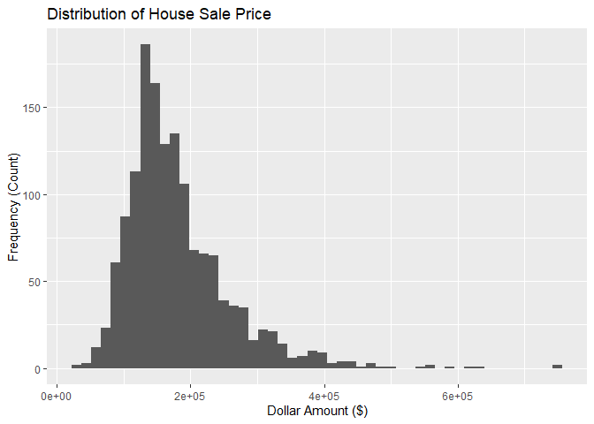
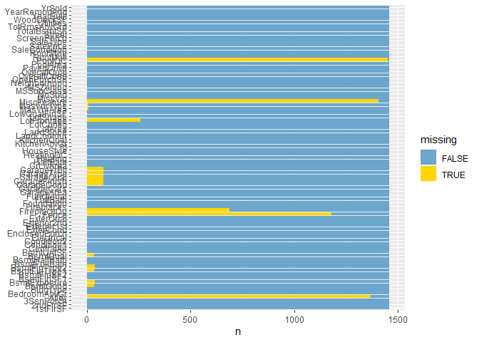
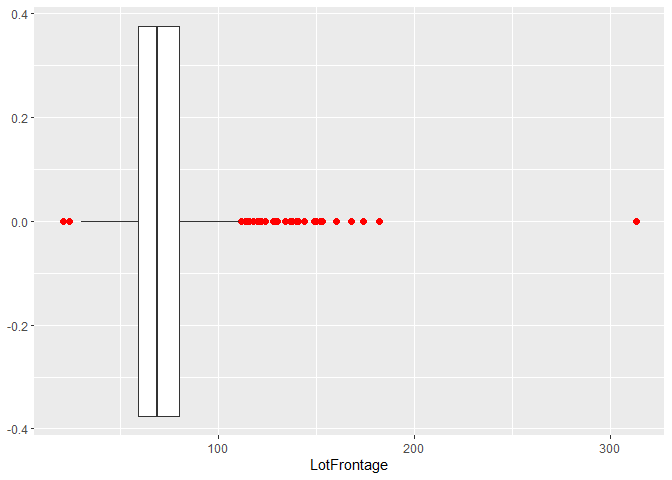
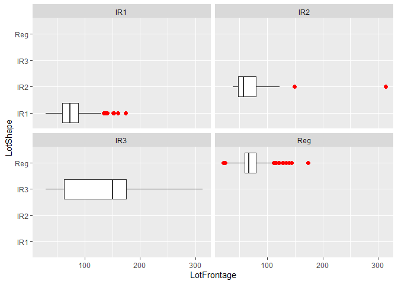

house_price_prediction
================
Akoua Orsot
03/10/2022

-   [**House Price Predictions**](#house-price-predictions)
    -   [1. Environment Set-up](#1-environment-set-up)
    -   [2. Initial Diagnostics](#2-initial-diagnostics)
    -   [3. Data Cleaning](#3-data-cleaning)

# **House Price Predictions**

Different variables come into play in appraising a house, such as the
number of bedrooms, square footage, location, and much more. So, our
task here is to build a machine learning model to make reasonably
accurate predictions in terms of pricing houses. It would be an
opportunity for those in real estate to gain more visibility on the
market as a whole. In doing so, this notebook will offer a user-friendly
explanation through every step using LIME (Local Interpretable
Model-agnostic Explanations) principles.

## 1. Environment Set-up

``` r
## Importing libraries
set.seed(1)
library(dplyr)
```

    ## 
    ## Attaching package: 'dplyr'

    ## The following objects are masked from 'package:stats':
    ## 
    ##     filter, lag

    ## The following objects are masked from 'package:base':
    ## 
    ##     intersect, setdiff, setequal, union

``` r
library(tidyverse)
```

    ## -- Attaching packages --------------------------------------- tidyverse 1.3.1 --

    ## v ggplot2 3.3.5     v purrr   0.3.4
    ## v tibble  3.1.5     v stringr 1.4.0
    ## v tidyr   1.2.0     v forcats 0.5.1
    ## v readr   2.1.2

    ## -- Conflicts ------------------------------------------ tidyverse_conflicts() --
    ## x dplyr::filter() masks stats::filter()
    ## x dplyr::lag()    masks stats::lag()

``` r
library(ggplot2)
library(VIM)        # Visualize mising values
```

    ## Loading required package: colorspace

    ## Loading required package: grid

    ## VIM is ready to use.

    ## Suggestions and bug-reports can be submitted at: https://github.com/statistikat/VIM/issues

    ## 
    ## Attaching package: 'VIM'

    ## The following object is masked from 'package:datasets':
    ## 
    ##     sleep

``` r
library(mice)          # missing data imputation
```

    ## 
    ## Attaching package: 'mice'

    ## The following object is masked from 'package:stats':
    ## 
    ##     filter

    ## The following objects are masked from 'package:base':
    ## 
    ##     cbind, rbind

``` r
library(corrplot)
```

    ## corrplot 0.92 loaded

``` r
## Loading dataset
df <- read_csv(file = 'C:/Users/Akoua Orsot/Desktop/ds_projects_data/house_prices/train.csv')
```

    ## Rows: 1460 Columns: 81

    ## -- Column specification --------------------------------------------------------
    ## Delimiter: ","
    ## chr (43): MSZoning, Street, Alley, LotShape, LandContour, Utilities, LotConf...
    ## dbl (38): Id, MSSubClass, LotFrontage, LotArea, OverallQual, OverallCond, Ye...

    ## 
    ## i Use `spec()` to retrieve the full column specification for this data.
    ## i Specify the column types or set `show_col_types = FALSE` to quiet this message.

``` r
df %>% head()
```

    ## # A tibble: 6 x 81
    ##      Id MSSubClass MSZoning LotFrontage LotArea Street Alley LotShape
    ##   <dbl>      <dbl> <chr>          <dbl>   <dbl> <chr>  <chr> <chr>   
    ## 1     1         60 RL                65    8450 Pave   <NA>  Reg     
    ## 2     2         20 RL                80    9600 Pave   <NA>  Reg     
    ## 3     3         60 RL                68   11250 Pave   <NA>  IR1     
    ## 4     4         70 RL                60    9550 Pave   <NA>  IR1     
    ## 5     5         60 RL                84   14260 Pave   <NA>  IR1     
    ## 6     6         50 RL                85   14115 Pave   <NA>  IR1     
    ## # ... with 73 more variables: LandContour <chr>, Utilities <chr>,
    ## #   LotConfig <chr>, LandSlope <chr>, Neighborhood <chr>, Condition1 <chr>,
    ## #   Condition2 <chr>, BldgType <chr>, HouseStyle <chr>, OverallQual <dbl>,
    ## #   OverallCond <dbl>, YearBuilt <dbl>, YearRemodAdd <dbl>, RoofStyle <chr>,
    ## #   RoofMatl <chr>, Exterior1st <chr>, Exterior2nd <chr>, MasVnrType <chr>,
    ## #   MasVnrArea <dbl>, ExterQual <chr>, ExterCond <chr>, Foundation <chr>,
    ## #   BsmtQual <chr>, BsmtCond <chr>, BsmtExposure <chr>, BsmtFinType1 <chr>, ...

## 2. Initial Diagnostics

``` r
## Info
df %>% str()
```

    ## spec_tbl_df [1,460 x 81] (S3: spec_tbl_df/tbl_df/tbl/data.frame)
    ##  $ Id           : num [1:1460] 1 2 3 4 5 6 7 8 9 10 ...
    ##  $ MSSubClass   : num [1:1460] 60 20 60 70 60 50 20 60 50 190 ...
    ##  $ MSZoning     : chr [1:1460] "RL" "RL" "RL" "RL" ...
    ##  $ LotFrontage  : num [1:1460] 65 80 68 60 84 85 75 NA 51 50 ...
    ##  $ LotArea      : num [1:1460] 8450 9600 11250 9550 14260 ...
    ##  $ Street       : chr [1:1460] "Pave" "Pave" "Pave" "Pave" ...
    ##  $ Alley        : chr [1:1460] NA NA NA NA ...
    ##  $ LotShape     : chr [1:1460] "Reg" "Reg" "IR1" "IR1" ...
    ##  $ LandContour  : chr [1:1460] "Lvl" "Lvl" "Lvl" "Lvl" ...
    ##  $ Utilities    : chr [1:1460] "AllPub" "AllPub" "AllPub" "AllPub" ...
    ##  $ LotConfig    : chr [1:1460] "Inside" "FR2" "Inside" "Corner" ...
    ##  $ LandSlope    : chr [1:1460] "Gtl" "Gtl" "Gtl" "Gtl" ...
    ##  $ Neighborhood : chr [1:1460] "CollgCr" "Veenker" "CollgCr" "Crawfor" ...
    ##  $ Condition1   : chr [1:1460] "Norm" "Feedr" "Norm" "Norm" ...
    ##  $ Condition2   : chr [1:1460] "Norm" "Norm" "Norm" "Norm" ...
    ##  $ BldgType     : chr [1:1460] "1Fam" "1Fam" "1Fam" "1Fam" ...
    ##  $ HouseStyle   : chr [1:1460] "2Story" "1Story" "2Story" "2Story" ...
    ##  $ OverallQual  : num [1:1460] 7 6 7 7 8 5 8 7 7 5 ...
    ##  $ OverallCond  : num [1:1460] 5 8 5 5 5 5 5 6 5 6 ...
    ##  $ YearBuilt    : num [1:1460] 2003 1976 2001 1915 2000 ...
    ##  $ YearRemodAdd : num [1:1460] 2003 1976 2002 1970 2000 ...
    ##  $ RoofStyle    : chr [1:1460] "Gable" "Gable" "Gable" "Gable" ...
    ##  $ RoofMatl     : chr [1:1460] "CompShg" "CompShg" "CompShg" "CompShg" ...
    ##  $ Exterior1st  : chr [1:1460] "VinylSd" "MetalSd" "VinylSd" "Wd Sdng" ...
    ##  $ Exterior2nd  : chr [1:1460] "VinylSd" "MetalSd" "VinylSd" "Wd Shng" ...
    ##  $ MasVnrType   : chr [1:1460] "BrkFace" "None" "BrkFace" "None" ...
    ##  $ MasVnrArea   : num [1:1460] 196 0 162 0 350 0 186 240 0 0 ...
    ##  $ ExterQual    : chr [1:1460] "Gd" "TA" "Gd" "TA" ...
    ##  $ ExterCond    : chr [1:1460] "TA" "TA" "TA" "TA" ...
    ##  $ Foundation   : chr [1:1460] "PConc" "CBlock" "PConc" "BrkTil" ...
    ##  $ BsmtQual     : chr [1:1460] "Gd" "Gd" "Gd" "TA" ...
    ##  $ BsmtCond     : chr [1:1460] "TA" "TA" "TA" "Gd" ...
    ##  $ BsmtExposure : chr [1:1460] "No" "Gd" "Mn" "No" ...
    ##  $ BsmtFinType1 : chr [1:1460] "GLQ" "ALQ" "GLQ" "ALQ" ...
    ##  $ BsmtFinSF1   : num [1:1460] 706 978 486 216 655 ...
    ##  $ BsmtFinType2 : chr [1:1460] "Unf" "Unf" "Unf" "Unf" ...
    ##  $ BsmtFinSF2   : num [1:1460] 0 0 0 0 0 0 0 32 0 0 ...
    ##  $ BsmtUnfSF    : num [1:1460] 150 284 434 540 490 64 317 216 952 140 ...
    ##  $ TotalBsmtSF  : num [1:1460] 856 1262 920 756 1145 ...
    ##  $ Heating      : chr [1:1460] "GasA" "GasA" "GasA" "GasA" ...
    ##  $ HeatingQC    : chr [1:1460] "Ex" "Ex" "Ex" "Gd" ...
    ##  $ CentralAir   : chr [1:1460] "Y" "Y" "Y" "Y" ...
    ##  $ Electrical   : chr [1:1460] "SBrkr" "SBrkr" "SBrkr" "SBrkr" ...
    ##  $ 1stFlrSF     : num [1:1460] 856 1262 920 961 1145 ...
    ##  $ 2ndFlrSF     : num [1:1460] 854 0 866 756 1053 ...
    ##  $ LowQualFinSF : num [1:1460] 0 0 0 0 0 0 0 0 0 0 ...
    ##  $ GrLivArea    : num [1:1460] 1710 1262 1786 1717 2198 ...
    ##  $ BsmtFullBath : num [1:1460] 1 0 1 1 1 1 1 1 0 1 ...
    ##  $ BsmtHalfBath : num [1:1460] 0 1 0 0 0 0 0 0 0 0 ...
    ##  $ FullBath     : num [1:1460] 2 2 2 1 2 1 2 2 2 1 ...
    ##  $ HalfBath     : num [1:1460] 1 0 1 0 1 1 0 1 0 0 ...
    ##  $ BedroomAbvGr : num [1:1460] 3 3 3 3 4 1 3 3 2 2 ...
    ##  $ KitchenAbvGr : num [1:1460] 1 1 1 1 1 1 1 1 2 2 ...
    ##  $ KitchenQual  : chr [1:1460] "Gd" "TA" "Gd" "Gd" ...
    ##  $ TotRmsAbvGrd : num [1:1460] 8 6 6 7 9 5 7 7 8 5 ...
    ##  $ Functional   : chr [1:1460] "Typ" "Typ" "Typ" "Typ" ...
    ##  $ Fireplaces   : num [1:1460] 0 1 1 1 1 0 1 2 2 2 ...
    ##  $ FireplaceQu  : chr [1:1460] NA "TA" "TA" "Gd" ...
    ##  $ GarageType   : chr [1:1460] "Attchd" "Attchd" "Attchd" "Detchd" ...
    ##  $ GarageYrBlt  : num [1:1460] 2003 1976 2001 1998 2000 ...
    ##  $ GarageFinish : chr [1:1460] "RFn" "RFn" "RFn" "Unf" ...
    ##  $ GarageCars   : num [1:1460] 2 2 2 3 3 2 2 2 2 1 ...
    ##  $ GarageArea   : num [1:1460] 548 460 608 642 836 480 636 484 468 205 ...
    ##  $ GarageQual   : chr [1:1460] "TA" "TA" "TA" "TA" ...
    ##  $ GarageCond   : chr [1:1460] "TA" "TA" "TA" "TA" ...
    ##  $ PavedDrive   : chr [1:1460] "Y" "Y" "Y" "Y" ...
    ##  $ WoodDeckSF   : num [1:1460] 0 298 0 0 192 40 255 235 90 0 ...
    ##  $ OpenPorchSF  : num [1:1460] 61 0 42 35 84 30 57 204 0 4 ...
    ##  $ EnclosedPorch: num [1:1460] 0 0 0 272 0 0 0 228 205 0 ...
    ##  $ 3SsnPorch    : num [1:1460] 0 0 0 0 0 320 0 0 0 0 ...
    ##  $ ScreenPorch  : num [1:1460] 0 0 0 0 0 0 0 0 0 0 ...
    ##  $ PoolArea     : num [1:1460] 0 0 0 0 0 0 0 0 0 0 ...
    ##  $ PoolQC       : chr [1:1460] NA NA NA NA ...
    ##  $ Fence        : chr [1:1460] NA NA NA NA ...
    ##  $ MiscFeature  : chr [1:1460] NA NA NA NA ...
    ##  $ MiscVal      : num [1:1460] 0 0 0 0 0 700 0 350 0 0 ...
    ##  $ MoSold       : num [1:1460] 2 5 9 2 12 10 8 11 4 1 ...
    ##  $ YrSold       : num [1:1460] 2008 2007 2008 2006 2008 ...
    ##  $ SaleType     : chr [1:1460] "WD" "WD" "WD" "WD" ...
    ##  $ SaleCondition: chr [1:1460] "Normal" "Normal" "Normal" "Abnorml" ...
    ##  $ SalePrice    : num [1:1460] 208500 181500 223500 140000 250000 ...
    ##  - attr(*, "spec")=
    ##   .. cols(
    ##   ..   Id = col_double(),
    ##   ..   MSSubClass = col_double(),
    ##   ..   MSZoning = col_character(),
    ##   ..   LotFrontage = col_double(),
    ##   ..   LotArea = col_double(),
    ##   ..   Street = col_character(),
    ##   ..   Alley = col_character(),
    ##   ..   LotShape = col_character(),
    ##   ..   LandContour = col_character(),
    ##   ..   Utilities = col_character(),
    ##   ..   LotConfig = col_character(),
    ##   ..   LandSlope = col_character(),
    ##   ..   Neighborhood = col_character(),
    ##   ..   Condition1 = col_character(),
    ##   ..   Condition2 = col_character(),
    ##   ..   BldgType = col_character(),
    ##   ..   HouseStyle = col_character(),
    ##   ..   OverallQual = col_double(),
    ##   ..   OverallCond = col_double(),
    ##   ..   YearBuilt = col_double(),
    ##   ..   YearRemodAdd = col_double(),
    ##   ..   RoofStyle = col_character(),
    ##   ..   RoofMatl = col_character(),
    ##   ..   Exterior1st = col_character(),
    ##   ..   Exterior2nd = col_character(),
    ##   ..   MasVnrType = col_character(),
    ##   ..   MasVnrArea = col_double(),
    ##   ..   ExterQual = col_character(),
    ##   ..   ExterCond = col_character(),
    ##   ..   Foundation = col_character(),
    ##   ..   BsmtQual = col_character(),
    ##   ..   BsmtCond = col_character(),
    ##   ..   BsmtExposure = col_character(),
    ##   ..   BsmtFinType1 = col_character(),
    ##   ..   BsmtFinSF1 = col_double(),
    ##   ..   BsmtFinType2 = col_character(),
    ##   ..   BsmtFinSF2 = col_double(),
    ##   ..   BsmtUnfSF = col_double(),
    ##   ..   TotalBsmtSF = col_double(),
    ##   ..   Heating = col_character(),
    ##   ..   HeatingQC = col_character(),
    ##   ..   CentralAir = col_character(),
    ##   ..   Electrical = col_character(),
    ##   ..   `1stFlrSF` = col_double(),
    ##   ..   `2ndFlrSF` = col_double(),
    ##   ..   LowQualFinSF = col_double(),
    ##   ..   GrLivArea = col_double(),
    ##   ..   BsmtFullBath = col_double(),
    ##   ..   BsmtHalfBath = col_double(),
    ##   ..   FullBath = col_double(),
    ##   ..   HalfBath = col_double(),
    ##   ..   BedroomAbvGr = col_double(),
    ##   ..   KitchenAbvGr = col_double(),
    ##   ..   KitchenQual = col_character(),
    ##   ..   TotRmsAbvGrd = col_double(),
    ##   ..   Functional = col_character(),
    ##   ..   Fireplaces = col_double(),
    ##   ..   FireplaceQu = col_character(),
    ##   ..   GarageType = col_character(),
    ##   ..   GarageYrBlt = col_double(),
    ##   ..   GarageFinish = col_character(),
    ##   ..   GarageCars = col_double(),
    ##   ..   GarageArea = col_double(),
    ##   ..   GarageQual = col_character(),
    ##   ..   GarageCond = col_character(),
    ##   ..   PavedDrive = col_character(),
    ##   ..   WoodDeckSF = col_double(),
    ##   ..   OpenPorchSF = col_double(),
    ##   ..   EnclosedPorch = col_double(),
    ##   ..   `3SsnPorch` = col_double(),
    ##   ..   ScreenPorch = col_double(),
    ##   ..   PoolArea = col_double(),
    ##   ..   PoolQC = col_character(),
    ##   ..   Fence = col_character(),
    ##   ..   MiscFeature = col_character(),
    ##   ..   MiscVal = col_double(),
    ##   ..   MoSold = col_double(),
    ##   ..   YrSold = col_double(),
    ##   ..   SaleType = col_character(),
    ##   ..   SaleCondition = col_character(),
    ##   ..   SalePrice = col_double()
    ##   .. )
    ##  - attr(*, "problems")=<externalptr>

**Takeaway:** From the glimpse above, we could already draw some
observations.

-   Our dataset comprises 1460 rows and 80 columns, making it relatively
    small, so we would not expect the training process o to be as
    computationally intensive.

-   For null values, most columns appear to have no missing values,
    while null values make up 80% for some of those variables. It
    indicates that we shall proceed with data cleaning and tidying
    before doing any statistical analysis or machine learning.

-   In terms of variable type, we have mostly int64, float64, and
    object. Though ‘object’ can indicate text or categorical, we will
    need to investigate further in feature engineering.

``` r
## Descriptive Statistics
df %>% summary()
```

    ##        Id           MSSubClass      MSZoning          LotFrontage    
    ##  Min.   :   1.0   Min.   : 20.0   Length:1460        Min.   : 21.00  
    ##  1st Qu.: 365.8   1st Qu.: 20.0   Class :character   1st Qu.: 59.00  
    ##  Median : 730.5   Median : 50.0   Mode  :character   Median : 69.00  
    ##  Mean   : 730.5   Mean   : 56.9                      Mean   : 70.05  
    ##  3rd Qu.:1095.2   3rd Qu.: 70.0                      3rd Qu.: 80.00  
    ##  Max.   :1460.0   Max.   :190.0                      Max.   :313.00  
    ##                                                      NA's   :259     
    ##     LotArea          Street             Alley             LotShape        
    ##  Min.   :  1300   Length:1460        Length:1460        Length:1460       
    ##  1st Qu.:  7554   Class :character   Class :character   Class :character  
    ##  Median :  9478   Mode  :character   Mode  :character   Mode  :character  
    ##  Mean   : 10517                                                           
    ##  3rd Qu.: 11602                                                           
    ##  Max.   :215245                                                           
    ##                                                                           
    ##  LandContour         Utilities          LotConfig          LandSlope        
    ##  Length:1460        Length:1460        Length:1460        Length:1460       
    ##  Class :character   Class :character   Class :character   Class :character  
    ##  Mode  :character   Mode  :character   Mode  :character   Mode  :character  
    ##                                                                             
    ##                                                                             
    ##                                                                             
    ##                                                                             
    ##  Neighborhood        Condition1         Condition2          BldgType        
    ##  Length:1460        Length:1460        Length:1460        Length:1460       
    ##  Class :character   Class :character   Class :character   Class :character  
    ##  Mode  :character   Mode  :character   Mode  :character   Mode  :character  
    ##                                                                             
    ##                                                                             
    ##                                                                             
    ##                                                                             
    ##   HouseStyle         OverallQual      OverallCond      YearBuilt   
    ##  Length:1460        Min.   : 1.000   Min.   :1.000   Min.   :1872  
    ##  Class :character   1st Qu.: 5.000   1st Qu.:5.000   1st Qu.:1954  
    ##  Mode  :character   Median : 6.000   Median :5.000   Median :1973  
    ##                     Mean   : 6.099   Mean   :5.575   Mean   :1971  
    ##                     3rd Qu.: 7.000   3rd Qu.:6.000   3rd Qu.:2000  
    ##                     Max.   :10.000   Max.   :9.000   Max.   :2010  
    ##                                                                    
    ##   YearRemodAdd   RoofStyle           RoofMatl         Exterior1st       
    ##  Min.   :1950   Length:1460        Length:1460        Length:1460       
    ##  1st Qu.:1967   Class :character   Class :character   Class :character  
    ##  Median :1994   Mode  :character   Mode  :character   Mode  :character  
    ##  Mean   :1985                                                           
    ##  3rd Qu.:2004                                                           
    ##  Max.   :2010                                                           
    ##                                                                         
    ##  Exterior2nd         MasVnrType          MasVnrArea      ExterQual        
    ##  Length:1460        Length:1460        Min.   :   0.0   Length:1460       
    ##  Class :character   Class :character   1st Qu.:   0.0   Class :character  
    ##  Mode  :character   Mode  :character   Median :   0.0   Mode  :character  
    ##                                        Mean   : 103.7                     
    ##                                        3rd Qu.: 166.0                     
    ##                                        Max.   :1600.0                     
    ##                                        NA's   :8                          
    ##   ExterCond          Foundation          BsmtQual           BsmtCond        
    ##  Length:1460        Length:1460        Length:1460        Length:1460       
    ##  Class :character   Class :character   Class :character   Class :character  
    ##  Mode  :character   Mode  :character   Mode  :character   Mode  :character  
    ##                                                                             
    ##                                                                             
    ##                                                                             
    ##                                                                             
    ##  BsmtExposure       BsmtFinType1         BsmtFinSF1     BsmtFinType2      
    ##  Length:1460        Length:1460        Min.   :   0.0   Length:1460       
    ##  Class :character   Class :character   1st Qu.:   0.0   Class :character  
    ##  Mode  :character   Mode  :character   Median : 383.5   Mode  :character  
    ##                                        Mean   : 443.6                     
    ##                                        3rd Qu.: 712.2                     
    ##                                        Max.   :5644.0                     
    ##                                                                           
    ##    BsmtFinSF2        BsmtUnfSF       TotalBsmtSF       Heating         
    ##  Min.   :   0.00   Min.   :   0.0   Min.   :   0.0   Length:1460       
    ##  1st Qu.:   0.00   1st Qu.: 223.0   1st Qu.: 795.8   Class :character  
    ##  Median :   0.00   Median : 477.5   Median : 991.5   Mode  :character  
    ##  Mean   :  46.55   Mean   : 567.2   Mean   :1057.4                     
    ##  3rd Qu.:   0.00   3rd Qu.: 808.0   3rd Qu.:1298.2                     
    ##  Max.   :1474.00   Max.   :2336.0   Max.   :6110.0                     
    ##                                                                        
    ##   HeatingQC          CentralAir         Electrical           1stFlrSF   
    ##  Length:1460        Length:1460        Length:1460        Min.   : 334  
    ##  Class :character   Class :character   Class :character   1st Qu.: 882  
    ##  Mode  :character   Mode  :character   Mode  :character   Median :1087  
    ##                                                           Mean   :1163  
    ##                                                           3rd Qu.:1391  
    ##                                                           Max.   :4692  
    ##                                                                         
    ##     2ndFlrSF     LowQualFinSF       GrLivArea     BsmtFullBath   
    ##  Min.   :   0   Min.   :  0.000   Min.   : 334   Min.   :0.0000  
    ##  1st Qu.:   0   1st Qu.:  0.000   1st Qu.:1130   1st Qu.:0.0000  
    ##  Median :   0   Median :  0.000   Median :1464   Median :0.0000  
    ##  Mean   : 347   Mean   :  5.845   Mean   :1515   Mean   :0.4253  
    ##  3rd Qu.: 728   3rd Qu.:  0.000   3rd Qu.:1777   3rd Qu.:1.0000  
    ##  Max.   :2065   Max.   :572.000   Max.   :5642   Max.   :3.0000  
    ##                                                                  
    ##   BsmtHalfBath        FullBath        HalfBath       BedroomAbvGr  
    ##  Min.   :0.00000   Min.   :0.000   Min.   :0.0000   Min.   :0.000  
    ##  1st Qu.:0.00000   1st Qu.:1.000   1st Qu.:0.0000   1st Qu.:2.000  
    ##  Median :0.00000   Median :2.000   Median :0.0000   Median :3.000  
    ##  Mean   :0.05753   Mean   :1.565   Mean   :0.3829   Mean   :2.866  
    ##  3rd Qu.:0.00000   3rd Qu.:2.000   3rd Qu.:1.0000   3rd Qu.:3.000  
    ##  Max.   :2.00000   Max.   :3.000   Max.   :2.0000   Max.   :8.000  
    ##                                                                    
    ##   KitchenAbvGr   KitchenQual         TotRmsAbvGrd     Functional       
    ##  Min.   :0.000   Length:1460        Min.   : 2.000   Length:1460       
    ##  1st Qu.:1.000   Class :character   1st Qu.: 5.000   Class :character  
    ##  Median :1.000   Mode  :character   Median : 6.000   Mode  :character  
    ##  Mean   :1.047                      Mean   : 6.518                     
    ##  3rd Qu.:1.000                      3rd Qu.: 7.000                     
    ##  Max.   :3.000                      Max.   :14.000                     
    ##                                                                        
    ##    Fireplaces    FireplaceQu         GarageType         GarageYrBlt  
    ##  Min.   :0.000   Length:1460        Length:1460        Min.   :1900  
    ##  1st Qu.:0.000   Class :character   Class :character   1st Qu.:1961  
    ##  Median :1.000   Mode  :character   Mode  :character   Median :1980  
    ##  Mean   :0.613                                         Mean   :1979  
    ##  3rd Qu.:1.000                                         3rd Qu.:2002  
    ##  Max.   :3.000                                         Max.   :2010  
    ##                                                        NA's   :81    
    ##  GarageFinish         GarageCars      GarageArea      GarageQual       
    ##  Length:1460        Min.   :0.000   Min.   :   0.0   Length:1460       
    ##  Class :character   1st Qu.:1.000   1st Qu.: 334.5   Class :character  
    ##  Mode  :character   Median :2.000   Median : 480.0   Mode  :character  
    ##                     Mean   :1.767   Mean   : 473.0                     
    ##                     3rd Qu.:2.000   3rd Qu.: 576.0                     
    ##                     Max.   :4.000   Max.   :1418.0                     
    ##                                                                        
    ##   GarageCond         PavedDrive          WoodDeckSF      OpenPorchSF    
    ##  Length:1460        Length:1460        Min.   :  0.00   Min.   :  0.00  
    ##  Class :character   Class :character   1st Qu.:  0.00   1st Qu.:  0.00  
    ##  Mode  :character   Mode  :character   Median :  0.00   Median : 25.00  
    ##                                        Mean   : 94.24   Mean   : 46.66  
    ##                                        3rd Qu.:168.00   3rd Qu.: 68.00  
    ##                                        Max.   :857.00   Max.   :547.00  
    ##                                                                         
    ##  EnclosedPorch      3SsnPorch       ScreenPorch        PoolArea      
    ##  Min.   :  0.00   Min.   :  0.00   Min.   :  0.00   Min.   :  0.000  
    ##  1st Qu.:  0.00   1st Qu.:  0.00   1st Qu.:  0.00   1st Qu.:  0.000  
    ##  Median :  0.00   Median :  0.00   Median :  0.00   Median :  0.000  
    ##  Mean   : 21.95   Mean   :  3.41   Mean   : 15.06   Mean   :  2.759  
    ##  3rd Qu.:  0.00   3rd Qu.:  0.00   3rd Qu.:  0.00   3rd Qu.:  0.000  
    ##  Max.   :552.00   Max.   :508.00   Max.   :480.00   Max.   :738.000  
    ##                                                                      
    ##     PoolQC             Fence           MiscFeature           MiscVal        
    ##  Length:1460        Length:1460        Length:1460        Min.   :    0.00  
    ##  Class :character   Class :character   Class :character   1st Qu.:    0.00  
    ##  Mode  :character   Mode  :character   Mode  :character   Median :    0.00  
    ##                                                           Mean   :   43.49  
    ##                                                           3rd Qu.:    0.00  
    ##                                                           Max.   :15500.00  
    ##                                                                             
    ##      MoSold           YrSold       SaleType         SaleCondition     
    ##  Min.   : 1.000   Min.   :2006   Length:1460        Length:1460       
    ##  1st Qu.: 5.000   1st Qu.:2007   Class :character   Class :character  
    ##  Median : 6.000   Median :2008   Mode  :character   Mode  :character  
    ##  Mean   : 6.322   Mean   :2008                                        
    ##  3rd Qu.: 8.000   3rd Qu.:2009                                        
    ##  Max.   :12.000   Max.   :2010                                        
    ##                                                                       
    ##    SalePrice     
    ##  Min.   : 34900  
    ##  1st Qu.:129975  
    ##  Median :163000  
    ##  Mean   :180921  
    ##  3rd Qu.:214000  
    ##  Max.   :755000  
    ## 

**Takeaway:** For all 80 variables, the table above captures the basic
descriptive statistics showing things like mean, standard deviation,
min, max, etc. Commenting on each variable would bring little value to
our overall analysis, and so we will zoom on the target variable
‘SalePrice’.

``` r
# Stats for the target variable
df$SalePrice %>% summary()
```

    ##    Min. 1st Qu.  Median    Mean 3rd Qu.    Max. 
    ##   34900  129975  163000  180921  214000  755000

**Takeaway:** The count indicates no null values in the column. The
houses in the dataset vary from \~USD34.9k to \~USD755k, with a mean
value of \~USD180k. With the standard deviation at \~USD79k, it appears
that prices fluctuate pretty significantly, or we may potentially have
houses with exorbitant prices (outliers) skewing the data. We will
create a histogram to look at the distribution more closely.

``` r
## Feature Variable Analysis
df %>% 
    ggplot(aes(x=SalePrice)) + 
    geom_histogram(bins = 50) +
    labs(title = "Distribution of House Sale Price",
          x = "Dollar Amount ($)", y = "Frequency (Count)")
```

<!-- -->

**Takeaway:** From the histogram above, we can deduct that house sale
prices in this dataset have a right-skewed distribution with outliers on
the upper end, indicating luxury houses with higher price points.
However, most houses appear to fall between \~USD100k and \~USD300k,
relatively consistent with real estate markets in the United States.

## 3. Data Cleaning

``` r
missvalues_visual <- 
    df  %>%
      summarise_all(list(~is.na(.)))%>%
      pivot_longer(everything(),
                   names_to = "variables", values_to="missing") %>%
      count(variables, missing) %>%
      ggplot(aes(y=variables,x=n,fill=missing))+
      geom_col()+
      scale_fill_manual(values=c("skyblue3","gold"))+
      theme(axis.title.y=element_blank())
missvalues_visual
```

<!-- -->

``` r
options(repr.plot.width = 14, repr.plot.height = 5)
```

**Takeaway:** As the plot shows above, there are indeed null values
confirming our observation in the initial diagnostics. Given that not
all variables are of the same type or the same proportion of missing
values, the cleaning process will attend to each column or group of
similar columns.

``` r
## No. of null values
null_vals <- sum(is.na(df))

# List of columns with missing values
null_cols <- which(colSums(is.na(df))>0)

# Reporting back
sprintf(fmt="We are missing %d values in our data at given percentages in the following columns:\n",
       null_vals) %>% cat()
```

    ## We are missing 6965 values in our data at given percentages in the following columns:

``` r
for (i in null_cols)
    {
    col_name <- names(df[, i])
    null_val <- sum(is.na(df[col_name]))
    null_per <- (null_val / nrow(df))*100
    sprintf(fmt = " -%s: %d (%.2f%%)\n", 
            col_name, null_val, null_per) %>% cat()
}
```

    ##  -LotFrontage: 259 (17.74%)
    ##  -Alley: 1369 (93.77%)
    ##  -MasVnrType: 8 (0.55%)
    ##  -MasVnrArea: 8 (0.55%)
    ##  -BsmtQual: 37 (2.53%)
    ##  -BsmtCond: 37 (2.53%)
    ##  -BsmtExposure: 38 (2.60%)
    ##  -BsmtFinType1: 37 (2.53%)
    ##  -BsmtFinType2: 38 (2.60%)
    ##  -Electrical: 1 (0.07%)
    ##  -FireplaceQu: 690 (47.26%)
    ##  -GarageType: 81 (5.55%)
    ##  -GarageYrBlt: 81 (5.55%)
    ##  -GarageFinish: 81 (5.55%)
    ##  -GarageQual: 81 (5.55%)
    ##  -GarageCond: 81 (5.55%)
    ##  -PoolQC: 1453 (99.52%)
    ##  -Fence: 1179 (80.75%)
    ##  -MiscFeature: 1406 (96.30%)

**Variable 1:** As per the data dictionary, ‘LotFrontage’ is the linear
feet of street connected to property. It indicates the measurement of a
piece of land (lot) often defined by frontage and depth respectively.
For instance, an house can be 50 by 150, meaning 50 feet wide (frontage)
and 150 feet long. Read more about it
[here](https://www.gimme-shelter.com/frontage-50043/). Given that
‘LotFrontage’ is one of those characteristics all houses have, the null
values indicate missing information that cannot just be equal to 0.
Since we cannot get back and fetch more data, we will use imputation
methods for this column and other ones which may require them.

**Definition:** When it comes to data science, we are constantly dealing
with imperfect information, thus murking the waters on the quality of
data overall. One of those issues is the recurrence of missing values
and requires effective techniques to deal with them. Imputation methods
present such an opportunity using strategies to replace null values with
statistical measures like mean, mode, or median. More information
[here](https://machinelearningmastery.com/statistical-imputation-for-missing-values-in-machine-learning/).

**Note:** Before proceeding to the imputation, we would like to
investigate possible differences in distribution grouped by Lot shape.

``` r
df %>% 
    ggplot(aes(x=LotFrontage)) +
    geom_boxplot(outlier.colour="red", outlier.shape=16,
     outlier.size=2) 
```

    ## Warning: Removed 259 rows containing non-finite values (stat_boxplot).

<!-- -->

``` r
df %>% 
    ggplot(aes(x=LotFrontage, y=LotShape)) +
    geom_boxplot(outlier.colour="red", outlier.shape=16,
     outlier.size=2) +
    facet_wrap("LotShape")
```

    ## Warning: Removed 259 rows containing non-finite values (stat_boxplot).

<!-- -->

``` r
sprintf(fmt = "For all houses' LotFrontage, the mean is %.2f and median is %.2f",
        mean(df$LotFrontage, na.rm=TRUE), median(df$LotFrontage, na.rm=TRUE)) %>% cat()
```

    ## For all houses' LotFrontage, the mean is 70.05 and median is 69.00

``` r
sprintf("For: \n") %>% cat()
```

    ## For:

``` r
for (i in unique(df$LotShape))
    {
    df_i <- df %>% filter(LotShape==i)
    sprintf(
            fmt = " -%s houses, the mean LotFrontage is %.2f and median LotFrontage is %.2f\n",
            i, mean(df_i$LotFrontage, na.rm=TRUE), median(df_i$LotFrontage, na.rm=TRUE)
            ) %>% cat()
}
```

    ##  -Reg houses, the mean LotFrontage is 67.04 and median LotFrontage is 67.00
    ##  -IR1 houses, the mean LotFrontage is 76.09 and median LotFrontage is 74.00
    ##  -IR2 houses, the mean LotFrontage is 76.50 and median LotFrontage is 57.50
    ##  -IR3 houses, the mean LotFrontage is 138.43 and median LotFrontage is 150.00

**Takeaway:** The boxplots indicate the presence of outliers in the data
with massive and small houses by widths. When broken down by ‘LotShape’,
we also observe a notable difference in those houses categorized as IR3,
in other words, of very irregular shape. In light of both the outliers
and category differences, we will use the median value grouped by
LotShape for the imputation process to ensure consistency in the data.
